# Opinion Poll by Ipsos, 30 November 2017

<a href="#voting-intentions">Voting Intentions</a> | <a href="#seats">Seats</a> | <a href="#coalitions">Coalitions</a> | <a href="#technical-information">Technical Information</a>

## Voting Intentions

### Confidence Intervals

| Party | Last Result | Poll Result | 80% Confidence Interval | 90% Confidence Interval | 95% Confidence Interval | 99% Confidence Interval |
|:-----:|:-----------:|:-----------:|:-----------------------:|:-----------------------:|:-----------------------:|:-----------------------:|
| Volkspartij voor Vrijheid en Democratie | 21.3% | 20.3% | 18.7–22.0% |18.3–22.5% |17.9–22.9% |17.2–23.7% |
| Partij voor de Vrijheid | 13.1% | 12.4% | 11.1–13.8% |10.8–14.2% |10.5–14.6% |9.9–15.3% |
| Democraten 66 | 12.2% | 11.6% | 10.4–13.0% |10.0–13.4% |9.8–13.7% |9.2–14.4% |
| GroenLinks | 9.1% | 9.6% | 8.5–10.9% |8.2–11.3% |7.9–11.6% |7.4–12.2% |
| Christen-Democratisch Appèl | 12.4% | 9.4% | 8.3–10.7% |8.0–11.1% |7.7–11.4% |7.2–12.0% |
| Forum voor Democratie | 1.8% | 7.5% | 6.5–8.7% |6.2–9.0% |6.0–9.3% |5.6–9.9% |
| Partij van de Arbeid | 5.7% | 6.8% | 5.9–7.9% |5.6–8.3% |5.4–8.5% |5.0–9.1% |
| Socialistische Partij | 9.1% | 6.3% | 5.4–7.4% |5.2–7.7% |5.0–8.0% |4.6–8.6% |
| Partij voor de Dieren | 3.2% | 4.0% | 3.3–4.9% |3.1–5.2% |2.9–5.4% |2.7–5.9% |
| ChristenUnie | 3.4% | 3.9% | 3.2–4.8% |3.0–5.1% |2.9–5.3% |2.6–5.8% |
| 50Plus | 3.1% | 3.6% | 2.9–4.5% |2.8–4.7% |2.6–5.0% |2.3–5.4% |
| Staatkundig Gereformeerde Partij | 2.1% | 2.1% | 1.6–2.8% |1.5–3.0% |1.4–3.2% |1.2–3.6% |
| DENK | 2.1% | 2.0% | 1.5–2.7% |1.4–2.9% |1.3–3.1% |1.1–3.4% |

*Note:* The poll result column reflects the actual value used in the calculations. Published results may vary slightly, and in addition be rounded to fewer digits.

## Seats

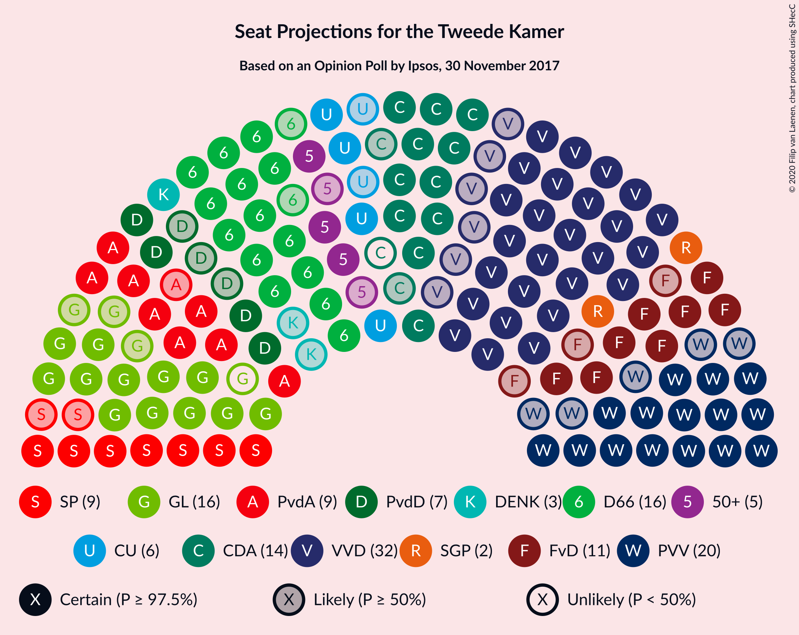

### Confidence Intervals

| Party | Last Result | Median | 80% Confidence Interval | 90% Confidence Interval | 95% Confidence Interval | 99% Confidence Interval |
|:-----:|:-----------:|:------:|:-----------------------:|:-----------------------:|:-----------------------:|:-----------------------:|
| <a href="#volkspartij-voor-vrijheid-en-democratie">Volkspartij voor Vrijheid en Democratie</a> | 33 | 32 | 28–34 |27–36 |26–36 |26–37 |
| <a href="#partij-voor-de-vrijheid">Partij voor de Vrijheid</a> | 20 | 20 | 17–21 |16–22 |15–22 |15–24 |
| <a href="#democraten-66">Democraten 66</a> | 19 | 16 | 15–19 |14–21 |14–22 |13–24 |
| <a href="#groenlinks">GroenLinks</a> | 14 | 16 | 13–17 |12–17 |11–17 |10–19 |
| <a href="#christen-democratisch-appèl">Christen-Democratisch Appèl</a> | 19 | 13 | 12–16 |12–16 |11–16 |10–19 |
| <a href="#forum-voor-democratie">Forum voor Democratie</a> | 2 | 13 | 9–13 |9–14 |9–14 |8–15 |
| <a href="#partij-van-de-arbeid">Partij van de Arbeid</a> | 9 | 9 | 8–11 |8–12 |8–13 |7–14 |
| <a href="#socialistische-partij">Socialistische Partij</a> | 14 | 10 | 8–11 |7–11 |7–12 |7–13 |
| <a href="#partij-voor-de-dieren">Partij voor de Dieren</a> | 5 | 7 | 5–8 |4–8 |4–8 |3–9 |
| <a href="#christenunie">ChristenUnie</a> | 5 | 6 | 4–7 |4–7 |4–8 |3–9 |
| <a href="#50plus">50Plus</a> | 4 | 4 | 4–6 |4–7 |4–7 |3–8 |
| <a href="#staatkundig-gereformeerde-partij">Staatkundig Gereformeerde Partij</a> | 3 | 2 | 2–4 |2–4 |2–5 |1–5 |
| <a href="#denk">DENK</a> | 3 | 3 | 2–4 |2–4 |1–5 |1–5 |

### Volkspartij voor Vrijheid en Democratie

*For a full overview of the results for this party, see the [Volkspartij voor Vrijheid en Democratie](party-volkspartijvoorvrijheidendemocratie.html) page.*

| Number of Seats | Probability | Accumulated | Special Marks |
|:---------------:|:-----------:|:-----------:|:-------------:|
| 25 | 0.2% | 100% |  |
| 26 | 4% | 99.8% |  |
| 27 | 1.3% | 96% |  |
| 28 | 8% | 95% |  |
| 29 | 9% | 87% |  |
| 30 | 5% | 78% |  |
| 31 | 11% | 73% |  |
| 32 | 48% | 62% | Median |
| 33 | 2% | 14% | Last Result |
| 34 | 3% | 12% |  |
| 35 | 1.3% | 10% |  |
| 36 | 7% | 8% |  |
| 37 | 1.0% | 1.1% |  |
| 38 | 0% | 0.1% |  |
| 39 | 0% | 0.1% |  |
| 40 | 0.1% | 0.1% |  |
| 41 | 0% | 0% |  |

### Partij voor de Vrijheid

*For a full overview of the results for this party, see the [Partij voor de Vrijheid](party-partijvoordevrijheid.html) page.*

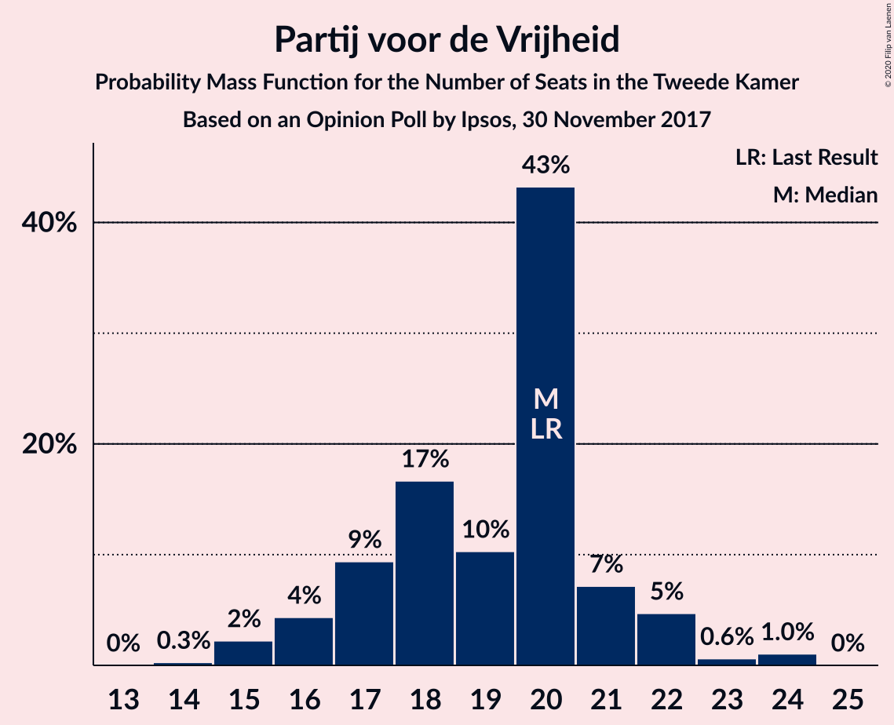

| Number of Seats | Probability | Accumulated | Special Marks |
|:---------------:|:-----------:|:-----------:|:-------------:|
| 14 | 0.1% | 100% |  |
| 15 | 3% | 99.9% |  |
| 16 | 4% | 97% |  |
| 17 | 12% | 93% |  |
| 18 | 6% | 81% |  |
| 19 | 9% | 75% |  |
| 20 | 54% | 66% | Last Result, Median |
| 21 | 4% | 12% |  |
| 22 | 6% | 8% |  |
| 23 | 0.8% | 2% |  |
| 24 | 2% | 2% |  |
| 25 | 0% | 0% |  |

### Democraten 66

*For a full overview of the results for this party, see the [Democraten 66](party-democraten66.html) page.*

| Number of Seats | Probability | Accumulated | Special Marks |
|:---------------:|:-----------:|:-----------:|:-------------:|
| 12 | 0.2% | 100% |  |
| 13 | 0.4% | 99.8% |  |
| 14 | 5% | 99.5% |  |
| 15 | 11% | 94% |  |
| 16 | 49% | 83% | Median |
| 17 | 7% | 35% |  |
| 18 | 14% | 28% |  |
| 19 | 4% | 13% | Last Result |
| 20 | 4% | 9% |  |
| 21 | 2% | 5% |  |
| 22 | 1.1% | 3% |  |
| 23 | 0.1% | 2% |  |
| 24 | 1.4% | 1.4% |  |
| 25 | 0% | 0% |  |

### GroenLinks

*For a full overview of the results for this party, see the [GroenLinks](party-groenlinks.html) page.*

| Number of Seats | Probability | Accumulated | Special Marks |
|:---------------:|:-----------:|:-----------:|:-------------:|
| 10 | 1.2% | 100% |  |
| 11 | 2% | 98.8% |  |
| 12 | 6% | 97% |  |
| 13 | 11% | 91% |  |
| 14 | 10% | 80% | Last Result |
| 15 | 12% | 69% |  |
| 16 | 42% | 58% | Median |
| 17 | 15% | 16% |  |
| 18 | 0.5% | 1.1% |  |
| 19 | 0.4% | 0.6% |  |
| 20 | 0.2% | 0.2% |  |
| 21 | 0% | 0% |  |

### Christen-Democratisch Appèl

*For a full overview of the results for this party, see the [Christen-Democratisch Appèl](party-christen-democratischappèl.html) page.*

| Number of Seats | Probability | Accumulated | Special Marks |
|:---------------:|:-----------:|:-----------:|:-------------:|
| 10 | 2% | 100% |  |
| 11 | 0.8% | 98% |  |
| 12 | 46% | 97% |  |
| 13 | 9% | 51% | Median |
| 14 | 7% | 42% |  |
| 15 | 16% | 35% |  |
| 16 | 17% | 19% |  |
| 17 | 0.4% | 2% |  |
| 18 | 0.6% | 1.2% |  |
| 19 | 0.6% | 0.6% | Last Result |
| 20 | 0% | 0% |  |

### Forum voor Democratie

*For a full overview of the results for this party, see the [Forum voor Democratie](party-forumvoordemocratie.html) page.*

| Number of Seats | Probability | Accumulated | Special Marks |
|:---------------:|:-----------:|:-----------:|:-------------:|
| 2 | 0% | 100% | Last Result |
| 3 | 0% | 100% |  |
| 4 | 0% | 100% |  |
| 5 | 0% | 100% |  |
| 6 | 0% | 100% |  |
| 7 | 0.4% | 100% |  |
| 8 | 2% | 99.6% |  |
| 9 | 9% | 98% |  |
| 10 | 5% | 89% |  |
| 11 | 15% | 84% |  |
| 12 | 13% | 68% |  |
| 13 | 47% | 55% | Median |
| 14 | 6% | 9% |  |
| 15 | 2% | 2% |  |
| 16 | 0.2% | 0.2% |  |
| 17 | 0% | 0% |  |

### Partij van de Arbeid

*For a full overview of the results for this party, see the [Partij van de Arbeid](party-partijvandearbeid.html) page.*

| Number of Seats | Probability | Accumulated | Special Marks |
|:---------------:|:-----------:|:-----------:|:-------------:|
| 7 | 0.8% | 100% |  |
| 8 | 45% | 99.2% |  |
| 9 | 26% | 54% | Last Result, Median |
| 10 | 13% | 28% |  |
| 11 | 6% | 15% |  |
| 12 | 5% | 8% |  |
| 13 | 3% | 4% |  |
| 14 | 0.5% | 0.8% |  |
| 15 | 0.3% | 0.3% |  |
| 16 | 0% | 0% |  |

### Socialistische Partij

*For a full overview of the results for this party, see the [Socialistische Partij](party-socialistischepartij.html) page.*

| Number of Seats | Probability | Accumulated | Special Marks |
|:---------------:|:-----------:|:-----------:|:-------------:|
| 6 | 0.2% | 100% |  |
| 7 | 7% | 99.8% |  |
| 8 | 14% | 92% |  |
| 9 | 15% | 79% |  |
| 10 | 15% | 63% | Median |
| 11 | 45% | 48% |  |
| 12 | 2% | 3% |  |
| 13 | 0.9% | 0.9% |  |
| 14 | 0% | 0.1% | Last Result |
| 15 | 0% | 0% |  |

### Partij voor de Dieren

*For a full overview of the results for this party, see the [Partij voor de Dieren](party-partijvoordedieren.html) page.*

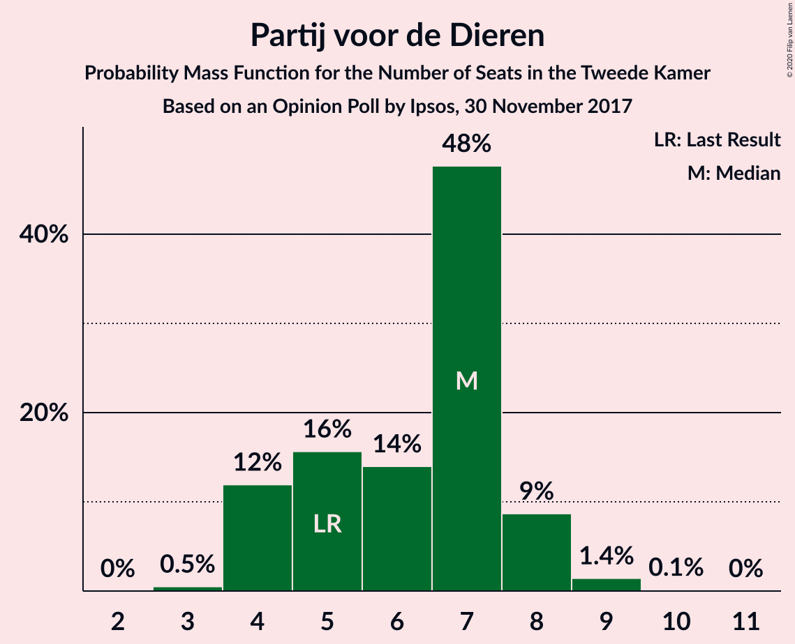

| Number of Seats | Probability | Accumulated | Special Marks |
|:---------------:|:-----------:|:-----------:|:-------------:|
| 3 | 0.7% | 100% |  |
| 4 | 5% | 99.3% |  |
| 5 | 10% | 94% | Last Result |
| 6 | 14% | 84% |  |
| 7 | 59% | 70% | Median |
| 8 | 9% | 10% |  |
| 9 | 1.0% | 1.1% |  |
| 10 | 0.1% | 0.1% |  |
| 11 | 0% | 0% |  |

### ChristenUnie

*For a full overview of the results for this party, see the [ChristenUnie](party-christenunie.html) page.*

| Number of Seats | Probability | Accumulated | Special Marks |
|:---------------:|:-----------:|:-----------:|:-------------:|
| 3 | 1.2% | 100% |  |
| 4 | 15% | 98.8% |  |
| 5 | 14% | 84% | Last Result |
| 6 | 55% | 69% | Median |
| 7 | 11% | 14% |  |
| 8 | 3% | 4% |  |
| 9 | 0.6% | 0.7% |  |
| 10 | 0% | 0% |  |

### 50Plus

*For a full overview of the results for this party, see the [50Plus](party-50plus.html) page.*

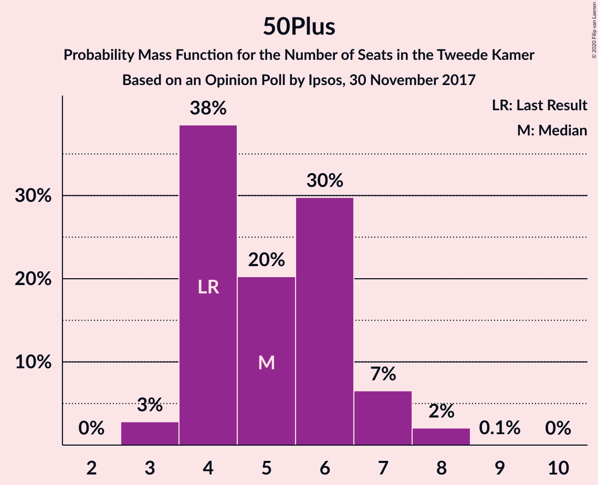

| Number of Seats | Probability | Accumulated | Special Marks |
|:---------------:|:-----------:|:-----------:|:-------------:|
| 3 | 2% | 100% |  |
| 4 | 50% | 98% | Last Result, Median |
| 5 | 13% | 48% |  |
| 6 | 29% | 36% |  |
| 7 | 6% | 7% |  |
| 8 | 0.9% | 1.0% |  |
| 9 | 0% | 0.1% |  |
| 10 | 0% | 0% |  |

### Staatkundig Gereformeerde Partij

*For a full overview of the results for this party, see the [Staatkundig Gereformeerde Partij](party-staatkundiggereformeerdepartij.html) page.*

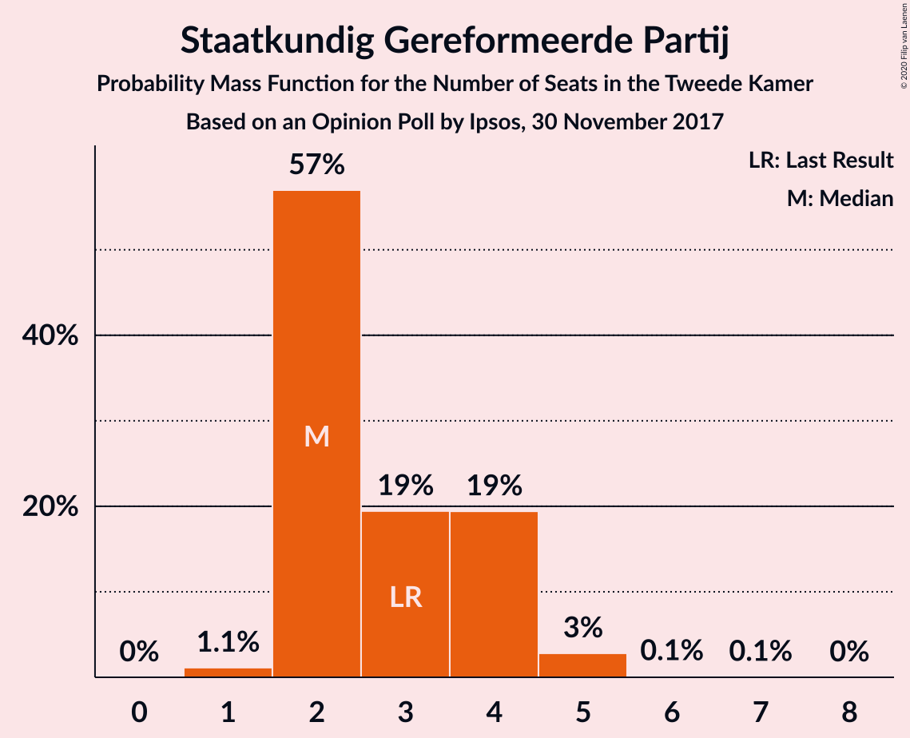

| Number of Seats | Probability | Accumulated | Special Marks |
|:---------------:|:-----------:|:-----------:|:-------------:|
| 1 | 1.1% | 100% |  |
| 2 | 72% | 98.9% | Median |
| 3 | 10% | 27% | Last Result |
| 4 | 14% | 17% |  |
| 5 | 3% | 3% |  |
| 6 | 0.1% | 0.2% |  |
| 7 | 0.1% | 0.1% |  |
| 8 | 0% | 0% |  |

### DENK

*For a full overview of the results for this party, see the [DENK](party-denk.html) page.*

| Number of Seats | Probability | Accumulated | Special Marks |
|:---------------:|:-----------:|:-----------:|:-------------:|
| 1 | 3% | 100% |  |
| 2 | 18% | 97% |  |
| 3 | 58% | 79% | Last Result, Median |
| 4 | 18% | 22% |  |
| 5 | 3% | 3% |  |
| 6 | 0.1% | 0.1% |  |
| 7 | 0% | 0% |  |

## Coalitions

### Confidence Intervals

| Coalition | Last Result | Median | Majority? | 80% Confidence Interval | 90% Confidence Interval | 95% Confidence Interval | 99% Confidence Interval |
|:---------:|:-----------:|:------:|:---------:|:-----------------------:|:-----------------------:|:-----------------------:|:-----------------------:|
| Volkspartij voor Vrijheid en Democratie – Democraten 66 – GroenLinks – Christen-Democratisch Appèl – ChristenUnie | 90 | 82 | 99.8% | 80–86 | 80–86 | 79–87 | 76–89 |
| Volkspartij voor Vrijheid en Democratie – Democraten 66 – Christen-Democratisch Appèl – Partij van de Arbeid – ChristenUnie | 85 | 74 | 38% | 74–82 | 74–83 | 73–84 | 72–85 |
| Volkspartij voor Vrijheid en Democratie – Partij voor de Vrijheid – Christen-Democratisch Appèl – Forum voor Democratie – Staatkundig Gereformeerde Partij | 77 | 79 | 89% | 75–82 | 74–83 | 73–83 | 71–86 |
| Volkspartij voor Vrijheid en Democratie – Partij voor de Vrijheid – Christen-Democratisch Appèl – Forum voor Democratie | 74 | 77 | 73% | 72–78 | 71–80 | 69–81 | 68–83 |
| Democraten 66 – GroenLinks – Christen-Democratisch Appèl – Partij van de Arbeid – Socialistische Partij – ChristenUnie | 80 | 69 | 8% | 68–74 | 67–76 | 67–78 | 64–78 |
| Volkspartij voor Vrijheid en Democratie – Democraten 66 – Christen-Democratisch Appèl – ChristenUnie | 76 | 66 | 0.2% | 65–72 | 65–73 | 64–73 | 63–74 |
| Volkspartij voor Vrijheid en Democratie – Christen-Democratisch Appèl – Forum voor Democratie – 50Plus – Staatkundig Gereformeerde Partij | 61 | 63 | 0% | 61–69 | 60–71 | 60–71 | 58–72 |
| Volkspartij voor Vrijheid en Democratie – Partij voor de Vrijheid – Christen-Democratisch Appèl | 72 | 64 | 0% | 61–69 | 60–69 | 58–70 | 57–71 |
| Volkspartij voor Vrijheid en Democratie – Democraten 66 – Christen-Democratisch Appèl | 71 | 60 | 0% | 60–66 | 60–68 | 58–69 | 56–69 |
| Democraten 66 – GroenLinks – Christen-Democratisch Appèl – Partij van de Arbeid – ChristenUnie | 66 | 59 | 0% | 58–65 | 58–66 | 57–68 | 57–70 |
| Volkspartij voor Vrijheid en Democratie – Christen-Democratisch Appèl – Forum voor Democratie – 50Plus | 58 | 61 | 0% | 59–66 | 58–67 | 56–67 | 56–69 |
| Volkspartij voor Vrijheid en Democratie – Christen-Democratisch Appèl – Forum voor Democratie – Staatkundig Gereformeerde Partij | 57 | 59 | 0% | 56–64 | 55–65 | 54–65 | 53–67 |
| Volkspartij voor Vrijheid en Democratie – Democraten 66 – Partij van de Arbeid | 61 | 56 | 0% | 55–61 | 53–63 | 53–64 | 52–65 |
| Volkspartij voor Vrijheid en Democratie – Christen-Democratisch Appèl – Forum voor Democratie | 54 | 57 | 0% | 53–61 | 52–61 | 51–63 | 50–64 |
| Volkspartij voor Vrijheid en Democratie – Christen-Democratisch Appèl – Partij van de Arbeid | 61 | 52 | 0% | 52–60 | 50–61 | 50–61 | 48–63 |
| Volkspartij voor Vrijheid en Democratie – Christen-Democratisch Appèl | 52 | 44 | 0% | 42–48 | 41–52 | 40–52 | 39–52 |
| Democraten 66 – Christen-Democratisch Appèl – Partij van de Arbeid | 47 | 39 | 0% | 36–44 | 36–45 | 36–47 | 36–48 |
| Volkspartij voor Vrijheid en Democratie – Partij van de Arbeid | 42 | 40 | 0% | 37–45 | 37–45 | 35–46 | 34–48 |
| Democraten 66 – Christen-Democratisch Appèl | 38 | 30 | 0% | 28–34 | 28–36 | 28–37 | 26–39 |
| Christen-Democratisch Appèl – Partij van de Arbeid – ChristenUnie | 33 | 28 | 0% | 26–32 | 26–33 | 25–34 | 24–36 |
| Christen-Democratisch Appèl – Partij van de Arbeid | 28 | 22 | 0% | 20–26 | 20–26 | 20–27 | 19–29 |

### Volkspartij voor Vrijheid en Democratie – Democraten 66 – GroenLinks – Christen-Democratisch Appèl – ChristenUnie

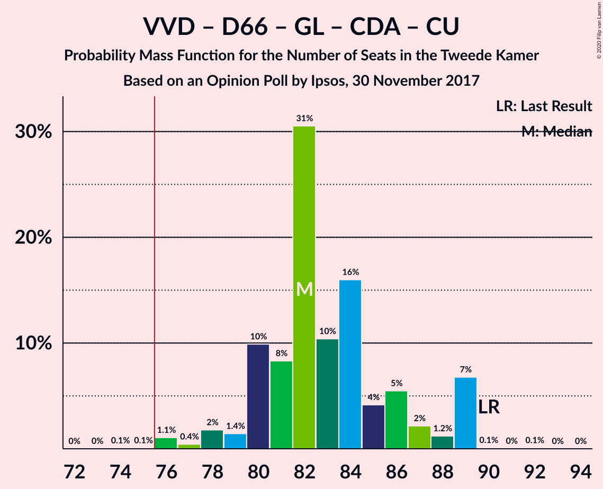

| Number of Seats | Probability | Accumulated | Special Marks |
|:---------------:|:-----------:|:-----------:|:-------------:|
| 74 | 0.1% | 100% |  |
| 75 | 0.1% | 99.9% |  |
| 76 | 0.5% | 99.8% | Majority |
| 77 | 0.1% | 99.4% |  |
| 78 | 0.6% | 99.2% |  |
| 79 | 2% | 98.6% |  |
| 80 | 13% | 97% |  |
| 81 | 8% | 84% |  |
| 82 | 51% | 76% |  |
| 83 | 3% | 25% | Median |
| 84 | 6% | 21% |  |
| 85 | 3% | 16% |  |
| 86 | 8% | 12% |  |
| 87 | 4% | 5% |  |
| 88 | 0.5% | 1.4% |  |
| 89 | 0.6% | 0.9% |  |
| 90 | 0.1% | 0.3% | Last Result |
| 91 | 0% | 0.2% |  |
| 92 | 0.2% | 0.2% |  |
| 93 | 0% | 0% |  |

### Volkspartij voor Vrijheid en Democratie – Democraten 66 – Christen-Democratisch Appèl – Partij van de Arbeid – ChristenUnie

| Number of Seats | Probability | Accumulated | Special Marks |
|:---------------:|:-----------:|:-----------:|:-------------:|
| 71 | 0.2% | 100% |  |
| 72 | 0.3% | 99.8% |  |
| 73 | 2% | 99.5% |  |
| 74 | 48% | 97% |  |
| 75 | 11% | 49% |  |
| 76 | 4% | 38% | Median, Majority |
| 77 | 6% | 34% |  |
| 78 | 3% | 28% |  |
| 79 | 3% | 26% |  |
| 80 | 8% | 23% |  |
| 81 | 2% | 15% |  |
| 82 | 7% | 13% |  |
| 83 | 2% | 6% |  |
| 84 | 3% | 4% |  |
| 85 | 0.5% | 0.6% | Last Result |
| 86 | 0.1% | 0.1% |  |
| 87 | 0% | 0% |  |

### Volkspartij voor Vrijheid en Democratie – Partij voor de Vrijheid – Christen-Democratisch Appèl – Forum voor Democratie – Staatkundig Gereformeerde Partij

| Number of Seats | Probability | Accumulated | Special Marks |
|:---------------:|:-----------:|:-----------:|:-------------:|
| 69 | 0% | 100% |  |
| 70 | 0.1% | 99.9% |  |
| 71 | 1.4% | 99.9% |  |
| 72 | 0.3% | 98% |  |
| 73 | 3% | 98% |  |
| 74 | 4% | 95% |  |
| 75 | 3% | 92% |  |
| 76 | 4% | 89% | Majority |
| 77 | 8% | 85% | Last Result |
| 78 | 6% | 77% |  |
| 79 | 49% | 71% |  |
| 80 | 5% | 22% | Median |
| 81 | 3% | 17% |  |
| 82 | 9% | 14% |  |
| 83 | 4% | 6% |  |
| 84 | 0.5% | 2% |  |
| 85 | 0.1% | 2% |  |
| 86 | 1.4% | 1.4% |  |
| 87 | 0% | 0% |  |

### Volkspartij voor Vrijheid en Democratie – Partij voor de Vrijheid – Christen-Democratisch Appèl – Forum voor Democratie

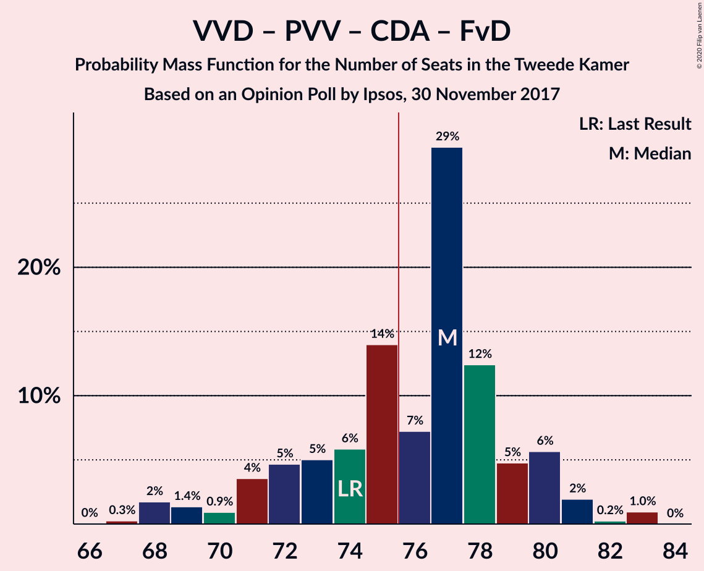

| Number of Seats | Probability | Accumulated | Special Marks |
|:---------------:|:-----------:|:-----------:|:-------------:|
| 67 | 0% | 100% |  |
| 68 | 2% | 99.9% |  |
| 69 | 2% | 98% |  |
| 70 | 0.7% | 96% |  |
| 71 | 1.4% | 96% |  |
| 72 | 6% | 94% |  |
| 73 | 4% | 89% |  |
| 74 | 6% | 85% | Last Result |
| 75 | 5% | 79% |  |
| 76 | 4% | 73% | Majority |
| 77 | 50% | 69% |  |
| 78 | 10% | 19% | Median |
| 79 | 1.3% | 9% |  |
| 80 | 3% | 8% |  |
| 81 | 3% | 5% |  |
| 82 | 0.1% | 2% |  |
| 83 | 1.5% | 1.5% |  |
| 84 | 0% | 0% |  |

### Democraten 66 – GroenLinks – Christen-Democratisch Appèl – Partij van de Arbeid – Socialistische Partij – ChristenUnie

| Number of Seats | Probability | Accumulated | Special Marks |
|:---------------:|:-----------:|:-----------:|:-------------:|
| 64 | 2% | 100% |  |
| 65 | 0.1% | 98% |  |
| 66 | 0.3% | 98% |  |
| 67 | 5% | 98% |  |
| 68 | 7% | 93% |  |
| 69 | 61% | 86% |  |
| 70 | 3% | 25% | Median |
| 71 | 2% | 22% |  |
| 72 | 4% | 20% |  |
| 73 | 3% | 16% |  |
| 74 | 4% | 13% |  |
| 75 | 0.9% | 9% |  |
| 76 | 3% | 8% | Majority |
| 77 | 0.7% | 5% |  |
| 78 | 4% | 4% |  |
| 79 | 0% | 0.1% |  |
| 80 | 0% | 0% | Last Result |

### Volkspartij voor Vrijheid en Democratie – Democraten 66 – Christen-Democratisch Appèl – ChristenUnie

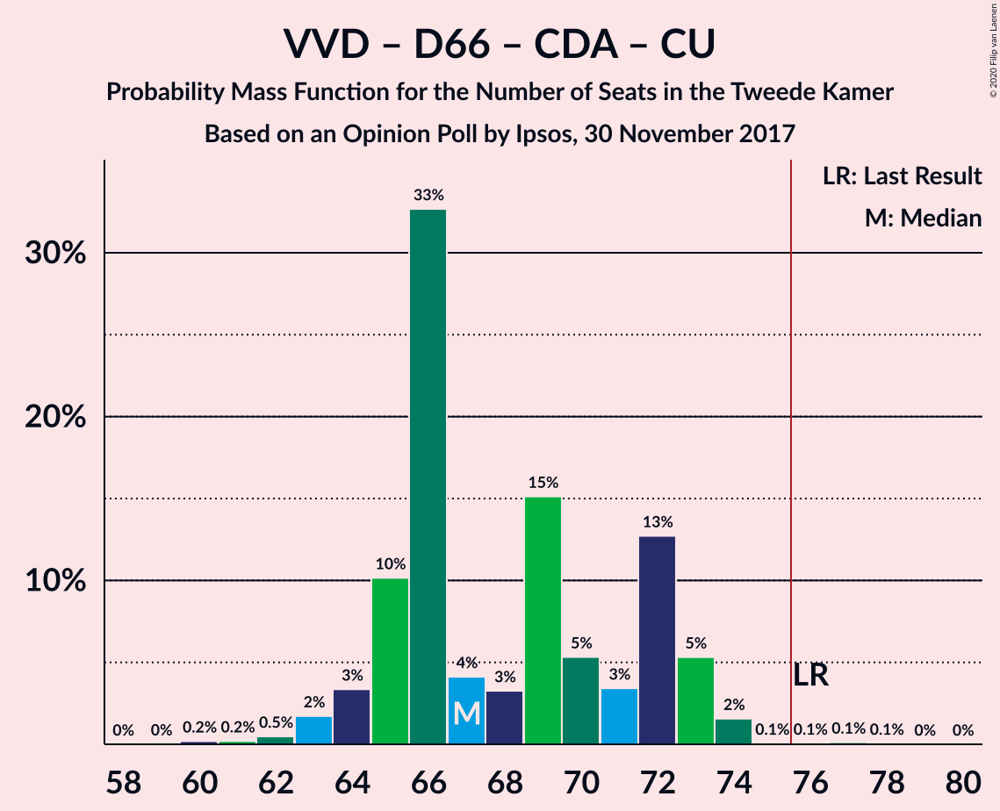

| Number of Seats | Probability | Accumulated | Special Marks |
|:---------------:|:-----------:|:-----------:|:-------------:|
| 61 | 0.2% | 100% |  |
| 62 | 0.2% | 99.8% |  |
| 63 | 2% | 99.6% |  |
| 64 | 2% | 98% |  |
| 65 | 14% | 96% |  |
| 66 | 49% | 82% |  |
| 67 | 4% | 33% | Median |
| 68 | 1.4% | 29% |  |
| 69 | 9% | 28% |  |
| 70 | 3% | 19% |  |
| 71 | 5% | 16% |  |
| 72 | 2% | 12% |  |
| 73 | 7% | 9% |  |
| 74 | 2% | 2% |  |
| 75 | 0.1% | 0.3% |  |
| 76 | 0.1% | 0.2% | Last Result, Majority |
| 77 | 0.1% | 0.1% |  |
| 78 | 0.1% | 0.1% |  |
| 79 | 0% | 0% |  |

### Volkspartij voor Vrijheid en Democratie – Christen-Democratisch Appèl – Forum voor Democratie – 50Plus – Staatkundig Gereformeerde Partij

| Number of Seats | Probability | Accumulated | Special Marks |
|:---------------:|:-----------:|:-----------:|:-------------:|
| 55 | 0.1% | 100% |  |
| 56 | 0.1% | 99.9% |  |
| 57 | 0.1% | 99.8% |  |
| 58 | 0.9% | 99.7% |  |
| 59 | 0.3% | 98.8% |  |
| 60 | 4% | 98.5% |  |
| 61 | 5% | 94% | Last Result |
| 62 | 4% | 90% |  |
| 63 | 46% | 85% |  |
| 64 | 8% | 39% | Median |
| 65 | 9% | 31% |  |
| 66 | 1.1% | 22% |  |
| 67 | 3% | 20% |  |
| 68 | 6% | 17% |  |
| 69 | 5% | 12% |  |
| 70 | 0.2% | 7% |  |
| 71 | 5% | 6% |  |
| 72 | 1.4% | 1.4% |  |
| 73 | 0% | 0% |  |

### Volkspartij voor Vrijheid en Democratie – Partij voor de Vrijheid – Christen-Democratisch Appèl

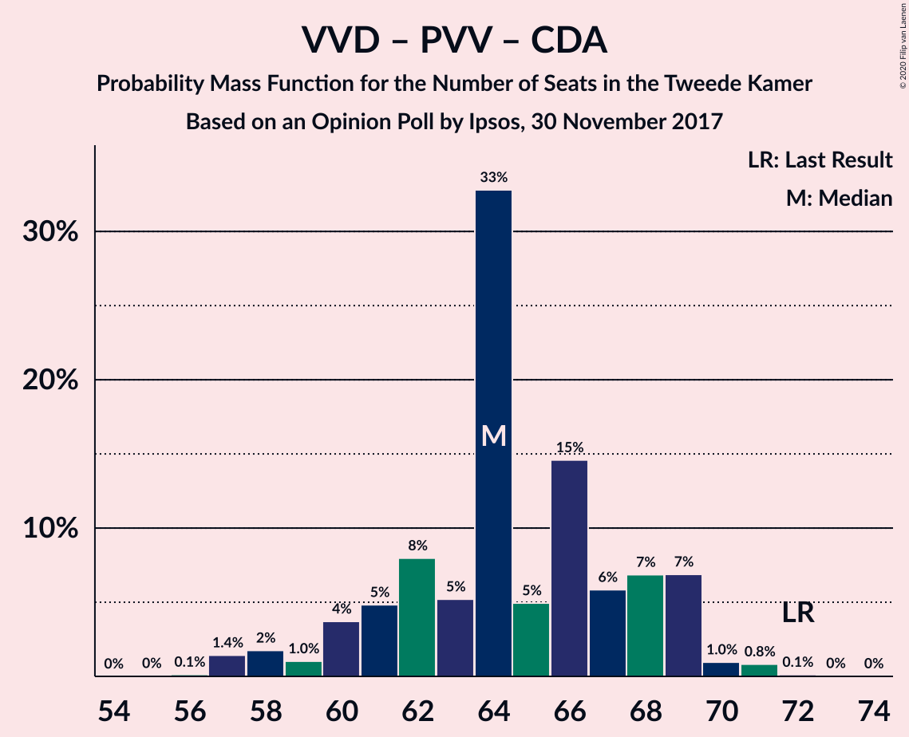

| Number of Seats | Probability | Accumulated | Special Marks |
|:---------------:|:-----------:|:-----------:|:-------------:|
| 56 | 0% | 100% |  |
| 57 | 0.6% | 99.9% |  |
| 58 | 2% | 99.3% |  |
| 59 | 0.9% | 97% |  |
| 60 | 5% | 96% |  |
| 61 | 2% | 91% |  |
| 62 | 9% | 89% |  |
| 63 | 7% | 79% |  |
| 64 | 41% | 72% |  |
| 65 | 3% | 31% | Median |
| 66 | 17% | 28% |  |
| 67 | 0.6% | 11% |  |
| 68 | 0.4% | 10% |  |
| 69 | 7% | 10% |  |
| 70 | 1.5% | 3% |  |
| 71 | 1.5% | 2% |  |
| 72 | 0% | 0.1% | Last Result |
| 73 | 0.1% | 0.1% |  |
| 74 | 0% | 0% |  |

### Volkspartij voor Vrijheid en Democratie – Democraten 66 – Christen-Democratisch Appèl

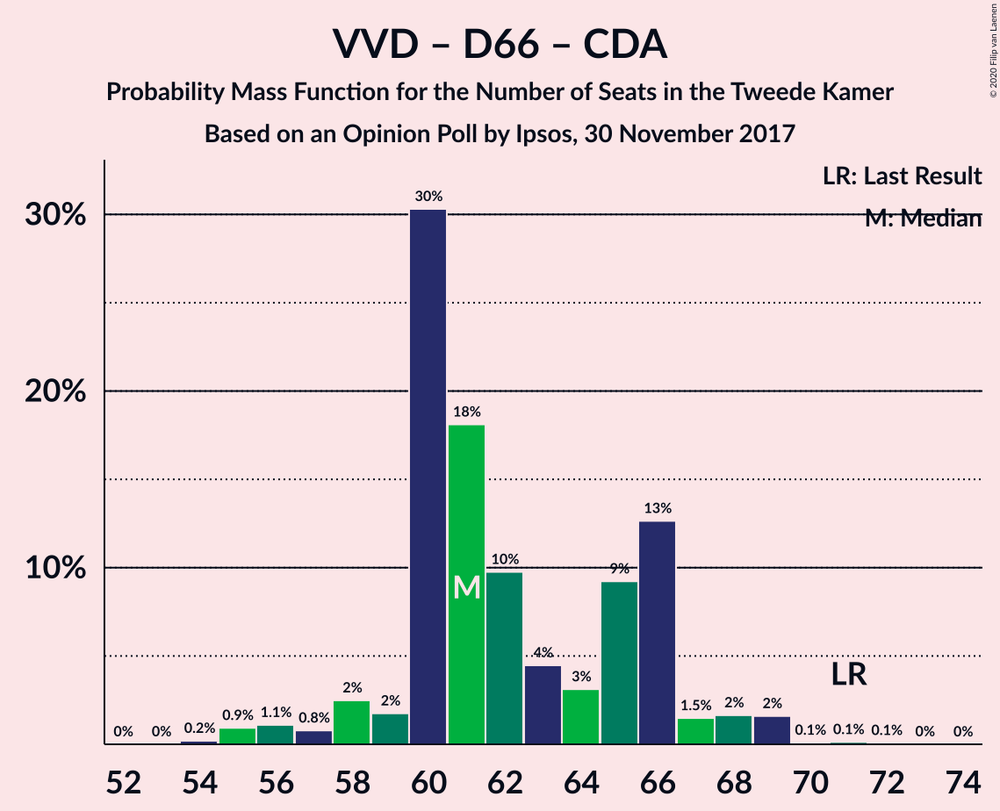

| Number of Seats | Probability | Accumulated | Special Marks |
|:---------------:|:-----------:|:-----------:|:-------------:|
| 54 | 0.1% | 100% |  |
| 55 | 0.1% | 99.9% |  |
| 56 | 2% | 99.8% |  |
| 57 | 0.6% | 98% |  |
| 58 | 1.4% | 98% |  |
| 59 | 1.1% | 96% |  |
| 60 | 50% | 95% |  |
| 61 | 13% | 45% | Median |
| 62 | 6% | 32% |  |
| 63 | 5% | 26% |  |
| 64 | 4% | 21% |  |
| 65 | 6% | 17% |  |
| 66 | 5% | 12% |  |
| 67 | 1.3% | 6% |  |
| 68 | 2% | 5% |  |
| 69 | 2% | 3% |  |
| 70 | 0.2% | 0.3% |  |
| 71 | 0.2% | 0.2% | Last Result |
| 72 | 0% | 0% |  |

### Democraten 66 – GroenLinks – Christen-Democratisch Appèl – Partij van de Arbeid – ChristenUnie

| Number of Seats | Probability | Accumulated | Special Marks |
|:---------------:|:-----------:|:-----------:|:-------------:|
| 53 | 0.1% | 100% |  |
| 54 | 0% | 99.9% |  |
| 55 | 0.1% | 99.9% |  |
| 56 | 0.2% | 99.8% |  |
| 57 | 3% | 99.5% |  |
| 58 | 42% | 97% |  |
| 59 | 9% | 55% |  |
| 60 | 12% | 46% | Median |
| 61 | 14% | 34% |  |
| 62 | 3% | 20% |  |
| 63 | 4% | 17% |  |
| 64 | 3% | 13% |  |
| 65 | 3% | 10% |  |
| 66 | 4% | 7% | Last Result |
| 67 | 0.9% | 4% |  |
| 68 | 1.5% | 3% |  |
| 69 | 0.4% | 1.4% |  |
| 70 | 1.0% | 1.0% |  |
| 71 | 0% | 0% |  |

### Volkspartij voor Vrijheid en Democratie – Christen-Democratisch Appèl – Forum voor Democratie – 50Plus

| Number of Seats | Probability | Accumulated | Special Marks |
|:---------------:|:-----------:|:-----------:|:-------------:|
| 52 | 0.1% | 100% |  |
| 53 | 0.1% | 99.9% |  |
| 54 | 0.1% | 99.9% |  |
| 55 | 0.2% | 99.8% |  |
| 56 | 3% | 99.6% |  |
| 57 | 0.7% | 97% |  |
| 58 | 5% | 96% | Last Result |
| 59 | 7% | 91% |  |
| 60 | 3% | 84% |  |
| 61 | 45% | 81% |  |
| 62 | 8% | 36% | Median |
| 63 | 8% | 28% |  |
| 64 | 4% | 20% |  |
| 65 | 3% | 16% |  |
| 66 | 3% | 13% |  |
| 67 | 8% | 10% |  |
| 68 | 0.1% | 2% |  |
| 69 | 2% | 2% |  |
| 70 | 0% | 0% |  |

### Volkspartij voor Vrijheid en Democratie – Christen-Democratisch Appèl – Forum voor Democratie – Staatkundig Gereformeerde Partij

| Number of Seats | Probability | Accumulated | Special Marks |
|:---------------:|:-----------:|:-----------:|:-------------:|
| 51 | 0.1% | 100% |  |
| 52 | 0.3% | 99.9% |  |
| 53 | 1.4% | 99.6% |  |
| 54 | 0.8% | 98% |  |
| 55 | 6% | 97% |  |
| 56 | 1.1% | 91% |  |
| 57 | 10% | 90% | Last Result |
| 58 | 8% | 80% |  |
| 59 | 48% | 72% |  |
| 60 | 1.2% | 24% | Median |
| 61 | 3% | 22% |  |
| 62 | 5% | 20% |  |
| 63 | 3% | 15% |  |
| 64 | 4% | 12% |  |
| 65 | 6% | 8% |  |
| 66 | 0.4% | 2% |  |
| 67 | 1.4% | 1.4% |  |
| 68 | 0% | 0% |  |

### Volkspartij voor Vrijheid en Democratie – Democraten 66 – Partij van de Arbeid

| Number of Seats | Probability | Accumulated | Special Marks |
|:---------------:|:-----------:|:-----------:|:-------------:|
| 51 | 0.1% | 100% |  |
| 52 | 0.4% | 99.9% |  |
| 53 | 5% | 99.5% |  |
| 54 | 2% | 95% |  |
| 55 | 12% | 93% |  |
| 56 | 43% | 80% |  |
| 57 | 6% | 38% | Median |
| 58 | 3% | 31% |  |
| 59 | 11% | 29% |  |
| 60 | 3% | 18% |  |
| 61 | 5% | 14% | Last Result |
| 62 | 4% | 10% |  |
| 63 | 2% | 6% |  |
| 64 | 3% | 4% |  |
| 65 | 1.2% | 1.4% |  |
| 66 | 0.1% | 0.2% |  |
| 67 | 0% | 0.2% |  |
| 68 | 0% | 0.1% |  |
| 69 | 0.1% | 0.1% |  |
| 70 | 0% | 0% |  |

### Volkspartij voor Vrijheid en Democratie – Christen-Democratisch Appèl – Forum voor Democratie

| Number of Seats | Probability | Accumulated | Special Marks |
|:---------------:|:-----------:|:-----------:|:-------------:|
| 48 | 0.1% | 100% |  |
| 49 | 0.1% | 99.9% |  |
| 50 | 0.9% | 99.8% |  |
| 51 | 3% | 98.9% |  |
| 52 | 1.4% | 96% |  |
| 53 | 7% | 94% |  |
| 54 | 3% | 88% | Last Result |
| 55 | 8% | 85% |  |
| 56 | 7% | 76% |  |
| 57 | 48% | 69% |  |
| 58 | 3% | 21% | Median |
| 59 | 1.3% | 19% |  |
| 60 | 5% | 18% |  |
| 61 | 8% | 12% |  |
| 62 | 1.2% | 4% |  |
| 63 | 1.2% | 3% |  |
| 64 | 2% | 2% |  |
| 65 | 0% | 0% |  |

### Volkspartij voor Vrijheid en Democratie – Christen-Democratisch Appèl – Partij van de Arbeid

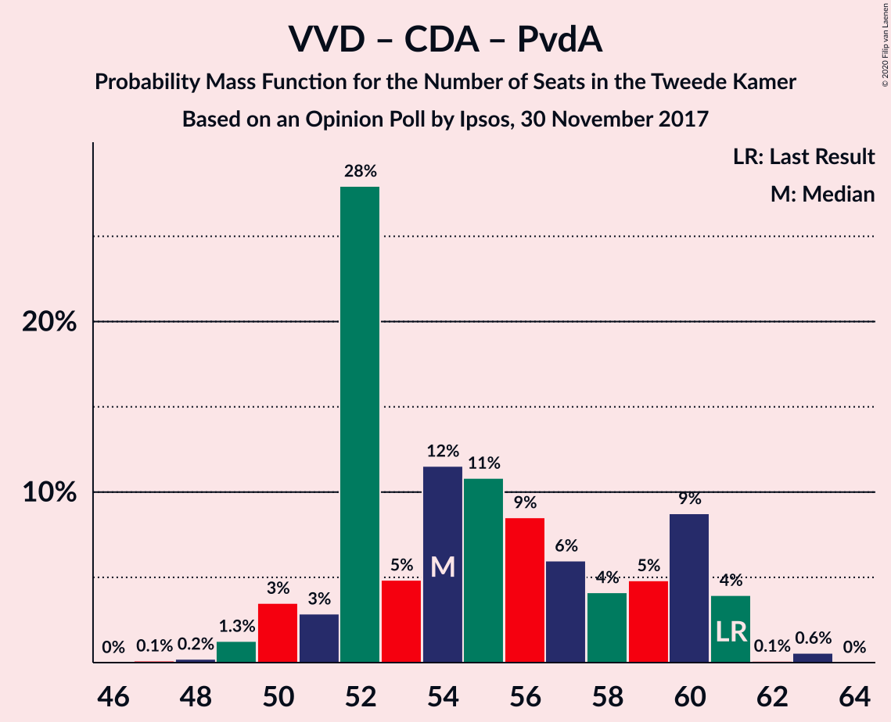

| Number of Seats | Probability | Accumulated | Special Marks |
|:---------------:|:-----------:|:-----------:|:-------------:|
| 47 | 0.2% | 100% |  |
| 48 | 0.3% | 99.8% |  |
| 49 | 1.1% | 99.5% |  |
| 50 | 4% | 98% |  |
| 51 | 4% | 95% |  |
| 52 | 44% | 91% |  |
| 53 | 8% | 46% |  |
| 54 | 5% | 39% | Median |
| 55 | 11% | 34% |  |
| 56 | 5% | 23% |  |
| 57 | 4% | 19% |  |
| 58 | 3% | 15% |  |
| 59 | 0.6% | 11% |  |
| 60 | 3% | 11% |  |
| 61 | 7% | 8% | Last Result |
| 62 | 0.1% | 1.1% |  |
| 63 | 1.0% | 1.0% |  |
| 64 | 0% | 0% |  |

### Volkspartij voor Vrijheid en Democratie – Christen-Democratisch Appèl

| Number of Seats | Probability | Accumulated | Special Marks |
|:---------------:|:-----------:|:-----------:|:-------------:|
| 37 | 0.1% | 100% |  |
| 38 | 0.2% | 99.9% |  |
| 39 | 0.5% | 99.7% |  |
| 40 | 2% | 99.3% |  |
| 41 | 4% | 97% |  |
| 42 | 11% | 94% |  |
| 43 | 2% | 82% |  |
| 44 | 44% | 80% |  |
| 45 | 5% | 36% | Median |
| 46 | 12% | 31% |  |
| 47 | 6% | 18% |  |
| 48 | 2% | 12% |  |
| 49 | 0.6% | 9% |  |
| 50 | 2% | 9% |  |
| 51 | 0.2% | 7% |  |
| 52 | 7% | 7% | Last Result |
| 53 | 0.1% | 0.1% |  |
| 54 | 0% | 0% |  |

### Democraten 66 – Christen-Democratisch Appèl – Partij van de Arbeid

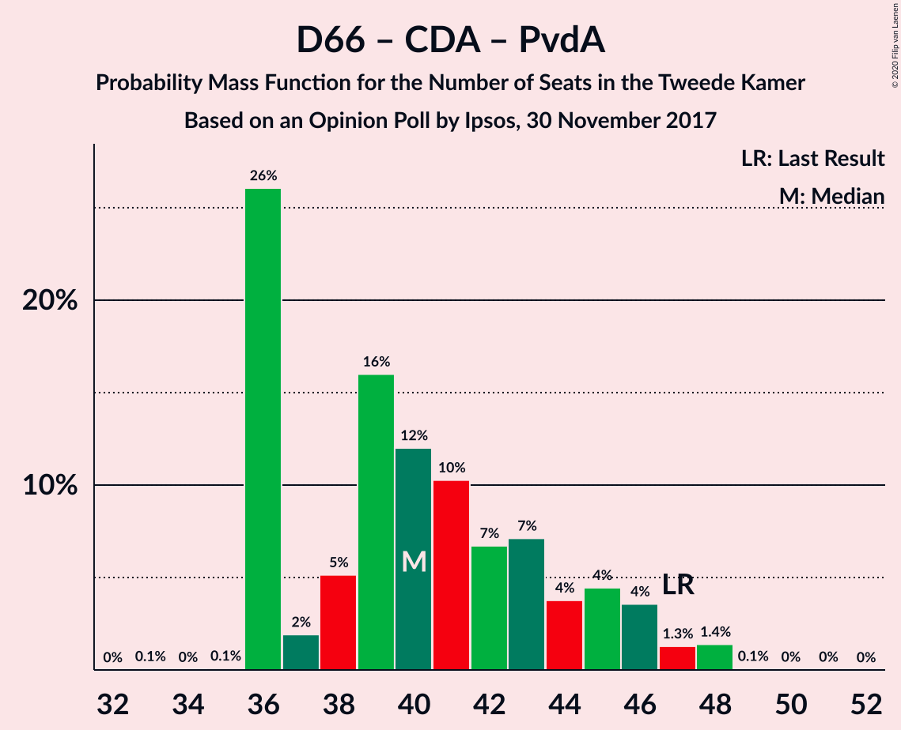

| Number of Seats | Probability | Accumulated | Special Marks |
|:---------------:|:-----------:|:-----------:|:-------------:|
| 35 | 0.1% | 100% |  |
| 36 | 39% | 99.8% |  |
| 37 | 0.8% | 61% |  |
| 38 | 4% | 60% | Median |
| 39 | 14% | 56% |  |
| 40 | 5% | 42% |  |
| 41 | 13% | 37% |  |
| 42 | 6% | 24% |  |
| 43 | 7% | 18% |  |
| 44 | 3% | 11% |  |
| 45 | 4% | 8% |  |
| 46 | 1.0% | 4% |  |
| 47 | 0.8% | 3% | Last Result |
| 48 | 2% | 2% |  |
| 49 | 0.1% | 0.1% |  |
| 50 | 0% | 0% |  |

### Volkspartij voor Vrijheid en Democratie – Partij van de Arbeid

| Number of Seats | Probability | Accumulated | Special Marks |
|:---------------:|:-----------:|:-----------:|:-------------:|
| 34 | 0.5% | 100% |  |
| 35 | 3% | 99.5% |  |
| 36 | 0.5% | 96% |  |
| 37 | 8% | 96% |  |
| 38 | 2% | 88% |  |
| 39 | 6% | 85% |  |
| 40 | 51% | 79% |  |
| 41 | 5% | 28% | Median |
| 42 | 5% | 23% | Last Result |
| 43 | 3% | 18% |  |
| 44 | 3% | 15% |  |
| 45 | 8% | 11% |  |
| 46 | 1.1% | 4% |  |
| 47 | 1.4% | 2% |  |
| 48 | 0.9% | 1.0% |  |
| 49 | 0% | 0.1% |  |
| 50 | 0% | 0.1% |  |
| 51 | 0.1% | 0.1% |  |
| 52 | 0% | 0% |  |

### Democraten 66 – Christen-Democratisch Appèl

| Number of Seats | Probability | Accumulated | Special Marks |
|:---------------:|:-----------:|:-----------:|:-------------:|
| 25 | 0% | 100% |  |
| 26 | 0.8% | 99.9% |  |
| 27 | 0.9% | 99.2% |  |
| 28 | 40% | 98% |  |
| 29 | 3% | 58% | Median |
| 30 | 21% | 55% |  |
| 31 | 7% | 34% |  |
| 32 | 9% | 27% |  |
| 33 | 8% | 18% |  |
| 34 | 5% | 10% |  |
| 35 | 0.5% | 6% |  |
| 36 | 2% | 5% |  |
| 37 | 2% | 3% |  |
| 38 | 0.1% | 2% | Last Result |
| 39 | 1.4% | 1.4% |  |
| 40 | 0% | 0% |  |

### Christen-Democratisch Appèl – Partij van de Arbeid – ChristenUnie

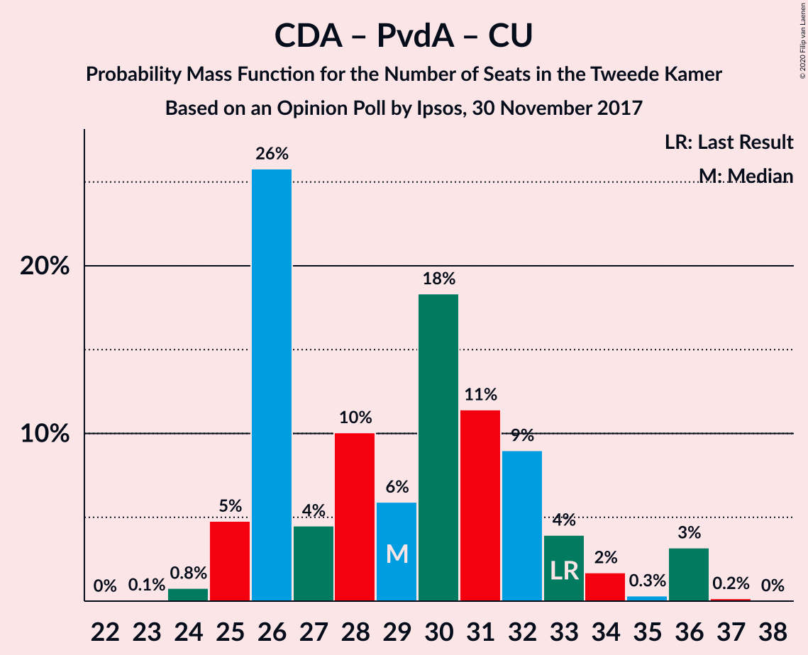

| Number of Seats | Probability | Accumulated | Special Marks |
|:---------------:|:-----------:|:-----------:|:-------------:|
| 23 | 0% | 100% |  |
| 24 | 1.4% | 99.9% |  |
| 25 | 2% | 98.5% |  |
| 26 | 40% | 97% |  |
| 27 | 4% | 57% |  |
| 28 | 15% | 53% | Median |
| 29 | 7% | 38% |  |
| 30 | 8% | 31% |  |
| 31 | 9% | 24% |  |
| 32 | 9% | 15% |  |
| 33 | 3% | 6% | Last Result |
| 34 | 2% | 3% |  |
| 35 | 0.2% | 0.8% |  |
| 36 | 0.5% | 0.6% |  |
| 37 | 0% | 0.1% |  |
| 38 | 0% | 0.1% |  |
| 39 | 0% | 0% |  |

### Christen-Democratisch Appèl – Partij van de Arbeid

| Number of Seats | Probability | Accumulated | Special Marks |
|:---------------:|:-----------:|:-----------:|:-------------:|
| 19 | 2% | 100% |  |
| 20 | 41% | 98% |  |
| 21 | 2% | 58% |  |
| 22 | 6% | 55% | Median |
| 23 | 6% | 49% |  |
| 24 | 13% | 43% |  |
| 25 | 17% | 30% |  |
| 26 | 8% | 13% |  |
| 27 | 2% | 4% |  |
| 28 | 0.5% | 2% | Last Result |
| 29 | 1.1% | 1.2% |  |
| 30 | 0.1% | 0.1% |  |
| 31 | 0% | 0% |  |

## Technical Information

### Opinion Poll

+ **Polling firm:** Ipsos
+ **Commissioner(s):** —
+ **Fieldwork period:** 30 November 2017

### Calculations

+ **Sample size:** 1000
+ **Simulations done:** 524,288
+ **Error estimate:** 1.68%

