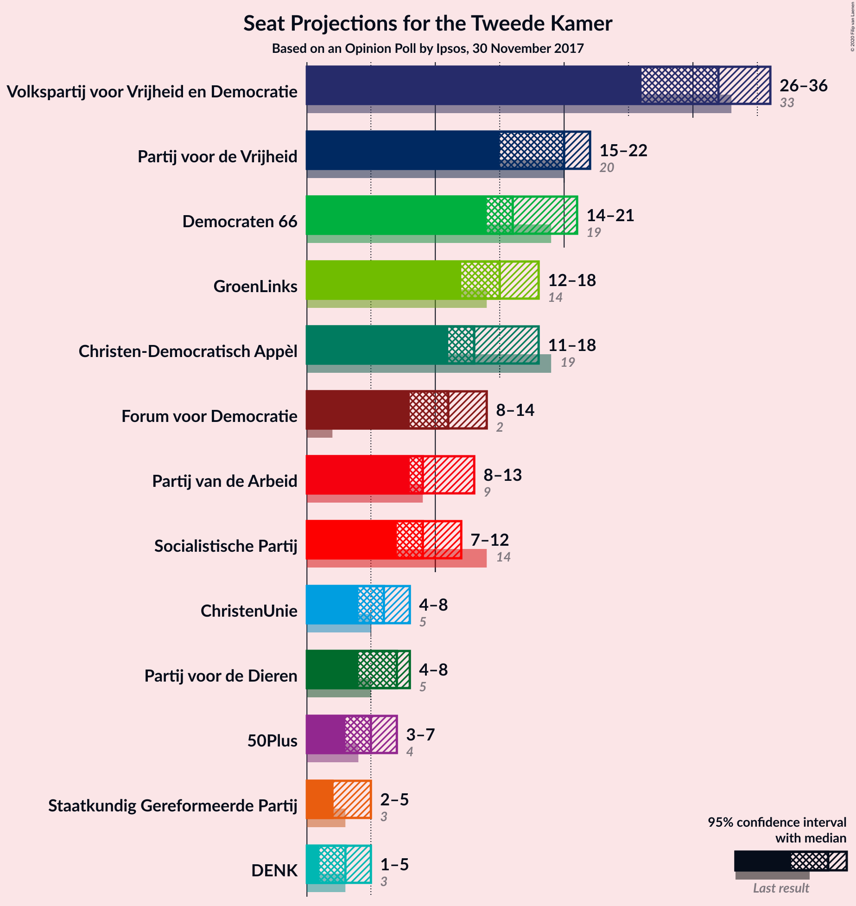
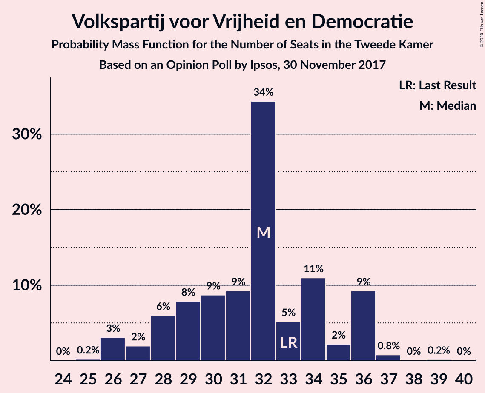
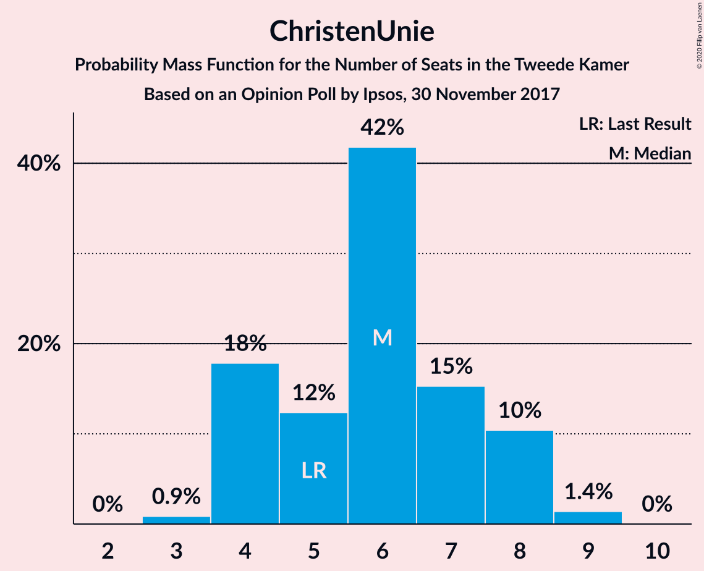
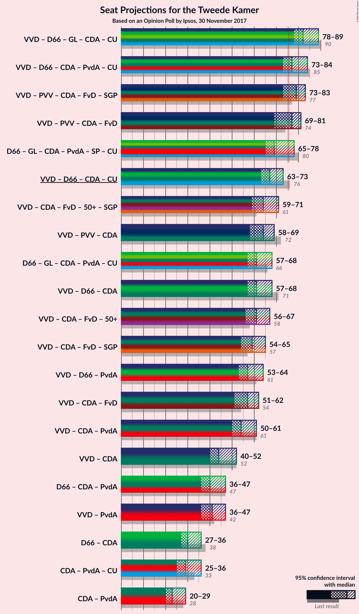
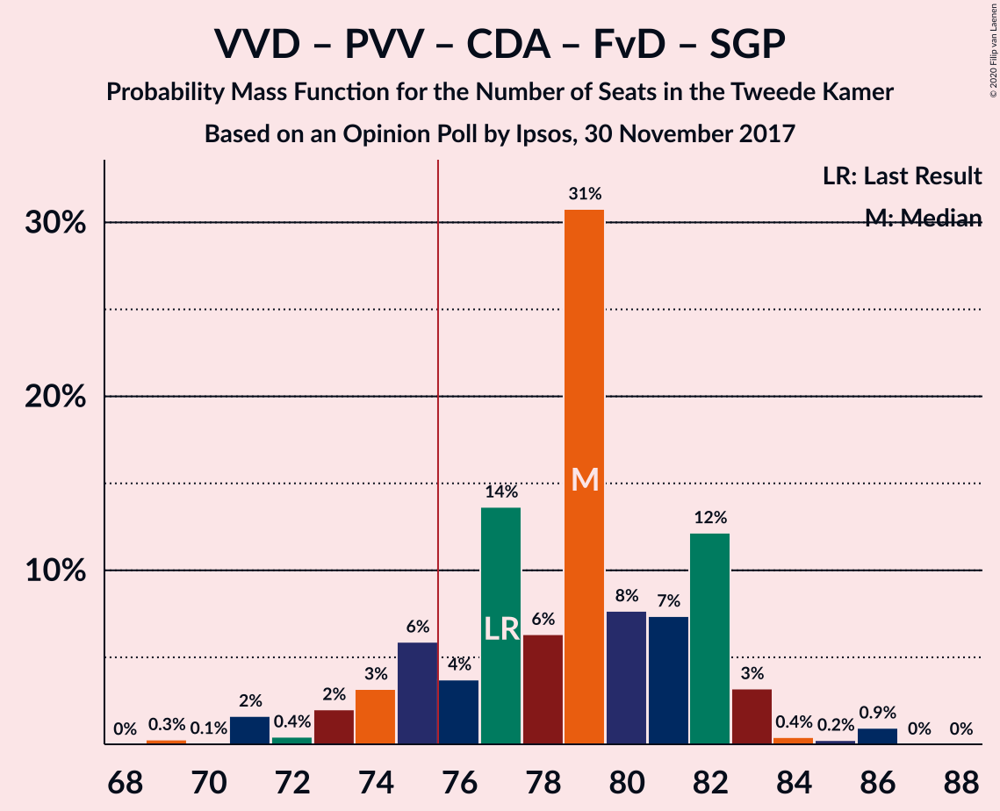
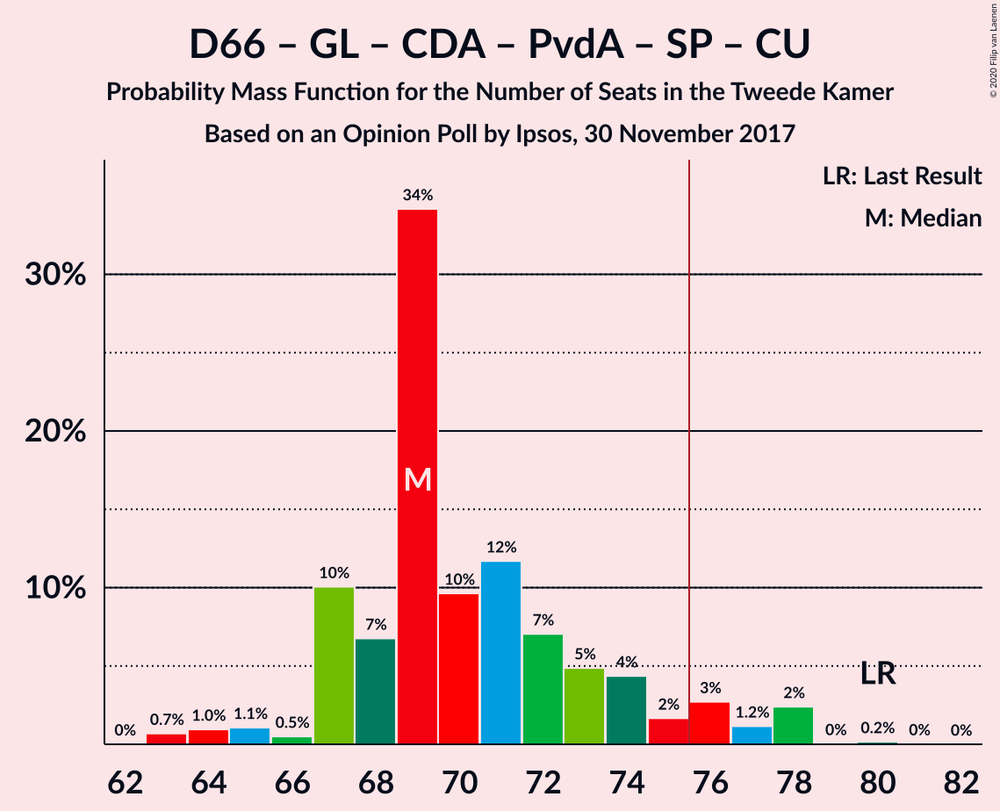

# Opinion Poll by Ipsos, 30 November 2017

<a href="#voting-intentions">Voting Intentions</a> | <a href="#seats">Seats</a> | <a href="#coalitions">Coalitions</a> | <a href="#technical-information">Technical Information</a>

## Voting Intentions

### Confidence Intervals

| Party | Last Result | Poll Result | 80% Confidence Interval | 90% Confidence Interval | 95% Confidence Interval | 99% Confidence Interval |
|:-----:|:-----------:|:-----------:|:-----------------------:|:-----------------------:|:-----------------------:|:-----------------------:|
| Volkspartij voor Vrijheid en Democratie | 21.3% | 20.3% | 18.7–22.0% |18.3–22.5% |17.9–22.9% |17.2–23.7% |
| Partij voor de Vrijheid | 13.1% | 12.4% | 11.1–13.8% |10.8–14.2% |10.5–14.6% |9.9–15.3% |
| Democraten 66 | 12.2% | 11.6% | 10.4–13.0% |10.0–13.4% |9.8–13.7% |9.2–14.4% |
| GroenLinks | 9.1% | 9.6% | 8.5–10.9% |8.2–11.3% |7.9–11.6% |7.4–12.2% |
| Christen-Democratisch Appèl | 12.4% | 9.4% | 8.3–10.7% |8.0–11.1% |7.7–11.4% |7.2–12.0% |
| Forum voor Democratie | 1.8% | 7.5% | 6.5–8.7% |6.2–9.0% |6.0–9.3% |5.6–9.9% |
| Partij van de Arbeid | 5.7% | 6.8% | 5.9–7.9% |5.6–8.3% |5.4–8.5% |5.0–9.1% |
| Socialistische Partij | 9.1% | 6.3% | 5.4–7.4% |5.2–7.7% |5.0–8.0% |4.6–8.6% |
| Partij voor de Dieren | 3.2% | 4.0% | 3.3–4.9% |3.1–5.2% |2.9–5.4% |2.7–5.9% |
| ChristenUnie | 3.4% | 3.9% | 3.2–4.8% |3.0–5.1% |2.9–5.3% |2.6–5.8% |
| 50Plus | 3.1% | 3.6% | 2.9–4.5% |2.8–4.7% |2.6–5.0% |2.3–5.4% |
| Staatkundig Gereformeerde Partij | 2.1% | 2.1% | 1.6–2.8% |1.5–3.0% |1.4–3.2% |1.2–3.6% |
| DENK | 2.1% | 2.0% | 1.5–2.7% |1.4–2.9% |1.3–3.1% |1.1–3.4% |

*Note:* The poll result column reflects the actual value used in the calculations. Published results may vary slightly, and in addition be rounded to fewer digits.

## Seats

### Confidence Intervals

| Party | Last Result | Median | 80% Confidence Interval | 90% Confidence Interval | 95% Confidence Interval | 99% Confidence Interval |
|:-----:|:-----------:|:------:|:-----------------------:|:-----------------------:|:-----------------------:|:-----------------------:|
| <a href="#volkspartij-voor-vrijheid-en-democratie">Volkspartij voor Vrijheid en Democratie</a> | 33 | 31 | 29–35 |27–37 |27–37 |26–40 |
| <a href="#partij-voor-de-vrijheid">Partij voor de Vrijheid</a> | 20 | 20 | 17–20 |16–21 |16–22 |15–23 |
| <a href="#democraten-66">Democraten 66</a> | 19 | 15 | 15–19 |15–22 |15–22 |13–22 |
| <a href="#groenlinks">GroenLinks</a> | 14 | 17 | 12–17 |12–17 |12–17 |11–18 |
| <a href="#christen-democratisch-appèl">Christen-Democratisch Appèl</a> | 19 | 15 | 12–15 |12–16 |12–19 |10–19 |
| <a href="#forum-voor-democratie">Forum voor Democratie</a> | 2 | 11 | 11–14 |9–14 |8–14 |7–14 |
| <a href="#partij-van-de-arbeid">Partij van de Arbeid</a> | 9 | 9 | 9–11 |8–11 |7–12 |7–14 |
| <a href="#socialistische-partij">Socialistische Partij</a> | 14 | 9 | 9–10 |8–11 |8–11 |7–12 |
| <a href="#partij-voor-de-dieren">Partij voor de Dieren</a> | 5 | 7 | 4–7 |4–7 |4–8 |3–9 |
| <a href="#christenunie">ChristenUnie</a> | 5 | 4 | 4–6 |3–7 |3–9 |3–9 |
| <a href="#50plus">50Plus</a> | 4 | 6 | 4–6 |4–6 |4–6 |3–8 |
| <a href="#staatkundig-gereformeerde-partij">Staatkundig Gereformeerde Partij</a> | 3 | 2 | 2–4 |2–4 |2–4 |1–7 |
| <a href="#denk">DENK</a> | 3 | 4 | 2–4 |2–5 |1–5 |1–5 |

### Volkspartij voor Vrijheid en Democratie

*For a full overview of the results for this party, see the [Volkspartij voor Vrijheid en Democratie](party-volkspartijvoorvrijheidendemocratie.html) page.*

| Number of Seats | Probability | Accumulated | Special Marks |
|:---------------:|:-----------:|:-----------:|:-------------:|
| 25 | 0% | 100% |  |
| 26 | 0.7% | 99.9% |  |
| 27 | 7% | 99.2% |  |
| 28 | 2% | 93% |  |
| 29 | 1.3% | 91% |  |
| 30 | 1.4% | 90% |  |
| 31 | 60% | 88% | Median |
| 32 | 9% | 28% |  |
| 33 | 4% | 19% | Last Result |
| 34 | 0.4% | 14% |  |
| 35 | 7% | 14% |  |
| 36 | 0.1% | 7% |  |
| 37 | 6% | 7% |  |
| 38 | 0% | 0.6% |  |
| 39 | 0% | 0.6% |  |
| 40 | 0.5% | 0.6% |  |
| 41 | 0% | 0% |  |

### Partij voor de Vrijheid

*For a full overview of the results for this party, see the [Partij voor de Vrijheid](party-partijvoordevrijheid.html) page.*

| Number of Seats | Probability | Accumulated | Special Marks |
|:---------------:|:-----------:|:-----------:|:-------------:|
| 13 | 0.2% | 100% |  |
| 14 | 0.1% | 99.8% |  |
| 15 | 0.4% | 99.7% |  |
| 16 | 5% | 99.3% |  |
| 17 | 13% | 94% |  |
| 18 | 6% | 81% |  |
| 19 | 12% | 75% |  |
| 20 | 57% | 63% | Last Result, Median |
| 21 | 3% | 6% |  |
| 22 | 2% | 3% |  |
| 23 | 1.0% | 1.1% |  |
| 24 | 0% | 0.2% |  |
| 25 | 0.1% | 0.1% |  |
| 26 | 0% | 0% |  |

### Democraten 66

*For a full overview of the results for this party, see the [Democraten 66](party-democraten66.html) page.*

| Number of Seats | Probability | Accumulated | Special Marks |
|:---------------:|:-----------:|:-----------:|:-------------:|
| 12 | 0.4% | 100% |  |
| 13 | 0.4% | 99.6% |  |
| 14 | 0.3% | 99.2% |  |
| 15 | 58% | 98.9% | Median |
| 16 | 1.1% | 40% |  |
| 17 | 19% | 39% |  |
| 18 | 10% | 21% |  |
| 19 | 1.0% | 10% | Last Result |
| 20 | 1.0% | 9% |  |
| 21 | 3% | 8% |  |
| 22 | 5% | 5% |  |
| 23 | 0.1% | 0.2% |  |
| 24 | 0.1% | 0.1% |  |
| 25 | 0% | 0% |  |

### GroenLinks

*For a full overview of the results for this party, see the [GroenLinks](party-groenlinks.html) page.*

| Number of Seats | Probability | Accumulated | Special Marks |
|:---------------:|:-----------:|:-----------:|:-------------:|
| 10 | 0.3% | 100% |  |
| 11 | 0.5% | 99.7% |  |
| 12 | 10% | 99.1% |  |
| 13 | 4% | 89% |  |
| 14 | 8% | 85% | Last Result |
| 15 | 14% | 76% |  |
| 16 | 3% | 63% |  |
| 17 | 58% | 60% | Median |
| 18 | 1.5% | 2% |  |
| 19 | 0.4% | 0.4% |  |
| 20 | 0% | 0% |  |

### Christen-Democratisch Appèl

*For a full overview of the results for this party, see the [Christen-Democratisch Appèl](party-christen-democratischappèl.html) page.*

| Number of Seats | Probability | Accumulated | Special Marks |
|:---------------:|:-----------:|:-----------:|:-------------:|
| 10 | 0.8% | 100% |  |
| 11 | 0.9% | 99.2% |  |
| 12 | 12% | 98% |  |
| 13 | 3% | 87% |  |
| 14 | 4% | 84% |  |
| 15 | 74% | 80% | Median |
| 16 | 1.4% | 6% |  |
| 17 | 0.1% | 5% |  |
| 18 | 0.1% | 4% |  |
| 19 | 4% | 4% | Last Result |
| 20 | 0% | 0% |  |

### Forum voor Democratie

*For a full overview of the results for this party, see the [Forum voor Democratie](party-forumvoordemocratie.html) page.*

| Number of Seats | Probability | Accumulated | Special Marks |
|:---------------:|:-----------:|:-----------:|:-------------:|
| 2 | 0% | 100% | Last Result |
| 3 | 0% | 100% |  |
| 4 | 0% | 100% |  |
| 5 | 0% | 100% |  |
| 6 | 0% | 100% |  |
| 7 | 2% | 100% |  |
| 8 | 1.1% | 98% |  |
| 9 | 3% | 97% |  |
| 10 | 3% | 94% |  |
| 11 | 68% | 90% | Median |
| 12 | 6% | 22% |  |
| 13 | 5% | 16% |  |
| 14 | 11% | 11% |  |
| 15 | 0.2% | 0.3% |  |
| 16 | 0% | 0% |  |

### Partij van de Arbeid

*For a full overview of the results for this party, see the [Partij van de Arbeid](party-partijvandearbeid.html) page.*

| Number of Seats | Probability | Accumulated | Special Marks |
|:---------------:|:-----------:|:-----------:|:-------------:|
| 7 | 3% | 100% |  |
| 8 | 4% | 97% |  |
| 9 | 66% | 93% | Last Result, Median |
| 10 | 9% | 27% |  |
| 11 | 13% | 18% |  |
| 12 | 3% | 5% |  |
| 13 | 1.1% | 2% |  |
| 14 | 0.4% | 0.6% |  |
| 15 | 0.2% | 0.2% |  |
| 16 | 0% | 0% |  |

### Socialistische Partij

*For a full overview of the results for this party, see the [Socialistische Partij](party-socialistischepartij.html) page.*

| Number of Seats | Probability | Accumulated | Special Marks |
|:---------------:|:-----------:|:-----------:|:-------------:|
| 6 | 0.2% | 100% |  |
| 7 | 1.4% | 99.8% |  |
| 8 | 6% | 98% |  |
| 9 | 67% | 92% | Median |
| 10 | 17% | 25% |  |
| 11 | 7% | 8% |  |
| 12 | 0.4% | 0.5% |  |
| 13 | 0.1% | 0.1% |  |
| 14 | 0% | 0% | Last Result |

### Partij voor de Dieren

*For a full overview of the results for this party, see the [Partij voor de Dieren](party-partijvoordedieren.html) page.*

| Number of Seats | Probability | Accumulated | Special Marks |
|:---------------:|:-----------:|:-----------:|:-------------:|
| 3 | 2% | 100% |  |
| 4 | 9% | 98% |  |
| 5 | 9% | 89% | Last Result |
| 6 | 16% | 81% |  |
| 7 | 60% | 64% | Median |
| 8 | 3% | 4% |  |
| 9 | 0.6% | 0.8% |  |
| 10 | 0.3% | 0.3% |  |
| 11 | 0% | 0% |  |

### ChristenUnie

*For a full overview of the results for this party, see the [ChristenUnie](party-christenunie.html) page.*

| Number of Seats | Probability | Accumulated | Special Marks |
|:---------------:|:-----------:|:-----------:|:-------------:|
| 3 | 8% | 100% |  |
| 4 | 67% | 92% | Median |
| 5 | 9% | 24% | Last Result |
| 6 | 7% | 15% |  |
| 7 | 4% | 9% |  |
| 8 | 2% | 4% |  |
| 9 | 3% | 3% |  |
| 10 | 0% | 0% |  |

### 50Plus

*For a full overview of the results for this party, see the [50Plus](party-50plus.html) page.*

| Number of Seats | Probability | Accumulated | Special Marks |
|:---------------:|:-----------:|:-----------:|:-------------:|
| 3 | 1.3% | 100% |  |
| 4 | 13% | 98.6% | Last Result |
| 5 | 14% | 86% |  |
| 6 | 70% | 72% | Median |
| 7 | 0.8% | 1.3% |  |
| 8 | 0.5% | 0.5% |  |
| 9 | 0.1% | 0.1% |  |
| 10 | 0% | 0% |  |

### Staatkundig Gereformeerde Partij

*For a full overview of the results for this party, see the [Staatkundig Gereformeerde Partij](party-staatkundiggereformeerdepartij.html) page.*

| Number of Seats | Probability | Accumulated | Special Marks |
|:---------------:|:-----------:|:-----------:|:-------------:|
| 1 | 1.1% | 100% |  |
| 2 | 80% | 98.9% | Median |
| 3 | 5% | 19% | Last Result |
| 4 | 13% | 14% |  |
| 5 | 0.3% | 1.0% |  |
| 6 | 0.1% | 0.7% |  |
| 7 | 0.6% | 0.6% |  |
| 8 | 0% | 0% |  |

### DENK

*For a full overview of the results for this party, see the [DENK](party-denk.html) page.*

| Number of Seats | Probability | Accumulated | Special Marks |
|:---------------:|:-----------:|:-----------:|:-------------:|
| 1 | 5% | 100% |  |
| 2 | 15% | 95% |  |
| 3 | 3% | 81% | Last Result |
| 4 | 71% | 78% | Median |
| 5 | 7% | 7% |  |
| 6 | 0.3% | 0.3% |  |
| 7 | 0% | 0% |  |

## Coalitions

### Confidence Intervals

| Coalition | Last Result | Median | Majority? | 80% Confidence Interval | 90% Confidence Interval | 95% Confidence Interval | 99% Confidence Interval |
|:---------:|:-----------:|:------:|:---------:|:-----------------------:|:-----------------------:|:-----------------------:|:-----------------------:|
| Volkspartij voor Vrijheid en Democratie – Democraten 66 – GroenLinks – Christen-Democratisch Appèl – ChristenUnie | 90 | 82 | 99.6% | 82–85 | 80–88 | 79–89 | 77–89 |
| Volkspartij voor Vrijheid en Democratie – Democraten 66 – Christen-Democratisch Appèl – Partij van de Arbeid – ChristenUnie | 85 | 74 | 40% | 74–82 | 74–84 | 73–84 | 73–85 |
| Volkspartij voor Vrijheid en Democratie – Partij voor de Vrijheid – Christen-Democratisch Appèl – Forum voor Democratie – Staatkundig Gereformeerde Partij | 77 | 79 | 96% | 76–82 | 76–82 | 74–83 | 70–84 |
| Volkspartij voor Vrijheid en Democratie – Partij voor de Vrijheid – Christen-Democratisch Appèl – Forum voor Democratie | 74 | 77 | 82% | 73–80 | 72–80 | 72–80 | 68–81 |
| Democraten 66 – GroenLinks – Christen-Democratisch Appèl – Partij van de Arbeid – Socialistische Partij – ChristenUnie | 80 | 69 | 5% | 69–73 | 68–76 | 68–76 | 64–76 |
| Volkspartij voor Vrijheid en Democratie – Democraten 66 – Christen-Democratisch Appèl – ChristenUnie | 76 | 65 | 0.1% | 65–72 | 65–73 | 65–73 | 62–74 |
| Volkspartij voor Vrijheid en Democratie – Christen-Democratisch Appèl – Forum voor Democratie – 50Plus – Staatkundig Gereformeerde Partij | 61 | 65 | 0% | 64–69 | 62–69 | 60–69 | 57–69 |
| Volkspartij voor Vrijheid en Democratie – Partij voor de Vrijheid – Christen-Democratisch Appèl | 72 | 66 | 0% | 63–68 | 60–69 | 60–69 | 57–71 |
| Volkspartij voor Vrijheid en Democratie – Democraten 66 – Christen-Democratisch Appèl | 71 | 61 | 0% | 61–66 | 60–69 | 59–69 | 57–70 |
| Volkspartij voor Vrijheid en Democratie – Christen-Democratisch Appèl – Forum voor Democratie – 50Plus | 58 | 63 | 0% | 60–67 | 58–67 | 58–67 | 53–67 |
| Democraten 66 – GroenLinks – Christen-Democratisch Appèl – Partij van de Arbeid – ChristenUnie | 66 | 60 | 0% | 59–63 | 59–67 | 58–67 | 56–68 |
| Volkspartij voor Vrijheid en Democratie – Christen-Democratisch Appèl – Forum voor Democratie – Staatkundig Gereformeerde Partij | 57 | 59 | 0% | 59–63 | 57–65 | 55–65 | 51–65 |
| Volkspartij voor Vrijheid en Democratie – Democraten 66 – Partij van de Arbeid | 61 | 55 | 0% | 55–64 | 55–65 | 53–65 | 52–69 |
| Volkspartij voor Vrijheid en Democratie – Christen-Democratisch Appèl – Forum voor Democratie | 54 | 57 | 0% | 55–61 | 53–63 | 52–63 | 49–63 |
| Volkspartij voor Vrijheid en Democratie – Christen-Democratisch Appèl – Partij van de Arbeid | 61 | 55 | 0% | 54–59 | 52–63 | 49–63 | 49–63 |
| Volkspartij voor Vrijheid en Democratie – Christen-Democratisch Appèl | 52 | 46 | 0% | 43–48 | 42–52 | 42–52 | 39–52 |
| Volkspartij voor Vrijheid en Democratie – Partij van de Arbeid | 42 | 40 | 0% | 40–44 | 37–48 | 36–48 | 34–51 |
| Democraten 66 – Christen-Democratisch Appèl – Partij van de Arbeid | 47 | 39 | 0% | 39–45 | 38–47 | 38–47 | 36–47 |
| Democraten 66 – Christen-Democratisch Appèl | 38 | 30 | 0% | 30–34 | 30–35 | 28–37 | 26–37 |
| Christen-Democratisch Appèl – Partij van de Arbeid – ChristenUnie | 33 | 28 | 0% | 27–32 | 27–34 | 26–34 | 25–34 |
| Christen-Democratisch Appèl – Partij van de Arbeid | 28 | 24 | 0% | 23–26 | 21–28 | 20–29 | 19–29 |

### Volkspartij voor Vrijheid en Democratie – Democraten 66 – GroenLinks – Christen-Democratisch Appèl – ChristenUnie

| Number of Seats | Probability | Accumulated | Special Marks |
|:---------------:|:-----------:|:-----------:|:-------------:|
| 75 | 0.4% | 100% |  |
| 76 | 0.1% | 99.6% | Majority |
| 77 | 0.5% | 99.6% |  |
| 78 | 0.4% | 99.1% |  |
| 79 | 3% | 98.7% |  |
| 80 | 1.4% | 96% |  |
| 81 | 2% | 94% |  |
| 82 | 64% | 93% | Median |
| 83 | 5% | 28% |  |
| 84 | 7% | 23% |  |
| 85 | 7% | 16% |  |
| 86 | 0.9% | 9% |  |
| 87 | 2% | 8% |  |
| 88 | 2% | 6% |  |
| 89 | 3% | 3% |  |
| 90 | 0% | 0.1% | Last Result |
| 91 | 0% | 0.1% |  |
| 92 | 0.1% | 0.1% |  |
| 93 | 0% | 0% |  |

### Volkspartij voor Vrijheid en Democratie – Democraten 66 – Christen-Democratisch Appèl – Partij van de Arbeid – ChristenUnie

| Number of Seats | Probability | Accumulated | Special Marks |
|:---------------:|:-----------:|:-----------:|:-------------:|
| 71 | 0.3% | 100% |  |
| 72 | 0.1% | 99.7% |  |
| 73 | 2% | 99.6% |  |
| 74 | 55% | 97% | Median |
| 75 | 2% | 42% |  |
| 76 | 9% | 40% | Majority |
| 77 | 1.3% | 31% |  |
| 78 | 0.7% | 30% |  |
| 79 | 5% | 29% |  |
| 80 | 8% | 24% |  |
| 81 | 2% | 16% |  |
| 82 | 5% | 14% |  |
| 83 | 0.7% | 10% |  |
| 84 | 8% | 9% |  |
| 85 | 0.6% | 0.7% | Last Result |
| 86 | 0.1% | 0.1% |  |
| 87 | 0% | 0% |  |

### Volkspartij voor Vrijheid en Democratie – Partij voor de Vrijheid – Christen-Democratisch Appèl – Forum voor Democratie – Staatkundig Gereformeerde Partij

| Number of Seats | Probability | Accumulated | Special Marks |
|:---------------:|:-----------:|:-----------:|:-------------:|
| 69 | 0.3% | 100% |  |
| 70 | 0.4% | 99.7% |  |
| 71 | 0.4% | 99.3% |  |
| 72 | 0.2% | 98.9% |  |
| 73 | 0.9% | 98.7% |  |
| 74 | 0.6% | 98% |  |
| 75 | 1.3% | 97% |  |
| 76 | 8% | 96% | Majority |
| 77 | 3% | 88% | Last Result |
| 78 | 3% | 85% |  |
| 79 | 61% | 82% | Median |
| 80 | 2% | 21% |  |
| 81 | 1.2% | 19% |  |
| 82 | 14% | 17% |  |
| 83 | 0.6% | 3% |  |
| 84 | 2% | 2% |  |
| 85 | 0.1% | 0.1% |  |
| 86 | 0% | 0.1% |  |
| 87 | 0% | 0% |  |

### Volkspartij voor Vrijheid en Democratie – Partij voor de Vrijheid – Christen-Democratisch Appèl – Forum voor Democratie

| Number of Seats | Probability | Accumulated | Special Marks |
|:---------------:|:-----------:|:-----------:|:-------------:|
| 65 | 0.2% | 100% |  |
| 66 | 0% | 99.8% |  |
| 67 | 0.1% | 99.8% |  |
| 68 | 0.5% | 99.7% |  |
| 69 | 0.4% | 99.2% |  |
| 70 | 0.9% | 98.8% |  |
| 71 | 0.4% | 98% |  |
| 72 | 6% | 98% |  |
| 73 | 3% | 92% |  |
| 74 | 7% | 89% | Last Result |
| 75 | 0.4% | 82% |  |
| 76 | 3% | 82% | Majority |
| 77 | 60% | 79% | Median |
| 78 | 1.5% | 19% |  |
| 79 | 0.3% | 18% |  |
| 80 | 16% | 17% |  |
| 81 | 0.9% | 1.0% |  |
| 82 | 0.1% | 0.1% |  |
| 83 | 0% | 0% |  |

### Democraten 66 – GroenLinks – Christen-Democratisch Appèl – Partij van de Arbeid – Socialistische Partij – ChristenUnie

| Number of Seats | Probability | Accumulated | Special Marks |
|:---------------:|:-----------:|:-----------:|:-------------:|
| 64 | 0.5% | 100% |  |
| 65 | 0.1% | 99.5% |  |
| 66 | 0.1% | 99.4% |  |
| 67 | 2% | 99.3% |  |
| 68 | 7% | 98% |  |
| 69 | 68% | 90% | Median |
| 70 | 0.8% | 22% |  |
| 71 | 0.6% | 21% |  |
| 72 | 3% | 21% |  |
| 73 | 10% | 17% |  |
| 74 | 1.3% | 8% |  |
| 75 | 1.3% | 6% |  |
| 76 | 5% | 5% | Majority |
| 77 | 0.1% | 0.4% |  |
| 78 | 0.1% | 0.3% |  |
| 79 | 0.2% | 0.2% |  |
| 80 | 0% | 0% | Last Result |

### Volkspartij voor Vrijheid en Democratie – Democraten 66 – Christen-Democratisch Appèl – ChristenUnie

| Number of Seats | Probability | Accumulated | Special Marks |
|:---------------:|:-----------:|:-----------:|:-------------:|
| 60 | 0.1% | 100% |  |
| 61 | 0.1% | 99.9% |  |
| 62 | 0.4% | 99.8% |  |
| 63 | 0.6% | 99.4% |  |
| 64 | 1.0% | 98.8% |  |
| 65 | 56% | 98% | Median |
| 66 | 4% | 42% |  |
| 67 | 9% | 38% |  |
| 68 | 0.3% | 29% |  |
| 69 | 11% | 29% |  |
| 70 | 1.0% | 18% |  |
| 71 | 0.5% | 17% |  |
| 72 | 7% | 17% |  |
| 73 | 9% | 10% |  |
| 74 | 0.7% | 1.0% |  |
| 75 | 0.1% | 0.2% |  |
| 76 | 0.1% | 0.1% | Last Result, Majority |
| 77 | 0.1% | 0.1% |  |
| 78 | 0% | 0% |  |

### Volkspartij voor Vrijheid en Democratie – Christen-Democratisch Appèl – Forum voor Democratie – 50Plus – Staatkundig Gereformeerde Partij

| Number of Seats | Probability | Accumulated | Special Marks |
|:---------------:|:-----------:|:-----------:|:-------------:|
| 55 | 0.4% | 100% |  |
| 56 | 0% | 99.5% |  |
| 57 | 0.1% | 99.5% |  |
| 58 | 0.5% | 99.5% |  |
| 59 | 0.9% | 99.0% |  |
| 60 | 0.9% | 98% |  |
| 61 | 0.8% | 97% | Last Result |
| 62 | 3% | 96% |  |
| 63 | 2% | 93% |  |
| 64 | 9% | 91% |  |
| 65 | 56% | 82% | Median |
| 66 | 3% | 26% |  |
| 67 | 6% | 23% |  |
| 68 | 0.9% | 17% |  |
| 69 | 16% | 17% |  |
| 70 | 0.2% | 0.3% |  |
| 71 | 0% | 0.1% |  |
| 72 | 0.1% | 0.1% |  |
| 73 | 0% | 0% |  |

### Volkspartij voor Vrijheid en Democratie – Partij voor de Vrijheid – Christen-Democratisch Appèl

| Number of Seats | Probability | Accumulated | Special Marks |
|:---------------:|:-----------:|:-----------:|:-------------:|
| 55 | 0.2% | 100% |  |
| 56 | 0% | 99.8% |  |
| 57 | 0.3% | 99.7% |  |
| 58 | 0.4% | 99.4% |  |
| 59 | 0.9% | 99.1% |  |
| 60 | 5% | 98% |  |
| 61 | 1.4% | 93% |  |
| 62 | 1.0% | 91% |  |
| 63 | 6% | 90% |  |
| 64 | 7% | 84% |  |
| 65 | 1.0% | 77% |  |
| 66 | 65% | 76% | Median |
| 67 | 0.5% | 11% |  |
| 68 | 1.1% | 11% |  |
| 69 | 8% | 9% |  |
| 70 | 0.8% | 1.4% |  |
| 71 | 0.6% | 0.6% |  |
| 72 | 0% | 0% | Last Result |

### Volkspartij voor Vrijheid en Democratie – Democraten 66 – Christen-Democratisch Appèl

| Number of Seats | Probability | Accumulated | Special Marks |
|:---------------:|:-----------:|:-----------:|:-------------:|
| 53 | 0.1% | 100% |  |
| 54 | 0% | 99.9% |  |
| 55 | 0% | 99.9% |  |
| 56 | 0.3% | 99.9% |  |
| 57 | 0.4% | 99.6% |  |
| 58 | 1.1% | 99.3% |  |
| 59 | 2% | 98% |  |
| 60 | 4% | 97% |  |
| 61 | 56% | 93% | Median |
| 62 | 0.7% | 37% |  |
| 63 | 3% | 36% |  |
| 64 | 13% | 33% |  |
| 65 | 8% | 20% |  |
| 66 | 2% | 12% |  |
| 67 | 0.4% | 10% |  |
| 68 | 3% | 10% |  |
| 69 | 6% | 7% |  |
| 70 | 0.6% | 0.8% |  |
| 71 | 0.2% | 0.2% | Last Result |
| 72 | 0% | 0% |  |

### Volkspartij voor Vrijheid en Democratie – Christen-Democratisch Appèl – Forum voor Democratie – 50Plus

| Number of Seats | Probability | Accumulated | Special Marks |
|:---------------:|:-----------:|:-----------:|:-------------:|
| 52 | 0.5% | 100% |  |
| 53 | 0.1% | 99.5% |  |
| 54 | 0% | 99.5% |  |
| 55 | 0.4% | 99.4% |  |
| 56 | 0.7% | 99.0% |  |
| 57 | 0.6% | 98% |  |
| 58 | 3% | 98% | Last Result |
| 59 | 0.4% | 95% |  |
| 60 | 7% | 94% |  |
| 61 | 4% | 87% |  |
| 62 | 5% | 83% |  |
| 63 | 55% | 78% | Median |
| 64 | 0.8% | 23% |  |
| 65 | 7% | 22% |  |
| 66 | 0.1% | 15% |  |
| 67 | 15% | 15% |  |
| 68 | 0.1% | 0.1% |  |
| 69 | 0% | 0.1% |  |
| 70 | 0% | 0% |  |

### Democraten 66 – GroenLinks – Christen-Democratisch Appèl – Partij van de Arbeid – ChristenUnie

| Number of Seats | Probability | Accumulated | Special Marks |
|:---------------:|:-----------:|:-----------:|:-------------:|
| 55 | 0.2% | 100% |  |
| 56 | 0.5% | 99.7% |  |
| 57 | 1.0% | 99.2% |  |
| 58 | 1.0% | 98% |  |
| 59 | 18% | 97% |  |
| 60 | 55% | 79% | Median |
| 61 | 5% | 25% |  |
| 62 | 3% | 19% |  |
| 63 | 6% | 16% |  |
| 64 | 2% | 10% |  |
| 65 | 2% | 8% |  |
| 66 | 0.6% | 6% | Last Result |
| 67 | 5% | 5% |  |
| 68 | 0.3% | 0.7% |  |
| 69 | 0.2% | 0.4% |  |
| 70 | 0.1% | 0.1% |  |
| 71 | 0% | 0% |  |

### Volkspartij voor Vrijheid en Democratie – Christen-Democratisch Appèl – Forum voor Democratie – Staatkundig Gereformeerde Partij

| Number of Seats | Probability | Accumulated | Special Marks |
|:---------------:|:-----------:|:-----------:|:-------------:|
| 51 | 0.5% | 100% |  |
| 52 | 0.2% | 99.5% |  |
| 53 | 0.6% | 99.3% |  |
| 54 | 0.9% | 98.7% |  |
| 55 | 1.2% | 98% |  |
| 56 | 0.4% | 97% |  |
| 57 | 3% | 96% | Last Result |
| 58 | 2% | 93% |  |
| 59 | 62% | 91% | Median |
| 60 | 3% | 29% |  |
| 61 | 7% | 26% |  |
| 62 | 2% | 19% |  |
| 63 | 8% | 17% |  |
| 64 | 0.6% | 9% |  |
| 65 | 8% | 8% |  |
| 66 | 0.2% | 0.2% |  |
| 67 | 0% | 0.1% |  |
| 68 | 0% | 0.1% |  |
| 69 | 0% | 0% |  |

### Volkspartij voor Vrijheid en Democratie – Democraten 66 – Partij van de Arbeid

| Number of Seats | Probability | Accumulated | Special Marks |
|:---------------:|:-----------:|:-----------:|:-------------:|
| 49 | 0.1% | 100% |  |
| 50 | 0% | 99.9% |  |
| 51 | 0% | 99.9% |  |
| 52 | 2% | 99.9% |  |
| 53 | 0.5% | 98% |  |
| 54 | 0.7% | 97% |  |
| 55 | 59% | 97% | Median |
| 56 | 0.3% | 37% |  |
| 57 | 0.9% | 37% |  |
| 58 | 13% | 36% |  |
| 59 | 1.0% | 23% |  |
| 60 | 2% | 22% |  |
| 61 | 4% | 20% | Last Result |
| 62 | 0.7% | 17% |  |
| 63 | 0.1% | 16% |  |
| 64 | 7% | 16% |  |
| 65 | 9% | 9% |  |
| 66 | 0.1% | 0.7% |  |
| 67 | 0.1% | 0.6% |  |
| 68 | 0% | 0.6% |  |
| 69 | 0.5% | 0.5% |  |
| 70 | 0% | 0% |  |

### Volkspartij voor Vrijheid en Democratie – Christen-Democratisch Appèl – Forum voor Democratie

| Number of Seats | Probability | Accumulated | Special Marks |
|:---------------:|:-----------:|:-----------:|:-------------:|
| 47 | 0.1% | 100% |  |
| 48 | 0.4% | 99.9% |  |
| 49 | 0.3% | 99.5% |  |
| 50 | 0.3% | 99.3% |  |
| 51 | 0.8% | 98.9% |  |
| 52 | 0.7% | 98% |  |
| 53 | 3% | 97% |  |
| 54 | 1.3% | 95% | Last Result |
| 55 | 7% | 93% |  |
| 56 | 3% | 87% |  |
| 57 | 58% | 83% | Median |
| 58 | 3% | 26% |  |
| 59 | 5% | 22% |  |
| 60 | 0.1% | 17% |  |
| 61 | 10% | 17% |  |
| 62 | 0.6% | 7% |  |
| 63 | 6% | 6% |  |
| 64 | 0% | 0.1% |  |
| 65 | 0% | 0.1% |  |
| 66 | 0% | 0% |  |

### Volkspartij voor Vrijheid en Democratie – Christen-Democratisch Appèl – Partij van de Arbeid

| Number of Seats | Probability | Accumulated | Special Marks |
|:---------------:|:-----------:|:-----------:|:-------------:|
| 48 | 0.3% | 100% |  |
| 49 | 2% | 99.7% |  |
| 50 | 1.0% | 97% |  |
| 51 | 0.7% | 96% |  |
| 52 | 1.1% | 96% |  |
| 53 | 1.5% | 95% |  |
| 54 | 5% | 93% |  |
| 55 | 59% | 88% | Median |
| 56 | 16% | 29% |  |
| 57 | 0.2% | 13% |  |
| 58 | 3% | 13% |  |
| 59 | 1.1% | 10% |  |
| 60 | 0.4% | 9% |  |
| 61 | 2% | 9% | Last Result |
| 62 | 0% | 7% |  |
| 63 | 7% | 7% |  |
| 64 | 0% | 0% |  |

### Volkspartij voor Vrijheid en Democratie – Christen-Democratisch Appèl

| Number of Seats | Probability | Accumulated | Special Marks |
|:---------------:|:-----------:|:-----------:|:-------------:|
| 39 | 0.7% | 100% |  |
| 40 | 0.8% | 99.2% |  |
| 41 | 0.7% | 98% |  |
| 42 | 4% | 98% |  |
| 43 | 6% | 94% |  |
| 44 | 2% | 88% |  |
| 45 | 0.4% | 86% |  |
| 46 | 60% | 86% | Median |
| 47 | 14% | 26% |  |
| 48 | 3% | 12% |  |
| 49 | 2% | 10% |  |
| 50 | 0% | 7% |  |
| 51 | 0.4% | 7% |  |
| 52 | 7% | 7% | Last Result |
| 53 | 0% | 0.1% |  |
| 54 | 0% | 0% |  |

### Volkspartij voor Vrijheid en Democratie – Partij van de Arbeid

| Number of Seats | Probability | Accumulated | Special Marks |
|:---------------:|:-----------:|:-----------:|:-------------:|
| 34 | 2% | 100% |  |
| 35 | 0.1% | 98% |  |
| 36 | 0.5% | 98% |  |
| 37 | 5% | 97% |  |
| 38 | 0.4% | 92% |  |
| 39 | 1.4% | 92% |  |
| 40 | 55% | 90% | Median |
| 41 | 10% | 35% |  |
| 42 | 6% | 25% | Last Result |
| 43 | 8% | 19% |  |
| 44 | 2% | 12% |  |
| 45 | 0.7% | 10% |  |
| 46 | 0.1% | 9% |  |
| 47 | 2% | 9% |  |
| 48 | 6% | 7% |  |
| 49 | 0% | 0.6% |  |
| 50 | 0% | 0.6% |  |
| 51 | 0.5% | 0.5% |  |
| 52 | 0% | 0% |  |

### Democraten 66 – Christen-Democratisch Appèl – Partij van de Arbeid

| Number of Seats | Probability | Accumulated | Special Marks |
|:---------------:|:-----------:|:-----------:|:-------------:|
| 36 | 0.6% | 100% |  |
| 37 | 0.5% | 99.4% |  |
| 38 | 5% | 98.9% |  |
| 39 | 55% | 94% | Median |
| 40 | 6% | 39% |  |
| 41 | 10% | 34% |  |
| 42 | 3% | 23% |  |
| 43 | 9% | 21% |  |
| 44 | 1.0% | 12% |  |
| 45 | 5% | 11% |  |
| 46 | 0.3% | 5% |  |
| 47 | 5% | 5% | Last Result |
| 48 | 0.2% | 0.5% |  |
| 49 | 0.2% | 0.3% |  |
| 50 | 0% | 0% |  |

### Democraten 66 – Christen-Democratisch Appèl

| Number of Seats | Probability | Accumulated | Special Marks |
|:---------------:|:-----------:|:-----------:|:-------------:|
| 24 | 0.2% | 100% |  |
| 25 | 0% | 99.8% |  |
| 26 | 0.6% | 99.8% |  |
| 27 | 0.2% | 99.2% |  |
| 28 | 2% | 99.0% |  |
| 29 | 2% | 97% |  |
| 30 | 61% | 95% | Median |
| 31 | 3% | 35% |  |
| 32 | 15% | 32% |  |
| 33 | 6% | 17% |  |
| 34 | 5% | 11% |  |
| 35 | 0.3% | 5% |  |
| 36 | 0.5% | 5% |  |
| 37 | 4% | 4% |  |
| 38 | 0.1% | 0.2% | Last Result |
| 39 | 0% | 0.1% |  |
| 40 | 0.1% | 0.1% |  |
| 41 | 0% | 0% |  |

### Christen-Democratisch Appèl – Partij van de Arbeid – ChristenUnie

| Number of Seats | Probability | Accumulated | Special Marks |
|:---------------:|:-----------:|:-----------:|:-------------:|
| 25 | 0.6% | 100% |  |
| 26 | 3% | 99.4% |  |
| 27 | 17% | 96% |  |
| 28 | 57% | 79% | Median |
| 29 | 1.1% | 22% |  |
| 30 | 8% | 21% |  |
| 31 | 2% | 13% |  |
| 32 | 2% | 11% |  |
| 33 | 1.4% | 9% | Last Result |
| 34 | 7% | 7% |  |
| 35 | 0.1% | 0.5% |  |
| 36 | 0.3% | 0.3% |  |
| 37 | 0.1% | 0.1% |  |
| 38 | 0% | 0% |  |

### Christen-Democratisch Appèl – Partij van de Arbeid

| Number of Seats | Probability | Accumulated | Special Marks |
|:---------------:|:-----------:|:-----------:|:-------------:|
| 19 | 0.6% | 100% |  |
| 20 | 3% | 99.4% |  |
| 21 | 3% | 96% |  |
| 22 | 3% | 94% |  |
| 23 | 7% | 90% |  |
| 24 | 65% | 83% | Median |
| 25 | 3% | 18% |  |
| 26 | 9% | 15% |  |
| 27 | 0.5% | 6% |  |
| 28 | 0.2% | 5% | Last Result |
| 29 | 5% | 5% |  |
| 30 | 0.1% | 0.1% |  |
| 31 | 0.1% | 0.1% |  |
| 32 | 0% | 0% |  |

## Technical Information

### Opinion Poll

+ **Polling firm:** Ipsos
+ **Commissioner(s):** —
+ **Fieldwork period:** 30 November 2017

### Calculations

+ **Sample size:** 1000
+ **Simulations done:** 131,072
+ **Error estimate:** 1.97%

