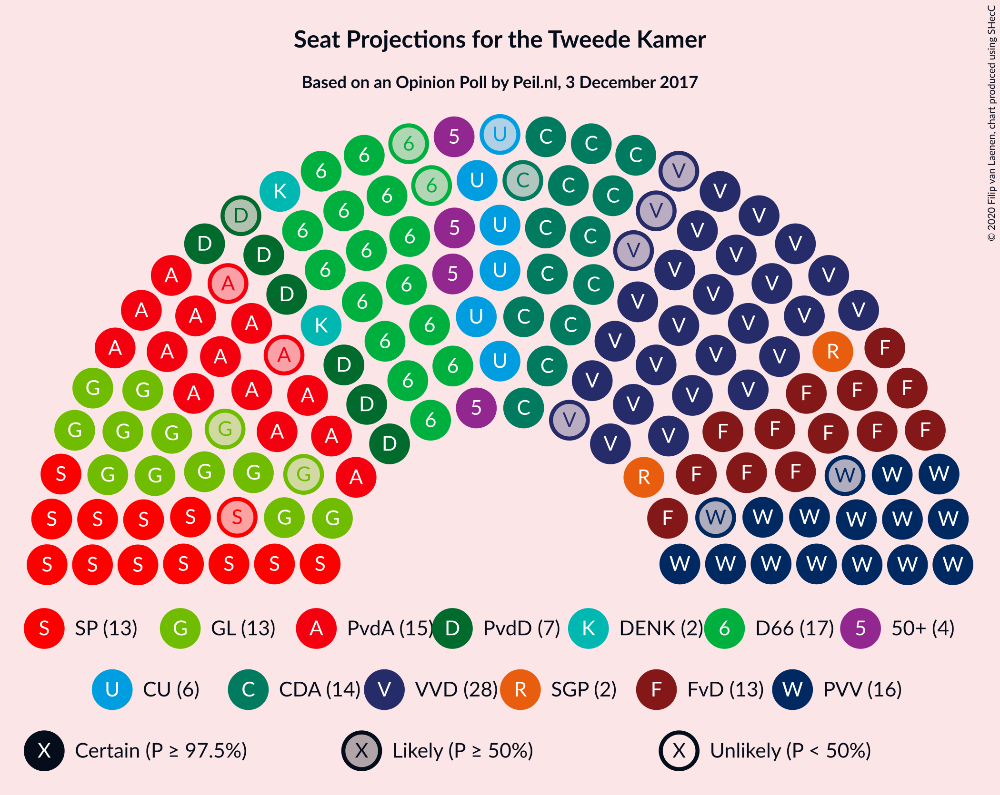
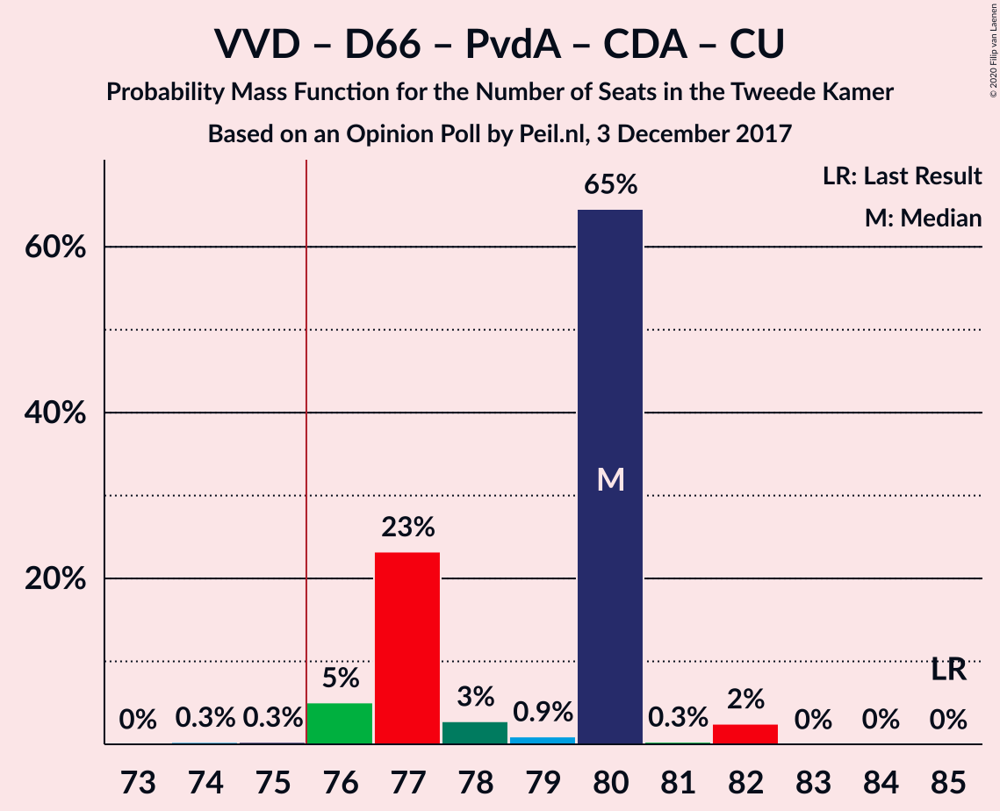
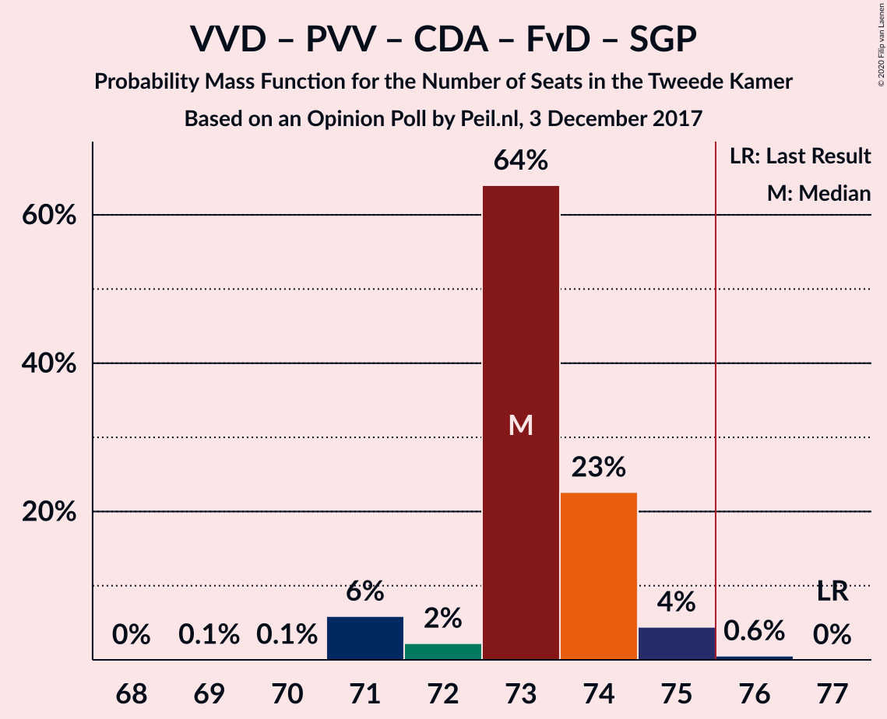
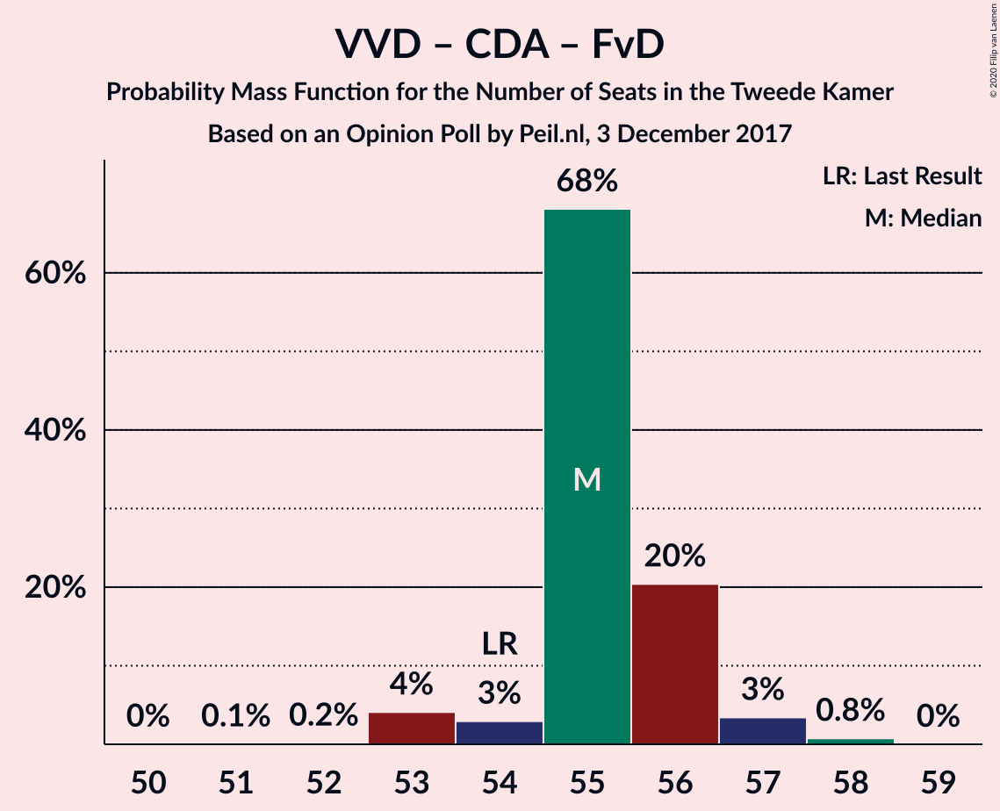

# Opinion Poll by Peil.nl, 3 December 2017

<a href="#voting-intentions">Voting Intentions</a> | <a href="#seats">Seats</a> | <a href="#coalitions">Coalitions</a> | <a href="#technical-information">Technical Information</a>

## Voting Intentions

### Confidence Intervals

| Party | Last Result | Poll Result | 80% Confidence Interval | 90% Confidence Interval | 95% Confidence Interval | 99% Confidence Interval |
|:-----:|:-----------:|:-----------:|:-----------------------:|:-----------------------:|:-----------------------:|:-----------------------:|
| Volkspartij voor Vrijheid en Democratie | 21.3% | 17.3% | 16.5–18.3% |16.2–18.5% |16.0–18.7% |15.6–19.2% |
| Democraten 66 | 12.2% | 10.7% | 10.0–11.4% |9.8–11.6% |9.6–11.8% |9.3–12.2% |
| Partij voor de Vrijheid | 13.1% | 10.0% | 9.3–10.7% |9.1–10.9% |9.0–11.1% |8.7–11.5% |
| Partij van de Arbeid | 5.7% | 10.0% | 9.3–10.7% |9.1–10.9% |9.0–11.1% |8.7–11.5% |
| Christen-Democratisch Appèl | 12.4% | 9.3% | 8.7–10.1% |8.5–10.3% |8.3–10.4% |8.0–10.8% |
| Forum voor Democratie | 1.8% | 9.3% | 8.7–10.1% |8.5–10.3% |8.3–10.4% |8.0–10.8% |
| GroenLinks | 9.1% | 8.7% | 8.0–9.4% |7.8–9.6% |7.7–9.7% |7.4–10.1% |
| Socialistische Partij | 9.1% | 8.7% | 8.0–9.4% |7.8–9.6% |7.7–9.7% |7.4–10.1% |
| Partij voor de Dieren | 3.2% | 4.7% | 4.2–5.2% |4.1–5.3% |4.0–5.5% |3.7–5.8% |
| ChristenUnie | 3.4% | 4.0% | 3.6–4.5% |3.4–4.6% |3.4–4.8% |3.2–5.0% |
| 50Plus | 3.1% | 3.3% | 2.9–3.8% |2.8–3.9% |2.7–4.0% |2.6–4.3% |
| Staatkundig Gereformeerde Partij | 2.1% | 2.0% | 1.7–2.4% |1.6–2.5% |1.6–2.6% |1.4–2.8% |
| DENK | 2.1% | 2.0% | 1.7–2.4% |1.6–2.5% |1.6–2.6% |1.4–2.8% |

*Note:* The poll result column reflects the actual value used in the calculations. Published results may vary slightly, and in addition be rounded to fewer digits.

## Seats

### Confidence Intervals

| Party | Last Result | Median | 80% Confidence Interval | 90% Confidence Interval | 95% Confidence Interval | 99% Confidence Interval |
|:-----:|:-----------:|:------:|:-----------------------:|:-----------------------:|:-----------------------:|:-----------------------:|
| <a href="#volkspartij-voor-vrijheid-en-democratie">Volkspartij voor Vrijheid en Democratie</a> | 33 | 28 | 28 |25–28 |24–28 |24–28 |
| <a href="#democraten-66">Democraten 66</a> | 19 | 17 | 15–17 |15–17 |15–17 |14–18 |
| <a href="#partij-voor-de-vrijheid">Partij voor de Vrijheid</a> | 20 | 16 | 15–16 |15–16 |14–17 |13–17 |
| <a href="#partij-van-de-arbeid">Partij van de Arbeid</a> | 9 | 15 | 15 |15–16 |13–16 |13–18 |
| <a href="#christen-democratisch-appèl">Christen-Democratisch Appèl</a> | 19 | 14 | 13–14 |13–14 |13–15 |12–16 |
| <a href="#forum-voor-democratie">Forum voor Democratie</a> | 2 | 13 | 13–15 |13–15 |13–15 |12–16 |
| <a href="#groenlinks">GroenLinks</a> | 14 | 13 | 12–13 |12–14 |11–14 |11–15 |
| <a href="#socialistische-partij">Socialistische Partij</a> | 14 | 13 | 12–14 |12–14 |12–14 |11–14 |
| <a href="#partij-voor-de-dieren">Partij voor de Dieren</a> | 5 | 7 | 6–7 |6–7 |6–7 |6–8 |
| <a href="#christenunie">ChristenUnie</a> | 5 | 6 | 5–6 |5–6 |5–7 |5–7 |
| <a href="#50plus">50Plus</a> | 4 | 4 | 4–6 |4–6 |4–6 |4–6 |
| <a href="#staatkundig-gereformeerde-partij">Staatkundig Gereformeerde Partij</a> | 3 | 2 | 2–3 |2–3 |2–3 |2–3 |
| <a href="#denk">DENK</a> | 3 | 2 | 2–3 |2–3 |2–3 |2–3 |

### Volkspartij voor Vrijheid en Democratie

*For a full overview of the results for this party, see the [Volkspartij voor Vrijheid en Democratie](party-volkspartijvoorvrijheidendemocratie.html) page.*

| Number of Seats | Probability | Accumulated | Special Marks |
|:---------------:|:-----------:|:-----------:|:-------------:|
| 24 | 4% | 100% |  |
| 25 | 2% | 96% |  |
| 26 | 0.6% | 94% |  |
| 27 | 2% | 93% |  |
| 28 | 91% | 91% | Median |
| 29 | 0.1% | 0.4% |  |
| 30 | 0.3% | 0.3% |  |
| 31 | 0% | 0% |  |
| 32 | 0% | 0% |  |
| 33 | 0% | 0% | Last Result |

### Democraten 66

*For a full overview of the results for this party, see the [Democraten 66](party-democraten66.html) page.*

| Number of Seats | Probability | Accumulated | Special Marks |
|:---------------:|:-----------:|:-----------:|:-------------:|
| 13 | 0.2% | 100% |  |
| 14 | 0.4% | 99.8% |  |
| 15 | 23% | 99.4% |  |
| 16 | 2% | 76% |  |
| 17 | 73% | 74% | Median |
| 18 | 0.8% | 0.8% |  |
| 19 | 0.1% | 0.1% | Last Result |
| 20 | 0% | 0% |  |

### Partij voor de Vrijheid

*For a full overview of the results for this party, see the [Partij voor de Vrijheid](party-partijvoordevrijheid.html) page.*

| Number of Seats | Probability | Accumulated | Special Marks |
|:---------------:|:-----------:|:-----------:|:-------------:|
| 13 | 0.8% | 100% |  |
| 14 | 2% | 99.2% |  |
| 15 | 24% | 97% |  |
| 16 | 69% | 73% | Median |
| 17 | 3% | 4% |  |
| 18 | 0.1% | 0.1% |  |
| 19 | 0% | 0% |  |
| 20 | 0% | 0% | Last Result |

### Partij van de Arbeid

*For a full overview of the results for this party, see the [Partij van de Arbeid](party-partijvandearbeid.html) page.*

| Number of Seats | Probability | Accumulated | Special Marks |
|:---------------:|:-----------:|:-----------:|:-------------:|
| 9 | 0% | 100% | Last Result |
| 10 | 0% | 100% |  |
| 11 | 0% | 100% |  |
| 12 | 0% | 100% |  |
| 13 | 4% | 100% |  |
| 14 | 0.7% | 96% |  |
| 15 | 87% | 96% | Median |
| 16 | 7% | 9% |  |
| 17 | 0.4% | 2% |  |
| 18 | 1.4% | 1.4% |  |
| 19 | 0% | 0% |  |

### Christen-Democratisch Appèl

*For a full overview of the results for this party, see the [Christen-Democratisch Appèl](party-christen-democratischappèl.html) page.*

| Number of Seats | Probability | Accumulated | Special Marks |
|:---------------:|:-----------:|:-----------:|:-------------:|
| 12 | 0.7% | 100% |  |
| 13 | 20% | 99.3% |  |
| 14 | 76% | 80% | Median |
| 15 | 4% | 4% |  |
| 16 | 0.7% | 0.7% |  |
| 17 | 0% | 0% |  |
| 18 | 0% | 0% |  |
| 19 | 0% | 0% | Last Result |

### Forum voor Democratie

*For a full overview of the results for this party, see the [Forum voor Democratie](party-forumvoordemocratie.html) page.*

| Number of Seats | Probability | Accumulated | Special Marks |
|:---------------:|:-----------:|:-----------:|:-------------:|
| 2 | 0% | 100% | Last Result |
| 3 | 0% | 100% |  |
| 4 | 0% | 100% |  |
| 5 | 0% | 100% |  |
| 6 | 0% | 100% |  |
| 7 | 0% | 100% |  |
| 8 | 0% | 100% |  |
| 9 | 0% | 100% |  |
| 10 | 0% | 100% |  |
| 11 | 0% | 100% |  |
| 12 | 2% | 100% |  |
| 13 | 68% | 98% | Median |
| 14 | 1.0% | 30% |  |
| 15 | 28% | 29% |  |
| 16 | 1.0% | 1.1% |  |
| 17 | 0% | 0% |  |

### GroenLinks

*For a full overview of the results for this party, see the [GroenLinks](party-groenlinks.html) page.*

| Number of Seats | Probability | Accumulated | Special Marks |
|:---------------:|:-----------:|:-----------:|:-------------:|
| 10 | 0.2% | 100% |  |
| 11 | 3% | 99.8% |  |
| 12 | 20% | 96% |  |
| 13 | 68% | 77% | Median |
| 14 | 8% | 9% | Last Result |
| 15 | 1.1% | 1.2% |  |
| 16 | 0% | 0% |  |

### Socialistische Partij

*For a full overview of the results for this party, see the [Socialistische Partij](party-socialistischepartij.html) page.*

| Number of Seats | Probability | Accumulated | Special Marks |
|:---------------:|:-----------:|:-----------:|:-------------:|
| 11 | 0.5% | 100% |  |
| 12 | 11% | 99.5% |  |
| 13 | 68% | 88% | Median |
| 14 | 21% | 21% | Last Result |
| 15 | 0.1% | 0.2% |  |
| 16 | 0% | 0% |  |

### Partij voor de Dieren

*For a full overview of the results for this party, see the [Partij voor de Dieren](party-partijvoordedieren.html) page.*

| Number of Seats | Probability | Accumulated | Special Marks |
|:---------------:|:-----------:|:-----------:|:-------------:|
| 5 | 0.2% | 100% | Last Result |
| 6 | 22% | 99.8% |  |
| 7 | 76% | 78% | Median |
| 8 | 2% | 2% |  |
| 9 | 0.1% | 0.1% |  |
| 10 | 0% | 0% |  |

### ChristenUnie

*For a full overview of the results for this party, see the [ChristenUnie](party-christenunie.html) page.*

| Number of Seats | Probability | Accumulated | Special Marks |
|:---------------:|:-----------:|:-----------:|:-------------:|
| 5 | 11% | 100% | Last Result |
| 6 | 86% | 89% | Median |
| 7 | 3% | 3% |  |
| 8 | 0.1% | 0.1% |  |
| 9 | 0% | 0% |  |

### 50Plus

*For a full overview of the results for this party, see the [50Plus](party-50plus.html) page.*

| Number of Seats | Probability | Accumulated | Special Marks |
|:---------------:|:-----------:|:-----------:|:-------------:|
| 3 | 0.1% | 100% |  |
| 4 | 71% | 99.9% | Last Result, Median |
| 5 | 8% | 29% |  |
| 6 | 22% | 22% |  |
| 7 | 0% | 0% |  |

### Staatkundig Gereformeerde Partij

*For a full overview of the results for this party, see the [Staatkundig Gereformeerde Partij](party-staatkundiggereformeerdepartij.html) page.*

| Number of Seats | Probability | Accumulated | Special Marks |
|:---------------:|:-----------:|:-----------:|:-------------:|
| 2 | 72% | 100% | Median |
| 3 | 28% | 28% | Last Result |
| 4 | 0.3% | 0.3% |  |
| 5 | 0% | 0% |  |

### DENK

*For a full overview of the results for this party, see the [DENK](party-denk.html) page.*

| Number of Seats | Probability | Accumulated | Special Marks |
|:---------------:|:-----------:|:-----------:|:-------------:|
| 2 | 89% | 100% | Median |
| 3 | 11% | 11% | Last Result |
| 4 | 0.3% | 0.3% |  |
| 5 | 0% | 0% |  |

## Coalitions

### Confidence Intervals

| Coalition | Last Result | Median | Majority? | 80% Confidence Interval | 90% Confidence Interval | 95% Confidence Interval | 99% Confidence Interval |
|:---------:|:-----------:|:------:|:---------:|:-----------------------:|:-----------------------:|:-----------------------:|:-----------------------:|
| Volkspartij voor Vrijheid en Democratie – Democraten 66 – Partij van de Arbeid – Christen-Democratisch Appèl – ChristenUnie | 85 | 80 | 99.4% | 77–80 | 76–80 | 76–82 | 75–82 |
| Democraten 66 – Partij van de Arbeid – Christen-Democratisch Appèl – GroenLinks – Socialistische Partij – ChristenUnie | 80 | 78 | 76% | 75–78 | 75–78 | 75–78 | 75–79 |
| Volkspartij voor Vrijheid en Democratie – Democraten 66 – Christen-Democratisch Appèl – GroenLinks – ChristenUnie | 90 | 78 | 73% | 74–78 | 74–78 | 74–78 | 73–79 |
| Volkspartij voor Vrijheid en Democratie – Partij voor de Vrijheid – Christen-Democratisch Appèl – Forum voor Democratie – Staatkundig Gereformeerde Partij | 77 | 73 | 0.6% | 73–74 | 71–75 | 71–75 | 71–76 |
| Volkspartij voor Vrijheid en Democratie – Partij voor de Vrijheid – Christen-Democratisch Appèl – Forum voor Democratie | 74 | 71 | 0% | 71 | 69–72 | 69–72 | 68–74 |
| Democraten 66 – Partij van de Arbeid – Christen-Democratisch Appèl – GroenLinks – ChristenUnie | 66 | 65 | 0% | 61–65 | 61–65 | 61–66 | 61–66 |
| Volkspartij voor Vrijheid en Democratie – Democraten 66 – Christen-Democratisch Appèl – ChristenUnie | 76 | 65 | 0% | 62–65 | 61–65 | 60–66 | 60–66 |
| Volkspartij voor Vrijheid en Democratie – Christen-Democratisch Appèl – Forum voor Democratie – 50Plus – Staatkundig Gereformeerde Partij | 61 | 61 | 0% | 61–65 | 61–65 | 60–65 | 60–65 |
| Volkspartij voor Vrijheid en Democratie – Christen-Democratisch Appèl – Forum voor Democratie – 50Plus | 58 | 59 | 0% | 59–62 | 58–62 | 58–62 | 58–62 |
| Volkspartij voor Vrijheid en Democratie – Democraten 66 – Partij van de Arbeid | 61 | 60 | 0% | 58–60 | 57–60 | 57–61 | 56–61 |
| Volkspartij voor Vrijheid en Democratie – Christen-Democratisch Appèl – Forum voor Democratie – Staatkundig Gereformeerde Partij | 57 | 57 | 0% | 57–59 | 57–59 | 55–60 | 55–60 |
| Volkspartij voor Vrijheid en Democratie – Democraten 66 – Christen-Democratisch Appèl | 71 | 59 | 0% | 56–59 | 55–59 | 55–59 | 54–60 |
| Volkspartij voor Vrijheid en Democratie – Partij voor de Vrijheid – Christen-Democratisch Appèl | 72 | 58 | 0% | 56–58 | 54–58 | 54–59 | 53–60 |
| Volkspartij voor Vrijheid en Democratie – Partij van de Arbeid – Christen-Democratisch Appèl | 61 | 57 | 0% | 55–57 | 54–58 | 54–58 | 54–60 |
| Volkspartij voor Vrijheid en Democratie – Christen-Democratisch Appèl – Forum voor Democratie | 54 | 55 | 0% | 55–56 | 54–56 | 53–57 | 53–58 |
| Democraten 66 – Partij van de Arbeid – Christen-Democratisch Appèl | 47 | 46 | 0% | 43–46 | 43–47 | 43–47 | 43–48 |
| Volkspartij voor Vrijheid en Democratie – Partij van de Arbeid | 42 | 43 | 0% | 41–43 | 40–43 | 40–44 | 40–46 |
| Volkspartij voor Vrijheid en Democratie – Christen-Democratisch Appèl | 52 | 42 | 0% | 41–42 | 39–42 | 38–42 | 38–44 |
| Partij van de Arbeid – Christen-Democratisch Appèl – ChristenUnie | 33 | 35 | 0% | 34–35 | 34–36 | 32–37 | 32–37 |
| Democraten 66 – Christen-Democratisch Appèl | 38 | 31 | 0% | 28–31 | 28–31 | 28–31 | 28–32 |
| Partij van de Arbeid – Christen-Democratisch Appèl | 28 | 29 | 0% | 28–30 | 28–30 | 27–30 | 27–32 |

### Volkspartij voor Vrijheid en Democratie – Democraten 66 – Partij van de Arbeid – Christen-Democratisch Appèl – ChristenUnie

| Number of Seats | Probability | Accumulated | Special Marks |
|:---------------:|:-----------:|:-----------:|:-------------:|
| 74 | 0.3% | 100% |  |
| 75 | 0.3% | 99.7% |  |
| 76 | 5% | 99.4% | Majority |
| 77 | 23% | 94% |  |
| 78 | 3% | 71% |  |
| 79 | 0.9% | 68% |  |
| 80 | 65% | 67% | Median |
| 81 | 0.3% | 3% |  |
| 82 | 2% | 3% |  |
| 83 | 0% | 0.1% |  |
| 84 | 0% | 0% |  |
| 85 | 0% | 0% | Last Result |

### Democraten 66 – Partij van de Arbeid – Christen-Democratisch Appèl – GroenLinks – Socialistische Partij – ChristenUnie

| Number of Seats | Probability | Accumulated | Special Marks |
|:---------------:|:-----------:|:-----------:|:-------------:|
| 73 | 0.2% | 100% |  |
| 74 | 0.1% | 99.8% |  |
| 75 | 23% | 99.7% |  |
| 76 | 0.6% | 76% | Majority |
| 77 | 5% | 76% |  |
| 78 | 70% | 71% | Median |
| 79 | 0.3% | 0.5% |  |
| 80 | 0.1% | 0.2% | Last Result |
| 81 | 0% | 0.1% |  |
| 82 | 0% | 0.1% |  |
| 83 | 0% | 0% |  |

### Volkspartij voor Vrijheid en Democratie – Democraten 66 – Christen-Democratisch Appèl – GroenLinks – ChristenUnie

| Number of Seats | Probability | Accumulated | Special Marks |
|:---------------:|:-----------:|:-----------:|:-------------:|
| 71 | 0.1% | 100% |  |
| 72 | 0.3% | 99.9% |  |
| 73 | 1.0% | 99.6% |  |
| 74 | 24% | 98.6% |  |
| 75 | 2% | 74% |  |
| 76 | 2% | 73% | Majority |
| 77 | 3% | 70% |  |
| 78 | 67% | 68% | Median |
| 79 | 0.7% | 1.1% |  |
| 80 | 0.3% | 0.4% |  |
| 81 | 0% | 0.1% |  |
| 82 | 0% | 0% |  |
| 83 | 0% | 0% |  |
| 84 | 0% | 0% |  |
| 85 | 0% | 0% |  |
| 86 | 0% | 0% |  |
| 87 | 0% | 0% |  |
| 88 | 0% | 0% |  |
| 89 | 0% | 0% |  |
| 90 | 0% | 0% | Last Result |

### Volkspartij voor Vrijheid en Democratie – Partij voor de Vrijheid – Christen-Democratisch Appèl – Forum voor Democratie – Staatkundig Gereformeerde Partij

| Number of Seats | Probability | Accumulated | Special Marks |
|:---------------:|:-----------:|:-----------:|:-------------:|
| 68 | 0% | 100% |  |
| 69 | 0.1% | 99.9% |  |
| 70 | 0.1% | 99.9% |  |
| 71 | 6% | 99.8% |  |
| 72 | 2% | 94% |  |
| 73 | 64% | 92% | Median |
| 74 | 23% | 28% |  |
| 75 | 4% | 5% |  |
| 76 | 0.6% | 0.6% | Majority |
| 77 | 0% | 0% | Last Result |

### Volkspartij voor Vrijheid en Democratie – Partij voor de Vrijheid – Christen-Democratisch Appèl – Forum voor Democratie

| Number of Seats | Probability | Accumulated | Special Marks |
|:---------------:|:-----------:|:-----------:|:-------------:|
| 66 | 0.1% | 100% |  |
| 67 | 0.1% | 99.9% |  |
| 68 | 0.7% | 99.8% |  |
| 69 | 7% | 99.1% |  |
| 70 | 0.6% | 92% |  |
| 71 | 84% | 91% | Median |
| 72 | 7% | 7% |  |
| 73 | 0.2% | 0.8% |  |
| 74 | 0.5% | 0.5% | Last Result |
| 75 | 0% | 0% |  |

### Democraten 66 – Partij van de Arbeid – Christen-Democratisch Appèl – GroenLinks – ChristenUnie

| Number of Seats | Probability | Accumulated | Special Marks |
|:---------------:|:-----------:|:-----------:|:-------------:|
| 59 | 0.1% | 100% |  |
| 60 | 0% | 99.9% |  |
| 61 | 19% | 99.9% |  |
| 62 | 0.2% | 80% |  |
| 63 | 4% | 80% |  |
| 64 | 3% | 76% |  |
| 65 | 69% | 73% | Median |
| 66 | 4% | 5% | Last Result |
| 67 | 0.2% | 0.3% |  |
| 68 | 0.1% | 0.1% |  |
| 69 | 0% | 0% |  |

### Volkspartij voor Vrijheid en Democratie – Democraten 66 – Christen-Democratisch Appèl – ChristenUnie

| Number of Seats | Probability | Accumulated | Special Marks |
|:---------------:|:-----------:|:-----------:|:-------------:|
| 58 | 0.2% | 100% |  |
| 59 | 0.3% | 99.8% |  |
| 60 | 4% | 99.6% |  |
| 61 | 2% | 96% |  |
| 62 | 21% | 94% |  |
| 63 | 2% | 73% |  |
| 64 | 4% | 70% |  |
| 65 | 64% | 66% | Median |
| 66 | 3% | 3% |  |
| 67 | 0.1% | 0.2% |  |
| 68 | 0% | 0.1% |  |
| 69 | 0% | 0% |  |
| 70 | 0% | 0% |  |
| 71 | 0% | 0% |  |
| 72 | 0% | 0% |  |
| 73 | 0% | 0% |  |
| 74 | 0% | 0% |  |
| 75 | 0% | 0% |  |
| 76 | 0% | 0% | Last Result, Majority |

### Volkspartij voor Vrijheid en Democratie – Christen-Democratisch Appèl – Forum voor Democratie – 50Plus – Staatkundig Gereformeerde Partij

| Number of Seats | Probability | Accumulated | Special Marks |
|:---------------:|:-----------:|:-----------:|:-------------:|
| 58 | 0.1% | 100% |  |
| 59 | 0.1% | 99.9% |  |
| 60 | 4% | 99.9% |  |
| 61 | 67% | 96% | Last Result, Median |
| 62 | 2% | 29% |  |
| 63 | 3% | 28% |  |
| 64 | 5% | 24% |  |
| 65 | 19% | 20% |  |
| 66 | 0.2% | 0.2% |  |
| 67 | 0% | 0% |  |

### Volkspartij voor Vrijheid en Democratie – Christen-Democratisch Appèl – Forum voor Democratie – 50Plus

| Number of Seats | Probability | Accumulated | Special Marks |
|:---------------:|:-----------:|:-----------:|:-------------:|
| 56 | 0.1% | 100% |  |
| 57 | 0.2% | 99.9% |  |
| 58 | 5% | 99.7% | Last Result |
| 59 | 66% | 95% | Median |
| 60 | 4% | 29% |  |
| 61 | 5% | 25% |  |
| 62 | 20% | 20% |  |
| 63 | 0.4% | 0.4% |  |
| 64 | 0% | 0% |  |

### Volkspartij voor Vrijheid en Democratie – Democraten 66 – Partij van de Arbeid

| Number of Seats | Probability | Accumulated | Special Marks |
|:---------------:|:-----------:|:-----------:|:-------------:|
| 54 | 0.2% | 100% |  |
| 55 | 0.1% | 99.8% |  |
| 56 | 1.2% | 99.6% |  |
| 57 | 7% | 98% |  |
| 58 | 23% | 91% |  |
| 59 | 1.3% | 69% |  |
| 60 | 63% | 67% | Median |
| 61 | 4% | 4% | Last Result |
| 62 | 0.3% | 0.3% |  |
| 63 | 0.1% | 0.1% |  |
| 64 | 0% | 0% |  |

### Volkspartij voor Vrijheid en Democratie – Christen-Democratisch Appèl – Forum voor Democratie – Staatkundig Gereformeerde Partij

| Number of Seats | Probability | Accumulated | Special Marks |
|:---------------:|:-----------:|:-----------:|:-------------:|
| 54 | 0.1% | 100% |  |
| 55 | 4% | 99.9% |  |
| 56 | 0.2% | 96% |  |
| 57 | 70% | 96% | Last Result, Median |
| 58 | 2% | 26% |  |
| 59 | 21% | 24% |  |
| 60 | 4% | 4% |  |
| 61 | 0.2% | 0.2% |  |
| 62 | 0% | 0% |  |

### Volkspartij voor Vrijheid en Democratie – Democraten 66 – Christen-Democratisch Appèl

| Number of Seats | Probability | Accumulated | Special Marks |
|:---------------:|:-----------:|:-----------:|:-------------:|
| 52 | 0.1% | 100% |  |
| 53 | 0.1% | 99.9% |  |
| 54 | 0.4% | 99.8% |  |
| 55 | 5% | 99.4% |  |
| 56 | 21% | 94% |  |
| 57 | 4% | 74% |  |
| 58 | 0.1% | 70% |  |
| 59 | 69% | 70% | Median |
| 60 | 0.9% | 1.1% |  |
| 61 | 0.1% | 0.1% |  |
| 62 | 0% | 0% |  |
| 63 | 0% | 0% |  |
| 64 | 0% | 0% |  |
| 65 | 0% | 0% |  |
| 66 | 0% | 0% |  |
| 67 | 0% | 0% |  |
| 68 | 0% | 0% |  |
| 69 | 0% | 0% |  |
| 70 | 0% | 0% |  |
| 71 | 0% | 0% | Last Result |

### Volkspartij voor Vrijheid en Democratie – Partij voor de Vrijheid – Christen-Democratisch Appèl

| Number of Seats | Probability | Accumulated | Special Marks |
|:---------------:|:-----------:|:-----------:|:-------------:|
| 52 | 0.1% | 100% |  |
| 53 | 0.6% | 99.9% |  |
| 54 | 4% | 99.3% |  |
| 55 | 0.5% | 95% |  |
| 56 | 23% | 94% |  |
| 57 | 5% | 72% |  |
| 58 | 63% | 67% | Median |
| 59 | 3% | 3% |  |
| 60 | 0.7% | 0.7% |  |
| 61 | 0% | 0% |  |
| 62 | 0% | 0% |  |
| 63 | 0% | 0% |  |
| 64 | 0% | 0% |  |
| 65 | 0% | 0% |  |
| 66 | 0% | 0% |  |
| 67 | 0% | 0% |  |
| 68 | 0% | 0% |  |
| 69 | 0% | 0% |  |
| 70 | 0% | 0% |  |
| 71 | 0% | 0% |  |
| 72 | 0% | 0% | Last Result |

### Volkspartij voor Vrijheid en Democratie – Partij van de Arbeid – Christen-Democratisch Appèl

| Number of Seats | Probability | Accumulated | Special Marks |
|:---------------:|:-----------:|:-----------:|:-------------:|
| 52 | 0.2% | 100% |  |
| 53 | 0.1% | 99.8% |  |
| 54 | 5% | 99.7% |  |
| 55 | 5% | 95% |  |
| 56 | 20% | 90% |  |
| 57 | 65% | 70% | Median |
| 58 | 3% | 5% |  |
| 59 | 0.7% | 2% |  |
| 60 | 1.4% | 1.4% |  |
| 61 | 0% | 0% | Last Result |

### Volkspartij voor Vrijheid en Democratie – Christen-Democratisch Appèl – Forum voor Democratie

| Number of Seats | Probability | Accumulated | Special Marks |
|:---------------:|:-----------:|:-----------:|:-------------:|
| 51 | 0.1% | 100% |  |
| 52 | 0.2% | 99.9% |  |
| 53 | 4% | 99.8% |  |
| 54 | 3% | 96% | Last Result |
| 55 | 68% | 93% | Median |
| 56 | 20% | 25% |  |
| 57 | 3% | 4% |  |
| 58 | 0.8% | 0.8% |  |
| 59 | 0% | 0% |  |

### Democraten 66 – Partij van de Arbeid – Christen-Democratisch Appèl

| Number of Seats | Probability | Accumulated | Special Marks |
|:---------------:|:-----------:|:-----------:|:-------------:|
| 41 | 0.1% | 100% |  |
| 42 | 0.1% | 99.9% |  |
| 43 | 20% | 99.9% |  |
| 44 | 3% | 80% |  |
| 45 | 4% | 76% |  |
| 46 | 64% | 73% | Median |
| 47 | 8% | 9% | Last Result |
| 48 | 0.6% | 0.7% |  |
| 49 | 0% | 0.1% |  |
| 50 | 0% | 0% |  |

### Volkspartij voor Vrijheid en Democratie – Partij van de Arbeid

| Number of Seats | Probability | Accumulated | Special Marks |
|:---------------:|:-----------:|:-----------:|:-------------:|
| 38 | 0.1% | 100% |  |
| 39 | 0.2% | 99.9% |  |
| 40 | 6% | 99.7% |  |
| 41 | 4% | 94% |  |
| 42 | 2% | 90% | Last Result |
| 43 | 83% | 88% | Median |
| 44 | 3% | 5% |  |
| 45 | 0% | 1.5% |  |
| 46 | 1.4% | 1.4% |  |
| 47 | 0% | 0% |  |

### Volkspartij voor Vrijheid en Democratie – Christen-Democratisch Appèl

| Number of Seats | Probability | Accumulated | Special Marks |
|:---------------:|:-----------:|:-----------:|:-------------:|
| 38 | 4% | 100% |  |
| 39 | 2% | 96% |  |
| 40 | 2% | 94% |  |
| 41 | 20% | 93% |  |
| 42 | 72% | 73% | Median |
| 43 | 0.7% | 1.4% |  |
| 44 | 0.7% | 0.7% |  |
| 45 | 0.1% | 0.1% |  |
| 46 | 0% | 0% |  |
| 47 | 0% | 0% |  |
| 48 | 0% | 0% |  |
| 49 | 0% | 0% |  |
| 50 | 0% | 0% |  |
| 51 | 0% | 0% |  |
| 52 | 0% | 0% | Last Result |

### Partij van de Arbeid – Christen-Democratisch Appèl – ChristenUnie

| Number of Seats | Probability | Accumulated | Special Marks |
|:---------------:|:-----------:|:-----------:|:-------------:|
| 32 | 3% | 100% |  |
| 33 | 0.7% | 97% | Last Result |
| 34 | 20% | 96% |  |
| 35 | 70% | 76% | Median |
| 36 | 2% | 6% |  |
| 37 | 4% | 5% |  |
| 38 | 0.4% | 0.4% |  |
| 39 | 0% | 0% |  |

### Democraten 66 – Christen-Democratisch Appèl

| Number of Seats | Probability | Accumulated | Special Marks |
|:---------------:|:-----------:|:-----------:|:-------------:|
| 27 | 0.1% | 100% |  |
| 28 | 20% | 99.9% |  |
| 29 | 2% | 80% |  |
| 30 | 3% | 78% |  |
| 31 | 73% | 75% | Median |
| 32 | 2% | 2% |  |
| 33 | 0.4% | 0.4% |  |
| 34 | 0.1% | 0.1% |  |
| 35 | 0% | 0% |  |
| 36 | 0% | 0% |  |
| 37 | 0% | 0% |  |
| 38 | 0% | 0% | Last Result |

### Partij van de Arbeid – Christen-Democratisch Appèl

| Number of Seats | Probability | Accumulated | Special Marks |
|:---------------:|:-----------:|:-----------:|:-------------:|
| 26 | 0.1% | 100% |  |
| 27 | 4% | 99.9% |  |
| 28 | 19% | 96% | Last Result |
| 29 | 64% | 76% | Median |
| 30 | 10% | 12% |  |
| 31 | 0.6% | 2% |  |
| 32 | 2% | 2% |  |
| 33 | 0% | 0% |  |

## Technical Information

### Opinion Poll

+ **Polling firm:** Peil.nl
+ **Commissioner(s):** —
+ **Fieldwork period:** 3 December 2017

### Calculations

+ **Sample size:** 3000
+ **Simulations done:** 1,048,576
+ **Error estimate:** 2.27%

