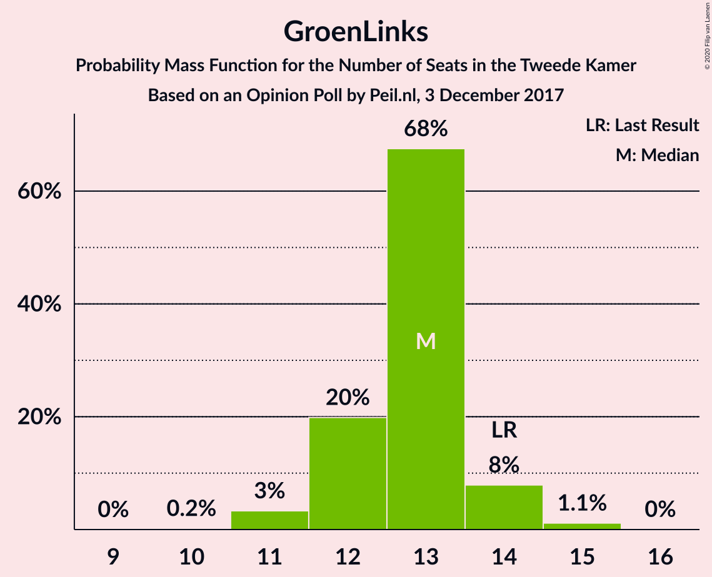
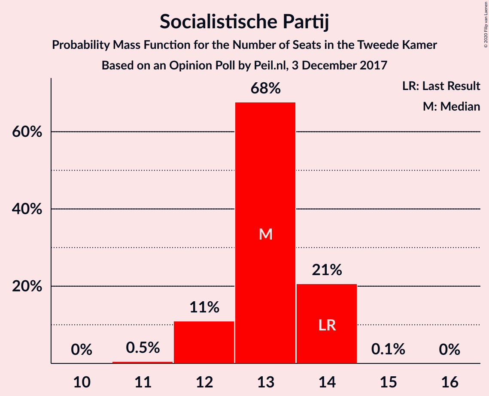
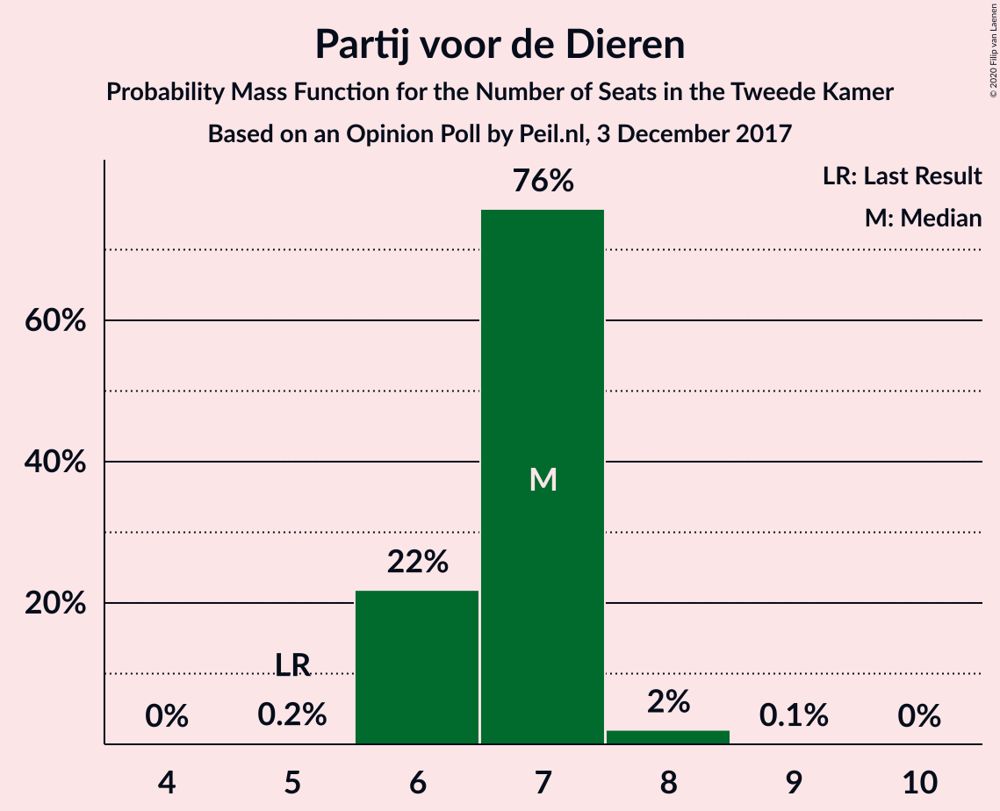
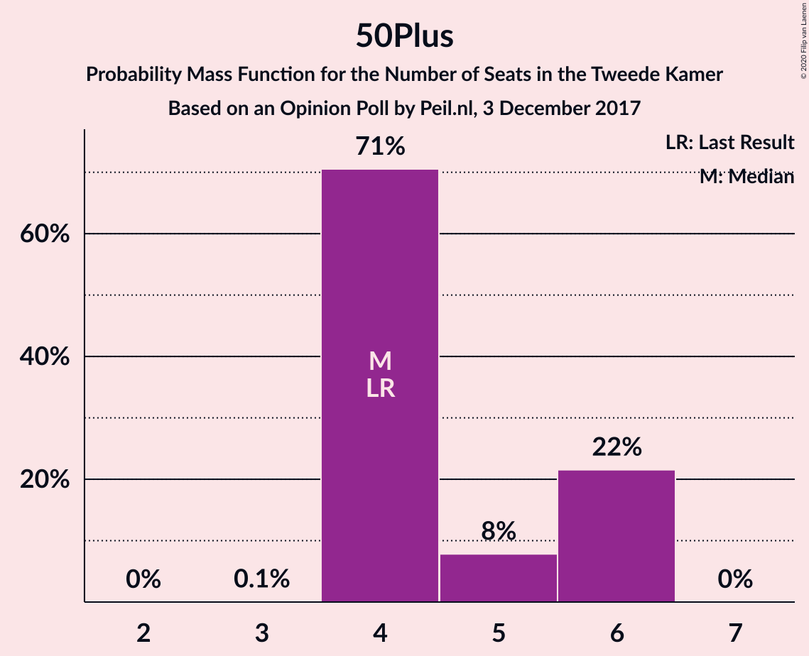
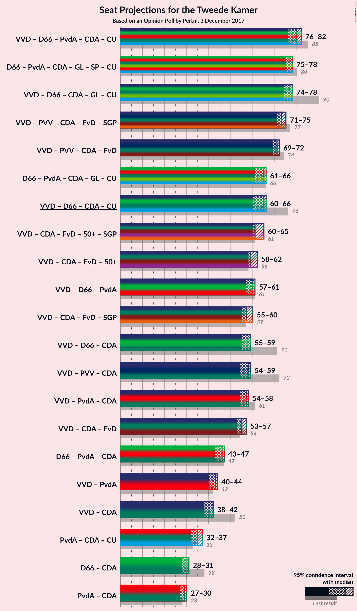
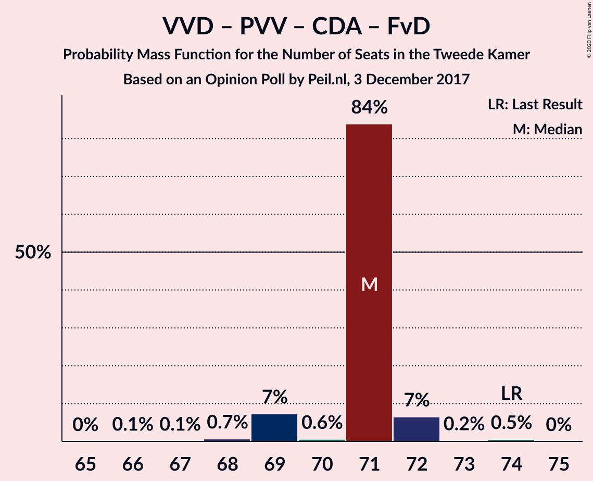
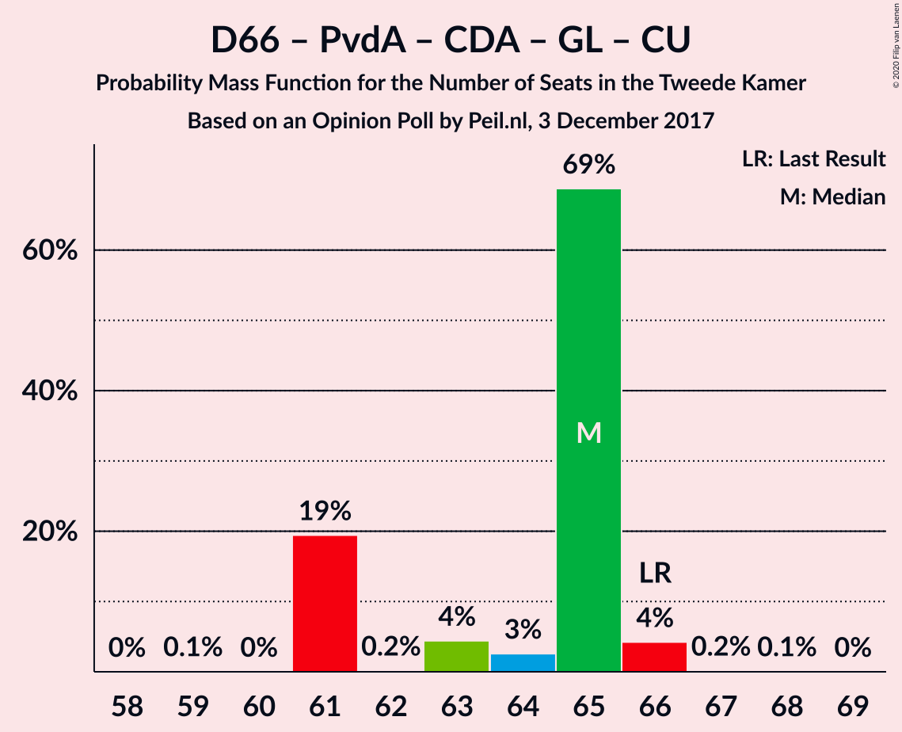
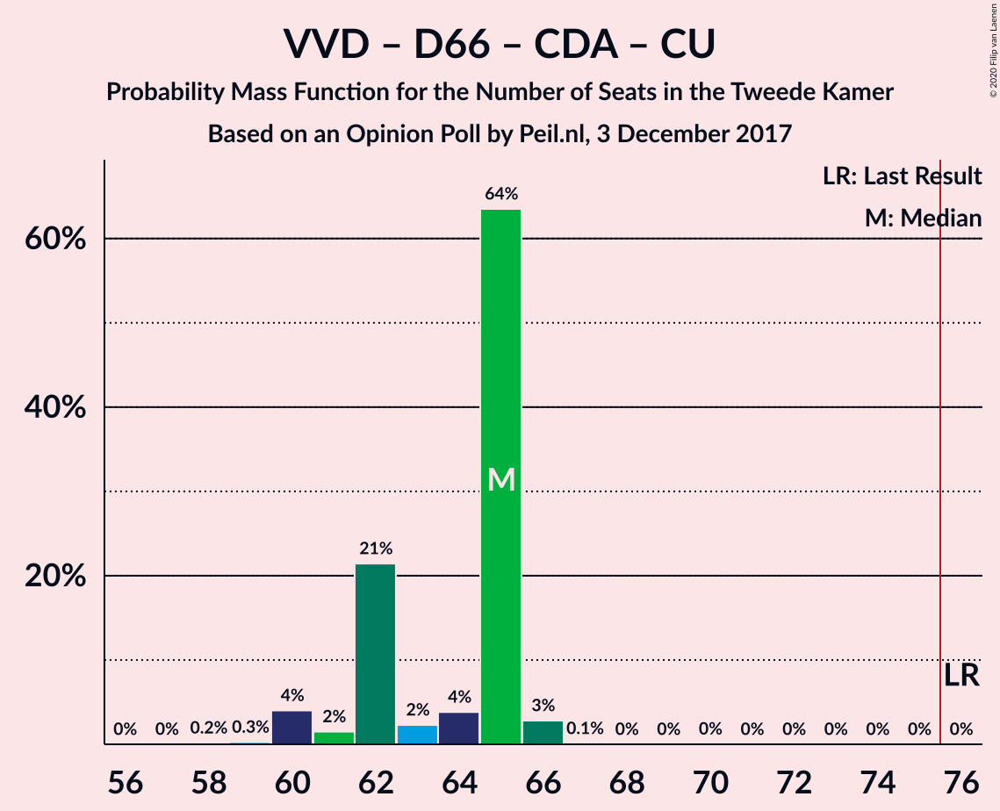

# Opinion Poll by Peil.nl, 3 December 2017

<a href="#voting-intentions">Voting Intentions</a> | <a href="#seats">Seats</a> | <a href="#coalitions">Coalitions</a> | <a href="#technical-information">Technical Information</a>

## Voting Intentions

### Confidence Intervals

| Party | Last Result | Poll Result | 80% Confidence Interval | 90% Confidence Interval | 95% Confidence Interval | 99% Confidence Interval |
|:-----:|:-----------:|:-----------:|:-----------------------:|:-----------------------:|:-----------------------:|:-----------------------:|
| Volkspartij voor Vrijheid en Democratie | 21.3% | 17.3% | 16.5–18.3% |16.2–18.5% |16.0–18.7% |15.6–19.2% |
| Democraten 66 | 12.2% | 10.7% | 10.0–11.4% |9.8–11.6% |9.6–11.8% |9.3–12.2% |
| Partij voor de Vrijheid | 13.1% | 10.0% | 9.3–10.7% |9.1–10.9% |9.0–11.1% |8.7–11.5% |
| Partij van de Arbeid | 5.7% | 10.0% | 9.3–10.7% |9.1–10.9% |9.0–11.1% |8.7–11.5% |
| Christen-Democratisch Appèl | 12.4% | 9.3% | 8.7–10.1% |8.5–10.3% |8.3–10.4% |8.0–10.8% |
| Forum voor Democratie | 1.8% | 9.3% | 8.7–10.1% |8.5–10.3% |8.3–10.4% |8.0–10.8% |
| GroenLinks | 9.1% | 8.7% | 8.0–9.4% |7.8–9.6% |7.7–9.7% |7.4–10.1% |
| Socialistische Partij | 9.1% | 8.7% | 8.0–9.4% |7.8–9.6% |7.7–9.7% |7.4–10.1% |
| Partij voor de Dieren | 3.2% | 4.7% | 4.2–5.2% |4.1–5.3% |4.0–5.5% |3.7–5.8% |
| ChristenUnie | 3.4% | 4.0% | 3.6–4.5% |3.4–4.6% |3.4–4.8% |3.2–5.0% |
| 50Plus | 3.1% | 3.3% | 2.9–3.8% |2.8–3.9% |2.7–4.0% |2.6–4.3% |
| Staatkundig Gereformeerde Partij | 2.1% | 2.0% | 1.7–2.4% |1.6–2.5% |1.6–2.6% |1.4–2.8% |
| DENK | 2.1% | 2.0% | 1.7–2.4% |1.6–2.5% |1.6–2.6% |1.4–2.8% |

*Note:* The poll result column reflects the actual value used in the calculations. Published results may vary slightly, and in addition be rounded to fewer digits.

## Seats

### Confidence Intervals

| Party | Last Result | Median | 80% Confidence Interval | 90% Confidence Interval | 95% Confidence Interval | 99% Confidence Interval |
|:-----:|:-----------:|:------:|:-----------------------:|:-----------------------:|:-----------------------:|:-----------------------:|
| <a href="#volkspartij-voor-vrijheid-en-democratie">Volkspartij voor Vrijheid en Democratie</a> | 33 | 24 | 24–26 |24–27 |24–28 |24–28 |
| <a href="#democraten-66">Democraten 66</a> | 19 | 17 | 16–17 |13–17 |13–17 |13–18 |
| <a href="#partij-voor-de-vrijheid">Partij voor de Vrijheid</a> | 20 | 16 | 16 |15–16 |15–16 |14–17 |
| <a href="#partij-van-de-arbeid">Partij van de Arbeid</a> | 9 | 16 | 16 |15–16 |14–16 |13–18 |
| <a href="#christen-democratisch-appèl">Christen-Democratisch Appèl</a> | 19 | 14 | 14 |14–15 |13–15 |13–16 |
| <a href="#forum-voor-democratie">Forum voor Democratie</a> | 2 | 15 | 15 |13–15 |13–15 |13–16 |
| <a href="#groenlinks">GroenLinks</a> | 14 | 14 | 14 |12–14 |12–14 |11–15 |
| <a href="#socialistische-partij">Socialistische Partij</a> | 14 | 12 | 12 |12–13 |11–13 |11–15 |
| <a href="#partij-voor-de-dieren">Partij voor de Dieren</a> | 5 | 7 | 7 |7–8 |6–8 |6–8 |
| <a href="#christenunie">ChristenUnie</a> | 5 | 5 | 5 |5–7 |5–7 |5–8 |
| <a href="#50plus">50Plus</a> | 4 | 5 | 5 |4–5 |4–5 |4–6 |
| <a href="#staatkundig-gereformeerde-partij">Staatkundig Gereformeerde Partij</a> | 3 | 2 | 2–3 |2–3 |2–3 |2–4 |
| <a href="#denk">DENK</a> | 3 | 3 | 3 |3 |2–3 |2–3 |

### Volkspartij voor Vrijheid en Democratie

*For a full overview of the results for this party, see the [Volkspartij voor Vrijheid en Democratie](party-volkspartijvoorvrijheidendemocratie.html) page.*

| Number of Seats | Probability | Accumulated | Special Marks |
|:---------------:|:-----------:|:-----------:|:-------------:|
| 24 | 86% | 100% | Median |
| 25 | 2% | 14% |  |
| 26 | 3% | 12% |  |
| 27 | 4% | 9% |  |
| 28 | 5% | 5% |  |
| 29 | 0% | 0% |  |
| 30 | 0% | 0% |  |
| 31 | 0% | 0% |  |
| 32 | 0% | 0% |  |
| 33 | 0% | 0% | Last Result |

### Democraten 66

*For a full overview of the results for this party, see the [Democraten 66](party-democraten66.html) page.*

| Number of Seats | Probability | Accumulated | Special Marks |
|:---------------:|:-----------:|:-----------:|:-------------:|
| 13 | 5% | 100% |  |
| 14 | 0% | 95% |  |
| 15 | 3% | 95% |  |
| 16 | 2% | 91% |  |
| 17 | 87% | 89% | Median |
| 18 | 2% | 2% |  |
| 19 | 0% | 0% | Last Result |

### Partij voor de Vrijheid

*For a full overview of the results for this party, see the [Partij voor de Vrijheid](party-partijvoordevrijheid.html) page.*

| Number of Seats | Probability | Accumulated | Special Marks |
|:---------------:|:-----------:|:-----------:|:-------------:|
| 13 | 0.5% | 100% |  |
| 14 | 2% | 99.5% |  |
| 15 | 4% | 98% |  |
| 16 | 92% | 94% | Median |
| 17 | 2% | 2% |  |
| 18 | 0% | 0% |  |
| 19 | 0% | 0% |  |
| 20 | 0% | 0% | Last Result |

### Partij van de Arbeid

*For a full overview of the results for this party, see the [Partij van de Arbeid](party-partijvandearbeid.html) page.*

| Number of Seats | Probability | Accumulated | Special Marks |
|:---------------:|:-----------:|:-----------:|:-------------:|
| 9 | 0% | 100% | Last Result |
| 10 | 0% | 100% |  |
| 11 | 0% | 100% |  |
| 12 | 0% | 100% |  |
| 13 | 2% | 100% |  |
| 14 | 0.5% | 98% |  |
| 15 | 3% | 97% |  |
| 16 | 93% | 95% | Median |
| 17 | 0.2% | 1.4% |  |
| 18 | 1.2% | 1.2% |  |
| 19 | 0% | 0% |  |

### Christen-Democratisch Appèl

*For a full overview of the results for this party, see the [Christen-Democratisch Appèl](party-christen-democratischappèl.html) page.*

| Number of Seats | Probability | Accumulated | Special Marks |
|:---------------:|:-----------:|:-----------:|:-------------:|
| 11 | 0.2% | 100% |  |
| 12 | 0% | 99.8% |  |
| 13 | 3% | 99.8% |  |
| 14 | 90% | 96% | Median |
| 15 | 6% | 6% |  |
| 16 | 0.5% | 0.5% |  |
| 17 | 0% | 0% |  |
| 18 | 0% | 0% |  |
| 19 | 0% | 0% | Last Result |

### Forum voor Democratie

*For a full overview of the results for this party, see the [Forum voor Democratie](party-forumvoordemocratie.html) page.*

| Number of Seats | Probability | Accumulated | Special Marks |
|:---------------:|:-----------:|:-----------:|:-------------:|
| 2 | 0% | 100% | Last Result |
| 3 | 0% | 100% |  |
| 4 | 0% | 100% |  |
| 5 | 0% | 100% |  |
| 6 | 0% | 100% |  |
| 7 | 0% | 100% |  |
| 8 | 0% | 100% |  |
| 9 | 0% | 100% |  |
| 10 | 0% | 100% |  |
| 11 | 0% | 100% |  |
| 12 | 0% | 100% |  |
| 13 | 6% | 100% |  |
| 14 | 3% | 94% |  |
| 15 | 89% | 90% | Median |
| 16 | 1.1% | 1.2% |  |
| 17 | 0.1% | 0.1% |  |
| 18 | 0% | 0% |  |

### GroenLinks

*For a full overview of the results for this party, see the [GroenLinks](party-groenlinks.html) page.*

| Number of Seats | Probability | Accumulated | Special Marks |
|:---------------:|:-----------:|:-----------:|:-------------:|
| 11 | 0.8% | 100% |  |
| 12 | 5% | 99.2% |  |
| 13 | 2% | 94% |  |
| 14 | 92% | 92% | Last Result, Median |
| 15 | 0.6% | 0.6% |  |
| 16 | 0% | 0% |  |

### Socialistische Partij

*For a full overview of the results for this party, see the [Socialistische Partij](party-socialistischepartij.html) page.*

| Number of Seats | Probability | Accumulated | Special Marks |
|:---------------:|:-----------:|:-----------:|:-------------:|
| 11 | 4% | 100% |  |
| 12 | 90% | 96% | Median |
| 13 | 4% | 6% |  |
| 14 | 1.5% | 2% | Last Result |
| 15 | 0.9% | 0.9% |  |
| 16 | 0% | 0% |  |

### Partij voor de Dieren

*For a full overview of the results for this party, see the [Partij voor de Dieren](party-partijvoordedieren.html) page.*

| Number of Seats | Probability | Accumulated | Special Marks |
|:---------------:|:-----------:|:-----------:|:-------------:|
| 5 | 0% | 100% | Last Result |
| 6 | 3% | 100% |  |
| 7 | 90% | 97% | Median |
| 8 | 6% | 6% |  |
| 9 | 0% | 0% |  |

### ChristenUnie

*For a full overview of the results for this party, see the [ChristenUnie](party-christenunie.html) page.*

| Number of Seats | Probability | Accumulated | Special Marks |
|:---------------:|:-----------:|:-----------:|:-------------:|
| 5 | 91% | 100% | Last Result, Median |
| 6 | 4% | 9% |  |
| 7 | 4% | 5% |  |
| 8 | 2% | 2% |  |
| 9 | 0% | 0% |  |

### 50Plus

*For a full overview of the results for this party, see the [50Plus](party-50plus.html) page.*

| Number of Seats | Probability | Accumulated | Special Marks |
|:---------------:|:-----------:|:-----------:|:-------------:|
| 4 | 7% | 100% | Last Result |
| 5 | 91% | 93% | Median |
| 6 | 2% | 2% |  |
| 7 | 0% | 0% |  |

### Staatkundig Gereformeerde Partij

*For a full overview of the results for this party, see the [Staatkundig Gereformeerde Partij](party-staatkundiggereformeerdepartij.html) page.*

| Number of Seats | Probability | Accumulated | Special Marks |
|:---------------:|:-----------:|:-----------:|:-------------:|
| 1 | 0.2% | 100% |  |
| 2 | 88% | 99.8% | Median |
| 3 | 9% | 11% | Last Result |
| 4 | 2% | 2% |  |
| 5 | 0% | 0% |  |

### DENK

*For a full overview of the results for this party, see the [DENK](party-denk.html) page.*

| Number of Seats | Probability | Accumulated | Special Marks |
|:---------------:|:-----------:|:-----------:|:-------------:|
| 2 | 3% | 100% |  |
| 3 | 96% | 96% | Last Result, Median |
| 4 | 0.5% | 0.5% |  |
| 5 | 0% | 0% |  |

## Coalitions

### Confidence Intervals

| Coalition | Last Result | Median | Majority? | 80% Confidence Interval | 90% Confidence Interval | 95% Confidence Interval | 99% Confidence Interval |
|:---------:|:-----------:|:------:|:---------:|:-----------------------:|:-----------------------:|:-----------------------:|:-----------------------:|
| Volkspartij voor Vrijheid en Democratie – Democraten 66 – Partij van de Arbeid – Christen-Democratisch Appèl – ChristenUnie | 85 | 76 | 97% | 76 | 76–79 | 74–80 | 74–82 |
| Volkspartij voor Vrijheid en Democratie – Democraten 66 – Christen-Democratisch Appèl – GroenLinks – ChristenUnie | 90 | 74 | 4% | 74 | 74–75 | 73–79 | 72–79 |
| Democraten 66 – Partij van de Arbeid – Christen-Democratisch Appèl – GroenLinks – Socialistische Partij – ChristenUnie | 80 | 78 | 94% | 78 | 75–78 | 74–78 | 74–80 |
| Volkspartij voor Vrijheid en Democratie – Partij voor de Vrijheid – Christen-Democratisch Appèl – Forum voor Democratie – Staatkundig Gereformeerde Partij | 77 | 71 | 1.1% | 71–73 | 71–74 | 71–75 | 70–76 |
| Volkspartij voor Vrijheid en Democratie – Partij voor de Vrijheid – Christen-Democratisch Appèl – Forum voor Democratie | 74 | 69 | 0% | 69–70 | 69–70 | 69–72 | 67–74 |
| Democraten 66 – Partij van de Arbeid – Christen-Democratisch Appèl – GroenLinks – ChristenUnie | 66 | 66 | 0% | 65–66 | 63–66 | 61–67 | 59–67 |
| Volkspartij voor Vrijheid en Democratie – Christen-Democratisch Appèl – Forum voor Democratie – 50Plus – Staatkundig Gereformeerde Partij | 61 | 60 | 0% | 60–62 | 60–63 | 60–64 | 60–65 |
| Volkspartij voor Vrijheid en Democratie – Democraten 66 – Christen-Democratisch Appèl – ChristenUnie | 76 | 60 | 0% | 60–61 | 60–63 | 60–64 | 58–67 |
| Volkspartij voor Vrijheid en Democratie – Christen-Democratisch Appèl – Forum voor Democratie – 50Plus | 58 | 58 | 0% | 58–59 | 58–60 | 58–61 | 57–63 |
| Volkspartij voor Vrijheid en Democratie – Christen-Democratisch Appèl – Forum voor Democratie – Staatkundig Gereformeerde Partij | 57 | 55 | 0% | 55–57 | 55–58 | 55–59 | 55–60 |
| Volkspartij voor Vrijheid en Democratie – Partij van de Arbeid – Christen-Democratisch Appèl | 61 | 54 | 0% | 54–55 | 54–58 | 54–59 | 52–59 |
| Volkspartij voor Vrijheid en Democratie – Partij voor de Vrijheid – Christen-Democratisch Appèl | 72 | 54 | 0% | 54–55 | 54–57 | 54–59 | 54–59 |
| Volkspartij voor Vrijheid en Democratie – Democraten 66 – Partij van de Arbeid | 61 | 57 | 0% | 57 | 57–59 | 54–59 | 54–60 |
| Volkspartij voor Vrijheid en Democratie – Democraten 66 – Christen-Democratisch Appèl | 71 | 55 | 0% | 55 | 55–56 | 54–58 | 52–60 |
| Volkspartij voor Vrijheid en Democratie – Christen-Democratisch Appèl – Forum voor Democratie | 54 | 53 | 0% | 53–54 | 53–55 | 53–56 | 53–58 |
| Democraten 66 – Partij van de Arbeid – Christen-Democratisch Appèl | 47 | 47 | 0% | 45–47 | 44–47 | 43–47 | 41–48 |
| Volkspartij voor Vrijheid en Democratie – Partij van de Arbeid | 42 | 40 | 0% | 40–41 | 40–44 | 40–44 | 39–44 |
| Volkspartij voor Vrijheid en Democratie – Christen-Democratisch Appèl | 52 | 38 | 0% | 38–40 | 38–42 | 38–43 | 38–43 |
| Partij van de Arbeid – Christen-Democratisch Appèl – ChristenUnie | 33 | 35 | 0% | 35–36 | 35–37 | 33–37 | 32–38 |
| Democraten 66 – Christen-Democratisch Appèl | 38 | 31 | 0% | 29–31 | 28–31 | 28–33 | 27–33 |
| Partij van de Arbeid – Christen-Democratisch Appèl | 28 | 30 | 0% | 30 | 30 | 28–31 | 26–32 |

### Volkspartij voor Vrijheid en Democratie – Democraten 66 – Partij van de Arbeid – Christen-Democratisch Appèl – ChristenUnie

| Number of Seats | Probability | Accumulated | Special Marks |
|:---------------:|:-----------:|:-----------:|:-------------:|
| 74 | 3% | 100% |  |
| 75 | 0.2% | 97% |  |
| 76 | 87% | 97% | Median, Majority |
| 77 | 4% | 9% |  |
| 78 | 0.5% | 6% |  |
| 79 | 1.2% | 5% |  |
| 80 | 2% | 4% |  |
| 81 | 0% | 2% |  |
| 82 | 2% | 2% |  |
| 83 | 0% | 0% |  |
| 84 | 0% | 0% |  |
| 85 | 0% | 0% | Last Result |

### Volkspartij voor Vrijheid en Democratie – Democraten 66 – Christen-Democratisch Appèl – GroenLinks – ChristenUnie

| Number of Seats | Probability | Accumulated | Special Marks |
|:---------------:|:-----------:|:-----------:|:-------------:|
| 72 | 2% | 100% |  |
| 73 | 1.4% | 98% |  |
| 74 | 89% | 97% | Median |
| 75 | 4% | 8% |  |
| 76 | 2% | 4% | Majority |
| 77 | 0.1% | 3% |  |
| 78 | 0% | 3% |  |
| 79 | 3% | 3% |  |
| 80 | 0% | 0% |  |
| 81 | 0% | 0% |  |
| 82 | 0% | 0% |  |
| 83 | 0% | 0% |  |
| 84 | 0% | 0% |  |
| 85 | 0% | 0% |  |
| 86 | 0% | 0% |  |
| 87 | 0% | 0% |  |
| 88 | 0% | 0% |  |
| 89 | 0% | 0% |  |
| 90 | 0% | 0% | Last Result |

### Democraten 66 – Partij van de Arbeid – Christen-Democratisch Appèl – GroenLinks – Socialistische Partij – ChristenUnie

| Number of Seats | Probability | Accumulated | Special Marks |
|:---------------:|:-----------:|:-----------:|:-------------:|
| 73 | 0.2% | 100% |  |
| 74 | 2% | 99.8% |  |
| 75 | 4% | 97% |  |
| 76 | 3% | 94% | Majority |
| 77 | 0.3% | 90% |  |
| 78 | 88% | 90% | Median |
| 79 | 1.2% | 2% |  |
| 80 | 0.1% | 0.5% | Last Result |
| 81 | 0.4% | 0.4% |  |
| 82 | 0% | 0% |  |

### Volkspartij voor Vrijheid en Democratie – Partij voor de Vrijheid – Christen-Democratisch Appèl – Forum voor Democratie – Staatkundig Gereformeerde Partij

| Number of Seats | Probability | Accumulated | Special Marks |
|:---------------:|:-----------:|:-----------:|:-------------:|
| 69 | 0.2% | 100% |  |
| 70 | 0.5% | 99.8% |  |
| 71 | 87% | 99.4% | Median |
| 72 | 2% | 12% |  |
| 73 | 4% | 10% |  |
| 74 | 2% | 7% |  |
| 75 | 4% | 5% |  |
| 76 | 1.1% | 1.1% | Majority |
| 77 | 0% | 0% | Last Result |

### Volkspartij voor Vrijheid en Democratie – Partij voor de Vrijheid – Christen-Democratisch Appèl – Forum voor Democratie

| Number of Seats | Probability | Accumulated | Special Marks |
|:---------------:|:-----------:|:-----------:|:-------------:|
| 67 | 0.6% | 100% |  |
| 68 | 0% | 99.4% |  |
| 69 | 89% | 99.3% | Median |
| 70 | 6% | 10% |  |
| 71 | 0% | 5% |  |
| 72 | 4% | 5% |  |
| 73 | 0% | 0.8% |  |
| 74 | 0.8% | 0.8% | Last Result |
| 75 | 0% | 0% |  |

### Democraten 66 – Partij van de Arbeid – Christen-Democratisch Appèl – GroenLinks – ChristenUnie

| Number of Seats | Probability | Accumulated | Special Marks |
|:---------------:|:-----------:|:-----------:|:-------------:|
| 59 | 0.8% | 100% |  |
| 60 | 0% | 99.2% |  |
| 61 | 2% | 99.2% |  |
| 62 | 0.2% | 97% |  |
| 63 | 6% | 97% |  |
| 64 | 0% | 92% |  |
| 65 | 3% | 92% |  |
| 66 | 86% | 89% | Last Result, Median |
| 67 | 2% | 3% |  |
| 68 | 0.4% | 0.5% |  |
| 69 | 0% | 0% |  |

### Volkspartij voor Vrijheid en Democratie – Christen-Democratisch Appèl – Forum voor Democratie – 50Plus – Staatkundig Gereformeerde Partij

| Number of Seats | Probability | Accumulated | Special Marks |
|:---------------:|:-----------:|:-----------:|:-------------:|
| 59 | 0.2% | 100% |  |
| 60 | 87% | 99.8% | Median |
| 61 | 2% | 13% | Last Result |
| 62 | 2% | 10% |  |
| 63 | 5% | 9% |  |
| 64 | 2% | 3% |  |
| 65 | 0.8% | 1.1% |  |
| 66 | 0.2% | 0.3% |  |
| 67 | 0.1% | 0.1% |  |
| 68 | 0% | 0% |  |

### Volkspartij voor Vrijheid en Democratie – Democraten 66 – Christen-Democratisch Appèl – ChristenUnie

| Number of Seats | Probability | Accumulated | Special Marks |
|:---------------:|:-----------:|:-----------:|:-------------:|
| 58 | 2% | 100% |  |
| 59 | 0% | 98% |  |
| 60 | 86% | 98% | Median |
| 61 | 7% | 12% |  |
| 62 | 0% | 5% |  |
| 63 | 0.9% | 5% |  |
| 64 | 2% | 4% |  |
| 65 | 0% | 2% |  |
| 66 | 0% | 2% |  |
| 67 | 2% | 2% |  |
| 68 | 0% | 0% |  |
| 69 | 0% | 0% |  |
| 70 | 0% | 0% |  |
| 71 | 0% | 0% |  |
| 72 | 0% | 0% |  |
| 73 | 0% | 0% |  |
| 74 | 0% | 0% |  |
| 75 | 0% | 0% |  |
| 76 | 0% | 0% | Last Result, Majority |

### Volkspartij voor Vrijheid en Democratie – Christen-Democratisch Appèl – Forum voor Democratie – 50Plus

| Number of Seats | Probability | Accumulated | Special Marks |
|:---------------:|:-----------:|:-----------:|:-------------:|
| 57 | 2% | 100% |  |
| 58 | 88% | 98% | Last Result, Median |
| 59 | 2% | 10% |  |
| 60 | 5% | 9% |  |
| 61 | 2% | 3% |  |
| 62 | 0.3% | 1.2% |  |
| 63 | 0.9% | 0.9% |  |
| 64 | 0% | 0% |  |

### Volkspartij voor Vrijheid en Democratie – Christen-Democratisch Appèl – Forum voor Democratie – Staatkundig Gereformeerde Partij

| Number of Seats | Probability | Accumulated | Special Marks |
|:---------------:|:-----------:|:-----------:|:-------------:|
| 54 | 0.2% | 100% |  |
| 55 | 86% | 99.8% | Median |
| 56 | 1.4% | 14% |  |
| 57 | 4% | 12% | Last Result |
| 58 | 4% | 9% |  |
| 59 | 4% | 5% |  |
| 60 | 0.8% | 1.1% |  |
| 61 | 0.3% | 0.3% |  |
| 62 | 0.1% | 0.1% |  |
| 63 | 0% | 0% |  |

### Volkspartij voor Vrijheid en Democratie – Partij van de Arbeid – Christen-Democratisch Appèl

| Number of Seats | Probability | Accumulated | Special Marks |
|:---------------:|:-----------:|:-----------:|:-------------:|
| 52 | 1.5% | 100% |  |
| 53 | 0% | 98.5% |  |
| 54 | 86% | 98% | Median |
| 55 | 3% | 12% |  |
| 56 | 2% | 9% |  |
| 57 | 2% | 7% |  |
| 58 | 1.3% | 5% |  |
| 59 | 4% | 4% |  |
| 60 | 0% | 0% |  |
| 61 | 0% | 0% | Last Result |

### Volkspartij voor Vrijheid en Democratie – Partij voor de Vrijheid – Christen-Democratisch Appèl

| Number of Seats | Probability | Accumulated | Special Marks |
|:---------------:|:-----------:|:-----------:|:-------------:|
| 53 | 0.2% | 100% |  |
| 54 | 88% | 99.8% | Median |
| 55 | 3% | 12% |  |
| 56 | 2% | 9% |  |
| 57 | 2% | 7% |  |
| 58 | 0.8% | 4% |  |
| 59 | 4% | 4% |  |
| 60 | 0% | 0% |  |
| 61 | 0% | 0% |  |
| 62 | 0% | 0% |  |
| 63 | 0% | 0% |  |
| 64 | 0% | 0% |  |
| 65 | 0% | 0% |  |
| 66 | 0% | 0% |  |
| 67 | 0% | 0% |  |
| 68 | 0% | 0% |  |
| 69 | 0% | 0% |  |
| 70 | 0% | 0% |  |
| 71 | 0% | 0% |  |
| 72 | 0% | 0% | Last Result |

### Volkspartij voor Vrijheid en Democratie – Democraten 66 – Partij van de Arbeid

| Number of Seats | Probability | Accumulated | Special Marks |
|:---------------:|:-----------:|:-----------:|:-------------:|
| 54 | 3% | 100% |  |
| 55 | 0.1% | 97% |  |
| 56 | 0.5% | 97% |  |
| 57 | 91% | 96% | Median |
| 58 | 0.3% | 6% |  |
| 59 | 3% | 5% |  |
| 60 | 2% | 2% |  |
| 61 | 0% | 0% | Last Result |

### Volkspartij voor Vrijheid en Democratie – Democraten 66 – Christen-Democratisch Appèl

| Number of Seats | Probability | Accumulated | Special Marks |
|:---------------:|:-----------:|:-----------:|:-------------:|
| 52 | 2% | 100% |  |
| 53 | 0.2% | 98% |  |
| 54 | 2% | 98% |  |
| 55 | 87% | 96% | Median |
| 56 | 6% | 9% |  |
| 57 | 0.2% | 4% |  |
| 58 | 1.3% | 3% |  |
| 59 | 0% | 2% |  |
| 60 | 2% | 2% |  |
| 61 | 0% | 0% |  |
| 62 | 0% | 0% |  |
| 63 | 0% | 0% |  |
| 64 | 0% | 0% |  |
| 65 | 0% | 0% |  |
| 66 | 0% | 0% |  |
| 67 | 0% | 0% |  |
| 68 | 0% | 0% |  |
| 69 | 0% | 0% |  |
| 70 | 0% | 0% |  |
| 71 | 0% | 0% | Last Result |

### Volkspartij voor Vrijheid en Democratie – Christen-Democratisch Appèl – Forum voor Democratie

| Number of Seats | Probability | Accumulated | Special Marks |
|:---------------:|:-----------:|:-----------:|:-------------:|
| 52 | 0.2% | 100% |  |
| 53 | 88% | 99.8% | Median |
| 54 | 3% | 12% | Last Result |
| 55 | 4% | 9% |  |
| 56 | 4% | 5% |  |
| 57 | 0.3% | 1.2% |  |
| 58 | 0.9% | 0.9% |  |
| 59 | 0% | 0% |  |

### Democraten 66 – Partij van de Arbeid – Christen-Democratisch Appèl

| Number of Seats | Probability | Accumulated | Special Marks |
|:---------------:|:-----------:|:-----------:|:-------------:|
| 41 | 1.5% | 100% |  |
| 42 | 0% | 98.5% |  |
| 43 | 3% | 98.5% |  |
| 44 | 4% | 95% |  |
| 45 | 2% | 92% |  |
| 46 | 0% | 90% |  |
| 47 | 88% | 90% | Last Result, Median |
| 48 | 2% | 2% |  |
| 49 | 0% | 0% |  |

### Volkspartij voor Vrijheid en Democratie – Partij van de Arbeid

| Number of Seats | Probability | Accumulated | Special Marks |
|:---------------:|:-----------:|:-----------:|:-------------:|
| 39 | 2% | 100% |  |
| 40 | 86% | 98% | Median |
| 41 | 3% | 12% |  |
| 42 | 2% | 9% | Last Result |
| 43 | 2% | 7% |  |
| 44 | 5% | 5% |  |
| 45 | 0% | 0% |  |

### Volkspartij voor Vrijheid en Democratie – Christen-Democratisch Appèl

| Number of Seats | Probability | Accumulated | Special Marks |
|:---------------:|:-----------:|:-----------:|:-------------:|
| 38 | 86% | 100% | Median |
| 39 | 3% | 14% |  |
| 40 | 3% | 10% |  |
| 41 | 0.8% | 8% |  |
| 42 | 3% | 7% |  |
| 43 | 4% | 4% |  |
| 44 | 0% | 0% |  |
| 45 | 0% | 0% |  |
| 46 | 0% | 0% |  |
| 47 | 0% | 0% |  |
| 48 | 0% | 0% |  |
| 49 | 0% | 0% |  |
| 50 | 0% | 0% |  |
| 51 | 0% | 0% |  |
| 52 | 0% | 0% | Last Result |

### Partij van de Arbeid – Christen-Democratisch Appèl – ChristenUnie

| Number of Seats | Probability | Accumulated | Special Marks |
|:---------------:|:-----------:|:-----------:|:-------------:|
| 32 | 0.8% | 100% |  |
| 33 | 2% | 99.2% | Last Result |
| 34 | 0.2% | 97% |  |
| 35 | 86% | 97% | Median |
| 36 | 6% | 11% |  |
| 37 | 4% | 5% |  |
| 38 | 1.2% | 1.3% |  |
| 39 | 0% | 0% |  |

### Democraten 66 – Christen-Democratisch Appèl

| Number of Seats | Probability | Accumulated | Special Marks |
|:---------------:|:-----------:|:-----------:|:-------------:|
| 26 | 0.2% | 100% |  |
| 27 | 2% | 99.8% |  |
| 28 | 5% | 98% |  |
| 29 | 3% | 93% |  |
| 30 | 0.9% | 90% |  |
| 31 | 86% | 89% | Median |
| 32 | 0% | 3% |  |
| 33 | 3% | 3% |  |
| 34 | 0% | 0% |  |
| 35 | 0% | 0% |  |
| 36 | 0% | 0% |  |
| 37 | 0% | 0% |  |
| 38 | 0% | 0% | Last Result |

### Partij van de Arbeid – Christen-Democratisch Appèl

| Number of Seats | Probability | Accumulated | Special Marks |
|:---------------:|:-----------:|:-----------:|:-------------:|
| 26 | 1.5% | 100% |  |
| 27 | 0.8% | 98.5% |  |
| 28 | 0.5% | 98% | Last Result |
| 29 | 2% | 97% |  |
| 30 | 91% | 96% | Median |
| 31 | 4% | 5% |  |
| 32 | 1.2% | 1.2% |  |
| 33 | 0% | 0% |  |

## Technical Information

### Opinion Poll

+ **Polling firm:** Peil.nl
+ **Commissioner(s):** —
+ **Fieldwork period:** 3 December 2017

### Calculations

+ **Sample size:** 3000
+ **Simulations done:** 131,072
+ **Error estimate:** 2.10%

