# Opinion Poll by Peil.nl, 17 December 2017

<a href="#voting-intentions">Voting Intentions</a> | <a href="#seats">Seats</a> | <a href="#coalitions">Coalitions</a> | <a href="#technical-information">Technical Information</a>

## Voting Intentions

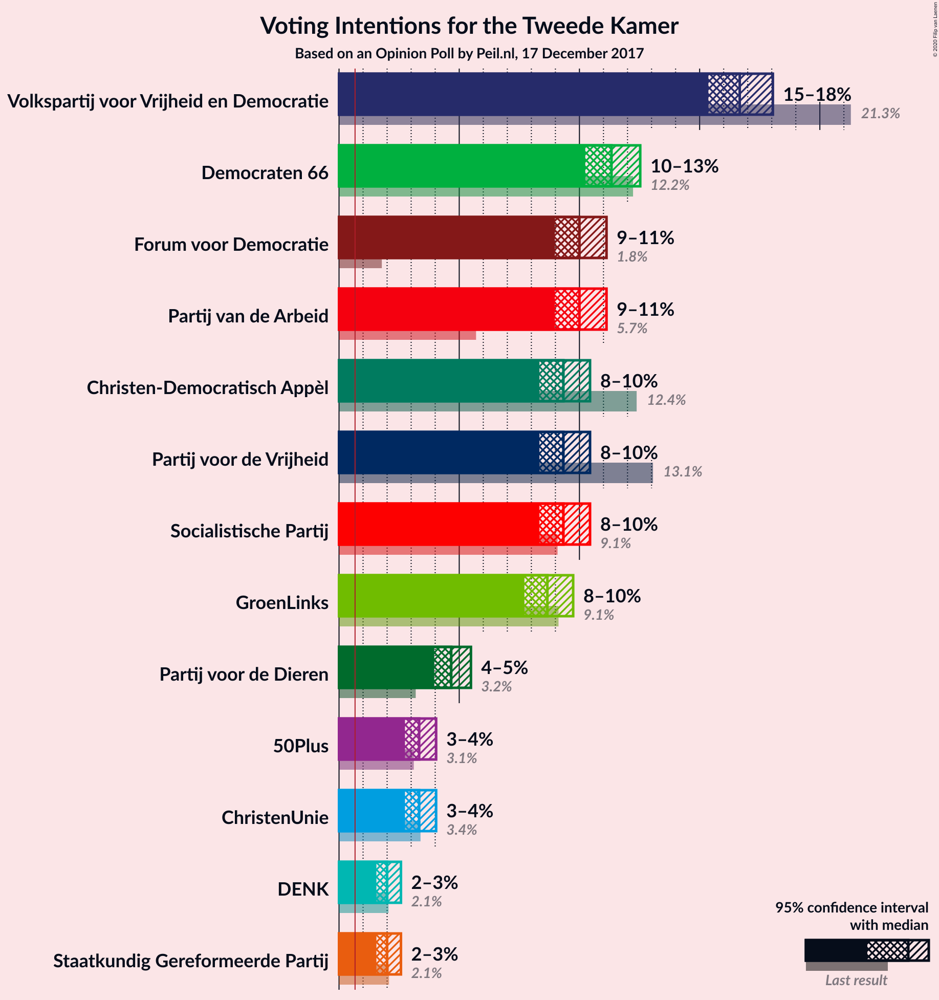

### Confidence Intervals

| Party | Last Result | Poll Result | 80% Confidence Interval | 90% Confidence Interval | 95% Confidence Interval | 99% Confidence Interval |
|:-----:|:-----------:|:-----------:|:-----------------------:|:-----------------------:|:-----------------------:|:-----------------------:|
| Volkspartij voor Vrijheid en Democratie | 21.3% | 16.7% | 15.8–17.6% |15.6–17.8% |15.4–18.0% |15.0–18.5% |
| Democraten 66 | 12.2% | 11.3% | 10.6–12.1% |10.4–12.3% |10.2–12.5% |9.9–12.9% |
| Partij van de Arbeid | 5.7% | 10.0% | 9.3–10.7% |9.1–10.9% |9.0–11.1% |8.7–11.5% |
| Forum voor Democratie | 1.8% | 10.0% | 9.3–10.7% |9.1–10.9% |9.0–11.1% |8.7–11.5% |
| Partij voor de Vrijheid | 13.1% | 9.3% | 8.7–10.1% |8.5–10.3% |8.3–10.4% |8.0–10.8% |
| Christen-Democratisch Appèl | 12.4% | 9.3% | 8.7–10.1% |8.5–10.3% |8.3–10.4% |8.0–10.8% |
| Socialistische Partij | 9.1% | 9.3% | 8.7–10.1% |8.5–10.3% |8.3–10.4% |8.0–10.8% |
| GroenLinks | 9.1% | 8.7% | 8.0–9.4% |7.8–9.6% |7.7–9.7% |7.4–10.1% |
| Partij voor de Dieren | 3.2% | 4.7% | 4.2–5.2% |4.1–5.3% |4.0–5.5% |3.7–5.8% |
| ChristenUnie | 3.4% | 3.3% | 2.9–3.8% |2.8–3.9% |2.7–4.0% |2.6–4.3% |
| 50Plus | 3.1% | 3.3% | 2.9–3.8% |2.8–3.9% |2.7–4.0% |2.6–4.3% |
| Staatkundig Gereformeerde Partij | 2.1% | 2.0% | 1.7–2.4% |1.6–2.5% |1.6–2.6% |1.4–2.8% |
| DENK | 2.1% | 2.0% | 1.7–2.4% |1.6–2.5% |1.6–2.6% |1.4–2.8% |

*Note:* The poll result column reflects the actual value used in the calculations. Published results may vary slightly, and in addition be rounded to fewer digits.

## Seats

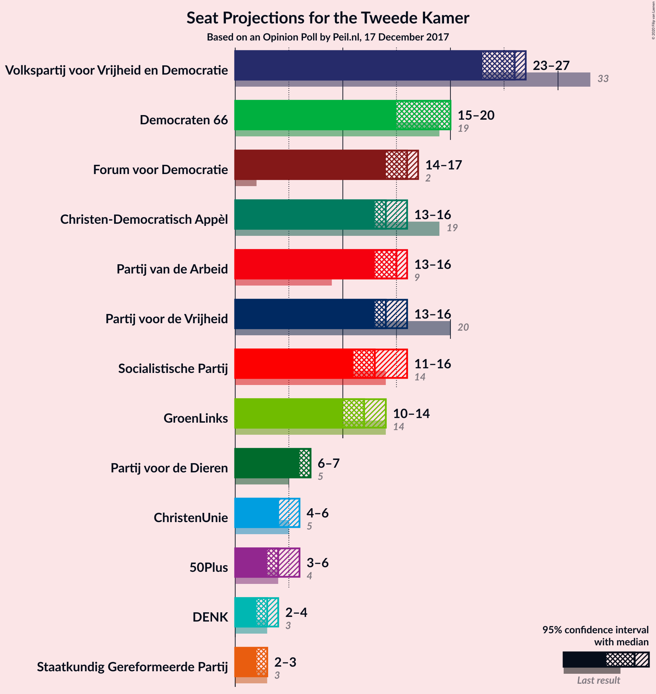

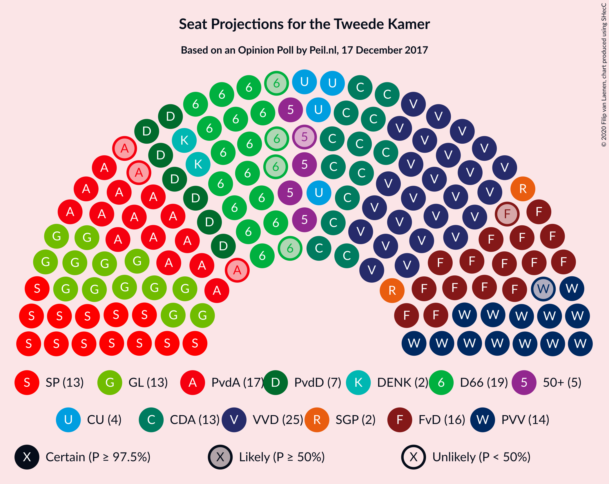

### Confidence Intervals

| Party | Last Result | Median | 80% Confidence Interval | 90% Confidence Interval | 95% Confidence Interval | 99% Confidence Interval |
|:-----:|:-----------:|:------:|:-----------------------:|:-----------------------:|:-----------------------:|:-----------------------:|
| <a href="#volkspartij-voor-vrijheid-en-democratie">Volkspartij voor Vrijheid en Democratie</a> | 33 | 26 | 23–27 |23–27 |23–27 |23–29 |
| <a href="#democraten-66">Democraten 66</a> | 19 | 20 | 17–20 |15–20 |15–20 |15–20 |
| <a href="#partij-van-de-arbeid">Partij van de Arbeid</a> | 9 | 15 | 14–16 |14–16 |13–16 |12–17 |
| <a href="#forum-voor-democratie">Forum voor Democratie</a> | 2 | 16 | 15–17 |14–17 |14–17 |14–17 |
| <a href="#partij-voor-de-vrijheid">Partij voor de Vrijheid</a> | 20 | 14 | 13–15 |13–15 |13–16 |11–16 |
| <a href="#christen-democratisch-appèl">Christen-Democratisch Appèl</a> | 19 | 14 | 13–15 |13–16 |13–16 |12–17 |
| <a href="#socialistische-partij">Socialistische Partij</a> | 14 | 13 | 13–15 |12–16 |11–16 |11–16 |
| <a href="#groenlinks">GroenLinks</a> | 14 | 12 | 12–14 |12–14 |10–14 |10–16 |
| <a href="#partij-voor-de-dieren">Partij voor de Dieren</a> | 5 | 7 | 7 |6–7 |6–7 |5–8 |
| <a href="#christenunie">ChristenUnie</a> | 5 | 4 | 4–5 |4–6 |4–6 |4–6 |
| <a href="#50plus">50Plus</a> | 4 | 4 | 3–5 |3–5 |3–6 |3–6 |
| <a href="#staatkundig-gereformeerde-partij">Staatkundig Gereformeerde Partij</a> | 3 | 3 | 2–3 |2–3 |2–3 |2–3 |
| <a href="#denk">DENK</a> | 3 | 3 | 3 |2–3 |2–4 |2–4 |

### Volkspartij voor Vrijheid en Democratie

*For a full overview of the results for this party, see the [Volkspartij voor Vrijheid en Democratie](party-volkspartijvoorvrijheidendemocratie.html) page.*

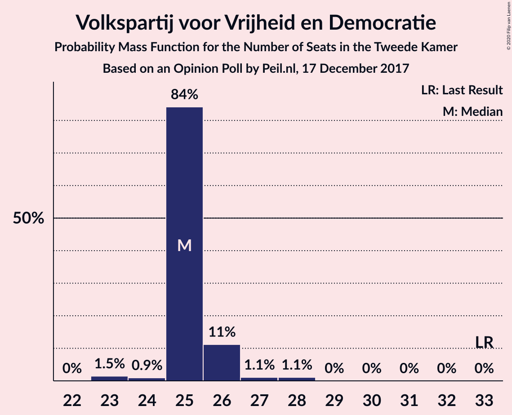

| Number of Seats | Probability | Accumulated | Special Marks |
|:---------------:|:-----------:|:-----------:|:-------------:|
| 22 | 0% | 100% |  |
| 23 | 42% | 99.9% |  |
| 24 | 0.1% | 58% |  |
| 25 | 7% | 58% |  |
| 26 | 40% | 50% | Median |
| 27 | 9% | 10% |  |
| 28 | 0.1% | 0.9% |  |
| 29 | 0.8% | 0.8% |  |
| 30 | 0% | 0% |  |
| 31 | 0% | 0% |  |
| 32 | 0% | 0% |  |
| 33 | 0% | 0% | Last Result |

### Democraten 66

*For a full overview of the results for this party, see the [Democraten 66](party-democraten66.html) page.*

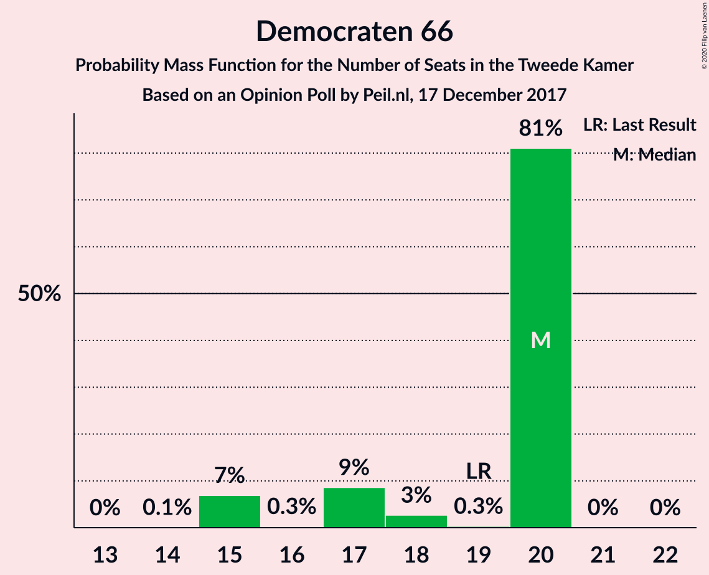

| Number of Seats | Probability | Accumulated | Special Marks |
|:---------------:|:-----------:|:-----------:|:-------------:|
| 14 | 0.1% | 100% |  |
| 15 | 7% | 99.9% |  |
| 16 | 0.3% | 93% |  |
| 17 | 9% | 93% |  |
| 18 | 3% | 84% |  |
| 19 | 0.3% | 81% | Last Result |
| 20 | 81% | 81% | Median |
| 21 | 0% | 0.1% |  |
| 22 | 0% | 0% |  |

### Partij van de Arbeid

*For a full overview of the results for this party, see the [Partij van de Arbeid](party-partijvandearbeid.html) page.*

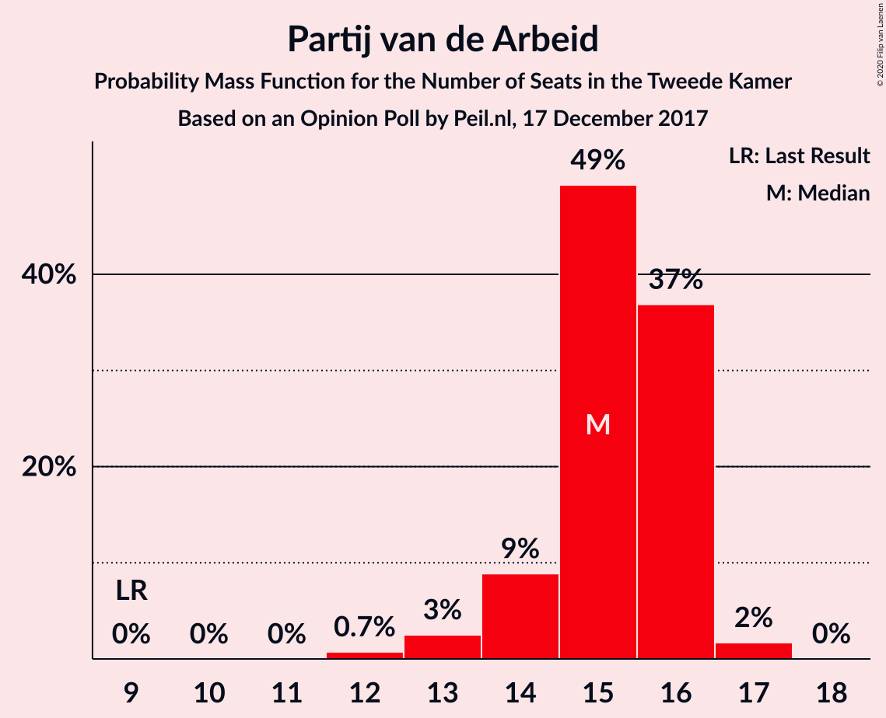

| Number of Seats | Probability | Accumulated | Special Marks |
|:---------------:|:-----------:|:-----------:|:-------------:|
| 9 | 0% | 100% | Last Result |
| 10 | 0% | 100% |  |
| 11 | 0% | 100% |  |
| 12 | 0.7% | 100% |  |
| 13 | 3% | 99.3% |  |
| 14 | 9% | 97% |  |
| 15 | 49% | 88% | Median |
| 16 | 37% | 39% |  |
| 17 | 2% | 2% |  |
| 18 | 0% | 0% |  |

### Forum voor Democratie

*For a full overview of the results for this party, see the [Forum voor Democratie](party-forumvoordemocratie.html) page.*

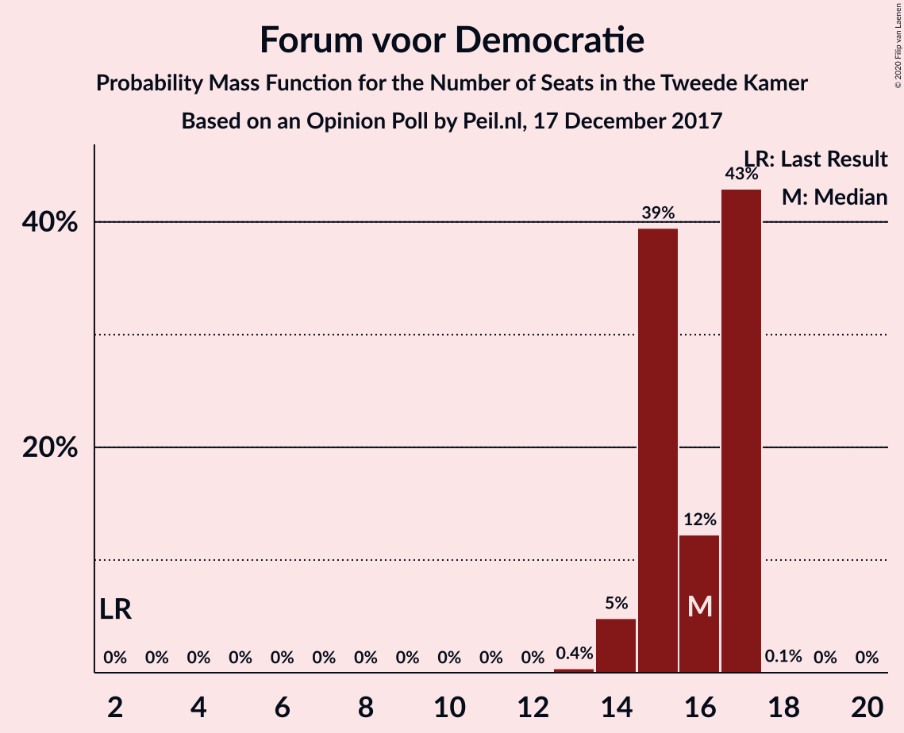

| Number of Seats | Probability | Accumulated | Special Marks |
|:---------------:|:-----------:|:-----------:|:-------------:|
| 2 | 0% | 100% | Last Result |
| 3 | 0% | 100% |  |
| 4 | 0% | 100% |  |
| 5 | 0% | 100% |  |
| 6 | 0% | 100% |  |
| 7 | 0% | 100% |  |
| 8 | 0% | 100% |  |
| 9 | 0% | 100% |  |
| 10 | 0% | 100% |  |
| 11 | 0% | 100% |  |
| 12 | 0% | 100% |  |
| 13 | 0.4% | 100% |  |
| 14 | 5% | 99.6% |  |
| 15 | 39% | 95% |  |
| 16 | 12% | 55% | Median |
| 17 | 43% | 43% |  |
| 18 | 0.1% | 0.1% |  |
| 19 | 0% | 0% |  |

### Partij voor de Vrijheid

*For a full overview of the results for this party, see the [Partij voor de Vrijheid](party-partijvoordevrijheid.html) page.*

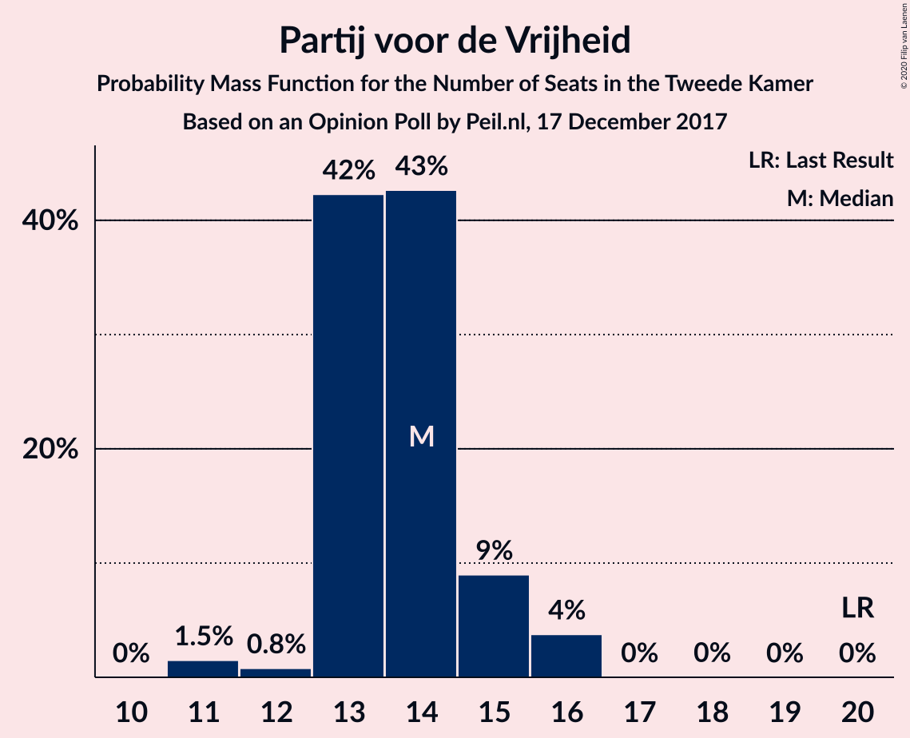

| Number of Seats | Probability | Accumulated | Special Marks |
|:---------------:|:-----------:|:-----------:|:-------------:|
| 11 | 1.5% | 100% |  |
| 12 | 0.8% | 98.5% |  |
| 13 | 42% | 98% |  |
| 14 | 43% | 55% | Median |
| 15 | 9% | 13% |  |
| 16 | 4% | 4% |  |
| 17 | 0% | 0.1% |  |
| 18 | 0% | 0% |  |
| 19 | 0% | 0% |  |
| 20 | 0% | 0% | Last Result |

### Christen-Democratisch Appèl

*For a full overview of the results for this party, see the [Christen-Democratisch Appèl](party-christen-democratischappèl.html) page.*

| Number of Seats | Probability | Accumulated | Special Marks |
|:---------------:|:-----------:|:-----------:|:-------------:|
| 11 | 0.3% | 100% |  |
| 12 | 2% | 99.7% |  |
| 13 | 43% | 98% |  |
| 14 | 43% | 55% | Median |
| 15 | 6% | 12% |  |
| 16 | 6% | 6% |  |
| 17 | 0.5% | 0.5% |  |
| 18 | 0% | 0% |  |
| 19 | 0% | 0% | Last Result |

### Socialistische Partij

*For a full overview of the results for this party, see the [Socialistische Partij](party-socialistischepartij.html) page.*

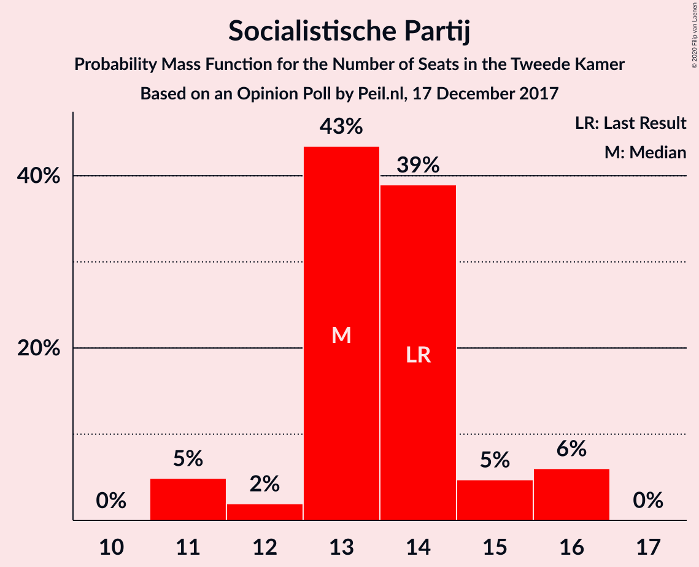

| Number of Seats | Probability | Accumulated | Special Marks |
|:---------------:|:-----------:|:-----------:|:-------------:|
| 11 | 5% | 100% |  |
| 12 | 2% | 95% |  |
| 13 | 43% | 93% | Median |
| 14 | 39% | 50% | Last Result |
| 15 | 5% | 11% |  |
| 16 | 6% | 6% |  |
| 17 | 0% | 0% |  |

### GroenLinks

*For a full overview of the results for this party, see the [GroenLinks](party-groenlinks.html) page.*

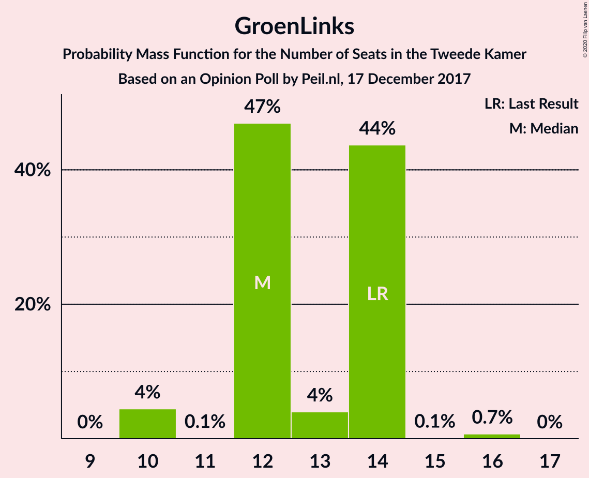

| Number of Seats | Probability | Accumulated | Special Marks |
|:---------------:|:-----------:|:-----------:|:-------------:|
| 10 | 4% | 100% |  |
| 11 | 0.1% | 96% |  |
| 12 | 47% | 95% | Median |
| 13 | 4% | 49% |  |
| 14 | 44% | 45% | Last Result |
| 15 | 0.1% | 0.8% |  |
| 16 | 0.7% | 0.7% |  |
| 17 | 0% | 0% |  |

### Partij voor de Dieren

*For a full overview of the results for this party, see the [Partij voor de Dieren](party-partijvoordedieren.html) page.*

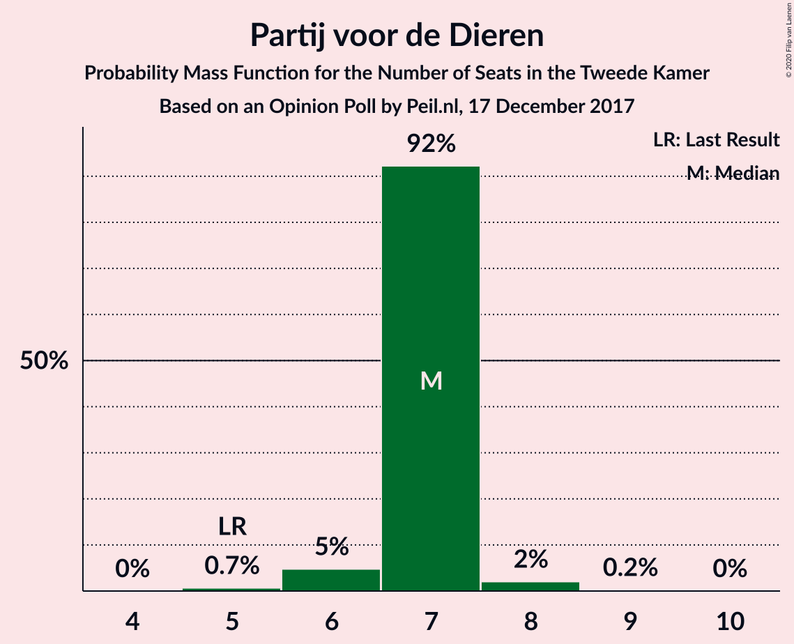

| Number of Seats | Probability | Accumulated | Special Marks |
|:---------------:|:-----------:|:-----------:|:-------------:|
| 5 | 0.7% | 100% | Last Result |
| 6 | 5% | 99.3% |  |
| 7 | 92% | 95% | Median |
| 8 | 2% | 2% |  |
| 9 | 0.2% | 0.3% |  |
| 10 | 0% | 0% |  |

### ChristenUnie

*For a full overview of the results for this party, see the [ChristenUnie](party-christenunie.html) page.*

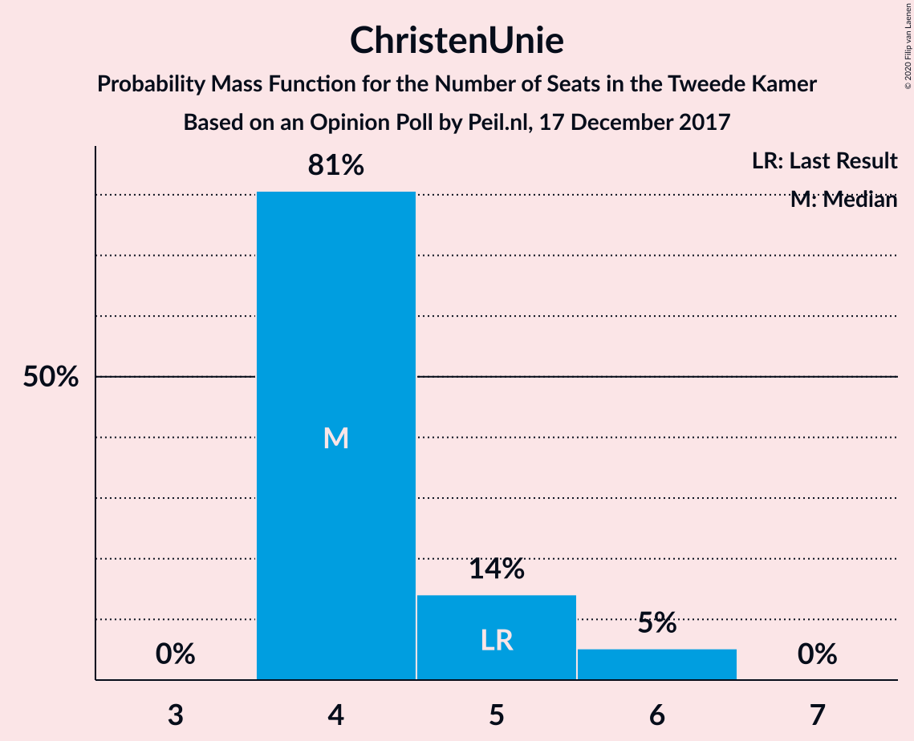

| Number of Seats | Probability | Accumulated | Special Marks |
|:---------------:|:-----------:|:-----------:|:-------------:|
| 4 | 81% | 100% | Median |
| 5 | 14% | 19% | Last Result |
| 6 | 5% | 5% |  |
| 7 | 0% | 0% |  |

### 50Plus

*For a full overview of the results for this party, see the [50Plus](party-50plus.html) page.*

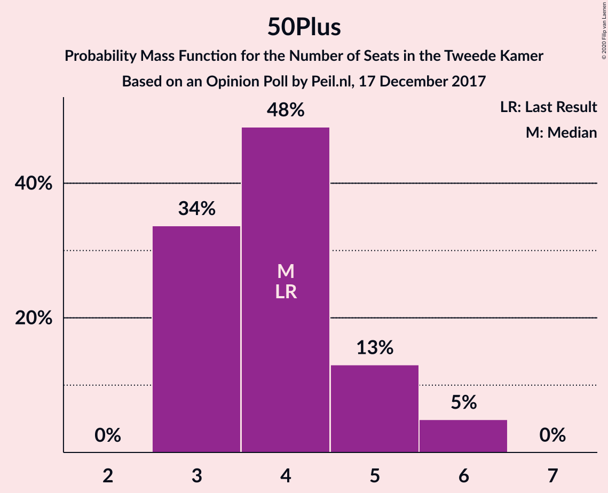

| Number of Seats | Probability | Accumulated | Special Marks |
|:---------------:|:-----------:|:-----------:|:-------------:|
| 3 | 34% | 100% |  |
| 4 | 48% | 66% | Last Result, Median |
| 5 | 13% | 18% |  |
| 6 | 5% | 5% |  |
| 7 | 0% | 0% |  |

### Staatkundig Gereformeerde Partij

*For a full overview of the results for this party, see the [Staatkundig Gereformeerde Partij](party-staatkundiggereformeerdepartij.html) page.*

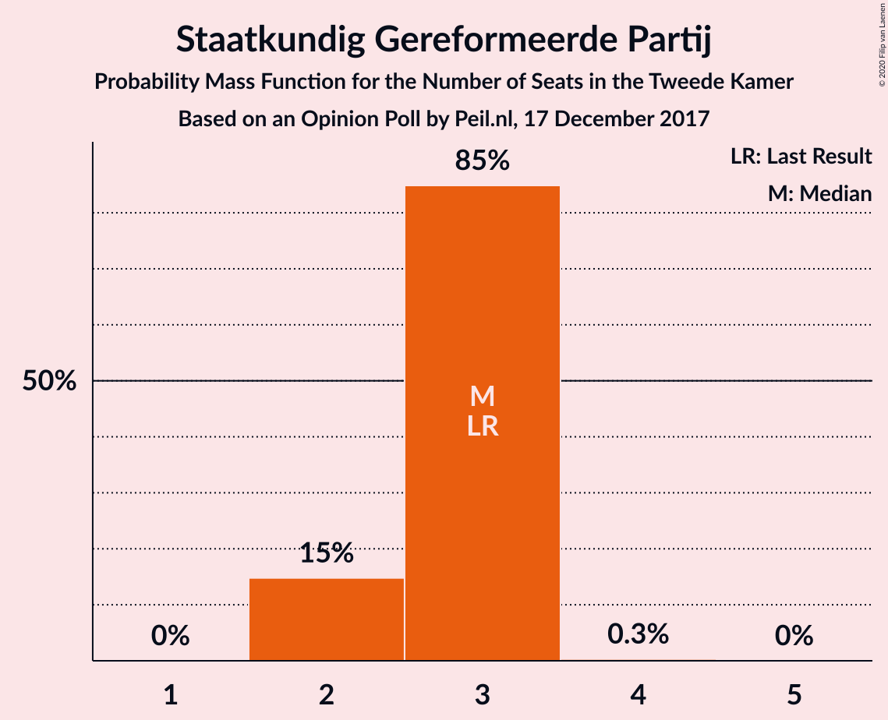

| Number of Seats | Probability | Accumulated | Special Marks |
|:---------------:|:-----------:|:-----------:|:-------------:|
| 2 | 15% | 100% |  |
| 3 | 85% | 85% | Last Result, Median |
| 4 | 0.3% | 0.3% |  |
| 5 | 0% | 0% |  |

### DENK

*For a full overview of the results for this party, see the [DENK](party-denk.html) page.*

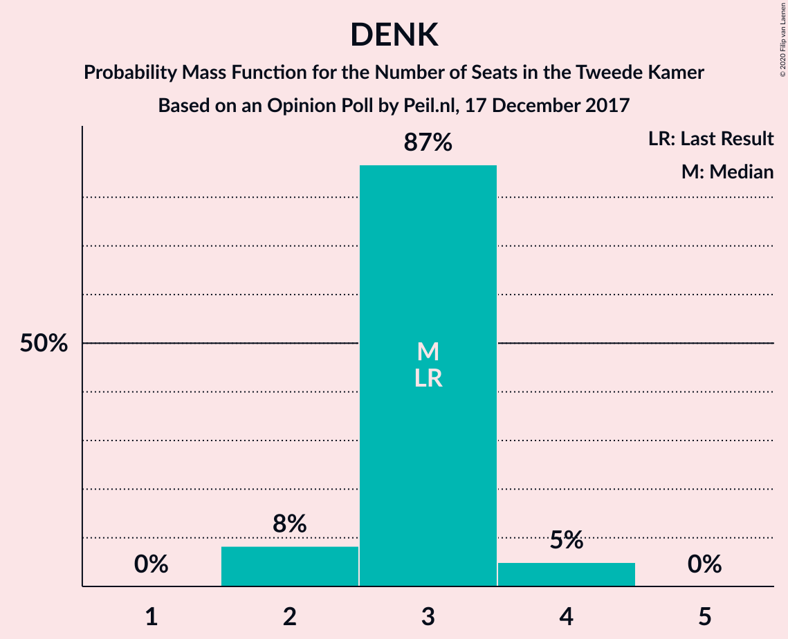

| Number of Seats | Probability | Accumulated | Special Marks |
|:---------------:|:-----------:|:-----------:|:-------------:|
| 2 | 8% | 100% |  |
| 3 | 87% | 92% | Last Result, Median |
| 4 | 5% | 5% |  |
| 5 | 0% | 0% |  |

## Coalitions

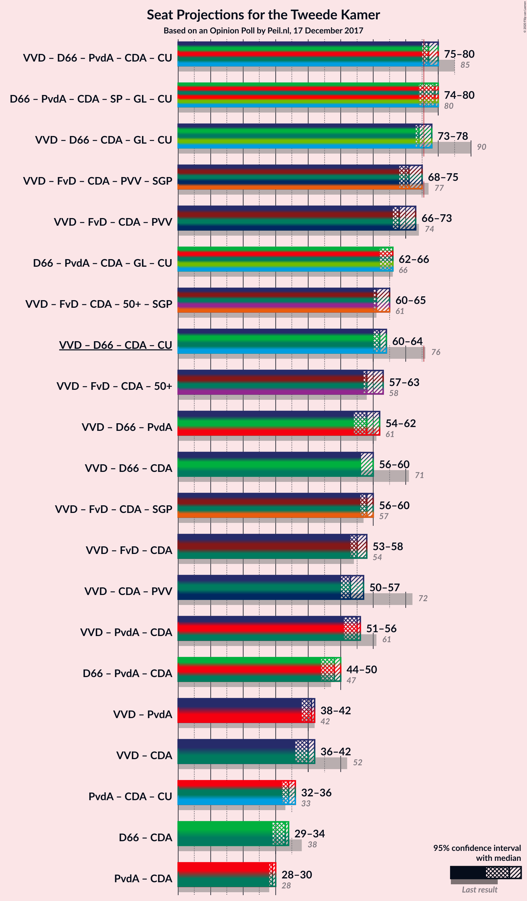

### Confidence Intervals

| Coalition | Last Result | Median | Majority? | 80% Confidence Interval | 90% Confidence Interval | 95% Confidence Interval | 99% Confidence Interval |
|:---------:|:-----------:|:------:|:---------:|:-----------------------:|:-----------------------:|:-----------------------:|:-----------------------:|
| Volkspartij voor Vrijheid en Democratie – Democraten 66 – Partij van de Arbeid – Christen-Democratisch Appèl – ChristenUnie | 85 | 77 | 53% | 75–80 | 75–80 | 75–80 | 73–83 |
| Democraten 66 – Partij van de Arbeid – Christen-Democratisch Appèl – Socialistische Partij – GroenLinks – ChristenUnie | 80 | 79 | 95% | 77–80 | 74–80 | 74–80 | 74–81 |
| Volkspartij voor Vrijheid en Democratie – Democraten 66 – Christen-Democratisch Appèl – GroenLinks – ChristenUnie | 90 | 74 | 42% | 74–76 | 74–76 | 73–78 | 73–78 |
| Volkspartij voor Vrijheid en Democratie – Forum voor Democratie – Christen-Democratisch Appèl – Partij voor de Vrijheid – Staatkundig Gereformeerde Partij | 77 | 71 | 0% | 70–73 | 70–74 | 68–75 | 68–75 |
| Volkspartij voor Vrijheid en Democratie – Forum voor Democratie – Christen-Democratisch Appèl – Partij voor de Vrijheid | 74 | 68 | 0% | 67–70 | 67–72 | 66–73 | 66–73 |
| Democraten 66 – Partij van de Arbeid – Christen-Democratisch Appèl – GroenLinks – ChristenUnie | 66 | 66 | 0% | 63–66 | 63–66 | 62–66 | 62–68 |
| Volkspartij voor Vrijheid en Democratie – Forum voor Democratie – Christen-Democratisch Appèl – 50Plus – Staatkundig Gereformeerde Partij | 61 | 61 | 0% | 60–65 | 60–65 | 60–65 | 57–65 |
| Volkspartij voor Vrijheid en Democratie – Democraten 66 – Christen-Democratisch Appèl – ChristenUnie | 76 | 62 | 0% | 60–64 | 60–64 | 60–64 | 60–66 |
| Volkspartij voor Vrijheid en Democratie – Forum voor Democratie – Christen-Democratisch Appèl – 50Plus | 58 | 58 | 0% | 57–62 | 57–63 | 57–63 | 55–63 |
| Volkspartij voor Vrijheid en Democratie – Democraten 66 – Partij van de Arbeid | 61 | 58 | 0% | 58–62 | 55–62 | 54–62 | 54–63 |
| Volkspartij voor Vrijheid en Democratie – Democraten 66 – Christen-Democratisch Appèl | 71 | 56 | 0% | 56–60 | 56–60 | 56–60 | 56–61 |
| Volkspartij voor Vrijheid en Democratie – Forum voor Democratie – Christen-Democratisch Appèl – Staatkundig Gereformeerde Partij | 57 | 58 | 0% | 56–59 | 56–60 | 56–60 | 53–61 |
| Volkspartij voor Vrijheid en Democratie – Forum voor Democratie – Christen-Democratisch Appèl | 54 | 55 | 0% | 53–56 | 53–58 | 53–58 | 51–58 |
| Volkspartij voor Vrijheid en Democratie – Christen-Democratisch Appèl – Partij voor de Vrijheid | 72 | 53 | 0% | 50–56 | 50–57 | 50–57 | 50–57 |
| Volkspartij voor Vrijheid en Democratie – Partij van de Arbeid – Christen-Democratisch Appèl | 61 | 55 | 0% | 51–56 | 51–56 | 51–56 | 51–61 |
| Democraten 66 – Partij van de Arbeid – Christen-Democratisch Appèl | 47 | 48 | 0% | 46–50 | 45–50 | 44–50 | 41–50 |
| Volkspartij voor Vrijheid en Democratie – Partij van de Arbeid | 42 | 41 | 0% | 38–42 | 38–42 | 38–42 | 38–46 |
| Volkspartij voor Vrijheid en Democratie – Christen-Democratisch Appèl | 52 | 40 | 0% | 36–41 | 36–42 | 36–42 | 36–44 |
| Partij van de Arbeid – Christen-Democratisch Appèl – ChristenUnie | 33 | 34 | 0% | 32–34 | 32–35 | 32–36 | 31–37 |
| Democraten 66 – Christen-Democratisch Appèl | 38 | 33 | 0% | 32–34 | 30–34 | 29–34 | 29–34 |
| Partij van de Arbeid – Christen-Democratisch Appèl | 28 | 29 | 0% | 28–30 | 28–30 | 28–30 | 26–32 |

### Volkspartij voor Vrijheid en Democratie – Democraten 66 – Partij van de Arbeid – Christen-Democratisch Appèl – ChristenUnie

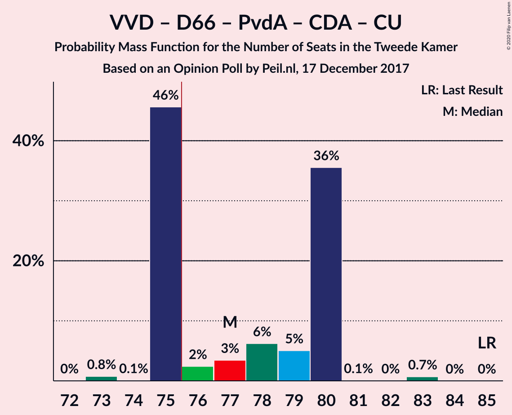

| Number of Seats | Probability | Accumulated | Special Marks |
|:---------------:|:-----------:|:-----------:|:-------------:|
| 73 | 0.8% | 100% |  |
| 74 | 0.1% | 99.2% |  |
| 75 | 46% | 99.1% |  |
| 76 | 2% | 53% | Majority |
| 77 | 3% | 51% |  |
| 78 | 6% | 48% |  |
| 79 | 5% | 41% | Median |
| 80 | 36% | 36% |  |
| 81 | 0.1% | 0.8% |  |
| 82 | 0% | 0.7% |  |
| 83 | 0.7% | 0.7% |  |
| 84 | 0% | 0% |  |
| 85 | 0% | 0% | Last Result |

### Democraten 66 – Partij van de Arbeid – Christen-Democratisch Appèl – Socialistische Partij – GroenLinks – ChristenUnie

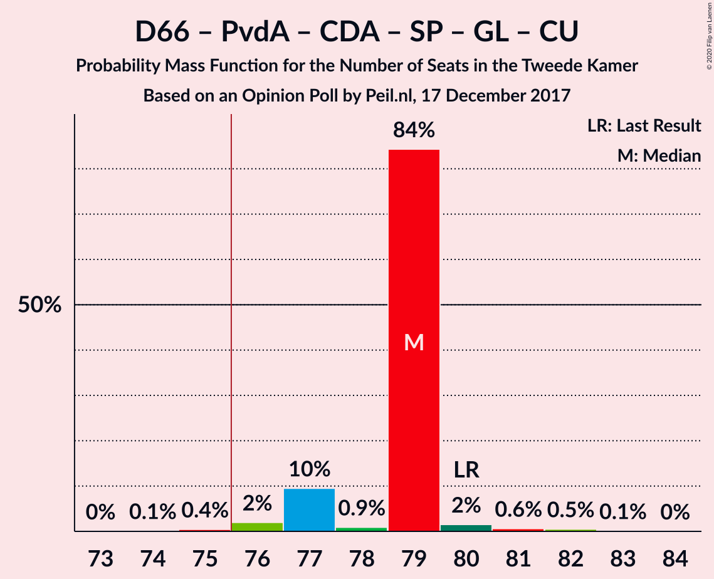

| Number of Seats | Probability | Accumulated | Special Marks |
|:---------------:|:-----------:|:-----------:|:-------------:|
| 73 | 0.1% | 100% |  |
| 74 | 5% | 99.9% |  |
| 75 | 0% | 95% |  |
| 76 | 1.1% | 95% | Majority |
| 77 | 5% | 94% |  |
| 78 | 6% | 89% | Median |
| 79 | 45% | 83% |  |
| 80 | 37% | 38% | Last Result |
| 81 | 0.3% | 0.6% |  |
| 82 | 0% | 0.4% |  |
| 83 | 0.3% | 0.3% |  |
| 84 | 0.1% | 0.1% |  |
| 85 | 0% | 0% |  |

### Volkspartij voor Vrijheid en Democratie – Democraten 66 – Christen-Democratisch Appèl – GroenLinks – ChristenUnie

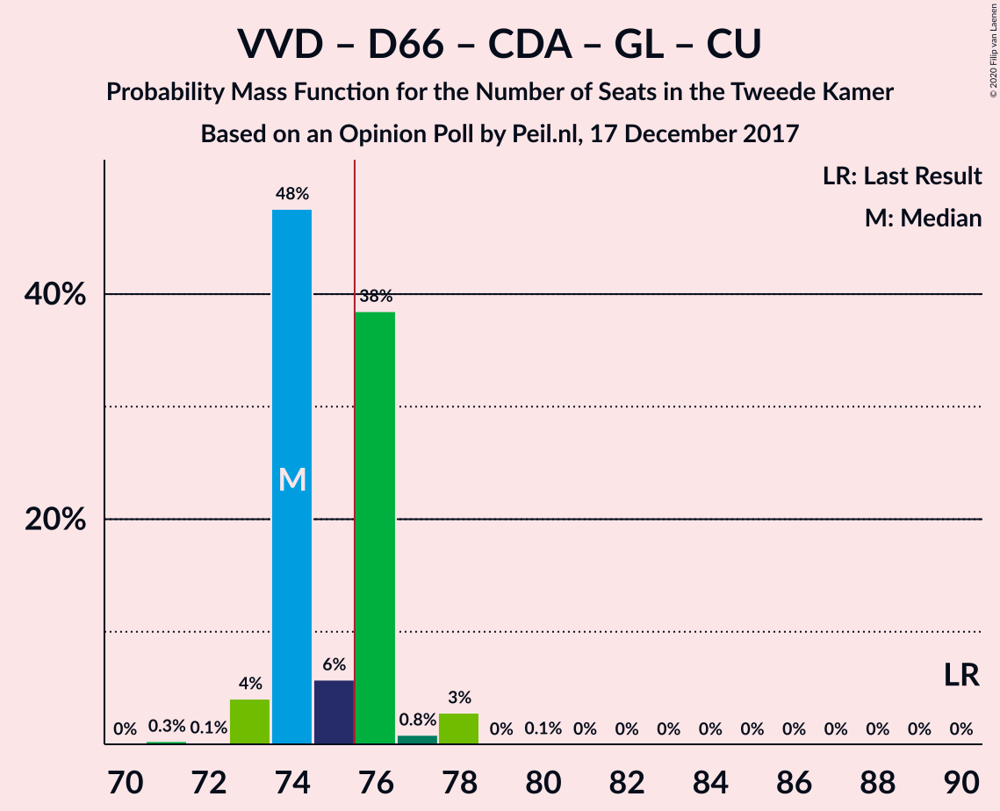

| Number of Seats | Probability | Accumulated | Special Marks |
|:---------------:|:-----------:|:-----------:|:-------------:|
| 71 | 0.3% | 100% |  |
| 72 | 0.1% | 99.7% |  |
| 73 | 4% | 99.6% |  |
| 74 | 48% | 96% |  |
| 75 | 6% | 48% |  |
| 76 | 38% | 42% | Median, Majority |
| 77 | 0.8% | 4% |  |
| 78 | 3% | 3% |  |
| 79 | 0% | 0.1% |  |
| 80 | 0.1% | 0.1% |  |
| 81 | 0% | 0% |  |
| 82 | 0% | 0% |  |
| 83 | 0% | 0% |  |
| 84 | 0% | 0% |  |
| 85 | 0% | 0% |  |
| 86 | 0% | 0% |  |
| 87 | 0% | 0% |  |
| 88 | 0% | 0% |  |
| 89 | 0% | 0% |  |
| 90 | 0% | 0% | Last Result |

### Volkspartij voor Vrijheid en Democratie – Forum voor Democratie – Christen-Democratisch Appèl – Partij voor de Vrijheid – Staatkundig Gereformeerde Partij

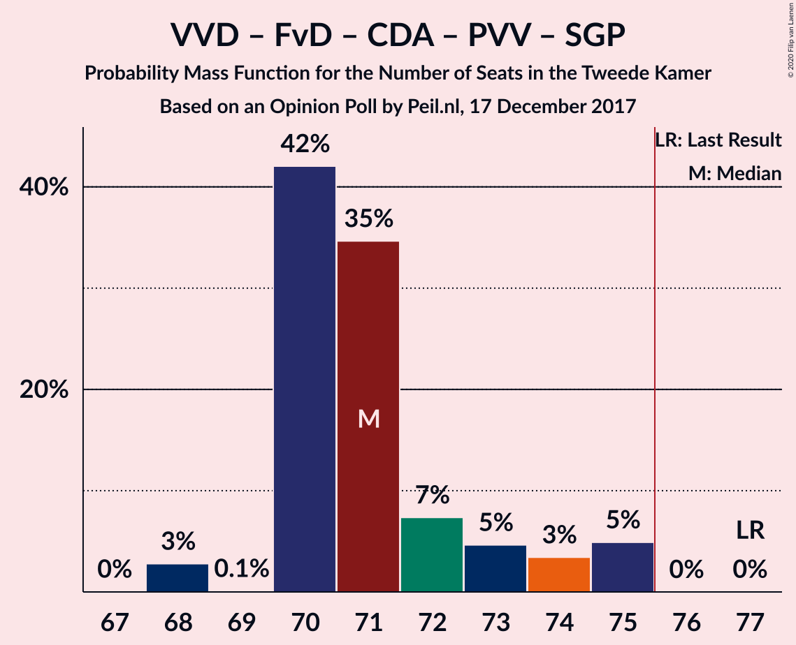

| Number of Seats | Probability | Accumulated | Special Marks |
|:---------------:|:-----------:|:-----------:|:-------------:|
| 68 | 3% | 100% |  |
| 69 | 0.1% | 97% |  |
| 70 | 42% | 97% |  |
| 71 | 35% | 55% |  |
| 72 | 7% | 20% |  |
| 73 | 5% | 13% | Median |
| 74 | 3% | 8% |  |
| 75 | 5% | 5% |  |
| 76 | 0% | 0% | Majority |
| 77 | 0% | 0% | Last Result |

### Volkspartij voor Vrijheid en Democratie – Forum voor Democratie – Christen-Democratisch Appèl – Partij voor de Vrijheid

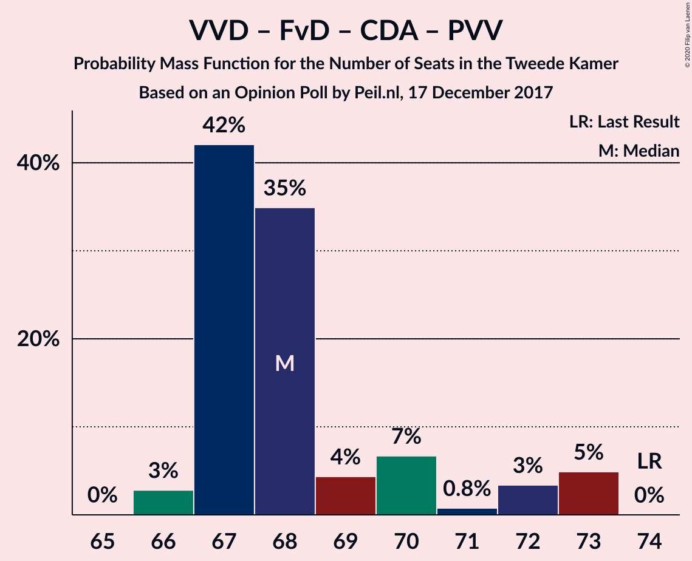

| Number of Seats | Probability | Accumulated | Special Marks |
|:---------------:|:-----------:|:-----------:|:-------------:|
| 66 | 3% | 100% |  |
| 67 | 42% | 97% |  |
| 68 | 35% | 55% |  |
| 69 | 4% | 20% |  |
| 70 | 7% | 16% | Median |
| 71 | 0.8% | 9% |  |
| 72 | 3% | 8% |  |
| 73 | 5% | 5% |  |
| 74 | 0% | 0% | Last Result |

### Democraten 66 – Partij van de Arbeid – Christen-Democratisch Appèl – GroenLinks – ChristenUnie

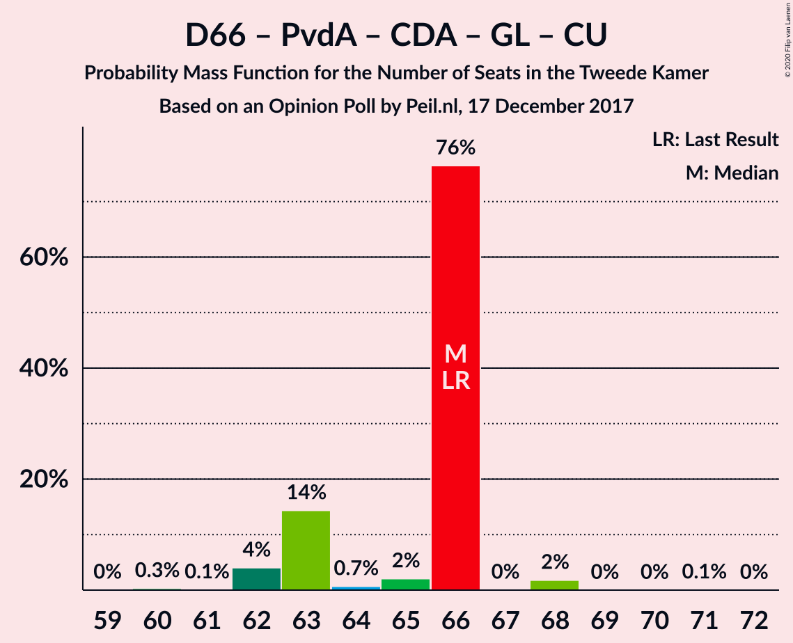

| Number of Seats | Probability | Accumulated | Special Marks |
|:---------------:|:-----------:|:-----------:|:-------------:|
| 59 | 0% | 100% |  |
| 60 | 0.3% | 99.9% |  |
| 61 | 0.1% | 99.6% |  |
| 62 | 4% | 99.5% |  |
| 63 | 14% | 96% |  |
| 64 | 0.7% | 81% |  |
| 65 | 2% | 80% | Median |
| 66 | 76% | 78% | Last Result |
| 67 | 0% | 2% |  |
| 68 | 2% | 2% |  |
| 69 | 0% | 0.1% |  |
| 70 | 0% | 0.1% |  |
| 71 | 0.1% | 0.1% |  |
| 72 | 0% | 0% |  |

### Volkspartij voor Vrijheid en Democratie – Forum voor Democratie – Christen-Democratisch Appèl – 50Plus – Staatkundig Gereformeerde Partij

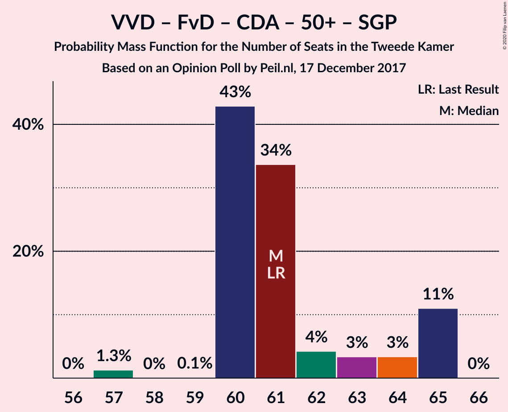

| Number of Seats | Probability | Accumulated | Special Marks |
|:---------------:|:-----------:|:-----------:|:-------------:|
| 57 | 1.3% | 100% |  |
| 58 | 0% | 98.7% |  |
| 59 | 0.1% | 98.7% |  |
| 60 | 43% | 98.6% |  |
| 61 | 34% | 56% | Last Result |
| 62 | 4% | 22% |  |
| 63 | 3% | 18% | Median |
| 64 | 3% | 14% |  |
| 65 | 11% | 11% |  |
| 66 | 0% | 0% |  |

### Volkspartij voor Vrijheid en Democratie – Democraten 66 – Christen-Democratisch Appèl – ChristenUnie

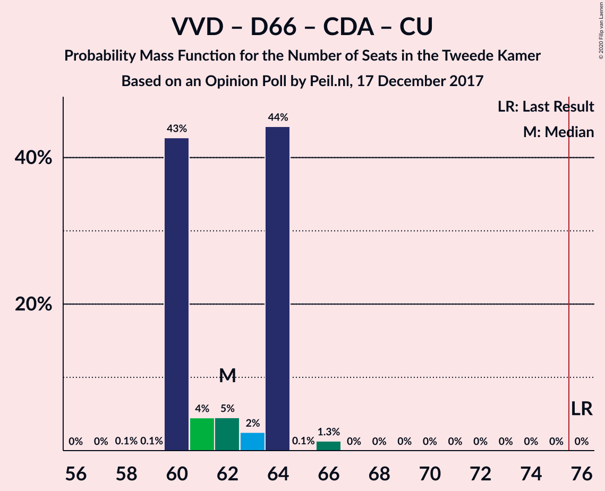

| Number of Seats | Probability | Accumulated | Special Marks |
|:---------------:|:-----------:|:-----------:|:-------------:|
| 58 | 0.1% | 100% |  |
| 59 | 0.1% | 99.9% |  |
| 60 | 43% | 99.8% |  |
| 61 | 4% | 57% |  |
| 62 | 5% | 53% |  |
| 63 | 2% | 48% |  |
| 64 | 44% | 46% | Median |
| 65 | 0.1% | 1.4% |  |
| 66 | 1.3% | 1.3% |  |
| 67 | 0% | 0% |  |
| 68 | 0% | 0% |  |
| 69 | 0% | 0% |  |
| 70 | 0% | 0% |  |
| 71 | 0% | 0% |  |
| 72 | 0% | 0% |  |
| 73 | 0% | 0% |  |
| 74 | 0% | 0% |  |
| 75 | 0% | 0% |  |
| 76 | 0% | 0% | Last Result, Majority |

### Volkspartij voor Vrijheid en Democratie – Forum voor Democratie – Christen-Democratisch Appèl – 50Plus

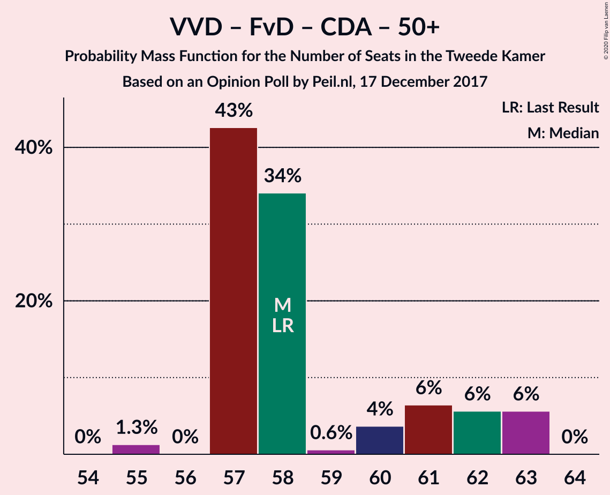

| Number of Seats | Probability | Accumulated | Special Marks |
|:---------------:|:-----------:|:-----------:|:-------------:|
| 55 | 1.3% | 100% |  |
| 56 | 0% | 98.7% |  |
| 57 | 43% | 98.6% |  |
| 58 | 34% | 56% | Last Result |
| 59 | 0.6% | 22% |  |
| 60 | 4% | 21% | Median |
| 61 | 6% | 18% |  |
| 62 | 6% | 11% |  |
| 63 | 6% | 6% |  |
| 64 | 0% | 0% |  |

### Volkspartij voor Vrijheid en Democratie – Democraten 66 – Partij van de Arbeid

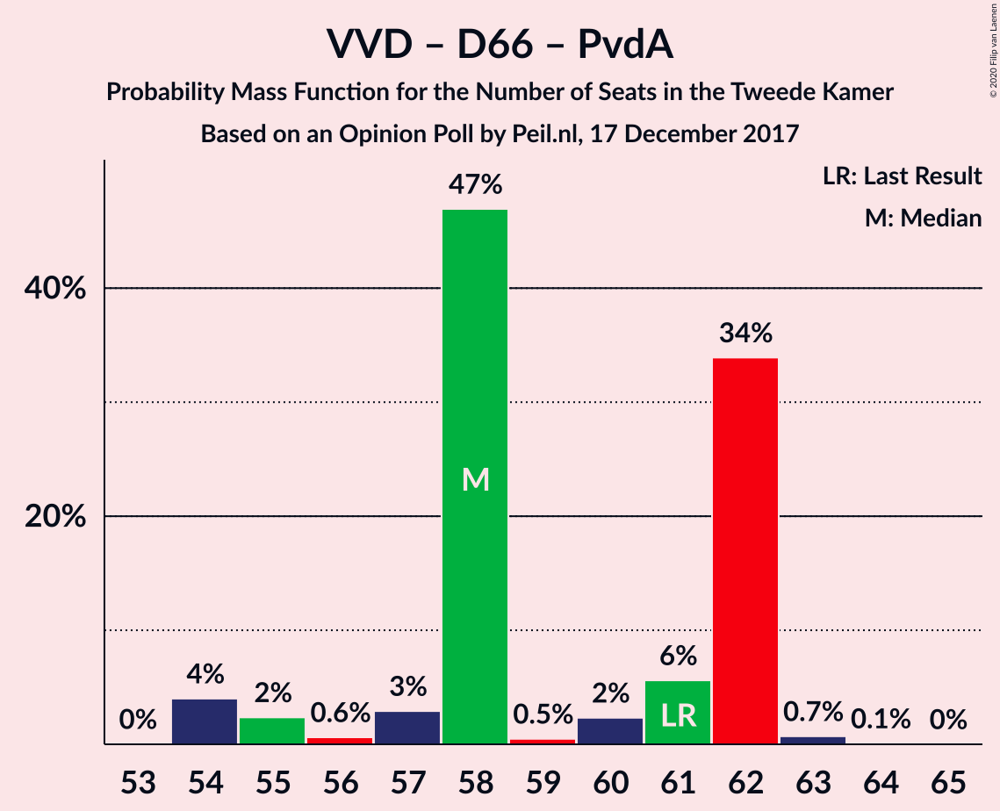

| Number of Seats | Probability | Accumulated | Special Marks |
|:---------------:|:-----------:|:-----------:|:-------------:|
| 54 | 4% | 100% |  |
| 55 | 2% | 96% |  |
| 56 | 0.6% | 94% |  |
| 57 | 3% | 93% |  |
| 58 | 47% | 90% |  |
| 59 | 0.5% | 43% |  |
| 60 | 2% | 43% |  |
| 61 | 6% | 40% | Last Result, Median |
| 62 | 34% | 35% |  |
| 63 | 0.7% | 0.8% |  |
| 64 | 0.1% | 0.1% |  |
| 65 | 0% | 0% |  |

### Volkspartij voor Vrijheid en Democratie – Democraten 66 – Christen-Democratisch Appèl

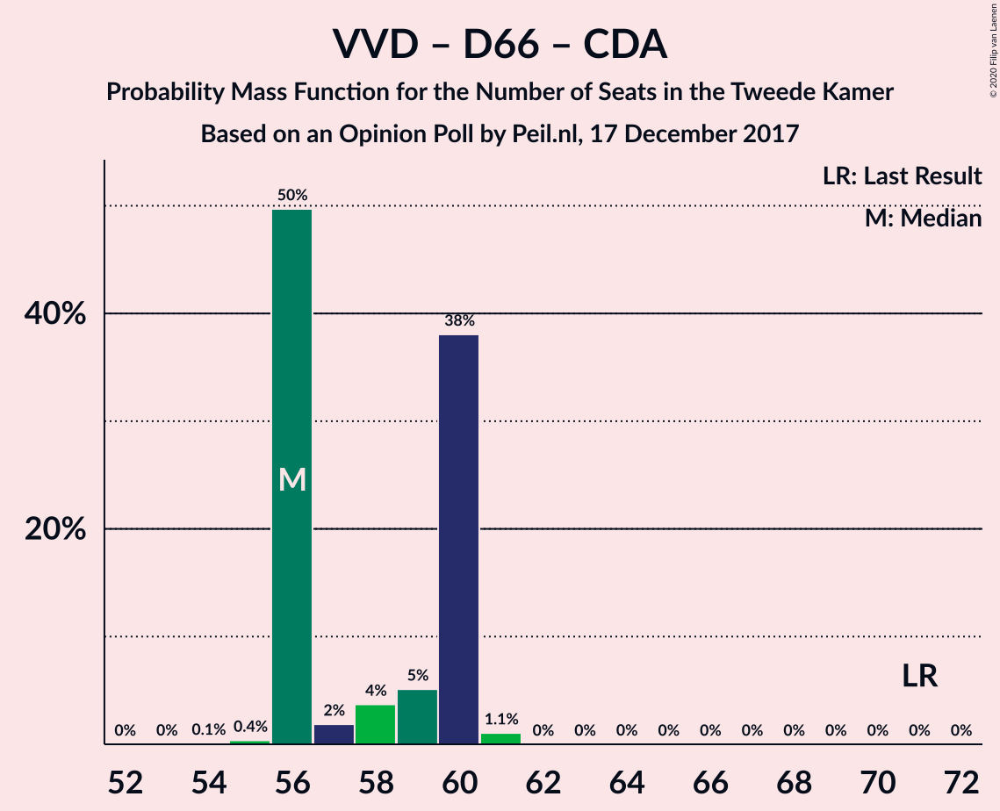

| Number of Seats | Probability | Accumulated | Special Marks |
|:---------------:|:-----------:|:-----------:|:-------------:|
| 54 | 0.1% | 100% |  |
| 55 | 0.4% | 99.9% |  |
| 56 | 50% | 99.5% |  |
| 57 | 2% | 50% |  |
| 58 | 4% | 48% |  |
| 59 | 5% | 44% |  |
| 60 | 38% | 39% | Median |
| 61 | 1.1% | 1.1% |  |
| 62 | 0% | 0% |  |
| 63 | 0% | 0% |  |
| 64 | 0% | 0% |  |
| 65 | 0% | 0% |  |
| 66 | 0% | 0% |  |
| 67 | 0% | 0% |  |
| 68 | 0% | 0% |  |
| 69 | 0% | 0% |  |
| 70 | 0% | 0% |  |
| 71 | 0% | 0% | Last Result |

### Volkspartij voor Vrijheid en Democratie – Forum voor Democratie – Christen-Democratisch Appèl – Staatkundig Gereformeerde Partij

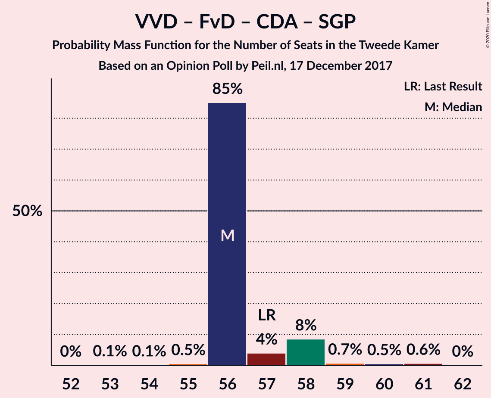

| Number of Seats | Probability | Accumulated | Special Marks |
|:---------------:|:-----------:|:-----------:|:-------------:|
| 53 | 1.3% | 100% |  |
| 54 | 0% | 98.7% |  |
| 55 | 0.2% | 98.7% |  |
| 56 | 43% | 98% |  |
| 57 | 4% | 56% | Last Result |
| 58 | 38% | 52% |  |
| 59 | 5% | 14% | Median |
| 60 | 9% | 9% |  |
| 61 | 0.7% | 0.7% |  |
| 62 | 0% | 0% |  |

### Volkspartij voor Vrijheid en Democratie – Forum voor Democratie – Christen-Democratisch Appèl

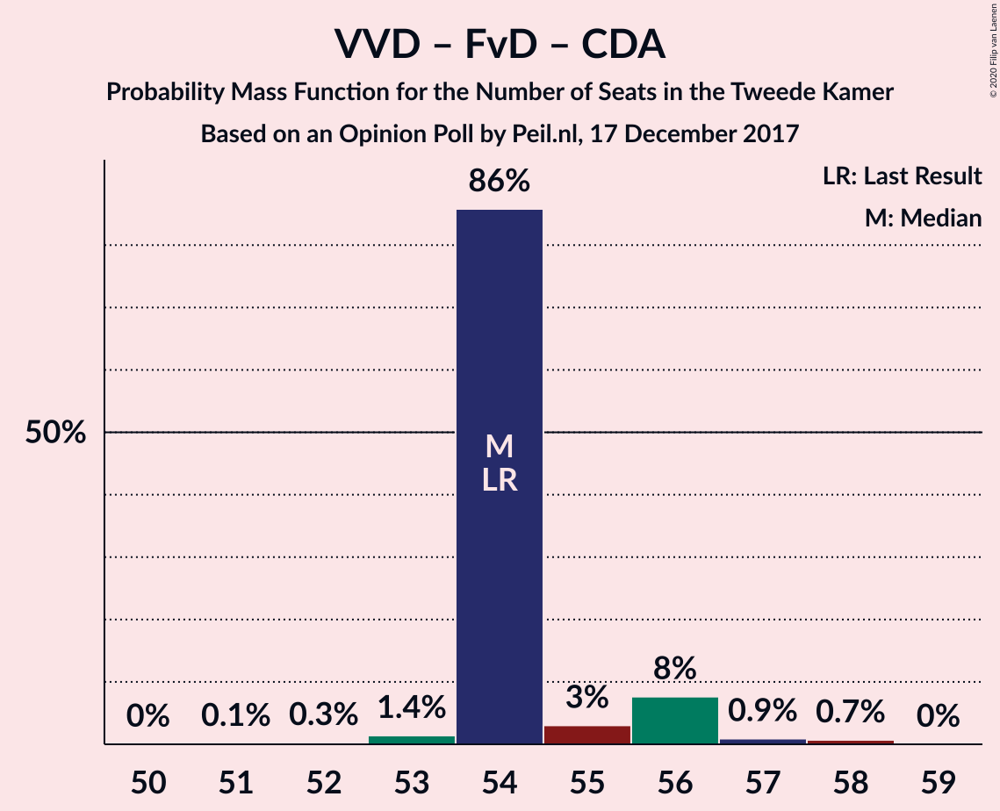

| Number of Seats | Probability | Accumulated | Special Marks |
|:---------------:|:-----------:|:-----------:|:-------------:|
| 51 | 1.3% | 100% |  |
| 52 | 0.1% | 98.7% |  |
| 53 | 43% | 98.6% |  |
| 54 | 0.4% | 56% | Last Result |
| 55 | 38% | 56% |  |
| 56 | 8% | 17% | Median |
| 57 | 3% | 10% |  |
| 58 | 6% | 6% |  |
| 59 | 0% | 0% |  |

### Volkspartij voor Vrijheid en Democratie – Christen-Democratisch Appèl – Partij voor de Vrijheid

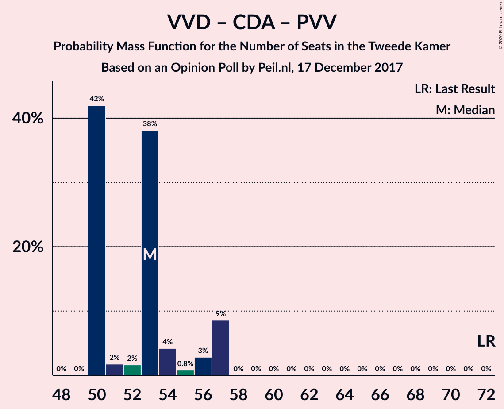

| Number of Seats | Probability | Accumulated | Special Marks |
|:---------------:|:-----------:|:-----------:|:-------------:|
| 50 | 42% | 100% |  |
| 51 | 2% | 58% |  |
| 52 | 2% | 56% |  |
| 53 | 38% | 55% |  |
| 54 | 4% | 16% | Median |
| 55 | 0.8% | 12% |  |
| 56 | 3% | 11% |  |
| 57 | 9% | 9% |  |
| 58 | 0% | 0% |  |
| 59 | 0% | 0% |  |
| 60 | 0% | 0% |  |
| 61 | 0% | 0% |  |
| 62 | 0% | 0% |  |
| 63 | 0% | 0% |  |
| 64 | 0% | 0% |  |
| 65 | 0% | 0% |  |
| 66 | 0% | 0% |  |
| 67 | 0% | 0% |  |
| 68 | 0% | 0% |  |
| 69 | 0% | 0% |  |
| 70 | 0% | 0% |  |
| 71 | 0% | 0% |  |
| 72 | 0% | 0% | Last Result |

### Volkspartij voor Vrijheid en Democratie – Partij van de Arbeid – Christen-Democratisch Appèl

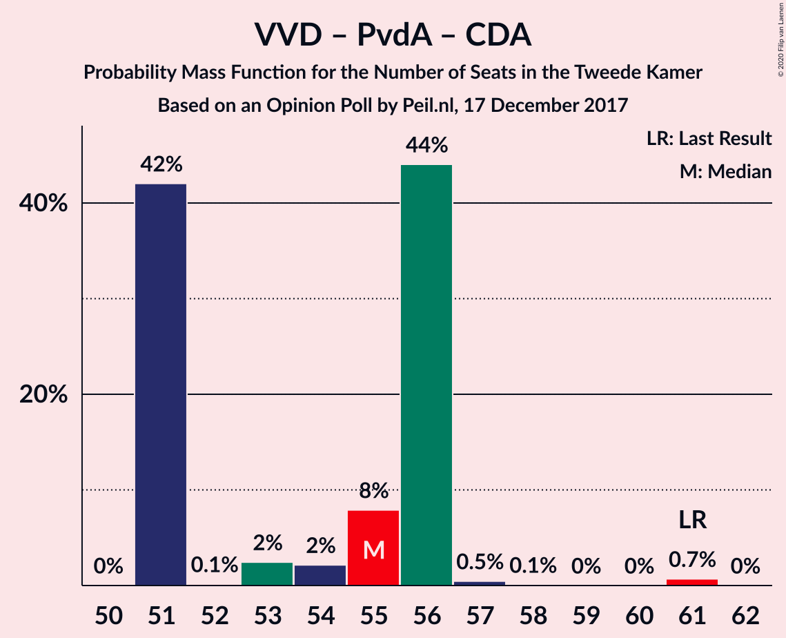

| Number of Seats | Probability | Accumulated | Special Marks |
|:---------------:|:-----------:|:-----------:|:-------------:|
| 51 | 42% | 100% |  |
| 52 | 0.1% | 58% |  |
| 53 | 2% | 58% |  |
| 54 | 2% | 55% |  |
| 55 | 8% | 53% | Median |
| 56 | 44% | 45% |  |
| 57 | 0.5% | 1.2% |  |
| 58 | 0.1% | 0.8% |  |
| 59 | 0% | 0.7% |  |
| 60 | 0% | 0.7% |  |
| 61 | 0.7% | 0.7% | Last Result |
| 62 | 0% | 0% |  |

### Democraten 66 – Partij van de Arbeid – Christen-Democratisch Appèl

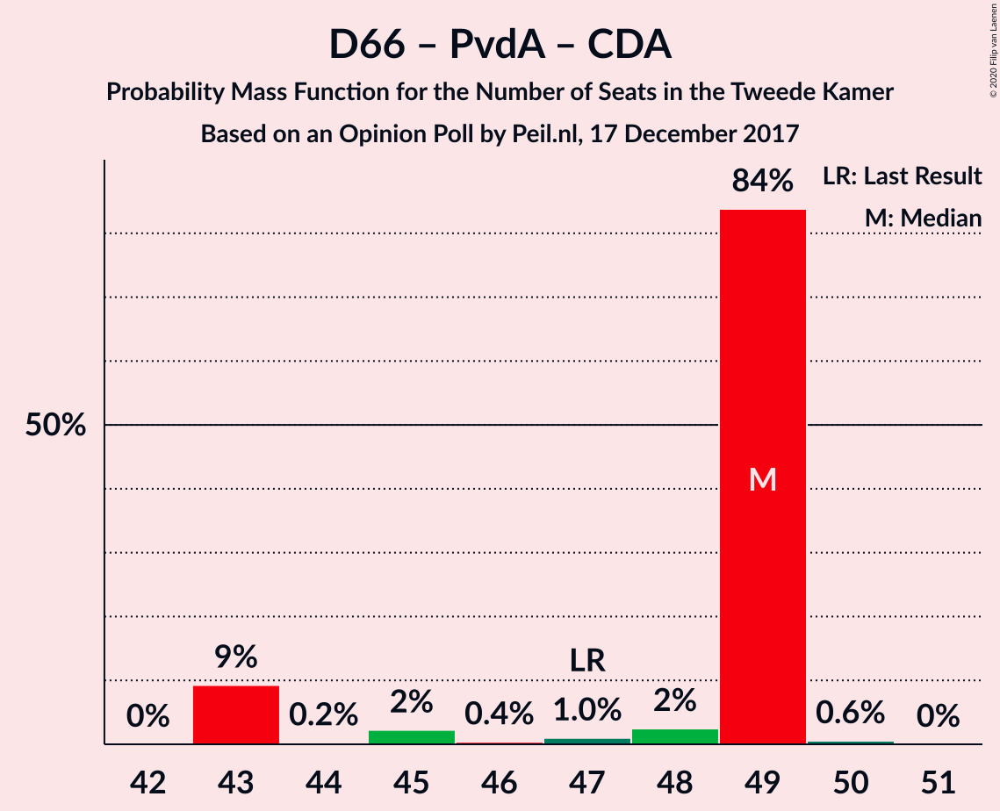

| Number of Seats | Probability | Accumulated | Special Marks |
|:---------------:|:-----------:|:-----------:|:-------------:|
| 41 | 0.8% | 100% |  |
| 42 | 0% | 99.2% |  |
| 43 | 0% | 99.2% |  |
| 44 | 3% | 99.2% |  |
| 45 | 3% | 96% |  |
| 46 | 7% | 92% |  |
| 47 | 1.1% | 85% | Last Result |
| 48 | 45% | 84% |  |
| 49 | 5% | 39% | Median |
| 50 | 34% | 34% |  |
| 51 | 0% | 0% |  |

### Volkspartij voor Vrijheid en Democratie – Partij van de Arbeid

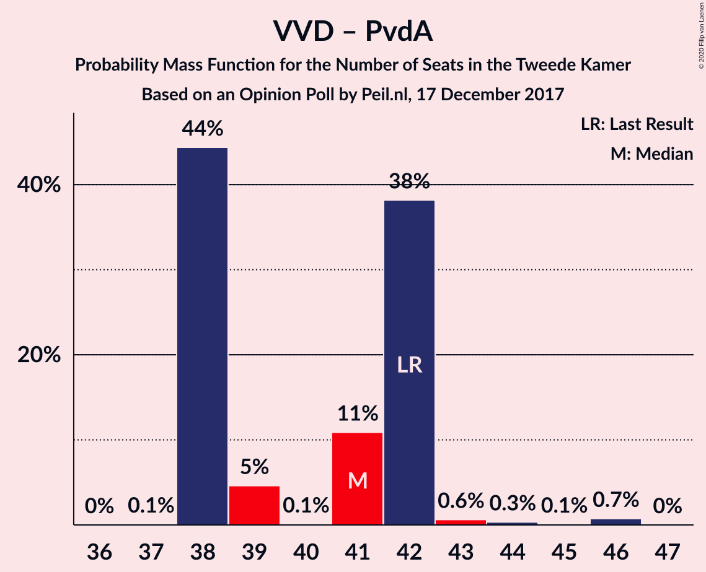

| Number of Seats | Probability | Accumulated | Special Marks |
|:---------------:|:-----------:|:-----------:|:-------------:|
| 37 | 0.1% | 100% |  |
| 38 | 44% | 99.9% |  |
| 39 | 5% | 56% |  |
| 40 | 0.1% | 51% |  |
| 41 | 11% | 51% | Median |
| 42 | 38% | 40% | Last Result |
| 43 | 0.6% | 2% |  |
| 44 | 0.3% | 1.2% |  |
| 45 | 0.1% | 0.8% |  |
| 46 | 0.7% | 0.7% |  |
| 47 | 0% | 0% |  |

### Volkspartij voor Vrijheid en Democratie – Christen-Democratisch Appèl

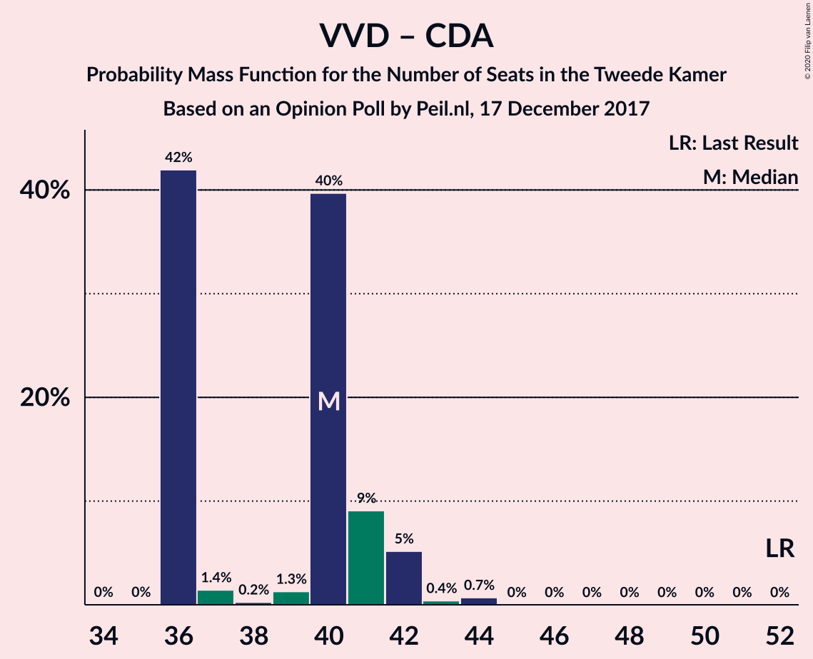

| Number of Seats | Probability | Accumulated | Special Marks |
|:---------------:|:-----------:|:-----------:|:-------------:|
| 36 | 42% | 100% |  |
| 37 | 1.4% | 58% |  |
| 38 | 0.2% | 57% |  |
| 39 | 1.3% | 56% |  |
| 40 | 40% | 55% | Median |
| 41 | 9% | 15% |  |
| 42 | 5% | 6% |  |
| 43 | 0.4% | 1.1% |  |
| 44 | 0.7% | 0.7% |  |
| 45 | 0% | 0% |  |
| 46 | 0% | 0% |  |
| 47 | 0% | 0% |  |
| 48 | 0% | 0% |  |
| 49 | 0% | 0% |  |
| 50 | 0% | 0% |  |
| 51 | 0% | 0% |  |
| 52 | 0% | 0% | Last Result |

### Partij van de Arbeid – Christen-Democratisch Appèl – ChristenUnie

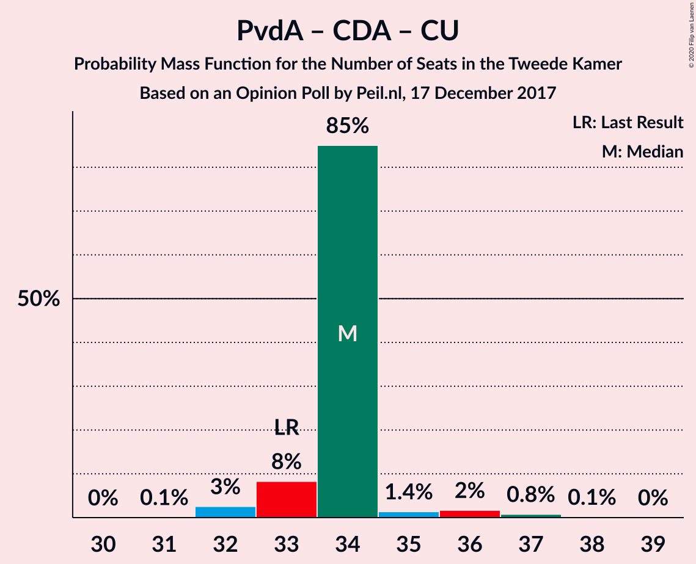

| Number of Seats | Probability | Accumulated | Special Marks |
|:---------------:|:-----------:|:-----------:|:-------------:|
| 29 | 0.1% | 100% |  |
| 30 | 0% | 99.9% |  |
| 31 | 0.9% | 99.9% |  |
| 32 | 42% | 98.9% |  |
| 33 | 5% | 57% | Last Result, Median |
| 34 | 42% | 51% |  |
| 35 | 7% | 9% |  |
| 36 | 2% | 3% |  |
| 37 | 0.7% | 1.0% |  |
| 38 | 0% | 0.3% |  |
| 39 | 0.3% | 0.3% |  |
| 40 | 0% | 0% |  |

### Democraten 66 – Christen-Democratisch Appèl

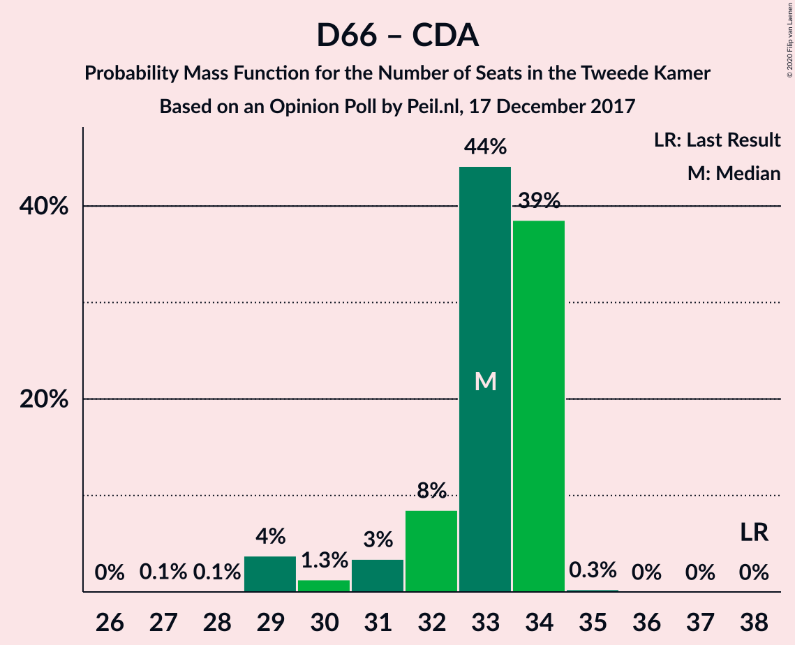

| Number of Seats | Probability | Accumulated | Special Marks |
|:---------------:|:-----------:|:-----------:|:-------------:|
| 27 | 0.1% | 100% |  |
| 28 | 0.1% | 99.9% |  |
| 29 | 4% | 99.9% |  |
| 30 | 1.3% | 96% |  |
| 31 | 3% | 95% |  |
| 32 | 8% | 91% |  |
| 33 | 44% | 83% |  |
| 34 | 39% | 39% | Median |
| 35 | 0.3% | 0.3% |  |
| 36 | 0% | 0% |  |
| 37 | 0% | 0% |  |
| 38 | 0% | 0% | Last Result |

### Partij van de Arbeid – Christen-Democratisch Appèl

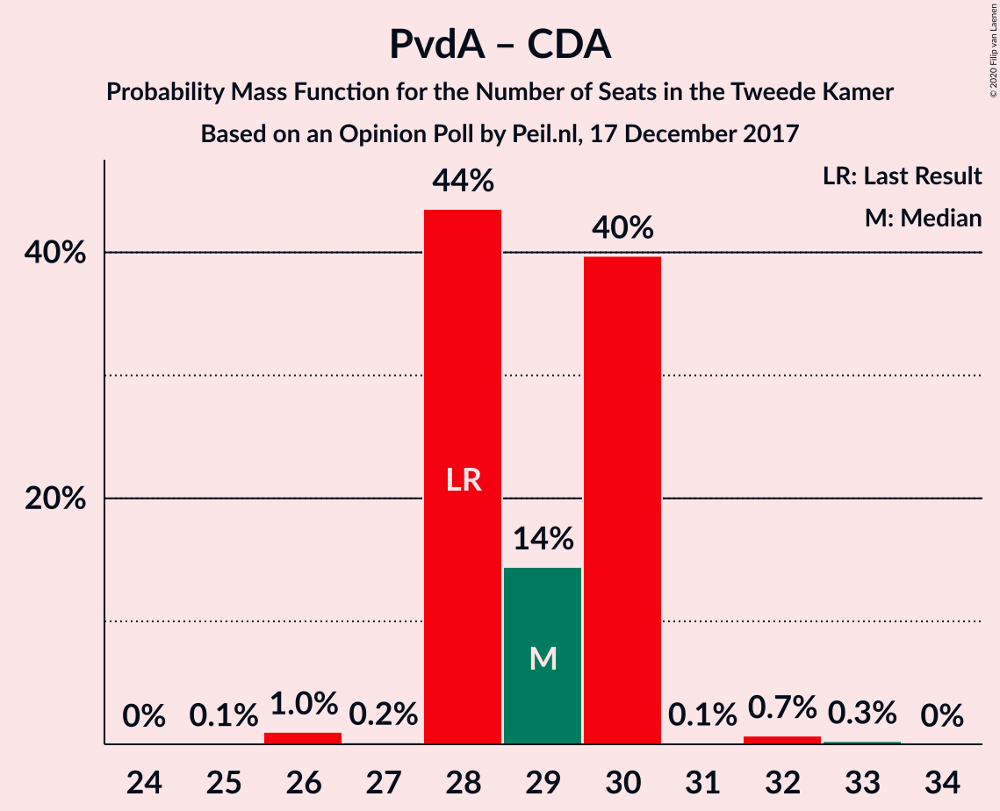

| Number of Seats | Probability | Accumulated | Special Marks |
|:---------------:|:-----------:|:-----------:|:-------------:|
| 25 | 0.1% | 100% |  |
| 26 | 1.0% | 99.9% |  |
| 27 | 0.2% | 98.9% |  |
| 28 | 44% | 98.8% | Last Result |
| 29 | 14% | 55% | Median |
| 30 | 40% | 41% |  |
| 31 | 0.1% | 1.1% |  |
| 32 | 0.7% | 1.0% |  |
| 33 | 0.3% | 0.3% |  |
| 34 | 0% | 0% |  |

## Technical Information

### Opinion Poll

+ **Polling firm:** Peil.nl
+ **Commissioner(s):** —
+ **Fieldwork period:** 17 December 2017

### Calculations

+ **Sample size:** 3000
+ **Simulations done:** 131,072
+ **Error estimate:** 2.88%

