# Opinion Poll by GfK for EenVandaag, 15–18 December 2017

<a href="#voting-intentions">Voting Intentions</a> | <a href="#seats">Seats</a> | <a href="#coalitions">Coalitions</a> | <a href="#technical-information">Technical Information</a>

## Voting Intentions

### Confidence Intervals

| Party | Last Result | Poll Result | 80% Confidence Interval | 90% Confidence Interval | 95% Confidence Interval | 99% Confidence Interval |
|:-----:|:-----------:|:-----------:|:-----------------------:|:-----------------------:|:-----------------------:|:-----------------------:|
| Volkspartij voor Vrijheid en Democratie | 21.3% | 19.3% | 18.2–20.5% |17.8–20.8% |17.6–21.1% |17.1–21.7% |
| Partij voor de Vrijheid | 13.1% | 14.0% | 13.0–15.1% |12.7–15.4% |12.5–15.6% |12.1–16.2% |
| Christen-Democratisch Appèl | 12.4% | 10.0% | 9.2–11.0% |8.9–11.2% |8.7–11.4% |8.4–11.9% |
| Democraten 66 | 12.2% | 10.0% | 9.2–11.0% |8.9–11.2% |8.7–11.4% |8.4–11.9% |
| Socialistische Partij | 9.1% | 10.0% | 9.2–11.0% |8.9–11.2% |8.7–11.4% |8.4–11.9% |
| GroenLinks | 9.1% | 8.7% | 7.9–9.5% |7.7–9.8% |7.5–10.0% |7.1–10.4% |
| Partij van de Arbeid | 5.7% | 7.3% | 6.6–8.2% |6.4–8.4% |6.2–8.6% |5.9–9.0% |
| Forum voor Democratie | 1.8% | 6.7% | 6.0–7.5% |5.8–7.7% |5.6–7.9% |5.3–8.3% |
| ChristenUnie | 3.4% | 4.0% | 3.5–4.6% |3.3–4.8% |3.2–5.0% |3.0–5.3% |
| Partij voor de Dieren | 3.2% | 3.4% | 2.9–3.9% |2.7–4.1% |2.6–4.3% |2.4–4.6% |
| 50Plus | 3.1% | 3.4% | 2.9–3.9% |2.7–4.1% |2.6–4.3% |2.4–4.6% |
| Staatkundig Gereformeerde Partij | 2.1% | 2.0% | 1.6–2.5% |1.5–2.6% |1.4–2.7% |1.3–3.0% |
| DENK | 2.1% | 1.3% | 1.0–1.7% |0.9–1.8% |0.9–1.9% |0.8–2.1% |

*Note:* The poll result column reflects the actual value used in the calculations. Published results may vary slightly, and in addition be rounded to fewer digits.

## Seats

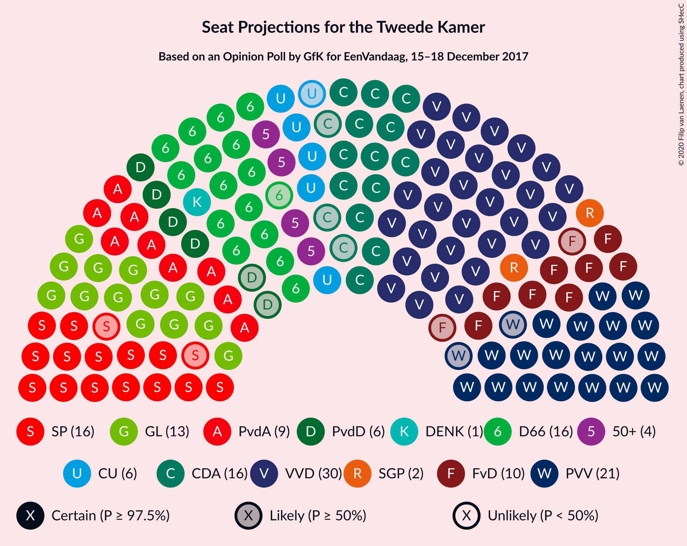

### Confidence Intervals

| Party | Last Result | Median | 80% Confidence Interval | 90% Confidence Interval | 95% Confidence Interval | 99% Confidence Interval |
|:-----:|:-----------:|:------:|:-----------------------:|:-----------------------:|:-----------------------:|:-----------------------:|
| <a href="#volkspartij-voor-vrijheid-en-democratie">Volkspartij voor Vrijheid en Democratie</a> | 33 | 30 | 30–32 |27–32 |26–32 |26–33 |
| <a href="#partij-voor-de-vrijheid">Partij voor de Vrijheid</a> | 20 | 21 | 20–22 |20–23 |20–23 |20–24 |
| <a href="#christen-democratisch-appèl">Christen-Democratisch Appèl</a> | 19 | 15 | 14–17 |13–17 |13–17 |12–17 |
| <a href="#democraten-66">Democraten 66</a> | 19 | 15 | 13–15 |12–16 |12–18 |12–18 |
| <a href="#socialistische-partij">Socialistische Partij</a> | 14 | 15 | 13–17 |13–17 |12–17 |12–17 |
| <a href="#groenlinks">GroenLinks</a> | 14 | 13 | 12–14 |12–15 |12–15 |11–16 |
| <a href="#partij-van-de-arbeid">Partij van de Arbeid</a> | 9 | 10 | 8–14 |8–14 |8–14 |8–14 |
| <a href="#forum-voor-democratie">Forum voor Democratie</a> | 2 | 9 | 9–11 |9–12 |8–12 |7–12 |
| <a href="#christenunie">ChristenUnie</a> | 5 | 7 | 5–7 |5–7 |5–7 |4–8 |
| <a href="#partij-voor-de-dieren">Partij voor de Dieren</a> | 5 | 5 | 3–6 |3–6 |3–6 |3–7 |
| <a href="#50plus">50Plus</a> | 4 | 5 | 4–5 |4–6 |4–6 |4–6 |
| <a href="#staatkundig-gereformeerde-partij">Staatkundig Gereformeerde Partij</a> | 3 | 2 | 2–3 |2–3 |2–5 |1–5 |
| <a href="#denk">DENK</a> | 3 | 2 | 1–3 |1–3 |0–3 |0–3 |

### Volkspartij voor Vrijheid en Democratie

*For a full overview of the results for this party, see the [Volkspartij voor Vrijheid en Democratie](party-volkspartijvoorvrijheidendemocratie.html) page.*

| Number of Seats | Probability | Accumulated | Special Marks |
|:---------------:|:-----------:|:-----------:|:-------------:|
| 26 | 4% | 100% |  |
| 27 | 1.1% | 96% |  |
| 28 | 3% | 94% |  |
| 29 | 1.0% | 92% |  |
| 30 | 72% | 91% | Median |
| 31 | 4% | 19% |  |
| 32 | 13% | 14% |  |
| 33 | 1.3% | 1.4% | Last Result |
| 34 | 0% | 0.1% |  |
| 35 | 0% | 0.1% |  |
| 36 | 0.1% | 0.1% |  |
| 37 | 0% | 0% |  |

### Partij voor de Vrijheid

*For a full overview of the results for this party, see the [Partij voor de Vrijheid](party-partijvoordevrijheid.html) page.*

| Number of Seats | Probability | Accumulated | Special Marks |
|:---------------:|:-----------:|:-----------:|:-------------:|
| 17 | 0.4% | 100% |  |
| 18 | 0% | 99.6% |  |
| 19 | 0.1% | 99.6% |  |
| 20 | 48% | 99.5% | Last Result |
| 21 | 14% | 51% | Median |
| 22 | 31% | 37% |  |
| 23 | 5% | 6% |  |
| 24 | 1.3% | 2% |  |
| 25 | 0.3% | 0.3% |  |
| 26 | 0% | 0% |  |

### Christen-Democratisch Appèl

*For a full overview of the results for this party, see the [Christen-Democratisch Appèl](party-christen-democratischappèl.html) page.*

| Number of Seats | Probability | Accumulated | Special Marks |
|:---------------:|:-----------:|:-----------:|:-------------:|
| 12 | 0.5% | 100% |  |
| 13 | 6% | 99.5% |  |
| 14 | 14% | 93% |  |
| 15 | 32% | 79% | Median |
| 16 | 7% | 47% |  |
| 17 | 40% | 40% |  |
| 18 | 0% | 0.2% |  |
| 19 | 0% | 0.1% | Last Result |
| 20 | 0.1% | 0.1% |  |
| 21 | 0% | 0% |  |

### Democraten 66

*For a full overview of the results for this party, see the [Democraten 66](party-democraten66.html) page.*

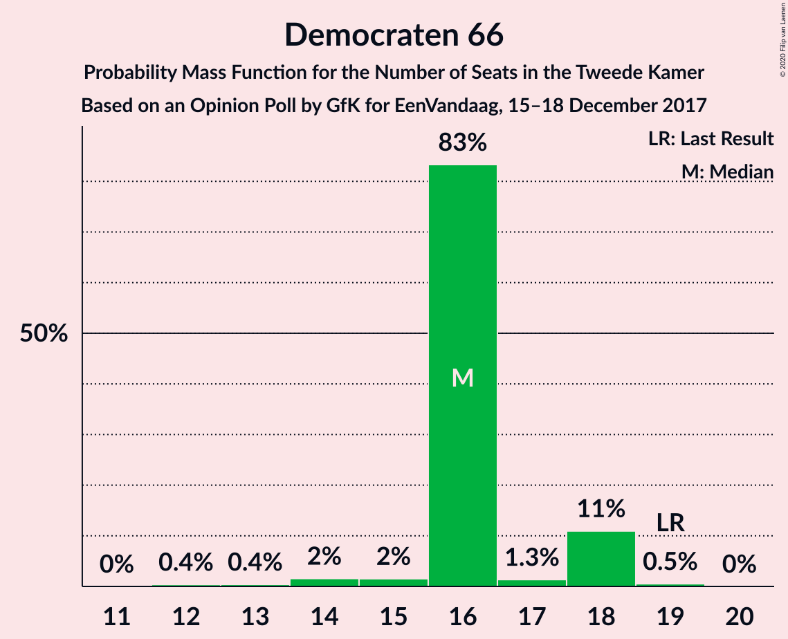

| Number of Seats | Probability | Accumulated | Special Marks |
|:---------------:|:-----------:|:-----------:|:-------------:|
| 11 | 0.1% | 100% |  |
| 12 | 7% | 99.9% |  |
| 13 | 34% | 93% |  |
| 14 | 2% | 59% |  |
| 15 | 49% | 57% | Median |
| 16 | 4% | 8% |  |
| 17 | 0.4% | 4% |  |
| 18 | 4% | 4% |  |
| 19 | 0% | 0.2% | Last Result |
| 20 | 0.1% | 0.1% |  |
| 21 | 0% | 0% |  |

### Socialistische Partij

*For a full overview of the results for this party, see the [Socialistische Partij](party-socialistischepartij.html) page.*

| Number of Seats | Probability | Accumulated | Special Marks |
|:---------------:|:-----------:|:-----------:|:-------------:|
| 12 | 4% | 100% |  |
| 13 | 8% | 96% |  |
| 14 | 3% | 88% | Last Result |
| 15 | 37% | 85% | Median |
| 16 | 5% | 49% |  |
| 17 | 44% | 44% |  |
| 18 | 0.1% | 0.1% |  |
| 19 | 0% | 0% |  |

### GroenLinks

*For a full overview of the results for this party, see the [GroenLinks](party-groenlinks.html) page.*

| Number of Seats | Probability | Accumulated | Special Marks |
|:---------------:|:-----------:|:-----------:|:-------------:|
| 10 | 0% | 100% |  |
| 11 | 0.5% | 99.9% |  |
| 12 | 32% | 99.4% |  |
| 13 | 42% | 67% | Median |
| 14 | 16% | 25% | Last Result |
| 15 | 8% | 9% |  |
| 16 | 1.1% | 1.1% |  |
| 17 | 0% | 0% |  |

### Partij van de Arbeid

*For a full overview of the results for this party, see the [Partij van de Arbeid](party-partijvandearbeid.html) page.*

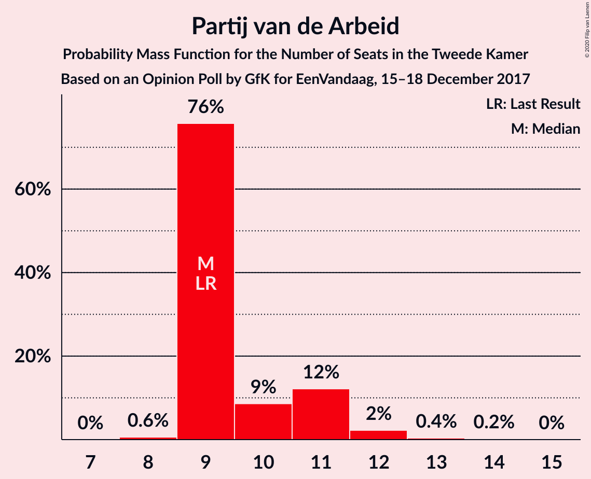

| Number of Seats | Probability | Accumulated | Special Marks |
|:---------------:|:-----------:|:-----------:|:-------------:|
| 8 | 39% | 100% |  |
| 9 | 7% | 61% | Last Result |
| 10 | 7% | 54% | Median |
| 11 | 10% | 47% |  |
| 12 | 11% | 37% |  |
| 13 | 0% | 26% |  |
| 14 | 26% | 26% |  |
| 15 | 0% | 0% |  |

### Forum voor Democratie

*For a full overview of the results for this party, see the [Forum voor Democratie](party-forumvoordemocratie.html) page.*

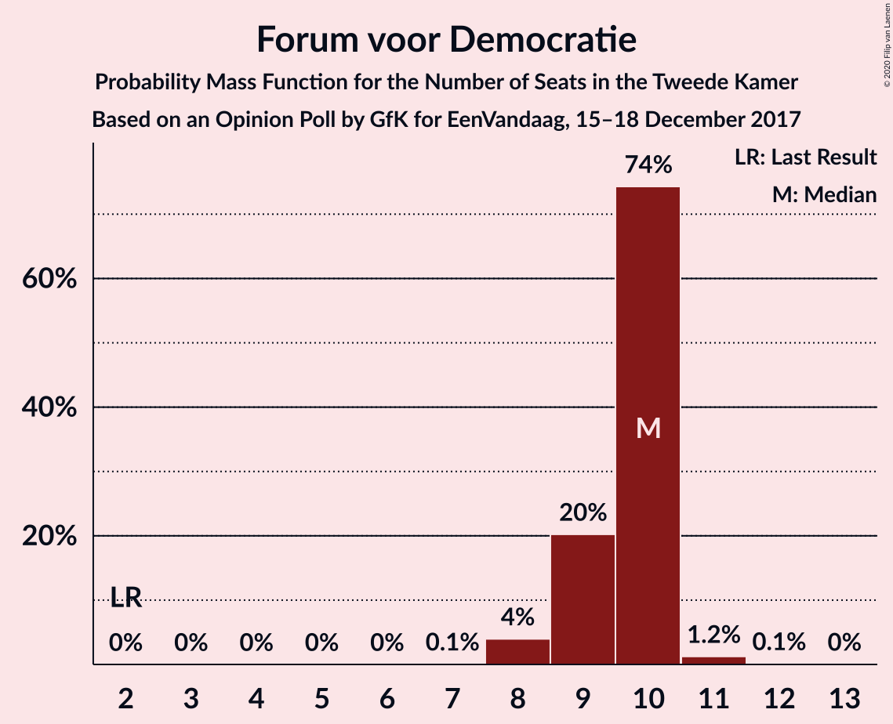

| Number of Seats | Probability | Accumulated | Special Marks |
|:---------------:|:-----------:|:-----------:|:-------------:|
| 2 | 0% | 100% | Last Result |
| 3 | 0% | 100% |  |
| 4 | 0% | 100% |  |
| 5 | 0% | 100% |  |
| 6 | 0% | 100% |  |
| 7 | 2% | 100% |  |
| 8 | 2% | 98% |  |
| 9 | 70% | 96% | Median |
| 10 | 5% | 26% |  |
| 11 | 13% | 21% |  |
| 12 | 7% | 7% |  |
| 13 | 0.2% | 0.2% |  |
| 14 | 0% | 0% |  |

### ChristenUnie

*For a full overview of the results for this party, see the [ChristenUnie](party-christenunie.html) page.*

| Number of Seats | Probability | Accumulated | Special Marks |
|:---------------:|:-----------:|:-----------:|:-------------:|
| 4 | 0.7% | 100% |  |
| 5 | 10% | 99.3% | Last Result |
| 6 | 38% | 89% |  |
| 7 | 51% | 52% | Median |
| 8 | 1.0% | 1.0% |  |
| 9 | 0% | 0% |  |

### Partij voor de Dieren

*For a full overview of the results for this party, see the [Partij voor de Dieren](party-partijvoordedieren.html) page.*

| Number of Seats | Probability | Accumulated | Special Marks |
|:---------------:|:-----------:|:-----------:|:-------------:|
| 3 | 28% | 100% |  |
| 4 | 6% | 72% |  |
| 5 | 56% | 66% | Last Result, Median |
| 6 | 8% | 10% |  |
| 7 | 2% | 2% |  |
| 8 | 0% | 0% |  |

### 50Plus

*For a full overview of the results for this party, see the [50Plus](party-50plus.html) page.*

| Number of Seats | Probability | Accumulated | Special Marks |
|:---------------:|:-----------:|:-----------:|:-------------:|
| 3 | 0.2% | 100% |  |
| 4 | 13% | 99.8% | Last Result |
| 5 | 81% | 87% | Median |
| 6 | 6% | 6% |  |
| 7 | 0% | 0.1% |  |
| 8 | 0% | 0% |  |

### Staatkundig Gereformeerde Partij

*For a full overview of the results for this party, see the [Staatkundig Gereformeerde Partij](party-staatkundiggereformeerdepartij.html) page.*

| Number of Seats | Probability | Accumulated | Special Marks |
|:---------------:|:-----------:|:-----------:|:-------------:|
| 1 | 1.2% | 100% |  |
| 2 | 53% | 98.8% | Median |
| 3 | 42% | 46% | Last Result |
| 4 | 0.8% | 5% |  |
| 5 | 4% | 4% |  |
| 6 | 0% | 0% |  |

### DENK

*For a full overview of the results for this party, see the [DENK](party-denk.html) page.*

| Number of Seats | Probability | Accumulated | Special Marks |
|:---------------:|:-----------:|:-----------:|:-------------:|
| 0 | 5% | 100% |  |
| 1 | 14% | 95% |  |
| 2 | 48% | 81% | Median |
| 3 | 33% | 33% | Last Result |
| 4 | 0% | 0% |  |

## Coalitions

### Confidence Intervals

| Coalition | Last Result | Median | Majority? | 80% Confidence Interval | 90% Confidence Interval | 95% Confidence Interval | 99% Confidence Interval |
|:---------:|:-----------:|:------:|:---------:|:-----------------------:|:-----------------------:|:-----------------------:|:-----------------------:|
| Volkspartij voor Vrijheid en Democratie – Christen-Democratisch Appèl – Democraten 66 – GroenLinks – ChristenUnie | 90 | 81 | 99.4% | 76–82 | 76–83 | 76–83 | 74–83 |
| Volkspartij voor Vrijheid en Democratie – Partij voor de Vrijheid – Christen-Democratisch Appèl – Forum voor Democratie – Staatkundig Gereformeerde Partij | 77 | 79 | 98.8% | 78–81 | 76–81 | 76–82 | 74–83 |
| Volkspartij voor Vrijheid en Democratie – Christen-Democratisch Appèl – Democraten 66 – Partij van de Arbeid – ChristenUnie | 85 | 77 | 81% | 74–78 | 73–80 | 73–81 | 70–81 |
| Volkspartij voor Vrijheid en Democratie – Partij voor de Vrijheid – Christen-Democratisch Appèl – Forum voor Democratie | 74 | 76 | 88% | 74–78 | 73–78 | 73–79 | 73–80 |
| Christen-Democratisch Appèl – Democraten 66 – Socialistische Partij – GroenLinks – Partij van de Arbeid – ChristenUnie | 80 | 75 | 49% | 72–77 | 71–77 | 71–78 | 71–80 |
| Volkspartij voor Vrijheid en Democratie – Partij voor de Vrijheid – Christen-Democratisch Appèl | 72 | 67 | 0% | 65–67 | 64–67 | 62–70 | 61–72 |
| Volkspartij voor Vrijheid en Democratie – Christen-Democratisch Appèl – Democraten 66 – ChristenUnie | 76 | 66 | 0% | 64–69 | 62–69 | 62–69 | 61–70 |
| Volkspartij voor Vrijheid en Democratie – Christen-Democratisch Appèl – Forum voor Democratie – 50Plus – Staatkundig Gereformeerde Partij | 61 | 63 | 0% | 61–64 | 60–65 | 60–65 | 57–65 |
| Christen-Democratisch Appèl – Democraten 66 – GroenLinks – Partij van de Arbeid – ChristenUnie | 66 | 60 | 0% | 58–61 | 56–64 | 56–64 | 56–64 |
| Volkspartij voor Vrijheid en Democratie – Christen-Democratisch Appèl – Democraten 66 | 71 | 61 | 0% | 58–62 | 56–63 | 55–63 | 55–64 |
| Volkspartij voor Vrijheid en Democratie – Christen-Democratisch Appèl – Forum voor Democratie – 50Plus | 58 | 61 | 0% | 59–62 | 57–62 | 55–62 | 55–63 |
| Volkspartij voor Vrijheid en Democratie – Democraten 66 – Partij van de Arbeid | 61 | 54 | 0% | 53–57 | 52–59 | 52–61 | 50–61 |
| Volkspartij voor Vrijheid en Democratie – Christen-Democratisch Appèl – Forum voor Democratie – Staatkundig Gereformeerde Partij | 57 | 58 | 0% | 56–59 | 56–60 | 55–60 | 52–61 |
| Volkspartij voor Vrijheid en Democratie – Christen-Democratisch Appèl – Partij van de Arbeid | 61 | 55 | 0% | 55–59 | 52–59 | 51–59 | 51–59 |
| Volkspartij voor Vrijheid en Democratie – Christen-Democratisch Appèl – Forum voor Democratie | 54 | 56 | 0% | 54–57 | 52–57 | 51–57 | 51–59 |
| Volkspartij voor Vrijheid en Democratie – Christen-Democratisch Appèl | 52 | 46 | 0% | 45–47 | 42–47 | 40–47 | 40–49 |
| Volkspartij voor Vrijheid en Democratie – Partij van de Arbeid | 42 | 41 | 0% | 38–44 | 37–44 | 37–44 | 37–44 |
| Christen-Democratisch Appèl – Democraten 66 – Partij van de Arbeid | 47 | 40 | 0% | 38–42 | 36–42 | 36–44 | 36–44 |
| Christen-Democratisch Appèl – Partij van de Arbeid – ChristenUnie | 33 | 32 | 0% | 29–35 | 28–35 | 28–35 | 27–35 |
| Christen-Democratisch Appèl – Democraten 66 | 38 | 30 | 0% | 28–32 | 26–32 | 26–32 | 26–34 |
| Christen-Democratisch Appèl – Partij van de Arbeid | 28 | 25 | 0% | 23–29 | 23–29 | 23–29 | 23–29 |

### Volkspartij voor Vrijheid en Democratie – Christen-Democratisch Appèl – Democraten 66 – GroenLinks – ChristenUnie

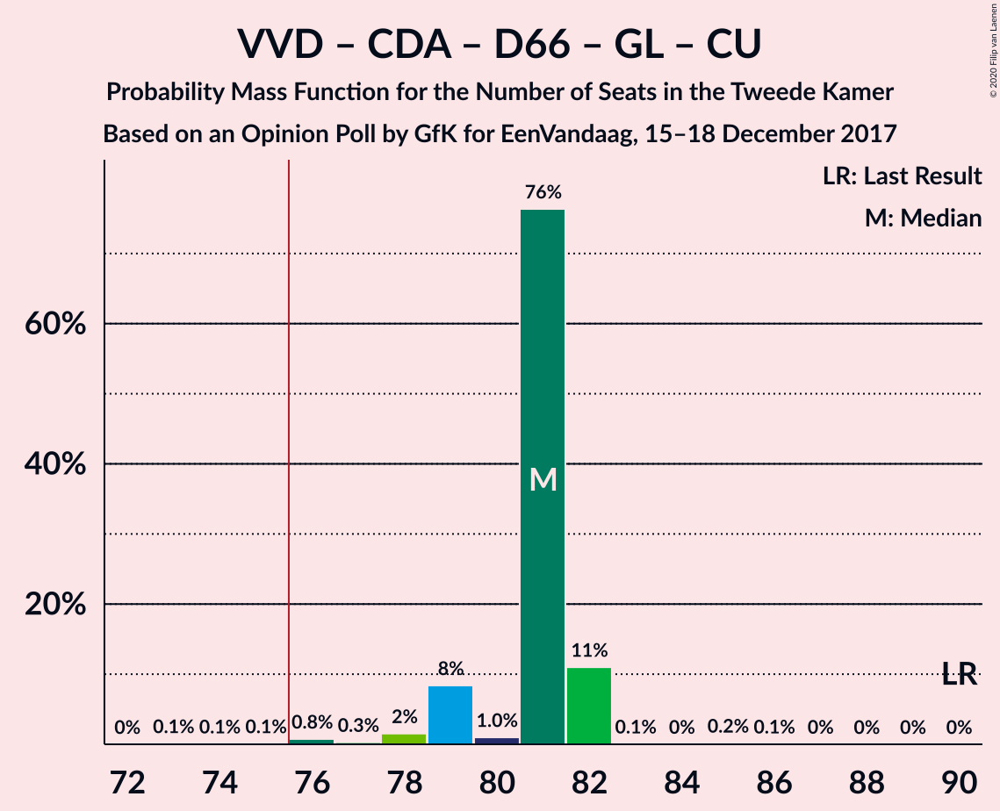

| Number of Seats | Probability | Accumulated | Special Marks |
|:---------------:|:-----------:|:-----------:|:-------------:|
| 74 | 0.5% | 100% |  |
| 75 | 0% | 99.5% |  |
| 76 | 32% | 99.4% | Majority |
| 77 | 7% | 67% |  |
| 78 | 7% | 61% |  |
| 79 | 1.5% | 53% |  |
| 80 | 0.1% | 52% | Median |
| 81 | 7% | 52% |  |
| 82 | 39% | 45% |  |
| 83 | 5% | 6% |  |
| 84 | 0% | 0.5% |  |
| 85 | 0.1% | 0.4% |  |
| 86 | 0.3% | 0.3% |  |
| 87 | 0% | 0% |  |
| 88 | 0% | 0% |  |
| 89 | 0% | 0% |  |
| 90 | 0% | 0% | Last Result |

### Volkspartij voor Vrijheid en Democratie – Partij voor de Vrijheid – Christen-Democratisch Appèl – Forum voor Democratie – Staatkundig Gereformeerde Partij

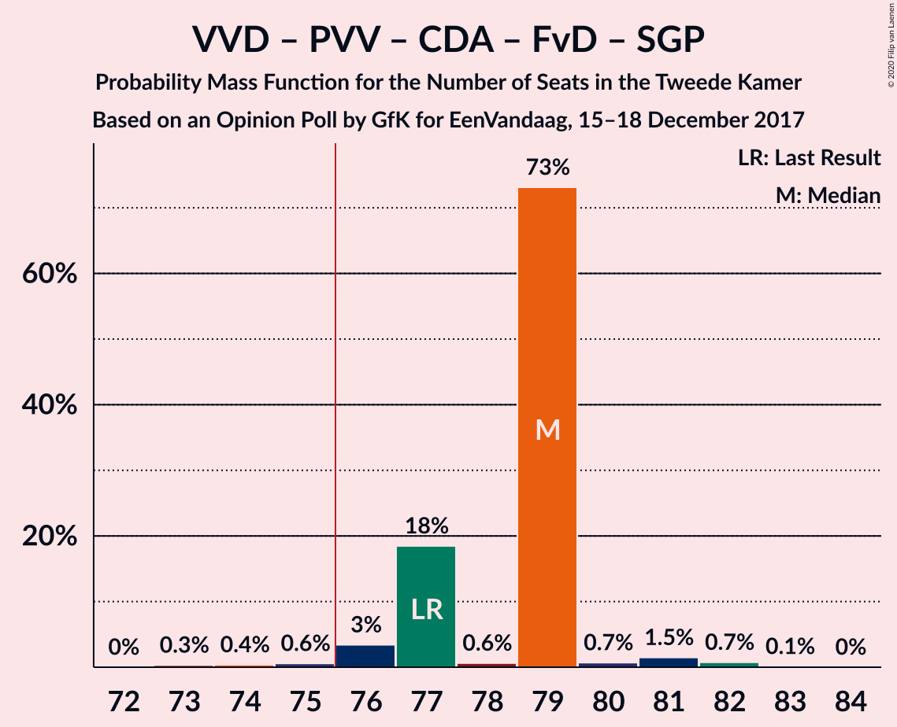

| Number of Seats | Probability | Accumulated | Special Marks |
|:---------------:|:-----------:|:-----------:|:-------------:|
| 73 | 0% | 100% |  |
| 74 | 1.1% | 99.9% |  |
| 75 | 0.1% | 98.9% |  |
| 76 | 7% | 98.8% | Majority |
| 77 | 0.2% | 92% | Last Result, Median |
| 78 | 41% | 92% |  |
| 79 | 36% | 51% |  |
| 80 | 5% | 15% |  |
| 81 | 7% | 10% |  |
| 82 | 2% | 4% |  |
| 83 | 1.4% | 2% |  |
| 84 | 0.2% | 0.2% |  |
| 85 | 0% | 0% |  |

### Volkspartij voor Vrijheid en Democratie – Christen-Democratisch Appèl – Democraten 66 – Partij van de Arbeid – ChristenUnie

| Number of Seats | Probability | Accumulated | Special Marks |
|:---------------:|:-----------:|:-----------:|:-------------:|
| 70 | 2% | 100% |  |
| 71 | 0% | 98% |  |
| 72 | 0.1% | 98% |  |
| 73 | 5% | 98% |  |
| 74 | 6% | 93% |  |
| 75 | 5% | 86% |  |
| 76 | 1.2% | 81% | Majority |
| 77 | 44% | 80% | Median |
| 78 | 30% | 36% |  |
| 79 | 0% | 6% |  |
| 80 | 2% | 6% |  |
| 81 | 4% | 4% |  |
| 82 | 0% | 0.2% |  |
| 83 | 0.1% | 0.1% |  |
| 84 | 0% | 0% |  |
| 85 | 0% | 0% | Last Result |

### Volkspartij voor Vrijheid en Democratie – Partij voor de Vrijheid – Christen-Democratisch Appèl – Forum voor Democratie

| Number of Seats | Probability | Accumulated | Special Marks |
|:---------------:|:-----------:|:-----------:|:-------------:|
| 71 | 0.1% | 100% |  |
| 72 | 0.1% | 99.9% |  |
| 73 | 5% | 99.8% |  |
| 74 | 6% | 95% | Last Result |
| 75 | 0.6% | 88% | Median |
| 76 | 64% | 88% | Majority |
| 77 | 14% | 24% |  |
| 78 | 7% | 10% |  |
| 79 | 2% | 4% |  |
| 80 | 2% | 2% |  |
| 81 | 0% | 0.1% |  |
| 82 | 0.1% | 0.1% |  |
| 83 | 0% | 0% |  |

### Christen-Democratisch Appèl – Democraten 66 – Socialistische Partij – GroenLinks – Partij van de Arbeid – ChristenUnie

| Number of Seats | Probability | Accumulated | Special Marks |
|:---------------:|:-----------:|:-----------:|:-------------:|
| 69 | 0.1% | 100% |  |
| 70 | 0% | 99.9% |  |
| 71 | 7% | 99.9% |  |
| 72 | 9% | 93% |  |
| 73 | 0.7% | 83% |  |
| 74 | 0.3% | 83% |  |
| 75 | 33% | 82% | Median |
| 76 | 4% | 49% | Majority |
| 77 | 43% | 45% |  |
| 78 | 0.3% | 3% |  |
| 79 | 1.4% | 2% |  |
| 80 | 1.0% | 1.0% | Last Result |
| 81 | 0% | 0% |  |

### Volkspartij voor Vrijheid en Democratie – Partij voor de Vrijheid – Christen-Democratisch Appèl

| Number of Seats | Probability | Accumulated | Special Marks |
|:---------------:|:-----------:|:-----------:|:-------------:|
| 61 | 1.0% | 100% |  |
| 62 | 3% | 99.0% |  |
| 63 | 0.2% | 96% |  |
| 64 | 2% | 95% |  |
| 65 | 10% | 94% |  |
| 66 | 3% | 84% | Median |
| 67 | 77% | 81% |  |
| 68 | 0.3% | 4% |  |
| 69 | 0.2% | 4% |  |
| 70 | 2% | 3% |  |
| 71 | 0.2% | 2% |  |
| 72 | 1.4% | 1.5% | Last Result |
| 73 | 0.1% | 0.1% |  |
| 74 | 0% | 0% |  |

### Volkspartij voor Vrijheid en Democratie – Christen-Democratisch Appèl – Democraten 66 – ChristenUnie

| Number of Seats | Probability | Accumulated | Special Marks |
|:---------------:|:-----------:|:-----------:|:-------------:|
| 61 | 2% | 100% |  |
| 62 | 4% | 98% |  |
| 63 | 1.2% | 93% |  |
| 64 | 32% | 92% |  |
| 65 | 7% | 60% |  |
| 66 | 5% | 52% |  |
| 67 | 2% | 47% | Median |
| 68 | 0.1% | 45% |  |
| 69 | 43% | 45% |  |
| 70 | 1.3% | 2% |  |
| 71 | 0.3% | 0.5% |  |
| 72 | 0.2% | 0.2% |  |
| 73 | 0% | 0% |  |
| 74 | 0% | 0% |  |
| 75 | 0% | 0% |  |
| 76 | 0% | 0% | Last Result, Majority |

### Volkspartij voor Vrijheid en Democratie – Christen-Democratisch Appèl – Forum voor Democratie – 50Plus – Staatkundig Gereformeerde Partij

| Number of Seats | Probability | Accumulated | Special Marks |
|:---------------:|:-----------:|:-----------:|:-------------:|
| 57 | 1.0% | 100% |  |
| 58 | 0% | 98.9% |  |
| 59 | 0.3% | 98.9% |  |
| 60 | 4% | 98.7% |  |
| 61 | 5% | 94% | Last Result, Median |
| 62 | 30% | 89% |  |
| 63 | 45% | 59% |  |
| 64 | 7% | 15% |  |
| 65 | 7% | 7% |  |
| 66 | 0.3% | 0.5% |  |
| 67 | 0.1% | 0.1% |  |
| 68 | 0% | 0% |  |

### Christen-Democratisch Appèl – Democraten 66 – GroenLinks – Partij van de Arbeid – ChristenUnie

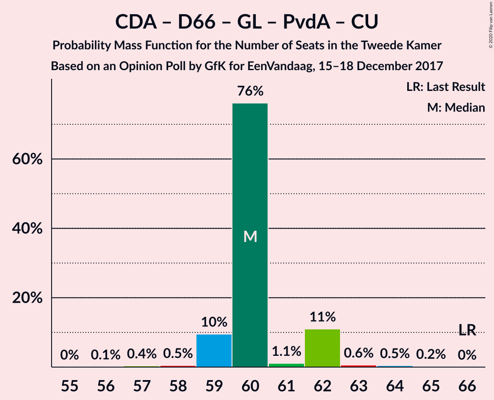

| Number of Seats | Probability | Accumulated | Special Marks |
|:---------------:|:-----------:|:-----------:|:-------------:|
| 54 | 0.1% | 100% |  |
| 55 | 0% | 99.9% |  |
| 56 | 6% | 99.9% |  |
| 57 | 3% | 94% |  |
| 58 | 6% | 91% |  |
| 59 | 7% | 85% |  |
| 60 | 63% | 77% | Median |
| 61 | 6% | 14% |  |
| 62 | 3% | 8% |  |
| 63 | 0.1% | 5% |  |
| 64 | 5% | 5% |  |
| 65 | 0.3% | 0.3% |  |
| 66 | 0% | 0% | Last Result |

### Volkspartij voor Vrijheid en Democratie – Christen-Democratisch Appèl – Democraten 66

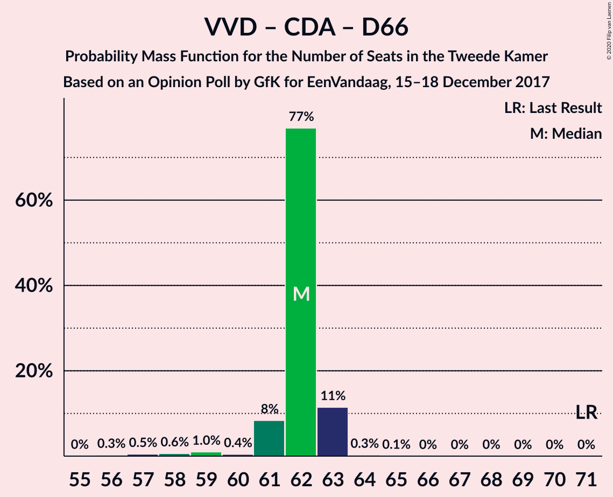

| Number of Seats | Probability | Accumulated | Special Marks |
|:---------------:|:-----------:|:-----------:|:-------------:|
| 55 | 3% | 100% |  |
| 56 | 2% | 97% |  |
| 57 | 2% | 94% |  |
| 58 | 39% | 92% |  |
| 59 | 1.2% | 54% |  |
| 60 | 0.4% | 52% | Median |
| 61 | 7% | 52% |  |
| 62 | 40% | 45% |  |
| 63 | 5% | 5% |  |
| 64 | 0.2% | 0.6% |  |
| 65 | 0% | 0.5% |  |
| 66 | 0.3% | 0.4% |  |
| 67 | 0.1% | 0.1% |  |
| 68 | 0% | 0% |  |
| 69 | 0% | 0% |  |
| 70 | 0% | 0% |  |
| 71 | 0% | 0% | Last Result |

### Volkspartij voor Vrijheid en Democratie – Christen-Democratisch Appèl – Forum voor Democratie – 50Plus

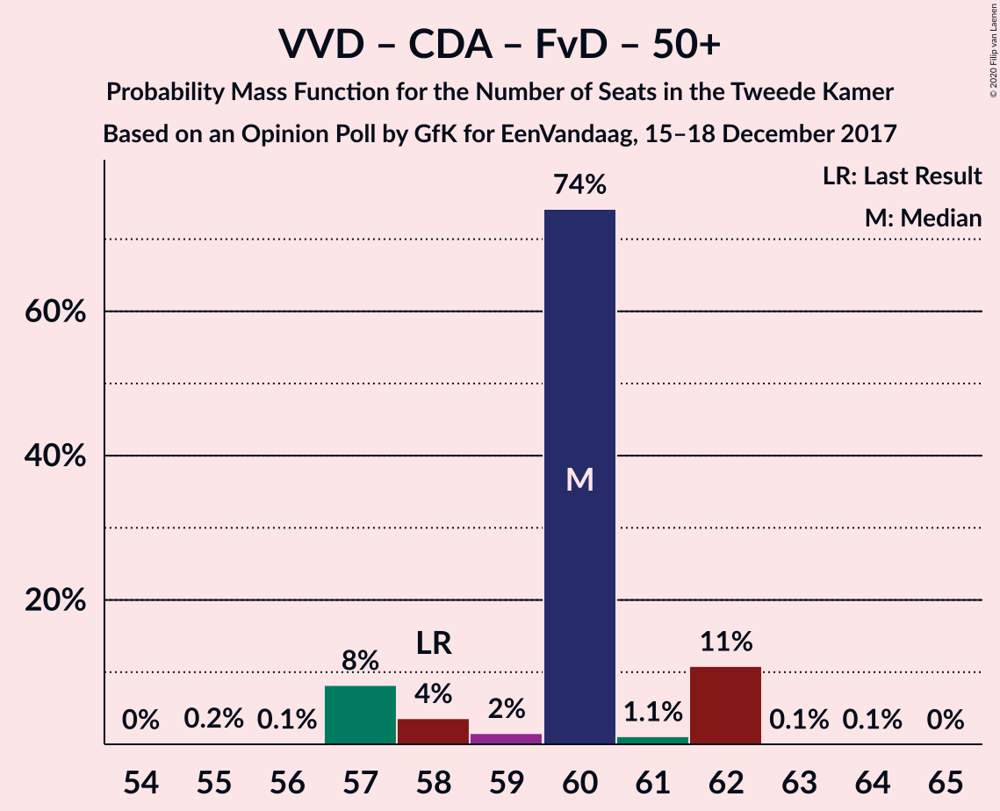

| Number of Seats | Probability | Accumulated | Special Marks |
|:---------------:|:-----------:|:-----------:|:-------------:|
| 55 | 3% | 100% |  |
| 56 | 1.1% | 97% |  |
| 57 | 2% | 96% |  |
| 58 | 0.2% | 94% | Last Result |
| 59 | 31% | 94% | Median |
| 60 | 11% | 62% |  |
| 61 | 39% | 52% |  |
| 62 | 12% | 13% |  |
| 63 | 0.5% | 0.8% |  |
| 64 | 0.2% | 0.3% |  |
| 65 | 0.1% | 0.1% |  |
| 66 | 0% | 0% |  |

### Volkspartij voor Vrijheid en Democratie – Democraten 66 – Partij van de Arbeid

| Number of Seats | Probability | Accumulated | Special Marks |
|:---------------:|:-----------:|:-----------:|:-------------:|
| 50 | 2% | 100% |  |
| 51 | 0% | 98% |  |
| 52 | 3% | 98% |  |
| 53 | 39% | 94% |  |
| 54 | 7% | 55% |  |
| 55 | 8% | 48% | Median |
| 56 | 7% | 40% |  |
| 57 | 27% | 34% |  |
| 58 | 0.8% | 7% |  |
| 59 | 2% | 6% |  |
| 60 | 0% | 4% |  |
| 61 | 4% | 4% | Last Result |
| 62 | 0% | 0% |  |

### Volkspartij voor Vrijheid en Democratie – Christen-Democratisch Appèl – Forum voor Democratie – Staatkundig Gereformeerde Partij

| Number of Seats | Probability | Accumulated | Special Marks |
|:---------------:|:-----------:|:-----------:|:-------------:|
| 52 | 1.0% | 100% |  |
| 53 | 0% | 99.0% |  |
| 54 | 0.2% | 98.9% |  |
| 55 | 2% | 98.7% |  |
| 56 | 11% | 97% | Median |
| 57 | 26% | 86% | Last Result |
| 58 | 38% | 59% |  |
| 59 | 14% | 22% |  |
| 60 | 7% | 7% |  |
| 61 | 0.6% | 0.8% |  |
| 62 | 0.2% | 0.2% |  |
| 63 | 0% | 0% |  |

### Volkspartij voor Vrijheid en Democratie – Christen-Democratisch Appèl – Partij van de Arbeid

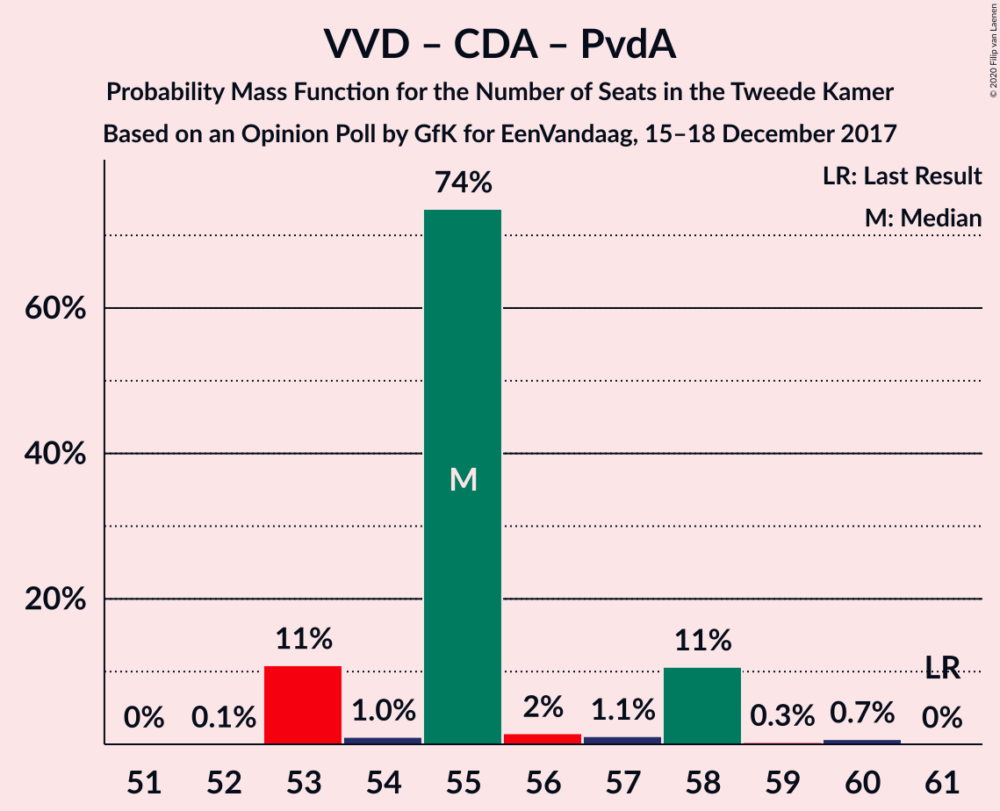

| Number of Seats | Probability | Accumulated | Special Marks |
|:---------------:|:-----------:|:-----------:|:-------------:|
| 51 | 3% | 100% |  |
| 52 | 3% | 97% |  |
| 53 | 2% | 93% |  |
| 54 | 0.1% | 91% |  |
| 55 | 48% | 91% | Median |
| 56 | 1.5% | 43% |  |
| 57 | 6% | 41% |  |
| 58 | 9% | 36% |  |
| 59 | 26% | 26% |  |
| 60 | 0.1% | 0.3% |  |
| 61 | 0% | 0.1% | Last Result |
| 62 | 0.1% | 0.1% |  |
| 63 | 0% | 0% |  |

### Volkspartij voor Vrijheid en Democratie – Christen-Democratisch Appèl – Forum voor Democratie

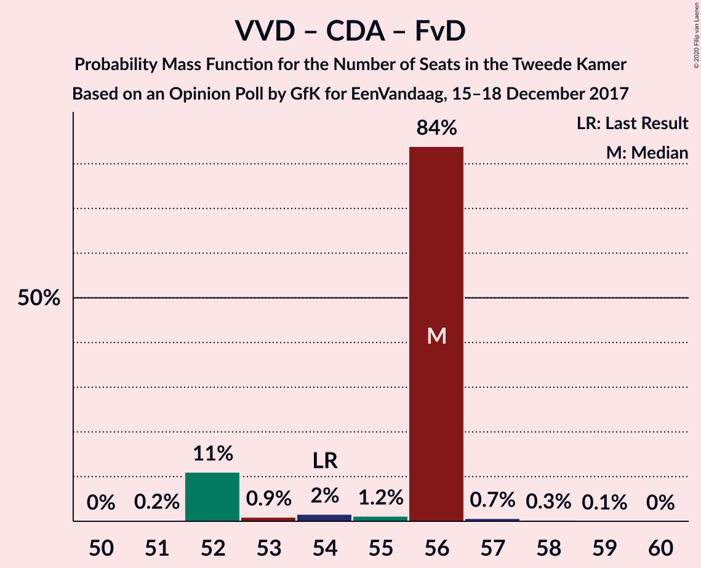

| Number of Seats | Probability | Accumulated | Special Marks |
|:---------------:|:-----------:|:-----------:|:-------------:|
| 50 | 0.1% | 100% |  |
| 51 | 5% | 99.9% |  |
| 52 | 0.2% | 95% |  |
| 53 | 3% | 95% |  |
| 54 | 32% | 92% | Last Result, Median |
| 55 | 1.3% | 60% |  |
| 56 | 46% | 59% |  |
| 57 | 12% | 13% |  |
| 58 | 0% | 0.8% |  |
| 59 | 0.7% | 0.8% |  |
| 60 | 0.1% | 0.1% |  |
| 61 | 0% | 0% |  |

### Volkspartij voor Vrijheid en Democratie – Christen-Democratisch Appèl

| Number of Seats | Probability | Accumulated | Special Marks |
|:---------------:|:-----------:|:-----------:|:-------------:|
| 40 | 3% | 100% |  |
| 41 | 1.0% | 97% |  |
| 42 | 1.1% | 96% |  |
| 43 | 3% | 95% |  |
| 44 | 0.9% | 91% |  |
| 45 | 35% | 90% | Median |
| 46 | 14% | 55% |  |
| 47 | 39% | 41% |  |
| 48 | 1.3% | 2% |  |
| 49 | 0.3% | 0.6% |  |
| 50 | 0% | 0.3% |  |
| 51 | 0.2% | 0.2% |  |
| 52 | 0% | 0% | Last Result |

### Volkspartij voor Vrijheid en Democratie – Partij van de Arbeid

| Number of Seats | Probability | Accumulated | Special Marks |
|:---------------:|:-----------:|:-----------:|:-------------:|
| 37 | 7% | 100% |  |
| 38 | 39% | 93% |  |
| 39 | 0.6% | 55% |  |
| 40 | 0% | 54% | Median |
| 41 | 8% | 54% |  |
| 42 | 13% | 46% | Last Result |
| 43 | 6% | 32% |  |
| 44 | 26% | 26% |  |
| 45 | 0.1% | 0.1% |  |
| 46 | 0% | 0% |  |

### Christen-Democratisch Appèl – Democraten 66 – Partij van de Arbeid

| Number of Seats | Probability | Accumulated | Special Marks |
|:---------------:|:-----------:|:-----------:|:-------------:|
| 35 | 0.1% | 100% |  |
| 36 | 6% | 99.9% |  |
| 37 | 2% | 94% |  |
| 38 | 7% | 92% |  |
| 39 | 0.6% | 85% |  |
| 40 | 47% | 85% | Median |
| 41 | 3% | 37% |  |
| 42 | 29% | 34% |  |
| 43 | 0.1% | 5% |  |
| 44 | 4% | 5% |  |
| 45 | 0.2% | 0.4% |  |
| 46 | 0.1% | 0.2% |  |
| 47 | 0.1% | 0.1% | Last Result |
| 48 | 0% | 0% |  |

### Christen-Democratisch Appèl – Partij van de Arbeid – ChristenUnie

| Number of Seats | Probability | Accumulated | Special Marks |
|:---------------:|:-----------:|:-----------:|:-------------:|
| 27 | 0.5% | 100% |  |
| 28 | 5% | 99.5% |  |
| 29 | 9% | 95% |  |
| 30 | 2% | 86% |  |
| 31 | 1.1% | 84% |  |
| 32 | 47% | 83% | Median |
| 33 | 0.7% | 36% | Last Result |
| 34 | 3% | 36% |  |
| 35 | 33% | 33% |  |
| 36 | 0.2% | 0.2% |  |
| 37 | 0% | 0% |  |

### Christen-Democratisch Appèl – Democraten 66

| Number of Seats | Probability | Accumulated | Special Marks |
|:---------------:|:-----------:|:-----------:|:-------------:|
| 26 | 6% | 100% |  |
| 27 | 0.1% | 94% |  |
| 28 | 35% | 94% |  |
| 29 | 9% | 59% |  |
| 30 | 5% | 50% | Median |
| 31 | 3% | 45% |  |
| 32 | 41% | 42% |  |
| 33 | 0% | 0.7% |  |
| 34 | 0.3% | 0.6% |  |
| 35 | 0% | 0.3% |  |
| 36 | 0.3% | 0.3% |  |
| 37 | 0% | 0% |  |
| 38 | 0% | 0% | Last Result |

### Christen-Democratisch Appèl – Partij van de Arbeid

| Number of Seats | Probability | Accumulated | Special Marks |
|:---------------:|:-----------:|:-----------:|:-------------:|
| 22 | 0.5% | 100% |  |
| 23 | 12% | 99.5% |  |
| 24 | 3% | 88% |  |
| 25 | 43% | 85% | Median |
| 26 | 6% | 42% |  |
| 27 | 0.7% | 36% |  |
| 28 | 9% | 35% | Last Result |
| 29 | 26% | 27% |  |
| 30 | 0% | 0.2% |  |
| 31 | 0.2% | 0.2% |  |
| 32 | 0% | 0% |  |

## Technical Information

### Opinion Poll

+ **Polling firm:** GfK
+ **Commissioner(s):** EenVandaag
+ **Fieldwork period:** 15–18 December 2017

### Calculations

+ **Sample size:** 1907
+ **Simulations done:** 131,072
+ **Error estimate:** 3.60%

