# Opinion Poll by Ipsos, 18 December 2017

<a href="#voting-intentions">Voting Intentions</a> | <a href="#seats">Seats</a> | <a href="#coalitions">Coalitions</a> | <a href="#technical-information">Technical Information</a>

## Voting Intentions

### Confidence Intervals

| Party | Last Result | Poll Result | 80% Confidence Interval | 90% Confidence Interval | 95% Confidence Interval | 99% Confidence Interval |
|:-----:|:-----------:|:-----------:|:-----------------------:|:-----------------------:|:-----------------------:|:-----------------------:|
| Volkspartij voor Vrijheid en Democratie | 21.3% | 19.8% | 18.2–21.5% |17.8–22.0% |17.4–22.4% |16.7–23.2% |
| Partij voor de Vrijheid | 13.1% | 11.8% | 10.6–13.2% |10.2–13.6% |9.9–14.0% |9.4–14.7% |
| Democraten 66 | 12.2% | 10.7% | 9.5–12.1% |9.2–12.4% |8.9–12.8% |8.4–13.5% |
| Christen-Democratisch Appèl | 12.4% | 9.4% | 8.3–10.7% |8.0–11.1% |7.7–11.4% |7.2–12.0% |
| GroenLinks | 9.1% | 8.7% | 7.7–10.0% |7.3–10.3% |7.1–10.6% |6.6–11.2% |
| Socialistische Partij | 9.1% | 8.0% | 7.0–9.2% |6.7–9.6% |6.5–9.9% |6.0–10.5% |
| Forum voor Democratie | 1.8% | 7.8% | 6.8–9.0% |6.5–9.3% |6.3–9.6% |5.8–10.2% |
| Partij van de Arbeid | 5.7% | 6.6% | 5.7–7.7% |5.4–8.0% |5.2–8.3% |4.8–8.9% |
| Partij voor de Dieren | 3.2% | 4.4% | 3.7–5.3% |3.5–5.6% |3.3–5.9% |3.0–6.4% |
| ChristenUnie | 3.4% | 3.9% | 3.2–4.8% |3.0–5.1% |2.9–5.3% |2.6–5.8% |
| 50Plus | 3.1% | 3.2% | 2.6–4.0% |2.4–4.3% |2.3–4.5% |2.0–4.9% |
| DENK | 2.1% | 2.6% | 2.1–3.4% |1.9–3.6% |1.8–3.8% |1.6–4.2% |
| Staatkundig Gereformeerde Partij | 2.1% | 2.5% | 2.0–3.3% |1.8–3.5% |1.7–3.7% |1.5–4.1% |

*Note:* The poll result column reflects the actual value used in the calculations. Published results may vary slightly, and in addition be rounded to fewer digits.

## Seats

### Confidence Intervals

| Party | Last Result | Median | 80% Confidence Interval | 90% Confidence Interval | 95% Confidence Interval | 99% Confidence Interval |
|:-----:|:-----------:|:------:|:-----------------------:|:-----------------------:|:-----------------------:|:-----------------------:|
| <a href="#volkspartij-voor-vrijheid-en-democratie">Volkspartij voor Vrijheid en Democratie</a> | 33 | 31 | 28–31 |28–31 |28–31 |28–35 |
| <a href="#partij-voor-de-vrijheid">Partij voor de Vrijheid</a> | 20 | 18 | 17–18 |17–18 |16–19 |13–21 |
| <a href="#democraten-66">Democraten 66</a> | 19 | 17 | 15–18 |15–18 |15–18 |14–20 |
| <a href="#christen-democratisch-appèl">Christen-Democratisch Appèl</a> | 19 | 15 | 11–15 |11–15 |11–16 |11–17 |
| <a href="#groenlinks">GroenLinks</a> | 14 | 14 | 13–14 |12–14 |12–14 |9–15 |
| <a href="#socialistische-partij">Socialistische Partij</a> | 14 | 10 | 10–13 |10–14 |10–14 |9–15 |
| <a href="#forum-voor-democratie">Forum voor Democratie</a> | 2 | 13 | 12–13 |10–14 |10–14 |8–14 |
| <a href="#partij-van-de-arbeid">Partij van de Arbeid</a> | 9 | 7 | 7–11 |7–12 |7–13 |7–13 |
| <a href="#partij-voor-de-dieren">Partij voor de Dieren</a> | 5 | 6 | 6–8 |6–8 |6–8 |5–9 |
| <a href="#christenunie">ChristenUnie</a> | 5 | 5 | 5–7 |5–7 |5–7 |4–7 |
| <a href="#50plus">50Plus</a> | 4 | 6 | 5–6 |3–6 |3–7 |3–7 |
| <a href="#denk">DENK</a> | 3 | 3 | 3–5 |3–5 |3–5 |2–6 |
| <a href="#staatkundig-gereformeerde-partij">Staatkundig Gereformeerde Partij</a> | 3 | 4 | 3–4 |2–4 |2–4 |2–5 |

### Volkspartij voor Vrijheid en Democratie

*For a full overview of the results for this party, see the [Volkspartij voor Vrijheid en Democratie](party-volkspartijvoorvrijheidendemocratie.html) page.*

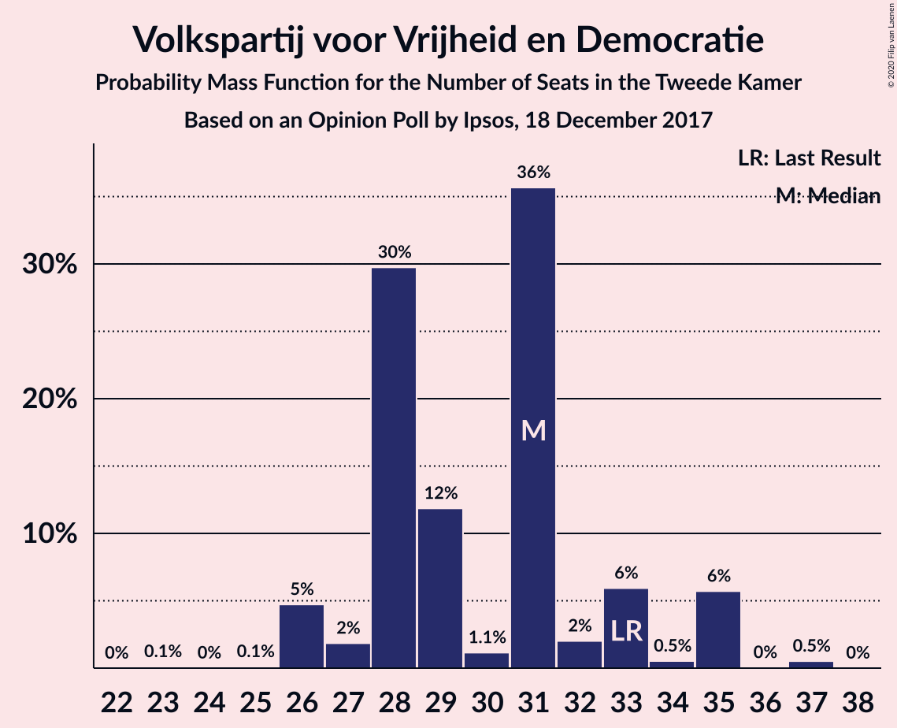

| Number of Seats | Probability | Accumulated | Special Marks |
|:---------------:|:-----------:|:-----------:|:-------------:|
| 25 | 0.1% | 100% |  |
| 26 | 0.2% | 99.9% |  |
| 27 | 0.1% | 99.7% |  |
| 28 | 29% | 99.6% |  |
| 29 | 8% | 70% |  |
| 30 | 1.2% | 63% |  |
| 31 | 60% | 62% | Median |
| 32 | 0.2% | 2% |  |
| 33 | 0.2% | 1.4% | Last Result |
| 34 | 0.4% | 1.2% |  |
| 35 | 0.7% | 0.7% |  |
| 36 | 0% | 0.1% |  |
| 37 | 0% | 0% |  |

### Partij voor de Vrijheid

*For a full overview of the results for this party, see the [Partij voor de Vrijheid](party-partijvoordevrijheid.html) page.*

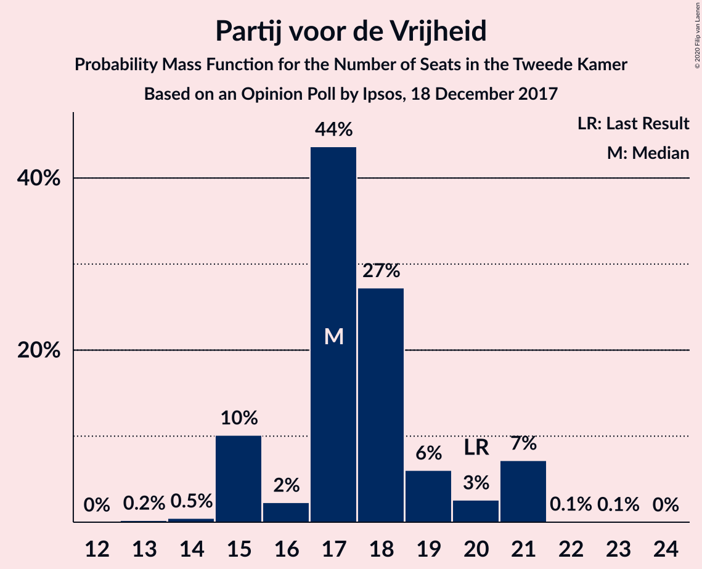

| Number of Seats | Probability | Accumulated | Special Marks |
|:---------------:|:-----------:|:-----------:|:-------------:|
| 13 | 0.7% | 100% |  |
| 14 | 0.1% | 99.3% |  |
| 15 | 0.9% | 99.2% |  |
| 16 | 1.2% | 98% |  |
| 17 | 34% | 97% |  |
| 18 | 60% | 63% | Median |
| 19 | 0.9% | 3% |  |
| 20 | 0.1% | 2% | Last Result |
| 21 | 2% | 2% |  |
| 22 | 0.1% | 0.2% |  |
| 23 | 0.1% | 0.2% |  |
| 24 | 0% | 0% |  |

### Democraten 66

*For a full overview of the results for this party, see the [Democraten 66](party-democraten66.html) page.*

| Number of Seats | Probability | Accumulated | Special Marks |
|:---------------:|:-----------:|:-----------:|:-------------:|
| 13 | 0.2% | 100% |  |
| 14 | 2% | 99.8% |  |
| 15 | 10% | 98% |  |
| 16 | 0.7% | 87% |  |
| 17 | 61% | 87% | Median |
| 18 | 25% | 26% |  |
| 19 | 0.2% | 0.9% | Last Result |
| 20 | 0.6% | 0.7% |  |
| 21 | 0.1% | 0.1% |  |
| 22 | 0% | 0% |  |

### Christen-Democratisch Appèl

*For a full overview of the results for this party, see the [Christen-Democratisch Appèl](party-christen-democratischappèl.html) page.*

| Number of Seats | Probability | Accumulated | Special Marks |
|:---------------:|:-----------:|:-----------:|:-------------:|
| 11 | 28% | 100% |  |
| 12 | 0.4% | 72% |  |
| 13 | 10% | 71% |  |
| 14 | 2% | 61% |  |
| 15 | 57% | 60% | Median |
| 16 | 1.1% | 3% |  |
| 17 | 1.3% | 1.5% |  |
| 18 | 0.1% | 0.2% |  |
| 19 | 0% | 0% | Last Result |

### GroenLinks

*For a full overview of the results for this party, see the [GroenLinks](party-groenlinks.html) page.*

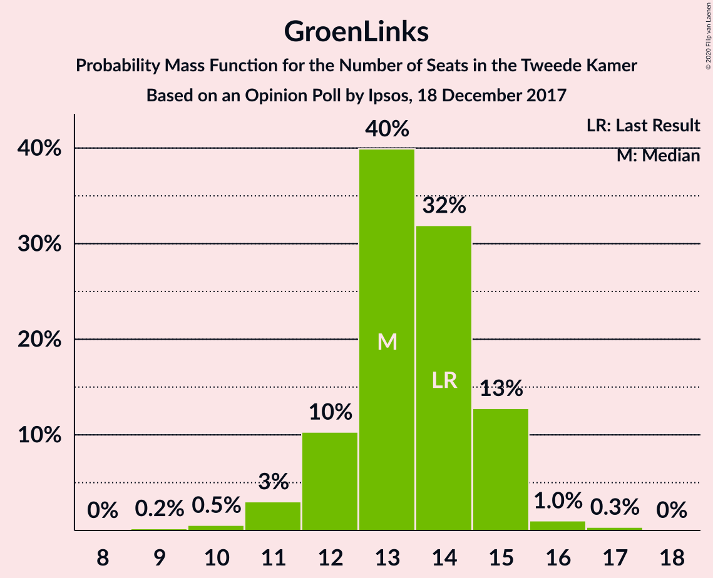

| Number of Seats | Probability | Accumulated | Special Marks |
|:---------------:|:-----------:|:-----------:|:-------------:|
| 9 | 0.5% | 100% |  |
| 10 | 0.3% | 99.5% |  |
| 11 | 0.6% | 99.2% |  |
| 12 | 4% | 98.6% |  |
| 13 | 5% | 94% |  |
| 14 | 87% | 89% | Last Result, Median |
| 15 | 2% | 2% |  |
| 16 | 0.1% | 0.1% |  |
| 17 | 0% | 0.1% |  |
| 18 | 0% | 0% |  |

### Socialistische Partij

*For a full overview of the results for this party, see the [Socialistische Partij](party-socialistischepartij.html) page.*

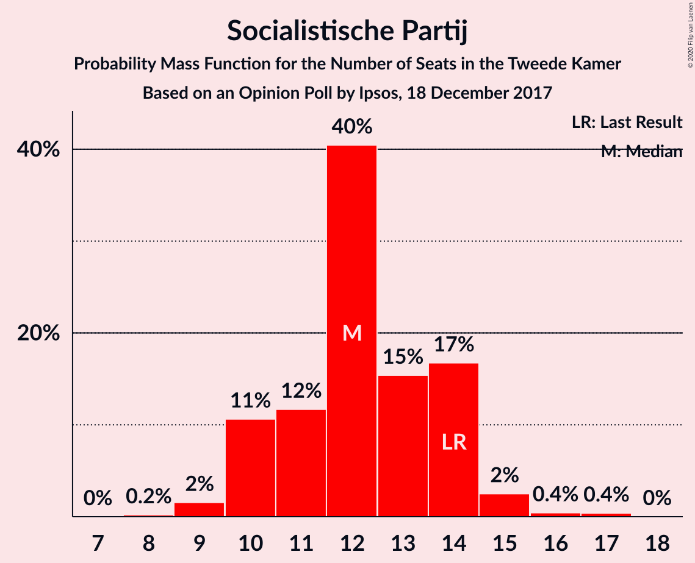

| Number of Seats | Probability | Accumulated | Special Marks |
|:---------------:|:-----------:|:-----------:|:-------------:|
| 8 | 0.1% | 100% |  |
| 9 | 1.2% | 99.9% |  |
| 10 | 55% | 98.7% | Median |
| 11 | 0.4% | 44% |  |
| 12 | 31% | 43% |  |
| 13 | 4% | 12% |  |
| 14 | 6% | 8% | Last Result |
| 15 | 2% | 2% |  |
| 16 | 0% | 0.1% |  |
| 17 | 0.1% | 0.1% |  |
| 18 | 0% | 0% |  |

### Forum voor Democratie

*For a full overview of the results for this party, see the [Forum voor Democratie](party-forumvoordemocratie.html) page.*

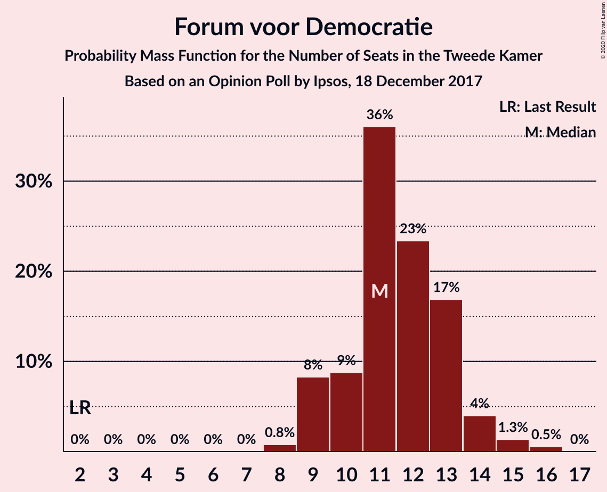

| Number of Seats | Probability | Accumulated | Special Marks |
|:---------------:|:-----------:|:-----------:|:-------------:|
| 2 | 0% | 100% | Last Result |
| 3 | 0% | 100% |  |
| 4 | 0% | 100% |  |
| 5 | 0% | 100% |  |
| 6 | 0% | 100% |  |
| 7 | 0% | 100% |  |
| 8 | 1.0% | 100% |  |
| 9 | 1.5% | 99.0% |  |
| 10 | 4% | 98% |  |
| 11 | 2% | 93% |  |
| 12 | 30% | 92% |  |
| 13 | 55% | 61% | Median |
| 14 | 6% | 7% |  |
| 15 | 0.2% | 0.2% |  |
| 16 | 0.1% | 0.1% |  |
| 17 | 0% | 0% |  |

### Partij van de Arbeid

*For a full overview of the results for this party, see the [Partij van de Arbeid](party-partijvandearbeid.html) page.*

| Number of Seats | Probability | Accumulated | Special Marks |
|:---------------:|:-----------:|:-----------:|:-------------:|
| 6 | 0.1% | 100% |  |
| 7 | 56% | 99.9% | Median |
| 8 | 0.7% | 44% |  |
| 9 | 5% | 43% | Last Result |
| 10 | 7% | 38% |  |
| 11 | 25% | 31% |  |
| 12 | 2% | 6% |  |
| 13 | 4% | 4% |  |
| 14 | 0% | 0% |  |

### Partij voor de Dieren

*For a full overview of the results for this party, see the [Partij voor de Dieren](party-partijvoordedieren.html) page.*

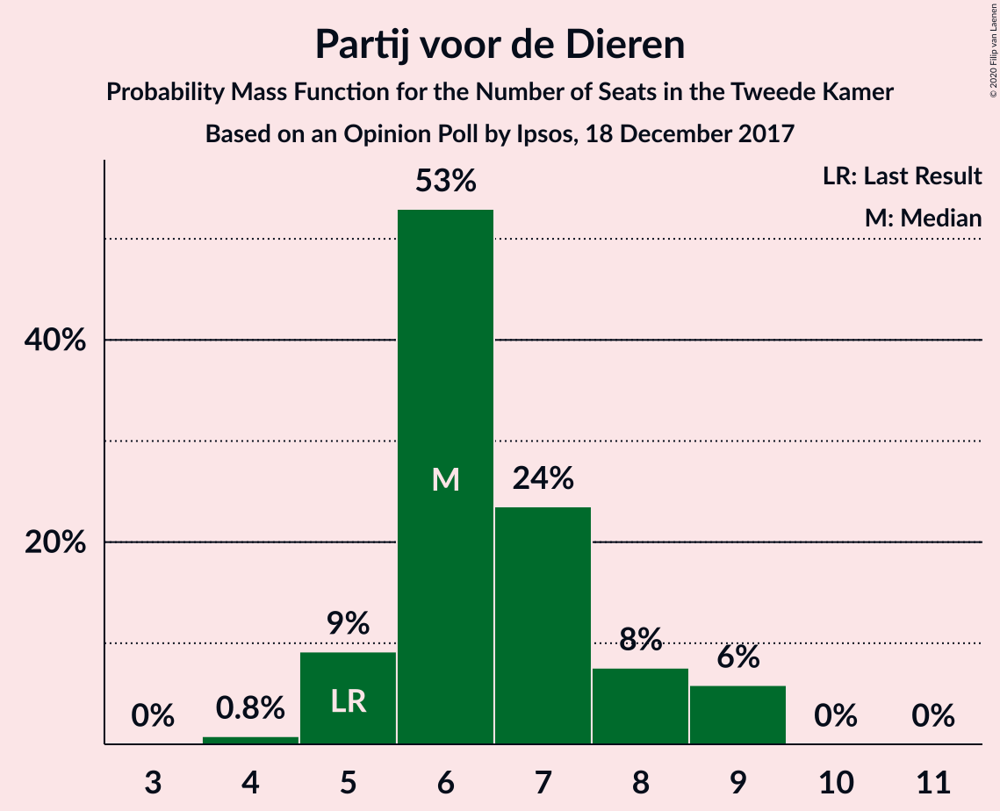

| Number of Seats | Probability | Accumulated | Special Marks |
|:---------------:|:-----------:|:-----------:|:-------------:|
| 3 | 0.1% | 100% |  |
| 4 | 0.1% | 99.9% |  |
| 5 | 0.9% | 99.9% | Last Result |
| 6 | 66% | 98.9% | Median |
| 7 | 8% | 33% |  |
| 8 | 25% | 26% |  |
| 9 | 0.5% | 0.5% |  |
| 10 | 0% | 0% |  |

### ChristenUnie

*For a full overview of the results for this party, see the [ChristenUnie](party-christenunie.html) page.*

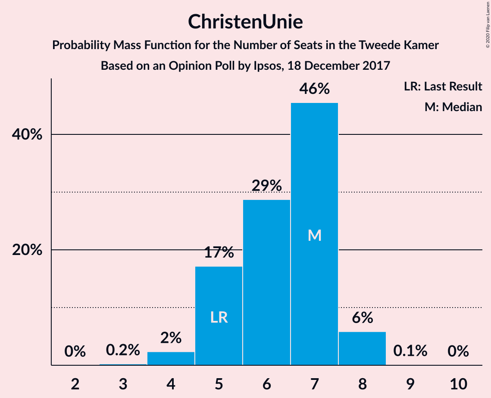

| Number of Seats | Probability | Accumulated | Special Marks |
|:---------------:|:-----------:|:-----------:|:-------------:|
| 4 | 1.3% | 100% |  |
| 5 | 57% | 98.7% | Last Result, Median |
| 6 | 11% | 42% |  |
| 7 | 30% | 31% |  |
| 8 | 0% | 0.3% |  |
| 9 | 0.1% | 0.3% |  |
| 10 | 0.1% | 0.1% |  |
| 11 | 0% | 0% |  |

### 50Plus

*For a full overview of the results for this party, see the [50Plus](party-50plus.html) page.*

| Number of Seats | Probability | Accumulated | Special Marks |
|:---------------:|:-----------:|:-----------:|:-------------:|
| 2 | 0.1% | 100% |  |
| 3 | 7% | 99.9% |  |
| 4 | 3% | 93% | Last Result |
| 5 | 27% | 90% |  |
| 6 | 59% | 63% | Median |
| 7 | 4% | 4% |  |
| 8 | 0.1% | 0.1% |  |
| 9 | 0% | 0% |  |

### DENK

*For a full overview of the results for this party, see the [DENK](party-denk.html) page.*

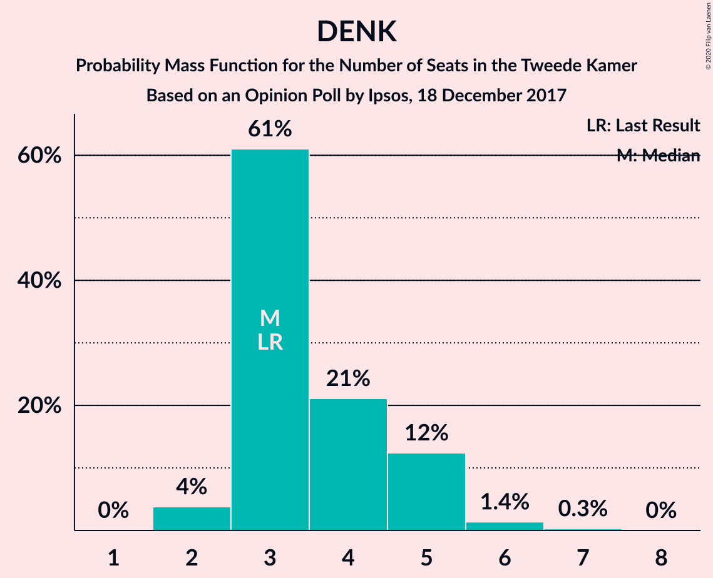

| Number of Seats | Probability | Accumulated | Special Marks |
|:---------------:|:-----------:|:-----------:|:-------------:|
| 2 | 1.3% | 100% |  |
| 3 | 57% | 98.7% | Last Result, Median |
| 4 | 30% | 42% |  |
| 5 | 10% | 12% |  |
| 6 | 1.3% | 1.3% |  |
| 7 | 0% | 0% |  |

### Staatkundig Gereformeerde Partij

*For a full overview of the results for this party, see the [Staatkundig Gereformeerde Partij](party-staatkundiggereformeerdepartij.html) page.*

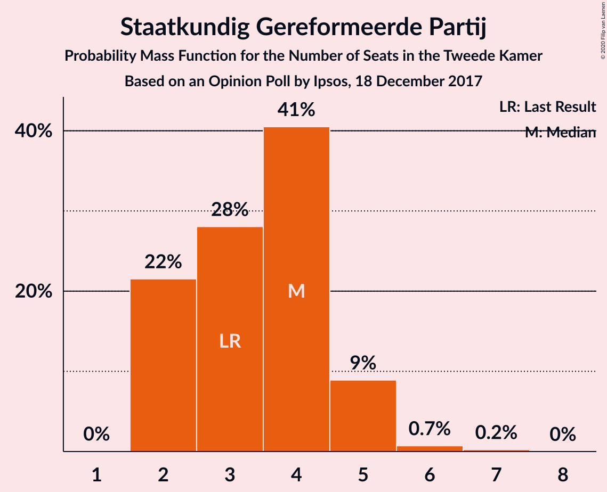

| Number of Seats | Probability | Accumulated | Special Marks |
|:---------------:|:-----------:|:-----------:|:-------------:|
| 2 | 8% | 100% |  |
| 3 | 31% | 92% | Last Result |
| 4 | 60% | 61% | Median |
| 5 | 0.7% | 0.9% |  |
| 6 | 0.2% | 0.2% |  |
| 7 | 0% | 0% |  |

## Coalitions

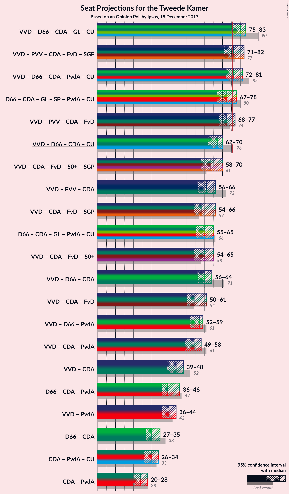

### Confidence Intervals

| Coalition | Last Result | Median | Majority? | 80% Confidence Interval | 90% Confidence Interval | 95% Confidence Interval | 99% Confidence Interval |
|:---------:|:-----------:|:------:|:---------:|:-----------------------:|:-----------------------:|:-----------------------:|:-----------------------:|
| Volkspartij voor Vrijheid en Democratie – Democraten 66 – Christen-Democratisch Appèl – GroenLinks – ChristenUnie | 90 | 82 | 95% | 77–82 | 77–82 | 74–83 | 74–84 |
| Volkspartij voor Vrijheid en Democratie – Partij voor de Vrijheid – Christen-Democratisch Appèl – Forum voor Democratie – Staatkundig Gereformeerde Partij | 77 | 81 | 65% | 71–81 | 71–81 | 71–81 | 71–81 |
| Volkspartij voor Vrijheid en Democratie – Democraten 66 – Christen-Democratisch Appèl – Partij van de Arbeid – ChristenUnie | 85 | 75 | 6% | 75 | 73–76 | 73–78 | 73–81 |
| Volkspartij voor Vrijheid en Democratie – Partij voor de Vrijheid – Christen-Democratisch Appèl – Forum voor Democratie | 74 | 77 | 57% | 68–77 | 68–77 | 68–77 | 68–77 |
| Democraten 66 – Christen-Democratisch Appèl – GroenLinks – Socialistische Partij – Partij van de Arbeid – ChristenUnie | 80 | 68 | 0.3% | 68–73 | 68–73 | 68–73 | 68–75 |
| Volkspartij voor Vrijheid en Democratie – Christen-Democratisch Appèl – Forum voor Democratie – 50Plus – Staatkundig Gereformeerde Partij | 61 | 69 | 0% | 59–69 | 59–69 | 59–69 | 59–69 |
| Volkspartij voor Vrijheid en Democratie – Democraten 66 – Christen-Democratisch Appèl – ChristenUnie | 76 | 68 | 0% | 64–68 | 63–68 | 62–68 | 62–71 |
| Volkspartij voor Vrijheid en Democratie – Christen-Democratisch Appèl – Forum voor Democratie – 50Plus | 58 | 65 | 0% | 56–65 | 56–65 | 56–65 | 56–65 |
| Volkspartij voor Vrijheid en Democratie – Partij voor de Vrijheid – Christen-Democratisch Appèl | 72 | 64 | 0% | 56–64 | 56–64 | 56–64 | 56–68 |
| Volkspartij voor Vrijheid en Democratie – Democraten 66 – Christen-Democratisch Appèl | 71 | 63 | 0% | 57–63 | 57–63 | 56–63 | 56–66 |
| Volkspartij voor Vrijheid en Democratie – Christen-Democratisch Appèl – Forum voor Democratie – Staatkundig Gereformeerde Partij | 57 | 63 | 0% | 54–63 | 54–63 | 54–63 | 54–63 |
| Democraten 66 – Christen-Democratisch Appèl – GroenLinks – Partij van de Arbeid – ChristenUnie | 66 | 58 | 0% | 58–61 | 58–61 | 57–62 | 56–63 |
| Volkspartij voor Vrijheid en Democratie – Christen-Democratisch Appèl – Forum voor Democratie | 54 | 59 | 0% | 51–59 | 51–59 | 51–59 | 51–61 |
| Volkspartij voor Vrijheid en Democratie – Democraten 66 – Partij van de Arbeid | 61 | 55 | 0% | 55–57 | 54–57 | 54–58 | 53–61 |
| Volkspartij voor Vrijheid en Democratie – Christen-Democratisch Appèl – Partij van de Arbeid | 61 | 53 | 0% | 50–53 | 50–54 | 50–57 | 50–60 |
| Volkspartij voor Vrijheid en Democratie – Christen-Democratisch Appèl | 52 | 46 | 0% | 39–46 | 39–46 | 39–46 | 39–49 |
| Democraten 66 – Christen-Democratisch Appèl – Partij van de Arbeid | 47 | 39 | 0% | 39–40 | 38–41 | 37–42 | 37–44 |
| Volkspartij voor Vrijheid en Democratie – Partij van de Arbeid | 42 | 38 | 0% | 38–40 | 38–41 | 38–41 | 36–46 |
| Democraten 66 – Christen-Democratisch Appèl | 38 | 32 | 0% | 28–32 | 28–32 | 28–32 | 28–34 |
| Christen-Democratisch Appèl – Partij van de Arbeid – ChristenUnie | 33 | 27 | 0% | 27–29 | 27–32 | 27–32 | 25–36 |
| Christen-Democratisch Appèl – Partij van de Arbeid | 28 | 22 | 0% | 22–23 | 22–26 | 20–26 | 20–29 |

### Volkspartij voor Vrijheid en Democratie – Democraten 66 – Christen-Democratisch Appèl – GroenLinks – ChristenUnie

| Number of Seats | Probability | Accumulated | Special Marks |
|:---------------:|:-----------:|:-----------:|:-------------:|
| 73 | 0.1% | 100% |  |
| 74 | 4% | 99.9% |  |
| 75 | 0.6% | 96% |  |
| 76 | 0.3% | 95% | Majority |
| 77 | 6% | 95% |  |
| 78 | 25% | 89% |  |
| 79 | 5% | 65% |  |
| 80 | 1.0% | 60% |  |
| 81 | 2% | 59% |  |
| 82 | 55% | 58% | Median |
| 83 | 2% | 3% |  |
| 84 | 0.8% | 0.9% |  |
| 85 | 0% | 0.1% |  |
| 86 | 0% | 0.1% |  |
| 87 | 0% | 0.1% |  |
| 88 | 0% | 0% |  |
| 89 | 0% | 0% |  |
| 90 | 0% | 0% | Last Result |

### Volkspartij voor Vrijheid en Democratie – Partij voor de Vrijheid – Christen-Democratisch Appèl – Forum voor Democratie – Staatkundig Gereformeerde Partij

| Number of Seats | Probability | Accumulated | Special Marks |
|:---------------:|:-----------:|:-----------:|:-------------:|
| 71 | 24% | 100% |  |
| 72 | 0.1% | 76% |  |
| 73 | 8% | 76% |  |
| 74 | 1.1% | 68% |  |
| 75 | 1.3% | 67% |  |
| 76 | 7% | 65% | Majority |
| 77 | 0.3% | 59% | Last Result |
| 78 | 0.8% | 58% |  |
| 79 | 0.6% | 57% |  |
| 80 | 2% | 57% |  |
| 81 | 55% | 55% | Median |
| 82 | 0.2% | 0.4% |  |
| 83 | 0.2% | 0.2% |  |
| 84 | 0% | 0% |  |

### Volkspartij voor Vrijheid en Democratie – Democraten 66 – Christen-Democratisch Appèl – Partij van de Arbeid – ChristenUnie

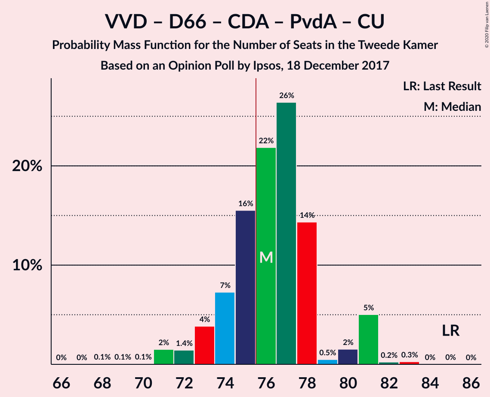

| Number of Seats | Probability | Accumulated | Special Marks |
|:---------------:|:-----------:|:-----------:|:-------------:|
| 70 | 0.1% | 100% |  |
| 71 | 0.1% | 99.9% |  |
| 72 | 0.2% | 99.9% |  |
| 73 | 6% | 99.7% |  |
| 74 | 2% | 94% |  |
| 75 | 86% | 92% | Median |
| 76 | 1.4% | 6% | Majority |
| 77 | 0.3% | 4% |  |
| 78 | 2% | 4% |  |
| 79 | 1.0% | 2% |  |
| 80 | 0.5% | 1.4% |  |
| 81 | 0.7% | 0.9% |  |
| 82 | 0.1% | 0.1% |  |
| 83 | 0% | 0.1% |  |
| 84 | 0.1% | 0.1% |  |
| 85 | 0% | 0% | Last Result |

### Volkspartij voor Vrijheid en Democratie – Partij voor de Vrijheid – Christen-Democratisch Appèl – Forum voor Democratie

| Number of Seats | Probability | Accumulated | Special Marks |
|:---------------:|:-----------:|:-----------:|:-------------:|
| 68 | 24% | 100% |  |
| 69 | 4% | 76% |  |
| 70 | 4% | 72% |  |
| 71 | 0.2% | 68% |  |
| 72 | 2% | 67% |  |
| 73 | 0.7% | 65% |  |
| 74 | 7% | 64% | Last Result |
| 75 | 0.1% | 58% |  |
| 76 | 2% | 57% | Majority |
| 77 | 55% | 56% | Median |
| 78 | 0.1% | 0.4% |  |
| 79 | 0.2% | 0.3% |  |
| 80 | 0.1% | 0.1% |  |
| 81 | 0% | 0.1% |  |
| 82 | 0% | 0% |  |

### Democraten 66 – Christen-Democratisch Appèl – GroenLinks – Socialistische Partij – Partij van de Arbeid – ChristenUnie

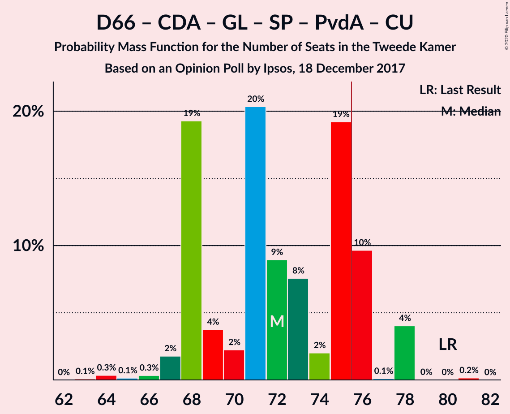

| Number of Seats | Probability | Accumulated | Special Marks |
|:---------------:|:-----------:|:-----------:|:-------------:|
| 65 | 0% | 100% |  |
| 66 | 0% | 99.9% |  |
| 67 | 0.2% | 99.9% |  |
| 68 | 55% | 99.8% | Median |
| 69 | 4% | 45% |  |
| 70 | 0.7% | 41% |  |
| 71 | 2% | 40% |  |
| 72 | 11% | 39% |  |
| 73 | 27% | 28% |  |
| 74 | 0.1% | 1.4% |  |
| 75 | 1.0% | 1.2% |  |
| 76 | 0.2% | 0.3% | Majority |
| 77 | 0.1% | 0.1% |  |
| 78 | 0% | 0% |  |
| 79 | 0% | 0% |  |
| 80 | 0% | 0% | Last Result |

### Volkspartij voor Vrijheid en Democratie – Christen-Democratisch Appèl – Forum voor Democratie – 50Plus – Staatkundig Gereformeerde Partij

| Number of Seats | Probability | Accumulated | Special Marks |
|:---------------:|:-----------:|:-----------:|:-------------:|
| 59 | 24% | 100% |  |
| 60 | 0.1% | 76% |  |
| 61 | 6% | 76% | Last Result |
| 62 | 5% | 69% |  |
| 63 | 6% | 64% |  |
| 64 | 2% | 59% |  |
| 65 | 0.2% | 57% |  |
| 66 | 1.3% | 57% |  |
| 67 | 0.2% | 55% |  |
| 68 | 0.2% | 55% |  |
| 69 | 54% | 55% | Median |
| 70 | 0.3% | 0.4% |  |
| 71 | 0% | 0.1% |  |
| 72 | 0% | 0% |  |

### Volkspartij voor Vrijheid en Democratie – Democraten 66 – Christen-Democratisch Appèl – ChristenUnie

| Number of Seats | Probability | Accumulated | Special Marks |
|:---------------:|:-----------:|:-----------:|:-------------:|
| 61 | 0.1% | 100% |  |
| 62 | 4% | 99.9% |  |
| 63 | 6% | 96% |  |
| 64 | 25% | 90% |  |
| 65 | 0.3% | 66% |  |
| 66 | 5% | 65% |  |
| 67 | 2% | 60% |  |
| 68 | 55% | 58% | Median |
| 69 | 0.7% | 2% |  |
| 70 | 1.0% | 2% |  |
| 71 | 0.5% | 0.6% |  |
| 72 | 0% | 0.1% |  |
| 73 | 0% | 0.1% |  |
| 74 | 0.1% | 0.1% |  |
| 75 | 0% | 0% |  |
| 76 | 0% | 0% | Last Result, Majority |

### Volkspartij voor Vrijheid en Democratie – Christen-Democratisch Appèl – Forum voor Democratie – 50Plus

| Number of Seats | Probability | Accumulated | Special Marks |
|:---------------:|:-----------:|:-----------:|:-------------:|
| 55 | 0.1% | 100% |  |
| 56 | 24% | 99.9% |  |
| 57 | 0.1% | 75% |  |
| 58 | 4% | 75% | Last Result |
| 59 | 6% | 71% |  |
| 60 | 7% | 65% |  |
| 61 | 0.6% | 57% |  |
| 62 | 0.7% | 57% |  |
| 63 | 0.3% | 56% |  |
| 64 | 0.8% | 56% |  |
| 65 | 54% | 55% | Median |
| 66 | 0.1% | 0.4% |  |
| 67 | 0.3% | 0.4% |  |
| 68 | 0% | 0% |  |

### Volkspartij voor Vrijheid en Democratie – Partij voor de Vrijheid – Christen-Democratisch Appèl

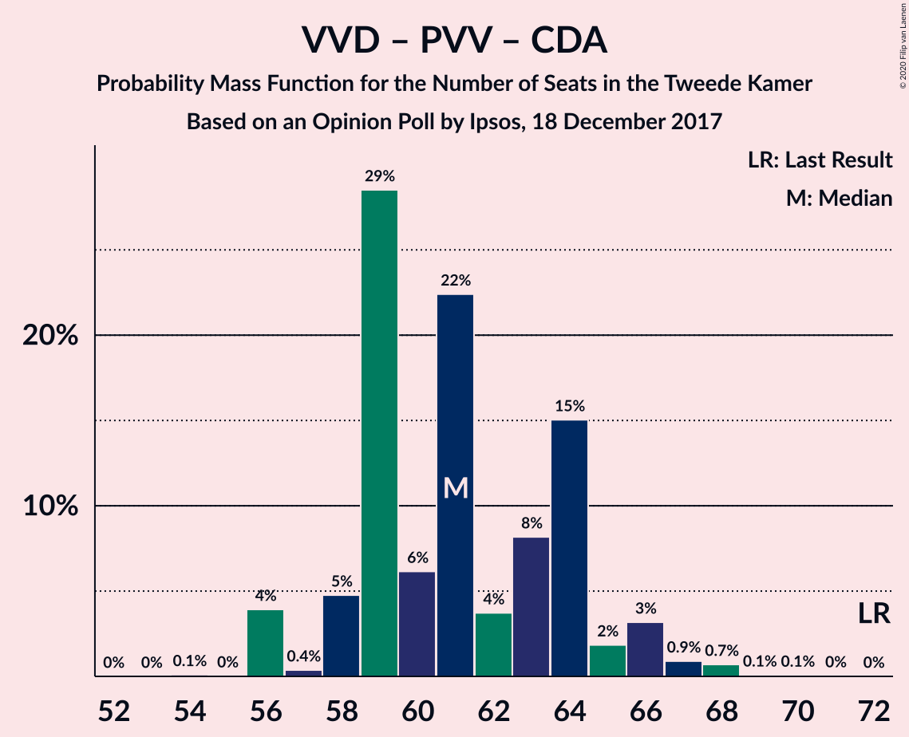

| Number of Seats | Probability | Accumulated | Special Marks |
|:---------------:|:-----------:|:-----------:|:-------------:|
| 56 | 24% | 100% |  |
| 57 | 0% | 76% |  |
| 58 | 4% | 75% |  |
| 59 | 4% | 71% |  |
| 60 | 6% | 67% |  |
| 61 | 1.3% | 61% |  |
| 62 | 2% | 60% |  |
| 63 | 1.1% | 58% |  |
| 64 | 55% | 57% | Median |
| 65 | 0.6% | 2% |  |
| 66 | 0.4% | 2% |  |
| 67 | 0.1% | 1.3% |  |
| 68 | 1.0% | 1.2% |  |
| 69 | 0% | 0.2% |  |
| 70 | 0.1% | 0.2% |  |
| 71 | 0% | 0% |  |
| 72 | 0% | 0% | Last Result |

### Volkspartij voor Vrijheid en Democratie – Democraten 66 – Christen-Democratisch Appèl

| Number of Seats | Probability | Accumulated | Special Marks |
|:---------------:|:-----------:|:-----------:|:-------------:|
| 54 | 0% | 100% |  |
| 55 | 0.1% | 99.9% |  |
| 56 | 4% | 99.8% |  |
| 57 | 30% | 96% |  |
| 58 | 0.4% | 66% |  |
| 59 | 4% | 65% |  |
| 60 | 2% | 61% |  |
| 61 | 2% | 60% |  |
| 62 | 1.3% | 58% |  |
| 63 | 54% | 57% | Median |
| 64 | 0.8% | 2% |  |
| 65 | 0.7% | 1.2% |  |
| 66 | 0.1% | 0.6% |  |
| 67 | 0.4% | 0.5% |  |
| 68 | 0% | 0.1% |  |
| 69 | 0% | 0% |  |
| 70 | 0% | 0% |  |
| 71 | 0% | 0% | Last Result |

### Volkspartij voor Vrijheid en Democratie – Christen-Democratisch Appèl – Forum voor Democratie – Staatkundig Gereformeerde Partij

| Number of Seats | Probability | Accumulated | Special Marks |
|:---------------:|:-----------:|:-----------:|:-------------:|
| 54 | 24% | 100% |  |
| 55 | 0.3% | 76% |  |
| 56 | 8% | 75% |  |
| 57 | 1.0% | 67% | Last Result |
| 58 | 6% | 66% |  |
| 59 | 4% | 60% |  |
| 60 | 0.3% | 57% |  |
| 61 | 0.4% | 57% |  |
| 62 | 0.6% | 56% |  |
| 63 | 55% | 56% | Median |
| 64 | 0% | 0.5% |  |
| 65 | 0.3% | 0.4% |  |
| 66 | 0.1% | 0.1% |  |
| 67 | 0% | 0% |  |

### Democraten 66 – Christen-Democratisch Appèl – GroenLinks – Partij van de Arbeid – ChristenUnie

| Number of Seats | Probability | Accumulated | Special Marks |
|:---------------:|:-----------:|:-----------:|:-------------:|
| 53 | 0.1% | 100% |  |
| 54 | 0% | 99.8% |  |
| 55 | 0.2% | 99.8% |  |
| 56 | 0.2% | 99.6% |  |
| 57 | 4% | 99.5% |  |
| 58 | 62% | 95% | Median |
| 59 | 5% | 33% |  |
| 60 | 0.9% | 28% |  |
| 61 | 24% | 27% |  |
| 62 | 1.0% | 3% |  |
| 63 | 2% | 2% |  |
| 64 | 0.1% | 0.1% |  |
| 65 | 0% | 0% |  |
| 66 | 0% | 0% | Last Result |

### Volkspartij voor Vrijheid en Democratie – Christen-Democratisch Appèl – Forum voor Democratie

| Number of Seats | Probability | Accumulated | Special Marks |
|:---------------:|:-----------:|:-----------:|:-------------:|
| 51 | 24% | 100% |  |
| 52 | 4% | 76% |  |
| 53 | 4% | 71% |  |
| 54 | 0.1% | 67% | Last Result |
| 55 | 2% | 67% |  |
| 56 | 8% | 65% |  |
| 57 | 1.4% | 57% |  |
| 58 | 0.3% | 56% |  |
| 59 | 54% | 56% | Median |
| 60 | 0% | 1.2% |  |
| 61 | 0.8% | 1.2% |  |
| 62 | 0.4% | 0.4% |  |
| 63 | 0% | 0% |  |

### Volkspartij voor Vrijheid en Democratie – Democraten 66 – Partij van de Arbeid

| Number of Seats | Probability | Accumulated | Special Marks |
|:---------------:|:-----------:|:-----------:|:-------------:|
| 50 | 0% | 100% |  |
| 51 | 0% | 99.9% |  |
| 52 | 0.2% | 99.9% |  |
| 53 | 0.5% | 99.7% |  |
| 54 | 7% | 99.3% |  |
| 55 | 57% | 92% | Median |
| 56 | 5% | 35% |  |
| 57 | 28% | 31% |  |
| 58 | 1.1% | 3% |  |
| 59 | 0.4% | 2% |  |
| 60 | 0.3% | 1.2% |  |
| 61 | 0.7% | 0.9% | Last Result |
| 62 | 0% | 0.2% |  |
| 63 | 0% | 0.2% |  |
| 64 | 0.1% | 0.2% |  |
| 65 | 0% | 0% |  |

### Volkspartij voor Vrijheid en Democratie – Christen-Democratisch Appèl – Partij van de Arbeid

| Number of Seats | Probability | Accumulated | Special Marks |
|:---------------:|:-----------:|:-----------:|:-------------:|
| 49 | 0.1% | 100% |  |
| 50 | 25% | 99.9% |  |
| 51 | 4% | 75% |  |
| 52 | 7% | 71% |  |
| 53 | 55% | 64% | Median |
| 54 | 4% | 8% |  |
| 55 | 0.2% | 4% |  |
| 56 | 0.8% | 4% |  |
| 57 | 1.0% | 3% |  |
| 58 | 1.0% | 2% |  |
| 59 | 0.1% | 1.1% |  |
| 60 | 1.0% | 1.1% |  |
| 61 | 0% | 0.1% | Last Result |
| 62 | 0% | 0% |  |

### Volkspartij voor Vrijheid en Democratie – Christen-Democratisch Appèl

| Number of Seats | Probability | Accumulated | Special Marks |
|:---------------:|:-----------:|:-----------:|:-------------:|
| 39 | 24% | 100% |  |
| 40 | 0.1% | 76% |  |
| 41 | 4% | 76% |  |
| 42 | 10% | 71% |  |
| 43 | 1.2% | 62% |  |
| 44 | 0.8% | 60% |  |
| 45 | 2% | 60% |  |
| 46 | 55% | 58% | Median |
| 47 | 1.1% | 2% |  |
| 48 | 0% | 1.2% |  |
| 49 | 0.7% | 1.2% |  |
| 50 | 0% | 0.4% |  |
| 51 | 0.4% | 0.4% |  |
| 52 | 0% | 0% | Last Result |

### Democraten 66 – Christen-Democratisch Appèl – Partij van de Arbeid

| Number of Seats | Probability | Accumulated | Special Marks |
|:---------------:|:-----------:|:-----------:|:-------------:|
| 34 | 0.1% | 100% |  |
| 35 | 0.2% | 99.9% |  |
| 36 | 0% | 99.7% |  |
| 37 | 4% | 99.7% |  |
| 38 | 6% | 96% |  |
| 39 | 56% | 90% | Median |
| 40 | 26% | 34% |  |
| 41 | 5% | 8% |  |
| 42 | 0.5% | 3% |  |
| 43 | 2% | 2% |  |
| 44 | 0.5% | 0.8% |  |
| 45 | 0.1% | 0.2% |  |
| 46 | 0% | 0.1% |  |
| 47 | 0% | 0% | Last Result |

### Volkspartij voor Vrijheid en Democratie – Partij van de Arbeid

| Number of Seats | Probability | Accumulated | Special Marks |
|:---------------:|:-----------:|:-----------:|:-------------:|
| 35 | 0.2% | 100% |  |
| 36 | 0.3% | 99.7% |  |
| 37 | 1.4% | 99.4% |  |
| 38 | 56% | 98% | Median |
| 39 | 30% | 42% |  |
| 40 | 4% | 12% |  |
| 41 | 7% | 8% |  |
| 42 | 0.3% | 2% | Last Result |
| 43 | 0.5% | 1.3% |  |
| 44 | 0% | 0.8% |  |
| 45 | 0% | 0.7% |  |
| 46 | 0.7% | 0.7% |  |
| 47 | 0% | 0% |  |

### Democraten 66 – Christen-Democratisch Appèl

| Number of Seats | Probability | Accumulated | Special Marks |
|:---------------:|:-----------:|:-----------:|:-------------:|
| 26 | 0.2% | 100% |  |
| 27 | 0.2% | 99.8% |  |
| 28 | 14% | 99.6% |  |
| 29 | 25% | 86% |  |
| 30 | 1.1% | 61% |  |
| 31 | 1.0% | 60% |  |
| 32 | 57% | 59% | Median |
| 33 | 1.2% | 2% |  |
| 34 | 0.6% | 0.8% |  |
| 35 | 0% | 0.2% |  |
| 36 | 0% | 0.1% |  |
| 37 | 0.1% | 0.1% |  |
| 38 | 0% | 0% | Last Result |

### Christen-Democratisch Appèl – Partij van de Arbeid – ChristenUnie

| Number of Seats | Probability | Accumulated | Special Marks |
|:---------------:|:-----------:|:-----------:|:-------------:|
| 25 | 0.8% | 100% |  |
| 26 | 0.1% | 99.2% |  |
| 27 | 60% | 99.1% | Median |
| 28 | 0.2% | 40% |  |
| 29 | 30% | 39% |  |
| 30 | 1.1% | 9% |  |
| 31 | 0.9% | 8% |  |
| 32 | 5% | 7% |  |
| 33 | 1.1% | 2% | Last Result |
| 34 | 0% | 1.0% |  |
| 35 | 0% | 1.0% |  |
| 36 | 0.9% | 1.0% |  |
| 37 | 0% | 0% |  |

### Christen-Democratisch Appèl – Partij van de Arbeid

| Number of Seats | Probability | Accumulated | Special Marks |
|:---------------:|:-----------:|:-----------:|:-------------:|
| 18 | 0.1% | 100% |  |
| 19 | 0.1% | 99.9% |  |
| 20 | 4% | 99.8% |  |
| 21 | 0.7% | 96% |  |
| 22 | 80% | 95% | Median |
| 23 | 6% | 15% |  |
| 24 | 0.3% | 9% |  |
| 25 | 2% | 9% |  |
| 26 | 6% | 7% |  |
| 27 | 0.6% | 2% |  |
| 28 | 0% | 1.0% | Last Result |
| 29 | 0.9% | 1.0% |  |
| 30 | 0.1% | 0.1% |  |
| 31 | 0% | 0% |  |

## Technical Information

### Opinion Poll

+ **Polling firm:** Ipsos
+ **Commissioner(s):** —
+ **Fieldwork period:** 18 December 2017

### Calculations

+ **Sample size:** 1000
+ **Simulations done:** 131,072
+ **Error estimate:** 2.79%

