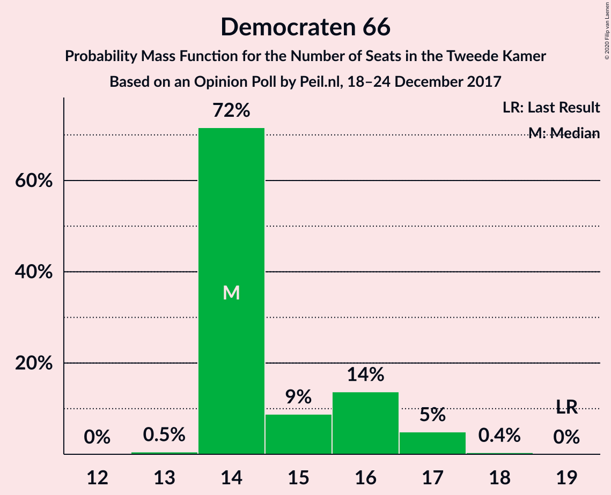
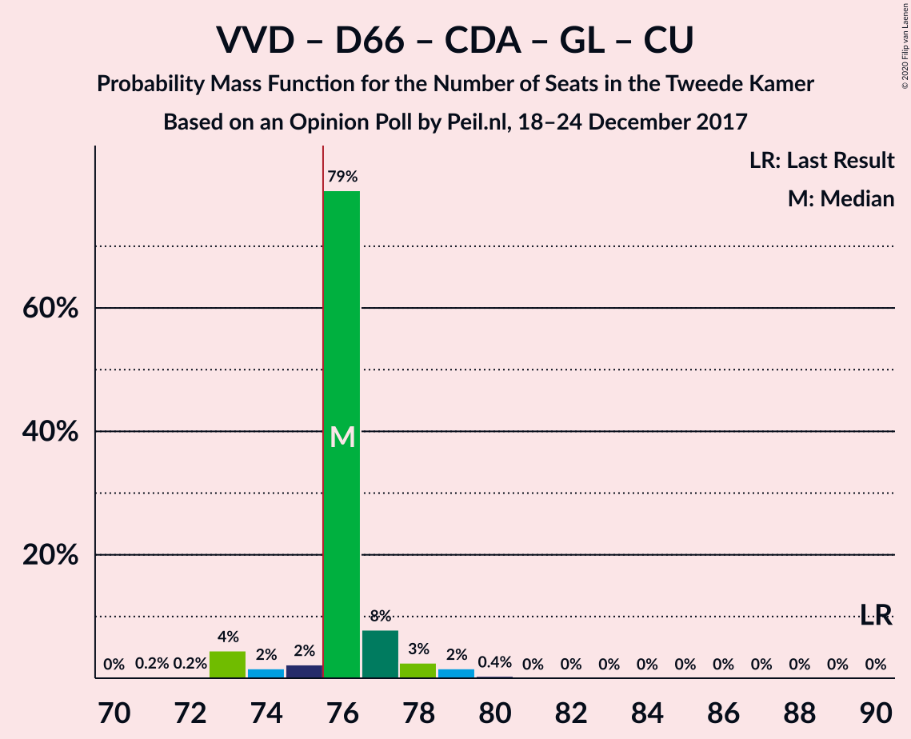
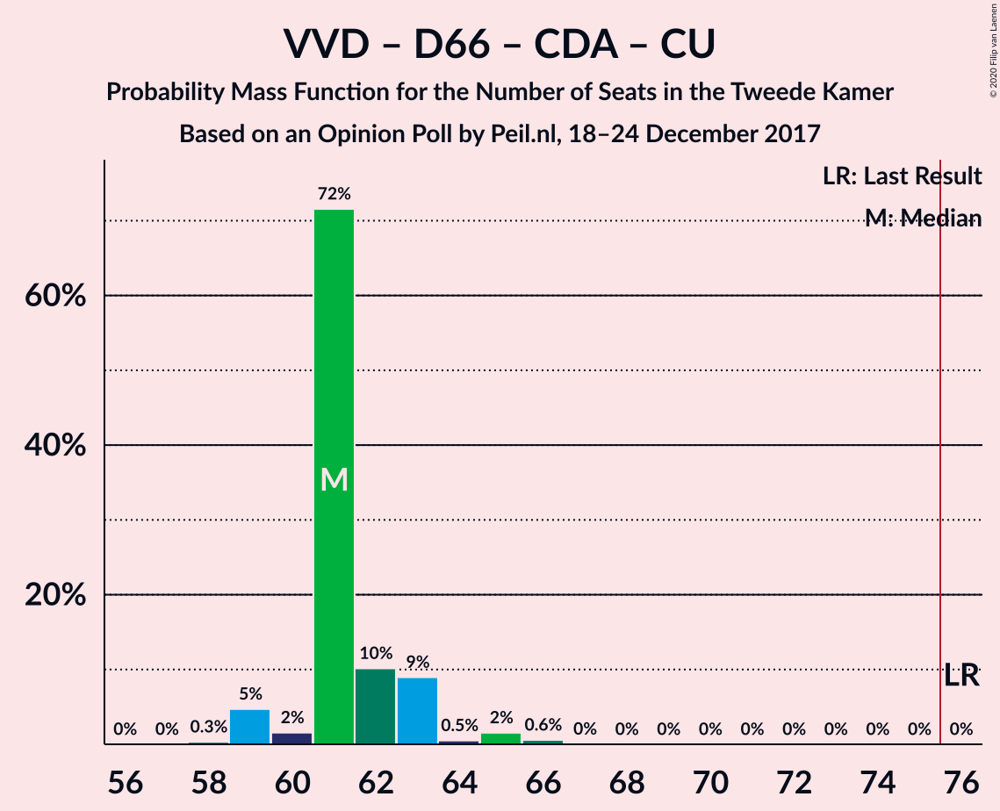
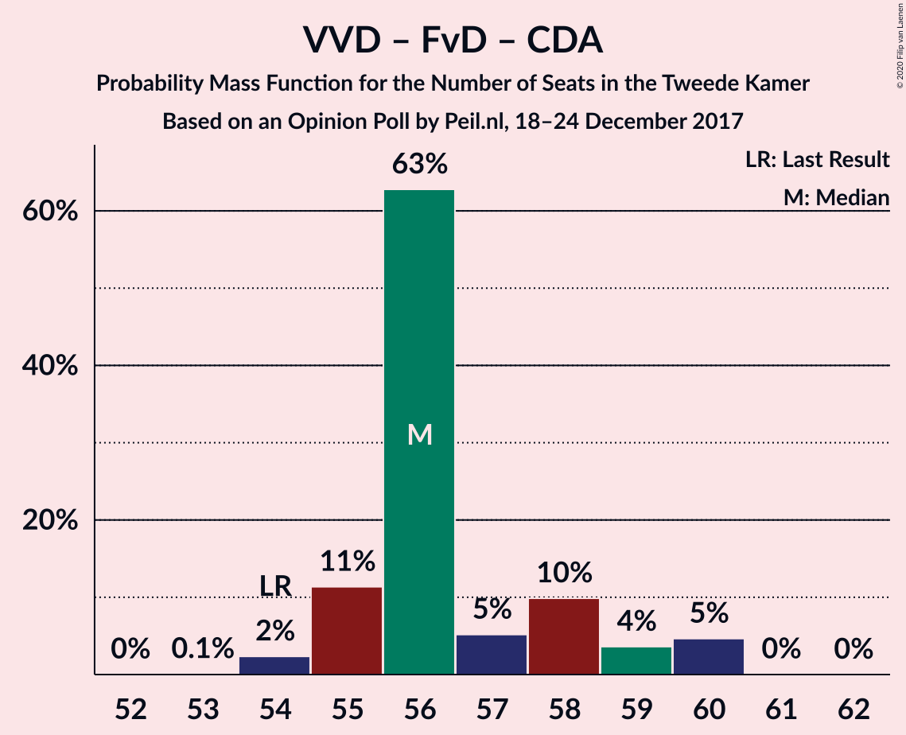

# Opinion Poll by Peil.nl, 18–24 December 2017

<a href="#voting-intentions">Voting Intentions</a> | <a href="#seats">Seats</a> | <a href="#coalitions">Coalitions</a> | <a href="#technical-information">Technical Information</a>

## Voting Intentions

### Confidence Intervals

| Party | Last Result | Poll Result | 80% Confidence Interval | 90% Confidence Interval | 95% Confidence Interval | 99% Confidence Interval |
|:-----:|:-----------:|:-----------:|:-----------------------:|:-----------------------:|:-----------------------:|:-----------------------:|
| Volkspartij voor Vrijheid en Democratie | 21.3% | 18.0% | 17.1–18.9% |16.9–19.2% |16.7–19.4% |16.2–19.9% |
| Democraten 66 | 12.2% | 10.0% | 9.3–10.7% |9.1–10.9% |9.0–11.1% |8.7–11.5% |
| Forum voor Democratie | 1.8% | 10.0% | 9.3–10.7% |9.1–10.9% |9.0–11.1% |8.7–11.5% |
| Partij voor de Vrijheid | 13.1% | 9.3% | 8.7–10.1% |8.5–10.3% |8.3–10.4% |8.0–10.8% |
| Christen-Democratisch Appèl | 12.4% | 9.3% | 8.7–10.1% |8.5–10.3% |8.3–10.4% |8.0–10.8% |
| GroenLinks | 9.1% | 9.3% | 8.7–10.1% |8.5–10.3% |8.3–10.4% |8.0–10.8% |
| Socialistische Partij | 9.1% | 9.3% | 8.7–10.1% |8.5–10.3% |8.3–10.4% |8.0–10.8% |
| Partij van de Arbeid | 5.7% | 9.3% | 8.7–10.1% |8.5–10.3% |8.3–10.4% |8.0–10.8% |
| Partij voor de Dieren | 3.2% | 4.7% | 4.2–5.2% |4.1–5.3% |4.0–5.5% |3.7–5.8% |
| ChristenUnie | 3.4% | 3.3% | 2.9–3.8% |2.8–3.9% |2.7–4.0% |2.6–4.3% |
| 50Plus | 3.1% | 3.3% | 2.9–3.8% |2.8–3.9% |2.7–4.0% |2.6–4.3% |
| Staatkundig Gereformeerde Partij | 2.1% | 2.0% | 1.7–2.4% |1.6–2.5% |1.6–2.6% |1.4–2.8% |
| DENK | 2.1% | 2.0% | 1.7–2.4% |1.6–2.5% |1.6–2.6% |1.4–2.8% |

*Note:* The poll result column reflects the actual value used in the calculations. Published results may vary slightly, and in addition be rounded to fewer digits.

## Seats

### Confidence Intervals

| Party | Last Result | Median | 80% Confidence Interval | 90% Confidence Interval | 95% Confidence Interval | 99% Confidence Interval |
|:-----:|:-----------:|:------:|:-----------------------:|:-----------------------:|:-----------------------:|:-----------------------:|
| <a href="#volkspartij-voor-vrijheid-en-democratie">Volkspartij voor Vrijheid en Democratie</a> | 33 | 29 | 26–30 |26–30 |26–30 |26–30 |
| <a href="#democraten-66">Democraten 66</a> | 19 | 14 | 14–16 |14–16 |14–17 |14–17 |
| <a href="#forum-voor-democratie">Forum voor Democratie</a> | 2 | 16 | 15–17 |15–17 |15–17 |14–17 |
| <a href="#partij-voor-de-vrijheid">Partij voor de Vrijheid</a> | 20 | 13 | 13–14 |13–14 |13–15 |13–16 |
| <a href="#christen-democratisch-appèl">Christen-Democratisch Appèl</a> | 19 | 13 | 12–13 |12–14 |12–14 |12–15 |
| <a href="#groenlinks">GroenLinks</a> | 14 | 14 | 13–14 |13–14 |13–15 |13–17 |
| <a href="#socialistische-partij">Socialistische Partij</a> | 14 | 14 | 14–16 |14–16 |14–16 |13–16 |
| <a href="#partij-van-de-arbeid">Partij van de Arbeid</a> | 9 | 14 | 13–15 |13–15 |12–15 |12–15 |
| <a href="#partij-voor-de-dieren">Partij voor de Dieren</a> | 5 | 6 | 6–7 |6–7 |6–8 |6–8 |
| <a href="#christenunie">ChristenUnie</a> | 5 | 6 | 5–6 |4–6 |4–6 |3–6 |
| <a href="#50plus">50Plus</a> | 4 | 5 | 4–6 |4–6 |4–6 |4–6 |
| <a href="#staatkundig-gereformeerde-partij">Staatkundig Gereformeerde Partij</a> | 3 | 3 | 2–3 |2–3 |2–3 |2–3 |
| <a href="#denk">DENK</a> | 3 | 3 | 2–3 |2–3 |2–3 |2–4 |

### Volkspartij voor Vrijheid en Democratie

*For a full overview of the results for this party, see the [Volkspartij voor Vrijheid en Democratie](party-volkspartijvoorvrijheidendemocratie.html) page.*

| Number of Seats | Probability | Accumulated | Special Marks |
|:---------------:|:-----------:|:-----------:|:-------------:|
| 25 | 0% | 100% |  |
| 26 | 21% | 99.9% |  |
| 27 | 4% | 79% |  |
| 28 | 4% | 75% |  |
| 29 | 59% | 70% | Median |
| 30 | 11% | 11% |  |
| 31 | 0.4% | 0.4% |  |
| 32 | 0% | 0% |  |
| 33 | 0% | 0% | Last Result |

### Democraten 66

*For a full overview of the results for this party, see the [Democraten 66](party-democraten66.html) page.*

| Number of Seats | Probability | Accumulated | Special Marks |
|:---------------:|:-----------:|:-----------:|:-------------:|
| 13 | 0.3% | 100% |  |
| 14 | 63% | 99.7% | Median |
| 15 | 21% | 36% |  |
| 16 | 11% | 16% |  |
| 17 | 4% | 4% |  |
| 18 | 0% | 0% |  |
| 19 | 0% | 0% | Last Result |

### Forum voor Democratie

*For a full overview of the results for this party, see the [Forum voor Democratie](party-forumvoordemocratie.html) page.*

| Number of Seats | Probability | Accumulated | Special Marks |
|:---------------:|:-----------:|:-----------:|:-------------:|
| 2 | 0% | 100% | Last Result |
| 3 | 0% | 100% |  |
| 4 | 0% | 100% |  |
| 5 | 0% | 100% |  |
| 6 | 0% | 100% |  |
| 7 | 0% | 100% |  |
| 8 | 0% | 100% |  |
| 9 | 0% | 100% |  |
| 10 | 0% | 100% |  |
| 11 | 0% | 100% |  |
| 12 | 0% | 100% |  |
| 13 | 0.3% | 100% |  |
| 14 | 0.6% | 99.7% |  |
| 15 | 14% | 99.1% |  |
| 16 | 65% | 85% | Median |
| 17 | 20% | 20% |  |
| 18 | 0% | 0% |  |

### Partij voor de Vrijheid

*For a full overview of the results for this party, see the [Partij voor de Vrijheid](party-partijvoordevrijheid.html) page.*

| Number of Seats | Probability | Accumulated | Special Marks |
|:---------------:|:-----------:|:-----------:|:-------------:|
| 12 | 0.1% | 100% |  |
| 13 | 83% | 99.9% | Median |
| 14 | 13% | 17% |  |
| 15 | 1.4% | 3% |  |
| 16 | 2% | 2% |  |
| 17 | 0.1% | 0.1% |  |
| 18 | 0% | 0% |  |
| 19 | 0% | 0% |  |
| 20 | 0% | 0% | Last Result |

### Christen-Democratisch Appèl

*For a full overview of the results for this party, see the [Christen-Democratisch Appèl](party-christen-democratischappèl.html) page.*

| Number of Seats | Probability | Accumulated | Special Marks |
|:---------------:|:-----------:|:-----------:|:-------------:|
| 12 | 11% | 100% |  |
| 13 | 83% | 89% | Median |
| 14 | 5% | 6% |  |
| 15 | 0.6% | 0.9% |  |
| 16 | 0.3% | 0.3% |  |
| 17 | 0% | 0% |  |
| 18 | 0% | 0% |  |
| 19 | 0% | 0% | Last Result |

### GroenLinks

*For a full overview of the results for this party, see the [GroenLinks](party-groenlinks.html) page.*

| Number of Seats | Probability | Accumulated | Special Marks |
|:---------------:|:-----------:|:-----------:|:-------------:|
| 12 | 0.3% | 100% |  |
| 13 | 13% | 99.7% |  |
| 14 | 84% | 87% | Last Result, Median |
| 15 | 0.4% | 3% |  |
| 16 | 0% | 2% |  |
| 17 | 2% | 2% |  |
| 18 | 0.5% | 0.5% |  |
| 19 | 0% | 0% |  |

### Socialistische Partij

*For a full overview of the results for this party, see the [Socialistische Partij](party-socialistischepartij.html) page.*

| Number of Seats | Probability | Accumulated | Special Marks |
|:---------------:|:-----------:|:-----------:|:-------------:|
| 13 | 0.5% | 100% |  |
| 14 | 86% | 99.4% | Last Result, Median |
| 15 | 1.1% | 14% |  |
| 16 | 13% | 13% |  |
| 17 | 0% | 0% |  |

### Partij van de Arbeid

*For a full overview of the results for this party, see the [Partij van de Arbeid](party-partijvandearbeid.html) page.*

| Number of Seats | Probability | Accumulated | Special Marks |
|:---------------:|:-----------:|:-----------:|:-------------:|
| 9 | 0% | 100% | Last Result |
| 10 | 0% | 100% |  |
| 11 | 0% | 100% |  |
| 12 | 3% | 100% |  |
| 13 | 14% | 97% |  |
| 14 | 59% | 83% | Median |
| 15 | 25% | 25% |  |
| 16 | 0% | 0% |  |

### Partij voor de Dieren

*For a full overview of the results for this party, see the [Partij voor de Dieren](party-partijvoordedieren.html) page.*

| Number of Seats | Probability | Accumulated | Special Marks |
|:---------------:|:-----------:|:-----------:|:-------------:|
| 5 | 0.1% | 100% | Last Result |
| 6 | 62% | 99.9% | Median |
| 7 | 34% | 38% |  |
| 8 | 5% | 5% |  |
| 9 | 0.1% | 0.1% |  |
| 10 | 0% | 0% |  |

### ChristenUnie

*For a full overview of the results for this party, see the [ChristenUnie](party-christenunie.html) page.*

| Number of Seats | Probability | Accumulated | Special Marks |
|:---------------:|:-----------:|:-----------:|:-------------:|
| 3 | 2% | 100% |  |
| 4 | 4% | 98% |  |
| 5 | 34% | 94% | Last Result |
| 6 | 59% | 59% | Median |
| 7 | 0% | 0% |  |

### 50Plus

*For a full overview of the results for this party, see the [50Plus](party-50plus.html) page.*

| Number of Seats | Probability | Accumulated | Special Marks |
|:---------------:|:-----------:|:-----------:|:-------------:|
| 4 | 18% | 100% | Last Result |
| 5 | 59% | 82% | Median |
| 6 | 22% | 22% |  |
| 7 | 0% | 0% |  |

### Staatkundig Gereformeerde Partij

*For a full overview of the results for this party, see the [Staatkundig Gereformeerde Partij](party-staatkundiggereformeerdepartij.html) page.*

| Number of Seats | Probability | Accumulated | Special Marks |
|:---------------:|:-----------:|:-----------:|:-------------:|
| 2 | 25% | 100% |  |
| 3 | 75% | 75% | Last Result, Median |
| 4 | 0.1% | 0.1% |  |
| 5 | 0% | 0% |  |

### DENK

*For a full overview of the results for this party, see the [DENK](party-denk.html) page.*

| Number of Seats | Probability | Accumulated | Special Marks |
|:---------------:|:-----------:|:-----------:|:-------------:|
| 1 | 0.2% | 100% |  |
| 2 | 13% | 99.8% |  |
| 3 | 86% | 87% | Last Result, Median |
| 4 | 0.5% | 0.5% |  |
| 5 | 0% | 0% |  |

## Coalitions

### Confidence Intervals

| Coalition | Last Result | Median | Majority? | 80% Confidence Interval | 90% Confidence Interval | 95% Confidence Interval | 99% Confidence Interval |
|:---------:|:-----------:|:------:|:---------:|:-----------------------:|:-----------------------:|:-----------------------:|:-----------------------:|
| Democraten 66 – Christen-Democratisch Appèl – GroenLinks – Partij van de Arbeid – Socialistische Partij – ChristenUnie | 80 | 75 | 24% | 75–76 | 75–76 | 75–78 | 72–78 |
| Volkspartij voor Vrijheid en Democratie – Democraten 66 – Christen-Democratisch Appèl – GroenLinks – ChristenUnie | 90 | 76 | 73% | 73–76 | 73–76 | 73–78 | 73–79 |
| Volkspartij voor Vrijheid en Democratie – Democraten 66 – Christen-Democratisch Appèl – Partij van de Arbeid – ChristenUnie | 85 | 76 | 71% | 74–76 | 74–76 | 74–76 | 72–77 |
| Volkspartij voor Vrijheid en Democratie – Forum voor Democratie – Christen-Democratisch Appèl – Partij voor de Vrijheid – Staatkundig Gereformeerde Partij | 77 | 74 | 0.5% | 71–74 | 71–74 | 71–74 | 71–75 |
| Volkspartij voor Vrijheid en Democratie – Forum voor Democratie – Christen-Democratisch Appèl – Partij voor de Vrijheid | 74 | 71 | 0% | 69–71 | 69–71 | 69–71 | 68–73 |
| Volkspartij voor Vrijheid en Democratie – Forum voor Democratie – Christen-Democratisch Appèl – 50Plus – Staatkundig Gereformeerde Partij | 61 | 66 | 0% | 64–66 | 64–66 | 63–66 | 61–66 |
| Democraten 66 – Christen-Democratisch Appèl – GroenLinks – Partij van de Arbeid – ChristenUnie | 66 | 61 | 0% | 59–62 | 59–62 | 59–64 | 58–64 |
| Volkspartij voor Vrijheid en Democratie – Forum voor Democratie – Christen-Democratisch Appèl – 50Plus | 58 | 63 | 0% | 61–63 | 61–63 | 60–63 | 59–63 |
| Volkspartij voor Vrijheid en Democratie – Democraten 66 – Christen-Democratisch Appèl – ChristenUnie | 76 | 62 | 0% | 59–63 | 59–63 | 59–63 | 58–64 |
| Volkspartij voor Vrijheid en Democratie – Forum voor Democratie – Christen-Democratisch Appèl – Staatkundig Gereformeerde Partij | 57 | 61 | 0% | 58–61 | 58–61 | 58–61 | 57–61 |
| Volkspartij voor Vrijheid en Democratie – Democraten 66 – Partij van de Arbeid | 61 | 57 | 0% | 56–59 | 56–59 | 56–59 | 54–59 |
| Volkspartij voor Vrijheid en Democratie – Forum voor Democratie – Christen-Democratisch Appèl | 54 | 58 | 0% | 56–58 | 56–58 | 56–58 | 54–58 |
| Volkspartij voor Vrijheid en Democratie – Democraten 66 – Christen-Democratisch Appèl | 71 | 56 | 0% | 54–58 | 54–58 | 54–58 | 54–59 |
| Volkspartij voor Vrijheid en Democratie – Christen-Democratisch Appèl – Partij van de Arbeid | 61 | 56 | 0% | 54–56 | 54–56 | 53–57 | 52–57 |
| Volkspartij voor Vrijheid en Democratie – Christen-Democratisch Appèl – Partij voor de Vrijheid | 72 | 55 | 0% | 52–56 | 52–56 | 52–56 | 52–59 |
| Democraten 66 – Christen-Democratisch Appèl – Partij van de Arbeid | 47 | 41 | 0% | 41–43 | 41–43 | 41–43 | 40–45 |
| Volkspartij voor Vrijheid en Democratie – Partij van de Arbeid | 42 | 43 | 0% | 41–43 | 41–43 | 40–43 | 39–43 |
| Volkspartij voor Vrijheid en Democratie – Christen-Democratisch Appèl | 52 | 42 | 0% | 39–42 | 39–42 | 39–42 | 39–44 |
| Christen-Democratisch Appèl – Partij van de Arbeid – ChristenUnie | 33 | 33 | 0% | 30–33 | 30–33 | 30–33 | 29–33 |
| Democraten 66 – Christen-Democratisch Appèl | 38 | 27 | 0% | 27–28 | 27–29 | 27–30 | 27–32 |
| Christen-Democratisch Appèl – Partij van de Arbeid | 28 | 27 | 0% | 25–28 | 25–28 | 25–29 | 25–29 |

### Democraten 66 – Christen-Democratisch Appèl – GroenLinks – Partij van de Arbeid – Socialistische Partij – ChristenUnie

| Number of Seats | Probability | Accumulated | Special Marks |
|:---------------:|:-----------:|:-----------:|:-------------:|
| 71 | 0.3% | 100% |  |
| 72 | 0.3% | 99.7% |  |
| 73 | 0.1% | 99.3% |  |
| 74 | 0% | 99.2% |  |
| 75 | 75% | 99.2% | Median |
| 76 | 20% | 24% | Majority |
| 77 | 0.2% | 3% |  |
| 78 | 3% | 3% |  |
| 79 | 0% | 0% |  |
| 80 | 0% | 0% | Last Result |

### Volkspartij voor Vrijheid en Democratie – Democraten 66 – Christen-Democratisch Appèl – GroenLinks – ChristenUnie

| Number of Seats | Probability | Accumulated | Special Marks |
|:---------------:|:-----------:|:-----------:|:-------------:|
| 72 | 0% | 100% |  |
| 73 | 22% | 99.9% |  |
| 74 | 4% | 78% |  |
| 75 | 0.3% | 74% |  |
| 76 | 70% | 73% | Median, Majority |
| 77 | 0.4% | 3% |  |
| 78 | 0.8% | 3% |  |
| 79 | 2% | 2% |  |
| 80 | 0% | 0% |  |
| 81 | 0% | 0% |  |
| 82 | 0% | 0% |  |
| 83 | 0% | 0% |  |
| 84 | 0% | 0% |  |
| 85 | 0% | 0% |  |
| 86 | 0% | 0% |  |
| 87 | 0% | 0% |  |
| 88 | 0% | 0% |  |
| 89 | 0% | 0% |  |
| 90 | 0% | 0% | Last Result |

### Volkspartij voor Vrijheid en Democratie – Democraten 66 – Christen-Democratisch Appèl – Partij van de Arbeid – ChristenUnie

| Number of Seats | Probability | Accumulated | Special Marks |
|:---------------:|:-----------:|:-----------:|:-------------:|
| 71 | 0.5% | 100% |  |
| 72 | 0.1% | 99.5% |  |
| 73 | 2% | 99.5% |  |
| 74 | 23% | 98% |  |
| 75 | 4% | 75% |  |
| 76 | 70% | 71% | Median, Majority |
| 77 | 0.6% | 0.7% |  |
| 78 | 0% | 0.1% |  |
| 79 | 0% | 0% |  |
| 80 | 0% | 0% |  |
| 81 | 0% | 0% |  |
| 82 | 0% | 0% |  |
| 83 | 0% | 0% |  |
| 84 | 0% | 0% |  |
| 85 | 0% | 0% | Last Result |

### Volkspartij voor Vrijheid en Democratie – Forum voor Democratie – Christen-Democratisch Appèl – Partij voor de Vrijheid – Staatkundig Gereformeerde Partij

| Number of Seats | Probability | Accumulated | Special Marks |
|:---------------:|:-----------:|:-----------:|:-------------:|
| 70 | 0% | 100% |  |
| 71 | 21% | 99.9% |  |
| 72 | 2% | 79% |  |
| 73 | 2% | 77% |  |
| 74 | 75% | 75% | Median |
| 75 | 0.3% | 0.8% |  |
| 76 | 0.4% | 0.5% | Majority |
| 77 | 0% | 0.1% | Last Result |
| 78 | 0.1% | 0.1% |  |
| 79 | 0% | 0% |  |

### Volkspartij voor Vrijheid en Democratie – Forum voor Democratie – Christen-Democratisch Appèl – Partij voor de Vrijheid

| Number of Seats | Probability | Accumulated | Special Marks |
|:---------------:|:-----------:|:-----------:|:-------------:|
| 68 | 0.5% | 100% |  |
| 69 | 20% | 99.5% |  |
| 70 | 2% | 79% |  |
| 71 | 76% | 77% | Median |
| 72 | 0.8% | 1.4% |  |
| 73 | 0.1% | 0.6% |  |
| 74 | 0.3% | 0.5% | Last Result |
| 75 | 0.1% | 0.1% |  |
| 76 | 0% | 0% | Majority |

### Volkspartij voor Vrijheid en Democratie – Forum voor Democratie – Christen-Democratisch Appèl – 50Plus – Staatkundig Gereformeerde Partij

| Number of Seats | Probability | Accumulated | Special Marks |
|:---------------:|:-----------:|:-----------:|:-------------:|
| 60 | 0.5% | 100% |  |
| 61 | 0% | 99.5% | Last Result |
| 62 | 2% | 99.5% |  |
| 63 | 2% | 98% |  |
| 64 | 32% | 95% |  |
| 65 | 4% | 63% |  |
| 66 | 59% | 59% | Median |
| 67 | 0.1% | 0.4% |  |
| 68 | 0.3% | 0.4% |  |
| 69 | 0% | 0% |  |

### Democraten 66 – Christen-Democratisch Appèl – GroenLinks – Partij van de Arbeid – ChristenUnie

| Number of Seats | Probability | Accumulated | Special Marks |
|:---------------:|:-----------:|:-----------:|:-------------:|
| 57 | 0.3% | 100% |  |
| 58 | 0.4% | 99.7% |  |
| 59 | 13% | 99.3% |  |
| 60 | 0.1% | 87% |  |
| 61 | 63% | 87% | Median |
| 62 | 20% | 24% |  |
| 63 | 0.9% | 3% |  |
| 64 | 3% | 3% |  |
| 65 | 0% | 0% |  |
| 66 | 0% | 0% | Last Result |

### Volkspartij voor Vrijheid en Democratie – Forum voor Democratie – Christen-Democratisch Appèl – 50Plus

| Number of Seats | Probability | Accumulated | Special Marks |
|:---------------:|:-----------:|:-----------:|:-------------:|
| 57 | 0.5% | 100% |  |
| 58 | 0% | 99.5% | Last Result |
| 59 | 0% | 99.5% |  |
| 60 | 2% | 99.5% |  |
| 61 | 14% | 97% |  |
| 62 | 25% | 84% |  |
| 63 | 59% | 59% | Median |
| 64 | 0% | 0.4% |  |
| 65 | 0% | 0.4% |  |
| 66 | 0.3% | 0.4% |  |
| 67 | 0% | 0% |  |

### Volkspartij voor Vrijheid en Democratie – Democraten 66 – Christen-Democratisch Appèl – ChristenUnie

| Number of Seats | Probability | Accumulated | Special Marks |
|:---------------:|:-----------:|:-----------:|:-------------:|
| 58 | 0.5% | 100% |  |
| 59 | 20% | 99.5% |  |
| 60 | 6% | 79% |  |
| 61 | 0.1% | 73% |  |
| 62 | 61% | 73% | Median |
| 63 | 11% | 12% |  |
| 64 | 1.0% | 1.0% |  |
| 65 | 0% | 0% |  |
| 66 | 0% | 0% |  |
| 67 | 0% | 0% |  |
| 68 | 0% | 0% |  |
| 69 | 0% | 0% |  |
| 70 | 0% | 0% |  |
| 71 | 0% | 0% |  |
| 72 | 0% | 0% |  |
| 73 | 0% | 0% |  |
| 74 | 0% | 0% |  |
| 75 | 0% | 0% |  |
| 76 | 0% | 0% | Last Result, Majority |

### Volkspartij voor Vrijheid en Democratie – Forum voor Democratie – Christen-Democratisch Appèl – Staatkundig Gereformeerde Partij

| Number of Seats | Probability | Accumulated | Special Marks |
|:---------------:|:-----------:|:-----------:|:-------------:|
| 56 | 0.5% | 100% |  |
| 57 | 2% | 99.5% | Last Result |
| 58 | 22% | 98% |  |
| 59 | 1.1% | 75% |  |
| 60 | 11% | 74% |  |
| 61 | 63% | 63% | Median |
| 62 | 0.4% | 0.4% |  |
| 63 | 0% | 0% |  |

### Volkspartij voor Vrijheid en Democratie – Democraten 66 – Partij van de Arbeid

| Number of Seats | Probability | Accumulated | Special Marks |
|:---------------:|:-----------:|:-----------:|:-------------:|
| 53 | 0.5% | 100% |  |
| 54 | 0.1% | 99.5% |  |
| 55 | 0.4% | 99.5% |  |
| 56 | 23% | 99.1% |  |
| 57 | 65% | 76% | Median |
| 58 | 0.1% | 11% |  |
| 59 | 11% | 11% |  |
| 60 | 0% | 0.1% |  |
| 61 | 0% | 0% | Last Result |

### Volkspartij voor Vrijheid en Democratie – Forum voor Democratie – Christen-Democratisch Appèl

| Number of Seats | Probability | Accumulated | Special Marks |
|:---------------:|:-----------:|:-----------:|:-------------:|
| 53 | 0.5% | 100% |  |
| 54 | 0% | 99.5% | Last Result |
| 55 | 2% | 99.5% |  |
| 56 | 23% | 98% |  |
| 57 | 11% | 75% |  |
| 58 | 63% | 63% | Median |
| 59 | 0.1% | 0.5% |  |
| 60 | 0.4% | 0.4% |  |
| 61 | 0% | 0% |  |

### Volkspartij voor Vrijheid en Democratie – Democraten 66 – Christen-Democratisch Appèl

| Number of Seats | Probability | Accumulated | Special Marks |
|:---------------:|:-----------:|:-----------:|:-------------:|
| 53 | 0.5% | 100% |  |
| 54 | 20% | 99.5% |  |
| 55 | 0.1% | 79% |  |
| 56 | 63% | 79% | Median |
| 57 | 4% | 16% |  |
| 58 | 11% | 12% |  |
| 59 | 0.6% | 1.0% |  |
| 60 | 0% | 0.4% |  |
| 61 | 0.4% | 0.4% |  |
| 62 | 0% | 0% |  |
| 63 | 0% | 0% |  |
| 64 | 0% | 0% |  |
| 65 | 0% | 0% |  |
| 66 | 0% | 0% |  |
| 67 | 0% | 0% |  |
| 68 | 0% | 0% |  |
| 69 | 0% | 0% |  |
| 70 | 0% | 0% |  |
| 71 | 0% | 0% | Last Result |

### Volkspartij voor Vrijheid en Democratie – Christen-Democratisch Appèl – Partij van de Arbeid

| Number of Seats | Probability | Accumulated | Special Marks |
|:---------------:|:-----------:|:-----------:|:-------------:|
| 52 | 2% | 100% |  |
| 53 | 2% | 98% |  |
| 54 | 21% | 96% |  |
| 55 | 11% | 75% |  |
| 56 | 59% | 64% | Median |
| 57 | 5% | 5% |  |
| 58 | 0.2% | 0.3% |  |
| 59 | 0% | 0.1% |  |
| 60 | 0% | 0% |  |
| 61 | 0% | 0% | Last Result |

### Volkspartij voor Vrijheid en Democratie – Christen-Democratisch Appèl – Partij voor de Vrijheid

| Number of Seats | Probability | Accumulated | Special Marks |
|:---------------:|:-----------:|:-----------:|:-------------:|
| 52 | 20% | 100% |  |
| 53 | 0% | 80% |  |
| 54 | 2% | 80% |  |
| 55 | 63% | 77% | Median |
| 56 | 13% | 14% |  |
| 57 | 0.6% | 1.3% |  |
| 58 | 0% | 0.7% |  |
| 59 | 0.6% | 0.7% |  |
| 60 | 0% | 0.1% |  |
| 61 | 0.1% | 0.1% |  |
| 62 | 0% | 0% |  |
| 63 | 0% | 0% |  |
| 64 | 0% | 0% |  |
| 65 | 0% | 0% |  |
| 66 | 0% | 0% |  |
| 67 | 0% | 0% |  |
| 68 | 0% | 0% |  |
| 69 | 0% | 0% |  |
| 70 | 0% | 0% |  |
| 71 | 0% | 0% |  |
| 72 | 0% | 0% | Last Result |

### Democraten 66 – Christen-Democratisch Appèl – Partij van de Arbeid

| Number of Seats | Probability | Accumulated | Special Marks |
|:---------------:|:-----------:|:-----------:|:-------------:|
| 39 | 0.4% | 100% |  |
| 40 | 0.5% | 99.6% |  |
| 41 | 70% | 99.1% | Median |
| 42 | 2% | 30% |  |
| 43 | 26% | 27% |  |
| 44 | 0.3% | 1.0% |  |
| 45 | 0.6% | 0.6% |  |
| 46 | 0% | 0% |  |
| 47 | 0% | 0% | Last Result |

### Volkspartij voor Vrijheid en Democratie – Partij van de Arbeid

| Number of Seats | Probability | Accumulated | Special Marks |
|:---------------:|:-----------:|:-----------:|:-------------:|
| 39 | 2% | 100% |  |
| 40 | 2% | 98% |  |
| 41 | 21% | 95% |  |
| 42 | 0.3% | 74% | Last Result |
| 43 | 74% | 74% | Median |
| 44 | 0% | 0.1% |  |
| 45 | 0% | 0.1% |  |
| 46 | 0% | 0% |  |

### Volkspartij voor Vrijheid en Democratie – Christen-Democratisch Appèl

| Number of Seats | Probability | Accumulated | Special Marks |
|:---------------:|:-----------:|:-----------:|:-------------:|
| 39 | 21% | 100% |  |
| 40 | 4% | 79% |  |
| 41 | 0.4% | 75% |  |
| 42 | 74% | 75% | Median |
| 43 | 0.3% | 0.8% |  |
| 44 | 0.1% | 0.5% |  |
| 45 | 0.3% | 0.4% |  |
| 46 | 0% | 0% |  |
| 47 | 0% | 0% |  |
| 48 | 0% | 0% |  |
| 49 | 0% | 0% |  |
| 50 | 0% | 0% |  |
| 51 | 0% | 0% |  |
| 52 | 0% | 0% | Last Result |

### Christen-Democratisch Appèl – Partij van de Arbeid – ChristenUnie

| Number of Seats | Probability | Accumulated | Special Marks |
|:---------------:|:-----------:|:-----------:|:-------------:|
| 29 | 2% | 100% |  |
| 30 | 13% | 98% |  |
| 31 | 0.6% | 85% |  |
| 32 | 0.2% | 84% |  |
| 33 | 84% | 84% | Last Result, Median |
| 34 | 0.1% | 0.4% |  |
| 35 | 0.2% | 0.3% |  |
| 36 | 0% | 0% |  |

### Democraten 66 – Christen-Democratisch Appèl

| Number of Seats | Probability | Accumulated | Special Marks |
|:---------------:|:-----------:|:-----------:|:-------------:|
| 26 | 0.1% | 100% |  |
| 27 | 60% | 99.9% | Median |
| 28 | 35% | 40% |  |
| 29 | 0.2% | 5% |  |
| 30 | 4% | 5% |  |
| 31 | 0.1% | 0.7% |  |
| 32 | 0.6% | 0.6% |  |
| 33 | 0% | 0% |  |
| 34 | 0% | 0% |  |
| 35 | 0% | 0% |  |
| 36 | 0% | 0% |  |
| 37 | 0% | 0% |  |
| 38 | 0% | 0% | Last Result |

### Christen-Democratisch Appèl – Partij van de Arbeid

| Number of Seats | Probability | Accumulated | Special Marks |
|:---------------:|:-----------:|:-----------:|:-------------:|
| 24 | 0.3% | 100% |  |
| 25 | 13% | 99.7% |  |
| 26 | 3% | 87% |  |
| 27 | 59% | 84% | Median |
| 28 | 21% | 25% | Last Result |
| 29 | 4% | 4% |  |
| 30 | 0.1% | 0.3% |  |
| 31 | 0.2% | 0.2% |  |
| 32 | 0% | 0% |  |

## Technical Information

### Opinion Poll

+ **Polling firm:** Peil.nl
+ **Commissioner(s):** —
+ **Fieldwork period:** 18–24 December 2017

### Calculations

+ **Sample size:** 3000
+ **Simulations done:** 131,072
+ **Error estimate:** 1.92%

