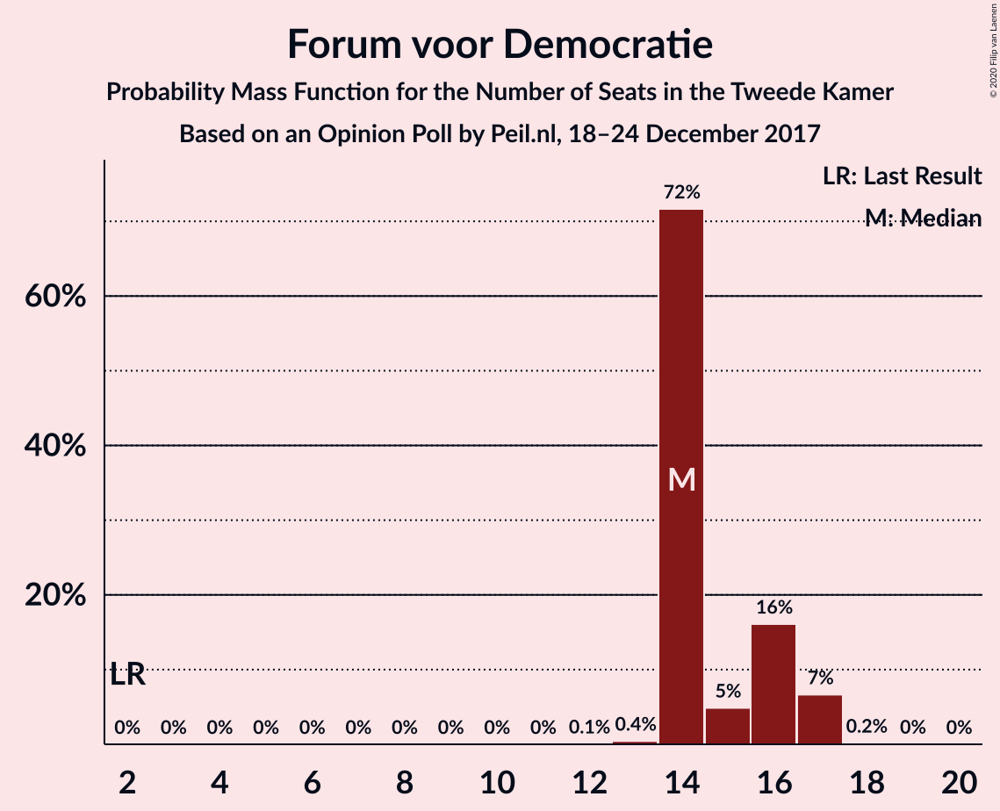
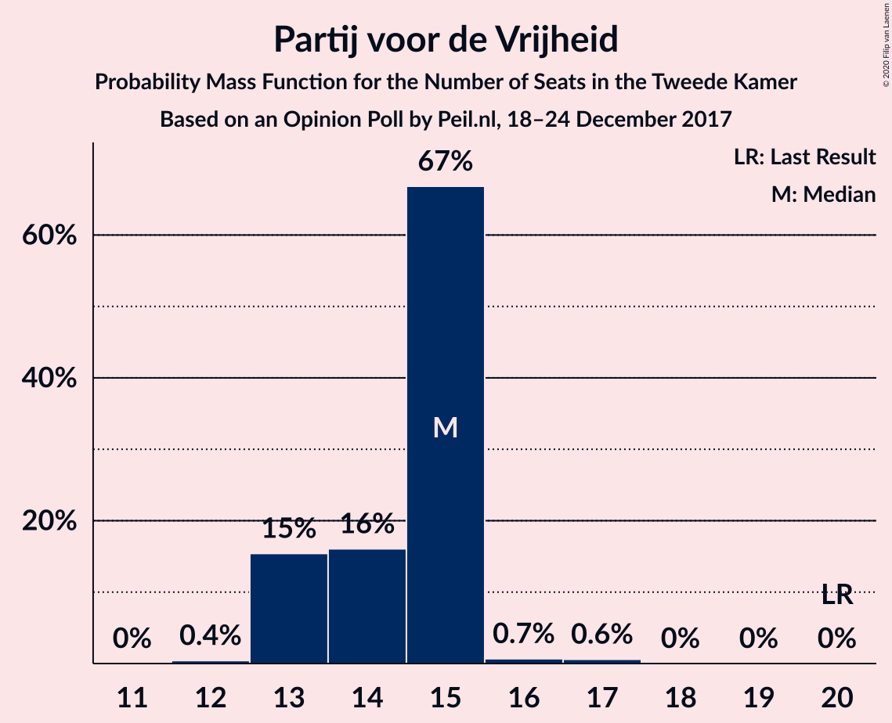
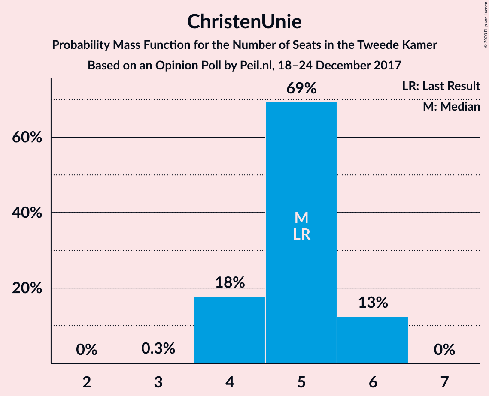
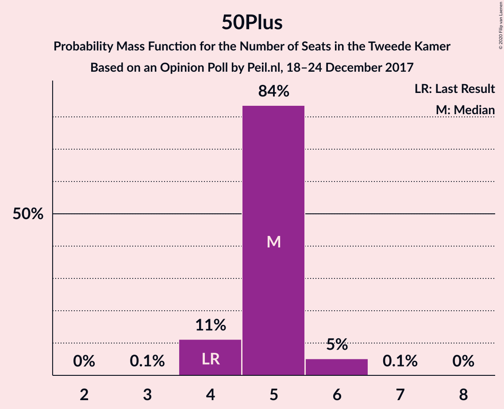
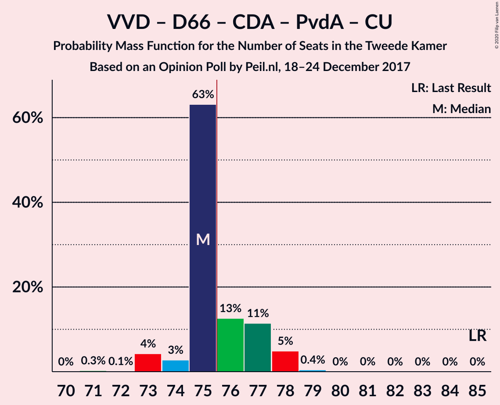
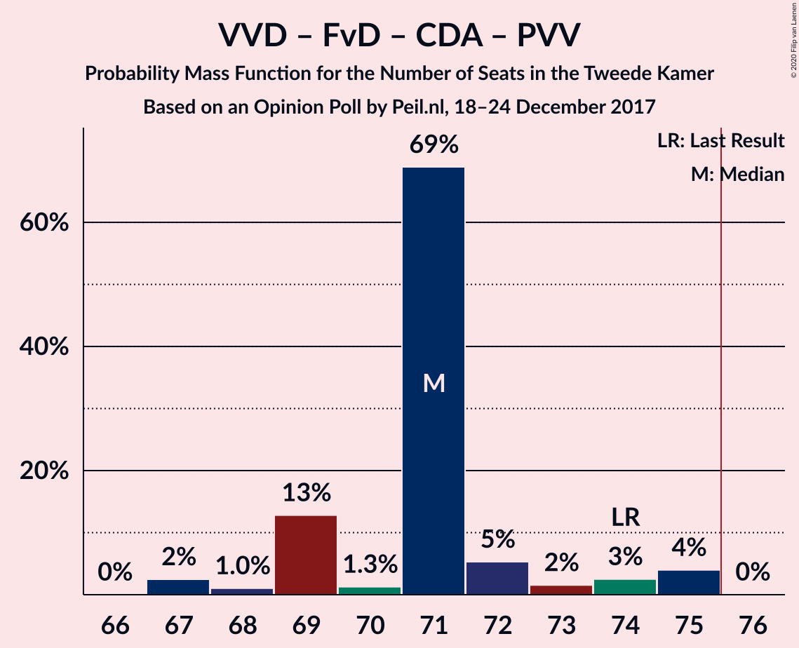
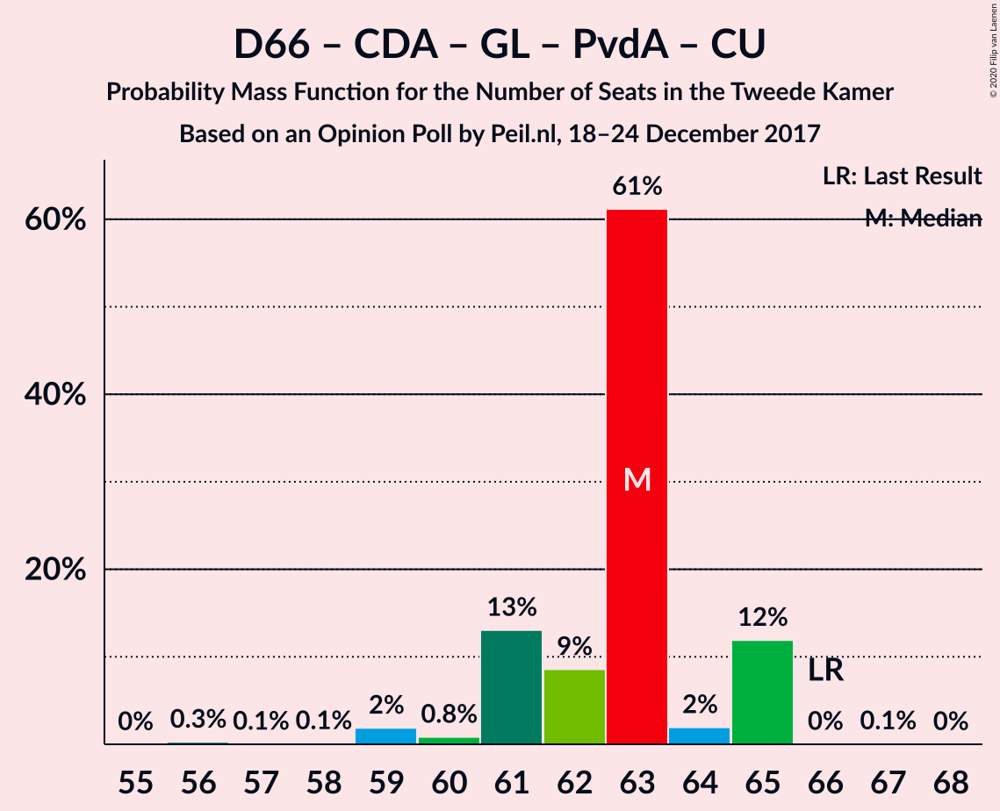
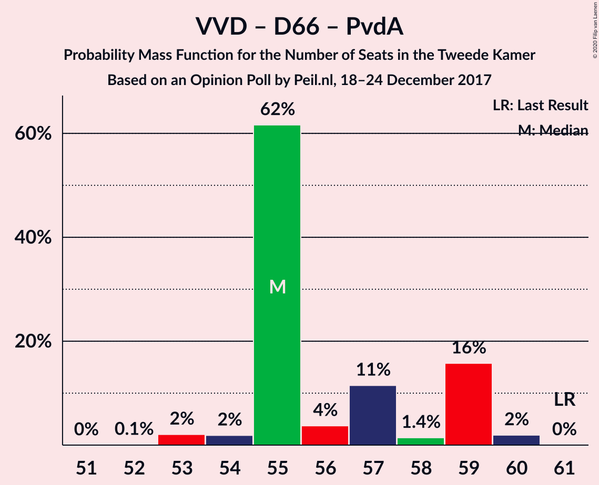
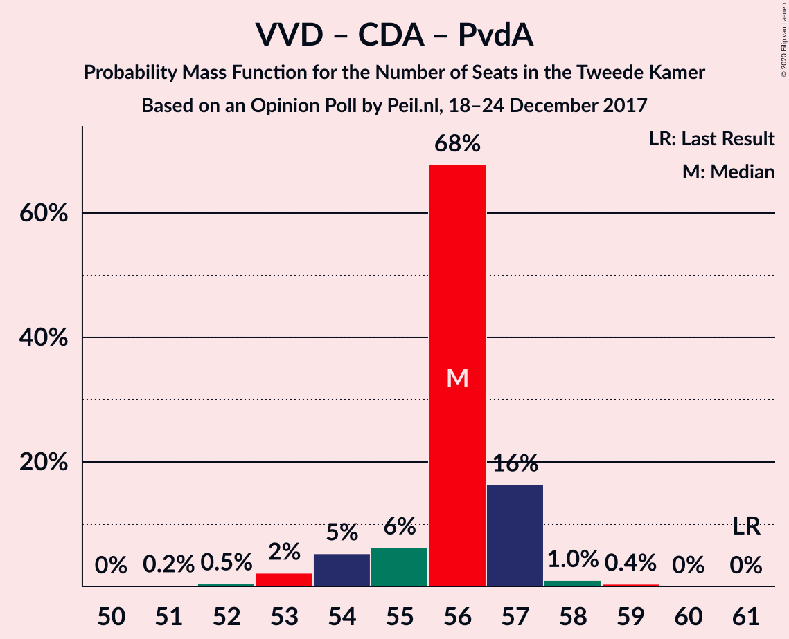
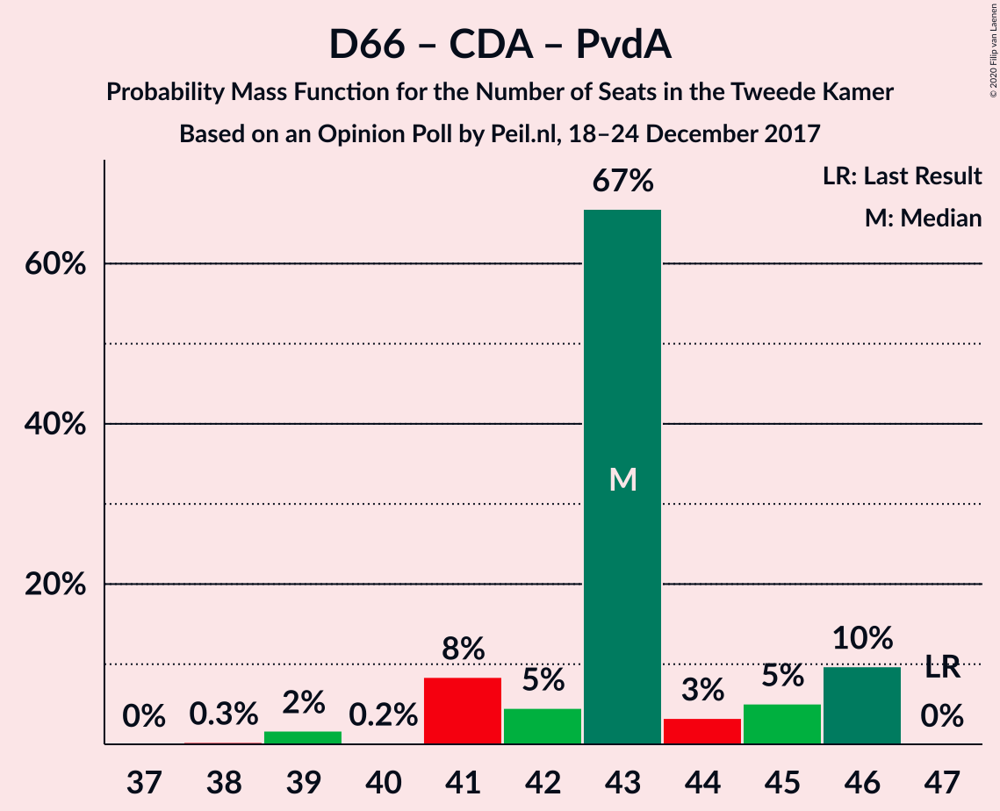

# Opinion Poll by Peil.nl, 18–24 December 2017

<a href="#voting-intentions">Voting Intentions</a> | <a href="#seats">Seats</a> | <a href="#coalitions">Coalitions</a> | <a href="#technical-information">Technical Information</a>

## Voting Intentions

### Confidence Intervals

| Party | Last Result | Poll Result | 80% Confidence Interval | 90% Confidence Interval | 95% Confidence Interval | 99% Confidence Interval |
|:-----:|:-----------:|:-----------:|:-----------------------:|:-----------------------:|:-----------------------:|:-----------------------:|
| Volkspartij voor Vrijheid en Democratie | 21.3% | 18.0% | 17.1–18.9% |16.9–19.2% |16.7–19.4% |16.2–19.9% |
| Democraten 66 | 12.2% | 10.0% | 9.3–10.7% |9.1–10.9% |9.0–11.1% |8.7–11.5% |
| Forum voor Democratie | 1.8% | 10.0% | 9.3–10.7% |9.1–10.9% |9.0–11.1% |8.7–11.5% |
| Partij voor de Vrijheid | 13.1% | 9.3% | 8.7–10.1% |8.5–10.3% |8.3–10.4% |8.0–10.8% |
| Christen-Democratisch Appèl | 12.4% | 9.3% | 8.7–10.1% |8.5–10.3% |8.3–10.4% |8.0–10.8% |
| GroenLinks | 9.1% | 9.3% | 8.7–10.1% |8.5–10.3% |8.3–10.4% |8.0–10.8% |
| Socialistische Partij | 9.1% | 9.3% | 8.7–10.1% |8.5–10.3% |8.3–10.4% |8.0–10.8% |
| Partij van de Arbeid | 5.7% | 9.3% | 8.7–10.1% |8.5–10.3% |8.3–10.4% |8.0–10.8% |
| Partij voor de Dieren | 3.2% | 4.7% | 4.2–5.2% |4.1–5.3% |4.0–5.5% |3.7–5.8% |
| ChristenUnie | 3.4% | 3.3% | 2.9–3.8% |2.8–3.9% |2.7–4.0% |2.6–4.3% |
| 50Plus | 3.1% | 3.3% | 2.9–3.8% |2.8–3.9% |2.7–4.0% |2.6–4.3% |
| Staatkundig Gereformeerde Partij | 2.1% | 2.0% | 1.7–2.4% |1.6–2.5% |1.6–2.6% |1.4–2.8% |
| DENK | 2.1% | 2.0% | 1.7–2.4% |1.6–2.5% |1.6–2.6% |1.4–2.8% |

*Note:* The poll result column reflects the actual value used in the calculations. Published results may vary slightly, and in addition be rounded to fewer digits.

## Seats

### Confidence Intervals

| Party | Last Result | Median | 80% Confidence Interval | 90% Confidence Interval | 95% Confidence Interval | 99% Confidence Interval |
|:-----:|:-----------:|:------:|:-----------------------:|:-----------------------:|:-----------------------:|:-----------------------:|
| <a href="#volkspartij-voor-vrijheid-en-democratie">Volkspartij voor Vrijheid en Democratie</a> | 33 | 27 | 27–29 |26–29 |26–30 |25–30 |
| <a href="#democraten-66">Democraten 66</a> | 19 | 14 | 14–16 |14–17 |14–17 |13–17 |
| <a href="#forum-voor-democratie">Forum voor Democratie</a> | 2 | 14 | 14–16 |14–17 |14–17 |13–17 |
| <a href="#partij-voor-de-vrijheid">Partij voor de Vrijheid</a> | 20 | 15 | 13–15 |13–15 |13–15 |13–17 |
| <a href="#christen-democratisch-appèl">Christen-Democratisch Appèl</a> | 19 | 15 | 13–15 |13–15 |13–15 |12–16 |
| <a href="#groenlinks">GroenLinks</a> | 14 | 15 | 14–15 |14–15 |13–15 |13–17 |
| <a href="#socialistische-partij">Socialistische Partij</a> | 14 | 14 | 14–15 |14–15 |13–15 |13–16 |
| <a href="#partij-van-de-arbeid">Partij van de Arbeid</a> | 9 | 14 | 13–16 |13–16 |12–16 |12–16 |
| <a href="#partij-voor-de-dieren">Partij voor de Dieren</a> | 5 | 7 | 6–7 |6–7 |6–8 |5–8 |
| <a href="#christenunie">ChristenUnie</a> | 5 | 5 | 4–6 |4–6 |4–6 |4–6 |
| <a href="#50plus">50Plus</a> | 4 | 5 | 4–5 |4–6 |4–6 |4–6 |
| <a href="#staatkundig-gereformeerde-partij">Staatkundig Gereformeerde Partij</a> | 3 | 2 | 2–3 |2–3 |2–3 |2–3 |
| <a href="#denk">DENK</a> | 3 | 3 | 2–3 |2–3 |2–3 |2–4 |

### Volkspartij voor Vrijheid en Democratie

*For a full overview of the results for this party, see the [Volkspartij voor Vrijheid en Democratie](party-volkspartijvoorvrijheidendemocratie.html) page.*

| Number of Seats | Probability | Accumulated | Special Marks |
|:---------------:|:-----------:|:-----------:|:-------------:|
| 24 | 0.1% | 100% |  |
| 25 | 2% | 99.9% |  |
| 26 | 3% | 98% |  |
| 27 | 74% | 95% | Median |
| 28 | 6% | 21% |  |
| 29 | 12% | 15% |  |
| 30 | 3% | 4% |  |
| 31 | 0.1% | 0.3% |  |
| 32 | 0.2% | 0.2% |  |
| 33 | 0% | 0% | Last Result |

### Democraten 66

*For a full overview of the results for this party, see the [Democraten 66](party-democraten66.html) page.*

| Number of Seats | Probability | Accumulated | Special Marks |
|:---------------:|:-----------:|:-----------:|:-------------:|
| 13 | 0.5% | 100% |  |
| 14 | 72% | 99.5% | Median |
| 15 | 9% | 28% |  |
| 16 | 14% | 19% |  |
| 17 | 5% | 5% |  |
| 18 | 0.4% | 0.4% |  |
| 19 | 0% | 0% | Last Result |

### Forum voor Democratie

*For a full overview of the results for this party, see the [Forum voor Democratie](party-forumvoordemocratie.html) page.*

| Number of Seats | Probability | Accumulated | Special Marks |
|:---------------:|:-----------:|:-----------:|:-------------:|
| 2 | 0% | 100% | Last Result |
| 3 | 0% | 100% |  |
| 4 | 0% | 100% |  |
| 5 | 0% | 100% |  |
| 6 | 0% | 100% |  |
| 7 | 0% | 100% |  |
| 8 | 0% | 100% |  |
| 9 | 0% | 100% |  |
| 10 | 0% | 100% |  |
| 11 | 0% | 100% |  |
| 12 | 0.1% | 100% |  |
| 13 | 0.4% | 99.9% |  |
| 14 | 72% | 99.5% | Median |
| 15 | 5% | 28% |  |
| 16 | 16% | 23% |  |
| 17 | 7% | 7% |  |
| 18 | 0.2% | 0.2% |  |
| 19 | 0% | 0% |  |

### Partij voor de Vrijheid

*For a full overview of the results for this party, see the [Partij voor de Vrijheid](party-partijvoordevrijheid.html) page.*

| Number of Seats | Probability | Accumulated | Special Marks |
|:---------------:|:-----------:|:-----------:|:-------------:|
| 12 | 0.4% | 100% |  |
| 13 | 15% | 99.6% |  |
| 14 | 16% | 84% |  |
| 15 | 67% | 68% | Median |
| 16 | 0.7% | 1.3% |  |
| 17 | 0.6% | 0.6% |  |
| 18 | 0% | 0% |  |
| 19 | 0% | 0% |  |
| 20 | 0% | 0% | Last Result |

### Christen-Democratisch Appèl

*For a full overview of the results for this party, see the [Christen-Democratisch Appèl](party-christen-democratischappèl.html) page.*

| Number of Seats | Probability | Accumulated | Special Marks |
|:---------------:|:-----------:|:-----------:|:-------------:|
| 12 | 2% | 100% |  |
| 13 | 16% | 98% |  |
| 14 | 15% | 82% |  |
| 15 | 66% | 67% | Median |
| 16 | 0.7% | 0.8% |  |
| 17 | 0% | 0% |  |
| 18 | 0% | 0% |  |
| 19 | 0% | 0% | Last Result |

### GroenLinks

*For a full overview of the results for this party, see the [GroenLinks](party-groenlinks.html) page.*

| Number of Seats | Probability | Accumulated | Special Marks |
|:---------------:|:-----------:|:-----------:|:-------------:|
| 12 | 0.1% | 100% |  |
| 13 | 3% | 99.9% |  |
| 14 | 25% | 96% | Last Result |
| 15 | 69% | 71% | Median |
| 16 | 0% | 2% |  |
| 17 | 2% | 2% |  |
| 18 | 0.1% | 0.1% |  |
| 19 | 0% | 0% |  |

### Socialistische Partij

*For a full overview of the results for this party, see the [Socialistische Partij](party-socialistischepartij.html) page.*

| Number of Seats | Probability | Accumulated | Special Marks |
|:---------------:|:-----------:|:-----------:|:-------------:|
| 11 | 0.1% | 100% |  |
| 12 | 0.1% | 99.9% |  |
| 13 | 3% | 99.9% |  |
| 14 | 83% | 97% | Last Result, Median |
| 15 | 11% | 13% |  |
| 16 | 2% | 2% |  |
| 17 | 0.1% | 0.1% |  |
| 18 | 0% | 0% |  |

### Partij van de Arbeid

*For a full overview of the results for this party, see the [Partij van de Arbeid](party-partijvandearbeid.html) page.*

| Number of Seats | Probability | Accumulated | Special Marks |
|:---------------:|:-----------:|:-----------:|:-------------:|
| 9 | 0% | 100% | Last Result |
| 10 | 0% | 100% |  |
| 11 | 0% | 100% |  |
| 12 | 3% | 100% |  |
| 13 | 10% | 97% |  |
| 14 | 68% | 86% | Median |
| 15 | 8% | 19% |  |
| 16 | 11% | 11% |  |
| 17 | 0% | 0% |  |

### Partij voor de Dieren

*For a full overview of the results for this party, see the [Partij voor de Dieren](party-partijvoordedieren.html) page.*

| Number of Seats | Probability | Accumulated | Special Marks |
|:---------------:|:-----------:|:-----------:|:-------------:|
| 5 | 0.7% | 100% | Last Result |
| 6 | 27% | 99.2% |  |
| 7 | 69% | 72% | Median |
| 8 | 2% | 3% |  |
| 9 | 0.3% | 0.3% |  |
| 10 | 0% | 0% |  |

### ChristenUnie

*For a full overview of the results for this party, see the [ChristenUnie](party-christenunie.html) page.*

| Number of Seats | Probability | Accumulated | Special Marks |
|:---------------:|:-----------:|:-----------:|:-------------:|
| 3 | 0.3% | 100% |  |
| 4 | 18% | 99.7% |  |
| 5 | 69% | 82% | Last Result, Median |
| 6 | 13% | 13% |  |
| 7 | 0% | 0% |  |

### 50Plus

*For a full overview of the results for this party, see the [50Plus](party-50plus.html) page.*

| Number of Seats | Probability | Accumulated | Special Marks |
|:---------------:|:-----------:|:-----------:|:-------------:|
| 3 | 0.1% | 100% |  |
| 4 | 11% | 99.9% | Last Result |
| 5 | 84% | 89% | Median |
| 6 | 5% | 5% |  |
| 7 | 0.1% | 0.1% |  |
| 8 | 0% | 0% |  |

### Staatkundig Gereformeerde Partij

*For a full overview of the results for this party, see the [Staatkundig Gereformeerde Partij](party-staatkundiggereformeerdepartij.html) page.*

| Number of Seats | Probability | Accumulated | Special Marks |
|:---------------:|:-----------:|:-----------:|:-------------:|
| 2 | 84% | 100% | Median |
| 3 | 16% | 16% | Last Result |
| 4 | 0.2% | 0.2% |  |
| 5 | 0% | 0% |  |

### DENK

*For a full overview of the results for this party, see the [DENK](party-denk.html) page.*

| Number of Seats | Probability | Accumulated | Special Marks |
|:---------------:|:-----------:|:-----------:|:-------------:|
| 2 | 20% | 100% |  |
| 3 | 79% | 80% | Last Result, Median |
| 4 | 1.1% | 1.1% |  |
| 5 | 0% | 0% |  |

## Coalitions

### Confidence Intervals

| Coalition | Last Result | Median | Majority? | 80% Confidence Interval | 90% Confidence Interval | 95% Confidence Interval | 99% Confidence Interval |
|:---------:|:-----------:|:------:|:---------:|:-----------------------:|:-----------------------:|:-----------------------:|:-----------------------:|
| Democraten 66 – Christen-Democratisch Appèl – GroenLinks – Partij van de Arbeid – Socialistische Partij – ChristenUnie | 80 | 77 | 82% | 75–79 | 75–80 | 75–80 | 73–80 |
| Volkspartij voor Vrijheid en Democratie – Democraten 66 – Christen-Democratisch Appèl – GroenLinks – ChristenUnie | 90 | 76 | 91% | 76–77 | 74–77 | 73–78 | 73–79 |
| Volkspartij voor Vrijheid en Democratie – Democraten 66 – Christen-Democratisch Appèl – Partij van de Arbeid – ChristenUnie | 85 | 75 | 29% | 75–77 | 74–78 | 73–78 | 73–79 |
| Volkspartij voor Vrijheid en Democratie – Forum voor Democratie – Christen-Democratisch Appèl – Partij voor de Vrijheid – Staatkundig Gereformeerde Partij | 77 | 73 | 7% | 71–74 | 71–77 | 71–77 | 70–77 |
| Volkspartij voor Vrijheid en Democratie – Forum voor Democratie – Christen-Democratisch Appèl – Partij voor de Vrijheid | 74 | 71 | 0% | 69–72 | 69–74 | 67–75 | 67–75 |
| Volkspartij voor Vrijheid en Democratie – Forum voor Democratie – Christen-Democratisch Appèl – 50Plus – Staatkundig Gereformeerde Partij | 61 | 63 | 0% | 62–66 | 62–66 | 62–66 | 62–69 |
| Democraten 66 – Christen-Democratisch Appèl – GroenLinks – Partij van de Arbeid – ChristenUnie | 66 | 63 | 0% | 61–65 | 61–65 | 60–65 | 59–65 |
| Volkspartij voor Vrijheid en Democratie – Forum voor Democratie – Christen-Democratisch Appèl – 50Plus | 58 | 61 | 0% | 60–63 | 60–64 | 59–64 | 59–66 |
| Volkspartij voor Vrijheid en Democratie – Democraten 66 – Christen-Democratisch Appèl – ChristenUnie | 76 | 61 | 0% | 61–63 | 59–63 | 59–64 | 59–66 |
| Volkspartij voor Vrijheid en Democratie – Forum voor Democratie – Christen-Democratisch Appèl – Staatkundig Gereformeerde Partij | 57 | 58 | 0% | 57–61 | 57–62 | 57–62 | 57–63 |
| Volkspartij voor Vrijheid en Democratie – Forum voor Democratie – Christen-Democratisch Appèl | 54 | 56 | 0% | 55–58 | 55–59 | 55–60 | 54–60 |
| Volkspartij voor Vrijheid en Democratie – Democraten 66 – Christen-Democratisch Appèl | 71 | 56 | 0% | 56–57 | 55–59 | 54–59 | 54–61 |
| Volkspartij voor Vrijheid en Democratie – Democraten 66 – Partij van de Arbeid | 61 | 55 | 0% | 55–59 | 55–59 | 54–59 | 53–60 |
| Volkspartij voor Vrijheid en Democratie – Christen-Democratisch Appèl – Partij voor de Vrijheid | 72 | 57 | 0% | 55–57 | 53–58 | 52–59 | 52–60 |
| Volkspartij voor Vrijheid en Democratie – Christen-Democratisch Appèl – Partij van de Arbeid | 61 | 56 | 0% | 55–57 | 54–57 | 53–57 | 52–58 |
| Democraten 66 – Christen-Democratisch Appèl – Partij van de Arbeid | 47 | 43 | 0% | 41–45 | 41–46 | 41–46 | 39–46 |
| Volkspartij voor Vrijheid en Democratie – Christen-Democratisch Appèl | 52 | 42 | 0% | 41–42 | 40–44 | 39–44 | 39–45 |
| Volkspartij voor Vrijheid en Democratie – Partij van de Arbeid | 42 | 41 | 0% | 41–43 | 40–43 | 39–43 | 39–45 |
| Christen-Democratisch Appèl – Partij van de Arbeid – ChristenUnie | 33 | 34 | 0% | 32–34 | 31–34 | 31–34 | 30–34 |
| Democraten 66 – Christen-Democratisch Appèl | 38 | 29 | 0% | 28–30 | 27–30 | 27–30 | 27–32 |
| Christen-Democratisch Appèl – Partij van de Arbeid | 28 | 29 | 0% | 27–30 | 26–30 | 25–30 | 25–30 |

### Democraten 66 – Christen-Democratisch Appèl – GroenLinks – Partij van de Arbeid – Socialistische Partij – ChristenUnie

| Number of Seats | Probability | Accumulated | Special Marks |
|:---------------:|:-----------:|:-----------:|:-------------:|
| 71 | 0.1% | 100% |  |
| 72 | 0.4% | 99.9% |  |
| 73 | 0.8% | 99.5% |  |
| 74 | 0.4% | 98.7% |  |
| 75 | 17% | 98% |  |
| 76 | 6% | 82% | Majority |
| 77 | 61% | 76% | Median |
| 78 | 3% | 15% |  |
| 79 | 2% | 12% |  |
| 80 | 10% | 10% | Last Result |
| 81 | 0% | 0% |  |

### Volkspartij voor Vrijheid en Democratie – Democraten 66 – Christen-Democratisch Appèl – GroenLinks – ChristenUnie

| Number of Seats | Probability | Accumulated | Special Marks |
|:---------------:|:-----------:|:-----------:|:-------------:|
| 71 | 0.2% | 100% |  |
| 72 | 0.2% | 99.8% |  |
| 73 | 4% | 99.6% |  |
| 74 | 2% | 95% |  |
| 75 | 2% | 94% |  |
| 76 | 79% | 91% | Median, Majority |
| 77 | 8% | 12% |  |
| 78 | 3% | 4% |  |
| 79 | 2% | 2% |  |
| 80 | 0.4% | 0.4% |  |
| 81 | 0% | 0% |  |
| 82 | 0% | 0% |  |
| 83 | 0% | 0% |  |
| 84 | 0% | 0% |  |
| 85 | 0% | 0% |  |
| 86 | 0% | 0% |  |
| 87 | 0% | 0% |  |
| 88 | 0% | 0% |  |
| 89 | 0% | 0% |  |
| 90 | 0% | 0% | Last Result |

### Volkspartij voor Vrijheid en Democratie – Democraten 66 – Christen-Democratisch Appèl – Partij van de Arbeid – ChristenUnie

| Number of Seats | Probability | Accumulated | Special Marks |
|:---------------:|:-----------:|:-----------:|:-------------:|
| 71 | 0.3% | 100% |  |
| 72 | 0.1% | 99.7% |  |
| 73 | 4% | 99.6% |  |
| 74 | 3% | 95% |  |
| 75 | 63% | 93% | Median |
| 76 | 13% | 29% | Majority |
| 77 | 11% | 17% |  |
| 78 | 5% | 5% |  |
| 79 | 0.4% | 0.5% |  |
| 80 | 0% | 0.1% |  |
| 81 | 0% | 0% |  |
| 82 | 0% | 0% |  |
| 83 | 0% | 0% |  |
| 84 | 0% | 0% |  |
| 85 | 0% | 0% | Last Result |

### Volkspartij voor Vrijheid en Democratie – Forum voor Democratie – Christen-Democratisch Appèl – Partij voor de Vrijheid – Staatkundig Gereformeerde Partij

| Number of Seats | Probability | Accumulated | Special Marks |
|:---------------:|:-----------:|:-----------:|:-------------:|
| 70 | 2% | 100% |  |
| 71 | 14% | 98% |  |
| 72 | 1.3% | 84% |  |
| 73 | 61% | 83% | Median |
| 74 | 13% | 22% |  |
| 75 | 1.4% | 9% |  |
| 76 | 0.8% | 7% | Majority |
| 77 | 6% | 6% | Last Result |
| 78 | 0.1% | 0.1% |  |
| 79 | 0% | 0% |  |

### Volkspartij voor Vrijheid en Democratie – Forum voor Democratie – Christen-Democratisch Appèl – Partij voor de Vrijheid

| Number of Seats | Probability | Accumulated | Special Marks |
|:---------------:|:-----------:|:-----------:|:-------------:|
| 67 | 2% | 100% |  |
| 68 | 1.0% | 97% |  |
| 69 | 13% | 96% |  |
| 70 | 1.3% | 84% |  |
| 71 | 69% | 82% | Median |
| 72 | 5% | 13% |  |
| 73 | 2% | 8% |  |
| 74 | 3% | 7% | Last Result |
| 75 | 4% | 4% |  |
| 76 | 0% | 0% | Majority |

### Volkspartij voor Vrijheid en Democratie – Forum voor Democratie – Christen-Democratisch Appèl – 50Plus – Staatkundig Gereformeerde Partij

| Number of Seats | Probability | Accumulated | Special Marks |
|:---------------:|:-----------:|:-----------:|:-------------:|
| 60 | 0.1% | 100% |  |
| 61 | 0.4% | 99.9% | Last Result |
| 62 | 13% | 99.5% |  |
| 63 | 60% | 86% | Median |
| 64 | 9% | 27% |  |
| 65 | 3% | 18% |  |
| 66 | 14% | 15% |  |
| 67 | 0.3% | 1.1% |  |
| 68 | 0.2% | 0.8% |  |
| 69 | 0.6% | 0.6% |  |
| 70 | 0% | 0% |  |

### Democraten 66 – Christen-Democratisch Appèl – GroenLinks – Partij van de Arbeid – ChristenUnie

| Number of Seats | Probability | Accumulated | Special Marks |
|:---------------:|:-----------:|:-----------:|:-------------:|
| 56 | 0.3% | 100% |  |
| 57 | 0.1% | 99.7% |  |
| 58 | 0.1% | 99.7% |  |
| 59 | 2% | 99.6% |  |
| 60 | 0.8% | 98% |  |
| 61 | 13% | 97% |  |
| 62 | 9% | 84% |  |
| 63 | 61% | 75% | Median |
| 64 | 2% | 14% |  |
| 65 | 12% | 12% |  |
| 66 | 0% | 0.1% | Last Result |
| 67 | 0.1% | 0.1% |  |
| 68 | 0% | 0% |  |

### Volkspartij voor Vrijheid en Democratie – Forum voor Democratie – Christen-Democratisch Appèl – 50Plus

| Number of Seats | Probability | Accumulated | Special Marks |
|:---------------:|:-----------:|:-----------:|:-------------:|
| 57 | 0.1% | 100% |  |
| 58 | 0.2% | 99.9% | Last Result |
| 59 | 4% | 99.7% |  |
| 60 | 10% | 96% |  |
| 61 | 61% | 86% | Median |
| 62 | 8% | 25% |  |
| 63 | 12% | 18% |  |
| 64 | 5% | 6% |  |
| 65 | 0.2% | 0.8% |  |
| 66 | 0.6% | 0.6% |  |
| 67 | 0% | 0% |  |

### Volkspartij voor Vrijheid en Democratie – Democraten 66 – Christen-Democratisch Appèl – ChristenUnie

| Number of Seats | Probability | Accumulated | Special Marks |
|:---------------:|:-----------:|:-----------:|:-------------:|
| 58 | 0.3% | 100% |  |
| 59 | 5% | 99.7% |  |
| 60 | 2% | 95% |  |
| 61 | 72% | 93% | Median |
| 62 | 10% | 22% |  |
| 63 | 9% | 12% |  |
| 64 | 0.5% | 3% |  |
| 65 | 2% | 2% |  |
| 66 | 0.6% | 0.6% |  |
| 67 | 0% | 0% |  |
| 68 | 0% | 0% |  |
| 69 | 0% | 0% |  |
| 70 | 0% | 0% |  |
| 71 | 0% | 0% |  |
| 72 | 0% | 0% |  |
| 73 | 0% | 0% |  |
| 74 | 0% | 0% |  |
| 75 | 0% | 0% |  |
| 76 | 0% | 0% | Last Result, Majority |

### Volkspartij voor Vrijheid en Democratie – Forum voor Democratie – Christen-Democratisch Appèl – Staatkundig Gereformeerde Partij

| Number of Seats | Probability | Accumulated | Special Marks |
|:---------------:|:-----------:|:-----------:|:-------------:|
| 56 | 0.1% | 100% |  |
| 57 | 12% | 99.9% | Last Result |
| 58 | 64% | 88% | Median |
| 59 | 4% | 24% |  |
| 60 | 4% | 20% |  |
| 61 | 9% | 16% |  |
| 62 | 6% | 7% |  |
| 63 | 0.7% | 0.8% |  |
| 64 | 0.1% | 0.1% |  |
| 65 | 0% | 0% |  |

### Volkspartij voor Vrijheid en Democratie – Forum voor Democratie – Christen-Democratisch Appèl

| Number of Seats | Probability | Accumulated | Special Marks |
|:---------------:|:-----------:|:-----------:|:-------------:|
| 53 | 0.1% | 100% |  |
| 54 | 2% | 99.9% | Last Result |
| 55 | 11% | 98% |  |
| 56 | 63% | 86% | Median |
| 57 | 5% | 23% |  |
| 58 | 10% | 18% |  |
| 59 | 4% | 8% |  |
| 60 | 5% | 5% |  |
| 61 | 0% | 0.1% |  |
| 62 | 0% | 0% |  |

### Volkspartij voor Vrijheid en Democratie – Democraten 66 – Christen-Democratisch Appèl

| Number of Seats | Probability | Accumulated | Special Marks |
|:---------------:|:-----------:|:-----------:|:-------------:|
| 53 | 0.3% | 100% |  |
| 54 | 4% | 99.7% |  |
| 55 | 3% | 96% |  |
| 56 | 67% | 92% | Median |
| 57 | 16% | 25% |  |
| 58 | 3% | 10% |  |
| 59 | 4% | 6% |  |
| 60 | 0.6% | 2% |  |
| 61 | 2% | 2% |  |
| 62 | 0% | 0% |  |
| 63 | 0% | 0% |  |
| 64 | 0% | 0% |  |
| 65 | 0% | 0% |  |
| 66 | 0% | 0% |  |
| 67 | 0% | 0% |  |
| 68 | 0% | 0% |  |
| 69 | 0% | 0% |  |
| 70 | 0% | 0% |  |
| 71 | 0% | 0% | Last Result |

### Volkspartij voor Vrijheid en Democratie – Democraten 66 – Partij van de Arbeid

| Number of Seats | Probability | Accumulated | Special Marks |
|:---------------:|:-----------:|:-----------:|:-------------:|
| 52 | 0.1% | 100% |  |
| 53 | 2% | 99.9% |  |
| 54 | 2% | 98% |  |
| 55 | 62% | 96% | Median |
| 56 | 4% | 34% |  |
| 57 | 11% | 31% |  |
| 58 | 1.4% | 19% |  |
| 59 | 16% | 18% |  |
| 60 | 2% | 2% |  |
| 61 | 0% | 0% | Last Result |

### Volkspartij voor Vrijheid en Democratie – Christen-Democratisch Appèl – Partij voor de Vrijheid

| Number of Seats | Probability | Accumulated | Special Marks |
|:---------------:|:-----------:|:-----------:|:-------------:|
| 51 | 0.4% | 100% |  |
| 52 | 3% | 99.6% |  |
| 53 | 3% | 97% |  |
| 54 | 0.7% | 94% |  |
| 55 | 23% | 93% |  |
| 56 | 2% | 70% |  |
| 57 | 59% | 68% | Median |
| 58 | 4% | 9% |  |
| 59 | 4% | 4% |  |
| 60 | 0.5% | 0.5% |  |
| 61 | 0% | 0% |  |
| 62 | 0% | 0% |  |
| 63 | 0% | 0% |  |
| 64 | 0% | 0% |  |
| 65 | 0% | 0% |  |
| 66 | 0% | 0% |  |
| 67 | 0% | 0% |  |
| 68 | 0% | 0% |  |
| 69 | 0% | 0% |  |
| 70 | 0% | 0% |  |
| 71 | 0% | 0% |  |
| 72 | 0% | 0% | Last Result |

### Volkspartij voor Vrijheid en Democratie – Christen-Democratisch Appèl – Partij van de Arbeid

| Number of Seats | Probability | Accumulated | Special Marks |
|:---------------:|:-----------:|:-----------:|:-------------:|
| 51 | 0.2% | 100% |  |
| 52 | 0.5% | 99.8% |  |
| 53 | 2% | 99.3% |  |
| 54 | 5% | 97% |  |
| 55 | 6% | 92% |  |
| 56 | 68% | 86% | Median |
| 57 | 16% | 18% |  |
| 58 | 1.0% | 1.5% |  |
| 59 | 0.4% | 0.5% |  |
| 60 | 0% | 0% |  |
| 61 | 0% | 0% | Last Result |

### Democraten 66 – Christen-Democratisch Appèl – Partij van de Arbeid

| Number of Seats | Probability | Accumulated | Special Marks |
|:---------------:|:-----------:|:-----------:|:-------------:|
| 38 | 0.3% | 100% |  |
| 39 | 2% | 99.7% |  |
| 40 | 0.2% | 98% |  |
| 41 | 8% | 98% |  |
| 42 | 5% | 89% |  |
| 43 | 67% | 85% | Median |
| 44 | 3% | 18% |  |
| 45 | 5% | 15% |  |
| 46 | 10% | 10% |  |
| 47 | 0% | 0% | Last Result |

### Volkspartij voor Vrijheid en Democratie – Christen-Democratisch Appèl

| Number of Seats | Probability | Accumulated | Special Marks |
|:---------------:|:-----------:|:-----------:|:-------------:|
| 38 | 0.3% | 100% |  |
| 39 | 3% | 99.7% |  |
| 40 | 5% | 97% |  |
| 41 | 13% | 91% |  |
| 42 | 69% | 78% | Median |
| 43 | 2% | 8% |  |
| 44 | 6% | 6% |  |
| 45 | 0.3% | 0.5% |  |
| 46 | 0.2% | 0.2% |  |
| 47 | 0% | 0% |  |
| 48 | 0% | 0% |  |
| 49 | 0% | 0% |  |
| 50 | 0% | 0% |  |
| 51 | 0% | 0% |  |
| 52 | 0% | 0% | Last Result |

### Volkspartij voor Vrijheid en Democratie – Partij van de Arbeid

| Number of Seats | Probability | Accumulated | Special Marks |
|:---------------:|:-----------:|:-----------:|:-------------:|
| 38 | 0.3% | 100% |  |
| 39 | 2% | 99.7% |  |
| 40 | 4% | 97% |  |
| 41 | 63% | 94% | Median |
| 42 | 8% | 30% | Last Result |
| 43 | 21% | 22% |  |
| 44 | 0.2% | 1.3% |  |
| 45 | 1.1% | 1.1% |  |
| 46 | 0% | 0% |  |

### Christen-Democratisch Appèl – Partij van de Arbeid – ChristenUnie

| Number of Seats | Probability | Accumulated | Special Marks |
|:---------------:|:-----------:|:-----------:|:-------------:|
| 29 | 0.3% | 100% |  |
| 30 | 2% | 99.7% |  |
| 31 | 4% | 98% |  |
| 32 | 5% | 94% |  |
| 33 | 14% | 89% | Last Result |
| 34 | 74% | 74% | Median |
| 35 | 0.2% | 0.4% |  |
| 36 | 0.2% | 0.2% |  |
| 37 | 0% | 0% |  |

### Democraten 66 – Christen-Democratisch Appèl

| Number of Seats | Probability | Accumulated | Special Marks |
|:---------------:|:-----------:|:-----------:|:-------------:|
| 25 | 0.3% | 100% |  |
| 26 | 0% | 99.7% |  |
| 27 | 9% | 99.7% |  |
| 28 | 6% | 91% |  |
| 29 | 64% | 86% | Median |
| 30 | 19% | 21% |  |
| 31 | 1.3% | 2% |  |
| 32 | 0.7% | 0.7% |  |
| 33 | 0% | 0% |  |
| 34 | 0% | 0% |  |
| 35 | 0% | 0% |  |
| 36 | 0% | 0% |  |
| 37 | 0% | 0% |  |
| 38 | 0% | 0% | Last Result |

### Christen-Democratisch Appèl – Partij van de Arbeid

| Number of Seats | Probability | Accumulated | Special Marks |
|:---------------:|:-----------:|:-----------:|:-------------:|
| 24 | 0.1% | 100% |  |
| 25 | 4% | 99.9% |  |
| 26 | 2% | 96% |  |
| 27 | 10% | 95% |  |
| 28 | 11% | 85% | Last Result |
| 29 | 64% | 74% | Median |
| 30 | 10% | 10% |  |
| 31 | 0.1% | 0.1% |  |
| 32 | 0% | 0% |  |

## Technical Information

### Opinion Poll

+ **Polling firm:** Peil.nl
+ **Commissioner(s):** —
+ **Fieldwork period:** 18–24 December 2017

### Calculations

+ **Sample size:** 3000
+ **Simulations done:** 1,048,576
+ **Error estimate:** 1.27%

