# Opinion Poll by Kantar Public, 25–28 January 2018

<a href="#voting-intentions">Voting Intentions</a> | <a href="#seats">Seats</a> | <a href="#coalitions">Coalitions</a> | <a href="#technical-information">Technical Information</a>

## Voting Intentions

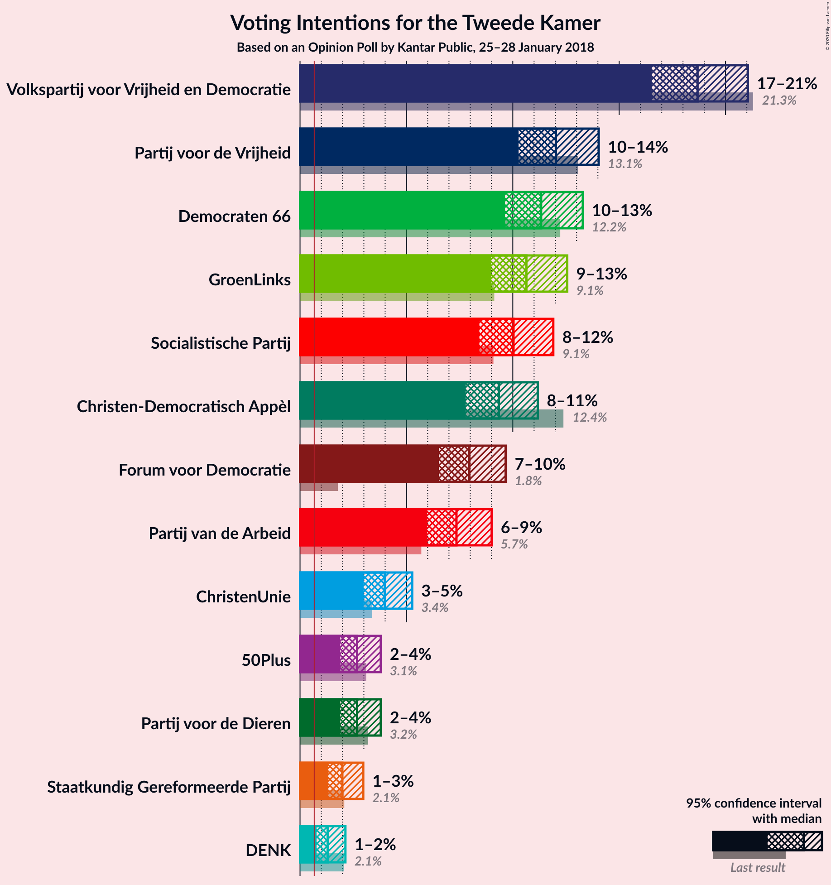

### Confidence Intervals

| Party | Last Result | Poll Result | 80% Confidence Interval | 90% Confidence Interval | 95% Confidence Interval | 99% Confidence Interval |
|:-----:|:-----------:|:-----------:|:-----------------------:|:-----------------------:|:-----------------------:|:-----------------------:|
| Volkspartij voor Vrijheid en Democratie | 21.3% | 18.7% | 17.3–20.2% |16.9–20.7% |16.5–21.0% |15.9–21.8% |
| Partij voor de Vrijheid | 13.1% | 12.0% | 10.9–13.3% |10.5–13.7% |10.3–14.0% |9.7–14.7% |
| Democraten 66 | 12.2% | 11.3% | 10.2–12.6% |9.9–13.0% |9.6–13.3% |9.1–13.9% |
| GroenLinks | 9.1% | 10.6% | 9.6–11.9% |9.3–12.3% |9.0–12.6% |8.5–13.2% |
| Socialistische Partij | 9.1% | 10.0% | 9.0–11.3% |8.7–11.6% |8.4–11.9% |7.9–12.5% |
| Christen-Democratisch Appèl | 12.4% | 9.3% | 8.3–10.5% |8.0–10.9% |7.8–11.2% |7.3–11.8% |
| Forum voor Democratie | 1.8% | 8.0% | 7.0–9.1% |6.8–9.4% |6.5–9.7% |6.1–10.2% |
| Partij van de Arbeid | 5.7% | 7.4% | 6.4–8.4% |6.2–8.7% |6.0–9.0% |5.6–9.6% |
| ChristenUnie | 3.4% | 4.0% | 3.3–4.8% |3.1–5.1% |3.0–5.3% |2.7–5.7% |
| Partij voor de Dieren | 3.2% | 2.7% | 2.2–3.4% |2.0–3.6% |1.9–3.8% |1.7–4.2% |
| 50Plus | 3.1% | 2.7% | 2.2–3.4% |2.0–3.6% |1.9–3.8% |1.7–4.2% |
| Staatkundig Gereformeerde Partij | 2.1% | 2.0% | 1.6–2.6% |1.4–2.8% |1.3–3.0% |1.1–3.3% |
| DENK | 2.1% | 1.3% | 1.0–1.8% |0.9–2.0% |0.8–2.1% |0.7–2.4% |

*Note:* The poll result column reflects the actual value used in the calculations. Published results may vary slightly, and in addition be rounded to fewer digits.

## Seats

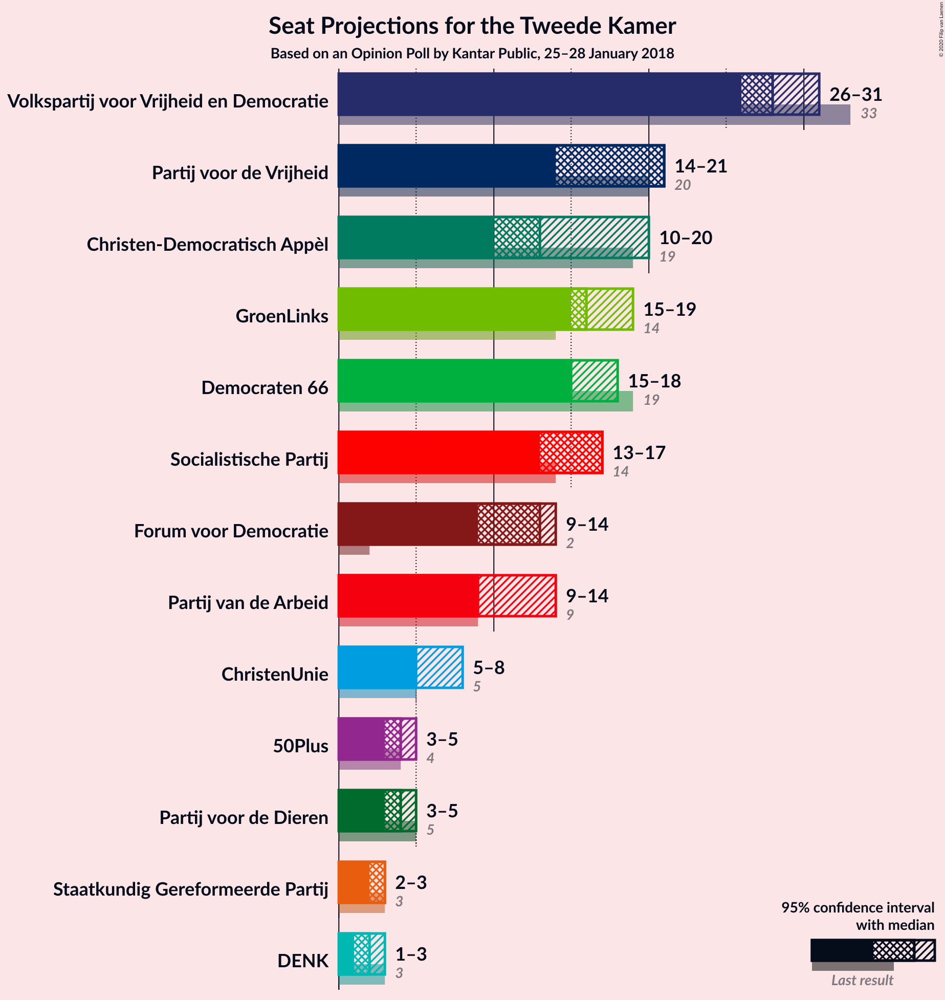

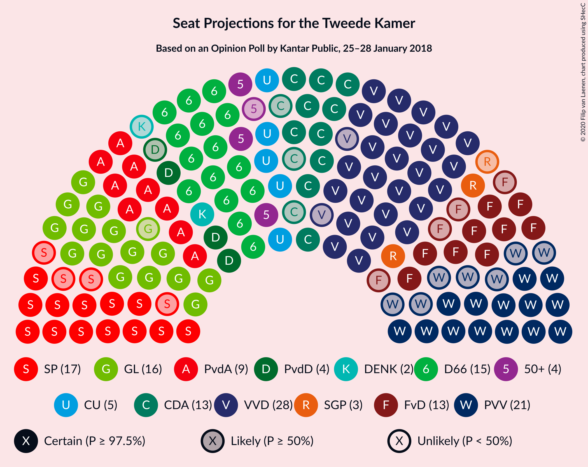

### Confidence Intervals

| Party | Last Result | Median | 80% Confidence Interval | 90% Confidence Interval | 95% Confidence Interval | 99% Confidence Interval |
|:-----:|:-----------:|:------:|:-----------------------:|:-----------------------:|:-----------------------:|:-----------------------:|
| <a href="#volkspartij-voor-vrijheid-en-democratie">Volkspartij voor Vrijheid en Democratie</a> | 33 | 28 | 28–29 |27–31 |26–31 |26–31 |
| <a href="#partij-voor-de-vrijheid">Partij voor de Vrijheid</a> | 20 | 21 | 14–21 |14–21 |14–21 |14–21 |
| <a href="#democraten-66">Democraten 66</a> | 19 | 15 | 15–17 |15–18 |15–18 |15–18 |
| <a href="#groenlinks">GroenLinks</a> | 14 | 16 | 16–18 |15–19 |15–19 |15–19 |
| <a href="#socialistische-partij">Socialistische Partij</a> | 14 | 17 | 15–17 |13–17 |13–17 |13–17 |
| <a href="#christen-democratisch-appèl">Christen-Democratisch Appèl</a> | 19 | 13 | 13–15 |10–15 |10–20 |10–20 |
| <a href="#forum-voor-democratie">Forum voor Democratie</a> | 2 | 13 | 11–13 |9–14 |9–14 |9–14 |
| <a href="#partij-van-de-arbeid">Partij van de Arbeid</a> | 9 | 9 | 9–12 |9–14 |9–14 |9–14 |
| <a href="#christenunie">ChristenUnie</a> | 5 | 5 | 5–6 |5–8 |5–8 |5–8 |
| <a href="#partij-voor-de-dieren">Partij voor de Dieren</a> | 5 | 4 | 3–4 |3–5 |3–5 |3–5 |
| <a href="#50plus">50Plus</a> | 4 | 4 | 4–5 |3–5 |3–5 |3–5 |
| <a href="#staatkundig-gereformeerde-partij">Staatkundig Gereformeerde Partij</a> | 3 | 3 | 2–3 |2–3 |2–3 |2–3 |
| <a href="#denk">DENK</a> | 3 | 2 | 2–3 |1–3 |1–3 |1–3 |

### Volkspartij voor Vrijheid en Democratie

*For a full overview of the results for this party, see the [Volkspartij voor Vrijheid en Democratie](party-volkspartijvoorvrijheidendemocratie.html) page.*

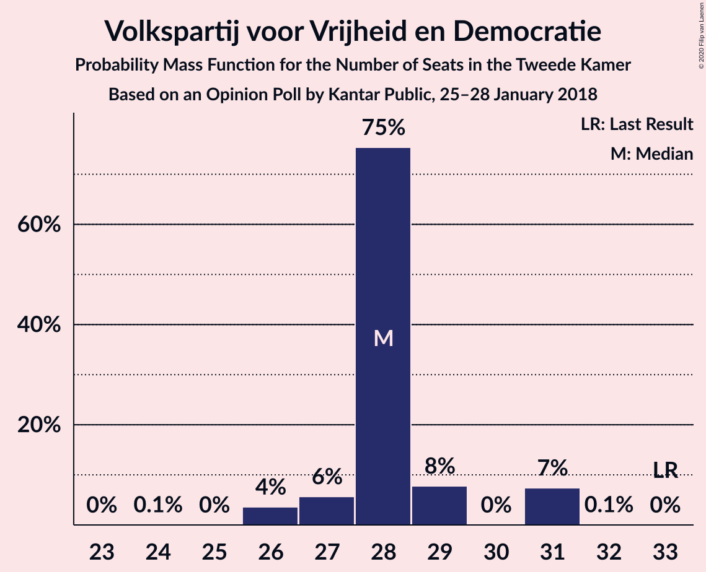

| Number of Seats | Probability | Accumulated | Special Marks |
|:---------------:|:-----------:|:-----------:|:-------------:|
| 24 | 0.1% | 100% |  |
| 25 | 0% | 99.9% |  |
| 26 | 4% | 99.9% |  |
| 27 | 6% | 96% |  |
| 28 | 75% | 91% | Median |
| 29 | 8% | 15% |  |
| 30 | 0% | 7% |  |
| 31 | 7% | 7% |  |
| 32 | 0.1% | 0.1% |  |
| 33 | 0% | 0% | Last Result |

### Partij voor de Vrijheid

*For a full overview of the results for this party, see the [Partij voor de Vrijheid](party-partijvoordevrijheid.html) page.*

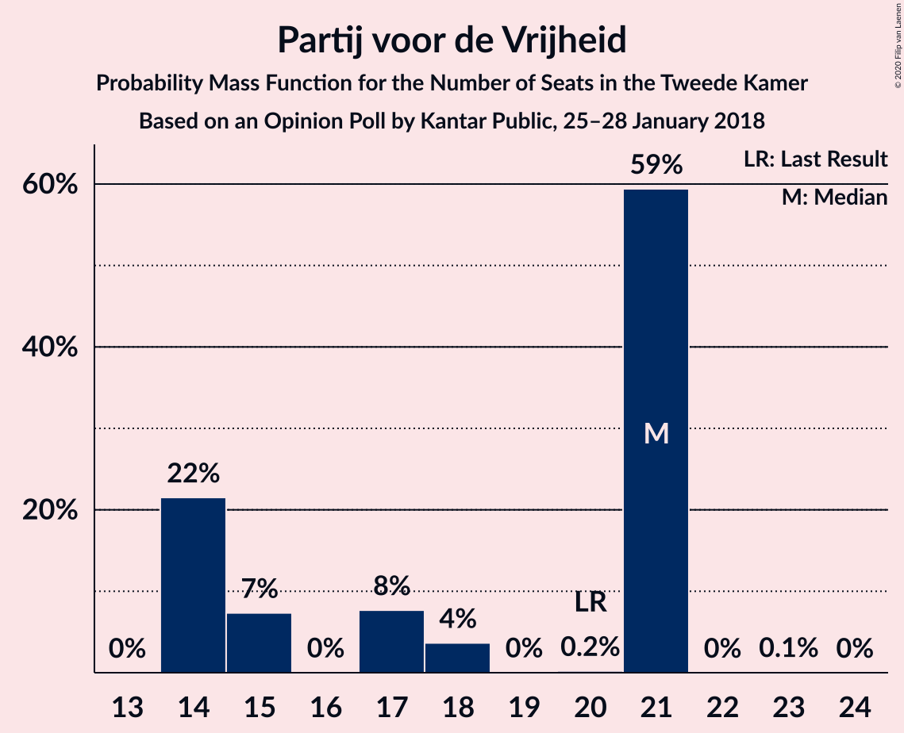

| Number of Seats | Probability | Accumulated | Special Marks |
|:---------------:|:-----------:|:-----------:|:-------------:|
| 14 | 22% | 100% |  |
| 15 | 7% | 78% |  |
| 16 | 0% | 71% |  |
| 17 | 8% | 71% |  |
| 18 | 4% | 63% |  |
| 19 | 0% | 60% |  |
| 20 | 0.2% | 60% | Last Result |
| 21 | 59% | 60% | Median |
| 22 | 0% | 0.1% |  |
| 23 | 0.1% | 0.1% |  |
| 24 | 0% | 0% |  |

### Democraten 66

*For a full overview of the results for this party, see the [Democraten 66](party-democraten66.html) page.*

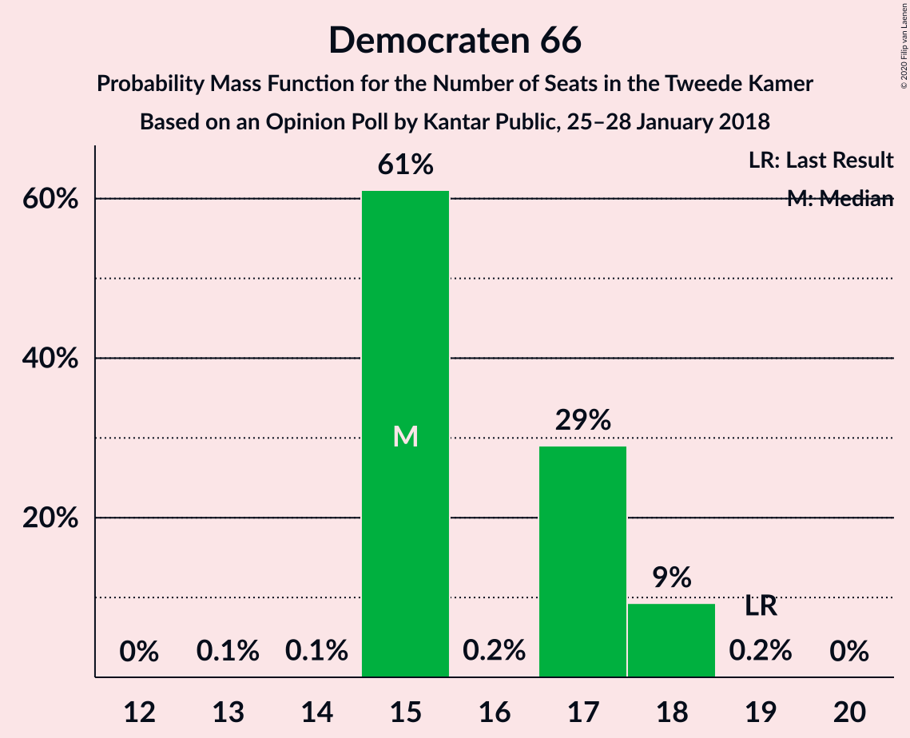

| Number of Seats | Probability | Accumulated | Special Marks |
|:---------------:|:-----------:|:-----------:|:-------------:|
| 13 | 0.1% | 100% |  |
| 14 | 0.1% | 99.9% |  |
| 15 | 61% | 99.8% | Median |
| 16 | 0.2% | 39% |  |
| 17 | 29% | 39% |  |
| 18 | 9% | 9% |  |
| 19 | 0.2% | 0.2% | Last Result |
| 20 | 0% | 0% |  |

### GroenLinks

*For a full overview of the results for this party, see the [GroenLinks](party-groenlinks.html) page.*

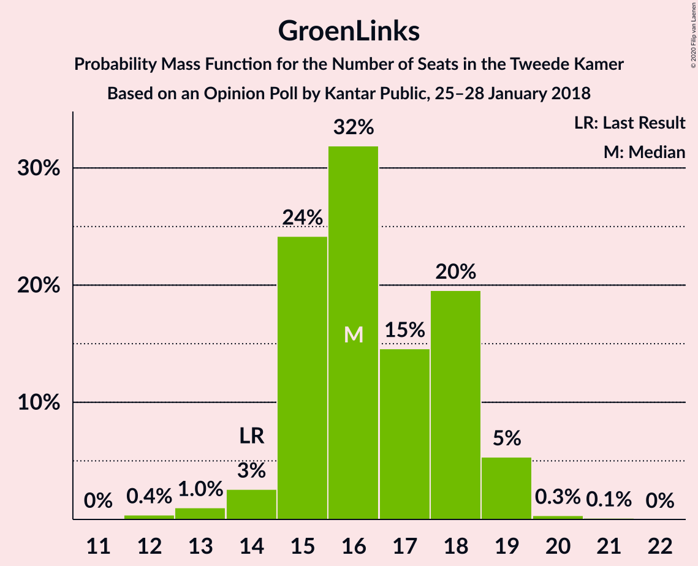

| Number of Seats | Probability | Accumulated | Special Marks |
|:---------------:|:-----------:|:-----------:|:-------------:|
| 13 | 0.1% | 100% |  |
| 14 | 0.2% | 99.8% | Last Result |
| 15 | 6% | 99.7% |  |
| 16 | 57% | 94% | Median |
| 17 | 0.1% | 37% |  |
| 18 | 29% | 36% |  |
| 19 | 7% | 7% |  |
| 20 | 0% | 0% |  |

### Socialistische Partij

*For a full overview of the results for this party, see the [Socialistische Partij](party-socialistischepartij.html) page.*

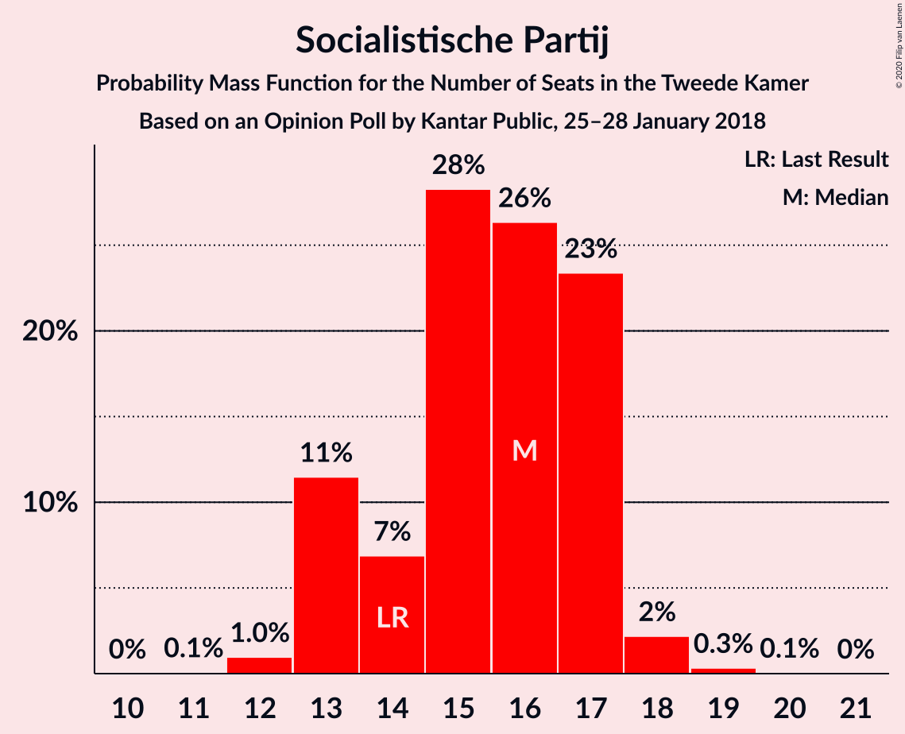

| Number of Seats | Probability | Accumulated | Special Marks |
|:---------------:|:-----------:|:-----------:|:-------------:|
| 11 | 0.1% | 100% |  |
| 12 | 0% | 99.9% |  |
| 13 | 6% | 99.8% |  |
| 14 | 0.2% | 94% | Last Result |
| 15 | 32% | 94% |  |
| 16 | 8% | 61% |  |
| 17 | 54% | 54% | Median |
| 18 | 0% | 0% |  |

### Christen-Democratisch Appèl

*For a full overview of the results for this party, see the [Christen-Democratisch Appèl](party-christen-democratischappèl.html) page.*

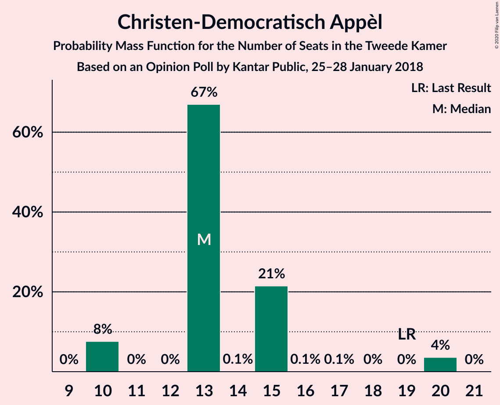

| Number of Seats | Probability | Accumulated | Special Marks |
|:---------------:|:-----------:|:-----------:|:-------------:|
| 10 | 8% | 100% |  |
| 11 | 0% | 92% |  |
| 12 | 0% | 92% |  |
| 13 | 67% | 92% | Median |
| 14 | 0.1% | 25% |  |
| 15 | 21% | 25% |  |
| 16 | 0.1% | 4% |  |
| 17 | 0.1% | 4% |  |
| 18 | 0% | 4% |  |
| 19 | 0% | 4% | Last Result |
| 20 | 4% | 4% |  |
| 21 | 0% | 0% |  |

### Forum voor Democratie

*For a full overview of the results for this party, see the [Forum voor Democratie](party-forumvoordemocratie.html) page.*

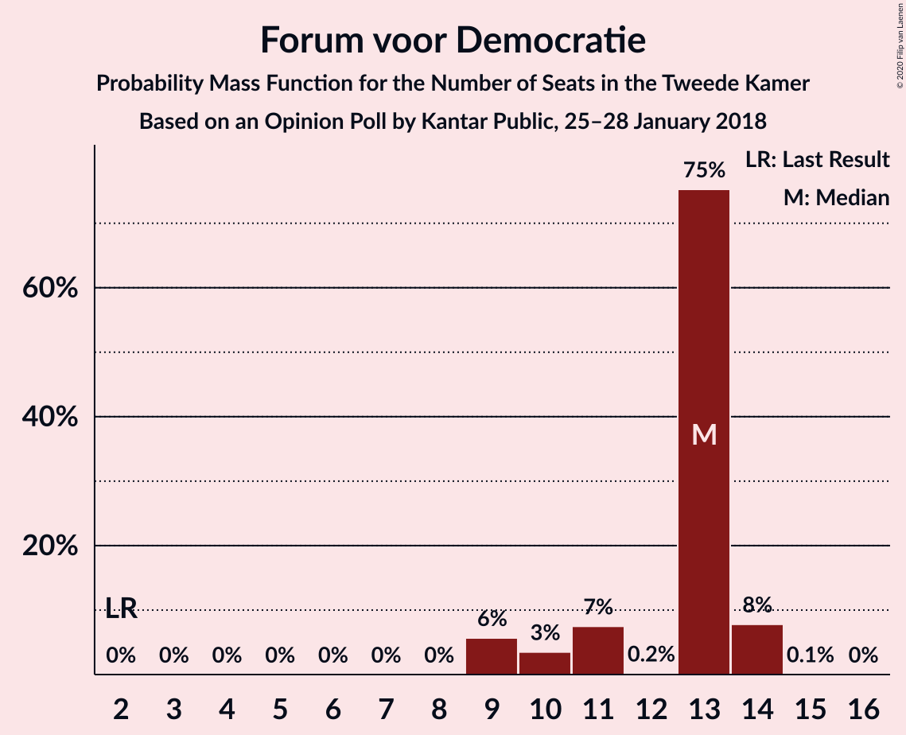

| Number of Seats | Probability | Accumulated | Special Marks |
|:---------------:|:-----------:|:-----------:|:-------------:|
| 2 | 0% | 100% | Last Result |
| 3 | 0% | 100% |  |
| 4 | 0% | 100% |  |
| 5 | 0% | 100% |  |
| 6 | 0% | 100% |  |
| 7 | 0% | 100% |  |
| 8 | 0% | 100% |  |
| 9 | 6% | 100% |  |
| 10 | 3% | 94% |  |
| 11 | 7% | 91% |  |
| 12 | 0.2% | 83% |  |
| 13 | 75% | 83% | Median |
| 14 | 8% | 8% |  |
| 15 | 0.1% | 0.1% |  |
| 16 | 0% | 0% |  |

### Partij van de Arbeid

*For a full overview of the results for this party, see the [Partij van de Arbeid](party-partijvandearbeid.html) page.*

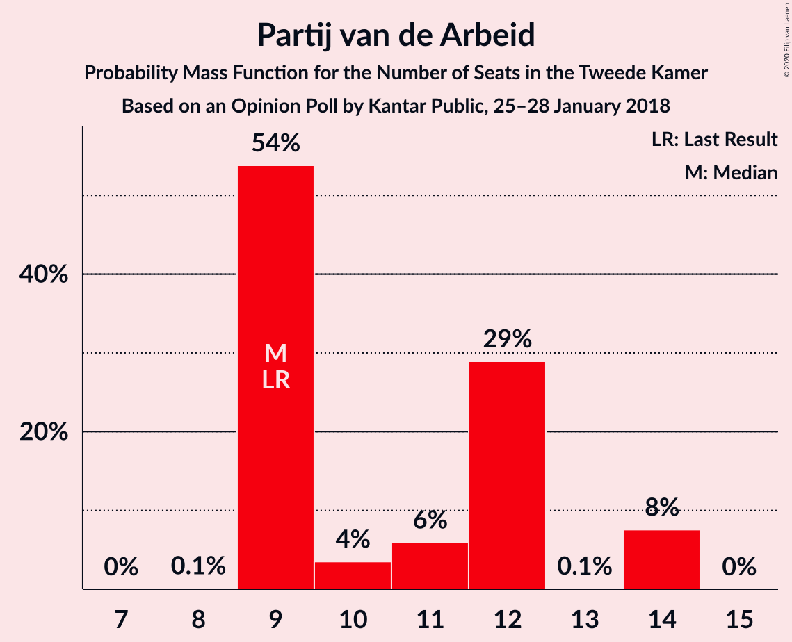

| Number of Seats | Probability | Accumulated | Special Marks |
|:---------------:|:-----------:|:-----------:|:-------------:|
| 8 | 0.1% | 100% |  |
| 9 | 54% | 99.9% | Last Result, Median |
| 10 | 4% | 46% |  |
| 11 | 6% | 43% |  |
| 12 | 29% | 37% |  |
| 13 | 0.1% | 8% |  |
| 14 | 8% | 8% |  |
| 15 | 0% | 0% |  |

### ChristenUnie

*For a full overview of the results for this party, see the [ChristenUnie](party-christenunie.html) page.*

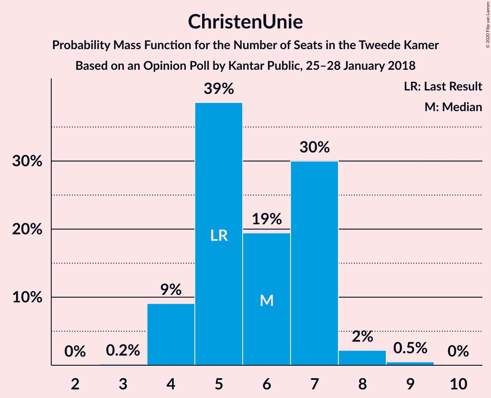

| Number of Seats | Probability | Accumulated | Special Marks |
|:---------------:|:-----------:|:-----------:|:-------------:|
| 4 | 0.1% | 100% |  |
| 5 | 65% | 99.9% | Last Result, Median |
| 6 | 29% | 35% |  |
| 7 | 0.1% | 6% |  |
| 8 | 6% | 6% |  |
| 9 | 0% | 0% |  |

### Partij voor de Dieren

*For a full overview of the results for this party, see the [Partij voor de Dieren](party-partijvoordedieren.html) page.*

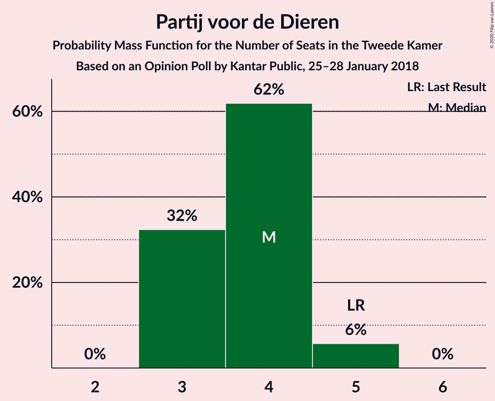

| Number of Seats | Probability | Accumulated | Special Marks |
|:---------------:|:-----------:|:-----------:|:-------------:|
| 3 | 32% | 100% |  |
| 4 | 62% | 68% | Median |
| 5 | 6% | 6% | Last Result |
| 6 | 0% | 0% |  |

### 50Plus

*For a full overview of the results for this party, see the [50Plus](party-50plus.html) page.*

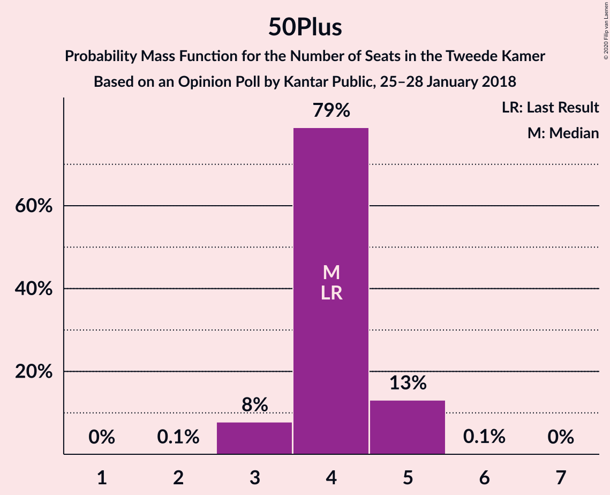

| Number of Seats | Probability | Accumulated | Special Marks |
|:---------------:|:-----------:|:-----------:|:-------------:|
| 2 | 0.1% | 100% |  |
| 3 | 8% | 99.9% |  |
| 4 | 79% | 92% | Last Result, Median |
| 5 | 13% | 13% |  |
| 6 | 0.1% | 0.2% |  |
| 7 | 0% | 0% |  |

### Staatkundig Gereformeerde Partij

*For a full overview of the results for this party, see the [Staatkundig Gereformeerde Partij](party-staatkundiggereformeerdepartij.html) page.*

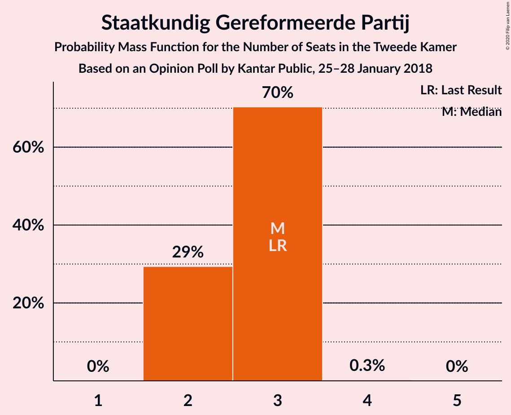

| Number of Seats | Probability | Accumulated | Special Marks |
|:---------------:|:-----------:|:-----------:|:-------------:|
| 2 | 29% | 100% |  |
| 3 | 70% | 71% | Last Result, Median |
| 4 | 0.3% | 0.3% |  |
| 5 | 0% | 0% |  |

### DENK

*For a full overview of the results for this party, see the [DENK](party-denk.html) page.*

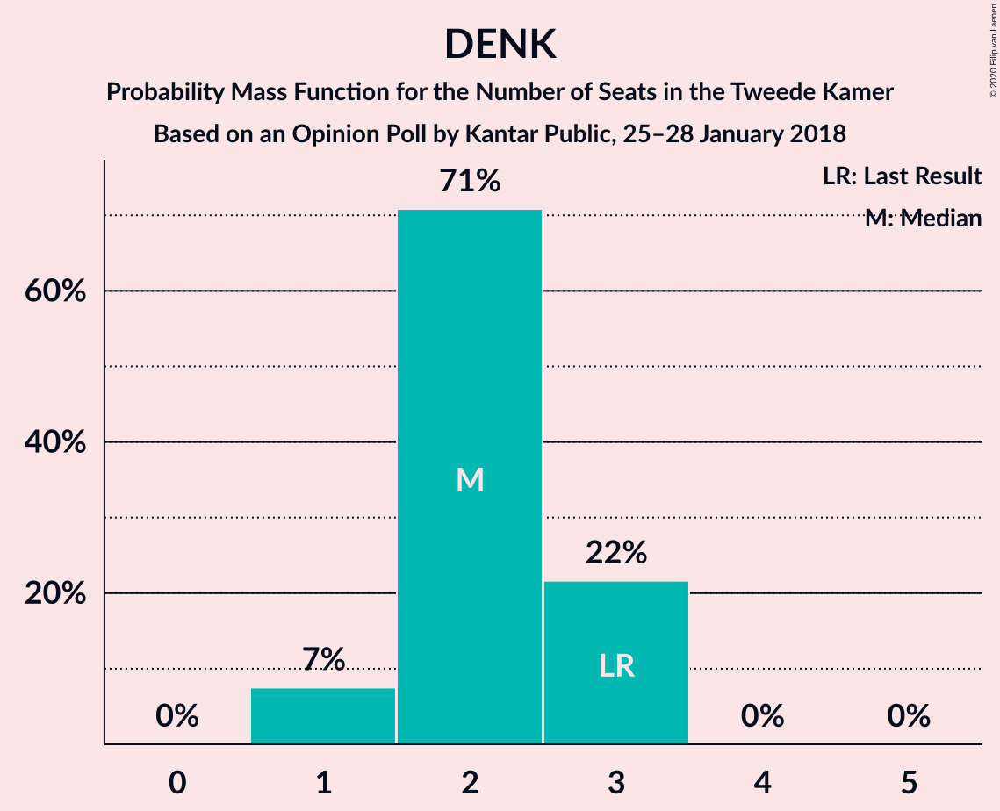

| Number of Seats | Probability | Accumulated | Special Marks |
|:---------------:|:-----------:|:-----------:|:-------------:|
| 1 | 7% | 100% |  |
| 2 | 71% | 92% | Median |
| 3 | 22% | 22% | Last Result |
| 4 | 0% | 0% |  |

## Coalitions

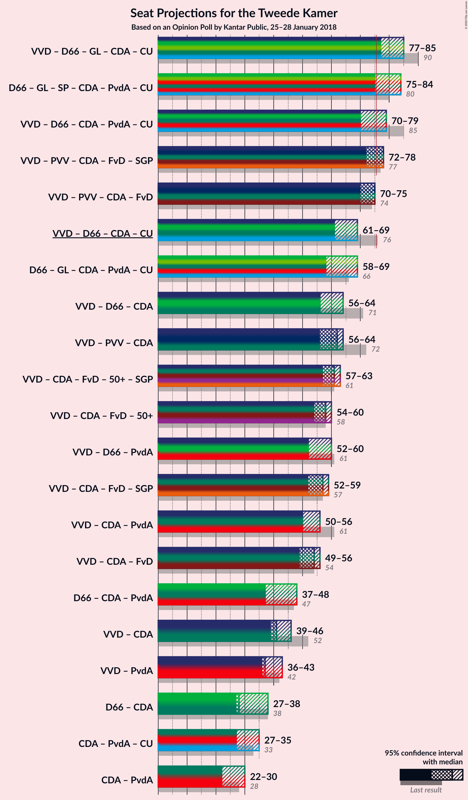

### Confidence Intervals

| Coalition | Last Result | Median | Majority? | 80% Confidence Interval | 90% Confidence Interval | 95% Confidence Interval | 99% Confidence Interval |
|:---------:|:-----------:|:------:|:---------:|:-----------------------:|:-----------------------:|:-----------------------:|:-----------------------:|
| Volkspartij voor Vrijheid en Democratie – Democraten 66 – GroenLinks – Christen-Democratisch Appèl – ChristenUnie | 90 | 77 | 100% | 77–84 | 77–84 | 77–85 | 77–85 |
| Democraten 66 – GroenLinks – Socialistische Partij – Christen-Democratisch Appèl – Partij van de Arbeid – ChristenUnie | 80 | 75 | 46% | 75–83 | 75–83 | 75–84 | 75–84 |
| Volkspartij voor Vrijheid en Democratie – Democraten 66 – Christen-Democratisch Appèl – Partij van de Arbeid – ChristenUnie | 85 | 70 | 38% | 70–78 | 70–78 | 70–79 | 70–79 |
| Volkspartij voor Vrijheid en Democratie – Partij voor de Vrijheid – Christen-Democratisch Appèl – Forum voor Democratie – Staatkundig Gereformeerde Partij | 77 | 78 | 58% | 72–78 | 72–78 | 72–78 | 72–78 |
| Volkspartij voor Vrijheid en Democratie – Partij voor de Vrijheid – Christen-Democratisch Appèl – Forum voor Democratie | 74 | 75 | 0.3% | 70–75 | 70–75 | 70–75 | 70–75 |
| Volkspartij voor Vrijheid en Democratie – Democraten 66 – Christen-Democratisch Appèl – ChristenUnie | 76 | 61 | 0% | 61–66 | 61–66 | 61–69 | 61–69 |
| Democraten 66 – GroenLinks – Christen-Democratisch Appèl – Partij van de Arbeid – ChristenUnie | 66 | 58 | 0% | 58–68 | 58–68 | 58–69 | 58–69 |
| Volkspartij voor Vrijheid en Democratie – Democraten 66 – Christen-Democratisch Appèl | 71 | 56 | 0% | 56–60 | 56–60 | 56–64 | 56–64 |
| Volkspartij voor Vrijheid en Democratie – Partij voor de Vrijheid – Christen-Democratisch Appèl | 72 | 62 | 0% | 57–62 | 56–62 | 56–64 | 56–64 |
| Volkspartij voor Vrijheid en Democratie – Christen-Democratisch Appèl – Forum voor Democratie – 50Plus – Staatkundig Gereformeerde Partij | 61 | 61 | 0% | 58–63 | 57–63 | 57–63 | 57–63 |
| Volkspartij voor Vrijheid en Democratie – Christen-Democratisch Appèl – Forum voor Democratie – 50Plus | 58 | 58 | 0% | 56–60 | 54–60 | 54–60 | 54–60 |
| Volkspartij voor Vrijheid en Democratie – Democraten 66 – Partij van de Arbeid | 61 | 52 | 0% | 52–58 | 52–60 | 52–60 | 52–60 |
| Volkspartij voor Vrijheid en Democratie – Christen-Democratisch Appèl – Forum voor Democratie – Staatkundig Gereformeerde Partij | 57 | 57 | 0% | 55–58 | 52–58 | 52–59 | 52–59 |
| Volkspartij voor Vrijheid en Democratie – Christen-Democratisch Appèl – Partij van de Arbeid | 61 | 50 | 0% | 50–56 | 50–56 | 50–56 | 50–56 |
| Volkspartij voor Vrijheid en Democratie – Christen-Democratisch Appèl – Forum voor Democratie | 54 | 54 | 0% | 53–56 | 49–56 | 49–56 | 49–56 |
| Democraten 66 – Christen-Democratisch Appèl – Partij van de Arbeid | 47 | 37 | 0% | 37–44 | 37–44 | 37–48 | 37–48 |
| Volkspartij voor Vrijheid en Democratie – Christen-Democratisch Appèl | 52 | 41 | 0% | 40–44 | 39–44 | 39–46 | 39–46 |
| Volkspartij voor Vrijheid en Democratie – Partij van de Arbeid | 42 | 37 | 0% | 37–43 | 37–43 | 36–43 | 36–43 |
| Democraten 66 – Christen-Democratisch Appèl | 38 | 28 | 0% | 28–32 | 27–32 | 27–38 | 27–38 |
| Christen-Democratisch Appèl – Partij van de Arbeid – ChristenUnie | 33 | 27 | 0% | 27–33 | 27–33 | 27–35 | 27–35 |
| Christen-Democratisch Appèl – Partij van de Arbeid | 28 | 22 | 0% | 22–27 | 22–27 | 22–30 | 22–30 |

### Volkspartij voor Vrijheid en Democratie – Democraten 66 – GroenLinks – Christen-Democratisch Appèl – ChristenUnie

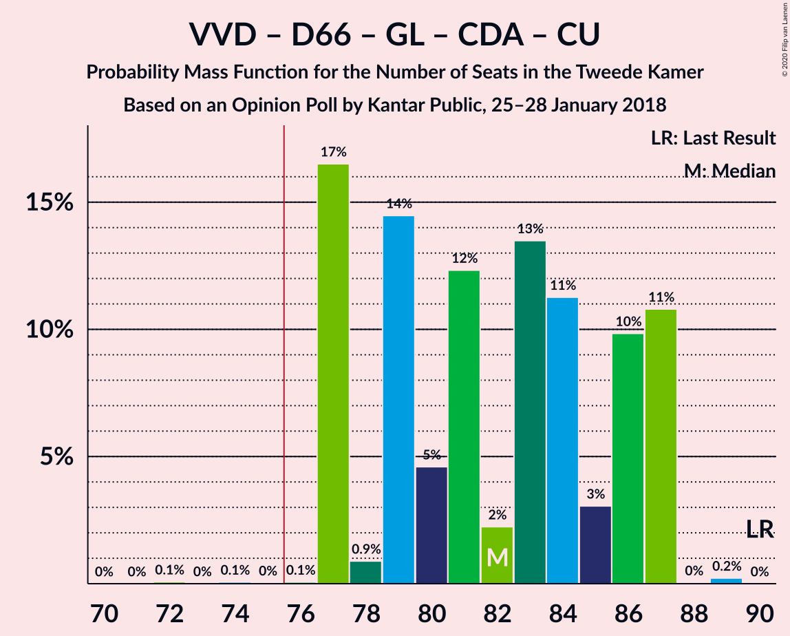

| Number of Seats | Probability | Accumulated | Special Marks |
|:---------------:|:-----------:|:-----------:|:-------------:|
| 76 | 0.1% | 100% | Majority |
| 77 | 54% | 99.9% | Median |
| 78 | 0.1% | 46% |  |
| 79 | 8% | 46% |  |
| 80 | 0% | 38% |  |
| 81 | 6% | 38% |  |
| 82 | 0.2% | 33% |  |
| 83 | 0% | 33% |  |
| 84 | 29% | 32% |  |
| 85 | 3% | 4% |  |
| 86 | 0% | 0.1% |  |
| 87 | 0% | 0% |  |
| 88 | 0% | 0% |  |
| 89 | 0% | 0% |  |
| 90 | 0% | 0% | Last Result |

### Democraten 66 – GroenLinks – Socialistische Partij – Christen-Democratisch Appèl – Partij van de Arbeid – ChristenUnie

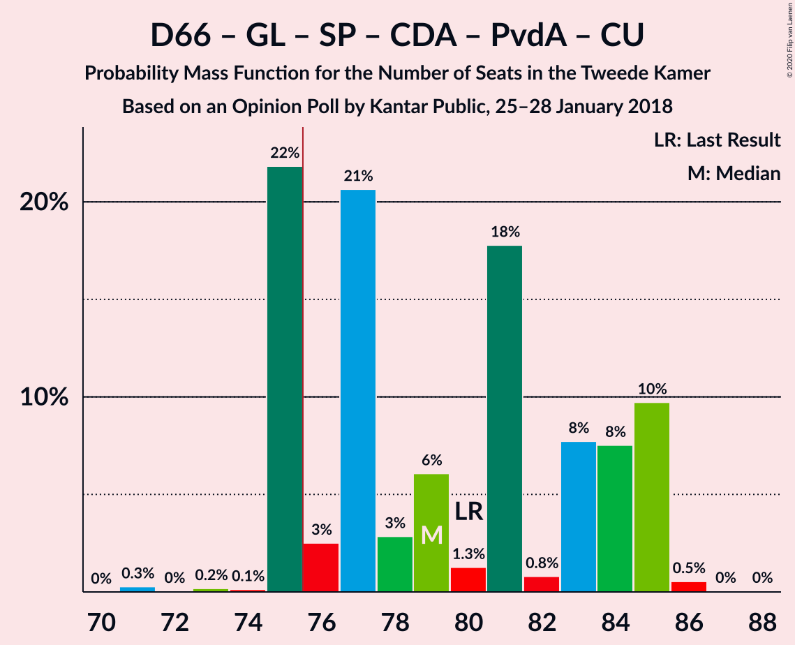

| Number of Seats | Probability | Accumulated | Special Marks |
|:---------------:|:-----------:|:-----------:|:-------------:|
| 72 | 0.1% | 100% |  |
| 73 | 0.1% | 99.9% |  |
| 74 | 0% | 99.8% |  |
| 75 | 54% | 99.8% | Median |
| 76 | 0% | 46% | Majority |
| 77 | 0% | 46% |  |
| 78 | 6% | 46% |  |
| 79 | 8% | 40% |  |
| 80 | 0.2% | 33% | Last Result |
| 81 | 7% | 32% |  |
| 82 | 0% | 25% |  |
| 83 | 21% | 25% |  |
| 84 | 3% | 4% |  |
| 85 | 0% | 0% |  |

### Volkspartij voor Vrijheid en Democratie – Democraten 66 – Christen-Democratisch Appèl – Partij van de Arbeid – ChristenUnie

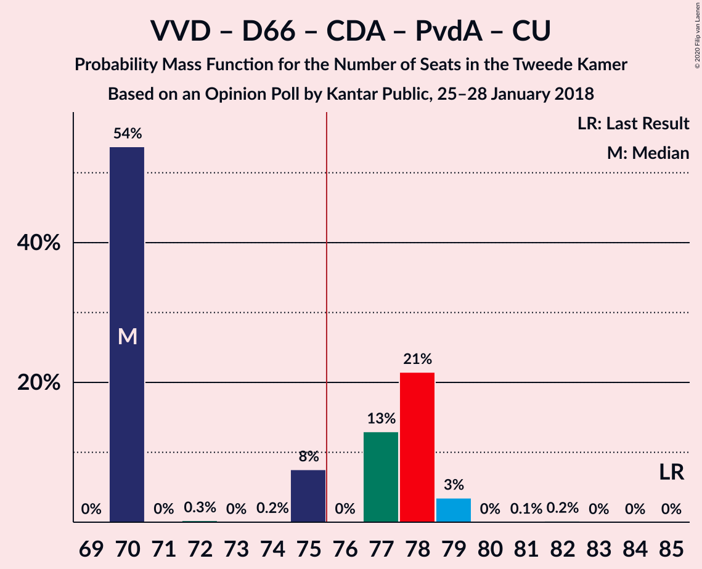

| Number of Seats | Probability | Accumulated | Special Marks |
|:---------------:|:-----------:|:-----------:|:-------------:|
| 70 | 54% | 100% | Median |
| 71 | 0% | 46% |  |
| 72 | 0.3% | 46% |  |
| 73 | 0% | 46% |  |
| 74 | 0.2% | 46% |  |
| 75 | 8% | 46% |  |
| 76 | 0% | 38% | Majority |
| 77 | 13% | 38% |  |
| 78 | 21% | 25% |  |
| 79 | 3% | 4% |  |
| 80 | 0% | 0.3% |  |
| 81 | 0.1% | 0.2% |  |
| 82 | 0.2% | 0.2% |  |
| 83 | 0% | 0% |  |
| 84 | 0% | 0% |  |
| 85 | 0% | 0% | Last Result |

### Volkspartij voor Vrijheid en Democratie – Partij voor de Vrijheid – Christen-Democratisch Appèl – Forum voor Democratie – Staatkundig Gereformeerde Partij

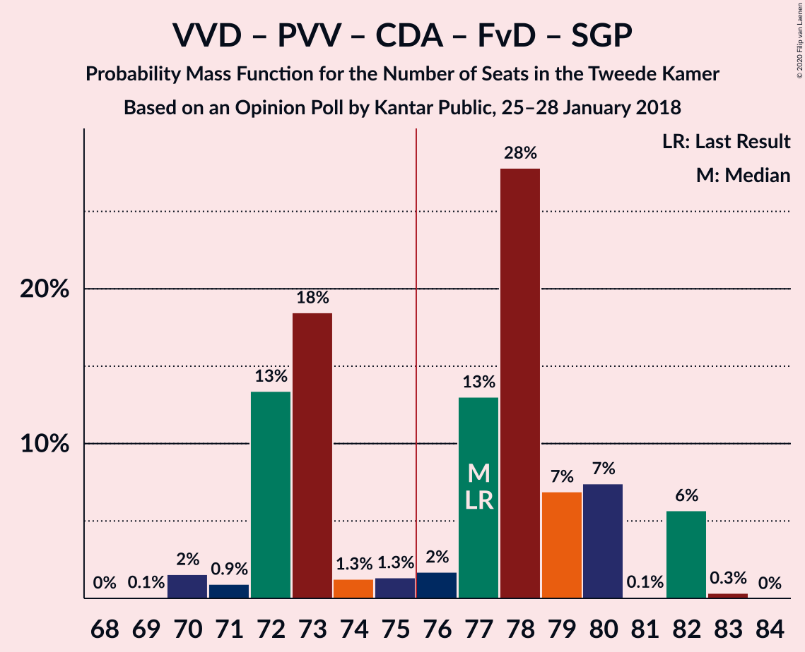

| Number of Seats | Probability | Accumulated | Special Marks |
|:---------------:|:-----------:|:-----------:|:-------------:|
| 72 | 29% | 100% |  |
| 73 | 13% | 71% |  |
| 74 | 0% | 58% |  |
| 75 | 0% | 58% |  |
| 76 | 0% | 58% | Majority |
| 77 | 4% | 58% | Last Result |
| 78 | 54% | 54% | Median |
| 79 | 0% | 0.3% |  |
| 80 | 0% | 0.3% |  |
| 81 | 0.1% | 0.2% |  |
| 82 | 0% | 0.1% |  |
| 83 | 0.1% | 0.1% |  |
| 84 | 0% | 0% |  |

### Volkspartij voor Vrijheid en Democratie – Partij voor de Vrijheid – Christen-Democratisch Appèl – Forum voor Democratie

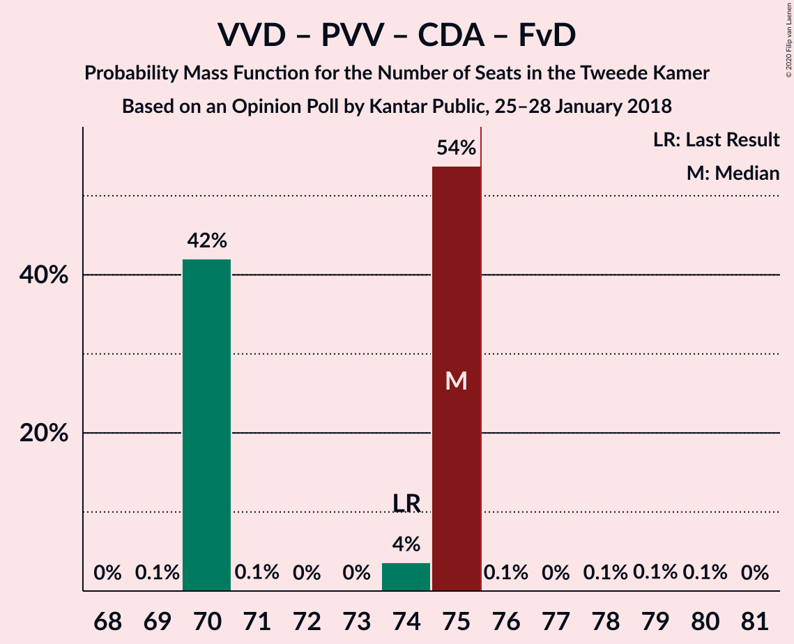

| Number of Seats | Probability | Accumulated | Special Marks |
|:---------------:|:-----------:|:-----------:|:-------------:|
| 69 | 0.1% | 100% |  |
| 70 | 42% | 99.9% |  |
| 71 | 0.1% | 58% |  |
| 72 | 0% | 58% |  |
| 73 | 0% | 58% |  |
| 74 | 4% | 58% | Last Result |
| 75 | 54% | 54% | Median |
| 76 | 0.1% | 0.3% | Majority |
| 77 | 0% | 0.3% |  |
| 78 | 0.1% | 0.3% |  |
| 79 | 0.1% | 0.2% |  |
| 80 | 0.1% | 0.1% |  |
| 81 | 0% | 0% |  |

### Volkspartij voor Vrijheid en Democratie – Democraten 66 – Christen-Democratisch Appèl – ChristenUnie

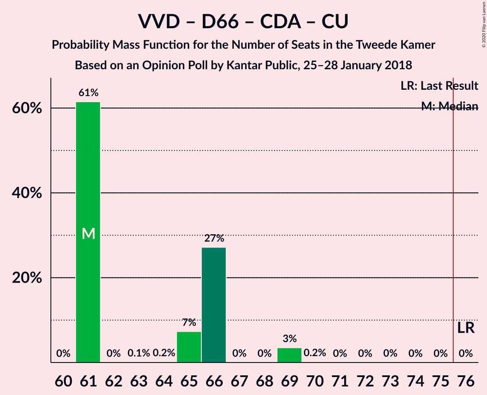

| Number of Seats | Probability | Accumulated | Special Marks |
|:---------------:|:-----------:|:-----------:|:-------------:|
| 61 | 61% | 100% | Median |
| 62 | 0% | 38% |  |
| 63 | 0.1% | 38% |  |
| 64 | 0.2% | 38% |  |
| 65 | 7% | 38% |  |
| 66 | 27% | 31% |  |
| 67 | 0% | 4% |  |
| 68 | 0% | 4% |  |
| 69 | 3% | 4% |  |
| 70 | 0.2% | 0.2% |  |
| 71 | 0% | 0.1% |  |
| 72 | 0% | 0.1% |  |
| 73 | 0% | 0% |  |
| 74 | 0% | 0% |  |
| 75 | 0% | 0% |  |
| 76 | 0% | 0% | Last Result, Majority |

### Democraten 66 – GroenLinks – Christen-Democratisch Appèl – Partij van de Arbeid – ChristenUnie

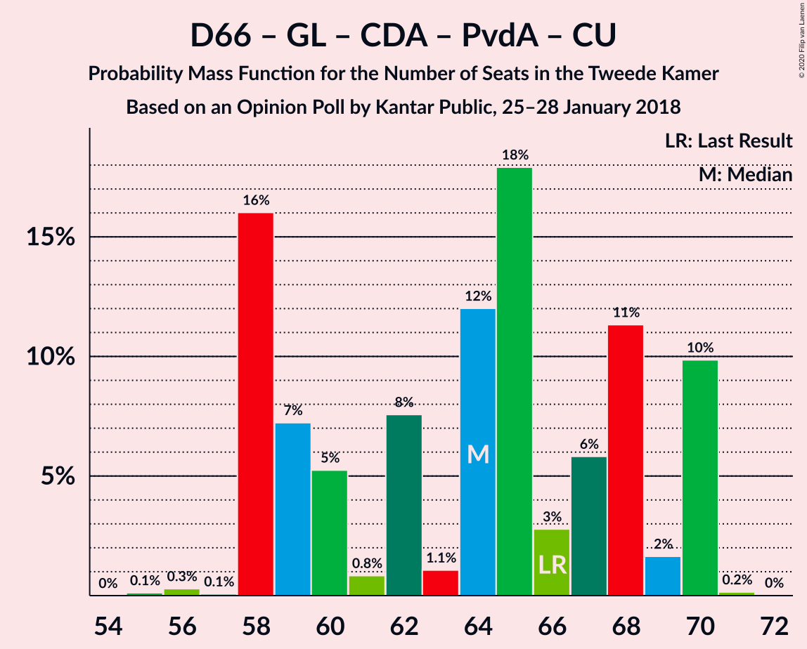

| Number of Seats | Probability | Accumulated | Special Marks |
|:---------------:|:-----------:|:-----------:|:-------------:|
| 56 | 0.1% | 100% |  |
| 57 | 0% | 99.9% |  |
| 58 | 54% | 99.9% | Median |
| 59 | 0.1% | 46% |  |
| 60 | 0% | 46% |  |
| 61 | 0% | 46% |  |
| 62 | 0.1% | 46% |  |
| 63 | 0.1% | 46% |  |
| 64 | 8% | 46% |  |
| 65 | 13% | 38% |  |
| 66 | 0% | 25% | Last Result |
| 67 | 0% | 25% |  |
| 68 | 22% | 25% |  |
| 69 | 3% | 4% |  |
| 70 | 0% | 0% |  |

### Volkspartij voor Vrijheid en Democratie – Democraten 66 – Christen-Democratisch Appèl

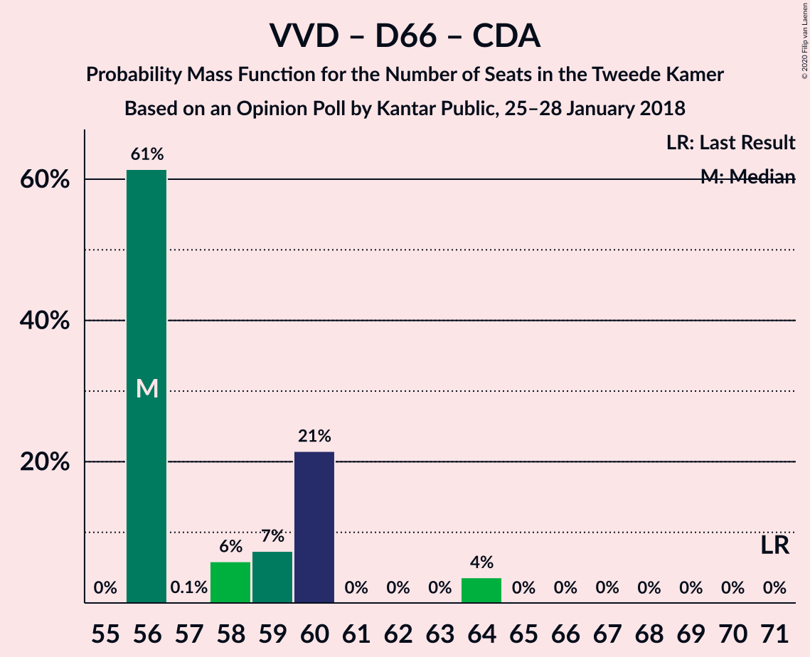

| Number of Seats | Probability | Accumulated | Special Marks |
|:---------------:|:-----------:|:-----------:|:-------------:|
| 55 | 0% | 100% |  |
| 56 | 61% | 99.9% | Median |
| 57 | 0.1% | 39% |  |
| 58 | 6% | 38% |  |
| 59 | 7% | 33% |  |
| 60 | 21% | 25% |  |
| 61 | 0% | 4% |  |
| 62 | 0% | 4% |  |
| 63 | 0% | 4% |  |
| 64 | 4% | 4% |  |
| 65 | 0% | 0.1% |  |
| 66 | 0% | 0.1% |  |
| 67 | 0% | 0.1% |  |
| 68 | 0% | 0% |  |
| 69 | 0% | 0% |  |
| 70 | 0% | 0% |  |
| 71 | 0% | 0% | Last Result |

### Volkspartij voor Vrijheid en Democratie – Partij voor de Vrijheid – Christen-Democratisch Appèl

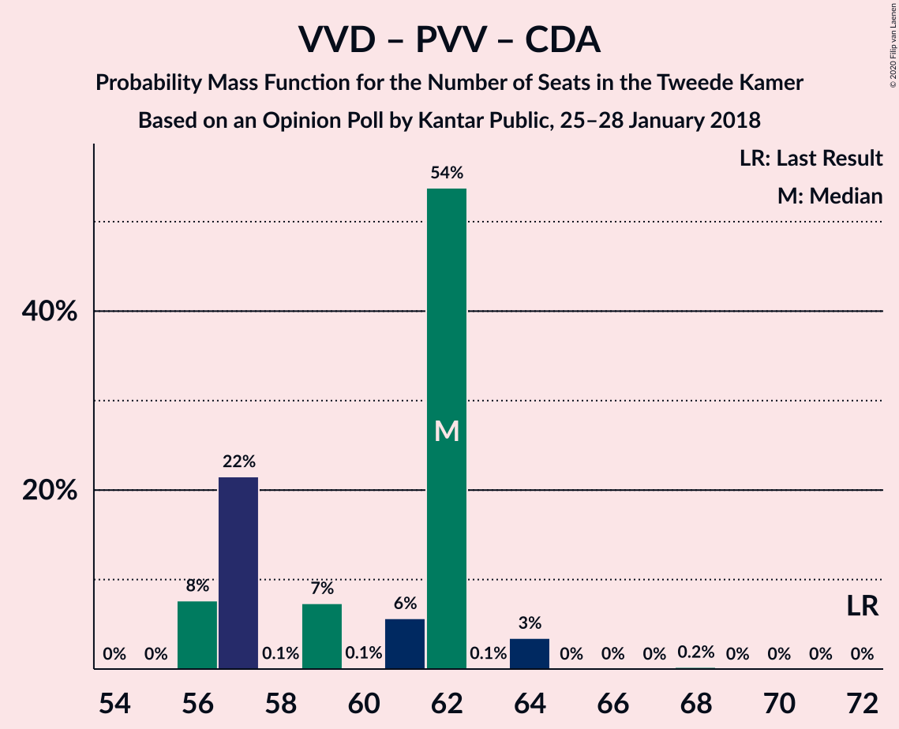

| Number of Seats | Probability | Accumulated | Special Marks |
|:---------------:|:-----------:|:-----------:|:-------------:|
| 56 | 8% | 100% |  |
| 57 | 22% | 92% |  |
| 58 | 0.1% | 71% |  |
| 59 | 7% | 71% |  |
| 60 | 0.1% | 63% |  |
| 61 | 6% | 63% |  |
| 62 | 54% | 58% | Median |
| 63 | 0.1% | 4% |  |
| 64 | 3% | 4% |  |
| 65 | 0% | 0.3% |  |
| 66 | 0% | 0.3% |  |
| 67 | 0% | 0.2% |  |
| 68 | 0.2% | 0.2% |  |
| 69 | 0% | 0% |  |
| 70 | 0% | 0% |  |
| 71 | 0% | 0% |  |
| 72 | 0% | 0% | Last Result |

### Volkspartij voor Vrijheid en Democratie – Christen-Democratisch Appèl – Forum voor Democratie – 50Plus – Staatkundig Gereformeerde Partij

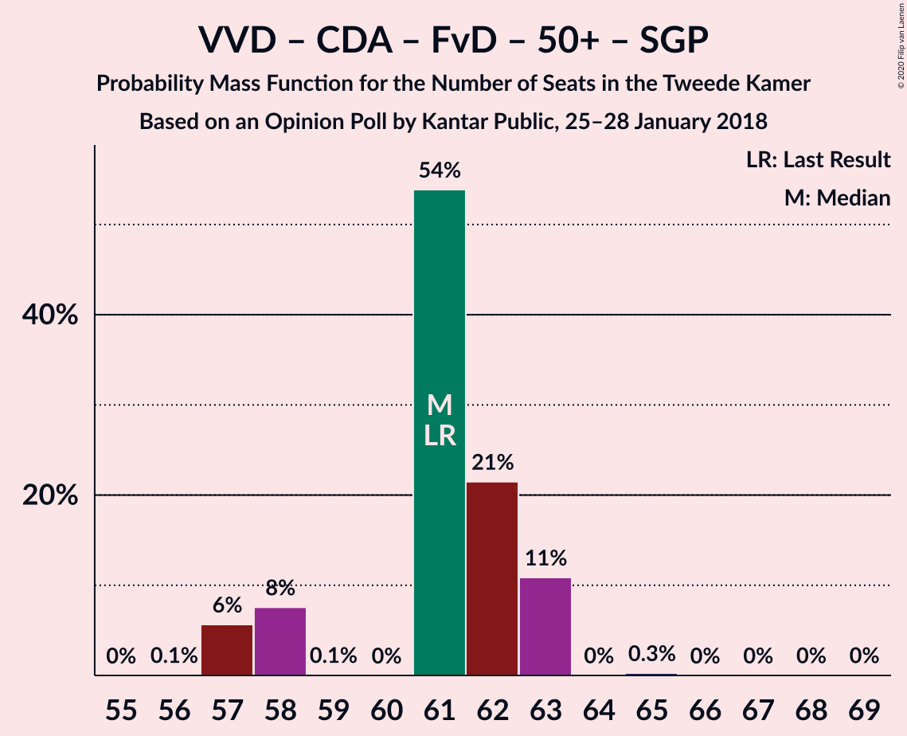

| Number of Seats | Probability | Accumulated | Special Marks |
|:---------------:|:-----------:|:-----------:|:-------------:|
| 56 | 0.1% | 100% |  |
| 57 | 6% | 99.9% |  |
| 58 | 8% | 94% |  |
| 59 | 0.1% | 87% |  |
| 60 | 0% | 87% |  |
| 61 | 54% | 87% | Last Result, Median |
| 62 | 21% | 33% |  |
| 63 | 11% | 11% |  |
| 64 | 0% | 0.4% |  |
| 65 | 0.3% | 0.4% |  |
| 66 | 0% | 0.1% |  |
| 67 | 0% | 0.1% |  |
| 68 | 0% | 0.1% |  |
| 69 | 0% | 0% |  |

### Volkspartij voor Vrijheid en Democratie – Christen-Democratisch Appèl – Forum voor Democratie – 50Plus

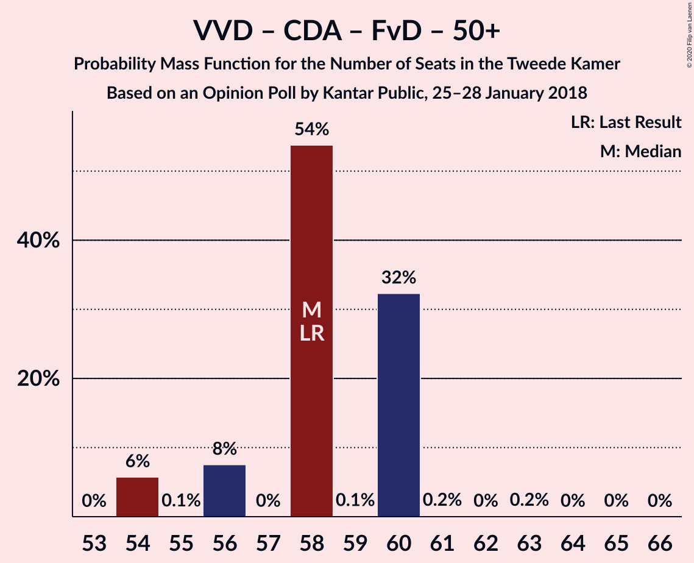

| Number of Seats | Probability | Accumulated | Special Marks |
|:---------------:|:-----------:|:-----------:|:-------------:|
| 54 | 6% | 100% |  |
| 55 | 0.1% | 94% |  |
| 56 | 8% | 94% |  |
| 57 | 0% | 87% |  |
| 58 | 54% | 87% | Last Result, Median |
| 59 | 0.1% | 33% |  |
| 60 | 32% | 33% |  |
| 61 | 0.2% | 0.4% |  |
| 62 | 0% | 0.3% |  |
| 63 | 0.2% | 0.2% |  |
| 64 | 0% | 0.1% |  |
| 65 | 0% | 0.1% |  |
| 66 | 0% | 0% |  |

### Volkspartij voor Vrijheid en Democratie – Democraten 66 – Partij van de Arbeid

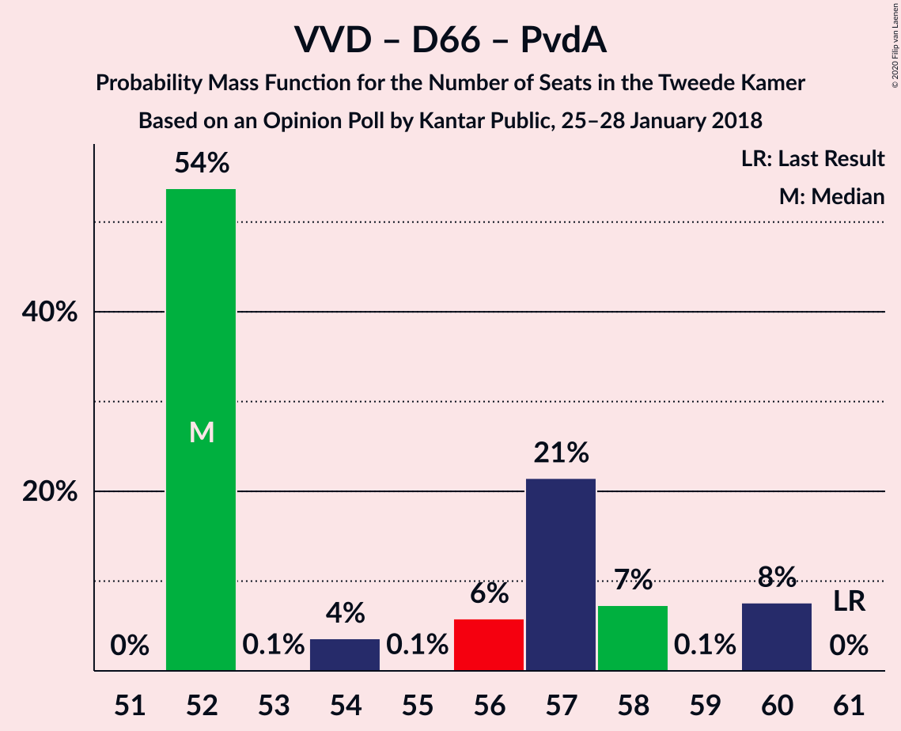

| Number of Seats | Probability | Accumulated | Special Marks |
|:---------------:|:-----------:|:-----------:|:-------------:|
| 52 | 54% | 100% | Median |
| 53 | 0.1% | 46% |  |
| 54 | 4% | 46% |  |
| 55 | 0.1% | 42% |  |
| 56 | 6% | 42% |  |
| 57 | 21% | 37% |  |
| 58 | 7% | 15% |  |
| 59 | 0.1% | 8% |  |
| 60 | 8% | 8% |  |
| 61 | 0% | 0% | Last Result |

### Volkspartij voor Vrijheid en Democratie – Christen-Democratisch Appèl – Forum voor Democratie – Staatkundig Gereformeerde Partij

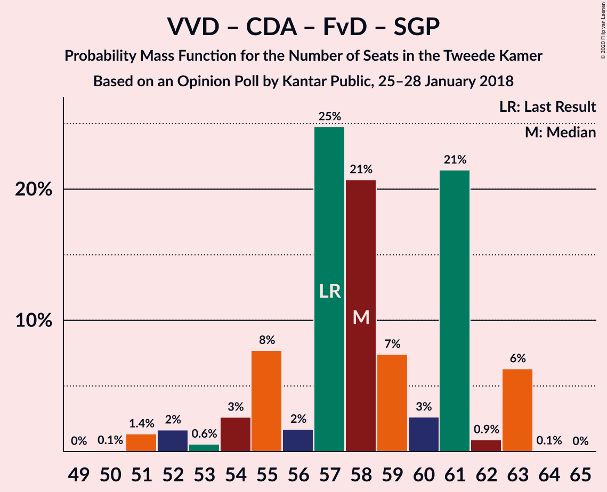

| Number of Seats | Probability | Accumulated | Special Marks |
|:---------------:|:-----------:|:-----------:|:-------------:|
| 52 | 6% | 100% |  |
| 53 | 0.1% | 94% |  |
| 54 | 0% | 94% |  |
| 55 | 8% | 94% |  |
| 56 | 0% | 87% |  |
| 57 | 54% | 87% | Last Result, Median |
| 58 | 29% | 33% |  |
| 59 | 3% | 4% |  |
| 60 | 0.2% | 0.5% |  |
| 61 | 0.1% | 0.3% |  |
| 62 | 0.1% | 0.1% |  |
| 63 | 0% | 0.1% |  |
| 64 | 0% | 0.1% |  |
| 65 | 0% | 0.1% |  |
| 66 | 0% | 0% |  |

### Volkspartij voor Vrijheid en Democratie – Christen-Democratisch Appèl – Partij van de Arbeid

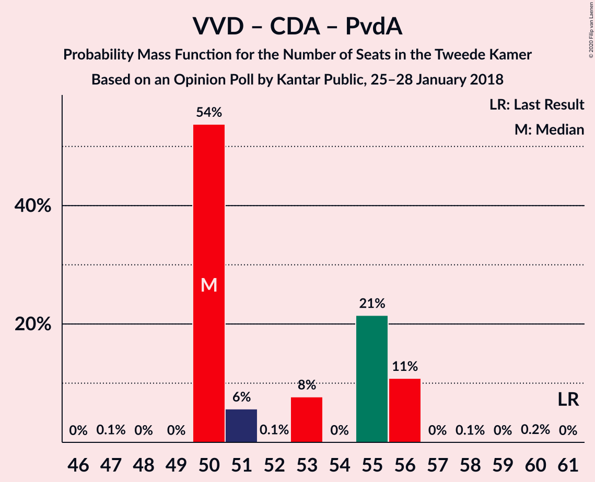

| Number of Seats | Probability | Accumulated | Special Marks |
|:---------------:|:-----------:|:-----------:|:-------------:|
| 47 | 0.1% | 100% |  |
| 48 | 0% | 99.9% |  |
| 49 | 0% | 99.9% |  |
| 50 | 54% | 99.8% | Median |
| 51 | 6% | 46% |  |
| 52 | 0.1% | 40% |  |
| 53 | 8% | 40% |  |
| 54 | 0% | 33% |  |
| 55 | 21% | 33% |  |
| 56 | 11% | 11% |  |
| 57 | 0% | 0.3% |  |
| 58 | 0.1% | 0.2% |  |
| 59 | 0% | 0.2% |  |
| 60 | 0.2% | 0.2% |  |
| 61 | 0% | 0% | Last Result |

### Volkspartij voor Vrijheid en Democratie – Christen-Democratisch Appèl – Forum voor Democratie

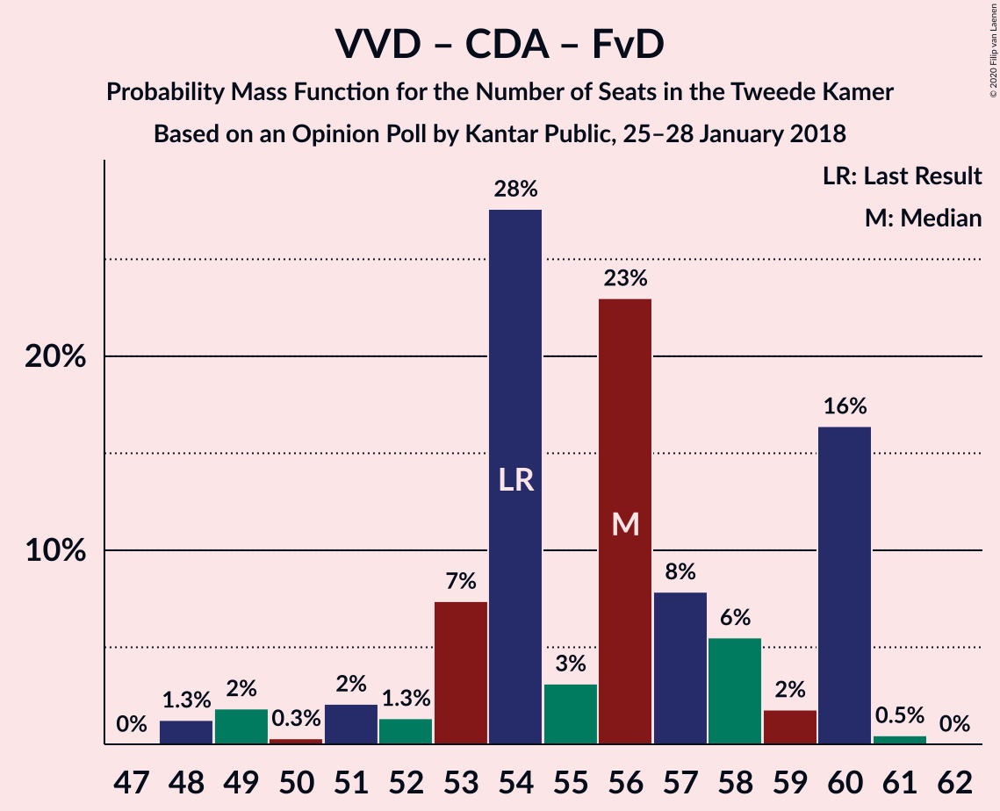

| Number of Seats | Probability | Accumulated | Special Marks |
|:---------------:|:-----------:|:-----------:|:-------------:|
| 49 | 6% | 100% |  |
| 50 | 0% | 94% |  |
| 51 | 0.1% | 94% |  |
| 52 | 0% | 94% |  |
| 53 | 8% | 94% |  |
| 54 | 54% | 87% | Last Result, Median |
| 55 | 7% | 33% |  |
| 56 | 25% | 25% |  |
| 57 | 0.1% | 0.4% |  |
| 58 | 0% | 0.3% |  |
| 59 | 0.2% | 0.3% |  |
| 60 | 0% | 0.1% |  |
| 61 | 0% | 0.1% |  |
| 62 | 0% | 0.1% |  |
| 63 | 0% | 0% |  |

### Democraten 66 – Christen-Democratisch Appèl – Partij van de Arbeid

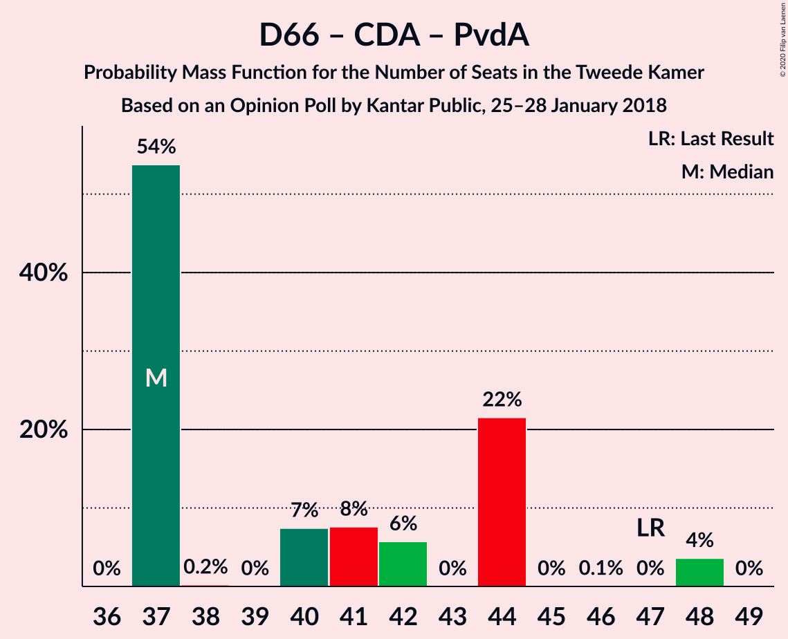

| Number of Seats | Probability | Accumulated | Special Marks |
|:---------------:|:-----------:|:-----------:|:-------------:|
| 37 | 54% | 100% | Median |
| 38 | 0.2% | 46% |  |
| 39 | 0% | 46% |  |
| 40 | 7% | 46% |  |
| 41 | 8% | 39% |  |
| 42 | 6% | 31% |  |
| 43 | 0% | 25% |  |
| 44 | 22% | 25% |  |
| 45 | 0% | 4% |  |
| 46 | 0.1% | 4% |  |
| 47 | 0% | 4% | Last Result |
| 48 | 4% | 4% |  |
| 49 | 0% | 0% |  |

### Volkspartij voor Vrijheid en Democratie – Christen-Democratisch Appèl

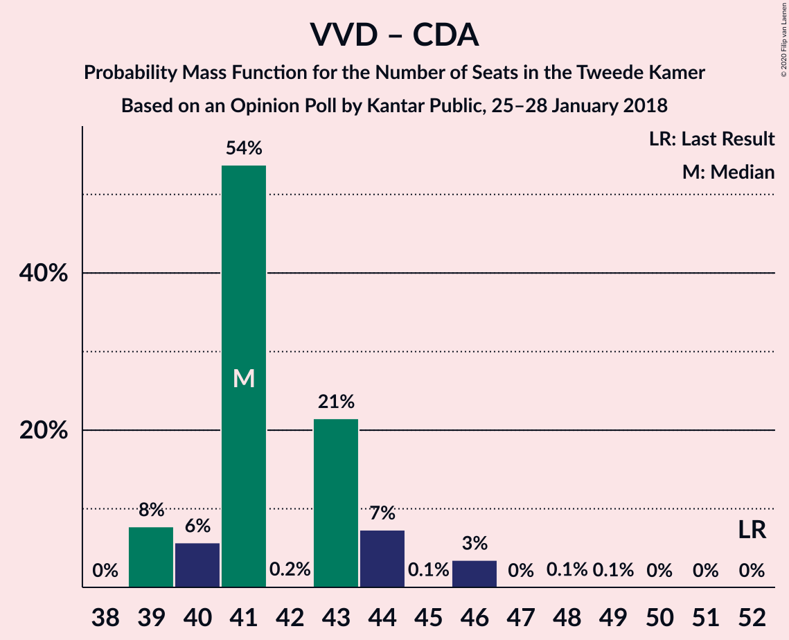

| Number of Seats | Probability | Accumulated | Special Marks |
|:---------------:|:-----------:|:-----------:|:-------------:|
| 39 | 8% | 100% |  |
| 40 | 6% | 92% |  |
| 41 | 54% | 87% | Median |
| 42 | 0.2% | 33% |  |
| 43 | 21% | 33% |  |
| 44 | 7% | 11% |  |
| 45 | 0.1% | 4% |  |
| 46 | 3% | 4% |  |
| 47 | 0% | 0.2% |  |
| 48 | 0.1% | 0.2% |  |
| 49 | 0.1% | 0.1% |  |
| 50 | 0% | 0% |  |
| 51 | 0% | 0% |  |
| 52 | 0% | 0% | Last Result |

### Volkspartij voor Vrijheid en Democratie – Partij van de Arbeid

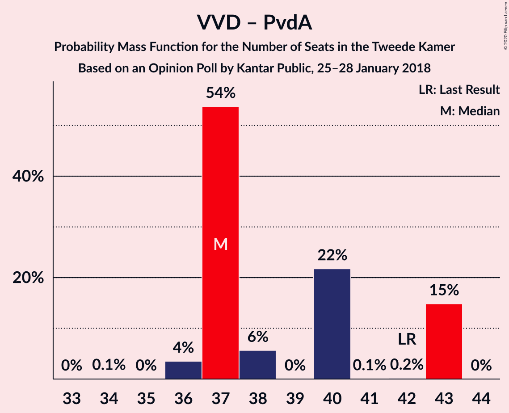

| Number of Seats | Probability | Accumulated | Special Marks |
|:---------------:|:-----------:|:-----------:|:-------------:|
| 34 | 0.1% | 100% |  |
| 35 | 0% | 99.9% |  |
| 36 | 4% | 99.8% |  |
| 37 | 54% | 96% | Median |
| 38 | 6% | 43% |  |
| 39 | 0% | 37% |  |
| 40 | 22% | 37% |  |
| 41 | 0.1% | 15% |  |
| 42 | 0.2% | 15% | Last Result |
| 43 | 15% | 15% |  |
| 44 | 0% | 0% |  |

### Democraten 66 – Christen-Democratisch Appèl

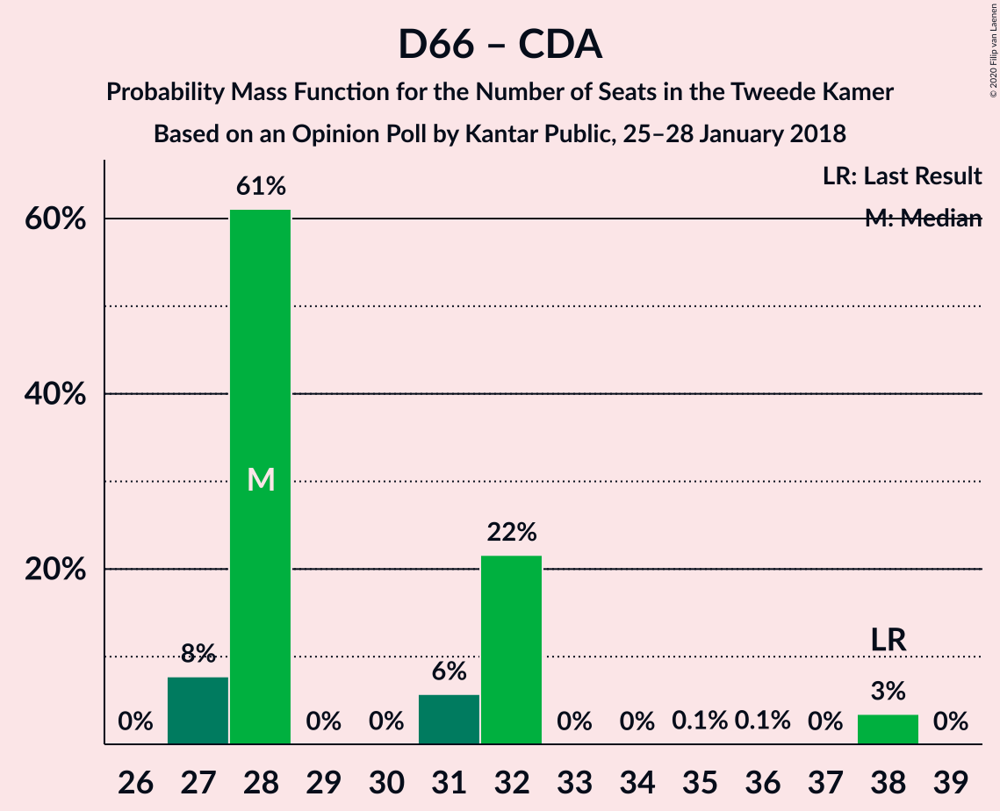

| Number of Seats | Probability | Accumulated | Special Marks |
|:---------------:|:-----------:|:-----------:|:-------------:|
| 27 | 8% | 100% |  |
| 28 | 61% | 92% | Median |
| 29 | 0% | 31% |  |
| 30 | 0% | 31% |  |
| 31 | 6% | 31% |  |
| 32 | 22% | 25% |  |
| 33 | 0% | 4% |  |
| 34 | 0% | 4% |  |
| 35 | 0.1% | 4% |  |
| 36 | 0.1% | 4% |  |
| 37 | 0% | 3% |  |
| 38 | 3% | 3% | Last Result |
| 39 | 0% | 0% |  |

### Christen-Democratisch Appèl – Partij van de Arbeid – ChristenUnie

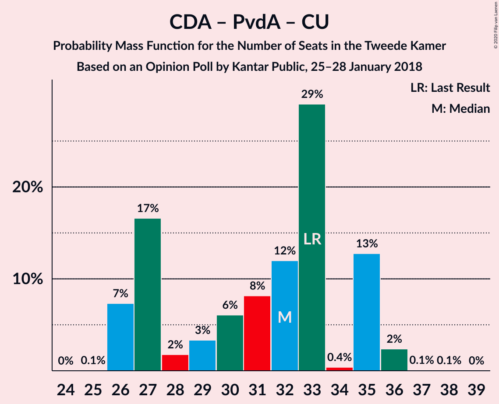

| Number of Seats | Probability | Accumulated | Special Marks |
|:---------------:|:-----------:|:-----------:|:-------------:|
| 27 | 54% | 100% | Median |
| 28 | 0% | 46% |  |
| 29 | 8% | 46% |  |
| 30 | 0.1% | 38% |  |
| 31 | 7% | 38% |  |
| 32 | 6% | 31% |  |
| 33 | 22% | 25% | Last Result |
| 34 | 0% | 4% |  |
| 35 | 3% | 4% |  |
| 36 | 0% | 0.2% |  |
| 37 | 0% | 0.1% |  |
| 38 | 0.1% | 0.1% |  |
| 39 | 0% | 0% |  |

### Christen-Democratisch Appèl – Partij van de Arbeid

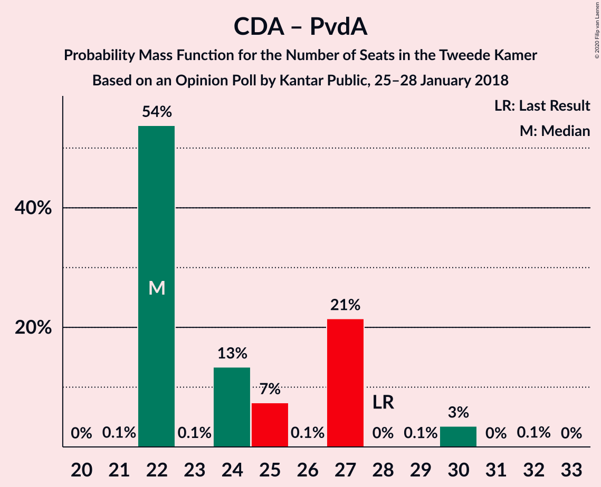

| Number of Seats | Probability | Accumulated | Special Marks |
|:---------------:|:-----------:|:-----------:|:-------------:|
| 21 | 0.1% | 100% |  |
| 22 | 54% | 99.9% | Median |
| 23 | 0.1% | 46% |  |
| 24 | 13% | 46% |  |
| 25 | 7% | 33% |  |
| 26 | 0.1% | 25% |  |
| 27 | 21% | 25% |  |
| 28 | 0% | 4% | Last Result |
| 29 | 0.1% | 4% |  |
| 30 | 3% | 4% |  |
| 31 | 0% | 0.1% |  |
| 32 | 0.1% | 0.1% |  |
| 33 | 0% | 0% |  |

## Technical Information

### Opinion Poll

+ **Polling firm:** Kantar Public
+ **Commissioner(s):** —
+ **Fieldwork period:** 25–28 January 2018

### Calculations

+ **Sample size:** 1156
+ **Simulations done:** 131,072
+ **Error estimate:** 4.39%

