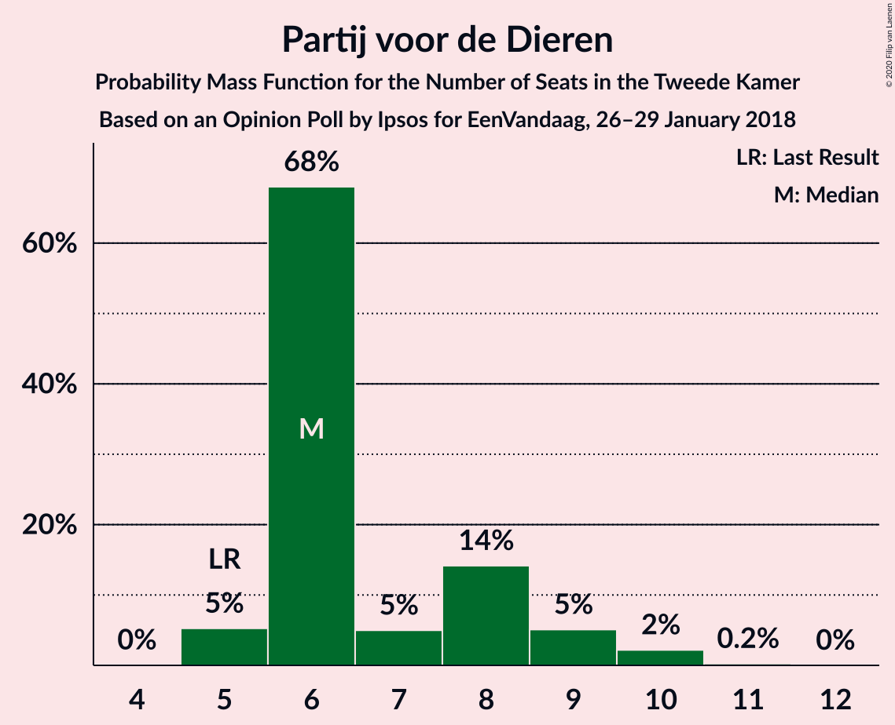
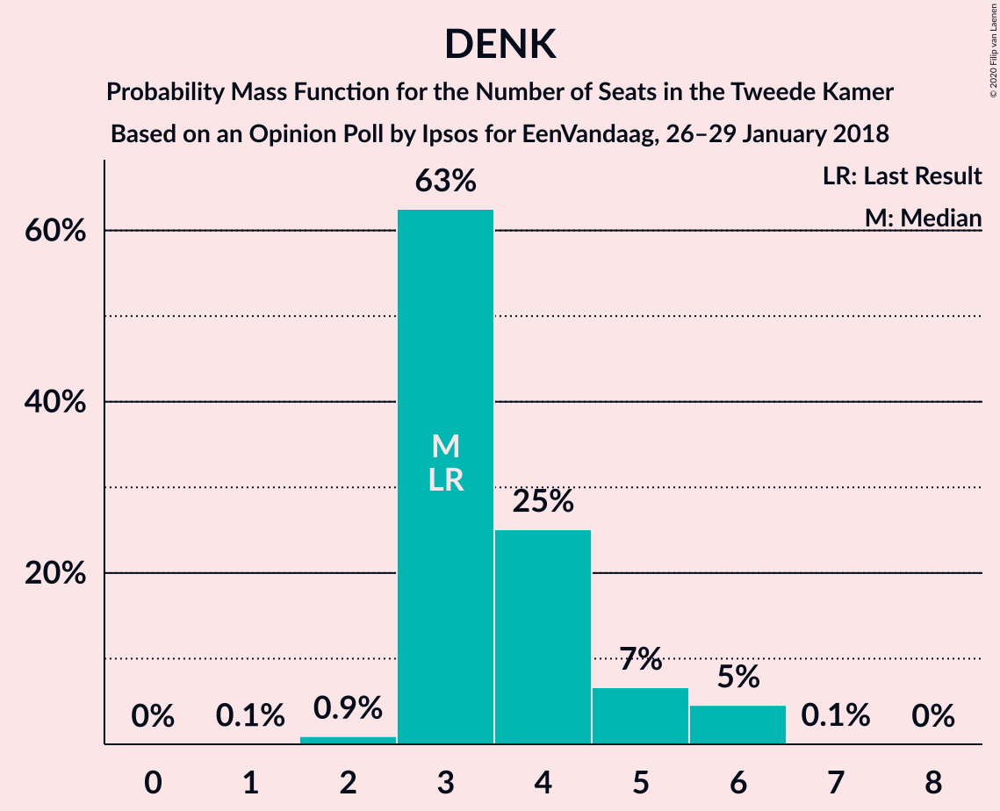
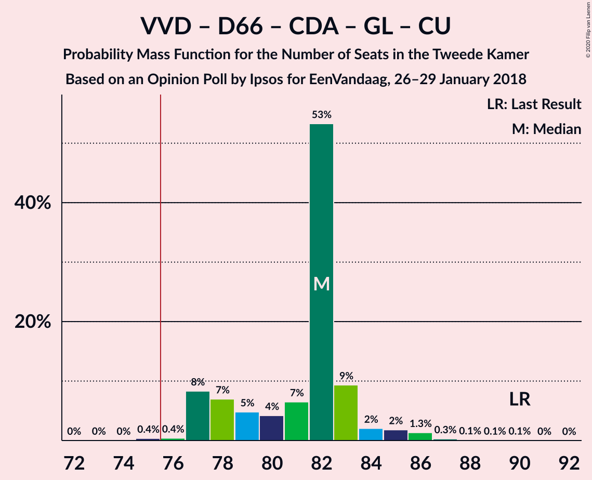
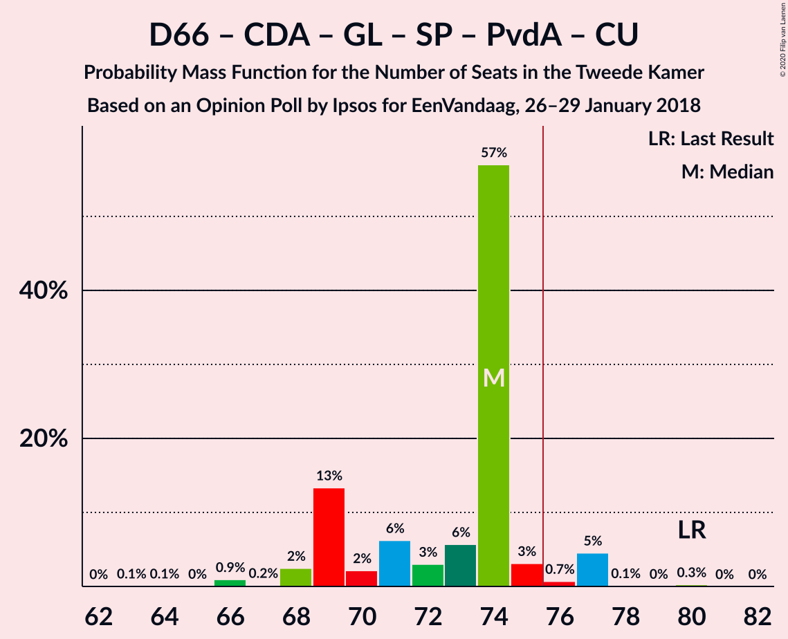
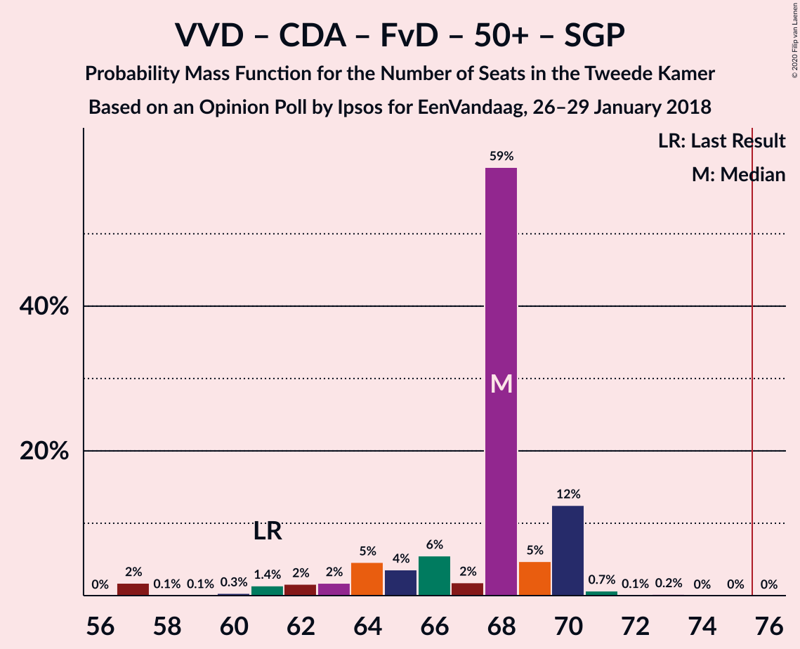
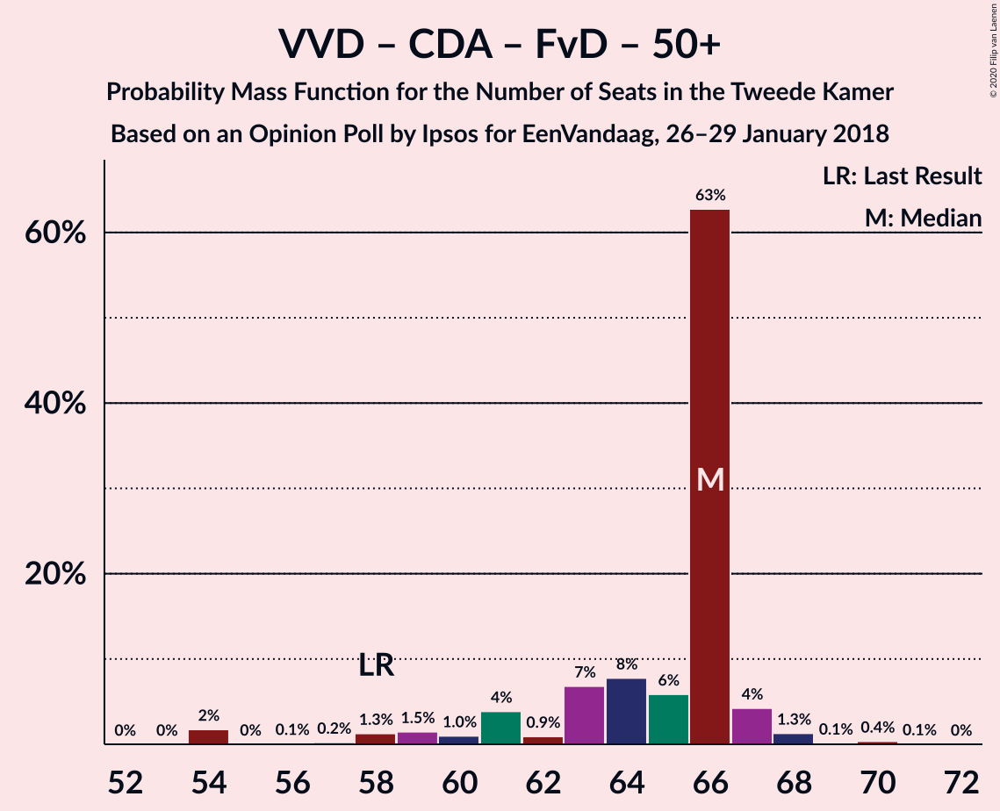
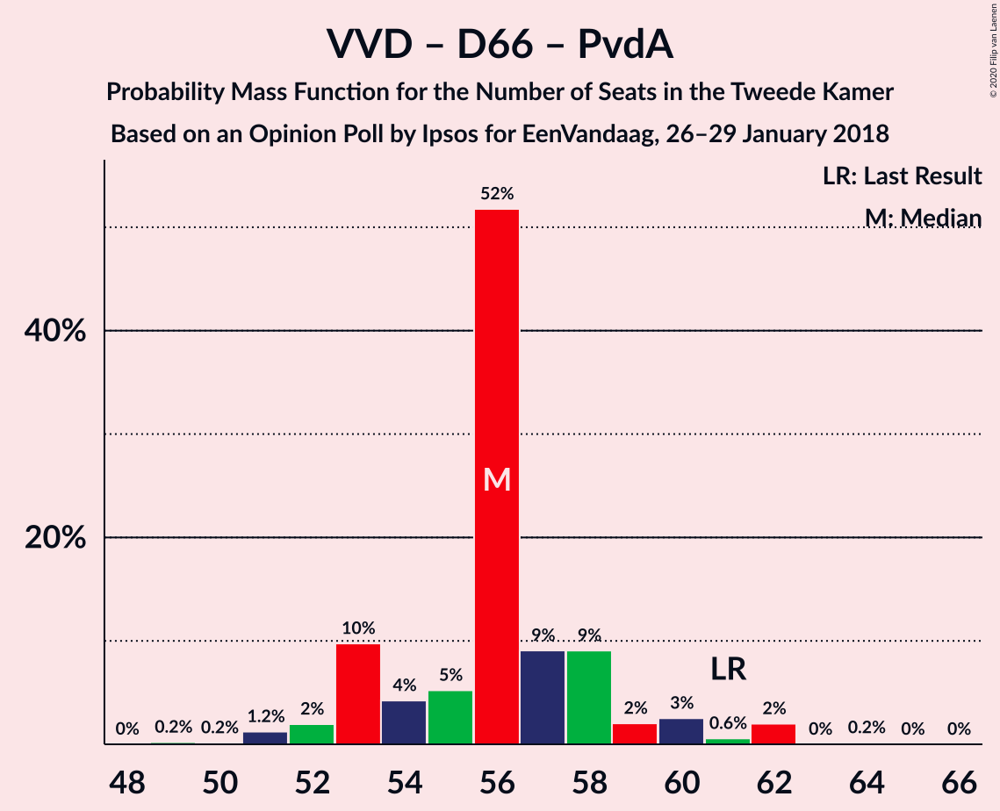
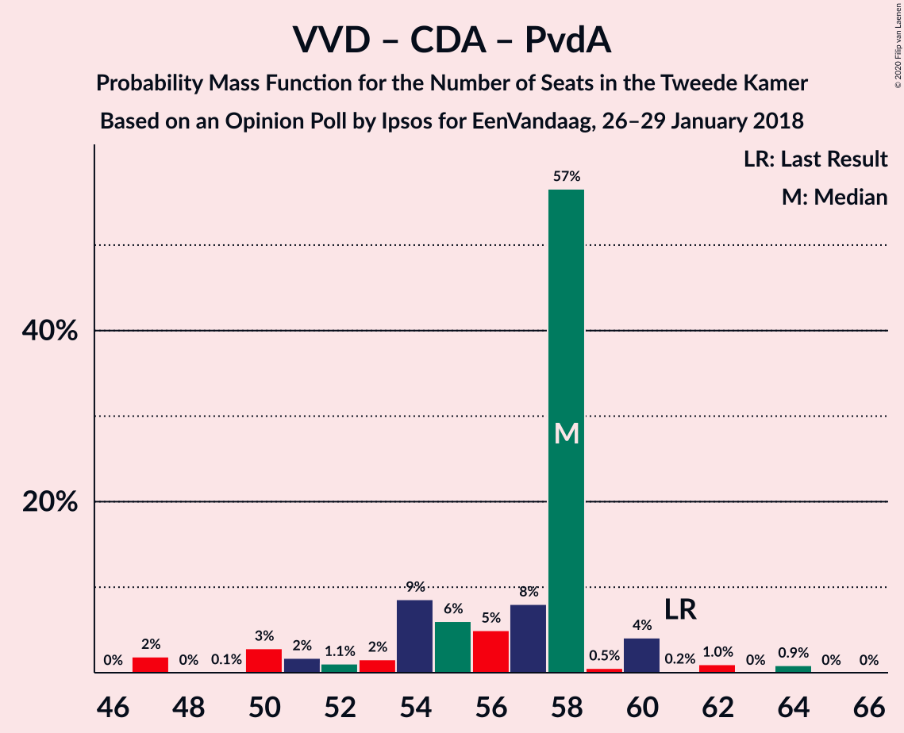
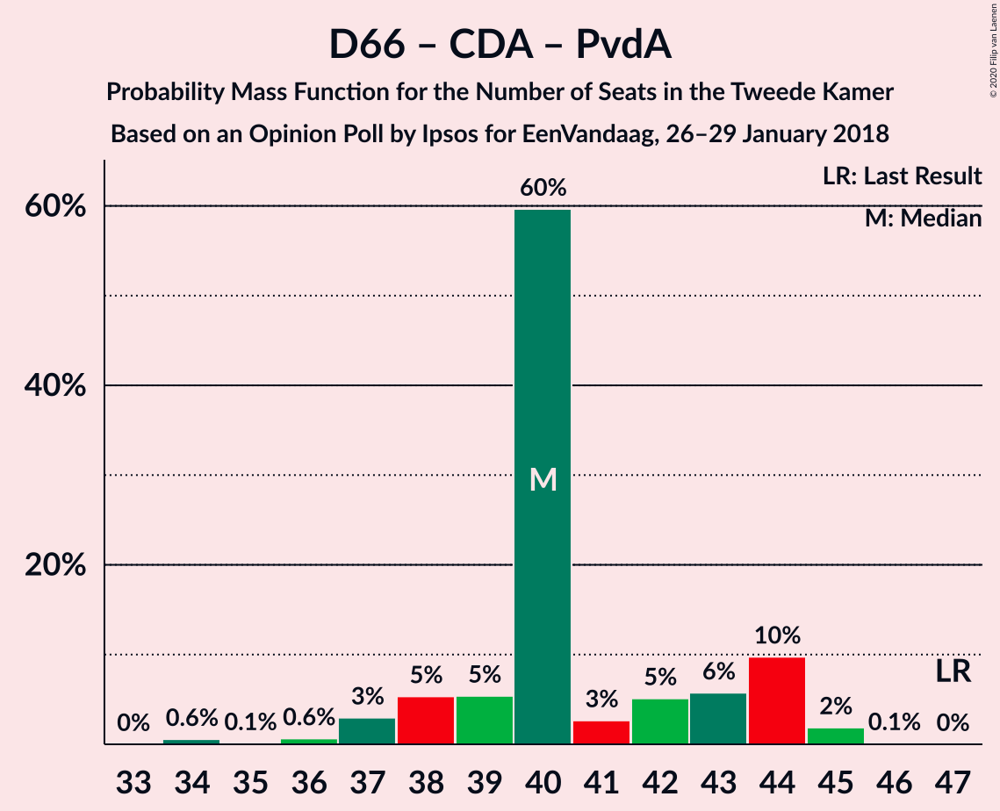
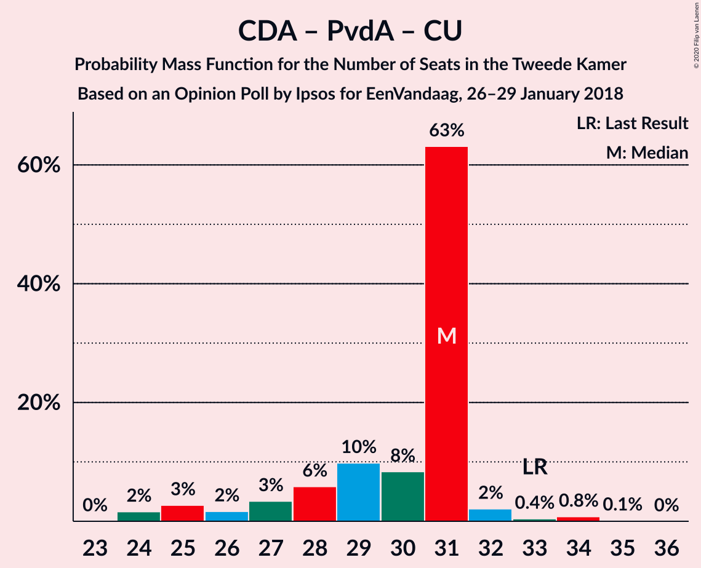

# Opinion Poll by Ipsos for EenVandaag, 26–29 January 2018

<a href="#voting-intentions">Voting Intentions</a> | <a href="#seats">Seats</a> | <a href="#coalitions">Coalitions</a> | <a href="#technical-information">Technical Information</a>

## Voting Intentions

### Confidence Intervals

| Party | Last Result | Poll Result | 80% Confidence Interval | 90% Confidence Interval | 95% Confidence Interval | 99% Confidence Interval |
|:-----:|:-----------:|:-----------:|:-----------------------:|:-----------------------:|:-----------------------:|:-----------------------:|
| Volkspartij voor Vrijheid en Democratie | 21.3% | 20.7% | 19.1–22.3% |18.7–22.8% |18.3–23.2% |17.6–24.1% |
| Partij voor de Vrijheid | 13.1% | 10.7% | 9.5–12.0% |9.2–12.4% |8.9–12.7% |8.4–13.4% |
| Democraten 66 | 12.2% | 10.7% | 9.5–12.0% |9.2–12.4% |8.9–12.7% |8.4–13.4% |
| Christen-Democratisch Appèl | 12.4% | 10.0% | 8.9–11.3% |8.6–11.6% |8.3–12.0% |7.8–12.6% |
| GroenLinks | 9.1% | 9.3% | 8.2–10.6% |8.0–10.9% |7.7–11.2% |7.2–11.9% |
| Socialistische Partij | 9.1% | 8.6% | 7.6–9.9% |7.3–10.2% |7.1–10.5% |6.6–11.1% |
| Forum voor Democratie | 1.8% | 8.0% | 7.0–9.2% |6.7–9.5% |6.5–9.8% |6.0–10.4% |
| Partij van de Arbeid | 5.7% | 6.0% | 5.1–7.0% |4.9–7.3% |4.7–7.6% |4.3–8.1% |
| Partij voor de Dieren | 3.2% | 4.7% | 4.0–5.7% |3.7–5.9% |3.6–6.2% |3.2–6.7% |
| ChristenUnie | 3.4% | 3.4% | 2.7–4.2% |2.6–4.4% |2.4–4.6% |2.2–5.1% |
| 50Plus | 3.1% | 3.4% | 2.7–4.2% |2.6–4.4% |2.4–4.6% |2.2–5.1% |
| DENK | 2.1% | 2.7% | 2.1–3.5% |2.0–3.7% |1.9–3.9% |1.6–4.3% |
| Staatkundig Gereformeerde Partij | 2.1% | 2.0% | 1.6–2.7% |1.4–2.9% |1.3–3.1% |1.1–3.4% |

*Note:* The poll result column reflects the actual value used in the calculations. Published results may vary slightly, and in addition be rounded to fewer digits.

## Seats

### Confidence Intervals

| Party | Last Result | Median | 80% Confidence Interval | 90% Confidence Interval | 95% Confidence Interval | 99% Confidence Interval |
|:-----:|:-----------:|:------:|:-----------------------:|:-----------------------:|:-----------------------:|:-----------------------:|
| <a href="#volkspartij-voor-vrijheid-en-democratie">Volkspartij voor Vrijheid en Democratie</a> | 33 | 32 | 29–32 |29–33 |28–35 |26–36 |
| <a href="#partij-voor-de-vrijheid">Partij voor de Vrijheid</a> | 20 | 15 | 14–18 |13–19 |11–19 |11–20 |
| <a href="#democraten-66">Democraten 66</a> | 19 | 14 | 14–17 |14–19 |14–19 |13–19 |
| <a href="#christen-democratisch-appèl">Christen-Democratisch Appèl</a> | 19 | 16 | 14–17 |13–17 |12–18 |11–18 |
| <a href="#groenlinks">GroenLinks</a> | 14 | 15 | 13–15 |12–16 |11–17 |10–18 |
| <a href="#socialistische-partij">Socialistische Partij</a> | 14 | 14 | 12–14 |11–15 |10–15 |9–16 |
| <a href="#forum-voor-democratie">Forum voor Democratie</a> | 2 | 14 | 11–14 |11–15 |10–15 |9–15 |
| <a href="#partij-van-de-arbeid">Partij van de Arbeid</a> | 9 | 10 | 8–11 |7–12 |7–12 |6–13 |
| <a href="#partij-voor-de-dieren">Partij voor de Dieren</a> | 5 | 6 | 6–8 |5–9 |5–9 |5–10 |
| <a href="#christenunie">ChristenUnie</a> | 5 | 5 | 3–5 |3–6 |3–6 |2–7 |
| <a href="#50plus">50Plus</a> | 4 | 4 | 4–6 |4–6 |3–6 |3–7 |
| <a href="#denk">DENK</a> | 3 | 3 | 3–5 |3–5 |3–6 |2–6 |
| <a href="#staatkundig-gereformeerde-partij">Staatkundig Gereformeerde Partij</a> | 3 | 2 | 2–4 |1–4 |1–4 |1–5 |

### Volkspartij voor Vrijheid en Democratie

*For a full overview of the results for this party, see the [Volkspartij voor Vrijheid en Democratie](party-volkspartijvoorvrijheidendemocratie.html) page.*

| Number of Seats | Probability | Accumulated | Special Marks |
|:---------------:|:-----------:|:-----------:|:-------------:|
| 26 | 2% | 100% |  |
| 27 | 0.5% | 98% |  |
| 28 | 2% | 98% |  |
| 29 | 15% | 96% |  |
| 30 | 8% | 81% |  |
| 31 | 1.3% | 73% |  |
| 32 | 64% | 71% | Median |
| 33 | 3% | 7% | Last Result |
| 34 | 2% | 5% |  |
| 35 | 1.3% | 3% |  |
| 36 | 1.3% | 2% |  |
| 37 | 0.1% | 0.3% |  |
| 38 | 0% | 0.2% |  |
| 39 | 0.1% | 0.1% |  |
| 40 | 0% | 0% |  |

### Partij voor de Vrijheid

*For a full overview of the results for this party, see the [Partij voor de Vrijheid](party-partijvoordevrijheid.html) page.*

| Number of Seats | Probability | Accumulated | Special Marks |
|:---------------:|:-----------:|:-----------:|:-------------:|
| 11 | 4% | 100% |  |
| 12 | 0.2% | 96% |  |
| 13 | 6% | 96% |  |
| 14 | 5% | 90% |  |
| 15 | 54% | 85% | Median |
| 16 | 3% | 31% |  |
| 17 | 18% | 28% |  |
| 18 | 5% | 11% |  |
| 19 | 4% | 6% |  |
| 20 | 0.9% | 1.4% | Last Result |
| 21 | 0.1% | 0.4% |  |
| 22 | 0.3% | 0.4% |  |
| 23 | 0% | 0% |  |

### Democraten 66

*For a full overview of the results for this party, see the [Democraten 66](party-democraten66.html) page.*

| Number of Seats | Probability | Accumulated | Special Marks |
|:---------------:|:-----------:|:-----------:|:-------------:|
| 11 | 0.1% | 100% |  |
| 12 | 0.1% | 99.9% |  |
| 13 | 0.8% | 99.8% |  |
| 14 | 58% | 99.1% | Median |
| 15 | 12% | 41% |  |
| 16 | 13% | 29% |  |
| 17 | 7% | 16% |  |
| 18 | 1.2% | 9% |  |
| 19 | 8% | 8% | Last Result |
| 20 | 0.4% | 0.5% |  |
| 21 | 0% | 0.1% |  |
| 22 | 0% | 0% |  |

### Christen-Democratisch Appèl

*For a full overview of the results for this party, see the [Christen-Democratisch Appèl](party-christen-democratischappèl.html) page.*

| Number of Seats | Probability | Accumulated | Special Marks |
|:---------------:|:-----------:|:-----------:|:-------------:|
| 11 | 0.6% | 100% |  |
| 12 | 2% | 99.4% |  |
| 13 | 4% | 97% |  |
| 14 | 3% | 93% |  |
| 15 | 4% | 90% |  |
| 16 | 73% | 86% | Median |
| 17 | 10% | 13% |  |
| 18 | 2% | 3% |  |
| 19 | 0.1% | 0.2% | Last Result |
| 20 | 0.1% | 0.1% |  |
| 21 | 0% | 0% |  |

### GroenLinks

*For a full overview of the results for this party, see the [GroenLinks](party-groenlinks.html) page.*

| Number of Seats | Probability | Accumulated | Special Marks |
|:---------------:|:-----------:|:-----------:|:-------------:|
| 10 | 1.0% | 100% |  |
| 11 | 3% | 99.0% |  |
| 12 | 4% | 96% |  |
| 13 | 16% | 92% |  |
| 14 | 16% | 76% | Last Result |
| 15 | 53% | 60% | Median |
| 16 | 4% | 8% |  |
| 17 | 2% | 4% |  |
| 18 | 1.2% | 2% |  |
| 19 | 0.4% | 0.4% |  |
| 20 | 0% | 0% |  |

### Socialistische Partij

*For a full overview of the results for this party, see the [Socialistische Partij](party-socialistischepartij.html) page.*

| Number of Seats | Probability | Accumulated | Special Marks |
|:---------------:|:-----------:|:-----------:|:-------------:|
| 9 | 0.5% | 100% |  |
| 10 | 3% | 99.5% |  |
| 11 | 6% | 97% |  |
| 12 | 13% | 91% |  |
| 13 | 15% | 78% |  |
| 14 | 57% | 64% | Last Result, Median |
| 15 | 5% | 6% |  |
| 16 | 1.2% | 2% |  |
| 17 | 0.1% | 0.3% |  |
| 18 | 0.2% | 0.2% |  |
| 19 | 0% | 0% |  |

### Forum voor Democratie

*For a full overview of the results for this party, see the [Forum voor Democratie](party-forumvoordemocratie.html) page.*

| Number of Seats | Probability | Accumulated | Special Marks |
|:---------------:|:-----------:|:-----------:|:-------------:|
| 2 | 0% | 100% | Last Result |
| 3 | 0% | 100% |  |
| 4 | 0% | 100% |  |
| 5 | 0% | 100% |  |
| 6 | 0% | 100% |  |
| 7 | 0% | 100% |  |
| 8 | 0.1% | 100% |  |
| 9 | 2% | 99.9% |  |
| 10 | 2% | 98% |  |
| 11 | 10% | 96% |  |
| 12 | 14% | 86% |  |
| 13 | 12% | 72% |  |
| 14 | 52% | 60% | Median |
| 15 | 8% | 8% |  |
| 16 | 0.3% | 0.4% |  |
| 17 | 0% | 0.1% |  |
| 18 | 0.1% | 0.1% |  |
| 19 | 0% | 0% |  |

### Partij van de Arbeid

*For a full overview of the results for this party, see the [Partij van de Arbeid](party-partijvandearbeid.html) page.*

| Number of Seats | Probability | Accumulated | Special Marks |
|:---------------:|:-----------:|:-----------:|:-------------:|
| 6 | 1.3% | 100% |  |
| 7 | 5% | 98.6% |  |
| 8 | 5% | 93% |  |
| 9 | 23% | 88% | Last Result |
| 10 | 53% | 65% | Median |
| 11 | 6% | 12% |  |
| 12 | 5% | 6% |  |
| 13 | 0.5% | 0.5% |  |
| 14 | 0% | 0% |  |

### Partij voor de Dieren

*For a full overview of the results for this party, see the [Partij voor de Dieren](party-partijvoordedieren.html) page.*

| Number of Seats | Probability | Accumulated | Special Marks |
|:---------------:|:-----------:|:-----------:|:-------------:|
| 5 | 5% | 100% | Last Result |
| 6 | 68% | 95% | Median |
| 7 | 5% | 27% |  |
| 8 | 14% | 22% |  |
| 9 | 5% | 8% |  |
| 10 | 2% | 2% |  |
| 11 | 0.2% | 0.2% |  |
| 12 | 0% | 0% |  |

### ChristenUnie

*For a full overview of the results for this party, see the [ChristenUnie](party-christenunie.html) page.*

| Number of Seats | Probability | Accumulated | Special Marks |
|:---------------:|:-----------:|:-----------:|:-------------:|
| 2 | 1.3% | 100% |  |
| 3 | 13% | 98.7% |  |
| 4 | 13% | 86% |  |
| 5 | 65% | 73% | Last Result, Median |
| 6 | 7% | 8% |  |
| 7 | 0.8% | 1.1% |  |
| 8 | 0.3% | 0.4% |  |
| 9 | 0% | 0% |  |

### 50Plus

*For a full overview of the results for this party, see the [50Plus](party-50plus.html) page.*

| Number of Seats | Probability | Accumulated | Special Marks |
|:---------------:|:-----------:|:-----------:|:-------------:|
| 3 | 3% | 100% |  |
| 4 | 61% | 97% | Last Result, Median |
| 5 | 13% | 36% |  |
| 6 | 22% | 24% |  |
| 7 | 2% | 2% |  |
| 8 | 0.1% | 0.1% |  |
| 9 | 0% | 0% |  |

### DENK

*For a full overview of the results for this party, see the [DENK](party-denk.html) page.*

| Number of Seats | Probability | Accumulated | Special Marks |
|:---------------:|:-----------:|:-----------:|:-------------:|
| 1 | 0.1% | 100% |  |
| 2 | 0.9% | 99.9% |  |
| 3 | 63% | 99.0% | Last Result, Median |
| 4 | 25% | 36% |  |
| 5 | 7% | 11% |  |
| 6 | 5% | 5% |  |
| 7 | 0.1% | 0.1% |  |
| 8 | 0% | 0% |  |

### Staatkundig Gereformeerde Partij

*For a full overview of the results for this party, see the [Staatkundig Gereformeerde Partij](party-staatkundiggereformeerdepartij.html) page.*

| Number of Seats | Probability | Accumulated | Special Marks |
|:---------------:|:-----------:|:-----------:|:-------------:|
| 1 | 6% | 100% |  |
| 2 | 60% | 94% | Median |
| 3 | 18% | 35% | Last Result |
| 4 | 16% | 17% |  |
| 5 | 0.5% | 0.8% |  |
| 6 | 0.3% | 0.3% |  |
| 7 | 0% | 0% |  |

## Coalitions

### Confidence Intervals

| Coalition | Last Result | Median | Majority? | 80% Confidence Interval | 90% Confidence Interval | 95% Confidence Interval | 99% Confidence Interval |
|:---------:|:-----------:|:------:|:---------:|:-----------------------:|:-----------------------:|:-----------------------:|:-----------------------:|
| Volkspartij voor Vrijheid en Democratie – Democraten 66 – Christen-Democratisch Appèl – GroenLinks – ChristenUnie | 90 | 82 | 99.5% | 78–83 | 77–84 | 77–85 | 76–87 |
| Volkspartij voor Vrijheid en Democratie – Partij voor de Vrijheid – Christen-Democratisch Appèl – Forum voor Democratie – Staatkundig Gereformeerde Partij | 77 | 79 | 87% | 75–81 | 73–81 | 71–83 | 71–83 |
| Volkspartij voor Vrijheid en Democratie – Democraten 66 – Christen-Democratisch Appèl – Partij van de Arbeid – ChristenUnie | 85 | 77 | 79% | 73–79 | 72–80 | 71–81 | 70–83 |
| Volkspartij voor Vrijheid en Democratie – Partij voor de Vrijheid – Christen-Democratisch Appèl – Forum voor Democratie | 74 | 77 | 72% | 72–77 | 72–79 | 69–80 | 68–80 |
| Democraten 66 – Christen-Democratisch Appèl – GroenLinks – Socialistische Partij – Partij van de Arbeid – ChristenUnie | 80 | 74 | 6% | 69–74 | 69–76 | 68–77 | 66–77 |
| Volkspartij voor Vrijheid en Democratie – Democraten 66 – Christen-Democratisch Appèl – ChristenUnie | 76 | 67 | 0% | 64–70 | 64–70 | 62–72 | 61–73 |
| Volkspartij voor Vrijheid en Democratie – Christen-Democratisch Appèl – Forum voor Democratie – 50Plus – Staatkundig Gereformeerde Partij | 61 | 68 | 0% | 64–70 | 62–70 | 61–70 | 57–71 |
| Volkspartij voor Vrijheid en Democratie – Partij voor de Vrijheid – Christen-Democratisch Appèl | 72 | 63 | 0% | 59–65 | 59–67 | 57–68 | 56–69 |
| Volkspartij voor Vrijheid en Democratie – Christen-Democratisch Appèl – Forum voor Democratie – 50Plus | 58 | 66 | 0% | 62–66 | 60–67 | 58–67 | 54–69 |
| Volkspartij voor Vrijheid en Democratie – Democraten 66 – Christen-Democratisch Appèl | 71 | 62 | 0% | 60–65 | 60–66 | 57–67 | 55–69 |
| Volkspartij voor Vrijheid en Democratie – Christen-Democratisch Appèl – Forum voor Democratie – Staatkundig Gereformeerde Partij | 57 | 64 | 0% | 60–64 | 59–64 | 56–64 | 53–67 |
| Democraten 66 – Christen-Democratisch Appèl – GroenLinks – Partij van de Arbeid – ChristenUnie | 66 | 60 | 0% | 57–61 | 56–62 | 55–62 | 54–64 |
| Volkspartij voor Vrijheid en Democratie – Christen-Democratisch Appèl – Forum voor Democratie | 54 | 62 | 0% | 57–62 | 56–62 | 53–62 | 50–64 |
| Volkspartij voor Vrijheid en Democratie – Democraten 66 – Partij van de Arbeid | 61 | 56 | 0% | 53–58 | 53–60 | 52–61 | 51–62 |
| Volkspartij voor Vrijheid en Democratie – Christen-Democratisch Appèl – Partij van de Arbeid | 61 | 58 | 0% | 54–58 | 51–60 | 50–60 | 47–64 |
| Volkspartij voor Vrijheid en Democratie – Christen-Democratisch Appèl | 52 | 48 | 0% | 45–49 | 43–49 | 42–51 | 38–53 |
| Democraten 66 – Christen-Democratisch Appèl – Partij van de Arbeid | 47 | 40 | 0% | 39–44 | 38–44 | 37–44 | 34–45 |
| Volkspartij voor Vrijheid en Democratie – Partij van de Arbeid | 42 | 42 | 0% | 38–43 | 36–43 | 35–44 | 35–46 |
| Democraten 66 – Christen-Democratisch Appèl | 38 | 30 | 0% | 30–33 | 29–35 | 29–35 | 26–37 |
| Christen-Democratisch Appèl – Partij van de Arbeid – ChristenUnie | 33 | 31 | 0% | 28–31 | 26–31 | 25–32 | 24–34 |
| Christen-Democratisch Appèl – Partij van de Arbeid | 28 | 26 | 0% | 23–27 | 21–28 | 20–28 | 20–30 |

### Volkspartij voor Vrijheid en Democratie – Democraten 66 – Christen-Democratisch Appèl – GroenLinks – ChristenUnie

| Number of Seats | Probability | Accumulated | Special Marks |
|:---------------:|:-----------:|:-----------:|:-------------:|
| 73 | 0% | 100% |  |
| 74 | 0% | 99.9% |  |
| 75 | 0.4% | 99.9% |  |
| 76 | 0.4% | 99.5% | Majority |
| 77 | 8% | 99.1% |  |
| 78 | 7% | 91% |  |
| 79 | 5% | 84% |  |
| 80 | 4% | 79% |  |
| 81 | 7% | 75% |  |
| 82 | 53% | 68% | Median |
| 83 | 9% | 15% |  |
| 84 | 2% | 6% |  |
| 85 | 2% | 4% |  |
| 86 | 1.3% | 2% |  |
| 87 | 0.3% | 0.5% |  |
| 88 | 0.1% | 0.2% |  |
| 89 | 0.1% | 0.1% |  |
| 90 | 0.1% | 0.1% | Last Result |
| 91 | 0% | 0% |  |

### Volkspartij voor Vrijheid en Democratie – Partij voor de Vrijheid – Christen-Democratisch Appèl – Forum voor Democratie – Staatkundig Gereformeerde Partij

| Number of Seats | Probability | Accumulated | Special Marks |
|:---------------:|:-----------:|:-----------:|:-------------:|
| 70 | 0.1% | 100% |  |
| 71 | 3% | 99.9% |  |
| 72 | 0.2% | 97% |  |
| 73 | 4% | 97% |  |
| 74 | 0.8% | 93% |  |
| 75 | 5% | 92% |  |
| 76 | 7% | 87% | Majority |
| 77 | 4% | 80% | Last Result |
| 78 | 6% | 76% |  |
| 79 | 55% | 70% | Median |
| 80 | 2% | 15% |  |
| 81 | 8% | 13% |  |
| 82 | 0.8% | 5% |  |
| 83 | 4% | 4% |  |
| 84 | 0.1% | 0.2% |  |
| 85 | 0% | 0.1% |  |
| 86 | 0% | 0.1% |  |
| 87 | 0% | 0% |  |

### Volkspartij voor Vrijheid en Democratie – Democraten 66 – Christen-Democratisch Appèl – Partij van de Arbeid – ChristenUnie

| Number of Seats | Probability | Accumulated | Special Marks |
|:---------------:|:-----------:|:-----------:|:-------------:|
| 69 | 0.3% | 100% |  |
| 70 | 2% | 99.6% |  |
| 71 | 1.2% | 98% |  |
| 72 | 3% | 97% |  |
| 73 | 9% | 94% |  |
| 74 | 4% | 85% |  |
| 75 | 2% | 81% |  |
| 76 | 8% | 79% | Majority |
| 77 | 52% | 71% | Median |
| 78 | 6% | 19% |  |
| 79 | 8% | 14% |  |
| 80 | 2% | 5% |  |
| 81 | 2% | 3% |  |
| 82 | 0.2% | 1.4% |  |
| 83 | 0.9% | 1.2% |  |
| 84 | 0.3% | 0.3% |  |
| 85 | 0% | 0% | Last Result |

### Volkspartij voor Vrijheid en Democratie – Partij voor de Vrijheid – Christen-Democratisch Appèl – Forum voor Democratie

| Number of Seats | Probability | Accumulated | Special Marks |
|:---------------:|:-----------:|:-----------:|:-------------:|
| 67 | 0.3% | 100% |  |
| 68 | 2% | 99.7% |  |
| 69 | 0.8% | 98% |  |
| 70 | 0.6% | 97% |  |
| 71 | 0.5% | 96% |  |
| 72 | 13% | 96% |  |
| 73 | 1.2% | 83% |  |
| 74 | 5% | 82% | Last Result |
| 75 | 5% | 77% |  |
| 76 | 6% | 72% | Majority |
| 77 | 61% | 66% | Median |
| 78 | 0.2% | 5% |  |
| 79 | 1.1% | 5% |  |
| 80 | 4% | 4% |  |
| 81 | 0.2% | 0.3% |  |
| 82 | 0% | 0.1% |  |
| 83 | 0% | 0.1% |  |
| 84 | 0% | 0% |  |

### Democraten 66 – Christen-Democratisch Appèl – GroenLinks – Socialistische Partij – Partij van de Arbeid – ChristenUnie

| Number of Seats | Probability | Accumulated | Special Marks |
|:---------------:|:-----------:|:-----------:|:-------------:|
| 63 | 0.1% | 100% |  |
| 64 | 0.1% | 99.9% |  |
| 65 | 0% | 99.8% |  |
| 66 | 0.9% | 99.8% |  |
| 67 | 0.2% | 98.9% |  |
| 68 | 2% | 98.7% |  |
| 69 | 13% | 96% |  |
| 70 | 2% | 83% |  |
| 71 | 6% | 81% |  |
| 72 | 3% | 74% |  |
| 73 | 6% | 71% |  |
| 74 | 57% | 66% | Median |
| 75 | 3% | 9% |  |
| 76 | 0.7% | 6% | Majority |
| 77 | 5% | 5% |  |
| 78 | 0.1% | 0.4% |  |
| 79 | 0% | 0.3% |  |
| 80 | 0.3% | 0.3% | Last Result |
| 81 | 0% | 0% |  |

### Volkspartij voor Vrijheid en Democratie – Democraten 66 – Christen-Democratisch Appèl – ChristenUnie

| Number of Seats | Probability | Accumulated | Special Marks |
|:---------------:|:-----------:|:-----------:|:-------------:|
| 60 | 0% | 100% |  |
| 61 | 2% | 99.9% |  |
| 62 | 0.5% | 98% |  |
| 63 | 2% | 97% |  |
| 64 | 13% | 96% |  |
| 65 | 6% | 83% |  |
| 66 | 1.1% | 77% |  |
| 67 | 57% | 76% | Median |
| 68 | 3% | 19% |  |
| 69 | 2% | 16% |  |
| 70 | 10% | 14% |  |
| 71 | 2% | 4% |  |
| 72 | 1.4% | 3% |  |
| 73 | 0.9% | 1.3% |  |
| 74 | 0.2% | 0.4% |  |
| 75 | 0.2% | 0.2% |  |
| 76 | 0% | 0% | Last Result, Majority |

### Volkspartij voor Vrijheid en Democratie – Christen-Democratisch Appèl – Forum voor Democratie – 50Plus – Staatkundig Gereformeerde Partij

| Number of Seats | Probability | Accumulated | Special Marks |
|:---------------:|:-----------:|:-----------:|:-------------:|
| 57 | 2% | 100% |  |
| 58 | 0.1% | 98% |  |
| 59 | 0.1% | 98% |  |
| 60 | 0.3% | 98% |  |
| 61 | 1.4% | 98% | Last Result |
| 62 | 2% | 96% |  |
| 63 | 2% | 95% |  |
| 64 | 5% | 93% |  |
| 65 | 4% | 88% |  |
| 66 | 6% | 85% |  |
| 67 | 2% | 79% |  |
| 68 | 59% | 77% | Median |
| 69 | 5% | 18% |  |
| 70 | 12% | 14% |  |
| 71 | 0.7% | 1.0% |  |
| 72 | 0.1% | 0.4% |  |
| 73 | 0.2% | 0.3% |  |
| 74 | 0% | 0.1% |  |
| 75 | 0% | 0% |  |

### Volkspartij voor Vrijheid en Democratie – Partij voor de Vrijheid – Christen-Democratisch Appèl

| Number of Seats | Probability | Accumulated | Special Marks |
|:---------------:|:-----------:|:-----------:|:-------------:|
| 56 | 2% | 100% |  |
| 57 | 0.8% | 98% |  |
| 58 | 1.0% | 97% |  |
| 59 | 9% | 96% |  |
| 60 | 5% | 88% |  |
| 61 | 3% | 82% |  |
| 62 | 9% | 79% |  |
| 63 | 52% | 70% | Median |
| 64 | 4% | 18% |  |
| 65 | 6% | 14% |  |
| 66 | 2% | 8% |  |
| 67 | 1.2% | 5% |  |
| 68 | 3% | 4% |  |
| 69 | 0.4% | 0.5% |  |
| 70 | 0% | 0.1% |  |
| 71 | 0% | 0.1% |  |
| 72 | 0% | 0% | Last Result |

### Volkspartij voor Vrijheid en Democratie – Christen-Democratisch Appèl – Forum voor Democratie – 50Plus

| Number of Seats | Probability | Accumulated | Special Marks |
|:---------------:|:-----------:|:-----------:|:-------------:|
| 54 | 2% | 100% |  |
| 55 | 0% | 98% |  |
| 56 | 0.1% | 98% |  |
| 57 | 0.2% | 98% |  |
| 58 | 1.3% | 98% | Last Result |
| 59 | 1.5% | 97% |  |
| 60 | 1.0% | 95% |  |
| 61 | 4% | 94% |  |
| 62 | 0.9% | 90% |  |
| 63 | 7% | 89% |  |
| 64 | 8% | 83% |  |
| 65 | 6% | 75% |  |
| 66 | 63% | 69% | Median |
| 67 | 4% | 6% |  |
| 68 | 1.3% | 2% |  |
| 69 | 0.1% | 0.6% |  |
| 70 | 0.4% | 0.4% |  |
| 71 | 0.1% | 0.1% |  |
| 72 | 0% | 0% |  |

### Volkspartij voor Vrijheid en Democratie – Democraten 66 – Christen-Democratisch Appèl

| Number of Seats | Probability | Accumulated | Special Marks |
|:---------------:|:-----------:|:-----------:|:-------------:|
| 55 | 2% | 100% |  |
| 56 | 0.1% | 98% |  |
| 57 | 0.7% | 98% |  |
| 58 | 1.3% | 97% |  |
| 59 | 0.6% | 96% |  |
| 60 | 10% | 95% |  |
| 61 | 7% | 85% |  |
| 62 | 56% | 78% | Median |
| 63 | 2% | 22% |  |
| 64 | 5% | 20% |  |
| 65 | 9% | 15% |  |
| 66 | 3% | 6% |  |
| 67 | 0.6% | 3% |  |
| 68 | 1.0% | 2% |  |
| 69 | 1.1% | 1.1% |  |
| 70 | 0% | 0.1% |  |
| 71 | 0% | 0% | Last Result |

### Volkspartij voor Vrijheid en Democratie – Christen-Democratisch Appèl – Forum voor Democratie – Staatkundig Gereformeerde Partij

| Number of Seats | Probability | Accumulated | Special Marks |
|:---------------:|:-----------:|:-----------:|:-------------:|
| 53 | 2% | 100% |  |
| 54 | 0.1% | 98% |  |
| 55 | 0.4% | 98% |  |
| 56 | 0.6% | 98% |  |
| 57 | 1.1% | 97% | Last Result |
| 58 | 0.9% | 96% |  |
| 59 | 3% | 95% |  |
| 60 | 9% | 93% |  |
| 61 | 4% | 83% |  |
| 62 | 8% | 79% |  |
| 63 | 2% | 71% |  |
| 64 | 67% | 69% | Median |
| 65 | 2% | 2% |  |
| 66 | 0.3% | 0.9% |  |
| 67 | 0.4% | 0.6% |  |
| 68 | 0.1% | 0.2% |  |
| 69 | 0% | 0.1% |  |
| 70 | 0% | 0% |  |

### Democraten 66 – Christen-Democratisch Appèl – GroenLinks – Partij van de Arbeid – ChristenUnie

| Number of Seats | Probability | Accumulated | Special Marks |
|:---------------:|:-----------:|:-----------:|:-------------:|
| 51 | 0.1% | 100% |  |
| 52 | 0.2% | 99.9% |  |
| 53 | 0.1% | 99.7% |  |
| 54 | 0.5% | 99.6% |  |
| 55 | 2% | 99.0% |  |
| 56 | 6% | 97% |  |
| 57 | 9% | 91% |  |
| 58 | 3% | 82% |  |
| 59 | 3% | 79% |  |
| 60 | 59% | 76% | Median |
| 61 | 10% | 17% |  |
| 62 | 6% | 7% |  |
| 63 | 0.5% | 2% |  |
| 64 | 0.7% | 1.1% |  |
| 65 | 0.1% | 0.3% |  |
| 66 | 0.2% | 0.2% | Last Result |
| 67 | 0% | 0% |  |

### Volkspartij voor Vrijheid en Democratie – Christen-Democratisch Appèl – Forum voor Democratie

| Number of Seats | Probability | Accumulated | Special Marks |
|:---------------:|:-----------:|:-----------:|:-------------:|
| 50 | 2% | 100% |  |
| 51 | 0.1% | 98% |  |
| 52 | 0.1% | 98% |  |
| 53 | 1.0% | 98% |  |
| 54 | 0.9% | 97% | Last Result |
| 55 | 1.1% | 96% |  |
| 56 | 3% | 95% |  |
| 57 | 3% | 92% |  |
| 58 | 8% | 89% |  |
| 59 | 10% | 81% |  |
| 60 | 9% | 71% |  |
| 61 | 8% | 62% |  |
| 62 | 53% | 54% | Median |
| 63 | 0.5% | 1.1% |  |
| 64 | 0.4% | 0.7% |  |
| 65 | 0.1% | 0.2% |  |
| 66 | 0.1% | 0.1% |  |
| 67 | 0% | 0% |  |

### Volkspartij voor Vrijheid en Democratie – Democraten 66 – Partij van de Arbeid

| Number of Seats | Probability | Accumulated | Special Marks |
|:---------------:|:-----------:|:-----------:|:-------------:|
| 49 | 0.2% | 100% |  |
| 50 | 0.2% | 99.8% |  |
| 51 | 1.2% | 99.6% |  |
| 52 | 2% | 98% |  |
| 53 | 10% | 96% |  |
| 54 | 4% | 87% |  |
| 55 | 5% | 82% |  |
| 56 | 52% | 77% | Median |
| 57 | 9% | 25% |  |
| 58 | 9% | 16% |  |
| 59 | 2% | 7% |  |
| 60 | 3% | 5% |  |
| 61 | 0.6% | 3% | Last Result |
| 62 | 2% | 2% |  |
| 63 | 0% | 0.2% |  |
| 64 | 0.2% | 0.2% |  |
| 65 | 0% | 0% |  |

### Volkspartij voor Vrijheid en Democratie – Christen-Democratisch Appèl – Partij van de Arbeid

| Number of Seats | Probability | Accumulated | Special Marks |
|:---------------:|:-----------:|:-----------:|:-------------:|
| 47 | 2% | 100% |  |
| 48 | 0% | 98% |  |
| 49 | 0.1% | 98% |  |
| 50 | 3% | 98% |  |
| 51 | 2% | 95% |  |
| 52 | 1.1% | 93% |  |
| 53 | 2% | 92% |  |
| 54 | 9% | 91% |  |
| 55 | 6% | 82% |  |
| 56 | 5% | 76% |  |
| 57 | 8% | 71% |  |
| 58 | 57% | 63% | Median |
| 59 | 0.5% | 7% |  |
| 60 | 4% | 6% |  |
| 61 | 0.2% | 2% | Last Result |
| 62 | 1.0% | 2% |  |
| 63 | 0% | 0.9% |  |
| 64 | 0.9% | 0.9% |  |
| 65 | 0% | 0% |  |

### Volkspartij voor Vrijheid en Democratie – Christen-Democratisch Appèl

| Number of Seats | Probability | Accumulated | Special Marks |
|:---------------:|:-----------:|:-----------:|:-------------:|
| 38 | 2% | 100% |  |
| 39 | 0% | 98% |  |
| 40 | 0.2% | 98% |  |
| 41 | 0.4% | 98% |  |
| 42 | 0.5% | 98% |  |
| 43 | 4% | 97% |  |
| 44 | 1.0% | 93% |  |
| 45 | 15% | 92% |  |
| 46 | 4% | 77% |  |
| 47 | 4% | 73% |  |
| 48 | 57% | 69% | Median |
| 49 | 8% | 12% |  |
| 50 | 0.9% | 4% |  |
| 51 | 1.4% | 3% |  |
| 52 | 0.3% | 1.5% | Last Result |
| 53 | 1.2% | 1.2% |  |
| 54 | 0% | 0% |  |

### Democraten 66 – Christen-Democratisch Appèl – Partij van de Arbeid

| Number of Seats | Probability | Accumulated | Special Marks |
|:---------------:|:-----------:|:-----------:|:-------------:|
| 34 | 0.6% | 100% |  |
| 35 | 0.1% | 99.4% |  |
| 36 | 0.6% | 99.3% |  |
| 37 | 3% | 98.7% |  |
| 38 | 5% | 96% |  |
| 39 | 5% | 90% |  |
| 40 | 60% | 85% | Median |
| 41 | 3% | 25% |  |
| 42 | 5% | 23% |  |
| 43 | 6% | 17% |  |
| 44 | 10% | 12% |  |
| 45 | 2% | 2% |  |
| 46 | 0.1% | 0.1% |  |
| 47 | 0% | 0% | Last Result |

### Volkspartij voor Vrijheid en Democratie – Partij van de Arbeid

| Number of Seats | Probability | Accumulated | Special Marks |
|:---------------:|:-----------:|:-----------:|:-------------:|
| 34 | 0.2% | 100% |  |
| 35 | 3% | 99.8% |  |
| 36 | 2% | 97% |  |
| 37 | 3% | 95% |  |
| 38 | 8% | 92% |  |
| 39 | 6% | 84% |  |
| 40 | 4% | 78% |  |
| 41 | 13% | 74% |  |
| 42 | 51% | 61% | Last Result, Median |
| 43 | 7% | 10% |  |
| 44 | 1.2% | 4% |  |
| 45 | 1.2% | 2% |  |
| 46 | 1.0% | 1.2% |  |
| 47 | 0.2% | 0.2% |  |
| 48 | 0% | 0% |  |

### Democraten 66 – Christen-Democratisch Appèl

| Number of Seats | Probability | Accumulated | Special Marks |
|:---------------:|:-----------:|:-----------:|:-------------:|
| 25 | 0.4% | 100% |  |
| 26 | 0.1% | 99.6% |  |
| 27 | 0.6% | 99.5% |  |
| 28 | 0.8% | 98.9% |  |
| 29 | 3% | 98% |  |
| 30 | 59% | 95% | Median |
| 31 | 10% | 36% |  |
| 32 | 12% | 26% |  |
| 33 | 7% | 14% |  |
| 34 | 2% | 8% |  |
| 35 | 4% | 6% |  |
| 36 | 1.2% | 2% |  |
| 37 | 0.7% | 0.7% |  |
| 38 | 0% | 0% | Last Result |

### Christen-Democratisch Appèl – Partij van de Arbeid – ChristenUnie

| Number of Seats | Probability | Accumulated | Special Marks |
|:---------------:|:-----------:|:-----------:|:-------------:|
| 24 | 2% | 100% |  |
| 25 | 3% | 98% |  |
| 26 | 2% | 96% |  |
| 27 | 3% | 94% |  |
| 28 | 6% | 91% |  |
| 29 | 10% | 85% |  |
| 30 | 8% | 75% |  |
| 31 | 63% | 67% | Median |
| 32 | 2% | 3% |  |
| 33 | 0.4% | 1.4% | Last Result |
| 34 | 0.8% | 0.9% |  |
| 35 | 0.1% | 0.1% |  |
| 36 | 0% | 0% |  |

### Christen-Democratisch Appèl – Partij van de Arbeid

| Number of Seats | Probability | Accumulated | Special Marks |
|:---------------:|:-----------:|:-----------:|:-------------:|
| 19 | 0.1% | 100% |  |
| 20 | 3% | 99.9% |  |
| 21 | 3% | 97% |  |
| 22 | 4% | 94% |  |
| 23 | 2% | 90% |  |
| 24 | 5% | 88% |  |
| 25 | 16% | 83% |  |
| 26 | 55% | 67% | Median |
| 27 | 2% | 12% |  |
| 28 | 8% | 10% | Last Result |
| 29 | 0.9% | 1.5% |  |
| 30 | 0.5% | 0.5% |  |
| 31 | 0% | 0% |  |

## Technical Information

### Opinion Poll

+ **Polling firm:** Ipsos
+ **Commissioner(s):** EenVandaag
+ **Fieldwork period:** 26–29 January 2018

### Calculations

+ **Sample size:** 1041
+ **Simulations done:** 1,048,576
+ **Error estimate:** 2.06%

