# Opinion Poll by Ipsos for EenVandaag, 26–29 January 2018

<a href="#voting-intentions">Voting Intentions</a> | <a href="#seats">Seats</a> | <a href="#coalitions">Coalitions</a> | <a href="#technical-information">Technical Information</a>

## Voting Intentions

### Confidence Intervals

| Party | Last Result | Poll Result | 80% Confidence Interval | 90% Confidence Interval | 95% Confidence Interval | 99% Confidence Interval |
|:-----:|:-----------:|:-----------:|:-----------------------:|:-----------------------:|:-----------------------:|:-----------------------:|
| Volkspartij voor Vrijheid en Democratie | 21.3% | 20.7% | 19.1–22.3% |18.7–22.8% |18.3–23.2% |17.6–24.1% |
| Partij voor de Vrijheid | 13.1% | 10.7% | 9.5–12.0% |9.2–12.4% |8.9–12.7% |8.4–13.4% |
| Democraten 66 | 12.2% | 10.7% | 9.5–12.0% |9.2–12.4% |8.9–12.7% |8.4–13.4% |
| Christen-Democratisch Appèl | 12.4% | 10.0% | 8.9–11.3% |8.6–11.6% |8.3–12.0% |7.8–12.6% |
| GroenLinks | 9.1% | 9.3% | 8.2–10.6% |8.0–10.9% |7.7–11.2% |7.2–11.9% |
| Socialistische Partij | 9.1% | 8.6% | 7.6–9.9% |7.3–10.2% |7.1–10.5% |6.6–11.1% |
| Forum voor Democratie | 1.8% | 8.0% | 7.0–9.2% |6.7–9.5% |6.5–9.8% |6.0–10.4% |
| Partij van de Arbeid | 5.7% | 6.0% | 5.1–7.0% |4.9–7.3% |4.7–7.6% |4.3–8.1% |
| Partij voor de Dieren | 3.2% | 4.7% | 4.0–5.7% |3.7–5.9% |3.6–6.2% |3.2–6.7% |
| ChristenUnie | 3.4% | 3.4% | 2.7–4.2% |2.6–4.4% |2.4–4.6% |2.2–5.1% |
| 50Plus | 3.1% | 3.4% | 2.7–4.2% |2.6–4.4% |2.4–4.6% |2.2–5.1% |
| DENK | 2.1% | 2.7% | 2.1–3.5% |2.0–3.7% |1.9–3.9% |1.6–4.3% |
| Staatkundig Gereformeerde Partij | 2.1% | 2.0% | 1.6–2.7% |1.4–2.9% |1.3–3.1% |1.1–3.4% |

*Note:* The poll result column reflects the actual value used in the calculations. Published results may vary slightly, and in addition be rounded to fewer digits.

## Seats

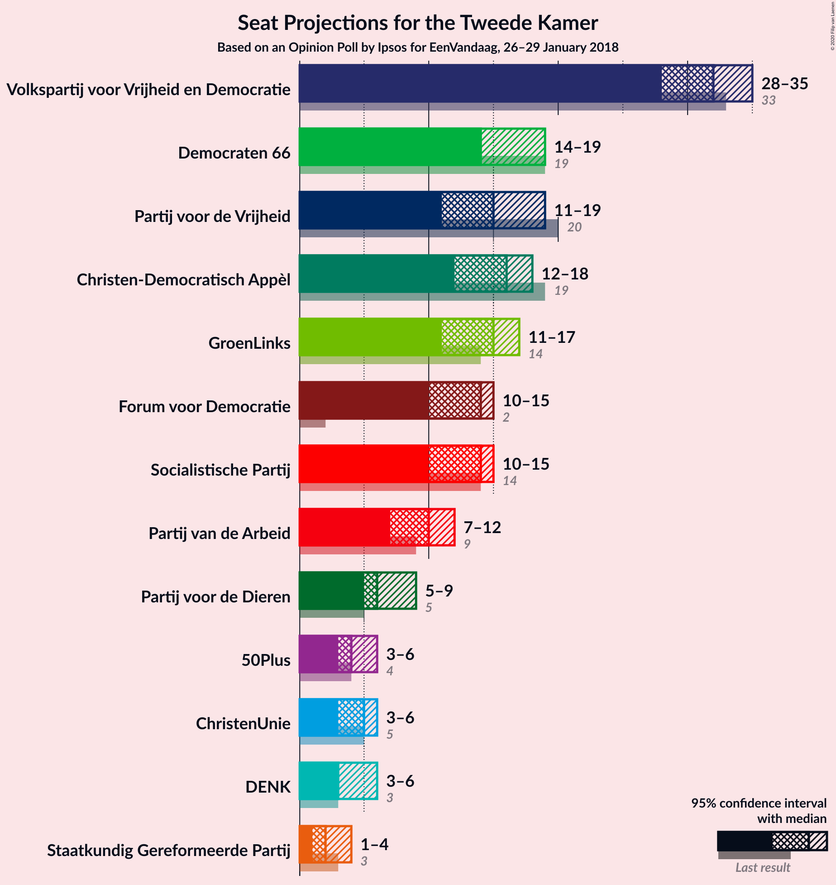

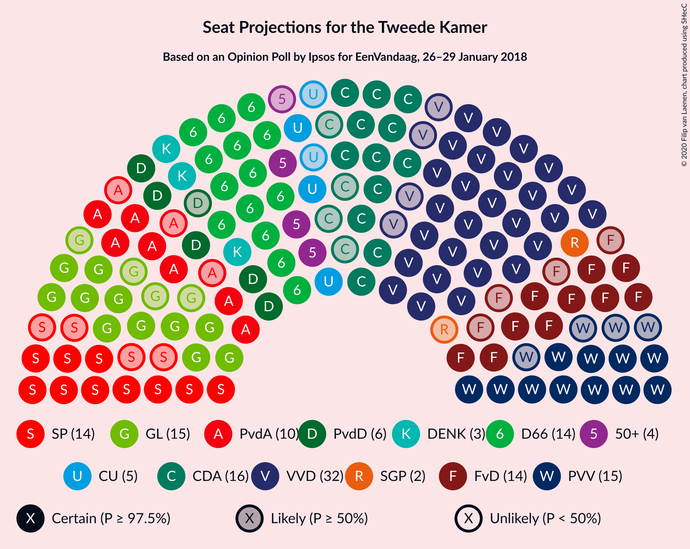

### Confidence Intervals

| Party | Last Result | Median | 80% Confidence Interval | 90% Confidence Interval | 95% Confidence Interval | 99% Confidence Interval |
|:-----:|:-----------:|:------:|:-----------------------:|:-----------------------:|:-----------------------:|:-----------------------:|
| <a href="#volkspartij-voor-vrijheid-en-democratie">Volkspartij voor Vrijheid en Democratie</a> | 33 | 30 | 29–33 |28–34 |27–34 |27–35 |
| <a href="#partij-voor-de-vrijheid">Partij voor de Vrijheid</a> | 20 | 13 | 13–17 |13–17 |13–18 |13–22 |
| <a href="#democraten-66">Democraten 66</a> | 19 | 19 | 14–19 |14–19 |14–19 |14–19 |
| <a href="#christen-democratisch-appèl">Christen-Democratisch Appèl</a> | 19 | 16 | 14–16 |14–17 |14–17 |13–17 |
| <a href="#groenlinks">GroenLinks</a> | 14 | 13 | 12–16 |12–16 |12–19 |11–19 |
| <a href="#socialistische-partij">Socialistische Partij</a> | 14 | 15 | 13–15 |11–15 |11–15 |11–16 |
| <a href="#forum-voor-democratie">Forum voor Democratie</a> | 2 | 13 | 10–13 |10–13 |10–13 |10–14 |
| <a href="#partij-van-de-arbeid">Partij van de Arbeid</a> | 9 | 9 | 8–10 |7–10 |7–10 |7–12 |
| <a href="#partij-voor-de-dieren">Partij voor de Dieren</a> | 5 | 8 | 7–9 |7–9 |6–9 |5–10 |
| <a href="#christenunie">ChristenUnie</a> | 5 | 5 | 4–6 |4–7 |4–7 |4–7 |
| <a href="#50plus">50Plus</a> | 4 | 4 | 4–5 |3–7 |3–7 |3–8 |
| <a href="#denk">DENK</a> | 3 | 4 | 4 |3–5 |3–6 |2–6 |
| <a href="#staatkundig-gereformeerde-partij">Staatkundig Gereformeerde Partij</a> | 3 | 1 | 1–3 |1–4 |1–4 |1–5 |

### Volkspartij voor Vrijheid en Democratie

*For a full overview of the results for this party, see the [Volkspartij voor Vrijheid en Democratie](party-volkspartijvoorvrijheidendemocratie.html) page.*

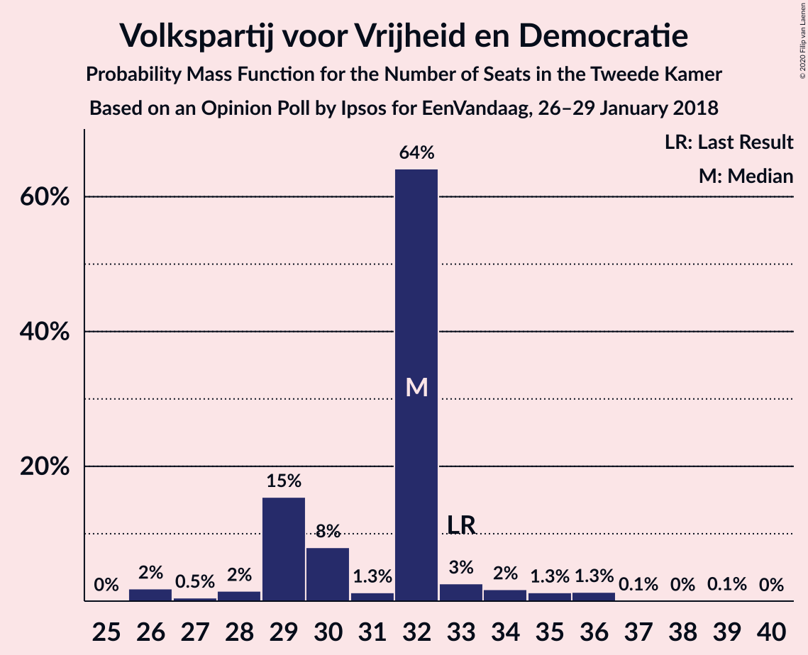

| Number of Seats | Probability | Accumulated | Special Marks |
|:---------------:|:-----------:|:-----------:|:-------------:|
| 25 | 0.1% | 100% |  |
| 26 | 0.1% | 99.9% |  |
| 27 | 4% | 99.8% |  |
| 28 | 2% | 96% |  |
| 29 | 9% | 94% |  |
| 30 | 69% | 85% | Median |
| 31 | 4% | 16% |  |
| 32 | 0.4% | 12% |  |
| 33 | 5% | 12% | Last Result |
| 34 | 6% | 6% |  |
| 35 | 0.4% | 0.6% |  |
| 36 | 0% | 0.3% |  |
| 37 | 0% | 0.2% |  |
| 38 | 0.2% | 0.2% |  |
| 39 | 0% | 0% |  |

### Partij voor de Vrijheid

*For a full overview of the results for this party, see the [Partij voor de Vrijheid](party-partijvoordevrijheid.html) page.*

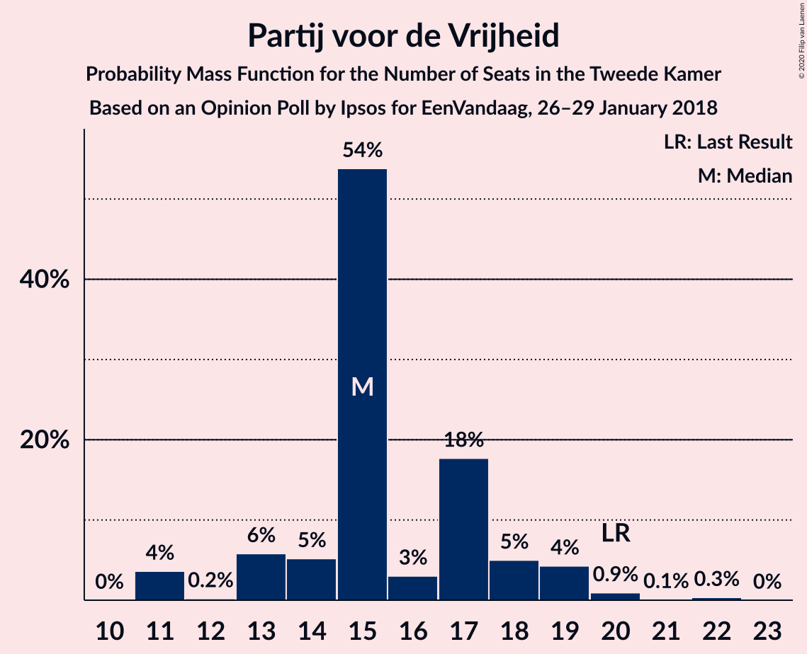

| Number of Seats | Probability | Accumulated | Special Marks |
|:---------------:|:-----------:|:-----------:|:-------------:|
| 12 | 0.4% | 100% |  |
| 13 | 67% | 99.5% | Median |
| 14 | 0.2% | 32% |  |
| 15 | 11% | 32% |  |
| 16 | 11% | 22% |  |
| 17 | 8% | 10% |  |
| 18 | 0.2% | 3% |  |
| 19 | 0.5% | 2% |  |
| 20 | 0.1% | 2% | Last Result |
| 21 | 0.2% | 2% |  |
| 22 | 2% | 2% |  |
| 23 | 0% | 0% |  |

### Democraten 66

*For a full overview of the results for this party, see the [Democraten 66](party-democraten66.html) page.*

| Number of Seats | Probability | Accumulated | Special Marks |
|:---------------:|:-----------:|:-----------:|:-------------:|
| 12 | 0% | 100% |  |
| 13 | 0.3% | 99.9% |  |
| 14 | 14% | 99.7% |  |
| 15 | 2% | 86% |  |
| 16 | 5% | 84% |  |
| 17 | 9% | 79% |  |
| 18 | 1.3% | 70% |  |
| 19 | 68% | 68% | Last Result, Median |
| 20 | 0.1% | 0.1% |  |
| 21 | 0.1% | 0.1% |  |
| 22 | 0% | 0% |  |

### Christen-Democratisch Appèl

*For a full overview of the results for this party, see the [Christen-Democratisch Appèl](party-christen-democratischappèl.html) page.*

| Number of Seats | Probability | Accumulated | Special Marks |
|:---------------:|:-----------:|:-----------:|:-------------:|
| 12 | 0.2% | 100% |  |
| 13 | 0.4% | 99.8% |  |
| 14 | 11% | 99.4% |  |
| 15 | 12% | 89% |  |
| 16 | 71% | 77% | Median |
| 17 | 6% | 6% |  |
| 18 | 0% | 0.2% |  |
| 19 | 0% | 0.2% | Last Result |
| 20 | 0% | 0.1% |  |
| 21 | 0.1% | 0.1% |  |
| 22 | 0% | 0% |  |

### GroenLinks

*For a full overview of the results for this party, see the [GroenLinks](party-groenlinks.html) page.*

| Number of Seats | Probability | Accumulated | Special Marks |
|:---------------:|:-----------:|:-----------:|:-------------:|
| 11 | 1.0% | 100% |  |
| 12 | 11% | 99.0% |  |
| 13 | 67% | 88% | Median |
| 14 | 0.9% | 21% | Last Result |
| 15 | 6% | 20% |  |
| 16 | 9% | 13% |  |
| 17 | 0.3% | 4% |  |
| 18 | 0.5% | 4% |  |
| 19 | 3% | 3% |  |
| 20 | 0% | 0% |  |

### Socialistische Partij

*For a full overview of the results for this party, see the [Socialistische Partij](party-socialistischepartij.html) page.*

| Number of Seats | Probability | Accumulated | Special Marks |
|:---------------:|:-----------:|:-----------:|:-------------:|
| 9 | 0.1% | 100% |  |
| 10 | 0.4% | 99.9% |  |
| 11 | 6% | 99.5% |  |
| 12 | 0.5% | 94% |  |
| 13 | 9% | 93% |  |
| 14 | 16% | 84% | Last Result |
| 15 | 67% | 69% | Median |
| 16 | 1.4% | 1.5% |  |
| 17 | 0.1% | 0.1% |  |
| 18 | 0% | 0% |  |

### Forum voor Democratie

*For a full overview of the results for this party, see the [Forum voor Democratie](party-forumvoordemocratie.html) page.*

| Number of Seats | Probability | Accumulated | Special Marks |
|:---------------:|:-----------:|:-----------:|:-------------:|
| 2 | 0% | 100% | Last Result |
| 3 | 0% | 100% |  |
| 4 | 0% | 100% |  |
| 5 | 0% | 100% |  |
| 6 | 0% | 100% |  |
| 7 | 0% | 100% |  |
| 8 | 0% | 100% |  |
| 9 | 0.5% | 100% |  |
| 10 | 11% | 99.5% |  |
| 11 | 10% | 88% |  |
| 12 | 4% | 78% |  |
| 13 | 72% | 74% | Median |
| 14 | 2% | 2% |  |
| 15 | 0% | 0.2% |  |
| 16 | 0% | 0.2% |  |
| 17 | 0% | 0.2% |  |
| 18 | 0.2% | 0.2% |  |
| 19 | 0% | 0% |  |

### Partij van de Arbeid

*For a full overview of the results for this party, see the [Partij van de Arbeid](party-partijvandearbeid.html) page.*

| Number of Seats | Probability | Accumulated | Special Marks |
|:---------------:|:-----------:|:-----------:|:-------------:|
| 6 | 0.2% | 100% |  |
| 7 | 10% | 99.7% |  |
| 8 | 11% | 90% |  |
| 9 | 68% | 80% | Last Result, Median |
| 10 | 11% | 12% |  |
| 11 | 0.1% | 0.8% |  |
| 12 | 0.5% | 0.7% |  |
| 13 | 0.1% | 0.1% |  |
| 14 | 0% | 0% |  |

### Partij voor de Dieren

*For a full overview of the results for this party, see the [Partij voor de Dieren](party-partijvoordedieren.html) page.*

| Number of Seats | Probability | Accumulated | Special Marks |
|:---------------:|:-----------:|:-----------:|:-------------:|
| 4 | 0.2% | 100% |  |
| 5 | 2% | 99.8% | Last Result |
| 6 | 0.7% | 98% |  |
| 7 | 17% | 97% |  |
| 8 | 67% | 80% | Median |
| 9 | 12% | 13% |  |
| 10 | 0.4% | 0.6% |  |
| 11 | 0.1% | 0.1% |  |
| 12 | 0% | 0% |  |

### ChristenUnie

*For a full overview of the results for this party, see the [ChristenUnie](party-christenunie.html) page.*

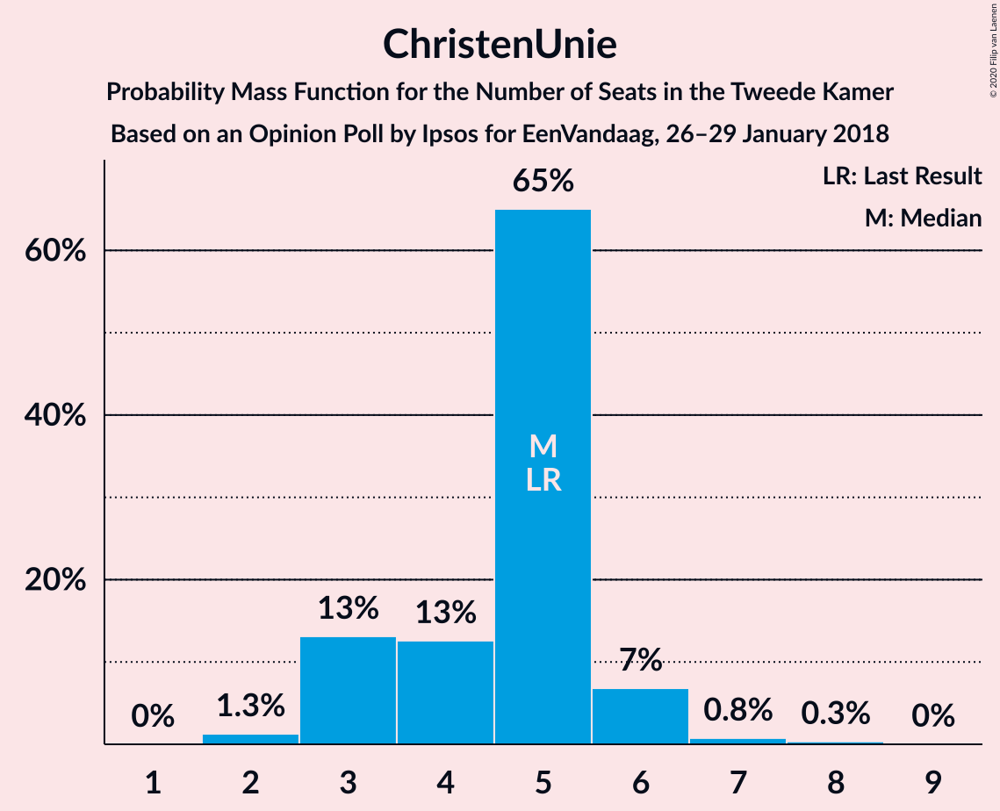

| Number of Seats | Probability | Accumulated | Special Marks |
|:---------------:|:-----------:|:-----------:|:-------------:|
| 3 | 0.3% | 100% |  |
| 4 | 11% | 99.7% |  |
| 5 | 78% | 89% | Last Result, Median |
| 6 | 1.2% | 10% |  |
| 7 | 9% | 9% |  |
| 8 | 0% | 0% |  |

### 50Plus

*For a full overview of the results for this party, see the [50Plus](party-50plus.html) page.*

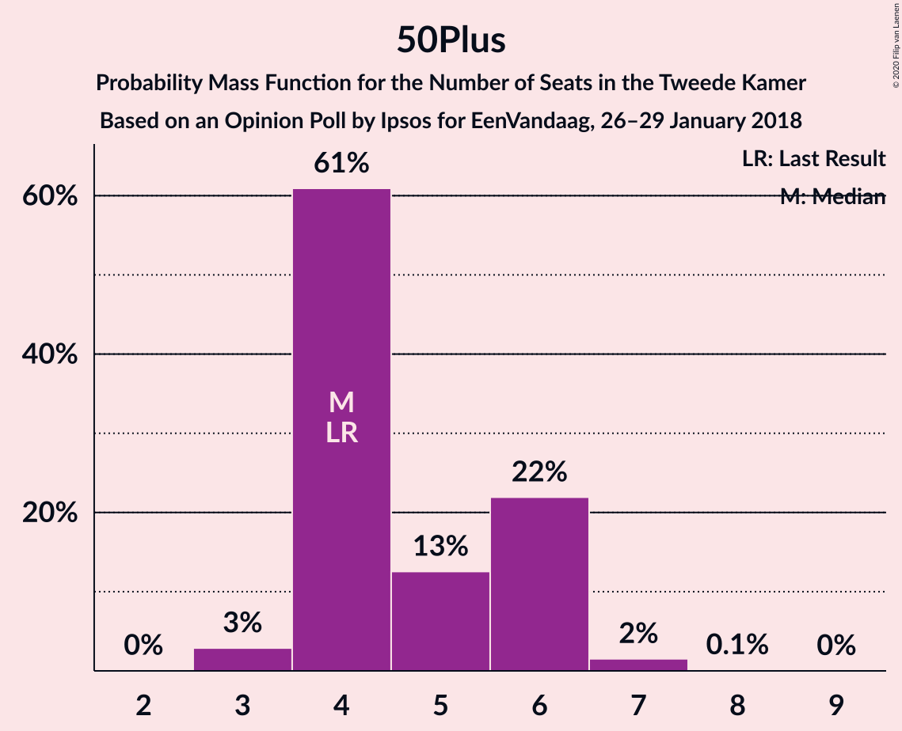

| Number of Seats | Probability | Accumulated | Special Marks |
|:---------------:|:-----------:|:-----------:|:-------------:|
| 3 | 9% | 100% |  |
| 4 | 68% | 91% | Last Result, Median |
| 5 | 15% | 24% |  |
| 6 | 2% | 8% |  |
| 7 | 6% | 7% |  |
| 8 | 0.9% | 1.0% |  |
| 9 | 0% | 0% |  |

### DENK

*For a full overview of the results for this party, see the [DENK](party-denk.html) page.*

| Number of Seats | Probability | Accumulated | Special Marks |
|:---------------:|:-----------:|:-----------:|:-------------:|
| 2 | 2% | 100% |  |
| 3 | 7% | 98% | Last Result |
| 4 | 83% | 91% | Median |
| 5 | 4% | 8% |  |
| 6 | 4% | 4% |  |
| 7 | 0% | 0% |  |

### Staatkundig Gereformeerde Partij

*For a full overview of the results for this party, see the [Staatkundig Gereformeerde Partij](party-staatkundiggereformeerdepartij.html) page.*

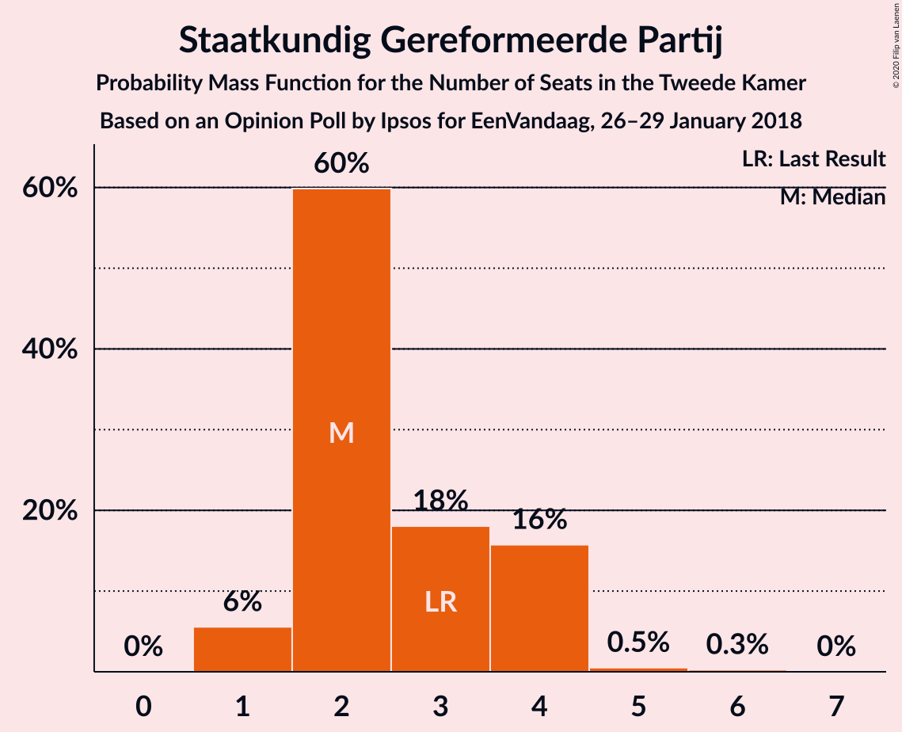

| Number of Seats | Probability | Accumulated | Special Marks |
|:---------------:|:-----------:|:-----------:|:-------------:|
| 1 | 67% | 100% | Median |
| 2 | 12% | 33% |  |
| 3 | 13% | 21% | Last Result |
| 4 | 7% | 8% |  |
| 5 | 1.0% | 1.1% |  |
| 6 | 0% | 0.1% |  |
| 7 | 0% | 0% |  |

## Coalitions

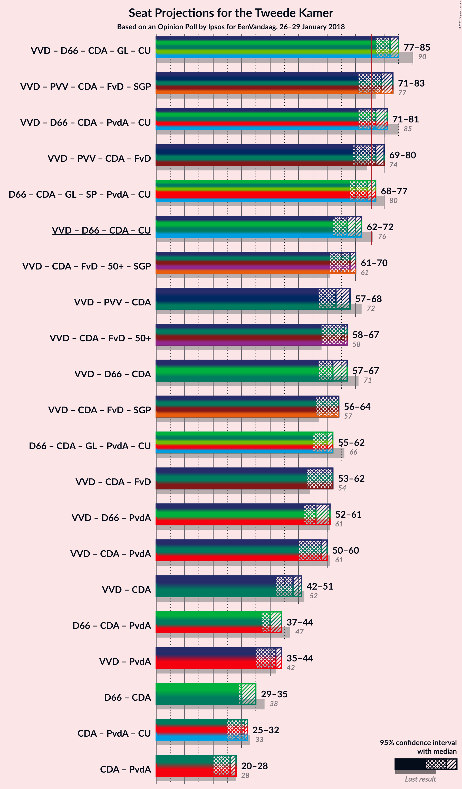

### Confidence Intervals

| Coalition | Last Result | Median | Majority? | 80% Confidence Interval | 90% Confidence Interval | 95% Confidence Interval | 99% Confidence Interval |
|:---------:|:-----------:|:------:|:---------:|:-----------------------:|:-----------------------:|:-----------------------:|:-----------------------:|
| Volkspartij voor Vrijheid en Democratie – Democraten 66 – Christen-Democratisch Appèl – GroenLinks – ChristenUnie | 90 | 83 | 98% | 80–83 | 79–83 | 78–84 | 75–88 |
| Volkspartij voor Vrijheid en Democratie – Partij voor de Vrijheid – Christen-Democratisch Appèl – Forum voor Democratie – Staatkundig Gereformeerde Partij | 77 | 73 | 18% | 73–79 | 71–80 | 71–80 | 71–82 |
| Volkspartij voor Vrijheid en Democratie – Democraten 66 – Christen-Democratisch Appèl – Partij van de Arbeid – ChristenUnie | 85 | 79 | 79% | 74–79 | 73–79 | 69–79 | 69–81 |
| Volkspartij voor Vrijheid en Democratie – Partij voor de Vrijheid – Christen-Democratisch Appèl – Forum voor Democratie | 74 | 72 | 8% | 70–75 | 69–77 | 69–78 | 69–80 |
| Democraten 66 – Christen-Democratisch Appèl – GroenLinks – Socialistische Partij – Partij van de Arbeid – ChristenUnie | 80 | 77 | 69% | 70–77 | 69–77 | 69–77 | 66–80 |
| Volkspartij voor Vrijheid en Democratie – Christen-Democratisch Appèl – Forum voor Democratie – 50Plus – Staatkundig Gereformeerde Partij | 61 | 64 | 0% | 61–67 | 61–70 | 61–70 | 61–71 |
| Volkspartij voor Vrijheid en Democratie – Democraten 66 – Christen-Democratisch Appèl – ChristenUnie | 76 | 70 | 0% | 67–70 | 63–70 | 61–70 | 61–73 |
| Volkspartij voor Vrijheid en Democratie – Christen-Democratisch Appèl – Forum voor Democratie – 50Plus | 58 | 63 | 0% | 59–64 | 59–66 | 58–66 | 58–68 |
| Volkspartij voor Vrijheid en Democratie – Partij voor de Vrijheid – Christen-Democratisch Appèl | 72 | 59 | 0% | 58–65 | 58–65 | 58–66 | 58–66 |
| Volkspartij voor Vrijheid en Democratie – Democraten 66 – Christen-Democratisch Appèl | 71 | 65 | 0% | 60–65 | 59–65 | 57–65 | 57–68 |
| Volkspartij voor Vrijheid en Democratie – Christen-Democratisch Appèl – Forum voor Democratie – Staatkundig Gereformeerde Partij | 57 | 60 | 0% | 58–63 | 56–64 | 56–64 | 56–65 |
| Democraten 66 – Christen-Democratisch Appèl – GroenLinks – Partij van de Arbeid – ChristenUnie | 66 | 62 | 0% | 57–62 | 55–62 | 55–62 | 55–65 |
| Volkspartij voor Vrijheid en Democratie – Christen-Democratisch Appèl – Forum voor Democratie | 54 | 59 | 0% | 54–59 | 54–61 | 54–61 | 53–63 |
| Volkspartij voor Vrijheid en Democratie – Christen-Democratisch Appèl – Partij van de Arbeid | 61 | 55 | 0% | 50–58 | 50–59 | 50–59 | 50–59 |
| Volkspartij voor Vrijheid en Democratie – Democraten 66 – Partij van de Arbeid | 61 | 58 | 0% | 53–58 | 53–58 | 49–58 | 49–60 |
| Volkspartij voor Vrijheid en Democratie – Christen-Democratisch Appèl | 52 | 46 | 0% | 43–48 | 43–49 | 43–49 | 42–51 |
| Democraten 66 – Christen-Democratisch Appèl – Partij van de Arbeid | 47 | 44 | 0% | 38–44 | 37–44 | 37–44 | 37–44 |
| Volkspartij voor Vrijheid en Democratie – Partij van de Arbeid | 42 | 39 | 0% | 36–41 | 36–44 | 35–44 | 35–44 |
| Democraten 66 – Christen-Democratisch Appèl | 38 | 35 | 0% | 29–35 | 29–35 | 29–35 | 28–36 |
| Christen-Democratisch Appèl – Partij van de Arbeid – ChristenUnie | 33 | 30 | 0% | 28–30 | 28–30 | 28–32 | 27–33 |
| Christen-Democratisch Appèl – Partij van de Arbeid | 28 | 25 | 0% | 23–25 | 21–25 | 21–27 | 21–28 |

### Volkspartij voor Vrijheid en Democratie – Democraten 66 – Christen-Democratisch Appèl – GroenLinks – ChristenUnie

| Number of Seats | Probability | Accumulated | Special Marks |
|:---------------:|:-----------:|:-----------:|:-------------:|
| 73 | 0.1% | 100% |  |
| 74 | 0% | 99.9% |  |
| 75 | 2% | 99.9% |  |
| 76 | 0.1% | 98% | Majority |
| 77 | 0.4% | 98% |  |
| 78 | 0.9% | 98% |  |
| 79 | 6% | 97% |  |
| 80 | 3% | 91% |  |
| 81 | 4% | 87% |  |
| 82 | 5% | 83% |  |
| 83 | 76% | 79% | Median |
| 84 | 1.4% | 3% |  |
| 85 | 0.6% | 2% |  |
| 86 | 0.4% | 0.9% |  |
| 87 | 0% | 0.5% |  |
| 88 | 0% | 0.5% |  |
| 89 | 0% | 0.5% |  |
| 90 | 0.5% | 0.5% | Last Result |
| 91 | 0% | 0% |  |

### Volkspartij voor Vrijheid en Democratie – Partij voor de Vrijheid – Christen-Democratisch Appèl – Forum voor Democratie – Staatkundig Gereformeerde Partij

| Number of Seats | Probability | Accumulated | Special Marks |
|:---------------:|:-----------:|:-----------:|:-------------:|
| 71 | 9% | 100% |  |
| 72 | 0.4% | 91% |  |
| 73 | 67% | 91% | Median |
| 74 | 2% | 24% |  |
| 75 | 4% | 22% |  |
| 76 | 0.3% | 18% | Majority |
| 77 | 0.3% | 18% | Last Result |
| 78 | 4% | 17% |  |
| 79 | 6% | 13% |  |
| 80 | 5% | 7% |  |
| 81 | 0.4% | 2% |  |
| 82 | 2% | 2% |  |
| 83 | 0.1% | 0.2% |  |
| 84 | 0% | 0% |  |

### Volkspartij voor Vrijheid en Democratie – Democraten 66 – Christen-Democratisch Appèl – Partij van de Arbeid – ChristenUnie

| Number of Seats | Probability | Accumulated | Special Marks |
|:---------------:|:-----------:|:-----------:|:-------------:|
| 69 | 3% | 100% |  |
| 70 | 0.2% | 97% |  |
| 71 | 0% | 97% |  |
| 72 | 0.9% | 97% |  |
| 73 | 2% | 96% |  |
| 74 | 9% | 94% |  |
| 75 | 5% | 85% |  |
| 76 | 0.1% | 79% | Majority |
| 77 | 7% | 79% |  |
| 78 | 0.7% | 72% |  |
| 79 | 71% | 72% | Median |
| 80 | 0% | 1.0% |  |
| 81 | 0.7% | 0.9% |  |
| 82 | 0.1% | 0.3% |  |
| 83 | 0% | 0.1% |  |
| 84 | 0% | 0.1% |  |
| 85 | 0% | 0.1% | Last Result |
| 86 | 0.1% | 0.1% |  |
| 87 | 0% | 0% |  |

### Volkspartij voor Vrijheid en Democratie – Partij voor de Vrijheid – Christen-Democratisch Appèl – Forum voor Democratie

| Number of Seats | Probability | Accumulated | Special Marks |
|:---------------:|:-----------:|:-----------:|:-------------:|
| 69 | 10% | 100% |  |
| 70 | 2% | 90% |  |
| 71 | 0.1% | 88% |  |
| 72 | 70% | 88% | Median |
| 73 | 0.3% | 18% |  |
| 74 | 0.1% | 18% | Last Result |
| 75 | 10% | 18% |  |
| 76 | 0.3% | 8% | Majority |
| 77 | 5% | 7% |  |
| 78 | 0.5% | 3% |  |
| 79 | 0.4% | 2% |  |
| 80 | 2% | 2% |  |
| 81 | 0.1% | 0.1% |  |
| 82 | 0% | 0% |  |

### Democraten 66 – Christen-Democratisch Appèl – GroenLinks – Socialistische Partij – Partij van de Arbeid – ChristenUnie

| Number of Seats | Probability | Accumulated | Special Marks |
|:---------------:|:-----------:|:-----------:|:-------------:|
| 64 | 0.1% | 100% |  |
| 65 | 0% | 99.9% |  |
| 66 | 2% | 99.9% |  |
| 67 | 0.1% | 98% |  |
| 68 | 0.4% | 98% |  |
| 69 | 6% | 98% |  |
| 70 | 5% | 92% |  |
| 71 | 4% | 87% |  |
| 72 | 0.4% | 83% |  |
| 73 | 1.0% | 83% |  |
| 74 | 4% | 82% |  |
| 75 | 9% | 78% |  |
| 76 | 0.4% | 69% | Majority |
| 77 | 67% | 69% | Median |
| 78 | 0.1% | 2% |  |
| 79 | 0.4% | 2% |  |
| 80 | 1.2% | 1.3% | Last Result |
| 81 | 0% | 0% |  |

### Volkspartij voor Vrijheid en Democratie – Christen-Democratisch Appèl – Forum voor Democratie – 50Plus – Staatkundig Gereformeerde Partij

| Number of Seats | Probability | Accumulated | Special Marks |
|:---------------:|:-----------:|:-----------:|:-------------:|
| 58 | 0.1% | 100% |  |
| 59 | 0.1% | 99.9% |  |
| 60 | 0% | 99.8% |  |
| 61 | 12% | 99.8% | Last Result |
| 62 | 0.2% | 88% |  |
| 63 | 0.1% | 87% |  |
| 64 | 67% | 87% | Median |
| 65 | 3% | 20% |  |
| 66 | 5% | 17% |  |
| 67 | 5% | 11% |  |
| 68 | 0.1% | 6% |  |
| 69 | 0.2% | 6% |  |
| 70 | 6% | 6% |  |
| 71 | 0.1% | 0.5% |  |
| 72 | 0.4% | 0.5% |  |
| 73 | 0% | 0% |  |

### Volkspartij voor Vrijheid en Democratie – Democraten 66 – Christen-Democratisch Appèl – ChristenUnie

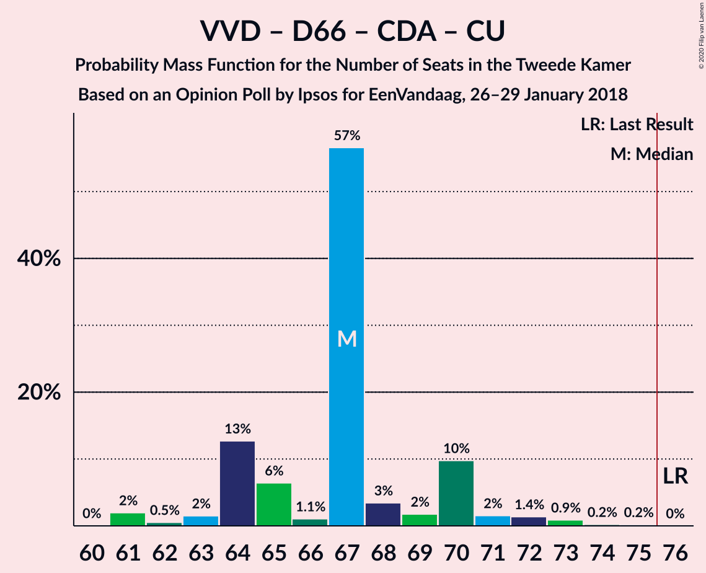

| Number of Seats | Probability | Accumulated | Special Marks |
|:---------------:|:-----------:|:-----------:|:-------------:|
| 60 | 0.2% | 100% |  |
| 61 | 3% | 99.8% |  |
| 62 | 0% | 97% |  |
| 63 | 2% | 96% |  |
| 64 | 1.0% | 95% |  |
| 65 | 0.2% | 94% |  |
| 66 | 0.5% | 94% |  |
| 67 | 19% | 93% |  |
| 68 | 0.3% | 74% |  |
| 69 | 5% | 73% |  |
| 70 | 67% | 68% | Median |
| 71 | 0.2% | 1.1% |  |
| 72 | 0.4% | 1.0% |  |
| 73 | 0.1% | 0.6% |  |
| 74 | 0.5% | 0.5% |  |
| 75 | 0% | 0% |  |
| 76 | 0% | 0% | Last Result, Majority |

### Volkspartij voor Vrijheid en Democratie – Christen-Democratisch Appèl – Forum voor Democratie – 50Plus

| Number of Seats | Probability | Accumulated | Special Marks |
|:---------------:|:-----------:|:-----------:|:-------------:|
| 55 | 0.1% | 100% |  |
| 56 | 0% | 99.9% |  |
| 57 | 0.2% | 99.9% |  |
| 58 | 3% | 99.6% | Last Result |
| 59 | 9% | 96% |  |
| 60 | 0.2% | 87% |  |
| 61 | 2% | 87% |  |
| 62 | 0.6% | 85% |  |
| 63 | 73% | 84% | Median |
| 64 | 5% | 12% |  |
| 65 | 0.1% | 6% |  |
| 66 | 6% | 6% |  |
| 67 | 0.1% | 0.7% |  |
| 68 | 0.1% | 0.6% |  |
| 69 | 0.1% | 0.5% |  |
| 70 | 0.4% | 0.4% |  |
| 71 | 0% | 0% |  |

### Volkspartij voor Vrijheid en Democratie – Partij voor de Vrijheid – Christen-Democratisch Appèl

| Number of Seats | Probability | Accumulated | Special Marks |
|:---------------:|:-----------:|:-----------:|:-------------:|
| 57 | 0.2% | 100% |  |
| 58 | 10% | 99.8% |  |
| 59 | 67% | 90% | Median |
| 60 | 5% | 23% |  |
| 61 | 0.5% | 18% |  |
| 62 | 0.1% | 18% |  |
| 63 | 0.2% | 18% |  |
| 64 | 5% | 17% |  |
| 65 | 10% | 12% |  |
| 66 | 2% | 3% |  |
| 67 | 0.1% | 0.2% |  |
| 68 | 0% | 0.1% |  |
| 69 | 0% | 0.1% |  |
| 70 | 0.1% | 0.1% |  |
| 71 | 0% | 0% |  |
| 72 | 0% | 0% | Last Result |

### Volkspartij voor Vrijheid en Democratie – Democraten 66 – Christen-Democratisch Appèl

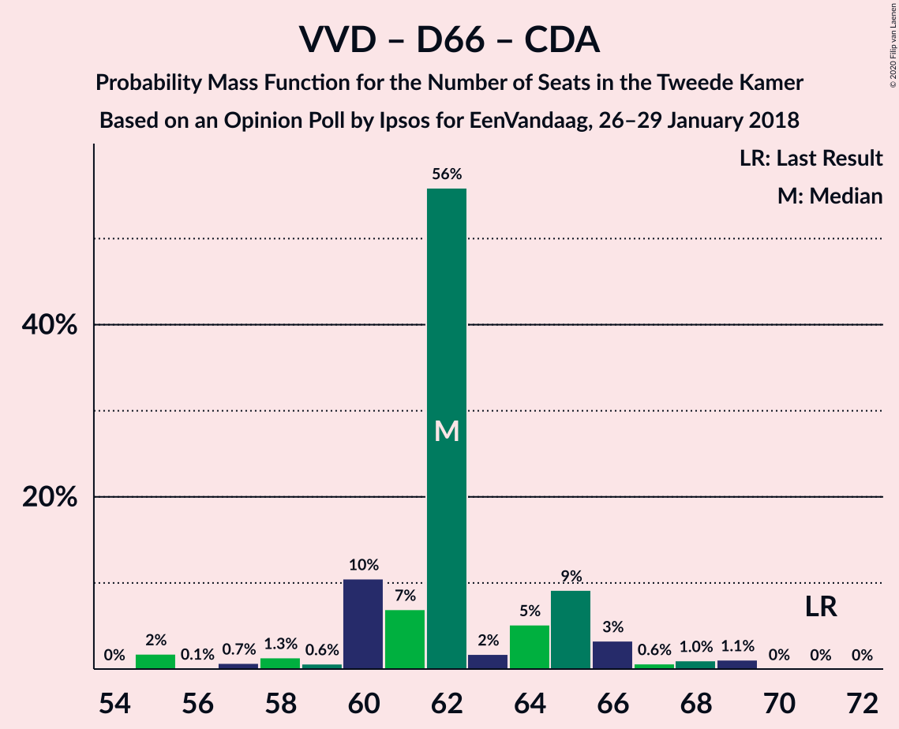

| Number of Seats | Probability | Accumulated | Special Marks |
|:---------------:|:-----------:|:-----------:|:-------------:|
| 55 | 0.1% | 100% |  |
| 56 | 0.1% | 99.9% |  |
| 57 | 3% | 99.7% |  |
| 58 | 0.9% | 96% |  |
| 59 | 2% | 95% |  |
| 60 | 9% | 94% |  |
| 61 | 0.4% | 85% |  |
| 62 | 5% | 84% |  |
| 63 | 6% | 79% |  |
| 64 | 5% | 73% |  |
| 65 | 67% | 68% | Median |
| 66 | 0.4% | 1.3% |  |
| 67 | 0.4% | 1.0% |  |
| 68 | 0% | 0.5% |  |
| 69 | 0.1% | 0.5% |  |
| 70 | 0.4% | 0.4% |  |
| 71 | 0% | 0% | Last Result |

### Volkspartij voor Vrijheid en Democratie – Christen-Democratisch Appèl – Forum voor Democratie – Staatkundig Gereformeerde Partij

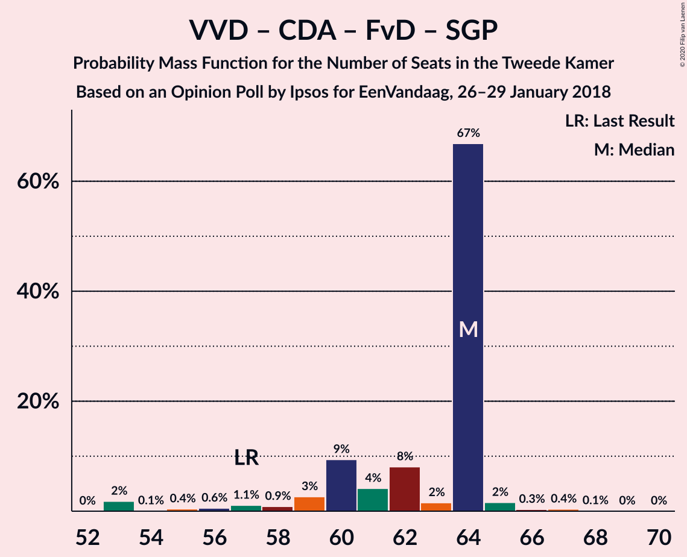

| Number of Seats | Probability | Accumulated | Special Marks |
|:---------------:|:-----------:|:-----------:|:-------------:|
| 54 | 0.1% | 100% |  |
| 55 | 0.1% | 99.9% |  |
| 56 | 9% | 99.8% |  |
| 57 | 0.1% | 91% | Last Result |
| 58 | 4% | 91% |  |
| 59 | 2% | 86% |  |
| 60 | 69% | 85% | Median |
| 61 | 4% | 16% |  |
| 62 | 0.4% | 12% |  |
| 63 | 6% | 11% |  |
| 64 | 5% | 6% |  |
| 65 | 0.2% | 0.7% |  |
| 66 | 0.1% | 0.5% |  |
| 67 | 0.1% | 0.4% |  |
| 68 | 0.3% | 0.3% |  |
| 69 | 0% | 0% |  |

### Democraten 66 – Christen-Democratisch Appèl – GroenLinks – Partij van de Arbeid – ChristenUnie

| Number of Seats | Probability | Accumulated | Special Marks |
|:---------------:|:-----------:|:-----------:|:-------------:|
| 53 | 0% | 100% |  |
| 54 | 0.1% | 99.9% |  |
| 55 | 7% | 99.8% |  |
| 56 | 0.1% | 93% |  |
| 57 | 5% | 93% |  |
| 58 | 0.2% | 87% |  |
| 59 | 1.4% | 87% |  |
| 60 | 4% | 85% |  |
| 61 | 12% | 81% |  |
| 62 | 67% | 69% | Median |
| 63 | 0.2% | 2% |  |
| 64 | 1.4% | 2% |  |
| 65 | 0.2% | 0.6% |  |
| 66 | 0.4% | 0.4% | Last Result |
| 67 | 0% | 0% |  |

### Volkspartij voor Vrijheid en Democratie – Christen-Democratisch Appèl – Forum voor Democratie

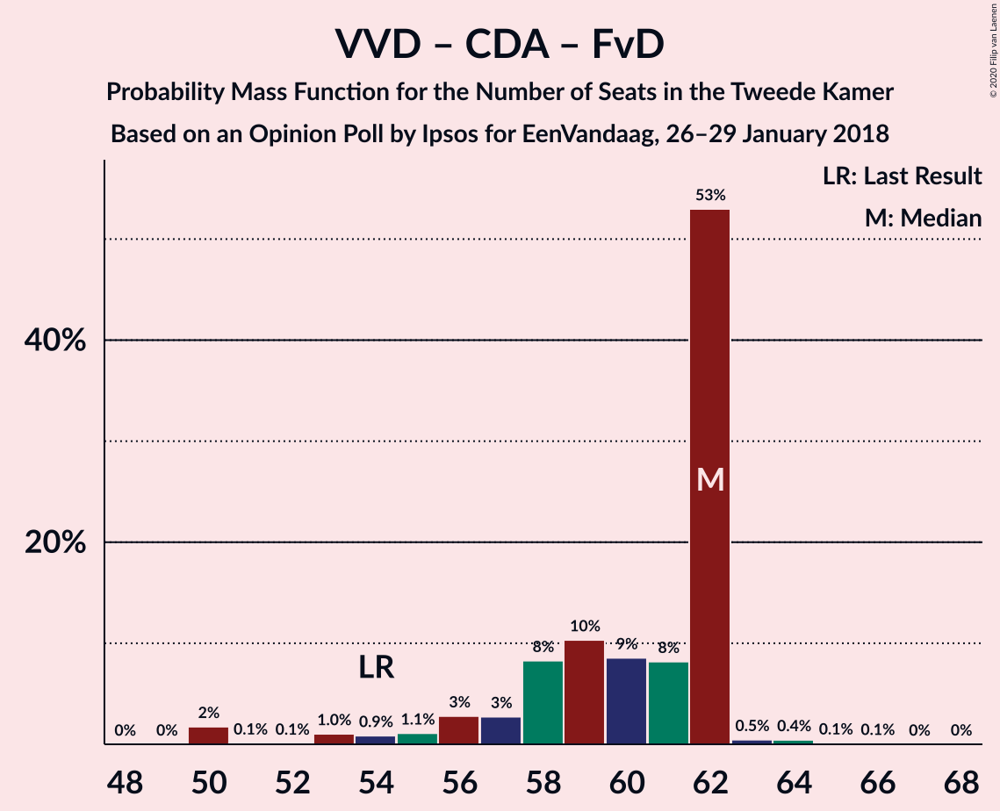

| Number of Seats | Probability | Accumulated | Special Marks |
|:---------------:|:-----------:|:-----------:|:-------------:|
| 52 | 0.2% | 100% |  |
| 53 | 1.0% | 99.8% |  |
| 54 | 9% | 98.8% | Last Result |
| 55 | 5% | 90% |  |
| 56 | 0.1% | 85% |  |
| 57 | 0.1% | 85% |  |
| 58 | 6% | 85% |  |
| 59 | 73% | 79% | Median |
| 60 | 0.2% | 6% |  |
| 61 | 5% | 6% |  |
| 62 | 0.1% | 0.6% |  |
| 63 | 0.1% | 0.6% |  |
| 64 | 0.2% | 0.5% |  |
| 65 | 0% | 0.3% |  |
| 66 | 0.3% | 0.3% |  |
| 67 | 0% | 0% |  |

### Volkspartij voor Vrijheid en Democratie – Christen-Democratisch Appèl – Partij van de Arbeid

| Number of Seats | Probability | Accumulated | Special Marks |
|:---------------:|:-----------:|:-----------:|:-------------:|
| 47 | 0.1% | 100% |  |
| 48 | 0% | 99.9% |  |
| 49 | 0.1% | 99.9% |  |
| 50 | 10% | 99.8% |  |
| 51 | 4% | 90% |  |
| 52 | 0% | 86% |  |
| 53 | 2% | 86% |  |
| 54 | 2% | 85% |  |
| 55 | 67% | 83% | Median |
| 56 | 5% | 16% |  |
| 57 | 0.2% | 11% |  |
| 58 | 4% | 11% |  |
| 59 | 6% | 7% |  |
| 60 | 0.1% | 0.3% |  |
| 61 | 0.1% | 0.3% | Last Result |
| 62 | 0% | 0.1% |  |
| 63 | 0.1% | 0.1% |  |
| 64 | 0% | 0% |  |

### Volkspartij voor Vrijheid en Democratie – Democraten 66 – Partij van de Arbeid

| Number of Seats | Probability | Accumulated | Special Marks |
|:---------------:|:-----------:|:-----------:|:-------------:|
| 49 | 3% | 100% |  |
| 50 | 0% | 97% |  |
| 51 | 0.9% | 96% |  |
| 52 | 0.1% | 96% |  |
| 53 | 9% | 96% |  |
| 54 | 0.3% | 87% |  |
| 55 | 8% | 86% |  |
| 56 | 0.8% | 78% |  |
| 57 | 4% | 78% |  |
| 58 | 72% | 73% | Median |
| 59 | 0.3% | 1.2% |  |
| 60 | 0.7% | 0.9% |  |
| 61 | 0% | 0.2% | Last Result |
| 62 | 0% | 0.2% |  |
| 63 | 0% | 0.1% |  |
| 64 | 0% | 0.1% |  |
| 65 | 0% | 0.1% |  |
| 66 | 0% | 0.1% |  |
| 67 | 0% | 0.1% |  |
| 68 | 0.1% | 0.1% |  |
| 69 | 0% | 0% |  |

### Volkspartij voor Vrijheid en Democratie – Christen-Democratisch Appèl

| Number of Seats | Probability | Accumulated | Special Marks |
|:---------------:|:-----------:|:-----------:|:-------------:|
| 40 | 0.3% | 100% |  |
| 41 | 0.1% | 99.7% |  |
| 42 | 1.0% | 99.7% |  |
| 43 | 12% | 98.6% |  |
| 44 | 2% | 86% |  |
| 45 | 1.4% | 85% |  |
| 46 | 67% | 83% | Median |
| 47 | 0.5% | 16% |  |
| 48 | 9% | 16% |  |
| 49 | 6% | 7% |  |
| 50 | 0.2% | 0.8% |  |
| 51 | 0.1% | 0.6% |  |
| 52 | 0.3% | 0.5% | Last Result |
| 53 | 0.1% | 0.2% |  |
| 54 | 0% | 0% |  |

### Democraten 66 – Christen-Democratisch Appèl – Partij van de Arbeid

| Number of Seats | Probability | Accumulated | Special Marks |
|:---------------:|:-----------:|:-----------:|:-------------:|
| 35 | 0.1% | 100% |  |
| 36 | 0.1% | 99.9% |  |
| 37 | 5% | 99.8% |  |
| 38 | 12% | 95% |  |
| 39 | 8% | 82% |  |
| 40 | 0.4% | 74% |  |
| 41 | 0.2% | 74% |  |
| 42 | 0.5% | 74% |  |
| 43 | 5% | 73% |  |
| 44 | 68% | 68% | Median |
| 45 | 0.1% | 0.1% |  |
| 46 | 0% | 0.1% |  |
| 47 | 0% | 0% | Last Result |

### Volkspartij voor Vrijheid en Democratie – Partij van de Arbeid

| Number of Seats | Probability | Accumulated | Special Marks |
|:---------------:|:-----------:|:-----------:|:-------------:|
| 33 | 0.2% | 100% |  |
| 34 | 0.1% | 99.8% |  |
| 35 | 4% | 99.8% |  |
| 36 | 10% | 96% |  |
| 37 | 0.2% | 85% |  |
| 38 | 0.3% | 85% |  |
| 39 | 67% | 85% | Median |
| 40 | 2% | 18% |  |
| 41 | 9% | 16% |  |
| 42 | 1.1% | 7% | Last Result |
| 43 | 0.1% | 6% |  |
| 44 | 6% | 6% |  |
| 45 | 0.1% | 0.3% |  |
| 46 | 0.1% | 0.2% |  |
| 47 | 0% | 0.1% |  |
| 48 | 0% | 0.1% |  |
| 49 | 0% | 0.1% |  |
| 50 | 0.1% | 0.1% |  |
| 51 | 0% | 0% |  |

### Democraten 66 – Christen-Democratisch Appèl

| Number of Seats | Probability | Accumulated | Special Marks |
|:---------------:|:-----------:|:-----------:|:-------------:|
| 26 | 0.1% | 100% |  |
| 27 | 0.2% | 99.9% |  |
| 28 | 0.2% | 99.7% |  |
| 29 | 12% | 99.5% |  |
| 30 | 4% | 88% |  |
| 31 | 10% | 84% |  |
| 32 | 0.1% | 74% |  |
| 33 | 4% | 74% |  |
| 34 | 1.0% | 69% |  |
| 35 | 67% | 68% | Median |
| 36 | 1.3% | 1.4% |  |
| 37 | 0.1% | 0.1% |  |
| 38 | 0% | 0% | Last Result |

### Christen-Democratisch Appèl – Partij van de Arbeid – ChristenUnie

| Number of Seats | Probability | Accumulated | Special Marks |
|:---------------:|:-----------:|:-----------:|:-------------:|
| 25 | 0.1% | 100% |  |
| 26 | 0.3% | 99.9% |  |
| 27 | 0.3% | 99.6% |  |
| 28 | 19% | 99.3% |  |
| 29 | 6% | 80% |  |
| 30 | 69% | 73% | Median |
| 31 | 0.1% | 5% |  |
| 32 | 4% | 5% |  |
| 33 | 0.1% | 0.5% | Last Result |
| 34 | 0.4% | 0.4% |  |
| 35 | 0% | 0% |  |

### Christen-Democratisch Appèl – Partij van de Arbeid

| Number of Seats | Probability | Accumulated | Special Marks |
|:---------------:|:-----------:|:-----------:|:-------------:|
| 20 | 0% | 100% |  |
| 21 | 9% | 99.9% |  |
| 22 | 0.4% | 91% |  |
| 23 | 6% | 90% |  |
| 24 | 5% | 84% |  |
| 25 | 74% | 79% | Median |
| 26 | 0.2% | 5% |  |
| 27 | 4% | 5% |  |
| 28 | 0.1% | 0.6% | Last Result |
| 29 | 0.4% | 0.4% |  |
| 30 | 0% | 0% |  |

## Technical Information

### Opinion Poll

+ **Polling firm:** Ipsos
+ **Commissioner(s):** EenVandaag
+ **Fieldwork period:** 26–29 January 2018

### Calculations

+ **Sample size:** 1041
+ **Simulations done:** 131,072
+ **Error estimate:** 2.70%

