# Opinion Poll by I&O Research, 2–6 February 2018

<a href="#voting-intentions">Voting Intentions</a> | <a href="#seats">Seats</a> | <a href="#coalitions">Coalitions</a> | <a href="#technical-information">Technical Information</a>

## Voting Intentions

### Confidence Intervals

| Party | Last Result | Poll Result | 80% Confidence Interval | 90% Confidence Interval | 95% Confidence Interval | 99% Confidence Interval |
|:-----:|:-----------:|:-----------:|:-----------------------:|:-----------------------:|:-----------------------:|:-----------------------:|
| Volkspartij voor Vrijheid en Democratie | 21.3% | 18.9% | 18.0–19.7% |17.8–20.0% |17.6–20.2% |17.2–20.6% |
| Democraten 66 | 12.2% | 11.3% | 10.6–12.0% |10.4–12.2% |10.3–12.4% |10.0–12.7% |
| GroenLinks | 9.1% | 10.7% | 10.0–11.4% |9.9–11.6% |9.7–11.8% |9.4–12.1% |
| Partij voor de Vrijheid | 13.1% | 10.6% | 9.9–11.3% |9.8–11.5% |9.6–11.6% |9.3–12.0% |
| Christen-Democratisch Appèl | 12.4% | 9.4% | 8.8–10.0% |8.6–10.2% |8.4–10.4% |8.2–10.7% |
| Forum voor Democratie | 1.8% | 8.6% | 8.0–9.2% |7.8–9.4% |7.7–9.6% |7.4–9.9% |
| Socialistische Partij | 9.1% | 7.9% | 7.3–8.5% |7.2–8.7% |7.0–8.8% |6.8–9.1% |
| Partij van de Arbeid | 5.7% | 6.7% | 6.2–7.3% |6.0–7.4% |5.9–7.6% |5.7–7.8% |
| ChristenUnie | 3.4% | 4.3% | 3.9–4.8% |3.7–4.9% |3.7–5.0% |3.5–5.2% |
| Partij voor de Dieren | 3.2% | 4.1% | 3.7–4.5% |3.6–4.7% |3.5–4.8% |3.3–5.0% |
| 50Plus | 3.1% | 3.2% | 2.8–3.6% |2.7–3.7% |2.7–3.8% |2.5–4.0% |
| Staatkundig Gereformeerde Partij | 2.1% | 2.4% | 2.1–2.8% |2.0–2.9% |2.0–3.0% |1.8–3.2% |
| DENK | 2.1% | 1.6% | 1.4–1.9% |1.3–2.0% |1.2–2.1% |1.1–2.2% |

*Note:* The poll result column reflects the actual value used in the calculations. Published results may vary slightly, and in addition be rounded to fewer digits.

## Seats

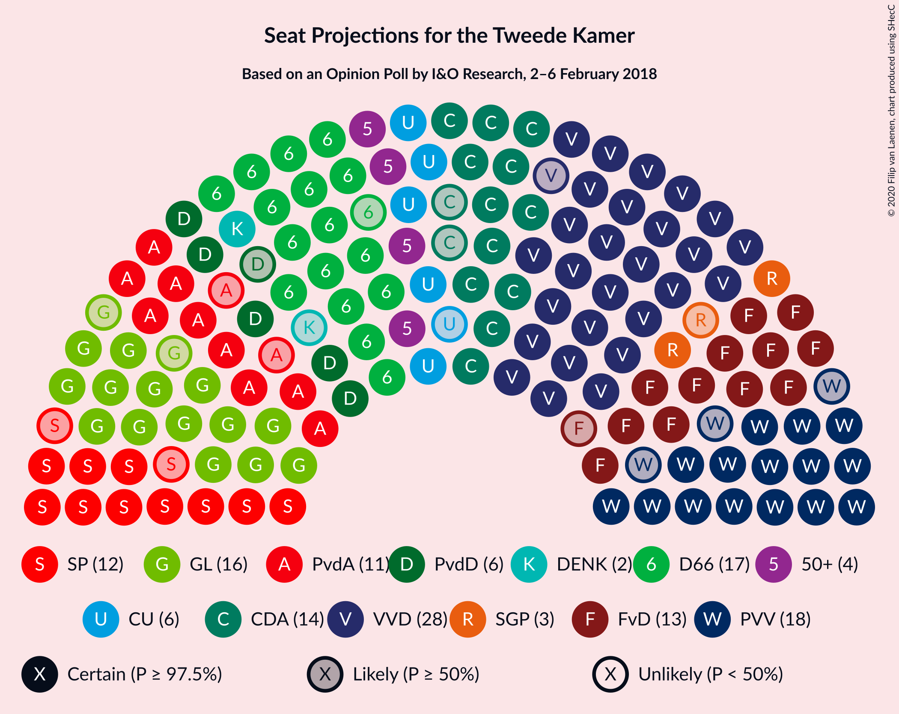

### Confidence Intervals

| Party | Last Result | Median | 80% Confidence Interval | 90% Confidence Interval | 95% Confidence Interval | 99% Confidence Interval |
|:-----:|:-----------:|:------:|:-----------------------:|:-----------------------:|:-----------------------:|:-----------------------:|
| <a href="#volkspartij-voor-vrijheid-en-democratie">Volkspartij voor Vrijheid en Democratie</a> | 33 | 27 | 27–29 |27–29 |27–30 |27–30 |
| <a href="#democraten-66">Democraten 66</a> | 19 | 17 | 17 |16–19 |16–19 |15–19 |
| <a href="#groenlinks">GroenLinks</a> | 14 | 17 | 16–17 |16–17 |16–17 |15–18 |
| <a href="#partij-voor-de-vrijheid">Partij voor de Vrijheid</a> | 20 | 18 | 16–18 |16–18 |16–18 |14–18 |
| <a href="#christen-democratisch-appèl">Christen-Democratisch Appèl</a> | 19 | 14 | 14 |12–15 |12–15 |12–16 |
| <a href="#forum-voor-democratie">Forum voor Democratie</a> | 2 | 12 | 12–13 |12–14 |12–14 |12–14 |
| <a href="#socialistische-partij">Socialistische Partij</a> | 14 | 12 | 11–12 |10–12 |10–12 |10–13 |
| <a href="#partij-van-de-arbeid">Partij van de Arbeid</a> | 9 | 11 | 10–11 |9–11 |9–11 |8–11 |
| <a href="#christenunie">ChristenUnie</a> | 5 | 7 | 6–7 |6–7 |6–7 |5–8 |
| <a href="#partij-voor-de-dieren">Partij voor de Dieren</a> | 5 | 6 | 6 |6–7 |6–7 |5–7 |
| <a href="#50plus">50Plus</a> | 4 | 4 | 4–5 |4–5 |4–5 |4–5 |
| <a href="#staatkundig-gereformeerde-partij">Staatkundig Gereformeerde Partij</a> | 3 | 3 | 3–4 |3–4 |3–4 |2–4 |
| <a href="#denk">DENK</a> | 3 | 2 | 2 |2–3 |2–3 |1–3 |

### Volkspartij voor Vrijheid en Democratie

*For a full overview of the results for this party, see the [Volkspartij voor Vrijheid en Democratie](party-volkspartijvoorvrijheidendemocratie.html) page.*

| Number of Seats | Probability | Accumulated | Special Marks |
|:---------------:|:-----------:|:-----------:|:-------------:|
| 26 | 0.1% | 100% |  |
| 27 | 80% | 99.9% | Median |
| 28 | 8% | 20% |  |
| 29 | 9% | 12% |  |
| 30 | 3% | 3% |  |
| 31 | 0.1% | 0.1% |  |
| 32 | 0% | 0% |  |
| 33 | 0% | 0% | Last Result |

### Democraten 66

*For a full overview of the results for this party, see the [Democraten 66](party-democraten66.html) page.*

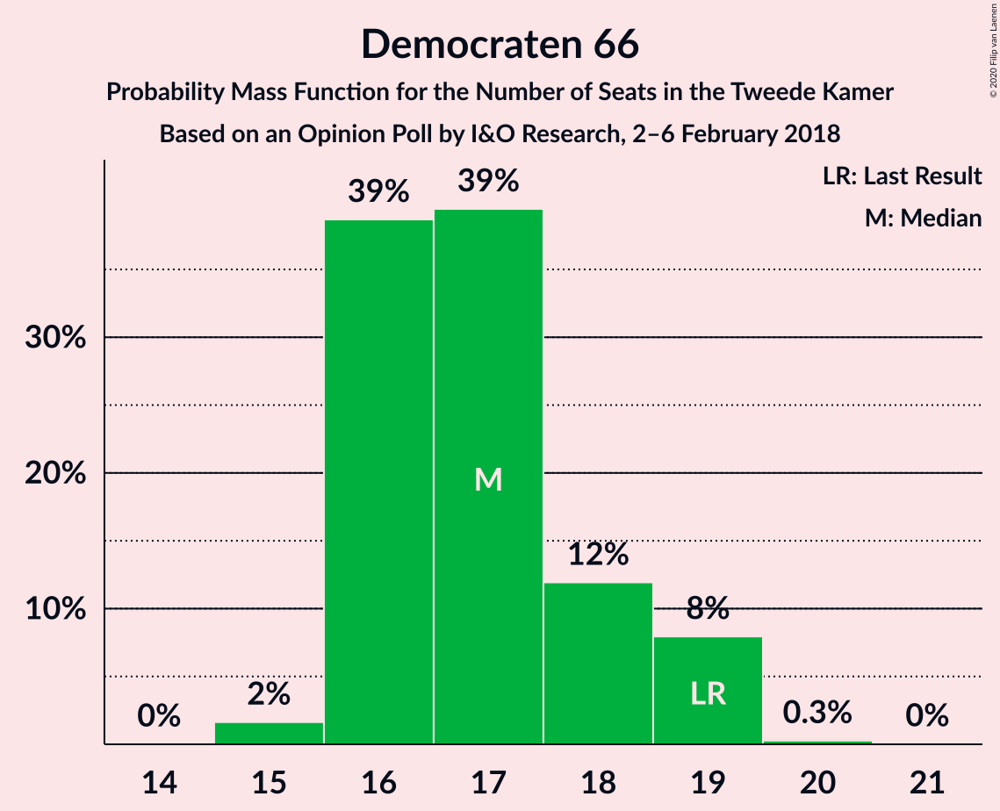

| Number of Seats | Probability | Accumulated | Special Marks |
|:---------------:|:-----------:|:-----------:|:-------------:|
| 15 | 1.2% | 100% |  |
| 16 | 8% | 98.8% |  |
| 17 | 81% | 91% | Median |
| 18 | 2% | 10% |  |
| 19 | 8% | 8% | Last Result |
| 20 | 0% | 0% |  |

### GroenLinks

*For a full overview of the results for this party, see the [GroenLinks](party-groenlinks.html) page.*

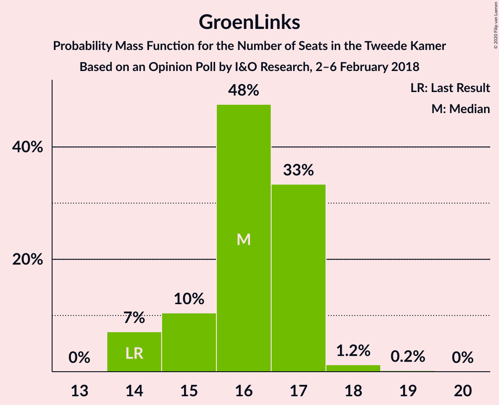

| Number of Seats | Probability | Accumulated | Special Marks |
|:---------------:|:-----------:|:-----------:|:-------------:|
| 14 | 0.2% | 100% | Last Result |
| 15 | 2% | 99.8% |  |
| 16 | 9% | 98% |  |
| 17 | 88% | 89% | Median |
| 18 | 1.2% | 1.2% |  |
| 19 | 0% | 0% |  |

### Partij voor de Vrijheid

*For a full overview of the results for this party, see the [Partij voor de Vrijheid](party-partijvoordevrijheid.html) page.*

| Number of Seats | Probability | Accumulated | Special Marks |
|:---------------:|:-----------:|:-----------:|:-------------:|
| 14 | 0.7% | 100% |  |
| 15 | 0.9% | 99.3% |  |
| 16 | 17% | 98% |  |
| 17 | 0.5% | 81% |  |
| 18 | 80% | 81% | Median |
| 19 | 0.1% | 0.1% |  |
| 20 | 0.1% | 0.1% | Last Result |
| 21 | 0% | 0% |  |

### Christen-Democratisch Appèl

*For a full overview of the results for this party, see the [Christen-Democratisch Appèl](party-christen-democratischappèl.html) page.*

| Number of Seats | Probability | Accumulated | Special Marks |
|:---------------:|:-----------:|:-----------:|:-------------:|
| 12 | 8% | 100% |  |
| 13 | 0.9% | 92% |  |
| 14 | 82% | 91% | Median |
| 15 | 9% | 10% |  |
| 16 | 0.7% | 0.7% |  |
| 17 | 0% | 0% |  |
| 18 | 0% | 0% |  |
| 19 | 0% | 0% | Last Result |

### Forum voor Democratie

*For a full overview of the results for this party, see the [Forum voor Democratie](party-forumvoordemocratie.html) page.*

| Number of Seats | Probability | Accumulated | Special Marks |
|:---------------:|:-----------:|:-----------:|:-------------:|
| 2 | 0% | 100% | Last Result |
| 3 | 0% | 100% |  |
| 4 | 0% | 100% |  |
| 5 | 0% | 100% |  |
| 6 | 0% | 100% |  |
| 7 | 0% | 100% |  |
| 8 | 0% | 100% |  |
| 9 | 0% | 100% |  |
| 10 | 0% | 100% |  |
| 11 | 0.5% | 100% |  |
| 12 | 81% | 99.5% | Median |
| 13 | 9% | 18% |  |
| 14 | 9% | 9% |  |
| 15 | 0.3% | 0.4% |  |
| 16 | 0% | 0% |  |

### Socialistische Partij

*For a full overview of the results for this party, see the [Socialistische Partij](party-socialistischepartij.html) page.*

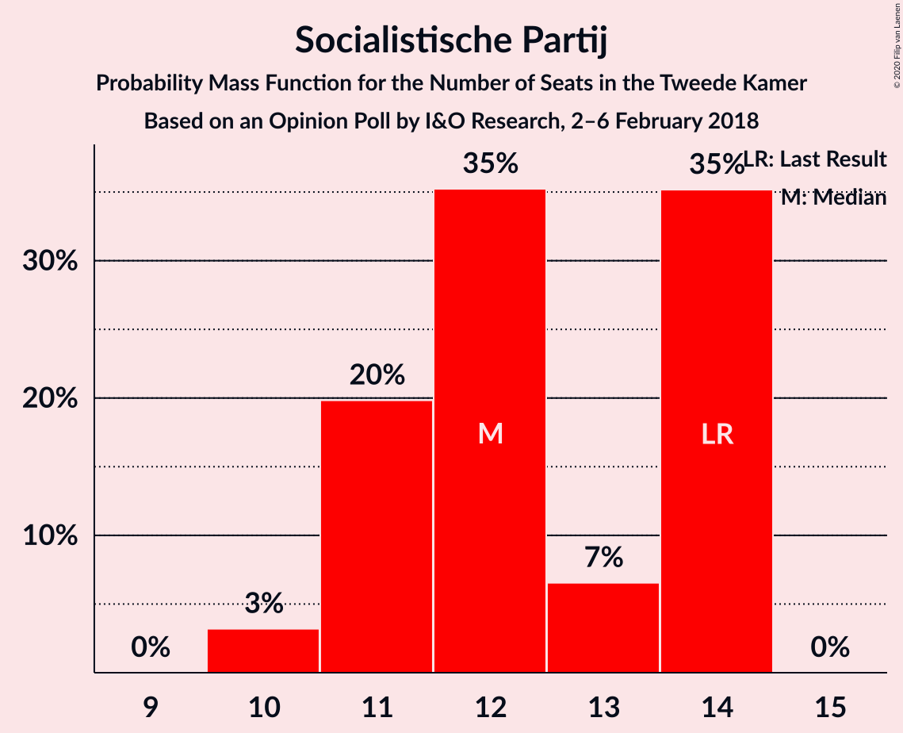

| Number of Seats | Probability | Accumulated | Special Marks |
|:---------------:|:-----------:|:-----------:|:-------------:|
| 10 | 8% | 100% |  |
| 11 | 9% | 92% |  |
| 12 | 81% | 83% | Median |
| 13 | 2% | 2% |  |
| 14 | 0% | 0% | Last Result |

### Partij van de Arbeid

*For a full overview of the results for this party, see the [Partij van de Arbeid](party-partijvandearbeid.html) page.*

| Number of Seats | Probability | Accumulated | Special Marks |
|:---------------:|:-----------:|:-----------:|:-------------:|
| 8 | 0.7% | 100% |  |
| 9 | 8% | 99.3% | Last Result |
| 10 | 1.1% | 91% |  |
| 11 | 89% | 90% | Median |
| 12 | 0.4% | 0.4% |  |
| 13 | 0% | 0% |  |

### ChristenUnie

*For a full overview of the results for this party, see the [ChristenUnie](party-christenunie.html) page.*

| Number of Seats | Probability | Accumulated | Special Marks |
|:---------------:|:-----------:|:-----------:|:-------------:|
| 4 | 0.3% | 100% |  |
| 5 | 1.1% | 99.7% | Last Result |
| 6 | 17% | 98.6% |  |
| 7 | 81% | 81% | Median |
| 8 | 0.7% | 0.7% |  |
| 9 | 0% | 0% |  |

### Partij voor de Dieren

*For a full overview of the results for this party, see the [Partij voor de Dieren](party-partijvoordedieren.html) page.*

| Number of Seats | Probability | Accumulated | Special Marks |
|:---------------:|:-----------:|:-----------:|:-------------:|
| 5 | 1.2% | 100% | Last Result |
| 6 | 90% | 98.8% | Median |
| 7 | 9% | 9% |  |
| 8 | 0% | 0% |  |

### 50Plus

*For a full overview of the results for this party, see the [50Plus](party-50plus.html) page.*

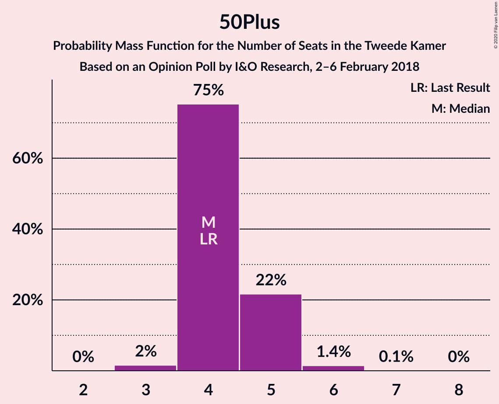

| Number of Seats | Probability | Accumulated | Special Marks |
|:---------------:|:-----------:|:-----------:|:-------------:|
| 3 | 0.1% | 100% |  |
| 4 | 82% | 99.9% | Last Result, Median |
| 5 | 18% | 18% |  |
| 6 | 0.2% | 0.2% |  |
| 7 | 0% | 0% |  |

### Staatkundig Gereformeerde Partij

*For a full overview of the results for this party, see the [Staatkundig Gereformeerde Partij](party-staatkundiggereformeerdepartij.html) page.*

| Number of Seats | Probability | Accumulated | Special Marks |
|:---------------:|:-----------:|:-----------:|:-------------:|
| 2 | 0.7% | 100% |  |
| 3 | 82% | 99.3% | Last Result, Median |
| 4 | 17% | 17% |  |
| 5 | 0% | 0% |  |

### DENK

*For a full overview of the results for this party, see the [DENK](party-denk.html) page.*

| Number of Seats | Probability | Accumulated | Special Marks |
|:---------------:|:-----------:|:-----------:|:-------------:|
| 1 | 0.8% | 100% |  |
| 2 | 90% | 99.2% | Median |
| 3 | 9% | 9% | Last Result |
| 4 | 0% | 0% |  |

## Coalitions

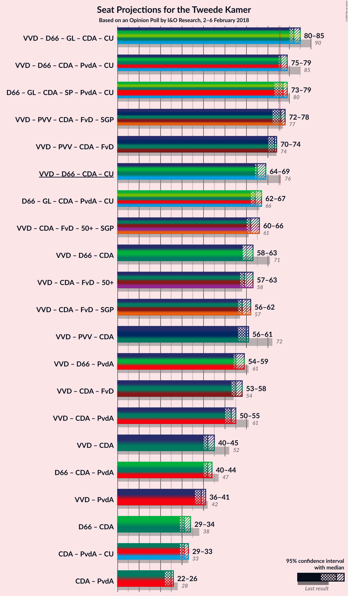

### Confidence Intervals

| Coalition | Last Result | Median | Majority? | 80% Confidence Interval | 90% Confidence Interval | 95% Confidence Interval | 99% Confidence Interval |
|:---------:|:-----------:|:------:|:---------:|:-----------------------:|:-----------------------:|:-----------------------:|:-----------------------:|
| Volkspartij voor Vrijheid en Democratie – Democraten 66 – GroenLinks – Christen-Democratisch Appèl – ChristenUnie | 90 | 82 | 100% | 82–83 | 81–83 | 81–84 | 79–85 |
| Democraten 66 – GroenLinks – Christen-Democratisch Appèl – Socialistische Partij – Partij van de Arbeid – ChristenUnie | 80 | 78 | 83% | 75–78 | 73–78 | 73–78 | 73–78 |
| Volkspartij voor Vrijheid en Democratie – Partij voor de Vrijheid – Christen-Democratisch Appèl – Forum voor Democratie – Staatkundig Gereformeerde Partij | 77 | 74 | 11% | 74–76 | 74–77 | 74–77 | 73–78 |
| Volkspartij voor Vrijheid en Democratie – Democraten 66 – Christen-Democratisch Appèl – Partij van de Arbeid – ChristenUnie | 85 | 76 | 90% | 76 | 75–76 | 75–76 | 74–81 |
| Volkspartij voor Vrijheid en Democratie – Partij voor de Vrijheid – Christen-Democratisch Appèl – Forum voor Democratie | 74 | 71 | 0.3% | 71–73 | 70–73 | 70–73 | 70–74 |
| Volkspartij voor Vrijheid en Democratie – Democraten 66 – Christen-Democratisch Appèl – ChristenUnie | 76 | 65 | 0% | 65–66 | 65–66 | 65–66 | 64–70 |
| Democraten 66 – GroenLinks – Christen-Democratisch Appèl – Partij van de Arbeid – ChristenUnie | 66 | 66 | 0% | 63–66 | 63–66 | 63–66 | 61–66 |
| Volkspartij voor Vrijheid en Democratie – Christen-Democratisch Appèl – Forum voor Democratie – 50Plus – Staatkundig Gereformeerde Partij | 61 | 60 | 0% | 60–64 | 60–66 | 60–66 | 60–66 |
| Volkspartij voor Vrijheid en Democratie – Christen-Democratisch Appèl – Forum voor Democratie – 50Plus | 58 | 57 | 0% | 57–61 | 57–62 | 57–62 | 57–63 |
| Volkspartij voor Vrijheid en Democratie – Christen-Democratisch Appèl – Forum voor Democratie – Staatkundig Gereformeerde Partij | 57 | 56 | 0% | 56–60 | 56–61 | 56–61 | 56–61 |
| Volkspartij voor Vrijheid en Democratie – Democraten 66 – Christen-Democratisch Appèl | 71 | 58 | 0% | 58–60 | 58–60 | 58–60 | 58–63 |
| Volkspartij voor Vrijheid en Democratie – Partij voor de Vrijheid – Christen-Democratisch Appèl | 72 | 59 | 0% | 59–60 | 56–60 | 56–60 | 56–62 |
| Volkspartij voor Vrijheid en Democratie – Democraten 66 – Partij van de Arbeid | 61 | 55 | 0% | 55–57 | 54–58 | 54–58 | 53–59 |
| Volkspartij voor Vrijheid en Democratie – Christen-Democratisch Appèl – Forum voor Democratie | 54 | 53 | 0% | 53–57 | 53–57 | 53–57 | 53–58 |
| Volkspartij voor Vrijheid en Democratie – Christen-Democratisch Appèl – Partij van de Arbeid | 61 | 52 | 0% | 52–53 | 51–53 | 51–54 | 51–56 |
| Volkspartij voor Vrijheid en Democratie – Christen-Democratisch Appèl | 52 | 41 | 0% | 41–44 | 40–44 | 40–44 | 40–46 |
| Democraten 66 – Christen-Democratisch Appèl – Partij van de Arbeid | 47 | 42 | 0% | 41–42 | 40–42 | 40–42 | 37–44 |
| Volkspartij voor Vrijheid en Democratie – Partij van de Arbeid | 42 | 38 | 0% | 38–39 | 38–39 | 38–40 | 38–41 |
| Christen-Democratisch Appèl – Partij van de Arbeid – ChristenUnie | 33 | 32 | 0% | 30–32 | 29–32 | 29–32 | 28–33 |
| Democraten 66 – Christen-Democratisch Appèl | 38 | 31 | 0% | 31 | 31 | 31 | 29–34 |
| Christen-Democratisch Appèl – Partij van de Arbeid | 28 | 25 | 0% | 24–25 | 23–25 | 23–25 | 22–26 |

### Volkspartij voor Vrijheid en Democratie – Democraten 66 – GroenLinks – Christen-Democratisch Appèl – ChristenUnie

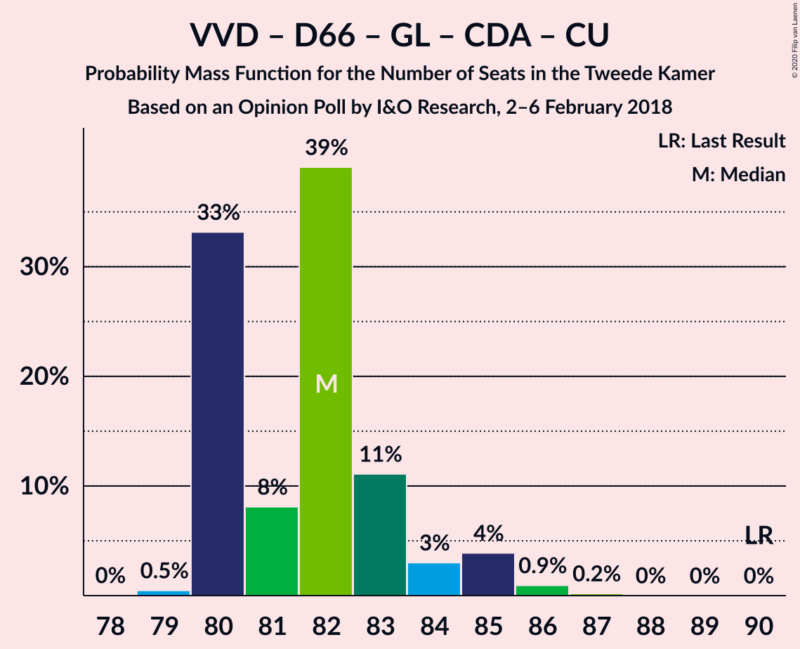

| Number of Seats | Probability | Accumulated | Special Marks |
|:---------------:|:-----------:|:-----------:|:-------------:|
| 79 | 0.8% | 100% |  |
| 80 | 0.2% | 99.2% |  |
| 81 | 8% | 99.0% |  |
| 82 | 80% | 91% | Median |
| 83 | 8% | 11% |  |
| 84 | 1.0% | 3% |  |
| 85 | 2% | 2% |  |
| 86 | 0% | 0.1% |  |
| 87 | 0% | 0% |  |
| 88 | 0% | 0% |  |
| 89 | 0% | 0% |  |
| 90 | 0% | 0% | Last Result |

### Democraten 66 – GroenLinks – Christen-Democratisch Appèl – Socialistische Partij – Partij van de Arbeid – ChristenUnie

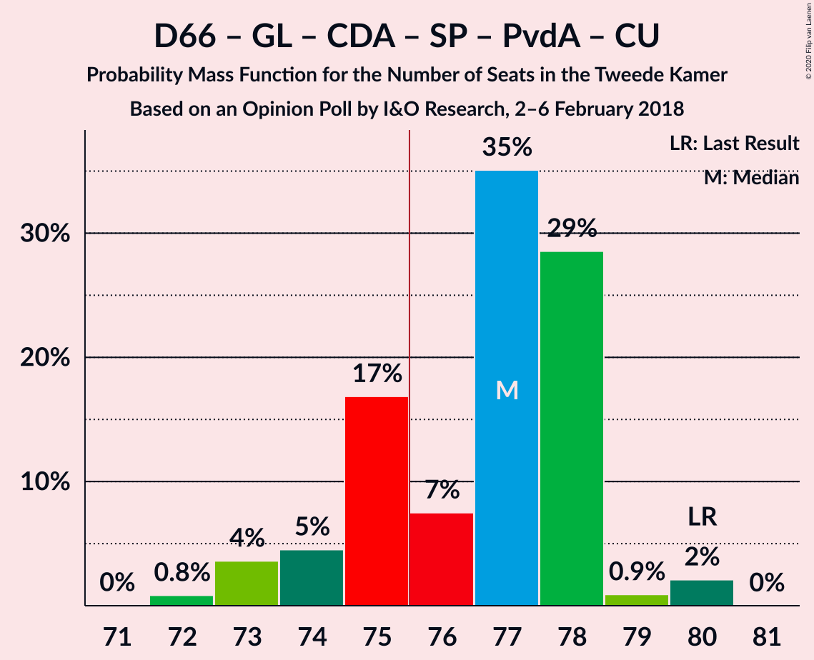

| Number of Seats | Probability | Accumulated | Special Marks |
|:---------------:|:-----------:|:-----------:|:-------------:|
| 72 | 0.3% | 100% |  |
| 73 | 8% | 99.7% |  |
| 74 | 0.3% | 91% |  |
| 75 | 9% | 91% |  |
| 76 | 0.7% | 83% | Majority |
| 77 | 1.3% | 82% |  |
| 78 | 81% | 81% | Median |
| 79 | 0.1% | 0.1% |  |
| 80 | 0% | 0% | Last Result |

### Volkspartij voor Vrijheid en Democratie – Partij voor de Vrijheid – Christen-Democratisch Appèl – Forum voor Democratie – Staatkundig Gereformeerde Partij

| Number of Seats | Probability | Accumulated | Special Marks |
|:---------------:|:-----------:|:-----------:|:-------------:|
| 73 | 0.7% | 100% |  |
| 74 | 88% | 99.3% | Median |
| 75 | 0.8% | 12% |  |
| 76 | 1.3% | 11% | Majority |
| 77 | 9% | 9% | Last Result |
| 78 | 0.3% | 0.5% |  |
| 79 | 0.1% | 0.3% |  |
| 80 | 0.2% | 0.2% |  |
| 81 | 0% | 0% |  |

### Volkspartij voor Vrijheid en Democratie – Democraten 66 – Christen-Democratisch Appèl – Partij van de Arbeid – ChristenUnie

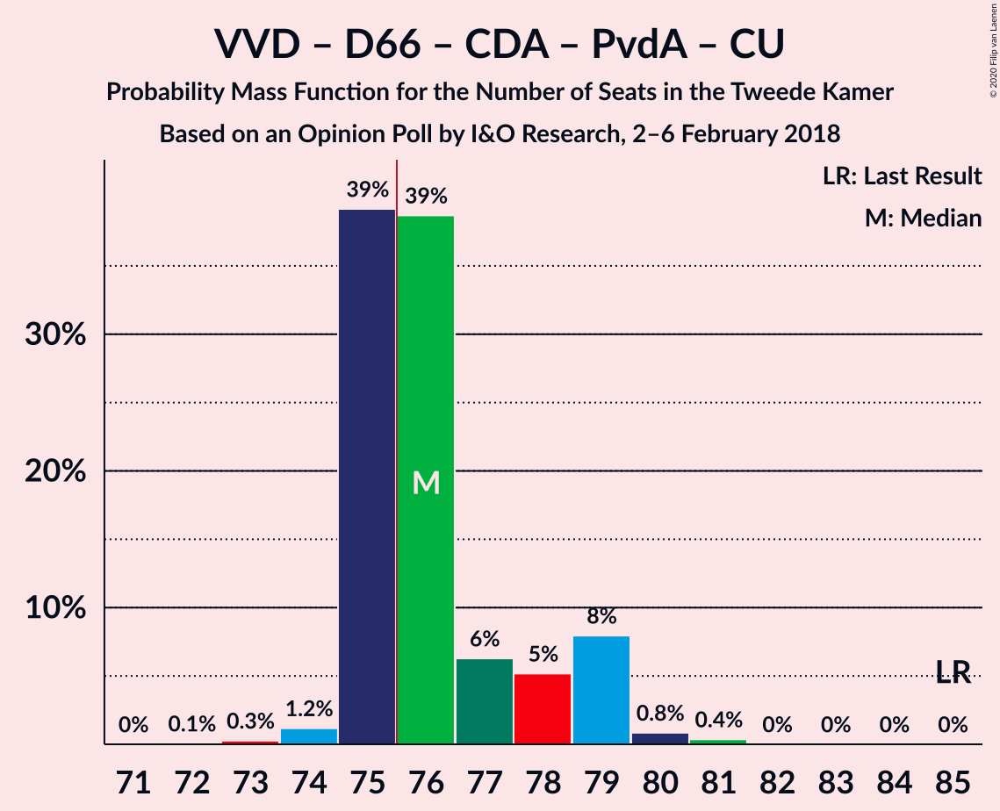

| Number of Seats | Probability | Accumulated | Special Marks |
|:---------------:|:-----------:|:-----------:|:-------------:|
| 73 | 0.1% | 100% |  |
| 74 | 0.7% | 99.9% |  |
| 75 | 9% | 99.1% |  |
| 76 | 88% | 90% | Median, Majority |
| 77 | 0.2% | 2% |  |
| 78 | 0.4% | 2% |  |
| 79 | 0% | 1.5% |  |
| 80 | 0.7% | 1.4% |  |
| 81 | 0.7% | 0.7% |  |
| 82 | 0% | 0% |  |
| 83 | 0% | 0% |  |
| 84 | 0% | 0% |  |
| 85 | 0% | 0% | Last Result |

### Volkspartij voor Vrijheid en Democratie – Partij voor de Vrijheid – Christen-Democratisch Appèl – Forum voor Democratie

| Number of Seats | Probability | Accumulated | Special Marks |
|:---------------:|:-----------:|:-----------:|:-------------:|
| 69 | 0.1% | 100% |  |
| 70 | 8% | 99.9% |  |
| 71 | 81% | 92% | Median |
| 72 | 0.7% | 11% |  |
| 73 | 8% | 10% |  |
| 74 | 2% | 2% | Last Result |
| 75 | 0.2% | 0.4% |  |
| 76 | 0.2% | 0.3% | Majority |
| 77 | 0% | 0% |  |

### Volkspartij voor Vrijheid en Democratie – Democraten 66 – Christen-Democratisch Appèl – ChristenUnie

| Number of Seats | Probability | Accumulated | Special Marks |
|:---------------:|:-----------:|:-----------:|:-------------:|
| 63 | 0% | 100% |  |
| 64 | 1.0% | 99.9% |  |
| 65 | 88% | 99.0% | Median |
| 66 | 9% | 11% |  |
| 67 | 0.5% | 2% |  |
| 68 | 0.1% | 2% |  |
| 69 | 0.3% | 1.5% |  |
| 70 | 1.1% | 1.1% |  |
| 71 | 0% | 0% |  |
| 72 | 0% | 0% |  |
| 73 | 0% | 0% |  |
| 74 | 0% | 0% |  |
| 75 | 0% | 0% |  |
| 76 | 0% | 0% | Last Result, Majority |

### Democraten 66 – GroenLinks – Christen-Democratisch Appèl – Partij van de Arbeid – ChristenUnie

| Number of Seats | Probability | Accumulated | Special Marks |
|:---------------:|:-----------:|:-----------:|:-------------:|
| 61 | 0.8% | 100% |  |
| 62 | 1.0% | 99.2% |  |
| 63 | 8% | 98% |  |
| 64 | 8% | 90% |  |
| 65 | 0.6% | 82% |  |
| 66 | 81% | 81% | Last Result, Median |
| 67 | 0.1% | 0.1% |  |
| 68 | 0% | 0% |  |

### Volkspartij voor Vrijheid en Democratie – Christen-Democratisch Appèl – Forum voor Democratie – 50Plus – Staatkundig Gereformeerde Partij

| Number of Seats | Probability | Accumulated | Special Marks |
|:---------------:|:-----------:|:-----------:|:-------------:|
| 60 | 80% | 100% | Median |
| 61 | 0% | 20% | Last Result |
| 62 | 0.3% | 20% |  |
| 63 | 9% | 20% |  |
| 64 | 2% | 11% |  |
| 65 | 0.5% | 9% |  |
| 66 | 9% | 9% |  |
| 67 | 0.4% | 0.4% |  |
| 68 | 0% | 0% |  |

### Volkspartij voor Vrijheid en Democratie – Christen-Democratisch Appèl – Forum voor Democratie – 50Plus

| Number of Seats | Probability | Accumulated | Special Marks |
|:---------------:|:-----------:|:-----------:|:-------------:|
| 57 | 80% | 100% | Median |
| 58 | 0.1% | 20% | Last Result |
| 59 | 8% | 20% |  |
| 60 | 2% | 12% |  |
| 61 | 0.5% | 10% |  |
| 62 | 9% | 10% |  |
| 63 | 0.6% | 0.7% |  |
| 64 | 0.1% | 0.1% |  |
| 65 | 0% | 0% |  |

### Volkspartij voor Vrijheid en Democratie – Christen-Democratisch Appèl – Forum voor Democratie – Staatkundig Gereformeerde Partij

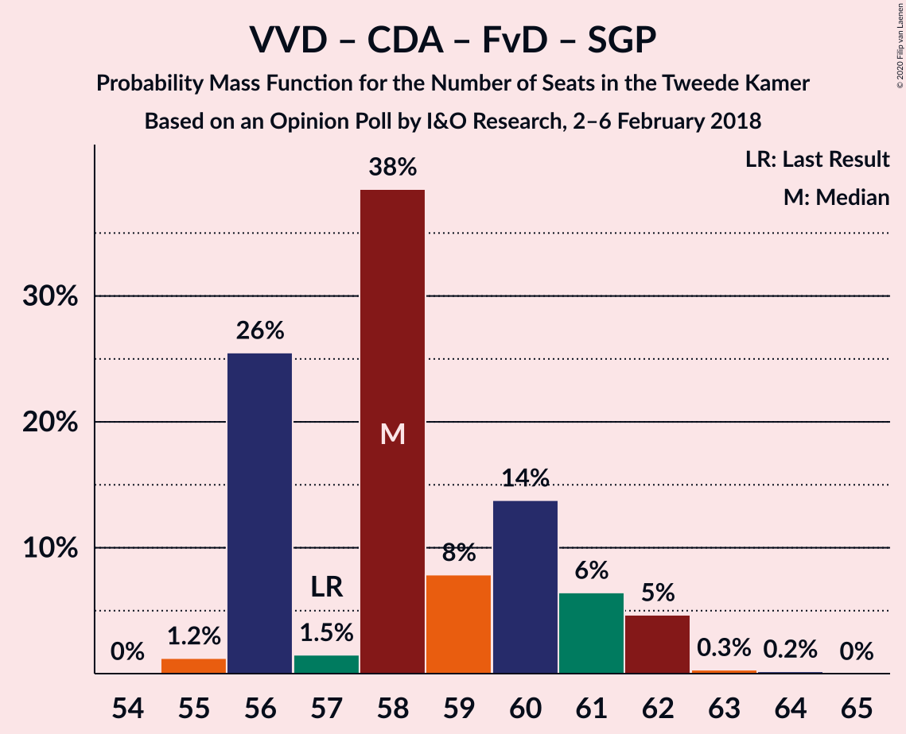

| Number of Seats | Probability | Accumulated | Special Marks |
|:---------------:|:-----------:|:-----------:|:-------------:|
| 56 | 80% | 100% | Median |
| 57 | 0.1% | 20% | Last Result |
| 58 | 8% | 20% |  |
| 59 | 2% | 12% |  |
| 60 | 0.7% | 10% |  |
| 61 | 9% | 9% |  |
| 62 | 0.2% | 0.5% |  |
| 63 | 0.2% | 0.2% |  |
| 64 | 0% | 0% |  |

### Volkspartij voor Vrijheid en Democratie – Democraten 66 – Christen-Democratisch Appèl

| Number of Seats | Probability | Accumulated | Special Marks |
|:---------------:|:-----------:|:-----------:|:-------------:|
| 57 | 0% | 100% |  |
| 58 | 80% | 99.9% | Median |
| 59 | 9% | 20% |  |
| 60 | 9% | 11% |  |
| 61 | 0.4% | 2% |  |
| 62 | 0.9% | 2% |  |
| 63 | 0.4% | 0.8% |  |
| 64 | 0.5% | 0.5% |  |
| 65 | 0% | 0% |  |
| 66 | 0% | 0% |  |
| 67 | 0% | 0% |  |
| 68 | 0% | 0% |  |
| 69 | 0% | 0% |  |
| 70 | 0% | 0% |  |
| 71 | 0% | 0% | Last Result |

### Volkspartij voor Vrijheid en Democratie – Partij voor de Vrijheid – Christen-Democratisch Appèl

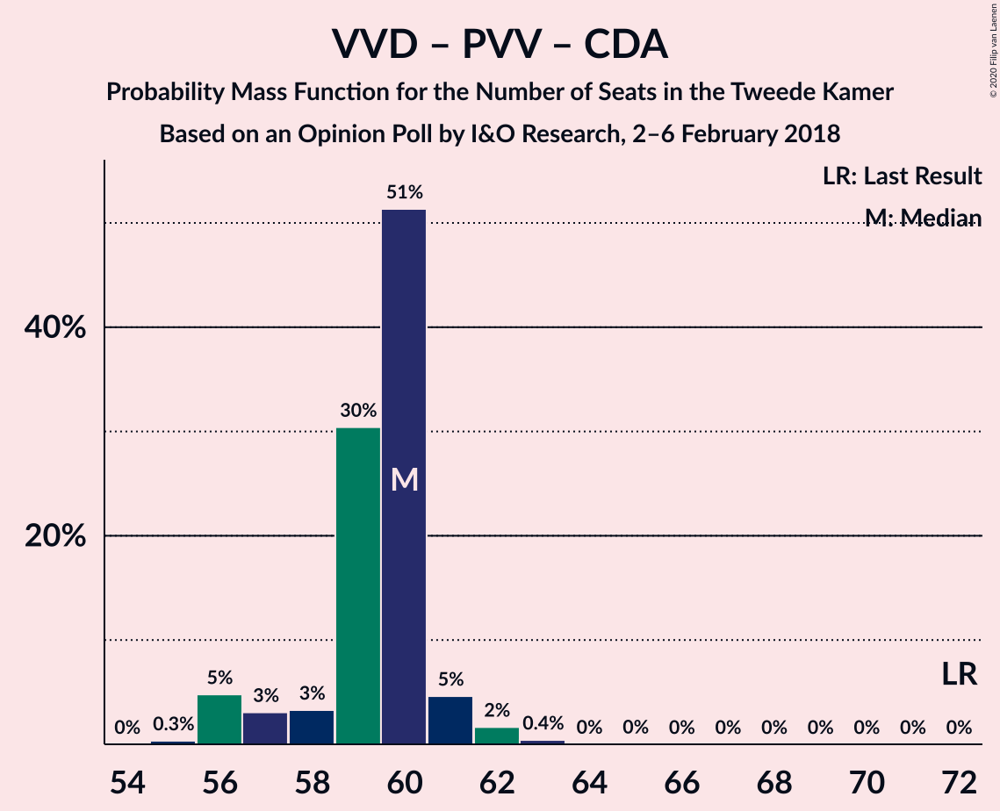

| Number of Seats | Probability | Accumulated | Special Marks |
|:---------------:|:-----------:|:-----------:|:-------------:|
| 56 | 8% | 100% |  |
| 57 | 0.8% | 92% |  |
| 58 | 0.7% | 92% |  |
| 59 | 80% | 91% | Median |
| 60 | 9% | 11% |  |
| 61 | 0.8% | 2% |  |
| 62 | 1.0% | 1.1% |  |
| 63 | 0% | 0% |  |
| 64 | 0% | 0% |  |
| 65 | 0% | 0% |  |
| 66 | 0% | 0% |  |
| 67 | 0% | 0% |  |
| 68 | 0% | 0% |  |
| 69 | 0% | 0% |  |
| 70 | 0% | 0% |  |
| 71 | 0% | 0% |  |
| 72 | 0% | 0% | Last Result |

### Volkspartij voor Vrijheid en Democratie – Democraten 66 – Partij van de Arbeid

| Number of Seats | Probability | Accumulated | Special Marks |
|:---------------:|:-----------:|:-----------:|:-------------:|
| 53 | 0.6% | 100% |  |
| 54 | 8% | 99.4% |  |
| 55 | 80% | 91% | Median |
| 56 | 0.5% | 11% |  |
| 57 | 0.7% | 10% |  |
| 58 | 8% | 10% |  |
| 59 | 1.0% | 1.3% |  |
| 60 | 0.3% | 0.3% |  |
| 61 | 0% | 0% | Last Result |

### Volkspartij voor Vrijheid en Democratie – Christen-Democratisch Appèl – Forum voor Democratie

| Number of Seats | Probability | Accumulated | Special Marks |
|:---------------:|:-----------:|:-----------:|:-------------:|
| 53 | 80% | 100% | Median |
| 54 | 8% | 20% | Last Result |
| 55 | 1.0% | 12% |  |
| 56 | 1.4% | 11% |  |
| 57 | 8% | 10% |  |
| 58 | 1.4% | 2% |  |
| 59 | 0.2% | 0.3% |  |
| 60 | 0% | 0% |  |

### Volkspartij voor Vrijheid en Democratie – Christen-Democratisch Appèl – Partij van de Arbeid

| Number of Seats | Probability | Accumulated | Special Marks |
|:---------------:|:-----------:|:-----------:|:-------------:|
| 49 | 0.1% | 100% |  |
| 50 | 0.1% | 99.9% |  |
| 51 | 8% | 99.8% |  |
| 52 | 81% | 92% | Median |
| 53 | 8% | 11% |  |
| 54 | 0.9% | 3% |  |
| 55 | 1.2% | 2% |  |
| 56 | 0.7% | 0.8% |  |
| 57 | 0.1% | 0.2% |  |
| 58 | 0% | 0% |  |
| 59 | 0% | 0% |  |
| 60 | 0% | 0% |  |
| 61 | 0% | 0% | Last Result |

### Volkspartij voor Vrijheid en Democratie – Christen-Democratisch Appèl

| Number of Seats | Probability | Accumulated | Special Marks |
|:---------------:|:-----------:|:-----------:|:-------------:|
| 39 | 0.1% | 100% |  |
| 40 | 8% | 99.9% |  |
| 41 | 80% | 92% | Median |
| 42 | 0.4% | 12% |  |
| 43 | 0.8% | 12% |  |
| 44 | 10% | 11% |  |
| 45 | 0.4% | 1.1% |  |
| 46 | 0.7% | 0.7% |  |
| 47 | 0% | 0% |  |
| 48 | 0% | 0% |  |
| 49 | 0% | 0% |  |
| 50 | 0% | 0% |  |
| 51 | 0% | 0% |  |
| 52 | 0% | 0% | Last Result |

### Democraten 66 – Christen-Democratisch Appèl – Partij van de Arbeid

| Number of Seats | Probability | Accumulated | Special Marks |
|:---------------:|:-----------:|:-----------:|:-------------:|
| 37 | 0.6% | 100% |  |
| 38 | 0% | 99.4% |  |
| 39 | 0.3% | 99.4% |  |
| 40 | 8% | 99.0% |  |
| 41 | 0.8% | 91% |  |
| 42 | 88% | 90% | Median |
| 43 | 1.0% | 2% |  |
| 44 | 1.0% | 1.0% |  |
| 45 | 0% | 0% |  |
| 46 | 0% | 0% |  |
| 47 | 0% | 0% | Last Result |

### Volkspartij voor Vrijheid en Democratie – Partij van de Arbeid

| Number of Seats | Probability | Accumulated | Special Marks |
|:---------------:|:-----------:|:-----------:|:-------------:|
| 36 | 0.2% | 100% |  |
| 37 | 0.2% | 99.8% |  |
| 38 | 88% | 99.6% | Median |
| 39 | 8% | 11% |  |
| 40 | 1.5% | 3% |  |
| 41 | 2% | 2% |  |
| 42 | 0.1% | 0.1% | Last Result |
| 43 | 0% | 0% |  |

### Christen-Democratisch Appèl – Partij van de Arbeid – ChristenUnie

| Number of Seats | Probability | Accumulated | Special Marks |
|:---------------:|:-----------:|:-----------:|:-------------:|
| 28 | 0.7% | 100% |  |
| 29 | 9% | 99.3% |  |
| 30 | 8% | 91% |  |
| 31 | 0.6% | 82% |  |
| 32 | 81% | 82% | Median |
| 33 | 0.8% | 0.9% | Last Result |
| 34 | 0.1% | 0.1% |  |
| 35 | 0% | 0% |  |

### Democraten 66 – Christen-Democratisch Appèl

| Number of Seats | Probability | Accumulated | Special Marks |
|:---------------:|:-----------:|:-----------:|:-------------:|
| 29 | 0.7% | 100% |  |
| 30 | 1.2% | 99.2% |  |
| 31 | 96% | 98% | Median |
| 32 | 1.2% | 2% |  |
| 33 | 0.5% | 1.0% |  |
| 34 | 0.5% | 0.6% |  |
| 35 | 0% | 0% |  |
| 36 | 0% | 0% |  |
| 37 | 0% | 0% |  |
| 38 | 0% | 0% | Last Result |

### Christen-Democratisch Appèl – Partij van de Arbeid

| Number of Seats | Probability | Accumulated | Special Marks |
|:---------------:|:-----------:|:-----------:|:-------------:|
| 22 | 0.7% | 100% |  |
| 23 | 8% | 99.2% |  |
| 24 | 9% | 91% |  |
| 25 | 81% | 82% | Median |
| 26 | 0.8% | 1.3% |  |
| 27 | 0.4% | 0.5% |  |
| 28 | 0.1% | 0.1% | Last Result |
| 29 | 0% | 0% |  |

## Technical Information

### Opinion Poll

+ **Polling firm:** I&O Research
+ **Commissioner(s):** —
+ **Fieldwork period:** 2–6 February 2018

### Calculations

+ **Sample size:** 3576
+ **Simulations done:** 131,072
+ **Error estimate:** 1.48%

