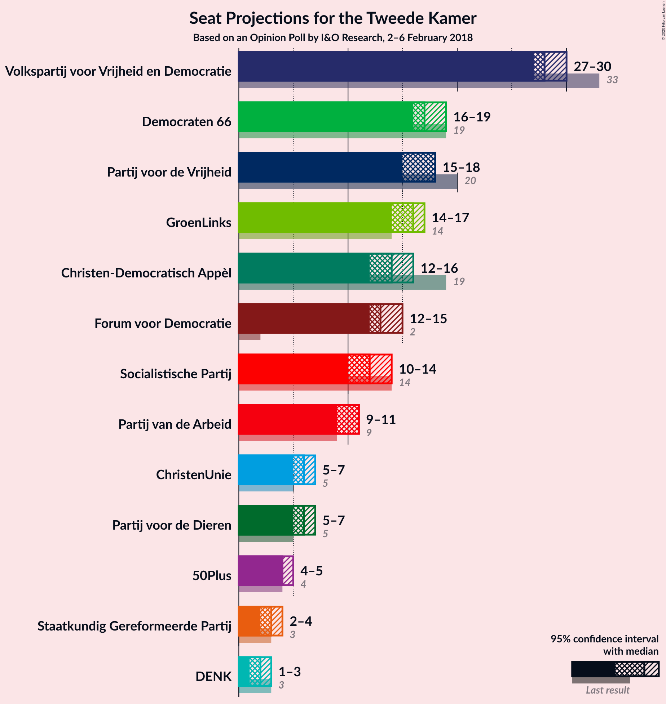
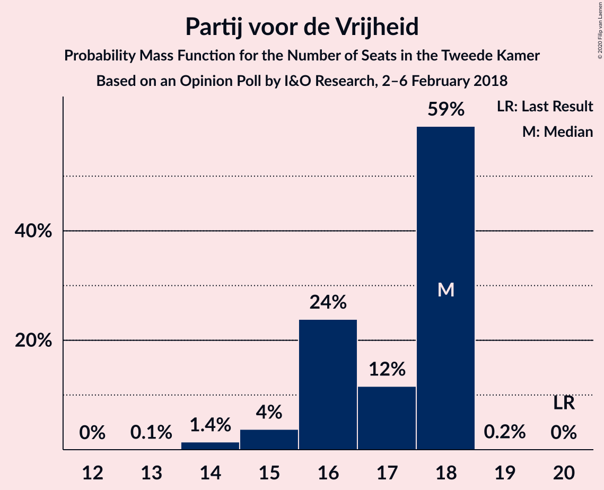
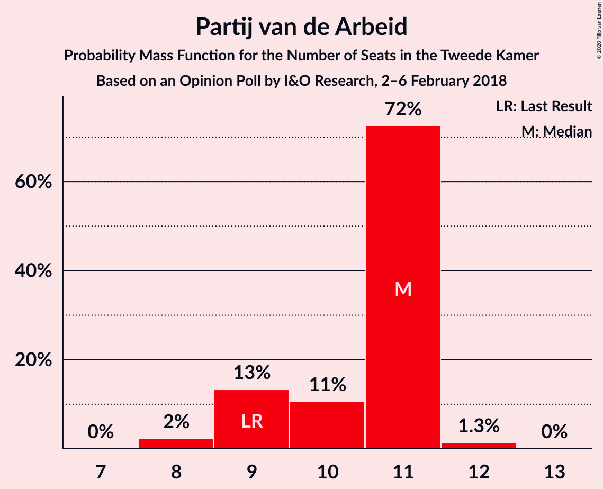
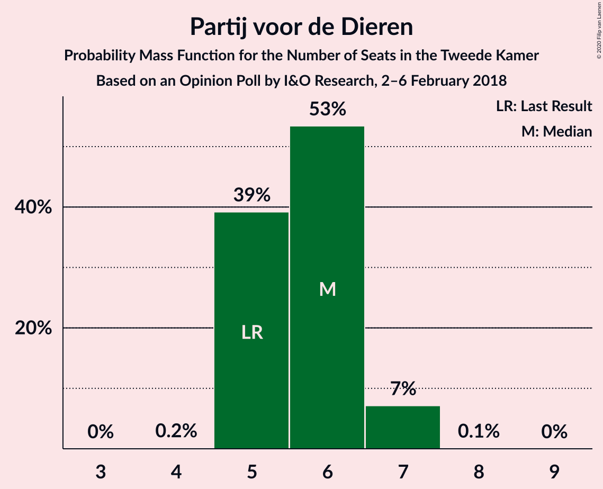
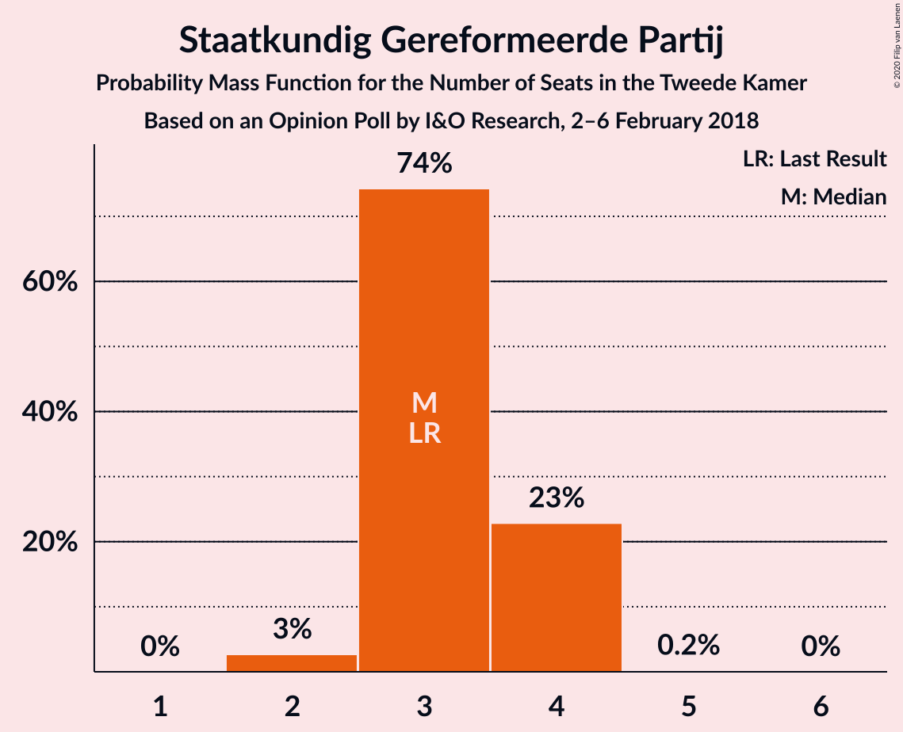
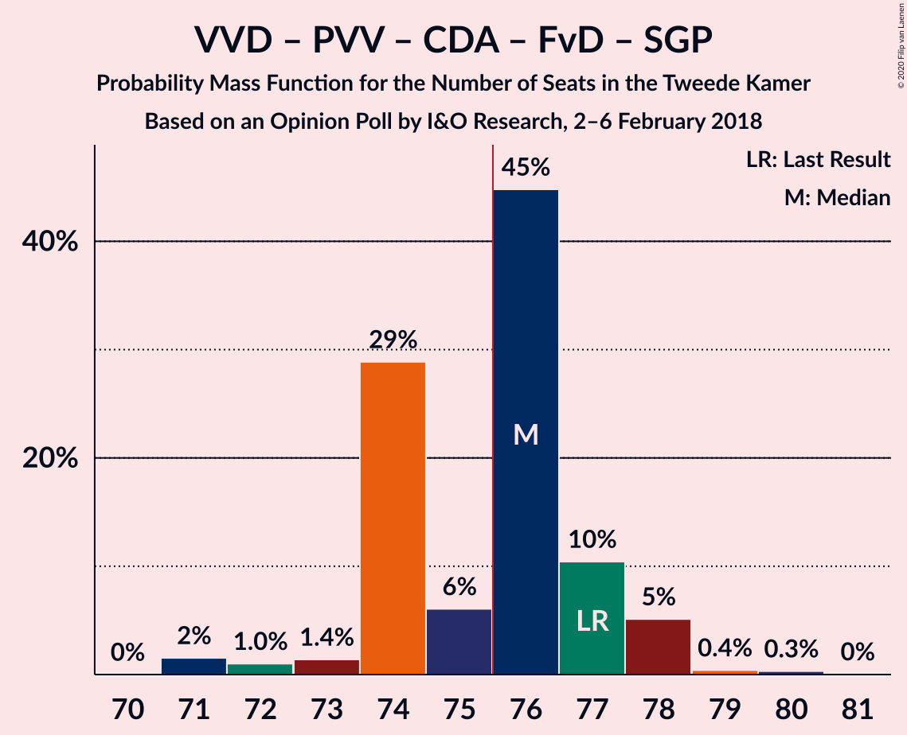
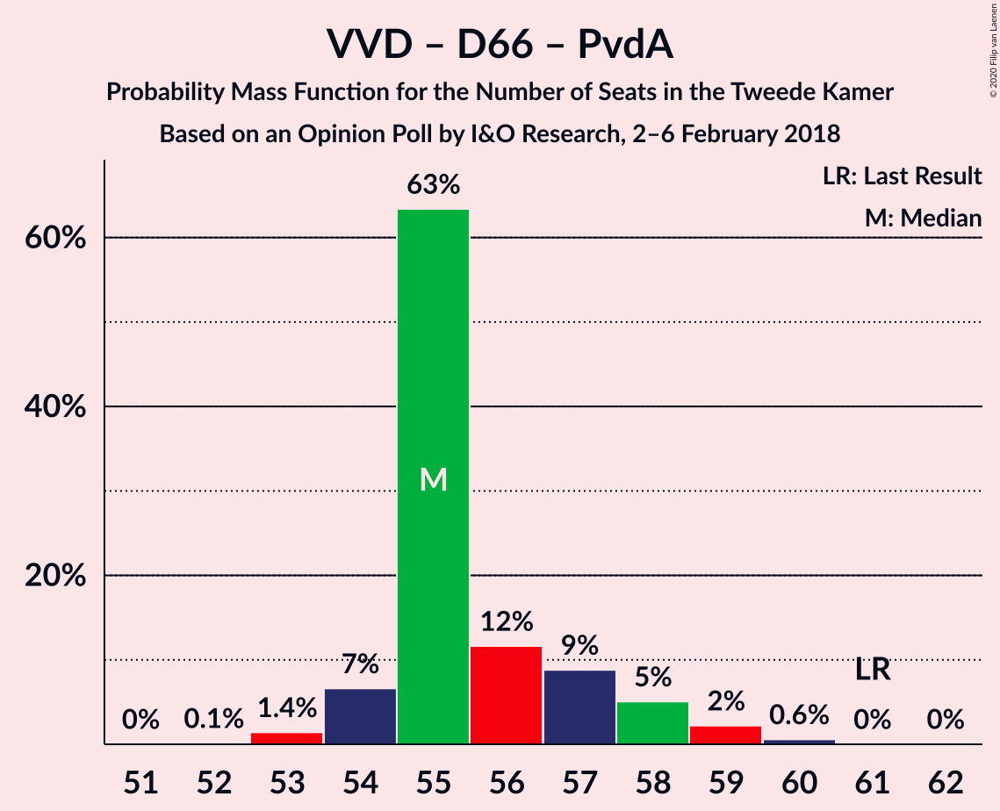
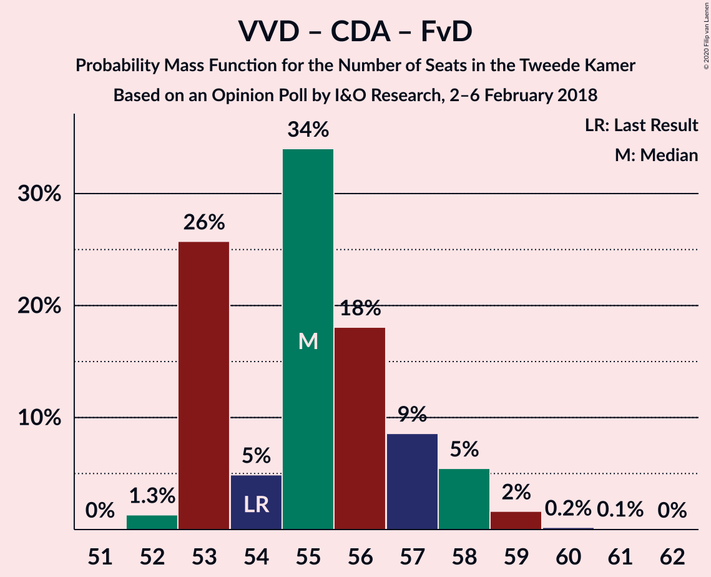
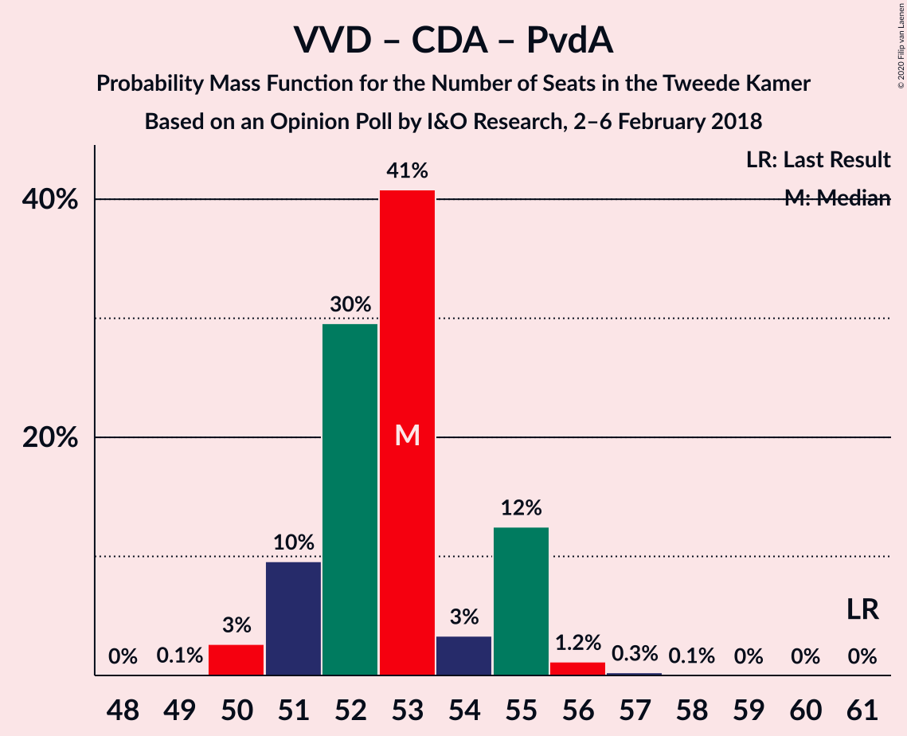

# Opinion Poll by I&O Research, 2–6 February 2018

<a href="#voting-intentions">Voting Intentions</a> | <a href="#seats">Seats</a> | <a href="#coalitions">Coalitions</a> | <a href="#technical-information">Technical Information</a>

## Voting Intentions

### Confidence Intervals

| Party | Last Result | Poll Result | 80% Confidence Interval | 90% Confidence Interval | 95% Confidence Interval | 99% Confidence Interval |
|:-----:|:-----------:|:-----------:|:-----------------------:|:-----------------------:|:-----------------------:|:-----------------------:|
| Volkspartij voor Vrijheid en Democratie | 21.3% | 18.9% | 18.0–19.7% |17.8–20.0% |17.6–20.2% |17.2–20.6% |
| Democraten 66 | 12.2% | 11.3% | 10.6–12.0% |10.4–12.2% |10.3–12.4% |10.0–12.7% |
| GroenLinks | 9.1% | 10.7% | 10.0–11.4% |9.9–11.6% |9.7–11.8% |9.4–12.1% |
| Partij voor de Vrijheid | 13.1% | 10.6% | 9.9–11.3% |9.8–11.5% |9.6–11.6% |9.3–12.0% |
| Christen-Democratisch Appèl | 12.4% | 9.4% | 8.8–10.0% |8.6–10.2% |8.4–10.4% |8.2–10.7% |
| Forum voor Democratie | 1.8% | 8.6% | 8.0–9.2% |7.8–9.4% |7.7–9.6% |7.4–9.9% |
| Socialistische Partij | 9.1% | 7.9% | 7.3–8.5% |7.2–8.7% |7.0–8.8% |6.8–9.1% |
| Partij van de Arbeid | 5.7% | 6.7% | 6.2–7.3% |6.0–7.4% |5.9–7.6% |5.7–7.8% |
| ChristenUnie | 3.4% | 4.3% | 3.9–4.8% |3.7–4.9% |3.7–5.0% |3.5–5.2% |
| Partij voor de Dieren | 3.2% | 4.1% | 3.7–4.5% |3.6–4.7% |3.5–4.8% |3.3–5.0% |
| 50Plus | 3.1% | 3.2% | 2.8–3.6% |2.7–3.7% |2.7–3.8% |2.5–4.0% |
| Staatkundig Gereformeerde Partij | 2.1% | 2.4% | 2.1–2.8% |2.0–2.9% |2.0–3.0% |1.8–3.2% |
| DENK | 2.1% | 1.6% | 1.4–1.9% |1.3–2.0% |1.2–2.1% |1.1–2.2% |

*Note:* The poll result column reflects the actual value used in the calculations. Published results may vary slightly, and in addition be rounded to fewer digits.

## Seats

### Confidence Intervals

| Party | Last Result | Median | 80% Confidence Interval | 90% Confidence Interval | 95% Confidence Interval | 99% Confidence Interval |
|:-----:|:-----------:|:------:|:-----------------------:|:-----------------------:|:-----------------------:|:-----------------------:|
| <a href="#volkspartij-voor-vrijheid-en-democratie">Volkspartij voor Vrijheid en Democratie</a> | 33 | 28 | 27–29 |27–30 |27–30 |26–32 |
| <a href="#democraten-66">Democraten 66</a> | 19 | 17 | 16–18 |16–19 |16–19 |15–19 |
| <a href="#groenlinks">GroenLinks</a> | 14 | 16 | 15–17 |14–17 |14–17 |14–18 |
| <a href="#partij-voor-de-vrijheid">Partij voor de Vrijheid</a> | 20 | 18 | 16–18 |15–18 |15–18 |14–18 |
| <a href="#christen-democratisch-appèl">Christen-Democratisch Appèl</a> | 19 | 14 | 14–15 |13–16 |12–16 |12–16 |
| <a href="#forum-voor-democratie">Forum voor Democratie</a> | 2 | 13 | 12–14 |12–15 |12–15 |11–15 |
| <a href="#socialistische-partij">Socialistische Partij</a> | 14 | 12 | 11–14 |11–14 |10–14 |10–14 |
| <a href="#partij-van-de-arbeid">Partij van de Arbeid</a> | 9 | 11 | 9–11 |9–11 |9–11 |8–12 |
| <a href="#christenunie">ChristenUnie</a> | 5 | 6 | 6–7 |6–7 |5–7 |5–8 |
| <a href="#partij-voor-de-dieren">Partij voor de Dieren</a> | 5 | 6 | 5–6 |5–7 |5–7 |5–7 |
| <a href="#50plus">50Plus</a> | 4 | 4 | 4–5 |4–5 |4–5 |3–6 |
| <a href="#staatkundig-gereformeerde-partij">Staatkundig Gereformeerde Partij</a> | 3 | 3 | 3–4 |3–4 |2–4 |2–4 |
| <a href="#denk">DENK</a> | 3 | 2 | 2 |2–3 |1–3 |1–3 |

### Volkspartij voor Vrijheid en Democratie

*For a full overview of the results for this party, see the [Volkspartij voor Vrijheid en Democratie](party-volkspartijvoorvrijheidendemocratie.html) page.*

| Number of Seats | Probability | Accumulated | Special Marks |
|:---------------:|:-----------:|:-----------:|:-------------:|
| 26 | 2% | 100% |  |
| 27 | 30% | 98% |  |
| 28 | 44% | 69% | Median |
| 29 | 17% | 24% |  |
| 30 | 5% | 7% |  |
| 31 | 1.1% | 2% |  |
| 32 | 1.0% | 1.3% |  |
| 33 | 0.3% | 0.3% | Last Result |
| 34 | 0% | 0% |  |

### Democraten 66

*For a full overview of the results for this party, see the [Democraten 66](party-democraten66.html) page.*

| Number of Seats | Probability | Accumulated | Special Marks |
|:---------------:|:-----------:|:-----------:|:-------------:|
| 15 | 2% | 100% |  |
| 16 | 39% | 98% |  |
| 17 | 39% | 60% | Median |
| 18 | 12% | 20% |  |
| 19 | 8% | 8% | Last Result |
| 20 | 0.3% | 0.3% |  |
| 21 | 0% | 0% |  |

### GroenLinks

*For a full overview of the results for this party, see the [GroenLinks](party-groenlinks.html) page.*

| Number of Seats | Probability | Accumulated | Special Marks |
|:---------------:|:-----------:|:-----------:|:-------------:|
| 14 | 7% | 100% | Last Result |
| 15 | 10% | 93% |  |
| 16 | 48% | 82% | Median |
| 17 | 33% | 35% |  |
| 18 | 1.2% | 1.4% |  |
| 19 | 0.2% | 0.2% |  |
| 20 | 0% | 0% |  |

### Partij voor de Vrijheid

*For a full overview of the results for this party, see the [Partij voor de Vrijheid](party-partijvoordevrijheid.html) page.*

| Number of Seats | Probability | Accumulated | Special Marks |
|:---------------:|:-----------:|:-----------:|:-------------:|
| 13 | 0.1% | 100% |  |
| 14 | 1.4% | 99.9% |  |
| 15 | 4% | 98.5% |  |
| 16 | 24% | 95% |  |
| 17 | 12% | 71% |  |
| 18 | 59% | 59% | Median |
| 19 | 0.2% | 0.2% |  |
| 20 | 0% | 0% | Last Result |

### Christen-Democratisch Appèl

*For a full overview of the results for this party, see the [Christen-Democratisch Appèl](party-christen-democratischappèl.html) page.*

| Number of Seats | Probability | Accumulated | Special Marks |
|:---------------:|:-----------:|:-----------:|:-------------:|
| 11 | 0.1% | 100% |  |
| 12 | 4% | 99.9% |  |
| 13 | 3% | 96% |  |
| 14 | 71% | 93% | Median |
| 15 | 17% | 22% |  |
| 16 | 5% | 5% |  |
| 17 | 0.2% | 0.2% |  |
| 18 | 0% | 0% |  |
| 19 | 0% | 0% | Last Result |

### Forum voor Democratie

*For a full overview of the results for this party, see the [Forum voor Democratie](party-forumvoordemocratie.html) page.*

| Number of Seats | Probability | Accumulated | Special Marks |
|:---------------:|:-----------:|:-----------:|:-------------:|
| 2 | 0% | 100% | Last Result |
| 3 | 0% | 100% |  |
| 4 | 0% | 100% |  |
| 5 | 0% | 100% |  |
| 6 | 0% | 100% |  |
| 7 | 0% | 100% |  |
| 8 | 0% | 100% |  |
| 9 | 0% | 100% |  |
| 10 | 0% | 100% |  |
| 11 | 1.3% | 100% |  |
| 12 | 38% | 98.7% |  |
| 13 | 46% | 61% | Median |
| 14 | 10% | 15% |  |
| 15 | 6% | 6% |  |
| 16 | 0% | 0% |  |

### Socialistische Partij

*For a full overview of the results for this party, see the [Socialistische Partij](party-socialistischepartij.html) page.*

| Number of Seats | Probability | Accumulated | Special Marks |
|:---------------:|:-----------:|:-----------:|:-------------:|
| 10 | 3% | 100% |  |
| 11 | 20% | 97% |  |
| 12 | 35% | 77% | Median |
| 13 | 7% | 42% |  |
| 14 | 35% | 35% | Last Result |
| 15 | 0% | 0% |  |

### Partij van de Arbeid

*For a full overview of the results for this party, see the [Partij van de Arbeid](party-partijvandearbeid.html) page.*

| Number of Seats | Probability | Accumulated | Special Marks |
|:---------------:|:-----------:|:-----------:|:-------------:|
| 8 | 2% | 100% |  |
| 9 | 13% | 98% | Last Result |
| 10 | 11% | 84% |  |
| 11 | 72% | 74% | Median |
| 12 | 1.3% | 1.3% |  |
| 13 | 0% | 0% |  |

### ChristenUnie

*For a full overview of the results for this party, see the [ChristenUnie](party-christenunie.html) page.*

| Number of Seats | Probability | Accumulated | Special Marks |
|:---------------:|:-----------:|:-----------:|:-------------:|
| 4 | 0.1% | 100% |  |
| 5 | 4% | 99.9% | Last Result |
| 6 | 53% | 96% | Median |
| 7 | 43% | 43% |  |
| 8 | 0.7% | 0.7% |  |
| 9 | 0% | 0% |  |

### Partij voor de Dieren

*For a full overview of the results for this party, see the [Partij voor de Dieren](party-partijvoordedieren.html) page.*

| Number of Seats | Probability | Accumulated | Special Marks |
|:---------------:|:-----------:|:-----------:|:-------------:|
| 4 | 0.2% | 100% |  |
| 5 | 39% | 99.8% | Last Result |
| 6 | 53% | 61% | Median |
| 7 | 7% | 7% |  |
| 8 | 0.1% | 0.1% |  |
| 9 | 0% | 0% |  |

### 50Plus

*For a full overview of the results for this party, see the [50Plus](party-50plus.html) page.*

| Number of Seats | Probability | Accumulated | Special Marks |
|:---------------:|:-----------:|:-----------:|:-------------:|
| 3 | 2% | 100% |  |
| 4 | 75% | 98% | Last Result, Median |
| 5 | 22% | 23% |  |
| 6 | 1.4% | 2% |  |
| 7 | 0.1% | 0.1% |  |
| 8 | 0% | 0% |  |

### Staatkundig Gereformeerde Partij

*For a full overview of the results for this party, see the [Staatkundig Gereformeerde Partij](party-staatkundiggereformeerdepartij.html) page.*

| Number of Seats | Probability | Accumulated | Special Marks |
|:---------------:|:-----------:|:-----------:|:-------------:|
| 2 | 3% | 100% |  |
| 3 | 74% | 97% | Last Result, Median |
| 4 | 23% | 23% |  |
| 5 | 0.2% | 0.2% |  |
| 6 | 0% | 0% |  |

### DENK

*For a full overview of the results for this party, see the [DENK](party-denk.html) page.*

| Number of Seats | Probability | Accumulated | Special Marks |
|:---------------:|:-----------:|:-----------:|:-------------:|
| 1 | 3% | 100% |  |
| 2 | 89% | 97% | Median |
| 3 | 8% | 8% | Last Result |
| 4 | 0% | 0% |  |

## Coalitions

### Confidence Intervals

| Coalition | Last Result | Median | Majority? | 80% Confidence Interval | 90% Confidence Interval | 95% Confidence Interval | 99% Confidence Interval |
|:---------:|:-----------:|:------:|:---------:|:-----------------------:|:-----------------------:|:-----------------------:|:-----------------------:|
| Volkspartij voor Vrijheid en Democratie – Democraten 66 – GroenLinks – Christen-Democratisch Appèl – ChristenUnie | 90 | 82 | 100% | 80–83 | 80–85 | 80–85 | 79–86 |
| Volkspartij voor Vrijheid en Democratie – Democraten 66 – Christen-Democratisch Appèl – Partij van de Arbeid – ChristenUnie | 85 | 76 | 59% | 75–78 | 75–79 | 75–79 | 74–80 |
| Democraten 66 – GroenLinks – Christen-Democratisch Appèl – Socialistische Partij – Partij van de Arbeid – ChristenUnie | 80 | 77 | 74% | 75–78 | 74–78 | 73–79 | 72–80 |
| Volkspartij voor Vrijheid en Democratie – Partij voor de Vrijheid – Christen-Democratisch Appèl – Forum voor Democratie – Staatkundig Gereformeerde Partij | 77 | 76 | 61% | 74–77 | 74–78 | 72–78 | 71–79 |
| Volkspartij voor Vrijheid en Democratie – Partij voor de Vrijheid – Christen-Democratisch Appèl – Forum voor Democratie | 74 | 73 | 0.6% | 71–74 | 70–74 | 70–74 | 68–76 |
| Volkspartij voor Vrijheid en Democratie – Democraten 66 – Christen-Democratisch Appèl – ChristenUnie | 76 | 65 | 0% | 64–68 | 64–68 | 64–69 | 63–70 |
| Democraten 66 – GroenLinks – Christen-Democratisch Appèl – Partij van de Arbeid – ChristenUnie | 66 | 64 | 0% | 63–66 | 63–66 | 62–67 | 60–68 |
| Volkspartij voor Vrijheid en Democratie – Christen-Democratisch Appèl – Forum voor Democratie – 50Plus – Staatkundig Gereformeerde Partij | 61 | 62 | 0% | 60–65 | 60–66 | 60–66 | 60–67 |
| Volkspartij voor Vrijheid en Democratie – Democraten 66 – Christen-Democratisch Appèl | 71 | 58 | 0% | 58–61 | 58–62 | 58–63 | 57–64 |
| Volkspartij voor Vrijheid en Democratie – Christen-Democratisch Appèl – Forum voor Democratie – 50Plus | 58 | 59 | 0% | 57–62 | 57–62 | 57–63 | 57–64 |
| Volkspartij voor Vrijheid en Democratie – Christen-Democratisch Appèl – Forum voor Democratie – Staatkundig Gereformeerde Partij | 57 | 58 | 0% | 56–61 | 56–62 | 56–62 | 55–63 |
| Volkspartij voor Vrijheid en Democratie – Partij voor de Vrijheid – Christen-Democratisch Appèl | 72 | 60 | 0% | 58–60 | 56–61 | 56–61 | 56–62 |
| Volkspartij voor Vrijheid en Democratie – Democraten 66 – Partij van de Arbeid | 61 | 55 | 0% | 55–57 | 54–58 | 54–59 | 53–60 |
| Volkspartij voor Vrijheid en Democratie – Christen-Democratisch Appèl – Forum voor Democratie | 54 | 55 | 0% | 53–57 | 53–58 | 53–58 | 52–59 |
| Volkspartij voor Vrijheid en Democratie – Christen-Democratisch Appèl – Partij van de Arbeid | 61 | 53 | 0% | 51–55 | 51–55 | 50–55 | 50–56 |
| Volkspartij voor Vrijheid en Democratie – Christen-Democratisch Appèl | 52 | 42 | 0% | 41–44 | 41–44 | 40–45 | 40–46 |
| Democraten 66 – Christen-Democratisch Appèl – Partij van de Arbeid | 47 | 42 | 0% | 40–43 | 40–44 | 40–44 | 38–45 |
| Volkspartij voor Vrijheid en Democratie – Partij van de Arbeid | 42 | 39 | 0% | 37–40 | 37–40 | 36–41 | 36–42 |
| Democraten 66 – Christen-Democratisch Appèl | 38 | 31 | 0% | 30–33 | 30–33 | 29–34 | 28–35 |
| Christen-Democratisch Appèl – Partij van de Arbeid – ChristenUnie | 33 | 31 | 0% | 29–32 | 29–33 | 29–33 | 27–34 |
| Christen-Democratisch Appèl – Partij van de Arbeid | 28 | 25 | 0% | 23–26 | 23–26 | 22–26 | 22–28 |

### Volkspartij voor Vrijheid en Democratie – Democraten 66 – GroenLinks – Christen-Democratisch Appèl – ChristenUnie

| Number of Seats | Probability | Accumulated | Special Marks |
|:---------------:|:-----------:|:-----------:|:-------------:|
| 79 | 0.5% | 100% |  |
| 80 | 33% | 99.5% |  |
| 81 | 8% | 66% | Median |
| 82 | 39% | 58% |  |
| 83 | 11% | 19% |  |
| 84 | 3% | 8% |  |
| 85 | 4% | 5% |  |
| 86 | 0.9% | 1.1% |  |
| 87 | 0.2% | 0.2% |  |
| 88 | 0% | 0% |  |
| 89 | 0% | 0% |  |
| 90 | 0% | 0% | Last Result |

### Volkspartij voor Vrijheid en Democratie – Democraten 66 – Christen-Democratisch Appèl – Partij van de Arbeid – ChristenUnie

| Number of Seats | Probability | Accumulated | Special Marks |
|:---------------:|:-----------:|:-----------:|:-------------:|
| 72 | 0.1% | 100% |  |
| 73 | 0.3% | 99.9% |  |
| 74 | 1.2% | 99.7% |  |
| 75 | 39% | 98% |  |
| 76 | 39% | 59% | Median, Majority |
| 77 | 6% | 21% |  |
| 78 | 5% | 14% |  |
| 79 | 8% | 9% |  |
| 80 | 0.8% | 1.2% |  |
| 81 | 0.4% | 0.4% |  |
| 82 | 0% | 0% |  |
| 83 | 0% | 0% |  |
| 84 | 0% | 0% |  |
| 85 | 0% | 0% | Last Result |

### Democraten 66 – GroenLinks – Christen-Democratisch Appèl – Socialistische Partij – Partij van de Arbeid – ChristenUnie

| Number of Seats | Probability | Accumulated | Special Marks |
|:---------------:|:-----------:|:-----------:|:-------------:|
| 72 | 0.8% | 100% |  |
| 73 | 4% | 99.1% |  |
| 74 | 5% | 96% |  |
| 75 | 17% | 91% |  |
| 76 | 7% | 74% | Median, Majority |
| 77 | 35% | 67% |  |
| 78 | 29% | 32% |  |
| 79 | 0.9% | 3% |  |
| 80 | 2% | 2% | Last Result |
| 81 | 0% | 0% |  |

### Volkspartij voor Vrijheid en Democratie – Partij voor de Vrijheid – Christen-Democratisch Appèl – Forum voor Democratie – Staatkundig Gereformeerde Partij

| Number of Seats | Probability | Accumulated | Special Marks |
|:---------------:|:-----------:|:-----------:|:-------------:|
| 71 | 2% | 100% |  |
| 72 | 1.0% | 98% |  |
| 73 | 1.4% | 97% |  |
| 74 | 29% | 96% |  |
| 75 | 6% | 67% |  |
| 76 | 45% | 61% | Median, Majority |
| 77 | 10% | 16% | Last Result |
| 78 | 5% | 6% |  |
| 79 | 0.4% | 0.8% |  |
| 80 | 0.3% | 0.4% |  |
| 81 | 0% | 0% |  |

### Volkspartij voor Vrijheid en Democratie – Partij voor de Vrijheid – Christen-Democratisch Appèl – Forum voor Democratie

| Number of Seats | Probability | Accumulated | Special Marks |
|:---------------:|:-----------:|:-----------:|:-------------:|
| 68 | 2% | 100% |  |
| 69 | 0.8% | 98% |  |
| 70 | 4% | 98% |  |
| 71 | 28% | 94% |  |
| 72 | 13% | 65% |  |
| 73 | 40% | 53% | Median |
| 74 | 11% | 13% | Last Result |
| 75 | 2% | 2% |  |
| 76 | 0.3% | 0.6% | Majority |
| 77 | 0.3% | 0.3% |  |
| 78 | 0% | 0% |  |

### Volkspartij voor Vrijheid en Democratie – Democraten 66 – Christen-Democratisch Appèl – ChristenUnie

| Number of Seats | Probability | Accumulated | Special Marks |
|:---------------:|:-----------:|:-----------:|:-------------:|
| 63 | 0.5% | 100% |  |
| 64 | 33% | 99.5% |  |
| 65 | 31% | 67% | Median |
| 66 | 11% | 36% |  |
| 67 | 10% | 25% |  |
| 68 | 12% | 14% |  |
| 69 | 1.4% | 3% |  |
| 70 | 1.1% | 1.2% |  |
| 71 | 0.1% | 0.1% |  |
| 72 | 0% | 0% |  |
| 73 | 0% | 0% |  |
| 74 | 0% | 0% |  |
| 75 | 0% | 0% |  |
| 76 | 0% | 0% | Last Result, Majority |

### Democraten 66 – GroenLinks – Christen-Democratisch Appèl – Partij van de Arbeid – ChristenUnie

| Number of Seats | Probability | Accumulated | Special Marks |
|:---------------:|:-----------:|:-----------:|:-------------:|
| 59 | 0% | 100% |  |
| 60 | 0.9% | 99.9% |  |
| 61 | 1.0% | 99.1% |  |
| 62 | 3% | 98% |  |
| 63 | 41% | 95% |  |
| 64 | 21% | 54% | Median |
| 65 | 6% | 33% |  |
| 66 | 25% | 28% | Last Result |
| 67 | 2% | 3% |  |
| 68 | 1.4% | 1.4% |  |
| 69 | 0% | 0% |  |

### Volkspartij voor Vrijheid en Democratie – Christen-Democratisch Appèl – Forum voor Democratie – 50Plus – Staatkundig Gereformeerde Partij

| Number of Seats | Probability | Accumulated | Special Marks |
|:---------------:|:-----------:|:-----------:|:-------------:|
| 60 | 26% | 100% |  |
| 61 | 2% | 74% | Last Result |
| 62 | 34% | 72% | Median |
| 63 | 10% | 38% |  |
| 64 | 9% | 29% |  |
| 65 | 10% | 19% |  |
| 66 | 8% | 9% |  |
| 67 | 0.8% | 1.0% |  |
| 68 | 0.2% | 0.3% |  |
| 69 | 0% | 0.1% |  |
| 70 | 0% | 0% |  |

### Volkspartij voor Vrijheid en Democratie – Democraten 66 – Christen-Democratisch Appèl

| Number of Seats | Probability | Accumulated | Special Marks |
|:---------------:|:-----------:|:-----------:|:-------------:|
| 56 | 0.1% | 100% |  |
| 57 | 0.7% | 99.9% |  |
| 58 | 57% | 99.2% |  |
| 59 | 10% | 42% | Median |
| 60 | 10% | 32% |  |
| 61 | 17% | 22% |  |
| 62 | 2% | 5% |  |
| 63 | 3% | 4% |  |
| 64 | 0.9% | 1.0% |  |
| 65 | 0.1% | 0.1% |  |
| 66 | 0% | 0% |  |
| 67 | 0% | 0% |  |
| 68 | 0% | 0% |  |
| 69 | 0% | 0% |  |
| 70 | 0% | 0% |  |
| 71 | 0% | 0% | Last Result |

### Volkspartij voor Vrijheid en Democratie – Christen-Democratisch Appèl – Forum voor Democratie – 50Plus

| Number of Seats | Probability | Accumulated | Special Marks |
|:---------------:|:-----------:|:-----------:|:-------------:|
| 56 | 0.1% | 100% |  |
| 57 | 26% | 99.9% |  |
| 58 | 4% | 74% | Last Result |
| 59 | 35% | 70% | Median |
| 60 | 9% | 35% |  |
| 61 | 15% | 27% |  |
| 62 | 9% | 12% |  |
| 63 | 2% | 3% |  |
| 64 | 0.5% | 0.7% |  |
| 65 | 0.2% | 0.2% |  |
| 66 | 0% | 0% |  |

### Volkspartij voor Vrijheid en Democratie – Christen-Democratisch Appèl – Forum voor Democratie – Staatkundig Gereformeerde Partij

| Number of Seats | Probability | Accumulated | Special Marks |
|:---------------:|:-----------:|:-----------:|:-------------:|
| 55 | 1.2% | 100% |  |
| 56 | 26% | 98.8% |  |
| 57 | 1.5% | 73% | Last Result |
| 58 | 38% | 72% | Median |
| 59 | 8% | 33% |  |
| 60 | 14% | 25% |  |
| 61 | 6% | 12% |  |
| 62 | 5% | 5% |  |
| 63 | 0.3% | 0.5% |  |
| 64 | 0.2% | 0.2% |  |
| 65 | 0% | 0% |  |

### Volkspartij voor Vrijheid en Democratie – Partij voor de Vrijheid – Christen-Democratisch Appèl

| Number of Seats | Probability | Accumulated | Special Marks |
|:---------------:|:-----------:|:-----------:|:-------------:|
| 55 | 0.3% | 100% |  |
| 56 | 5% | 99.7% |  |
| 57 | 3% | 95% |  |
| 58 | 3% | 92% |  |
| 59 | 30% | 89% |  |
| 60 | 51% | 58% | Median |
| 61 | 5% | 7% |  |
| 62 | 2% | 2% |  |
| 63 | 0.4% | 0.5% |  |
| 64 | 0% | 0.1% |  |
| 65 | 0% | 0% |  |
| 66 | 0% | 0% |  |
| 67 | 0% | 0% |  |
| 68 | 0% | 0% |  |
| 69 | 0% | 0% |  |
| 70 | 0% | 0% |  |
| 71 | 0% | 0% |  |
| 72 | 0% | 0% | Last Result |

### Volkspartij voor Vrijheid en Democratie – Democraten 66 – Partij van de Arbeid

| Number of Seats | Probability | Accumulated | Special Marks |
|:---------------:|:-----------:|:-----------:|:-------------:|
| 52 | 0.1% | 100% |  |
| 53 | 1.4% | 99.8% |  |
| 54 | 7% | 98% |  |
| 55 | 63% | 92% |  |
| 56 | 12% | 28% | Median |
| 57 | 9% | 17% |  |
| 58 | 5% | 8% |  |
| 59 | 2% | 3% |  |
| 60 | 0.6% | 0.6% |  |
| 61 | 0% | 0.1% | Last Result |
| 62 | 0% | 0% |  |

### Volkspartij voor Vrijheid en Democratie – Christen-Democratisch Appèl – Forum voor Democratie

| Number of Seats | Probability | Accumulated | Special Marks |
|:---------------:|:-----------:|:-----------:|:-------------:|
| 52 | 1.3% | 100% |  |
| 53 | 26% | 98.7% |  |
| 54 | 5% | 73% | Last Result |
| 55 | 34% | 68% | Median |
| 56 | 18% | 34% |  |
| 57 | 9% | 16% |  |
| 58 | 5% | 7% |  |
| 59 | 2% | 2% |  |
| 60 | 0.2% | 0.3% |  |
| 61 | 0.1% | 0.1% |  |
| 62 | 0% | 0% |  |

### Volkspartij voor Vrijheid en Democratie – Christen-Democratisch Appèl – Partij van de Arbeid

| Number of Seats | Probability | Accumulated | Special Marks |
|:---------------:|:-----------:|:-----------:|:-------------:|
| 49 | 0.1% | 100% |  |
| 50 | 3% | 99.9% |  |
| 51 | 10% | 97% |  |
| 52 | 30% | 88% |  |
| 53 | 41% | 58% | Median |
| 54 | 3% | 17% |  |
| 55 | 12% | 14% |  |
| 56 | 1.2% | 1.5% |  |
| 57 | 0.3% | 0.3% |  |
| 58 | 0.1% | 0.1% |  |
| 59 | 0% | 0% |  |
| 60 | 0% | 0% |  |
| 61 | 0% | 0% | Last Result |

### Volkspartij voor Vrijheid en Democratie – Christen-Democratisch Appèl

| Number of Seats | Probability | Accumulated | Special Marks |
|:---------------:|:-----------:|:-----------:|:-------------:|
| 40 | 4% | 100% |  |
| 41 | 28% | 96% |  |
| 42 | 36% | 68% | Median |
| 43 | 12% | 31% |  |
| 44 | 15% | 19% |  |
| 45 | 3% | 4% |  |
| 46 | 1.2% | 1.3% |  |
| 47 | 0.1% | 0.1% |  |
| 48 | 0% | 0% |  |
| 49 | 0% | 0% |  |
| 50 | 0% | 0% |  |
| 51 | 0% | 0% |  |
| 52 | 0% | 0% | Last Result |

### Democraten 66 – Christen-Democratisch Appèl – Partij van de Arbeid

| Number of Seats | Probability | Accumulated | Special Marks |
|:---------------:|:-----------:|:-----------:|:-------------:|
| 37 | 0.3% | 100% |  |
| 38 | 0.8% | 99.7% |  |
| 39 | 1.1% | 98.9% |  |
| 40 | 8% | 98% |  |
| 41 | 38% | 89% |  |
| 42 | 37% | 52% | Median |
| 43 | 9% | 15% |  |
| 44 | 4% | 6% |  |
| 45 | 2% | 2% |  |
| 46 | 0% | 0% |  |
| 47 | 0% | 0% | Last Result |

### Volkspartij voor Vrijheid en Democratie – Partij van de Arbeid

| Number of Seats | Probability | Accumulated | Special Marks |
|:---------------:|:-----------:|:-----------:|:-------------:|
| 36 | 3% | 100% |  |
| 37 | 11% | 97% |  |
| 38 | 30% | 86% |  |
| 39 | 41% | 56% | Median |
| 40 | 11% | 15% |  |
| 41 | 3% | 4% |  |
| 42 | 1.4% | 1.4% | Last Result |
| 43 | 0% | 0.1% |  |
| 44 | 0% | 0% |  |

### Democraten 66 – Christen-Democratisch Appèl

| Number of Seats | Probability | Accumulated | Special Marks |
|:---------------:|:-----------:|:-----------:|:-------------:|
| 28 | 0.7% | 100% |  |
| 29 | 2% | 99.2% |  |
| 30 | 34% | 97% |  |
| 31 | 37% | 63% | Median |
| 32 | 13% | 26% |  |
| 33 | 10% | 13% |  |
| 34 | 2% | 3% |  |
| 35 | 0.9% | 0.9% |  |
| 36 | 0% | 0% |  |
| 37 | 0% | 0% |  |
| 38 | 0% | 0% | Last Result |

### Christen-Democratisch Appèl – Partij van de Arbeid – ChristenUnie

| Number of Seats | Probability | Accumulated | Special Marks |
|:---------------:|:-----------:|:-----------:|:-------------:|
| 27 | 0.5% | 100% |  |
| 28 | 2% | 99.4% |  |
| 29 | 8% | 98% |  |
| 30 | 12% | 90% |  |
| 31 | 38% | 78% | Median |
| 32 | 31% | 40% |  |
| 33 | 8% | 9% | Last Result |
| 34 | 0.6% | 0.6% |  |
| 35 | 0% | 0% |  |

### Christen-Democratisch Appèl – Partij van de Arbeid

| Number of Seats | Probability | Accumulated | Special Marks |
|:---------------:|:-----------:|:-----------:|:-------------:|
| 21 | 0.2% | 100% |  |
| 22 | 4% | 99.8% |  |
| 23 | 10% | 96% |  |
| 24 | 11% | 86% |  |
| 25 | 61% | 75% | Median |
| 26 | 12% | 14% |  |
| 27 | 2% | 2% |  |
| 28 | 0.6% | 0.6% | Last Result |
| 29 | 0% | 0% |  |

## Technical Information

### Opinion Poll

+ **Polling firm:** I&O Research
+ **Commissioner(s):** —
+ **Fieldwork period:** 2–6 February 2018

### Calculations

+ **Sample size:** 3576
+ **Simulations done:** 1,048,576
+ **Error estimate:** 1.17%

