# Opinion Poll by Peil.nl, 5–11 February 2018

<a href="#voting-intentions">Voting Intentions</a> | <a href="#seats">Seats</a> | <a href="#coalitions">Coalitions</a> | <a href="#technical-information">Technical Information</a>

## Voting Intentions

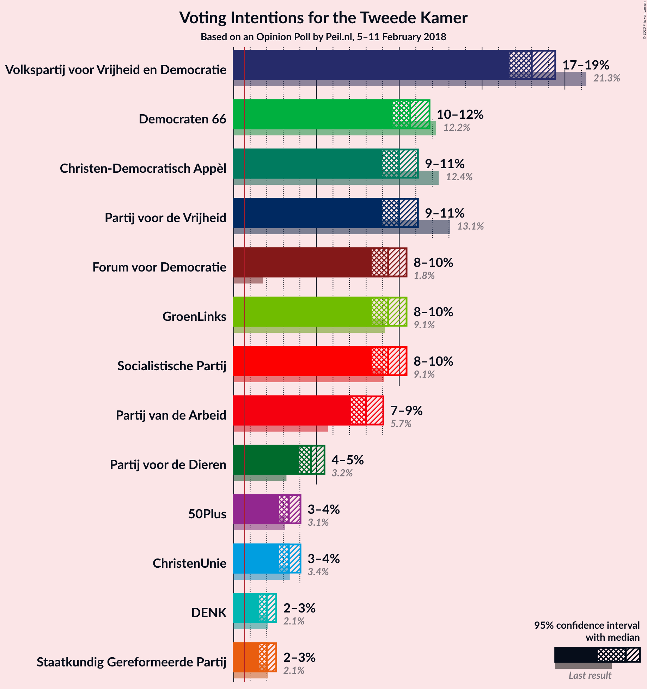

### Confidence Intervals

| Party | Last Result | Poll Result | 80% Confidence Interval | 90% Confidence Interval | 95% Confidence Interval | 99% Confidence Interval |
|:-----:|:-----------:|:-----------:|:-----------------------:|:-----------------------:|:-----------------------:|:-----------------------:|
| Volkspartij voor Vrijheid en Democratie | 21.3% | 18.0% | 17.1–18.9% |16.9–19.2% |16.7–19.4% |16.2–19.9% |
| Democraten 66 | 12.2% | 10.7% | 10.0–11.4% |9.8–11.6% |9.6–11.8% |9.3–12.2% |
| Partij voor de Vrijheid | 13.1% | 10.0% | 9.3–10.7% |9.1–10.9% |9.0–11.1% |8.7–11.5% |
| Christen-Democratisch Appèl | 12.4% | 10.0% | 9.3–10.7% |9.1–10.9% |9.0–11.1% |8.7–11.5% |
| GroenLinks | 9.1% | 9.3% | 8.7–10.1% |8.5–10.3% |8.3–10.4% |8.0–10.8% |
| Socialistische Partij | 9.1% | 9.3% | 8.7–10.1% |8.5–10.3% |8.3–10.4% |8.0–10.8% |
| Forum voor Democratie | 1.8% | 9.3% | 8.7–10.1% |8.5–10.3% |8.3–10.4% |8.0–10.8% |
| Partij van de Arbeid | 5.7% | 8.0% | 7.4–8.7% |7.2–8.9% |7.1–9.0% |6.8–9.4% |
| Partij voor de Dieren | 3.2% | 4.7% | 4.2–5.2% |4.1–5.3% |4.0–5.5% |3.7–5.8% |
| ChristenUnie | 3.4% | 3.3% | 2.9–3.8% |2.8–3.9% |2.7–4.0% |2.6–4.3% |
| 50Plus | 3.1% | 3.3% | 2.9–3.8% |2.8–3.9% |2.7–4.0% |2.6–4.3% |
| Staatkundig Gereformeerde Partij | 2.1% | 2.0% | 1.7–2.4% |1.6–2.5% |1.6–2.6% |1.4–2.8% |
| DENK | 2.1% | 2.0% | 1.7–2.4% |1.6–2.5% |1.6–2.6% |1.4–2.8% |

*Note:* The poll result column reflects the actual value used in the calculations. Published results may vary slightly, and in addition be rounded to fewer digits.

## Seats

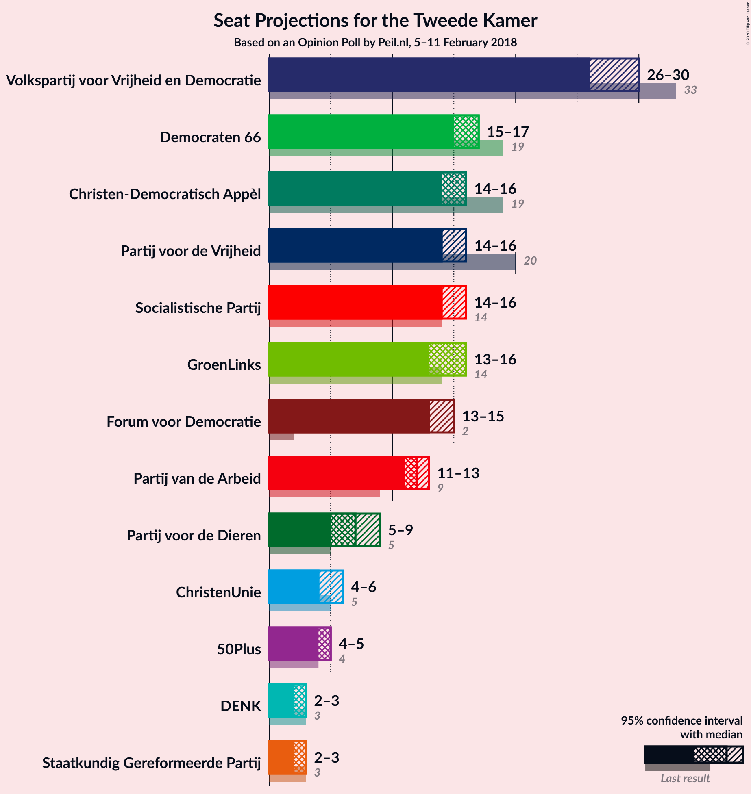

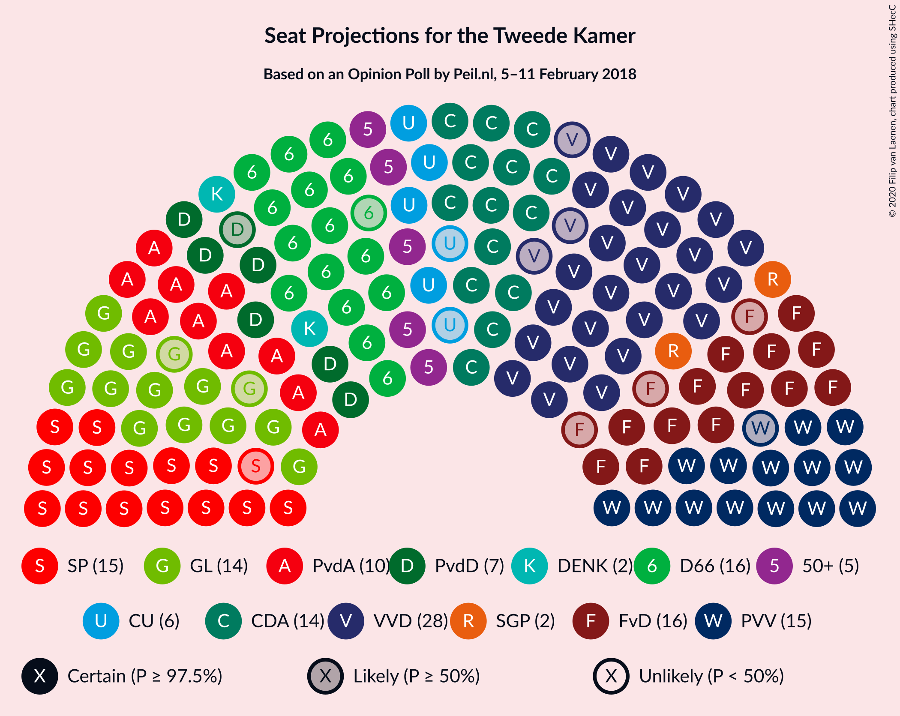

### Confidence Intervals

| Party | Last Result | Median | 80% Confidence Interval | 90% Confidence Interval | 95% Confidence Interval | 99% Confidence Interval |
|:-----:|:-----------:|:------:|:-----------------------:|:-----------------------:|:-----------------------:|:-----------------------:|
| <a href="#volkspartij-voor-vrijheid-en-democratie">Volkspartij voor Vrijheid en Democratie</a> | 33 | 28 | 28–30 |28–30 |25–30 |25–30 |
| <a href="#democraten-66">Democraten 66</a> | 19 | 16 | 16–17 |16–17 |15–17 |15–18 |
| <a href="#partij-voor-de-vrijheid">Partij voor de Vrijheid</a> | 20 | 15 | 14–16 |14–16 |14–16 |14–17 |
| <a href="#christen-democratisch-appèl">Christen-Democratisch Appèl</a> | 19 | 14 | 14–15 |14–15 |14–15 |14–17 |
| <a href="#groenlinks">GroenLinks</a> | 14 | 14 | 12–14 |12–14 |12–15 |12–15 |
| <a href="#socialistische-partij">Socialistische Partij</a> | 14 | 15 | 15–16 |15–16 |14–16 |11–16 |
| <a href="#forum-voor-democratie">Forum voor Democratie</a> | 2 | 16 | 13–16 |13–16 |13–16 |13–16 |
| <a href="#partij-van-de-arbeid">Partij van de Arbeid</a> | 9 | 10 | 10–13 |10–13 |10–13 |10–14 |
| <a href="#partij-voor-de-dieren">Partij voor de Dieren</a> | 5 | 7 | 6–8 |6–8 |6–8 |6–8 |
| <a href="#christenunie">ChristenUnie</a> | 5 | 6 | 4–6 |4–6 |4–6 |4–6 |
| <a href="#50plus">50Plus</a> | 4 | 5 | 5 |5 |5 |4–6 |
| <a href="#staatkundig-gereformeerde-partij">Staatkundig Gereformeerde Partij</a> | 3 | 2 | 2–3 |2–3 |2–3 |2–4 |
| <a href="#denk">DENK</a> | 3 | 2 | 2–3 |2–3 |2–4 |2–4 |

### Volkspartij voor Vrijheid en Democratie

*For a full overview of the results for this party, see the [Volkspartij voor Vrijheid en Democratie](party-volkspartijvoorvrijheidendemocratie.html) page.*

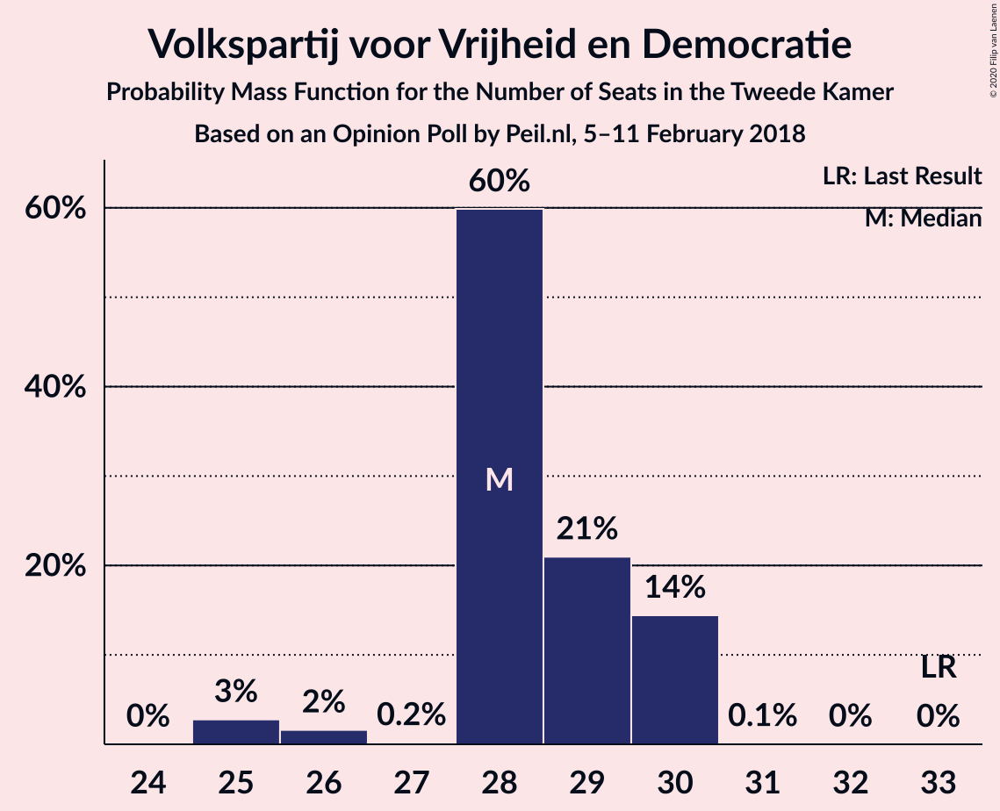

| Number of Seats | Probability | Accumulated | Special Marks |
|:---------------:|:-----------:|:-----------:|:-------------:|
| 25 | 3% | 100% |  |
| 26 | 2% | 97% |  |
| 27 | 0.2% | 96% |  |
| 28 | 60% | 95% | Median |
| 29 | 21% | 36% |  |
| 30 | 14% | 15% |  |
| 31 | 0.1% | 0.1% |  |
| 32 | 0% | 0% |  |
| 33 | 0% | 0% | Last Result |

### Democraten 66

*For a full overview of the results for this party, see the [Democraten 66](party-democraten66.html) page.*

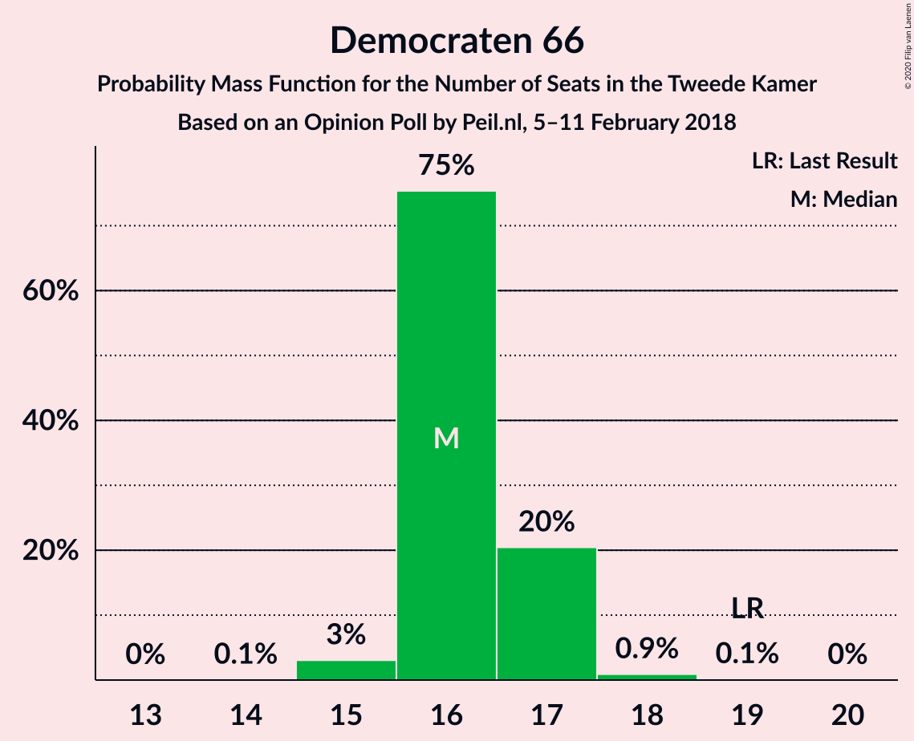

| Number of Seats | Probability | Accumulated | Special Marks |
|:---------------:|:-----------:|:-----------:|:-------------:|
| 14 | 0.1% | 100% |  |
| 15 | 3% | 99.9% |  |
| 16 | 75% | 97% | Median |
| 17 | 20% | 22% |  |
| 18 | 0.9% | 1.1% |  |
| 19 | 0.1% | 0.2% | Last Result |
| 20 | 0% | 0% |  |

### Partij voor de Vrijheid

*For a full overview of the results for this party, see the [Partij voor de Vrijheid](party-partijvoordevrijheid.html) page.*

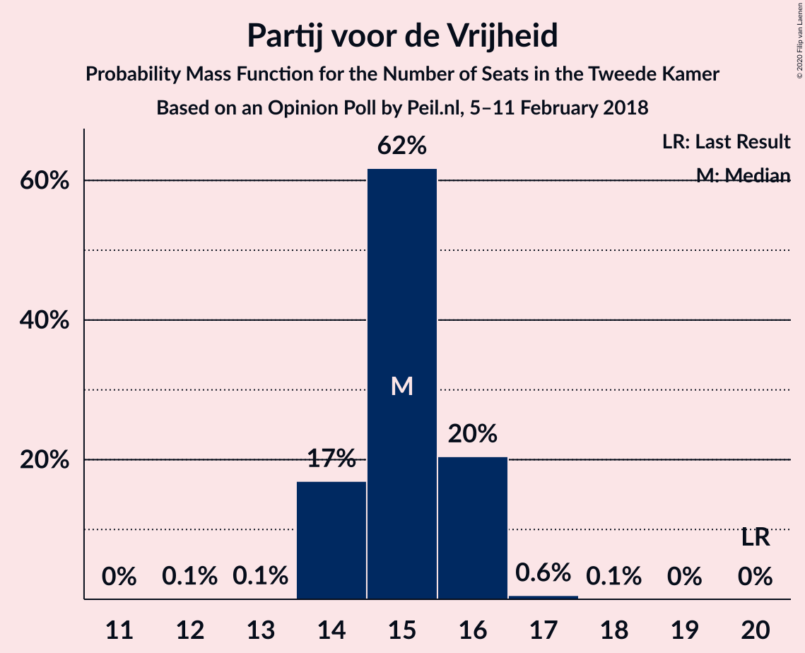

| Number of Seats | Probability | Accumulated | Special Marks |
|:---------------:|:-----------:|:-----------:|:-------------:|
| 12 | 0.1% | 100% |  |
| 13 | 0.1% | 99.9% |  |
| 14 | 17% | 99.8% |  |
| 15 | 62% | 83% | Median |
| 16 | 20% | 21% |  |
| 17 | 0.6% | 0.6% |  |
| 18 | 0.1% | 0.1% |  |
| 19 | 0% | 0% |  |
| 20 | 0% | 0% | Last Result |

### Christen-Democratisch Appèl

*For a full overview of the results for this party, see the [Christen-Democratisch Appèl](party-christen-democratischappèl.html) page.*

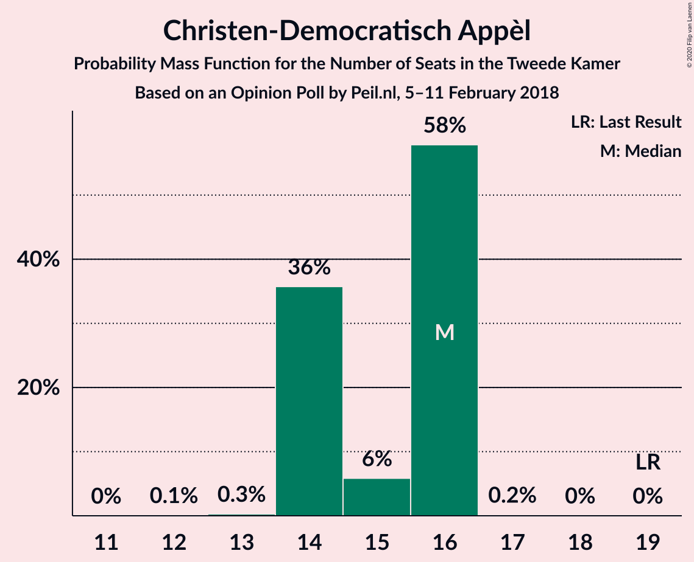

| Number of Seats | Probability | Accumulated | Special Marks |
|:---------------:|:-----------:|:-----------:|:-------------:|
| 13 | 0.4% | 100% |  |
| 14 | 76% | 99.6% | Median |
| 15 | 22% | 23% |  |
| 16 | 0.4% | 1.2% |  |
| 17 | 0.9% | 0.9% |  |
| 18 | 0% | 0% |  |
| 19 | 0% | 0% | Last Result |

### GroenLinks

*For a full overview of the results for this party, see the [GroenLinks](party-groenlinks.html) page.*

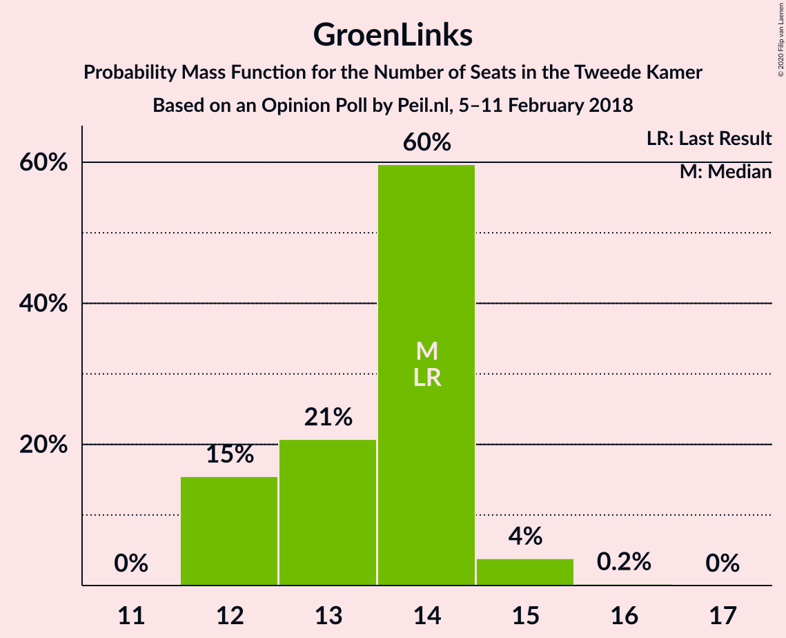

| Number of Seats | Probability | Accumulated | Special Marks |
|:---------------:|:-----------:|:-----------:|:-------------:|
| 12 | 15% | 100% |  |
| 13 | 21% | 85% |  |
| 14 | 60% | 64% | Last Result, Median |
| 15 | 4% | 4% |  |
| 16 | 0.2% | 0.2% |  |
| 17 | 0% | 0% |  |

### Socialistische Partij

*For a full overview of the results for this party, see the [Socialistische Partij](party-socialistischepartij.html) page.*

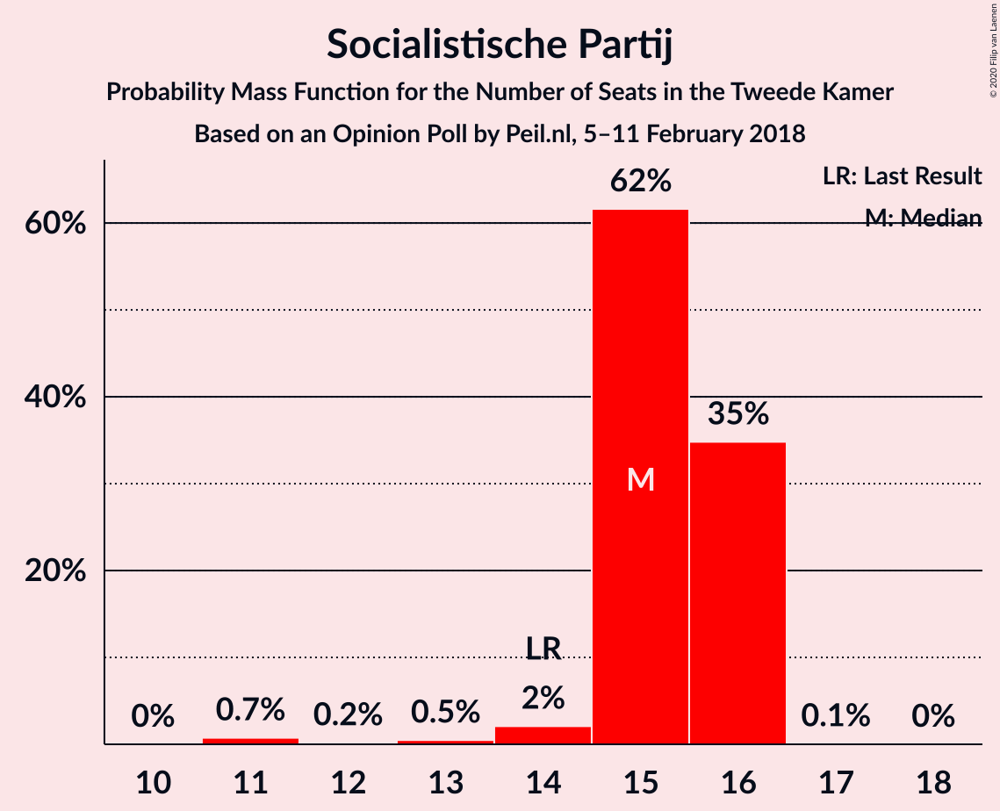

| Number of Seats | Probability | Accumulated | Special Marks |
|:---------------:|:-----------:|:-----------:|:-------------:|
| 11 | 0.7% | 100% |  |
| 12 | 0.2% | 99.3% |  |
| 13 | 0.5% | 99.1% |  |
| 14 | 2% | 98.6% | Last Result |
| 15 | 62% | 97% | Median |
| 16 | 35% | 35% |  |
| 17 | 0.1% | 0.1% |  |
| 18 | 0% | 0% |  |

### Forum voor Democratie

*For a full overview of the results for this party, see the [Forum voor Democratie](party-forumvoordemocratie.html) page.*

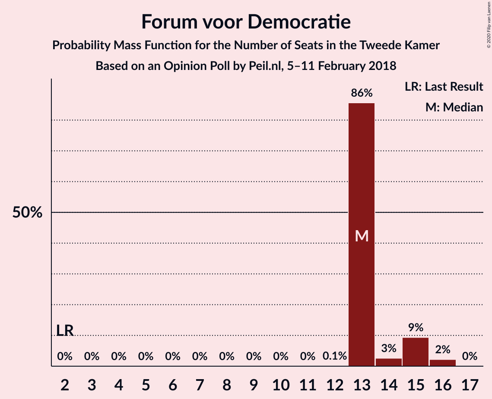

| Number of Seats | Probability | Accumulated | Special Marks |
|:---------------:|:-----------:|:-----------:|:-------------:|
| 2 | 0% | 100% | Last Result |
| 3 | 0% | 100% |  |
| 4 | 0% | 100% |  |
| 5 | 0% | 100% |  |
| 6 | 0% | 100% |  |
| 7 | 0% | 100% |  |
| 8 | 0% | 100% |  |
| 9 | 0% | 100% |  |
| 10 | 0% | 100% |  |
| 11 | 0.1% | 100% |  |
| 12 | 0.2% | 99.9% |  |
| 13 | 36% | 99.7% |  |
| 14 | 1.1% | 64% |  |
| 15 | 1.2% | 63% |  |
| 16 | 62% | 62% | Median |
| 17 | 0% | 0% |  |

### Partij van de Arbeid

*For a full overview of the results for this party, see the [Partij van de Arbeid](party-partijvandearbeid.html) page.*

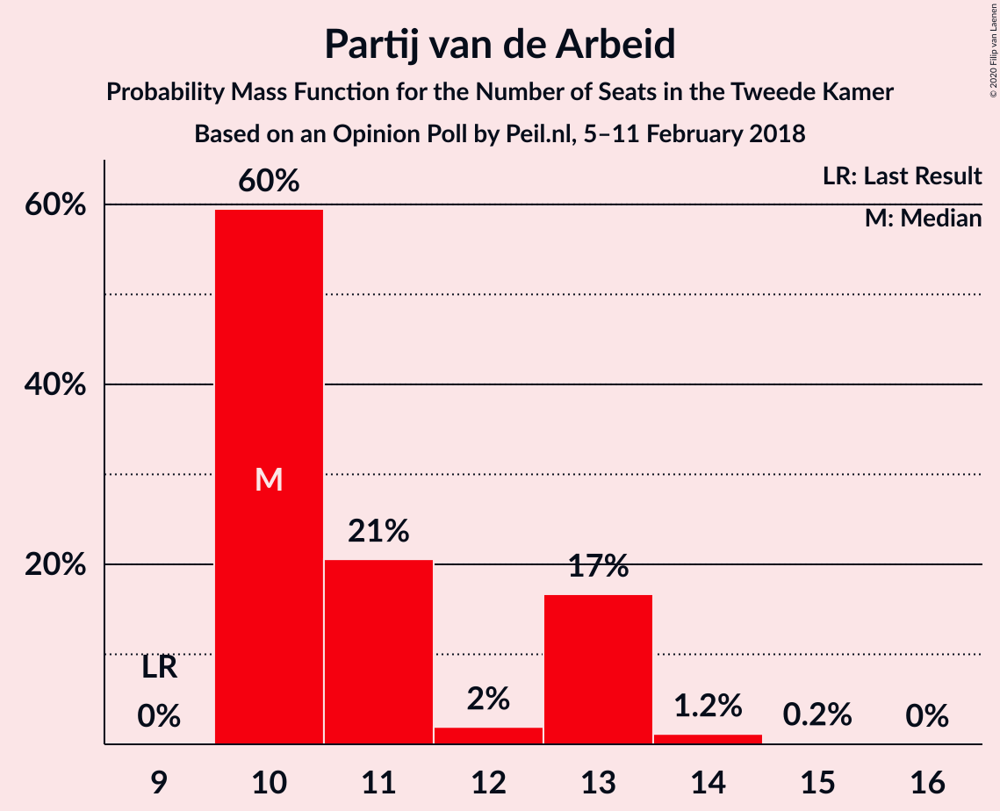

| Number of Seats | Probability | Accumulated | Special Marks |
|:---------------:|:-----------:|:-----------:|:-------------:|
| 9 | 0% | 100% | Last Result |
| 10 | 60% | 100% | Median |
| 11 | 21% | 40% |  |
| 12 | 2% | 20% |  |
| 13 | 17% | 18% |  |
| 14 | 1.2% | 1.3% |  |
| 15 | 0.2% | 0.2% |  |
| 16 | 0% | 0% |  |

### Partij voor de Dieren

*For a full overview of the results for this party, see the [Partij voor de Dieren](party-partijvoordedieren.html) page.*

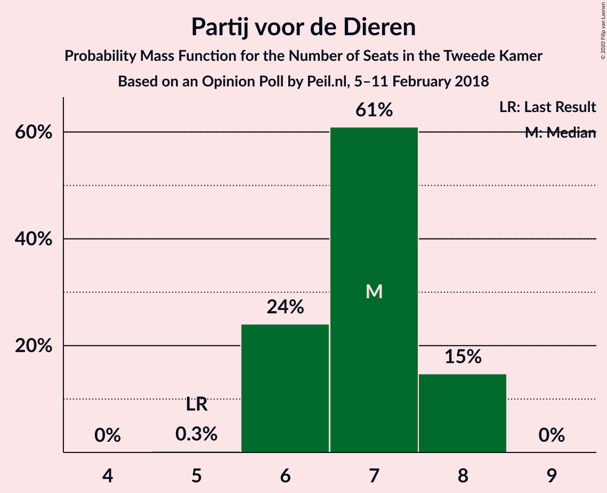

| Number of Seats | Probability | Accumulated | Special Marks |
|:---------------:|:-----------:|:-----------:|:-------------:|
| 5 | 0.3% | 100% | Last Result |
| 6 | 24% | 99.7% |  |
| 7 | 61% | 76% | Median |
| 8 | 15% | 15% |  |
| 9 | 0% | 0% |  |

### ChristenUnie

*For a full overview of the results for this party, see the [ChristenUnie](party-christenunie.html) page.*

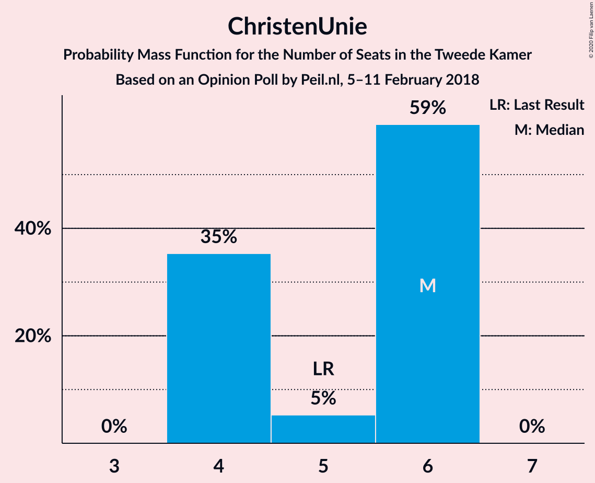

| Number of Seats | Probability | Accumulated | Special Marks |
|:---------------:|:-----------:|:-----------:|:-------------:|
| 4 | 35% | 100% |  |
| 5 | 5% | 65% | Last Result |
| 6 | 59% | 59% | Median |
| 7 | 0% | 0% |  |

### 50Plus

*For a full overview of the results for this party, see the [50Plus](party-50plus.html) page.*

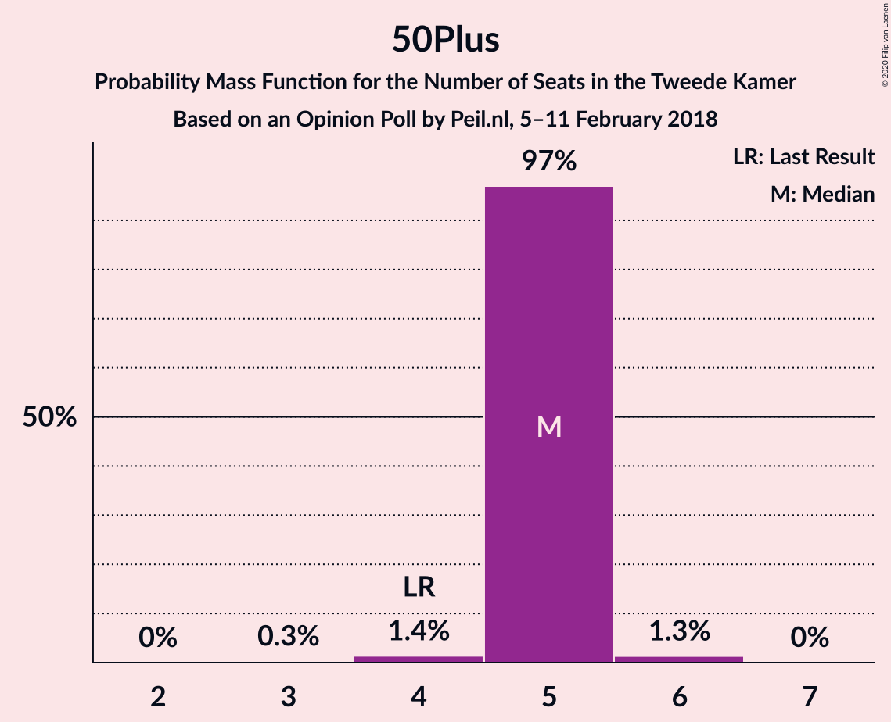

| Number of Seats | Probability | Accumulated | Special Marks |
|:---------------:|:-----------:|:-----------:|:-------------:|
| 3 | 0.3% | 100% |  |
| 4 | 1.4% | 99.7% | Last Result |
| 5 | 97% | 98% | Median |
| 6 | 1.3% | 1.3% |  |
| 7 | 0% | 0% |  |

### Staatkundig Gereformeerde Partij

*For a full overview of the results for this party, see the [Staatkundig Gereformeerde Partij](party-staatkundiggereformeerdepartij.html) page.*

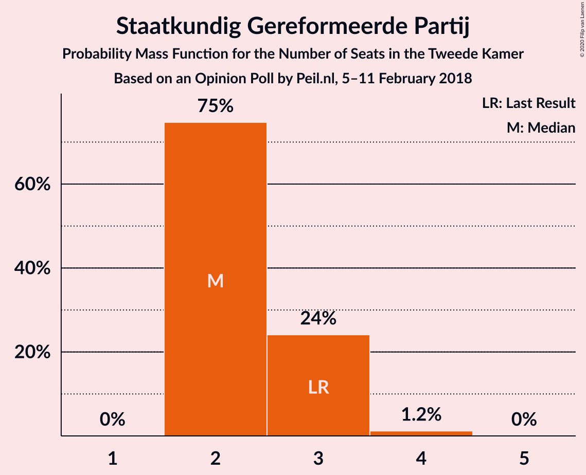

| Number of Seats | Probability | Accumulated | Special Marks |
|:---------------:|:-----------:|:-----------:|:-------------:|
| 2 | 75% | 100% | Median |
| 3 | 24% | 25% | Last Result |
| 4 | 1.2% | 1.2% |  |
| 5 | 0% | 0% |  |

### DENK

*For a full overview of the results for this party, see the [DENK](party-denk.html) page.*

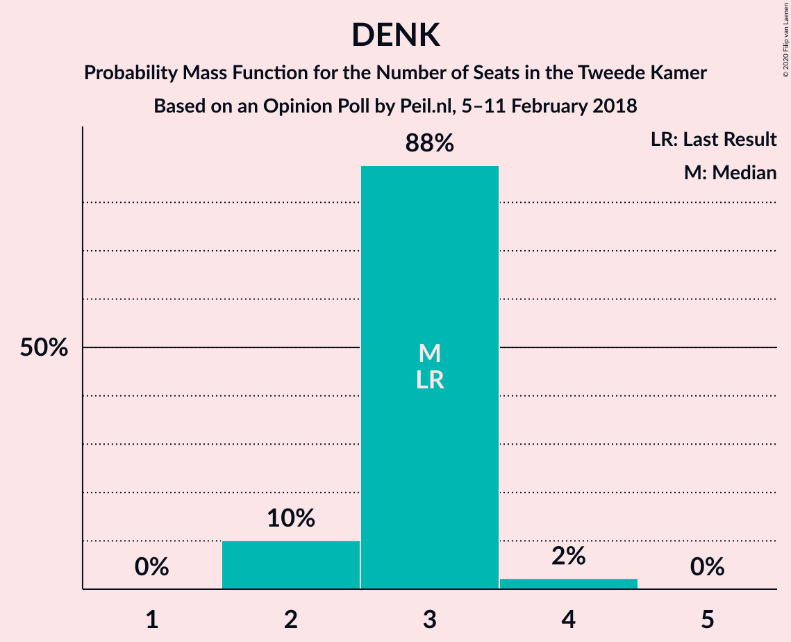

| Number of Seats | Probability | Accumulated | Special Marks |
|:---------------:|:-----------:|:-----------:|:-------------:|
| 2 | 80% | 100% | Median |
| 3 | 17% | 20% | Last Result |
| 4 | 3% | 3% |  |
| 5 | 0% | 0% |  |

## Coalitions

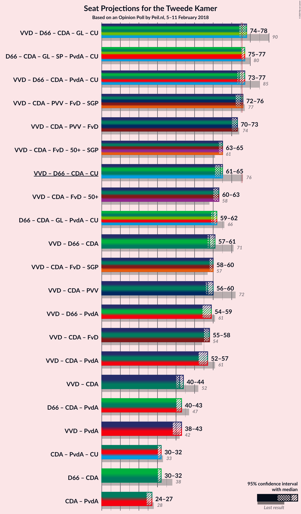

### Confidence Intervals

| Coalition | Last Result | Median | Majority? | 80% Confidence Interval | 90% Confidence Interval | 95% Confidence Interval | 99% Confidence Interval |
|:---------:|:-----------:|:------:|:---------:|:-----------------------:|:-----------------------:|:-----------------------:|:-----------------------:|
| Volkspartij voor Vrijheid en Democratie – Democraten 66 – Christen-Democratisch Appèl – GroenLinks – ChristenUnie | 90 | 78 | 97% | 76–78 | 76–78 | 74–78 | 74–80 |
| Democraten 66 – Christen-Democratisch Appèl – GroenLinks – Socialistische Partij – Partij van de Arbeid – ChristenUnie | 80 | 75 | 25% | 75–76 | 75–76 | 75–77 | 73–81 |
| Volkspartij voor Vrijheid en Democratie – Democraten 66 – Christen-Democratisch Appèl – Partij van de Arbeid – ChristenUnie | 85 | 74 | 38% | 74–77 | 74–77 | 73–77 | 72–77 |
| Volkspartij voor Vrijheid en Democratie – Christen-Democratisch Appèl – Partij voor de Vrijheid – Forum voor Democratie – Staatkundig Gereformeerde Partij | 77 | 75 | 21% | 73–76 | 73–76 | 72–76 | 72–77 |
| Volkspartij voor Vrijheid en Democratie – Christen-Democratisch Appèl – Partij voor de Vrijheid – Forum voor Democratie | 74 | 73 | 0% | 71–73 | 71–73 | 70–73 | 69–73 |
| Volkspartij voor Vrijheid en Democratie – Christen-Democratisch Appèl – Forum voor Democratie – 50Plus – Staatkundig Gereformeerde Partij | 61 | 65 | 0% | 64–65 | 64–65 | 63–65 | 62–66 |
| Volkspartij voor Vrijheid en Democratie – Democraten 66 – Christen-Democratisch Appèl – ChristenUnie | 76 | 64 | 0% | 64–65 | 64–65 | 61–65 | 59–65 |
| Volkspartij voor Vrijheid en Democratie – Christen-Democratisch Appèl – Forum voor Democratie – 50Plus | 58 | 63 | 0% | 62–63 | 62–63 | 60–63 | 59–63 |
| Democraten 66 – Christen-Democratisch Appèl – GroenLinks – Partij van de Arbeid – ChristenUnie | 66 | 60 | 0% | 59–60 | 59–62 | 59–62 | 59–67 |
| Volkspartij voor Vrijheid en Democratie – Democraten 66 – Christen-Democratisch Appèl | 71 | 58 | 0% | 58–61 | 58–61 | 57–61 | 54–61 |
| Volkspartij voor Vrijheid en Democratie – Christen-Democratisch Appèl – Forum voor Democratie – Staatkundig Gereformeerde Partij | 57 | 60 | 0% | 59–60 | 59–60 | 58–60 | 57–62 |
| Volkspartij voor Vrijheid en Democratie – Christen-Democratisch Appèl – Partij voor de Vrijheid | 72 | 57 | 0% | 57–60 | 57–60 | 56–60 | 53–60 |
| Volkspartij voor Vrijheid en Democratie – Democraten 66 – Partij van de Arbeid | 61 | 54 | 0% | 54–59 | 54–59 | 54–59 | 53–59 |
| Volkspartij voor Vrijheid en Democratie – Christen-Democratisch Appèl – Forum voor Democratie | 54 | 58 | 0% | 57–58 | 57–58 | 55–58 | 55–58 |
| Volkspartij voor Vrijheid en Democratie – Christen-Democratisch Appèl – Partij van de Arbeid | 61 | 52 | 0% | 52–57 | 52–57 | 52–57 | 52–57 |
| Volkspartij voor Vrijheid en Democratie – Christen-Democratisch Appèl | 52 | 42 | 0% | 42–44 | 42–44 | 40–44 | 39–44 |
| Democraten 66 – Christen-Democratisch Appèl – Partij van de Arbeid | 47 | 40 | 0% | 40–43 | 40–43 | 40–43 | 40–47 |
| Volkspartij voor Vrijheid en Democratie – Partij van de Arbeid | 42 | 38 | 0% | 38–43 | 38–43 | 38–43 | 37–43 |
| Christen-Democratisch Appèl – Partij van de Arbeid – ChristenUnie | 33 | 30 | 0% | 30–31 | 30–32 | 30–32 | 29–34 |
| Democraten 66 – Christen-Democratisch Appèl | 38 | 30 | 0% | 30–32 | 30–32 | 30–32 | 29–35 |
| Christen-Democratisch Appèl – Partij van de Arbeid | 28 | 24 | 0% | 24–27 | 24–27 | 24–27 | 24–29 |

### Volkspartij voor Vrijheid en Democratie – Democraten 66 – Christen-Democratisch Appèl – GroenLinks – ChristenUnie

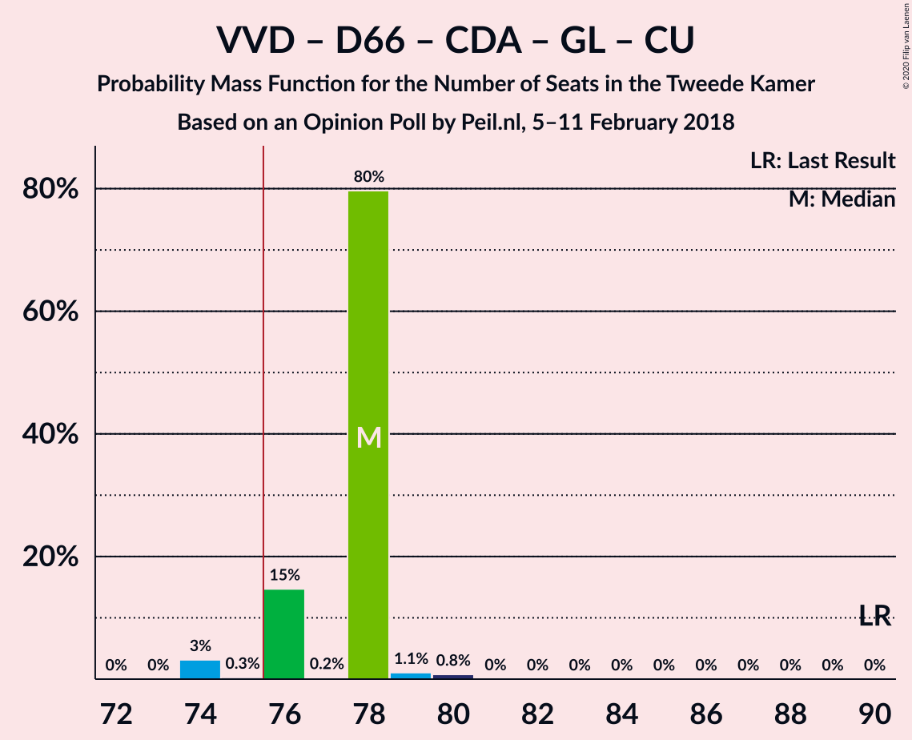

| Number of Seats | Probability | Accumulated | Special Marks |
|:---------------:|:-----------:|:-----------:|:-------------:|
| 74 | 3% | 100% |  |
| 75 | 0.3% | 97% |  |
| 76 | 15% | 97% | Majority |
| 77 | 0.2% | 82% |  |
| 78 | 80% | 82% | Median |
| 79 | 1.1% | 2% |  |
| 80 | 0.8% | 0.8% |  |
| 81 | 0% | 0.1% |  |
| 82 | 0% | 0% |  |
| 83 | 0% | 0% |  |
| 84 | 0% | 0% |  |
| 85 | 0% | 0% |  |
| 86 | 0% | 0% |  |
| 87 | 0% | 0% |  |
| 88 | 0% | 0% |  |
| 89 | 0% | 0% |  |
| 90 | 0% | 0% | Last Result |

### Democraten 66 – Christen-Democratisch Appèl – GroenLinks – Socialistische Partij – Partij van de Arbeid – ChristenUnie

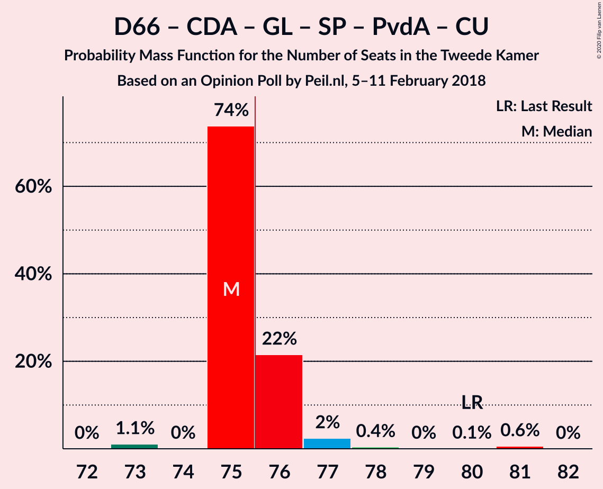

| Number of Seats | Probability | Accumulated | Special Marks |
|:---------------:|:-----------:|:-----------:|:-------------:|
| 73 | 1.1% | 100% |  |
| 74 | 0% | 98.9% |  |
| 75 | 74% | 98.9% | Median |
| 76 | 22% | 25% | Majority |
| 77 | 2% | 4% |  |
| 78 | 0.4% | 1.1% |  |
| 79 | 0% | 0.7% |  |
| 80 | 0.1% | 0.7% | Last Result |
| 81 | 0.6% | 0.6% |  |
| 82 | 0% | 0% |  |

### Volkspartij voor Vrijheid en Democratie – Democraten 66 – Christen-Democratisch Appèl – Partij van de Arbeid – ChristenUnie

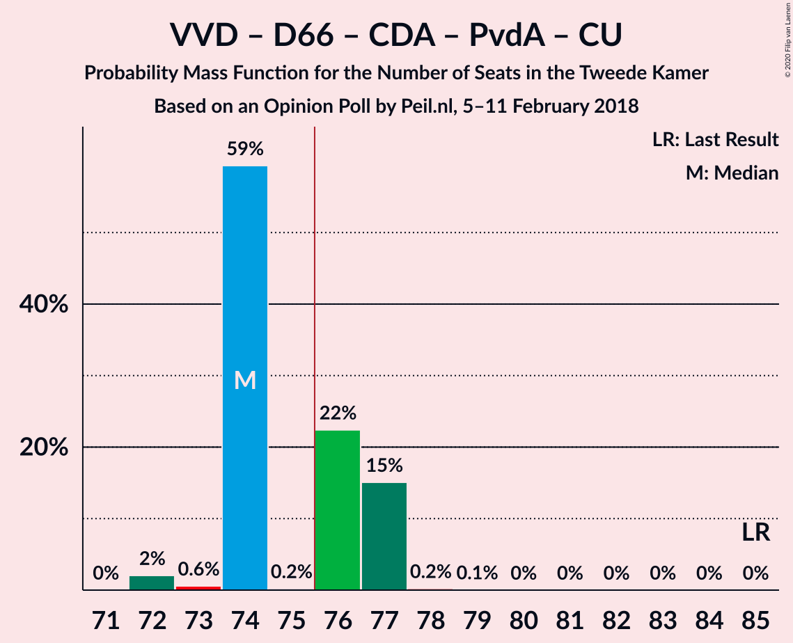

| Number of Seats | Probability | Accumulated | Special Marks |
|:---------------:|:-----------:|:-----------:|:-------------:|
| 72 | 2% | 100% |  |
| 73 | 0.6% | 98% |  |
| 74 | 59% | 97% | Median |
| 75 | 0.2% | 38% |  |
| 76 | 22% | 38% | Majority |
| 77 | 15% | 15% |  |
| 78 | 0.2% | 0.3% |  |
| 79 | 0.1% | 0.1% |  |
| 80 | 0% | 0% |  |
| 81 | 0% | 0% |  |
| 82 | 0% | 0% |  |
| 83 | 0% | 0% |  |
| 84 | 0% | 0% |  |
| 85 | 0% | 0% | Last Result |

### Volkspartij voor Vrijheid en Democratie – Christen-Democratisch Appèl – Partij voor de Vrijheid – Forum voor Democratie – Staatkundig Gereformeerde Partij

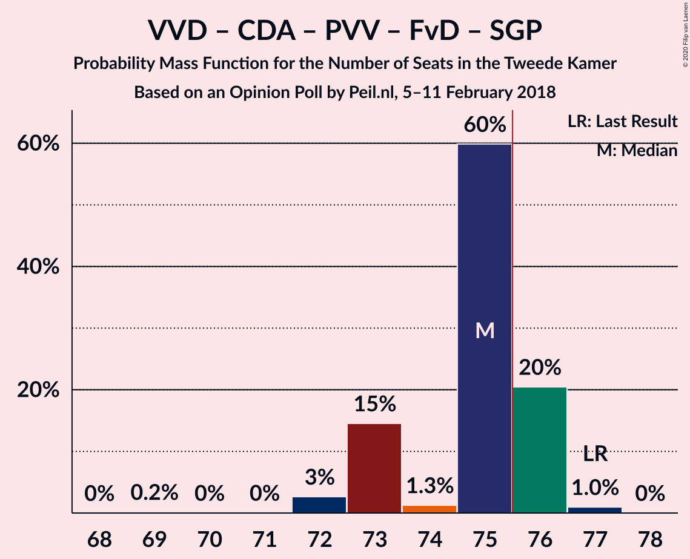

| Number of Seats | Probability | Accumulated | Special Marks |
|:---------------:|:-----------:|:-----------:|:-------------:|
| 69 | 0.2% | 100% |  |
| 70 | 0% | 99.8% |  |
| 71 | 0% | 99.8% |  |
| 72 | 3% | 99.8% |  |
| 73 | 15% | 97% |  |
| 74 | 1.3% | 83% |  |
| 75 | 60% | 81% | Median |
| 76 | 20% | 21% | Majority |
| 77 | 1.0% | 1.0% | Last Result |
| 78 | 0% | 0% |  |

### Volkspartij voor Vrijheid en Democratie – Christen-Democratisch Appèl – Partij voor de Vrijheid – Forum voor Democratie

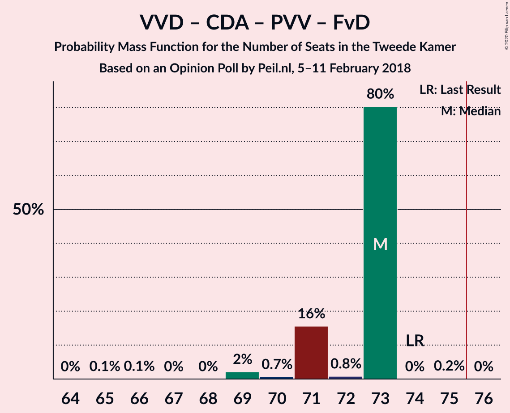

| Number of Seats | Probability | Accumulated | Special Marks |
|:---------------:|:-----------:|:-----------:|:-------------:|
| 65 | 0.1% | 100% |  |
| 66 | 0.1% | 99.9% |  |
| 67 | 0% | 99.8% |  |
| 68 | 0% | 99.8% |  |
| 69 | 2% | 99.8% |  |
| 70 | 0.7% | 98% |  |
| 71 | 16% | 97% |  |
| 72 | 0.8% | 81% |  |
| 73 | 80% | 81% | Median |
| 74 | 0% | 0.2% | Last Result |
| 75 | 0.2% | 0.2% |  |
| 76 | 0% | 0% | Majority |

### Volkspartij voor Vrijheid en Democratie – Christen-Democratisch Appèl – Forum voor Democratie – 50Plus – Staatkundig Gereformeerde Partij

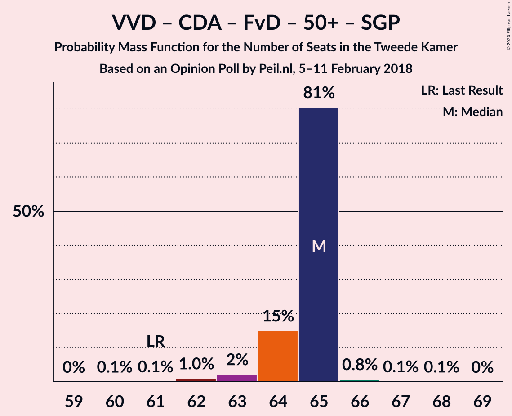

| Number of Seats | Probability | Accumulated | Special Marks |
|:---------------:|:-----------:|:-----------:|:-------------:|
| 60 | 0.1% | 100% |  |
| 61 | 0.1% | 99.9% | Last Result |
| 62 | 1.0% | 99.8% |  |
| 63 | 2% | 98.8% |  |
| 64 | 15% | 97% |  |
| 65 | 81% | 82% | Median |
| 66 | 0.8% | 1.0% |  |
| 67 | 0.1% | 0.2% |  |
| 68 | 0.1% | 0.1% |  |
| 69 | 0% | 0% |  |

### Volkspartij voor Vrijheid en Democratie – Democraten 66 – Christen-Democratisch Appèl – ChristenUnie

| Number of Seats | Probability | Accumulated | Special Marks |
|:---------------:|:-----------:|:-----------:|:-------------:|
| 59 | 2% | 100% |  |
| 60 | 0% | 98% |  |
| 61 | 0.6% | 98% |  |
| 62 | 1.3% | 97% |  |
| 63 | 0.1% | 96% |  |
| 64 | 75% | 96% | Median |
| 65 | 21% | 21% |  |
| 66 | 0.2% | 0.3% |  |
| 67 | 0.1% | 0.1% |  |
| 68 | 0% | 0% |  |
| 69 | 0% | 0% |  |
| 70 | 0% | 0% |  |
| 71 | 0% | 0% |  |
| 72 | 0% | 0% |  |
| 73 | 0% | 0% |  |
| 74 | 0% | 0% |  |
| 75 | 0% | 0% |  |
| 76 | 0% | 0% | Last Result, Majority |

### Volkspartij voor Vrijheid en Democratie – Christen-Democratisch Appèl – Forum voor Democratie – 50Plus

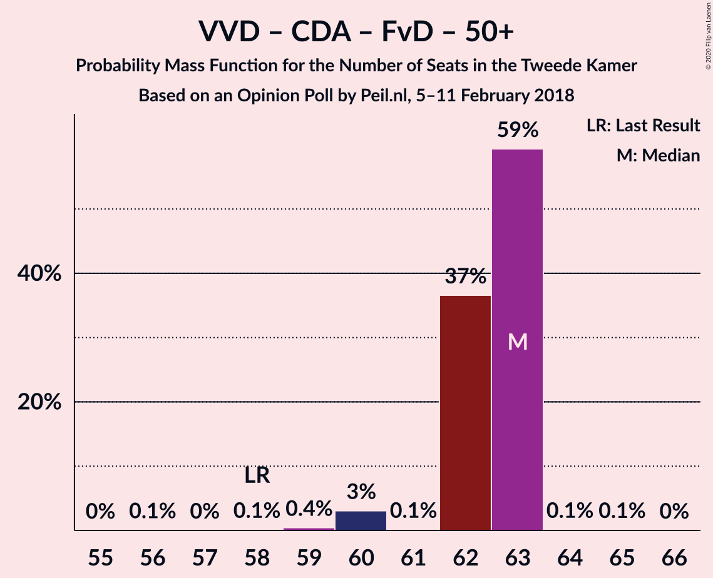

| Number of Seats | Probability | Accumulated | Special Marks |
|:---------------:|:-----------:|:-----------:|:-------------:|
| 56 | 0.1% | 100% |  |
| 57 | 0% | 99.9% |  |
| 58 | 0.1% | 99.9% | Last Result |
| 59 | 0.4% | 99.8% |  |
| 60 | 3% | 99.4% |  |
| 61 | 0.1% | 96% |  |
| 62 | 37% | 96% |  |
| 63 | 59% | 60% | Median |
| 64 | 0.1% | 0.2% |  |
| 65 | 0.1% | 0.1% |  |
| 66 | 0% | 0% |  |

### Democraten 66 – Christen-Democratisch Appèl – GroenLinks – Partij van de Arbeid – ChristenUnie

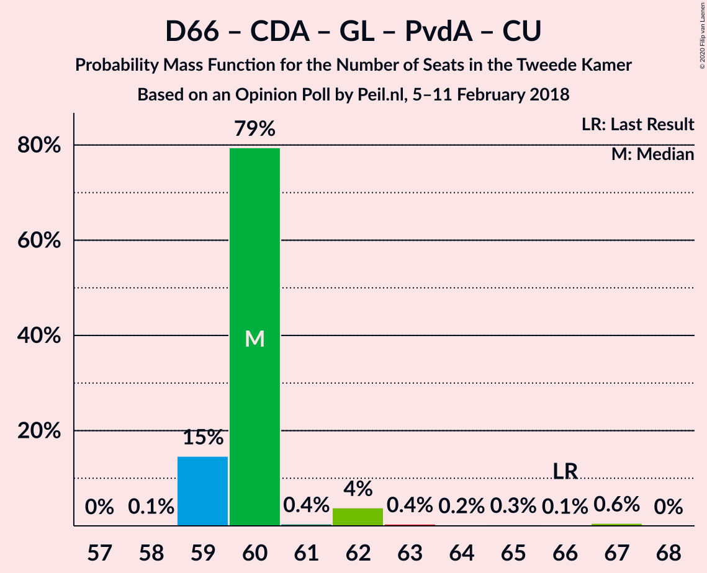

| Number of Seats | Probability | Accumulated | Special Marks |
|:---------------:|:-----------:|:-----------:|:-------------:|
| 58 | 0.1% | 100% |  |
| 59 | 15% | 99.9% |  |
| 60 | 79% | 85% | Median |
| 61 | 0.4% | 6% |  |
| 62 | 4% | 5% |  |
| 63 | 0.4% | 2% |  |
| 64 | 0.2% | 1.1% |  |
| 65 | 0.3% | 0.9% |  |
| 66 | 0.1% | 0.7% | Last Result |
| 67 | 0.6% | 0.6% |  |
| 68 | 0% | 0% |  |

### Volkspartij voor Vrijheid en Democratie – Democraten 66 – Christen-Democratisch Appèl

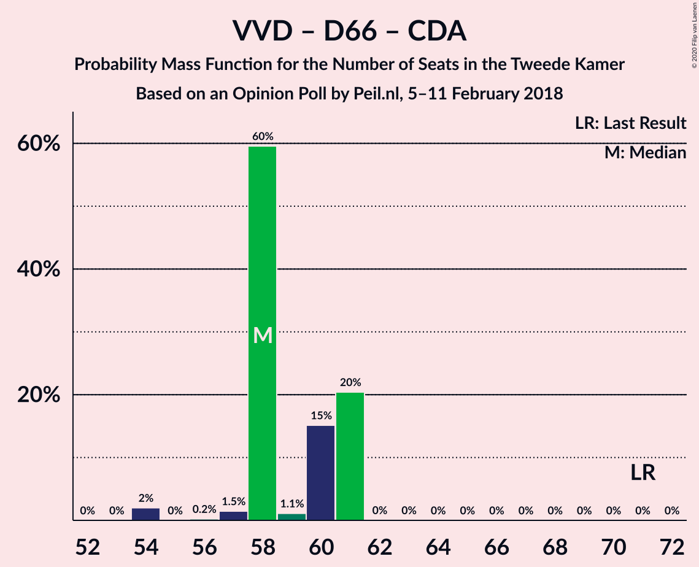

| Number of Seats | Probability | Accumulated | Special Marks |
|:---------------:|:-----------:|:-----------:|:-------------:|
| 54 | 2% | 100% |  |
| 55 | 0% | 98% |  |
| 56 | 0.2% | 98% |  |
| 57 | 1.5% | 98% |  |
| 58 | 60% | 96% | Median |
| 59 | 1.1% | 37% |  |
| 60 | 15% | 36% |  |
| 61 | 20% | 20% |  |
| 62 | 0% | 0.1% |  |
| 63 | 0% | 0% |  |
| 64 | 0% | 0% |  |
| 65 | 0% | 0% |  |
| 66 | 0% | 0% |  |
| 67 | 0% | 0% |  |
| 68 | 0% | 0% |  |
| 69 | 0% | 0% |  |
| 70 | 0% | 0% |  |
| 71 | 0% | 0% | Last Result |

### Volkspartij voor Vrijheid en Democratie – Christen-Democratisch Appèl – Forum voor Democratie – Staatkundig Gereformeerde Partij

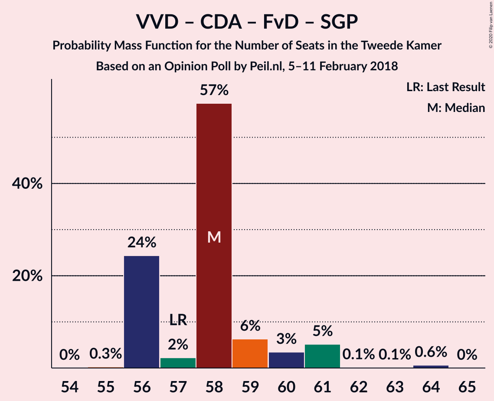

| Number of Seats | Probability | Accumulated | Special Marks |
|:---------------:|:-----------:|:-----------:|:-------------:|
| 55 | 0.2% | 100% |  |
| 56 | 0% | 99.8% |  |
| 57 | 0.6% | 99.8% | Last Result |
| 58 | 2% | 99.2% |  |
| 59 | 16% | 97% |  |
| 60 | 80% | 81% | Median |
| 61 | 0.2% | 1.0% |  |
| 62 | 0.7% | 0.8% |  |
| 63 | 0.1% | 0.1% |  |
| 64 | 0% | 0% |  |

### Volkspartij voor Vrijheid en Democratie – Christen-Democratisch Appèl – Partij voor de Vrijheid

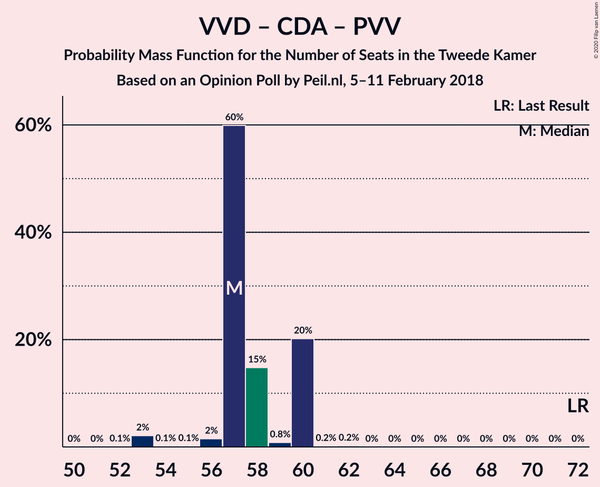

| Number of Seats | Probability | Accumulated | Special Marks |
|:---------------:|:-----------:|:-----------:|:-------------:|
| 52 | 0.1% | 100% |  |
| 53 | 2% | 99.9% |  |
| 54 | 0.1% | 98% |  |
| 55 | 0.1% | 98% |  |
| 56 | 2% | 98% |  |
| 57 | 60% | 96% | Median |
| 58 | 15% | 36% |  |
| 59 | 0.8% | 21% |  |
| 60 | 20% | 21% |  |
| 61 | 0.2% | 0.4% |  |
| 62 | 0.2% | 0.2% |  |
| 63 | 0% | 0% |  |
| 64 | 0% | 0% |  |
| 65 | 0% | 0% |  |
| 66 | 0% | 0% |  |
| 67 | 0% | 0% |  |
| 68 | 0% | 0% |  |
| 69 | 0% | 0% |  |
| 70 | 0% | 0% |  |
| 71 | 0% | 0% |  |
| 72 | 0% | 0% | Last Result |

### Volkspartij voor Vrijheid en Democratie – Democraten 66 – Partij van de Arbeid

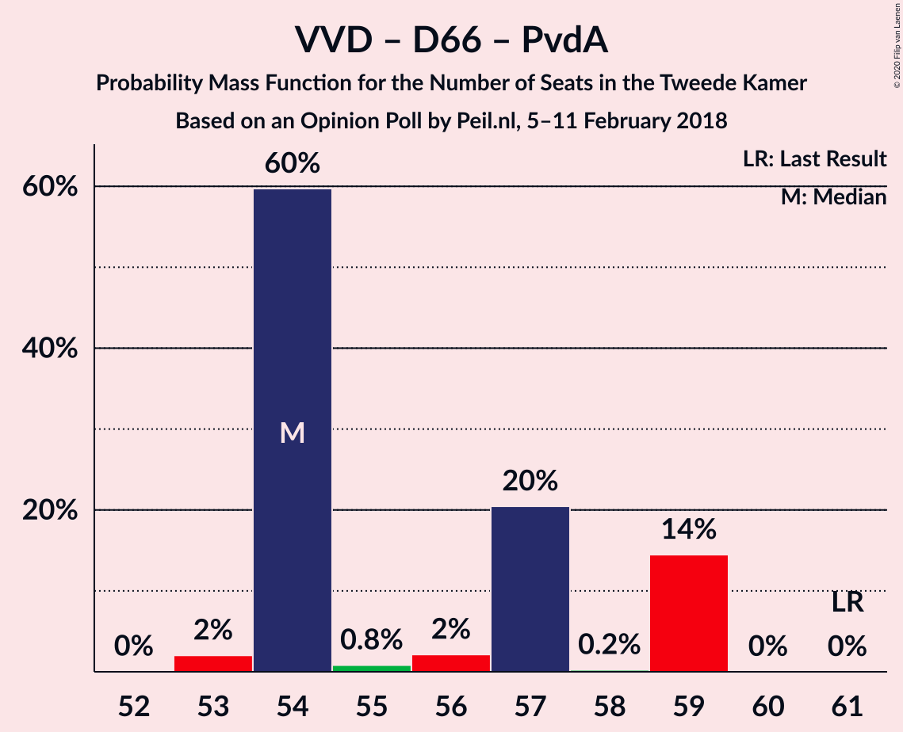

| Number of Seats | Probability | Accumulated | Special Marks |
|:---------------:|:-----------:|:-----------:|:-------------:|
| 52 | 0% | 100% |  |
| 53 | 2% | 99.9% |  |
| 54 | 60% | 98% | Median |
| 55 | 0.8% | 38% |  |
| 56 | 2% | 37% |  |
| 57 | 20% | 35% |  |
| 58 | 0.2% | 15% |  |
| 59 | 14% | 15% |  |
| 60 | 0% | 0% |  |
| 61 | 0% | 0% | Last Result |

### Volkspartij voor Vrijheid en Democratie – Christen-Democratisch Appèl – Forum voor Democratie

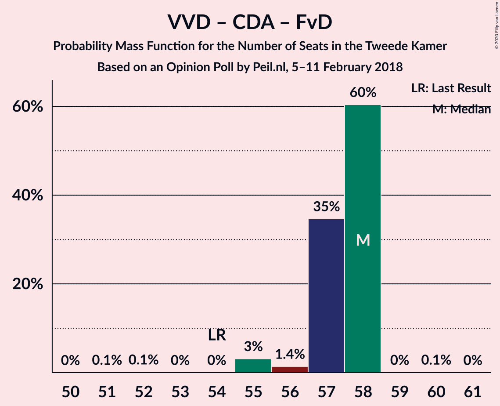

| Number of Seats | Probability | Accumulated | Special Marks |
|:---------------:|:-----------:|:-----------:|:-------------:|
| 51 | 0.1% | 100% |  |
| 52 | 0.1% | 99.9% |  |
| 53 | 0% | 99.8% |  |
| 54 | 0% | 99.8% | Last Result |
| 55 | 3% | 99.8% |  |
| 56 | 1.4% | 97% |  |
| 57 | 35% | 95% |  |
| 58 | 60% | 61% | Median |
| 59 | 0% | 0.2% |  |
| 60 | 0.1% | 0.1% |  |
| 61 | 0% | 0% |  |

### Volkspartij voor Vrijheid en Democratie – Christen-Democratisch Appèl – Partij van de Arbeid

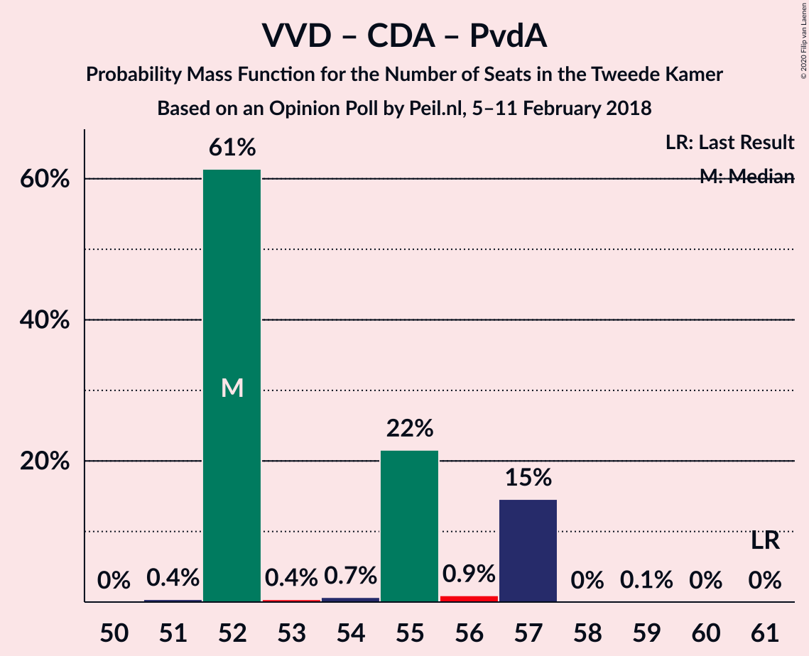

| Number of Seats | Probability | Accumulated | Special Marks |
|:---------------:|:-----------:|:-----------:|:-------------:|
| 51 | 0.4% | 100% |  |
| 52 | 61% | 99.6% | Median |
| 53 | 0.4% | 38% |  |
| 54 | 0.7% | 38% |  |
| 55 | 22% | 37% |  |
| 56 | 0.9% | 16% |  |
| 57 | 15% | 15% |  |
| 58 | 0% | 0.1% |  |
| 59 | 0.1% | 0.1% |  |
| 60 | 0% | 0% |  |
| 61 | 0% | 0% | Last Result |

### Volkspartij voor Vrijheid en Democratie – Christen-Democratisch Appèl

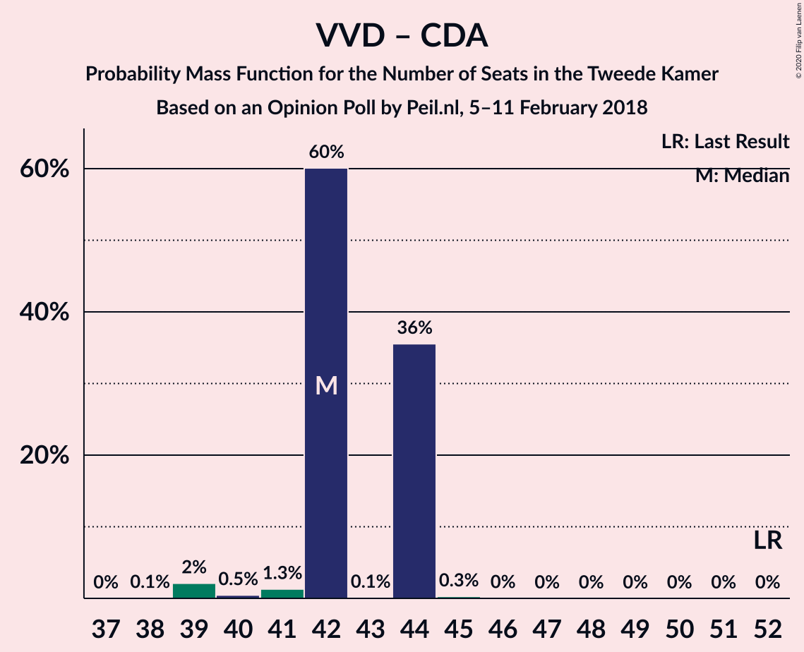

| Number of Seats | Probability | Accumulated | Special Marks |
|:---------------:|:-----------:|:-----------:|:-------------:|
| 38 | 0.1% | 100% |  |
| 39 | 2% | 99.9% |  |
| 40 | 0.5% | 98% |  |
| 41 | 1.3% | 97% |  |
| 42 | 60% | 96% | Median |
| 43 | 0.1% | 36% |  |
| 44 | 36% | 36% |  |
| 45 | 0.3% | 0.3% |  |
| 46 | 0% | 0.1% |  |
| 47 | 0% | 0% |  |
| 48 | 0% | 0% |  |
| 49 | 0% | 0% |  |
| 50 | 0% | 0% |  |
| 51 | 0% | 0% |  |
| 52 | 0% | 0% | Last Result |

### Democraten 66 – Christen-Democratisch Appèl – Partij van de Arbeid

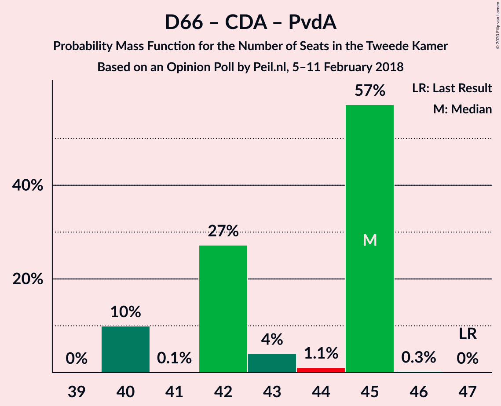

| Number of Seats | Probability | Accumulated | Special Marks |
|:---------------:|:-----------:|:-----------:|:-------------:|
| 40 | 59% | 100% | Median |
| 41 | 0.3% | 41% |  |
| 42 | 3% | 40% |  |
| 43 | 35% | 37% |  |
| 44 | 0.2% | 2% |  |
| 45 | 1.4% | 2% |  |
| 46 | 0.2% | 0.8% |  |
| 47 | 0.6% | 0.7% | Last Result |
| 48 | 0% | 0% |  |

### Volkspartij voor Vrijheid en Democratie – Partij van de Arbeid

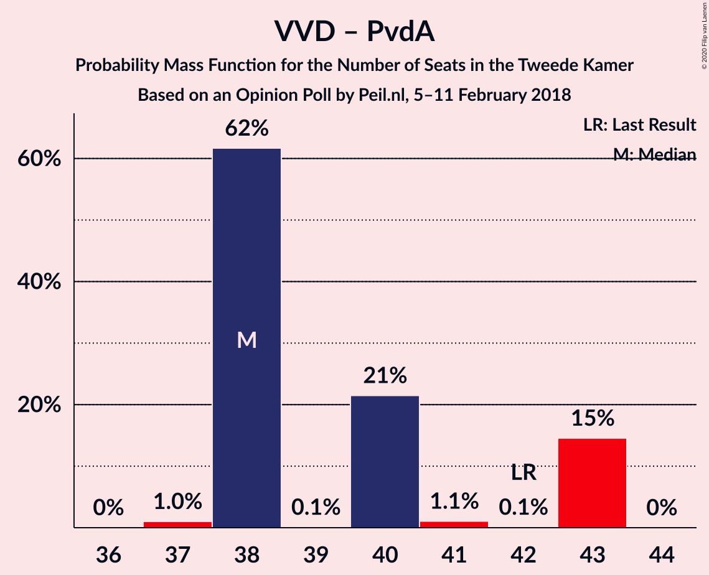

| Number of Seats | Probability | Accumulated | Special Marks |
|:---------------:|:-----------:|:-----------:|:-------------:|
| 37 | 1.0% | 100% |  |
| 38 | 62% | 99.0% | Median |
| 39 | 0.1% | 37% |  |
| 40 | 21% | 37% |  |
| 41 | 1.1% | 16% |  |
| 42 | 0.1% | 15% | Last Result |
| 43 | 15% | 15% |  |
| 44 | 0% | 0% |  |

### Christen-Democratisch Appèl – Partij van de Arbeid – ChristenUnie

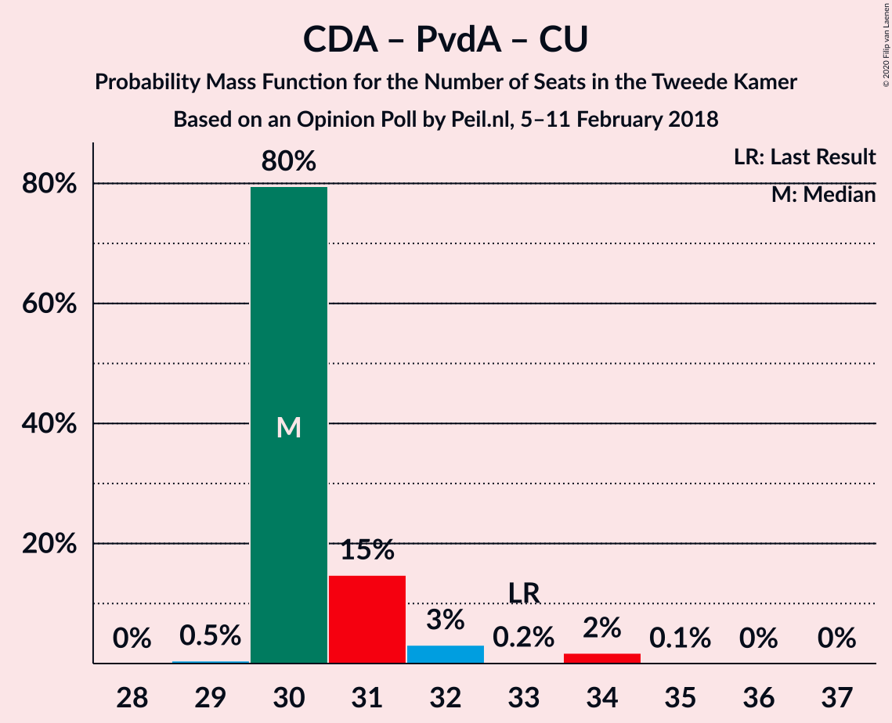

| Number of Seats | Probability | Accumulated | Special Marks |
|:---------------:|:-----------:|:-----------:|:-------------:|
| 29 | 0.5% | 100% |  |
| 30 | 80% | 99.5% | Median |
| 31 | 15% | 20% |  |
| 32 | 3% | 5% |  |
| 33 | 0.2% | 2% | Last Result |
| 34 | 2% | 2% |  |
| 35 | 0.1% | 0.1% |  |
| 36 | 0% | 0.1% |  |
| 37 | 0% | 0% |  |

### Democraten 66 – Christen-Democratisch Appèl

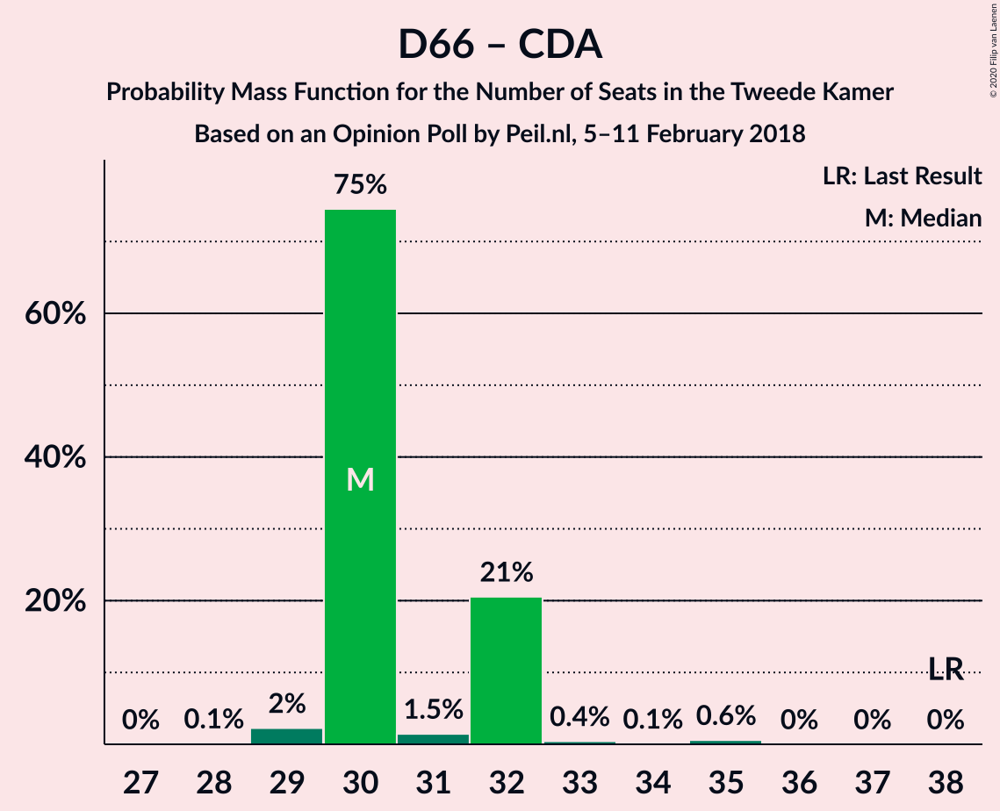

| Number of Seats | Probability | Accumulated | Special Marks |
|:---------------:|:-----------:|:-----------:|:-------------:|
| 28 | 0.1% | 100% |  |
| 29 | 2% | 99.9% |  |
| 30 | 75% | 98% | Median |
| 31 | 1.5% | 23% |  |
| 32 | 21% | 22% |  |
| 33 | 0.4% | 1.1% |  |
| 34 | 0.1% | 0.7% |  |
| 35 | 0.6% | 0.6% |  |
| 36 | 0% | 0% |  |
| 37 | 0% | 0% |  |
| 38 | 0% | 0% | Last Result |

### Christen-Democratisch Appèl – Partij van de Arbeid

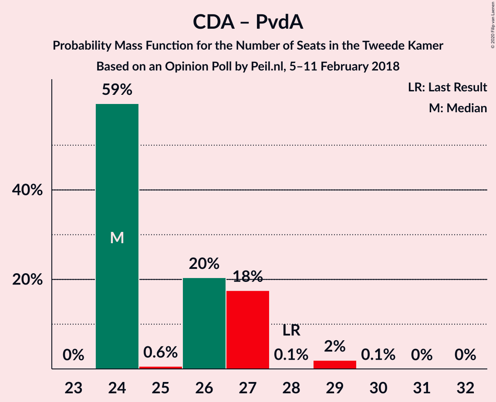

| Number of Seats | Probability | Accumulated | Special Marks |
|:---------------:|:-----------:|:-----------:|:-------------:|
| 24 | 59% | 100% | Median |
| 25 | 0.6% | 41% |  |
| 26 | 20% | 40% |  |
| 27 | 18% | 20% |  |
| 28 | 0.1% | 2% | Last Result |
| 29 | 2% | 2% |  |
| 30 | 0.1% | 0.1% |  |
| 31 | 0% | 0.1% |  |
| 32 | 0% | 0% |  |

## Technical Information

### Opinion Poll

+ **Polling firm:** Peil.nl
+ **Commissioner(s):** —
+ **Fieldwork period:** 5–11 February 2018

### Calculations

+ **Sample size:** 3000
+ **Simulations done:** 131,072
+ **Error estimate:** 1.54%

