# Opinion Poll by Peil.nl, 12–18 February 2018

<a href="#voting-intentions">Voting Intentions</a> | <a href="#seats">Seats</a> | <a href="#coalitions">Coalitions</a> | <a href="#technical-information">Technical Information</a>

## Voting Intentions

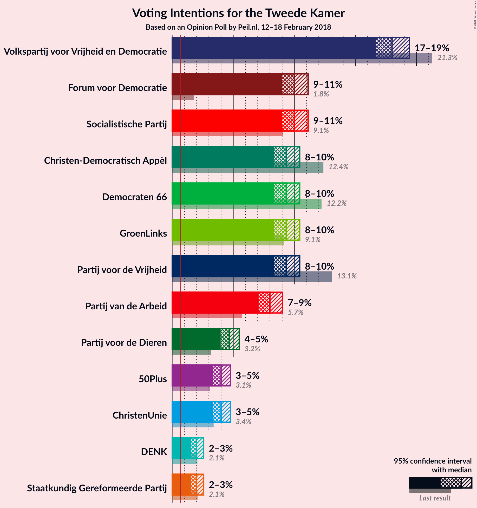

### Confidence Intervals

| Party | Last Result | Poll Result | 80% Confidence Interval | 90% Confidence Interval | 95% Confidence Interval | 99% Confidence Interval |
|:-----:|:-----------:|:-----------:|:-----------------------:|:-----------------------:|:-----------------------:|:-----------------------:|
| Volkspartij voor Vrijheid en Democratie | 21.3% | 18.0% | 17.1–18.9% |16.9–19.2% |16.7–19.4% |16.2–19.9% |
| Socialistische Partij | 9.1% | 10.0% | 9.3–10.7% |9.1–10.9% |9.0–11.1% |8.7–11.5% |
| Forum voor Democratie | 1.8% | 10.0% | 9.3–10.7% |9.1–10.9% |9.0–11.1% |8.7–11.5% |
| Partij voor de Vrijheid | 13.1% | 9.3% | 8.7–10.1% |8.5–10.3% |8.3–10.4% |8.0–10.8% |
| Christen-Democratisch Appèl | 12.4% | 9.3% | 8.7–10.1% |8.5–10.3% |8.3–10.4% |8.0–10.8% |
| Democraten 66 | 12.2% | 9.3% | 8.7–10.1% |8.5–10.3% |8.3–10.4% |8.0–10.8% |
| GroenLinks | 9.1% | 9.3% | 8.7–10.1% |8.5–10.3% |8.3–10.4% |8.0–10.8% |
| Partij van de Arbeid | 5.7% | 8.0% | 7.4–8.7% |7.2–8.9% |7.1–9.0% |6.8–9.4% |
| Partij voor de Dieren | 3.2% | 4.7% | 4.2–5.2% |4.1–5.3% |4.0–5.5% |3.7–5.8% |
| ChristenUnie | 3.4% | 4.0% | 3.6–4.5% |3.4–4.6% |3.4–4.8% |3.2–5.0% |
| 50Plus | 3.1% | 4.0% | 3.6–4.5% |3.4–4.6% |3.4–4.8% |3.2–5.0% |
| Staatkundig Gereformeerde Partij | 2.1% | 2.0% | 1.7–2.4% |1.6–2.5% |1.6–2.6% |1.4–2.8% |
| DENK | 2.1% | 2.0% | 1.7–2.4% |1.6–2.5% |1.6–2.6% |1.4–2.8% |

*Note:* The poll result column reflects the actual value used in the calculations. Published results may vary slightly, and in addition be rounded to fewer digits.

## Seats

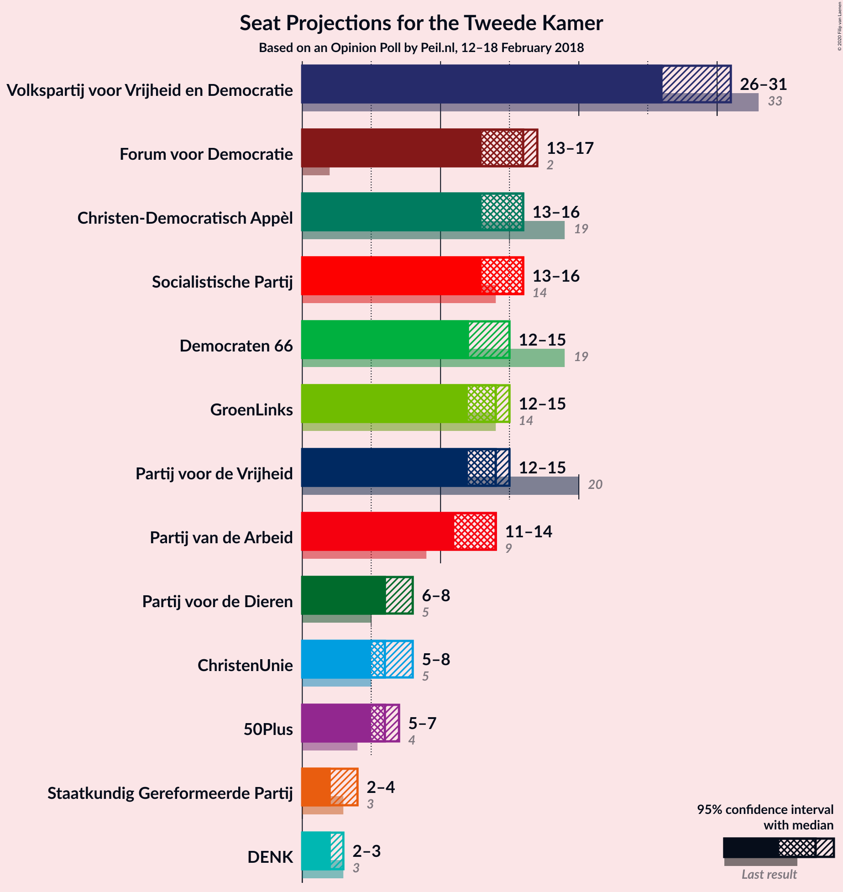

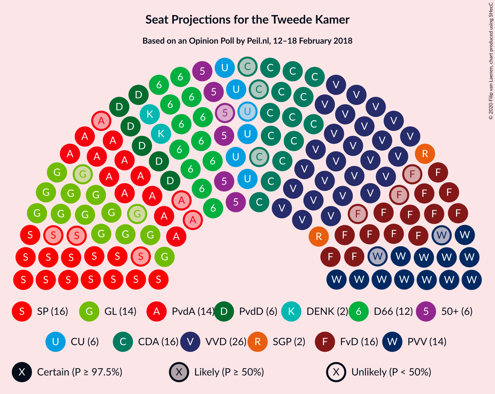

### Confidence Intervals

| Party | Last Result | Median | 80% Confidence Interval | 90% Confidence Interval | 95% Confidence Interval | 99% Confidence Interval |
|:-----:|:-----------:|:------:|:-----------------------:|:-----------------------:|:-----------------------:|:-----------------------:|
| <a href="#volkspartij-voor-vrijheid-en-democratie">Volkspartij voor Vrijheid en Democratie</a> | 33 | 26 | 26–30 |26–30 |26–31 |24–31 |
| <a href="#socialistische-partij">Socialistische Partij</a> | 14 | 16 | 13–16 |13–16 |13–16 |13–19 |
| <a href="#forum-voor-democratie">Forum voor Democratie</a> | 2 | 16 | 13–16 |13–16 |13–17 |13–18 |
| <a href="#partij-voor-de-vrijheid">Partij voor de Vrijheid</a> | 20 | 14 | 14 |13–15 |12–15 |12–15 |
| <a href="#christen-democratisch-appèl">Christen-Democratisch Appèl</a> | 19 | 16 | 14–16 |13–16 |13–16 |13–16 |
| <a href="#democraten-66">Democraten 66</a> | 19 | 12 | 12–15 |12–15 |12–15 |12–16 |
| <a href="#groenlinks">GroenLinks</a> | 14 | 14 | 14–15 |14–15 |12–15 |12–15 |
| <a href="#partij-van-de-arbeid">Partij van de Arbeid</a> | 9 | 14 | 11–14 |11–14 |11–14 |10–14 |
| <a href="#partij-voor-de-dieren">Partij voor de Dieren</a> | 5 | 6 | 6–8 |6–8 |6–8 |6–8 |
| <a href="#christenunie">ChristenUnie</a> | 5 | 6 | 5–8 |5–8 |5–8 |5–8 |
| <a href="#50plus">50Plus</a> | 4 | 6 | 6 |5–7 |5–7 |4–7 |
| <a href="#staatkundig-gereformeerde-partij">Staatkundig Gereformeerde Partij</a> | 3 | 2 | 2–3 |2–3 |2–4 |2–4 |
| <a href="#denk">DENK</a> | 3 | 2 | 2–3 |2–3 |2–3 |2–3 |

### Volkspartij voor Vrijheid en Democratie

*For a full overview of the results for this party, see the [Volkspartij voor Vrijheid en Democratie](party-volkspartijvoorvrijheidendemocratie.html) page.*

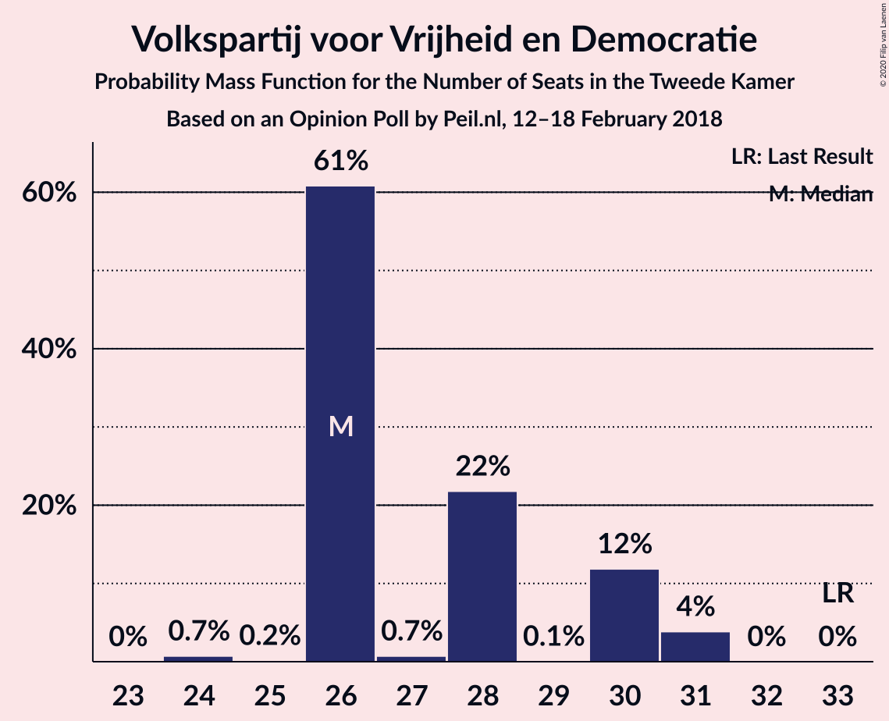

| Number of Seats | Probability | Accumulated | Special Marks |
|:---------------:|:-----------:|:-----------:|:-------------:|
| 24 | 0.7% | 100% |  |
| 25 | 0.2% | 99.3% |  |
| 26 | 61% | 99.1% | Median |
| 27 | 0.7% | 38% |  |
| 28 | 22% | 38% |  |
| 29 | 0.1% | 16% |  |
| 30 | 12% | 16% |  |
| 31 | 4% | 4% |  |
| 32 | 0% | 0% |  |
| 33 | 0% | 0% | Last Result |

### Socialistische Partij

*For a full overview of the results for this party, see the [Socialistische Partij](party-socialistischepartij.html) page.*

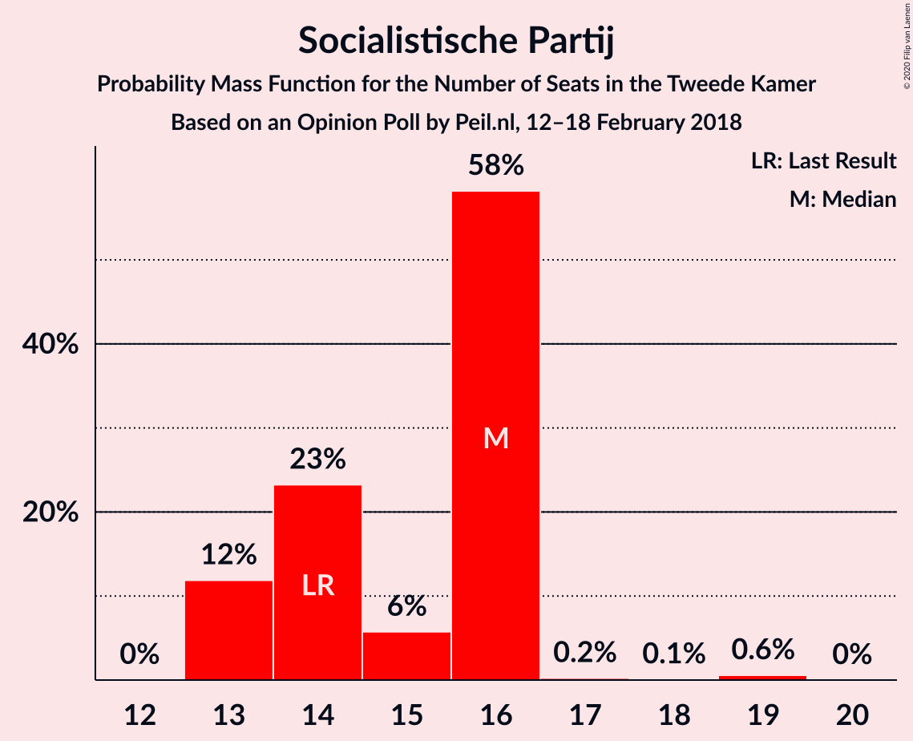

| Number of Seats | Probability | Accumulated | Special Marks |
|:---------------:|:-----------:|:-----------:|:-------------:|
| 13 | 12% | 100% |  |
| 14 | 23% | 88% | Last Result |
| 15 | 6% | 65% |  |
| 16 | 58% | 59% | Median |
| 17 | 0.2% | 0.9% |  |
| 18 | 0.1% | 0.7% |  |
| 19 | 0.6% | 0.6% |  |
| 20 | 0% | 0% |  |

### Forum voor Democratie

*For a full overview of the results for this party, see the [Forum voor Democratie](party-forumvoordemocratie.html) page.*

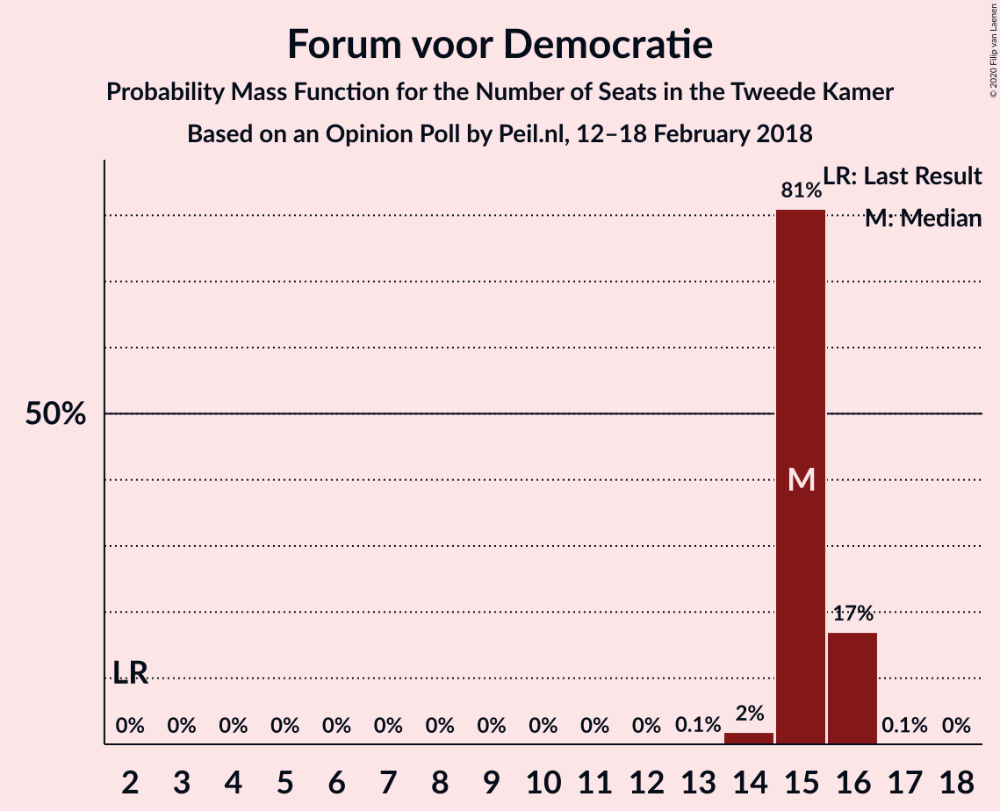

| Number of Seats | Probability | Accumulated | Special Marks |
|:---------------:|:-----------:|:-----------:|:-------------:|
| 2 | 0% | 100% | Last Result |
| 3 | 0% | 100% |  |
| 4 | 0% | 100% |  |
| 5 | 0% | 100% |  |
| 6 | 0% | 100% |  |
| 7 | 0% | 100% |  |
| 8 | 0% | 100% |  |
| 9 | 0% | 100% |  |
| 10 | 0% | 100% |  |
| 11 | 0% | 100% |  |
| 12 | 0% | 100% |  |
| 13 | 31% | 100% |  |
| 14 | 0.8% | 69% |  |
| 15 | 5% | 68% |  |
| 16 | 61% | 63% | Median |
| 17 | 1.0% | 3% |  |
| 18 | 2% | 2% |  |
| 19 | 0% | 0% |  |

### Partij voor de Vrijheid

*For a full overview of the results for this party, see the [Partij voor de Vrijheid](party-partijvoordevrijheid.html) page.*

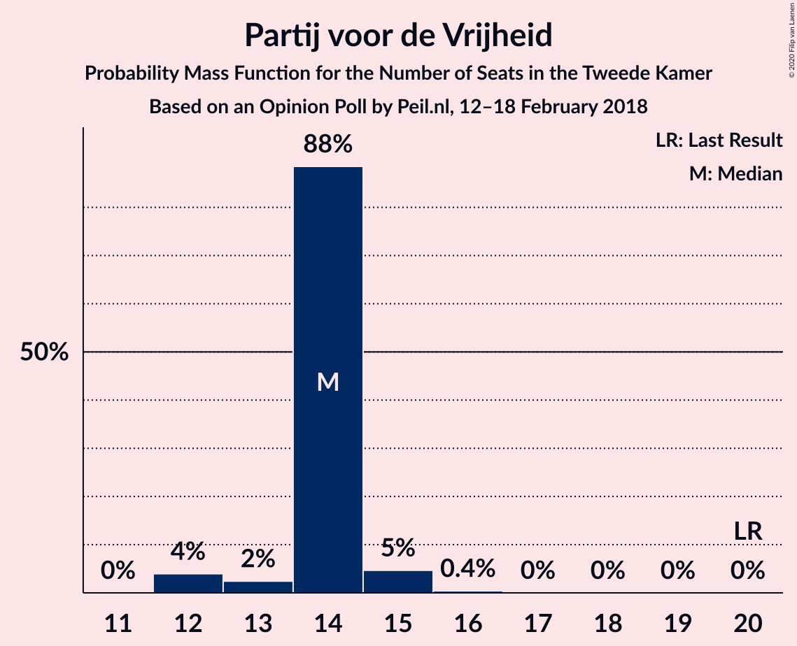

| Number of Seats | Probability | Accumulated | Special Marks |
|:---------------:|:-----------:|:-----------:|:-------------:|
| 12 | 4% | 100% |  |
| 13 | 2% | 96% |  |
| 14 | 88% | 94% | Median |
| 15 | 5% | 5% |  |
| 16 | 0.4% | 0.4% |  |
| 17 | 0% | 0% |  |
| 18 | 0% | 0% |  |
| 19 | 0% | 0% |  |
| 20 | 0% | 0% | Last Result |

### Christen-Democratisch Appèl

*For a full overview of the results for this party, see the [Christen-Democratisch Appèl](party-christen-democratischappèl.html) page.*

| Number of Seats | Probability | Accumulated | Special Marks |
|:---------------:|:-----------:|:-----------:|:-------------:|
| 12 | 0.1% | 100% |  |
| 13 | 7% | 99.9% |  |
| 14 | 35% | 93% |  |
| 15 | 0.7% | 58% |  |
| 16 | 57% | 57% | Median |
| 17 | 0% | 0% |  |
| 18 | 0% | 0% |  |
| 19 | 0% | 0% | Last Result |

### Democraten 66

*For a full overview of the results for this party, see the [Democraten 66](party-democraten66.html) page.*

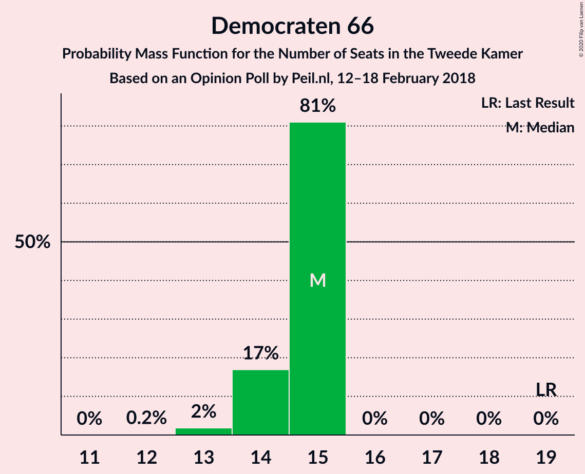

| Number of Seats | Probability | Accumulated | Special Marks |
|:---------------:|:-----------:|:-----------:|:-------------:|
| 11 | 0.1% | 100% |  |
| 12 | 57% | 99.9% | Median |
| 13 | 0.5% | 43% |  |
| 14 | 10% | 42% |  |
| 15 | 31% | 33% |  |
| 16 | 1.3% | 1.3% |  |
| 17 | 0% | 0% |  |
| 18 | 0% | 0% |  |
| 19 | 0% | 0% | Last Result |

### GroenLinks

*For a full overview of the results for this party, see the [GroenLinks](party-groenlinks.html) page.*

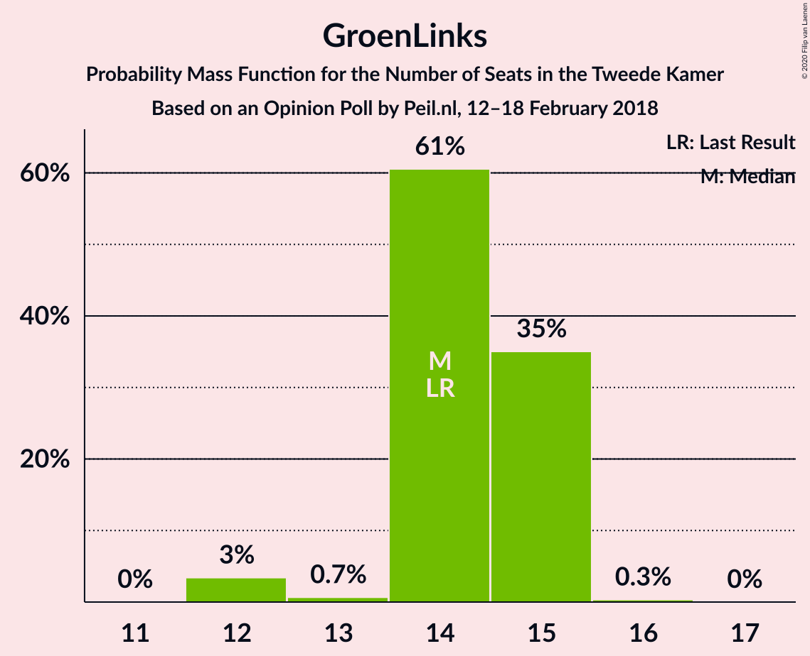

| Number of Seats | Probability | Accumulated | Special Marks |
|:---------------:|:-----------:|:-----------:|:-------------:|
| 12 | 3% | 100% |  |
| 13 | 0.7% | 97% |  |
| 14 | 61% | 96% | Last Result, Median |
| 15 | 35% | 35% |  |
| 16 | 0.3% | 0.3% |  |
| 17 | 0% | 0% |  |

### Partij van de Arbeid

*For a full overview of the results for this party, see the [Partij van de Arbeid](party-partijvandearbeid.html) page.*

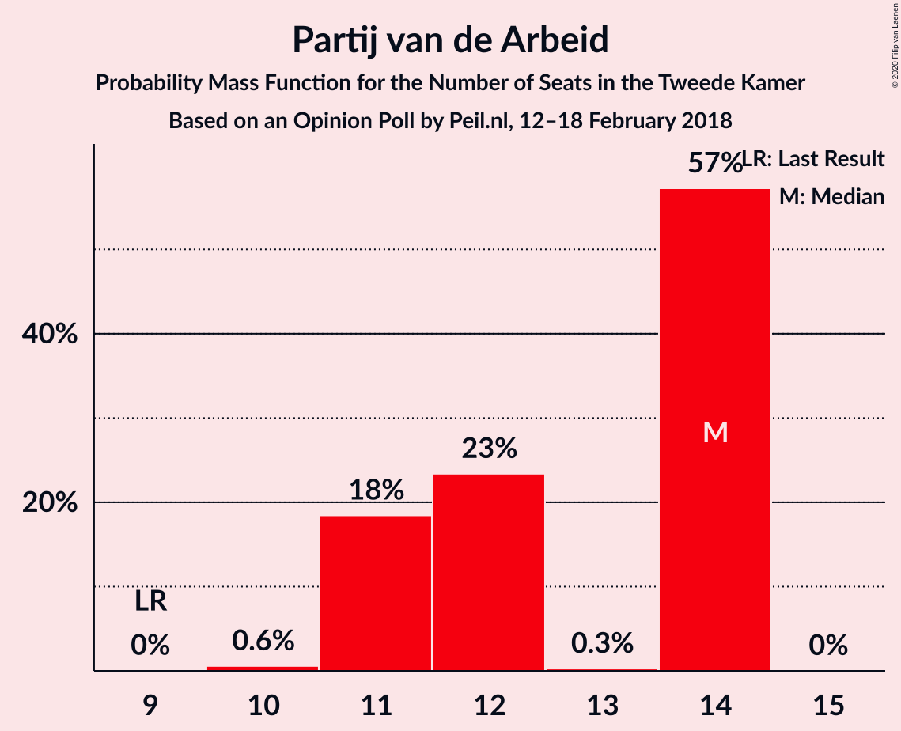

| Number of Seats | Probability | Accumulated | Special Marks |
|:---------------:|:-----------:|:-----------:|:-------------:|
| 9 | 0% | 100% | Last Result |
| 10 | 0.6% | 100% |  |
| 11 | 18% | 99.4% |  |
| 12 | 23% | 81% |  |
| 13 | 0.3% | 58% |  |
| 14 | 57% | 57% | Median |
| 15 | 0% | 0% |  |

### Partij voor de Dieren

*For a full overview of the results for this party, see the [Partij voor de Dieren](party-partijvoordedieren.html) page.*

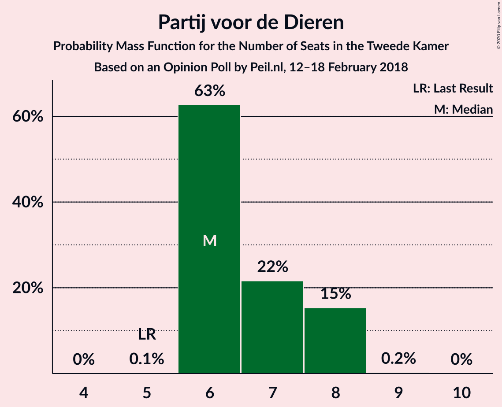

| Number of Seats | Probability | Accumulated | Special Marks |
|:---------------:|:-----------:|:-----------:|:-------------:|
| 5 | 0.1% | 100% | Last Result |
| 6 | 63% | 99.9% | Median |
| 7 | 22% | 37% |  |
| 8 | 15% | 16% |  |
| 9 | 0.2% | 0.2% |  |
| 10 | 0% | 0% |  |

### ChristenUnie

*For a full overview of the results for this party, see the [ChristenUnie](party-christenunie.html) page.*

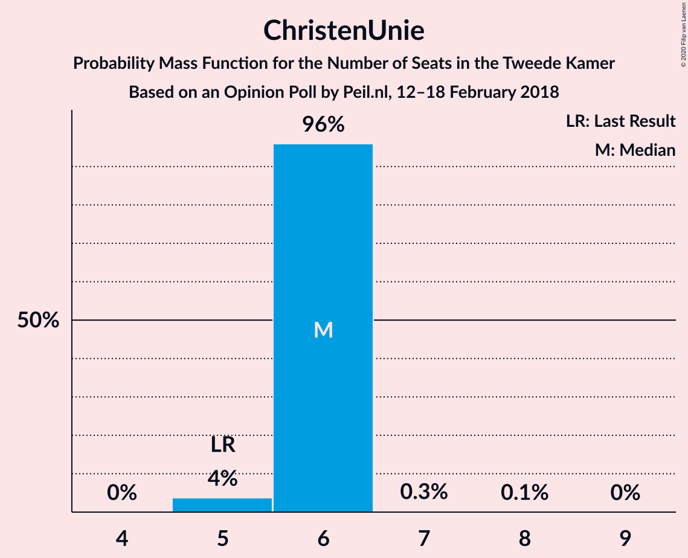

| Number of Seats | Probability | Accumulated | Special Marks |
|:---------------:|:-----------:|:-----------:|:-------------:|
| 5 | 12% | 100% | Last Result |
| 6 | 67% | 88% | Median |
| 7 | 2% | 21% |  |
| 8 | 19% | 19% |  |
| 9 | 0% | 0% |  |

### 50Plus

*For a full overview of the results for this party, see the [50Plus](party-50plus.html) page.*

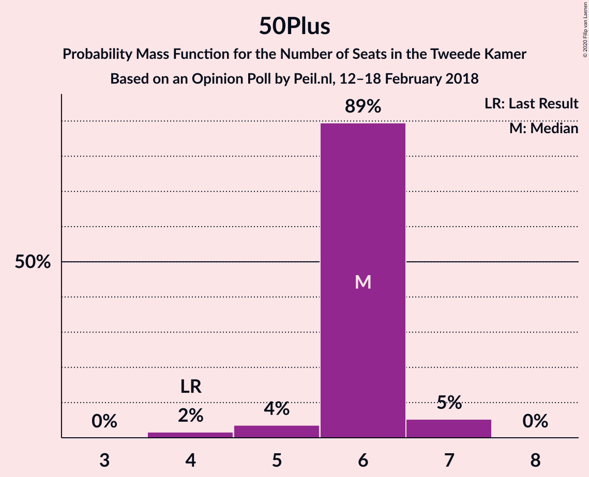

| Number of Seats | Probability | Accumulated | Special Marks |
|:---------------:|:-----------:|:-----------:|:-------------:|
| 4 | 2% | 100% | Last Result |
| 5 | 4% | 98% |  |
| 6 | 89% | 95% | Median |
| 7 | 5% | 5% |  |
| 8 | 0% | 0% |  |

### Staatkundig Gereformeerde Partij

*For a full overview of the results for this party, see the [Staatkundig Gereformeerde Partij](party-staatkundiggereformeerdepartij.html) page.*

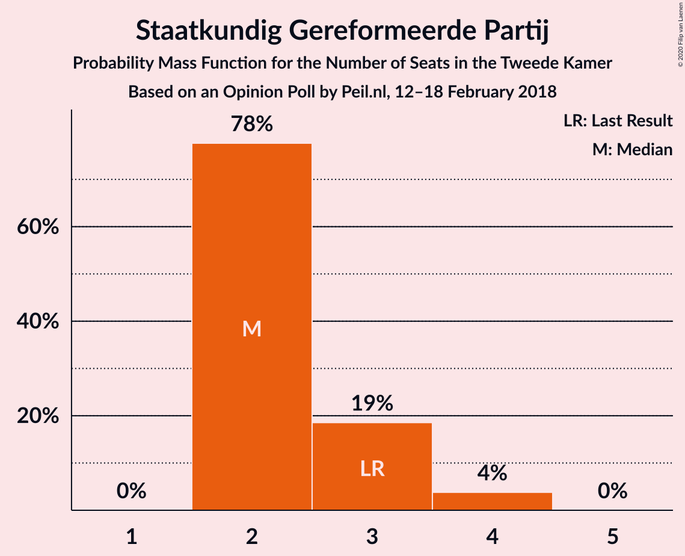

| Number of Seats | Probability | Accumulated | Special Marks |
|:---------------:|:-----------:|:-----------:|:-------------:|
| 2 | 78% | 100% | Median |
| 3 | 19% | 22% | Last Result |
| 4 | 4% | 4% |  |
| 5 | 0% | 0% |  |

### DENK

*For a full overview of the results for this party, see the [DENK](party-denk.html) page.*

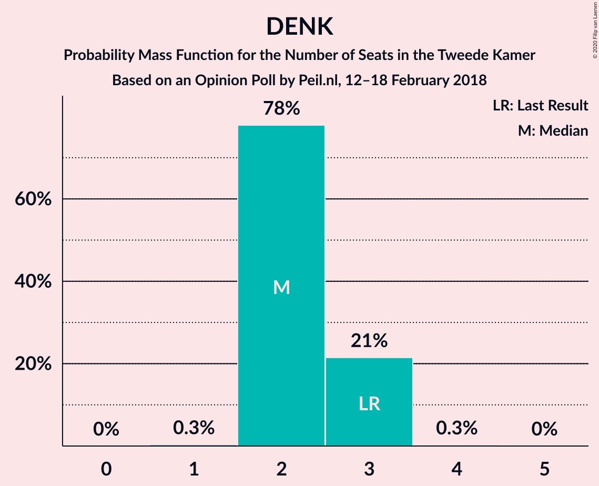

| Number of Seats | Probability | Accumulated | Special Marks |
|:---------------:|:-----------:|:-----------:|:-------------:|
| 1 | 0.3% | 100% |  |
| 2 | 78% | 99.7% | Median |
| 3 | 21% | 22% | Last Result |
| 4 | 0.3% | 0.3% |  |
| 5 | 0% | 0% |  |

## Coalitions

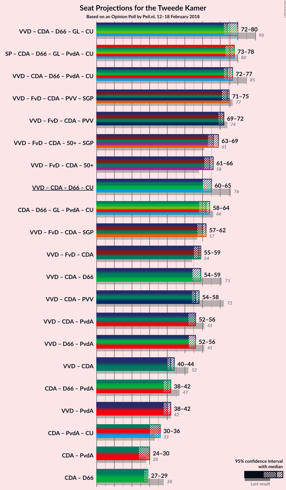

### Confidence Intervals

| Coalition | Last Result | Median | Majority? | 80% Confidence Interval | 90% Confidence Interval | 95% Confidence Interval | 99% Confidence Interval |
|:---------:|:-----------:|:------:|:---------:|:-----------------------:|:-----------------------:|:-----------------------:|:-----------------------:|
| Volkspartij voor Vrijheid en Democratie – Christen-Democratisch Appèl – Democraten 66 – GroenLinks – ChristenUnie | 90 | 74 | 37% | 74–80 | 73–80 | 72–80 | 72–80 |
| Socialistische Partij – Christen-Democratisch Appèl – Democraten 66 – GroenLinks – Partij van de Arbeid – ChristenUnie | 80 | 78 | 78% | 73–78 | 73–78 | 73–78 | 73–78 |
| Volkspartij voor Vrijheid en Democratie – Christen-Democratisch Appèl – Democraten 66 – Partij van de Arbeid – ChristenUnie | 85 | 74 | 19% | 74–77 | 72–77 | 72–77 | 70–77 |
| Volkspartij voor Vrijheid en Democratie – Forum voor Democratie – Christen-Democratisch Appèl – Partij voor de Vrijheid – Staatkundig Gereformeerde Partij | 77 | 74 | 0.8% | 71–74 | 71–75 | 71–75 | 70–76 |
| Volkspartij voor Vrijheid en Democratie – Forum voor Democratie – Christen-Democratisch Appèl – Partij voor de Vrijheid | 74 | 72 | 0% | 69–72 | 69–72 | 69–72 | 66–74 |
| Volkspartij voor Vrijheid en Democratie – Forum voor Democratie – Christen-Democratisch Appèl – 50Plus – Staatkundig Gereformeerde Partij | 61 | 66 | 0% | 63–66 | 63–66 | 63–69 | 63–69 |
| Volkspartij voor Vrijheid en Democratie – Forum voor Democratie – Christen-Democratisch Appèl – 50Plus | 58 | 64 | 0% | 61–64 | 61–64 | 61–66 | 59–66 |
| Volkspartij voor Vrijheid en Democratie – Christen-Democratisch Appèl – Democraten 66 – ChristenUnie | 76 | 60 | 0% | 60–65 | 60–65 | 60–65 | 59–65 |
| Christen-Democratisch Appèl – Democraten 66 – GroenLinks – Partij van de Arbeid – ChristenUnie | 66 | 62 | 0% | 59–64 | 59–64 | 58–64 | 58–64 |
| Volkspartij voor Vrijheid en Democratie – Forum voor Democratie – Christen-Democratisch Appèl – Staatkundig Gereformeerde Partij | 57 | 60 | 0% | 57–60 | 57–62 | 57–62 | 57–62 |
| Volkspartij voor Vrijheid en Democratie – Forum voor Democratie – Christen-Democratisch Appèl | 54 | 58 | 0% | 55–58 | 55–59 | 55–59 | 53–59 |
| Volkspartij voor Vrijheid en Democratie – Christen-Democratisch Appèl – Democraten 66 | 71 | 54 | 0% | 54–59 | 54–59 | 54–59 | 53–59 |
| Volkspartij voor Vrijheid en Democratie – Christen-Democratisch Appèl – Partij voor de Vrijheid | 72 | 56 | 0% | 56–58 | 55–58 | 54–58 | 52–58 |
| Volkspartij voor Vrijheid en Democratie – Christen-Democratisch Appèl – Partij van de Arbeid | 61 | 56 | 0% | 54–56 | 52–56 | 52–56 | 48–56 |
| Volkspartij voor Vrijheid en Democratie – Democraten 66 – Partij van de Arbeid | 61 | 52 | 0% | 52–56 | 52–56 | 52–56 | 51–56 |
| Volkspartij voor Vrijheid en Democratie – Christen-Democratisch Appèl | 52 | 42 | 0% | 42–44 | 41–44 | 40–44 | 37–44 |
| Christen-Democratisch Appèl – Democraten 66 – Partij van de Arbeid | 47 | 42 | 0% | 40–42 | 38–42 | 38–42 | 38–42 |
| Volkspartij voor Vrijheid en Democratie – Partij van de Arbeid | 42 | 40 | 0% | 40–41 | 38–41 | 38–42 | 35–42 |
| Christen-Democratisch Appèl – Partij van de Arbeid – ChristenUnie | 33 | 36 | 0% | 30–36 | 30–36 | 30–36 | 30–36 |
| Christen-Democratisch Appèl – Partij van de Arbeid | 28 | 30 | 0% | 25–30 | 24–30 | 24–30 | 24–30 |
| Christen-Democratisch Appèl – Democraten 66 | 38 | 28 | 0% | 28–29 | 27–29 | 27–29 | 27–29 |

### Volkspartij voor Vrijheid en Democratie – Christen-Democratisch Appèl – Democraten 66 – GroenLinks – ChristenUnie

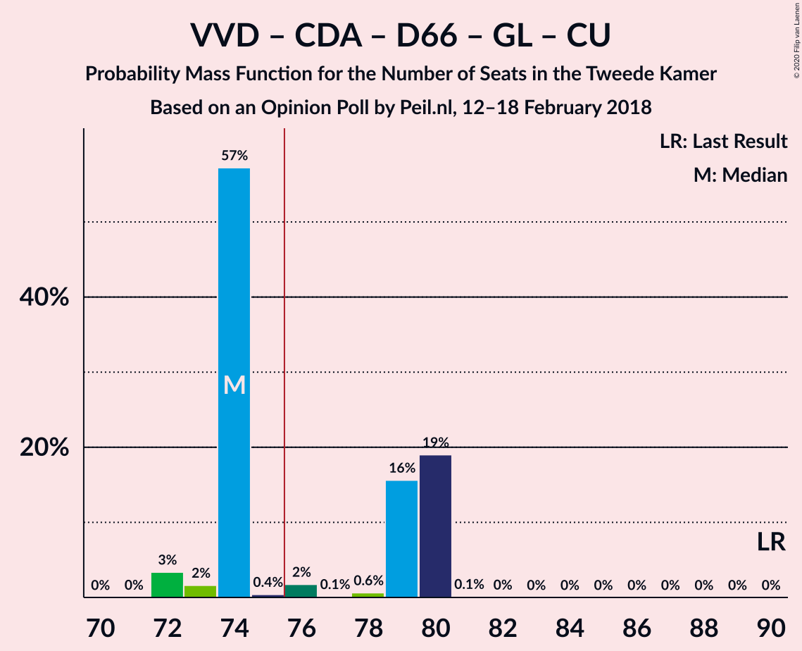

| Number of Seats | Probability | Accumulated | Special Marks |
|:---------------:|:-----------:|:-----------:|:-------------:|
| 71 | 0% | 100% |  |
| 72 | 3% | 99.9% |  |
| 73 | 2% | 97% |  |
| 74 | 57% | 95% | Median |
| 75 | 0.4% | 38% |  |
| 76 | 2% | 37% | Majority |
| 77 | 0.1% | 36% |  |
| 78 | 0.6% | 35% |  |
| 79 | 16% | 35% |  |
| 80 | 19% | 19% |  |
| 81 | 0.1% | 0.2% |  |
| 82 | 0% | 0% |  |
| 83 | 0% | 0% |  |
| 84 | 0% | 0% |  |
| 85 | 0% | 0% |  |
| 86 | 0% | 0% |  |
| 87 | 0% | 0% |  |
| 88 | 0% | 0% |  |
| 89 | 0% | 0% |  |
| 90 | 0% | 0% | Last Result |

### Socialistische Partij – Christen-Democratisch Appèl – Democraten 66 – GroenLinks – Partij van de Arbeid – ChristenUnie

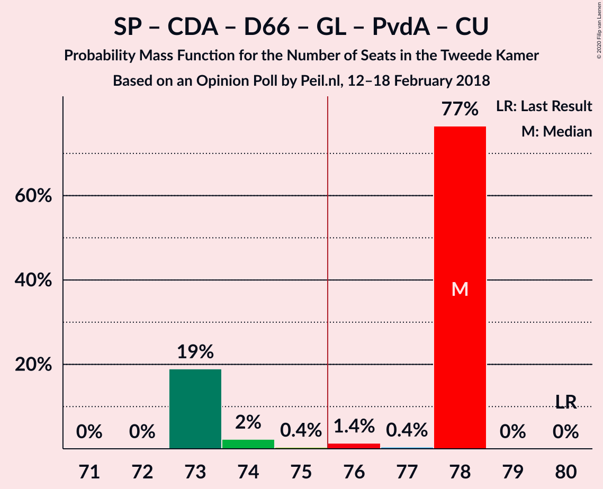

| Number of Seats | Probability | Accumulated | Special Marks |
|:---------------:|:-----------:|:-----------:|:-------------:|
| 71 | 0% | 100% |  |
| 72 | 0% | 99.9% |  |
| 73 | 19% | 99.9% |  |
| 74 | 2% | 81% |  |
| 75 | 0.4% | 79% |  |
| 76 | 1.4% | 78% | Majority |
| 77 | 0.4% | 77% |  |
| 78 | 77% | 77% | Median |
| 79 | 0% | 0% |  |
| 80 | 0% | 0% | Last Result |

### Volkspartij voor Vrijheid en Democratie – Christen-Democratisch Appèl – Democraten 66 – Partij van de Arbeid – ChristenUnie

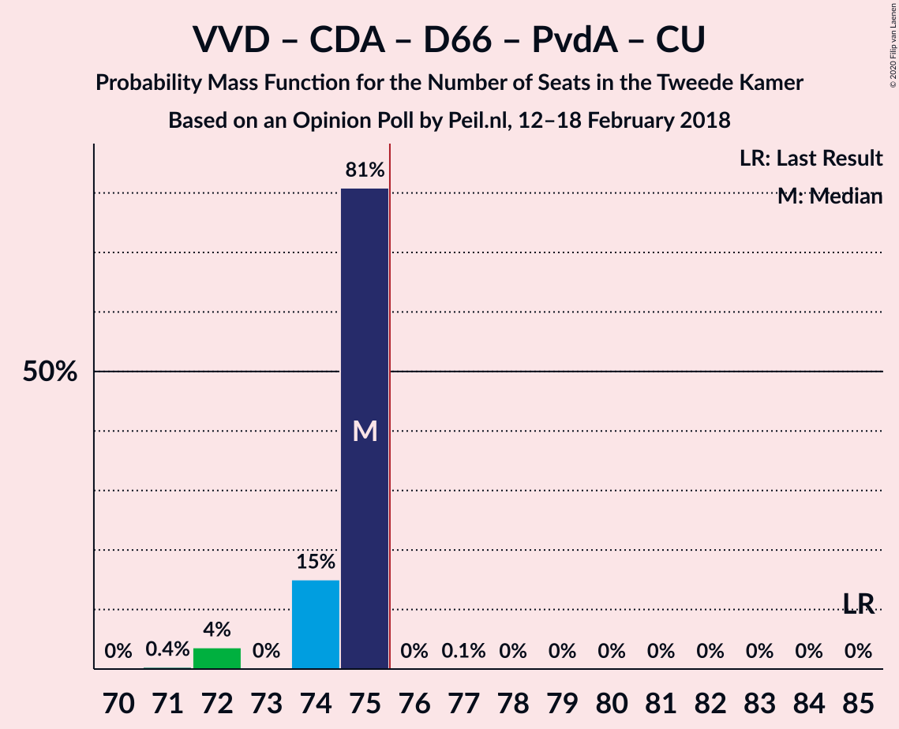

| Number of Seats | Probability | Accumulated | Special Marks |
|:---------------:|:-----------:|:-----------:|:-------------:|
| 69 | 0.1% | 100% |  |
| 70 | 0.8% | 99.8% |  |
| 71 | 1.0% | 99.1% |  |
| 72 | 3% | 98% |  |
| 73 | 2% | 95% |  |
| 74 | 58% | 93% | Median |
| 75 | 16% | 35% |  |
| 76 | 0% | 19% | Majority |
| 77 | 19% | 19% |  |
| 78 | 0.2% | 0.2% |  |
| 79 | 0% | 0% |  |
| 80 | 0% | 0% |  |
| 81 | 0% | 0% |  |
| 82 | 0% | 0% |  |
| 83 | 0% | 0% |  |
| 84 | 0% | 0% |  |
| 85 | 0% | 0% | Last Result |

### Volkspartij voor Vrijheid en Democratie – Forum voor Democratie – Christen-Democratisch Appèl – Partij voor de Vrijheid – Staatkundig Gereformeerde Partij

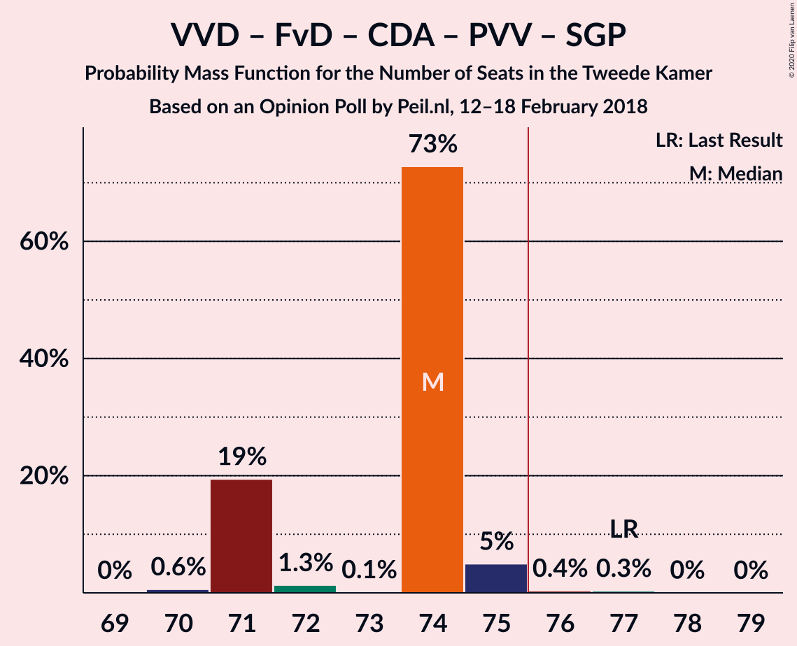

| Number of Seats | Probability | Accumulated | Special Marks |
|:---------------:|:-----------:|:-----------:|:-------------:|
| 70 | 0.6% | 100% |  |
| 71 | 19% | 99.4% |  |
| 72 | 1.3% | 80% |  |
| 73 | 0.1% | 79% |  |
| 74 | 73% | 79% | Median |
| 75 | 5% | 6% |  |
| 76 | 0.4% | 0.8% | Majority |
| 77 | 0.3% | 0.4% | Last Result |
| 78 | 0% | 0.1% |  |
| 79 | 0% | 0% |  |

### Volkspartij voor Vrijheid en Democratie – Forum voor Democratie – Christen-Democratisch Appèl – Partij voor de Vrijheid

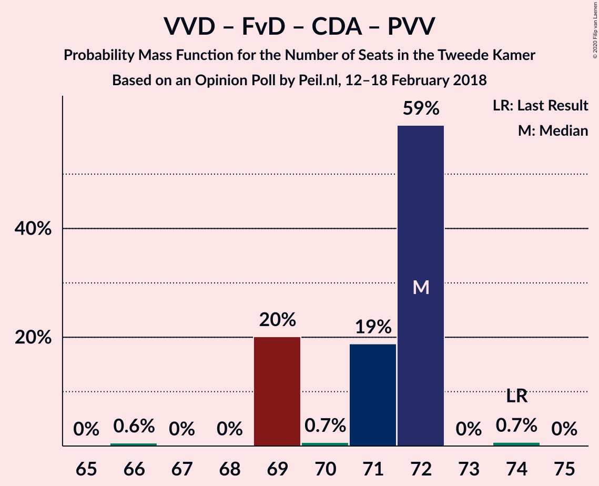

| Number of Seats | Probability | Accumulated | Special Marks |
|:---------------:|:-----------:|:-----------:|:-------------:|
| 66 | 0.6% | 100% |  |
| 67 | 0% | 99.4% |  |
| 68 | 0% | 99.4% |  |
| 69 | 20% | 99.4% |  |
| 70 | 0.7% | 79% |  |
| 71 | 19% | 79% |  |
| 72 | 59% | 60% | Median |
| 73 | 0% | 0.8% |  |
| 74 | 0.7% | 0.7% | Last Result |
| 75 | 0% | 0% |  |

### Volkspartij voor Vrijheid en Democratie – Forum voor Democratie – Christen-Democratisch Appèl – 50Plus – Staatkundig Gereformeerde Partij

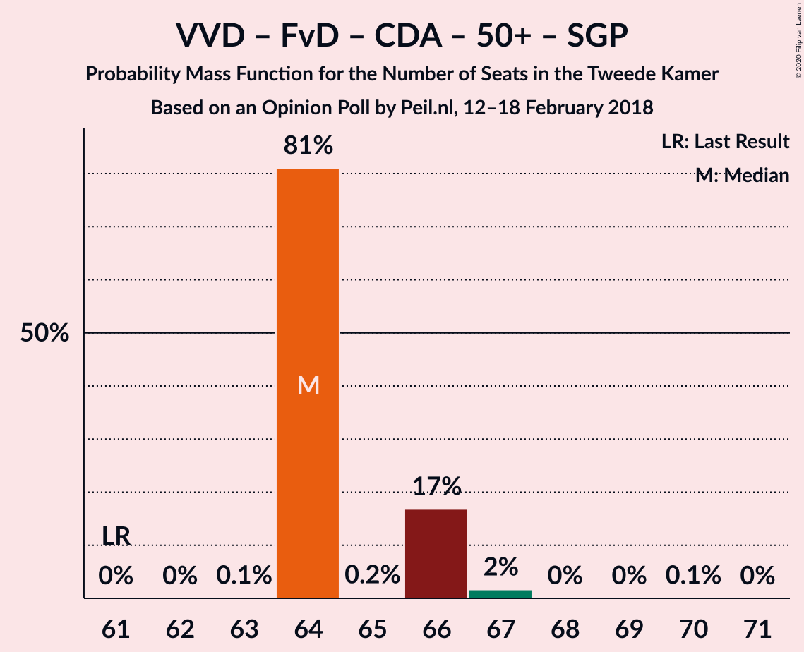

| Number of Seats | Probability | Accumulated | Special Marks |
|:---------------:|:-----------:|:-----------:|:-------------:|
| 61 | 0% | 100% | Last Result |
| 62 | 0% | 100% |  |
| 63 | 20% | 99.9% |  |
| 64 | 2% | 80% |  |
| 65 | 3% | 79% |  |
| 66 | 71% | 75% | Median |
| 67 | 0.3% | 5% |  |
| 68 | 0.6% | 4% |  |
| 69 | 4% | 4% |  |
| 70 | 0% | 0% |  |

### Volkspartij voor Vrijheid en Democratie – Forum voor Democratie – Christen-Democratisch Appèl – 50Plus

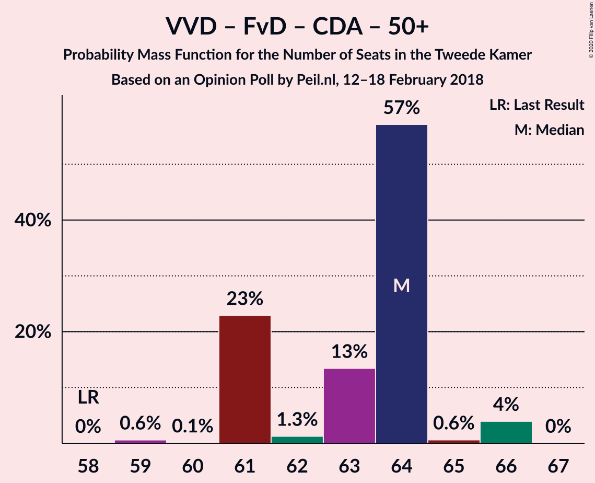

| Number of Seats | Probability | Accumulated | Special Marks |
|:---------------:|:-----------:|:-----------:|:-------------:|
| 58 | 0% | 100% | Last Result |
| 59 | 0.6% | 100% |  |
| 60 | 0.1% | 99.4% |  |
| 61 | 23% | 99.3% |  |
| 62 | 1.3% | 76% |  |
| 63 | 13% | 75% |  |
| 64 | 57% | 62% | Median |
| 65 | 0.6% | 5% |  |
| 66 | 4% | 4% |  |
| 67 | 0% | 0% |  |

### Volkspartij voor Vrijheid en Democratie – Christen-Democratisch Appèl – Democraten 66 – ChristenUnie

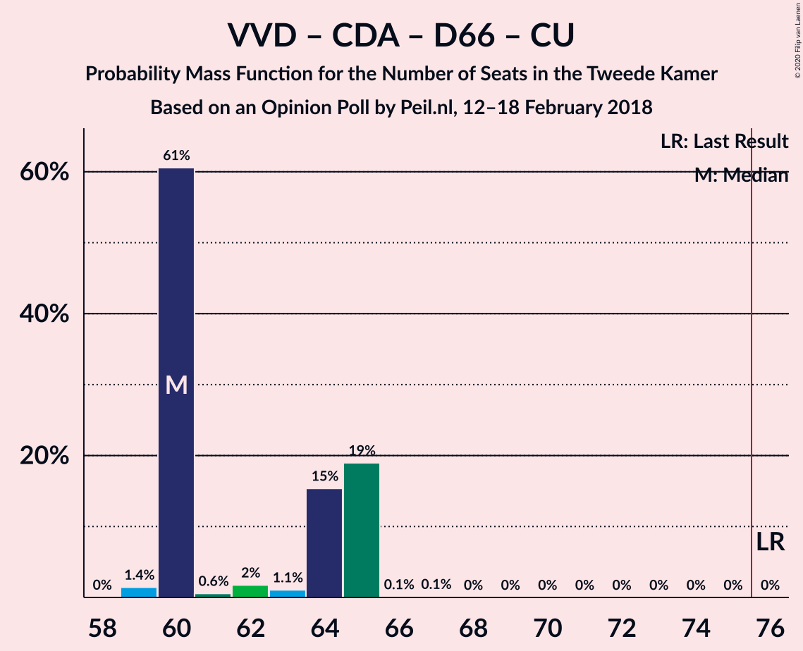

| Number of Seats | Probability | Accumulated | Special Marks |
|:---------------:|:-----------:|:-----------:|:-------------:|
| 58 | 0% | 100% |  |
| 59 | 1.4% | 99.9% |  |
| 60 | 61% | 98.5% | Median |
| 61 | 0.6% | 38% |  |
| 62 | 2% | 37% |  |
| 63 | 1.1% | 36% |  |
| 64 | 15% | 35% |  |
| 65 | 19% | 19% |  |
| 66 | 0.1% | 0.2% |  |
| 67 | 0.1% | 0.1% |  |
| 68 | 0% | 0% |  |
| 69 | 0% | 0% |  |
| 70 | 0% | 0% |  |
| 71 | 0% | 0% |  |
| 72 | 0% | 0% |  |
| 73 | 0% | 0% |  |
| 74 | 0% | 0% |  |
| 75 | 0% | 0% |  |
| 76 | 0% | 0% | Last Result, Majority |

### Christen-Democratisch Appèl – Democraten 66 – GroenLinks – Partij van de Arbeid – ChristenUnie

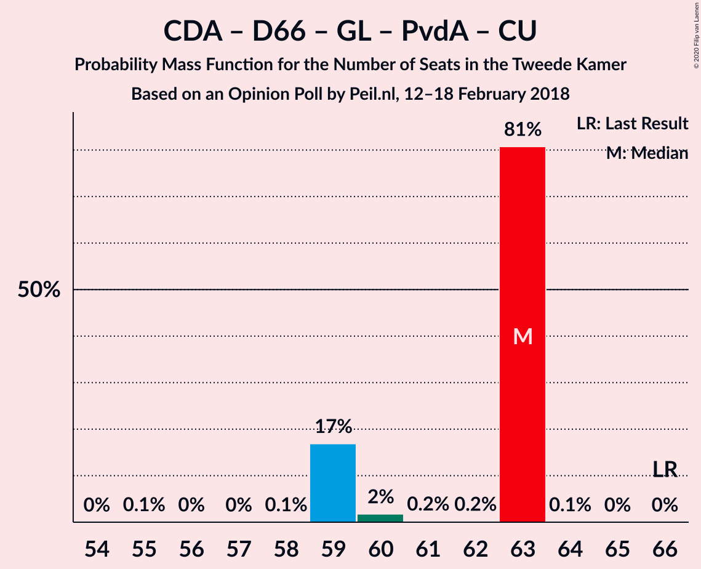

| Number of Seats | Probability | Accumulated | Special Marks |
|:---------------:|:-----------:|:-----------:|:-------------:|
| 56 | 0% | 100% |  |
| 57 | 0.1% | 99.9% |  |
| 58 | 4% | 99.8% |  |
| 59 | 6% | 96% |  |
| 60 | 13% | 90% |  |
| 61 | 0.7% | 77% |  |
| 62 | 57% | 76% | Median |
| 63 | 0.3% | 19% |  |
| 64 | 19% | 19% |  |
| 65 | 0% | 0% |  |
| 66 | 0% | 0% | Last Result |

### Volkspartij voor Vrijheid en Democratie – Forum voor Democratie – Christen-Democratisch Appèl – Staatkundig Gereformeerde Partij

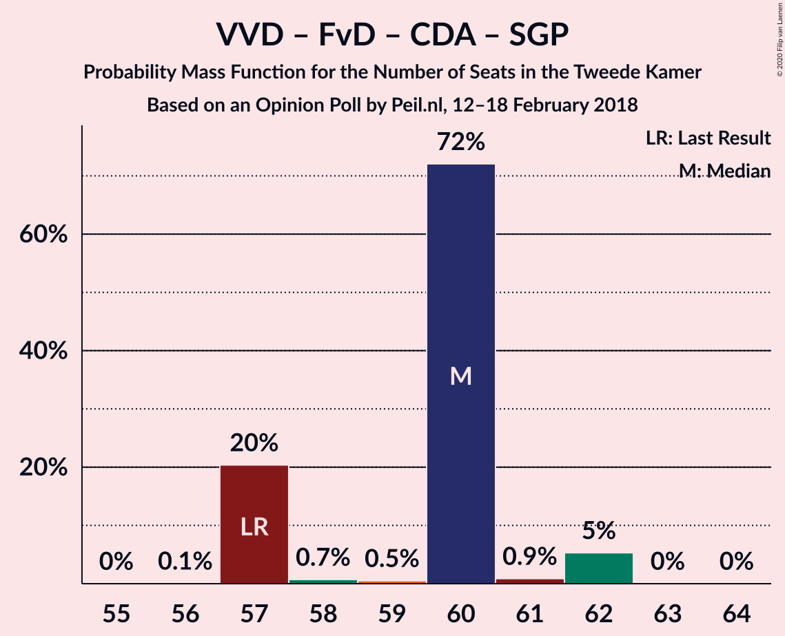

| Number of Seats | Probability | Accumulated | Special Marks |
|:---------------:|:-----------:|:-----------:|:-------------:|
| 56 | 0.1% | 100% |  |
| 57 | 20% | 99.9% | Last Result |
| 58 | 0.7% | 80% |  |
| 59 | 0.5% | 79% |  |
| 60 | 72% | 78% | Median |
| 61 | 0.9% | 6% |  |
| 62 | 5% | 5% |  |
| 63 | 0% | 0.1% |  |
| 64 | 0% | 0% |  |

### Volkspartij voor Vrijheid en Democratie – Forum voor Democratie – Christen-Democratisch Appèl

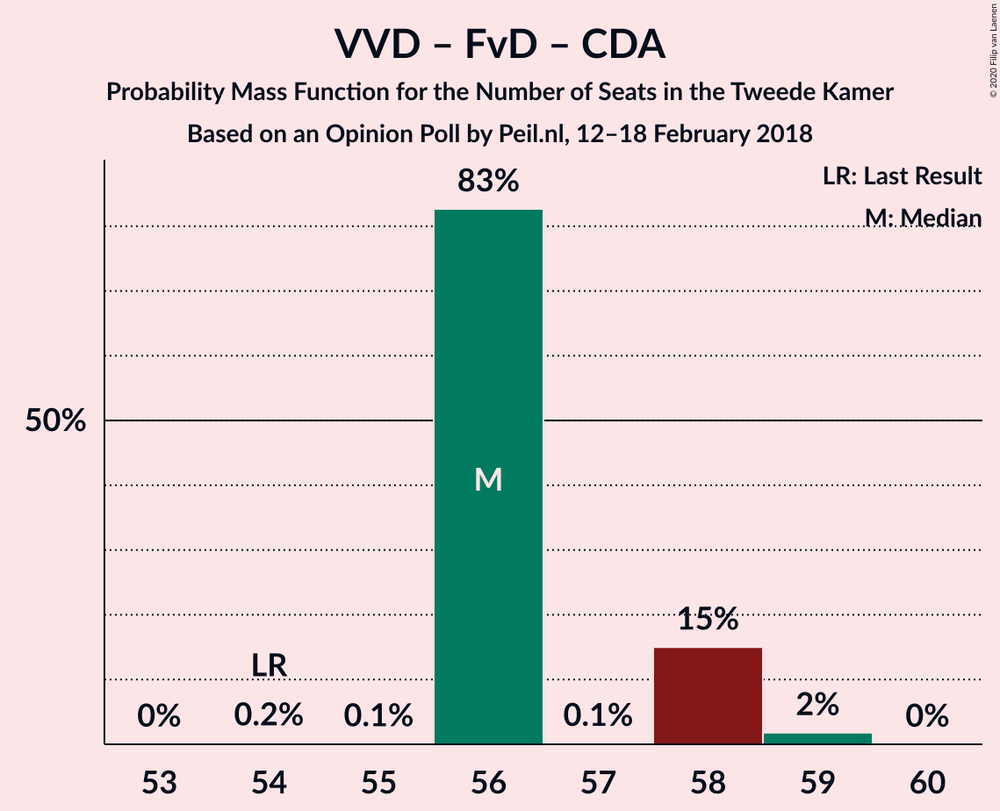

| Number of Seats | Probability | Accumulated | Special Marks |
|:---------------:|:-----------:|:-----------:|:-------------:|
| 53 | 0.6% | 100% |  |
| 54 | 0.7% | 99.4% | Last Result |
| 55 | 19% | 98.7% |  |
| 56 | 4% | 79% |  |
| 57 | 12% | 75% |  |
| 58 | 57% | 63% | Median |
| 59 | 6% | 6% |  |
| 60 | 0.1% | 0.1% |  |
| 61 | 0% | 0% |  |

### Volkspartij voor Vrijheid en Democratie – Christen-Democratisch Appèl – Democraten 66

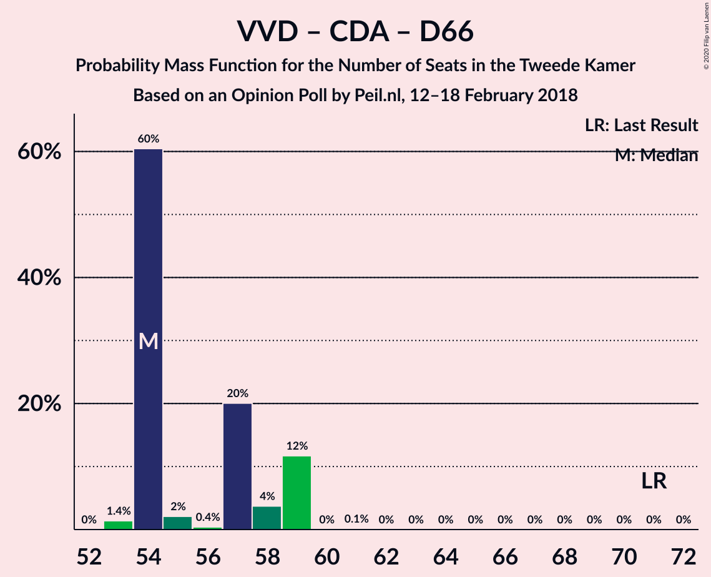

| Number of Seats | Probability | Accumulated | Special Marks |
|:---------------:|:-----------:|:-----------:|:-------------:|
| 53 | 1.4% | 100% |  |
| 54 | 60% | 98.6% | Median |
| 55 | 2% | 38% |  |
| 56 | 0.4% | 36% |  |
| 57 | 20% | 36% |  |
| 58 | 4% | 16% |  |
| 59 | 12% | 12% |  |
| 60 | 0% | 0.1% |  |
| 61 | 0.1% | 0.1% |  |
| 62 | 0% | 0% |  |
| 63 | 0% | 0% |  |
| 64 | 0% | 0% |  |
| 65 | 0% | 0% |  |
| 66 | 0% | 0% |  |
| 67 | 0% | 0% |  |
| 68 | 0% | 0% |  |
| 69 | 0% | 0% |  |
| 70 | 0% | 0% |  |
| 71 | 0% | 0% | Last Result |

### Volkspartij voor Vrijheid en Democratie – Christen-Democratisch Appèl – Partij voor de Vrijheid

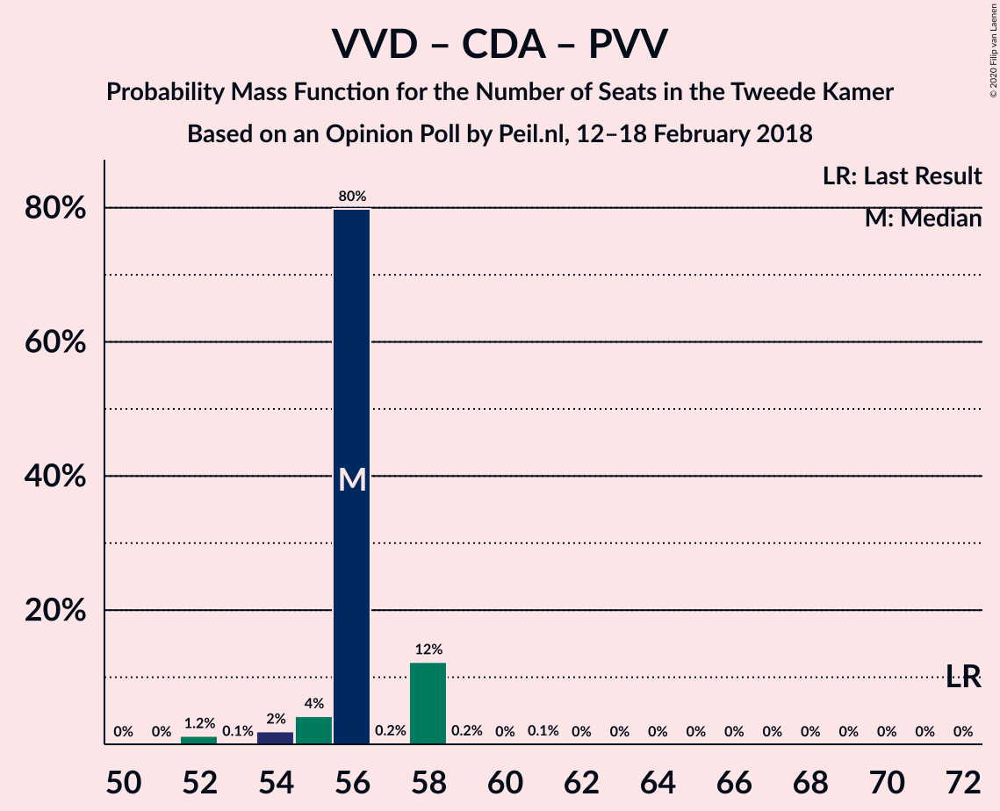

| Number of Seats | Probability | Accumulated | Special Marks |
|:---------------:|:-----------:|:-----------:|:-------------:|
| 52 | 1.2% | 100% |  |
| 53 | 0.1% | 98.8% |  |
| 54 | 2% | 98.7% |  |
| 55 | 4% | 97% |  |
| 56 | 80% | 93% | Median |
| 57 | 0.2% | 13% |  |
| 58 | 12% | 13% |  |
| 59 | 0.2% | 0.3% |  |
| 60 | 0% | 0.1% |  |
| 61 | 0.1% | 0.1% |  |
| 62 | 0% | 0% |  |
| 63 | 0% | 0% |  |
| 64 | 0% | 0% |  |
| 65 | 0% | 0% |  |
| 66 | 0% | 0% |  |
| 67 | 0% | 0% |  |
| 68 | 0% | 0% |  |
| 69 | 0% | 0% |  |
| 70 | 0% | 0% |  |
| 71 | 0% | 0% |  |
| 72 | 0% | 0% | Last Result |

### Volkspartij voor Vrijheid en Democratie – Christen-Democratisch Appèl – Partij van de Arbeid

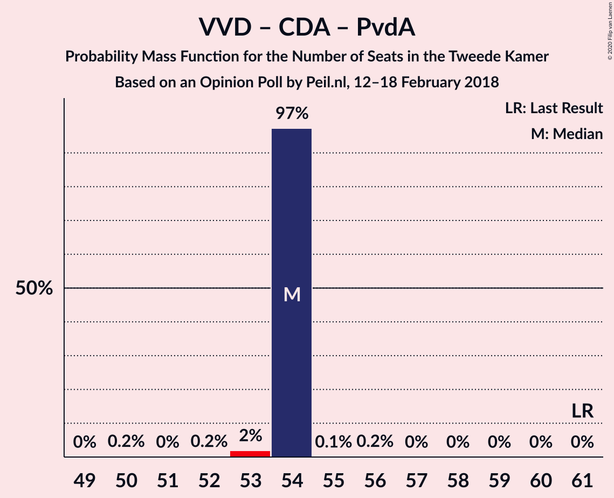

| Number of Seats | Probability | Accumulated | Special Marks |
|:---------------:|:-----------:|:-----------:|:-------------:|
| 48 | 0.7% | 100% |  |
| 49 | 0% | 99.3% |  |
| 50 | 0.2% | 99.3% |  |
| 51 | 0.7% | 99.1% |  |
| 52 | 6% | 98% |  |
| 53 | 0.1% | 93% |  |
| 54 | 19% | 93% |  |
| 55 | 15% | 73% |  |
| 56 | 58% | 58% | Median |
| 57 | 0.1% | 0.1% |  |
| 58 | 0% | 0% |  |
| 59 | 0% | 0% |  |
| 60 | 0% | 0% |  |
| 61 | 0% | 0% | Last Result |

### Volkspartij voor Vrijheid en Democratie – Democraten 66 – Partij van de Arbeid

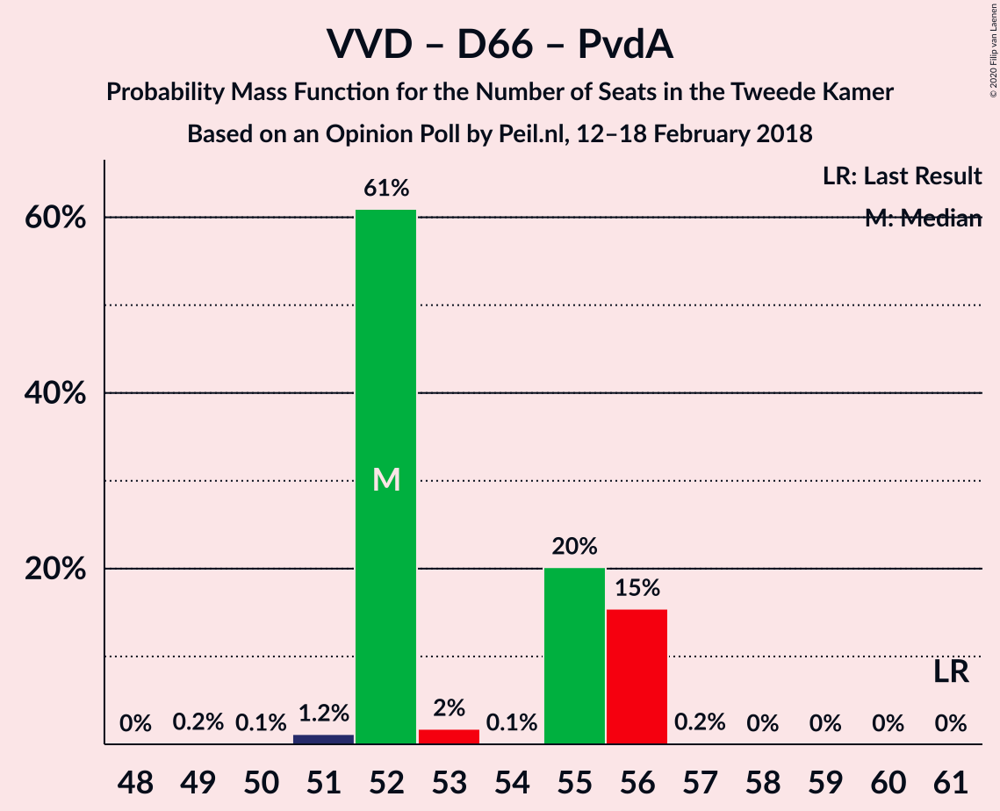

| Number of Seats | Probability | Accumulated | Special Marks |
|:---------------:|:-----------:|:-----------:|:-------------:|
| 49 | 0.2% | 100% |  |
| 50 | 0.1% | 99.8% |  |
| 51 | 1.2% | 99.7% |  |
| 52 | 61% | 98.6% | Median |
| 53 | 2% | 38% |  |
| 54 | 0.1% | 36% |  |
| 55 | 20% | 36% |  |
| 56 | 15% | 16% |  |
| 57 | 0.2% | 0.2% |  |
| 58 | 0% | 0% |  |
| 59 | 0% | 0% |  |
| 60 | 0% | 0% |  |
| 61 | 0% | 0% | Last Result |

### Volkspartij voor Vrijheid en Democratie – Christen-Democratisch Appèl

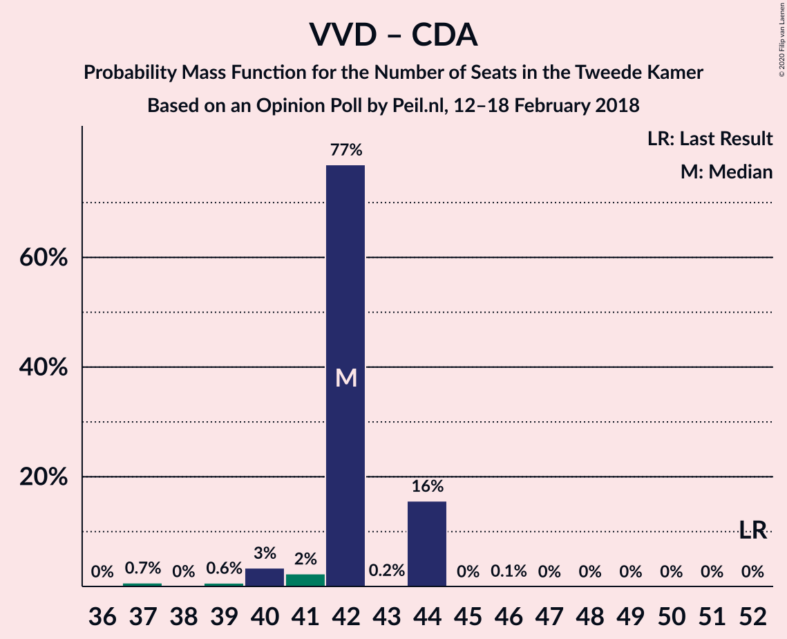

| Number of Seats | Probability | Accumulated | Special Marks |
|:---------------:|:-----------:|:-----------:|:-------------:|
| 37 | 0.7% | 100% |  |
| 38 | 0% | 99.3% |  |
| 39 | 0.6% | 99.3% |  |
| 40 | 3% | 98.6% |  |
| 41 | 2% | 95% |  |
| 42 | 77% | 93% | Median |
| 43 | 0.2% | 16% |  |
| 44 | 16% | 16% |  |
| 45 | 0% | 0.2% |  |
| 46 | 0.1% | 0.1% |  |
| 47 | 0% | 0% |  |
| 48 | 0% | 0% |  |
| 49 | 0% | 0% |  |
| 50 | 0% | 0% |  |
| 51 | 0% | 0% |  |
| 52 | 0% | 0% | Last Result |

### Christen-Democratisch Appèl – Democraten 66 – Partij van de Arbeid

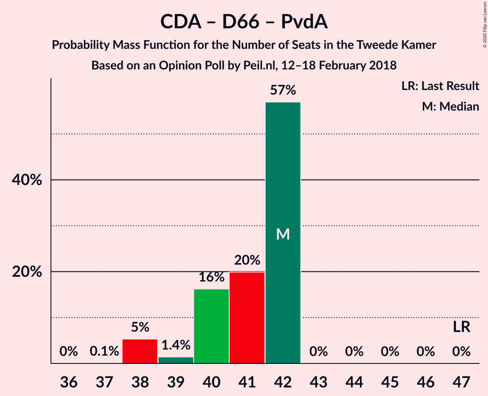

| Number of Seats | Probability | Accumulated | Special Marks |
|:---------------:|:-----------:|:-----------:|:-------------:|
| 37 | 0.1% | 100% |  |
| 38 | 5% | 99.9% |  |
| 39 | 1.4% | 95% |  |
| 40 | 16% | 93% |  |
| 41 | 20% | 77% |  |
| 42 | 57% | 57% | Median |
| 43 | 0% | 0% |  |
| 44 | 0% | 0% |  |
| 45 | 0% | 0% |  |
| 46 | 0% | 0% |  |
| 47 | 0% | 0% | Last Result |

### Volkspartij voor Vrijheid en Democratie – Partij van de Arbeid

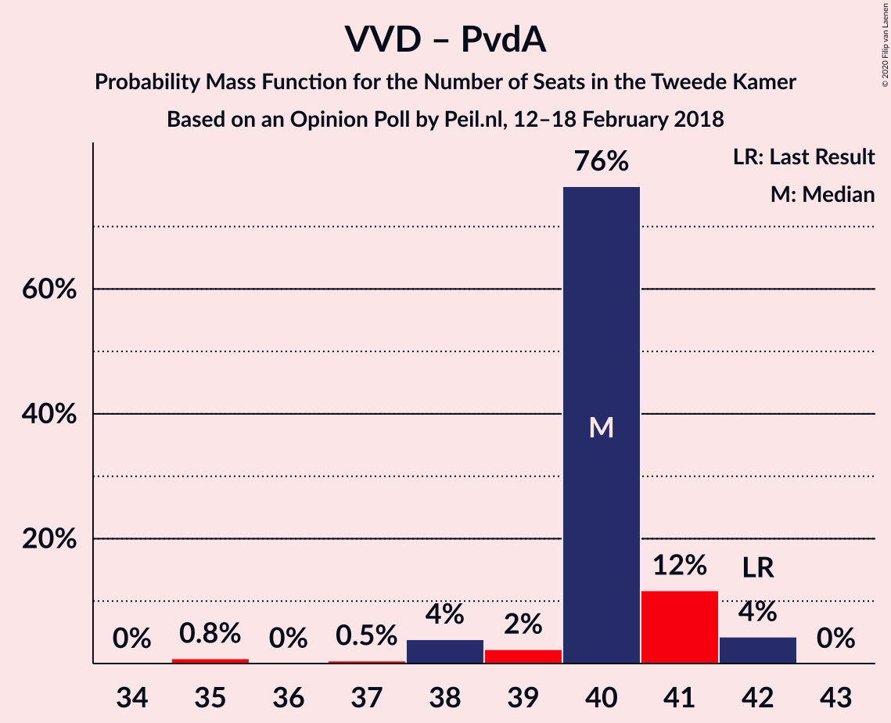

| Number of Seats | Probability | Accumulated | Special Marks |
|:---------------:|:-----------:|:-----------:|:-------------:|
| 35 | 0.8% | 100% |  |
| 36 | 0% | 99.2% |  |
| 37 | 0.5% | 99.1% |  |
| 38 | 4% | 98.7% |  |
| 39 | 2% | 95% |  |
| 40 | 76% | 93% | Median |
| 41 | 12% | 16% |  |
| 42 | 4% | 4% | Last Result |
| 43 | 0% | 0% |  |

### Christen-Democratisch Appèl – Partij van de Arbeid – ChristenUnie

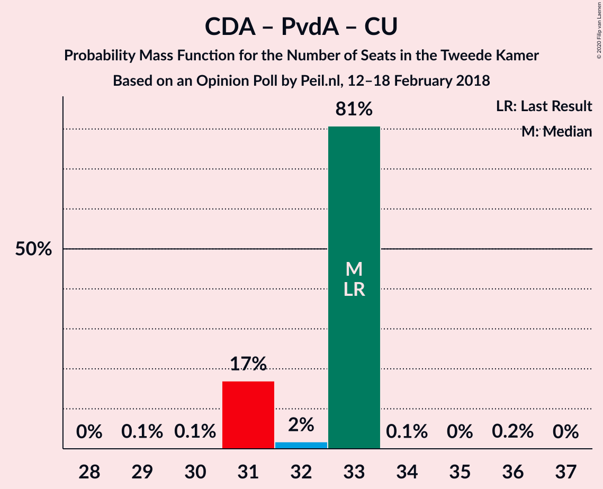

| Number of Seats | Probability | Accumulated | Special Marks |
|:---------------:|:-----------:|:-----------:|:-------------:|
| 29 | 0.1% | 100% |  |
| 30 | 17% | 99.9% |  |
| 31 | 2% | 83% |  |
| 32 | 4% | 80% |  |
| 33 | 0.1% | 77% | Last Result |
| 34 | 19% | 77% |  |
| 35 | 0.2% | 57% |  |
| 36 | 57% | 57% | Median |
| 37 | 0% | 0% |  |

### Christen-Democratisch Appèl – Partij van de Arbeid

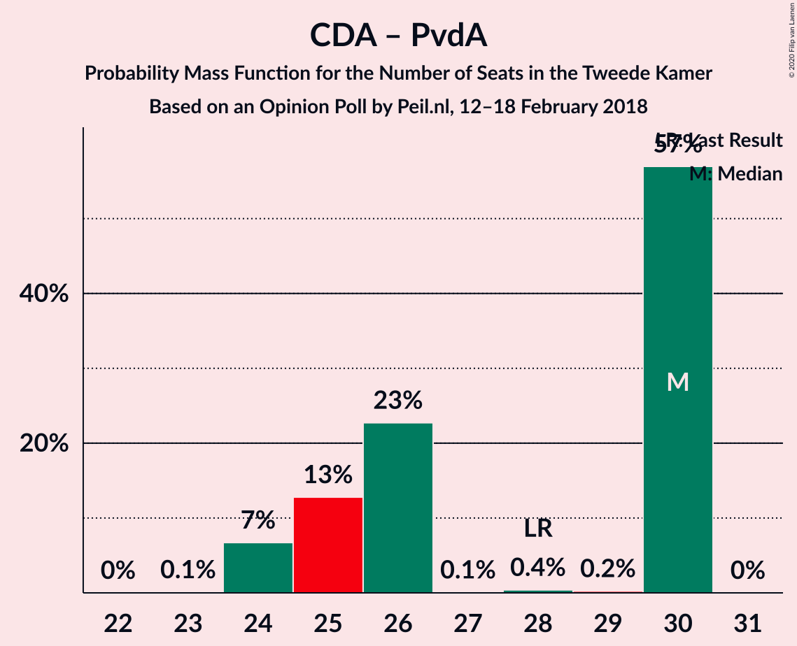

| Number of Seats | Probability | Accumulated | Special Marks |
|:---------------:|:-----------:|:-----------:|:-------------:|
| 23 | 0.1% | 100% |  |
| 24 | 7% | 99.9% |  |
| 25 | 13% | 93% |  |
| 26 | 23% | 80% |  |
| 27 | 0.1% | 58% |  |
| 28 | 0.4% | 58% | Last Result |
| 29 | 0.2% | 57% |  |
| 30 | 57% | 57% | Median |
| 31 | 0% | 0% |  |

### Christen-Democratisch Appèl – Democraten 66

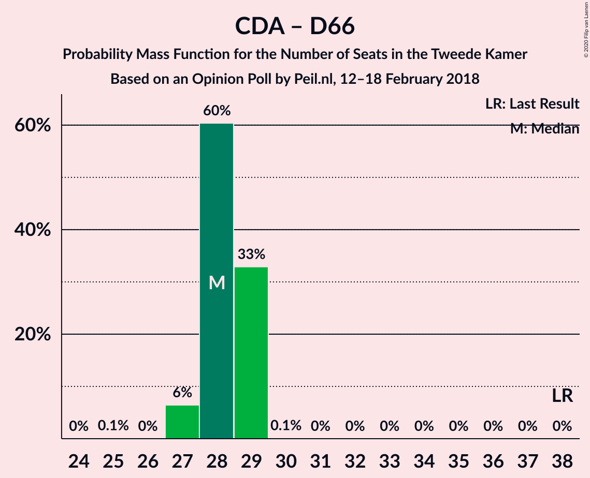

| Number of Seats | Probability | Accumulated | Special Marks |
|:---------------:|:-----------:|:-----------:|:-------------:|
| 25 | 0.1% | 100% |  |
| 26 | 0% | 99.9% |  |
| 27 | 6% | 99.9% |  |
| 28 | 60% | 93% | Median |
| 29 | 33% | 33% |  |
| 30 | 0.1% | 0.1% |  |
| 31 | 0% | 0% |  |
| 32 | 0% | 0% |  |
| 33 | 0% | 0% |  |
| 34 | 0% | 0% |  |
| 35 | 0% | 0% |  |
| 36 | 0% | 0% |  |
| 37 | 0% | 0% |  |
| 38 | 0% | 0% | Last Result |

## Technical Information

### Opinion Poll

+ **Polling firm:** Peil.nl
+ **Commissioner(s):** —
+ **Fieldwork period:** 12–18 February 2018

### Calculations

+ **Sample size:** 3000
+ **Simulations done:** 131,072
+ **Error estimate:** 1.83%

