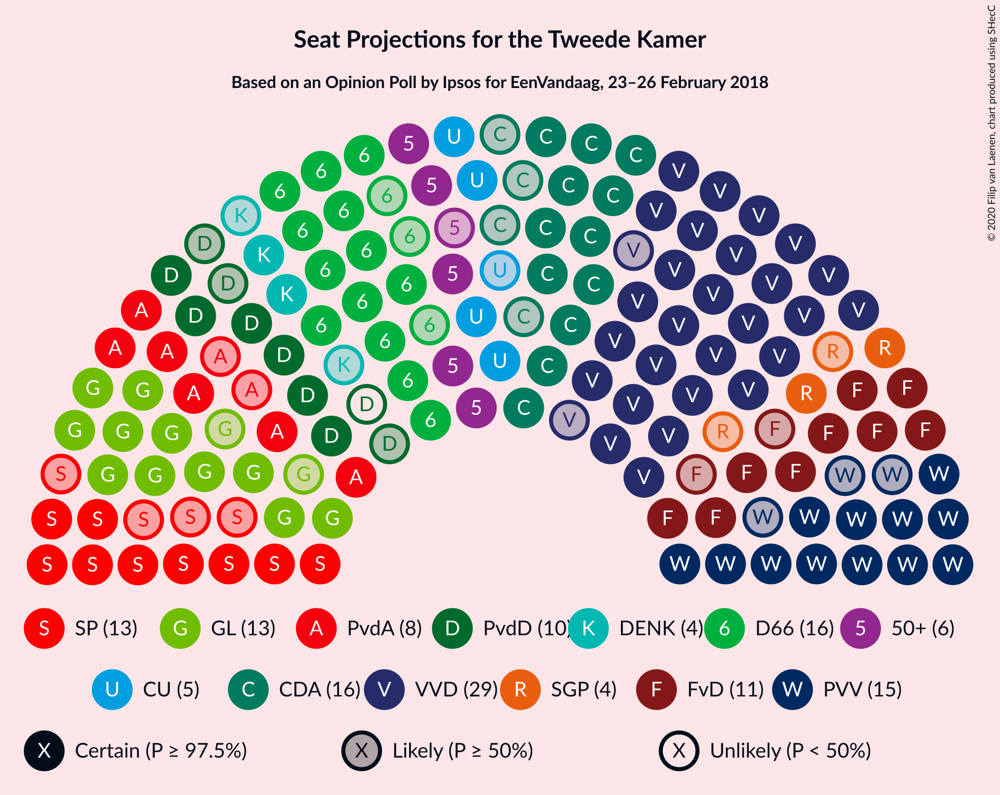
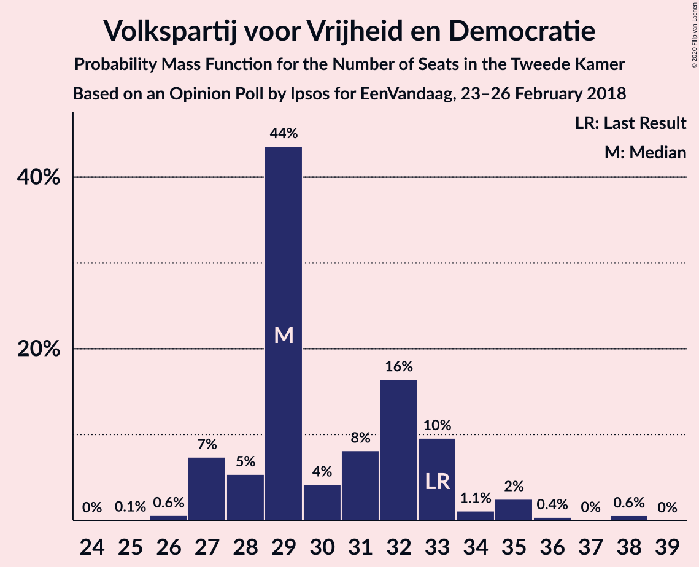
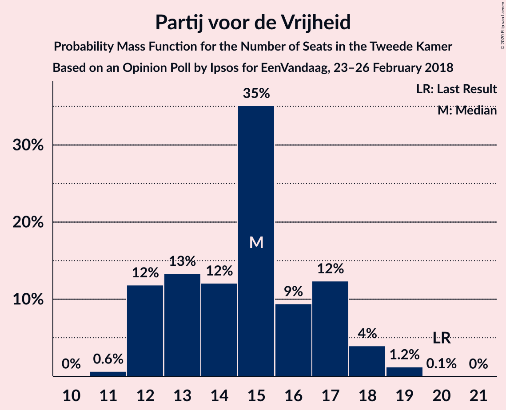
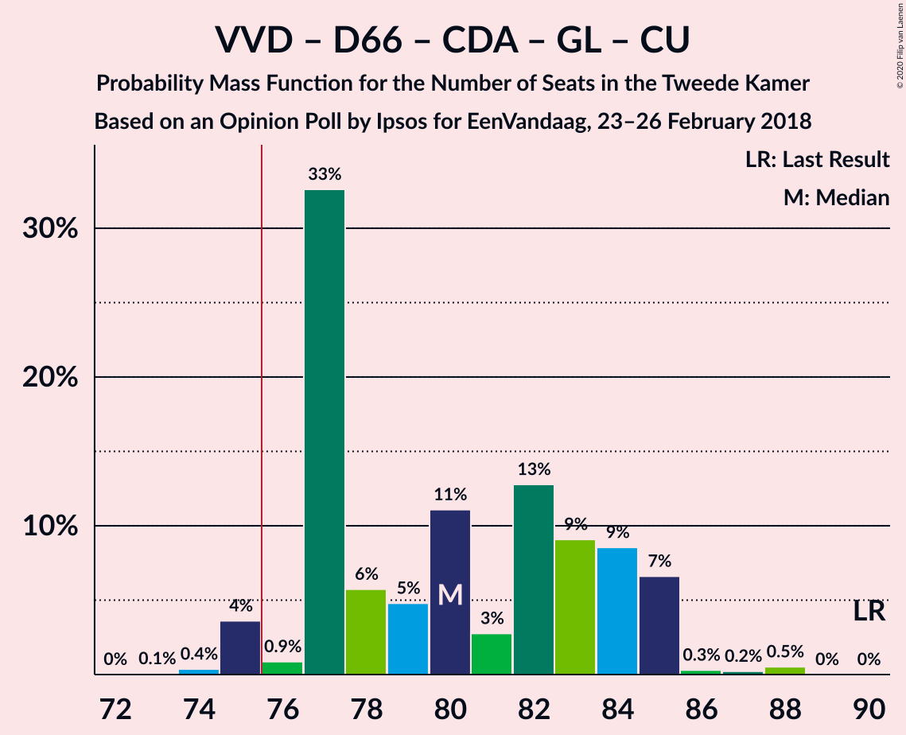
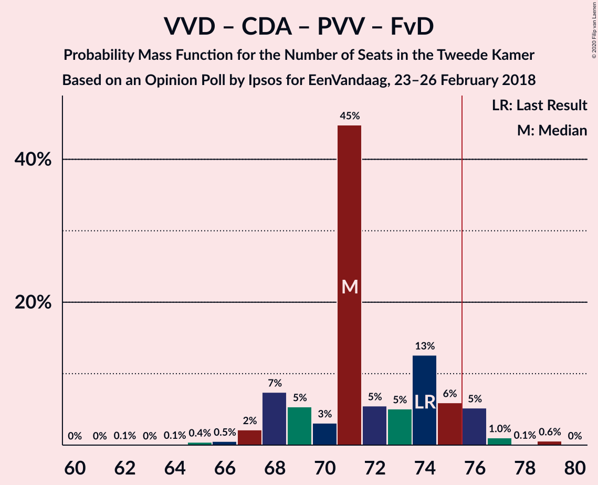
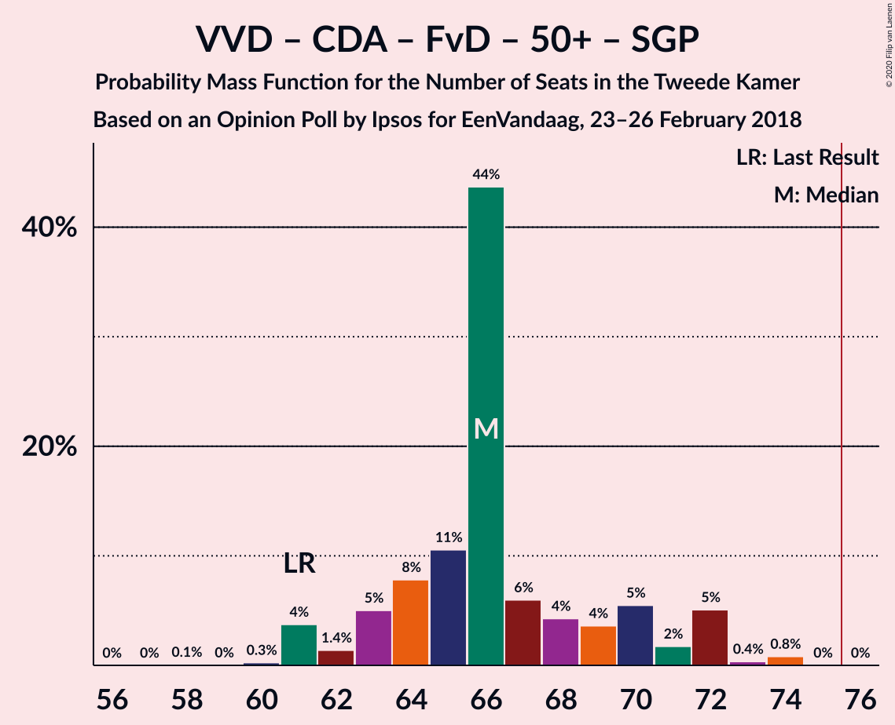
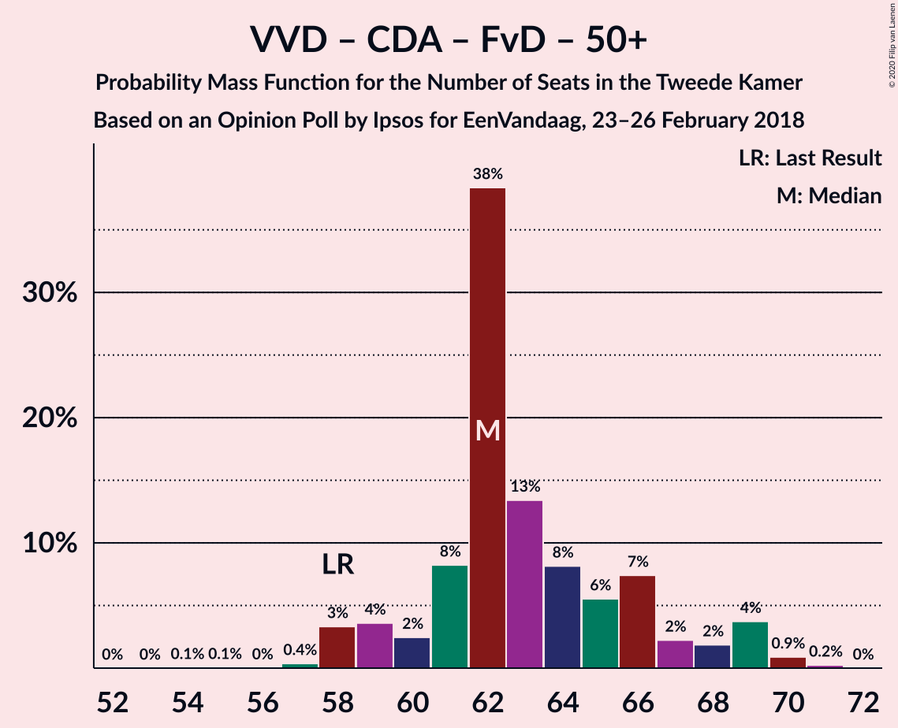
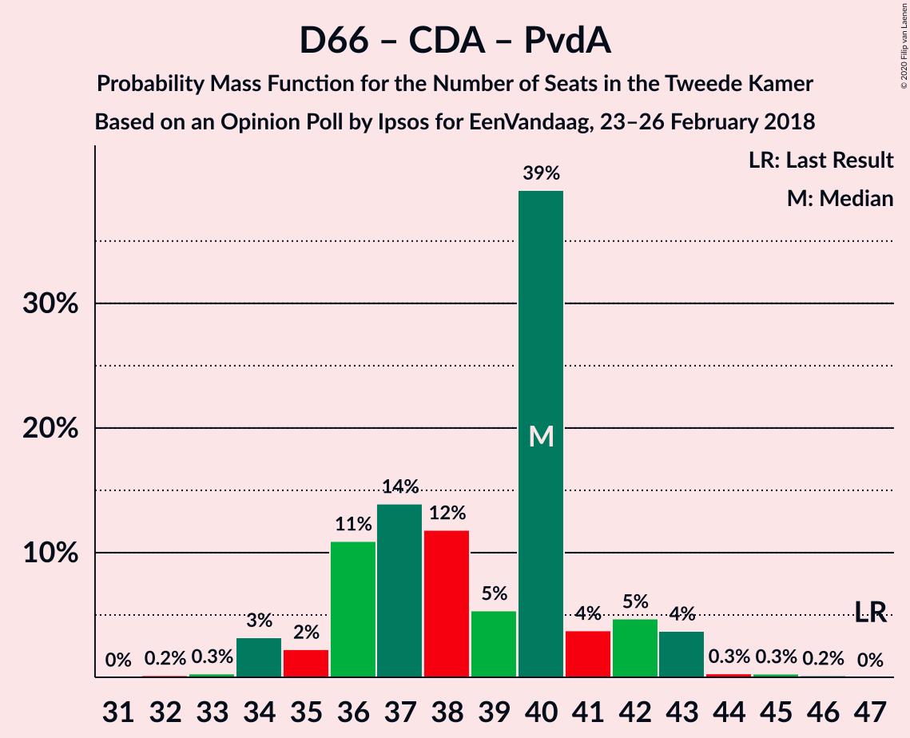

# Opinion Poll by Ipsos for EenVandaag, 23–26 February 2018

<a href="#voting-intentions">Voting Intentions</a> | <a href="#seats">Seats</a> | <a href="#coalitions">Coalitions</a> | <a href="#technical-information">Technical Information</a>

## Voting Intentions

### Confidence Intervals

| Party | Last Result | Poll Result | 80% Confidence Interval | 90% Confidence Interval | 95% Confidence Interval | 99% Confidence Interval |
|:-----:|:-----------:|:-----------:|:-----------------------:|:-----------------------:|:-----------------------:|:-----------------------:|
| Volkspartij voor Vrijheid en Democratie | 21.3% | 19.9% | 18.4–21.6% |17.9–22.0% |17.5–22.5% |16.8–23.3% |
| Democraten 66 | 12.2% | 10.4% | 9.3–11.8% |9.0–12.1% |8.7–12.5% |8.2–13.1% |
| Christen-Democratisch Appèl | 12.4% | 10.1% | 9.0–11.4% |8.7–11.8% |8.4–12.1% |7.9–12.8% |
| Partij voor de Vrijheid | 13.1% | 9.7% | 8.6–11.0% |8.3–11.4% |8.1–11.7% |7.6–12.4% |
| GroenLinks | 9.1% | 9.3% | 8.2–10.5% |7.9–10.9% |7.6–11.2% |7.1–11.8% |
| Socialistische Partij | 9.1% | 8.3% | 7.3–9.5% |7.0–9.8% |6.8–10.1% |6.3–10.7% |
| Forum voor Democratie | 1.8% | 7.7% | 6.7–8.9% |6.4–9.2% |6.2–9.5% |5.8–10.1% |
| Partij voor de Dieren | 3.2% | 5.2% | 4.4–6.2% |4.1–6.4% |4.0–6.7% |3.6–7.2% |
| Partij van de Arbeid | 5.7% | 5.1% | 4.3–6.1% |4.1–6.3% |3.9–6.6% |3.5–7.1% |
| 50Plus | 3.1% | 4.0% | 3.3–4.9% |3.1–5.2% |3.0–5.4% |2.7–5.9% |
| ChristenUnie | 3.4% | 3.6% | 3.0–4.5% |2.8–4.7% |2.6–4.9% |2.3–5.4% |
| DENK | 2.1% | 3.1% | 2.5–3.9% |2.3–4.2% |2.2–4.4% |2.0–4.8% |
| Staatkundig Gereformeerde Partij | 2.1% | 2.3% | 1.8–3.1% |1.7–3.3% |1.6–3.5% |1.4–3.8% |

*Note:* The poll result column reflects the actual value used in the calculations. Published results may vary slightly, and in addition be rounded to fewer digits.

## Seats

### Confidence Intervals

| Party | Last Result | Median | 80% Confidence Interval | 90% Confidence Interval | 95% Confidence Interval | 99% Confidence Interval |
|:-----:|:-----------:|:------:|:-----------------------:|:-----------------------:|:-----------------------:|:-----------------------:|
| <a href="#volkspartij-voor-vrijheid-en-democratie">Volkspartij voor Vrijheid en Democratie</a> | 33 | 29 | 28–33 |27–33 |27–35 |26–38 |
| <a href="#democraten-66">Democraten 66</a> | 19 | 16 | 14–17 |13–18 |13–19 |12–20 |
| <a href="#christen-democratisch-appèl">Christen-Democratisch Appèl</a> | 19 | 16 | 13–17 |12–18 |12–19 |11–19 |
| <a href="#partij-voor-de-vrijheid">Partij voor de Vrijheid</a> | 20 | 15 | 12–17 |12–18 |12–18 |11–19 |
| <a href="#groenlinks">GroenLinks</a> | 14 | 13 | 12–15 |12–17 |11–17 |11–18 |
| <a href="#socialistische-partij">Socialistische Partij</a> | 14 | 13 | 11–15 |11–15 |9–15 |9–17 |
| <a href="#forum-voor-democratie">Forum voor Democratie</a> | 2 | 11 | 10–12 |9–14 |9–14 |9–15 |
| <a href="#partij-voor-de-dieren">Partij voor de Dieren</a> | 5 | 9 | 6–10 |6–10 |6–10 |5–10 |
| <a href="#partij-van-de-arbeid">Partij van de Arbeid</a> | 9 | 8 | 6–8 |6–9 |6–10 |5–10 |
| <a href="#50plus">50Plus</a> | 4 | 6 | 5–7 |5–8 |5–8 |4–8 |
| <a href="#christenunie">ChristenUnie</a> | 5 | 5 | 4–6 |4–7 |4–7 |3–8 |
| <a href="#denk">DENK</a> | 3 | 4 | 3–6 |3–6 |2–6 |2–7 |
| <a href="#staatkundig-gereformeerde-partij">Staatkundig Gereformeerde Partij</a> | 3 | 4 | 2–4 |2–4 |2–5 |2–6 |

### Volkspartij voor Vrijheid en Democratie

*For a full overview of the results for this party, see the [Volkspartij voor Vrijheid en Democratie](party-volkspartijvoorvrijheidendemocratie.html) page.*

| Number of Seats | Probability | Accumulated | Special Marks |
|:---------------:|:-----------:|:-----------:|:-------------:|
| 25 | 0.1% | 100% |  |
| 26 | 0.6% | 99.9% |  |
| 27 | 7% | 99.3% |  |
| 28 | 5% | 92% |  |
| 29 | 44% | 87% | Median |
| 30 | 4% | 43% |  |
| 31 | 8% | 39% |  |
| 32 | 16% | 31% |  |
| 33 | 10% | 14% | Last Result |
| 34 | 1.1% | 5% |  |
| 35 | 2% | 3% |  |
| 36 | 0.4% | 1.0% |  |
| 37 | 0% | 0.6% |  |
| 38 | 0.6% | 0.6% |  |
| 39 | 0% | 0% |  |

### Democraten 66

*For a full overview of the results for this party, see the [Democraten 66](party-democraten66.html) page.*

| Number of Seats | Probability | Accumulated | Special Marks |
|:---------------:|:-----------:|:-----------:|:-------------:|
| 12 | 1.4% | 100% |  |
| 13 | 4% | 98.5% |  |
| 14 | 12% | 94% |  |
| 15 | 19% | 82% |  |
| 16 | 45% | 63% | Median |
| 17 | 10% | 18% |  |
| 18 | 4% | 8% |  |
| 19 | 3% | 4% | Last Result |
| 20 | 0.6% | 1.1% |  |
| 21 | 0.4% | 0.5% |  |
| 22 | 0% | 0% |  |

### Christen-Democratisch Appèl

*For a full overview of the results for this party, see the [Christen-Democratisch Appèl](party-christen-democratischappèl.html) page.*

| Number of Seats | Probability | Accumulated | Special Marks |
|:---------------:|:-----------:|:-----------:|:-------------:|
| 11 | 1.0% | 100% |  |
| 12 | 4% | 99.0% |  |
| 13 | 6% | 95% |  |
| 14 | 10% | 89% |  |
| 15 | 14% | 78% |  |
| 16 | 42% | 64% | Median |
| 17 | 14% | 22% |  |
| 18 | 4% | 8% |  |
| 19 | 4% | 4% | Last Result |
| 20 | 0.5% | 0.5% |  |
| 21 | 0% | 0% |  |

### Partij voor de Vrijheid

*For a full overview of the results for this party, see the [Partij voor de Vrijheid](party-partijvoordevrijheid.html) page.*

| Number of Seats | Probability | Accumulated | Special Marks |
|:---------------:|:-----------:|:-----------:|:-------------:|
| 11 | 0.6% | 100% |  |
| 12 | 12% | 99.3% |  |
| 13 | 13% | 88% |  |
| 14 | 12% | 74% |  |
| 15 | 35% | 62% | Median |
| 16 | 9% | 27% |  |
| 17 | 12% | 18% |  |
| 18 | 4% | 5% |  |
| 19 | 1.2% | 1.3% |  |
| 20 | 0.1% | 0.1% | Last Result |
| 21 | 0% | 0% |  |

### GroenLinks

*For a full overview of the results for this party, see the [GroenLinks](party-groenlinks.html) page.*

| Number of Seats | Probability | Accumulated | Special Marks |
|:---------------:|:-----------:|:-----------:|:-------------:|
| 10 | 0.2% | 100% |  |
| 11 | 2% | 99.8% |  |
| 12 | 35% | 97% |  |
| 13 | 13% | 63% | Median |
| 14 | 22% | 49% | Last Result |
| 15 | 18% | 28% |  |
| 16 | 5% | 10% |  |
| 17 | 4% | 5% |  |
| 18 | 1.2% | 2% |  |
| 19 | 0.3% | 0.3% |  |
| 20 | 0% | 0% |  |

### Socialistische Partij

*For a full overview of the results for this party, see the [Socialistische Partij](party-socialistischepartij.html) page.*

| Number of Seats | Probability | Accumulated | Special Marks |
|:---------------:|:-----------:|:-----------:|:-------------:|
| 8 | 0.2% | 100% |  |
| 9 | 3% | 99.8% |  |
| 10 | 1.3% | 97% |  |
| 11 | 14% | 95% |  |
| 12 | 26% | 82% |  |
| 13 | 11% | 55% | Median |
| 14 | 11% | 44% | Last Result |
| 15 | 32% | 34% |  |
| 16 | 0.3% | 1.3% |  |
| 17 | 0.6% | 0.9% |  |
| 18 | 0.4% | 0.4% |  |
| 19 | 0% | 0% |  |

### Forum voor Democratie

*For a full overview of the results for this party, see the [Forum voor Democratie](party-forumvoordemocratie.html) page.*

| Number of Seats | Probability | Accumulated | Special Marks |
|:---------------:|:-----------:|:-----------:|:-------------:|
| 2 | 0% | 100% | Last Result |
| 3 | 0% | 100% |  |
| 4 | 0% | 100% |  |
| 5 | 0% | 100% |  |
| 6 | 0% | 100% |  |
| 7 | 0% | 100% |  |
| 8 | 0.4% | 100% |  |
| 9 | 7% | 99.6% |  |
| 10 | 11% | 93% |  |
| 11 | 57% | 82% | Median |
| 12 | 16% | 25% |  |
| 13 | 4% | 9% |  |
| 14 | 5% | 6% |  |
| 15 | 0.4% | 0.9% |  |
| 16 | 0.4% | 0.4% |  |
| 17 | 0% | 0% |  |

### Partij voor de Dieren

*For a full overview of the results for this party, see the [Partij voor de Dieren](party-partijvoordedieren.html) page.*

| Number of Seats | Probability | Accumulated | Special Marks |
|:---------------:|:-----------:|:-----------:|:-------------:|
| 5 | 1.2% | 100% | Last Result |
| 6 | 9% | 98.8% |  |
| 7 | 18% | 90% |  |
| 8 | 10% | 72% |  |
| 9 | 19% | 62% | Median |
| 10 | 42% | 43% |  |
| 11 | 0.4% | 0.5% |  |
| 12 | 0.1% | 0.1% |  |
| 13 | 0% | 0% |  |

### Partij van de Arbeid

*For a full overview of the results for this party, see the [Partij van de Arbeid](party-partijvandearbeid.html) page.*

| Number of Seats | Probability | Accumulated | Special Marks |
|:---------------:|:-----------:|:-----------:|:-------------:|
| 4 | 0.2% | 100% |  |
| 5 | 0.7% | 99.8% |  |
| 6 | 21% | 99.1% |  |
| 7 | 18% | 79% |  |
| 8 | 52% | 61% | Median |
| 9 | 5% | 8% | Last Result |
| 10 | 3% | 3% |  |
| 11 | 0.2% | 0.2% |  |
| 12 | 0% | 0% |  |

### 50Plus

*For a full overview of the results for this party, see the [50Plus](party-50plus.html) page.*

| Number of Seats | Probability | Accumulated | Special Marks |
|:---------------:|:-----------:|:-----------:|:-------------:|
| 3 | 0.1% | 100% |  |
| 4 | 2% | 99.9% | Last Result |
| 5 | 18% | 98% |  |
| 6 | 63% | 80% | Median |
| 7 | 9% | 17% |  |
| 8 | 8% | 8% |  |
| 9 | 0.4% | 0.4% |  |
| 10 | 0% | 0% |  |

### ChristenUnie

*For a full overview of the results for this party, see the [ChristenUnie](party-christenunie.html) page.*

| Number of Seats | Probability | Accumulated | Special Marks |
|:---------------:|:-----------:|:-----------:|:-------------:|
| 3 | 2% | 100% |  |
| 4 | 43% | 98% |  |
| 5 | 22% | 55% | Last Result, Median |
| 6 | 24% | 32% |  |
| 7 | 7% | 8% |  |
| 8 | 1.4% | 1.4% |  |
| 9 | 0% | 0% |  |

### DENK

*For a full overview of the results for this party, see the [DENK](party-denk.html) page.*

| Number of Seats | Probability | Accumulated | Special Marks |
|:---------------:|:-----------:|:-----------:|:-------------:|
| 2 | 4% | 100% |  |
| 3 | 44% | 96% | Last Result |
| 4 | 18% | 52% | Median |
| 5 | 22% | 35% |  |
| 6 | 12% | 13% |  |
| 7 | 0.8% | 0.8% |  |
| 8 | 0% | 0% |  |

### Staatkundig Gereformeerde Partij

*For a full overview of the results for this party, see the [Staatkundig Gereformeerde Partij](party-staatkundiggereformeerdepartij.html) page.*

| Number of Seats | Probability | Accumulated | Special Marks |
|:---------------:|:-----------:|:-----------:|:-------------:|
| 1 | 0.3% | 100% |  |
| 2 | 20% | 99.7% |  |
| 3 | 28% | 79% | Last Result |
| 4 | 49% | 51% | Median |
| 5 | 2% | 3% |  |
| 6 | 1.0% | 1.1% |  |
| 7 | 0% | 0% |  |

## Coalitions

### Confidence Intervals

| Coalition | Last Result | Median | Majority? | 80% Confidence Interval | 90% Confidence Interval | 95% Confidence Interval | 99% Confidence Interval |
|:---------:|:-----------:|:------:|:---------:|:-----------------------:|:-----------------------:|:-----------------------:|:-----------------------:|
| Volkspartij voor Vrijheid en Democratie – Democraten 66 – Christen-Democratisch Appèl – GroenLinks – ChristenUnie | 90 | 80 | 96% | 77–84 | 77–85 | 75–85 | 75–88 |
| Volkspartij voor Vrijheid en Democratie – Christen-Democratisch Appèl – Partij voor de Vrijheid – Forum voor Democratie – Staatkundig Gereformeerde Partij | 77 | 75 | 30% | 72–78 | 71–80 | 70–80 | 69–82 |
| Volkspartij voor Vrijheid en Democratie – Democraten 66 – Christen-Democratisch Appèl – Partij van de Arbeid – ChristenUnie | 85 | 73 | 25% | 71–78 | 71–78 | 70–79 | 68–80 |
| Volkspartij voor Vrijheid en Democratie – Christen-Democratisch Appèl – Partij voor de Vrijheid – Forum voor Democratie | 74 | 71 | 7% | 68–75 | 68–76 | 67–76 | 65–79 |
| Democraten 66 – Christen-Democratisch Appèl – GroenLinks – Socialistische Partij – Partij van de Arbeid – ChristenUnie | 80 | 71 | 2% | 67–74 | 66–75 | 66–75 | 63–77 |
| Volkspartij voor Vrijheid en Democratie – Democraten 66 – Christen-Democratisch Appèl – ChristenUnie | 76 | 65 | 0% | 63–71 | 63–72 | 62–72 | 61–73 |
| Volkspartij voor Vrijheid en Democratie – Christen-Democratisch Appèl – Forum voor Democratie – 50Plus – Staatkundig Gereformeerde Partij | 61 | 66 | 0% | 63–70 | 62–72 | 61–72 | 61–74 |
| Volkspartij voor Vrijheid en Democratie – Christen-Democratisch Appèl – Forum voor Democratie – 50Plus | 58 | 62 | 0% | 61–66 | 59–68 | 58–69 | 57–70 |
| Volkspartij voor Vrijheid en Democratie – Democraten 66 – Christen-Democratisch Appèl | 71 | 61 | 0% | 58–65 | 57–67 | 57–67 | 56–67 |
| Volkspartij voor Vrijheid en Democratie – Christen-Democratisch Appèl – Forum voor Democratie – Staatkundig Gereformeerde Partij | 57 | 60 | 0% | 57–64 | 56–66 | 55–66 | 55–68 |
| Volkspartij voor Vrijheid en Democratie – Christen-Democratisch Appèl – Partij voor de Vrijheid | 72 | 60 | 0% | 57–64 | 57–65 | 55–65 | 55–66 |
| Democraten 66 – Christen-Democratisch Appèl – GroenLinks – Partij van de Arbeid – ChristenUnie | 66 | 57 | 0% | 55–61 | 54–62 | 53–63 | 50–64 |
| Volkspartij voor Vrijheid en Democratie – Christen-Democratisch Appèl – Forum voor Democratie | 54 | 56 | 0% | 54–60 | 53–62 | 52–63 | 51–64 |
| Volkspartij voor Vrijheid en Democratie – Democraten 66 – Partij van de Arbeid | 61 | 53 | 0% | 49–56 | 49–58 | 49–59 | 48–60 |
| Volkspartij voor Vrijheid en Democratie – Christen-Democratisch Appèl – Partij van de Arbeid | 61 | 53 | 0% | 51–57 | 49–58 | 49–58 | 47–59 |
| Volkspartij voor Vrijheid en Democratie – Christen-Democratisch Appèl | 52 | 45 | 0% | 43–49 | 42–52 | 41–52 | 41–52 |
| Democraten 66 – Christen-Democratisch Appèl – Partij van de Arbeid | 47 | 40 | 0% | 36–41 | 35–42 | 34–43 | 34–44 |
| Volkspartij voor Vrijheid en Democratie – Partij van de Arbeid | 42 | 37 | 0% | 35–41 | 35–41 | 34–42 | 33–44 |
| Democraten 66 – Christen-Democratisch Appèl | 38 | 32 | 0% | 29–34 | 28–34 | 27–35 | 27–37 |
| Christen-Democratisch Appèl – Partij van de Arbeid – ChristenUnie | 33 | 28 | 0% | 26–30 | 25–32 | 24–33 | 22–33 |
| Christen-Democratisch Appèl – Partij van de Arbeid | 28 | 24 | 0% | 20–25 | 20–26 | 19–26 | 18–27 |

### Volkspartij voor Vrijheid en Democratie – Democraten 66 – Christen-Democratisch Appèl – GroenLinks – ChristenUnie

| Number of Seats | Probability | Accumulated | Special Marks |
|:---------------:|:-----------:|:-----------:|:-------------:|
| 73 | 0.1% | 100% |  |
| 74 | 0.4% | 99.9% |  |
| 75 | 4% | 99.6% |  |
| 76 | 0.9% | 96% | Majority |
| 77 | 33% | 95% |  |
| 78 | 6% | 62% |  |
| 79 | 5% | 57% | Median |
| 80 | 11% | 52% |  |
| 81 | 3% | 41% |  |
| 82 | 13% | 38% |  |
| 83 | 9% | 25% |  |
| 84 | 9% | 16% |  |
| 85 | 7% | 8% |  |
| 86 | 0.3% | 1.1% |  |
| 87 | 0.2% | 0.8% |  |
| 88 | 0.5% | 0.5% |  |
| 89 | 0% | 0% |  |
| 90 | 0% | 0% | Last Result |

### Volkspartij voor Vrijheid en Democratie – Christen-Democratisch Appèl – Partij voor de Vrijheid – Forum voor Democratie – Staatkundig Gereformeerde Partij

| Number of Seats | Probability | Accumulated | Special Marks |
|:---------------:|:-----------:|:-----------:|:-------------:|
| 66 | 0.1% | 100% |  |
| 67 | 0% | 99.9% |  |
| 68 | 0.3% | 99.9% |  |
| 69 | 1.4% | 99.6% |  |
| 70 | 0.7% | 98% |  |
| 71 | 3% | 97% |  |
| 72 | 10% | 95% |  |
| 73 | 13% | 85% |  |
| 74 | 5% | 71% |  |
| 75 | 37% | 67% | Median |
| 76 | 4% | 30% | Majority |
| 77 | 10% | 26% | Last Result |
| 78 | 9% | 16% |  |
| 79 | 0.7% | 7% |  |
| 80 | 5% | 6% |  |
| 81 | 0.8% | 1.4% |  |
| 82 | 0.5% | 0.6% |  |
| 83 | 0% | 0.1% |  |
| 84 | 0% | 0% |  |

### Volkspartij voor Vrijheid en Democratie – Democraten 66 – Christen-Democratisch Appèl – Partij van de Arbeid – ChristenUnie

| Number of Seats | Probability | Accumulated | Special Marks |
|:---------------:|:-----------:|:-----------:|:-------------:|
| 67 | 0.4% | 100% |  |
| 68 | 1.2% | 99.5% |  |
| 69 | 0.6% | 98% |  |
| 70 | 1.0% | 98% |  |
| 71 | 16% | 97% |  |
| 72 | 2% | 81% |  |
| 73 | 37% | 78% |  |
| 74 | 10% | 41% | Median |
| 75 | 6% | 31% |  |
| 76 | 4% | 25% | Majority |
| 77 | 7% | 21% |  |
| 78 | 10% | 14% |  |
| 79 | 3% | 4% |  |
| 80 | 0.4% | 0.8% |  |
| 81 | 0.1% | 0.4% |  |
| 82 | 0.1% | 0.3% |  |
| 83 | 0.1% | 0.2% |  |
| 84 | 0.2% | 0.2% |  |
| 85 | 0% | 0% | Last Result |

### Volkspartij voor Vrijheid en Democratie – Christen-Democratisch Appèl – Partij voor de Vrijheid – Forum voor Democratie

| Number of Seats | Probability | Accumulated | Special Marks |
|:---------------:|:-----------:|:-----------:|:-------------:|
| 62 | 0.1% | 100% |  |
| 63 | 0% | 99.9% |  |
| 64 | 0.1% | 99.9% |  |
| 65 | 0.4% | 99.8% |  |
| 66 | 0.5% | 99.4% |  |
| 67 | 2% | 98.9% |  |
| 68 | 7% | 97% |  |
| 69 | 5% | 89% |  |
| 70 | 3% | 84% |  |
| 71 | 45% | 81% | Median |
| 72 | 5% | 36% |  |
| 73 | 5% | 31% |  |
| 74 | 13% | 26% | Last Result |
| 75 | 6% | 13% |  |
| 76 | 5% | 7% | Majority |
| 77 | 1.0% | 2% |  |
| 78 | 0.1% | 0.7% |  |
| 79 | 0.6% | 0.6% |  |
| 80 | 0% | 0% |  |

### Democraten 66 – Christen-Democratisch Appèl – GroenLinks – Socialistische Partij – Partij van de Arbeid – ChristenUnie

| Number of Seats | Probability | Accumulated | Special Marks |
|:---------------:|:-----------:|:-----------:|:-------------:|
| 62 | 0.1% | 100% |  |
| 63 | 1.1% | 99.9% |  |
| 64 | 0.4% | 98.8% |  |
| 65 | 0.2% | 98% |  |
| 66 | 6% | 98% |  |
| 67 | 3% | 92% |  |
| 68 | 5% | 89% |  |
| 69 | 20% | 84% |  |
| 70 | 7% | 64% |  |
| 71 | 39% | 57% | Median |
| 72 | 5% | 18% |  |
| 73 | 2% | 13% |  |
| 74 | 2% | 11% |  |
| 75 | 7% | 10% |  |
| 76 | 2% | 2% | Majority |
| 77 | 0.6% | 0.9% |  |
| 78 | 0.2% | 0.3% |  |
| 79 | 0% | 0.1% |  |
| 80 | 0% | 0.1% | Last Result |
| 81 | 0% | 0% |  |

### Volkspartij voor Vrijheid en Democratie – Democraten 66 – Christen-Democratisch Appèl – ChristenUnie

| Number of Seats | Probability | Accumulated | Special Marks |
|:---------------:|:-----------:|:-----------:|:-------------:|
| 59 | 0.1% | 100% |  |
| 60 | 0.3% | 99.9% |  |
| 61 | 0.4% | 99.6% |  |
| 62 | 2% | 99.2% |  |
| 63 | 8% | 97% |  |
| 64 | 4% | 89% |  |
| 65 | 42% | 84% |  |
| 66 | 3% | 42% | Median |
| 67 | 5% | 39% |  |
| 68 | 14% | 34% |  |
| 69 | 3% | 20% |  |
| 70 | 6% | 17% |  |
| 71 | 5% | 10% |  |
| 72 | 5% | 5% |  |
| 73 | 0.3% | 0.6% |  |
| 74 | 0% | 0.2% |  |
| 75 | 0.2% | 0.2% |  |
| 76 | 0% | 0% | Last Result, Majority |

### Volkspartij voor Vrijheid en Democratie – Christen-Democratisch Appèl – Forum voor Democratie – 50Plus – Staatkundig Gereformeerde Partij

| Number of Seats | Probability | Accumulated | Special Marks |
|:---------------:|:-----------:|:-----------:|:-------------:|
| 58 | 0.1% | 100% |  |
| 59 | 0% | 99.9% |  |
| 60 | 0.3% | 99.9% |  |
| 61 | 4% | 99.6% | Last Result |
| 62 | 1.4% | 96% |  |
| 63 | 5% | 94% |  |
| 64 | 8% | 89% |  |
| 65 | 11% | 82% |  |
| 66 | 44% | 71% | Median |
| 67 | 6% | 27% |  |
| 68 | 4% | 21% |  |
| 69 | 4% | 17% |  |
| 70 | 5% | 14% |  |
| 71 | 2% | 8% |  |
| 72 | 5% | 6% |  |
| 73 | 0.4% | 1.2% |  |
| 74 | 0.8% | 0.8% |  |
| 75 | 0% | 0% |  |

### Volkspartij voor Vrijheid en Democratie – Christen-Democratisch Appèl – Forum voor Democratie – 50Plus

| Number of Seats | Probability | Accumulated | Special Marks |
|:---------------:|:-----------:|:-----------:|:-------------:|
| 54 | 0.1% | 100% |  |
| 55 | 0.1% | 99.9% |  |
| 56 | 0% | 99.9% |  |
| 57 | 0.4% | 99.9% |  |
| 58 | 3% | 99.5% | Last Result |
| 59 | 4% | 96% |  |
| 60 | 2% | 93% |  |
| 61 | 8% | 90% |  |
| 62 | 38% | 82% | Median |
| 63 | 13% | 44% |  |
| 64 | 8% | 30% |  |
| 65 | 6% | 22% |  |
| 66 | 7% | 16% |  |
| 67 | 2% | 9% |  |
| 68 | 2% | 7% |  |
| 69 | 4% | 5% |  |
| 70 | 0.9% | 1.1% |  |
| 71 | 0.2% | 0.3% |  |
| 72 | 0% | 0% |  |

### Volkspartij voor Vrijheid en Democratie – Democraten 66 – Christen-Democratisch Appèl

| Number of Seats | Probability | Accumulated | Special Marks |
|:---------------:|:-----------:|:-----------:|:-------------:|
| 54 | 0.1% | 100% |  |
| 55 | 0.4% | 99.9% |  |
| 56 | 1.3% | 99.5% |  |
| 57 | 5% | 98% |  |
| 58 | 5% | 93% |  |
| 59 | 2% | 88% |  |
| 60 | 11% | 85% |  |
| 61 | 38% | 74% | Median |
| 62 | 16% | 36% |  |
| 63 | 4% | 20% |  |
| 64 | 1.1% | 16% |  |
| 65 | 6% | 15% |  |
| 66 | 0.8% | 10% |  |
| 67 | 8% | 9% |  |
| 68 | 0.1% | 0.4% |  |
| 69 | 0.3% | 0.3% |  |
| 70 | 0% | 0% |  |
| 71 | 0% | 0% | Last Result |

### Volkspartij voor Vrijheid en Democratie – Christen-Democratisch Appèl – Forum voor Democratie – Staatkundig Gereformeerde Partij

| Number of Seats | Probability | Accumulated | Special Marks |
|:---------------:|:-----------:|:-----------:|:-------------:|
| 52 | 0.1% | 100% |  |
| 53 | 0% | 99.9% |  |
| 54 | 0.2% | 99.9% |  |
| 55 | 2% | 99.7% |  |
| 56 | 5% | 97% |  |
| 57 | 3% | 92% | Last Result |
| 58 | 8% | 89% |  |
| 59 | 9% | 81% |  |
| 60 | 45% | 72% | Median |
| 61 | 7% | 27% |  |
| 62 | 1.2% | 20% |  |
| 63 | 5% | 18% |  |
| 64 | 6% | 13% |  |
| 65 | 1.0% | 7% |  |
| 66 | 5% | 6% |  |
| 67 | 0.5% | 1.2% |  |
| 68 | 0.7% | 0.7% |  |
| 69 | 0% | 0% |  |

### Volkspartij voor Vrijheid en Democratie – Christen-Democratisch Appèl – Partij voor de Vrijheid

| Number of Seats | Probability | Accumulated | Special Marks |
|:---------------:|:-----------:|:-----------:|:-------------:|
| 52 | 0.1% | 100% |  |
| 53 | 0.1% | 99.9% |  |
| 54 | 0.3% | 99.8% |  |
| 55 | 2% | 99.6% |  |
| 56 | 2% | 97% |  |
| 57 | 7% | 95% |  |
| 58 | 8% | 89% |  |
| 59 | 10% | 81% |  |
| 60 | 34% | 70% | Median |
| 61 | 3% | 36% |  |
| 62 | 8% | 34% |  |
| 63 | 13% | 26% |  |
| 64 | 7% | 13% |  |
| 65 | 5% | 6% |  |
| 66 | 0.8% | 1.0% |  |
| 67 | 0.1% | 0.2% |  |
| 68 | 0.1% | 0.1% |  |
| 69 | 0% | 0% |  |
| 70 | 0% | 0% |  |
| 71 | 0% | 0% |  |
| 72 | 0% | 0% | Last Result |

### Democraten 66 – Christen-Democratisch Appèl – GroenLinks – Partij van de Arbeid – ChristenUnie

| Number of Seats | Probability | Accumulated | Special Marks |
|:---------------:|:-----------:|:-----------:|:-------------:|
| 50 | 0.5% | 100% |  |
| 51 | 0% | 99.5% |  |
| 52 | 0.8% | 99.4% |  |
| 53 | 3% | 98.6% |  |
| 54 | 4% | 95% |  |
| 55 | 3% | 91% |  |
| 56 | 33% | 88% |  |
| 57 | 21% | 55% |  |
| 58 | 9% | 34% | Median |
| 59 | 12% | 26% |  |
| 60 | 2% | 14% |  |
| 61 | 4% | 12% |  |
| 62 | 3% | 8% |  |
| 63 | 3% | 5% |  |
| 64 | 2% | 2% |  |
| 65 | 0.1% | 0.2% |  |
| 66 | 0.1% | 0.2% | Last Result |
| 67 | 0% | 0% |  |

### Volkspartij voor Vrijheid en Democratie – Christen-Democratisch Appèl – Forum voor Democratie

| Number of Seats | Probability | Accumulated | Special Marks |
|:---------------:|:-----------:|:-----------:|:-------------:|
| 48 | 0.1% | 100% |  |
| 49 | 0% | 99.9% |  |
| 50 | 0% | 99.9% |  |
| 51 | 0.4% | 99.9% |  |
| 52 | 3% | 99.5% |  |
| 53 | 3% | 97% |  |
| 54 | 10% | 94% | Last Result |
| 55 | 4% | 84% |  |
| 56 | 36% | 80% | Median |
| 57 | 12% | 44% |  |
| 58 | 10% | 32% |  |
| 59 | 5% | 22% |  |
| 60 | 10% | 18% |  |
| 61 | 1.3% | 8% |  |
| 62 | 2% | 7% |  |
| 63 | 4% | 5% |  |
| 64 | 1.0% | 1.2% |  |
| 65 | 0% | 0.1% |  |
| 66 | 0.1% | 0.1% |  |
| 67 | 0% | 0% |  |

### Volkspartij voor Vrijheid en Democratie – Democraten 66 – Partij van de Arbeid

| Number of Seats | Probability | Accumulated | Special Marks |
|:---------------:|:-----------:|:-----------:|:-------------:|
| 46 | 0.1% | 100% |  |
| 47 | 0.3% | 99.9% |  |
| 48 | 0.5% | 99.6% |  |
| 49 | 10% | 99.1% |  |
| 50 | 2% | 89% |  |
| 51 | 5% | 87% |  |
| 52 | 7% | 82% |  |
| 53 | 32% | 75% | Median |
| 54 | 22% | 43% |  |
| 55 | 6% | 22% |  |
| 56 | 6% | 15% |  |
| 57 | 3% | 9% |  |
| 58 | 2% | 7% |  |
| 59 | 3% | 5% |  |
| 60 | 1.3% | 1.4% |  |
| 61 | 0% | 0.1% | Last Result |
| 62 | 0.1% | 0.1% |  |
| 63 | 0% | 0% |  |

### Volkspartij voor Vrijheid en Democratie – Christen-Democratisch Appèl – Partij van de Arbeid

| Number of Seats | Probability | Accumulated | Special Marks |
|:---------------:|:-----------:|:-----------:|:-------------:|
| 45 | 0.1% | 100% |  |
| 46 | 0.1% | 99.9% |  |
| 47 | 1.2% | 99.8% |  |
| 48 | 0.6% | 98.6% |  |
| 49 | 4% | 98% |  |
| 50 | 2% | 94% |  |
| 51 | 5% | 93% |  |
| 52 | 21% | 87% |  |
| 53 | 37% | 66% | Median |
| 54 | 9% | 30% |  |
| 55 | 4% | 21% |  |
| 56 | 6% | 17% |  |
| 57 | 4% | 10% |  |
| 58 | 4% | 6% |  |
| 59 | 2% | 2% |  |
| 60 | 0.1% | 0.4% |  |
| 61 | 0.2% | 0.3% | Last Result |
| 62 | 0.1% | 0.1% |  |
| 63 | 0% | 0% |  |

### Volkspartij voor Vrijheid en Democratie – Christen-Democratisch Appèl

| Number of Seats | Probability | Accumulated | Special Marks |
|:---------------:|:-----------:|:-----------:|:-------------:|
| 38 | 0.1% | 100% |  |
| 39 | 0.1% | 99.9% |  |
| 40 | 0.2% | 99.8% |  |
| 41 | 4% | 99.6% |  |
| 42 | 2% | 96% |  |
| 43 | 7% | 94% |  |
| 44 | 5% | 87% |  |
| 45 | 39% | 82% | Median |
| 46 | 23% | 43% |  |
| 47 | 3% | 20% |  |
| 48 | 1.4% | 17% |  |
| 49 | 9% | 16% |  |
| 50 | 0.4% | 7% |  |
| 51 | 0.6% | 6% |  |
| 52 | 6% | 6% | Last Result |
| 53 | 0.1% | 0.1% |  |
| 54 | 0% | 0% |  |

### Democraten 66 – Christen-Democratisch Appèl – Partij van de Arbeid

| Number of Seats | Probability | Accumulated | Special Marks |
|:---------------:|:-----------:|:-----------:|:-------------:|
| 32 | 0.2% | 100% |  |
| 33 | 0.3% | 99.8% |  |
| 34 | 3% | 99.5% |  |
| 35 | 2% | 96% |  |
| 36 | 11% | 94% |  |
| 37 | 14% | 83% |  |
| 38 | 12% | 69% |  |
| 39 | 5% | 57% |  |
| 40 | 39% | 52% | Median |
| 41 | 4% | 13% |  |
| 42 | 5% | 9% |  |
| 43 | 4% | 4% |  |
| 44 | 0.3% | 0.8% |  |
| 45 | 0.3% | 0.4% |  |
| 46 | 0.2% | 0.2% |  |
| 47 | 0% | 0% | Last Result |

### Volkspartij voor Vrijheid en Democratie – Partij van de Arbeid

| Number of Seats | Probability | Accumulated | Special Marks |
|:---------------:|:-----------:|:-----------:|:-------------:|
| 31 | 0.1% | 100% |  |
| 32 | 0.1% | 99.9% |  |
| 33 | 0.5% | 99.8% |  |
| 34 | 2% | 99.2% |  |
| 35 | 14% | 97% |  |
| 36 | 3% | 83% |  |
| 37 | 38% | 80% | Median |
| 38 | 8% | 42% |  |
| 39 | 20% | 33% |  |
| 40 | 2% | 13% |  |
| 41 | 7% | 11% |  |
| 42 | 3% | 4% | Last Result |
| 43 | 0.4% | 1.1% |  |
| 44 | 0.6% | 0.7% |  |
| 45 | 0% | 0.1% |  |
| 46 | 0.1% | 0.1% |  |
| 47 | 0% | 0% |  |

### Democraten 66 – Christen-Democratisch Appèl

| Number of Seats | Probability | Accumulated | Special Marks |
|:---------------:|:-----------:|:-----------:|:-------------:|
| 25 | 0.1% | 100% |  |
| 26 | 0.2% | 99.9% |  |
| 27 | 3% | 99.7% |  |
| 28 | 5% | 97% |  |
| 29 | 5% | 92% |  |
| 30 | 24% | 87% |  |
| 31 | 12% | 63% |  |
| 32 | 32% | 51% | Median |
| 33 | 6% | 19% |  |
| 34 | 8% | 13% |  |
| 35 | 3% | 5% |  |
| 36 | 0.9% | 2% |  |
| 37 | 0.7% | 0.8% |  |
| 38 | 0.1% | 0.1% | Last Result |
| 39 | 0% | 0% |  |

### Christen-Democratisch Appèl – Partij van de Arbeid – ChristenUnie

| Number of Seats | Probability | Accumulated | Special Marks |
|:---------------:|:-----------:|:-----------:|:-------------:|
| 22 | 0.6% | 100% |  |
| 23 | 0.3% | 99.4% |  |
| 24 | 2% | 99.2% |  |
| 25 | 5% | 97% |  |
| 26 | 12% | 92% |  |
| 27 | 11% | 80% |  |
| 28 | 40% | 69% |  |
| 29 | 10% | 29% | Median |
| 30 | 10% | 19% |  |
| 31 | 3% | 9% |  |
| 32 | 3% | 7% |  |
| 33 | 3% | 3% | Last Result |
| 34 | 0.2% | 0.3% |  |
| 35 | 0% | 0.1% |  |
| 36 | 0.1% | 0.1% |  |
| 37 | 0% | 0% |  |

### Christen-Democratisch Appèl – Partij van de Arbeid

| Number of Seats | Probability | Accumulated | Special Marks |
|:---------------:|:-----------:|:-----------:|:-------------:|
| 17 | 0.1% | 100% |  |
| 18 | 0.8% | 99.9% |  |
| 19 | 2% | 99.1% |  |
| 20 | 13% | 97% |  |
| 21 | 6% | 84% |  |
| 22 | 3% | 78% |  |
| 23 | 17% | 74% |  |
| 24 | 45% | 57% | Median |
| 25 | 5% | 12% |  |
| 26 | 6% | 7% |  |
| 27 | 0.6% | 1.0% |  |
| 28 | 0.3% | 0.4% | Last Result |
| 29 | 0% | 0.1% |  |
| 30 | 0% | 0% |  |

## Technical Information

### Opinion Poll

+ **Polling firm:** Ipsos
+ **Commissioner(s):** EenVandaag
+ **Fieldwork period:** 23–26 February 2018

### Calculations

+ **Sample size:** 1026
+ **Simulations done:** 1,048,576
+ **Error estimate:** 1.91%

