# Opinion Poll by Ipsos for EenVandaag, 23–26 February 2018

<a href="#voting-intentions">Voting Intentions</a> | <a href="#seats">Seats</a> | <a href="#coalitions">Coalitions</a> | <a href="#technical-information">Technical Information</a>

## Voting Intentions

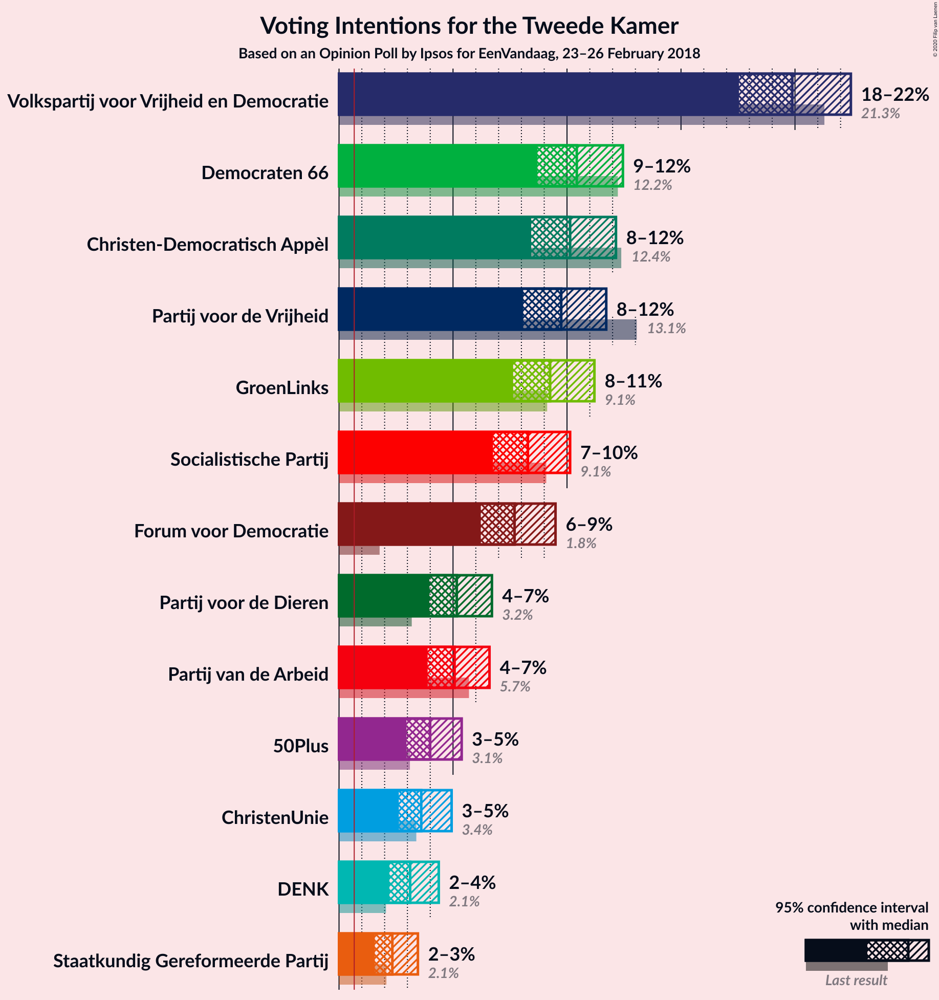

### Confidence Intervals

| Party | Last Result | Poll Result | 80% Confidence Interval | 90% Confidence Interval | 95% Confidence Interval | 99% Confidence Interval |
|:-----:|:-----------:|:-----------:|:-----------------------:|:-----------------------:|:-----------------------:|:-----------------------:|
| Volkspartij voor Vrijheid en Democratie | 21.3% | 19.9% | 18.4–21.6% |17.9–22.0% |17.5–22.5% |16.8–23.3% |
| Democraten 66 | 12.2% | 10.4% | 9.3–11.8% |9.0–12.1% |8.7–12.5% |8.2–13.1% |
| Christen-Democratisch Appèl | 12.4% | 10.1% | 9.0–11.4% |8.7–11.8% |8.4–12.1% |7.9–12.8% |
| Partij voor de Vrijheid | 13.1% | 9.7% | 8.6–11.0% |8.3–11.4% |8.1–11.7% |7.6–12.4% |
| GroenLinks | 9.1% | 9.3% | 8.2–10.5% |7.9–10.9% |7.6–11.2% |7.1–11.8% |
| Socialistische Partij | 9.1% | 8.3% | 7.3–9.5% |7.0–9.8% |6.8–10.1% |6.3–10.7% |
| Forum voor Democratie | 1.8% | 7.7% | 6.7–8.9% |6.4–9.2% |6.2–9.5% |5.8–10.1% |
| Partij voor de Dieren | 3.2% | 5.2% | 4.4–6.2% |4.1–6.4% |4.0–6.7% |3.6–7.2% |
| Partij van de Arbeid | 5.7% | 5.1% | 4.3–6.1% |4.1–6.3% |3.9–6.6% |3.5–7.1% |
| 50Plus | 3.1% | 4.0% | 3.3–4.9% |3.1–5.2% |3.0–5.4% |2.7–5.9% |
| ChristenUnie | 3.4% | 3.6% | 3.0–4.5% |2.8–4.7% |2.6–4.9% |2.3–5.4% |
| DENK | 2.1% | 3.1% | 2.5–3.9% |2.3–4.2% |2.2–4.4% |2.0–4.8% |
| Staatkundig Gereformeerde Partij | 2.1% | 2.3% | 1.8–3.1% |1.7–3.3% |1.6–3.5% |1.4–3.8% |

*Note:* The poll result column reflects the actual value used in the calculations. Published results may vary slightly, and in addition be rounded to fewer digits.

## Seats

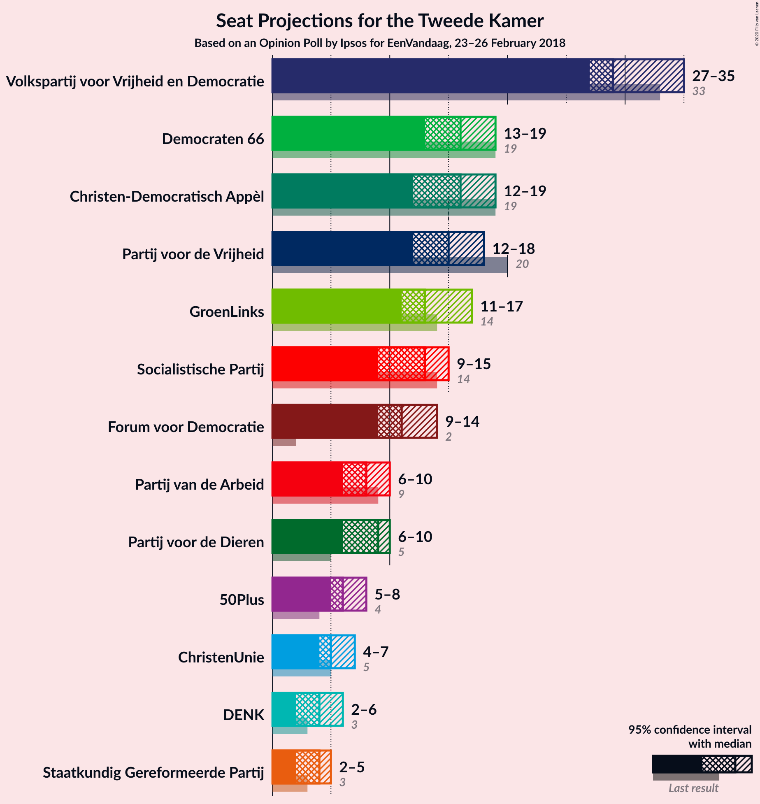

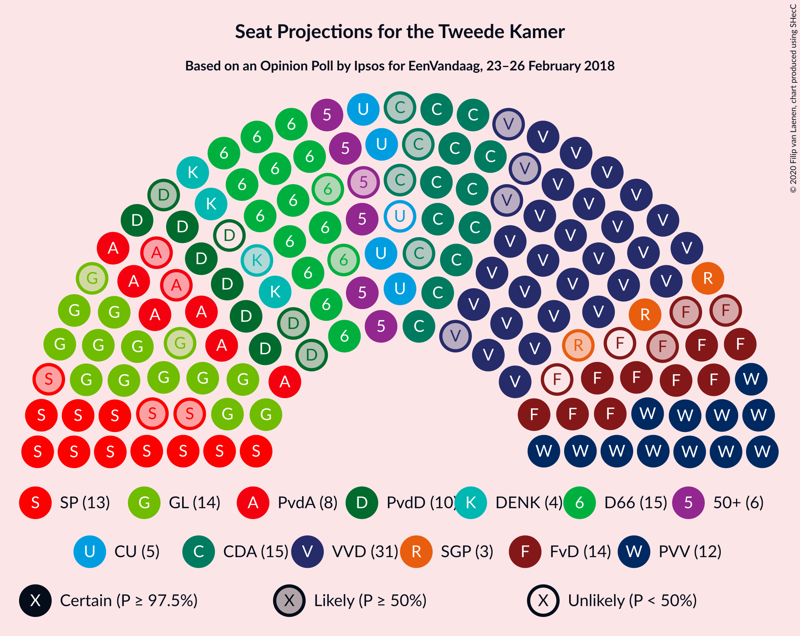

### Confidence Intervals

| Party | Last Result | Median | 80% Confidence Interval | 90% Confidence Interval | 95% Confidence Interval | 99% Confidence Interval |
|:-----:|:-----------:|:------:|:-----------------------:|:-----------------------:|:-----------------------:|:-----------------------:|
| <a href="#volkspartij-voor-vrijheid-en-democratie">Volkspartij voor Vrijheid en Democratie</a> | 33 | 31 | 28–35 |28–38 |27–38 |26–38 |
| <a href="#democraten-66">Democraten 66</a> | 19 | 15 | 15–16 |15–17 |13–19 |12–19 |
| <a href="#christen-democratisch-appèl">Christen-Democratisch Appèl</a> | 19 | 15 | 13–16 |11–17 |11–18 |11–19 |
| <a href="#partij-voor-de-vrijheid">Partij voor de Vrijheid</a> | 20 | 12 | 12–15 |12–16 |12–17 |12–18 |
| <a href="#groenlinks">GroenLinks</a> | 14 | 14 | 12–18 |12–18 |12–19 |10–19 |
| <a href="#socialistische-partij">Socialistische Partij</a> | 14 | 13 | 11–15 |11–17 |10–17 |9–17 |
| <a href="#forum-voor-democratie">Forum voor Democratie</a> | 2 | 12 | 10–14 |9–14 |9–14 |9–14 |
| <a href="#partij-voor-de-dieren">Partij voor de Dieren</a> | 5 | 9 | 7–10 |7–10 |6–10 |6–10 |
| <a href="#partij-van-de-arbeid">Partij van de Arbeid</a> | 9 | 8 | 6–8 |6–8 |6–9 |5–10 |
| <a href="#50plus">50Plus</a> | 4 | 6 | 5–6 |5–7 |5–8 |4–8 |
| <a href="#christenunie">ChristenUnie</a> | 5 | 4 | 4–6 |4–6 |4–7 |4–8 |
| <a href="#denk">DENK</a> | 3 | 4 | 3–6 |3–6 |3–7 |3–7 |
| <a href="#staatkundig-gereformeerde-partij">Staatkundig Gereformeerde Partij</a> | 3 | 3 | 2–6 |2–6 |2–6 |1–6 |

### Volkspartij voor Vrijheid en Democratie

*For a full overview of the results for this party, see the [Volkspartij voor Vrijheid en Democratie](party-volkspartijvoorvrijheidendemocratie.html) page.*

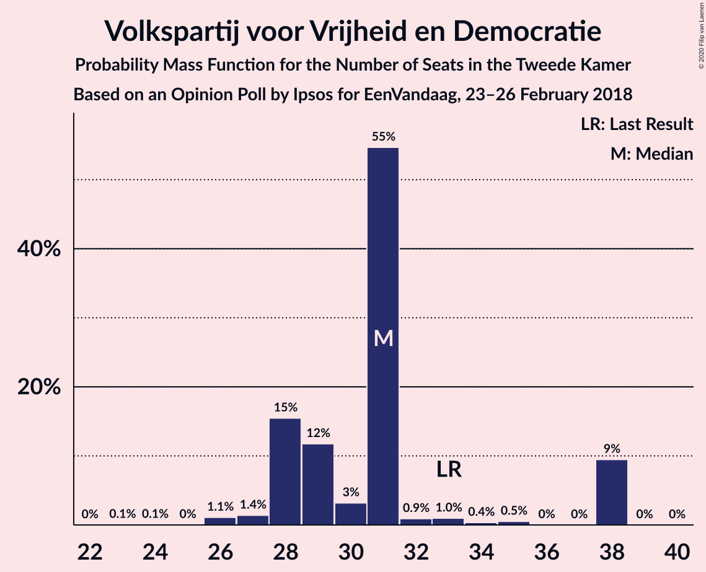

| Number of Seats | Probability | Accumulated | Special Marks |
|:---------------:|:-----------:|:-----------:|:-------------:|
| 23 | 0.1% | 100% |  |
| 24 | 0.1% | 99.9% |  |
| 25 | 0% | 99.9% |  |
| 26 | 1.1% | 99.9% |  |
| 27 | 1.4% | 98.8% |  |
| 28 | 15% | 97% |  |
| 29 | 12% | 82% |  |
| 30 | 3% | 70% |  |
| 31 | 55% | 67% | Median |
| 32 | 0.9% | 12% |  |
| 33 | 1.0% | 11% | Last Result |
| 34 | 0.4% | 10% |  |
| 35 | 0.5% | 10% |  |
| 36 | 0% | 9% |  |
| 37 | 0% | 9% |  |
| 38 | 9% | 9% |  |
| 39 | 0% | 0% |  |

### Democraten 66

*For a full overview of the results for this party, see the [Democraten 66](party-democraten66.html) page.*

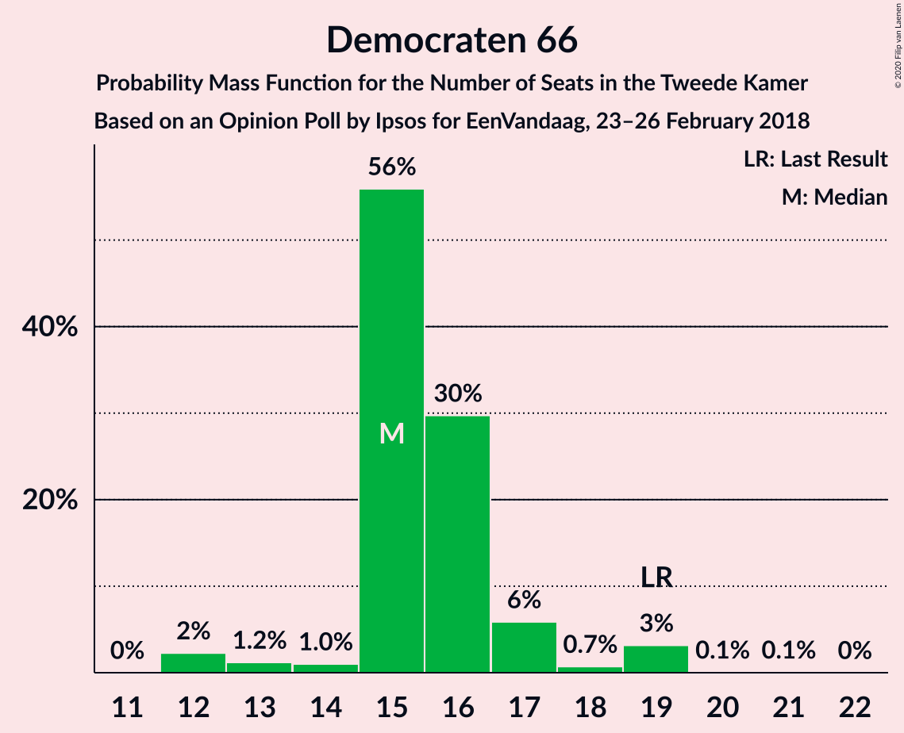

| Number of Seats | Probability | Accumulated | Special Marks |
|:---------------:|:-----------:|:-----------:|:-------------:|
| 12 | 2% | 100% |  |
| 13 | 1.2% | 98% |  |
| 14 | 1.0% | 97% |  |
| 15 | 56% | 96% | Median |
| 16 | 30% | 40% |  |
| 17 | 6% | 10% |  |
| 18 | 0.7% | 4% |  |
| 19 | 3% | 3% | Last Result |
| 20 | 0.1% | 0.1% |  |
| 21 | 0.1% | 0.1% |  |
| 22 | 0% | 0% |  |

### Christen-Democratisch Appèl

*For a full overview of the results for this party, see the [Christen-Democratisch Appèl](party-christen-democratischappèl.html) page.*

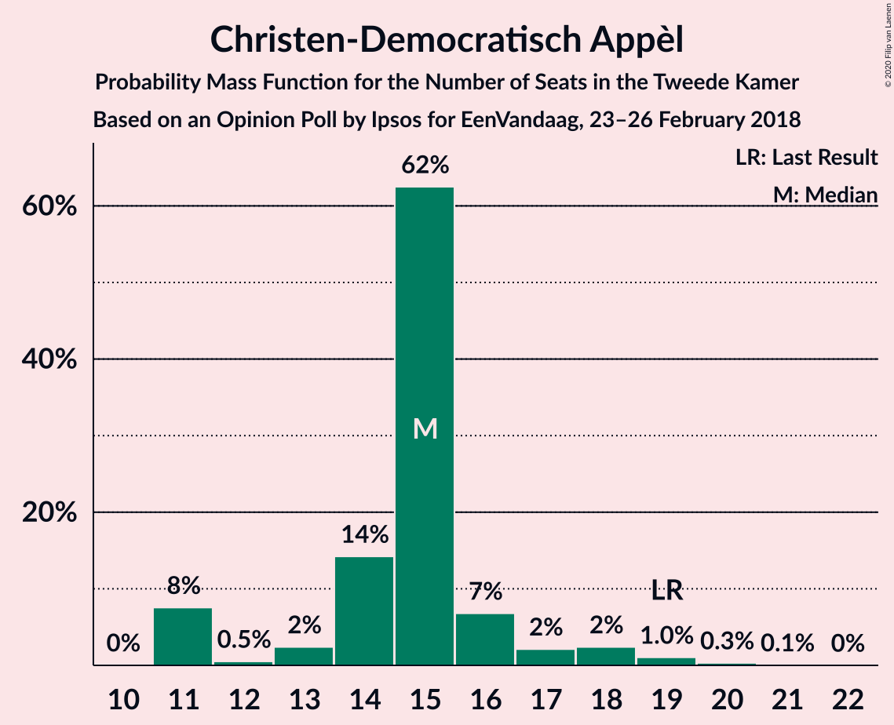

| Number of Seats | Probability | Accumulated | Special Marks |
|:---------------:|:-----------:|:-----------:|:-------------:|
| 11 | 8% | 100% |  |
| 12 | 0.5% | 92% |  |
| 13 | 2% | 92% |  |
| 14 | 14% | 89% |  |
| 15 | 62% | 75% | Median |
| 16 | 7% | 13% |  |
| 17 | 2% | 6% |  |
| 18 | 2% | 4% |  |
| 19 | 1.0% | 1.4% | Last Result |
| 20 | 0.3% | 0.4% |  |
| 21 | 0.1% | 0.1% |  |
| 22 | 0% | 0% |  |

### Partij voor de Vrijheid

*For a full overview of the results for this party, see the [Partij voor de Vrijheid](party-partijvoordevrijheid.html) page.*

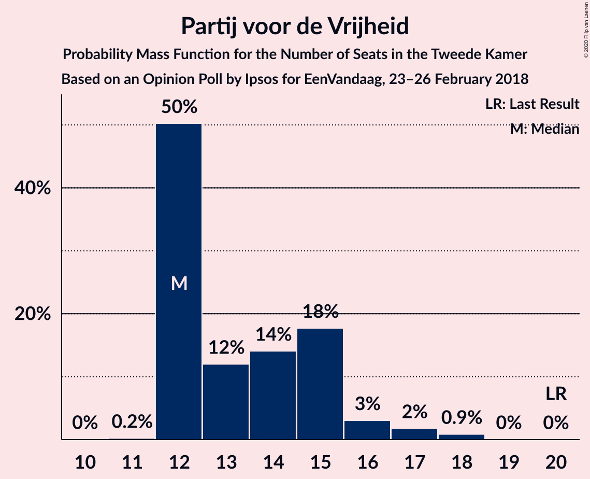

| Number of Seats | Probability | Accumulated | Special Marks |
|:---------------:|:-----------:|:-----------:|:-------------:|
| 11 | 0.2% | 100% |  |
| 12 | 50% | 99.7% | Median |
| 13 | 12% | 49% |  |
| 14 | 14% | 38% |  |
| 15 | 18% | 23% |  |
| 16 | 3% | 6% |  |
| 17 | 2% | 3% |  |
| 18 | 0.9% | 0.9% |  |
| 19 | 0% | 0.1% |  |
| 20 | 0% | 0% | Last Result |

### GroenLinks

*For a full overview of the results for this party, see the [GroenLinks](party-groenlinks.html) page.*

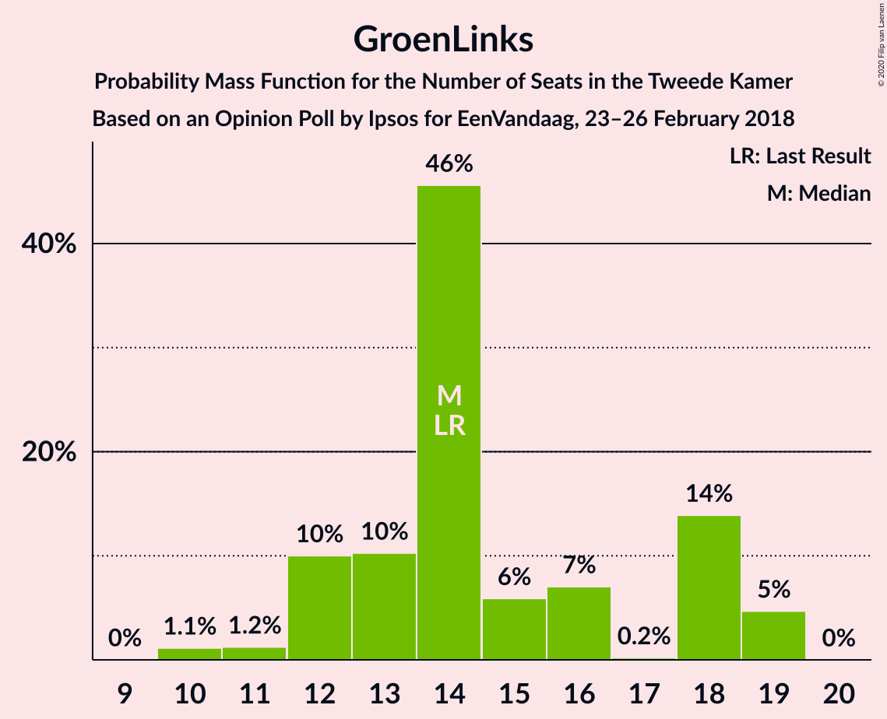

| Number of Seats | Probability | Accumulated | Special Marks |
|:---------------:|:-----------:|:-----------:|:-------------:|
| 10 | 1.1% | 100% |  |
| 11 | 1.2% | 98.8% |  |
| 12 | 10% | 98% |  |
| 13 | 10% | 88% |  |
| 14 | 46% | 77% | Last Result, Median |
| 15 | 6% | 32% |  |
| 16 | 7% | 26% |  |
| 17 | 0.2% | 19% |  |
| 18 | 14% | 19% |  |
| 19 | 5% | 5% |  |
| 20 | 0% | 0% |  |

### Socialistische Partij

*For a full overview of the results for this party, see the [Socialistische Partij](party-socialistischepartij.html) page.*

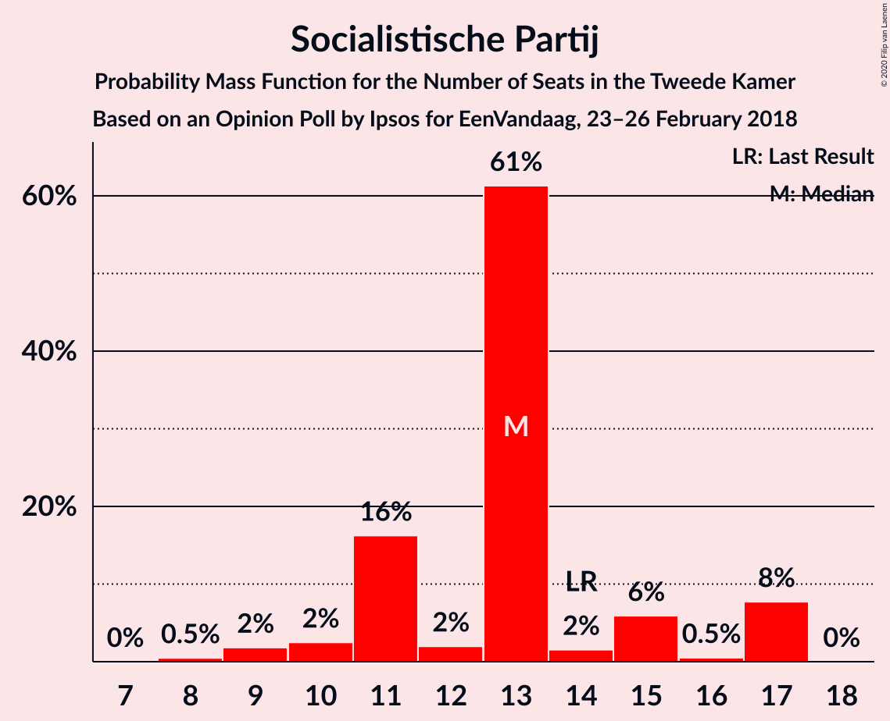

| Number of Seats | Probability | Accumulated | Special Marks |
|:---------------:|:-----------:|:-----------:|:-------------:|
| 8 | 0.5% | 100% |  |
| 9 | 2% | 99.5% |  |
| 10 | 2% | 98% |  |
| 11 | 16% | 95% |  |
| 12 | 2% | 79% |  |
| 13 | 61% | 77% | Median |
| 14 | 2% | 16% | Last Result |
| 15 | 6% | 14% |  |
| 16 | 0.5% | 8% |  |
| 17 | 8% | 8% |  |
| 18 | 0% | 0% |  |

### Forum voor Democratie

*For a full overview of the results for this party, see the [Forum voor Democratie](party-forumvoordemocratie.html) page.*

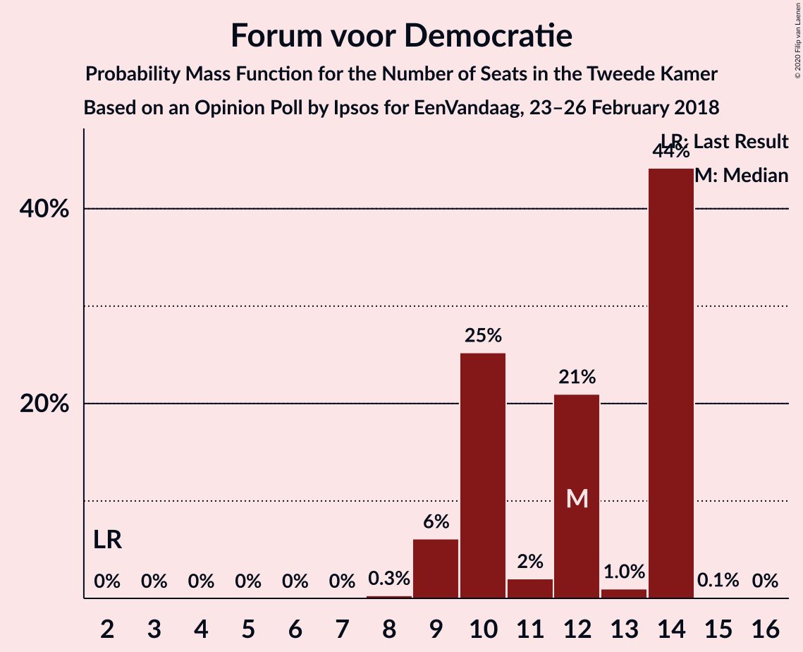

| Number of Seats | Probability | Accumulated | Special Marks |
|:---------------:|:-----------:|:-----------:|:-------------:|
| 2 | 0% | 100% | Last Result |
| 3 | 0% | 100% |  |
| 4 | 0% | 100% |  |
| 5 | 0% | 100% |  |
| 6 | 0% | 100% |  |
| 7 | 0% | 100% |  |
| 8 | 0.3% | 100% |  |
| 9 | 6% | 99.7% |  |
| 10 | 25% | 94% |  |
| 11 | 2% | 68% |  |
| 12 | 21% | 66% | Median |
| 13 | 1.0% | 45% |  |
| 14 | 44% | 44% |  |
| 15 | 0.1% | 0.2% |  |
| 16 | 0% | 0% |  |

### Partij voor de Dieren

*For a full overview of the results for this party, see the [Partij voor de Dieren](party-partijvoordedieren.html) page.*

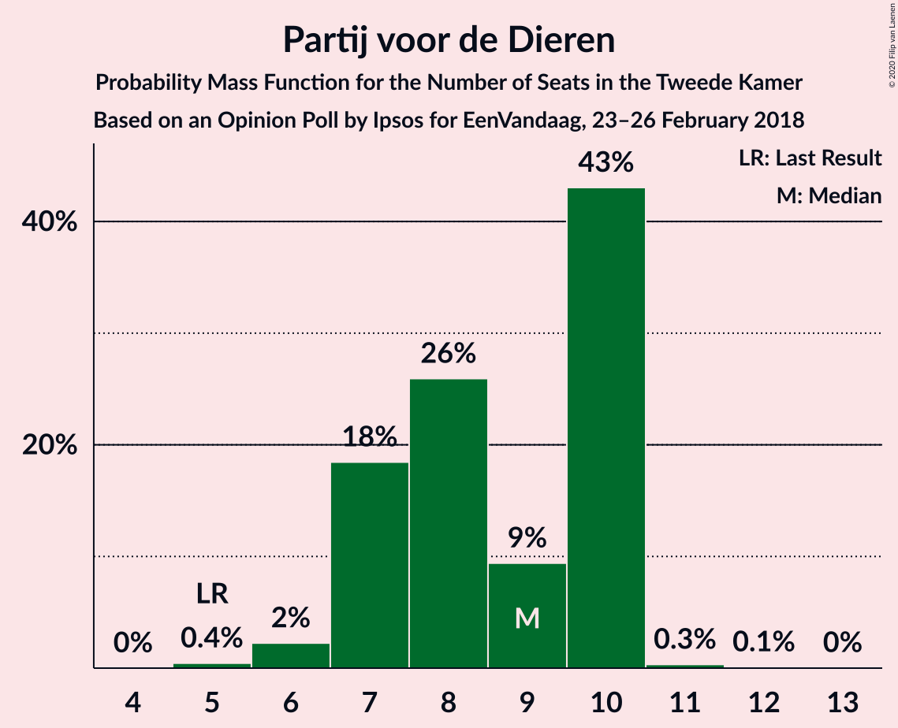

| Number of Seats | Probability | Accumulated | Special Marks |
|:---------------:|:-----------:|:-----------:|:-------------:|
| 5 | 0.4% | 100% | Last Result |
| 6 | 2% | 99.5% |  |
| 7 | 18% | 97% |  |
| 8 | 26% | 79% |  |
| 9 | 9% | 53% | Median |
| 10 | 43% | 44% |  |
| 11 | 0.3% | 0.5% |  |
| 12 | 0.1% | 0.1% |  |
| 13 | 0% | 0% |  |

### Partij van de Arbeid

*For a full overview of the results for this party, see the [Partij van de Arbeid](party-partijvandearbeid.html) page.*

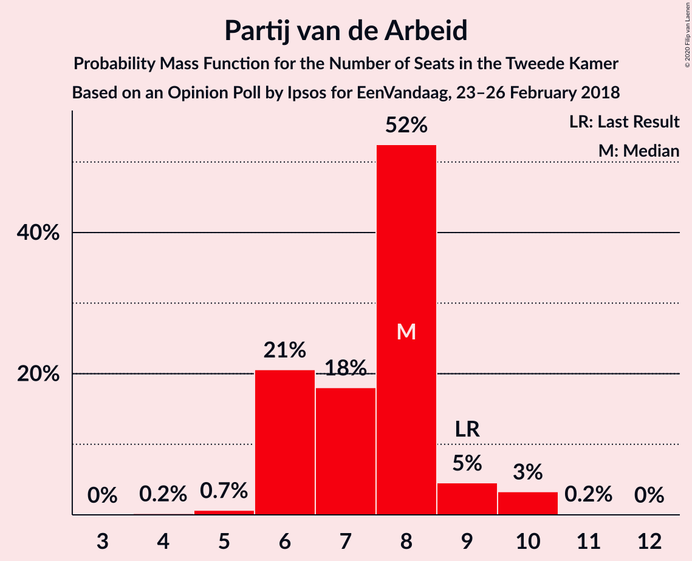

| Number of Seats | Probability | Accumulated | Special Marks |
|:---------------:|:-----------:|:-----------:|:-------------:|
| 4 | 0.1% | 100% |  |
| 5 | 0.9% | 99.9% |  |
| 6 | 15% | 99.0% |  |
| 7 | 21% | 84% |  |
| 8 | 59% | 63% | Median |
| 9 | 2% | 3% | Last Result |
| 10 | 0.7% | 0.8% |  |
| 11 | 0% | 0.1% |  |
| 12 | 0.1% | 0.1% |  |
| 13 | 0% | 0% |  |

### 50Plus

*For a full overview of the results for this party, see the [50Plus](party-50plus.html) page.*

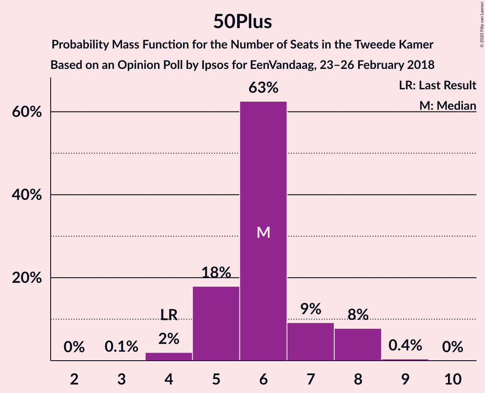

| Number of Seats | Probability | Accumulated | Special Marks |
|:---------------:|:-----------:|:-----------:|:-------------:|
| 3 | 0.3% | 100% |  |
| 4 | 2% | 99.7% | Last Result |
| 5 | 24% | 98% |  |
| 6 | 65% | 75% | Median |
| 7 | 6% | 9% |  |
| 8 | 3% | 4% |  |
| 9 | 0.2% | 0.2% |  |
| 10 | 0% | 0% |  |

### ChristenUnie

*For a full overview of the results for this party, see the [ChristenUnie](party-christenunie.html) page.*

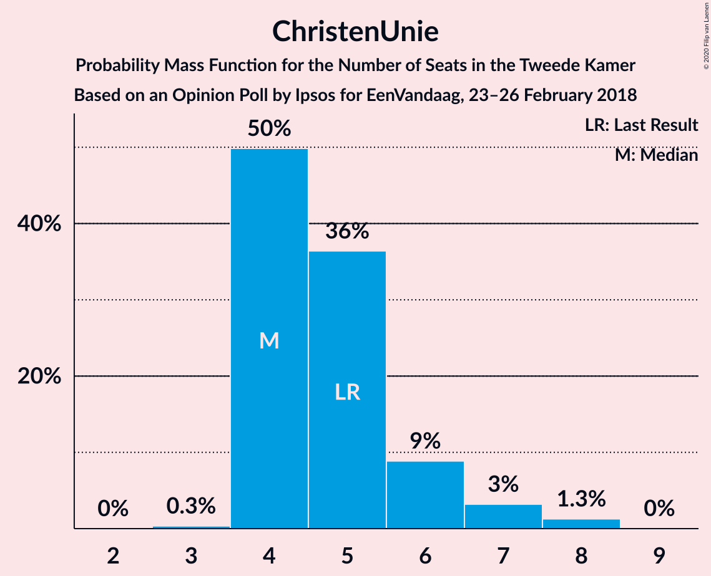

| Number of Seats | Probability | Accumulated | Special Marks |
|:---------------:|:-----------:|:-----------:|:-------------:|
| 3 | 0.3% | 100% |  |
| 4 | 50% | 99.6% | Median |
| 5 | 36% | 50% | Last Result |
| 6 | 9% | 13% |  |
| 7 | 3% | 5% |  |
| 8 | 1.3% | 1.3% |  |
| 9 | 0% | 0% |  |

### DENK

*For a full overview of the results for this party, see the [DENK](party-denk.html) page.*

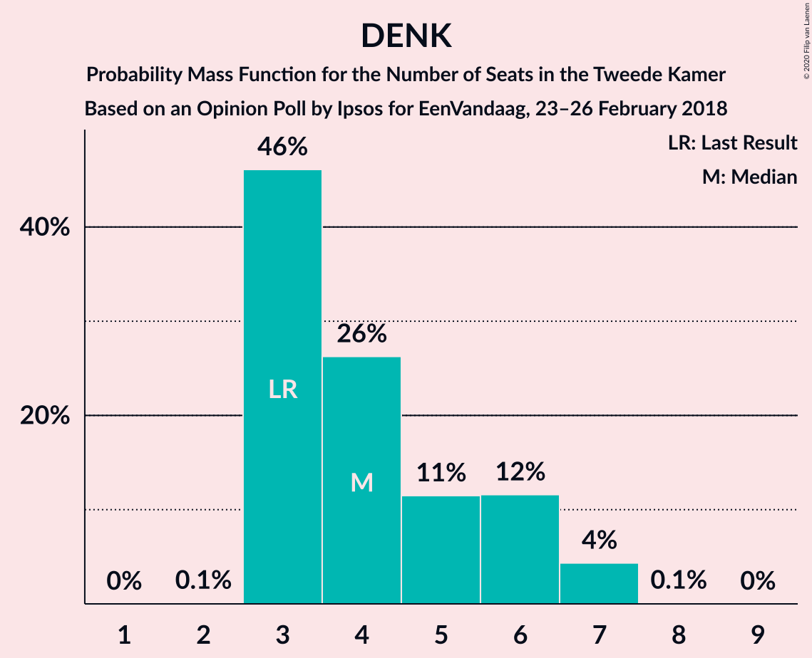

| Number of Seats | Probability | Accumulated | Special Marks |
|:---------------:|:-----------:|:-----------:|:-------------:|
| 2 | 0.1% | 100% |  |
| 3 | 46% | 99.9% | Last Result |
| 4 | 26% | 54% | Median |
| 5 | 11% | 28% |  |
| 6 | 12% | 16% |  |
| 7 | 4% | 4% |  |
| 8 | 0.1% | 0.1% |  |
| 9 | 0% | 0% |  |

### Staatkundig Gereformeerde Partij

*For a full overview of the results for this party, see the [Staatkundig Gereformeerde Partij](party-staatkundiggereformeerdepartij.html) page.*

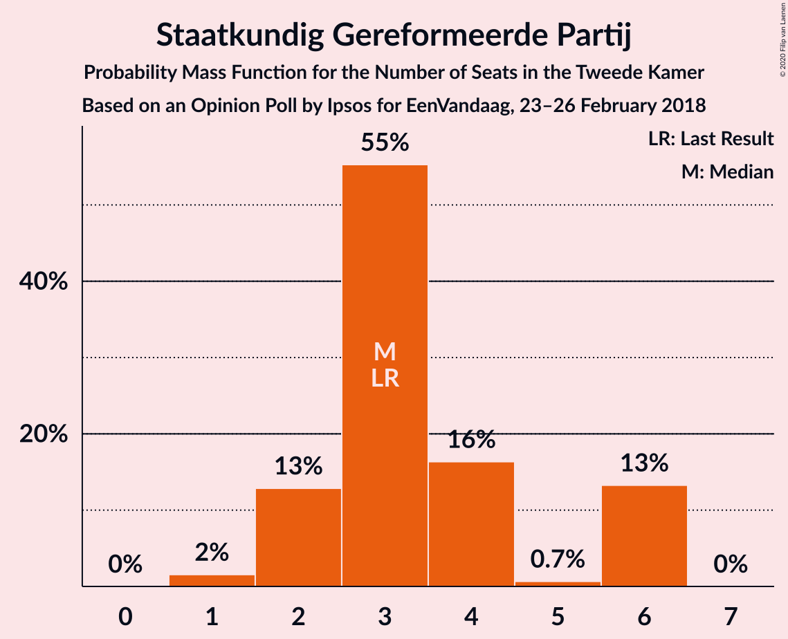

| Number of Seats | Probability | Accumulated | Special Marks |
|:---------------:|:-----------:|:-----------:|:-------------:|
| 1 | 2% | 100% |  |
| 2 | 13% | 98% |  |
| 3 | 55% | 86% | Last Result, Median |
| 4 | 16% | 30% |  |
| 5 | 0.7% | 14% |  |
| 6 | 13% | 13% |  |
| 7 | 0% | 0% |  |

## Coalitions

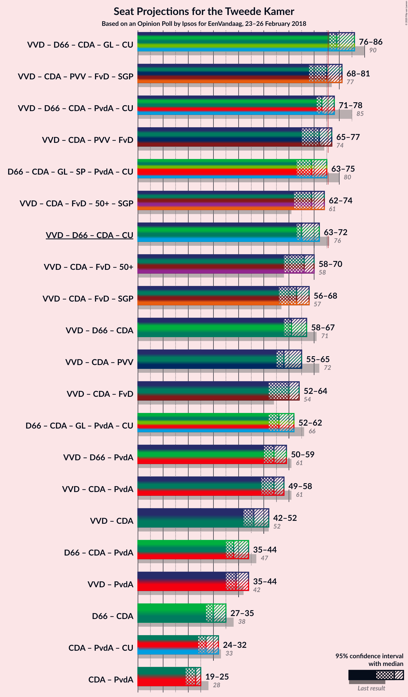

### Confidence Intervals

| Coalition | Last Result | Median | Majority? | 80% Confidence Interval | 90% Confidence Interval | 95% Confidence Interval | 99% Confidence Interval |
|:---------:|:-----------:|:------:|:---------:|:-----------------------:|:-----------------------:|:-----------------------:|:-----------------------:|
| Volkspartij voor Vrijheid en Democratie – Democraten 66 – Christen-Democratisch Appèl – GroenLinks – ChristenUnie | 90 | 79 | 98.7% | 77–84 | 76–84 | 76–86 | 74–88 |
| Volkspartij voor Vrijheid en Democratie – Christen-Democratisch Appèl – Partij voor de Vrijheid – Forum voor Democratie – Staatkundig Gereformeerde Partij | 77 | 75 | 15% | 71–81 | 70–81 | 68–81 | 68–82 |
| Volkspartij voor Vrijheid en Democratie – Democraten 66 – Christen-Democratisch Appèl – Partij van de Arbeid – ChristenUnie | 85 | 73 | 15% | 71–78 | 71–78 | 71–78 | 67–79 |
| Volkspartij voor Vrijheid en Democratie – Christen-Democratisch Appèl – Partij voor de Vrijheid – Forum voor Democratie | 74 | 72 | 12% | 67–77 | 67–77 | 65–77 | 64–78 |
| Democraten 66 – Christen-Democratisch Appèl – GroenLinks – Socialistische Partij – Partij van de Arbeid – ChristenUnie | 80 | 69 | 2% | 65–74 | 63–74 | 63–75 | 63–76 |
| Volkspartij voor Vrijheid en Democratie – Christen-Democratisch Appèl – Forum voor Democratie – 50Plus – Staatkundig Gereformeerde Partij | 61 | 69 | 0% | 62–70 | 62–74 | 62–74 | 60–74 |
| Volkspartij voor Vrijheid en Democratie – Democraten 66 – Christen-Democratisch Appèl – ChristenUnie | 76 | 65 | 0% | 64–72 | 63–72 | 63–72 | 59–73 |
| Volkspartij voor Vrijheid en Democratie – Christen-Democratisch Appèl – Forum voor Democratie – 50Plus | 58 | 66 | 0% | 58–67 | 58–70 | 58–70 | 57–70 |
| Volkspartij voor Vrijheid en Democratie – Christen-Democratisch Appèl – Forum voor Democratie – Staatkundig Gereformeerde Partij | 57 | 63 | 0% | 56–65 | 56–68 | 56–68 | 55–68 |
| Volkspartij voor Vrijheid en Democratie – Democraten 66 – Christen-Democratisch Appèl | 71 | 61 | 0% | 58–67 | 58–67 | 58–67 | 54–67 |
| Volkspartij voor Vrijheid en Democratie – Christen-Democratisch Appèl – Partij voor de Vrijheid | 72 | 58 | 0% | 57–65 | 56–65 | 55–65 | 52–68 |
| Volkspartij voor Vrijheid en Democratie – Christen-Democratisch Appèl – Forum voor Democratie | 54 | 60 | 0% | 53–61 | 53–64 | 52–64 | 51–64 |
| Democraten 66 – Christen-Democratisch Appèl – GroenLinks – Partij van de Arbeid – ChristenUnie | 66 | 56 | 0% | 52–61 | 52–62 | 52–62 | 52–66 |
| Volkspartij voor Vrijheid en Democratie – Democraten 66 – Partij van de Arbeid | 61 | 54 | 0% | 51–58 | 51–59 | 50–59 | 49–59 |
| Volkspartij voor Vrijheid en Democratie – Christen-Democratisch Appèl – Partij van de Arbeid | 61 | 54 | 0% | 50–58 | 49–58 | 49–58 | 48–58 |
| Volkspartij voor Vrijheid en Democratie – Christen-Democratisch Appèl | 52 | 46 | 0% | 43–51 | 42–52 | 42–52 | 39–52 |
| Democraten 66 – Christen-Democratisch Appèl – Partij van de Arbeid | 47 | 38 | 0% | 35–39 | 35–40 | 35–44 | 33–44 |
| Volkspartij voor Vrijheid en Democratie – Partij van de Arbeid | 42 | 39 | 0% | 35–41 | 35–44 | 35–44 | 34–44 |
| Democraten 66 – Christen-Democratisch Appèl | 38 | 30 | 0% | 29–31 | 27–33 | 27–35 | 25–37 |
| Christen-Democratisch Appèl – Partij van de Arbeid – ChristenUnie | 33 | 27 | 0% | 25–29 | 24–30 | 24–32 | 23–33 |
| Christen-Democratisch Appèl – Partij van de Arbeid | 28 | 23 | 0% | 20–24 | 19–25 | 19–25 | 19–27 |

### Volkspartij voor Vrijheid en Democratie – Democraten 66 – Christen-Democratisch Appèl – GroenLinks – ChristenUnie

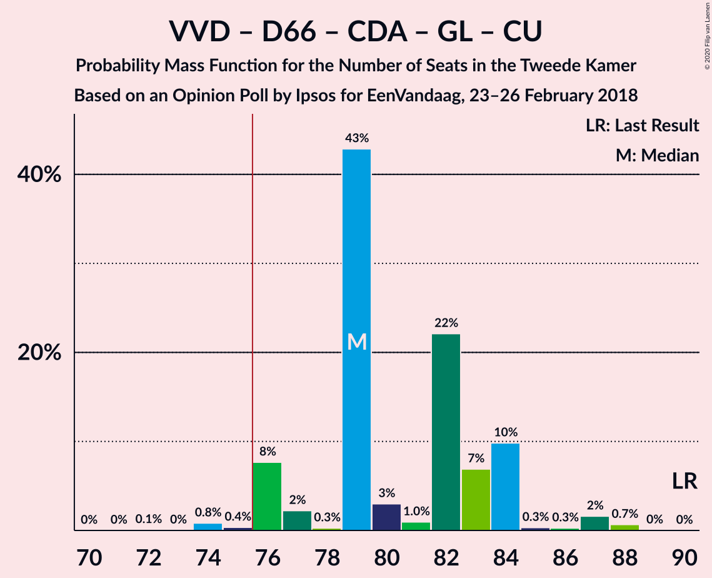

| Number of Seats | Probability | Accumulated | Special Marks |
|:---------------:|:-----------:|:-----------:|:-------------:|
| 72 | 0.1% | 100% |  |
| 73 | 0% | 99.9% |  |
| 74 | 0.8% | 99.9% |  |
| 75 | 0.4% | 99.1% |  |
| 76 | 8% | 98.7% | Majority |
| 77 | 2% | 91% |  |
| 78 | 0.3% | 89% |  |
| 79 | 43% | 89% | Median |
| 80 | 3% | 46% |  |
| 81 | 1.0% | 43% |  |
| 82 | 22% | 42% |  |
| 83 | 7% | 20% |  |
| 84 | 10% | 13% |  |
| 85 | 0.3% | 3% |  |
| 86 | 0.3% | 3% |  |
| 87 | 2% | 2% |  |
| 88 | 0.7% | 0.7% |  |
| 89 | 0% | 0% |  |
| 90 | 0% | 0% | Last Result |

### Volkspartij voor Vrijheid en Democratie – Christen-Democratisch Appèl – Partij voor de Vrijheid – Forum voor Democratie – Staatkundig Gereformeerde Partij

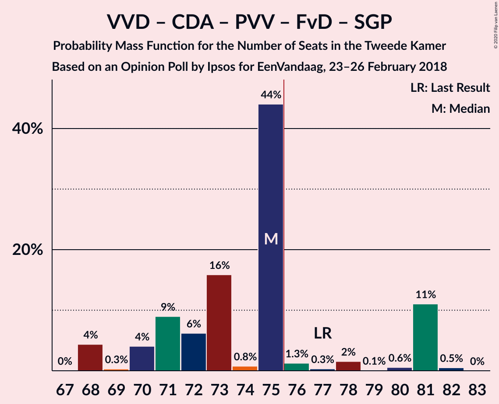

| Number of Seats | Probability | Accumulated | Special Marks |
|:---------------:|:-----------:|:-----------:|:-------------:|
| 67 | 0% | 100% |  |
| 68 | 4% | 99.9% |  |
| 69 | 0.3% | 96% |  |
| 70 | 4% | 95% |  |
| 71 | 9% | 91% |  |
| 72 | 6% | 82% |  |
| 73 | 16% | 76% | Median |
| 74 | 0.8% | 60% |  |
| 75 | 44% | 59% |  |
| 76 | 1.3% | 15% | Majority |
| 77 | 0.3% | 14% | Last Result |
| 78 | 2% | 14% |  |
| 79 | 0.1% | 12% |  |
| 80 | 0.6% | 12% |  |
| 81 | 11% | 12% |  |
| 82 | 0.5% | 0.5% |  |
| 83 | 0% | 0% |  |

### Volkspartij voor Vrijheid en Democratie – Democraten 66 – Christen-Democratisch Appèl – Partij van de Arbeid – ChristenUnie

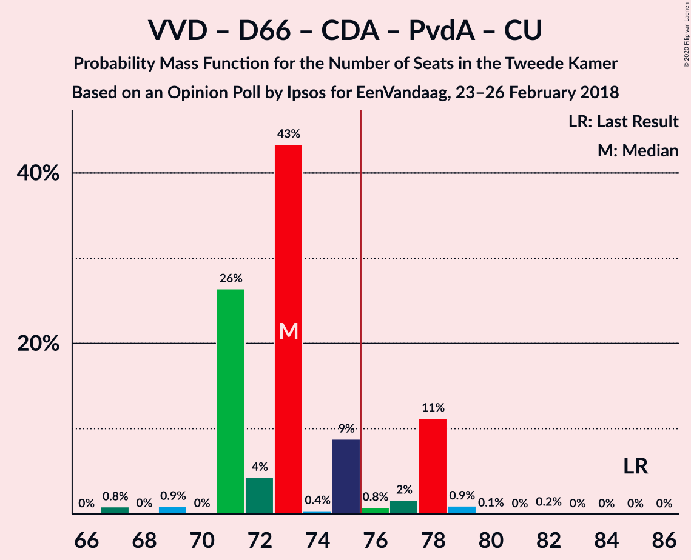

| Number of Seats | Probability | Accumulated | Special Marks |
|:---------------:|:-----------:|:-----------:|:-------------:|
| 67 | 0.8% | 100% |  |
| 68 | 0% | 99.1% |  |
| 69 | 0.9% | 99.1% |  |
| 70 | 0% | 98% |  |
| 71 | 26% | 98% |  |
| 72 | 4% | 72% |  |
| 73 | 43% | 67% | Median |
| 74 | 0.4% | 24% |  |
| 75 | 9% | 24% |  |
| 76 | 0.8% | 15% | Majority |
| 77 | 2% | 14% |  |
| 78 | 11% | 13% |  |
| 79 | 0.9% | 1.3% |  |
| 80 | 0.1% | 0.3% |  |
| 81 | 0% | 0.2% |  |
| 82 | 0.2% | 0.2% |  |
| 83 | 0% | 0% |  |
| 84 | 0% | 0% |  |
| 85 | 0% | 0% | Last Result |

### Volkspartij voor Vrijheid en Democratie – Christen-Democratisch Appèl – Partij voor de Vrijheid – Forum voor Democratie

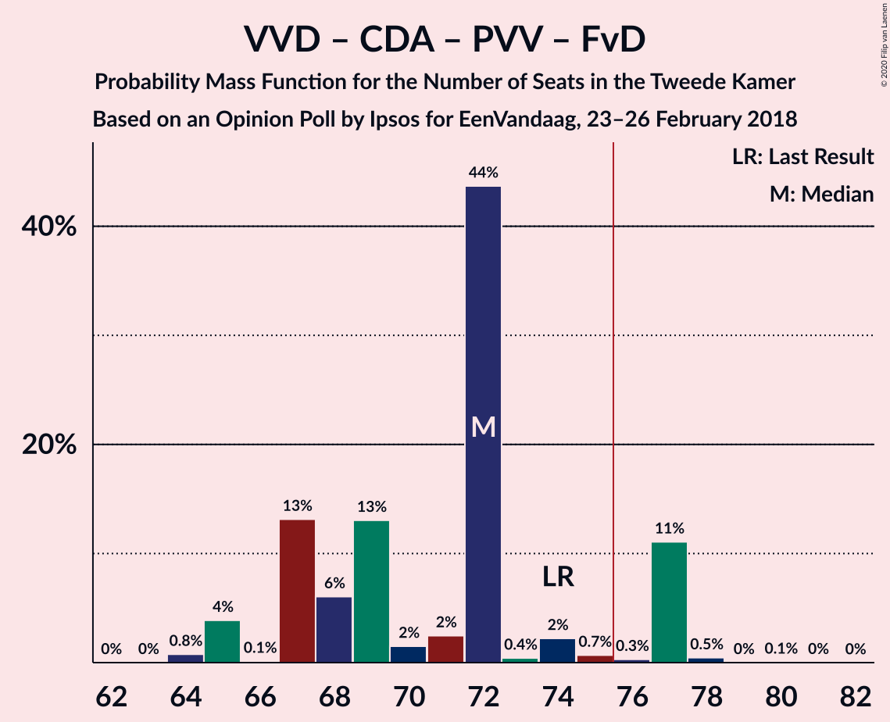

| Number of Seats | Probability | Accumulated | Special Marks |
|:---------------:|:-----------:|:-----------:|:-------------:|
| 64 | 0.8% | 100% |  |
| 65 | 4% | 99.2% |  |
| 66 | 0.1% | 95% |  |
| 67 | 13% | 95% |  |
| 68 | 6% | 82% |  |
| 69 | 13% | 76% |  |
| 70 | 2% | 63% | Median |
| 71 | 2% | 61% |  |
| 72 | 44% | 59% |  |
| 73 | 0.4% | 15% |  |
| 74 | 2% | 15% | Last Result |
| 75 | 0.7% | 13% |  |
| 76 | 0.3% | 12% | Majority |
| 77 | 11% | 12% |  |
| 78 | 0.5% | 0.6% |  |
| 79 | 0% | 0.1% |  |
| 80 | 0.1% | 0.1% |  |
| 81 | 0% | 0% |  |

### Democraten 66 – Christen-Democratisch Appèl – GroenLinks – Socialistische Partij – Partij van de Arbeid – ChristenUnie

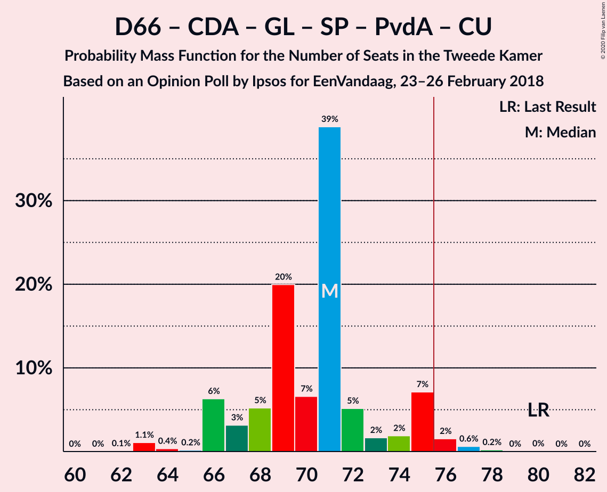

| Number of Seats | Probability | Accumulated | Special Marks |
|:---------------:|:-----------:|:-----------:|:-------------:|
| 63 | 10% | 100% |  |
| 64 | 0.2% | 90% |  |
| 65 | 0.6% | 90% |  |
| 66 | 0.4% | 90% |  |
| 67 | 0.9% | 89% |  |
| 68 | 1.1% | 88% |  |
| 69 | 43% | 87% | Median |
| 70 | 10% | 44% |  |
| 71 | 4% | 35% |  |
| 72 | 8% | 31% |  |
| 73 | 2% | 22% |  |
| 74 | 17% | 20% |  |
| 75 | 1.2% | 3% |  |
| 76 | 2% | 2% | Majority |
| 77 | 0% | 0.2% |  |
| 78 | 0.2% | 0.2% |  |
| 79 | 0% | 0% |  |
| 80 | 0% | 0% | Last Result |

### Volkspartij voor Vrijheid en Democratie – Christen-Democratisch Appèl – Forum voor Democratie – 50Plus – Staatkundig Gereformeerde Partij

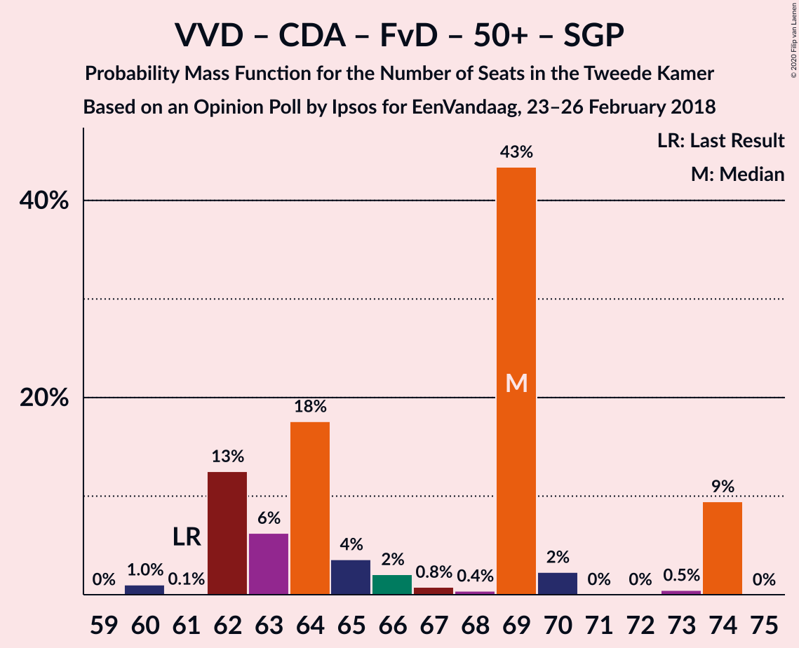

| Number of Seats | Probability | Accumulated | Special Marks |
|:---------------:|:-----------:|:-----------:|:-------------:|
| 59 | 0% | 100% |  |
| 60 | 1.0% | 99.9% |  |
| 61 | 0.1% | 98.9% | Last Result |
| 62 | 13% | 98.9% |  |
| 63 | 6% | 86% |  |
| 64 | 18% | 80% |  |
| 65 | 4% | 63% |  |
| 66 | 2% | 59% |  |
| 67 | 0.8% | 57% | Median |
| 68 | 0.4% | 56% |  |
| 69 | 43% | 56% |  |
| 70 | 2% | 12% |  |
| 71 | 0% | 10% |  |
| 72 | 0% | 10% |  |
| 73 | 0.5% | 10% |  |
| 74 | 9% | 9% |  |
| 75 | 0% | 0% |  |

### Volkspartij voor Vrijheid en Democratie – Democraten 66 – Christen-Democratisch Appèl – ChristenUnie

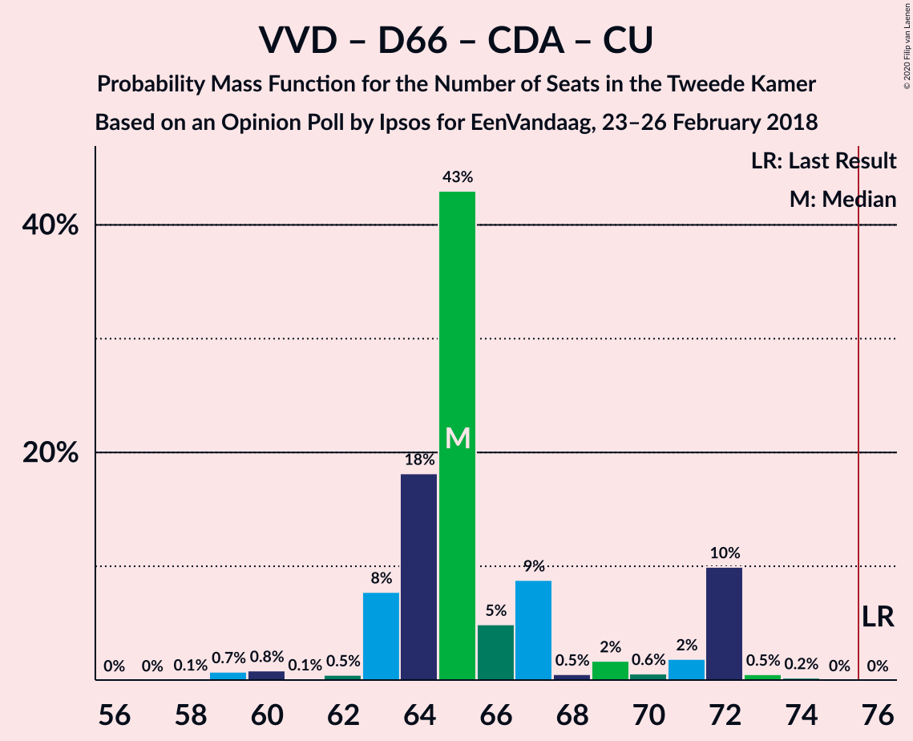

| Number of Seats | Probability | Accumulated | Special Marks |
|:---------------:|:-----------:|:-----------:|:-------------:|
| 58 | 0.1% | 100% |  |
| 59 | 0.7% | 99.9% |  |
| 60 | 0.8% | 99.2% |  |
| 61 | 0.1% | 98% |  |
| 62 | 0.5% | 98% |  |
| 63 | 8% | 98% |  |
| 64 | 18% | 90% |  |
| 65 | 43% | 72% | Median |
| 66 | 5% | 29% |  |
| 67 | 9% | 24% |  |
| 68 | 0.5% | 15% |  |
| 69 | 2% | 15% |  |
| 70 | 0.6% | 13% |  |
| 71 | 2% | 13% |  |
| 72 | 10% | 11% |  |
| 73 | 0.5% | 0.7% |  |
| 74 | 0.2% | 0.2% |  |
| 75 | 0% | 0% |  |
| 76 | 0% | 0% | Last Result, Majority |

### Volkspartij voor Vrijheid en Democratie – Christen-Democratisch Appèl – Forum voor Democratie – 50Plus

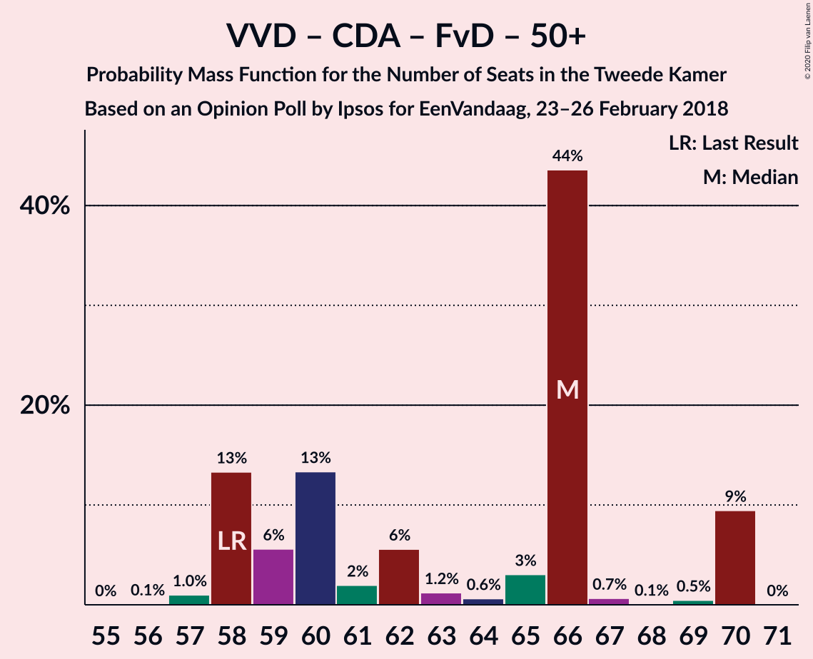

| Number of Seats | Probability | Accumulated | Special Marks |
|:---------------:|:-----------:|:-----------:|:-------------:|
| 56 | 0.1% | 100% |  |
| 57 | 1.0% | 99.9% |  |
| 58 | 13% | 98.9% | Last Result |
| 59 | 6% | 86% |  |
| 60 | 13% | 80% |  |
| 61 | 2% | 67% |  |
| 62 | 6% | 65% |  |
| 63 | 1.2% | 59% |  |
| 64 | 0.6% | 58% | Median |
| 65 | 3% | 57% |  |
| 66 | 44% | 54% |  |
| 67 | 0.7% | 11% |  |
| 68 | 0.1% | 10% |  |
| 69 | 0.5% | 10% |  |
| 70 | 9% | 9% |  |
| 71 | 0% | 0% |  |

### Volkspartij voor Vrijheid en Democratie – Christen-Democratisch Appèl – Forum voor Democratie – Staatkundig Gereformeerde Partij

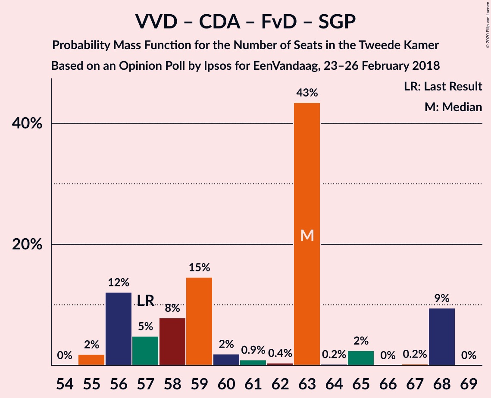

| Number of Seats | Probability | Accumulated | Special Marks |
|:---------------:|:-----------:|:-----------:|:-------------:|
| 54 | 0% | 100% |  |
| 55 | 2% | 99.9% |  |
| 56 | 12% | 98% |  |
| 57 | 5% | 86% | Last Result |
| 58 | 8% | 81% |  |
| 59 | 15% | 73% |  |
| 60 | 2% | 59% |  |
| 61 | 0.9% | 57% | Median |
| 62 | 0.4% | 56% |  |
| 63 | 43% | 56% |  |
| 64 | 0.2% | 12% |  |
| 65 | 2% | 12% |  |
| 66 | 0% | 10% |  |
| 67 | 0.2% | 10% |  |
| 68 | 9% | 9% |  |
| 69 | 0% | 0% |  |

### Volkspartij voor Vrijheid en Democratie – Democraten 66 – Christen-Democratisch Appèl

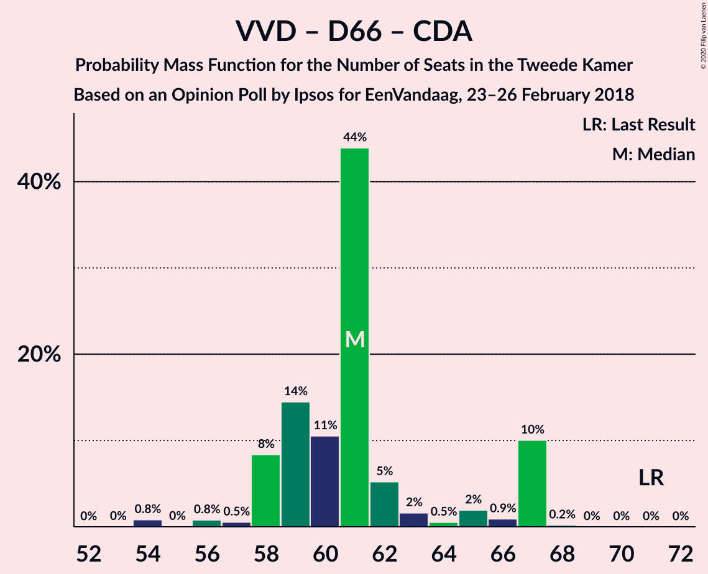

| Number of Seats | Probability | Accumulated | Special Marks |
|:---------------:|:-----------:|:-----------:|:-------------:|
| 54 | 0.8% | 100% |  |
| 55 | 0% | 99.1% |  |
| 56 | 0.8% | 99.1% |  |
| 57 | 0.5% | 98% |  |
| 58 | 8% | 98% |  |
| 59 | 14% | 89% |  |
| 60 | 11% | 75% |  |
| 61 | 44% | 64% | Median |
| 62 | 5% | 20% |  |
| 63 | 2% | 15% |  |
| 64 | 0.5% | 14% |  |
| 65 | 2% | 13% |  |
| 66 | 0.9% | 11% |  |
| 67 | 10% | 10% |  |
| 68 | 0.2% | 0.2% |  |
| 69 | 0% | 0% |  |
| 70 | 0% | 0% |  |
| 71 | 0% | 0% | Last Result |

### Volkspartij voor Vrijheid en Democratie – Christen-Democratisch Appèl – Partij voor de Vrijheid

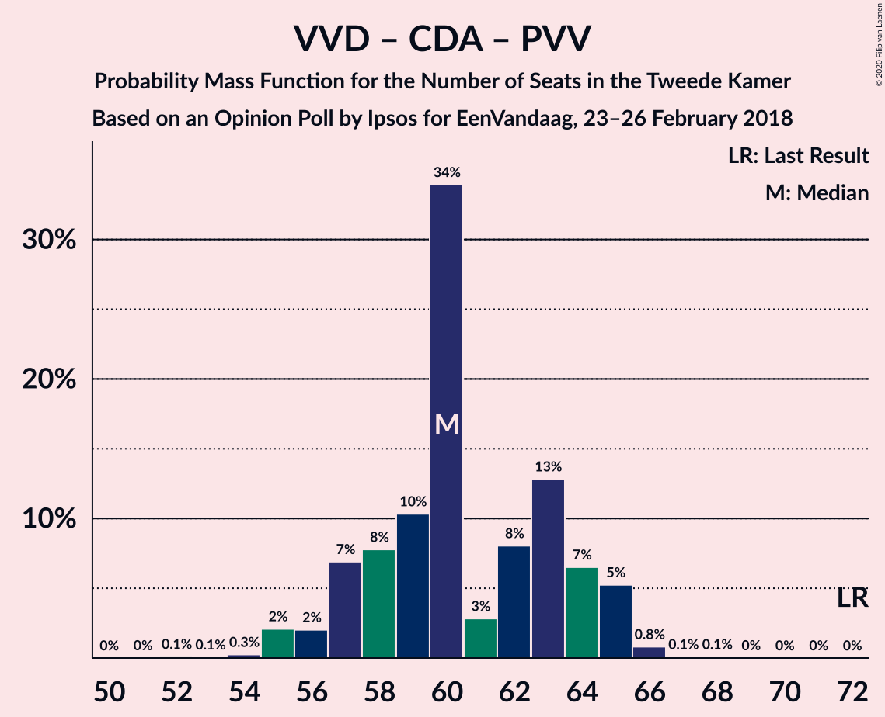

| Number of Seats | Probability | Accumulated | Special Marks |
|:---------------:|:-----------:|:-----------:|:-------------:|
| 52 | 0.8% | 100% |  |
| 53 | 0% | 99.2% |  |
| 54 | 0.4% | 99.2% |  |
| 55 | 4% | 98.8% |  |
| 56 | 0.9% | 95% |  |
| 57 | 21% | 94% |  |
| 58 | 43% | 74% | Median |
| 59 | 12% | 31% |  |
| 60 | 2% | 19% |  |
| 61 | 2% | 17% |  |
| 62 | 2% | 15% |  |
| 63 | 1.4% | 13% |  |
| 64 | 0.5% | 12% |  |
| 65 | 10% | 11% |  |
| 66 | 0.1% | 1.0% |  |
| 67 | 0.2% | 0.9% |  |
| 68 | 0.7% | 0.7% |  |
| 69 | 0% | 0% |  |
| 70 | 0% | 0% |  |
| 71 | 0% | 0% |  |
| 72 | 0% | 0% | Last Result |

### Volkspartij voor Vrijheid en Democratie – Christen-Democratisch Appèl – Forum voor Democratie

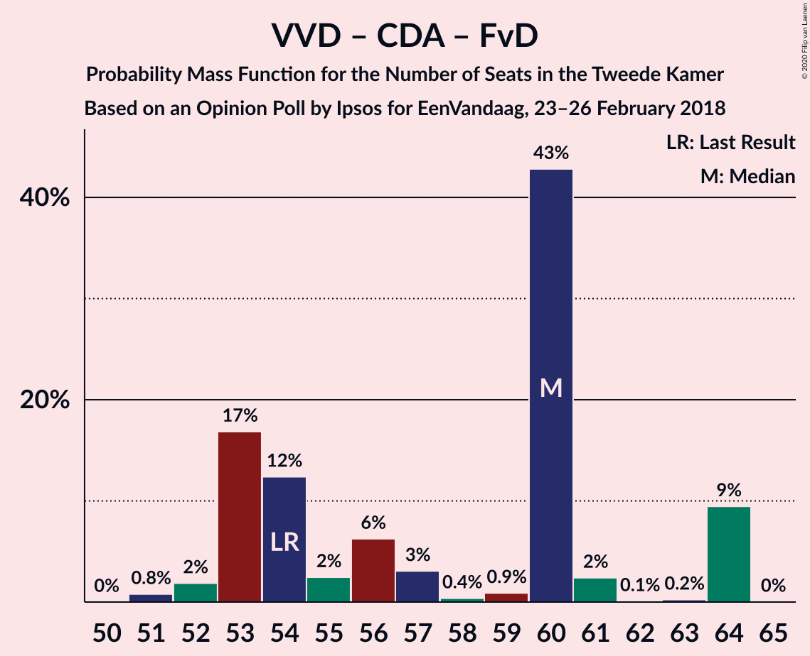

| Number of Seats | Probability | Accumulated | Special Marks |
|:---------------:|:-----------:|:-----------:|:-------------:|
| 51 | 0.8% | 100% |  |
| 52 | 2% | 99.2% |  |
| 53 | 17% | 97% |  |
| 54 | 12% | 80% | Last Result |
| 55 | 2% | 68% |  |
| 56 | 6% | 66% |  |
| 57 | 3% | 59% |  |
| 58 | 0.4% | 56% | Median |
| 59 | 0.9% | 56% |  |
| 60 | 43% | 55% |  |
| 61 | 2% | 12% |  |
| 62 | 0.1% | 10% |  |
| 63 | 0.2% | 10% |  |
| 64 | 9% | 9% |  |
| 65 | 0% | 0% |  |

### Democraten 66 – Christen-Democratisch Appèl – GroenLinks – Partij van de Arbeid – ChristenUnie

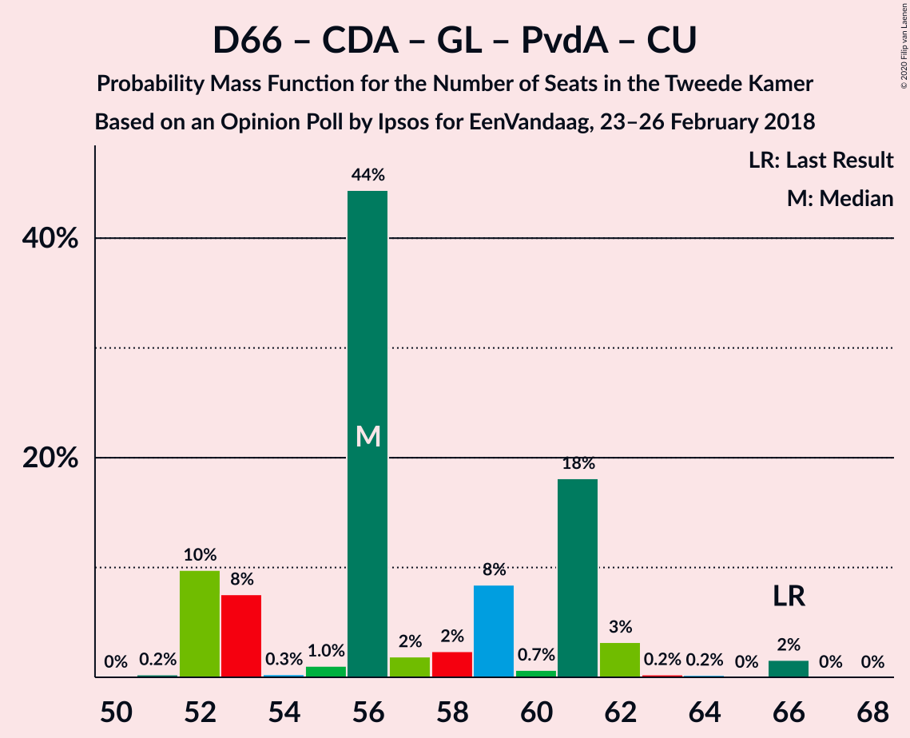

| Number of Seats | Probability | Accumulated | Special Marks |
|:---------------:|:-----------:|:-----------:|:-------------:|
| 51 | 0.2% | 100% |  |
| 52 | 10% | 99.7% |  |
| 53 | 8% | 90% |  |
| 54 | 0.3% | 82% |  |
| 55 | 1.0% | 82% |  |
| 56 | 44% | 81% | Median |
| 57 | 2% | 37% |  |
| 58 | 2% | 35% |  |
| 59 | 8% | 32% |  |
| 60 | 0.7% | 24% |  |
| 61 | 18% | 23% |  |
| 62 | 3% | 5% |  |
| 63 | 0.2% | 2% |  |
| 64 | 0.2% | 2% |  |
| 65 | 0% | 2% |  |
| 66 | 2% | 2% | Last Result |
| 67 | 0% | 0% |  |

### Volkspartij voor Vrijheid en Democratie – Democraten 66 – Partij van de Arbeid

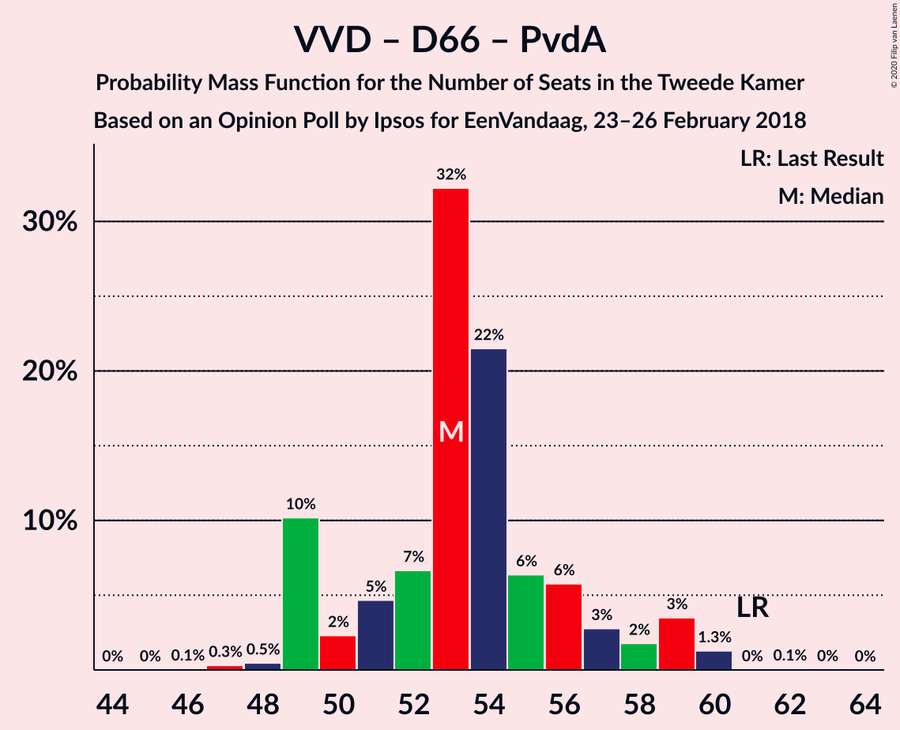

| Number of Seats | Probability | Accumulated | Special Marks |
|:---------------:|:-----------:|:-----------:|:-------------:|
| 46 | 0.2% | 100% |  |
| 47 | 0.2% | 99.8% |  |
| 48 | 0.1% | 99.6% |  |
| 49 | 1.5% | 99.5% |  |
| 50 | 1.4% | 98% |  |
| 51 | 14% | 97% |  |
| 52 | 10% | 83% |  |
| 53 | 3% | 73% |  |
| 54 | 48% | 69% | Median |
| 55 | 9% | 21% |  |
| 56 | 1.0% | 12% |  |
| 57 | 0.7% | 11% |  |
| 58 | 0.3% | 10% |  |
| 59 | 10% | 10% |  |
| 60 | 0% | 0.1% |  |
| 61 | 0% | 0% | Last Result |

### Volkspartij voor Vrijheid en Democratie – Christen-Democratisch Appèl – Partij van de Arbeid

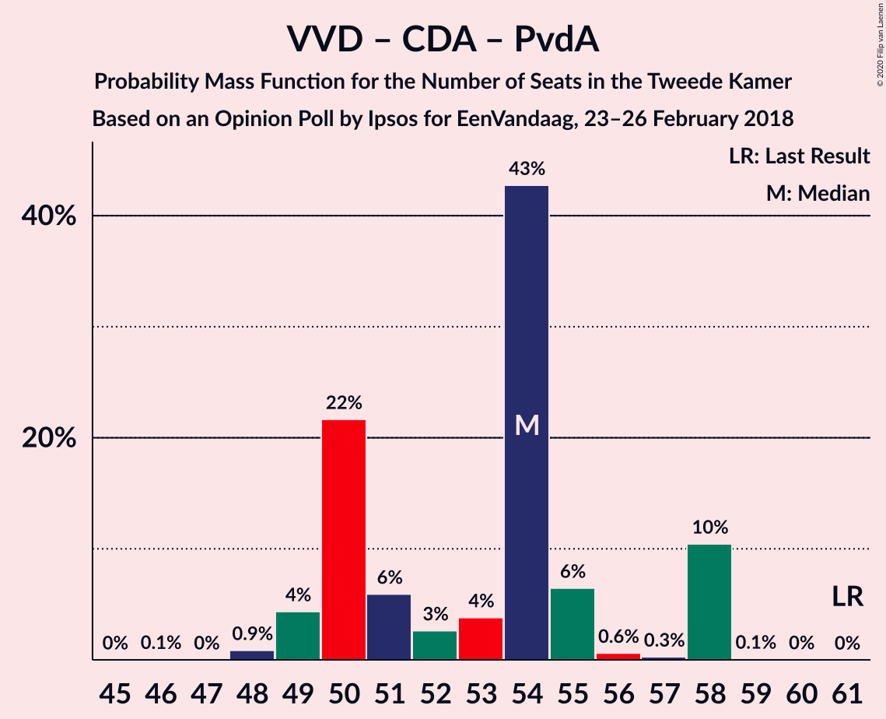

| Number of Seats | Probability | Accumulated | Special Marks |
|:---------------:|:-----------:|:-----------:|:-------------:|
| 46 | 0.1% | 100% |  |
| 47 | 0% | 99.9% |  |
| 48 | 0.9% | 99.9% |  |
| 49 | 4% | 99.0% |  |
| 50 | 22% | 95% |  |
| 51 | 6% | 73% |  |
| 52 | 3% | 67% |  |
| 53 | 4% | 64% |  |
| 54 | 43% | 61% | Median |
| 55 | 6% | 18% |  |
| 56 | 0.6% | 11% |  |
| 57 | 0.3% | 11% |  |
| 58 | 10% | 11% |  |
| 59 | 0.1% | 0.1% |  |
| 60 | 0% | 0% |  |
| 61 | 0% | 0% | Last Result |

### Volkspartij voor Vrijheid en Democratie – Christen-Democratisch Appèl

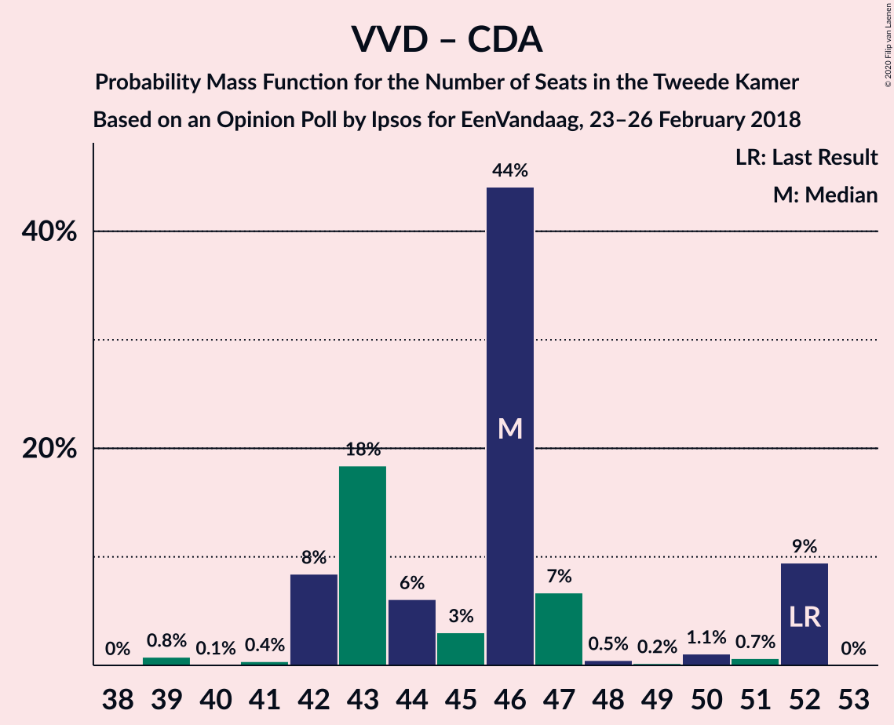

| Number of Seats | Probability | Accumulated | Special Marks |
|:---------------:|:-----------:|:-----------:|:-------------:|
| 39 | 0.8% | 100% |  |
| 40 | 0.1% | 99.2% |  |
| 41 | 0.4% | 99.1% |  |
| 42 | 8% | 98.7% |  |
| 43 | 18% | 90% |  |
| 44 | 6% | 72% |  |
| 45 | 3% | 66% |  |
| 46 | 44% | 63% | Median |
| 47 | 7% | 19% |  |
| 48 | 0.5% | 12% |  |
| 49 | 0.2% | 11% |  |
| 50 | 1.1% | 11% |  |
| 51 | 0.7% | 10% |  |
| 52 | 9% | 10% | Last Result |
| 53 | 0% | 0% |  |

### Democraten 66 – Christen-Democratisch Appèl – Partij van de Arbeid

| Number of Seats | Probability | Accumulated | Special Marks |
|:---------------:|:-----------:|:-----------:|:-------------:|
| 33 | 0.9% | 100% |  |
| 34 | 1.1% | 99.1% |  |
| 35 | 17% | 98% |  |
| 36 | 0.9% | 81% |  |
| 37 | 6% | 80% |  |
| 38 | 61% | 74% | Median |
| 39 | 7% | 14% |  |
| 40 | 2% | 7% |  |
| 41 | 0.7% | 5% |  |
| 42 | 0.5% | 4% |  |
| 43 | 0.8% | 4% |  |
| 44 | 3% | 3% |  |
| 45 | 0.1% | 0.3% |  |
| 46 | 0.2% | 0.2% |  |
| 47 | 0% | 0% | Last Result |

### Volkspartij voor Vrijheid en Democratie – Partij van de Arbeid

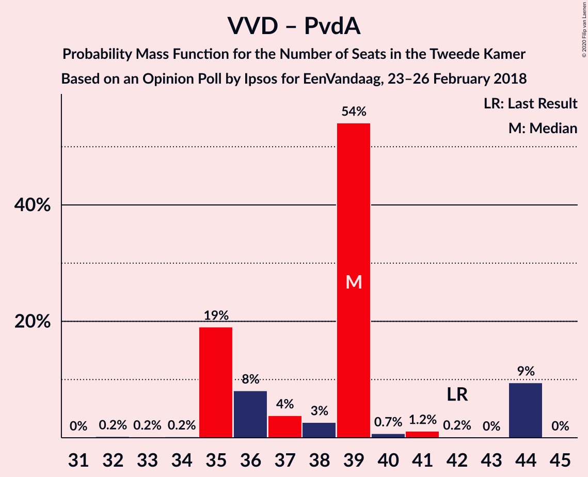

| Number of Seats | Probability | Accumulated | Special Marks |
|:---------------:|:-----------:|:-----------:|:-------------:|
| 32 | 0.2% | 100% |  |
| 33 | 0.2% | 99.7% |  |
| 34 | 0.2% | 99.5% |  |
| 35 | 19% | 99.3% |  |
| 36 | 8% | 80% |  |
| 37 | 4% | 72% |  |
| 38 | 3% | 68% |  |
| 39 | 54% | 66% | Median |
| 40 | 0.7% | 12% |  |
| 41 | 1.2% | 11% |  |
| 42 | 0.2% | 10% | Last Result |
| 43 | 0% | 10% |  |
| 44 | 9% | 10% |  |
| 45 | 0% | 0% |  |

### Democraten 66 – Christen-Democratisch Appèl

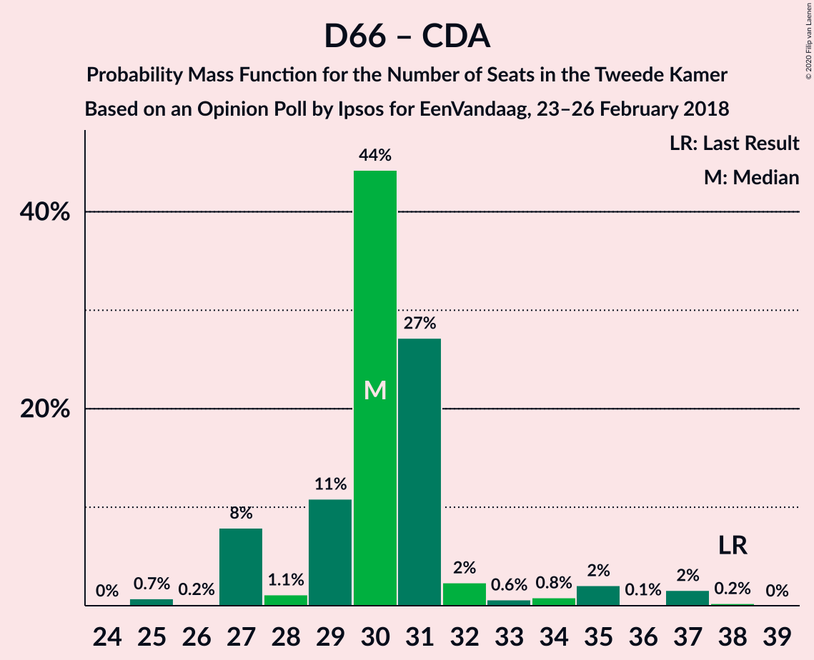

| Number of Seats | Probability | Accumulated | Special Marks |
|:---------------:|:-----------:|:-----------:|:-------------:|
| 25 | 0.7% | 100% |  |
| 26 | 0.2% | 99.3% |  |
| 27 | 8% | 99.1% |  |
| 28 | 1.1% | 91% |  |
| 29 | 11% | 90% |  |
| 30 | 44% | 79% | Median |
| 31 | 27% | 35% |  |
| 32 | 2% | 8% |  |
| 33 | 0.6% | 5% |  |
| 34 | 0.8% | 5% |  |
| 35 | 2% | 4% |  |
| 36 | 0.1% | 2% |  |
| 37 | 2% | 2% |  |
| 38 | 0.2% | 0.2% | Last Result |
| 39 | 0% | 0% |  |

### Christen-Democratisch Appèl – Partij van de Arbeid – ChristenUnie

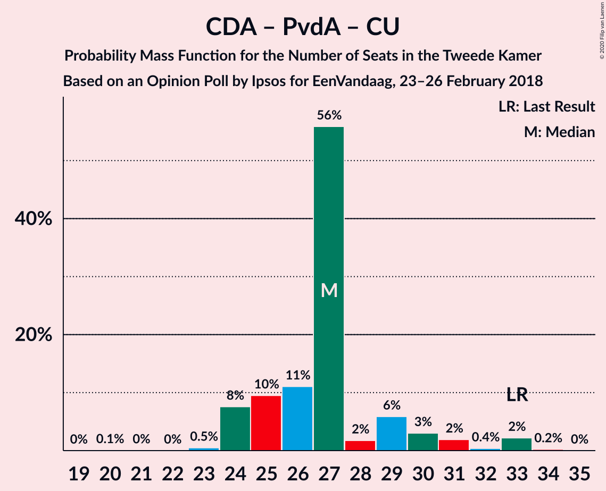

| Number of Seats | Probability | Accumulated | Special Marks |
|:---------------:|:-----------:|:-----------:|:-------------:|
| 20 | 0.1% | 100% |  |
| 21 | 0% | 99.9% |  |
| 22 | 0% | 99.9% |  |
| 23 | 0.5% | 99.9% |  |
| 24 | 8% | 99.4% |  |
| 25 | 10% | 92% |  |
| 26 | 11% | 82% |  |
| 27 | 56% | 71% | Median |
| 28 | 2% | 15% |  |
| 29 | 6% | 14% |  |
| 30 | 3% | 8% |  |
| 31 | 2% | 5% |  |
| 32 | 0.4% | 3% |  |
| 33 | 2% | 2% | Last Result |
| 34 | 0.2% | 0.2% |  |
| 35 | 0% | 0% |  |

### Christen-Democratisch Appèl – Partij van de Arbeid

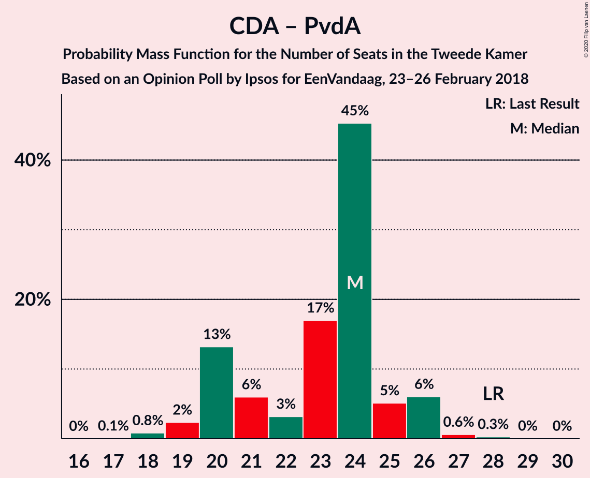

| Number of Seats | Probability | Accumulated | Special Marks |
|:---------------:|:-----------:|:-----------:|:-------------:|
| 17 | 0.1% | 100% |  |
| 18 | 0% | 99.9% |  |
| 19 | 9% | 99.9% |  |
| 20 | 14% | 91% |  |
| 21 | 2% | 78% |  |
| 22 | 19% | 75% |  |
| 23 | 43% | 56% | Median |
| 24 | 6% | 13% |  |
| 25 | 4% | 6% |  |
| 26 | 0.6% | 2% |  |
| 27 | 1.0% | 1.3% |  |
| 28 | 0.3% | 0.4% | Last Result |
| 29 | 0% | 0% |  |

## Technical Information

### Opinion Poll

+ **Polling firm:** Ipsos
+ **Commissioner(s):** EenVandaag
+ **Fieldwork period:** 23–26 February 2018

### Calculations

+ **Sample size:** 1026
+ **Simulations done:** 131,072
+ **Error estimate:** 2.77%

