# Opinion Poll by Kantar Public, 27 February–4 March 2018

<a href="#voting-intentions">Voting Intentions</a> | <a href="#seats">Seats</a> | <a href="#coalitions">Coalitions</a> | <a href="#technical-information">Technical Information</a>

## Voting Intentions

### Confidence Intervals

| Party | Last Result | Poll Result | 80% Confidence Interval | 90% Confidence Interval | 95% Confidence Interval | 99% Confidence Interval |
|:-----:|:-----------:|:-----------:|:-----------------------:|:-----------------------:|:-----------------------:|:-----------------------:|
| Volkspartij voor Vrijheid en Democratie | 21.3% | 20.0% | 18.5–21.6% |18.0–22.1% |17.7–22.5% |17.0–23.3% |
| Partij voor de Vrijheid | 13.1% | 10.6% | 9.5–11.9% |9.2–12.3% |8.9–12.6% |8.4–13.3% |
| GroenLinks | 9.1% | 10.6% | 9.5–11.9% |9.2–12.3% |8.9–12.6% |8.4–13.3% |
| Socialistische Partij | 9.1% | 10.6% | 9.5–11.9% |9.2–12.3% |8.9–12.6% |8.4–13.3% |
| Christen-Democratisch Appèl | 12.4% | 10.0% | 8.9–11.3% |8.6–11.7% |8.4–12.0% |7.8–12.7% |
| Democraten 66 | 12.2% | 10.0% | 8.9–11.3% |8.6–11.7% |8.4–12.0% |7.8–12.7% |
| Partij van de Arbeid | 5.7% | 6.0% | 5.2–7.1% |4.9–7.4% |4.7–7.6% |4.4–8.2% |
| Forum voor Democratie | 1.8% | 6.0% | 5.2–7.1% |4.9–7.4% |4.7–7.6% |4.4–8.2% |
| ChristenUnie | 3.4% | 4.0% | 3.3–4.9% |3.1–5.2% |3.0–5.4% |2.7–5.9% |
| Partij voor de Dieren | 3.2% | 4.0% | 3.3–4.9% |3.1–5.2% |3.0–5.4% |2.7–5.9% |
| 50Plus | 3.1% | 4.0% | 3.3–4.9% |3.1–5.2% |3.0–5.4% |2.7–5.9% |
| Staatkundig Gereformeerde Partij | 2.1% | 2.0% | 1.6–2.7% |1.4–2.9% |1.3–3.1% |1.1–3.4% |
| DENK | 2.1% | 2.0% | 1.6–2.7% |1.4–2.9% |1.3–3.1% |1.1–3.4% |

*Note:* The poll result column reflects the actual value used in the calculations. Published results may vary slightly, and in addition be rounded to fewer digits.

## Seats

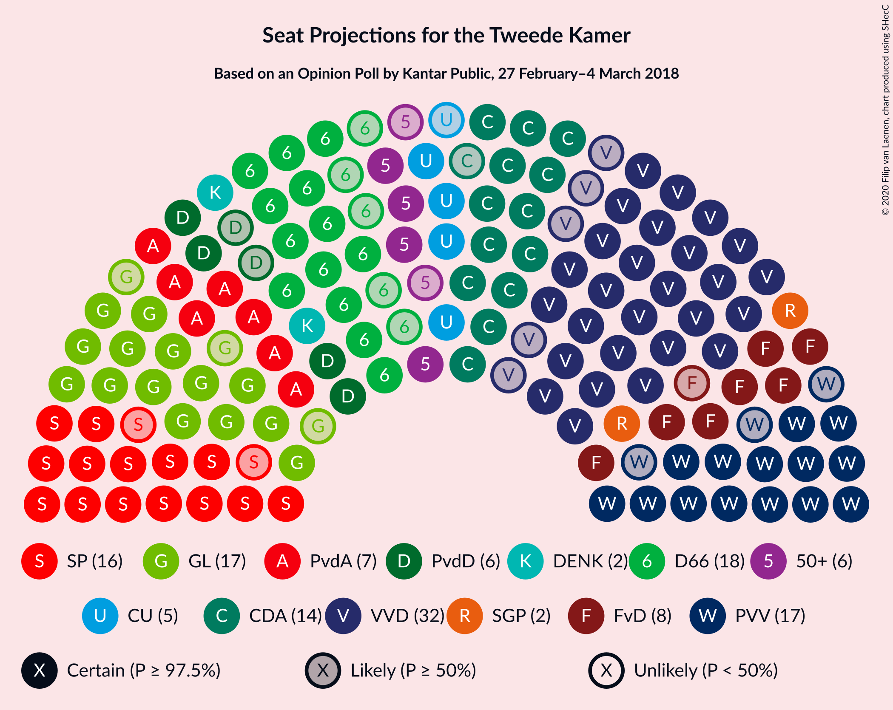

### Confidence Intervals

| Party | Last Result | Median | 80% Confidence Interval | 90% Confidence Interval | 95% Confidence Interval | 99% Confidence Interval |
|:-----:|:-----------:|:------:|:-----------------------:|:-----------------------:|:-----------------------:|:-----------------------:|
| <a href="#volkspartij-voor-vrijheid-en-democratie">Volkspartij voor Vrijheid en Democratie</a> | 33 | 30 | 30–31 |28–32 |26–35 |24–36 |
| <a href="#partij-voor-de-vrijheid">Partij voor de Vrijheid</a> | 20 | 16 | 14–16 |14–16 |13–18 |12–20 |
| <a href="#groenlinks">GroenLinks</a> | 14 | 15 | 14–18 |13–18 |13–19 |12–20 |
| <a href="#socialistische-partij">Socialistische Partij</a> | 14 | 15 | 14–17 |14–18 |14–19 |12–19 |
| <a href="#christen-democratisch-appèl">Christen-Democratisch Appèl</a> | 19 | 14 | 12–17 |12–17 |12–18 |10–19 |
| <a href="#democraten-66">Democraten 66</a> | 19 | 16 | 14–16 |14–16 |12–18 |12–18 |
| <a href="#partij-van-de-arbeid">Partij van de Arbeid</a> | 9 | 10 | 8–10 |7–10 |7–10 |6–13 |
| <a href="#forum-voor-democratie">Forum voor Democratie</a> | 2 | 9 | 8–10 |8–10 |8–10 |7–11 |
| <a href="#christenunie">ChristenUnie</a> | 5 | 5 | 5–7 |5–7 |4–7 |3–8 |
| <a href="#partij-voor-de-dieren">Partij voor de Dieren</a> | 5 | 6 | 5–6 |5–7 |4–8 |4–9 |
| <a href="#50plus">50Plus</a> | 4 | 7 | 4–7 |4–7 |4–8 |4–10 |
| <a href="#staatkundig-gereformeerde-partij">Staatkundig Gereformeerde Partij</a> | 3 | 3 | 3–4 |2–5 |2–5 |1–5 |
| <a href="#denk">DENK</a> | 3 | 3 | 3–5 |2–5 |1–5 |1–5 |

### Volkspartij voor Vrijheid en Democratie

*For a full overview of the results for this party, see the [Volkspartij voor Vrijheid en Democratie](party-volkspartijvoorvrijheidendemocratie.html) page.*

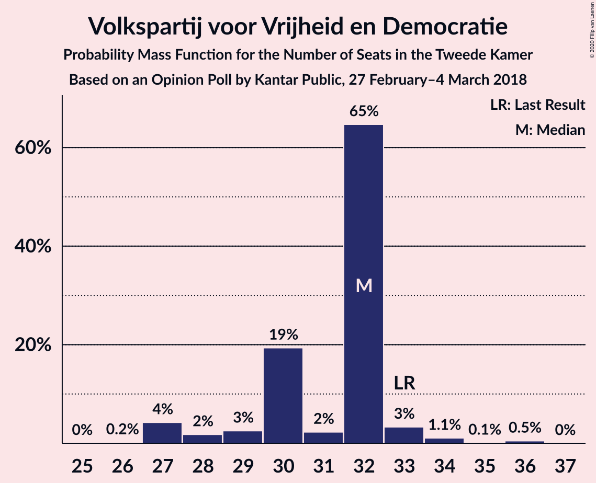

| Number of Seats | Probability | Accumulated | Special Marks |
|:---------------:|:-----------:|:-----------:|:-------------:|
| 24 | 0.9% | 100% |  |
| 25 | 0.1% | 99.1% |  |
| 26 | 3% | 99.0% |  |
| 27 | 0.9% | 96% |  |
| 28 | 0.4% | 95% |  |
| 29 | 3% | 95% |  |
| 30 | 81% | 92% | Median |
| 31 | 3% | 11% |  |
| 32 | 4% | 8% |  |
| 33 | 0% | 4% | Last Result |
| 34 | 0.1% | 4% |  |
| 35 | 3% | 4% |  |
| 36 | 1.2% | 1.2% |  |
| 37 | 0% | 0% |  |

### Partij voor de Vrijheid

*For a full overview of the results for this party, see the [Partij voor de Vrijheid](party-partijvoordevrijheid.html) page.*

| Number of Seats | Probability | Accumulated | Special Marks |
|:---------------:|:-----------:|:-----------:|:-------------:|
| 11 | 0.1% | 100% |  |
| 12 | 0.6% | 99.9% |  |
| 13 | 2% | 99.3% |  |
| 14 | 12% | 97% |  |
| 15 | 0.8% | 85% |  |
| 16 | 80% | 85% | Median |
| 17 | 2% | 5% |  |
| 18 | 1.3% | 3% |  |
| 19 | 0.3% | 1.3% |  |
| 20 | 1.0% | 1.0% | Last Result |
| 21 | 0% | 0% |  |

### GroenLinks

*For a full overview of the results for this party, see the [GroenLinks](party-groenlinks.html) page.*

| Number of Seats | Probability | Accumulated | Special Marks |
|:---------------:|:-----------:|:-----------:|:-------------:|
| 12 | 2% | 100% |  |
| 13 | 3% | 98% |  |
| 14 | 44% | 95% | Last Result |
| 15 | 5% | 50% | Median |
| 16 | 0.2% | 45% |  |
| 17 | 32% | 45% |  |
| 18 | 9% | 12% |  |
| 19 | 2% | 3% |  |
| 20 | 1.0% | 1.0% |  |
| 21 | 0% | 0% |  |

### Socialistische Partij

*For a full overview of the results for this party, see the [Socialistische Partij](party-socialistischepartij.html) page.*

| Number of Seats | Probability | Accumulated | Special Marks |
|:---------------:|:-----------:|:-----------:|:-------------:|
| 12 | 1.2% | 100% |  |
| 13 | 0.3% | 98.8% |  |
| 14 | 43% | 98% | Last Result |
| 15 | 10% | 55% | Median |
| 16 | 5% | 45% |  |
| 17 | 32% | 40% |  |
| 18 | 2% | 7% |  |
| 19 | 5% | 5% |  |
| 20 | 0.1% | 0.1% |  |
| 21 | 0% | 0% |  |

### Christen-Democratisch Appèl

*For a full overview of the results for this party, see the [Christen-Democratisch Appèl](party-christen-democratischappèl.html) page.*

| Number of Seats | Probability | Accumulated | Special Marks |
|:---------------:|:-----------:|:-----------:|:-------------:|
| 10 | 1.0% | 100% |  |
| 11 | 0.1% | 99.0% |  |
| 12 | 30% | 98.9% |  |
| 13 | 2% | 69% |  |
| 14 | 47% | 67% | Median |
| 15 | 1.1% | 20% |  |
| 16 | 4% | 19% |  |
| 17 | 11% | 15% |  |
| 18 | 2% | 4% |  |
| 19 | 2% | 2% | Last Result |
| 20 | 0% | 0% |  |

### Democraten 66

*For a full overview of the results for this party, see the [Democraten 66](party-democraten66.html) page.*

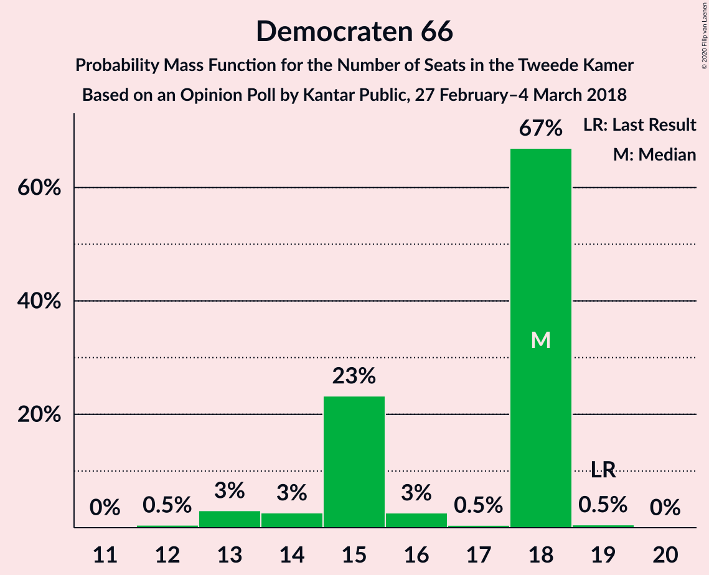

| Number of Seats | Probability | Accumulated | Special Marks |
|:---------------:|:-----------:|:-----------:|:-------------:|
| 11 | 0.2% | 100% |  |
| 12 | 3% | 99.8% |  |
| 13 | 2% | 97% |  |
| 14 | 9% | 95% |  |
| 15 | 33% | 86% |  |
| 16 | 49% | 53% | Median |
| 17 | 0.2% | 4% |  |
| 18 | 4% | 4% |  |
| 19 | 0.1% | 0.2% | Last Result |
| 20 | 0% | 0.1% |  |
| 21 | 0% | 0.1% |  |
| 22 | 0.1% | 0.1% |  |
| 23 | 0% | 0% |  |

### Partij van de Arbeid

*For a full overview of the results for this party, see the [Partij van de Arbeid](party-partijvandearbeid.html) page.*

| Number of Seats | Probability | Accumulated | Special Marks |
|:---------------:|:-----------:|:-----------:|:-------------:|
| 6 | 2% | 100% |  |
| 7 | 6% | 98% |  |
| 8 | 3% | 92% |  |
| 9 | 11% | 89% | Last Result |
| 10 | 77% | 79% | Median |
| 11 | 1.0% | 2% |  |
| 12 | 0.2% | 1.0% |  |
| 13 | 0.8% | 0.8% |  |
| 14 | 0% | 0% |  |

### Forum voor Democratie

*For a full overview of the results for this party, see the [Forum voor Democratie](party-forumvoordemocratie.html) page.*

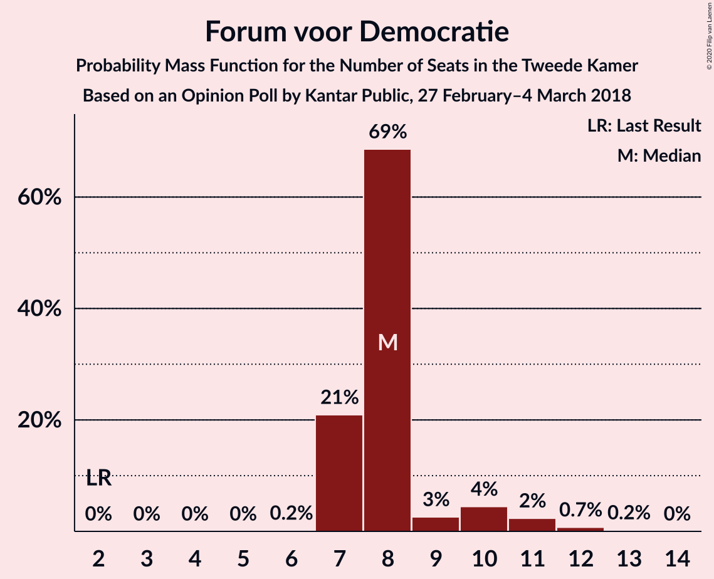

| Number of Seats | Probability | Accumulated | Special Marks |
|:---------------:|:-----------:|:-----------:|:-------------:|
| 2 | 0% | 100% | Last Result |
| 3 | 0% | 100% |  |
| 4 | 0% | 100% |  |
| 5 | 0% | 100% |  |
| 6 | 0.3% | 100% |  |
| 7 | 2% | 99.7% |  |
| 8 | 46% | 98% |  |
| 9 | 4% | 52% | Median |
| 10 | 45% | 48% |  |
| 11 | 2% | 2% |  |
| 12 | 0% | 0.1% |  |
| 13 | 0% | 0% |  |

### ChristenUnie

*For a full overview of the results for this party, see the [ChristenUnie](party-christenunie.html) page.*

| Number of Seats | Probability | Accumulated | Special Marks |
|:---------------:|:-----------:|:-----------:|:-------------:|
| 3 | 0.7% | 100% |  |
| 4 | 4% | 99.3% |  |
| 5 | 46% | 96% | Last Result, Median |
| 6 | 5% | 50% |  |
| 7 | 43% | 45% |  |
| 8 | 2% | 2% |  |
| 9 | 0.1% | 0.2% |  |
| 10 | 0.1% | 0.1% |  |
| 11 | 0% | 0% |  |

### Partij voor de Dieren

*For a full overview of the results for this party, see the [Partij voor de Dieren](party-partijvoordedieren.html) page.*

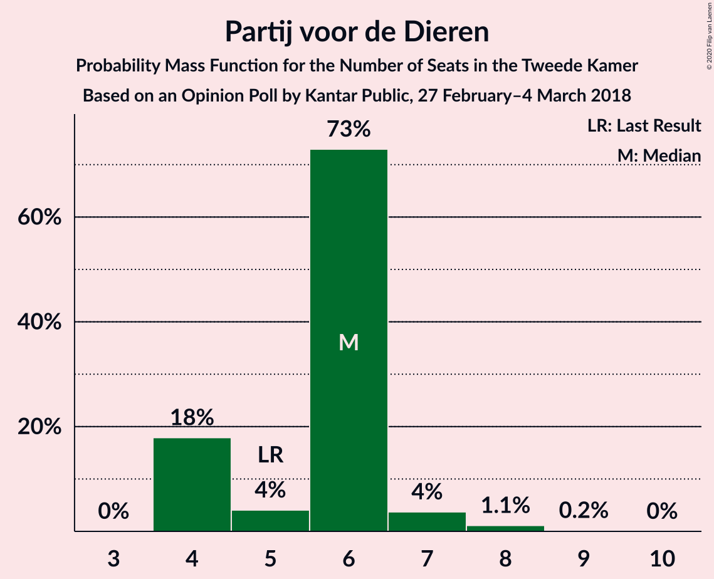

| Number of Seats | Probability | Accumulated | Special Marks |
|:---------------:|:-----------:|:-----------:|:-------------:|
| 3 | 0.3% | 100% |  |
| 4 | 5% | 99.7% |  |
| 5 | 33% | 95% | Last Result |
| 6 | 56% | 62% | Median |
| 7 | 4% | 7% |  |
| 8 | 0.7% | 3% |  |
| 9 | 2% | 2% |  |
| 10 | 0.2% | 0.2% |  |
| 11 | 0% | 0% |  |

### 50Plus

*For a full overview of the results for this party, see the [50Plus](party-50plus.html) page.*

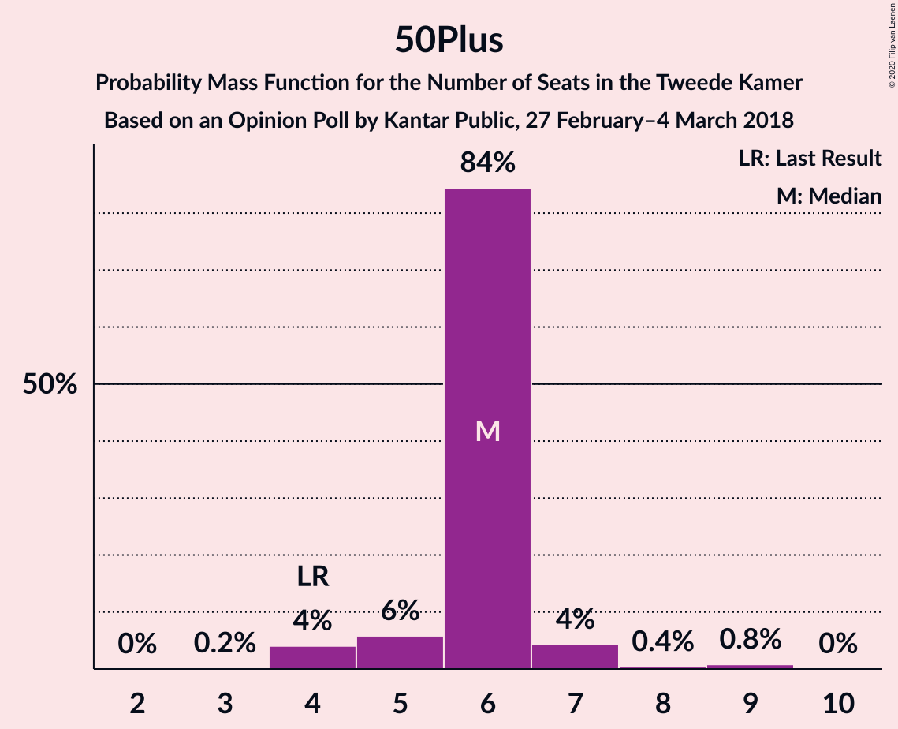

| Number of Seats | Probability | Accumulated | Special Marks |
|:---------------:|:-----------:|:-----------:|:-------------:|
| 3 | 0.1% | 100% |  |
| 4 | 10% | 99.9% | Last Result |
| 5 | 2% | 90% |  |
| 6 | 36% | 88% |  |
| 7 | 48% | 52% | Median |
| 8 | 1.2% | 4% |  |
| 9 | 1.1% | 2% |  |
| 10 | 1.4% | 1.4% |  |
| 11 | 0% | 0% |  |

### Staatkundig Gereformeerde Partij

*For a full overview of the results for this party, see the [Staatkundig Gereformeerde Partij](party-staatkundiggereformeerdepartij.html) page.*

| Number of Seats | Probability | Accumulated | Special Marks |
|:---------------:|:-----------:|:-----------:|:-------------:|
| 1 | 2% | 100% |  |
| 2 | 6% | 98% |  |
| 3 | 47% | 92% | Last Result, Median |
| 4 | 35% | 44% |  |
| 5 | 9% | 9% |  |
| 6 | 0% | 0% |  |

### DENK

*For a full overview of the results for this party, see the [DENK](party-denk.html) page.*

| Number of Seats | Probability | Accumulated | Special Marks |
|:---------------:|:-----------:|:-----------:|:-------------:|
| 1 | 3% | 100% |  |
| 2 | 3% | 97% |  |
| 3 | 45% | 94% | Last Result, Median |
| 4 | 6% | 48% |  |
| 5 | 42% | 42% |  |
| 6 | 0.1% | 0.1% |  |
| 7 | 0% | 0% |  |

## Coalitions

### Confidence Intervals

| Coalition | Last Result | Median | Majority? | 80% Confidence Interval | 90% Confidence Interval | 95% Confidence Interval | 99% Confidence Interval |
|:---------:|:-----------:|:------:|:---------:|:-----------------------:|:-----------------------:|:-----------------------:|:-----------------------:|
| Volkspartij voor Vrijheid en Democratie – GroenLinks – Christen-Democratisch Appèl – Democraten 66 – ChristenUnie | 90 | 81 | 99.9% | 79–86 | 79–86 | 79–86 | 78–87 |
| GroenLinks – Socialistische Partij – Christen-Democratisch Appèl – Democraten 66 – Partij van de Arbeid – ChristenUnie | 80 | 77 | 51% | 73–80 | 73–80 | 72–82 | 69–84 |
| Volkspartij voor Vrijheid en Democratie – Christen-Democratisch Appèl – Democraten 66 – Partij van de Arbeid – ChristenUnie | 85 | 75 | 20% | 74–77 | 74–78 | 72–79 | 68–82 |
| Volkspartij voor Vrijheid en Democratie – Partij voor de Vrijheid – Christen-Democratisch Appèl – Forum voor Democratie – Staatkundig Gereformeerde Partij | 77 | 73 | 6% | 70–74 | 69–77 | 69–78 | 66–82 |
| Volkspartij voor Vrijheid en Democratie – Partij voor de Vrijheid – Christen-Democratisch Appèl – Forum voor Democratie | 74 | 70 | 1.1% | 66–71 | 66–73 | 66–74 | 63–80 |
| Volkspartij voor Vrijheid en Democratie – Christen-Democratisch Appèl – Democraten 66 – ChristenUnie | 76 | 65 | 0% | 64–68 | 64–69 | 62–70 | 60–72 |
| Volkspartij voor Vrijheid en Democratie – Christen-Democratisch Appèl – Forum voor Democratie – 50Plus – Staatkundig Gereformeerde Partij | 61 | 64 | 0% | 60–65 | 60–67 | 60–67 | 56–71 |
| Volkspartij voor Vrijheid en Democratie – Partij voor de Vrijheid – Christen-Democratisch Appèl | 72 | 60 | 0% | 58–61 | 58–65 | 58–65 | 55–71 |
| Volkspartij voor Vrijheid en Democratie – Christen-Democratisch Appèl – Democraten 66 | 71 | 60 | 0% | 57–61 | 57–63 | 57–65 | 52–67 |
| GroenLinks – Christen-Democratisch Appèl – Democraten 66 – Partij van de Arbeid – ChristenUnie | 66 | 60 | 0% | 59–65 | 56–65 | 55–65 | 53–68 |
| Volkspartij voor Vrijheid en Democratie – Christen-Democratisch Appèl – Forum voor Democratie – 50Plus | 58 | 61 | 0% | 56–62 | 56–64 | 56–64 | 52–68 |
| Volkspartij voor Vrijheid en Democratie – Christen-Democratisch Appèl – Forum voor Democratie – Staatkundig Gereformeerde Partij | 57 | 57 | 0% | 54–60 | 53–61 | 53–61 | 49–63 |
| Volkspartij voor Vrijheid en Democratie – Christen-Democratisch Appèl – Partij van de Arbeid | 61 | 54 | 0% | 52–56 | 50–57 | 49–59 | 45–60 |
| Volkspartij voor Vrijheid en Democratie – Democraten 66 – Partij van de Arbeid | 61 | 55 | 0% | 53–56 | 53–56 | 51–58 | 47–60 |
| Volkspartij voor Vrijheid en Democratie – Christen-Democratisch Appèl – Forum voor Democratie | 54 | 54 | 0% | 50–56 | 50–57 | 50–58 | 45–60 |
| Volkspartij voor Vrijheid en Democratie – Christen-Democratisch Appèl | 52 | 44 | 0% | 42–47 | 42–49 | 42–50 | 37–51 |
| Christen-Democratisch Appèl – Democraten 66 – Partij van de Arbeid | 47 | 40 | 0% | 37–40 | 36–42 | 35–44 | 35–46 |
| Volkspartij voor Vrijheid en Democratie – Partij van de Arbeid | 42 | 40 | 0% | 39–40 | 38–42 | 33–42 | 32–44 |
| Christen-Democratisch Appèl – Democraten 66 | 38 | 30 | 0% | 27–31 | 27–34 | 27–34 | 26–36 |
| Christen-Democratisch Appèl – Partij van de Arbeid – ChristenUnie | 33 | 29 | 0% | 29–33 | 27–33 | 25–34 | 24–37 |
| Christen-Democratisch Appèl – Partij van de Arbeid | 28 | 24 | 0% | 22–26 | 21–27 | 20–28 | 19–30 |

### Volkspartij voor Vrijheid en Democratie – GroenLinks – Christen-Democratisch Appèl – Democraten 66 – ChristenUnie

| Number of Seats | Probability | Accumulated | Special Marks |
|:---------------:|:-----------:|:-----------:|:-------------:|
| 74 | 0.1% | 100% |  |
| 75 | 0% | 99.9% |  |
| 76 | 0% | 99.9% | Majority |
| 77 | 0% | 99.9% |  |
| 78 | 0.6% | 99.9% |  |
| 79 | 42% | 99.3% |  |
| 80 | 3% | 57% | Median |
| 81 | 35% | 54% |  |
| 82 | 3% | 19% |  |
| 83 | 2% | 16% |  |
| 84 | 3% | 14% |  |
| 85 | 0.7% | 11% |  |
| 86 | 9% | 10% |  |
| 87 | 1.0% | 1.3% |  |
| 88 | 0% | 0.4% |  |
| 89 | 0.3% | 0.3% |  |
| 90 | 0% | 0% | Last Result |

### GroenLinks – Socialistische Partij – Christen-Democratisch Appèl – Democraten 66 – Partij van de Arbeid – ChristenUnie

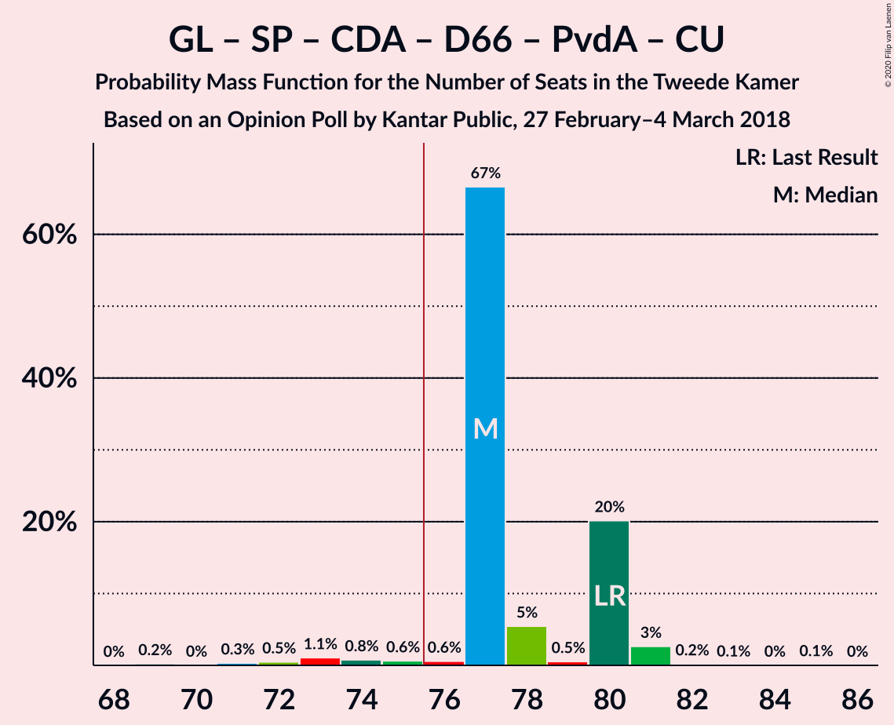

| Number of Seats | Probability | Accumulated | Special Marks |
|:---------------:|:-----------:|:-----------:|:-------------:|
| 69 | 2% | 100% |  |
| 70 | 0.2% | 98% |  |
| 71 | 0.2% | 98% |  |
| 72 | 2% | 98% |  |
| 73 | 42% | 96% |  |
| 74 | 2% | 54% |  |
| 75 | 0.4% | 52% | Median |
| 76 | 1.3% | 51% | Majority |
| 77 | 0.5% | 50% |  |
| 78 | 33% | 50% |  |
| 79 | 2% | 16% |  |
| 80 | 11% | 14% | Last Result |
| 81 | 0.1% | 4% |  |
| 82 | 3% | 4% |  |
| 83 | 0% | 0.8% |  |
| 84 | 0.7% | 0.8% |  |
| 85 | 0.1% | 0.1% |  |
| 86 | 0% | 0% |  |

### Volkspartij voor Vrijheid en Democratie – Christen-Democratisch Appèl – Democraten 66 – Partij van de Arbeid – ChristenUnie

| Number of Seats | Probability | Accumulated | Special Marks |
|:---------------:|:-----------:|:-----------:|:-------------:|
| 67 | 0.1% | 100% |  |
| 68 | 0.9% | 99.9% |  |
| 69 | 0% | 99.0% |  |
| 70 | 0% | 99.0% |  |
| 71 | 1.3% | 98.9% |  |
| 72 | 0.3% | 98% |  |
| 73 | 2% | 97% |  |
| 74 | 32% | 95% |  |
| 75 | 43% | 63% | Median |
| 76 | 2% | 20% | Majority |
| 77 | 12% | 17% |  |
| 78 | 3% | 5% |  |
| 79 | 0.9% | 3% |  |
| 80 | 0.8% | 2% |  |
| 81 | 0.3% | 0.8% |  |
| 82 | 0.5% | 0.5% |  |
| 83 | 0% | 0% |  |
| 84 | 0% | 0% |  |
| 85 | 0% | 0% | Last Result |

### Volkspartij voor Vrijheid en Democratie – Partij voor de Vrijheid – Christen-Democratisch Appèl – Forum voor Democratie – Staatkundig Gereformeerde Partij

| Number of Seats | Probability | Accumulated | Special Marks |
|:---------------:|:-----------:|:-----------:|:-------------:|
| 65 | 0.1% | 100% |  |
| 66 | 1.0% | 99.9% |  |
| 67 | 0.9% | 98.9% |  |
| 68 | 0.3% | 98% |  |
| 69 | 3% | 98% |  |
| 70 | 30% | 95% |  |
| 71 | 1.2% | 65% |  |
| 72 | 1.1% | 64% | Median |
| 73 | 47% | 63% |  |
| 74 | 9% | 16% |  |
| 75 | 0.6% | 7% |  |
| 76 | 0.3% | 6% | Majority |
| 77 | 3% | 6% | Last Result |
| 78 | 2% | 3% |  |
| 79 | 0% | 1.0% |  |
| 80 | 0.1% | 1.0% |  |
| 81 | 0% | 0.9% |  |
| 82 | 0.9% | 0.9% |  |
| 83 | 0% | 0% |  |

### Volkspartij voor Vrijheid en Democratie – Partij voor de Vrijheid – Christen-Democratisch Appèl – Forum voor Democratie

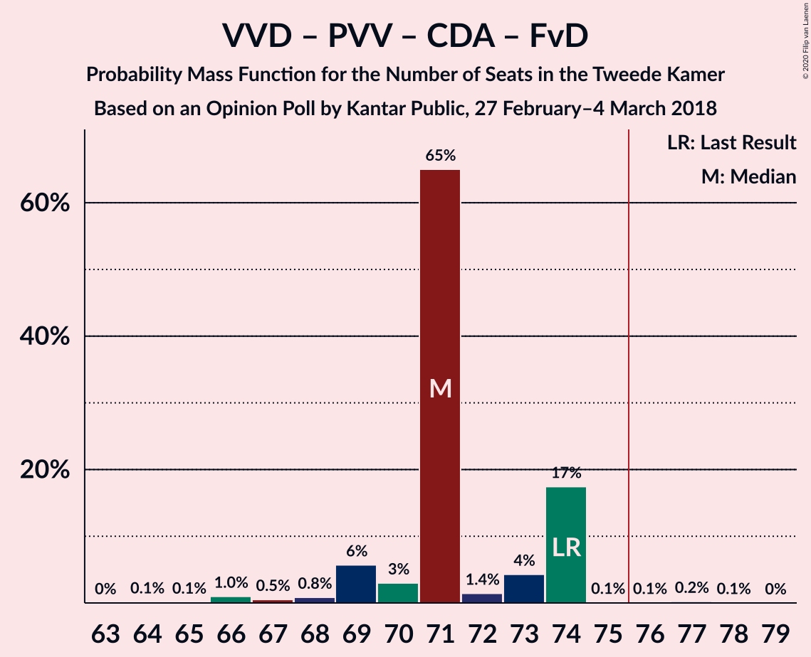

| Number of Seats | Probability | Accumulated | Special Marks |
|:---------------:|:-----------:|:-----------:|:-------------:|
| 63 | 1.0% | 100% |  |
| 64 | 1.1% | 99.0% |  |
| 65 | 0.1% | 98% |  |
| 66 | 32% | 98% |  |
| 67 | 0.5% | 65% |  |
| 68 | 0.8% | 65% |  |
| 69 | 10% | 64% | Median |
| 70 | 42% | 54% |  |
| 71 | 4% | 12% |  |
| 72 | 2% | 8% |  |
| 73 | 2% | 6% |  |
| 74 | 3% | 4% | Last Result |
| 75 | 0.2% | 1.2% |  |
| 76 | 0.1% | 1.1% | Majority |
| 77 | 0% | 1.0% |  |
| 78 | 0.1% | 1.0% |  |
| 79 | 0% | 0.9% |  |
| 80 | 0.9% | 0.9% |  |
| 81 | 0% | 0% |  |

### Volkspartij voor Vrijheid en Democratie – Christen-Democratisch Appèl – Democraten 66 – ChristenUnie

| Number of Seats | Probability | Accumulated | Special Marks |
|:---------------:|:-----------:|:-----------:|:-------------:|
| 59 | 0.1% | 100% |  |
| 60 | 1.0% | 99.9% |  |
| 61 | 0.2% | 98.9% |  |
| 62 | 2% | 98.7% |  |
| 63 | 0.1% | 97% |  |
| 64 | 30% | 97% |  |
| 65 | 43% | 67% | Median |
| 66 | 0.1% | 24% |  |
| 67 | 8% | 24% |  |
| 68 | 11% | 16% |  |
| 69 | 3% | 6% |  |
| 70 | 1.0% | 3% |  |
| 71 | 1.0% | 2% |  |
| 72 | 0.5% | 0.8% |  |
| 73 | 0% | 0.3% |  |
| 74 | 0.3% | 0.3% |  |
| 75 | 0% | 0% |  |
| 76 | 0% | 0% | Last Result, Majority |

### Volkspartij voor Vrijheid en Democratie – Christen-Democratisch Appèl – Forum voor Democratie – 50Plus – Staatkundig Gereformeerde Partij

| Number of Seats | Probability | Accumulated | Special Marks |
|:---------------:|:-----------:|:-----------:|:-------------:|
| 56 | 0.9% | 100% |  |
| 57 | 0.1% | 99.0% |  |
| 58 | 0.1% | 98.9% |  |
| 59 | 0.7% | 98.9% |  |
| 60 | 32% | 98% |  |
| 61 | 1.2% | 66% | Last Result |
| 62 | 0.9% | 64% |  |
| 63 | 2% | 64% | Median |
| 64 | 51% | 62% |  |
| 65 | 0.9% | 11% |  |
| 66 | 4% | 10% |  |
| 67 | 3% | 6% |  |
| 68 | 0% | 2% |  |
| 69 | 0.1% | 2% |  |
| 70 | 1.4% | 2% |  |
| 71 | 0.5% | 0.5% |  |
| 72 | 0% | 0% |  |

### Volkspartij voor Vrijheid en Democratie – Partij voor de Vrijheid – Christen-Democratisch Appèl

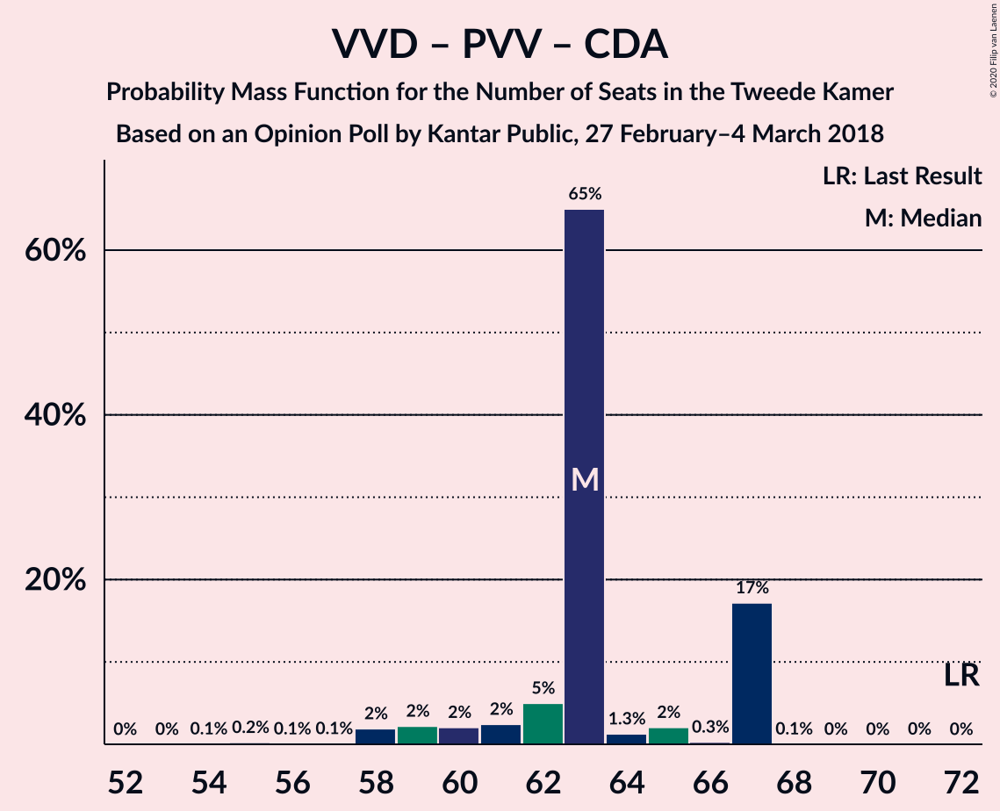

| Number of Seats | Probability | Accumulated | Special Marks |
|:---------------:|:-----------:|:-----------:|:-------------:|
| 53 | 0.1% | 100% |  |
| 54 | 0.1% | 99.9% |  |
| 55 | 2% | 99.8% |  |
| 56 | 0.1% | 98% |  |
| 57 | 0.2% | 98% |  |
| 58 | 32% | 98% |  |
| 59 | 1.4% | 65% |  |
| 60 | 44% | 64% | Median |
| 61 | 10% | 19% |  |
| 62 | 0% | 9% |  |
| 63 | 2% | 9% |  |
| 64 | 1.4% | 7% |  |
| 65 | 5% | 6% |  |
| 66 | 0.3% | 1.4% |  |
| 67 | 0.2% | 1.1% |  |
| 68 | 0% | 0.9% |  |
| 69 | 0% | 0.9% |  |
| 70 | 0% | 0.9% |  |
| 71 | 0.9% | 0.9% |  |
| 72 | 0% | 0% | Last Result |

### Volkspartij voor Vrijheid en Democratie – Christen-Democratisch Appèl – Democraten 66

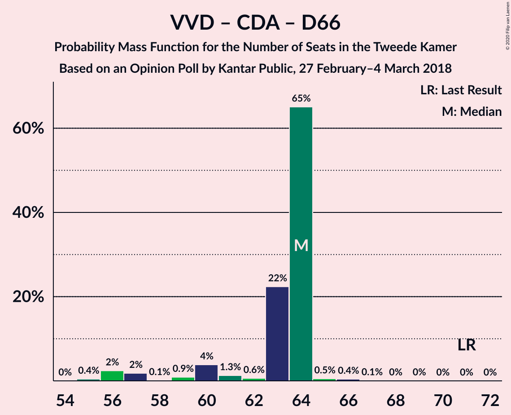

| Number of Seats | Probability | Accumulated | Special Marks |
|:---------------:|:-----------:|:-----------:|:-------------:|
| 52 | 1.0% | 100% |  |
| 53 | 0% | 99.0% |  |
| 54 | 0.1% | 99.0% |  |
| 55 | 0.2% | 98.9% |  |
| 56 | 0.1% | 98.7% |  |
| 57 | 31% | 98.6% |  |
| 58 | 0.1% | 68% |  |
| 59 | 1.1% | 68% |  |
| 60 | 45% | 66% | Median |
| 61 | 12% | 21% |  |
| 62 | 1.0% | 9% |  |
| 63 | 4% | 8% |  |
| 64 | 0% | 4% |  |
| 65 | 3% | 4% |  |
| 66 | 0% | 0.8% |  |
| 67 | 0.5% | 0.8% |  |
| 68 | 0% | 0.3% |  |
| 69 | 0.3% | 0.3% |  |
| 70 | 0% | 0% |  |
| 71 | 0% | 0% | Last Result |

### GroenLinks – Christen-Democratisch Appèl – Democraten 66 – Partij van de Arbeid – ChristenUnie

| Number of Seats | Probability | Accumulated | Special Marks |
|:---------------:|:-----------:|:-----------:|:-------------:|
| 53 | 2% | 100% |  |
| 54 | 0.2% | 98% |  |
| 55 | 2% | 98% |  |
| 56 | 1.0% | 96% |  |
| 57 | 0.1% | 95% |  |
| 58 | 0.4% | 95% |  |
| 59 | 43% | 95% |  |
| 60 | 2% | 52% | Median |
| 61 | 31% | 50% |  |
| 62 | 3% | 19% |  |
| 63 | 3% | 15% |  |
| 64 | 2% | 12% |  |
| 65 | 10% | 11% |  |
| 66 | 0.1% | 1.0% | Last Result |
| 67 | 0.1% | 0.8% |  |
| 68 | 0.7% | 0.7% |  |
| 69 | 0% | 0% |  |

### Volkspartij voor Vrijheid en Democratie – Christen-Democratisch Appèl – Forum voor Democratie – 50Plus

| Number of Seats | Probability | Accumulated | Special Marks |
|:---------------:|:-----------:|:-----------:|:-------------:|
| 52 | 0.9% | 100% |  |
| 53 | 0.1% | 99.1% |  |
| 54 | 0% | 99.0% |  |
| 55 | 0.4% | 98.9% |  |
| 56 | 30% | 98.6% |  |
| 57 | 3% | 69% |  |
| 58 | 0.5% | 66% | Last Result |
| 59 | 11% | 66% |  |
| 60 | 0.8% | 55% | Median |
| 61 | 42% | 54% |  |
| 62 | 4% | 12% |  |
| 63 | 2% | 8% |  |
| 64 | 4% | 6% |  |
| 65 | 0.4% | 2% |  |
| 66 | 0% | 2% |  |
| 67 | 0.6% | 2% |  |
| 68 | 1.3% | 1.4% |  |
| 69 | 0% | 0% |  |

### Volkspartij voor Vrijheid en Democratie – Christen-Democratisch Appèl – Forum voor Democratie – Staatkundig Gereformeerde Partij

| Number of Seats | Probability | Accumulated | Special Marks |
|:---------------:|:-----------:|:-----------:|:-------------:|
| 49 | 0.9% | 100% |  |
| 50 | 0% | 99.1% |  |
| 51 | 0.1% | 99.1% |  |
| 52 | 1.0% | 98.9% |  |
| 53 | 3% | 98% |  |
| 54 | 30% | 95% |  |
| 55 | 1.3% | 65% |  |
| 56 | 0.1% | 63% | Median |
| 57 | 44% | 63% | Last Result |
| 58 | 0.4% | 20% |  |
| 59 | 3% | 19% |  |
| 60 | 10% | 17% |  |
| 61 | 5% | 6% |  |
| 62 | 1.2% | 2% |  |
| 63 | 0.6% | 0.6% |  |
| 64 | 0% | 0% |  |

### Volkspartij voor Vrijheid en Democratie – Christen-Democratisch Appèl – Partij van de Arbeid

| Number of Seats | Probability | Accumulated | Special Marks |
|:---------------:|:-----------:|:-----------:|:-------------:|
| 45 | 0.9% | 100% |  |
| 46 | 0% | 99.1% |  |
| 47 | 0% | 99.1% |  |
| 48 | 0% | 99.1% |  |
| 49 | 3% | 99.0% |  |
| 50 | 1.1% | 96% |  |
| 51 | 0.1% | 95% |  |
| 52 | 32% | 95% |  |
| 53 | 0.5% | 63% |  |
| 54 | 42% | 63% | Median |
| 55 | 0.5% | 20% |  |
| 56 | 12% | 20% |  |
| 57 | 3% | 8% |  |
| 58 | 0.3% | 5% |  |
| 59 | 3% | 5% |  |
| 60 | 1.3% | 1.4% |  |
| 61 | 0% | 0% | Last Result |

### Volkspartij voor Vrijheid en Democratie – Democraten 66 – Partij van de Arbeid

| Number of Seats | Probability | Accumulated | Special Marks |
|:---------------:|:-----------:|:-----------:|:-------------:|
| 46 | 0.1% | 100% |  |
| 47 | 0.9% | 99.9% |  |
| 48 | 0.1% | 99.0% |  |
| 49 | 0% | 98.9% |  |
| 50 | 0.2% | 98.9% |  |
| 51 | 3% | 98.7% |  |
| 52 | 0.4% | 96% |  |
| 53 | 11% | 95% |  |
| 54 | 4% | 84% |  |
| 55 | 32% | 80% |  |
| 56 | 43% | 48% | Median |
| 57 | 0.3% | 5% |  |
| 58 | 3% | 5% |  |
| 59 | 0.5% | 2% |  |
| 60 | 1.0% | 1.3% |  |
| 61 | 0.3% | 0.3% | Last Result |
| 62 | 0% | 0% |  |

### Volkspartij voor Vrijheid en Democratie – Christen-Democratisch Appèl – Forum voor Democratie

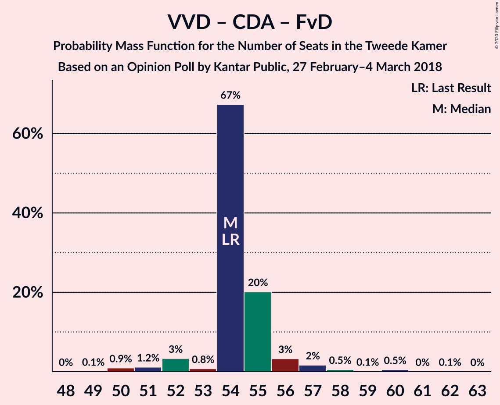

| Number of Seats | Probability | Accumulated | Special Marks |
|:---------------:|:-----------:|:-----------:|:-------------:|
| 45 | 0.9% | 100% |  |
| 46 | 0% | 99.1% |  |
| 47 | 0.1% | 99.1% |  |
| 48 | 0% | 99.0% |  |
| 49 | 0.4% | 99.0% |  |
| 50 | 33% | 98.6% |  |
| 51 | 0.1% | 65% |  |
| 52 | 1.1% | 65% |  |
| 53 | 0.3% | 64% | Median |
| 54 | 42% | 64% | Last Result |
| 55 | 9% | 21% |  |
| 56 | 2% | 12% |  |
| 57 | 6% | 10% |  |
| 58 | 2% | 4% |  |
| 59 | 0.8% | 2% |  |
| 60 | 0.9% | 1.0% |  |
| 61 | 0.1% | 0.1% |  |
| 62 | 0% | 0% |  |

### Volkspartij voor Vrijheid en Democratie – Christen-Democratisch Appèl

| Number of Seats | Probability | Accumulated | Special Marks |
|:---------------:|:-----------:|:-----------:|:-------------:|
| 37 | 1.0% | 100% |  |
| 38 | 0% | 99.0% |  |
| 39 | 0% | 99.0% |  |
| 40 | 0.1% | 99.0% |  |
| 41 | 1.0% | 98.9% |  |
| 42 | 33% | 98% |  |
| 43 | 0.9% | 65% |  |
| 44 | 43% | 64% | Median |
| 45 | 0.4% | 22% |  |
| 46 | 3% | 21% |  |
| 47 | 10% | 18% |  |
| 48 | 0.2% | 8% |  |
| 49 | 5% | 8% |  |
| 50 | 1.4% | 3% |  |
| 51 | 1.2% | 1.2% |  |
| 52 | 0% | 0% | Last Result |

### Christen-Democratisch Appèl – Democraten 66 – Partij van de Arbeid

| Number of Seats | Probability | Accumulated | Special Marks |
|:---------------:|:-----------:|:-----------:|:-------------:|
| 34 | 0.4% | 100% |  |
| 35 | 3% | 99.5% |  |
| 36 | 2% | 97% |  |
| 37 | 33% | 95% |  |
| 38 | 0.1% | 62% |  |
| 39 | 2% | 62% |  |
| 40 | 51% | 60% | Median |
| 41 | 3% | 9% |  |
| 42 | 2% | 6% |  |
| 43 | 0.9% | 4% |  |
| 44 | 1.3% | 3% |  |
| 45 | 0.1% | 1.3% |  |
| 46 | 1.2% | 1.2% |  |
| 47 | 0% | 0% | Last Result |

### Volkspartij voor Vrijheid en Democratie – Partij van de Arbeid

| Number of Seats | Probability | Accumulated | Special Marks |
|:---------------:|:-----------:|:-----------:|:-------------:|
| 32 | 0.9% | 100% |  |
| 33 | 3% | 99.1% |  |
| 34 | 0.1% | 96% |  |
| 35 | 0% | 96% |  |
| 36 | 0.2% | 96% |  |
| 37 | 0.6% | 96% |  |
| 38 | 3% | 95% |  |
| 39 | 10% | 92% |  |
| 40 | 73% | 82% | Median |
| 41 | 2% | 9% |  |
| 42 | 4% | 7% | Last Result |
| 43 | 1.3% | 2% |  |
| 44 | 1.1% | 1.1% |  |
| 45 | 0% | 0% |  |

### Christen-Democratisch Appèl – Democraten 66

| Number of Seats | Probability | Accumulated | Special Marks |
|:---------------:|:-----------:|:-----------:|:-------------:|
| 24 | 0.1% | 100% |  |
| 25 | 0% | 99.9% |  |
| 26 | 1.1% | 99.9% |  |
| 27 | 30% | 98.8% |  |
| 28 | 2% | 69% |  |
| 29 | 5% | 66% |  |
| 30 | 45% | 62% | Median |
| 31 | 9% | 17% |  |
| 32 | 2% | 8% |  |
| 33 | 0.4% | 6% |  |
| 34 | 4% | 6% |  |
| 35 | 0.7% | 1.3% |  |
| 36 | 0.6% | 0.7% |  |
| 37 | 0% | 0.1% |  |
| 38 | 0.1% | 0.1% | Last Result |
| 39 | 0% | 0% |  |

### Christen-Democratisch Appèl – Partij van de Arbeid – ChristenUnie

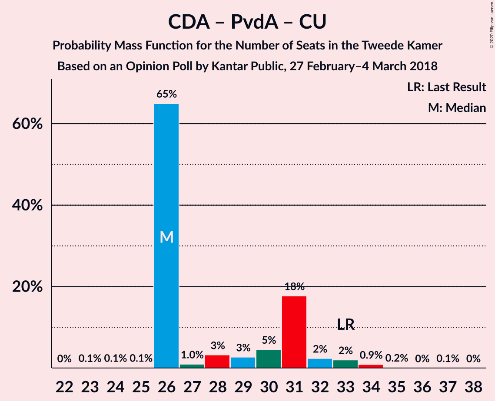

| Number of Seats | Probability | Accumulated | Special Marks |
|:---------------:|:-----------:|:-----------:|:-------------:|
| 24 | 1.0% | 100% |  |
| 25 | 2% | 99.0% |  |
| 26 | 2% | 97% |  |
| 27 | 2% | 95% |  |
| 28 | 0.3% | 93% |  |
| 29 | 73% | 93% | Median |
| 30 | 4% | 20% |  |
| 31 | 2% | 17% |  |
| 32 | 1.4% | 15% |  |
| 33 | 11% | 14% | Last Result |
| 34 | 2% | 3% |  |
| 35 | 0.2% | 1.0% |  |
| 36 | 0.1% | 0.8% |  |
| 37 | 0.7% | 0.7% |  |
| 38 | 0% | 0% |  |

### Christen-Democratisch Appèl – Partij van de Arbeid

| Number of Seats | Probability | Accumulated | Special Marks |
|:---------------:|:-----------:|:-----------:|:-------------:|
| 19 | 1.3% | 100% |  |
| 20 | 2% | 98.7% |  |
| 21 | 4% | 97% |  |
| 22 | 30% | 93% |  |
| 23 | 3% | 63% |  |
| 24 | 43% | 59% | Median |
| 25 | 0.3% | 16% |  |
| 26 | 9% | 16% |  |
| 27 | 2% | 7% |  |
| 28 | 2% | 4% | Last Result |
| 29 | 1.4% | 2% |  |
| 30 | 0.8% | 0.8% |  |
| 31 | 0% | 0% |  |

## Technical Information

### Opinion Poll

+ **Polling firm:** Kantar Public
+ **Commissioner(s):** —
+ **Fieldwork period:** 27 February–4 March 2018

### Calculations

+ **Sample size:** 1046
+ **Simulations done:** 131,072
+ **Error estimate:** 2.30%

