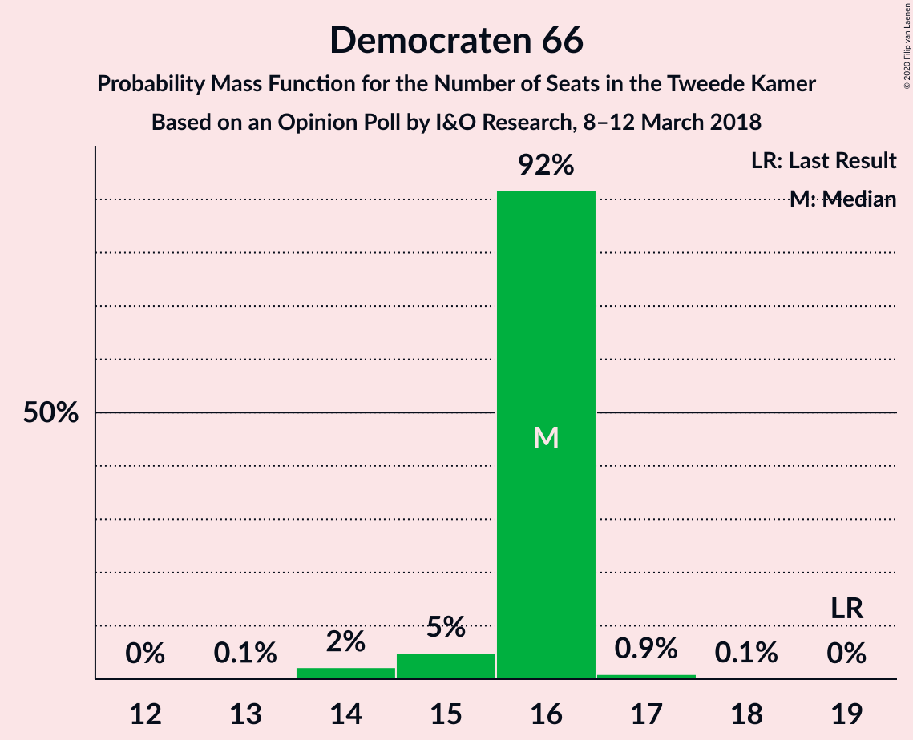
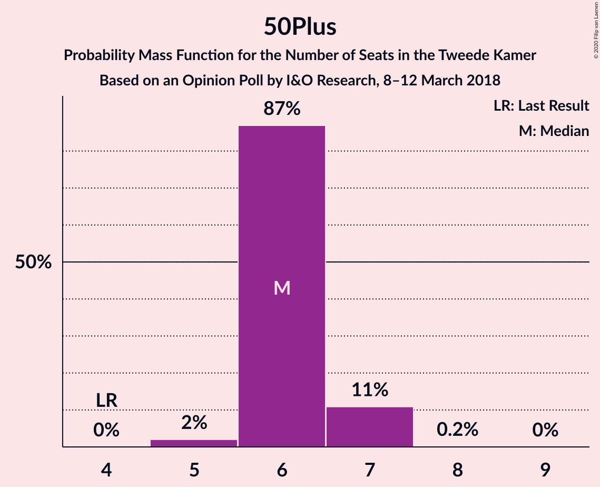
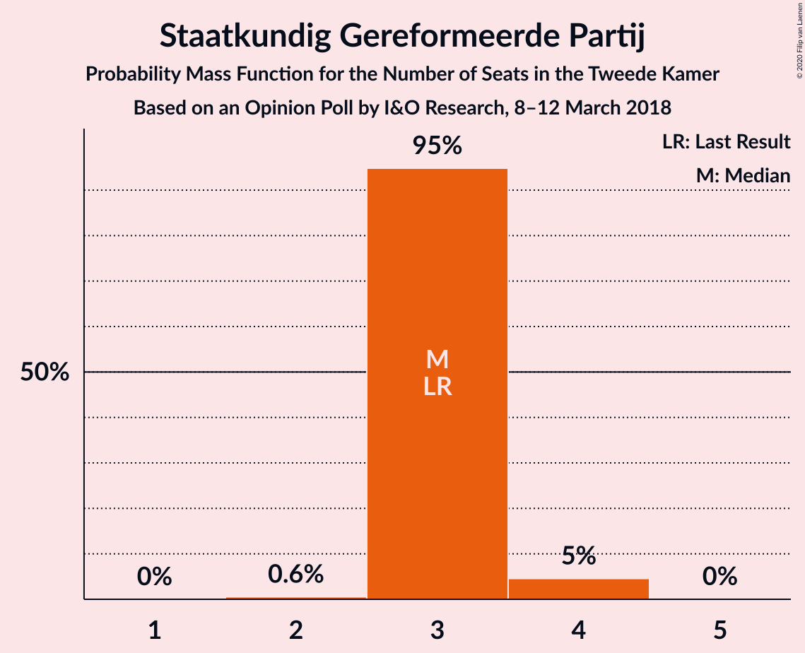
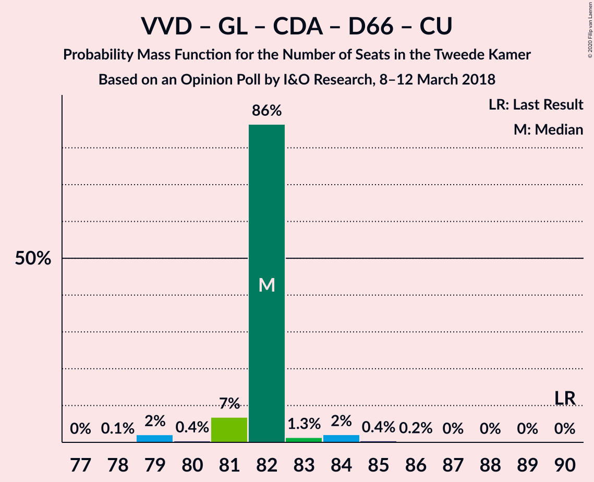
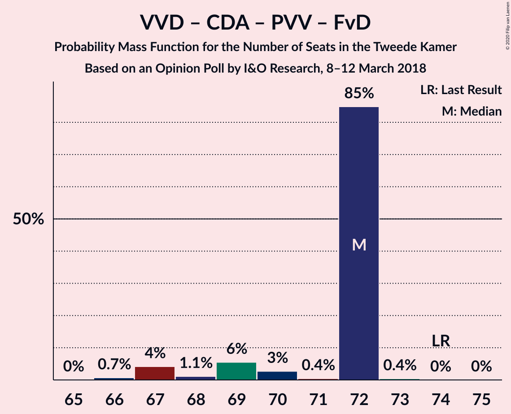
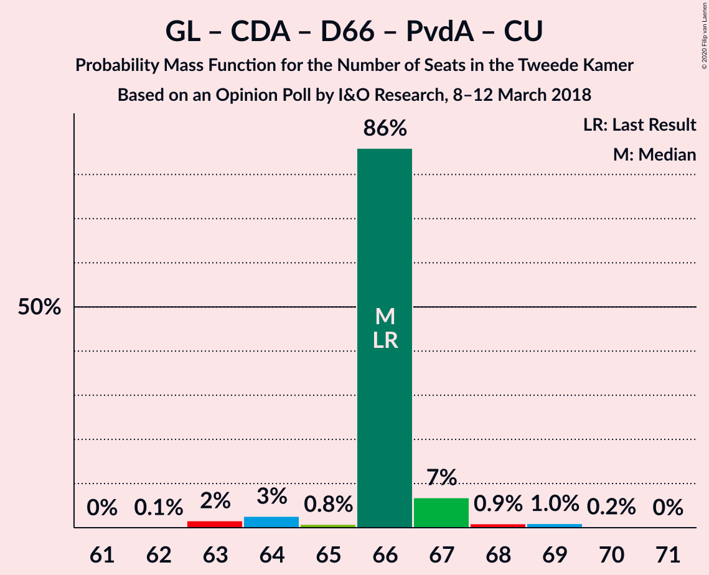
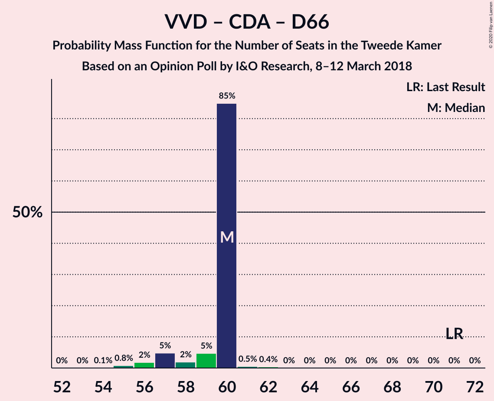
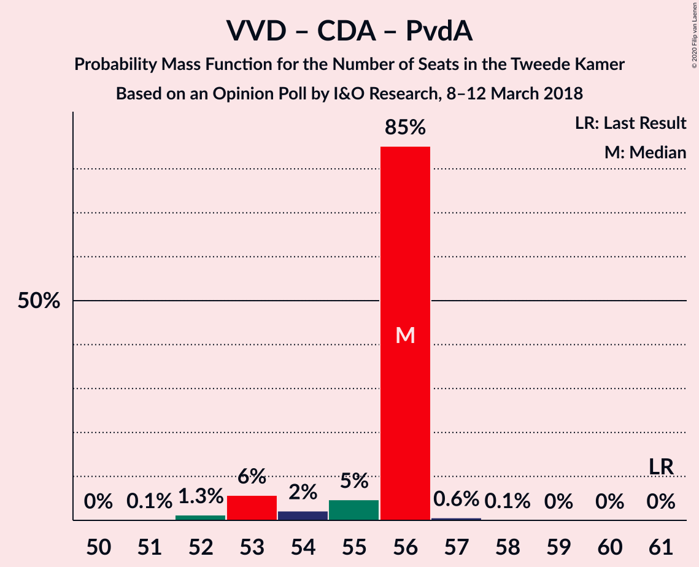
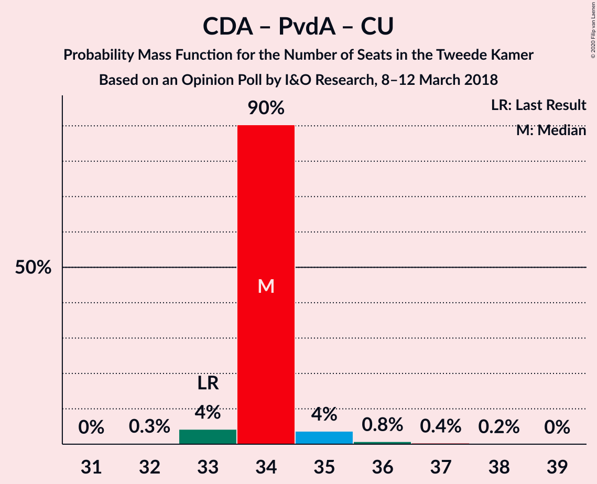

# Opinion Poll by I&O Research, 8–12 March 2018

<a href="#voting-intentions">Voting Intentions</a> | <a href="#seats">Seats</a> | <a href="#coalitions">Coalitions</a> | <a href="#technical-information">Technical Information</a>

## Voting Intentions

### Confidence Intervals

| Party | Last Result | Poll Result | 80% Confidence Interval | 90% Confidence Interval | 95% Confidence Interval | 99% Confidence Interval |
|:-----:|:-----------:|:-----------:|:-----------------------:|:-----------------------:|:-----------------------:|:-----------------------:|
| Volkspartij voor Vrijheid en Democratie | 21.3% | 17.7% | 16.9–18.6% |16.6–18.8% |16.4–19.0% |16.0–19.4% |
| GroenLinks | 9.1% | 10.7% | 10.0–11.4% |9.8–11.6% |9.7–11.8% |9.4–12.1% |
| Partij voor de Vrijheid | 13.1% | 10.5% | 9.8–11.2% |9.6–11.4% |9.5–11.6% |9.2–11.9% |
| Christen-Democratisch Appèl | 12.4% | 10.5% | 9.8–11.2% |9.6–11.4% |9.5–11.6% |9.2–11.9% |
| Democraten 66 | 12.2% | 10.2% | 9.5–10.9% |9.4–11.1% |9.2–11.3% |8.9–11.6% |
| Socialistische Partij | 9.1% | 8.4% | 7.8–9.1% |7.7–9.3% |7.5–9.4% |7.2–9.7% |
| Partij van de Arbeid | 5.7% | 7.6% | 7.1–8.2% |6.9–8.4% |6.8–8.6% |6.5–8.9% |
| Forum voor Democratie | 1.8% | 6.8% | 6.3–7.4% |6.1–7.6% |6.0–7.7% |5.8–8.0% |
| ChristenUnie | 3.4% | 5.0% | 4.6–5.5% |4.4–5.7% |4.3–5.8% |4.1–6.1% |
| 50Plus | 3.1% | 4.2% | 3.8–4.7% |3.7–4.8% |3.6–5.0% |3.4–5.2% |
| Partij voor de Dieren | 3.2% | 3.6% | 3.2–4.1% |3.1–4.2% |3.0–4.3% |2.9–4.5% |
| Staatkundig Gereformeerde Partij | 2.1% | 2.3% | 2.0–2.7% |1.9–2.8% |1.8–2.9% |1.7–3.1% |
| DENK | 2.1% | 2.0% | 1.7–2.4% |1.6–2.5% |1.6–2.6% |1.5–2.7% |

*Note:* The poll result column reflects the actual value used in the calculations. Published results may vary slightly, and in addition be rounded to fewer digits.

## Seats

### Confidence Intervals

| Party | Last Result | Median | 80% Confidence Interval | 90% Confidence Interval | 95% Confidence Interval | 99% Confidence Interval |
|:-----:|:-----------:|:------:|:-----------------------:|:-----------------------:|:-----------------------:|:-----------------------:|
| <a href="#volkspartij-voor-vrijheid-en-democratie">Volkspartij voor Vrijheid en Democratie</a> | 33 | 27 | 25–28 |25–28 |24–28 |24–29 |
| <a href="#groenlinks">GroenLinks</a> | 14 | 17 | 15–17 |15–18 |14–18 |14–19 |
| <a href="#partij-voor-de-vrijheid">Partij voor de Vrijheid</a> | 20 | 16 | 15–17 |15–17 |15–19 |14–19 |
| <a href="#christen-democratisch-appèl">Christen-Democratisch Appèl</a> | 19 | 16 | 15–17 |15–18 |15–18 |14–18 |
| <a href="#democraten-66">Democraten 66</a> | 19 | 16 | 14–17 |14–17 |13–17 |13–17 |
| <a href="#socialistische-partij">Socialistische Partij</a> | 14 | 13 | 12–15 |12–15 |12–15 |11–15 |
| <a href="#partij-van-de-arbeid">Partij van de Arbeid</a> | 9 | 12 | 10–13 |9–13 |9–13 |9–13 |
| <a href="#forum-voor-democratie">Forum voor Democratie</a> | 2 | 10 | 9–11 |9–11 |9–12 |9–12 |
| <a href="#christenunie">ChristenUnie</a> | 5 | 7 | 6–9 |6–9 |6–9 |6–9 |
| <a href="#50plus">50Plus</a> | 4 | 6 | 5–7 |5–8 |5–8 |4–8 |
| <a href="#partij-voor-de-dieren">Partij voor de Dieren</a> | 5 | 6 | 4–6 |4–6 |4–6 |4–6 |
| <a href="#staatkundig-gereformeerde-partij">Staatkundig Gereformeerde Partij</a> | 3 | 3 | 3–4 |2–4 |2–4 |2–5 |
| <a href="#denk">DENK</a> | 3 | 3 | 2–3 |2–4 |2–4 |2–4 |

### Volkspartij voor Vrijheid en Democratie

*For a full overview of the results for this party, see the [Volkspartij voor Vrijheid en Democratie](party-volkspartijvoorvrijheidendemocratie.html) page.*

| Number of Seats | Probability | Accumulated | Special Marks |
|:---------------:|:-----------:|:-----------:|:-------------:|
| 23 | 0.1% | 100% |  |
| 24 | 4% | 99.9% |  |
| 25 | 11% | 96% |  |
| 26 | 27% | 85% |  |
| 27 | 21% | 58% | Median |
| 28 | 35% | 37% |  |
| 29 | 2% | 2% |  |
| 30 | 0.3% | 0.3% |  |
| 31 | 0.1% | 0.1% |  |
| 32 | 0% | 0% |  |
| 33 | 0% | 0% | Last Result |

### GroenLinks

*For a full overview of the results for this party, see the [GroenLinks](party-groenlinks.html) page.*

| Number of Seats | Probability | Accumulated | Special Marks |
|:---------------:|:-----------:|:-----------:|:-------------:|
| 14 | 4% | 100% | Last Result |
| 15 | 14% | 96% |  |
| 16 | 31% | 82% |  |
| 17 | 41% | 51% | Median |
| 18 | 8% | 9% |  |
| 19 | 1.4% | 1.4% |  |
| 20 | 0% | 0% |  |

### Partij voor de Vrijheid

*For a full overview of the results for this party, see the [Partij voor de Vrijheid](party-partijvoordevrijheid.html) page.*

| Number of Seats | Probability | Accumulated | Special Marks |
|:---------------:|:-----------:|:-----------:|:-------------:|
| 14 | 0.9% | 100% |  |
| 15 | 22% | 99.1% |  |
| 16 | 66% | 77% | Median |
| 17 | 7% | 11% |  |
| 18 | 1.0% | 5% |  |
| 19 | 4% | 4% |  |
| 20 | 0.1% | 0.1% | Last Result |
| 21 | 0% | 0% |  |

### Christen-Democratisch Appèl

*For a full overview of the results for this party, see the [Christen-Democratisch Appèl](party-christen-democratischappèl.html) page.*

| Number of Seats | Probability | Accumulated | Special Marks |
|:---------------:|:-----------:|:-----------:|:-------------:|
| 12 | 0.1% | 100% |  |
| 13 | 0% | 99.9% |  |
| 14 | 0.6% | 99.9% |  |
| 15 | 30% | 99.3% |  |
| 16 | 51% | 69% | Median |
| 17 | 9% | 18% |  |
| 18 | 9% | 9% |  |
| 19 | 0% | 0% | Last Result |

### Democraten 66

*For a full overview of the results for this party, see the [Democraten 66](party-democraten66.html) page.*

| Number of Seats | Probability | Accumulated | Special Marks |
|:---------------:|:-----------:|:-----------:|:-------------:|
| 13 | 3% | 100% |  |
| 14 | 38% | 97% |  |
| 15 | 9% | 59% |  |
| 16 | 17% | 50% | Median |
| 17 | 33% | 33% |  |
| 18 | 0.3% | 0.3% |  |
| 19 | 0% | 0% | Last Result |

### Socialistische Partij

*For a full overview of the results for this party, see the [Socialistische Partij](party-socialistischepartij.html) page.*

| Number of Seats | Probability | Accumulated | Special Marks |
|:---------------:|:-----------:|:-----------:|:-------------:|
| 10 | 0.3% | 100% |  |
| 11 | 2% | 99.7% |  |
| 12 | 38% | 98% |  |
| 13 | 14% | 59% | Median |
| 14 | 28% | 45% | Last Result |
| 15 | 17% | 17% |  |
| 16 | 0% | 0% |  |

### Partij van de Arbeid

*For a full overview of the results for this party, see the [Partij van de Arbeid](party-partijvandearbeid.html) page.*

| Number of Seats | Probability | Accumulated | Special Marks |
|:---------------:|:-----------:|:-----------:|:-------------:|
| 9 | 8% | 100% | Last Result |
| 10 | 24% | 92% |  |
| 11 | 13% | 69% |  |
| 12 | 45% | 55% | Median |
| 13 | 10% | 10% |  |
| 14 | 0.1% | 0.1% |  |
| 15 | 0% | 0% |  |

### Forum voor Democratie

*For a full overview of the results for this party, see the [Forum voor Democratie](party-forumvoordemocratie.html) page.*

| Number of Seats | Probability | Accumulated | Special Marks |
|:---------------:|:-----------:|:-----------:|:-------------:|
| 2 | 0% | 100% | Last Result |
| 3 | 0% | 100% |  |
| 4 | 0% | 100% |  |
| 5 | 0% | 100% |  |
| 6 | 0% | 100% |  |
| 7 | 0% | 100% |  |
| 8 | 0.1% | 100% |  |
| 9 | 36% | 99.9% |  |
| 10 | 17% | 64% | Median |
| 11 | 43% | 47% |  |
| 12 | 3% | 3% |  |
| 13 | 0.2% | 0.2% |  |
| 14 | 0% | 0% |  |

### ChristenUnie

*For a full overview of the results for this party, see the [ChristenUnie](party-christenunie.html) page.*

| Number of Seats | Probability | Accumulated | Special Marks |
|:---------------:|:-----------:|:-----------:|:-------------:|
| 5 | 0% | 100% | Last Result |
| 6 | 21% | 100% |  |
| 7 | 37% | 79% | Median |
| 8 | 30% | 41% |  |
| 9 | 11% | 11% |  |
| 10 | 0% | 0% |  |

### 50Plus

*For a full overview of the results for this party, see the [50Plus](party-50plus.html) page.*

| Number of Seats | Probability | Accumulated | Special Marks |
|:---------------:|:-----------:|:-----------:|:-------------:|
| 4 | 0.7% | 100% | Last Result |
| 5 | 25% | 99.3% |  |
| 6 | 38% | 75% | Median |
| 7 | 31% | 37% |  |
| 8 | 6% | 6% |  |
| 9 | 0% | 0% |  |

### Partij voor de Dieren

*For a full overview of the results for this party, see the [Partij voor de Dieren](party-partijvoordedieren.html) page.*

| Number of Seats | Probability | Accumulated | Special Marks |
|:---------------:|:-----------:|:-----------:|:-------------:|
| 4 | 22% | 100% |  |
| 5 | 28% | 78% | Last Result |
| 6 | 50% | 50% | Median |
| 7 | 0.1% | 0.1% |  |
| 8 | 0% | 0% |  |

### Staatkundig Gereformeerde Partij

*For a full overview of the results for this party, see the [Staatkundig Gereformeerde Partij](party-staatkundiggereformeerdepartij.html) page.*

| Number of Seats | Probability | Accumulated | Special Marks |
|:---------------:|:-----------:|:-----------:|:-------------:|
| 2 | 8% | 100% |  |
| 3 | 72% | 92% | Last Result, Median |
| 4 | 18% | 20% |  |
| 5 | 2% | 2% |  |
| 6 | 0% | 0% |  |

### DENK

*For a full overview of the results for this party, see the [DENK](party-denk.html) page.*

| Number of Seats | Probability | Accumulated | Special Marks |
|:---------------:|:-----------:|:-----------:|:-------------:|
| 2 | 27% | 100% |  |
| 3 | 66% | 73% | Last Result, Median |
| 4 | 7% | 7% |  |
| 5 | 0% | 0% |  |

## Coalitions

### Confidence Intervals

| Coalition | Last Result | Median | Majority? | 80% Confidence Interval | 90% Confidence Interval | 95% Confidence Interval | 99% Confidence Interval |
|:---------:|:-----------:|:------:|:---------:|:-----------------------:|:-----------------------:|:-----------------------:|:-----------------------:|
| Volkspartij voor Vrijheid en Democratie – GroenLinks – Christen-Democratisch Appèl – Democraten 66 – ChristenUnie | 90 | 82 | 100% | 80–85 | 79–85 | 79–86 | 78–86 |
| GroenLinks – Christen-Democratisch Appèl – Democraten 66 – Socialistische Partij – Partij van de Arbeid – ChristenUnie | 80 | 80 | 98.9% | 78–81 | 78–82 | 76–82 | 74–84 |
| Volkspartij voor Vrijheid en Democratie – Christen-Democratisch Appèl – Democraten 66 – Partij van de Arbeid – ChristenUnie | 85 | 77 | 90% | 75–78 | 74–79 | 74–79 | 73–82 |
| Volkspartij voor Vrijheid en Democratie – Christen-Democratisch Appèl – Partij voor de Vrijheid – Forum voor Democratie – Staatkundig Gereformeerde Partij | 77 | 73 | 5% | 70–74 | 70–75 | 70–76 | 68–77 |
| Volkspartij voor Vrijheid en Democratie – Christen-Democratisch Appèl – Partij voor de Vrijheid – Forum voor Democratie | 74 | 70 | 0% | 67–70 | 66–72 | 66–73 | 64–74 |
| GroenLinks – Christen-Democratisch Appèl – Democraten 66 – Partij van de Arbeid – ChristenUnie | 66 | 67 | 0% | 64–68 | 64–69 | 64–69 | 63–71 |
| Volkspartij voor Vrijheid en Democratie – Christen-Democratisch Appèl – Democraten 66 – ChristenUnie | 76 | 65 | 0% | 64–68 | 63–69 | 63–69 | 61–70 |
| Volkspartij voor Vrijheid en Democratie – Christen-Democratisch Appèl – Forum voor Democratie – 50Plus – Staatkundig Gereformeerde Partij | 61 | 62 | 0% | 61–64 | 60–64 | 59–65 | 58–65 |
| Volkspartij voor Vrijheid en Democratie – Christen-Democratisch Appèl – Partij voor de Vrijheid | 72 | 59 | 0% | 57–61 | 56–62 | 56–63 | 55–63 |
| Volkspartij voor Vrijheid en Democratie – Christen-Democratisch Appèl – Forum voor Democratie – 50Plus | 58 | 59 | 0% | 58–60 | 58–60 | 56–62 | 54–63 |
| Volkspartij voor Vrijheid en Democratie – Christen-Democratisch Appèl – Democraten 66 | 71 | 58 | 0% | 56–60 | 56–62 | 55–62 | 54–62 |
| Volkspartij voor Vrijheid en Democratie – Christen-Democratisch Appèl – Forum voor Democratie – Staatkundig Gereformeerde Partij | 57 | 57 | 0% | 54–58 | 54–58 | 53–58 | 53–61 |
| Volkspartij voor Vrijheid en Democratie – Christen-Democratisch Appèl – Partij van de Arbeid | 61 | 54 | 0% | 52–55 | 52–57 | 51–57 | 51–59 |
| Volkspartij voor Vrijheid en Democratie – Democraten 66 – Partij van de Arbeid | 61 | 54 | 0% | 52–55 | 51–55 | 51–56 | 50–56 |
| Volkspartij voor Vrijheid en Democratie – Christen-Democratisch Appèl – Forum voor Democratie | 54 | 54 | 0% | 51–55 | 50–55 | 50–56 | 49–58 |
| Christen-Democratisch Appèl – Democraten 66 – Partij van de Arbeid | 47 | 43 | 0% | 40–45 | 40–45 | 40–45 | 39–46 |
| Volkspartij voor Vrijheid en Democratie – Christen-Democratisch Appèl | 52 | 43 | 0% | 40–45 | 40–45 | 40–45 | 40–47 |
| Volkspartij voor Vrijheid en Democratie – Partij van de Arbeid | 42 | 38 | 0% | 36–40 | 36–40 | 35–40 | 35–41 |
| Christen-Democratisch Appèl – Partij van de Arbeid – ChristenUnie | 33 | 34 | 0% | 34–36 | 34–37 | 33–37 | 32–38 |
| Christen-Democratisch Appèl – Democraten 66 | 38 | 31 | 0% | 29–33 | 29–35 | 29–35 | 28–35 |
| Christen-Democratisch Appèl – Partij van de Arbeid | 28 | 27 | 0% | 26–28 | 26–30 | 25–30 | 25–30 |

### Volkspartij voor Vrijheid en Democratie – GroenLinks – Christen-Democratisch Appèl – Democraten 66 – ChristenUnie

| Number of Seats | Probability | Accumulated | Special Marks |
|:---------------:|:-----------:|:-----------:|:-------------:|
| 78 | 1.4% | 100% |  |
| 79 | 7% | 98.6% |  |
| 80 | 9% | 92% |  |
| 81 | 18% | 83% |  |
| 82 | 47% | 64% |  |
| 83 | 4% | 17% | Median |
| 84 | 0.5% | 13% |  |
| 85 | 8% | 12% |  |
| 86 | 4% | 4% |  |
| 87 | 0% | 0% |  |
| 88 | 0% | 0% |  |
| 89 | 0% | 0% |  |
| 90 | 0% | 0% | Last Result |

### GroenLinks – Christen-Democratisch Appèl – Democraten 66 – Socialistische Partij – Partij van de Arbeid – ChristenUnie

| Number of Seats | Probability | Accumulated | Special Marks |
|:---------------:|:-----------:|:-----------:|:-------------:|
| 74 | 1.0% | 100% |  |
| 75 | 0.1% | 99.0% |  |
| 76 | 2% | 98.9% | Majority |
| 77 | 2% | 97% |  |
| 78 | 22% | 95% |  |
| 79 | 12% | 74% |  |
| 80 | 45% | 61% | Last Result |
| 81 | 9% | 16% | Median |
| 82 | 6% | 7% |  |
| 83 | 0% | 0.7% |  |
| 84 | 0.6% | 0.6% |  |
| 85 | 0% | 0% |  |

### Volkspartij voor Vrijheid en Democratie – Christen-Democratisch Appèl – Democraten 66 – Partij van de Arbeid – ChristenUnie

| Number of Seats | Probability | Accumulated | Special Marks |
|:---------------:|:-----------:|:-----------:|:-------------:|
| 73 | 1.5% | 100% |  |
| 74 | 6% | 98.5% |  |
| 75 | 3% | 93% |  |
| 76 | 37% | 90% | Majority |
| 77 | 28% | 53% |  |
| 78 | 19% | 25% | Median |
| 79 | 4% | 7% |  |
| 80 | 0.4% | 2% |  |
| 81 | 1.2% | 2% |  |
| 82 | 0.6% | 0.6% |  |
| 83 | 0% | 0% |  |
| 84 | 0% | 0% |  |
| 85 | 0% | 0% | Last Result |

### Volkspartij voor Vrijheid en Democratie – Christen-Democratisch Appèl – Partij voor de Vrijheid – Forum voor Democratie – Staatkundig Gereformeerde Partij

| Number of Seats | Probability | Accumulated | Special Marks |
|:---------------:|:-----------:|:-----------:|:-------------:|
| 68 | 0.6% | 100% |  |
| 69 | 2% | 99.4% |  |
| 70 | 35% | 98% |  |
| 71 | 5% | 62% |  |
| 72 | 6% | 57% | Median |
| 73 | 34% | 51% |  |
| 74 | 11% | 17% |  |
| 75 | 1.4% | 6% |  |
| 76 | 4% | 5% | Majority |
| 77 | 0.9% | 1.1% | Last Result |
| 78 | 0.1% | 0.1% |  |
| 79 | 0% | 0% |  |

### Volkspartij voor Vrijheid en Democratie – Christen-Democratisch Appèl – Partij voor de Vrijheid – Forum voor Democratie

| Number of Seats | Probability | Accumulated | Special Marks |
|:---------------:|:-----------:|:-----------:|:-------------:|
| 64 | 0.6% | 100% |  |
| 65 | 1.2% | 99.4% |  |
| 66 | 6% | 98% |  |
| 67 | 28% | 92% |  |
| 68 | 7% | 64% |  |
| 69 | 5% | 57% | Median |
| 70 | 45% | 53% |  |
| 71 | 1.1% | 8% |  |
| 72 | 2% | 7% |  |
| 73 | 4% | 5% |  |
| 74 | 0.9% | 1.0% | Last Result |
| 75 | 0.2% | 0.2% |  |
| 76 | 0% | 0% | Majority |

### GroenLinks – Christen-Democratisch Appèl – Democraten 66 – Partij van de Arbeid – ChristenUnie

| Number of Seats | Probability | Accumulated | Special Marks |
|:---------------:|:-----------:|:-----------:|:-------------:|
| 62 | 0.1% | 100% |  |
| 63 | 1.0% | 99.9% |  |
| 64 | 19% | 98.9% |  |
| 65 | 19% | 80% |  |
| 66 | 7% | 61% | Last Result |
| 67 | 26% | 54% |  |
| 68 | 22% | 28% | Median |
| 69 | 5% | 6% |  |
| 70 | 0.7% | 2% |  |
| 71 | 1.1% | 1.1% |  |
| 72 | 0% | 0% |  |

### Volkspartij voor Vrijheid en Democratie – Christen-Democratisch Appèl – Democraten 66 – ChristenUnie

| Number of Seats | Probability | Accumulated | Special Marks |
|:---------------:|:-----------:|:-----------:|:-------------:|
| 61 | 1.3% | 100% |  |
| 62 | 0.6% | 98.7% |  |
| 63 | 5% | 98% |  |
| 64 | 25% | 93% |  |
| 65 | 24% | 67% |  |
| 66 | 23% | 44% | Median |
| 67 | 8% | 20% |  |
| 68 | 3% | 12% |  |
| 69 | 9% | 10% |  |
| 70 | 0.8% | 0.9% |  |
| 71 | 0% | 0% |  |
| 72 | 0% | 0% |  |
| 73 | 0% | 0% |  |
| 74 | 0% | 0% |  |
| 75 | 0% | 0% |  |
| 76 | 0% | 0% | Last Result, Majority |

### Volkspartij voor Vrijheid en Democratie – Christen-Democratisch Appèl – Forum voor Democratie – 50Plus – Staatkundig Gereformeerde Partij

| Number of Seats | Probability | Accumulated | Special Marks |
|:---------------:|:-----------:|:-----------:|:-------------:|
| 57 | 0.3% | 100% |  |
| 58 | 0.6% | 99.7% |  |
| 59 | 4% | 99.1% |  |
| 60 | 2% | 95% |  |
| 61 | 29% | 93% | Last Result |
| 62 | 17% | 64% | Median |
| 63 | 33% | 47% |  |
| 64 | 10% | 14% |  |
| 65 | 4% | 4% |  |
| 66 | 0.3% | 0.4% |  |
| 67 | 0% | 0.1% |  |
| 68 | 0.1% | 0.1% |  |
| 69 | 0% | 0% |  |

### Volkspartij voor Vrijheid en Democratie – Christen-Democratisch Appèl – Partij voor de Vrijheid

| Number of Seats | Probability | Accumulated | Special Marks |
|:---------------:|:-----------:|:-----------:|:-------------:|
| 55 | 0.7% | 100% |  |
| 56 | 9% | 99.3% |  |
| 57 | 5% | 91% |  |
| 58 | 32% | 85% |  |
| 59 | 37% | 54% | Median |
| 60 | 2% | 16% |  |
| 61 | 10% | 15% |  |
| 62 | 0.7% | 5% |  |
| 63 | 4% | 4% |  |
| 64 | 0.1% | 0.1% |  |
| 65 | 0% | 0% |  |
| 66 | 0% | 0% |  |
| 67 | 0% | 0% |  |
| 68 | 0% | 0% |  |
| 69 | 0% | 0% |  |
| 70 | 0% | 0% |  |
| 71 | 0% | 0% |  |
| 72 | 0% | 0% | Last Result |

### Volkspartij voor Vrijheid en Democratie – Christen-Democratisch Appèl – Forum voor Democratie – 50Plus

| Number of Seats | Probability | Accumulated | Special Marks |
|:---------------:|:-----------:|:-----------:|:-------------:|
| 54 | 0.9% | 100% |  |
| 55 | 1.1% | 99.1% |  |
| 56 | 3% | 98% |  |
| 57 | 0.2% | 95% |  |
| 58 | 38% | 95% | Last Result |
| 59 | 7% | 57% | Median |
| 60 | 45% | 50% |  |
| 61 | 2% | 5% |  |
| 62 | 1.3% | 3% |  |
| 63 | 2% | 2% |  |
| 64 | 0.1% | 0.1% |  |
| 65 | 0% | 0% |  |

### Volkspartij voor Vrijheid en Democratie – Christen-Democratisch Appèl – Democraten 66

| Number of Seats | Probability | Accumulated | Special Marks |
|:---------------:|:-----------:|:-----------:|:-------------:|
| 53 | 0.4% | 100% |  |
| 54 | 1.3% | 99.6% |  |
| 55 | 2% | 98% |  |
| 56 | 12% | 97% |  |
| 57 | 20% | 85% |  |
| 58 | 27% | 65% |  |
| 59 | 28% | 39% | Median |
| 60 | 0.9% | 11% |  |
| 61 | 1.3% | 10% |  |
| 62 | 9% | 9% |  |
| 63 | 0.1% | 0.1% |  |
| 64 | 0% | 0% |  |
| 65 | 0% | 0% |  |
| 66 | 0% | 0% |  |
| 67 | 0% | 0% |  |
| 68 | 0% | 0% |  |
| 69 | 0% | 0% |  |
| 70 | 0% | 0% |  |
| 71 | 0% | 0% | Last Result |

### Volkspartij voor Vrijheid en Democratie – Christen-Democratisch Appèl – Forum voor Democratie – Staatkundig Gereformeerde Partij

| Number of Seats | Probability | Accumulated | Special Marks |
|:---------------:|:-----------:|:-----------:|:-------------:|
| 51 | 0.3% | 100% |  |
| 52 | 0% | 99.7% |  |
| 53 | 3% | 99.7% |  |
| 54 | 34% | 97% |  |
| 55 | 4% | 62% |  |
| 56 | 7% | 58% | Median |
| 57 | 21% | 51% | Last Result |
| 58 | 27% | 30% |  |
| 59 | 1.4% | 2% |  |
| 60 | 0.3% | 0.9% |  |
| 61 | 0.6% | 0.6% |  |
| 62 | 0% | 0% |  |

### Volkspartij voor Vrijheid en Democratie – Christen-Democratisch Appèl – Partij van de Arbeid

| Number of Seats | Probability | Accumulated | Special Marks |
|:---------------:|:-----------:|:-----------:|:-------------:|
| 50 | 0.1% | 100% |  |
| 51 | 4% | 99.9% |  |
| 52 | 6% | 96% |  |
| 53 | 17% | 90% |  |
| 54 | 47% | 73% |  |
| 55 | 19% | 26% | Median |
| 56 | 2% | 7% |  |
| 57 | 4% | 5% |  |
| 58 | 0.5% | 1.2% |  |
| 59 | 0.6% | 0.7% |  |
| 60 | 0.1% | 0.1% |  |
| 61 | 0% | 0% | Last Result |

### Volkspartij voor Vrijheid en Democratie – Democraten 66 – Partij van de Arbeid

| Number of Seats | Probability | Accumulated | Special Marks |
|:---------------:|:-----------:|:-----------:|:-------------:|
| 50 | 2% | 100% |  |
| 51 | 6% | 98% |  |
| 52 | 22% | 92% |  |
| 53 | 16% | 71% |  |
| 54 | 27% | 54% |  |
| 55 | 24% | 27% | Median |
| 56 | 2% | 3% |  |
| 57 | 0.3% | 0.5% |  |
| 58 | 0.1% | 0.2% |  |
| 59 | 0.1% | 0.1% |  |
| 60 | 0.1% | 0.1% |  |
| 61 | 0% | 0% | Last Result |

### Volkspartij voor Vrijheid en Democratie – Christen-Democratisch Appèl – Forum voor Democratie

| Number of Seats | Probability | Accumulated | Special Marks |
|:---------------:|:-----------:|:-----------:|:-------------:|
| 48 | 0.3% | 100% |  |
| 49 | 0.6% | 99.7% |  |
| 50 | 9% | 99.1% |  |
| 51 | 27% | 90% |  |
| 52 | 4% | 63% |  |
| 53 | 8% | 59% | Median |
| 54 | 31% | 51% | Last Result |
| 55 | 17% | 21% |  |
| 56 | 2% | 3% |  |
| 57 | 0.3% | 0.9% |  |
| 58 | 0.6% | 0.6% |  |
| 59 | 0% | 0% |  |

### Christen-Democratisch Appèl – Democraten 66 – Partij van de Arbeid

| Number of Seats | Probability | Accumulated | Special Marks |
|:---------------:|:-----------:|:-----------:|:-------------:|
| 37 | 0.1% | 100% |  |
| 38 | 0% | 99.9% |  |
| 39 | 2% | 99.9% |  |
| 40 | 18% | 98% |  |
| 41 | 21% | 80% |  |
| 42 | 4% | 59% |  |
| 43 | 11% | 54% |  |
| 44 | 17% | 43% | Median |
| 45 | 24% | 26% |  |
| 46 | 2% | 2% |  |
| 47 | 0% | 0% | Last Result |

### Volkspartij voor Vrijheid en Democratie – Christen-Democratisch Appèl

| Number of Seats | Probability | Accumulated | Special Marks |
|:---------------:|:-----------:|:-----------:|:-------------:|
| 39 | 0.4% | 100% |  |
| 40 | 11% | 99.6% |  |
| 41 | 3% | 89% |  |
| 42 | 33% | 86% |  |
| 43 | 19% | 53% | Median |
| 44 | 22% | 34% |  |
| 45 | 10% | 11% |  |
| 46 | 0.3% | 1.0% |  |
| 47 | 0.6% | 0.7% |  |
| 48 | 0.1% | 0.1% |  |
| 49 | 0% | 0% |  |
| 50 | 0% | 0% |  |
| 51 | 0% | 0% |  |
| 52 | 0% | 0% | Last Result |

### Volkspartij voor Vrijheid en Democratie – Partij van de Arbeid

| Number of Seats | Probability | Accumulated | Special Marks |
|:---------------:|:-----------:|:-----------:|:-------------:|
| 35 | 3% | 100% |  |
| 36 | 13% | 97% |  |
| 37 | 13% | 85% |  |
| 38 | 44% | 72% |  |
| 39 | 5% | 27% | Median |
| 40 | 21% | 22% |  |
| 41 | 1.3% | 2% |  |
| 42 | 0.1% | 0.2% | Last Result |
| 43 | 0% | 0.1% |  |
| 44 | 0.1% | 0.1% |  |
| 45 | 0% | 0% |  |

### Christen-Democratisch Appèl – Partij van de Arbeid – ChristenUnie

| Number of Seats | Probability | Accumulated | Special Marks |
|:---------------:|:-----------:|:-----------:|:-------------:|
| 31 | 0.2% | 100% |  |
| 32 | 0.4% | 99.8% |  |
| 33 | 2% | 99.4% | Last Result |
| 34 | 72% | 97% |  |
| 35 | 2% | 25% | Median |
| 36 | 14% | 22% |  |
| 37 | 7% | 8% |  |
| 38 | 1.1% | 1.1% |  |
| 39 | 0% | 0% |  |

### Christen-Democratisch Appèl – Democraten 66

| Number of Seats | Probability | Accumulated | Special Marks |
|:---------------:|:-----------:|:-----------:|:-------------:|
| 26 | 0.1% | 100% |  |
| 27 | 0% | 99.9% |  |
| 28 | 0.5% | 99.9% |  |
| 29 | 22% | 99.5% |  |
| 30 | 19% | 78% |  |
| 31 | 10% | 59% |  |
| 32 | 16% | 49% | Median |
| 33 | 24% | 33% |  |
| 34 | 1.1% | 9% |  |
| 35 | 8% | 8% |  |
| 36 | 0% | 0% |  |
| 37 | 0% | 0% |  |
| 38 | 0% | 0% | Last Result |

### Christen-Democratisch Appèl – Partij van de Arbeid

| Number of Seats | Probability | Accumulated | Special Marks |
|:---------------:|:-----------:|:-----------:|:-------------:|
| 23 | 0.1% | 100% |  |
| 24 | 0.2% | 99.9% |  |
| 25 | 3% | 99.8% |  |
| 26 | 21% | 97% |  |
| 27 | 40% | 76% |  |
| 28 | 30% | 37% | Last Result, Median |
| 29 | 2% | 7% |  |
| 30 | 5% | 5% |  |
| 31 | 0.3% | 0.3% |  |
| 32 | 0% | 0% |  |

## Technical Information

### Opinion Poll

+ **Polling firm:** I&O Research
+ **Commissioner(s):** —
+ **Fieldwork period:** 8–12 March 2018

### Calculations

+ **Sample size:** 3375
+ **Simulations done:** 131,072
+ **Error estimate:** 1.74%

