# Opinion Poll by I&O Research, 8–12 March 2018

<a href="#voting-intentions">Voting Intentions</a> | <a href="#seats">Seats</a> | <a href="#coalitions">Coalitions</a> | <a href="#technical-information">Technical Information</a>

## Voting Intentions

### Confidence Intervals

| Party | Last Result | Poll Result | 80% Confidence Interval | 90% Confidence Interval | 95% Confidence Interval | 99% Confidence Interval |
|:-----:|:-----------:|:-----------:|:-----------------------:|:-----------------------:|:-----------------------:|:-----------------------:|
| Volkspartij voor Vrijheid en Democratie | 21.3% | 17.7% | 16.9–18.6% |16.6–18.8% |16.4–19.0% |16.0–19.4% |
| GroenLinks | 9.1% | 10.7% | 10.0–11.4% |9.8–11.6% |9.7–11.8% |9.4–12.1% |
| Partij voor de Vrijheid | 13.1% | 10.5% | 9.8–11.2% |9.6–11.4% |9.5–11.6% |9.2–11.9% |
| Christen-Democratisch Appèl | 12.4% | 10.5% | 9.8–11.2% |9.6–11.4% |9.5–11.6% |9.2–11.9% |
| Democraten 66 | 12.2% | 10.2% | 9.5–10.9% |9.4–11.1% |9.2–11.3% |8.9–11.6% |
| Socialistische Partij | 9.1% | 8.4% | 7.8–9.1% |7.7–9.3% |7.5–9.4% |7.2–9.7% |
| Partij van de Arbeid | 5.7% | 7.6% | 7.1–8.2% |6.9–8.4% |6.8–8.6% |6.5–8.9% |
| Forum voor Democratie | 1.8% | 6.8% | 6.3–7.4% |6.1–7.6% |6.0–7.7% |5.8–8.0% |
| ChristenUnie | 3.4% | 5.0% | 4.6–5.5% |4.4–5.7% |4.3–5.8% |4.1–6.1% |
| 50Plus | 3.1% | 4.2% | 3.8–4.7% |3.7–4.8% |3.6–5.0% |3.4–5.2% |
| Partij voor de Dieren | 3.2% | 3.6% | 3.2–4.1% |3.1–4.2% |3.0–4.3% |2.9–4.5% |
| Staatkundig Gereformeerde Partij | 2.1% | 2.3% | 2.0–2.7% |1.9–2.8% |1.8–2.9% |1.7–3.1% |
| DENK | 2.1% | 2.0% | 1.7–2.4% |1.6–2.5% |1.6–2.6% |1.5–2.7% |

*Note:* The poll result column reflects the actual value used in the calculations. Published results may vary slightly, and in addition be rounded to fewer digits.

## Seats

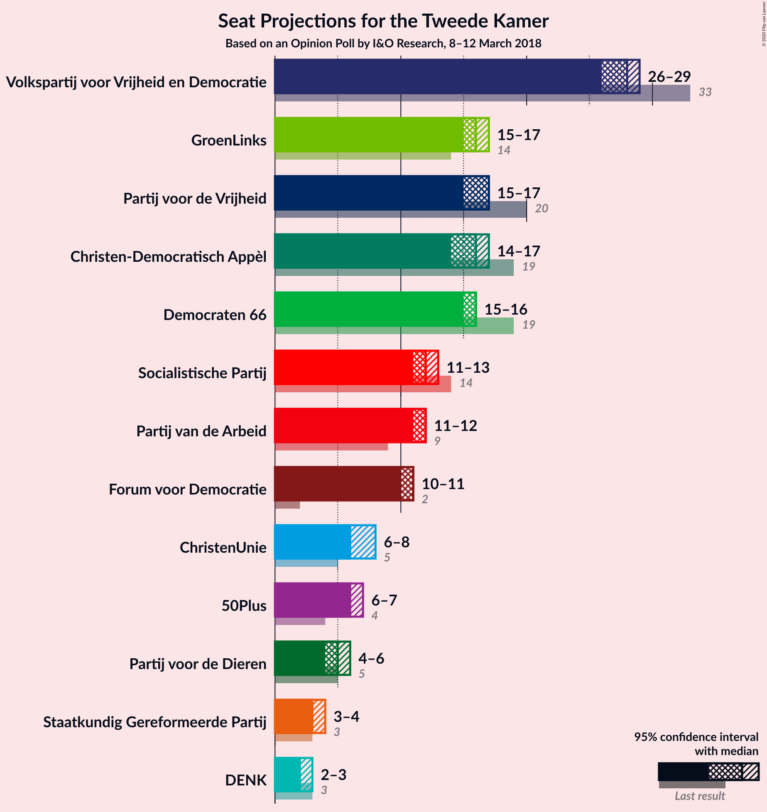

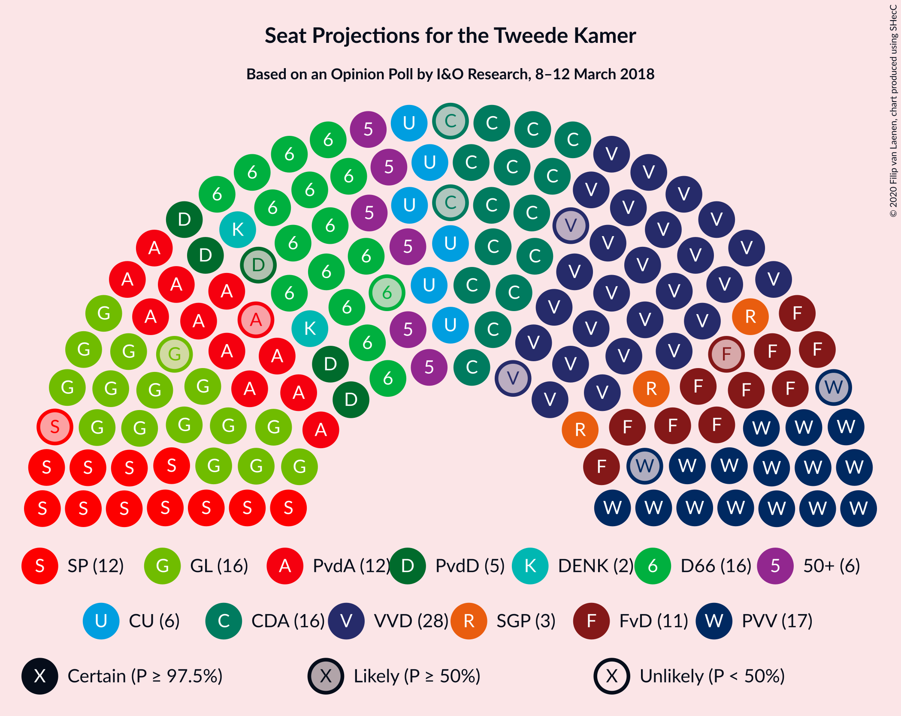

### Confidence Intervals

| Party | Last Result | Median | 80% Confidence Interval | 90% Confidence Interval | 95% Confidence Interval | 99% Confidence Interval |
|:-----:|:-----------:|:------:|:-----------------------:|:-----------------------:|:-----------------------:|:-----------------------:|
| <a href="#volkspartij-voor-vrijheid-en-democratie">Volkspartij voor Vrijheid en Democratie</a> | 33 | 28 | 28 |26–28 |26–29 |24–29 |
| <a href="#groenlinks">GroenLinks</a> | 14 | 16 | 16 |16–17 |15–17 |15–18 |
| <a href="#partij-voor-de-vrijheid">Partij voor de Vrijheid</a> | 20 | 17 | 16–17 |16–17 |15–17 |15–18 |
| <a href="#christen-democratisch-appèl">Christen-Democratisch Appèl</a> | 19 | 16 | 16 |15–16 |14–17 |14–17 |
| <a href="#democraten-66">Democraten 66</a> | 19 | 16 | 16 |15–16 |15–16 |14–17 |
| <a href="#socialistische-partij">Socialistische Partij</a> | 14 | 12 | 12 |12–13 |11–13 |11–14 |
| <a href="#partij-van-de-arbeid">Partij van de Arbeid</a> | 9 | 12 | 12 |11–12 |11–12 |10–12 |
| <a href="#forum-voor-democratie">Forum voor Democratie</a> | 2 | 11 | 10–11 |10–11 |10–11 |9–11 |
| <a href="#christenunie">ChristenUnie</a> | 5 | 6 | 6–7 |6–7 |6–8 |6–8 |
| <a href="#50plus">50Plus</a> | 4 | 6 | 6–7 |6–7 |6–7 |5–7 |
| <a href="#partij-voor-de-dieren">Partij voor de Dieren</a> | 5 | 5 | 5 |5–6 |4–6 |4–6 |
| <a href="#staatkundig-gereformeerde-partij">Staatkundig Gereformeerde Partij</a> | 3 | 3 | 3 |3 |3–4 |2–4 |
| <a href="#denk">DENK</a> | 3 | 2 | 2–3 |2–3 |2–3 |2–4 |

### Volkspartij voor Vrijheid en Democratie

*For a full overview of the results for this party, see the [Volkspartij voor Vrijheid en Democratie](party-volkspartijvoorvrijheidendemocratie.html) page.*

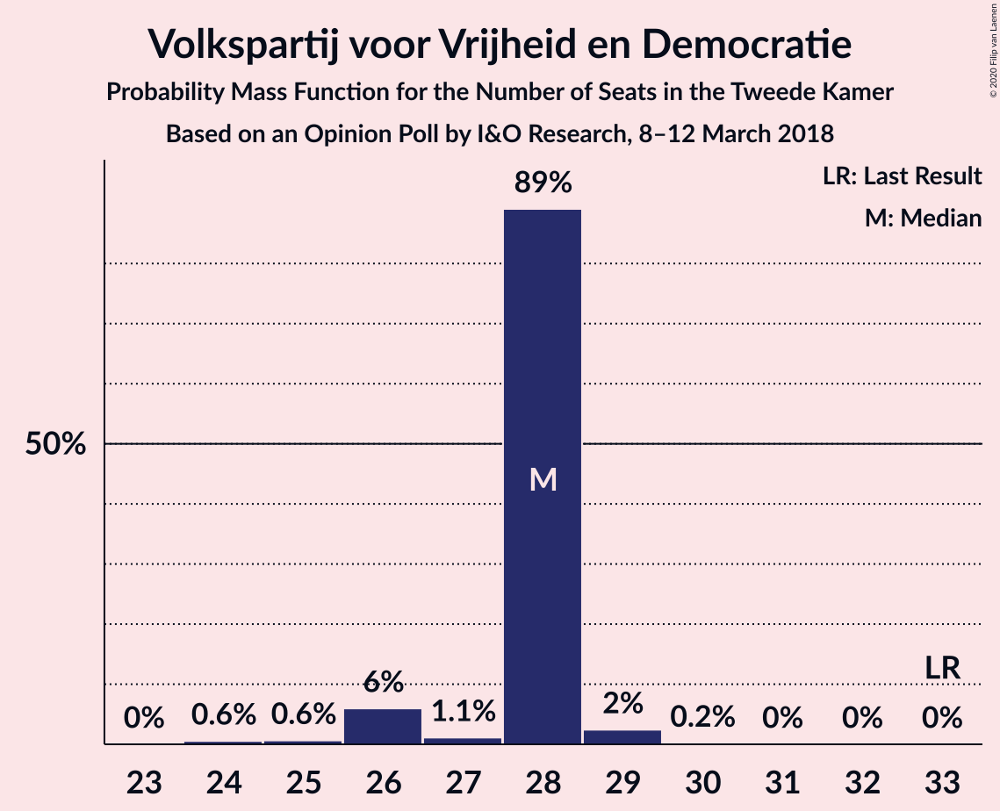

| Number of Seats | Probability | Accumulated | Special Marks |
|:---------------:|:-----------:|:-----------:|:-------------:|
| 24 | 0.6% | 100% |  |
| 25 | 0.6% | 99.4% |  |
| 26 | 6% | 98.8% |  |
| 27 | 1.1% | 93% |  |
| 28 | 89% | 92% | Median |
| 29 | 2% | 3% |  |
| 30 | 0.2% | 0.2% |  |
| 31 | 0% | 0% |  |
| 32 | 0% | 0% |  |
| 33 | 0% | 0% | Last Result |

### GroenLinks

*For a full overview of the results for this party, see the [GroenLinks](party-groenlinks.html) page.*

| Number of Seats | Probability | Accumulated | Special Marks |
|:---------------:|:-----------:|:-----------:|:-------------:|
| 14 | 0.1% | 100% | Last Result |
| 15 | 3% | 99.9% |  |
| 16 | 87% | 97% | Median |
| 17 | 8% | 9% |  |
| 18 | 1.3% | 2% |  |
| 19 | 0.3% | 0.3% |  |
| 20 | 0% | 0% |  |

### Partij voor de Vrijheid

*For a full overview of the results for this party, see the [Partij voor de Vrijheid](party-partijvoordevrijheid.html) page.*

| Number of Seats | Probability | Accumulated | Special Marks |
|:---------------:|:-----------:|:-----------:|:-------------:|
| 14 | 0.2% | 100% |  |
| 15 | 3% | 99.8% |  |
| 16 | 9% | 97% |  |
| 17 | 87% | 88% | Median |
| 18 | 0.4% | 0.7% |  |
| 19 | 0.3% | 0.3% |  |
| 20 | 0% | 0% | Last Result |

### Christen-Democratisch Appèl

*For a full overview of the results for this party, see the [Christen-Democratisch Appèl](party-christen-democratischappèl.html) page.*

| Number of Seats | Probability | Accumulated | Special Marks |
|:---------------:|:-----------:|:-----------:|:-------------:|
| 13 | 0.1% | 100% |  |
| 14 | 4% | 99.9% |  |
| 15 | 5% | 96% |  |
| 16 | 88% | 91% | Median |
| 17 | 2% | 3% |  |
| 18 | 0.2% | 0.4% |  |
| 19 | 0.2% | 0.2% | Last Result |
| 20 | 0% | 0% |  |

### Democraten 66

*For a full overview of the results for this party, see the [Democraten 66](party-democraten66.html) page.*

| Number of Seats | Probability | Accumulated | Special Marks |
|:---------------:|:-----------:|:-----------:|:-------------:|
| 13 | 0.1% | 100% |  |
| 14 | 2% | 99.9% |  |
| 15 | 5% | 98% |  |
| 16 | 92% | 93% | Median |
| 17 | 0.9% | 1.1% |  |
| 18 | 0.1% | 0.2% |  |
| 19 | 0% | 0% | Last Result |

### Socialistische Partij

*For a full overview of the results for this party, see the [Socialistische Partij](party-socialistischepartij.html) page.*

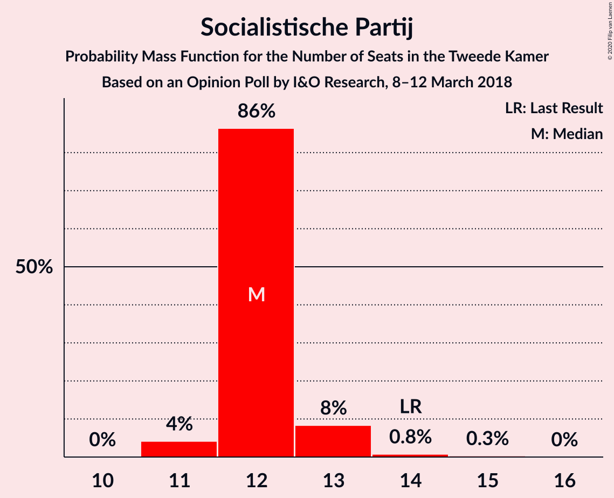

| Number of Seats | Probability | Accumulated | Special Marks |
|:---------------:|:-----------:|:-----------:|:-------------:|
| 11 | 4% | 100% |  |
| 12 | 86% | 96% | Median |
| 13 | 8% | 9% |  |
| 14 | 0.8% | 1.1% | Last Result |
| 15 | 0.3% | 0.3% |  |
| 16 | 0% | 0% |  |

### Partij van de Arbeid

*For a full overview of the results for this party, see the [Partij van de Arbeid](party-partijvandearbeid.html) page.*

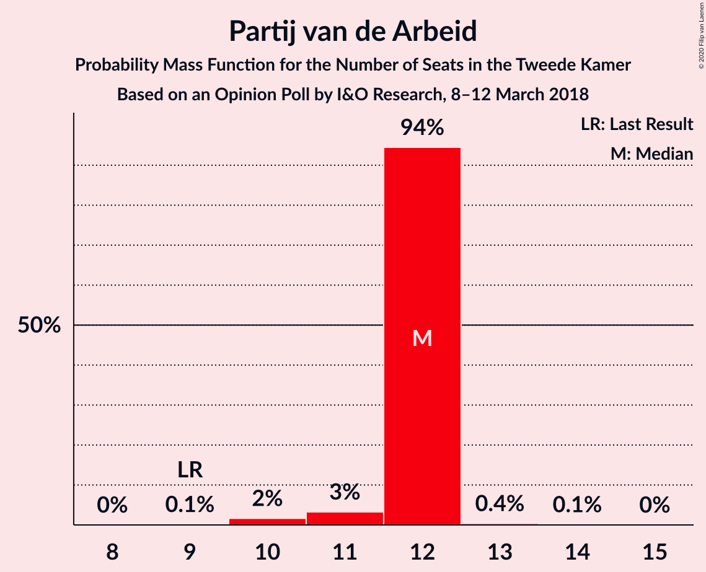

| Number of Seats | Probability | Accumulated | Special Marks |
|:---------------:|:-----------:|:-----------:|:-------------:|
| 9 | 0.1% | 100% | Last Result |
| 10 | 2% | 99.9% |  |
| 11 | 3% | 98% |  |
| 12 | 94% | 95% | Median |
| 13 | 0.4% | 0.5% |  |
| 14 | 0.1% | 0.1% |  |
| 15 | 0% | 0% |  |

### Forum voor Democratie

*For a full overview of the results for this party, see the [Forum voor Democratie](party-forumvoordemocratie.html) page.*

| Number of Seats | Probability | Accumulated | Special Marks |
|:---------------:|:-----------:|:-----------:|:-------------:|
| 2 | 0% | 100% | Last Result |
| 3 | 0% | 100% |  |
| 4 | 0% | 100% |  |
| 5 | 0% | 100% |  |
| 6 | 0% | 100% |  |
| 7 | 0% | 100% |  |
| 8 | 0.2% | 100% |  |
| 9 | 2% | 99.8% |  |
| 10 | 8% | 98% |  |
| 11 | 89% | 90% | Median |
| 12 | 0.2% | 0.3% |  |
| 13 | 0% | 0% |  |

### ChristenUnie

*For a full overview of the results for this party, see the [ChristenUnie](party-christenunie.html) page.*

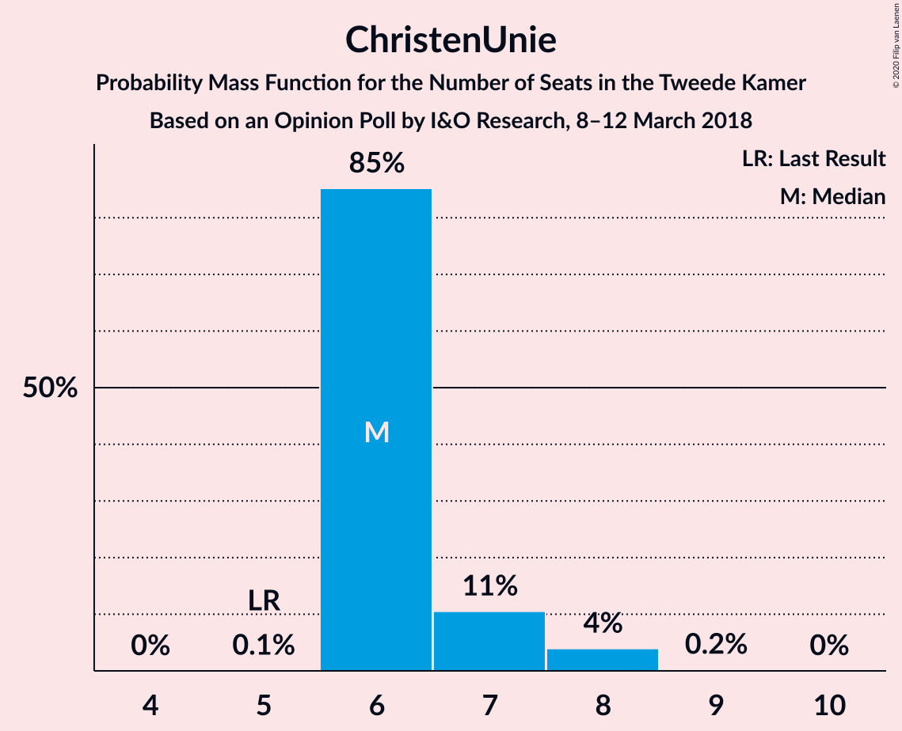

| Number of Seats | Probability | Accumulated | Special Marks |
|:---------------:|:-----------:|:-----------:|:-------------:|
| 5 | 0.1% | 100% | Last Result |
| 6 | 85% | 99.9% | Median |
| 7 | 11% | 15% |  |
| 8 | 4% | 4% |  |
| 9 | 0.2% | 0.2% |  |
| 10 | 0% | 0% |  |

### 50Plus

*For a full overview of the results for this party, see the [50Plus](party-50plus.html) page.*

| Number of Seats | Probability | Accumulated | Special Marks |
|:---------------:|:-----------:|:-----------:|:-------------:|
| 4 | 0% | 100% | Last Result |
| 5 | 2% | 100% |  |
| 6 | 87% | 98% | Median |
| 7 | 11% | 11% |  |
| 8 | 0.2% | 0.2% |  |
| 9 | 0% | 0% |  |

### Partij voor de Dieren

*For a full overview of the results for this party, see the [Partij voor de Dieren](party-partijvoordedieren.html) page.*

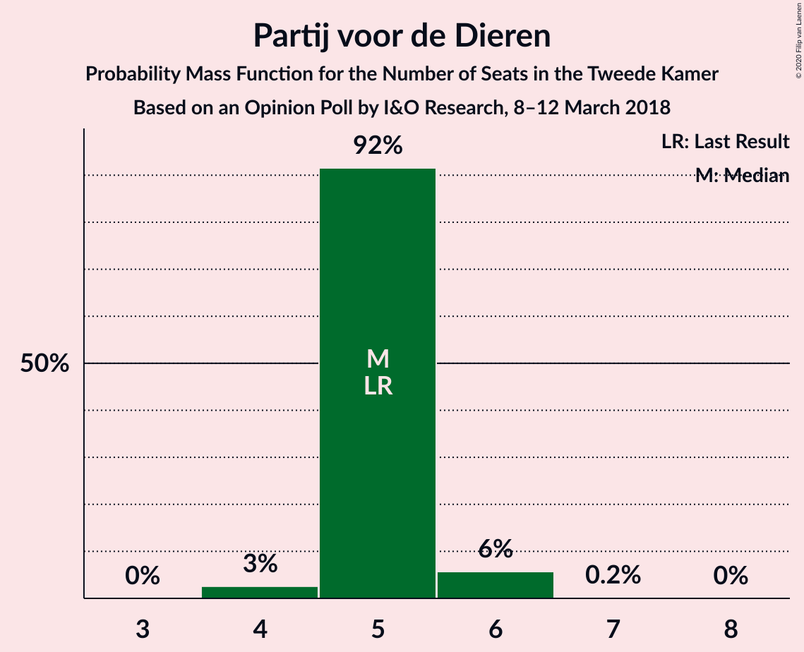

| Number of Seats | Probability | Accumulated | Special Marks |
|:---------------:|:-----------:|:-----------:|:-------------:|
| 4 | 3% | 100% |  |
| 5 | 92% | 97% | Last Result, Median |
| 6 | 6% | 6% |  |
| 7 | 0.2% | 0.2% |  |
| 8 | 0% | 0% |  |

### Staatkundig Gereformeerde Partij

*For a full overview of the results for this party, see the [Staatkundig Gereformeerde Partij](party-staatkundiggereformeerdepartij.html) page.*

| Number of Seats | Probability | Accumulated | Special Marks |
|:---------------:|:-----------:|:-----------:|:-------------:|
| 2 | 0.6% | 100% |  |
| 3 | 95% | 99.4% | Last Result, Median |
| 4 | 5% | 5% |  |
| 5 | 0% | 0% |  |

### DENK

*For a full overview of the results for this party, see the [DENK](party-denk.html) page.*

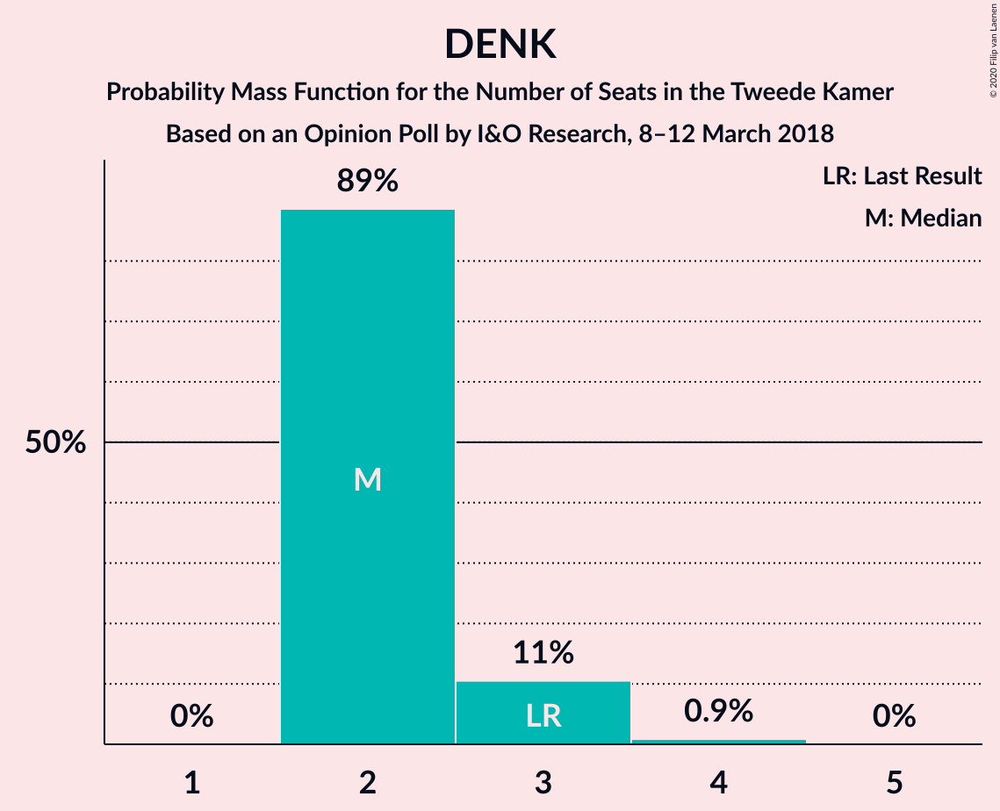

| Number of Seats | Probability | Accumulated | Special Marks |
|:---------------:|:-----------:|:-----------:|:-------------:|
| 2 | 89% | 100% | Median |
| 3 | 11% | 11% | Last Result |
| 4 | 0.9% | 0.9% |  |
| 5 | 0% | 0% |  |

## Coalitions

### Confidence Intervals

| Coalition | Last Result | Median | Majority? | 80% Confidence Interval | 90% Confidence Interval | 95% Confidence Interval | 99% Confidence Interval |
|:---------:|:-----------:|:------:|:---------:|:-----------------------:|:-----------------------:|:-----------------------:|:-----------------------:|
| Volkspartij voor Vrijheid en Democratie – GroenLinks – Christen-Democratisch Appèl – Democraten 66 – ChristenUnie | 90 | 82 | 100% | 82 | 81–82 | 80–84 | 79–85 |
| GroenLinks – Christen-Democratisch Appèl – Democraten 66 – Socialistische Partij – Partij van de Arbeid – ChristenUnie | 80 | 78 | 99.9% | 78 | 78–79 | 77–80 | 76–82 |
| Volkspartij voor Vrijheid en Democratie – Christen-Democratisch Appèl – Democraten 66 – Partij van de Arbeid – ChristenUnie | 85 | 78 | 96% | 78 | 76–78 | 75–78 | 74–80 |
| Volkspartij voor Vrijheid en Democratie – Christen-Democratisch Appèl – Partij voor de Vrijheid – Forum voor Democratie – Staatkundig Gereformeerde Partij | 77 | 75 | 0.5% | 73–75 | 71–75 | 70–75 | 70–76 |
| Volkspartij voor Vrijheid en Democratie – Christen-Democratisch Appèl – Partij voor de Vrijheid – Forum voor Democratie | 74 | 72 | 0% | 69–72 | 68–72 | 67–72 | 66–72 |
| GroenLinks – Christen-Democratisch Appèl – Democraten 66 – Partij van de Arbeid – ChristenUnie | 66 | 66 | 0% | 66 | 65–67 | 64–67 | 63–69 |
| Volkspartij voor Vrijheid en Democratie – Christen-Democratisch Appèl – Democraten 66 – ChristenUnie | 76 | 66 | 0% | 66 | 64–66 | 63–67 | 62–69 |
| Volkspartij voor Vrijheid en Democratie – Christen-Democratisch Appèl – Forum voor Democratie – 50Plus – Staatkundig Gereformeerde Partij | 61 | 64 | 0% | 63–64 | 61–64 | 61–64 | 60–65 |
| Volkspartij voor Vrijheid en Democratie – Christen-Democratisch Appèl – Forum voor Democratie – 50Plus | 58 | 61 | 0% | 60–61 | 58–61 | 58–61 | 56–62 |
| Volkspartij voor Vrijheid en Democratie – Christen-Democratisch Appèl – Partij voor de Vrijheid | 72 | 61 | 0% | 59–61 | 57–61 | 57–61 | 56–62 |
| Volkspartij voor Vrijheid en Democratie – Christen-Democratisch Appèl – Democraten 66 | 71 | 60 | 0% | 59–60 | 57–60 | 56–60 | 55–61 |
| Volkspartij voor Vrijheid en Democratie – Christen-Democratisch Appèl – Forum voor Democratie – Staatkundig Gereformeerde Partij | 57 | 58 | 0% | 56–58 | 55–58 | 54–58 | 54–59 |
| Volkspartij voor Vrijheid en Democratie – Christen-Democratisch Appèl – Partij van de Arbeid | 61 | 56 | 0% | 55–56 | 53–56 | 53–56 | 52–57 |
| Volkspartij voor Vrijheid en Democratie – Democraten 66 – Partij van de Arbeid | 61 | 56 | 0% | 54–56 | 54–56 | 52–56 | 51–57 |
| Volkspartij voor Vrijheid en Democratie – Christen-Democratisch Appèl – Forum voor Democratie | 54 | 55 | 0% | 53–55 | 51–55 | 51–55 | 51–55 |
| Christen-Democratisch Appèl – Democraten 66 – Partij van de Arbeid | 47 | 44 | 0% | 43–44 | 42–44 | 42–44 | 40–45 |
| Volkspartij voor Vrijheid en Democratie – Christen-Democratisch Appèl | 52 | 44 | 0% | 43–44 | 41–44 | 41–44 | 40–45 |
| Volkspartij voor Vrijheid en Democratie – Partij van de Arbeid | 42 | 40 | 0% | 39–40 | 38–40 | 37–40 | 36–41 |
| Christen-Democratisch Appèl – Partij van de Arbeid – ChristenUnie | 33 | 34 | 0% | 34 | 34–35 | 33–35 | 33–37 |
| Christen-Democratisch Appèl – Democraten 66 | 38 | 32 | 0% | 31–32 | 31–32 | 30–32 | 28–33 |
| Christen-Democratisch Appèl – Partij van de Arbeid | 28 | 28 | 0% | 27–28 | 27–28 | 26–28 | 25–29 |

### Volkspartij voor Vrijheid en Democratie – GroenLinks – Christen-Democratisch Appèl – Democraten 66 – ChristenUnie

| Number of Seats | Probability | Accumulated | Special Marks |
|:---------------:|:-----------:|:-----------:|:-------------:|
| 78 | 0.1% | 100% |  |
| 79 | 2% | 99.9% |  |
| 80 | 0.4% | 98% |  |
| 81 | 7% | 97% |  |
| 82 | 86% | 91% | Median |
| 83 | 1.3% | 4% |  |
| 84 | 2% | 3% |  |
| 85 | 0.4% | 0.7% |  |
| 86 | 0.2% | 0.2% |  |
| 87 | 0% | 0% |  |
| 88 | 0% | 0% |  |
| 89 | 0% | 0% |  |
| 90 | 0% | 0% | Last Result |

### GroenLinks – Christen-Democratisch Appèl – Democraten 66 – Socialistische Partij – Partij van de Arbeid – ChristenUnie

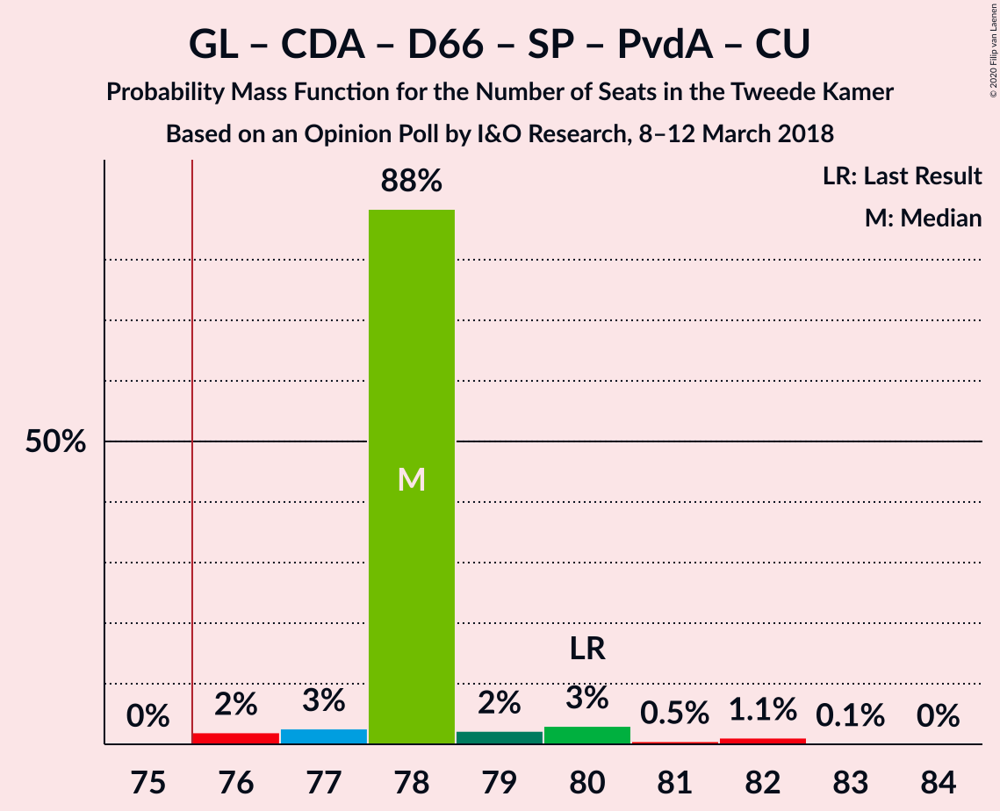

| Number of Seats | Probability | Accumulated | Special Marks |
|:---------------:|:-----------:|:-----------:|:-------------:|
| 75 | 0% | 100% |  |
| 76 | 2% | 99.9% | Majority |
| 77 | 3% | 98% |  |
| 78 | 88% | 95% | Median |
| 79 | 2% | 7% |  |
| 80 | 3% | 5% | Last Result |
| 81 | 0.5% | 2% |  |
| 82 | 1.1% | 1.2% |  |
| 83 | 0.1% | 0.1% |  |
| 84 | 0% | 0% |  |

### Volkspartij voor Vrijheid en Democratie – Christen-Democratisch Appèl – Democraten 66 – Partij van de Arbeid – ChristenUnie

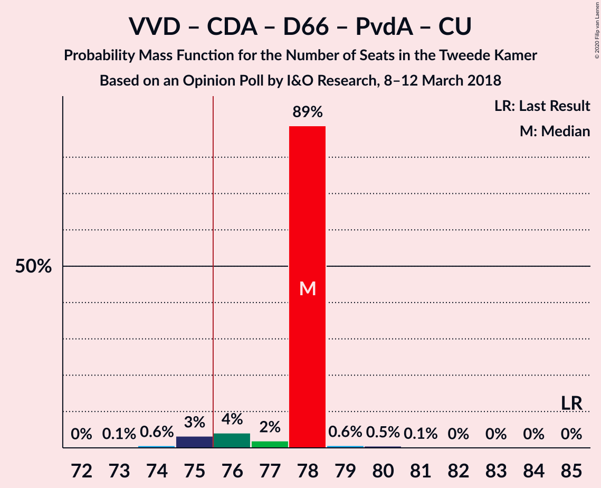

| Number of Seats | Probability | Accumulated | Special Marks |
|:---------------:|:-----------:|:-----------:|:-------------:|
| 73 | 0.1% | 100% |  |
| 74 | 0.6% | 99.9% |  |
| 75 | 3% | 99.3% |  |
| 76 | 4% | 96% | Majority |
| 77 | 2% | 92% |  |
| 78 | 89% | 90% | Median |
| 79 | 0.6% | 1.3% |  |
| 80 | 0.5% | 0.7% |  |
| 81 | 0.1% | 0.2% |  |
| 82 | 0% | 0% |  |
| 83 | 0% | 0% |  |
| 84 | 0% | 0% |  |
| 85 | 0% | 0% | Last Result |

### Volkspartij voor Vrijheid en Democratie – Christen-Democratisch Appèl – Partij voor de Vrijheid – Forum voor Democratie – Staatkundig Gereformeerde Partij

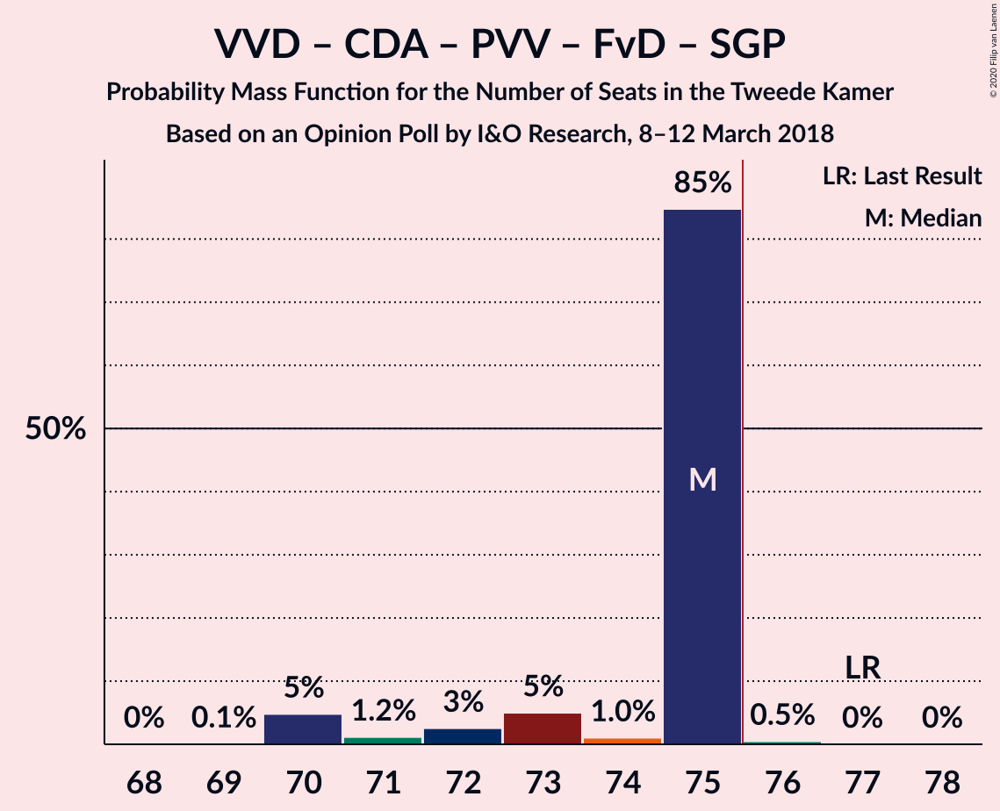

| Number of Seats | Probability | Accumulated | Special Marks |
|:---------------:|:-----------:|:-----------:|:-------------:|
| 68 | 0% | 100% |  |
| 69 | 0.1% | 99.9% |  |
| 70 | 5% | 99.9% |  |
| 71 | 1.2% | 95% |  |
| 72 | 3% | 94% |  |
| 73 | 5% | 91% |  |
| 74 | 1.0% | 86% |  |
| 75 | 85% | 85% | Median |
| 76 | 0.5% | 0.5% | Majority |
| 77 | 0% | 0.1% | Last Result |
| 78 | 0% | 0% |  |

### Volkspartij voor Vrijheid en Democratie – Christen-Democratisch Appèl – Partij voor de Vrijheid – Forum voor Democratie

| Number of Seats | Probability | Accumulated | Special Marks |
|:---------------:|:-----------:|:-----------:|:-------------:|
| 66 | 0.7% | 100% |  |
| 67 | 4% | 99.3% |  |
| 68 | 1.1% | 95% |  |
| 69 | 6% | 94% |  |
| 70 | 3% | 88% |  |
| 71 | 0.4% | 86% |  |
| 72 | 85% | 85% | Median |
| 73 | 0.4% | 0.5% |  |
| 74 | 0% | 0.1% | Last Result |
| 75 | 0% | 0% |  |

### GroenLinks – Christen-Democratisch Appèl – Democraten 66 – Partij van de Arbeid – ChristenUnie

| Number of Seats | Probability | Accumulated | Special Marks |
|:---------------:|:-----------:|:-----------:|:-------------:|
| 62 | 0.1% | 100% |  |
| 63 | 2% | 99.9% |  |
| 64 | 3% | 98% |  |
| 65 | 0.8% | 96% |  |
| 66 | 86% | 95% | Last Result, Median |
| 67 | 7% | 9% |  |
| 68 | 0.9% | 2% |  |
| 69 | 1.0% | 1.2% |  |
| 70 | 0.2% | 0.2% |  |
| 71 | 0% | 0% |  |

### Volkspartij voor Vrijheid en Democratie – Christen-Democratisch Appèl – Democraten 66 – ChristenUnie

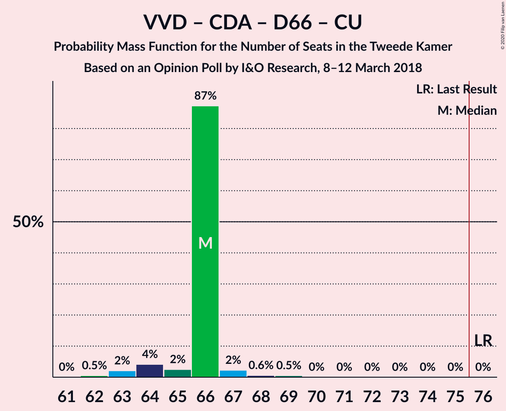

| Number of Seats | Probability | Accumulated | Special Marks |
|:---------------:|:-----------:|:-----------:|:-------------:|
| 62 | 0.5% | 100% |  |
| 63 | 2% | 99.4% |  |
| 64 | 4% | 97% |  |
| 65 | 2% | 93% |  |
| 66 | 87% | 91% | Median |
| 67 | 2% | 3% |  |
| 68 | 0.6% | 1.2% |  |
| 69 | 0.5% | 0.6% |  |
| 70 | 0% | 0% |  |
| 71 | 0% | 0% |  |
| 72 | 0% | 0% |  |
| 73 | 0% | 0% |  |
| 74 | 0% | 0% |  |
| 75 | 0% | 0% |  |
| 76 | 0% | 0% | Last Result, Majority |

### Volkspartij voor Vrijheid en Democratie – Christen-Democratisch Appèl – Forum voor Democratie – 50Plus – Staatkundig Gereformeerde Partij

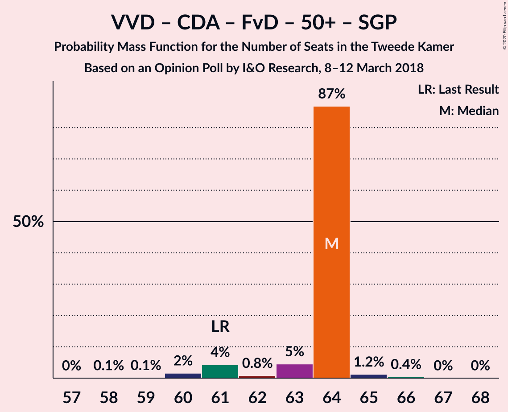

| Number of Seats | Probability | Accumulated | Special Marks |
|:---------------:|:-----------:|:-----------:|:-------------:|
| 58 | 0.1% | 100% |  |
| 59 | 0.1% | 99.9% |  |
| 60 | 2% | 99.8% |  |
| 61 | 4% | 98% | Last Result |
| 62 | 0.8% | 94% |  |
| 63 | 5% | 93% |  |
| 64 | 87% | 89% | Median |
| 65 | 1.2% | 2% |  |
| 66 | 0.4% | 0.5% |  |
| 67 | 0% | 0.1% |  |
| 68 | 0% | 0% |  |

### Volkspartij voor Vrijheid en Democratie – Christen-Democratisch Appèl – Forum voor Democratie – 50Plus

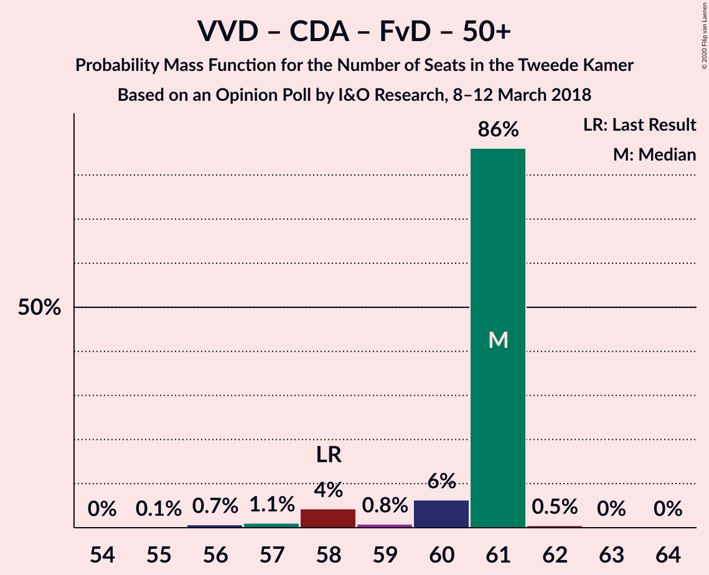

| Number of Seats | Probability | Accumulated | Special Marks |
|:---------------:|:-----------:|:-----------:|:-------------:|
| 55 | 0.1% | 100% |  |
| 56 | 0.7% | 99.9% |  |
| 57 | 1.1% | 99.2% |  |
| 58 | 4% | 98% | Last Result |
| 59 | 0.8% | 94% |  |
| 60 | 6% | 93% |  |
| 61 | 86% | 87% | Median |
| 62 | 0.5% | 0.6% |  |
| 63 | 0% | 0.1% |  |
| 64 | 0% | 0% |  |

### Volkspartij voor Vrijheid en Democratie – Christen-Democratisch Appèl – Partij voor de Vrijheid

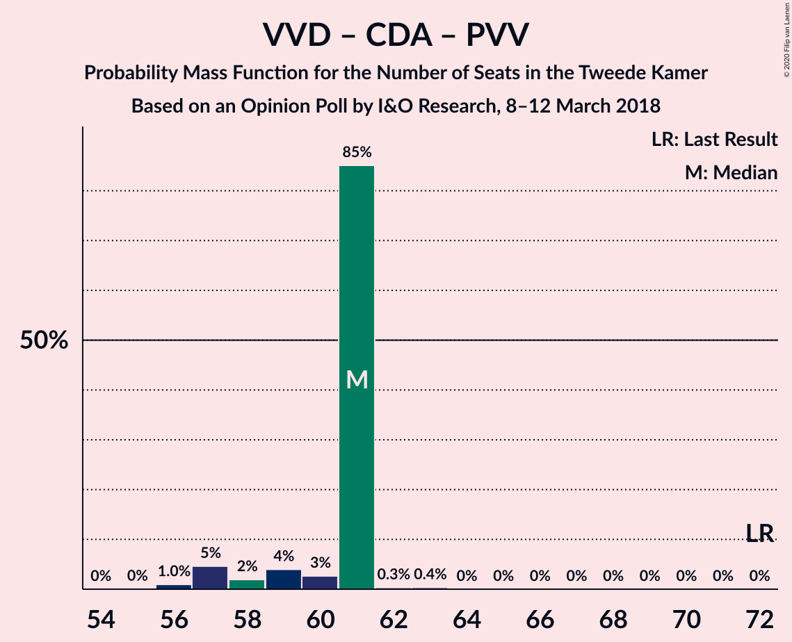

| Number of Seats | Probability | Accumulated | Special Marks |
|:---------------:|:-----------:|:-----------:|:-------------:|
| 55 | 0% | 100% |  |
| 56 | 1.0% | 99.9% |  |
| 57 | 5% | 99.0% |  |
| 58 | 2% | 94% |  |
| 59 | 4% | 92% |  |
| 60 | 3% | 88% |  |
| 61 | 85% | 86% | Median |
| 62 | 0.3% | 0.7% |  |
| 63 | 0.4% | 0.4% |  |
| 64 | 0% | 0% |  |
| 65 | 0% | 0% |  |
| 66 | 0% | 0% |  |
| 67 | 0% | 0% |  |
| 68 | 0% | 0% |  |
| 69 | 0% | 0% |  |
| 70 | 0% | 0% |  |
| 71 | 0% | 0% |  |
| 72 | 0% | 0% | Last Result |

### Volkspartij voor Vrijheid en Democratie – Christen-Democratisch Appèl – Democraten 66

| Number of Seats | Probability | Accumulated | Special Marks |
|:---------------:|:-----------:|:-----------:|:-------------:|
| 54 | 0.1% | 100% |  |
| 55 | 0.8% | 99.9% |  |
| 56 | 2% | 99.1% |  |
| 57 | 5% | 97% |  |
| 58 | 2% | 93% |  |
| 59 | 5% | 91% |  |
| 60 | 85% | 86% | Median |
| 61 | 0.5% | 0.9% |  |
| 62 | 0.4% | 0.4% |  |
| 63 | 0% | 0% |  |
| 64 | 0% | 0% |  |
| 65 | 0% | 0% |  |
| 66 | 0% | 0% |  |
| 67 | 0% | 0% |  |
| 68 | 0% | 0% |  |
| 69 | 0% | 0% |  |
| 70 | 0% | 0% |  |
| 71 | 0% | 0% | Last Result |

### Volkspartij voor Vrijheid en Democratie – Christen-Democratisch Appèl – Forum voor Democratie – Staatkundig Gereformeerde Partij

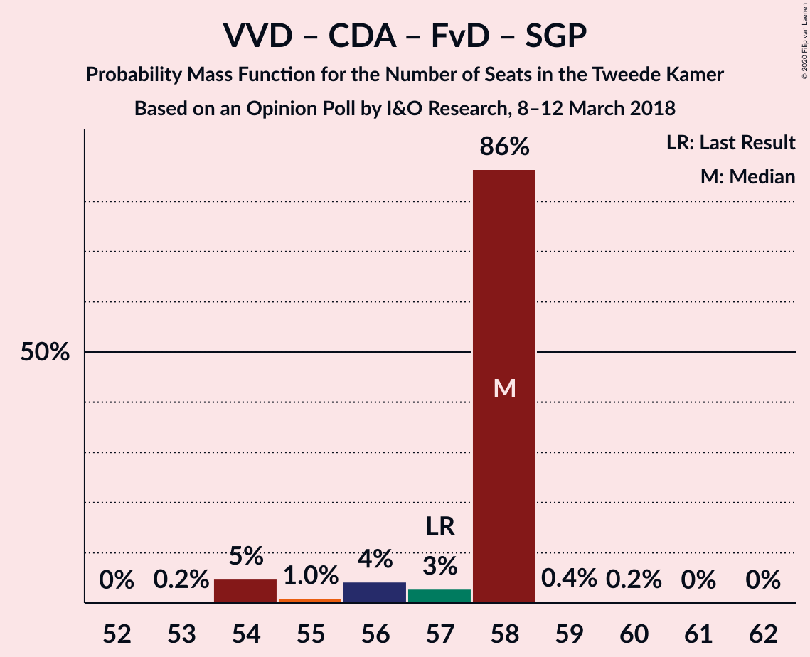

| Number of Seats | Probability | Accumulated | Special Marks |
|:---------------:|:-----------:|:-----------:|:-------------:|
| 53 | 0.2% | 100% |  |
| 54 | 5% | 99.8% |  |
| 55 | 1.0% | 95% |  |
| 56 | 4% | 94% |  |
| 57 | 3% | 90% | Last Result |
| 58 | 86% | 87% | Median |
| 59 | 0.4% | 0.6% |  |
| 60 | 0.2% | 0.2% |  |
| 61 | 0% | 0.1% |  |
| 62 | 0% | 0% |  |

### Volkspartij voor Vrijheid en Democratie – Christen-Democratisch Appèl – Partij van de Arbeid

| Number of Seats | Probability | Accumulated | Special Marks |
|:---------------:|:-----------:|:-----------:|:-------------:|
| 51 | 0.1% | 100% |  |
| 52 | 1.3% | 99.8% |  |
| 53 | 6% | 98.6% |  |
| 54 | 2% | 93% |  |
| 55 | 5% | 91% |  |
| 56 | 85% | 86% | Median |
| 57 | 0.6% | 0.8% |  |
| 58 | 0.1% | 0.1% |  |
| 59 | 0% | 0% |  |
| 60 | 0% | 0% |  |
| 61 | 0% | 0% | Last Result |

### Volkspartij voor Vrijheid en Democratie – Democraten 66 – Partij van de Arbeid

| Number of Seats | Probability | Accumulated | Special Marks |
|:---------------:|:-----------:|:-----------:|:-------------:|
| 50 | 0.3% | 100% |  |
| 51 | 1.5% | 99.7% |  |
| 52 | 0.8% | 98% |  |
| 53 | 0.6% | 97% |  |
| 54 | 8% | 97% |  |
| 55 | 2% | 89% |  |
| 56 | 85% | 87% | Median |
| 57 | 2% | 2% |  |
| 58 | 0.1% | 0.1% |  |
| 59 | 0% | 0% |  |
| 60 | 0% | 0% |  |
| 61 | 0% | 0% | Last Result |

### Volkspartij voor Vrijheid en Democratie – Christen-Democratisch Appèl – Forum voor Democratie

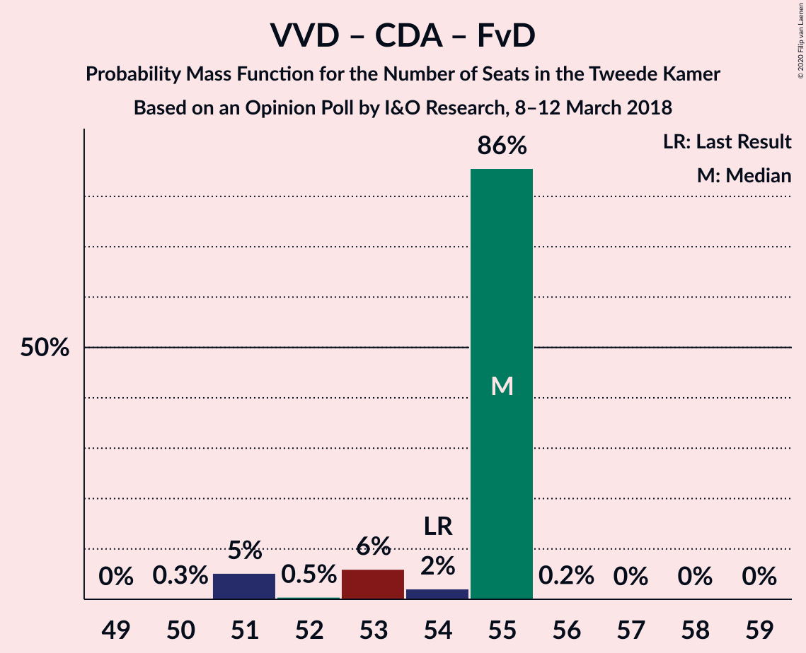

| Number of Seats | Probability | Accumulated | Special Marks |
|:---------------:|:-----------:|:-----------:|:-------------:|
| 50 | 0.3% | 100% |  |
| 51 | 5% | 99.7% |  |
| 52 | 0.5% | 94% |  |
| 53 | 6% | 94% |  |
| 54 | 2% | 88% | Last Result |
| 55 | 86% | 86% | Median |
| 56 | 0.2% | 0.3% |  |
| 57 | 0% | 0.1% |  |
| 58 | 0% | 0.1% |  |
| 59 | 0% | 0% |  |

### Christen-Democratisch Appèl – Democraten 66 – Partij van de Arbeid

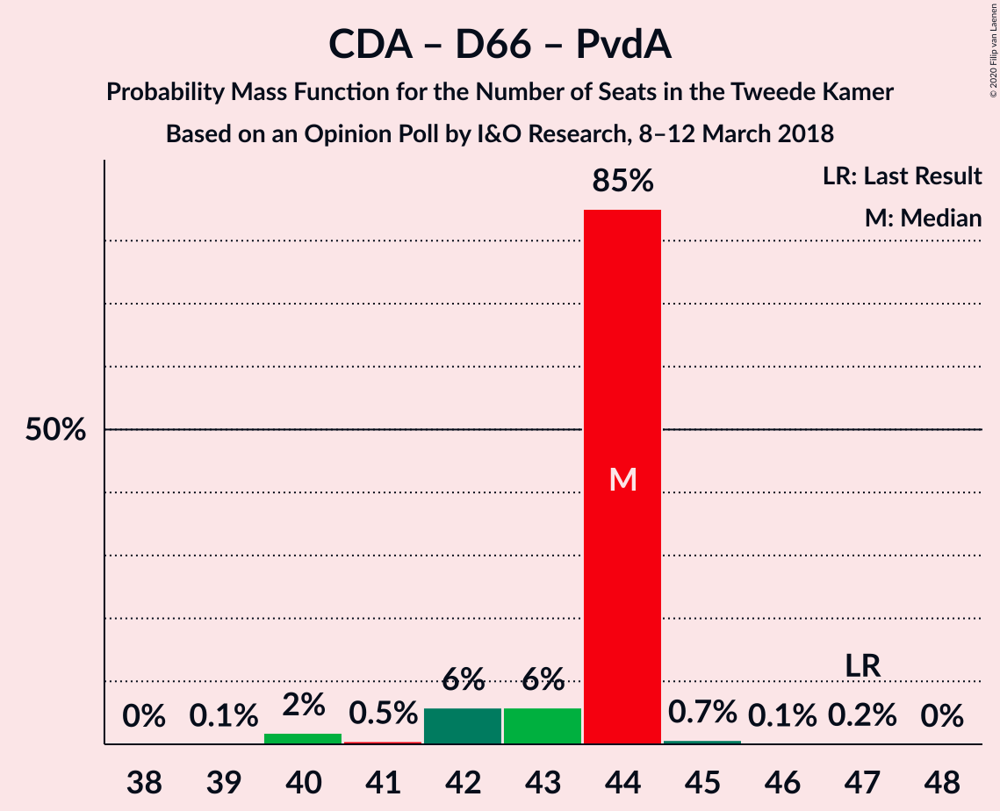

| Number of Seats | Probability | Accumulated | Special Marks |
|:---------------:|:-----------:|:-----------:|:-------------:|
| 39 | 0.1% | 100% |  |
| 40 | 2% | 99.9% |  |
| 41 | 0.5% | 98% |  |
| 42 | 6% | 98% |  |
| 43 | 6% | 92% |  |
| 44 | 85% | 86% | Median |
| 45 | 0.7% | 0.9% |  |
| 46 | 0.1% | 0.2% |  |
| 47 | 0.2% | 0.2% | Last Result |
| 48 | 0% | 0% |  |

### Volkspartij voor Vrijheid en Democratie – Christen-Democratisch Appèl

| Number of Seats | Probability | Accumulated | Special Marks |
|:---------------:|:-----------:|:-----------:|:-------------:|
| 39 | 0.1% | 100% |  |
| 40 | 0.9% | 99.9% |  |
| 41 | 5% | 99.0% |  |
| 42 | 2% | 94% |  |
| 43 | 4% | 92% |  |
| 44 | 87% | 88% | Median |
| 45 | 0.7% | 1.0% |  |
| 46 | 0.3% | 0.3% |  |
| 47 | 0% | 0% |  |
| 48 | 0% | 0% |  |
| 49 | 0% | 0% |  |
| 50 | 0% | 0% |  |
| 51 | 0% | 0% |  |
| 52 | 0% | 0% | Last Result |

### Volkspartij voor Vrijheid en Democratie – Partij van de Arbeid

| Number of Seats | Probability | Accumulated | Special Marks |
|:---------------:|:-----------:|:-----------:|:-------------:|
| 35 | 0.2% | 100% |  |
| 36 | 2% | 99.8% |  |
| 37 | 0.6% | 98% |  |
| 38 | 6% | 97% |  |
| 39 | 2% | 92% |  |
| 40 | 87% | 90% | Median |
| 41 | 2% | 2% |  |
| 42 | 0.1% | 0.1% | Last Result |
| 43 | 0% | 0% |  |

### Christen-Democratisch Appèl – Partij van de Arbeid – ChristenUnie

| Number of Seats | Probability | Accumulated | Special Marks |
|:---------------:|:-----------:|:-----------:|:-------------:|
| 32 | 0.3% | 100% |  |
| 33 | 4% | 99.7% | Last Result |
| 34 | 90% | 95% | Median |
| 35 | 4% | 5% |  |
| 36 | 0.8% | 1.4% |  |
| 37 | 0.4% | 0.6% |  |
| 38 | 0.2% | 0.2% |  |
| 39 | 0% | 0% |  |

### Christen-Democratisch Appèl – Democraten 66

| Number of Seats | Probability | Accumulated | Special Marks |
|:---------------:|:-----------:|:-----------:|:-------------:|
| 28 | 2% | 100% |  |
| 29 | 0.4% | 98% |  |
| 30 | 3% | 98% |  |
| 31 | 8% | 95% |  |
| 32 | 86% | 87% | Median |
| 33 | 0.9% | 1.3% |  |
| 34 | 0.3% | 0.5% |  |
| 35 | 0.2% | 0.2% |  |
| 36 | 0% | 0% |  |
| 37 | 0% | 0% |  |
| 38 | 0% | 0% | Last Result |

### Christen-Democratisch Appèl – Partij van de Arbeid

| Number of Seats | Probability | Accumulated | Special Marks |
|:---------------:|:-----------:|:-----------:|:-------------:|
| 24 | 0.1% | 100% |  |
| 25 | 0.6% | 99.9% |  |
| 26 | 4% | 99.3% |  |
| 27 | 8% | 95% |  |
| 28 | 86% | 87% | Last Result, Median |
| 29 | 0.8% | 1.1% |  |
| 30 | 0.1% | 0.3% |  |
| 31 | 0.2% | 0.2% |  |
| 32 | 0% | 0% |  |

## Technical Information

### Opinion Poll

+ **Polling firm:** I&O Research
+ **Commissioner(s):** —
+ **Fieldwork period:** 8–12 March 2018

### Calculations

+ **Sample size:** 3375
+ **Simulations done:** 1,048,576
+ **Error estimate:** 1.28%

