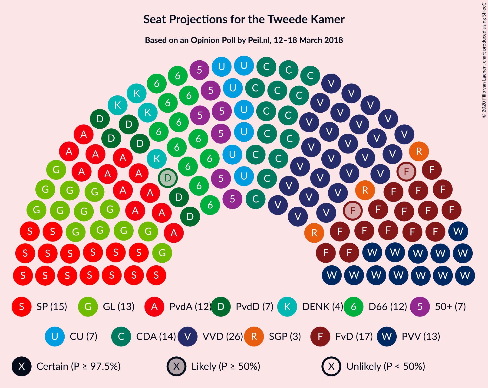
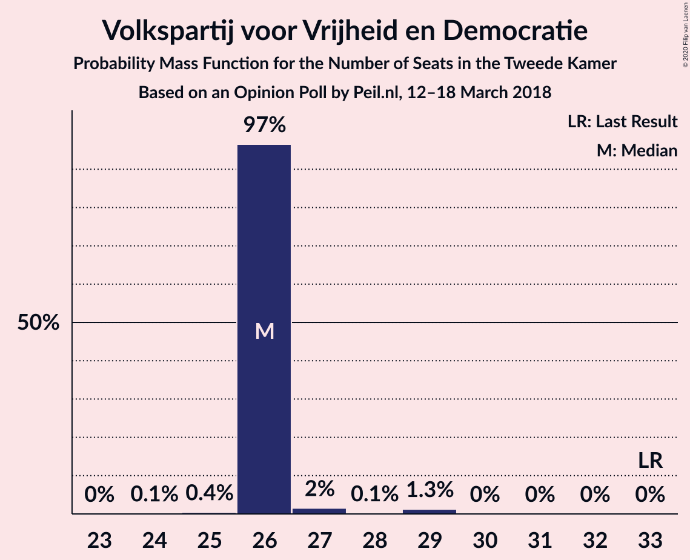
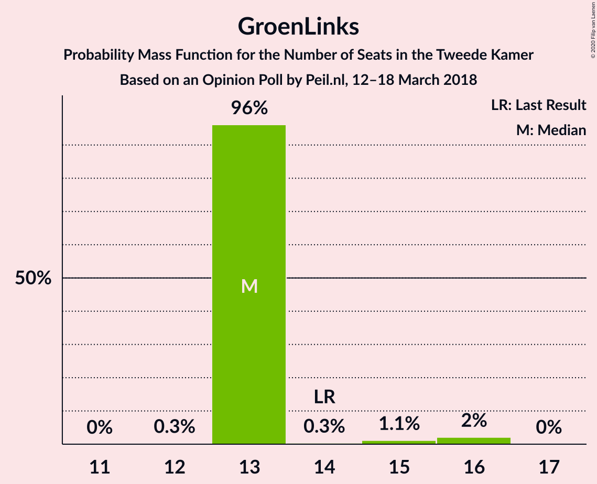
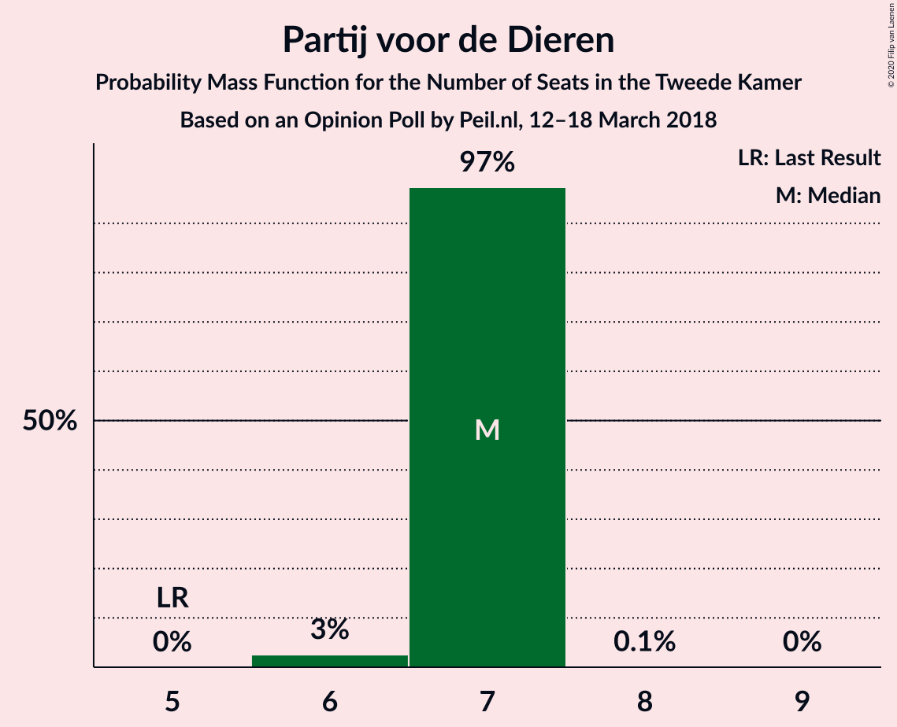
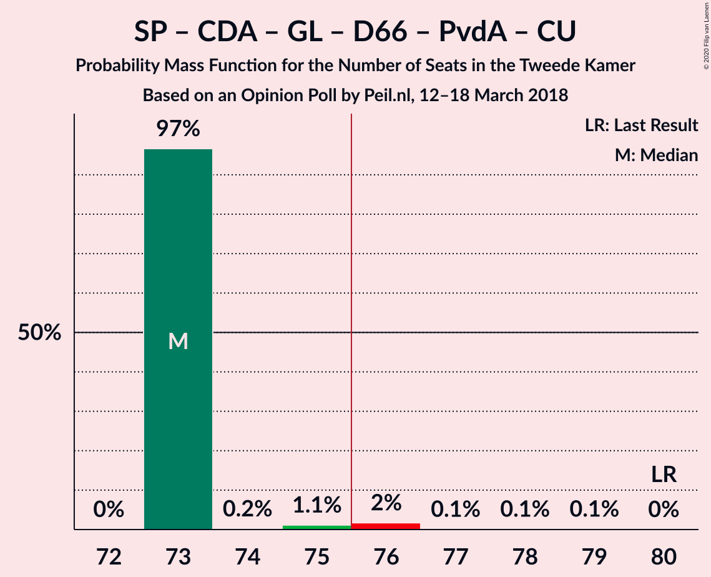
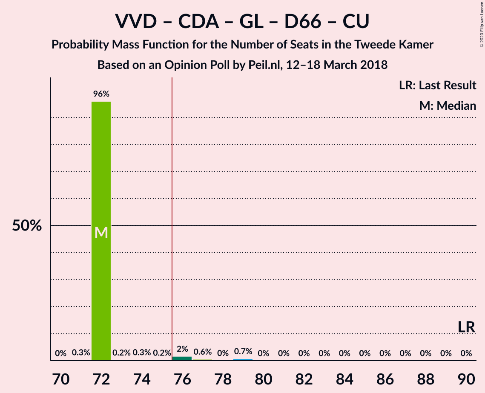

# Opinion Poll by Peil.nl, 12–18 March 2018

<a href="#voting-intentions">Voting Intentions</a> | <a href="#seats">Seats</a> | <a href="#coalitions">Coalitions</a> | <a href="#technical-information">Technical Information</a>

## Voting Intentions

### Confidence Intervals

| Party | Last Result | Poll Result | 80% Confidence Interval | 90% Confidence Interval | 95% Confidence Interval | 99% Confidence Interval |
|:-----:|:-----------:|:-----------:|:-----------------------:|:-----------------------:|:-----------------------:|:-----------------------:|
| Volkspartij voor Vrijheid en Democratie | 21.3% | 17.3% | 16.5–18.3% |16.2–18.5% |16.0–18.7% |15.6–19.2% |
| Forum voor Democratie | 1.8% | 10.7% | 10.0–11.4% |9.8–11.6% |9.6–11.8% |9.3–12.2% |
| Socialistische Partij | 9.1% | 10.0% | 9.3–10.7% |9.1–10.9% |9.0–11.1% |8.7–11.5% |
| Christen-Democratisch Appèl | 12.4% | 9.3% | 8.7–10.1% |8.5–10.3% |8.3–10.4% |8.0–10.8% |
| GroenLinks | 9.1% | 9.3% | 8.7–10.1% |8.5–10.3% |8.3–10.4% |8.0–10.8% |
| Democraten 66 | 12.2% | 8.7% | 8.0–9.4% |7.8–9.6% |7.7–9.7% |7.4–10.1% |
| Partij voor de Vrijheid | 13.1% | 8.0% | 7.4–8.7% |7.2–8.9% |7.1–9.0% |6.8–9.4% |
| Partij van de Arbeid | 5.7% | 8.0% | 7.4–8.7% |7.2–8.9% |7.1–9.0% |6.8–9.4% |
| ChristenUnie | 3.4% | 4.7% | 4.2–5.2% |4.1–5.3% |4.0–5.5% |3.7–5.8% |
| Partij voor de Dieren | 3.2% | 4.7% | 4.2–5.2% |4.1–5.3% |4.0–5.5% |3.7–5.8% |
| 50Plus | 3.1% | 4.7% | 4.2–5.2% |4.1–5.3% |4.0–5.5% |3.7–5.8% |
| DENK | 2.1% | 2.7% | 2.3–3.1% |2.2–3.2% |2.1–3.3% |2.0–3.5% |
| Staatkundig Gereformeerde Partij | 2.1% | 2.0% | 1.7–2.4% |1.6–2.5% |1.6–2.6% |1.4–2.8% |

*Note:* The poll result column reflects the actual value used in the calculations. Published results may vary slightly, and in addition be rounded to fewer digits.

## Seats

### Confidence Intervals

| Party | Last Result | Median | 80% Confidence Interval | 90% Confidence Interval | 95% Confidence Interval | 99% Confidence Interval |
|:-----:|:-----------:|:------:|:-----------------------:|:-----------------------:|:-----------------------:|:-----------------------:|
| <a href="#volkspartij-voor-vrijheid-en-democratie">Volkspartij voor Vrijheid en Democratie</a> | 33 | 27 | 25–28 |24–28 |24–30 |23–31 |
| <a href="#forum-voor-democratie">Forum voor Democratie</a> | 2 | 15 | 14–18 |14–18 |14–19 |14–19 |
| <a href="#socialistische-partij">Socialistische Partij</a> | 14 | 15 | 14–16 |14–17 |14–18 |13–18 |
| <a href="#christen-democratisch-appèl">Christen-Democratisch Appèl</a> | 19 | 14 | 13–15 |13–16 |12–18 |12–18 |
| <a href="#groenlinks">GroenLinks</a> | 14 | 13 | 13–16 |13–16 |12–17 |12–17 |
| <a href="#democraten-66">Democraten 66</a> | 19 | 13 | 12–14 |11–14 |11–14 |11–16 |
| <a href="#partij-voor-de-vrijheid">Partij voor de Vrijheid</a> | 20 | 11 | 11–13 |11–14 |11–14 |11–14 |
| <a href="#partij-van-de-arbeid">Partij van de Arbeid</a> | 9 | 13 | 11–14 |11–14 |10–14 |10–14 |
| <a href="#christenunie">ChristenUnie</a> | 5 | 7 | 5–8 |5–8 |5–9 |5–9 |
| <a href="#partij-voor-de-dieren">Partij voor de Dieren</a> | 5 | 7 | 6–9 |6–9 |6–9 |5–9 |
| <a href="#50plus">50Plus</a> | 4 | 7 | 5–8 |5–8 |5–9 |5–9 |
| <a href="#denk">DENK</a> | 3 | 4 | 2–4 |2–5 |2–5 |2–5 |
| <a href="#staatkundig-gereformeerde-partij">Staatkundig Gereformeerde Partij</a> | 3 | 3 | 2–4 |2–4 |2–4 |2–4 |

### Volkspartij voor Vrijheid en Democratie

*For a full overview of the results for this party, see the [Volkspartij voor Vrijheid en Democratie](party-volkspartijvoorvrijheidendemocratie.html) page.*

| Number of Seats | Probability | Accumulated | Special Marks |
|:---------------:|:-----------:|:-----------:|:-------------:|
| 23 | 1.2% | 100% |  |
| 24 | 8% | 98.8% |  |
| 25 | 32% | 90% |  |
| 26 | 8% | 58% |  |
| 27 | 1.2% | 50% | Median |
| 28 | 45% | 49% |  |
| 29 | 0.1% | 4% |  |
| 30 | 1.3% | 4% |  |
| 31 | 2% | 2% |  |
| 32 | 0% | 0% |  |
| 33 | 0% | 0% | Last Result |

### Forum voor Democratie

*For a full overview of the results for this party, see the [Forum voor Democratie](party-forumvoordemocratie.html) page.*

| Number of Seats | Probability | Accumulated | Special Marks |
|:---------------:|:-----------:|:-----------:|:-------------:|
| 2 | 0% | 100% | Last Result |
| 3 | 0% | 100% |  |
| 4 | 0% | 100% |  |
| 5 | 0% | 100% |  |
| 6 | 0% | 100% |  |
| 7 | 0% | 100% |  |
| 8 | 0% | 100% |  |
| 9 | 0% | 100% |  |
| 10 | 0% | 100% |  |
| 11 | 0% | 100% |  |
| 12 | 0% | 100% |  |
| 13 | 0.2% | 100% |  |
| 14 | 10% | 99.8% |  |
| 15 | 45% | 90% | Median |
| 16 | 2% | 45% |  |
| 17 | 12% | 42% |  |
| 18 | 26% | 30% |  |
| 19 | 4% | 4% |  |
| 20 | 0% | 0% |  |

### Socialistische Partij

*For a full overview of the results for this party, see the [Socialistische Partij](party-socialistischepartij.html) page.*

| Number of Seats | Probability | Accumulated | Special Marks |
|:---------------:|:-----------:|:-----------:|:-------------:|
| 12 | 0.1% | 100% |  |
| 13 | 2% | 99.9% |  |
| 14 | 13% | 98% | Last Result |
| 15 | 39% | 85% | Median |
| 16 | 40% | 46% |  |
| 17 | 0.8% | 5% |  |
| 18 | 5% | 5% |  |
| 19 | 0.1% | 0.1% |  |
| 20 | 0% | 0% |  |

### Christen-Democratisch Appèl

*For a full overview of the results for this party, see the [Christen-Democratisch Appèl](party-christen-democratischappèl.html) page.*

| Number of Seats | Probability | Accumulated | Special Marks |
|:---------------:|:-----------:|:-----------:|:-------------:|
| 11 | 0.3% | 100% |  |
| 12 | 4% | 99.7% |  |
| 13 | 27% | 96% |  |
| 14 | 20% | 69% | Median |
| 15 | 39% | 49% |  |
| 16 | 5% | 10% |  |
| 17 | 1.4% | 5% |  |
| 18 | 3% | 3% |  |
| 19 | 0% | 0% | Last Result |

### GroenLinks

*For a full overview of the results for this party, see the [GroenLinks](party-groenlinks.html) page.*

| Number of Seats | Probability | Accumulated | Special Marks |
|:---------------:|:-----------:|:-----------:|:-------------:|
| 11 | 0.1% | 100% |  |
| 12 | 4% | 99.9% |  |
| 13 | 52% | 96% | Median |
| 14 | 28% | 44% | Last Result |
| 15 | 5% | 16% |  |
| 16 | 7% | 11% |  |
| 17 | 4% | 4% |  |
| 18 | 0% | 0% |  |

### Democraten 66

*For a full overview of the results for this party, see the [Democraten 66](party-democraten66.html) page.*

| Number of Seats | Probability | Accumulated | Special Marks |
|:---------------:|:-----------:|:-----------:|:-------------:|
| 11 | 9% | 100% |  |
| 12 | 23% | 91% |  |
| 13 | 42% | 69% | Median |
| 14 | 25% | 26% |  |
| 15 | 0.5% | 2% |  |
| 16 | 1.1% | 1.2% |  |
| 17 | 0.2% | 0.2% |  |
| 18 | 0% | 0% |  |
| 19 | 0% | 0% | Last Result |

### Partij voor de Vrijheid

*For a full overview of the results for this party, see the [Partij voor de Vrijheid](party-partijvoordevrijheid.html) page.*

| Number of Seats | Probability | Accumulated | Special Marks |
|:---------------:|:-----------:|:-----------:|:-------------:|
| 10 | 0.3% | 100% |  |
| 11 | 52% | 99.7% | Median |
| 12 | 32% | 48% |  |
| 13 | 7% | 15% |  |
| 14 | 8% | 9% |  |
| 15 | 0.2% | 0.3% |  |
| 16 | 0% | 0% |  |
| 17 | 0% | 0% |  |
| 18 | 0% | 0% |  |
| 19 | 0% | 0% |  |
| 20 | 0% | 0% | Last Result |

### Partij van de Arbeid

*For a full overview of the results for this party, see the [Partij van de Arbeid](party-partijvandearbeid.html) page.*

| Number of Seats | Probability | Accumulated | Special Marks |
|:---------------:|:-----------:|:-----------:|:-------------:|
| 9 | 0% | 100% | Last Result |
| 10 | 3% | 100% |  |
| 11 | 33% | 97% |  |
| 12 | 9% | 64% |  |
| 13 | 23% | 55% | Median |
| 14 | 32% | 32% |  |
| 15 | 0.1% | 0.1% |  |
| 16 | 0% | 0% |  |

### ChristenUnie

*For a full overview of the results for this party, see the [ChristenUnie](party-christenunie.html) page.*

| Number of Seats | Probability | Accumulated | Special Marks |
|:---------------:|:-----------:|:-----------:|:-------------:|
| 5 | 11% | 100% | Last Result |
| 6 | 9% | 89% |  |
| 7 | 48% | 80% | Median |
| 8 | 27% | 31% |  |
| 9 | 5% | 5% |  |
| 10 | 0% | 0% |  |

### Partij voor de Dieren

*For a full overview of the results for this party, see the [Partij voor de Dieren](party-partijvoordedieren.html) page.*

| Number of Seats | Probability | Accumulated | Special Marks |
|:---------------:|:-----------:|:-----------:|:-------------:|
| 5 | 1.1% | 100% | Last Result |
| 6 | 27% | 98.9% |  |
| 7 | 44% | 72% | Median |
| 8 | 7% | 27% |  |
| 9 | 21% | 21% |  |
| 10 | 0% | 0% |  |

### 50Plus

*For a full overview of the results for this party, see the [50Plus](party-50plus.html) page.*

| Number of Seats | Probability | Accumulated | Special Marks |
|:---------------:|:-----------:|:-----------:|:-------------:|
| 4 | 0% | 100% | Last Result |
| 5 | 18% | 100% |  |
| 6 | 14% | 82% |  |
| 7 | 57% | 68% | Median |
| 8 | 9% | 12% |  |
| 9 | 3% | 3% |  |
| 10 | 0% | 0% |  |

### DENK

*For a full overview of the results for this party, see the [DENK](party-denk.html) page.*

| Number of Seats | Probability | Accumulated | Special Marks |
|:---------------:|:-----------:|:-----------:|:-------------:|
| 2 | 30% | 100% |  |
| 3 | 20% | 70% | Last Result |
| 4 | 45% | 50% | Median |
| 5 | 6% | 6% |  |
| 6 | 0% | 0% |  |

### Staatkundig Gereformeerde Partij

*For a full overview of the results for this party, see the [Staatkundig Gereformeerde Partij](party-staatkundiggereformeerdepartij.html) page.*

| Number of Seats | Probability | Accumulated | Special Marks |
|:---------------:|:-----------:|:-----------:|:-------------:|
| 1 | 0.2% | 100% |  |
| 2 | 39% | 99.8% |  |
| 3 | 50% | 60% | Last Result, Median |
| 4 | 11% | 11% |  |
| 5 | 0% | 0% |  |

## Coalitions

### Confidence Intervals

| Coalition | Last Result | Median | Majority? | 80% Confidence Interval | 90% Confidence Interval | 95% Confidence Interval | 99% Confidence Interval |
|:---------:|:-----------:|:------:|:---------:|:-----------------------:|:-----------------------:|:-----------------------:|:-----------------------:|
| Socialistische Partij – Christen-Democratisch Appèl – GroenLinks – Democraten 66 – Partij van de Arbeid – ChristenUnie | 80 | 76 | 52% | 74–77 | 73–78 | 72–81 | 71–81 |
| Volkspartij voor Vrijheid en Democratie – Christen-Democratisch Appèl – GroenLinks – Democraten 66 – ChristenUnie | 90 | 75 | 42% | 71–77 | 71–77 | 70–77 | 70–79 |
| Volkspartij voor Vrijheid en Democratie – Christen-Democratisch Appèl – Democraten 66 – Partij van de Arbeid – ChristenUnie | 85 | 73 | 35% | 70–77 | 69–77 | 69–77 | 69–79 |
| Volkspartij voor Vrijheid en Democratie – Forum voor Democratie – Christen-Democratisch Appèl – Partij voor de Vrijheid – Staatkundig Gereformeerde Partij | 77 | 72 | 0.8% | 70–74 | 68–75 | 67–75 | 66–76 |
| Volkspartij voor Vrijheid en Democratie – Forum voor Democratie – Christen-Democratisch Appèl – Partij voor de Vrijheid | 74 | 69 | 0% | 67–71 | 66–71 | 64–72 | 63–73 |
| Volkspartij voor Vrijheid en Democratie – Forum voor Democratie – Christen-Democratisch Appèl – 50Plus – Staatkundig Gereformeerde Partij | 61 | 67 | 0% | 63–68 | 62–71 | 62–71 | 62–71 |
| Volkspartij voor Vrijheid en Democratie – Forum voor Democratie – Christen-Democratisch Appèl – 50Plus | 58 | 64 | 0% | 61–66 | 60–67 | 59–67 | 59–68 |
| Christen-Democratisch Appèl – GroenLinks – Democraten 66 – Partij van de Arbeid – ChristenUnie | 66 | 60 | 0% | 58–62 | 58–63 | 57–65 | 57–65 |
| Volkspartij voor Vrijheid en Democratie – Christen-Democratisch Appèl – Democraten 66 – ChristenUnie | 76 | 61 | 0% | 57–63 | 56–64 | 56–65 | 56–66 |
| Volkspartij voor Vrijheid en Democratie – Forum voor Democratie – Christen-Democratisch Appèl – Staatkundig Gereformeerde Partij | 57 | 60 | 0% | 58–61 | 56–64 | 55–64 | 54–64 |
| Volkspartij voor Vrijheid en Democratie – Forum voor Democratie – Christen-Democratisch Appèl | 54 | 58 | 0% | 55–58 | 54–60 | 52–60 | 51–61 |
| Volkspartij voor Vrijheid en Democratie – Christen-Democratisch Appèl – Democraten 66 | 71 | 53 | 0% | 51–56 | 50–56 | 50–58 | 50–61 |
| Volkspartij voor Vrijheid en Democratie – Christen-Democratisch Appèl – Partij voor de Vrijheid | 72 | 53 | 0% | 50–54 | 50–55 | 50–57 | 49–59 |
| Volkspartij voor Vrijheid en Democratie – Christen-Democratisch Appèl – Partij van de Arbeid | 61 | 53 | 0% | 49–57 | 49–57 | 49–57 | 49–59 |
| Volkspartij voor Vrijheid en Democratie – Democraten 66 – Partij van de Arbeid | 61 | 51 | 0% | 49–55 | 48–55 | 48–56 | 48–56 |
| Volkspartij voor Vrijheid en Democratie – Christen-Democratisch Appèl | 52 | 41 | 0% | 38–43 | 38–43 | 38–44 | 37–47 |
| Christen-Democratisch Appèl – Democraten 66 – Partij van de Arbeid | 47 | 39 | 0% | 37–42 | 37–42 | 36–42 | 36–43 |
| Volkspartij voor Vrijheid en Democratie – Partij van de Arbeid | 42 | 39 | 0% | 36–42 | 36–42 | 36–42 | 36–42 |
| Christen-Democratisch Appèl – Partij van de Arbeid – ChristenUnie | 33 | 34 | 0% | 31–36 | 31–36 | 31–38 | 31–38 |
| Christen-Democratisch Appèl – Partij van de Arbeid | 28 | 27 | 0% | 24–29 | 24–29 | 24–31 | 24–31 |
| Christen-Democratisch Appèl – Democraten 66 | 38 | 27 | 0% | 25–28 | 25–29 | 25–30 | 25–32 |

### Socialistische Partij – Christen-Democratisch Appèl – GroenLinks – Democraten 66 – Partij van de Arbeid – ChristenUnie

| Number of Seats | Probability | Accumulated | Special Marks |
|:---------------:|:-----------:|:-----------:|:-------------:|
| 71 | 0.6% | 100% |  |
| 72 | 4% | 99.4% |  |
| 73 | 2% | 95% |  |
| 74 | 13% | 93% |  |
| 75 | 28% | 80% | Median |
| 76 | 8% | 52% | Majority |
| 77 | 39% | 44% |  |
| 78 | 2% | 5% |  |
| 79 | 0.2% | 4% |  |
| 80 | 0.4% | 4% | Last Result |
| 81 | 3% | 3% |  |
| 82 | 0.2% | 0.2% |  |
| 83 | 0% | 0% |  |

### Volkspartij voor Vrijheid en Democratie – Christen-Democratisch Appèl – GroenLinks – Democraten 66 – ChristenUnie

| Number of Seats | Probability | Accumulated | Special Marks |
|:---------------:|:-----------:|:-----------:|:-------------:|
| 69 | 0.1% | 100% |  |
| 70 | 4% | 99.9% |  |
| 71 | 8% | 96% |  |
| 72 | 1.3% | 88% |  |
| 73 | 21% | 87% |  |
| 74 | 8% | 66% | Median |
| 75 | 16% | 58% |  |
| 76 | 31% | 42% | Majority |
| 77 | 10% | 12% |  |
| 78 | 0.8% | 2% |  |
| 79 | 1.3% | 1.3% |  |
| 80 | 0% | 0% |  |
| 81 | 0% | 0% |  |
| 82 | 0% | 0% |  |
| 83 | 0% | 0% |  |
| 84 | 0% | 0% |  |
| 85 | 0% | 0% |  |
| 86 | 0% | 0% |  |
| 87 | 0% | 0% |  |
| 88 | 0% | 0% |  |
| 89 | 0% | 0% |  |
| 90 | 0% | 0% | Last Result |

### Volkspartij voor Vrijheid en Democratie – Christen-Democratisch Appèl – Democraten 66 – Partij van de Arbeid – ChristenUnie

| Number of Seats | Probability | Accumulated | Special Marks |
|:---------------:|:-----------:|:-----------:|:-------------:|
| 67 | 0.1% | 100% |  |
| 68 | 0% | 99.9% |  |
| 69 | 6% | 99.8% |  |
| 70 | 18% | 94% |  |
| 71 | 17% | 76% |  |
| 72 | 7% | 59% |  |
| 73 | 12% | 52% |  |
| 74 | 4% | 40% | Median |
| 75 | 1.1% | 36% |  |
| 76 | 3% | 35% | Majority |
| 77 | 30% | 32% |  |
| 78 | 1.3% | 2% |  |
| 79 | 0.9% | 0.9% |  |
| 80 | 0% | 0% |  |
| 81 | 0% | 0% |  |
| 82 | 0% | 0% |  |
| 83 | 0% | 0% |  |
| 84 | 0% | 0% |  |
| 85 | 0% | 0% | Last Result |

### Volkspartij voor Vrijheid en Democratie – Forum voor Democratie – Christen-Democratisch Appèl – Partij voor de Vrijheid – Staatkundig Gereformeerde Partij

| Number of Seats | Probability | Accumulated | Special Marks |
|:---------------:|:-----------:|:-----------:|:-------------:|
| 66 | 1.2% | 100% |  |
| 67 | 4% | 98.8% |  |
| 68 | 0.5% | 95% |  |
| 69 | 4% | 95% |  |
| 70 | 22% | 91% | Median |
| 71 | 14% | 68% |  |
| 72 | 35% | 54% |  |
| 73 | 8% | 19% |  |
| 74 | 4% | 11% |  |
| 75 | 7% | 7% |  |
| 76 | 0.4% | 0.8% | Majority |
| 77 | 0.3% | 0.3% | Last Result |
| 78 | 0% | 0% |  |

### Volkspartij voor Vrijheid en Democratie – Forum voor Democratie – Christen-Democratisch Appèl – Partij voor de Vrijheid

| Number of Seats | Probability | Accumulated | Special Marks |
|:---------------:|:-----------:|:-----------:|:-------------:|
| 63 | 1.1% | 100% |  |
| 64 | 4% | 98.9% |  |
| 65 | 0.1% | 95% |  |
| 66 | 5% | 95% |  |
| 67 | 5% | 90% | Median |
| 68 | 18% | 86% |  |
| 69 | 48% | 68% |  |
| 70 | 8% | 20% |  |
| 71 | 7% | 11% |  |
| 72 | 3% | 4% |  |
| 73 | 2% | 2% |  |
| 74 | 0% | 0% | Last Result |

### Volkspartij voor Vrijheid en Democratie – Forum voor Democratie – Christen-Democratisch Appèl – 50Plus – Staatkundig Gereformeerde Partij

| Number of Seats | Probability | Accumulated | Special Marks |
|:---------------:|:-----------:|:-----------:|:-------------:|
| 61 | 0% | 100% | Last Result |
| 62 | 5% | 100% |  |
| 63 | 17% | 95% |  |
| 64 | 4% | 77% |  |
| 65 | 6% | 73% |  |
| 66 | 12% | 67% | Median |
| 67 | 11% | 55% |  |
| 68 | 37% | 45% |  |
| 69 | 0.1% | 8% |  |
| 70 | 2% | 7% |  |
| 71 | 5% | 5% |  |
| 72 | 0% | 0% |  |

### Volkspartij voor Vrijheid en Democratie – Forum voor Democratie – Christen-Democratisch Appèl – 50Plus

| Number of Seats | Probability | Accumulated | Special Marks |
|:---------------:|:-----------:|:-----------:|:-------------:|
| 58 | 0% | 100% | Last Result |
| 59 | 5% | 100% |  |
| 60 | 0.9% | 95% |  |
| 61 | 18% | 94% |  |
| 62 | 4% | 77% |  |
| 63 | 17% | 73% | Median |
| 64 | 6% | 56% |  |
| 65 | 39% | 49% |  |
| 66 | 3% | 10% |  |
| 67 | 6% | 7% |  |
| 68 | 1.3% | 1.4% |  |
| 69 | 0% | 0% |  |

### Christen-Democratisch Appèl – GroenLinks – Democraten 66 – Partij van de Arbeid – ChristenUnie

| Number of Seats | Probability | Accumulated | Special Marks |
|:---------------:|:-----------:|:-----------:|:-------------:|
| 55 | 0.1% | 100% |  |
| 56 | 0% | 99.9% |  |
| 57 | 3% | 99.9% |  |
| 58 | 12% | 96% |  |
| 59 | 27% | 84% |  |
| 60 | 8% | 58% | Median |
| 61 | 8% | 50% |  |
| 62 | 34% | 41% |  |
| 63 | 3% | 7% |  |
| 64 | 0.1% | 4% |  |
| 65 | 4% | 4% |  |
| 66 | 0% | 0% | Last Result |

### Volkspartij voor Vrijheid en Democratie – Christen-Democratisch Appèl – Democraten 66 – ChristenUnie

| Number of Seats | Probability | Accumulated | Special Marks |
|:---------------:|:-----------:|:-----------:|:-------------:|
| 54 | 0.1% | 100% |  |
| 55 | 0% | 99.9% |  |
| 56 | 5% | 99.8% |  |
| 57 | 8% | 95% |  |
| 58 | 0.7% | 87% |  |
| 59 | 9% | 87% |  |
| 60 | 27% | 78% |  |
| 61 | 14% | 51% | Median |
| 62 | 0.2% | 37% |  |
| 63 | 31% | 36% |  |
| 64 | 1.3% | 6% |  |
| 65 | 3% | 4% |  |
| 66 | 1.3% | 1.3% |  |
| 67 | 0% | 0% |  |
| 68 | 0% | 0% |  |
| 69 | 0% | 0% |  |
| 70 | 0% | 0% |  |
| 71 | 0% | 0% |  |
| 72 | 0% | 0% |  |
| 73 | 0% | 0% |  |
| 74 | 0% | 0% |  |
| 75 | 0% | 0% |  |
| 76 | 0% | 0% | Last Result, Majority |

### Volkspartij voor Vrijheid en Democratie – Forum voor Democratie – Christen-Democratisch Appèl – Staatkundig Gereformeerde Partij

| Number of Seats | Probability | Accumulated | Special Marks |
|:---------------:|:-----------:|:-----------:|:-------------:|
| 54 | 1.0% | 100% |  |
| 55 | 4% | 99.0% |  |
| 56 | 4% | 95% |  |
| 57 | 0.2% | 91% | Last Result |
| 58 | 18% | 91% |  |
| 59 | 20% | 73% | Median |
| 60 | 7% | 53% |  |
| 61 | 38% | 46% |  |
| 62 | 0.5% | 8% |  |
| 63 | 2% | 8% |  |
| 64 | 5% | 5% |  |
| 65 | 0% | 0% |  |

### Volkspartij voor Vrijheid en Democratie – Forum voor Democratie – Christen-Democratisch Appèl

| Number of Seats | Probability | Accumulated | Special Marks |
|:---------------:|:-----------:|:-----------:|:-------------:|
| 51 | 1.0% | 100% |  |
| 52 | 4% | 99.0% |  |
| 53 | 0.1% | 95% |  |
| 54 | 4% | 95% | Last Result |
| 55 | 5% | 91% |  |
| 56 | 25% | 86% | Median |
| 57 | 9% | 61% |  |
| 58 | 42% | 52% |  |
| 59 | 3% | 10% |  |
| 60 | 6% | 7% |  |
| 61 | 1.4% | 1.4% |  |
| 62 | 0% | 0% |  |

### Volkspartij voor Vrijheid en Democratie – Christen-Democratisch Appèl – Democraten 66

| Number of Seats | Probability | Accumulated | Special Marks |
|:---------------:|:-----------:|:-----------:|:-------------:|
| 49 | 0.2% | 100% |  |
| 50 | 9% | 99.8% |  |
| 51 | 12% | 91% |  |
| 52 | 18% | 80% |  |
| 53 | 14% | 62% |  |
| 54 | 6% | 48% | Median |
| 55 | 0.3% | 42% |  |
| 56 | 37% | 42% |  |
| 57 | 1.3% | 5% |  |
| 58 | 2% | 4% |  |
| 59 | 0% | 1.3% |  |
| 60 | 0% | 1.3% |  |
| 61 | 1.3% | 1.3% |  |
| 62 | 0% | 0% |  |
| 63 | 0% | 0% |  |
| 64 | 0% | 0% |  |
| 65 | 0% | 0% |  |
| 66 | 0% | 0% |  |
| 67 | 0% | 0% |  |
| 68 | 0% | 0% |  |
| 69 | 0% | 0% |  |
| 70 | 0% | 0% |  |
| 71 | 0% | 0% | Last Result |

### Volkspartij voor Vrijheid en Democratie – Christen-Democratisch Appèl – Partij voor de Vrijheid

| Number of Seats | Probability | Accumulated | Special Marks |
|:---------------:|:-----------:|:-----------:|:-------------:|
| 48 | 0.2% | 100% |  |
| 49 | 1.2% | 99.8% |  |
| 50 | 26% | 98.5% |  |
| 51 | 1.1% | 73% |  |
| 52 | 21% | 72% | Median |
| 53 | 1.4% | 51% |  |
| 54 | 44% | 49% |  |
| 55 | 1.4% | 5% |  |
| 56 | 0.3% | 4% |  |
| 57 | 2% | 4% |  |
| 58 | 0% | 1.3% |  |
| 59 | 1.3% | 1.3% |  |
| 60 | 0% | 0% |  |
| 61 | 0% | 0% |  |
| 62 | 0% | 0% |  |
| 63 | 0% | 0% |  |
| 64 | 0% | 0% |  |
| 65 | 0% | 0% |  |
| 66 | 0% | 0% |  |
| 67 | 0% | 0% |  |
| 68 | 0% | 0% |  |
| 69 | 0% | 0% |  |
| 70 | 0% | 0% |  |
| 71 | 0% | 0% |  |
| 72 | 0% | 0% | Last Result |

### Volkspartij voor Vrijheid en Democratie – Christen-Democratisch Appèl – Partij van de Arbeid

| Number of Seats | Probability | Accumulated | Special Marks |
|:---------------:|:-----------:|:-----------:|:-------------:|
| 49 | 17% | 100% |  |
| 50 | 5% | 83% |  |
| 51 | 14% | 78% |  |
| 52 | 10% | 63% |  |
| 53 | 4% | 53% |  |
| 54 | 11% | 49% | Median |
| 55 | 2% | 38% |  |
| 56 | 5% | 36% |  |
| 57 | 30% | 31% |  |
| 58 | 0% | 1.3% |  |
| 59 | 1.3% | 1.3% |  |
| 60 | 0% | 0% |  |
| 61 | 0% | 0% | Last Result |

### Volkspartij voor Vrijheid en Democratie – Democraten 66 – Partij van de Arbeid

| Number of Seats | Probability | Accumulated | Special Marks |
|:---------------:|:-----------:|:-----------:|:-------------:|
| 48 | 7% | 100% |  |
| 49 | 16% | 93% |  |
| 50 | 21% | 77% |  |
| 51 | 10% | 56% |  |
| 52 | 6% | 46% |  |
| 53 | 2% | 41% | Median |
| 54 | 0.7% | 38% |  |
| 55 | 33% | 38% |  |
| 56 | 4% | 4% |  |
| 57 | 0% | 0% |  |
| 58 | 0% | 0% |  |
| 59 | 0% | 0% |  |
| 60 | 0% | 0% |  |
| 61 | 0% | 0% | Last Result |

### Volkspartij voor Vrijheid en Democratie – Christen-Democratisch Appèl

| Number of Seats | Probability | Accumulated | Special Marks |
|:---------------:|:-----------:|:-----------:|:-------------:|
| 37 | 1.4% | 100% |  |
| 38 | 28% | 98.6% |  |
| 39 | 9% | 70% |  |
| 40 | 5% | 62% |  |
| 41 | 8% | 57% | Median |
| 42 | 6% | 49% |  |
| 43 | 38% | 43% |  |
| 44 | 3% | 4% |  |
| 45 | 0.1% | 1.4% |  |
| 46 | 0% | 1.3% |  |
| 47 | 1.3% | 1.3% |  |
| 48 | 0% | 0% |  |
| 49 | 0% | 0% |  |
| 50 | 0% | 0% |  |
| 51 | 0% | 0% |  |
| 52 | 0% | 0% | Last Result |

### Christen-Democratisch Appèl – Democraten 66 – Partij van de Arbeid

| Number of Seats | Probability | Accumulated | Special Marks |
|:---------------:|:-----------:|:-----------:|:-------------:|
| 35 | 0.1% | 100% |  |
| 36 | 4% | 99.9% |  |
| 37 | 9% | 96% |  |
| 38 | 20% | 87% |  |
| 39 | 27% | 67% |  |
| 40 | 2% | 40% | Median |
| 41 | 1.3% | 38% |  |
| 42 | 35% | 37% |  |
| 43 | 2% | 2% |  |
| 44 | 0.1% | 0.5% |  |
| 45 | 0.4% | 0.4% |  |
| 46 | 0% | 0% |  |
| 47 | 0% | 0% | Last Result |

### Volkspartij voor Vrijheid en Democratie – Partij van de Arbeid

| Number of Seats | Probability | Accumulated | Special Marks |
|:---------------:|:-----------:|:-----------:|:-------------:|
| 34 | 0.2% | 100% |  |
| 35 | 0.2% | 99.8% |  |
| 36 | 25% | 99.6% |  |
| 37 | 12% | 74% |  |
| 38 | 11% | 62% |  |
| 39 | 6% | 51% |  |
| 40 | 7% | 45% | Median |
| 41 | 3% | 37% |  |
| 42 | 34% | 34% | Last Result |
| 43 | 0% | 0% |  |

### Christen-Democratisch Appèl – Partij van de Arbeid – ChristenUnie

| Number of Seats | Probability | Accumulated | Special Marks |
|:---------------:|:-----------:|:-----------:|:-------------:|
| 30 | 0.2% | 100% |  |
| 31 | 12% | 99.8% |  |
| 32 | 28% | 88% |  |
| 33 | 7% | 60% | Last Result |
| 34 | 14% | 53% | Median |
| 35 | 4% | 39% |  |
| 36 | 31% | 35% |  |
| 37 | 1.4% | 5% |  |
| 38 | 3% | 3% |  |
| 39 | 0% | 0% |  |

### Christen-Democratisch Appèl – Partij van de Arbeid

| Number of Seats | Probability | Accumulated | Special Marks |
|:---------------:|:-----------:|:-----------:|:-------------:|
| 23 | 0.1% | 100% |  |
| 24 | 24% | 99.9% |  |
| 25 | 6% | 76% |  |
| 26 | 16% | 70% |  |
| 27 | 17% | 54% | Median |
| 28 | 2% | 37% | Last Result |
| 29 | 32% | 35% |  |
| 30 | 0.2% | 3% |  |
| 31 | 3% | 3% |  |
| 32 | 0% | 0% |  |

### Christen-Democratisch Appèl – Democraten 66

| Number of Seats | Probability | Accumulated | Special Marks |
|:---------------:|:-----------:|:-----------:|:-------------:|
| 23 | 0.1% | 100% |  |
| 24 | 0.3% | 99.9% |  |
| 25 | 10% | 99.6% |  |
| 26 | 18% | 90% |  |
| 27 | 24% | 72% | Median |
| 28 | 40% | 47% |  |
| 29 | 4% | 7% |  |
| 30 | 0.9% | 3% |  |
| 31 | 1.4% | 2% |  |
| 32 | 0.4% | 0.5% |  |
| 33 | 0.2% | 0.2% |  |
| 34 | 0% | 0% |  |
| 35 | 0% | 0% |  |
| 36 | 0% | 0% |  |
| 37 | 0% | 0% |  |
| 38 | 0% | 0% | Last Result |

## Technical Information

### Opinion Poll

+ **Polling firm:** Peil.nl
+ **Commissioner(s):** —
+ **Fieldwork period:** 12–18 March 2018

### Calculations

+ **Sample size:** 3000
+ **Simulations done:** 131,072
+ **Error estimate:** 1.10%

