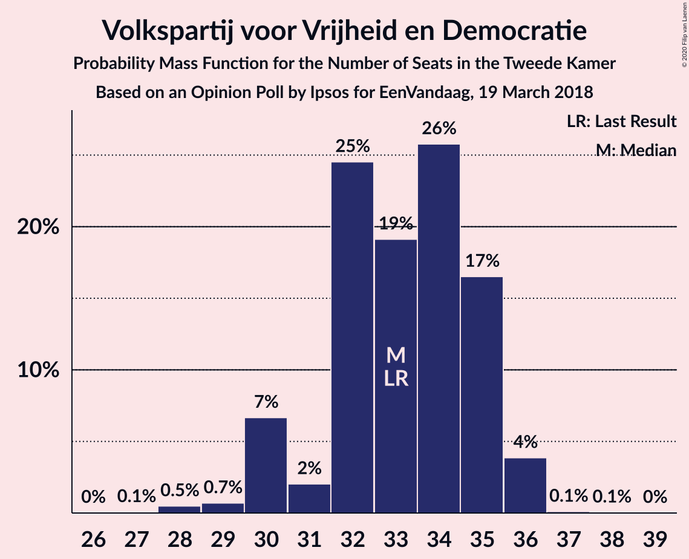
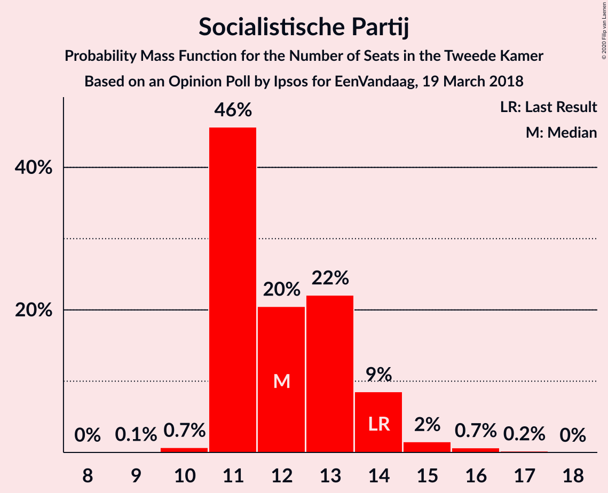
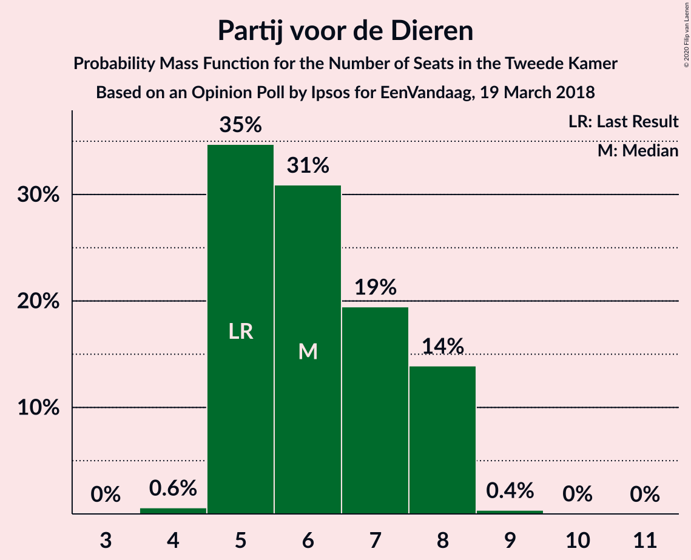
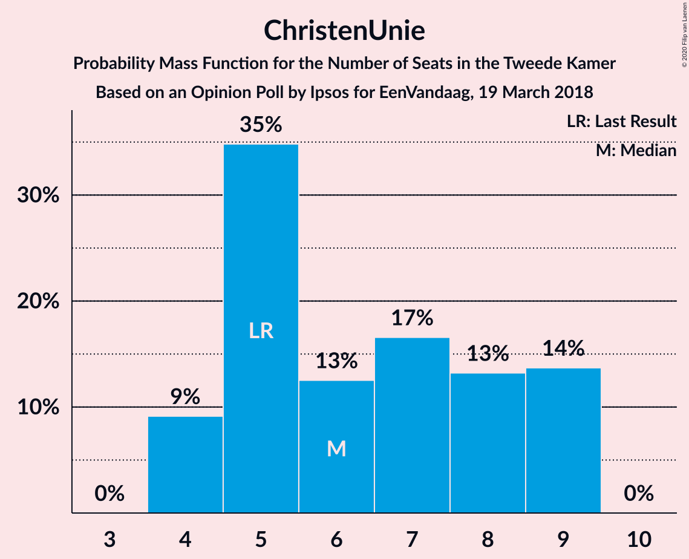
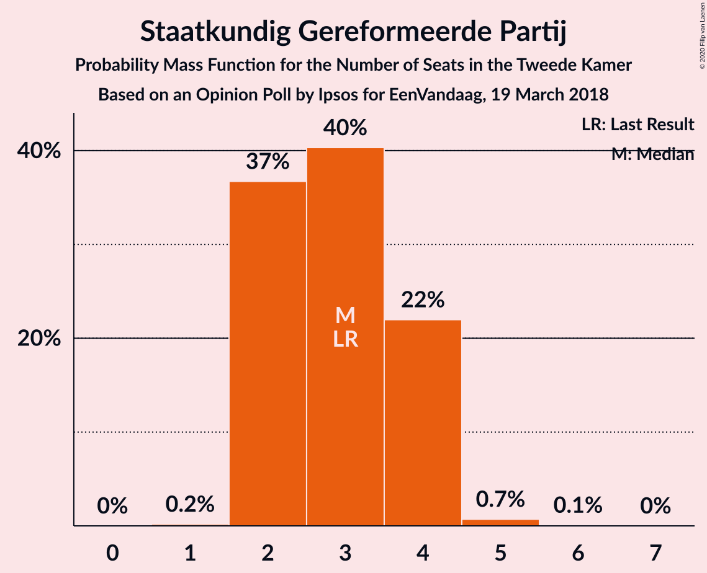
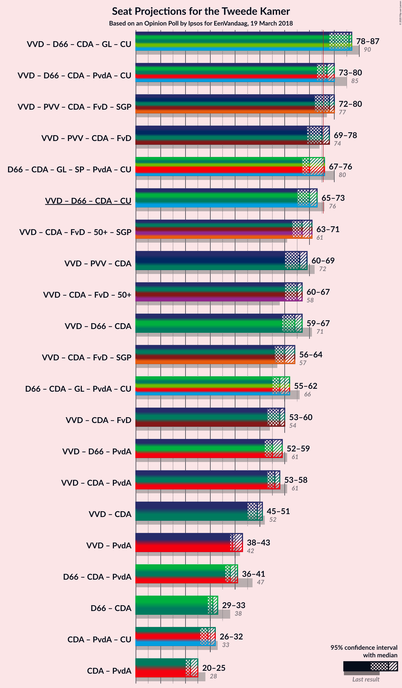
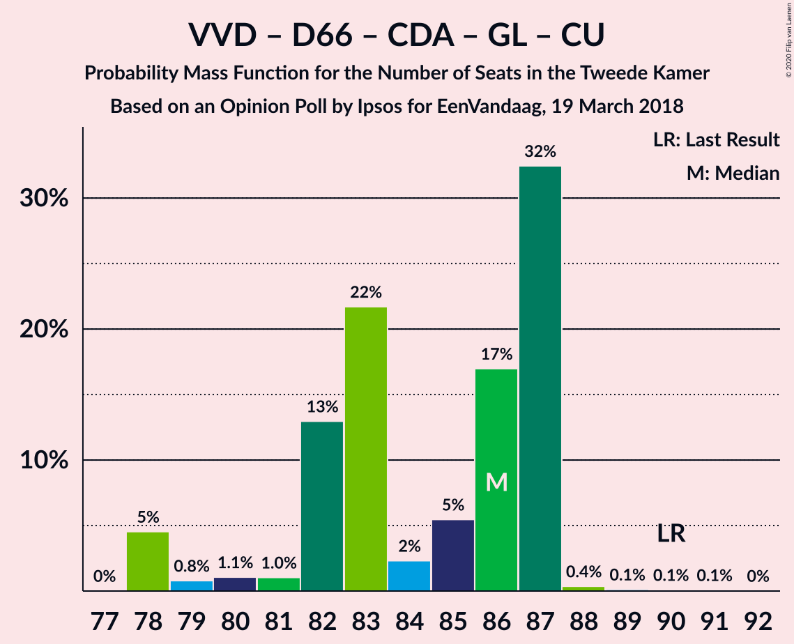
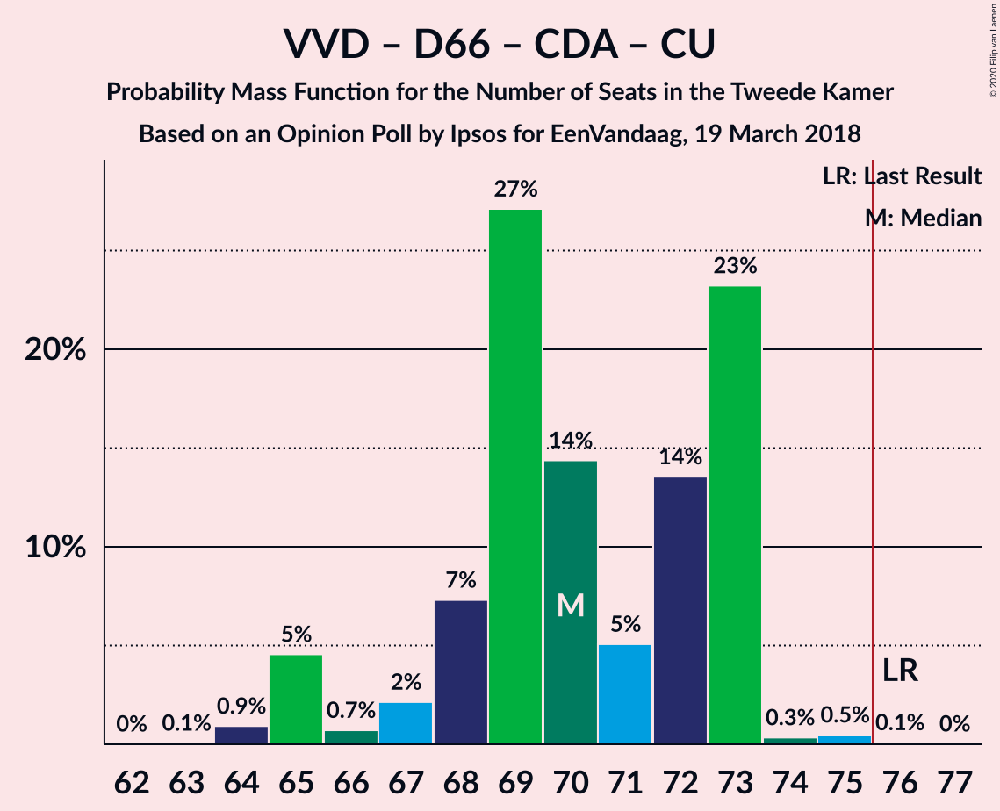
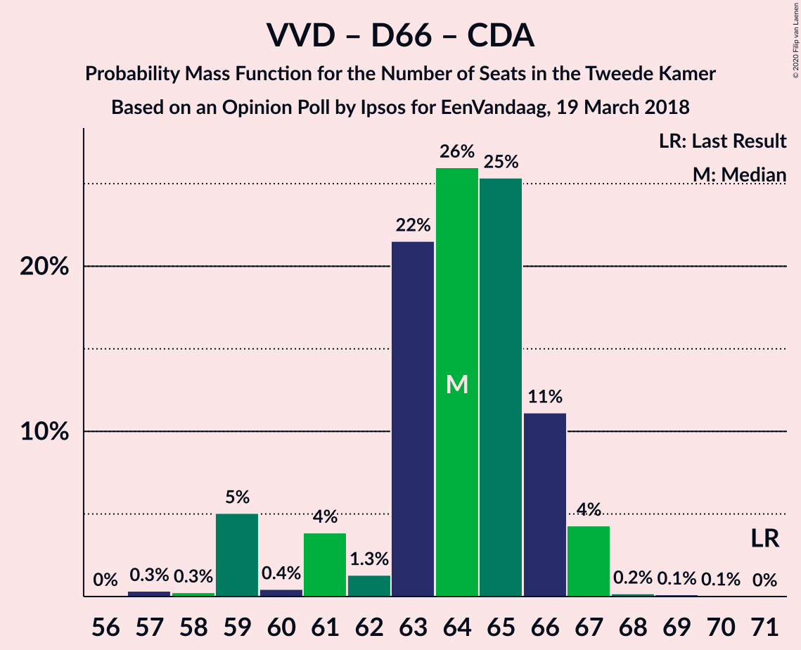
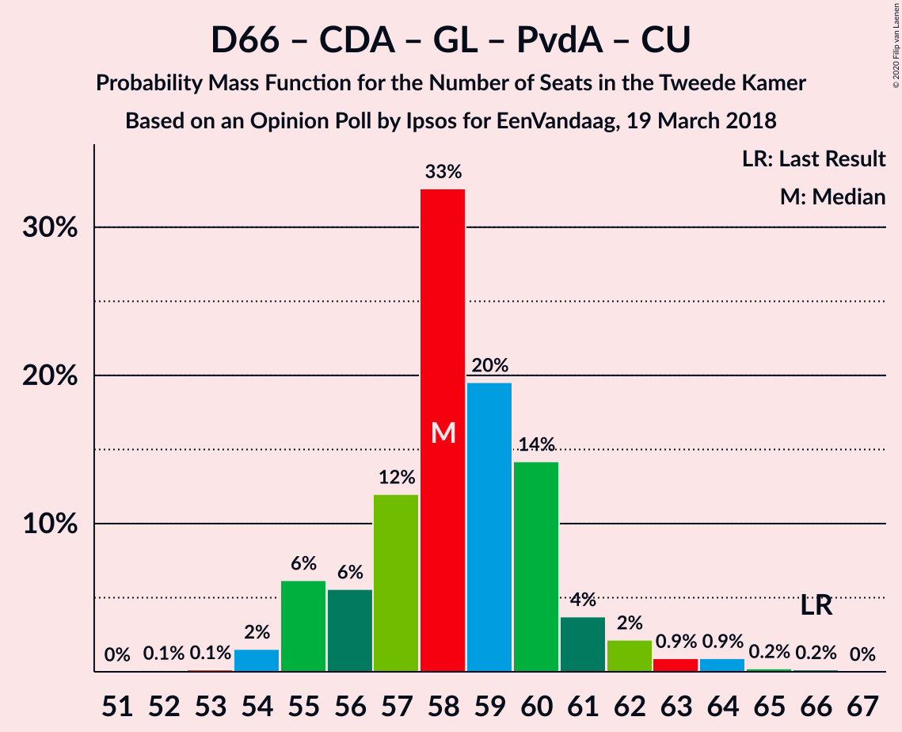

# Opinion Poll by Ipsos for EenVandaag, 19 March 2018

<a href="#voting-intentions">Voting Intentions</a> | <a href="#seats">Seats</a> | <a href="#coalitions">Coalitions</a> | <a href="#technical-information">Technical Information</a>

## Voting Intentions

### Confidence Intervals

| Party | Last Result | Poll Result | 80% Confidence Interval | 90% Confidence Interval | 95% Confidence Interval | 99% Confidence Interval |
|:-----:|:-----------:|:-----------:|:-----------------------:|:-----------------------:|:-----------------------:|:-----------------------:|
| Volkspartij voor Vrijheid en Democratie | 21.3% | 21.0% | 19.5–22.6% |19.1–23.0% |18.7–23.4% |18.0–24.2% |
| Democraten 66 | 12.2% | 10.5% | 9.4–11.7% |9.1–12.1% |8.8–12.4% |8.4–13.0% |
| Partij voor de Vrijheid | 13.1% | 10.4% | 9.3–11.6% |9.0–12.0% |8.8–12.3% |8.3–12.9% |
| Christen-Democratisch Appèl | 12.4% | 10.2% | 9.2–11.4% |8.9–11.8% |8.6–12.1% |8.1–12.7% |
| GroenLinks | 9.1% | 9.5% | 8.5–10.7% |8.2–11.1% |8.0–11.4% |7.5–12.0% |
| Socialistische Partij | 9.1% | 8.5% | 7.5–9.6% |7.3–10.0% |7.0–10.3% |6.6–10.8% |
| Forum voor Democratie | 1.8% | 5.9% | 5.1–6.9% |4.9–7.2% |4.7–7.4% |4.3–7.9% |
| Partij van de Arbeid | 5.7% | 5.1% | 4.3–6.0% |4.1–6.3% |3.9–6.5% |3.6–7.0% |
| 50Plus | 3.1% | 4.6% | 3.9–5.5% |3.7–5.8% |3.6–6.0% |3.3–6.5% |
| Partij voor de Dieren | 3.2% | 4.5% | 3.8–5.3% |3.6–5.6% |3.4–5.8% |3.1–6.3% |
| ChristenUnie | 3.4% | 4.3% | 3.6–5.2% |3.4–5.4% |3.3–5.6% |3.0–6.1% |
| DENK | 2.1% | 2.5% | 2.0–3.2% |1.9–3.4% |1.7–3.6% |1.5–3.9% |
| Staatkundig Gereformeerde Partij | 2.1% | 2.2% | 1.8–2.9% |1.6–3.1% |1.5–3.3% |1.3–3.6% |

*Note:* The poll result column reflects the actual value used in the calculations. Published results may vary slightly, and in addition be rounded to fewer digits.

## Seats

### Confidence Intervals

| Party | Last Result | Median | 80% Confidence Interval | 90% Confidence Interval | 95% Confidence Interval | 99% Confidence Interval |
|:-----:|:-----------:|:------:|:-----------------------:|:-----------------------:|:-----------------------:|:-----------------------:|
| <a href="#volkspartij-voor-vrijheid-en-democratie">Volkspartij voor Vrijheid en Democratie</a> | 33 | 33 | 32–35 |30–35 |30–36 |28–36 |
| <a href="#democraten-66">Democraten 66</a> | 19 | 15 | 15–16 |14–17 |14–17 |12–19 |
| <a href="#partij-voor-de-vrijheid">Partij voor de Vrijheid</a> | 20 | 17 | 15–20 |14–20 |14–20 |13–20 |
| <a href="#christen-democratisch-appèl">Christen-Democratisch Appèl</a> | 19 | 15 | 14–17 |13–17 |13–17 |12–20 |
| <a href="#groenlinks">GroenLinks</a> | 14 | 14 | 13–16 |13–16 |13–16 |11–17 |
| <a href="#socialistische-partij">Socialistische Partij</a> | 14 | 12 | 11–14 |11–14 |11–14 |10–16 |
| <a href="#forum-voor-democratie">Forum voor Democratie</a> | 2 | 9 | 7–10 |7–11 |7–11 |7–12 |
| <a href="#partij-van-de-arbeid">Partij van de Arbeid</a> | 9 | 7 | 6–9 |6–9 |6–9 |6–10 |
| <a href="#50plus">50Plus</a> | 4 | 7 | 6–8 |6–9 |6–9 |5–9 |
| <a href="#partij-voor-de-dieren">Partij voor de Dieren</a> | 5 | 6 | 5–8 |5–8 |5–8 |4–8 |
| <a href="#christenunie">ChristenUnie</a> | 5 | 6 | 5–9 |4–9 |4–9 |4–9 |
| <a href="#denk">DENK</a> | 3 | 3 | 3–4 |2–5 |2–5 |2–5 |
| <a href="#staatkundig-gereformeerde-partij">Staatkundig Gereformeerde Partij</a> | 3 | 3 | 2–4 |2–4 |2–4 |2–5 |

### Volkspartij voor Vrijheid en Democratie

*For a full overview of the results for this party, see the [Volkspartij voor Vrijheid en Democratie](party-volkspartijvoorvrijheidendemocratie.html) page.*

| Number of Seats | Probability | Accumulated | Special Marks |
|:---------------:|:-----------:|:-----------:|:-------------:|
| 27 | 0.1% | 100% |  |
| 28 | 0.5% | 99.9% |  |
| 29 | 0.7% | 99.4% |  |
| 30 | 7% | 98.7% |  |
| 31 | 2% | 92% |  |
| 32 | 25% | 90% |  |
| 33 | 19% | 65% | Last Result, Median |
| 34 | 26% | 46% |  |
| 35 | 17% | 21% |  |
| 36 | 4% | 4% |  |
| 37 | 0.1% | 0.2% |  |
| 38 | 0.1% | 0.1% |  |
| 39 | 0% | 0% |  |

### Democraten 66

*For a full overview of the results for this party, see the [Democraten 66](party-democraten66.html) page.*

| Number of Seats | Probability | Accumulated | Special Marks |
|:---------------:|:-----------:|:-----------:|:-------------:|
| 12 | 0.5% | 100% |  |
| 13 | 0.7% | 99.5% |  |
| 14 | 7% | 98.8% |  |
| 15 | 48% | 92% | Median |
| 16 | 35% | 43% |  |
| 17 | 7% | 9% |  |
| 18 | 0.8% | 2% |  |
| 19 | 1.0% | 1.2% | Last Result |
| 20 | 0.2% | 0.2% |  |
| 21 | 0% | 0% |  |

### Partij voor de Vrijheid

*For a full overview of the results for this party, see the [Partij voor de Vrijheid](party-partijvoordevrijheid.html) page.*

| Number of Seats | Probability | Accumulated | Special Marks |
|:---------------:|:-----------:|:-----------:|:-------------:|
| 12 | 0.1% | 100% |  |
| 13 | 0.8% | 99.8% |  |
| 14 | 6% | 99.0% |  |
| 15 | 20% | 93% |  |
| 16 | 9% | 74% |  |
| 17 | 36% | 65% | Median |
| 18 | 3% | 29% |  |
| 19 | 6% | 26% |  |
| 20 | 20% | 20% | Last Result |
| 21 | 0.1% | 0.2% |  |
| 22 | 0% | 0% |  |

### Christen-Democratisch Appèl

*For a full overview of the results for this party, see the [Christen-Democratisch Appèl](party-christen-democratischappèl.html) page.*

| Number of Seats | Probability | Accumulated | Special Marks |
|:---------------:|:-----------:|:-----------:|:-------------:|
| 12 | 0.5% | 100% |  |
| 13 | 8% | 99.5% |  |
| 14 | 14% | 92% |  |
| 15 | 40% | 78% | Median |
| 16 | 15% | 38% |  |
| 17 | 22% | 23% |  |
| 18 | 0.5% | 1.2% |  |
| 19 | 0.2% | 0.7% | Last Result |
| 20 | 0.5% | 0.5% |  |
| 21 | 0% | 0% |  |

### GroenLinks

*For a full overview of the results for this party, see the [GroenLinks](party-groenlinks.html) page.*

| Number of Seats | Probability | Accumulated | Special Marks |
|:---------------:|:-----------:|:-----------:|:-------------:|
| 10 | 0.2% | 100% |  |
| 11 | 0.6% | 99.8% |  |
| 12 | 1.5% | 99.2% |  |
| 13 | 16% | 98% |  |
| 14 | 51% | 82% | Last Result, Median |
| 15 | 15% | 31% |  |
| 16 | 14% | 16% |  |
| 17 | 2% | 2% |  |
| 18 | 0.1% | 0.2% |  |
| 19 | 0% | 0.1% |  |
| 20 | 0% | 0% |  |

### Socialistische Partij

*For a full overview of the results for this party, see the [Socialistische Partij](party-socialistischepartij.html) page.*

| Number of Seats | Probability | Accumulated | Special Marks |
|:---------------:|:-----------:|:-----------:|:-------------:|
| 9 | 0.1% | 100% |  |
| 10 | 0.7% | 99.9% |  |
| 11 | 46% | 99.2% |  |
| 12 | 20% | 53% | Median |
| 13 | 22% | 33% |  |
| 14 | 9% | 11% | Last Result |
| 15 | 2% | 2% |  |
| 16 | 0.7% | 0.9% |  |
| 17 | 0.2% | 0.2% |  |
| 18 | 0% | 0% |  |

### Forum voor Democratie

*For a full overview of the results for this party, see the [Forum voor Democratie](party-forumvoordemocratie.html) page.*

| Number of Seats | Probability | Accumulated | Special Marks |
|:---------------:|:-----------:|:-----------:|:-------------:|
| 2 | 0% | 100% | Last Result |
| 3 | 0% | 100% |  |
| 4 | 0% | 100% |  |
| 5 | 0% | 100% |  |
| 6 | 0.1% | 100% |  |
| 7 | 14% | 99.9% |  |
| 8 | 10% | 85% |  |
| 9 | 38% | 75% | Median |
| 10 | 31% | 37% |  |
| 11 | 5% | 6% |  |
| 12 | 0.2% | 0.7% |  |
| 13 | 0.5% | 0.5% |  |
| 14 | 0% | 0% |  |

### Partij van de Arbeid

*For a full overview of the results for this party, see the [Partij van de Arbeid](party-partijvandearbeid.html) page.*

| Number of Seats | Probability | Accumulated | Special Marks |
|:---------------:|:-----------:|:-----------:|:-------------:|
| 5 | 0.4% | 100% |  |
| 6 | 40% | 99.6% |  |
| 7 | 35% | 60% | Median |
| 8 | 14% | 24% |  |
| 9 | 9% | 10% | Last Result |
| 10 | 0.6% | 0.7% |  |
| 11 | 0.1% | 0.1% |  |
| 12 | 0% | 0% |  |

### 50Plus

*For a full overview of the results for this party, see the [50Plus](party-50plus.html) page.*

| Number of Seats | Probability | Accumulated | Special Marks |
|:---------------:|:-----------:|:-----------:|:-------------:|
| 4 | 0.2% | 100% | Last Result |
| 5 | 1.2% | 99.8% |  |
| 6 | 24% | 98.5% |  |
| 7 | 52% | 75% | Median |
| 8 | 12% | 22% |  |
| 9 | 10% | 10% |  |
| 10 | 0.3% | 0.3% |  |
| 11 | 0% | 0% |  |

### Partij voor de Dieren

*For a full overview of the results for this party, see the [Partij voor de Dieren](party-partijvoordedieren.html) page.*

| Number of Seats | Probability | Accumulated | Special Marks |
|:---------------:|:-----------:|:-----------:|:-------------:|
| 4 | 0.6% | 100% |  |
| 5 | 35% | 99.4% | Last Result |
| 6 | 31% | 65% | Median |
| 7 | 19% | 34% |  |
| 8 | 14% | 14% |  |
| 9 | 0.4% | 0.4% |  |
| 10 | 0% | 0.1% |  |
| 11 | 0% | 0% |  |

### ChristenUnie

*For a full overview of the results for this party, see the [ChristenUnie](party-christenunie.html) page.*

| Number of Seats | Probability | Accumulated | Special Marks |
|:---------------:|:-----------:|:-----------:|:-------------:|
| 4 | 9% | 100% |  |
| 5 | 35% | 91% | Last Result |
| 6 | 13% | 56% | Median |
| 7 | 17% | 44% |  |
| 8 | 13% | 27% |  |
| 9 | 14% | 14% |  |
| 10 | 0% | 0% |  |

### DENK

*For a full overview of the results for this party, see the [DENK](party-denk.html) page.*

| Number of Seats | Probability | Accumulated | Special Marks |
|:---------------:|:-----------:|:-----------:|:-------------:|
| 2 | 9% | 100% |  |
| 3 | 50% | 91% | Last Result, Median |
| 4 | 34% | 41% |  |
| 5 | 6% | 6% |  |
| 6 | 0.2% | 0.2% |  |
| 7 | 0% | 0% |  |

### Staatkundig Gereformeerde Partij

*For a full overview of the results for this party, see the [Staatkundig Gereformeerde Partij](party-staatkundiggereformeerdepartij.html) page.*

| Number of Seats | Probability | Accumulated | Special Marks |
|:---------------:|:-----------:|:-----------:|:-------------:|
| 1 | 0.2% | 100% |  |
| 2 | 37% | 99.8% |  |
| 3 | 40% | 63% | Last Result, Median |
| 4 | 22% | 23% |  |
| 5 | 0.7% | 0.8% |  |
| 6 | 0.1% | 0.1% |  |
| 7 | 0% | 0% |  |

## Coalitions

### Confidence Intervals

| Coalition | Last Result | Median | Majority? | 80% Confidence Interval | 90% Confidence Interval | 95% Confidence Interval | 99% Confidence Interval |
|:---------:|:-----------:|:------:|:---------:|:-----------------------:|:-----------------------:|:-----------------------:|:-----------------------:|
| Volkspartij voor Vrijheid en Democratie – Democraten 66 – Christen-Democratisch Appèl – GroenLinks – ChristenUnie | 90 | 86 | 100% | 82–87 | 79–87 | 78–87 | 78–88 |
| Volkspartij voor Vrijheid en Democratie – Democraten 66 – Christen-Democratisch Appèl – Partij van de Arbeid – ChristenUnie | 85 | 77 | 92% | 76–80 | 73–80 | 73–80 | 71–82 |
| Volkspartij voor Vrijheid en Democratie – Partij voor de Vrijheid – Christen-Democratisch Appèl – Forum voor Democratie – Staatkundig Gereformeerde Partij | 77 | 78 | 85% | 74–80 | 73–80 | 72–80 | 71–82 |
| Volkspartij voor Vrijheid en Democratie – Partij voor de Vrijheid – Christen-Democratisch Appèl – Forum voor Democratie | 74 | 75 | 27% | 71–78 | 69–78 | 69–78 | 67–79 |
| Democraten 66 – Christen-Democratisch Appèl – GroenLinks – Socialistische Partij – Partij van de Arbeid – ChristenUnie | 80 | 70 | 4% | 68–72 | 67–75 | 67–76 | 67–77 |
| Volkspartij voor Vrijheid en Democratie – Democraten 66 – Christen-Democratisch Appèl – ChristenUnie | 76 | 70 | 0.1% | 68–73 | 65–73 | 65–73 | 64–75 |
| Volkspartij voor Vrijheid en Democratie – Christen-Democratisch Appèl – Forum voor Democratie – 50Plus – Staatkundig Gereformeerde Partij | 61 | 67 | 0% | 64–71 | 64–71 | 63–71 | 61–72 |
| Volkspartij voor Vrijheid en Democratie – Partij voor de Vrijheid – Christen-Democratisch Appèl | 72 | 66 | 0% | 61–69 | 61–69 | 60–69 | 59–69 |
| Volkspartij voor Vrijheid en Democratie – Christen-Democratisch Appèl – Forum voor Democratie – 50Plus | 58 | 65 | 0% | 62–67 | 62–67 | 60–67 | 58–69 |
| Volkspartij voor Vrijheid en Democratie – Democraten 66 – Christen-Democratisch Appèl | 71 | 64 | 0% | 61–66 | 59–66 | 59–67 | 58–67 |
| Volkspartij voor Vrijheid en Democratie – Christen-Democratisch Appèl – Forum voor Democratie – Staatkundig Gereformeerde Partij | 57 | 60 | 0% | 58–64 | 57–64 | 56–64 | 55–65 |
| Democraten 66 – Christen-Democratisch Appèl – GroenLinks – Partij van de Arbeid – ChristenUnie | 66 | 58 | 0% | 56–60 | 55–61 | 55–62 | 54–64 |
| Volkspartij voor Vrijheid en Democratie – Christen-Democratisch Appèl – Forum voor Democratie | 54 | 58 | 0% | 55–60 | 54–60 | 53–60 | 51–62 |
| Volkspartij voor Vrijheid en Democratie – Democraten 66 – Partij van de Arbeid | 61 | 55 | 0% | 54–59 | 52–59 | 52–59 | 51–60 |
| Volkspartij voor Vrijheid en Democratie – Christen-Democratisch Appèl – Partij van de Arbeid | 61 | 56 | 0% | 53–57 | 53–58 | 53–58 | 51–60 |
| Volkspartij voor Vrijheid en Democratie – Christen-Democratisch Appèl | 52 | 49 | 0% | 46–50 | 45–51 | 45–51 | 43–51 |
| Volkspartij voor Vrijheid en Democratie – Partij van de Arbeid | 42 | 39 | 0% | 39–43 | 38–43 | 38–43 | 36–44 |
| Democraten 66 – Christen-Democratisch Appèl – Partij van de Arbeid | 47 | 38 | 0% | 36–39 | 36–40 | 36–41 | 33–44 |
| Democraten 66 – Christen-Democratisch Appèl | 38 | 31 | 0% | 29–32 | 29–32 | 29–33 | 26–36 |
| Christen-Democratisch Appèl – Partij van de Arbeid – ChristenUnie | 33 | 29 | 0% | 26–30 | 26–30 | 26–32 | 24–33 |
| Christen-Democratisch Appèl – Partij van de Arbeid | 28 | 22 | 0% | 21–24 | 20–24 | 20–25 | 19–27 |

### Volkspartij voor Vrijheid en Democratie – Democraten 66 – Christen-Democratisch Appèl – GroenLinks – ChristenUnie

| Number of Seats | Probability | Accumulated | Special Marks |
|:---------------:|:-----------:|:-----------:|:-------------:|
| 78 | 5% | 100% |  |
| 79 | 0.8% | 95% |  |
| 80 | 1.1% | 95% |  |
| 81 | 1.0% | 94% |  |
| 82 | 13% | 93% |  |
| 83 | 22% | 80% | Median |
| 84 | 2% | 58% |  |
| 85 | 5% | 56% |  |
| 86 | 17% | 50% |  |
| 87 | 32% | 33% |  |
| 88 | 0.4% | 0.7% |  |
| 89 | 0.1% | 0.3% |  |
| 90 | 0.1% | 0.2% | Last Result |
| 91 | 0.1% | 0.1% |  |
| 92 | 0% | 0% |  |

### Volkspartij voor Vrijheid en Democratie – Democraten 66 – Christen-Democratisch Appèl – Partij van de Arbeid – ChristenUnie

| Number of Seats | Probability | Accumulated | Special Marks |
|:---------------:|:-----------:|:-----------:|:-------------:|
| 70 | 0.5% | 100% |  |
| 71 | 0.4% | 99.5% |  |
| 72 | 0.4% | 99.1% |  |
| 73 | 5% | 98.8% |  |
| 74 | 0.7% | 94% |  |
| 75 | 1.2% | 93% |  |
| 76 | 32% | 92% | Median, Majority |
| 77 | 21% | 60% |  |
| 78 | 14% | 40% |  |
| 79 | 12% | 26% |  |
| 80 | 12% | 14% |  |
| 81 | 0.9% | 2% |  |
| 82 | 0.7% | 1.1% |  |
| 83 | 0.3% | 0.5% |  |
| 84 | 0.1% | 0.1% |  |
| 85 | 0% | 0% | Last Result |

### Volkspartij voor Vrijheid en Democratie – Partij voor de Vrijheid – Christen-Democratisch Appèl – Forum voor Democratie – Staatkundig Gereformeerde Partij

| Number of Seats | Probability | Accumulated | Special Marks |
|:---------------:|:-----------:|:-----------:|:-------------:|
| 67 | 0.1% | 100% |  |
| 68 | 0% | 99.9% |  |
| 69 | 0.1% | 99.9% |  |
| 70 | 0.2% | 99.8% |  |
| 71 | 2% | 99.6% |  |
| 72 | 2% | 98% |  |
| 73 | 6% | 96% |  |
| 74 | 1.4% | 91% |  |
| 75 | 4% | 89% |  |
| 76 | 17% | 85% | Majority |
| 77 | 7% | 68% | Last Result, Median |
| 78 | 23% | 61% |  |
| 79 | 18% | 38% |  |
| 80 | 20% | 20% |  |
| 81 | 0.2% | 0.7% |  |
| 82 | 0.5% | 0.5% |  |
| 83 | 0% | 0% |  |

### Volkspartij voor Vrijheid en Democratie – Partij voor de Vrijheid – Christen-Democratisch Appèl – Forum voor Democratie

| Number of Seats | Probability | Accumulated | Special Marks |
|:---------------:|:-----------:|:-----------:|:-------------:|
| 65 | 0.1% | 100% |  |
| 66 | 0.2% | 99.8% |  |
| 67 | 0.2% | 99.6% |  |
| 68 | 2% | 99.4% |  |
| 69 | 6% | 98% |  |
| 70 | 2% | 92% |  |
| 71 | 1.3% | 91% |  |
| 72 | 8% | 89% |  |
| 73 | 5% | 81% |  |
| 74 | 10% | 76% | Last Result, Median |
| 75 | 40% | 67% |  |
| 76 | 7% | 27% | Majority |
| 77 | 0.3% | 20% |  |
| 78 | 19% | 20% |  |
| 79 | 0.5% | 0.5% |  |
| 80 | 0.1% | 0.1% |  |
| 81 | 0% | 0% |  |

### Democraten 66 – Christen-Democratisch Appèl – GroenLinks – Socialistische Partij – Partij van de Arbeid – ChristenUnie

| Number of Seats | Probability | Accumulated | Special Marks |
|:---------------:|:-----------:|:-----------:|:-------------:|
| 66 | 0.1% | 100% |  |
| 67 | 6% | 99.8% |  |
| 68 | 11% | 93% |  |
| 69 | 14% | 82% | Median |
| 70 | 20% | 68% |  |
| 71 | 33% | 48% |  |
| 72 | 6% | 15% |  |
| 73 | 3% | 9% |  |
| 74 | 1.0% | 6% |  |
| 75 | 1.3% | 5% |  |
| 76 | 3% | 4% | Majority |
| 77 | 1.0% | 1.4% |  |
| 78 | 0.3% | 0.4% |  |
| 79 | 0% | 0% |  |
| 80 | 0% | 0% | Last Result |

### Volkspartij voor Vrijheid en Democratie – Democraten 66 – Christen-Democratisch Appèl – ChristenUnie

| Number of Seats | Probability | Accumulated | Special Marks |
|:---------------:|:-----------:|:-----------:|:-------------:|
| 63 | 0.1% | 100% |  |
| 64 | 0.9% | 99.9% |  |
| 65 | 5% | 99.0% |  |
| 66 | 0.7% | 94% |  |
| 67 | 2% | 94% |  |
| 68 | 7% | 92% |  |
| 69 | 27% | 84% | Median |
| 70 | 14% | 57% |  |
| 71 | 5% | 43% |  |
| 72 | 14% | 38% |  |
| 73 | 23% | 24% |  |
| 74 | 0.3% | 0.9% |  |
| 75 | 0.5% | 0.6% |  |
| 76 | 0.1% | 0.1% | Last Result, Majority |
| 77 | 0% | 0% |  |

### Volkspartij voor Vrijheid en Democratie – Christen-Democratisch Appèl – Forum voor Democratie – 50Plus – Staatkundig Gereformeerde Partij

| Number of Seats | Probability | Accumulated | Special Marks |
|:---------------:|:-----------:|:-----------:|:-------------:|
| 59 | 0.1% | 100% |  |
| 60 | 0.2% | 99.9% |  |
| 61 | 1.2% | 99.7% | Last Result |
| 62 | 0.5% | 98.5% |  |
| 63 | 1.1% | 98% |  |
| 64 | 7% | 97% |  |
| 65 | 4% | 90% |  |
| 66 | 1.0% | 85% |  |
| 67 | 46% | 85% | Median |
| 68 | 14% | 39% |  |
| 69 | 7% | 25% |  |
| 70 | 6% | 18% |  |
| 71 | 11% | 12% |  |
| 72 | 0.6% | 0.8% |  |
| 73 | 0.1% | 0.2% |  |
| 74 | 0% | 0% |  |

### Volkspartij voor Vrijheid en Democratie – Partij voor de Vrijheid – Christen-Democratisch Appèl

| Number of Seats | Probability | Accumulated | Special Marks |
|:---------------:|:-----------:|:-----------:|:-------------:|
| 57 | 0.1% | 100% |  |
| 58 | 0.3% | 99.9% |  |
| 59 | 0.5% | 99.5% |  |
| 60 | 2% | 99.1% |  |
| 61 | 10% | 97% |  |
| 62 | 2% | 87% |  |
| 63 | 2% | 85% |  |
| 64 | 1.1% | 83% |  |
| 65 | 27% | 82% | Median |
| 66 | 26% | 55% |  |
| 67 | 9% | 29% |  |
| 68 | 0.3% | 20% |  |
| 69 | 20% | 20% |  |
| 70 | 0% | 0.1% |  |
| 71 | 0% | 0% |  |
| 72 | 0% | 0% | Last Result |

### Volkspartij voor Vrijheid en Democratie – Christen-Democratisch Appèl – Forum voor Democratie – 50Plus

| Number of Seats | Probability | Accumulated | Special Marks |
|:---------------:|:-----------:|:-----------:|:-------------:|
| 57 | 0.2% | 100% |  |
| 58 | 1.3% | 99.7% | Last Result |
| 59 | 0.8% | 98% |  |
| 60 | 0.5% | 98% |  |
| 61 | 2% | 97% |  |
| 62 | 10% | 95% |  |
| 63 | 6% | 86% |  |
| 64 | 19% | 80% | Median |
| 65 | 36% | 61% |  |
| 66 | 7% | 25% |  |
| 67 | 17% | 18% |  |
| 68 | 0.1% | 1.0% |  |
| 69 | 0.6% | 0.9% |  |
| 70 | 0.2% | 0.2% |  |
| 71 | 0% | 0% |  |

### Volkspartij voor Vrijheid en Democratie – Democraten 66 – Christen-Democratisch Appèl

| Number of Seats | Probability | Accumulated | Special Marks |
|:---------------:|:-----------:|:-----------:|:-------------:|
| 57 | 0.3% | 100% |  |
| 58 | 0.3% | 99.6% |  |
| 59 | 5% | 99.4% |  |
| 60 | 0.4% | 94% |  |
| 61 | 4% | 94% |  |
| 62 | 1.3% | 90% |  |
| 63 | 22% | 89% | Median |
| 64 | 26% | 67% |  |
| 65 | 25% | 41% |  |
| 66 | 11% | 16% |  |
| 67 | 4% | 5% |  |
| 68 | 0.2% | 0.4% |  |
| 69 | 0.1% | 0.2% |  |
| 70 | 0.1% | 0.1% |  |
| 71 | 0% | 0% | Last Result |

### Volkspartij voor Vrijheid en Democratie – Christen-Democratisch Appèl – Forum voor Democratie – Staatkundig Gereformeerde Partij

| Number of Seats | Probability | Accumulated | Special Marks |
|:---------------:|:-----------:|:-----------:|:-------------:|
| 52 | 0% | 100% |  |
| 53 | 0.2% | 99.9% |  |
| 54 | 0.2% | 99.8% |  |
| 55 | 1.3% | 99.5% |  |
| 56 | 1.1% | 98% |  |
| 57 | 4% | 97% | Last Result |
| 58 | 8% | 94% |  |
| 59 | 14% | 86% |  |
| 60 | 25% | 72% | Median |
| 61 | 24% | 46% |  |
| 62 | 8% | 22% |  |
| 63 | 3% | 14% |  |
| 64 | 11% | 12% |  |
| 65 | 0.2% | 0.6% |  |
| 66 | 0.4% | 0.5% |  |
| 67 | 0% | 0% |  |

### Democraten 66 – Christen-Democratisch Appèl – GroenLinks – Partij van de Arbeid – ChristenUnie

| Number of Seats | Probability | Accumulated | Special Marks |
|:---------------:|:-----------:|:-----------:|:-------------:|
| 52 | 0.1% | 100% |  |
| 53 | 0.1% | 99.9% |  |
| 54 | 2% | 99.7% |  |
| 55 | 6% | 98% |  |
| 56 | 6% | 92% |  |
| 57 | 12% | 86% | Median |
| 58 | 33% | 74% |  |
| 59 | 20% | 42% |  |
| 60 | 14% | 22% |  |
| 61 | 4% | 8% |  |
| 62 | 2% | 4% |  |
| 63 | 0.9% | 2% |  |
| 64 | 0.9% | 1.3% |  |
| 65 | 0.2% | 0.4% |  |
| 66 | 0.2% | 0.2% | Last Result |
| 67 | 0% | 0% |  |

### Volkspartij voor Vrijheid en Democratie – Christen-Democratisch Appèl – Forum voor Democratie

| Number of Seats | Probability | Accumulated | Special Marks |
|:---------------:|:-----------:|:-----------:|:-------------:|
| 49 | 0.1% | 100% |  |
| 50 | 0.2% | 99.9% |  |
| 51 | 0.3% | 99.7% |  |
| 52 | 1.4% | 99.4% |  |
| 53 | 1.0% | 98% |  |
| 54 | 2% | 97% | Last Result |
| 55 | 8% | 95% |  |
| 56 | 11% | 87% |  |
| 57 | 10% | 76% | Median |
| 58 | 44% | 66% |  |
| 59 | 7% | 22% |  |
| 60 | 14% | 14% |  |
| 61 | 0.2% | 0.9% |  |
| 62 | 0.3% | 0.7% |  |
| 63 | 0.4% | 0.4% |  |
| 64 | 0% | 0% |  |

### Volkspartij voor Vrijheid en Democratie – Democraten 66 – Partij van de Arbeid

| Number of Seats | Probability | Accumulated | Special Marks |
|:---------------:|:-----------:|:-----------:|:-------------:|
| 48 | 0.1% | 100% |  |
| 49 | 0.1% | 99.9% |  |
| 50 | 0.1% | 99.9% |  |
| 51 | 0.3% | 99.8% |  |
| 52 | 6% | 99.4% |  |
| 53 | 1.5% | 93% |  |
| 54 | 34% | 92% |  |
| 55 | 14% | 58% | Median |
| 56 | 17% | 44% |  |
| 57 | 0.6% | 27% |  |
| 58 | 10% | 26% |  |
| 59 | 16% | 16% |  |
| 60 | 0.3% | 0.8% |  |
| 61 | 0.4% | 0.5% | Last Result |
| 62 | 0% | 0.1% |  |
| 63 | 0% | 0% |  |

### Volkspartij voor Vrijheid en Democratie – Christen-Democratisch Appèl – Partij van de Arbeid

| Number of Seats | Probability | Accumulated | Special Marks |
|:---------------:|:-----------:|:-----------:|:-------------:|
| 49 | 0.1% | 100% |  |
| 50 | 0.3% | 99.9% |  |
| 51 | 1.5% | 99.6% |  |
| 52 | 0.6% | 98% |  |
| 53 | 11% | 98% |  |
| 54 | 16% | 87% |  |
| 55 | 10% | 71% | Median |
| 56 | 37% | 61% |  |
| 57 | 18% | 23% |  |
| 58 | 4% | 5% |  |
| 59 | 0.3% | 1.2% |  |
| 60 | 0.8% | 0.9% |  |
| 61 | 0.1% | 0.1% | Last Result |
| 62 | 0.1% | 0.1% |  |
| 63 | 0% | 0% |  |

### Volkspartij voor Vrijheid en Democratie – Christen-Democratisch Appèl

| Number of Seats | Probability | Accumulated | Special Marks |
|:---------------:|:-----------:|:-----------:|:-------------:|
| 41 | 0.1% | 100% |  |
| 42 | 0.3% | 99.9% |  |
| 43 | 0.3% | 99.6% |  |
| 44 | 2% | 99.3% |  |
| 45 | 6% | 98% |  |
| 46 | 2% | 92% |  |
| 47 | 14% | 90% |  |
| 48 | 14% | 76% | Median |
| 49 | 34% | 61% |  |
| 50 | 21% | 27% |  |
| 51 | 6% | 7% |  |
| 52 | 0.1% | 0.3% | Last Result |
| 53 | 0.1% | 0.1% |  |
| 54 | 0% | 0% |  |

### Volkspartij voor Vrijheid en Democratie – Partij van de Arbeid

| Number of Seats | Probability | Accumulated | Special Marks |
|:---------------:|:-----------:|:-----------:|:-------------:|
| 34 | 0.2% | 100% |  |
| 35 | 0.1% | 99.7% |  |
| 36 | 0.5% | 99.7% |  |
| 37 | 1.4% | 99.1% |  |
| 38 | 6% | 98% |  |
| 39 | 42% | 92% |  |
| 40 | 21% | 50% | Median |
| 41 | 3% | 29% |  |
| 42 | 9% | 26% | Last Result |
| 43 | 16% | 17% |  |
| 44 | 0.6% | 0.8% |  |
| 45 | 0.1% | 0.2% |  |
| 46 | 0% | 0.1% |  |
| 47 | 0% | 0% |  |

### Democraten 66 – Christen-Democratisch Appèl – Partij van de Arbeid

| Number of Seats | Probability | Accumulated | Special Marks |
|:---------------:|:-----------:|:-----------:|:-------------:|
| 33 | 1.0% | 100% |  |
| 34 | 0.5% | 99.0% |  |
| 35 | 0.4% | 98% |  |
| 36 | 14% | 98% |  |
| 37 | 31% | 84% | Median |
| 38 | 27% | 53% |  |
| 39 | 20% | 27% |  |
| 40 | 2% | 6% |  |
| 41 | 2% | 4% |  |
| 42 | 1.3% | 2% |  |
| 43 | 0.2% | 0.9% |  |
| 44 | 0.3% | 0.7% |  |
| 45 | 0.2% | 0.3% |  |
| 46 | 0.1% | 0.1% |  |
| 47 | 0% | 0% | Last Result |

### Democraten 66 – Christen-Democratisch Appèl

| Number of Seats | Probability | Accumulated | Special Marks |
|:---------------:|:-----------:|:-----------:|:-------------:|
| 25 | 0.5% | 100% |  |
| 26 | 0.1% | 99.5% |  |
| 27 | 0.7% | 99.5% |  |
| 28 | 0.9% | 98.8% |  |
| 29 | 12% | 98% |  |
| 30 | 20% | 85% | Median |
| 31 | 40% | 65% |  |
| 32 | 21% | 25% |  |
| 33 | 2% | 3% |  |
| 34 | 0.4% | 2% |  |
| 35 | 0.7% | 1.5% |  |
| 36 | 0.4% | 0.8% |  |
| 37 | 0.3% | 0.4% |  |
| 38 | 0.1% | 0.1% | Last Result |
| 39 | 0% | 0% |  |

### Christen-Democratisch Appèl – Partij van de Arbeid – ChristenUnie

| Number of Seats | Probability | Accumulated | Special Marks |
|:---------------:|:-----------:|:-----------:|:-------------:|
| 23 | 0.1% | 100% |  |
| 24 | 0.8% | 99.9% |  |
| 25 | 0.3% | 99.1% |  |
| 26 | 16% | 98.9% |  |
| 27 | 12% | 83% |  |
| 28 | 4% | 71% | Median |
| 29 | 37% | 67% |  |
| 30 | 26% | 30% |  |
| 31 | 2% | 4% |  |
| 32 | 1.2% | 3% |  |
| 33 | 1.0% | 1.4% | Last Result |
| 34 | 0% | 0.4% |  |
| 35 | 0.4% | 0.4% |  |
| 36 | 0% | 0% |  |

### Christen-Democratisch Appèl – Partij van de Arbeid

| Number of Seats | Probability | Accumulated | Special Marks |
|:---------------:|:-----------:|:-----------:|:-------------:|
| 18 | 0.1% | 100% |  |
| 19 | 1.1% | 99.8% |  |
| 20 | 6% | 98.7% |  |
| 21 | 21% | 93% |  |
| 22 | 40% | 72% | Median |
| 23 | 8% | 33% |  |
| 24 | 21% | 24% |  |
| 25 | 1.3% | 3% |  |
| 26 | 1.3% | 2% |  |
| 27 | 0.6% | 0.8% |  |
| 28 | 0.1% | 0.2% | Last Result |
| 29 | 0% | 0% |  |

## Technical Information

### Opinion Poll

+ **Polling firm:** Ipsos
+ **Commissioner(s):** EenVandaag
+ **Fieldwork period:** 19 March 2018

### Calculations

+ **Sample size:** 1164
+ **Simulations done:** 1,048,576
+ **Error estimate:** 2.13%

