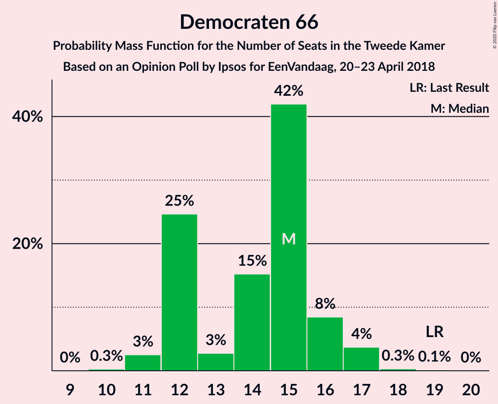
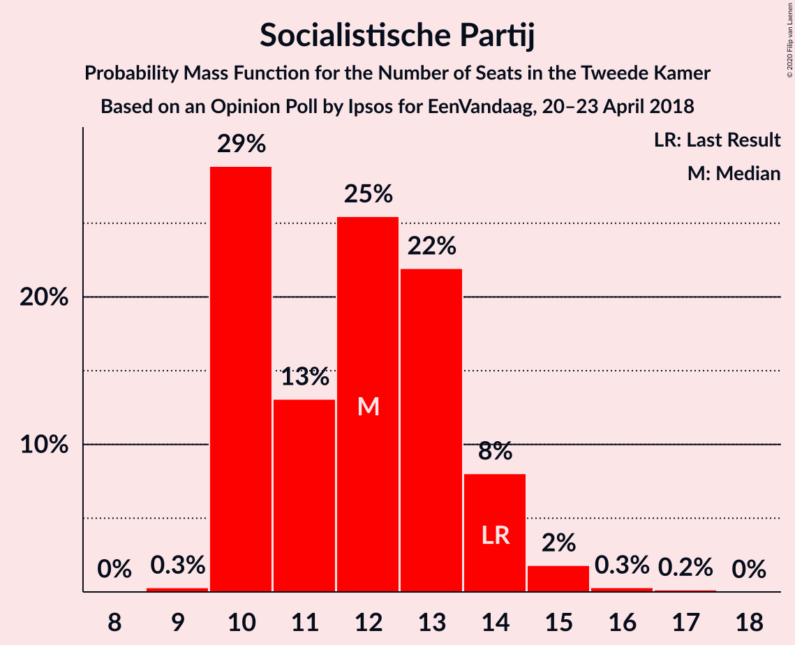
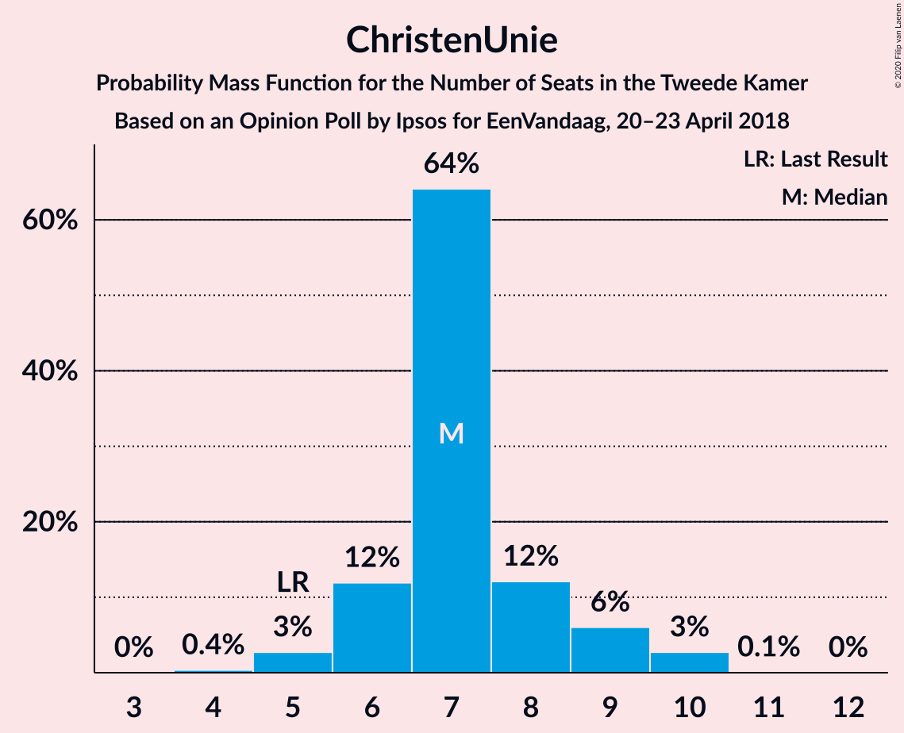
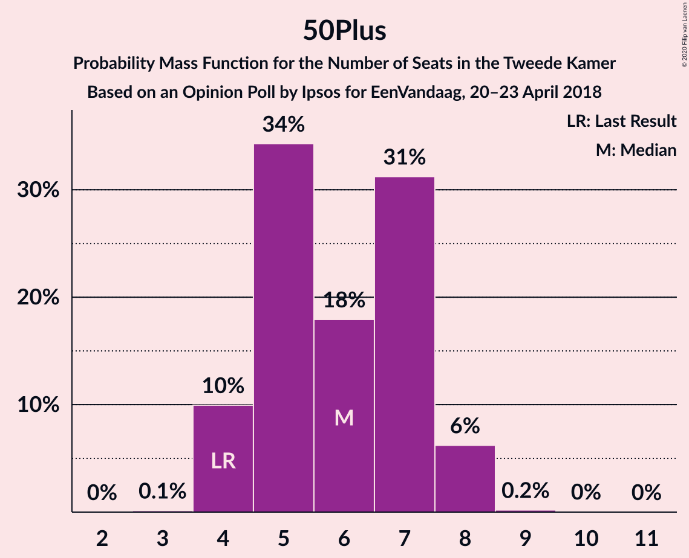
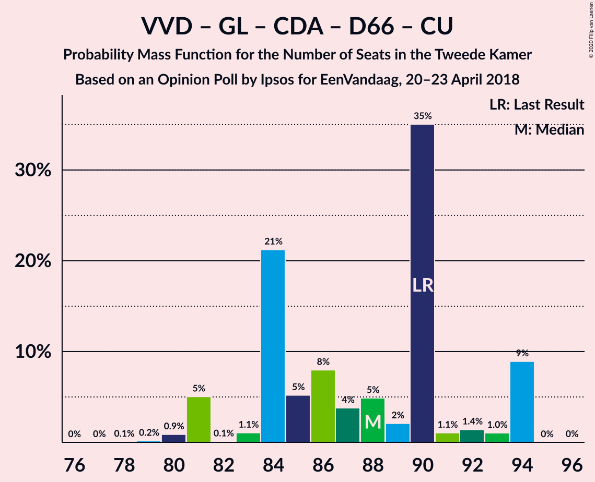
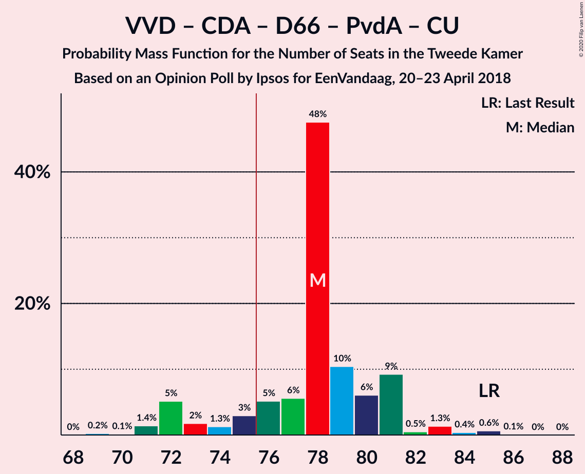
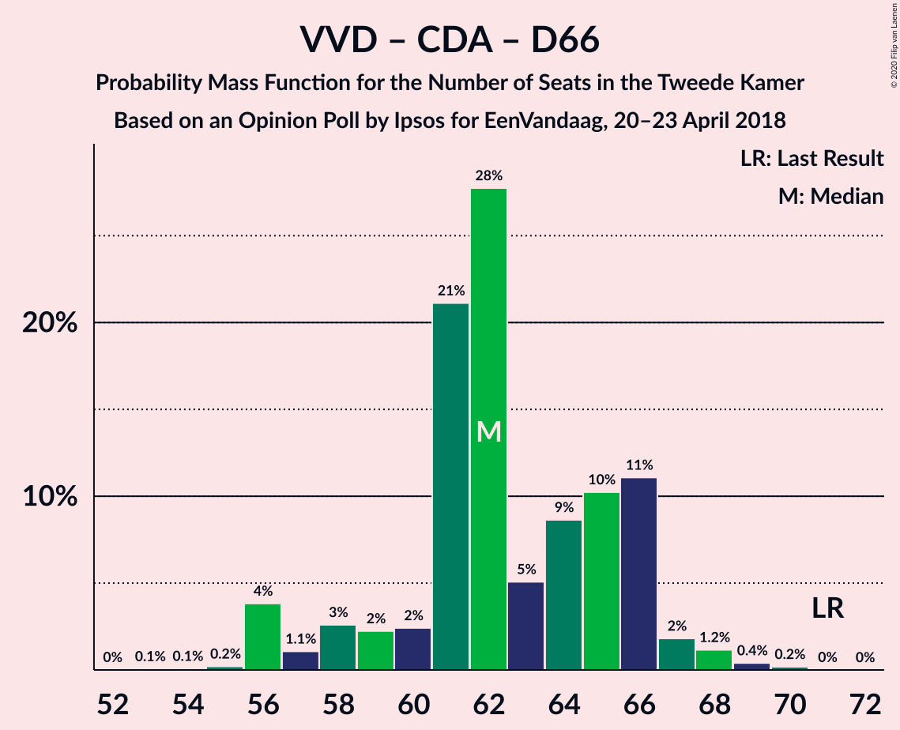
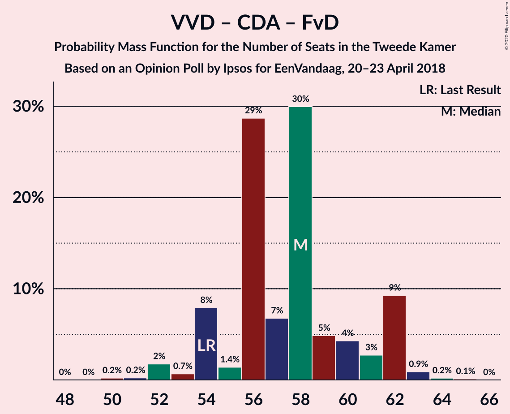
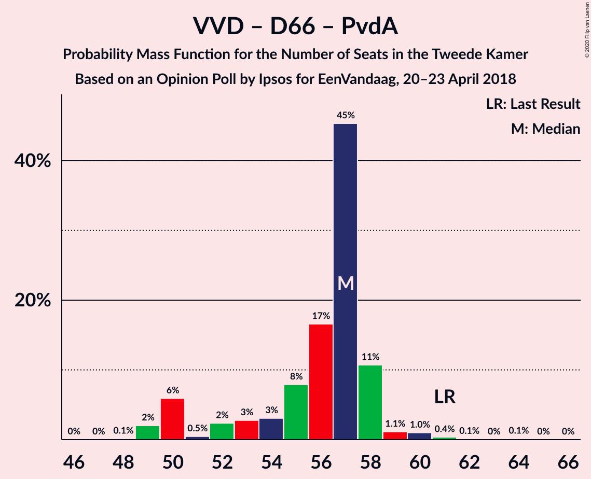
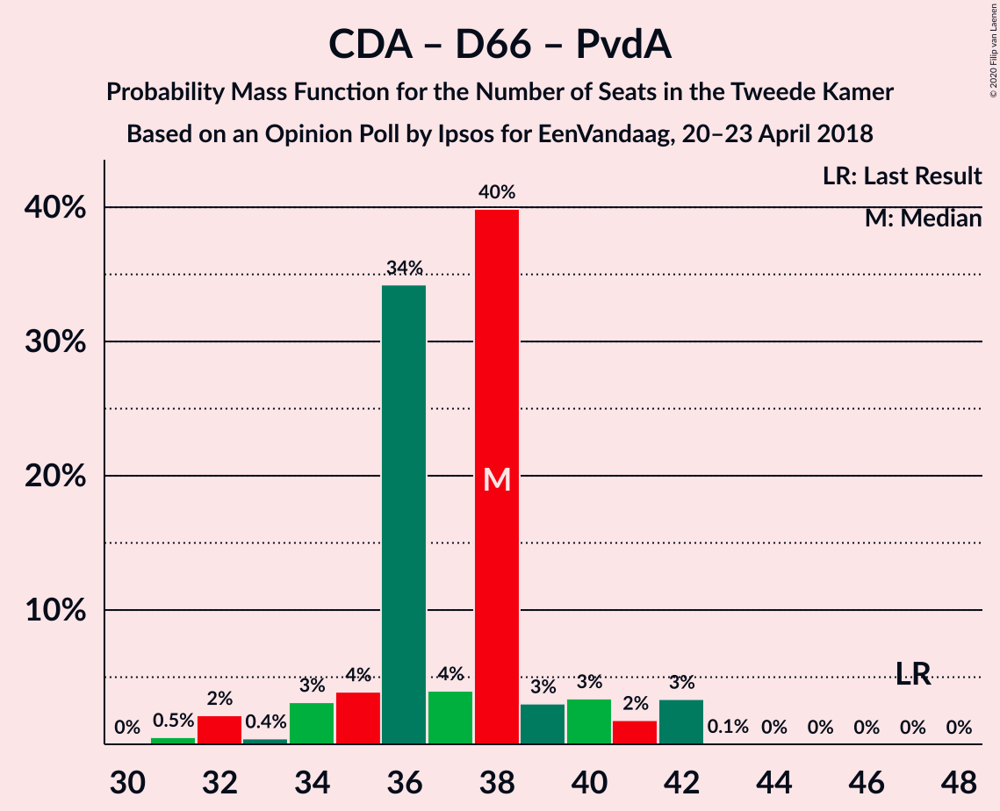

# Opinion Poll by Ipsos for EenVandaag, 20–23 April 2018

<a href="#voting-intentions">Voting Intentions</a> | <a href="#seats">Seats</a> | <a href="#coalitions">Coalitions</a> | <a href="#technical-information">Technical Information</a>

## Voting Intentions

### Confidence Intervals

| Party | Last Result | Poll Result | 80% Confidence Interval | 90% Confidence Interval | 95% Confidence Interval | 99% Confidence Interval |
|:-----:|:-----------:|:-----------:|:-----------------------:|:-----------------------:|:-----------------------:|:-----------------------:|
| Volkspartij voor Vrijheid en Democratie | 21.3% | 21.7% | 20.2–23.3% |19.8–23.8% |19.4–24.2% |18.8–25.0% |
| GroenLinks | 9.1% | 11.6% | 10.5–12.9% |10.2–13.3% |9.9–13.6% |9.4–14.3% |
| Christen-Democratisch Appèl | 12.4% | 9.8% | 8.7–11.0% |8.4–11.3% |8.2–11.6% |7.7–12.2% |
| Partij voor de Vrijheid | 13.1% | 9.4% | 8.4–10.6% |8.1–10.9% |7.9–11.2% |7.4–11.8% |
| Democraten 66 | 12.2% | 9.4% | 8.4–10.6% |8.1–10.9% |7.9–11.2% |7.4–11.8% |
| Socialistische Partij | 9.1% | 8.2% | 7.3–9.3% |7.0–9.6% |6.8–9.9% |6.3–10.5% |
| Forum voor Democratie | 1.8% | 6.4% | 5.6–7.4% |5.3–7.7% |5.2–8.0% |4.8–8.5% |
| Partij van de Arbeid | 5.7% | 5.2% | 4.5–6.2% |4.3–6.4% |4.1–6.7% |3.7–7.1% |
| ChristenUnie | 3.4% | 4.7% | 4.0–5.6% |3.8–5.9% |3.6–6.1% |3.3–6.5% |
| Partij voor de Dieren | 3.2% | 4.5% | 3.8–5.4% |3.6–5.7% |3.5–5.9% |3.2–6.3% |
| 50Plus | 3.1% | 4.1% | 3.4–5.0% |3.3–5.2% |3.1–5.4% |2.8–5.8% |
| DENK | 2.1% | 2.5% | 2.0–3.2% |1.8–3.4% |1.7–3.6% |1.5–3.9% |
| Staatkundig Gereformeerde Partij | 2.1% | 2.0% | 1.5–2.6% |1.4–2.8% |1.3–2.9% |1.1–3.3% |

*Note:* The poll result column reflects the actual value used in the calculations. Published results may vary slightly, and in addition be rounded to fewer digits.

## Seats

### Confidence Intervals

| Party | Last Result | Median | 80% Confidence Interval | 90% Confidence Interval | 95% Confidence Interval | 99% Confidence Interval |
|:-----:|:-----------:|:------:|:-----------------------:|:-----------------------:|:-----------------------:|:-----------------------:|
| <a href="#volkspartij-voor-vrijheid-en-democratie">Volkspartij voor Vrijheid en Democratie</a> | 33 | 36 | 34–36 |30–37 |30–37 |30–37 |
| <a href="#groenlinks">GroenLinks</a> | 14 | 17 | 15–17 |14–19 |14–20 |14–20 |
| <a href="#christen-democratisch-appèl">Christen-Democratisch Appèl</a> | 19 | 16 | 14–16 |14–17 |13–17 |12–19 |
| <a href="#partij-voor-de-vrijheid">Partij voor de Vrijheid</a> | 20 | 13 | 13–15 |11–15 |11–17 |11–17 |
| <a href="#democraten-66">Democraten 66</a> | 19 | 14 | 12–15 |11–16 |11–16 |11–17 |
| <a href="#socialistische-partij">Socialistische Partij</a> | 14 | 13 | 12–13 |11–13 |11–15 |11–16 |
| <a href="#forum-voor-democratie">Forum voor Democratie</a> | 2 | 10 | 9–11 |9–12 |8–12 |6–13 |
| <a href="#partij-van-de-arbeid">Partij van de Arbeid</a> | 9 | 6 | 6–7 |6–9 |6–10 |6–12 |
| <a href="#christenunie">ChristenUnie</a> | 5 | 7 | 7–9 |7–9 |6–9 |5–10 |
| <a href="#partij-voor-de-dieren">Partij voor de Dieren</a> | 5 | 7 | 6–8 |6–8 |5–8 |4–9 |
| <a href="#50plus">50Plus</a> | 4 | 4 | 4–7 |4–7 |4–7 |4–8 |
| <a href="#denk">DENK</a> | 3 | 3 | 3–4 |3–4 |3–5 |2–6 |
| <a href="#staatkundig-gereformeerde-partij">Staatkundig Gereformeerde Partij</a> | 3 | 3 | 2–3 |1–3 |1–3 |1–4 |

### Volkspartij voor Vrijheid en Democratie

*For a full overview of the results for this party, see the [Volkspartij voor Vrijheid en Democratie](party-volkspartijvoorvrijheidendemocratie.html) page.*

| Number of Seats | Probability | Accumulated | Special Marks |
|:---------------:|:-----------:|:-----------:|:-------------:|
| 28 | 0.1% | 100% |  |
| 29 | 0.3% | 99.9% |  |
| 30 | 6% | 99.6% |  |
| 31 | 1.0% | 93% |  |
| 32 | 0.4% | 92% |  |
| 33 | 0.5% | 92% | Last Result |
| 34 | 8% | 91% |  |
| 35 | 5% | 84% |  |
| 36 | 72% | 78% | Median |
| 37 | 6% | 6% |  |
| 38 | 0% | 0% |  |

### GroenLinks

*For a full overview of the results for this party, see the [GroenLinks](party-groenlinks.html) page.*

| Number of Seats | Probability | Accumulated | Special Marks |
|:---------------:|:-----------:|:-----------:|:-------------:|
| 13 | 0.1% | 100% |  |
| 14 | 7% | 99.9% | Last Result |
| 15 | 3% | 92% |  |
| 16 | 8% | 90% |  |
| 17 | 73% | 82% | Median |
| 18 | 3% | 9% |  |
| 19 | 4% | 6% |  |
| 20 | 2% | 3% |  |
| 21 | 0.1% | 0.5% |  |
| 22 | 0% | 0.3% |  |
| 23 | 0.3% | 0.3% |  |
| 24 | 0% | 0% |  |

### Christen-Democratisch Appèl

*For a full overview of the results for this party, see the [Christen-Democratisch Appèl](party-christen-democratischappèl.html) page.*

| Number of Seats | Probability | Accumulated | Special Marks |
|:---------------:|:-----------:|:-----------:|:-------------:|
| 10 | 0.1% | 100% |  |
| 11 | 0.1% | 99.9% |  |
| 12 | 2% | 99.8% |  |
| 13 | 2% | 98% |  |
| 14 | 16% | 96% |  |
| 15 | 3% | 80% |  |
| 16 | 70% | 77% | Median |
| 17 | 6% | 7% |  |
| 18 | 0.2% | 1.0% |  |
| 19 | 0.7% | 0.7% | Last Result |
| 20 | 0% | 0% |  |

### Partij voor de Vrijheid

*For a full overview of the results for this party, see the [Partij voor de Vrijheid](party-partijvoordevrijheid.html) page.*

| Number of Seats | Probability | Accumulated | Special Marks |
|:---------------:|:-----------:|:-----------:|:-------------:|
| 11 | 7% | 100% |  |
| 12 | 3% | 93% |  |
| 13 | 70% | 90% | Median |
| 14 | 8% | 20% |  |
| 15 | 8% | 13% |  |
| 16 | 1.0% | 4% |  |
| 17 | 3% | 3% |  |
| 18 | 0.1% | 0.2% |  |
| 19 | 0% | 0% |  |
| 20 | 0% | 0% | Last Result |

### Democraten 66

*For a full overview of the results for this party, see the [Democraten 66](party-democraten66.html) page.*

| Number of Seats | Probability | Accumulated | Special Marks |
|:---------------:|:-----------:|:-----------:|:-------------:|
| 10 | 0.3% | 100% |  |
| 11 | 7% | 99.7% |  |
| 12 | 4% | 93% |  |
| 13 | 2% | 89% |  |
| 14 | 75% | 87% | Median |
| 15 | 3% | 12% |  |
| 16 | 7% | 9% |  |
| 17 | 1.0% | 1.2% |  |
| 18 | 0.1% | 0.2% |  |
| 19 | 0.1% | 0.2% | Last Result |
| 20 | 0% | 0% |  |

### Socialistische Partij

*For a full overview of the results for this party, see the [Socialistische Partij](party-socialistischepartij.html) page.*

| Number of Seats | Probability | Accumulated | Special Marks |
|:---------------:|:-----------:|:-----------:|:-------------:|
| 9 | 0.1% | 100% |  |
| 10 | 0.2% | 99.9% |  |
| 11 | 8% | 99.7% |  |
| 12 | 5% | 92% |  |
| 13 | 84% | 87% | Median |
| 14 | 0.9% | 3% | Last Result |
| 15 | 2% | 3% |  |
| 16 | 1.0% | 1.0% |  |
| 17 | 0% | 0% |  |

### Forum voor Democratie

*For a full overview of the results for this party, see the [Forum voor Democratie](party-forumvoordemocratie.html) page.*

| Number of Seats | Probability | Accumulated | Special Marks |
|:---------------:|:-----------:|:-----------:|:-------------:|
| 2 | 0% | 100% | Last Result |
| 3 | 0% | 100% |  |
| 4 | 0% | 100% |  |
| 5 | 0% | 100% |  |
| 6 | 0.5% | 100% |  |
| 7 | 0.3% | 99.5% |  |
| 8 | 4% | 99.2% |  |
| 9 | 8% | 95% |  |
| 10 | 75% | 87% | Median |
| 11 | 4% | 12% |  |
| 12 | 7% | 8% |  |
| 13 | 1.1% | 1.2% |  |
| 14 | 0% | 0% |  |

### Partij van de Arbeid

*For a full overview of the results for this party, see the [Partij van de Arbeid](party-partijvandearbeid.html) page.*

| Number of Seats | Probability | Accumulated | Special Marks |
|:---------------:|:-----------:|:-----------:|:-------------:|
| 5 | 0.1% | 100% |  |
| 6 | 71% | 99.9% | Median |
| 7 | 21% | 29% |  |
| 8 | 2% | 8% |  |
| 9 | 2% | 6% | Last Result |
| 10 | 2% | 4% |  |
| 11 | 1.1% | 2% |  |
| 12 | 0.6% | 0.6% |  |
| 13 | 0% | 0% |  |

### ChristenUnie

*For a full overview of the results for this party, see the [ChristenUnie](party-christenunie.html) page.*

| Number of Seats | Probability | Accumulated | Special Marks |
|:---------------:|:-----------:|:-----------:|:-------------:|
| 4 | 0.1% | 100% |  |
| 5 | 2% | 99.9% | Last Result |
| 6 | 2% | 98% |  |
| 7 | 71% | 96% | Median |
| 8 | 11% | 25% |  |
| 9 | 12% | 13% |  |
| 10 | 1.1% | 1.1% |  |
| 11 | 0% | 0% |  |

### Partij voor de Dieren

*For a full overview of the results for this party, see the [Partij voor de Dieren](party-partijvoordedieren.html) page.*

| Number of Seats | Probability | Accumulated | Special Marks |
|:---------------:|:-----------:|:-----------:|:-------------:|
| 4 | 2% | 100% |  |
| 5 | 2% | 98% | Last Result |
| 6 | 10% | 96% |  |
| 7 | 75% | 86% | Median |
| 8 | 10% | 12% |  |
| 9 | 1.4% | 1.4% |  |
| 10 | 0% | 0% |  |

### 50Plus

*For a full overview of the results for this party, see the [50Plus](party-50plus.html) page.*

| Number of Seats | Probability | Accumulated | Special Marks |
|:---------------:|:-----------:|:-----------:|:-------------:|
| 4 | 72% | 100% | Last Result, Median |
| 5 | 11% | 28% |  |
| 6 | 5% | 18% |  |
| 7 | 10% | 12% |  |
| 8 | 2% | 2% |  |
| 9 | 0.1% | 0.1% |  |
| 10 | 0% | 0% |  |

### DENK

*For a full overview of the results for this party, see the [DENK](party-denk.html) page.*

| Number of Seats | Probability | Accumulated | Special Marks |
|:---------------:|:-----------:|:-----------:|:-------------:|
| 2 | 2% | 100% |  |
| 3 | 80% | 98% | Last Result, Median |
| 4 | 13% | 18% |  |
| 5 | 2% | 5% |  |
| 6 | 2% | 2% |  |
| 7 | 0% | 0% |  |

### Staatkundig Gereformeerde Partij

*For a full overview of the results for this party, see the [Staatkundig Gereformeerde Partij](party-staatkundiggereformeerdepartij.html) page.*

| Number of Seats | Probability | Accumulated | Special Marks |
|:---------------:|:-----------:|:-----------:|:-------------:|
| 1 | 6% | 100% |  |
| 2 | 6% | 94% |  |
| 3 | 86% | 88% | Last Result, Median |
| 4 | 1.4% | 2% |  |
| 5 | 0.2% | 0.2% |  |
| 6 | 0% | 0% |  |

## Coalitions

### Confidence Intervals

| Coalition | Last Result | Median | Majority? | 80% Confidence Interval | 90% Confidence Interval | 95% Confidence Interval | 99% Confidence Interval |
|:---------:|:-----------:|:------:|:---------:|:-----------------------:|:-----------------------:|:-----------------------:|:-----------------------:|
| Volkspartij voor Vrijheid en Democratie – GroenLinks – Christen-Democratisch Appèl – Democraten 66 – ChristenUnie | 90 | 90 | 100% | 84–91 | 83–92 | 83–92 | 79–93 |
| Volkspartij voor Vrijheid en Democratie – Christen-Democratisch Appèl – Democraten 66 – Partij van de Arbeid – ChristenUnie | 85 | 79 | 93% | 76–81 | 75–83 | 74–83 | 72–83 |
| Volkspartij voor Vrijheid en Democratie – Christen-Democratisch Appèl – Partij voor de Vrijheid – Forum voor Democratie – Staatkundig Gereformeerde Partij | 77 | 78 | 81% | 74–78 | 73–80 | 71–80 | 68–80 |
| Volkspartij voor Vrijheid en Democratie – Christen-Democratisch Appèl – Partij voor de Vrijheid – Forum voor Democratie | 74 | 75 | 7% | 71–75 | 70–77 | 69–77 | 66–77 |
| GroenLinks – Christen-Democratisch Appèl – Democraten 66 – Socialistische Partij – Partij van de Arbeid – ChristenUnie | 80 | 73 | 9% | 72–75 | 67–76 | 67–77 | 67–79 |
| Volkspartij voor Vrijheid en Democratie – Christen-Democratisch Appèl – Democraten 66 – ChristenUnie | 76 | 73 | 5% | 69–74 | 65–76 | 65–76 | 65–76 |
| Volkspartij voor Vrijheid en Democratie – Christen-Democratisch Appèl – Forum voor Democratie – 50Plus – Staatkundig Gereformeerde Partij | 61 | 69 | 0% | 66–69 | 65–72 | 63–72 | 61–72 |
| Volkspartij voor Vrijheid en Democratie – Christen-Democratisch Appèl – Forum voor Democratie – 50Plus | 58 | 66 | 0% | 64–66 | 62–69 | 60–69 | 59–69 |
| Volkspartij voor Vrijheid en Democratie – Christen-Democratisch Appèl – Democraten 66 | 71 | 66 | 0% | 61–66 | 58–67 | 58–67 | 57–67 |
| Volkspartij voor Vrijheid en Democratie – Christen-Democratisch Appèl – Partij voor de Vrijheid | 72 | 65 | 0% | 62–65 | 59–65 | 58–65 | 56–66 |
| Volkspartij voor Vrijheid en Democratie – Christen-Democratisch Appèl – Forum voor Democratie – Staatkundig Gereformeerde Partij | 57 | 65 | 0% | 60–65 | 59–65 | 57–65 | 55–65 |
| GroenLinks – Christen-Democratisch Appèl – Democraten 66 – Partij van de Arbeid – ChristenUnie | 66 | 60 | 0% | 59–63 | 54–65 | 54–65 | 54–65 |
| Volkspartij voor Vrijheid en Democratie – Christen-Democratisch Appèl – Forum voor Democratie | 54 | 62 | 0% | 58–62 | 55–62 | 55–62 | 52–62 |
| Volkspartij voor Vrijheid en Democratie – Christen-Democratisch Appèl – Partij van de Arbeid | 61 | 58 | 0% | 56–58 | 53–58 | 53–58 | 51–61 |
| Volkspartij voor Vrijheid en Democratie – Democraten 66 – Partij van de Arbeid | 61 | 56 | 0% | 54–57 | 53–58 | 52–58 | 50–58 |
| Volkspartij voor Vrijheid en Democratie – Christen-Democratisch Appèl | 52 | 52 | 0% | 47–52 | 46–52 | 45–52 | 43–53 |
| Volkspartij voor Vrijheid en Democratie – Partij van de Arbeid | 42 | 42 | 0% | 41–43 | 39–44 | 38–44 | 36–45 |
| Christen-Democratisch Appèl – Democraten 66 – Partij van de Arbeid | 47 | 36 | 0% | 35–38 | 32–40 | 32–40 | 31–42 |
| Christen-Democratisch Appèl – Partij van de Arbeid – ChristenUnie | 33 | 29 | 0% | 29–32 | 28–33 | 27–33 | 26–35 |
| Christen-Democratisch Appèl – Democraten 66 | 38 | 30 | 0% | 27–30 | 25–33 | 25–33 | 24–34 |
| Christen-Democratisch Appèl – Partij van de Arbeid | 28 | 22 | 0% | 21–24 | 21–24 | 20–26 | 19–27 |

### Volkspartij voor Vrijheid en Democratie – GroenLinks – Christen-Democratisch Appèl – Democraten 66 – ChristenUnie

| Number of Seats | Probability | Accumulated | Special Marks |
|:---------------:|:-----------:|:-----------:|:-------------:|
| 77 | 0.2% | 100% |  |
| 78 | 0% | 99.8% |  |
| 79 | 0.4% | 99.8% |  |
| 80 | 0% | 99.4% |  |
| 81 | 2% | 99.4% |  |
| 82 | 0.1% | 98% |  |
| 83 | 8% | 98% |  |
| 84 | 3% | 90% |  |
| 85 | 2% | 87% |  |
| 86 | 2% | 85% |  |
| 87 | 0.9% | 83% |  |
| 88 | 3% | 83% |  |
| 89 | 0.2% | 79% |  |
| 90 | 66% | 79% | Last Result, Median |
| 91 | 6% | 14% |  |
| 92 | 7% | 8% |  |
| 93 | 0.4% | 0.7% |  |
| 94 | 0.2% | 0.2% |  |
| 95 | 0% | 0% |  |

### Volkspartij voor Vrijheid en Democratie – Christen-Democratisch Appèl – Democraten 66 – Partij van de Arbeid – ChristenUnie

| Number of Seats | Probability | Accumulated | Special Marks |
|:---------------:|:-----------:|:-----------:|:-------------:|
| 70 | 0% | 100% |  |
| 71 | 0.2% | 99.9% |  |
| 72 | 2% | 99.7% |  |
| 73 | 0% | 98% |  |
| 74 | 2% | 98% |  |
| 75 | 3% | 96% |  |
| 76 | 8% | 93% | Majority |
| 77 | 1.5% | 85% |  |
| 78 | 3% | 84% |  |
| 79 | 68% | 80% | Median |
| 80 | 0.4% | 12% |  |
| 81 | 6% | 12% |  |
| 82 | 0.5% | 6% |  |
| 83 | 5% | 5% |  |
| 84 | 0% | 0% |  |
| 85 | 0% | 0% | Last Result |

### Volkspartij voor Vrijheid en Democratie – Christen-Democratisch Appèl – Partij voor de Vrijheid – Forum voor Democratie – Staatkundig Gereformeerde Partij

| Number of Seats | Probability | Accumulated | Special Marks |
|:---------------:|:-----------:|:-----------:|:-------------:|
| 67 | 0.4% | 100% |  |
| 68 | 0.1% | 99.6% |  |
| 69 | 0.9% | 99.5% |  |
| 70 | 0.6% | 98.6% |  |
| 71 | 1.1% | 98% |  |
| 72 | 2% | 97% |  |
| 73 | 2% | 95% |  |
| 74 | 8% | 93% |  |
| 75 | 5% | 86% |  |
| 76 | 8% | 81% | Majority |
| 77 | 0.1% | 73% | Last Result |
| 78 | 66% | 72% | Median |
| 79 | 0.2% | 6% |  |
| 80 | 6% | 6% |  |
| 81 | 0% | 0.1% |  |
| 82 | 0% | 0.1% |  |
| 83 | 0.1% | 0.1% |  |
| 84 | 0% | 0% |  |

### Volkspartij voor Vrijheid en Democratie – Christen-Democratisch Appèl – Partij voor de Vrijheid – Forum voor Democratie

| Number of Seats | Probability | Accumulated | Special Marks |
|:---------------:|:-----------:|:-----------:|:-------------:|
| 63 | 0.4% | 100% |  |
| 64 | 0% | 99.6% |  |
| 65 | 0.1% | 99.6% |  |
| 66 | 0.2% | 99.5% |  |
| 67 | 0.7% | 99.3% |  |
| 68 | 0.7% | 98.6% |  |
| 69 | 3% | 98% |  |
| 70 | 0.4% | 95% |  |
| 71 | 7% | 95% |  |
| 72 | 6% | 88% |  |
| 73 | 3% | 82% |  |
| 74 | 1.3% | 79% | Last Result |
| 75 | 71% | 77% | Median |
| 76 | 0.3% | 7% | Majority |
| 77 | 6% | 6% |  |
| 78 | 0.1% | 0.2% |  |
| 79 | 0% | 0.1% |  |
| 80 | 0.1% | 0.1% |  |
| 81 | 0% | 0% |  |

### GroenLinks – Christen-Democratisch Appèl – Democraten 66 – Socialistische Partij – Partij van de Arbeid – ChristenUnie

| Number of Seats | Probability | Accumulated | Special Marks |
|:---------------:|:-----------:|:-----------:|:-------------:|
| 67 | 6% | 100% |  |
| 68 | 0.1% | 94% |  |
| 69 | 0.1% | 94% |  |
| 70 | 2% | 94% |  |
| 71 | 0.8% | 92% |  |
| 72 | 3% | 91% |  |
| 73 | 67% | 88% | Median |
| 74 | 8% | 21% |  |
| 75 | 3% | 13% |  |
| 76 | 5% | 9% | Majority |
| 77 | 3% | 4% |  |
| 78 | 0.6% | 1.2% |  |
| 79 | 0.4% | 0.6% |  |
| 80 | 0.2% | 0.3% | Last Result |
| 81 | 0% | 0% |  |

### Volkspartij voor Vrijheid en Democratie – Christen-Democratisch Appèl – Democraten 66 – ChristenUnie

| Number of Seats | Probability | Accumulated | Special Marks |
|:---------------:|:-----------:|:-----------:|:-------------:|
| 62 | 0.2% | 100% |  |
| 63 | 0% | 99.8% |  |
| 64 | 0.2% | 99.8% |  |
| 65 | 5% | 99.6% |  |
| 66 | 2% | 95% |  |
| 67 | 0.9% | 93% |  |
| 68 | 0.9% | 93% |  |
| 69 | 9% | 92% |  |
| 70 | 0.1% | 83% |  |
| 71 | 0.9% | 83% |  |
| 72 | 2% | 82% |  |
| 73 | 68% | 80% | Median |
| 74 | 6% | 12% |  |
| 75 | 0.5% | 6% |  |
| 76 | 5% | 5% | Last Result, Majority |
| 77 | 0% | 0% |  |

### Volkspartij voor Vrijheid en Democratie – Christen-Democratisch Appèl – Forum voor Democratie – 50Plus – Staatkundig Gereformeerde Partij

| Number of Seats | Probability | Accumulated | Special Marks |
|:---------------:|:-----------:|:-----------:|:-------------:|
| 60 | 0.1% | 100% |  |
| 61 | 0.8% | 99.8% | Last Result |
| 62 | 1.2% | 99.1% |  |
| 63 | 2% | 98% |  |
| 64 | 0.6% | 96% |  |
| 65 | 2% | 95% |  |
| 66 | 8% | 93% |  |
| 67 | 3% | 85% |  |
| 68 | 8% | 83% |  |
| 69 | 68% | 75% | Median |
| 70 | 0.6% | 7% |  |
| 71 | 0% | 6% |  |
| 72 | 6% | 6% |  |
| 73 | 0.1% | 0.2% |  |
| 74 | 0% | 0% |  |

### Volkspartij voor Vrijheid en Democratie – Christen-Democratisch Appèl – Forum voor Democratie – 50Plus

| Number of Seats | Probability | Accumulated | Special Marks |
|:---------------:|:-----------:|:-----------:|:-------------:|
| 57 | 0.1% | 100% |  |
| 58 | 0.1% | 99.9% | Last Result |
| 59 | 1.2% | 99.8% |  |
| 60 | 2% | 98.6% |  |
| 61 | 1.4% | 97% |  |
| 62 | 2% | 96% |  |
| 63 | 2% | 94% |  |
| 64 | 2% | 91% |  |
| 65 | 15% | 89% |  |
| 66 | 67% | 75% | Median |
| 67 | 0.4% | 7% |  |
| 68 | 0.5% | 7% |  |
| 69 | 6% | 6% |  |
| 70 | 0.1% | 0.2% |  |
| 71 | 0% | 0.1% |  |
| 72 | 0.1% | 0.1% |  |
| 73 | 0% | 0% |  |

### Volkspartij voor Vrijheid en Democratie – Christen-Democratisch Appèl – Democraten 66

| Number of Seats | Probability | Accumulated | Special Marks |
|:---------------:|:-----------:|:-----------:|:-------------:|
| 55 | 0% | 100% |  |
| 56 | 0.1% | 99.9% |  |
| 57 | 1.4% | 99.8% |  |
| 58 | 4% | 98% |  |
| 59 | 2% | 95% |  |
| 60 | 1.1% | 93% |  |
| 61 | 8% | 92% |  |
| 62 | 1.4% | 84% |  |
| 63 | 0.5% | 83% |  |
| 64 | 2% | 82% |  |
| 65 | 8% | 80% |  |
| 66 | 66% | 72% | Median |
| 67 | 5% | 6% |  |
| 68 | 0% | 0.5% |  |
| 69 | 0% | 0.5% |  |
| 70 | 0.4% | 0.4% |  |
| 71 | 0% | 0% | Last Result |

### Volkspartij voor Vrijheid en Democratie – Christen-Democratisch Appèl – Partij voor de Vrijheid

| Number of Seats | Probability | Accumulated | Special Marks |
|:---------------:|:-----------:|:-----------:|:-------------:|
| 53 | 0.1% | 100% |  |
| 54 | 0.4% | 99.9% |  |
| 55 | 0% | 99.5% |  |
| 56 | 0.2% | 99.5% |  |
| 57 | 0.1% | 99.3% |  |
| 58 | 3% | 99.3% |  |
| 59 | 2% | 96% |  |
| 60 | 0.4% | 94% |  |
| 61 | 3% | 94% |  |
| 62 | 6% | 91% |  |
| 63 | 4% | 85% |  |
| 64 | 3% | 81% |  |
| 65 | 77% | 78% | Median |
| 66 | 0.7% | 1.1% |  |
| 67 | 0.1% | 0.4% |  |
| 68 | 0.3% | 0.3% |  |
| 69 | 0% | 0% |  |
| 70 | 0% | 0% |  |
| 71 | 0% | 0% |  |
| 72 | 0% | 0% | Last Result |

### Volkspartij voor Vrijheid en Democratie – Christen-Democratisch Appèl – Forum voor Democratie – Staatkundig Gereformeerde Partij

| Number of Seats | Probability | Accumulated | Special Marks |
|:---------------:|:-----------:|:-----------:|:-------------:|
| 53 | 0% | 100% |  |
| 54 | 0% | 99.9% |  |
| 55 | 0.5% | 99.9% |  |
| 56 | 2% | 99.4% |  |
| 57 | 1.4% | 98% | Last Result |
| 58 | 1.1% | 96% |  |
| 59 | 3% | 95% |  |
| 60 | 2% | 92% |  |
| 61 | 2% | 90% |  |
| 62 | 8% | 88% |  |
| 63 | 8% | 80% |  |
| 64 | 0.5% | 72% |  |
| 65 | 72% | 72% | Median |
| 66 | 0.1% | 0.2% |  |
| 67 | 0.1% | 0.1% |  |
| 68 | 0% | 0% |  |

### GroenLinks – Christen-Democratisch Appèl – Democraten 66 – Partij van de Arbeid – ChristenUnie

| Number of Seats | Probability | Accumulated | Special Marks |
|:---------------:|:-----------:|:-----------:|:-------------:|
| 54 | 6% | 100% |  |
| 55 | 0.1% | 94% |  |
| 56 | 0% | 94% |  |
| 57 | 2% | 94% |  |
| 58 | 0.7% | 92% |  |
| 59 | 4% | 91% |  |
| 60 | 66% | 87% | Median |
| 61 | 7% | 21% |  |
| 62 | 2% | 14% |  |
| 63 | 4% | 12% |  |
| 64 | 1.0% | 8% |  |
| 65 | 7% | 7% |  |
| 66 | 0.1% | 0.5% | Last Result |
| 67 | 0.1% | 0.4% |  |
| 68 | 0.2% | 0.3% |  |
| 69 | 0% | 0.1% |  |
| 70 | 0% | 0% |  |

### Volkspartij voor Vrijheid en Democratie – Christen-Democratisch Appèl – Forum voor Democratie

| Number of Seats | Probability | Accumulated | Special Marks |
|:---------------:|:-----------:|:-----------:|:-------------:|
| 50 | 0.1% | 100% |  |
| 51 | 0% | 99.9% |  |
| 52 | 0.5% | 99.9% |  |
| 53 | 0.9% | 99.4% |  |
| 54 | 1.0% | 98.5% | Last Result |
| 55 | 3% | 98% |  |
| 56 | 2% | 95% |  |
| 57 | 1.0% | 93% |  |
| 58 | 3% | 92% |  |
| 59 | 3% | 89% |  |
| 60 | 8% | 86% |  |
| 61 | 5% | 78% |  |
| 62 | 72% | 72% | Median |
| 63 | 0.1% | 0.2% |  |
| 64 | 0.1% | 0.1% |  |
| 65 | 0% | 0% |  |

### Volkspartij voor Vrijheid en Democratie – Christen-Democratisch Appèl – Partij van de Arbeid

| Number of Seats | Probability | Accumulated | Special Marks |
|:---------------:|:-----------:|:-----------:|:-------------:|
| 47 | 0.1% | 100% |  |
| 48 | 0% | 99.9% |  |
| 49 | 0% | 99.9% |  |
| 50 | 0% | 99.8% |  |
| 51 | 1.1% | 99.8% |  |
| 52 | 0.5% | 98.8% |  |
| 53 | 5% | 98% |  |
| 54 | 0.2% | 94% |  |
| 55 | 3% | 93% |  |
| 56 | 0.9% | 90% |  |
| 57 | 11% | 90% |  |
| 58 | 77% | 78% | Median |
| 59 | 0.7% | 2% |  |
| 60 | 0.4% | 1.0% |  |
| 61 | 0.5% | 0.5% | Last Result |
| 62 | 0% | 0% |  |

### Volkspartij voor Vrijheid en Democratie – Democraten 66 – Partij van de Arbeid

| Number of Seats | Probability | Accumulated | Special Marks |
|:---------------:|:-----------:|:-----------:|:-------------:|
| 49 | 0.1% | 100% |  |
| 50 | 1.1% | 99.9% |  |
| 51 | 1.0% | 98.8% |  |
| 52 | 2% | 98% |  |
| 53 | 2% | 96% |  |
| 54 | 7% | 94% |  |
| 55 | 5% | 87% |  |
| 56 | 68% | 82% | Median |
| 57 | 6% | 14% |  |
| 58 | 7% | 8% |  |
| 59 | 0.2% | 0.4% |  |
| 60 | 0.1% | 0.2% |  |
| 61 | 0% | 0.1% | Last Result |
| 62 | 0% | 0.1% |  |
| 63 | 0% | 0% |  |

### Volkspartij voor Vrijheid en Democratie – Christen-Democratisch Appèl

| Number of Seats | Probability | Accumulated | Special Marks |
|:---------------:|:-----------:|:-----------:|:-------------:|
| 40 | 0.1% | 100% |  |
| 41 | 0% | 99.9% |  |
| 42 | 0% | 99.9% |  |
| 43 | 0.8% | 99.8% |  |
| 44 | 0.5% | 99.0% |  |
| 45 | 3% | 98.5% |  |
| 46 | 4% | 95% |  |
| 47 | 2% | 91% |  |
| 48 | 0.1% | 90% |  |
| 49 | 3% | 90% |  |
| 50 | 6% | 86% |  |
| 51 | 13% | 80% |  |
| 52 | 66% | 66% | Last Result, Median |
| 53 | 0.3% | 0.8% |  |
| 54 | 0.4% | 0.5% |  |
| 55 | 0% | 0% |  |

### Volkspartij voor Vrijheid en Democratie – Partij van de Arbeid

| Number of Seats | Probability | Accumulated | Special Marks |
|:---------------:|:-----------:|:-----------:|:-------------:|
| 35 | 0.1% | 100% |  |
| 36 | 1.0% | 99.9% |  |
| 37 | 0.2% | 98.9% |  |
| 38 | 2% | 98.7% |  |
| 39 | 2% | 97% |  |
| 40 | 2% | 95% |  |
| 41 | 12% | 93% |  |
| 42 | 66% | 81% | Last Result, Median |
| 43 | 8% | 14% |  |
| 44 | 6% | 7% |  |
| 45 | 0.9% | 0.9% |  |
| 46 | 0% | 0.1% |  |
| 47 | 0% | 0% |  |

### Christen-Democratisch Appèl – Democraten 66 – Partij van de Arbeid

| Number of Seats | Probability | Accumulated | Special Marks |
|:---------------:|:-----------:|:-----------:|:-------------:|
| 31 | 2% | 100% |  |
| 32 | 6% | 98% |  |
| 33 | 0.2% | 92% |  |
| 34 | 0.4% | 92% |  |
| 35 | 10% | 91% |  |
| 36 | 69% | 82% | Median |
| 37 | 1.2% | 13% |  |
| 38 | 3% | 12% |  |
| 39 | 1.2% | 9% |  |
| 40 | 6% | 8% |  |
| 41 | 1.1% | 2% |  |
| 42 | 0.6% | 0.6% |  |
| 43 | 0% | 0% |  |
| 44 | 0% | 0% |  |
| 45 | 0% | 0% |  |
| 46 | 0% | 0% |  |
| 47 | 0% | 0% | Last Result |

### Christen-Democratisch Appèl – Partij van de Arbeid – ChristenUnie

| Number of Seats | Probability | Accumulated | Special Marks |
|:---------------:|:-----------:|:-----------:|:-------------:|
| 24 | 0.1% | 100% |  |
| 25 | 0% | 99.9% |  |
| 26 | 2% | 99.9% |  |
| 27 | 1.2% | 98% |  |
| 28 | 2% | 96% |  |
| 29 | 74% | 95% | Median |
| 30 | 9% | 20% |  |
| 31 | 0.6% | 11% |  |
| 32 | 2% | 10% |  |
| 33 | 6% | 8% | Last Result |
| 34 | 0.9% | 2% |  |
| 35 | 1.1% | 1.1% |  |
| 36 | 0% | 0% |  |

### Christen-Democratisch Appèl – Democraten 66

| Number of Seats | Probability | Accumulated | Special Marks |
|:---------------:|:-----------:|:-----------:|:-------------:|
| 24 | 2% | 100% |  |
| 25 | 6% | 98% |  |
| 26 | 0.9% | 92% |  |
| 27 | 2% | 91% |  |
| 28 | 8% | 89% |  |
| 29 | 4% | 81% |  |
| 30 | 69% | 77% | Median |
| 31 | 1.2% | 8% |  |
| 32 | 0.9% | 7% |  |
| 33 | 5% | 6% |  |
| 34 | 0.2% | 0.7% |  |
| 35 | 0.5% | 0.5% |  |
| 36 | 0% | 0% |  |
| 37 | 0% | 0% |  |
| 38 | 0% | 0% | Last Result |

### Christen-Democratisch Appèl – Partij van de Arbeid

| Number of Seats | Probability | Accumulated | Special Marks |
|:---------------:|:-----------:|:-----------:|:-------------:|
| 17 | 0.1% | 100% |  |
| 18 | 0.1% | 99.9% |  |
| 19 | 2% | 99.8% |  |
| 20 | 3% | 98% |  |
| 21 | 13% | 95% |  |
| 22 | 69% | 82% | Median |
| 23 | 3% | 13% |  |
| 24 | 6% | 11% |  |
| 25 | 1.2% | 5% |  |
| 26 | 2% | 3% |  |
| 27 | 2% | 2% |  |
| 28 | 0% | 0% | Last Result |

## Technical Information

### Opinion Poll

+ **Polling firm:** Ipsos
+ **Commissioner(s):** EenVandaag
+ **Fieldwork period:** 20–23 April 2018

### Calculations

+ **Sample size:** 1169
+ **Simulations done:** 131,072
+ **Error estimate:** 1.87%

