# Opinion Poll by Peil.nl, 21–27 May 2018

<a href="#voting-intentions">Voting Intentions</a> | <a href="#seats">Seats</a> | <a href="#coalitions">Coalitions</a> | <a href="#technical-information">Technical Information</a>

## Voting Intentions

### Confidence Intervals

| Party | Last Result | Poll Result | 80% Confidence Interval | 90% Confidence Interval | 95% Confidence Interval | 99% Confidence Interval |
|:-----:|:-----------:|:-----------:|:-----------------------:|:-----------------------:|:-----------------------:|:-----------------------:|
| Volkspartij voor Vrijheid en Democratie | 21.3% | 17.3% | 16.5–18.3% |16.2–18.5% |16.0–18.7% |15.6–19.2% |
| GroenLinks | 9.1% | 11.3% | 10.6–12.1% |10.4–12.3% |10.2–12.5% |9.9–12.9% |
| Forum voor Democratie | 1.8% | 10.7% | 10.0–11.4% |9.8–11.6% |9.6–11.8% |9.3–12.2% |
| Partij voor de Vrijheid | 13.1% | 8.7% | 8.0–9.4% |7.8–9.6% |7.7–9.7% |7.4–10.1% |
| Christen-Democratisch Appèl | 12.4% | 8.7% | 8.0–9.4% |7.8–9.6% |7.7–9.7% |7.4–10.1% |
| Socialistische Partij | 9.1% | 8.7% | 8.0–9.4% |7.8–9.6% |7.7–9.7% |7.4–10.1% |
| Democraten 66 | 12.2% | 8.0% | 7.4–8.7% |7.2–8.9% |7.1–9.0% |6.8–9.4% |
| Partij van de Arbeid | 5.7% | 8.0% | 7.4–8.7% |7.2–8.9% |7.1–9.0% |6.8–9.4% |
| Partij voor de Dieren | 3.2% | 5.3% | 4.8–5.9% |4.7–6.1% |4.6–6.2% |4.4–6.5% |
| ChristenUnie | 3.4% | 4.0% | 3.6–4.5% |3.4–4.6% |3.4–4.8% |3.2–5.0% |
| 50Plus | 3.1% | 4.0% | 3.6–4.5% |3.4–4.6% |3.4–4.8% |3.2–5.0% |
| DENK | 2.1% | 3.3% | 2.9–3.8% |2.8–3.9% |2.7–4.0% |2.6–4.3% |
| Staatkundig Gereformeerde Partij | 2.1% | 2.0% | 1.7–2.4% |1.6–2.5% |1.6–2.6% |1.4–2.8% |

*Note:* The poll result column reflects the actual value used in the calculations. Published results may vary slightly, and in addition be rounded to fewer digits.

## Seats

### Confidence Intervals

| Party | Last Result | Median | 80% Confidence Interval | 90% Confidence Interval | 95% Confidence Interval | 99% Confidence Interval |
|:-----:|:-----------:|:------:|:-----------------------:|:-----------------------:|:-----------------------:|:-----------------------:|
| <a href="#volkspartij-voor-vrijheid-en-democratie">Volkspartij voor Vrijheid en Democratie</a> | 33 | 26 | 24–27 |24–28 |24–28 |24–29 |
| <a href="#groenlinks">GroenLinks</a> | 14 | 18 | 16–18 |14–18 |14–19 |14–19 |
| <a href="#forum-voor-democratie">Forum voor Democratie</a> | 2 | 17 | 15–18 |15–18 |15–19 |14–19 |
| <a href="#partij-voor-de-vrijheid">Partij voor de Vrijheid</a> | 20 | 13 | 12–13 |12–14 |12–15 |11–15 |
| <a href="#christen-democratisch-appèl">Christen-Democratisch Appèl</a> | 19 | 13 | 12–15 |12–15 |12–15 |12–15 |
| <a href="#socialistische-partij">Socialistische Partij</a> | 14 | 13 | 13–15 |13–15 |12–15 |11–16 |
| <a href="#democraten-66">Democraten 66</a> | 19 | 12 | 10–13 |10–13 |10–13 |10–13 |
| <a href="#partij-van-de-arbeid">Partij van de Arbeid</a> | 9 | 12 | 11–13 |10–13 |10–14 |10–14 |
| <a href="#partij-voor-de-dieren">Partij voor de Dieren</a> | 5 | 8 | 6–9 |6–9 |6–9 |6–9 |
| <a href="#christenunie">ChristenUnie</a> | 5 | 6 | 5–6 |5–6 |4–7 |4–8 |
| <a href="#50plus">50Plus</a> | 4 | 6 | 5–7 |4–7 |4–7 |4–8 |
| <a href="#denk">DENK</a> | 3 | 5 | 4–5 |4–6 |4–6 |4–6 |
| <a href="#staatkundig-gereformeerde-partij">Staatkundig Gereformeerde Partij</a> | 3 | 3 | 2–3 |2–4 |2–4 |2–4 |

### Volkspartij voor Vrijheid en Democratie

*For a full overview of the results for this party, see the [Volkspartij voor Vrijheid en Democratie](party-volkspartijvoorvrijheidendemocratie.html) page.*

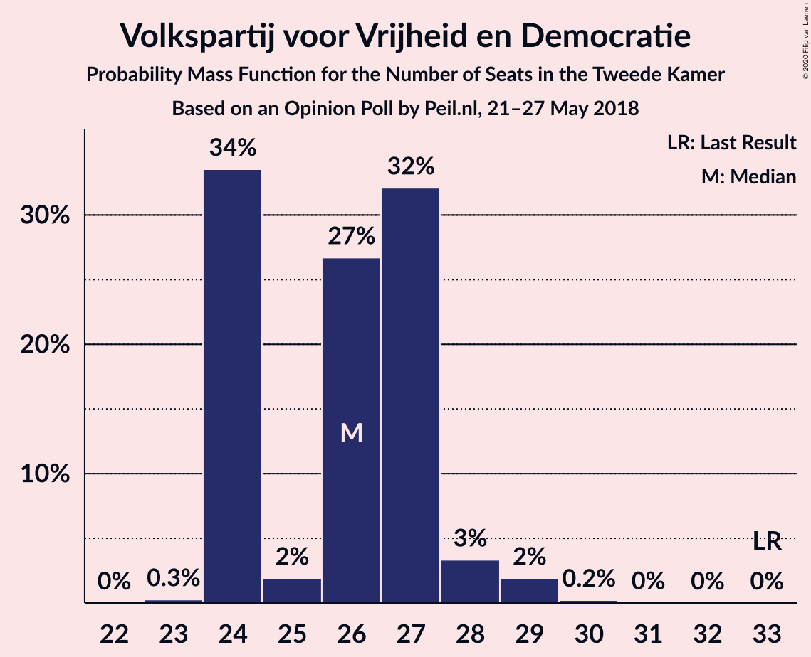

| Number of Seats | Probability | Accumulated | Special Marks |
|:---------------:|:-----------:|:-----------:|:-------------:|
| 23 | 0.3% | 100% |  |
| 24 | 34% | 99.7% |  |
| 25 | 2% | 66% |  |
| 26 | 27% | 64% | Median |
| 27 | 32% | 38% |  |
| 28 | 3% | 5% |  |
| 29 | 2% | 2% |  |
| 30 | 0.2% | 0.2% |  |
| 31 | 0% | 0% |  |
| 32 | 0% | 0% |  |
| 33 | 0% | 0% | Last Result |

### GroenLinks

*For a full overview of the results for this party, see the [GroenLinks](party-groenlinks.html) page.*

| Number of Seats | Probability | Accumulated | Special Marks |
|:---------------:|:-----------:|:-----------:|:-------------:|
| 14 | 6% | 100% | Last Result |
| 15 | 4% | 94% |  |
| 16 | 3% | 90% |  |
| 17 | 30% | 87% |  |
| 18 | 53% | 57% | Median |
| 19 | 4% | 4% |  |
| 20 | 0.1% | 0.1% |  |
| 21 | 0% | 0% |  |

### Forum voor Democratie

*For a full overview of the results for this party, see the [Forum voor Democratie](party-forumvoordemocratie.html) page.*

| Number of Seats | Probability | Accumulated | Special Marks |
|:---------------:|:-----------:|:-----------:|:-------------:|
| 2 | 0% | 100% | Last Result |
| 3 | 0% | 100% |  |
| 4 | 0% | 100% |  |
| 5 | 0% | 100% |  |
| 6 | 0% | 100% |  |
| 7 | 0% | 100% |  |
| 8 | 0% | 100% |  |
| 9 | 0% | 100% |  |
| 10 | 0% | 100% |  |
| 11 | 0% | 100% |  |
| 12 | 0% | 100% |  |
| 13 | 0.1% | 100% |  |
| 14 | 2% | 99.9% |  |
| 15 | 15% | 98% |  |
| 16 | 27% | 82% |  |
| 17 | 11% | 55% | Median |
| 18 | 40% | 44% |  |
| 19 | 4% | 4% |  |
| 20 | 0.1% | 0.1% |  |
| 21 | 0% | 0% |  |

### Partij voor de Vrijheid

*For a full overview of the results for this party, see the [Partij voor de Vrijheid](party-partijvoordevrijheid.html) page.*

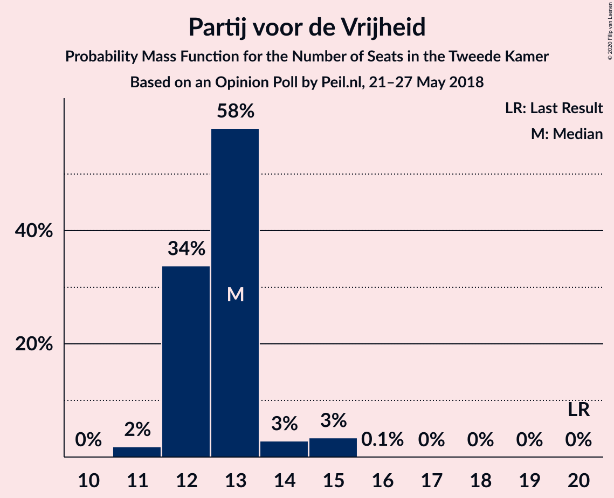

| Number of Seats | Probability | Accumulated | Special Marks |
|:---------------:|:-----------:|:-----------:|:-------------:|
| 11 | 2% | 100% |  |
| 12 | 34% | 98% |  |
| 13 | 58% | 64% | Median |
| 14 | 3% | 6% |  |
| 15 | 3% | 3% |  |
| 16 | 0.1% | 0.1% |  |
| 17 | 0% | 0% |  |
| 18 | 0% | 0% |  |
| 19 | 0% | 0% |  |
| 20 | 0% | 0% | Last Result |

### Christen-Democratisch Appèl

*For a full overview of the results for this party, see the [Christen-Democratisch Appèl](party-christen-democratischappèl.html) page.*

| Number of Seats | Probability | Accumulated | Special Marks |
|:---------------:|:-----------:|:-----------:|:-------------:|
| 11 | 0.4% | 100% |  |
| 12 | 16% | 99.6% |  |
| 13 | 46% | 83% | Median |
| 14 | 23% | 38% |  |
| 15 | 15% | 15% |  |
| 16 | 0% | 0% |  |
| 17 | 0% | 0% |  |
| 18 | 0% | 0% |  |
| 19 | 0% | 0% | Last Result |

### Socialistische Partij

*For a full overview of the results for this party, see the [Socialistische Partij](party-socialistischepartij.html) page.*

| Number of Seats | Probability | Accumulated | Special Marks |
|:---------------:|:-----------:|:-----------:|:-------------:|
| 11 | 2% | 100% |  |
| 12 | 2% | 98% |  |
| 13 | 54% | 96% | Median |
| 14 | 7% | 42% | Last Result |
| 15 | 33% | 35% |  |
| 16 | 2% | 2% |  |
| 17 | 0% | 0% |  |

### Democraten 66

*For a full overview of the results for this party, see the [Democraten 66](party-democraten66.html) page.*

| Number of Seats | Probability | Accumulated | Special Marks |
|:---------------:|:-----------:|:-----------:|:-------------:|
| 10 | 22% | 100% |  |
| 11 | 21% | 78% |  |
| 12 | 41% | 56% | Median |
| 13 | 15% | 16% |  |
| 14 | 0.4% | 0.4% |  |
| 15 | 0% | 0% |  |
| 16 | 0% | 0% |  |
| 17 | 0% | 0% |  |
| 18 | 0% | 0% |  |
| 19 | 0% | 0% | Last Result |

### Partij van de Arbeid

*For a full overview of the results for this party, see the [Partij van de Arbeid](party-partijvandearbeid.html) page.*

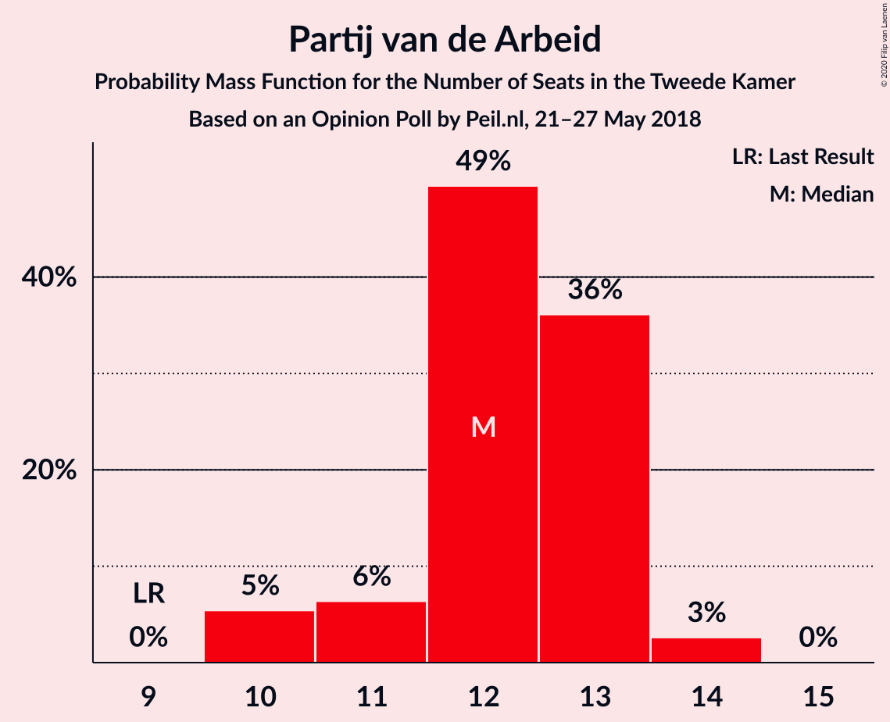

| Number of Seats | Probability | Accumulated | Special Marks |
|:---------------:|:-----------:|:-----------:|:-------------:|
| 9 | 0% | 100% | Last Result |
| 10 | 5% | 100% |  |
| 11 | 6% | 95% |  |
| 12 | 49% | 88% | Median |
| 13 | 36% | 39% |  |
| 14 | 3% | 3% |  |
| 15 | 0% | 0% |  |

### Partij voor de Dieren

*For a full overview of the results for this party, see the [Partij voor de Dieren](party-partijvoordedieren.html) page.*

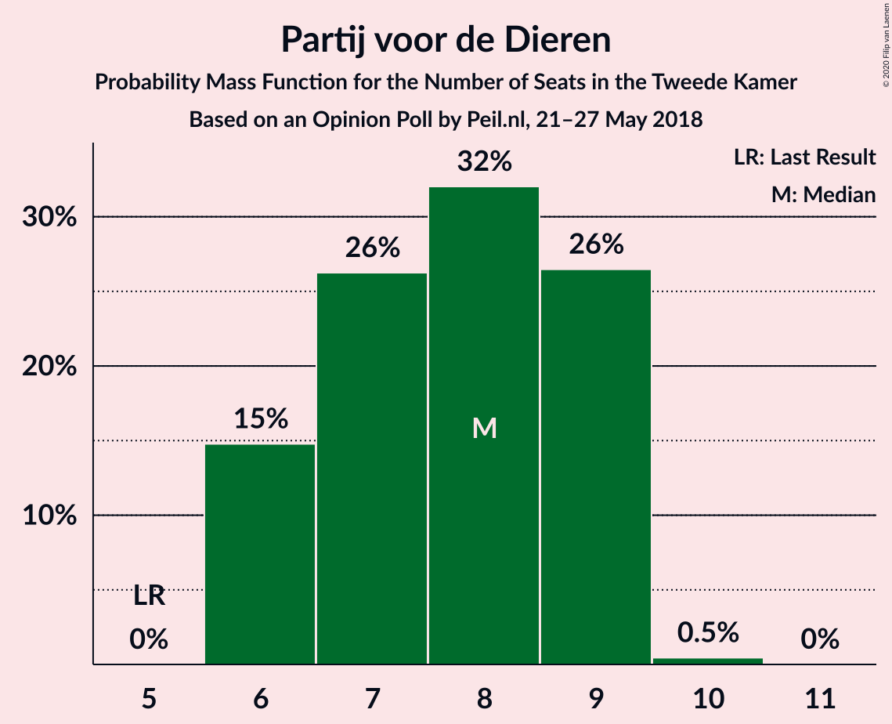

| Number of Seats | Probability | Accumulated | Special Marks |
|:---------------:|:-----------:|:-----------:|:-------------:|
| 5 | 0% | 100% | Last Result |
| 6 | 15% | 100% |  |
| 7 | 26% | 85% |  |
| 8 | 32% | 59% | Median |
| 9 | 26% | 27% |  |
| 10 | 0.5% | 0.5% |  |
| 11 | 0% | 0% |  |

### ChristenUnie

*For a full overview of the results for this party, see the [ChristenUnie](party-christenunie.html) page.*

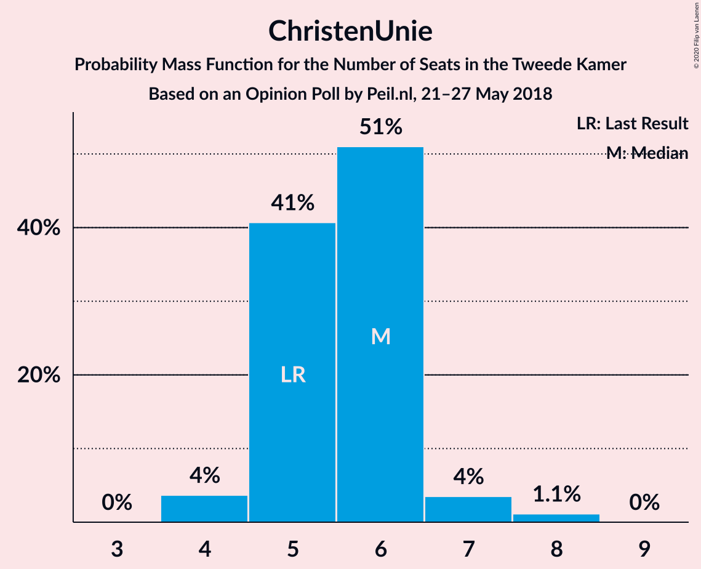

| Number of Seats | Probability | Accumulated | Special Marks |
|:---------------:|:-----------:|:-----------:|:-------------:|
| 4 | 4% | 100% |  |
| 5 | 41% | 96% | Last Result |
| 6 | 51% | 56% | Median |
| 7 | 4% | 5% |  |
| 8 | 1.1% | 1.1% |  |
| 9 | 0% | 0% |  |

### 50Plus

*For a full overview of the results for this party, see the [50Plus](party-50plus.html) page.*

| Number of Seats | Probability | Accumulated | Special Marks |
|:---------------:|:-----------:|:-----------:|:-------------:|
| 4 | 5% | 100% | Last Result |
| 5 | 33% | 95% |  |
| 6 | 41% | 62% | Median |
| 7 | 21% | 21% |  |
| 8 | 0.5% | 0.5% |  |
| 9 | 0% | 0% |  |

### DENK

*For a full overview of the results for this party, see the [DENK](party-denk.html) page.*

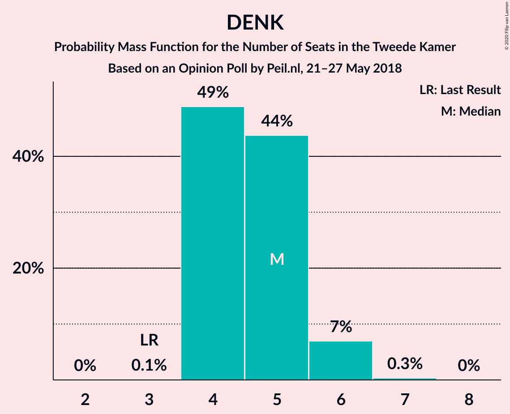

| Number of Seats | Probability | Accumulated | Special Marks |
|:---------------:|:-----------:|:-----------:|:-------------:|
| 3 | 0.1% | 100% | Last Result |
| 4 | 49% | 99.9% |  |
| 5 | 44% | 51% | Median |
| 6 | 7% | 7% |  |
| 7 | 0.3% | 0.3% |  |
| 8 | 0% | 0% |  |

### Staatkundig Gereformeerde Partij

*For a full overview of the results for this party, see the [Staatkundig Gereformeerde Partij](party-staatkundiggereformeerdepartij.html) page.*

| Number of Seats | Probability | Accumulated | Special Marks |
|:---------------:|:-----------:|:-----------:|:-------------:|
| 2 | 20% | 100% |  |
| 3 | 73% | 80% | Last Result, Median |
| 4 | 7% | 7% |  |
| 5 | 0% | 0% |  |

## Coalitions

### Confidence Intervals

| Coalition | Last Result | Median | Majority? | 80% Confidence Interval | 90% Confidence Interval | 95% Confidence Interval | 99% Confidence Interval |
|:---------:|:-----------:|:------:|:---------:|:-----------------------:|:-----------------------:|:-----------------------:|:-----------------------:|
| GroenLinks – Christen-Democratisch Appèl – Socialistische Partij – Democraten 66 – Partij van de Arbeid – ChristenUnie | 80 | 73 | 14% | 72–79 | 71–79 | 70–79 | 69–79 |
| Volkspartij voor Vrijheid en Democratie – GroenLinks – Christen-Democratisch Appèl – Democraten 66 – ChristenUnie | 90 | 74 | 7% | 71–75 | 71–76 | 71–77 | 71–78 |
| Volkspartij voor Vrijheid en Democratie – Forum voor Democratie – Christen-Democratisch Appèl – Partij voor de Vrijheid – Staatkundig Gereformeerde Partij | 77 | 71 | 0.1% | 69–74 | 69–74 | 68–74 | 68–75 |
| Volkspartij voor Vrijheid en Democratie – Christen-Democratisch Appèl – Democraten 66 – Partij van de Arbeid – ChristenUnie | 85 | 69 | 0% | 65–71 | 65–72 | 65–73 | 65–73 |
| Volkspartij voor Vrijheid en Democratie – Forum voor Democratie – Christen-Democratisch Appèl – Partij voor de Vrijheid | 74 | 68 | 0% | 67–71 | 67–71 | 66–71 | 66–72 |
| Volkspartij voor Vrijheid en Democratie – Forum voor Democratie – Christen-Democratisch Appèl – 50Plus – Staatkundig Gereformeerde Partij | 61 | 65 | 0% | 61–66 | 61–67 | 61–67 | 60–68 |
| Volkspartij voor Vrijheid en Democratie – Forum voor Democratie – Christen-Democratisch Appèl – 50Plus | 58 | 62 | 0% | 59–63 | 59–64 | 59–64 | 58–64 |
| GroenLinks – Christen-Democratisch Appèl – Democraten 66 – Partij van de Arbeid – ChristenUnie | 66 | 60 | 0% | 59–64 | 58–64 | 56–64 | 56–64 |
| Volkspartij voor Vrijheid en Democratie – Forum voor Democratie – Christen-Democratisch Appèl – Staatkundig Gereformeerde Partij | 57 | 59 | 0% | 56–61 | 56–61 | 55–62 | 54–62 |
| Volkspartij voor Vrijheid en Democratie – Christen-Democratisch Appèl – Democraten 66 – ChristenUnie | 76 | 57 | 0% | 53–59 | 53–59 | 53–60 | 53–61 |
| Volkspartij voor Vrijheid en Democratie – Forum voor Democratie – Christen-Democratisch Appèl | 54 | 56 | 0% | 54–58 | 54–58 | 53–58 | 52–59 |
| Volkspartij voor Vrijheid en Democratie – Christen-Democratisch Appèl – Partij voor de Vrijheid | 72 | 52 | 0% | 50–53 | 50–54 | 50–54 | 50–56 |
| Volkspartij voor Vrijheid en Democratie – Christen-Democratisch Appèl – Partij van de Arbeid | 61 | 52 | 0% | 49–53 | 48–53 | 48–54 | 48–56 |
| Volkspartij voor Vrijheid en Democratie – Christen-Democratisch Appèl – Democraten 66 | 71 | 51 | 0% | 47–53 | 47–53 | 47–54 | 47–54 |
| Volkspartij voor Vrijheid en Democratie – Democraten 66 – Partij van de Arbeid | 61 | 50 | 0% | 46–52 | 46–53 | 46–53 | 46–54 |
| Volkspartij voor Vrijheid en Democratie – Christen-Democratisch Appèl | 52 | 40 | 0% | 37–40 | 37–41 | 37–42 | 37–43 |
| Volkspartij voor Vrijheid en Democratie – Partij van de Arbeid | 42 | 38 | 0% | 36–40 | 36–40 | 36–41 | 35–42 |
| Christen-Democratisch Appèl – Democraten 66 – Partij van de Arbeid | 47 | 37 | 0% | 35–40 | 35–40 | 35–40 | 34–40 |
| Christen-Democratisch Appèl – Partij van de Arbeid – ChristenUnie | 33 | 31 | 0% | 29–34 | 28–34 | 27–34 | 27–35 |
| Christen-Democratisch Appèl – Partij van de Arbeid | 28 | 26 | 0% | 24–28 | 23–28 | 22–28 | 22–28 |
| Christen-Democratisch Appèl – Democraten 66 | 38 | 25 | 0% | 23–27 | 23–27 | 23–27 | 23–27 |

### GroenLinks – Christen-Democratisch Appèl – Socialistische Partij – Democraten 66 – Partij van de Arbeid – ChristenUnie

| Number of Seats | Probability | Accumulated | Special Marks |
|:---------------:|:-----------:|:-----------:|:-------------:|
| 68 | 0.2% | 100% |  |
| 69 | 0.5% | 99.8% |  |
| 70 | 4% | 99.3% |  |
| 71 | 2% | 95% |  |
| 72 | 13% | 93% |  |
| 73 | 40% | 80% |  |
| 74 | 23% | 40% | Median |
| 75 | 3% | 17% |  |
| 76 | 2% | 14% | Majority |
| 77 | 0.1% | 12% |  |
| 78 | 0% | 12% |  |
| 79 | 12% | 12% |  |
| 80 | 0% | 0% | Last Result |

### Volkspartij voor Vrijheid en Democratie – GroenLinks – Christen-Democratisch Appèl – Democraten 66 – ChristenUnie

| Number of Seats | Probability | Accumulated | Special Marks |
|:---------------:|:-----------:|:-----------:|:-------------:|
| 70 | 0.4% | 100% |  |
| 71 | 25% | 99.6% |  |
| 72 | 0.5% | 74% |  |
| 73 | 10% | 74% |  |
| 74 | 36% | 64% |  |
| 75 | 21% | 28% | Median |
| 76 | 4% | 7% | Majority |
| 77 | 2% | 3% |  |
| 78 | 1.3% | 1.3% |  |
| 79 | 0.1% | 0.1% |  |
| 80 | 0% | 0% |  |
| 81 | 0% | 0% |  |
| 82 | 0% | 0% |  |
| 83 | 0% | 0% |  |
| 84 | 0% | 0% |  |
| 85 | 0% | 0% |  |
| 86 | 0% | 0% |  |
| 87 | 0% | 0% |  |
| 88 | 0% | 0% |  |
| 89 | 0% | 0% |  |
| 90 | 0% | 0% | Last Result |

### Volkspartij voor Vrijheid en Democratie – Forum voor Democratie – Christen-Democratisch Appèl – Partij voor de Vrijheid – Staatkundig Gereformeerde Partij

| Number of Seats | Probability | Accumulated | Special Marks |
|:---------------:|:-----------:|:-----------:|:-------------:|
| 67 | 0.3% | 100% |  |
| 68 | 2% | 99.7% |  |
| 69 | 12% | 97% |  |
| 70 | 2% | 85% |  |
| 71 | 46% | 83% |  |
| 72 | 4% | 37% | Median |
| 73 | 14% | 33% |  |
| 74 | 18% | 19% |  |
| 75 | 0.5% | 0.6% |  |
| 76 | 0% | 0.1% | Majority |
| 77 | 0.1% | 0.1% | Last Result |
| 78 | 0% | 0% |  |

### Volkspartij voor Vrijheid en Democratie – Christen-Democratisch Appèl – Democraten 66 – Partij van de Arbeid – ChristenUnie

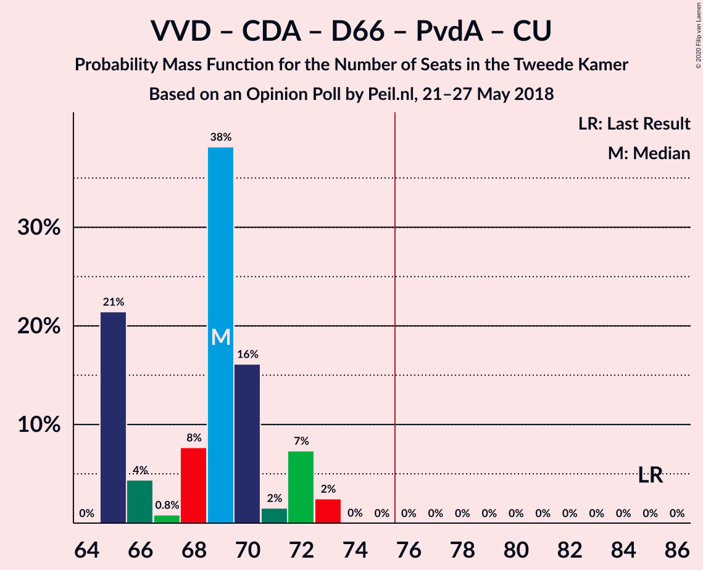

| Number of Seats | Probability | Accumulated | Special Marks |
|:---------------:|:-----------:|:-----------:|:-------------:|
| 65 | 21% | 100% |  |
| 66 | 4% | 79% |  |
| 67 | 0.8% | 74% |  |
| 68 | 8% | 73% |  |
| 69 | 38% | 66% | Median |
| 70 | 16% | 28% |  |
| 71 | 2% | 11% |  |
| 72 | 7% | 10% |  |
| 73 | 2% | 3% |  |
| 74 | 0% | 0% |  |
| 75 | 0% | 0% |  |
| 76 | 0% | 0% | Majority |
| 77 | 0% | 0% |  |
| 78 | 0% | 0% |  |
| 79 | 0% | 0% |  |
| 80 | 0% | 0% |  |
| 81 | 0% | 0% |  |
| 82 | 0% | 0% |  |
| 83 | 0% | 0% |  |
| 84 | 0% | 0% |  |
| 85 | 0% | 0% | Last Result |

### Volkspartij voor Vrijheid en Democratie – Forum voor Democratie – Christen-Democratisch Appèl – Partij voor de Vrijheid

| Number of Seats | Probability | Accumulated | Special Marks |
|:---------------:|:-----------:|:-----------:|:-------------:|
| 64 | 0.1% | 100% |  |
| 65 | 0.4% | 99.9% |  |
| 66 | 3% | 99.6% |  |
| 67 | 15% | 97% |  |
| 68 | 48% | 82% |  |
| 69 | 2% | 34% | Median |
| 70 | 12% | 32% |  |
| 71 | 20% | 20% |  |
| 72 | 0.2% | 0.5% |  |
| 73 | 0.2% | 0.3% |  |
| 74 | 0.1% | 0.1% | Last Result |
| 75 | 0% | 0% |  |

### Volkspartij voor Vrijheid en Democratie – Forum voor Democratie – Christen-Democratisch Appèl – 50Plus – Staatkundig Gereformeerde Partij

| Number of Seats | Probability | Accumulated | Special Marks |
|:---------------:|:-----------:|:-----------:|:-------------:|
| 59 | 0.1% | 100% |  |
| 60 | 2% | 99.9% |  |
| 61 | 12% | 98% | Last Result |
| 62 | 4% | 86% |  |
| 63 | 2% | 82% |  |
| 64 | 24% | 80% |  |
| 65 | 7% | 56% | Median |
| 66 | 42% | 49% |  |
| 67 | 6% | 7% |  |
| 68 | 0.7% | 0.8% |  |
| 69 | 0% | 0.1% |  |
| 70 | 0.1% | 0.1% |  |
| 71 | 0% | 0% |  |

### Volkspartij voor Vrijheid en Democratie – Forum voor Democratie – Christen-Democratisch Appèl – 50Plus

| Number of Seats | Probability | Accumulated | Special Marks |
|:---------------:|:-----------:|:-----------:|:-------------:|
| 57 | 0.1% | 100% |  |
| 58 | 2% | 99.9% | Last Result |
| 59 | 13% | 98% |  |
| 60 | 5% | 85% |  |
| 61 | 25% | 80% |  |
| 62 | 6% | 55% | Median |
| 63 | 43% | 49% |  |
| 64 | 6% | 6% |  |
| 65 | 0.3% | 0.4% |  |
| 66 | 0% | 0.1% |  |
| 67 | 0.1% | 0.1% |  |
| 68 | 0% | 0% |  |

### GroenLinks – Christen-Democratisch Appèl – Democraten 66 – Partij van de Arbeid – ChristenUnie

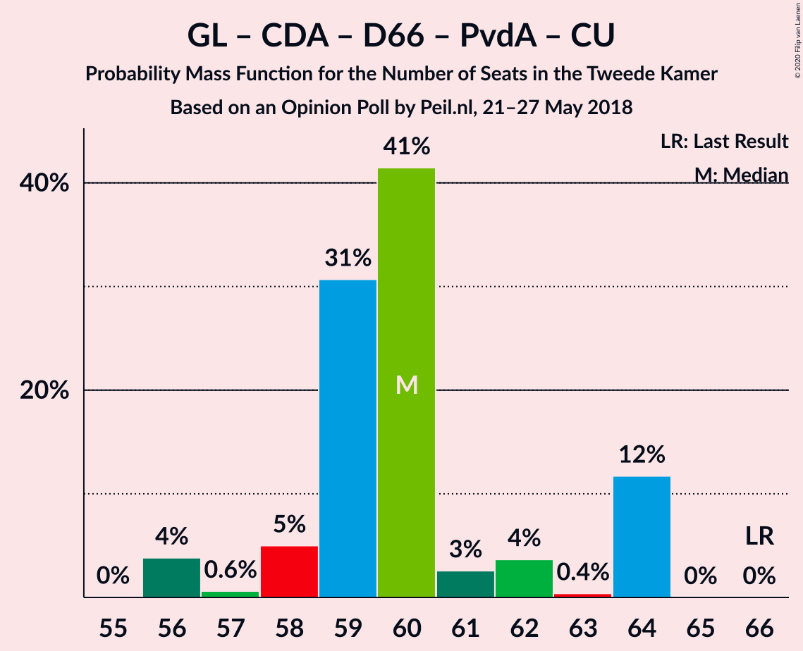

| Number of Seats | Probability | Accumulated | Special Marks |
|:---------------:|:-----------:|:-----------:|:-------------:|
| 56 | 4% | 100% |  |
| 57 | 0.6% | 96% |  |
| 58 | 5% | 96% |  |
| 59 | 31% | 91% |  |
| 60 | 41% | 60% |  |
| 61 | 3% | 18% | Median |
| 62 | 4% | 16% |  |
| 63 | 0.4% | 12% |  |
| 64 | 12% | 12% |  |
| 65 | 0% | 0% |  |
| 66 | 0% | 0% | Last Result |

### Volkspartij voor Vrijheid en Democratie – Forum voor Democratie – Christen-Democratisch Appèl – Staatkundig Gereformeerde Partij

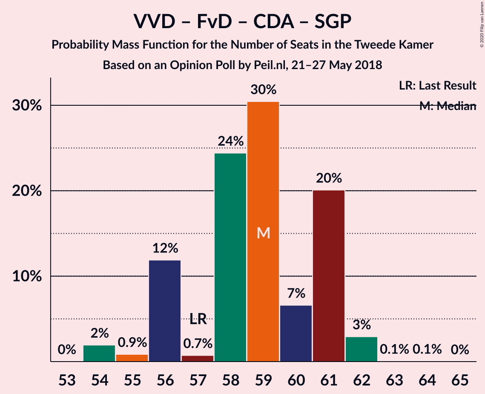

| Number of Seats | Probability | Accumulated | Special Marks |
|:---------------:|:-----------:|:-----------:|:-------------:|
| 54 | 2% | 100% |  |
| 55 | 0.9% | 98% |  |
| 56 | 12% | 97% |  |
| 57 | 0.7% | 85% | Last Result |
| 58 | 24% | 85% |  |
| 59 | 30% | 60% | Median |
| 60 | 7% | 30% |  |
| 61 | 20% | 23% |  |
| 62 | 3% | 3% |  |
| 63 | 0.1% | 0.1% |  |
| 64 | 0.1% | 0.1% |  |
| 65 | 0% | 0% |  |

### Volkspartij voor Vrijheid en Democratie – Christen-Democratisch Appèl – Democraten 66 – ChristenUnie

| Number of Seats | Probability | Accumulated | Special Marks |
|:---------------:|:-----------:|:-----------:|:-------------:|
| 53 | 20% | 100% |  |
| 54 | 2% | 80% |  |
| 55 | 0.7% | 78% |  |
| 56 | 25% | 77% |  |
| 57 | 38% | 52% | Median |
| 58 | 1.1% | 14% |  |
| 59 | 10% | 13% |  |
| 60 | 2% | 3% |  |
| 61 | 1.2% | 1.2% |  |
| 62 | 0% | 0% |  |
| 63 | 0% | 0% |  |
| 64 | 0% | 0% |  |
| 65 | 0% | 0% |  |
| 66 | 0% | 0% |  |
| 67 | 0% | 0% |  |
| 68 | 0% | 0% |  |
| 69 | 0% | 0% |  |
| 70 | 0% | 0% |  |
| 71 | 0% | 0% |  |
| 72 | 0% | 0% |  |
| 73 | 0% | 0% |  |
| 74 | 0% | 0% |  |
| 75 | 0% | 0% |  |
| 76 | 0% | 0% | Last Result, Majority |

### Volkspartij voor Vrijheid en Democratie – Forum voor Democratie – Christen-Democratisch Appèl

| Number of Seats | Probability | Accumulated | Special Marks |
|:---------------:|:-----------:|:-----------:|:-------------:|
| 52 | 2% | 100% |  |
| 53 | 0.8% | 98% |  |
| 54 | 12% | 97% | Last Result |
| 55 | 26% | 85% |  |
| 56 | 28% | 59% | Median |
| 57 | 9% | 31% |  |
| 58 | 21% | 22% |  |
| 59 | 1.4% | 1.5% |  |
| 60 | 0.1% | 0.1% |  |
| 61 | 0.1% | 0.1% |  |
| 62 | 0% | 0% |  |

### Volkspartij voor Vrijheid en Democratie – Christen-Democratisch Appèl – Partij voor de Vrijheid

| Number of Seats | Probability | Accumulated | Special Marks |
|:---------------:|:-----------:|:-----------:|:-------------:|
| 49 | 0.1% | 100% |  |
| 50 | 26% | 99.9% |  |
| 51 | 7% | 74% |  |
| 52 | 35% | 67% | Median |
| 53 | 24% | 32% |  |
| 54 | 6% | 8% |  |
| 55 | 2% | 2% |  |
| 56 | 0.5% | 0.6% |  |
| 57 | 0.1% | 0.1% |  |
| 58 | 0% | 0% |  |
| 59 | 0% | 0% |  |
| 60 | 0% | 0% |  |
| 61 | 0% | 0% |  |
| 62 | 0% | 0% |  |
| 63 | 0% | 0% |  |
| 64 | 0% | 0% |  |
| 65 | 0% | 0% |  |
| 66 | 0% | 0% |  |
| 67 | 0% | 0% |  |
| 68 | 0% | 0% |  |
| 69 | 0% | 0% |  |
| 70 | 0% | 0% |  |
| 71 | 0% | 0% |  |
| 72 | 0% | 0% | Last Result |

### Volkspartij voor Vrijheid en Democratie – Christen-Democratisch Appèl – Partij van de Arbeid

| Number of Seats | Probability | Accumulated | Special Marks |
|:---------------:|:-----------:|:-----------:|:-------------:|
| 46 | 0.1% | 100% |  |
| 47 | 0% | 99.9% |  |
| 48 | 6% | 99.9% |  |
| 49 | 22% | 94% |  |
| 50 | 0.6% | 72% |  |
| 51 | 8% | 71% | Median |
| 52 | 35% | 63% |  |
| 53 | 25% | 29% |  |
| 54 | 1.2% | 4% |  |
| 55 | 2% | 2% |  |
| 56 | 0.6% | 0.6% |  |
| 57 | 0% | 0% |  |
| 58 | 0% | 0% |  |
| 59 | 0% | 0% |  |
| 60 | 0% | 0% |  |
| 61 | 0% | 0% | Last Result |

### Volkspartij voor Vrijheid en Democratie – Christen-Democratisch Appèl – Democraten 66

| Number of Seats | Probability | Accumulated | Special Marks |
|:---------------:|:-----------:|:-----------:|:-------------:|
| 47 | 20% | 100% |  |
| 48 | 0.3% | 80% |  |
| 49 | 1.4% | 80% |  |
| 50 | 9% | 79% |  |
| 51 | 35% | 70% | Median |
| 52 | 23% | 35% |  |
| 53 | 8% | 12% |  |
| 54 | 4% | 4% |  |
| 55 | 0.1% | 0.2% |  |
| 56 | 0.1% | 0.1% |  |
| 57 | 0% | 0% |  |
| 58 | 0% | 0% |  |
| 59 | 0% | 0% |  |
| 60 | 0% | 0% |  |
| 61 | 0% | 0% |  |
| 62 | 0% | 0% |  |
| 63 | 0% | 0% |  |
| 64 | 0% | 0% |  |
| 65 | 0% | 0% |  |
| 66 | 0% | 0% |  |
| 67 | 0% | 0% |  |
| 68 | 0% | 0% |  |
| 69 | 0% | 0% |  |
| 70 | 0% | 0% |  |
| 71 | 0% | 0% | Last Result |

### Volkspartij voor Vrijheid en Democratie – Democraten 66 – Partij van de Arbeid

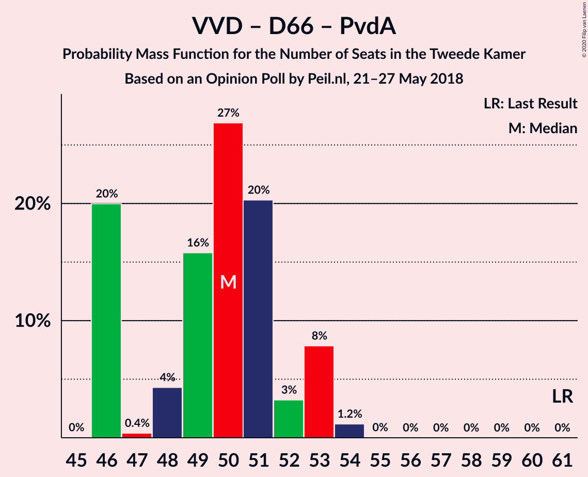

| Number of Seats | Probability | Accumulated | Special Marks |
|:---------------:|:-----------:|:-----------:|:-------------:|
| 46 | 20% | 100% |  |
| 47 | 0.4% | 80% |  |
| 48 | 4% | 80% |  |
| 49 | 16% | 75% |  |
| 50 | 27% | 59% | Median |
| 51 | 20% | 33% |  |
| 52 | 3% | 12% |  |
| 53 | 8% | 9% |  |
| 54 | 1.2% | 1.2% |  |
| 55 | 0% | 0% |  |
| 56 | 0% | 0% |  |
| 57 | 0% | 0% |  |
| 58 | 0% | 0% |  |
| 59 | 0% | 0% |  |
| 60 | 0% | 0% |  |
| 61 | 0% | 0% | Last Result |

### Volkspartij voor Vrijheid en Democratie – Christen-Democratisch Appèl

| Number of Seats | Probability | Accumulated | Special Marks |
|:---------------:|:-----------:|:-----------:|:-------------:|
| 36 | 0.2% | 100% |  |
| 37 | 22% | 99.8% |  |
| 38 | 6% | 78% |  |
| 39 | 21% | 71% | Median |
| 40 | 44% | 50% |  |
| 41 | 2% | 6% |  |
| 42 | 3% | 4% |  |
| 43 | 2% | 2% |  |
| 44 | 0% | 0% |  |
| 45 | 0% | 0% |  |
| 46 | 0% | 0% |  |
| 47 | 0% | 0% |  |
| 48 | 0% | 0% |  |
| 49 | 0% | 0% |  |
| 50 | 0% | 0% |  |
| 51 | 0% | 0% |  |
| 52 | 0% | 0% | Last Result |

### Volkspartij voor Vrijheid en Democratie – Partij van de Arbeid

| Number of Seats | Probability | Accumulated | Special Marks |
|:---------------:|:-----------:|:-----------:|:-------------:|
| 34 | 0.1% | 100% |  |
| 35 | 2% | 99.9% |  |
| 36 | 24% | 98% |  |
| 37 | 15% | 74% |  |
| 38 | 22% | 59% | Median |
| 39 | 9% | 37% |  |
| 40 | 24% | 28% |  |
| 41 | 3% | 4% |  |
| 42 | 1.3% | 1.3% | Last Result |
| 43 | 0% | 0% |  |

### Christen-Democratisch Appèl – Democraten 66 – Partij van de Arbeid

| Number of Seats | Probability | Accumulated | Special Marks |
|:---------------:|:-----------:|:-----------:|:-------------:|
| 33 | 0.3% | 100% |  |
| 34 | 0.8% | 99.7% |  |
| 35 | 27% | 98.9% |  |
| 36 | 8% | 72% |  |
| 37 | 22% | 64% | Median |
| 38 | 23% | 42% |  |
| 39 | 6% | 20% |  |
| 40 | 13% | 13% |  |
| 41 | 0% | 0.1% |  |
| 42 | 0.1% | 0.1% |  |
| 43 | 0% | 0% |  |
| 44 | 0% | 0% |  |
| 45 | 0% | 0% |  |
| 46 | 0% | 0% |  |
| 47 | 0% | 0% | Last Result |

### Christen-Democratisch Appèl – Partij van de Arbeid – ChristenUnie

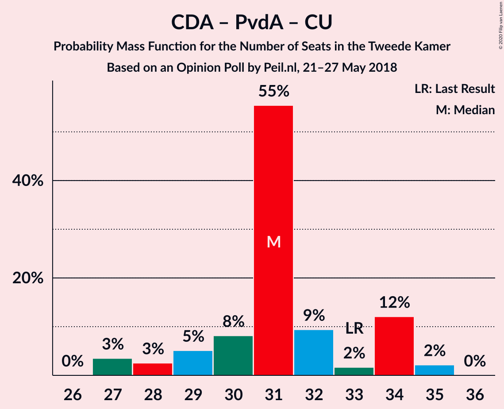

| Number of Seats | Probability | Accumulated | Special Marks |
|:---------------:|:-----------:|:-----------:|:-------------:|
| 27 | 3% | 100% |  |
| 28 | 3% | 96% |  |
| 29 | 5% | 94% |  |
| 30 | 8% | 89% |  |
| 31 | 55% | 81% | Median |
| 32 | 9% | 25% |  |
| 33 | 2% | 16% | Last Result |
| 34 | 12% | 14% |  |
| 35 | 2% | 2% |  |
| 36 | 0% | 0% |  |

### Christen-Democratisch Appèl – Partij van de Arbeid

| Number of Seats | Probability | Accumulated | Special Marks |
|:---------------:|:-----------:|:-----------:|:-------------:|
| 22 | 4% | 100% |  |
| 23 | 3% | 96% |  |
| 24 | 11% | 93% |  |
| 25 | 24% | 83% | Median |
| 26 | 43% | 59% |  |
| 27 | 2% | 16% |  |
| 28 | 14% | 14% | Last Result |
| 29 | 0.1% | 0.1% |  |
| 30 | 0% | 0% |  |

### Christen-Democratisch Appèl – Democraten 66

| Number of Seats | Probability | Accumulated | Special Marks |
|:---------------:|:-----------:|:-----------:|:-------------:|
| 22 | 0.2% | 100% |  |
| 23 | 25% | 99.8% |  |
| 24 | 21% | 75% |  |
| 25 | 11% | 54% | Median |
| 26 | 29% | 43% |  |
| 27 | 14% | 14% |  |
| 28 | 0.1% | 0.1% |  |
| 29 | 0% | 0% |  |
| 30 | 0% | 0% |  |
| 31 | 0% | 0% |  |
| 32 | 0% | 0% |  |
| 33 | 0% | 0% |  |
| 34 | 0% | 0% |  |
| 35 | 0% | 0% |  |
| 36 | 0% | 0% |  |
| 37 | 0% | 0% |  |
| 38 | 0% | 0% | Last Result |

## Technical Information

### Opinion Poll

+ **Polling firm:** Peil.nl
+ **Commissioner(s):** —
+ **Fieldwork period:** 21–27 May 2018

### Calculations

+ **Sample size:** 3000
+ **Simulations done:** 1,048,576
+ **Error estimate:** 1.72%

