# Opinion Poll by Ipsos for EenVandaag, 25–28 May 2018

<a href="#voting-intentions">Voting Intentions</a> | <a href="#seats">Seats</a> | <a href="#coalitions">Coalitions</a> | <a href="#technical-information">Technical Information</a>

## Voting Intentions

### Confidence Intervals

| Party | Last Result | Poll Result | 80% Confidence Interval | 90% Confidence Interval | 95% Confidence Interval | 99% Confidence Interval |
|:-----:|:-----------:|:-----------:|:-----------------------:|:-----------------------:|:-----------------------:|:-----------------------:|
| Volkspartij voor Vrijheid en Democratie | 21.3% | 20.5% | 18.9–22.2% |18.5–22.6% |18.1–23.0% |17.4–23.9% |
| GroenLinks | 9.1% | 11.7% | 10.5–13.0% |10.2–13.4% |9.9–13.8% |9.3–14.4% |
| Christen-Democratisch Appèl | 12.4% | 11.0% | 9.8–12.3% |9.5–12.7% |9.2–13.1% |8.7–13.7% |
| Partij voor de Vrijheid | 13.1% | 10.5% | 9.4–11.8% |9.1–12.2% |8.8–12.5% |8.3–13.2% |
| Democraten 66 | 12.2% | 10.0% | 8.9–11.2% |8.5–11.6% |8.3–11.9% |7.8–12.6% |
| Socialistische Partij | 9.1% | 7.2% | 6.2–8.3% |6.0–8.6% |5.8–8.9% |5.3–9.5% |
| Forum voor Democratie | 1.8% | 6.4% | 5.5–7.5% |5.3–7.8% |5.1–8.1% |4.7–8.6% |
| Partij van de Arbeid | 5.7% | 5.3% | 4.5–6.3% |4.3–6.5% |4.1–6.8% |3.7–7.3% |
| Partij voor de Dieren | 3.2% | 4.5% | 3.8–5.4% |3.6–5.7% |3.4–5.9% |3.1–6.4% |
| ChristenUnie | 3.4% | 4.4% | 3.7–5.3% |3.5–5.6% |3.3–5.8% |3.0–6.3% |
| 50Plus | 3.1% | 3.4% | 2.8–4.3% |2.6–4.5% |2.5–4.7% |2.2–5.2% |
| DENK | 2.1% | 2.3% | 1.8–3.0% |1.7–3.2% |1.5–3.4% |1.3–3.8% |
| Staatkundig Gereformeerde Partij | 2.1% | 2.0% | 1.6–2.7% |1.4–2.9% |1.3–3.1% |1.1–3.4% |

*Note:* The poll result column reflects the actual value used in the calculations. Published results may vary slightly, and in addition be rounded to fewer digits.

## Seats

### Confidence Intervals

| Party | Last Result | Median | 80% Confidence Interval | 90% Confidence Interval | 95% Confidence Interval | 99% Confidence Interval |
|:-----:|:-----------:|:------:|:-----------------------:|:-----------------------:|:-----------------------:|:-----------------------:|
| <a href="#volkspartij-voor-vrijheid-en-democratie">Volkspartij voor Vrijheid en Democratie</a> | 33 | 32 | 31–32 |27–32 |27–33 |27–36 |
| <a href="#groenlinks">GroenLinks</a> | 14 | 20 | 18–20 |16–20 |15–20 |14–20 |
| <a href="#christen-democratisch-appèl">Christen-Democratisch Appèl</a> | 19 | 14 | 14–16 |14–17 |14–17 |13–19 |
| <a href="#partij-voor-de-vrijheid">Partij voor de Vrijheid</a> | 20 | 17 | 15–17 |14–17 |13–18 |13–20 |
| <a href="#democraten-66">Democraten 66</a> | 19 | 13 | 13–16 |13–18 |13–18 |13–19 |
| <a href="#socialistische-partij">Socialistische Partij</a> | 14 | 12 | 11–12 |10–12 |10–12 |8–13 |
| <a href="#forum-voor-democratie">Forum voor Democratie</a> | 2 | 10 | 10 |9–10 |8–11 |7–13 |
| <a href="#partij-van-de-arbeid">Partij van de Arbeid</a> | 9 | 10 | 9–10 |8–10 |7–10 |6–11 |
| <a href="#partij-voor-de-dieren">Partij voor de Dieren</a> | 5 | 7 | 6–7 |5–7 |5–8 |5–9 |
| <a href="#christenunie">ChristenUnie</a> | 5 | 6 | 6 |5–7 |5–7 |4–9 |
| <a href="#50plus">50Plus</a> | 4 | 4 | 4–6 |4–6 |4–7 |4–7 |
| <a href="#denk">DENK</a> | 3 | 2 | 2–4 |2–5 |2–5 |2–6 |
| <a href="#staatkundig-gereformeerde-partij">Staatkundig Gereformeerde Partij</a> | 3 | 2 | 2–3 |2–4 |2–4 |2–4 |

### Volkspartij voor Vrijheid en Democratie

*For a full overview of the results for this party, see the [Volkspartij voor Vrijheid en Democratie](party-volkspartijvoorvrijheidendemocratie.html) page.*

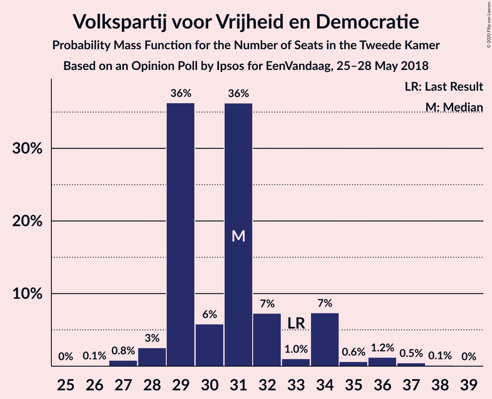

| Number of Seats | Probability | Accumulated | Special Marks |
|:---------------:|:-----------:|:-----------:|:-------------:|
| 26 | 0.1% | 100% |  |
| 27 | 6% | 99.9% |  |
| 28 | 1.0% | 94% |  |
| 29 | 1.0% | 93% |  |
| 30 | 1.1% | 92% |  |
| 31 | 7% | 91% |  |
| 32 | 82% | 84% | Median |
| 33 | 1.3% | 3% | Last Result |
| 34 | 0.2% | 1.2% |  |
| 35 | 0.5% | 1.0% |  |
| 36 | 0% | 0.5% |  |
| 37 | 0.2% | 0.5% |  |
| 38 | 0.2% | 0.3% |  |
| 39 | 0% | 0% |  |

### GroenLinks

*For a full overview of the results for this party, see the [GroenLinks](party-groenlinks.html) page.*

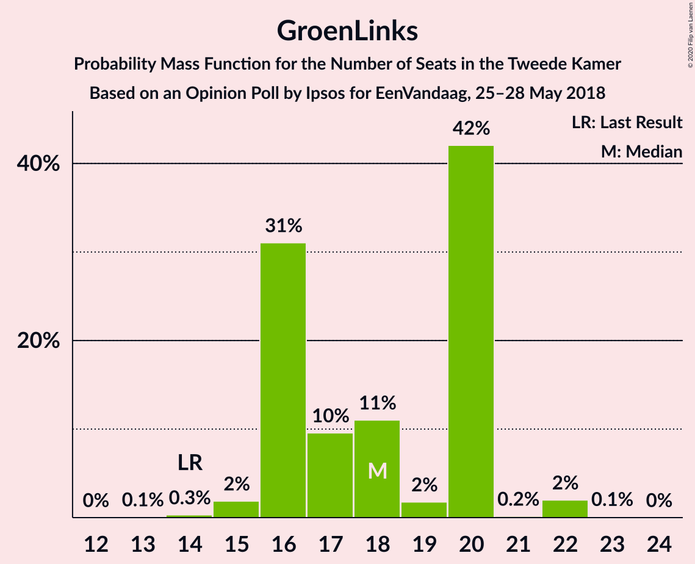

| Number of Seats | Probability | Accumulated | Special Marks |
|:---------------:|:-----------:|:-----------:|:-------------:|
| 14 | 1.3% | 100% | Last Result |
| 15 | 1.4% | 98.7% |  |
| 16 | 5% | 97% |  |
| 17 | 0.9% | 93% |  |
| 18 | 2% | 92% |  |
| 19 | 4% | 90% |  |
| 20 | 86% | 86% | Median |
| 21 | 0.1% | 0.2% |  |
| 22 | 0% | 0% |  |

### Christen-Democratisch Appèl

*For a full overview of the results for this party, see the [Christen-Democratisch Appèl](party-christen-democratischappèl.html) page.*

| Number of Seats | Probability | Accumulated | Special Marks |
|:---------------:|:-----------:|:-----------:|:-------------:|
| 12 | 0.3% | 100% |  |
| 13 | 0.3% | 99.7% |  |
| 14 | 82% | 99.4% | Median |
| 15 | 5% | 17% |  |
| 16 | 5% | 12% |  |
| 17 | 5% | 7% |  |
| 18 | 1.3% | 2% |  |
| 19 | 0.9% | 1.0% | Last Result |
| 20 | 0.1% | 0.1% |  |
| 21 | 0% | 0% |  |

### Partij voor de Vrijheid

*For a full overview of the results for this party, see the [Partij voor de Vrijheid](party-partijvoordevrijheid.html) page.*

| Number of Seats | Probability | Accumulated | Special Marks |
|:---------------:|:-----------:|:-----------:|:-------------:|
| 13 | 5% | 100% |  |
| 14 | 3% | 95% |  |
| 15 | 4% | 92% |  |
| 16 | 1.1% | 88% |  |
| 17 | 82% | 87% | Median |
| 18 | 4% | 5% |  |
| 19 | 0.1% | 0.6% |  |
| 20 | 0.1% | 0.5% | Last Result |
| 21 | 0.2% | 0.4% |  |
| 22 | 0.2% | 0.2% |  |
| 23 | 0% | 0% |  |

### Democraten 66

*For a full overview of the results for this party, see the [Democraten 66](party-democraten66.html) page.*

| Number of Seats | Probability | Accumulated | Special Marks |
|:---------------:|:-----------:|:-----------:|:-------------:|
| 11 | 0% | 100% |  |
| 12 | 0.1% | 99.9% |  |
| 13 | 84% | 99.8% | Median |
| 14 | 1.0% | 15% |  |
| 15 | 4% | 14% |  |
| 16 | 5% | 11% |  |
| 17 | 0.5% | 6% |  |
| 18 | 5% | 6% |  |
| 19 | 0.5% | 0.6% | Last Result |
| 20 | 0.1% | 0.1% |  |
| 21 | 0% | 0% |  |

### Socialistische Partij

*For a full overview of the results for this party, see the [Socialistische Partij](party-socialistischepartij.html) page.*

| Number of Seats | Probability | Accumulated | Special Marks |
|:---------------:|:-----------:|:-----------:|:-------------:|
| 8 | 0.7% | 100% |  |
| 9 | 0.8% | 99.3% |  |
| 10 | 7% | 98% |  |
| 11 | 4% | 91% |  |
| 12 | 86% | 87% | Median |
| 13 | 0.8% | 1.2% |  |
| 14 | 0.2% | 0.4% | Last Result |
| 15 | 0.2% | 0.2% |  |
| 16 | 0% | 0% |  |

### Forum voor Democratie

*For a full overview of the results for this party, see the [Forum voor Democratie](party-forumvoordemocratie.html) page.*

| Number of Seats | Probability | Accumulated | Special Marks |
|:---------------:|:-----------:|:-----------:|:-------------:|
| 2 | 0% | 100% | Last Result |
| 3 | 0% | 100% |  |
| 4 | 0% | 100% |  |
| 5 | 0.4% | 100% |  |
| 6 | 0.1% | 99.6% |  |
| 7 | 1.0% | 99.5% |  |
| 8 | 1.1% | 98.5% |  |
| 9 | 6% | 97% |  |
| 10 | 88% | 91% | Median |
| 11 | 2% | 4% |  |
| 12 | 0.3% | 2% |  |
| 13 | 1.0% | 1.4% |  |
| 14 | 0.4% | 0.4% |  |
| 15 | 0% | 0% |  |

### Partij van de Arbeid

*For a full overview of the results for this party, see the [Partij van de Arbeid](party-partijvandearbeid.html) page.*

| Number of Seats | Probability | Accumulated | Special Marks |
|:---------------:|:-----------:|:-----------:|:-------------:|
| 5 | 0.1% | 100% |  |
| 6 | 1.0% | 99.9% |  |
| 7 | 2% | 98.9% |  |
| 8 | 5% | 97% |  |
| 9 | 8% | 92% | Last Result |
| 10 | 83% | 84% | Median |
| 11 | 2% | 2% |  |
| 12 | 0% | 0% |  |

### Partij voor de Dieren

*For a full overview of the results for this party, see the [Partij voor de Dieren](party-partijvoordedieren.html) page.*

| Number of Seats | Probability | Accumulated | Special Marks |
|:---------------:|:-----------:|:-----------:|:-------------:|
| 3 | 0.1% | 100% |  |
| 4 | 0.2% | 99.9% |  |
| 5 | 5% | 99.7% | Last Result |
| 6 | 6% | 95% |  |
| 7 | 86% | 89% | Median |
| 8 | 2% | 3% |  |
| 9 | 0.6% | 0.7% |  |
| 10 | 0.1% | 0.1% |  |
| 11 | 0% | 0% |  |

### ChristenUnie

*For a full overview of the results for this party, see the [ChristenUnie](party-christenunie.html) page.*

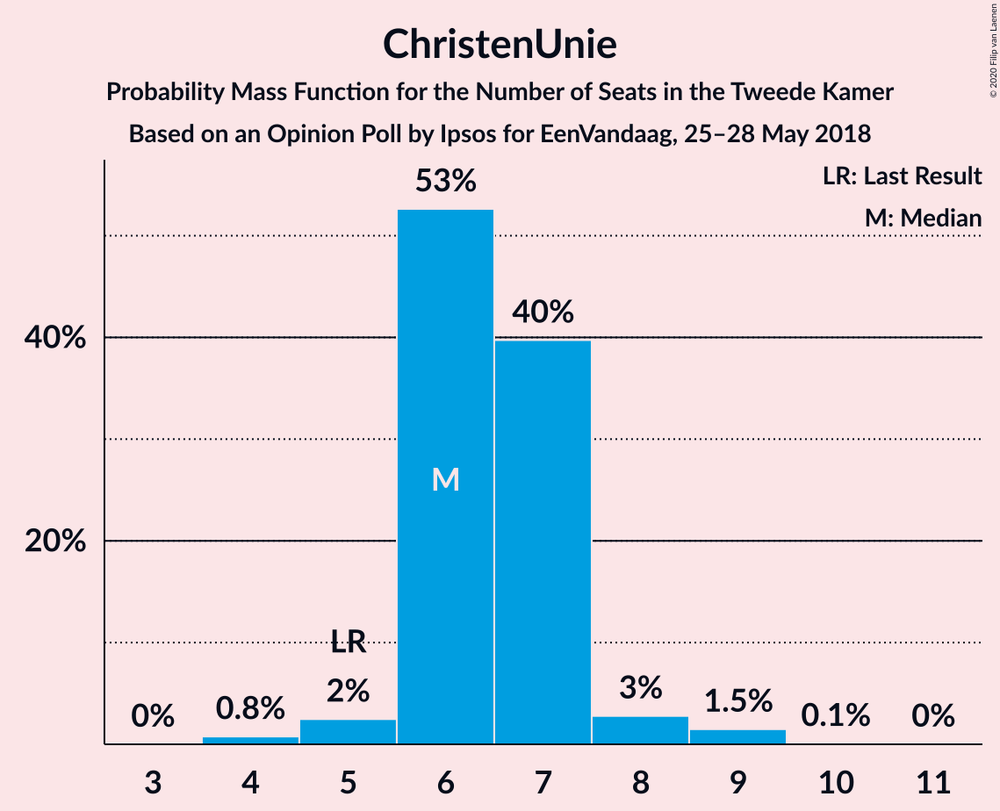

| Number of Seats | Probability | Accumulated | Special Marks |
|:---------------:|:-----------:|:-----------:|:-------------:|
| 4 | 1.0% | 100% |  |
| 5 | 6% | 99.0% | Last Result |
| 6 | 85% | 93% | Median |
| 7 | 6% | 8% |  |
| 8 | 1.2% | 2% |  |
| 9 | 0.5% | 0.7% |  |
| 10 | 0.1% | 0.2% |  |
| 11 | 0% | 0.1% |  |
| 12 | 0.1% | 0.1% |  |
| 13 | 0% | 0% |  |

### 50Plus

*For a full overview of the results for this party, see the [50Plus](party-50plus.html) page.*

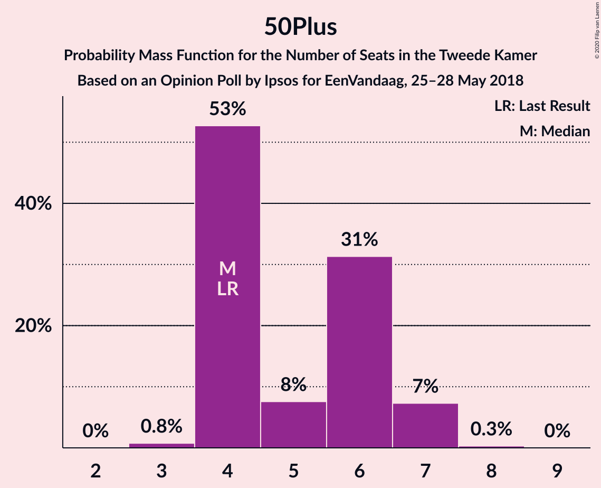

| Number of Seats | Probability | Accumulated | Special Marks |
|:---------------:|:-----------:|:-----------:|:-------------:|
| 3 | 0.3% | 100% |  |
| 4 | 83% | 99.7% | Last Result, Median |
| 5 | 6% | 16% |  |
| 6 | 7% | 10% |  |
| 7 | 4% | 4% |  |
| 8 | 0% | 0% |  |

### DENK

*For a full overview of the results for this party, see the [DENK](party-denk.html) page.*

| Number of Seats | Probability | Accumulated | Special Marks |
|:---------------:|:-----------:|:-----------:|:-------------:|
| 1 | 0.2% | 100% |  |
| 2 | 86% | 99.8% | Median |
| 3 | 3% | 14% | Last Result |
| 4 | 3% | 11% |  |
| 5 | 7% | 8% |  |
| 6 | 0.6% | 0.7% |  |
| 7 | 0.1% | 0.1% |  |
| 8 | 0% | 0% |  |

### Staatkundig Gereformeerde Partij

*For a full overview of the results for this party, see the [Staatkundig Gereformeerde Partij](party-staatkundiggereformeerdepartij.html) page.*

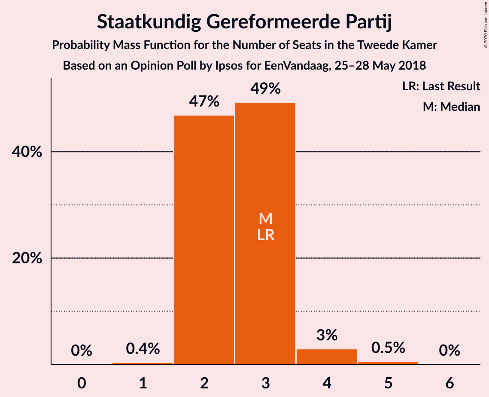

| Number of Seats | Probability | Accumulated | Special Marks |
|:---------------:|:-----------:|:-----------:|:-------------:|
| 1 | 0.5% | 100% |  |
| 2 | 89% | 99.5% | Median |
| 3 | 5% | 11% | Last Result |
| 4 | 6% | 6% |  |
| 5 | 0.2% | 0.2% |  |
| 6 | 0% | 0% |  |

## Coalitions

### Confidence Intervals

| Coalition | Last Result | Median | Majority? | 80% Confidence Interval | 90% Confidence Interval | 95% Confidence Interval | 99% Confidence Interval |
|:---------:|:-----------:|:------:|:---------:|:-----------------------:|:-----------------------:|:-----------------------:|:-----------------------:|
| Volkspartij voor Vrijheid en Democratie – GroenLinks – Christen-Democratisch Appèl – Democraten 66 – ChristenUnie | 90 | 85 | 100% | 85 | 83–87 | 82–89 | 81–91 |
| Volkspartij voor Vrijheid en Democratie – Christen-Democratisch Appèl – Democraten 66 – Partij van de Arbeid – ChristenUnie | 85 | 75 | 10% | 75–76 | 74–80 | 72–80 | 71–83 |
| GroenLinks – Christen-Democratisch Appèl – Democraten 66 – Socialistische Partij – Partij van de Arbeid – ChristenUnie | 80 | 75 | 9% | 75 | 74–77 | 73–77 | 70–77 |
| Volkspartij voor Vrijheid en Democratie – Christen-Democratisch Appèl – Partij voor de Vrijheid – Forum voor Democratie – Staatkundig Gereformeerde Partij | 77 | 75 | 5% | 74–75 | 73–75 | 70–77 | 69–80 |
| Volkspartij voor Vrijheid en Democratie – Christen-Democratisch Appèl – Partij voor de Vrijheid – Forum voor Democratie | 74 | 73 | 1.2% | 71–73 | 70–73 | 67–74 | 67–78 |
| Volkspartij voor Vrijheid en Democratie – Christen-Democratisch Appèl – Democraten 66 – ChristenUnie | 76 | 65 | 0.4% | 65–67 | 65–71 | 63–71 | 63–75 |
| Volkspartij voor Vrijheid en Democratie – Christen-Democratisch Appèl – Forum voor Democratie – 50Plus – Staatkundig Gereformeerde Partij | 61 | 62 | 0% | 62 | 62–67 | 59–67 | 59–69 |
| GroenLinks – Christen-Democratisch Appèl – Democraten 66 – Partij van de Arbeid – ChristenUnie | 66 | 63 | 0% | 63–65 | 63–65 | 62–66 | 60–68 |
| Volkspartij voor Vrijheid en Democratie – Christen-Democratisch Appèl – Democraten 66 | 71 | 59 | 0% | 59–61 | 59–66 | 57–66 | 55–69 |
| Volkspartij voor Vrijheid en Democratie – Christen-Democratisch Appèl – Forum voor Democratie – 50Plus | 58 | 60 | 0% | 60–61 | 60–63 | 57–65 | 57–66 |
| Volkspartij voor Vrijheid en Democratie – Christen-Democratisch Appèl – Partij voor de Vrijheid | 72 | 63 | 0% | 61–63 | 60–63 | 58–64 | 57–70 |
| Volkspartij voor Vrijheid en Democratie – Christen-Democratisch Appèl – Forum voor Democratie – Staatkundig Gereformeerde Partij | 57 | 58 | 0% | 58 | 55–61 | 54–62 | 54–64 |
| Volkspartij voor Vrijheid en Democratie – Christen-Democratisch Appèl – Forum voor Democratie | 54 | 56 | 0% | 56 | 53–57 | 52–59 | 51–61 |
| Volkspartij voor Vrijheid en Democratie – Democraten 66 – Partij van de Arbeid | 61 | 55 | 0% | 55 | 51–58 | 51–58 | 49–59 |
| Volkspartij voor Vrijheid en Democratie – Christen-Democratisch Appèl – Partij van de Arbeid | 61 | 56 | 0% | 56 | 51–57 | 51–57 | 51–61 |
| Volkspartij voor Vrijheid en Democratie – Christen-Democratisch Appèl | 52 | 46 | 0% | 46 | 43–48 | 42–49 | 42–53 |
| Christen-Democratisch Appèl – Democraten 66 – Partij van de Arbeid | 47 | 37 | 0% | 37–40 | 37–43 | 37–44 | 36–44 |
| Volkspartij voor Vrijheid en Democratie – Partij van de Arbeid | 42 | 42 | 0% | 39–42 | 36–42 | 35–42 | 35–44 |
| Christen-Democratisch Appèl – Democraten 66 | 38 | 27 | 0% | 27–32 | 27–34 | 27–35 | 27–35 |
| Christen-Democratisch Appèl – Partij van de Arbeid – ChristenUnie | 33 | 30 | 0% | 30–31 | 30–31 | 29–33 | 27–37 |
| Christen-Democratisch Appèl – Partij van de Arbeid | 28 | 24 | 0% | 24 | 24–26 | 23–26 | 21–30 |

### Volkspartij voor Vrijheid en Democratie – GroenLinks – Christen-Democratisch Appèl – Democraten 66 – ChristenUnie

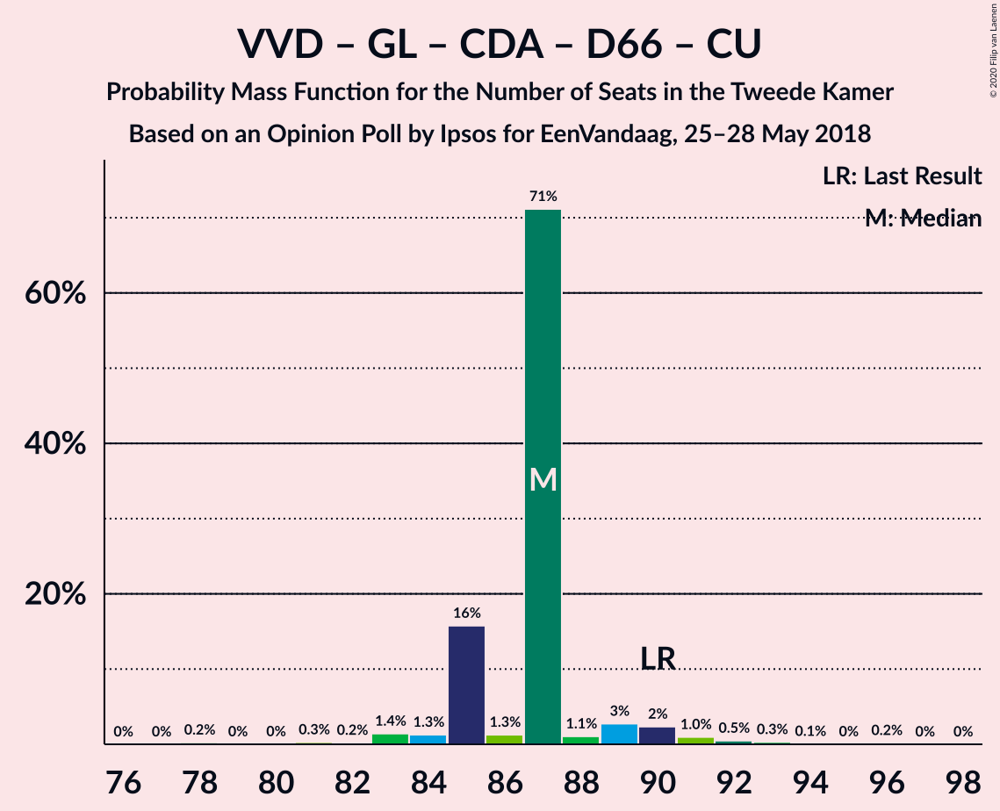

| Number of Seats | Probability | Accumulated | Special Marks |
|:---------------:|:-----------:|:-----------:|:-------------:|
| 79 | 0.1% | 100% |  |
| 80 | 0.1% | 99.9% |  |
| 81 | 1.2% | 99.8% |  |
| 82 | 1.4% | 98.5% |  |
| 83 | 2% | 97% |  |
| 84 | 1.3% | 95% |  |
| 85 | 84% | 94% | Median |
| 86 | 1.3% | 9% |  |
| 87 | 4% | 8% |  |
| 88 | 0.5% | 3% |  |
| 89 | 0.7% | 3% |  |
| 90 | 0.6% | 2% | Last Result |
| 91 | 1.3% | 2% |  |
| 92 | 0% | 0.3% |  |
| 93 | 0.3% | 0.3% |  |
| 94 | 0% | 0% |  |

### Volkspartij voor Vrijheid en Democratie – Christen-Democratisch Appèl – Democraten 66 – Partij van de Arbeid – ChristenUnie

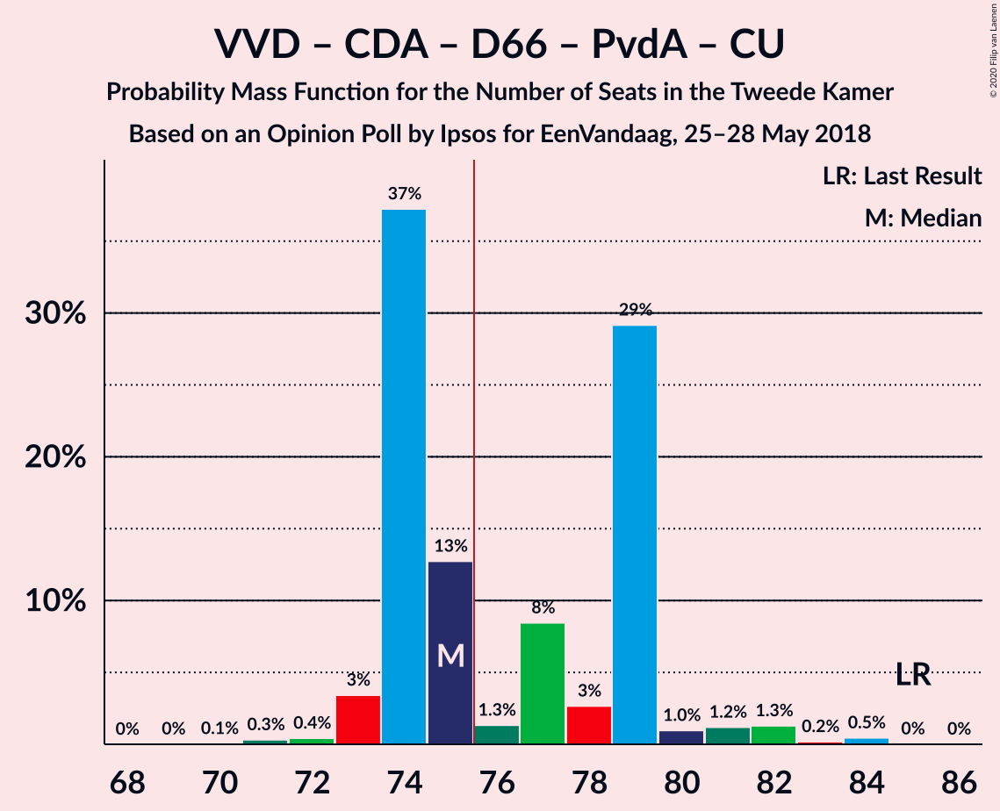

| Number of Seats | Probability | Accumulated | Special Marks |
|:---------------:|:-----------:|:-----------:|:-------------:|
| 70 | 0.3% | 100% |  |
| 71 | 0.2% | 99.7% |  |
| 72 | 2% | 99.5% |  |
| 73 | 0% | 97% |  |
| 74 | 5% | 97% |  |
| 75 | 81% | 92% | Median |
| 76 | 0.9% | 10% | Majority |
| 77 | 1.4% | 10% |  |
| 78 | 1.4% | 8% |  |
| 79 | 0.8% | 7% |  |
| 80 | 4% | 6% |  |
| 81 | 1.1% | 2% |  |
| 82 | 0.1% | 0.7% |  |
| 83 | 0.2% | 0.6% |  |
| 84 | 0.3% | 0.4% |  |
| 85 | 0.1% | 0.1% | Last Result |
| 86 | 0% | 0% |  |

### GroenLinks – Christen-Democratisch Appèl – Democraten 66 – Socialistische Partij – Partij van de Arbeid – ChristenUnie

| Number of Seats | Probability | Accumulated | Special Marks |
|:---------------:|:-----------:|:-----------:|:-------------:|
| 68 | 0.2% | 100% |  |
| 69 | 0% | 99.8% |  |
| 70 | 0.3% | 99.7% |  |
| 71 | 1.2% | 99.5% |  |
| 72 | 0.8% | 98% |  |
| 73 | 1.1% | 98% |  |
| 74 | 1.5% | 96% |  |
| 75 | 86% | 95% | Median |
| 76 | 1.5% | 9% | Majority |
| 77 | 7% | 7% |  |
| 78 | 0.3% | 0.5% |  |
| 79 | 0% | 0.2% |  |
| 80 | 0.1% | 0.2% | Last Result |
| 81 | 0% | 0% |  |

### Volkspartij voor Vrijheid en Democratie – Christen-Democratisch Appèl – Partij voor de Vrijheid – Forum voor Democratie – Staatkundig Gereformeerde Partij

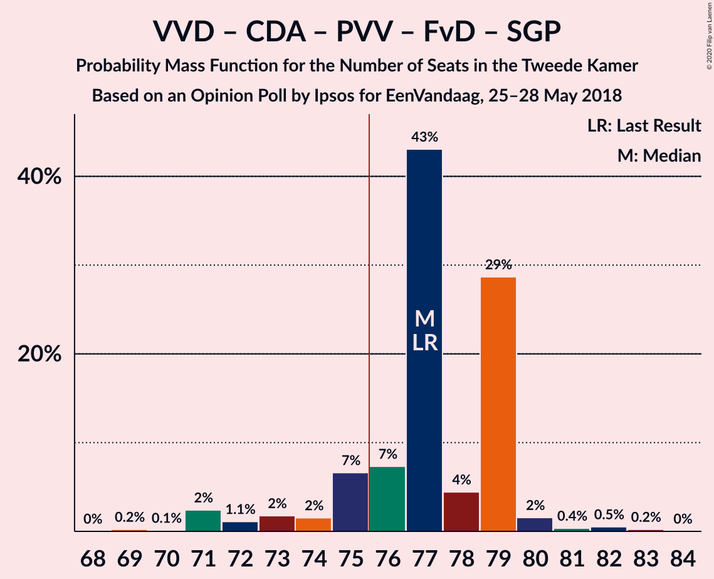

| Number of Seats | Probability | Accumulated | Special Marks |
|:---------------:|:-----------:|:-----------:|:-------------:|
| 69 | 2% | 100% |  |
| 70 | 0.5% | 98% |  |
| 71 | 0% | 97% |  |
| 72 | 0.5% | 97% |  |
| 73 | 5% | 97% |  |
| 74 | 5% | 91% |  |
| 75 | 82% | 87% | Median |
| 76 | 2% | 5% | Majority |
| 77 | 0.8% | 3% | Last Result |
| 78 | 0.9% | 2% |  |
| 79 | 0.2% | 1.0% |  |
| 80 | 0.5% | 0.8% |  |
| 81 | 0% | 0.4% |  |
| 82 | 0.1% | 0.3% |  |
| 83 | 0% | 0.3% |  |
| 84 | 0.2% | 0.2% |  |
| 85 | 0% | 0% |  |

### Volkspartij voor Vrijheid en Democratie – Christen-Democratisch Appèl – Partij voor de Vrijheid – Forum voor Democratie

| Number of Seats | Probability | Accumulated | Special Marks |
|:---------------:|:-----------:|:-----------:|:-------------:|
| 67 | 3% | 100% |  |
| 68 | 0% | 97% |  |
| 69 | 0.9% | 97% |  |
| 70 | 6% | 96% |  |
| 71 | 4% | 91% |  |
| 72 | 1.0% | 87% |  |
| 73 | 82% | 86% | Median |
| 74 | 1.3% | 3% | Last Result |
| 75 | 0.7% | 2% |  |
| 76 | 0.4% | 1.2% | Majority |
| 77 | 0.1% | 0.8% |  |
| 78 | 0.4% | 0.7% |  |
| 79 | 0% | 0.3% |  |
| 80 | 0% | 0.3% |  |
| 81 | 0.2% | 0.2% |  |
| 82 | 0% | 0% |  |

### Volkspartij voor Vrijheid en Democratie – Christen-Democratisch Appèl – Democraten 66 – ChristenUnie

| Number of Seats | Probability | Accumulated | Special Marks |
|:---------------:|:-----------:|:-----------:|:-------------:|
| 61 | 0.2% | 100% |  |
| 62 | 0% | 99.8% |  |
| 63 | 3% | 99.8% |  |
| 64 | 1.0% | 97% |  |
| 65 | 81% | 96% | Median |
| 66 | 4% | 15% |  |
| 67 | 0.7% | 10% |  |
| 68 | 0.9% | 10% |  |
| 69 | 0.5% | 9% |  |
| 70 | 2% | 8% |  |
| 71 | 6% | 7% |  |
| 72 | 0.1% | 1.0% |  |
| 73 | 0.1% | 1.0% |  |
| 74 | 0.1% | 0.9% |  |
| 75 | 0.4% | 0.7% |  |
| 76 | 0.3% | 0.4% | Last Result, Majority |
| 77 | 0.1% | 0.1% |  |
| 78 | 0% | 0% |  |

### Volkspartij voor Vrijheid en Democratie – Christen-Democratisch Appèl – Forum voor Democratie – 50Plus – Staatkundig Gereformeerde Partij

| Number of Seats | Probability | Accumulated | Special Marks |
|:---------------:|:-----------:|:-----------:|:-------------:|
| 58 | 0.2% | 100% |  |
| 59 | 2% | 99.8% |  |
| 60 | 1.0% | 97% |  |
| 61 | 0.8% | 96% | Last Result |
| 62 | 86% | 96% | Median |
| 63 | 0.3% | 10% |  |
| 64 | 0.4% | 10% |  |
| 65 | 0.7% | 9% |  |
| 66 | 0.7% | 8% |  |
| 67 | 5% | 8% |  |
| 68 | 1.0% | 2% |  |
| 69 | 1.1% | 1.4% |  |
| 70 | 0.1% | 0.3% |  |
| 71 | 0% | 0.3% |  |
| 72 | 0% | 0.2% |  |
| 73 | 0% | 0.2% |  |
| 74 | 0.2% | 0.2% |  |
| 75 | 0% | 0% |  |

### GroenLinks – Christen-Democratisch Appèl – Democraten 66 – Partij van de Arbeid – ChristenUnie

| Number of Seats | Probability | Accumulated | Special Marks |
|:---------------:|:-----------:|:-----------:|:-------------:|
| 57 | 0.2% | 100% |  |
| 58 | 0% | 99.8% |  |
| 59 | 0% | 99.8% |  |
| 60 | 0.8% | 99.8% |  |
| 61 | 1.2% | 99.0% |  |
| 62 | 1.1% | 98% |  |
| 63 | 83% | 97% | Median |
| 64 | 1.4% | 14% |  |
| 65 | 9% | 13% |  |
| 66 | 3% | 4% | Last Result |
| 67 | 0.1% | 0.7% |  |
| 68 | 0.4% | 0.6% |  |
| 69 | 0% | 0.2% |  |
| 70 | 0.1% | 0.2% |  |
| 71 | 0% | 0% |  |

### Volkspartij voor Vrijheid en Democratie – Christen-Democratisch Appèl – Democraten 66

| Number of Seats | Probability | Accumulated | Special Marks |
|:---------------:|:-----------:|:-----------:|:-------------:|
| 55 | 0.8% | 100% |  |
| 56 | 0.4% | 99.1% |  |
| 57 | 2% | 98.7% |  |
| 58 | 0% | 96% |  |
| 59 | 85% | 96% | Median |
| 60 | 0.5% | 11% |  |
| 61 | 1.4% | 10% |  |
| 62 | 0.6% | 9% |  |
| 63 | 0.9% | 8% |  |
| 64 | 0.8% | 7% |  |
| 65 | 0.8% | 7% |  |
| 66 | 4% | 6% |  |
| 67 | 1.0% | 2% |  |
| 68 | 0% | 0.7% |  |
| 69 | 0.6% | 0.7% |  |
| 70 | 0% | 0.1% |  |
| 71 | 0% | 0.1% | Last Result |
| 72 | 0% | 0% |  |

### Volkspartij voor Vrijheid en Democratie – Christen-Democratisch Appèl – Forum voor Democratie – 50Plus

| Number of Seats | Probability | Accumulated | Special Marks |
|:---------------:|:-----------:|:-----------:|:-------------:|
| 55 | 0.2% | 100% |  |
| 56 | 0.2% | 99.8% |  |
| 57 | 3% | 99.6% |  |
| 58 | 0.7% | 96% | Last Result |
| 59 | 0.4% | 96% |  |
| 60 | 85% | 95% | Median |
| 61 | 1.1% | 10% |  |
| 62 | 0.6% | 9% |  |
| 63 | 5% | 8% |  |
| 64 | 0.7% | 3% |  |
| 65 | 1.1% | 3% |  |
| 66 | 1.2% | 1.5% |  |
| 67 | 0% | 0.3% |  |
| 68 | 0% | 0.3% |  |
| 69 | 0% | 0.2% |  |
| 70 | 0% | 0.2% |  |
| 71 | 0.2% | 0.2% |  |
| 72 | 0% | 0% |  |

### Volkspartij voor Vrijheid en Democratie – Christen-Democratisch Appèl – Partij voor de Vrijheid

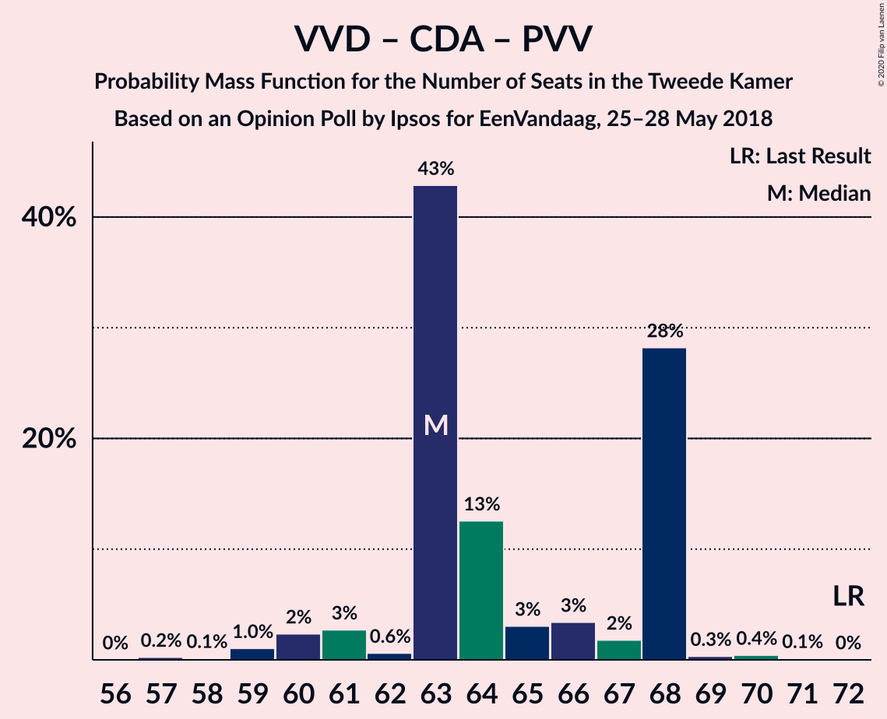

| Number of Seats | Probability | Accumulated | Special Marks |
|:---------------:|:-----------:|:-----------:|:-------------:|
| 57 | 2% | 100% |  |
| 58 | 0.5% | 98% |  |
| 59 | 0.6% | 97% |  |
| 60 | 2% | 97% |  |
| 61 | 8% | 95% |  |
| 62 | 0.9% | 86% |  |
| 63 | 82% | 85% | Median |
| 64 | 2% | 4% |  |
| 65 | 0.7% | 2% |  |
| 66 | 0.2% | 1.3% |  |
| 67 | 0.2% | 1.1% |  |
| 68 | 0.2% | 0.9% |  |
| 69 | 0% | 0.7% |  |
| 70 | 0.2% | 0.7% |  |
| 71 | 0.4% | 0.5% |  |
| 72 | 0% | 0.1% | Last Result |
| 73 | 0% | 0% |  |

### Volkspartij voor Vrijheid en Democratie – Christen-Democratisch Appèl – Forum voor Democratie – Staatkundig Gereformeerde Partij

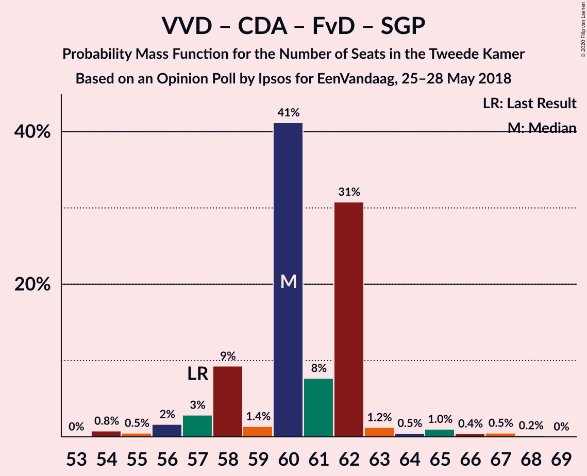

| Number of Seats | Probability | Accumulated | Special Marks |
|:---------------:|:-----------:|:-----------:|:-------------:|
| 52 | 0.2% | 100% |  |
| 53 | 0% | 99.8% |  |
| 54 | 3% | 99.8% |  |
| 55 | 4% | 97% |  |
| 56 | 0% | 93% |  |
| 57 | 1.1% | 93% | Last Result |
| 58 | 83% | 92% | Median |
| 59 | 0.2% | 9% |  |
| 60 | 1.0% | 9% |  |
| 61 | 5% | 8% |  |
| 62 | 2% | 3% |  |
| 63 | 0.7% | 2% |  |
| 64 | 0.8% | 1.1% |  |
| 65 | 0.1% | 0.3% |  |
| 66 | 0% | 0.2% |  |
| 67 | 0% | 0.2% |  |
| 68 | 0% | 0.2% |  |
| 69 | 0.2% | 0.2% |  |
| 70 | 0% | 0% |  |

### Volkspartij voor Vrijheid en Democratie – Christen-Democratisch Appèl – Forum voor Democratie

| Number of Seats | Probability | Accumulated | Special Marks |
|:---------------:|:-----------:|:-----------:|:-------------:|
| 49 | 0.2% | 100% |  |
| 50 | 0% | 99.8% |  |
| 51 | 0.7% | 99.8% |  |
| 52 | 3% | 99.1% |  |
| 53 | 3% | 96% |  |
| 54 | 1.1% | 93% | Last Result |
| 55 | 0.2% | 92% |  |
| 56 | 83% | 92% | Median |
| 57 | 5% | 9% |  |
| 58 | 0.9% | 4% |  |
| 59 | 1.4% | 3% |  |
| 60 | 0.6% | 2% |  |
| 61 | 0.9% | 1.3% |  |
| 62 | 0% | 0.3% |  |
| 63 | 0.1% | 0.3% |  |
| 64 | 0% | 0.2% |  |
| 65 | 0% | 0.2% |  |
| 66 | 0.2% | 0.2% |  |
| 67 | 0% | 0% |  |

### Volkspartij voor Vrijheid en Democratie – Democraten 66 – Partij van de Arbeid

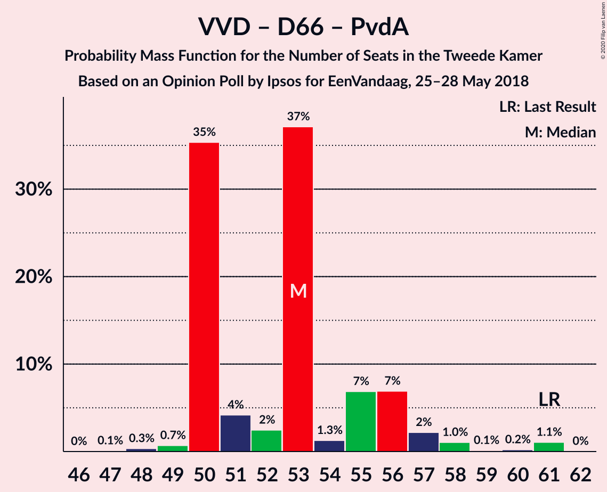

| Number of Seats | Probability | Accumulated | Special Marks |
|:---------------:|:-----------:|:-----------:|:-------------:|
| 47 | 0% | 100% |  |
| 48 | 0% | 99.9% |  |
| 49 | 0.7% | 99.9% |  |
| 50 | 0.7% | 99.2% |  |
| 51 | 6% | 98.5% |  |
| 52 | 0.3% | 92% |  |
| 53 | 0.3% | 92% |  |
| 54 | 0.4% | 92% |  |
| 55 | 84% | 92% | Median |
| 56 | 0.3% | 7% |  |
| 57 | 1.2% | 7% |  |
| 58 | 5% | 6% |  |
| 59 | 0.1% | 0.6% |  |
| 60 | 0.4% | 0.5% |  |
| 61 | 0.1% | 0.1% | Last Result |
| 62 | 0% | 0% |  |

### Volkspartij voor Vrijheid en Democratie – Christen-Democratisch Appèl – Partij van de Arbeid

| Number of Seats | Probability | Accumulated | Special Marks |
|:---------------:|:-----------:|:-----------:|:-------------:|
| 48 | 0.2% | 100% |  |
| 49 | 0.1% | 99.8% |  |
| 50 | 0% | 99.7% |  |
| 51 | 6% | 99.7% |  |
| 52 | 1.1% | 94% |  |
| 53 | 2% | 93% |  |
| 54 | 0.5% | 91% |  |
| 55 | 0.5% | 91% |  |
| 56 | 82% | 90% | Median |
| 57 | 6% | 8% |  |
| 58 | 0.6% | 2% |  |
| 59 | 0.5% | 2% |  |
| 60 | 0.2% | 1.3% |  |
| 61 | 0.8% | 1.0% | Last Result |
| 62 | 0% | 0.3% |  |
| 63 | 0% | 0.3% |  |
| 64 | 0% | 0.3% |  |
| 65 | 0.2% | 0.2% |  |
| 66 | 0% | 0% |  |

### Volkspartij voor Vrijheid en Democratie – Christen-Democratisch Appèl

| Number of Seats | Probability | Accumulated | Special Marks |
|:---------------:|:-----------:|:-----------:|:-------------:|
| 40 | 0.2% | 100% |  |
| 41 | 0% | 99.8% |  |
| 42 | 3% | 99.8% |  |
| 43 | 4% | 97% |  |
| 44 | 0.1% | 93% |  |
| 45 | 0.4% | 93% |  |
| 46 | 83% | 92% | Median |
| 47 | 0.9% | 9% |  |
| 48 | 4% | 8% |  |
| 49 | 2% | 4% |  |
| 50 | 1.3% | 2% |  |
| 51 | 0% | 0.8% |  |
| 52 | 0% | 0.8% | Last Result |
| 53 | 0.4% | 0.7% |  |
| 54 | 0% | 0.3% |  |
| 55 | 0% | 0.3% |  |
| 56 | 0.2% | 0.3% |  |
| 57 | 0% | 0% |  |

### Christen-Democratisch Appèl – Democraten 66 – Partij van de Arbeid

| Number of Seats | Probability | Accumulated | Special Marks |
|:---------------:|:-----------:|:-----------:|:-------------:|
| 34 | 0% | 100% |  |
| 35 | 0.3% | 99.9% |  |
| 36 | 0.4% | 99.6% |  |
| 37 | 82% | 99.3% | Median |
| 38 | 2% | 18% |  |
| 39 | 4% | 15% |  |
| 40 | 4% | 11% |  |
| 41 | 2% | 7% |  |
| 42 | 0.6% | 6% |  |
| 43 | 0.8% | 5% |  |
| 44 | 4% | 4% |  |
| 45 | 0% | 0.1% |  |
| 46 | 0% | 0% |  |
| 47 | 0% | 0% | Last Result |

### Volkspartij voor Vrijheid en Democratie – Partij van de Arbeid

| Number of Seats | Probability | Accumulated | Special Marks |
|:---------------:|:-----------:|:-----------:|:-------------:|
| 34 | 0% | 100% |  |
| 35 | 4% | 99.9% |  |
| 36 | 3% | 96% |  |
| 37 | 1.3% | 94% |  |
| 38 | 0.8% | 92% |  |
| 39 | 1.4% | 91% |  |
| 40 | 5% | 90% |  |
| 41 | 0.3% | 85% |  |
| 42 | 84% | 84% | Last Result, Median |
| 43 | 0.1% | 0.7% |  |
| 44 | 0.3% | 0.6% |  |
| 45 | 0% | 0.3% |  |
| 46 | 0% | 0.3% |  |
| 47 | 0.2% | 0.2% |  |
| 48 | 0% | 0% |  |

### Christen-Democratisch Appèl – Democraten 66

| Number of Seats | Probability | Accumulated | Special Marks |
|:---------------:|:-----------:|:-----------:|:-------------:|
| 26 | 0.1% | 100% |  |
| 27 | 82% | 99.9% | Median |
| 28 | 2% | 18% |  |
| 29 | 0.4% | 16% |  |
| 30 | 3% | 16% |  |
| 31 | 2% | 13% |  |
| 32 | 5% | 11% |  |
| 33 | 0.2% | 6% |  |
| 34 | 1.3% | 6% |  |
| 35 | 4% | 4% |  |
| 36 | 0% | 0.2% |  |
| 37 | 0.1% | 0.1% |  |
| 38 | 0% | 0% | Last Result |

### Christen-Democratisch Appèl – Partij van de Arbeid – ChristenUnie

| Number of Seats | Probability | Accumulated | Special Marks |
|:---------------:|:-----------:|:-----------:|:-------------:|
| 26 | 0.1% | 100% |  |
| 27 | 2% | 99.9% |  |
| 28 | 0.6% | 98% |  |
| 29 | 0.6% | 98% |  |
| 30 | 85% | 97% | Median |
| 31 | 9% | 12% |  |
| 32 | 0.1% | 4% |  |
| 33 | 2% | 4% | Last Result |
| 34 | 0.9% | 2% |  |
| 35 | 0.1% | 0.9% |  |
| 36 | 0% | 0.8% |  |
| 37 | 0.7% | 0.7% |  |
| 38 | 0% | 0.1% |  |
| 39 | 0.1% | 0.1% |  |
| 40 | 0% | 0% |  |

### Christen-Democratisch Appèl – Partij van de Arbeid

| Number of Seats | Probability | Accumulated | Special Marks |
|:---------------:|:-----------:|:-----------:|:-------------:|
| 20 | 0.3% | 100% |  |
| 21 | 0.2% | 99.6% |  |
| 22 | 1.1% | 99.5% |  |
| 23 | 2% | 98% |  |
| 24 | 87% | 96% | Median |
| 25 | 2% | 9% |  |
| 26 | 5% | 7% |  |
| 27 | 0.6% | 1.4% |  |
| 28 | 0% | 0.8% | Last Result |
| 29 | 0% | 0.7% |  |
| 30 | 0.7% | 0.7% |  |
| 31 | 0% | 0% |  |

## Technical Information

### Opinion Poll

+ **Polling firm:** Ipsos
+ **Commissioner(s):** EenVandaag
+ **Fieldwork period:** 25–28 May 2018

### Calculations

+ **Sample size:** 1045
+ **Simulations done:** 131,072
+ **Error estimate:** 2.73%

