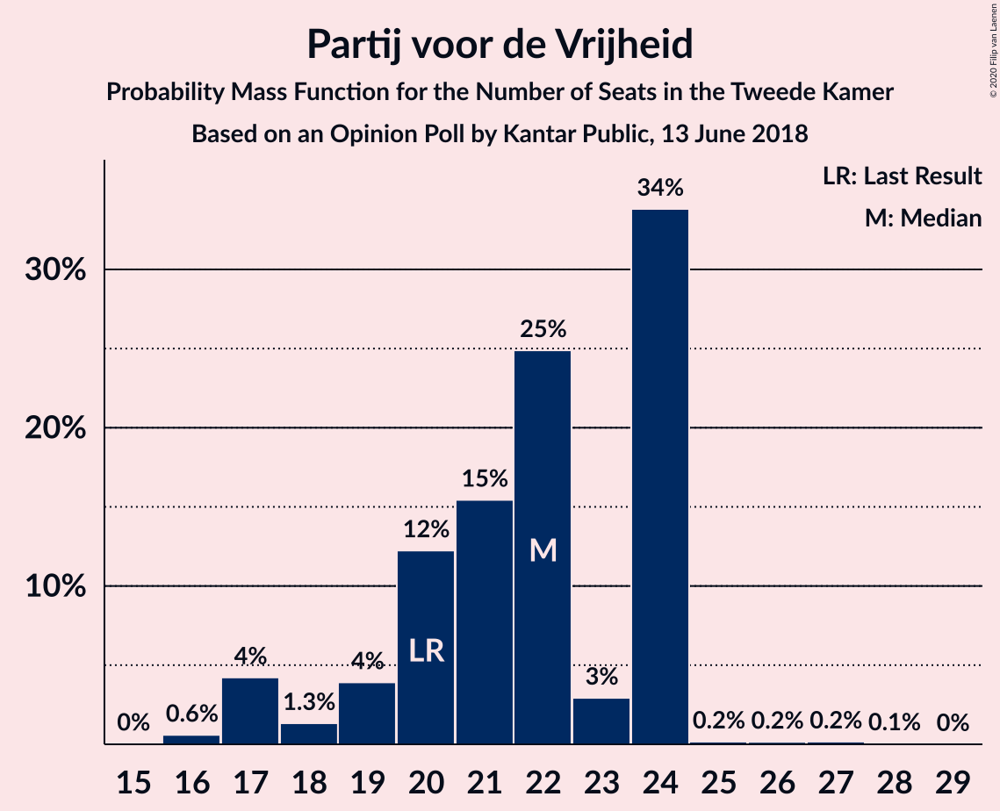
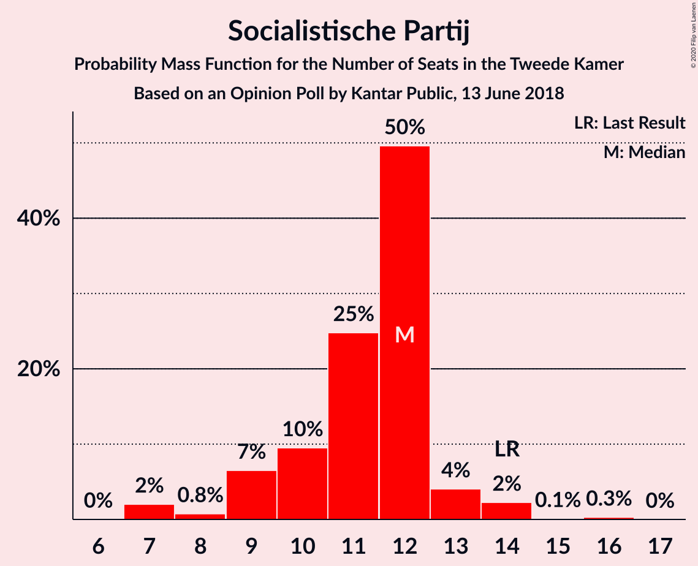
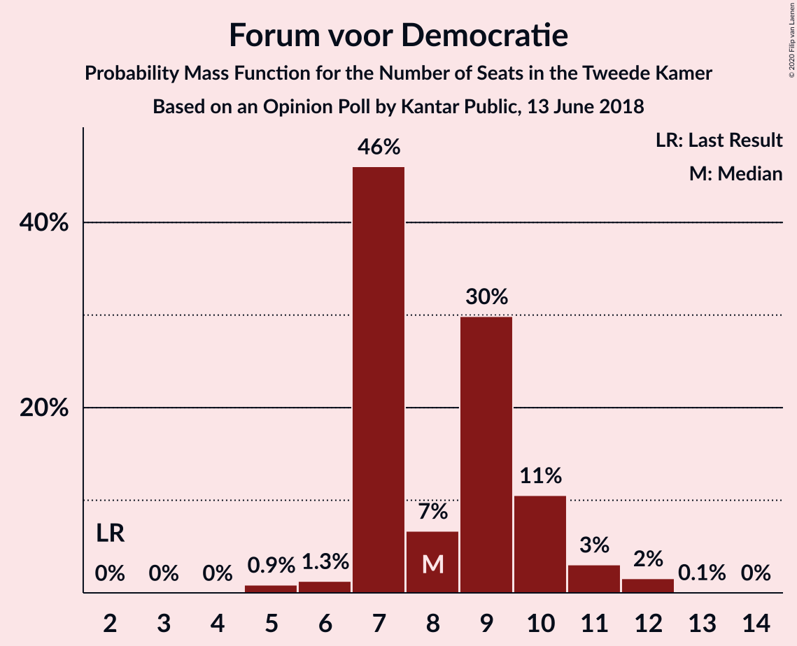
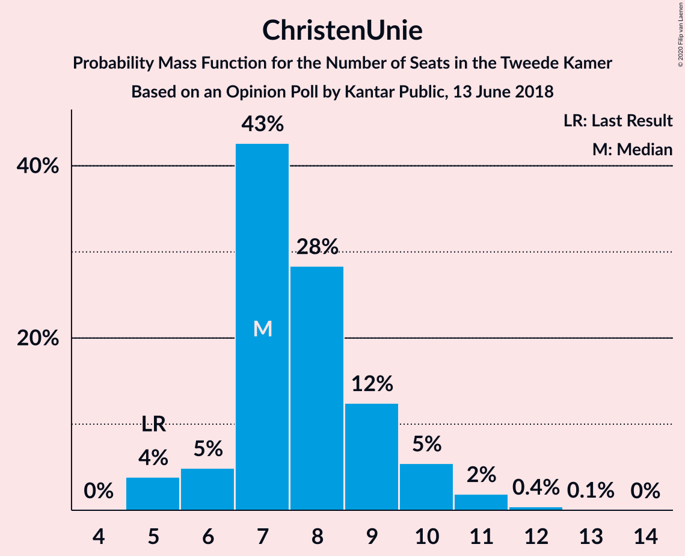
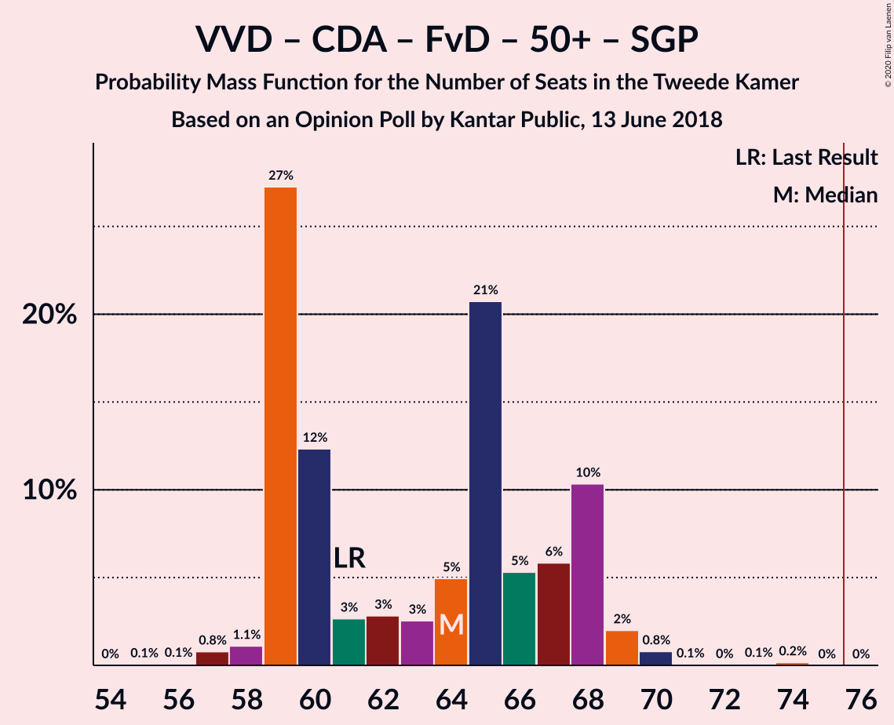
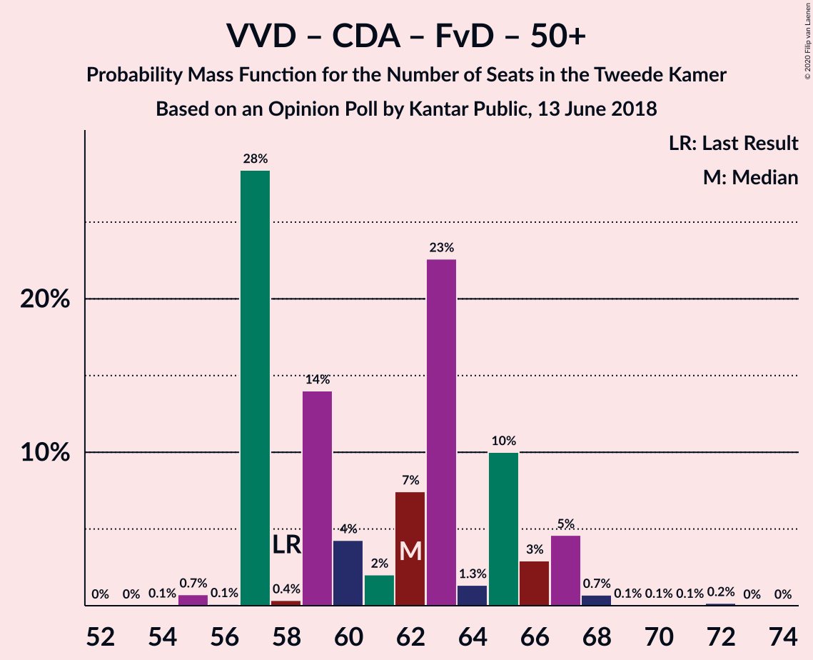
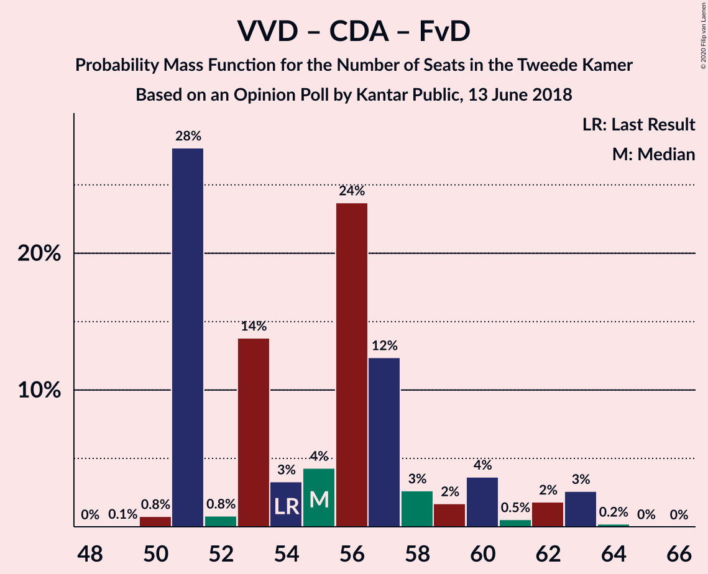
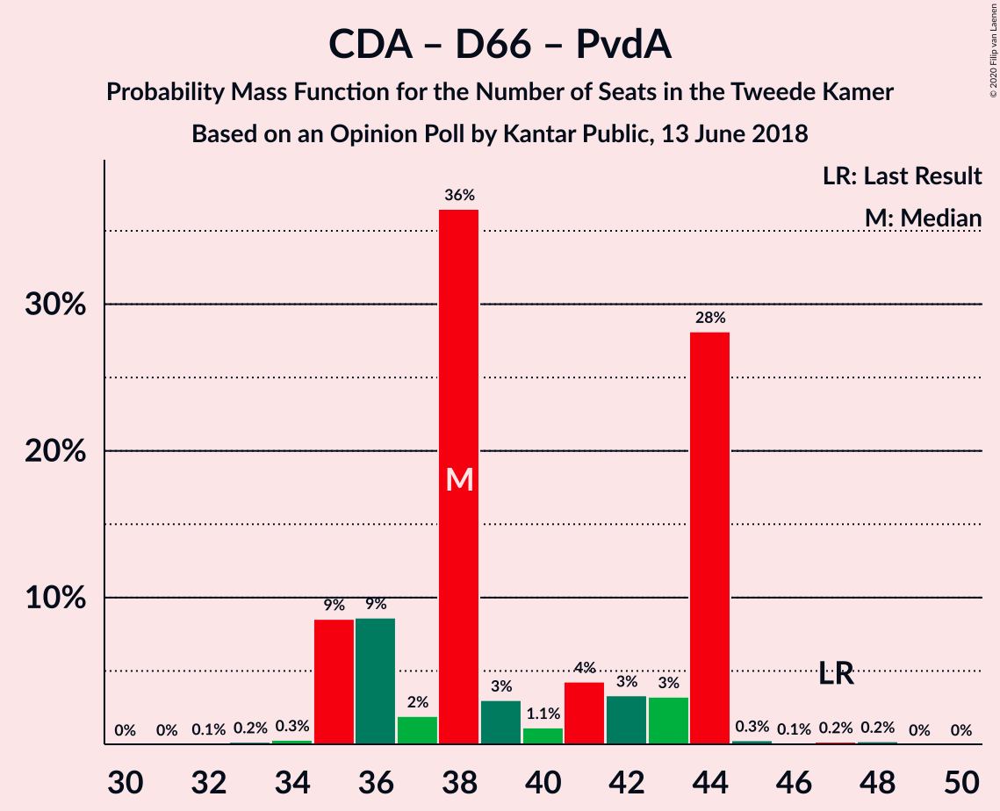

# Opinion Poll by Kantar Public, 13 June 2018

<a href="#voting-intentions">Voting Intentions</a> | <a href="#seats">Seats</a> | <a href="#coalitions">Coalitions</a> | <a href="#technical-information">Technical Information</a>

## Voting Intentions

### Confidence Intervals

| Party | Last Result | Poll Result | 80% Confidence Interval | 90% Confidence Interval | 95% Confidence Interval | 99% Confidence Interval |
|:-----:|:-----------:|:-----------:|:-----------------------:|:-----------------------:|:-----------------------:|:-----------------------:|
| Volkspartij voor Vrijheid en Democratie | 21.3% | 21.3% | 19.7–23.1% |19.2–23.6% |18.8–24.0% |18.1–24.9% |
| Partij voor de Vrijheid | 13.1% | 14.0% | 12.6–15.5% |12.2–15.9% |11.9–16.3% |11.3–17.1% |
| Christen-Democratisch Appèl | 12.4% | 10.0% | 8.8–11.3% |8.5–11.7% |8.2–12.0% |7.7–12.7% |
| GroenLinks | 9.1% | 10.0% | 8.8–11.3% |8.5–11.7% |8.2–12.0% |7.7–12.7% |
| Democraten 66 | 12.2% | 9.3% | 8.2–10.7% |7.9–11.0% |7.7–11.4% |7.1–12.0% |
| Socialistische Partij | 9.1% | 7.3% | 6.4–8.6% |6.1–8.9% |5.9–9.2% |5.4–9.8% |
| Partij van de Arbeid | 5.7% | 6.7% | 5.8–7.9% |5.5–8.2% |5.3–8.5% |4.9–9.1% |
| Forum voor Democratie | 1.8% | 6.0% | 5.1–7.1% |4.8–7.4% |4.6–7.7% |4.3–8.2% |
| ChristenUnie | 3.4% | 5.4% | 4.5–6.4% |4.3–6.7% |4.1–7.0% |3.7–7.5% |
| 50Plus | 3.1% | 4.0% | 3.3–4.9% |3.1–5.2% |2.9–5.4% |2.6–5.9% |
| Partij voor de Dieren | 3.2% | 3.4% | 2.7–4.2% |2.5–4.5% |2.4–4.7% |2.1–5.2% |
| Staatkundig Gereformeerde Partij | 2.1% | 1.4% | 1.0–2.0% |0.9–2.2% |0.8–2.3% |0.7–2.7% |
| DENK | 2.1% | 1.4% | 1.0–2.0% |0.9–2.2% |0.8–2.3% |0.7–2.7% |

*Note:* The poll result column reflects the actual value used in the calculations. Published results may vary slightly, and in addition be rounded to fewer digits.

## Seats

### Confidence Intervals

| Party | Last Result | Median | 80% Confidence Interval | 90% Confidence Interval | 95% Confidence Interval | 99% Confidence Interval |
|:-----:|:-----------:|:------:|:-----------------------:|:-----------------------:|:-----------------------:|:-----------------------:|
| <a href="#volkspartij-voor-vrijheid-en-democratie">Volkspartij voor Vrijheid en Democratie</a> | 33 | 34 | 29–36 |29–36 |29–36 |29–38 |
| <a href="#partij-voor-de-vrijheid">Partij voor de Vrijheid</a> | 20 | 21 | 19–24 |19–24 |19–24 |17–24 |
| <a href="#christen-democratisch-appèl">Christen-Democratisch Appèl</a> | 19 | 14 | 13–17 |13–17 |13–17 |12–20 |
| <a href="#groenlinks">GroenLinks</a> | 14 | 15 | 14–16 |14–17 |14–18 |12–19 |
| <a href="#democraten-66">Democraten 66</a> | 19 | 13 | 12–16 |12–16 |12–16 |11–17 |
| <a href="#socialistische-partij">Socialistische Partij</a> | 14 | 12 | 9–13 |9–14 |9–14 |7–16 |
| <a href="#partij-van-de-arbeid">Partij van de Arbeid</a> | 9 | 9 | 7–11 |7–12 |7–13 |7–13 |
| <a href="#forum-voor-democratie">Forum voor Democratie</a> | 2 | 9 | 8–10 |8–11 |7–11 |7–12 |
| <a href="#christenunie">ChristenUnie</a> | 5 | 8 | 7–10 |6–10 |6–10 |5–10 |
| <a href="#50plus">50Plus</a> | 4 | 6 | 5–8 |4–8 |4–9 |4–9 |
| <a href="#partij-voor-de-dieren">Partij voor de Dieren</a> | 5 | 5 | 3–5 |3–6 |3–7 |3–7 |
| <a href="#staatkundig-gereformeerde-partij">Staatkundig Gereformeerde Partij</a> | 3 | 3 | 1–3 |1–3 |1–4 |1–4 |
| <a href="#denk">DENK</a> | 3 | 1 | 1–3 |1–4 |0–4 |0–4 |

### Volkspartij voor Vrijheid en Democratie

*For a full overview of the results for this party, see the [Volkspartij voor Vrijheid en Democratie](party-volkspartijvoorvrijheidendemocratie.html) page.*

| Number of Seats | Probability | Accumulated | Special Marks |
|:---------------:|:-----------:|:-----------:|:-------------:|
| 26 | 0.3% | 100% |  |
| 27 | 0.1% | 99.7% |  |
| 28 | 0.1% | 99.6% |  |
| 29 | 11% | 99.6% |  |
| 30 | 0.6% | 89% |  |
| 31 | 11% | 88% |  |
| 32 | 5% | 77% |  |
| 33 | 9% | 72% | Last Result |
| 34 | 36% | 63% | Median |
| 35 | 6% | 28% |  |
| 36 | 20% | 21% |  |
| 37 | 1.1% | 2% |  |
| 38 | 0.1% | 0.5% |  |
| 39 | 0.5% | 0.5% |  |
| 40 | 0% | 0% |  |

### Partij voor de Vrijheid

*For a full overview of the results for this party, see the [Partij voor de Vrijheid](party-partijvoordevrijheid.html) page.*

| Number of Seats | Probability | Accumulated | Special Marks |
|:---------------:|:-----------:|:-----------:|:-------------:|
| 16 | 0.1% | 100% |  |
| 17 | 1.0% | 99.9% |  |
| 18 | 0.4% | 98.9% |  |
| 19 | 12% | 98.5% |  |
| 20 | 3% | 87% | Last Result |
| 21 | 58% | 84% | Median |
| 22 | 14% | 27% |  |
| 23 | 2% | 12% |  |
| 24 | 10% | 10% |  |
| 25 | 0.2% | 0.3% |  |
| 26 | 0.1% | 0.1% |  |
| 27 | 0% | 0% |  |

### Christen-Democratisch Appèl

*For a full overview of the results for this party, see the [Christen-Democratisch Appèl](party-christen-democratischappèl.html) page.*

| Number of Seats | Probability | Accumulated | Special Marks |
|:---------------:|:-----------:|:-----------:|:-------------:|
| 11 | 0.3% | 100% |  |
| 12 | 1.1% | 99.7% |  |
| 13 | 13% | 98.6% |  |
| 14 | 40% | 85% | Median |
| 15 | 22% | 45% |  |
| 16 | 13% | 23% |  |
| 17 | 8% | 10% |  |
| 18 | 1.1% | 2% |  |
| 19 | 0.1% | 1.1% | Last Result |
| 20 | 1.0% | 1.0% |  |
| 21 | 0% | 0% |  |

### GroenLinks

*For a full overview of the results for this party, see the [GroenLinks](party-groenlinks.html) page.*

| Number of Seats | Probability | Accumulated | Special Marks |
|:---------------:|:-----------:|:-----------:|:-------------:|
| 10 | 0.1% | 100% |  |
| 11 | 0.1% | 99.9% |  |
| 12 | 0.8% | 99.7% |  |
| 13 | 0.9% | 99.0% |  |
| 14 | 26% | 98% | Last Result |
| 15 | 56% | 72% | Median |
| 16 | 6% | 15% |  |
| 17 | 7% | 10% |  |
| 18 | 1.0% | 3% |  |
| 19 | 2% | 2% |  |
| 20 | 0% | 0% |  |

### Democraten 66

*For a full overview of the results for this party, see the [Democraten 66](party-democraten66.html) page.*

| Number of Seats | Probability | Accumulated | Special Marks |
|:---------------:|:-----------:|:-----------:|:-------------:|
| 10 | 0.2% | 100% |  |
| 11 | 2% | 99.8% |  |
| 12 | 41% | 98% |  |
| 13 | 20% | 57% | Median |
| 14 | 5% | 37% |  |
| 15 | 15% | 32% |  |
| 16 | 16% | 17% |  |
| 17 | 0.4% | 0.8% |  |
| 18 | 0.3% | 0.5% |  |
| 19 | 0.1% | 0.1% | Last Result |
| 20 | 0.1% | 0.1% |  |
| 21 | 0% | 0% |  |

### Socialistische Partij

*For a full overview of the results for this party, see the [Socialistische Partij](party-socialistischepartij.html) page.*

| Number of Seats | Probability | Accumulated | Special Marks |
|:---------------:|:-----------:|:-----------:|:-------------:|
| 6 | 0.1% | 100% |  |
| 7 | 1.0% | 99.9% |  |
| 8 | 1.1% | 98.9% |  |
| 9 | 17% | 98% |  |
| 10 | 20% | 81% |  |
| 11 | 7% | 61% |  |
| 12 | 43% | 53% | Median |
| 13 | 3% | 10% |  |
| 14 | 6% | 7% | Last Result |
| 15 | 0.2% | 1.2% |  |
| 16 | 1.0% | 1.1% |  |
| 17 | 0% | 0% |  |

### Partij van de Arbeid

*For a full overview of the results for this party, see the [Partij van de Arbeid](party-partijvandearbeid.html) page.*

| Number of Seats | Probability | Accumulated | Special Marks |
|:---------------:|:-----------:|:-----------:|:-------------:|
| 7 | 16% | 100% |  |
| 8 | 12% | 84% |  |
| 9 | 48% | 73% | Last Result, Median |
| 10 | 10% | 24% |  |
| 11 | 5% | 14% |  |
| 12 | 5% | 9% |  |
| 13 | 3% | 4% |  |
| 14 | 0.2% | 0.2% |  |
| 15 | 0% | 0% |  |

### Forum voor Democratie

*For a full overview of the results for this party, see the [Forum voor Democratie](party-forumvoordemocratie.html) page.*

| Number of Seats | Probability | Accumulated | Special Marks |
|:---------------:|:-----------:|:-----------:|:-------------:|
| 2 | 0% | 100% | Last Result |
| 3 | 0% | 100% |  |
| 4 | 0% | 100% |  |
| 5 | 0.1% | 100% |  |
| 6 | 0.3% | 99.9% |  |
| 7 | 2% | 99.6% |  |
| 8 | 23% | 97% |  |
| 9 | 63% | 74% | Median |
| 10 | 2% | 11% |  |
| 11 | 8% | 9% |  |
| 12 | 0.9% | 0.9% |  |
| 13 | 0% | 0% |  |

### ChristenUnie

*For a full overview of the results for this party, see the [ChristenUnie](party-christenunie.html) page.*

| Number of Seats | Probability | Accumulated | Special Marks |
|:---------------:|:-----------:|:-----------:|:-------------:|
| 5 | 0.7% | 100% | Last Result |
| 6 | 7% | 99.3% |  |
| 7 | 42% | 93% |  |
| 8 | 21% | 51% | Median |
| 9 | 6% | 30% |  |
| 10 | 24% | 24% |  |
| 11 | 0% | 0.2% |  |
| 12 | 0.2% | 0.2% |  |
| 13 | 0% | 0% |  |

### 50Plus

*For a full overview of the results for this party, see the [50Plus](party-50plus.html) page.*

| Number of Seats | Probability | Accumulated | Special Marks |
|:---------------:|:-----------:|:-----------:|:-------------:|
| 3 | 0.1% | 100% |  |
| 4 | 9% | 99.9% | Last Result |
| 5 | 7% | 91% |  |
| 6 | 42% | 84% | Median |
| 7 | 2% | 42% |  |
| 8 | 36% | 40% |  |
| 9 | 4% | 4% |  |
| 10 | 0.1% | 0.1% |  |
| 11 | 0% | 0% |  |

### Partij voor de Dieren

*For a full overview of the results for this party, see the [Partij voor de Dieren](party-partijvoordedieren.html) page.*

| Number of Seats | Probability | Accumulated | Special Marks |
|:---------------:|:-----------:|:-----------:|:-------------:|
| 3 | 27% | 100% |  |
| 4 | 10% | 73% |  |
| 5 | 54% | 63% | Last Result, Median |
| 6 | 5% | 9% |  |
| 7 | 4% | 4% |  |
| 8 | 0.2% | 0.3% |  |
| 9 | 0.1% | 0.1% |  |
| 10 | 0% | 0% |  |

### Staatkundig Gereformeerde Partij

*For a full overview of the results for this party, see the [Staatkundig Gereformeerde Partij](party-staatkundiggereformeerdepartij.html) page.*

| Number of Seats | Probability | Accumulated | Special Marks |
|:---------------:|:-----------:|:-----------:|:-------------:|
| 0 | 0.3% | 100% |  |
| 1 | 25% | 99.7% |  |
| 2 | 14% | 74% |  |
| 3 | 56% | 60% | Last Result, Median |
| 4 | 4% | 4% |  |
| 5 | 0.1% | 0.1% |  |
| 6 | 0% | 0% |  |

### DENK

*For a full overview of the results for this party, see the [DENK](party-denk.html) page.*

| Number of Seats | Probability | Accumulated | Special Marks |
|:---------------:|:-----------:|:-----------:|:-------------:|
| 0 | 4% | 100% |  |
| 1 | 48% | 96% | Median |
| 2 | 25% | 49% |  |
| 3 | 15% | 24% | Last Result |
| 4 | 8% | 8% |  |
| 5 | 0% | 0% |  |

## Coalitions

### Confidence Intervals

| Coalition | Last Result | Median | Majority? | 80% Confidence Interval | 90% Confidence Interval | 95% Confidence Interval | 99% Confidence Interval |
|:---------:|:-----------:|:------:|:---------:|:-----------------------:|:-----------------------:|:-----------------------:|:-----------------------:|
| Volkspartij voor Vrijheid en Democratie – Christen-Democratisch Appèl – GroenLinks – Democraten 66 – ChristenUnie | 90 | 83 | 100% | 82–91 | 81–91 | 81–91 | 79–92 |
| Volkspartij voor Vrijheid en Democratie – Christen-Democratisch Appèl – Democraten 66 – Partij van de Arbeid – ChristenUnie | 85 | 76 | 91% | 76–84 | 75–84 | 75–85 | 73–86 |
| Volkspartij voor Vrijheid en Democratie – Partij voor de Vrijheid – Christen-Democratisch Appèl – Forum voor Democratie – Staatkundig Gereformeerde Partij | 77 | 81 | 99.0% | 77–82 | 77–83 | 76–84 | 74–85 |
| Volkspartij voor Vrijheid en Democratie – Partij voor de Vrijheid – Christen-Democratisch Appèl – Forum voor Democratie | 74 | 78 | 96% | 76–81 | 76–81 | 73–81 | 73–84 |
| Volkspartij voor Vrijheid en Democratie – Christen-Democratisch Appèl – Democraten 66 – ChristenUnie | 76 | 67 | 13% | 67–77 | 67–77 | 67–77 | 64–77 |
| Christen-Democratisch Appèl – GroenLinks – Democraten 66 – Socialistische Partij – Partij van de Arbeid – ChristenUnie | 80 | 71 | 1.2% | 69–74 | 69–75 | 69–75 | 67–77 |
| Volkspartij voor Vrijheid en Democratie – Partij voor de Vrijheid – Christen-Democratisch Appèl | 72 | 69 | 0.1% | 68–72 | 66–72 | 64–73 | 64–75 |
| Volkspartij voor Vrijheid en Democratie – Christen-Democratisch Appèl – Forum voor Democratie – 50Plus – Staatkundig Gereformeerde Partij | 61 | 67 | 0% | 62–68 | 61–68 | 61–70 | 61–70 |
| Volkspartij voor Vrijheid en Democratie – Christen-Democratisch Appèl – Forum voor Democratie – 50Plus | 58 | 65 | 0% | 59–66 | 59–66 | 59–67 | 59–68 |
| Volkspartij voor Vrijheid en Democratie – Christen-Democratisch Appèl – Democraten 66 | 71 | 60 | 0% | 59–67 | 59–67 | 59–67 | 56–67 |
| Christen-Democratisch Appèl – GroenLinks – Democraten 66 – Partij van de Arbeid – ChristenUnie | 66 | 60 | 0% | 57–65 | 57–65 | 57–65 | 56–68 |
| Volkspartij voor Vrijheid en Democratie – Christen-Democratisch Appèl – Forum voor Democratie – Staatkundig Gereformeerde Partij | 57 | 60 | 0% | 56–61 | 55–63 | 55–65 | 54–65 |
| Volkspartij voor Vrijheid en Democratie – Christen-Democratisch Appèl – Partij van de Arbeid | 61 | 57 | 0% | 55–60 | 54–62 | 54–64 | 53–64 |
| Volkspartij voor Vrijheid en Democratie – Christen-Democratisch Appèl – Forum voor Democratie | 54 | 57 | 0% | 53–60 | 53–60 | 53–62 | 53–62 |
| Volkspartij voor Vrijheid en Democratie – Democraten 66 – Partij van de Arbeid | 61 | 55 | 0% | 52–61 | 52–61 | 52–61 | 50–62 |
| Volkspartij voor Vrijheid en Democratie – Christen-Democratisch Appèl | 52 | 48 | 0% | 45–51 | 45–53 | 45–53 | 43–53 |
| Volkspartij voor Vrijheid en Democratie – Partij van de Arbeid | 42 | 43 | 0% | 39–45 | 39–47 | 39–48 | 39–48 |
| Christen-Democratisch Appèl – Democraten 66 – Partij van de Arbeid | 47 | 36 | 0% | 35–41 | 35–42 | 35–42 | 34–46 |
| Christen-Democratisch Appèl – Partij van de Arbeid – ChristenUnie | 33 | 31 | 0% | 30–36 | 30–36 | 30–36 | 28–39 |
| Christen-Democratisch Appèl – Democraten 66 | 38 | 28 | 0% | 26–31 | 26–31 | 26–31 | 25–34 |
| Christen-Democratisch Appèl – Partij van de Arbeid | 28 | 23 | 0% | 22–26 | 21–28 | 21–28 | 20–31 |

### Volkspartij voor Vrijheid en Democratie – Christen-Democratisch Appèl – GroenLinks – Democraten 66 – ChristenUnie

| Number of Seats | Probability | Accumulated | Special Marks |
|:---------------:|:-----------:|:-----------:|:-------------:|
| 77 | 0.3% | 100% |  |
| 78 | 0.1% | 99.7% |  |
| 79 | 0.3% | 99.6% |  |
| 80 | 2% | 99.3% |  |
| 81 | 3% | 98% |  |
| 82 | 43% | 95% |  |
| 83 | 5% | 52% |  |
| 84 | 16% | 47% | Median |
| 85 | 5% | 31% |  |
| 86 | 0.1% | 26% |  |
| 87 | 5% | 26% |  |
| 88 | 0.8% | 21% |  |
| 89 | 5% | 20% |  |
| 90 | 1.0% | 15% | Last Result |
| 91 | 13% | 14% |  |
| 92 | 0.9% | 0.9% |  |
| 93 | 0% | 0% |  |

### Volkspartij voor Vrijheid en Democratie – Christen-Democratisch Appèl – Democraten 66 – Partij van de Arbeid – ChristenUnie

| Number of Seats | Probability | Accumulated | Special Marks |
|:---------------:|:-----------:|:-----------:|:-------------:|
| 71 | 0.3% | 100% |  |
| 72 | 0.1% | 99.7% |  |
| 73 | 0.4% | 99.6% |  |
| 74 | 1.0% | 99.2% |  |
| 75 | 8% | 98% |  |
| 76 | 42% | 91% | Majority |
| 77 | 4% | 49% |  |
| 78 | 0.1% | 45% | Median |
| 79 | 3% | 45% |  |
| 80 | 17% | 42% |  |
| 81 | 5% | 25% |  |
| 82 | 1.4% | 20% |  |
| 83 | 0.3% | 18% |  |
| 84 | 13% | 18% |  |
| 85 | 4% | 5% | Last Result |
| 86 | 1.0% | 1.1% |  |
| 87 | 0% | 0% |  |

### Volkspartij voor Vrijheid en Democratie – Partij voor de Vrijheid – Christen-Democratisch Appèl – Forum voor Democratie – Staatkundig Gereformeerde Partij

| Number of Seats | Probability | Accumulated | Special Marks |
|:---------------:|:-----------:|:-----------:|:-------------:|
| 73 | 0.1% | 100% |  |
| 74 | 0.7% | 99.9% |  |
| 75 | 0.2% | 99.2% |  |
| 76 | 3% | 99.0% | Majority |
| 77 | 9% | 96% | Last Result |
| 78 | 1.1% | 87% |  |
| 79 | 4% | 86% |  |
| 80 | 11% | 82% |  |
| 81 | 48% | 71% | Median |
| 82 | 18% | 23% |  |
| 83 | 1.3% | 5% |  |
| 84 | 3% | 4% |  |
| 85 | 0.5% | 0.6% |  |
| 86 | 0% | 0.1% |  |
| 87 | 0% | 0% |  |

### Volkspartij voor Vrijheid en Democratie – Partij voor de Vrijheid – Christen-Democratisch Appèl – Forum voor Democratie

| Number of Seats | Probability | Accumulated | Special Marks |
|:---------------:|:-----------:|:-----------:|:-------------:|
| 71 | 0.1% | 100% |  |
| 72 | 0.2% | 99.9% |  |
| 73 | 3% | 99.7% |  |
| 74 | 0.5% | 96% | Last Result |
| 75 | 0.2% | 96% |  |
| 76 | 10% | 96% | Majority |
| 77 | 13% | 86% |  |
| 78 | 44% | 73% | Median |
| 79 | 9% | 28% |  |
| 80 | 0.2% | 19% |  |
| 81 | 18% | 19% |  |
| 82 | 1.0% | 2% |  |
| 83 | 0.2% | 0.7% |  |
| 84 | 0.5% | 0.5% |  |
| 85 | 0.1% | 0.1% |  |
| 86 | 0% | 0% |  |

### Volkspartij voor Vrijheid en Democratie – Christen-Democratisch Appèl – Democraten 66 – ChristenUnie

| Number of Seats | Probability | Accumulated | Special Marks |
|:---------------:|:-----------:|:-----------:|:-------------:|
| 61 | 0.3% | 100% |  |
| 62 | 0% | 99.7% |  |
| 63 | 0.1% | 99.6% |  |
| 64 | 0.7% | 99.6% |  |
| 65 | 0.3% | 98.9% |  |
| 66 | 0.4% | 98.5% |  |
| 67 | 52% | 98% |  |
| 68 | 4% | 46% |  |
| 69 | 4% | 42% | Median |
| 70 | 12% | 37% |  |
| 71 | 0.3% | 25% |  |
| 72 | 5% | 24% |  |
| 73 | 0.6% | 19% |  |
| 74 | 4% | 19% |  |
| 75 | 1.0% | 14% |  |
| 76 | 0% | 13% | Last Result, Majority |
| 77 | 13% | 13% |  |
| 78 | 0% | 0% |  |

### Christen-Democratisch Appèl – GroenLinks – Democraten 66 – Socialistische Partij – Partij van de Arbeid – ChristenUnie

| Number of Seats | Probability | Accumulated | Special Marks |
|:---------------:|:-----------:|:-----------:|:-------------:|
| 65 | 0.1% | 100% |  |
| 66 | 0.2% | 99.9% |  |
| 67 | 0.4% | 99.7% |  |
| 68 | 0.4% | 99.3% |  |
| 69 | 35% | 98.9% |  |
| 70 | 4% | 64% |  |
| 71 | 15% | 59% | Median |
| 72 | 14% | 44% |  |
| 73 | 9% | 30% |  |
| 74 | 17% | 22% |  |
| 75 | 4% | 5% |  |
| 76 | 0.2% | 1.2% | Majority |
| 77 | 0.7% | 1.0% |  |
| 78 | 0.1% | 0.4% |  |
| 79 | 0.1% | 0.2% |  |
| 80 | 0% | 0.1% | Last Result |
| 81 | 0.1% | 0.1% |  |
| 82 | 0% | 0% |  |

### Volkspartij voor Vrijheid en Democratie – Partij voor de Vrijheid – Christen-Democratisch Appèl

| Number of Seats | Probability | Accumulated | Special Marks |
|:---------------:|:-----------:|:-----------:|:-------------:|
| 63 | 0.5% | 100% |  |
| 64 | 3% | 99.5% |  |
| 65 | 0.7% | 97% |  |
| 66 | 2% | 96% |  |
| 67 | 0.8% | 94% |  |
| 68 | 16% | 93% |  |
| 69 | 56% | 77% | Median |
| 70 | 0.7% | 21% |  |
| 71 | 0.2% | 21% |  |
| 72 | 18% | 20% | Last Result |
| 73 | 1.1% | 3% |  |
| 74 | 0.6% | 2% |  |
| 75 | 0.9% | 1.0% |  |
| 76 | 0% | 0.1% | Majority |
| 77 | 0.1% | 0.1% |  |
| 78 | 0% | 0% |  |

### Volkspartij voor Vrijheid en Democratie – Christen-Democratisch Appèl – Forum voor Democratie – 50Plus – Staatkundig Gereformeerde Partij

| Number of Seats | Probability | Accumulated | Special Marks |
|:---------------:|:-----------:|:-----------:|:-------------:|
| 56 | 0% | 100% |  |
| 57 | 0.1% | 99.9% |  |
| 58 | 0% | 99.9% |  |
| 59 | 0.1% | 99.9% |  |
| 60 | 0.1% | 99.8% |  |
| 61 | 6% | 99.7% | Last Result |
| 62 | 10% | 93% |  |
| 63 | 5% | 83% |  |
| 64 | 6% | 78% |  |
| 65 | 9% | 71% |  |
| 66 | 2% | 63% | Median |
| 67 | 20% | 61% |  |
| 68 | 37% | 41% |  |
| 69 | 0.1% | 4% |  |
| 70 | 4% | 4% |  |
| 71 | 0% | 0.1% |  |
| 72 | 0.1% | 0.1% |  |
| 73 | 0% | 0% |  |

### Volkspartij voor Vrijheid en Democratie – Christen-Democratisch Appèl – Forum voor Democratie – 50Plus

| Number of Seats | Probability | Accumulated | Special Marks |
|:---------------:|:-----------:|:-----------:|:-------------:|
| 53 | 0% | 100% |  |
| 54 | 0% | 99.9% |  |
| 55 | 0.1% | 99.9% |  |
| 56 | 0% | 99.9% |  |
| 57 | 0.2% | 99.9% |  |
| 58 | 0.1% | 99.7% | Last Result |
| 59 | 10% | 99.6% |  |
| 60 | 9% | 90% |  |
| 61 | 6% | 81% |  |
| 62 | 4% | 75% |  |
| 63 | 11% | 71% | Median |
| 64 | 1.1% | 60% |  |
| 65 | 40% | 59% |  |
| 66 | 14% | 19% |  |
| 67 | 4% | 5% |  |
| 68 | 0.6% | 0.7% |  |
| 69 | 0.1% | 0.1% |  |
| 70 | 0% | 0% |  |

### Volkspartij voor Vrijheid en Democratie – Christen-Democratisch Appèl – Democraten 66

| Number of Seats | Probability | Accumulated | Special Marks |
|:---------------:|:-----------:|:-----------:|:-------------:|
| 53 | 0.1% | 100% |  |
| 54 | 0.3% | 99.9% |  |
| 55 | 0% | 99.7% |  |
| 56 | 0.2% | 99.7% |  |
| 57 | 0.9% | 99.4% |  |
| 58 | 0.1% | 98% |  |
| 59 | 14% | 98% |  |
| 60 | 50% | 85% |  |
| 61 | 3% | 35% | Median |
| 62 | 3% | 31% |  |
| 63 | 8% | 28% |  |
| 64 | 0.2% | 20% |  |
| 65 | 2% | 20% |  |
| 66 | 0.4% | 18% |  |
| 67 | 18% | 18% |  |
| 68 | 0.1% | 0.1% |  |
| 69 | 0% | 0% |  |
| 70 | 0% | 0% |  |
| 71 | 0% | 0% | Last Result |

### Christen-Democratisch Appèl – GroenLinks – Democraten 66 – Partij van de Arbeid – ChristenUnie

| Number of Seats | Probability | Accumulated | Special Marks |
|:---------------:|:-----------:|:-----------:|:-------------:|
| 55 | 0% | 100% |  |
| 56 | 0.4% | 99.9% |  |
| 57 | 36% | 99.5% |  |
| 58 | 1.2% | 64% |  |
| 59 | 7% | 63% | Median |
| 60 | 11% | 55% |  |
| 61 | 8% | 44% |  |
| 62 | 18% | 37% |  |
| 63 | 3% | 19% |  |
| 64 | 3% | 16% |  |
| 65 | 11% | 12% |  |
| 66 | 0.1% | 2% | Last Result |
| 67 | 0.3% | 1.5% |  |
| 68 | 1.0% | 1.2% |  |
| 69 | 0.1% | 0.2% |  |
| 70 | 0% | 0.1% |  |
| 71 | 0.1% | 0.1% |  |
| 72 | 0% | 0% |  |

### Volkspartij voor Vrijheid en Democratie – Christen-Democratisch Appèl – Forum voor Democratie – Staatkundig Gereformeerde Partij

| Number of Seats | Probability | Accumulated | Special Marks |
|:---------------:|:-----------:|:-----------:|:-------------:|
| 49 | 0.1% | 100% |  |
| 50 | 0% | 99.9% |  |
| 51 | 0% | 99.9% |  |
| 52 | 0% | 99.9% |  |
| 53 | 0.1% | 99.9% |  |
| 54 | 0.3% | 99.8% |  |
| 55 | 7% | 99.5% |  |
| 56 | 10% | 93% |  |
| 57 | 4% | 83% | Last Result |
| 58 | 7% | 79% |  |
| 59 | 8% | 72% |  |
| 60 | 41% | 65% | Median |
| 61 | 15% | 24% |  |
| 62 | 2% | 8% |  |
| 63 | 3% | 7% |  |
| 64 | 0% | 3% |  |
| 65 | 3% | 3% |  |
| 66 | 0% | 0% |  |

### Volkspartij voor Vrijheid en Democratie – Christen-Democratisch Appèl – Partij van de Arbeid

| Number of Seats | Probability | Accumulated | Special Marks |
|:---------------:|:-----------:|:-----------:|:-------------:|
| 50 | 0% | 100% |  |
| 51 | 0% | 99.9% |  |
| 52 | 0.3% | 99.9% |  |
| 53 | 0.6% | 99.6% |  |
| 54 | 7% | 99.0% |  |
| 55 | 17% | 92% |  |
| 56 | 6% | 75% |  |
| 57 | 39% | 69% | Median |
| 58 | 18% | 30% |  |
| 59 | 0.5% | 12% |  |
| 60 | 2% | 11% |  |
| 61 | 1.3% | 10% | Last Result |
| 62 | 4% | 8% |  |
| 63 | 0.2% | 5% |  |
| 64 | 4% | 4% |  |
| 65 | 0% | 0% |  |

### Volkspartij voor Vrijheid en Democratie – Christen-Democratisch Appèl – Forum voor Democratie

| Number of Seats | Probability | Accumulated | Special Marks |
|:---------------:|:-----------:|:-----------:|:-------------:|
| 46 | 0.1% | 100% |  |
| 47 | 0% | 99.9% |  |
| 48 | 0% | 99.9% |  |
| 49 | 0% | 99.9% |  |
| 50 | 0% | 99.9% |  |
| 51 | 0.1% | 99.9% |  |
| 52 | 0.3% | 99.8% |  |
| 53 | 10% | 99.5% |  |
| 54 | 9% | 89% | Last Result |
| 55 | 0.8% | 80% |  |
| 56 | 6% | 80% |  |
| 57 | 49% | 74% | Median |
| 58 | 0.8% | 25% |  |
| 59 | 5% | 24% |  |
| 60 | 15% | 19% |  |
| 61 | 1.4% | 5% |  |
| 62 | 3% | 3% |  |
| 63 | 0% | 0% |  |

### Volkspartij voor Vrijheid en Democratie – Democraten 66 – Partij van de Arbeid

| Number of Seats | Probability | Accumulated | Special Marks |
|:---------------:|:-----------:|:-----------:|:-------------:|
| 48 | 0.3% | 100% |  |
| 49 | 0% | 99.7% |  |
| 50 | 1.1% | 99.7% |  |
| 51 | 0.5% | 98.6% |  |
| 52 | 11% | 98% |  |
| 53 | 0.3% | 87% |  |
| 54 | 10% | 86% |  |
| 55 | 42% | 77% |  |
| 56 | 2% | 34% | Median |
| 57 | 2% | 33% |  |
| 58 | 6% | 31% |  |
| 59 | 14% | 25% |  |
| 60 | 0.9% | 11% |  |
| 61 | 9% | 10% | Last Result |
| 62 | 0.2% | 0.6% |  |
| 63 | 0% | 0.4% |  |
| 64 | 0.4% | 0.4% |  |
| 65 | 0% | 0% |  |

### Volkspartij voor Vrijheid en Democratie – Christen-Democratisch Appèl

| Number of Seats | Probability | Accumulated | Special Marks |
|:---------------:|:-----------:|:-----------:|:-------------:|
| 40 | 0% | 100% |  |
| 41 | 0% | 99.9% |  |
| 42 | 0.3% | 99.9% |  |
| 43 | 0.2% | 99.7% |  |
| 44 | 0.5% | 99.4% |  |
| 45 | 13% | 98.9% |  |
| 46 | 14% | 86% |  |
| 47 | 0.3% | 72% |  |
| 48 | 45% | 71% | Median |
| 49 | 3% | 27% |  |
| 50 | 4% | 23% |  |
| 51 | 14% | 19% |  |
| 52 | 0.2% | 5% | Last Result |
| 53 | 5% | 5% |  |
| 54 | 0% | 0.1% |  |
| 55 | 0% | 0% |  |

### Volkspartij voor Vrijheid en Democratie – Partij van de Arbeid

| Number of Seats | Probability | Accumulated | Special Marks |
|:---------------:|:-----------:|:-----------:|:-------------:|
| 35 | 0.3% | 100% |  |
| 36 | 0% | 99.7% |  |
| 37 | 0% | 99.7% |  |
| 38 | 0.1% | 99.7% |  |
| 39 | 18% | 99.6% |  |
| 40 | 5% | 81% |  |
| 41 | 0.2% | 76% |  |
| 42 | 6% | 76% | Last Result |
| 43 | 53% | 70% | Median |
| 44 | 5% | 16% |  |
| 45 | 3% | 11% |  |
| 46 | 1.4% | 8% |  |
| 47 | 4% | 7% |  |
| 48 | 3% | 3% |  |
| 49 | 0% | 0.1% |  |
| 50 | 0% | 0.1% |  |
| 51 | 0% | 0% |  |

### Christen-Democratisch Appèl – Democraten 66 – Partij van de Arbeid

| Number of Seats | Probability | Accumulated | Special Marks |
|:---------------:|:-----------:|:-----------:|:-------------:|
| 33 | 0.4% | 100% |  |
| 34 | 0.5% | 99.5% |  |
| 35 | 44% | 99.1% |  |
| 36 | 13% | 55% | Median |
| 37 | 0.5% | 42% |  |
| 38 | 18% | 42% |  |
| 39 | 4% | 24% |  |
| 40 | 0.7% | 21% |  |
| 41 | 10% | 20% |  |
| 42 | 7% | 9% |  |
| 43 | 0.4% | 2% |  |
| 44 | 0.2% | 2% |  |
| 45 | 1.0% | 2% |  |
| 46 | 0.3% | 0.6% |  |
| 47 | 0.2% | 0.2% | Last Result |
| 48 | 0.1% | 0.1% |  |
| 49 | 0% | 0% |  |

### Christen-Democratisch Appèl – Partij van de Arbeid – ChristenUnie

| Number of Seats | Probability | Accumulated | Special Marks |
|:---------------:|:-----------:|:-----------:|:-------------:|
| 26 | 0.4% | 100% |  |
| 27 | 0% | 99.6% |  |
| 28 | 0.2% | 99.6% |  |
| 29 | 0.4% | 99.4% |  |
| 30 | 46% | 99.0% |  |
| 31 | 11% | 53% | Median |
| 32 | 20% | 43% |  |
| 33 | 1.1% | 22% | Last Result |
| 34 | 4% | 21% |  |
| 35 | 5% | 17% |  |
| 36 | 10% | 12% |  |
| 37 | 0.2% | 2% |  |
| 38 | 0.9% | 2% |  |
| 39 | 1.0% | 1.1% |  |
| 40 | 0% | 0.1% |  |
| 41 | 0.1% | 0.1% |  |
| 42 | 0% | 0.1% |  |
| 43 | 0.1% | 0.1% |  |
| 44 | 0% | 0% |  |

### Christen-Democratisch Appèl – Democraten 66

| Number of Seats | Probability | Accumulated | Special Marks |
|:---------------:|:-----------:|:-----------:|:-------------:|
| 24 | 0.4% | 100% |  |
| 25 | 0.2% | 99.6% |  |
| 26 | 42% | 99.4% |  |
| 27 | 5% | 57% | Median |
| 28 | 14% | 52% |  |
| 29 | 8% | 38% |  |
| 30 | 1.0% | 30% |  |
| 31 | 27% | 29% |  |
| 32 | 0.2% | 2% |  |
| 33 | 0.5% | 2% |  |
| 34 | 0.9% | 1.1% |  |
| 35 | 0% | 0.1% |  |
| 36 | 0.1% | 0.1% |  |
| 37 | 0% | 0.1% |  |
| 38 | 0.1% | 0.1% | Last Result |
| 39 | 0% | 0% |  |

### Christen-Democratisch Appèl – Partij van de Arbeid

| Number of Seats | Probability | Accumulated | Special Marks |
|:---------------:|:-----------:|:-----------:|:-------------:|
| 19 | 0.4% | 100% |  |
| 20 | 0.2% | 99.6% |  |
| 21 | 5% | 99.4% |  |
| 22 | 20% | 95% |  |
| 23 | 45% | 75% | Median |
| 24 | 2% | 30% |  |
| 25 | 0.5% | 28% |  |
| 26 | 19% | 28% |  |
| 27 | 1.1% | 8% |  |
| 28 | 5% | 7% | Last Result |
| 29 | 0.2% | 2% |  |
| 30 | 0.7% | 2% |  |
| 31 | 1.2% | 1.2% |  |
| 32 | 0% | 0% |  |

## Technical Information

### Opinion Poll

+ **Polling firm:** Kantar Public
+ **Commissioner(s):** —
+ **Fieldwork period:** 13 June 2018

### Calculations

+ **Sample size:** 953
+ **Simulations done:** 262,144
+ **Error estimate:** 2.01%

