# Opinion Poll by Kantar Public, 13 June 2018

<a href="#voting-intentions">Voting Intentions</a> | <a href="#seats">Seats</a> | <a href="#coalitions">Coalitions</a> | <a href="#technical-information">Technical Information</a>

## Voting Intentions

### Confidence Intervals

| Party | Last Result | Poll Result | 80% Confidence Interval | 90% Confidence Interval | 95% Confidence Interval | 99% Confidence Interval |
|:-----:|:-----------:|:-----------:|:-----------------------:|:-----------------------:|:-----------------------:|:-----------------------:|
| Volkspartij voor Vrijheid en Democratie | 21.3% | 21.3% | 19.7–23.1% |19.2–23.6% |18.8–24.0% |18.1–24.9% |
| Partij voor de Vrijheid | 13.1% | 14.0% | 12.6–15.5% |12.2–15.9% |11.9–16.3% |11.3–17.1% |
| Christen-Democratisch Appèl | 12.4% | 10.0% | 8.8–11.3% |8.5–11.7% |8.2–12.0% |7.7–12.7% |
| GroenLinks | 9.1% | 10.0% | 8.8–11.3% |8.5–11.7% |8.2–12.0% |7.7–12.7% |
| Democraten 66 | 12.2% | 9.3% | 8.2–10.7% |7.9–11.0% |7.7–11.4% |7.1–12.0% |
| Socialistische Partij | 9.1% | 7.3% | 6.4–8.6% |6.1–8.9% |5.9–9.2% |5.4–9.8% |
| Partij van de Arbeid | 5.7% | 6.7% | 5.8–7.9% |5.5–8.2% |5.3–8.5% |4.9–9.1% |
| Forum voor Democratie | 1.8% | 6.0% | 5.1–7.1% |4.8–7.4% |4.6–7.7% |4.3–8.2% |
| ChristenUnie | 3.4% | 5.4% | 4.5–6.4% |4.3–6.7% |4.1–7.0% |3.7–7.5% |
| 50Plus | 3.1% | 4.0% | 3.3–4.9% |3.1–5.2% |2.9–5.4% |2.6–5.9% |
| Partij voor de Dieren | 3.2% | 3.4% | 2.7–4.2% |2.5–4.5% |2.4–4.7% |2.1–5.2% |
| Staatkundig Gereformeerde Partij | 2.1% | 1.4% | 1.0–2.0% |0.9–2.2% |0.8–2.3% |0.7–2.7% |
| DENK | 2.1% | 1.4% | 1.0–2.0% |0.9–2.2% |0.8–2.3% |0.7–2.7% |

*Note:* The poll result column reflects the actual value used in the calculations. Published results may vary slightly, and in addition be rounded to fewer digits.

## Seats

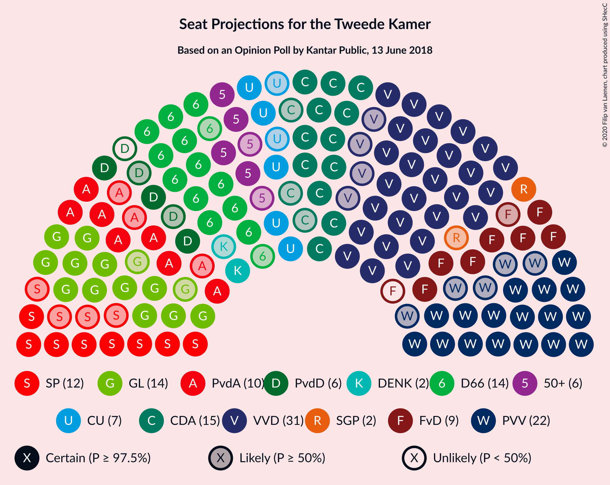

### Confidence Intervals

| Party | Last Result | Median | 80% Confidence Interval | 90% Confidence Interval | 95% Confidence Interval | 99% Confidence Interval |
|:-----:|:-----------:|:------:|:-----------------------:|:-----------------------:|:-----------------------:|:-----------------------:|
| <a href="#volkspartij-voor-vrijheid-en-democratie">Volkspartij voor Vrijheid en Democratie</a> | 33 | 36 | 32–36 |29–37 |29–37 |28–37 |
| <a href="#partij-voor-de-vrijheid">Partij voor de Vrijheid</a> | 20 | 19 | 19–22 |17–22 |17–23 |17–26 |
| <a href="#christen-democratisch-appèl">Christen-Democratisch Appèl</a> | 19 | 16 | 14–18 |14–20 |12–20 |11–20 |
| <a href="#groenlinks">GroenLinks</a> | 14 | 15 | 15–19 |12–19 |12–19 |10–19 |
| <a href="#democraten-66">Democraten 66</a> | 19 | 13 | 12–14 |12–15 |12–15 |11–16 |
| <a href="#socialistische-partij">Socialistische Partij</a> | 14 | 10 | 8–11 |7–11 |7–12 |7–14 |
| <a href="#partij-van-de-arbeid">Partij van de Arbeid</a> | 9 | 11 | 9–12 |7–12 |7–12 |7–13 |
| <a href="#forum-voor-democratie">Forum voor Democratie</a> | 2 | 9 | 7–10 |7–12 |7–12 |5–12 |
| <a href="#christenunie">ChristenUnie</a> | 5 | 7 | 6–9 |6–9 |6–9 |5–10 |
| <a href="#50plus">50Plus</a> | 4 | 5 | 4–7 |4–8 |4–9 |4–9 |
| <a href="#partij-voor-de-dieren">Partij voor de Dieren</a> | 5 | 5 | 4–7 |4–7 |4–7 |3–8 |
| <a href="#staatkundig-gereformeerde-partij">Staatkundig Gereformeerde Partij</a> | 3 | 3 | 1–4 |1–4 |1–4 |0–4 |
| <a href="#denk">DENK</a> | 3 | 2 | 0–2 |0–4 |0–4 |0–4 |

### Volkspartij voor Vrijheid en Democratie

*For a full overview of the results for this party, see the [Volkspartij voor Vrijheid en Democratie](party-volkspartijvoorvrijheidendemocratie.html) page.*

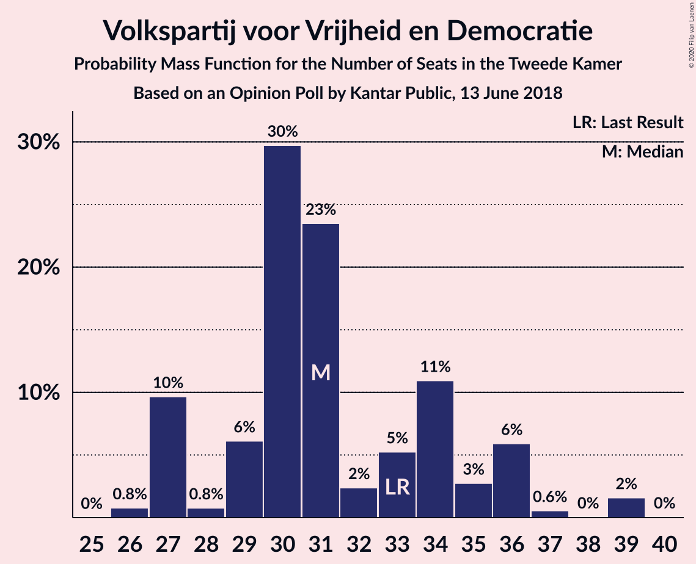

| Number of Seats | Probability | Accumulated | Special Marks |
|:---------------:|:-----------:|:-----------:|:-------------:|
| 25 | 0.1% | 100% |  |
| 26 | 0% | 99.9% |  |
| 27 | 0.2% | 99.9% |  |
| 28 | 0.5% | 99.7% |  |
| 29 | 5% | 99.2% |  |
| 30 | 2% | 95% |  |
| 31 | 0.4% | 92% |  |
| 32 | 7% | 92% |  |
| 33 | 14% | 85% | Last Result |
| 34 | 0.3% | 71% |  |
| 35 | 14% | 71% |  |
| 36 | 50% | 57% | Median |
| 37 | 7% | 8% |  |
| 38 | 0.1% | 0.4% |  |
| 39 | 0.4% | 0.4% |  |
| 40 | 0% | 0% |  |

### Partij voor de Vrijheid

*For a full overview of the results for this party, see the [Partij voor de Vrijheid](party-partijvoordevrijheid.html) page.*

| Number of Seats | Probability | Accumulated | Special Marks |
|:---------------:|:-----------:|:-----------:|:-------------:|
| 16 | 0.1% | 100% |  |
| 17 | 5% | 99.8% |  |
| 18 | 0.4% | 95% |  |
| 19 | 62% | 94% | Median |
| 20 | 12% | 32% | Last Result |
| 21 | 8% | 20% |  |
| 22 | 8% | 12% |  |
| 23 | 2% | 4% |  |
| 24 | 0.4% | 2% |  |
| 25 | 0.5% | 1.3% |  |
| 26 | 0.6% | 0.7% |  |
| 27 | 0% | 0.2% |  |
| 28 | 0.1% | 0.1% |  |
| 29 | 0% | 0% |  |

### Christen-Democratisch Appèl

*For a full overview of the results for this party, see the [Christen-Democratisch Appèl](party-christen-democratischappèl.html) page.*

| Number of Seats | Probability | Accumulated | Special Marks |
|:---------------:|:-----------:|:-----------:|:-------------:|
| 11 | 0.6% | 100% |  |
| 12 | 3% | 99.3% |  |
| 13 | 1.0% | 97% |  |
| 14 | 37% | 96% |  |
| 15 | 2% | 59% |  |
| 16 | 17% | 57% | Median |
| 17 | 27% | 39% |  |
| 18 | 5% | 12% |  |
| 19 | 0% | 7% | Last Result |
| 20 | 7% | 7% |  |
| 21 | 0% | 0% |  |

### GroenLinks

*For a full overview of the results for this party, see the [GroenLinks](party-groenlinks.html) page.*

| Number of Seats | Probability | Accumulated | Special Marks |
|:---------------:|:-----------:|:-----------:|:-------------:|
| 10 | 1.0% | 100% |  |
| 11 | 0.7% | 99.0% |  |
| 12 | 5% | 98% |  |
| 13 | 0.6% | 93% |  |
| 14 | 1.2% | 93% | Last Result |
| 15 | 44% | 92% | Median |
| 16 | 26% | 47% |  |
| 17 | 1.2% | 21% |  |
| 18 | 7% | 20% |  |
| 19 | 13% | 13% |  |
| 20 | 0% | 0.1% |  |
| 21 | 0% | 0.1% |  |
| 22 | 0% | 0% |  |

### Democraten 66

*For a full overview of the results for this party, see the [Democraten 66](party-democraten66.html) page.*

| Number of Seats | Probability | Accumulated | Special Marks |
|:---------------:|:-----------:|:-----------:|:-------------:|
| 10 | 0.1% | 100% |  |
| 11 | 0.5% | 99.9% |  |
| 12 | 14% | 99.4% |  |
| 13 | 44% | 86% | Median |
| 14 | 34% | 41% |  |
| 15 | 5% | 7% |  |
| 16 | 0.9% | 1.3% |  |
| 17 | 0.3% | 0.4% |  |
| 18 | 0% | 0.1% |  |
| 19 | 0% | 0% | Last Result |

### Socialistische Partij

*For a full overview of the results for this party, see the [Socialistische Partij](party-socialistischepartij.html) page.*

| Number of Seats | Probability | Accumulated | Special Marks |
|:---------------:|:-----------:|:-----------:|:-------------:|
| 7 | 7% | 100% |  |
| 8 | 6% | 92% |  |
| 9 | 26% | 86% |  |
| 10 | 41% | 60% | Median |
| 11 | 14% | 19% |  |
| 12 | 3% | 4% |  |
| 13 | 1.2% | 2% |  |
| 14 | 0.3% | 0.7% | Last Result |
| 15 | 0.3% | 0.3% |  |
| 16 | 0.1% | 0.1% |  |
| 17 | 0% | 0% |  |

### Partij van de Arbeid

*For a full overview of the results for this party, see the [Partij van de Arbeid](party-partijvandearbeid.html) page.*

| Number of Seats | Probability | Accumulated | Special Marks |
|:---------------:|:-----------:|:-----------:|:-------------:|
| 6 | 0.1% | 100% |  |
| 7 | 7% | 99.9% |  |
| 8 | 1.0% | 93% |  |
| 9 | 14% | 92% | Last Result |
| 10 | 3% | 77% |  |
| 11 | 40% | 74% | Median |
| 12 | 33% | 34% |  |
| 13 | 0.6% | 1.0% |  |
| 14 | 0.3% | 0.4% |  |
| 15 | 0.1% | 0.1% |  |
| 16 | 0% | 0% |  |

### Forum voor Democratie

*For a full overview of the results for this party, see the [Forum voor Democratie](party-forumvoordemocratie.html) page.*

| Number of Seats | Probability | Accumulated | Special Marks |
|:---------------:|:-----------:|:-----------:|:-------------:|
| 2 | 0% | 100% | Last Result |
| 3 | 0% | 100% |  |
| 4 | 0% | 100% |  |
| 5 | 0.6% | 100% |  |
| 6 | 0.9% | 99.4% |  |
| 7 | 9% | 98% |  |
| 8 | 27% | 90% |  |
| 9 | 50% | 63% | Median |
| 10 | 6% | 13% |  |
| 11 | 2% | 7% |  |
| 12 | 5% | 5% |  |
| 13 | 0.1% | 0.1% |  |
| 14 | 0% | 0% |  |

### ChristenUnie

*For a full overview of the results for this party, see the [ChristenUnie](party-christenunie.html) page.*

| Number of Seats | Probability | Accumulated | Special Marks |
|:---------------:|:-----------:|:-----------:|:-------------:|
| 5 | 2% | 100% | Last Result |
| 6 | 24% | 98% |  |
| 7 | 33% | 74% | Median |
| 8 | 30% | 41% |  |
| 9 | 9% | 11% |  |
| 10 | 2% | 2% |  |
| 11 | 0.1% | 0.4% |  |
| 12 | 0.3% | 0.3% |  |
| 13 | 0% | 0% |  |

### 50Plus

*For a full overview of the results for this party, see the [50Plus](party-50plus.html) page.*

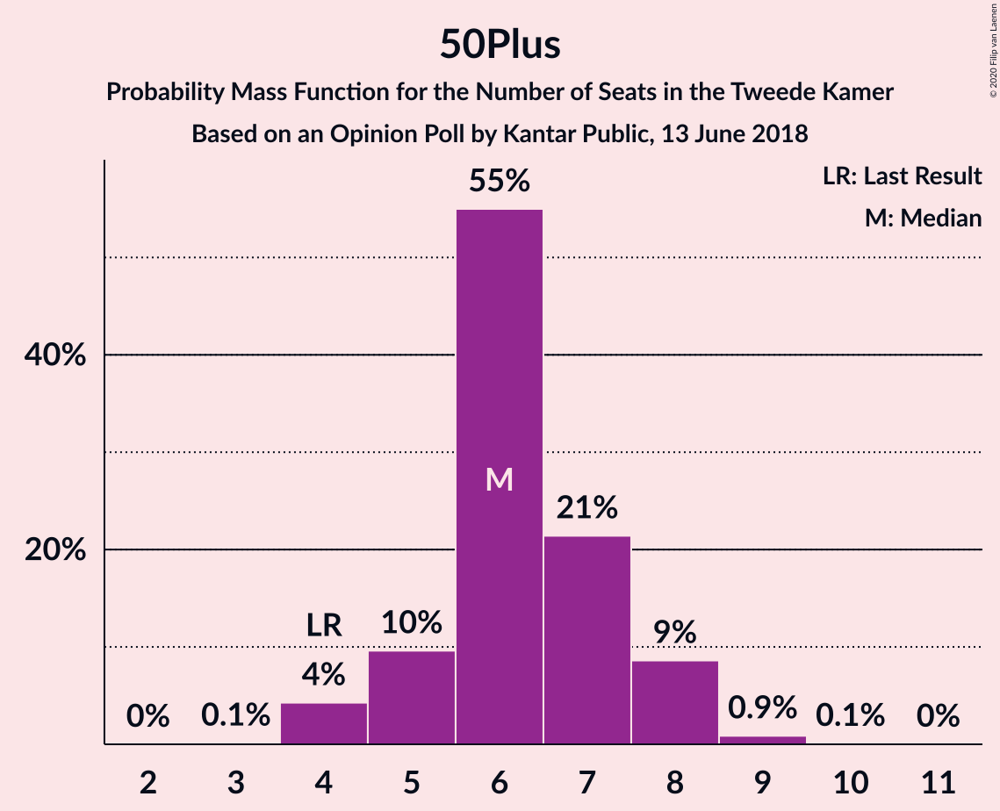

| Number of Seats | Probability | Accumulated | Special Marks |
|:---------------:|:-----------:|:-----------:|:-------------:|
| 3 | 0.3% | 100% |  |
| 4 | 30% | 99.7% | Last Result |
| 5 | 50% | 70% | Median |
| 6 | 8% | 20% |  |
| 7 | 4% | 11% |  |
| 8 | 3% | 7% |  |
| 9 | 4% | 4% |  |
| 10 | 0% | 0% |  |

### Partij voor de Dieren

*For a full overview of the results for this party, see the [Partij voor de Dieren](party-partijvoordedieren.html) page.*

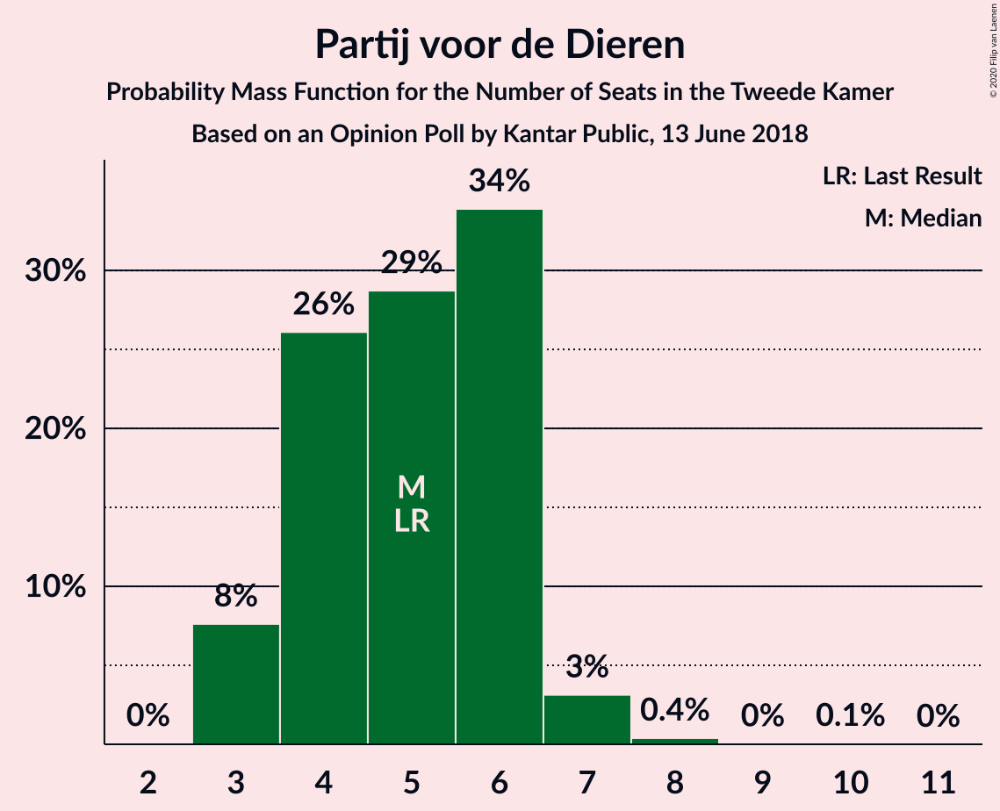

| Number of Seats | Probability | Accumulated | Special Marks |
|:---------------:|:-----------:|:-----------:|:-------------:|
| 2 | 0.1% | 100% |  |
| 3 | 1.3% | 99.9% |  |
| 4 | 13% | 98.6% |  |
| 5 | 57% | 86% | Last Result, Median |
| 6 | 8% | 29% |  |
| 7 | 19% | 21% |  |
| 8 | 1.2% | 1.2% |  |
| 9 | 0% | 0% |  |

### Staatkundig Gereformeerde Partij

*For a full overview of the results for this party, see the [Staatkundig Gereformeerde Partij](party-staatkundiggereformeerdepartij.html) page.*

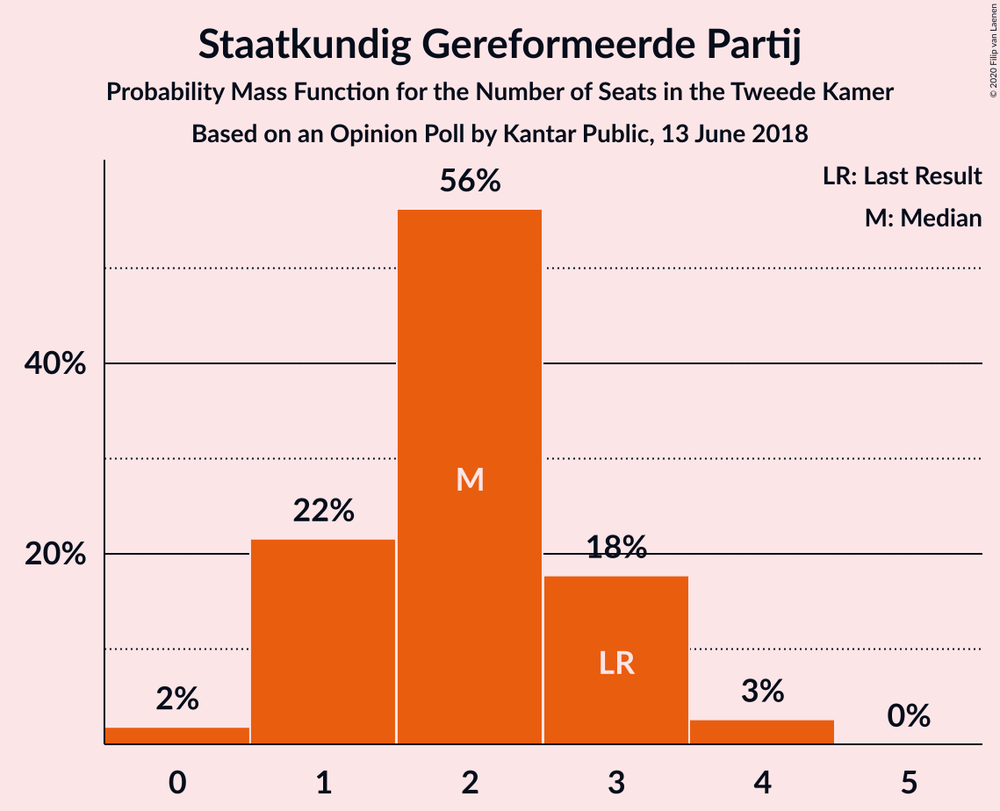

| Number of Seats | Probability | Accumulated | Special Marks |
|:---------------:|:-----------:|:-----------:|:-------------:|
| 0 | 0.6% | 100% |  |
| 1 | 31% | 99.4% |  |
| 2 | 13% | 69% |  |
| 3 | 32% | 56% | Last Result, Median |
| 4 | 24% | 24% |  |
| 5 | 0.4% | 0.4% |  |
| 6 | 0% | 0% |  |

### DENK

*For a full overview of the results for this party, see the [DENK](party-denk.html) page.*

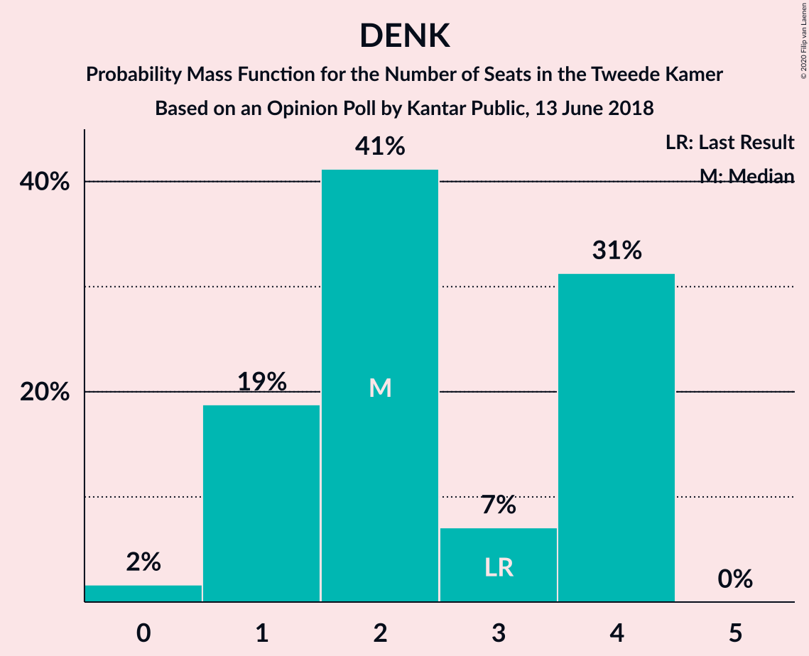

| Number of Seats | Probability | Accumulated | Special Marks |
|:---------------:|:-----------:|:-----------:|:-------------:|
| 0 | 25% | 100% |  |
| 1 | 15% | 75% |  |
| 2 | 52% | 60% | Median |
| 3 | 2% | 8% | Last Result |
| 4 | 6% | 6% |  |
| 5 | 0% | 0% |  |

## Coalitions

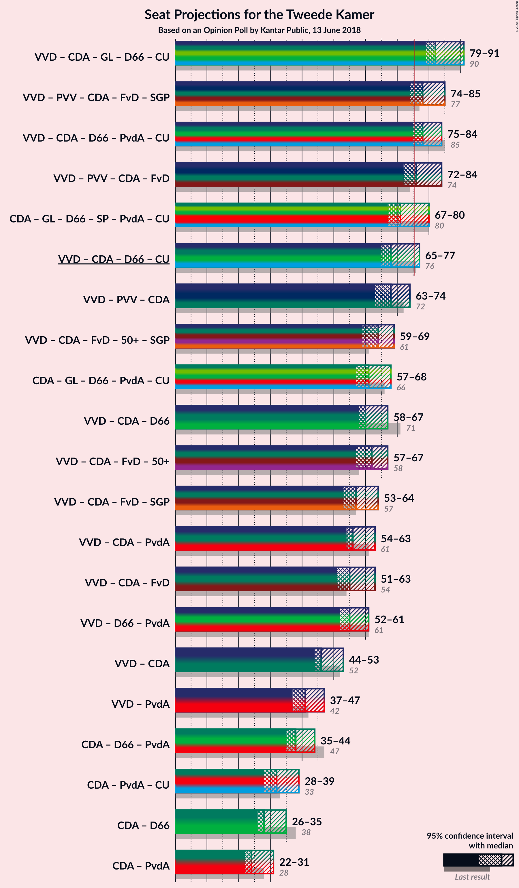

### Confidence Intervals

| Coalition | Last Result | Median | Majority? | 80% Confidence Interval | 90% Confidence Interval | 95% Confidence Interval | 99% Confidence Interval |
|:---------:|:-----------:|:------:|:---------:|:-----------------------:|:-----------------------:|:-----------------------:|:-----------------------:|
| Volkspartij voor Vrijheid en Democratie – Christen-Democratisch Appèl – GroenLinks – Democraten 66 – ChristenUnie | 90 | 89 | 100% | 82–90 | 80–92 | 78–92 | 77–92 |
| Volkspartij voor Vrijheid en Democratie – Christen-Democratisch Appèl – Democraten 66 – Partij van de Arbeid – ChristenUnie | 85 | 81 | 97% | 79–85 | 79–86 | 74–86 | 71–86 |
| Volkspartij voor Vrijheid en Democratie – Partij voor de Vrijheid – Christen-Democratisch Appèl – Forum voor Democratie – Staatkundig Gereformeerde Partij | 77 | 82 | 99.0% | 77–84 | 77–84 | 77–84 | 74–85 |
| Volkspartij voor Vrijheid en Democratie – Partij voor de Vrijheid – Christen-Democratisch Appèl – Forum voor Democratie | 74 | 78 | 97% | 76–81 | 76–82 | 75–82 | 72–84 |
| Christen-Democratisch Appèl – GroenLinks – Democraten 66 – Socialistische Partij – Partij van de Arbeid – ChristenUnie | 80 | 73 | 2% | 71–73 | 70–75 | 68–75 | 65–79 |
| Volkspartij voor Vrijheid en Democratie – Partij voor de Vrijheid – Christen-Democratisch Appèl | 72 | 69 | 0.7% | 66–73 | 66–75 | 65–75 | 64–77 |
| Volkspartij voor Vrijheid en Democratie – Christen-Democratisch Appèl – Democraten 66 – ChristenUnie | 76 | 70 | 0% | 69–74 | 68–75 | 62–75 | 61–75 |
| Volkspartij voor Vrijheid en Democratie – Christen-Democratisch Appèl – Forum voor Democratie – 50Plus – Staatkundig Gereformeerde Partij | 61 | 67 | 0% | 63–70 | 63–70 | 62–70 | 59–70 |
| Volkspartij voor Vrijheid en Democratie – Christen-Democratisch Appèl – Forum voor Democratie – 50Plus | 58 | 63 | 0% | 62–67 | 61–67 | 61–68 | 57–68 |
| Christen-Democratisch Appèl – GroenLinks – Democraten 66 – Partij van de Arbeid – ChristenUnie | 66 | 63 | 0% | 61–65 | 59–68 | 57–68 | 56–68 |
| Volkspartij voor Vrijheid en Democratie – Christen-Democratisch Appèl – Democraten 66 | 71 | 63 | 0% | 61–67 | 60–67 | 56–67 | 54–67 |
| Volkspartij voor Vrijheid en Democratie – Christen-Democratisch Appèl – Forum voor Democratie – Staatkundig Gereformeerde Partij | 57 | 62 | 0% | 58–65 | 57–65 | 54–65 | 52–65 |
| Volkspartij voor Vrijheid en Democratie – Christen-Democratisch Appèl – Partij van de Arbeid | 61 | 62 | 0% | 57–64 | 56–64 | 52–64 | 51–64 |
| Volkspartij voor Vrijheid en Democratie – Christen-Democratisch Appèl – Forum voor Democratie | 54 | 59 | 0% | 57–62 | 55–62 | 53–62 | 50–62 |
| Volkspartij voor Vrijheid en Democratie – Democraten 66 – Partij van de Arbeid | 61 | 60 | 0% | 56–61 | 55–61 | 52–61 | 51–62 |
| Volkspartij voor Vrijheid en Democratie – Christen-Democratisch Appèl | 52 | 50 | 0% | 47–53 | 45–53 | 42–53 | 42–53 |
| Volkspartij voor Vrijheid en Democratie – Partij van de Arbeid | 42 | 47 | 0% | 43–48 | 40–48 | 40–48 | 38–48 |
| Christen-Democratisch Appèl – Democraten 66 – Partij van de Arbeid | 47 | 40 | 0% | 35–42 | 35–45 | 34–45 | 34–45 |
| Christen-Democratisch Appèl – Partij van de Arbeid – ChristenUnie | 33 | 33 | 0% | 31–38 | 31–39 | 30–39 | 29–39 |
| Christen-Democratisch Appèl – Democraten 66 | 38 | 29 | 0% | 27–31 | 27–34 | 24–34 | 24–34 |
| Christen-Democratisch Appèl – Partij van de Arbeid | 28 | 26 | 0% | 23–30 | 23–31 | 22–31 | 21–31 |

### Volkspartij voor Vrijheid en Democratie – Christen-Democratisch Appèl – GroenLinks – Democraten 66 – ChristenUnie

| Number of Seats | Probability | Accumulated | Special Marks |
|:---------------:|:-----------:|:-----------:|:-------------:|
| 76 | 0.2% | 100% | Majority |
| 77 | 2% | 99.8% |  |
| 78 | 0.3% | 98% |  |
| 79 | 0.8% | 97% |  |
| 80 | 5% | 97% |  |
| 81 | 0.7% | 91% |  |
| 82 | 1.4% | 91% |  |
| 83 | 0.6% | 89% |  |
| 84 | 5% | 89% |  |
| 85 | 30% | 84% |  |
| 86 | 0.2% | 54% |  |
| 87 | 0.5% | 54% | Median |
| 88 | 0.8% | 54% |  |
| 89 | 38% | 53% |  |
| 90 | 7% | 15% | Last Result |
| 91 | 0.3% | 7% |  |
| 92 | 7% | 7% |  |
| 93 | 0% | 0% |  |

### Volkspartij voor Vrijheid en Democratie – Christen-Democratisch Appèl – Democraten 66 – Partij van de Arbeid – ChristenUnie

| Number of Seats | Probability | Accumulated | Special Marks |
|:---------------:|:-----------:|:-----------:|:-------------:|
| 71 | 2% | 100% |  |
| 72 | 0.2% | 98% |  |
| 73 | 0% | 98% |  |
| 74 | 0.2% | 98% |  |
| 75 | 0.5% | 97% |  |
| 76 | 0.7% | 97% | Majority |
| 77 | 0.5% | 96% |  |
| 78 | 0.7% | 96% |  |
| 79 | 18% | 95% |  |
| 80 | 1.2% | 77% |  |
| 81 | 36% | 76% |  |
| 82 | 6% | 40% |  |
| 83 | 0.6% | 34% | Median |
| 84 | 0.1% | 34% |  |
| 85 | 26% | 33% | Last Result |
| 86 | 7% | 8% |  |
| 87 | 0.1% | 0.1% |  |
| 88 | 0% | 0.1% |  |
| 89 | 0% | 0% |  |

### Volkspartij voor Vrijheid en Democratie – Partij voor de Vrijheid – Christen-Democratisch Appèl – Forum voor Democratie – Staatkundig Gereformeerde Partij

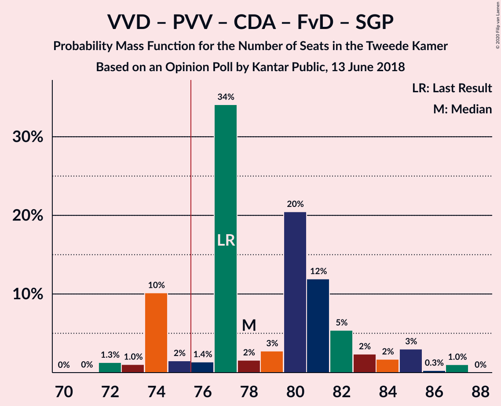

| Number of Seats | Probability | Accumulated | Special Marks |
|:---------------:|:-----------:|:-----------:|:-------------:|
| 71 | 0.1% | 100% |  |
| 72 | 0% | 99.9% |  |
| 73 | 0.3% | 99.8% |  |
| 74 | 0.1% | 99.5% |  |
| 75 | 0.5% | 99.5% |  |
| 76 | 1.0% | 99.0% | Majority |
| 77 | 15% | 98% | Last Result |
| 78 | 6% | 83% |  |
| 79 | 0.7% | 77% |  |
| 80 | 6% | 77% |  |
| 81 | 6% | 71% |  |
| 82 | 31% | 64% |  |
| 83 | 7% | 33% | Median |
| 84 | 25% | 27% |  |
| 85 | 0.9% | 1.1% |  |
| 86 | 0.2% | 0.3% |  |
| 87 | 0% | 0% |  |

### Volkspartij voor Vrijheid en Democratie – Partij voor de Vrijheid – Christen-Democratisch Appèl – Forum voor Democratie

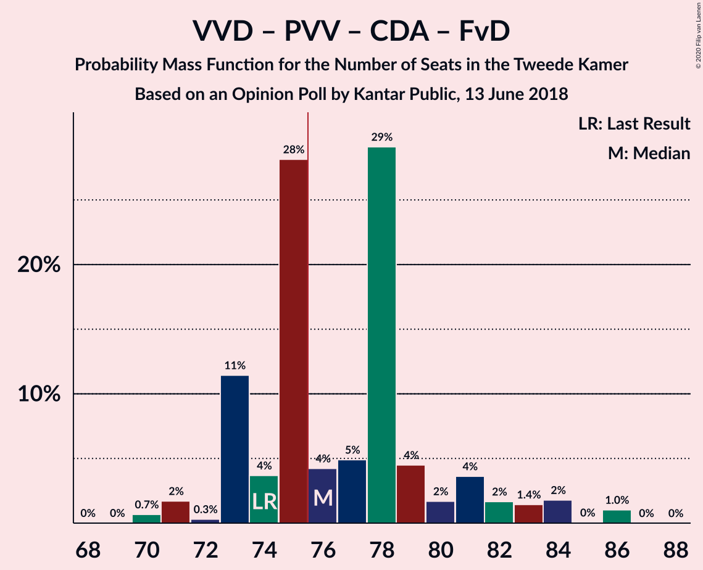

| Number of Seats | Probability | Accumulated | Special Marks |
|:---------------:|:-----------:|:-----------:|:-------------:|
| 68 | 0.1% | 100% |  |
| 69 | 0% | 99.9% |  |
| 70 | 0% | 99.9% |  |
| 71 | 0.3% | 99.8% |  |
| 72 | 0.5% | 99.5% |  |
| 73 | 0.4% | 99.0% |  |
| 74 | 1.1% | 98.6% | Last Result |
| 75 | 0.5% | 98% |  |
| 76 | 20% | 97% | Majority |
| 77 | 0.2% | 77% |  |
| 78 | 34% | 77% |  |
| 79 | 0.4% | 43% |  |
| 80 | 1.3% | 42% | Median |
| 81 | 33% | 41% |  |
| 82 | 7% | 8% |  |
| 83 | 0.2% | 1.0% |  |
| 84 | 0.3% | 0.8% |  |
| 85 | 0.4% | 0.4% |  |
| 86 | 0% | 0% |  |

### Christen-Democratisch Appèl – GroenLinks – Democraten 66 – Socialistische Partij – Partij van de Arbeid – ChristenUnie

| Number of Seats | Probability | Accumulated | Special Marks |
|:---------------:|:-----------:|:-----------:|:-------------:|
| 65 | 0.7% | 100% |  |
| 66 | 0.1% | 99.3% |  |
| 67 | 0.2% | 99.2% |  |
| 68 | 2% | 99.1% |  |
| 69 | 0.9% | 97% |  |
| 70 | 2% | 96% |  |
| 71 | 24% | 94% |  |
| 72 | 2% | 70% | Median |
| 73 | 58% | 68% |  |
| 74 | 0.4% | 10% |  |
| 75 | 8% | 9% |  |
| 76 | 0.6% | 2% | Majority |
| 77 | 0.1% | 1.0% |  |
| 78 | 0.4% | 1.0% |  |
| 79 | 0.5% | 0.6% |  |
| 80 | 0% | 0.1% | Last Result |
| 81 | 0% | 0% |  |

### Volkspartij voor Vrijheid en Democratie – Partij voor de Vrijheid – Christen-Democratisch Appèl

| Number of Seats | Probability | Accumulated | Special Marks |
|:---------------:|:-----------:|:-----------:|:-------------:|
| 60 | 0.1% | 100% |  |
| 61 | 0% | 99.9% |  |
| 62 | 0% | 99.8% |  |
| 63 | 0.2% | 99.8% |  |
| 64 | 0.5% | 99.6% |  |
| 65 | 2% | 99.1% |  |
| 66 | 11% | 97% |  |
| 67 | 0.2% | 85% |  |
| 68 | 13% | 85% |  |
| 69 | 25% | 72% |  |
| 70 | 5% | 48% |  |
| 71 | 0.9% | 43% | Median |
| 72 | 26% | 42% | Last Result |
| 73 | 8% | 16% |  |
| 74 | 0.2% | 8% |  |
| 75 | 7% | 8% |  |
| 76 | 0% | 0.7% | Majority |
| 77 | 0.4% | 0.7% |  |
| 78 | 0.2% | 0.2% |  |
| 79 | 0% | 0% |  |

### Volkspartij voor Vrijheid en Democratie – Christen-Democratisch Appèl – Democraten 66 – ChristenUnie

| Number of Seats | Probability | Accumulated | Special Marks |
|:---------------:|:-----------:|:-----------:|:-------------:|
| 61 | 2% | 100% |  |
| 62 | 0.3% | 98% |  |
| 63 | 0% | 97% |  |
| 64 | 0% | 97% |  |
| 65 | 0.2% | 97% |  |
| 66 | 1.2% | 97% |  |
| 67 | 0.3% | 96% |  |
| 68 | 5% | 96% |  |
| 69 | 29% | 91% |  |
| 70 | 19% | 62% |  |
| 71 | 0.8% | 42% |  |
| 72 | 0.1% | 42% | Median |
| 73 | 1.0% | 42% |  |
| 74 | 33% | 40% |  |
| 75 | 8% | 8% |  |
| 76 | 0% | 0% | Last Result, Majority |

### Volkspartij voor Vrijheid en Democratie – Christen-Democratisch Appèl – Forum voor Democratie – 50Plus – Staatkundig Gereformeerde Partij

| Number of Seats | Probability | Accumulated | Special Marks |
|:---------------:|:-----------:|:-----------:|:-------------:|
| 55 | 0.1% | 100% |  |
| 56 | 0.3% | 99.9% |  |
| 57 | 0% | 99.6% |  |
| 58 | 0% | 99.5% |  |
| 59 | 0.1% | 99.5% |  |
| 60 | 0.3% | 99.4% |  |
| 61 | 0.8% | 99.1% | Last Result |
| 62 | 2% | 98% |  |
| 63 | 13% | 96% |  |
| 64 | 6% | 83% |  |
| 65 | 6% | 77% |  |
| 66 | 8% | 70% |  |
| 67 | 24% | 62% |  |
| 68 | 8% | 38% |  |
| 69 | 0.3% | 30% | Median |
| 70 | 30% | 30% |  |
| 71 | 0% | 0.1% |  |
| 72 | 0.1% | 0.1% |  |
| 73 | 0% | 0% |  |

### Volkspartij voor Vrijheid en Democratie – Christen-Democratisch Appèl – Forum voor Democratie – 50Plus

| Number of Seats | Probability | Accumulated | Special Marks |
|:---------------:|:-----------:|:-----------:|:-------------:|
| 52 | 0.1% | 100% |  |
| 53 | 0.3% | 99.9% |  |
| 54 | 0% | 99.6% |  |
| 55 | 0% | 99.6% |  |
| 56 | 0% | 99.6% |  |
| 57 | 0.1% | 99.5% |  |
| 58 | 0.2% | 99.5% | Last Result |
| 59 | 0.8% | 99.3% |  |
| 60 | 0.4% | 98% |  |
| 61 | 7% | 98% |  |
| 62 | 13% | 91% |  |
| 63 | 31% | 77% |  |
| 64 | 2% | 47% |  |
| 65 | 8% | 45% |  |
| 66 | 0.2% | 38% | Median |
| 67 | 33% | 37% |  |
| 68 | 5% | 5% |  |
| 69 | 0% | 0.1% |  |
| 70 | 0% | 0% |  |

### Christen-Democratisch Appèl – GroenLinks – Democraten 66 – Partij van de Arbeid – ChristenUnie

| Number of Seats | Probability | Accumulated | Special Marks |
|:---------------:|:-----------:|:-----------:|:-------------:|
| 54 | 0.1% | 100% |  |
| 55 | 0.2% | 99.9% |  |
| 56 | 0.2% | 99.7% |  |
| 57 | 3% | 99.5% |  |
| 58 | 0.7% | 96% |  |
| 59 | 0.8% | 95% |  |
| 60 | 2% | 95% |  |
| 61 | 25% | 93% |  |
| 62 | 12% | 68% | Median |
| 63 | 17% | 56% |  |
| 64 | 25% | 39% |  |
| 65 | 5% | 14% |  |
| 66 | 0.2% | 9% | Last Result |
| 67 | 0.6% | 8% |  |
| 68 | 7% | 8% |  |
| 69 | 0.4% | 0.4% |  |
| 70 | 0% | 0% |  |

### Volkspartij voor Vrijheid en Democratie – Christen-Democratisch Appèl – Democraten 66

| Number of Seats | Probability | Accumulated | Special Marks |
|:---------------:|:-----------:|:-----------:|:-------------:|
| 52 | 0.1% | 100% |  |
| 53 | 0.3% | 99.9% |  |
| 54 | 2% | 99.6% |  |
| 55 | 0% | 98% |  |
| 56 | 0.2% | 98% |  |
| 57 | 1.0% | 97% |  |
| 58 | 0.2% | 96% |  |
| 59 | 0.4% | 96% |  |
| 60 | 5% | 96% |  |
| 61 | 2% | 91% |  |
| 62 | 23% | 90% |  |
| 63 | 24% | 67% |  |
| 64 | 0.6% | 42% |  |
| 65 | 8% | 42% | Median |
| 66 | 0.2% | 33% |  |
| 67 | 33% | 33% |  |
| 68 | 0.2% | 0.3% |  |
| 69 | 0% | 0% |  |
| 70 | 0% | 0% |  |
| 71 | 0% | 0% | Last Result |

### Volkspartij voor Vrijheid en Democratie – Christen-Democratisch Appèl – Forum voor Democratie – Staatkundig Gereformeerde Partij

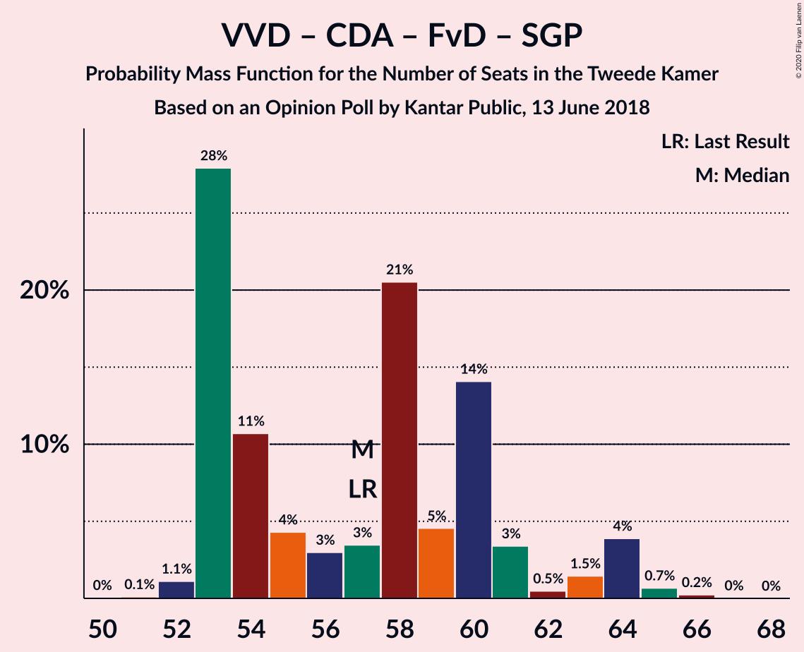

| Number of Seats | Probability | Accumulated | Special Marks |
|:---------------:|:-----------:|:-----------:|:-------------:|
| 49 | 0.4% | 100% |  |
| 50 | 0% | 99.6% |  |
| 51 | 0% | 99.6% |  |
| 52 | 0.1% | 99.6% |  |
| 53 | 0.1% | 99.5% |  |
| 54 | 3% | 99.3% |  |
| 55 | 0.4% | 97% |  |
| 56 | 0.4% | 96% |  |
| 57 | 2% | 96% | Last Result |
| 58 | 12% | 94% |  |
| 59 | 2% | 82% |  |
| 60 | 11% | 80% |  |
| 61 | 12% | 69% |  |
| 62 | 8% | 57% |  |
| 63 | 24% | 49% |  |
| 64 | 0% | 25% | Median |
| 65 | 25% | 25% |  |
| 66 | 0% | 0.1% |  |
| 67 | 0% | 0% |  |

### Volkspartij voor Vrijheid en Democratie – Christen-Democratisch Appèl – Partij van de Arbeid

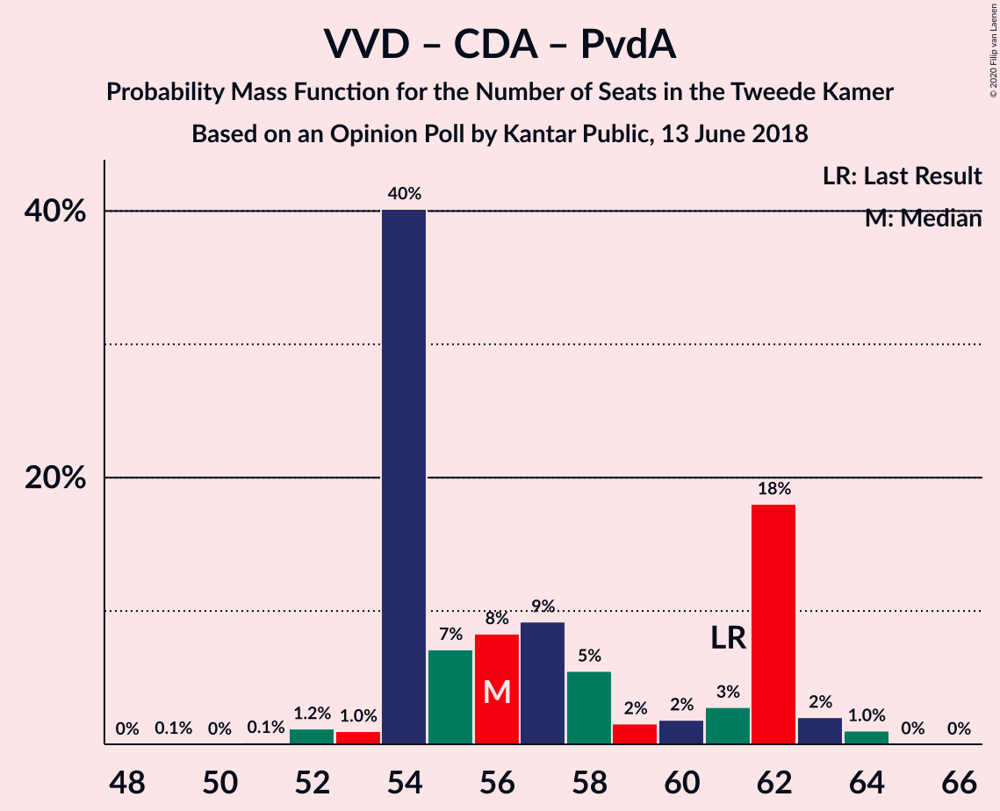

| Number of Seats | Probability | Accumulated | Special Marks |
|:---------------:|:-----------:|:-----------:|:-------------:|
| 48 | 0.1% | 100% |  |
| 49 | 0% | 99.9% |  |
| 50 | 0.3% | 99.9% |  |
| 51 | 0.1% | 99.6% |  |
| 52 | 2% | 99.5% |  |
| 53 | 1.1% | 97% |  |
| 54 | 0.7% | 96% |  |
| 55 | 0.5% | 96% |  |
| 56 | 5% | 95% |  |
| 57 | 0.2% | 90% |  |
| 58 | 13% | 90% |  |
| 59 | 2% | 77% |  |
| 60 | 7% | 75% |  |
| 61 | 5% | 68% | Last Result |
| 62 | 29% | 63% |  |
| 63 | 2% | 35% | Median |
| 64 | 33% | 33% |  |
| 65 | 0.3% | 0.3% |  |
| 66 | 0% | 0% |  |

### Volkspartij voor Vrijheid en Democratie – Christen-Democratisch Appèl – Forum voor Democratie

| Number of Seats | Probability | Accumulated | Special Marks |
|:---------------:|:-----------:|:-----------:|:-------------:|
| 46 | 0.4% | 100% |  |
| 47 | 0% | 99.6% |  |
| 48 | 0% | 99.6% |  |
| 49 | 0% | 99.6% |  |
| 50 | 0.1% | 99.6% |  |
| 51 | 0.1% | 99.5% |  |
| 52 | 0.7% | 99.4% |  |
| 53 | 2% | 98.7% |  |
| 54 | 1.0% | 97% | Last Result |
| 55 | 1.3% | 96% |  |
| 56 | 1.0% | 94% |  |
| 57 | 18% | 94% |  |
| 58 | 6% | 75% |  |
| 59 | 29% | 70% |  |
| 60 | 8% | 41% |  |
| 61 | 7% | 33% | Median |
| 62 | 25% | 26% |  |
| 63 | 0% | 0.1% |  |
| 64 | 0.1% | 0.1% |  |
| 65 | 0% | 0% |  |

### Volkspartij voor Vrijheid en Democratie – Democraten 66 – Partij van de Arbeid

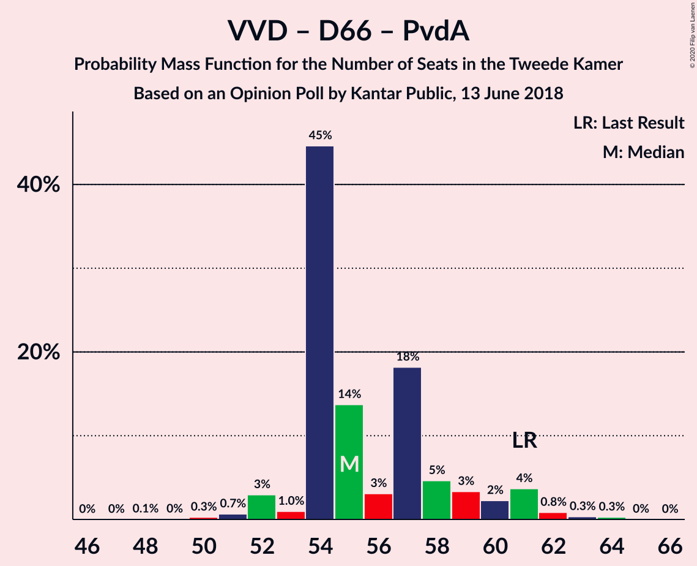

| Number of Seats | Probability | Accumulated | Special Marks |
|:---------------:|:-----------:|:-----------:|:-------------:|
| 49 | 0.1% | 100% |  |
| 50 | 0.1% | 99.9% |  |
| 51 | 0.7% | 99.8% |  |
| 52 | 2% | 99.1% |  |
| 53 | 0.1% | 97% |  |
| 54 | 0.5% | 97% |  |
| 55 | 5% | 96% |  |
| 56 | 13% | 91% |  |
| 57 | 13% | 78% |  |
| 58 | 13% | 65% |  |
| 59 | 1.2% | 52% |  |
| 60 | 1.1% | 51% | Median |
| 61 | 49% | 50% | Last Result |
| 62 | 0.4% | 0.7% |  |
| 63 | 0.1% | 0.4% |  |
| 64 | 0.3% | 0.3% |  |
| 65 | 0% | 0% |  |

### Volkspartij voor Vrijheid en Democratie – Christen-Democratisch Appèl

| Number of Seats | Probability | Accumulated | Special Marks |
|:---------------:|:-----------:|:-----------:|:-------------:|
| 38 | 0.1% | 100% |  |
| 39 | 0% | 99.9% |  |
| 40 | 0.3% | 99.9% |  |
| 41 | 0.1% | 99.6% |  |
| 42 | 2% | 99.5% |  |
| 43 | 0.2% | 97% |  |
| 44 | 1.1% | 97% |  |
| 45 | 5% | 96% |  |
| 46 | 0.5% | 91% |  |
| 47 | 0.9% | 91% |  |
| 48 | 1.5% | 90% |  |
| 49 | 17% | 88% |  |
| 50 | 29% | 71% |  |
| 51 | 0.4% | 42% |  |
| 52 | 1.5% | 41% | Last Result, Median |
| 53 | 40% | 40% |  |
| 54 | 0.2% | 0.2% |  |
| 55 | 0% | 0% |  |

### Volkspartij voor Vrijheid en Democratie – Partij van de Arbeid

| Number of Seats | Probability | Accumulated | Special Marks |
|:---------------:|:-----------:|:-----------:|:-------------:|
| 35 | 0.1% | 100% |  |
| 36 | 0% | 99.9% |  |
| 37 | 0% | 99.9% |  |
| 38 | 0.3% | 99.8% |  |
| 39 | 0.6% | 99.5% |  |
| 40 | 8% | 98.9% |  |
| 41 | 0.8% | 91% |  |
| 42 | 0.2% | 90% | Last Result |
| 43 | 0.7% | 90% |  |
| 44 | 34% | 90% |  |
| 45 | 5% | 56% |  |
| 46 | 1.0% | 51% |  |
| 47 | 26% | 50% | Median |
| 48 | 24% | 24% |  |
| 49 | 0% | 0.4% |  |
| 50 | 0.3% | 0.4% |  |
| 51 | 0.1% | 0.1% |  |
| 52 | 0% | 0% |  |

### Christen-Democratisch Appèl – Democraten 66 – Partij van de Arbeid

| Number of Seats | Probability | Accumulated | Special Marks |
|:---------------:|:-----------:|:-----------:|:-------------:|
| 32 | 0.1% | 100% |  |
| 33 | 0.1% | 99.8% |  |
| 34 | 3% | 99.7% |  |
| 35 | 7% | 97% |  |
| 36 | 12% | 89% |  |
| 37 | 2% | 77% |  |
| 38 | 0.3% | 75% |  |
| 39 | 24% | 75% |  |
| 40 | 3% | 51% | Median |
| 41 | 5% | 49% |  |
| 42 | 35% | 43% |  |
| 43 | 0.7% | 9% |  |
| 44 | 0.4% | 8% |  |
| 45 | 7% | 8% |  |
| 46 | 0.1% | 0.1% |  |
| 47 | 0% | 0% | Last Result |

### Christen-Democratisch Appèl – Partij van de Arbeid – ChristenUnie

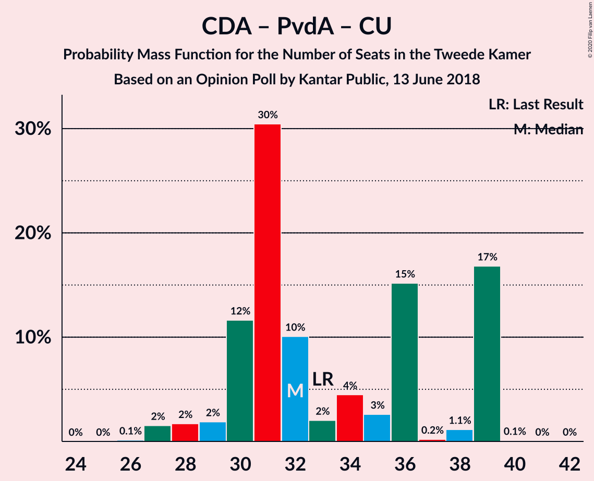

| Number of Seats | Probability | Accumulated | Special Marks |
|:---------------:|:-----------:|:-----------:|:-------------:|
| 28 | 0.1% | 100% |  |
| 29 | 2% | 99.8% |  |
| 30 | 2% | 98% |  |
| 31 | 13% | 96% |  |
| 32 | 32% | 83% |  |
| 33 | 2% | 51% | Last Result |
| 34 | 1.0% | 49% | Median |
| 35 | 35% | 48% |  |
| 36 | 0.1% | 14% |  |
| 37 | 0.7% | 14% |  |
| 38 | 5% | 13% |  |
| 39 | 7% | 7% |  |
| 40 | 0% | 0% |  |

### Christen-Democratisch Appèl – Democraten 66

| Number of Seats | Probability | Accumulated | Special Marks |
|:---------------:|:-----------:|:-----------:|:-------------:|
| 23 | 0% | 100% |  |
| 24 | 3% | 99.9% |  |
| 25 | 0.9% | 97% |  |
| 26 | 0.3% | 96% |  |
| 27 | 36% | 96% |  |
| 28 | 8% | 60% |  |
| 29 | 8% | 52% | Median |
| 30 | 6% | 44% |  |
| 31 | 31% | 39% |  |
| 32 | 0.8% | 8% |  |
| 33 | 0.1% | 7% |  |
| 34 | 7% | 7% |  |
| 35 | 0% | 0.1% |  |
| 36 | 0% | 0% |  |
| 37 | 0% | 0% |  |
| 38 | 0% | 0% | Last Result |

### Christen-Democratisch Appèl – Partij van de Arbeid

| Number of Seats | Probability | Accumulated | Special Marks |
|:---------------:|:-----------:|:-----------:|:-------------:|
| 20 | 0.1% | 100% |  |
| 21 | 2% | 99.8% |  |
| 22 | 3% | 98% |  |
| 23 | 20% | 95% |  |
| 24 | 0.9% | 76% |  |
| 25 | 0.6% | 75% |  |
| 26 | 25% | 74% |  |
| 27 | 6% | 49% | Median |
| 28 | 30% | 44% | Last Result |
| 29 | 0.6% | 13% |  |
| 30 | 5% | 13% |  |
| 31 | 7% | 8% |  |
| 32 | 0.2% | 0.2% |  |
| 33 | 0% | 0% |  |

## Technical Information

### Opinion Poll

+ **Polling firm:** Kantar Public
+ **Commissioner(s):** —
+ **Fieldwork period:** 13 June 2018

### Calculations

+ **Sample size:** 953
+ **Simulations done:** 131,072
+ **Error estimate:** 2.12%

