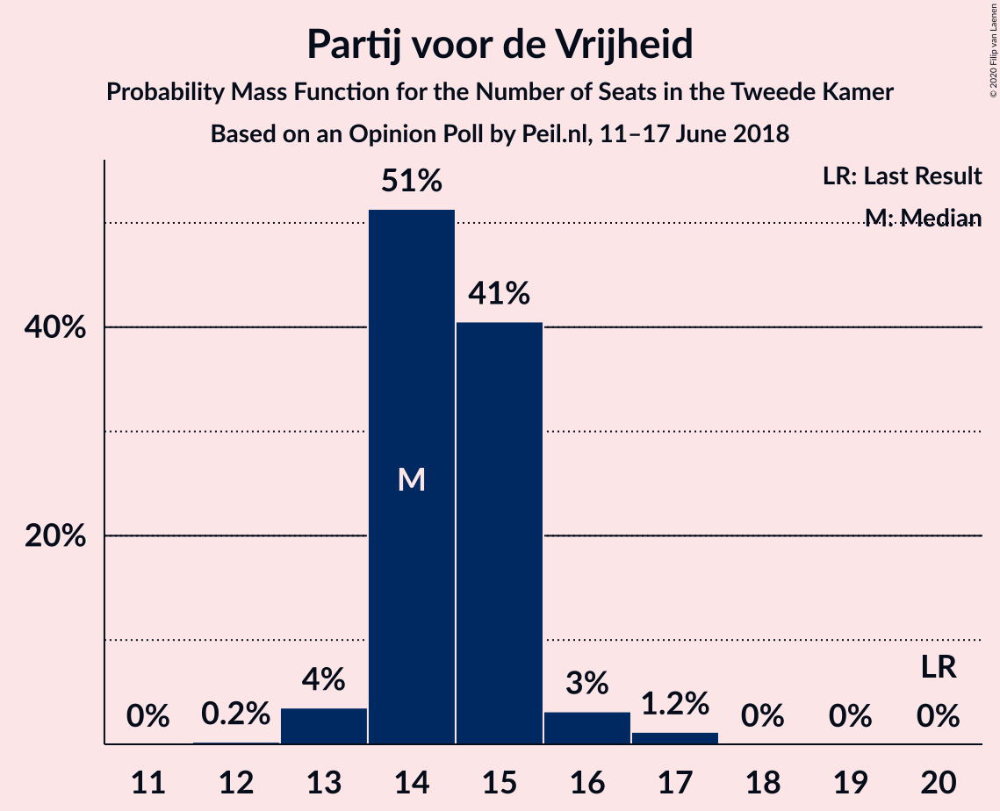
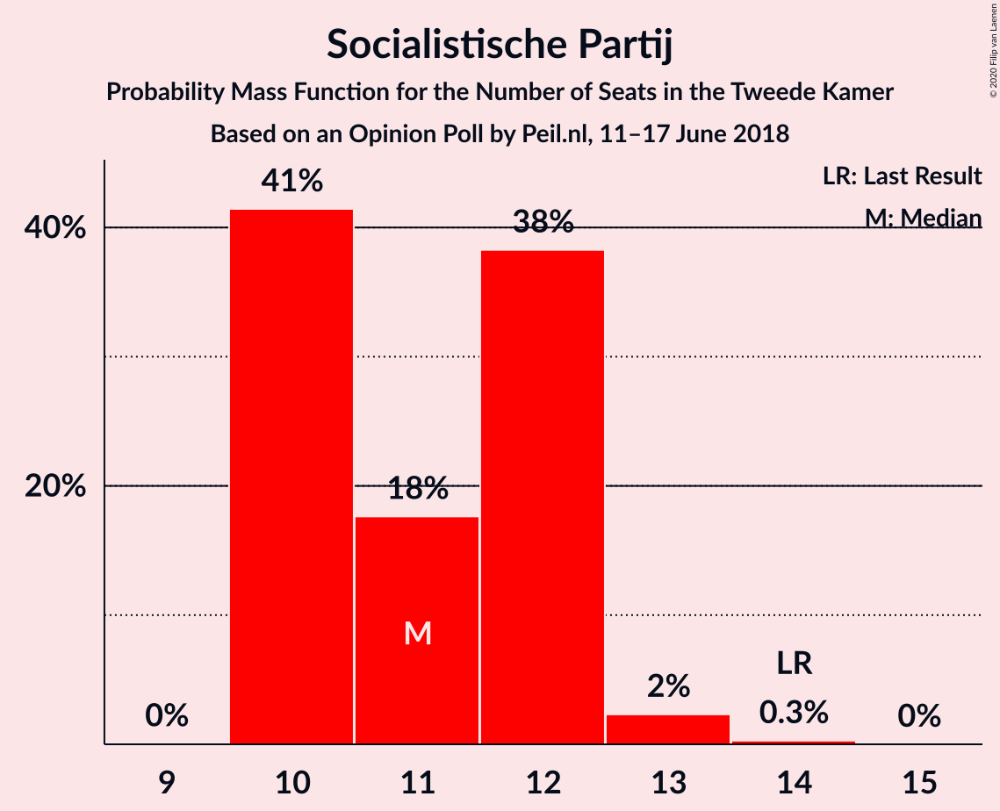
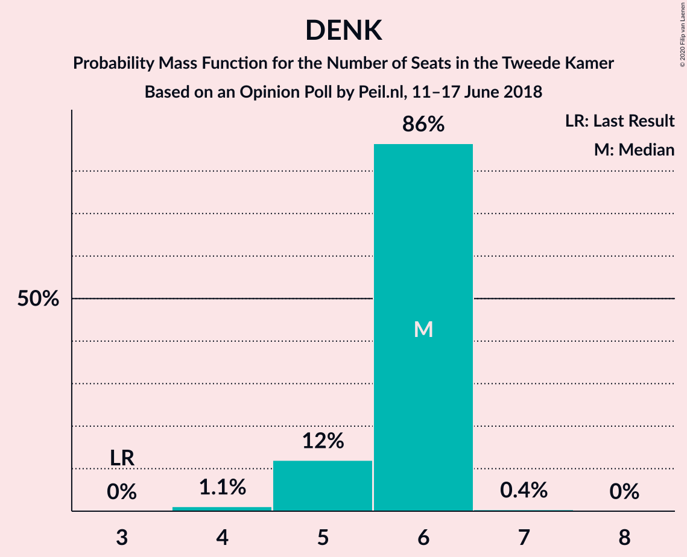
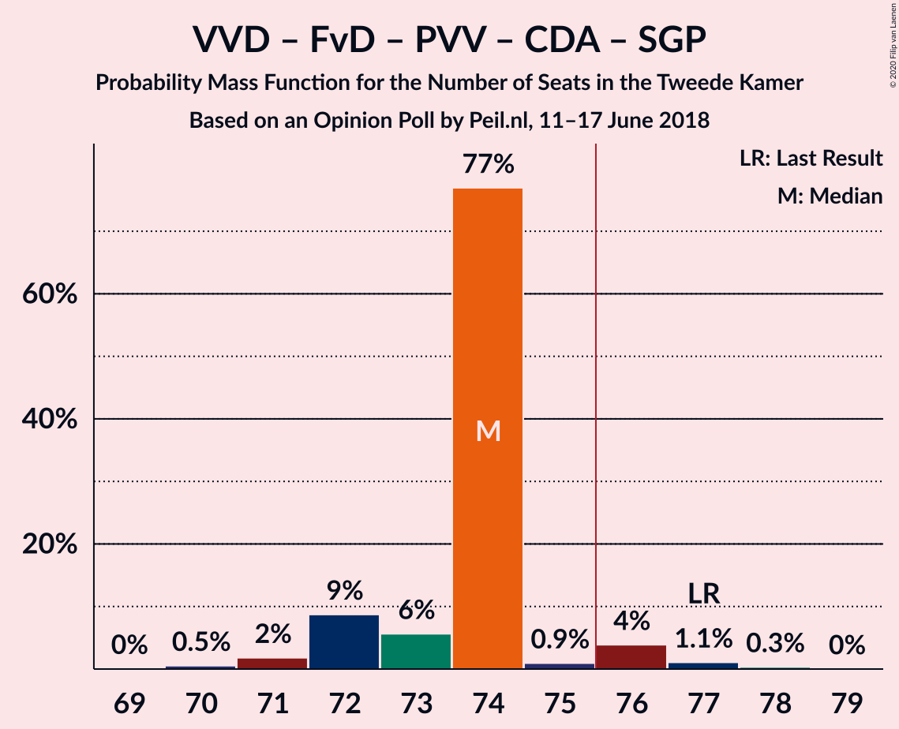
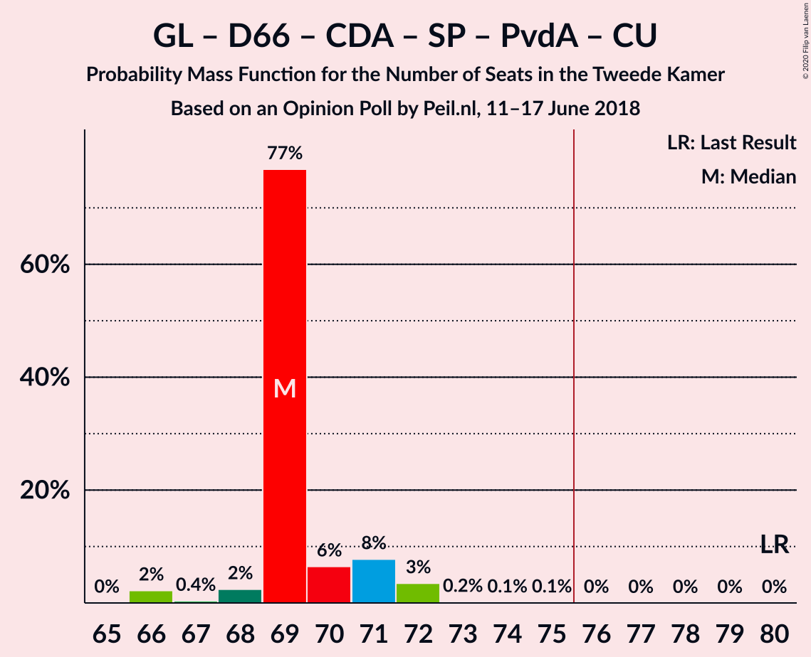
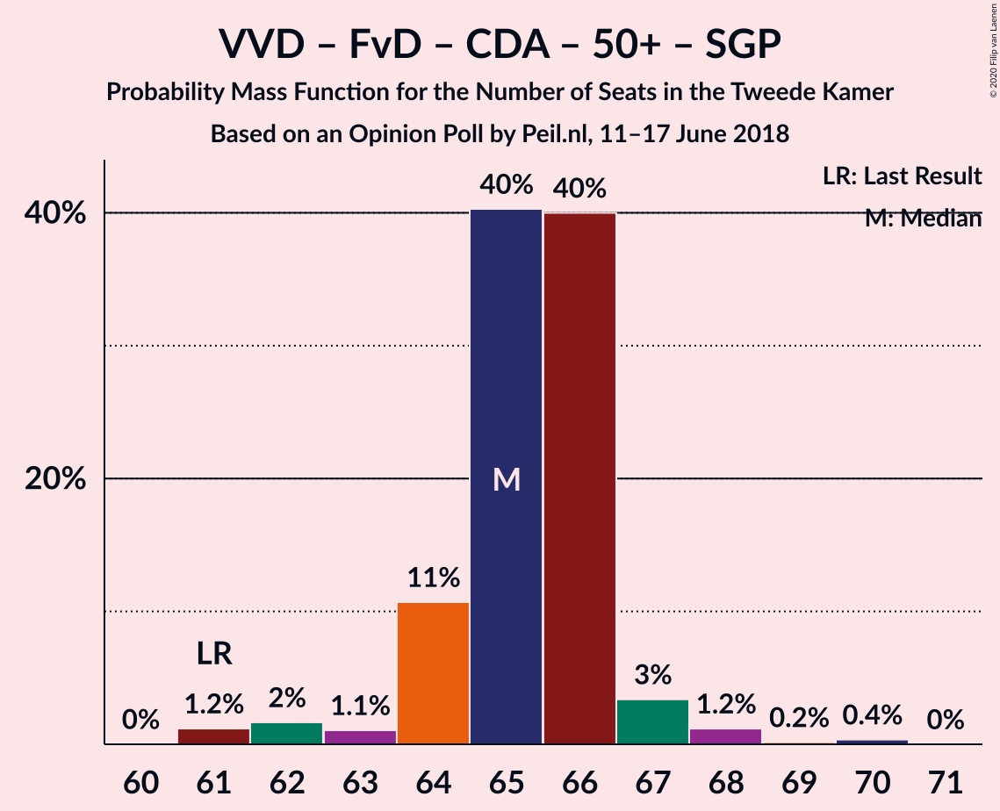
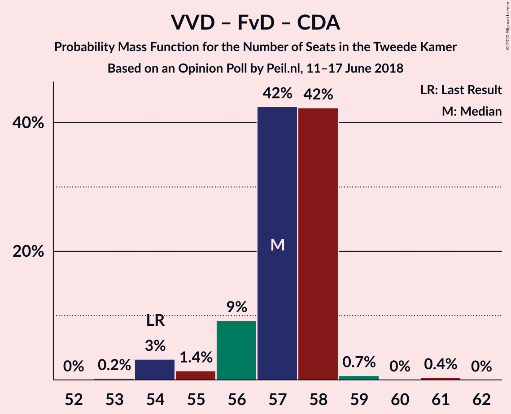
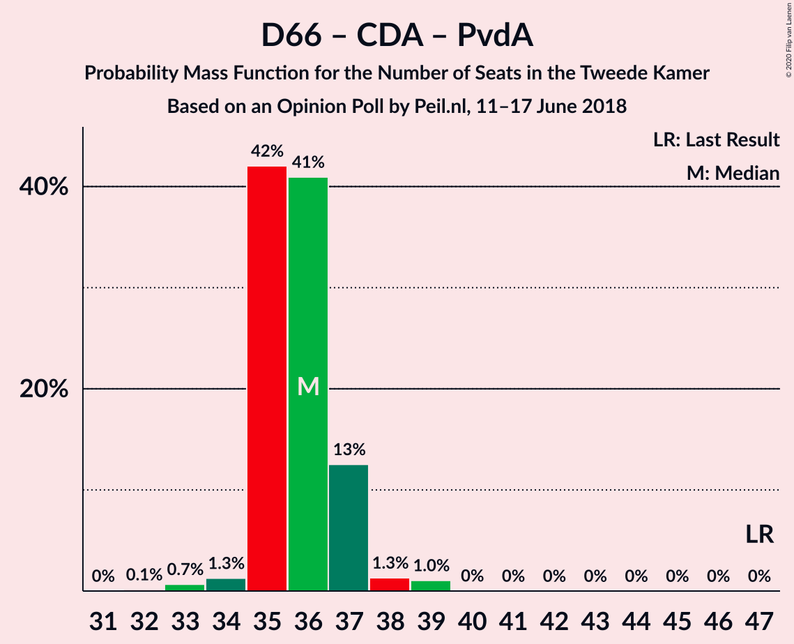

# Opinion Poll by Peil.nl, 11–17 June 2018

<a href="#voting-intentions">Voting Intentions</a> | <a href="#seats">Seats</a> | <a href="#coalitions">Coalitions</a> | <a href="#technical-information">Technical Information</a>

## Voting Intentions

### Confidence Intervals

| Party | Last Result | Poll Result | 80% Confidence Interval | 90% Confidence Interval | 95% Confidence Interval | 99% Confidence Interval |
|:-----:|:-----------:|:-----------:|:-----------------------:|:-----------------------:|:-----------------------:|:-----------------------:|
| Volkspartij voor Vrijheid en Democratie | 21.3% | 18.0% | 17.1–18.9% |16.9–19.2% |16.7–19.4% |16.2–19.9% |
| GroenLinks | 9.1% | 10.7% | 10.0–11.4% |9.8–11.6% |9.6–11.8% |9.3–12.2% |
| Forum voor Democratie | 1.8% | 10.7% | 10.0–11.4% |9.8–11.6% |9.6–11.8% |9.3–12.2% |
| Partij voor de Vrijheid | 13.1% | 9.3% | 8.7–10.1% |8.5–10.3% |8.3–10.4% |8.0–10.8% |
| Democraten 66 | 12.2% | 8.7% | 8.0–9.4% |7.8–9.6% |7.7–9.7% |7.4–10.1% |
| Christen-Democratisch Appèl | 12.4% | 8.0% | 7.4–8.7% |7.2–8.9% |7.1–9.0% |6.8–9.4% |
| Socialistische Partij | 9.1% | 8.0% | 7.4–8.7% |7.2–8.9% |7.1–9.0% |6.8–9.4% |
| Partij van de Arbeid | 5.7% | 7.3% | 6.8–8.0% |6.6–8.2% |6.4–8.3% |6.2–8.6% |
| Partij voor de Dieren | 3.2% | 5.3% | 4.8–5.9% |4.7–6.1% |4.6–6.2% |4.4–6.5% |
| ChristenUnie | 3.4% | 4.0% | 3.6–4.5% |3.4–4.6% |3.4–4.8% |3.2–5.0% |
| 50Plus | 3.1% | 4.0% | 3.6–4.5% |3.4–4.6% |3.4–4.8% |3.2–5.0% |
| DENK | 2.1% | 4.0% | 3.6–4.5% |3.4–4.6% |3.4–4.8% |3.2–5.0% |
| Staatkundig Gereformeerde Partij | 2.1% | 2.0% | 1.7–2.4% |1.6–2.5% |1.6–2.6% |1.4–2.8% |

*Note:* The poll result column reflects the actual value used in the calculations. Published results may vary slightly, and in addition be rounded to fewer digits.

## Seats

### Confidence Intervals

| Party | Last Result | Median | 80% Confidence Interval | 90% Confidence Interval | 95% Confidence Interval | 99% Confidence Interval |
|:-----:|:-----------:|:------:|:-----------------------:|:-----------------------:|:-----------------------:|:-----------------------:|
| <a href="#volkspartij-voor-vrijheid-en-democratie">Volkspartij voor Vrijheid en Democratie</a> | 33 | 28 | 27–28 |26–29 |26–29 |25–31 |
| <a href="#groenlinks">GroenLinks</a> | 14 | 16 | 16–17 |15–18 |15–19 |14–19 |
| <a href="#forum-voor-democratie">Forum voor Democratie</a> | 2 | 17 | 15–17 |15–17 |15–18 |14–19 |
| <a href="#partij-voor-de-vrijheid">Partij voor de Vrijheid</a> | 20 | 14 | 14–15 |14–15 |13–16 |13–17 |
| <a href="#democraten-66">Democraten 66</a> | 19 | 12 | 11–13 |11–13 |11–14 |11–15 |
| <a href="#christen-democratisch-appèl">Christen-Democratisch Appèl</a> | 19 | 13 | 12–13 |12–13 |12–13 |10–14 |
| <a href="#socialistische-partij">Socialistische Partij</a> | 14 | 11 | 10–12 |10–12 |10–13 |10–13 |
| <a href="#partij-van-de-arbeid">Partij van de Arbeid</a> | 9 | 11 | 10–12 |10–13 |10–13 |9–13 |
| <a href="#partij-voor-de-dieren">Partij voor de Dieren</a> | 5 | 8 | 7–9 |7–9 |7–9 |7–9 |
| <a href="#christenunie">ChristenUnie</a> | 5 | 6 | 6–7 |5–7 |5–7 |5–7 |
| <a href="#50plus">50Plus</a> | 4 | 6 | 5–7 |5–7 |5–7 |5–7 |
| <a href="#denk">DENK</a> | 3 | 6 | 5–6 |5–6 |5–6 |4–6 |
| <a href="#staatkundig-gereformeerde-partij">Staatkundig Gereformeerde Partij</a> | 3 | 2 | 2–3 |2–3 |2–3 |2–4 |

### Volkspartij voor Vrijheid en Democratie

*For a full overview of the results for this party, see the [Volkspartij voor Vrijheid en Democratie](party-volkspartijvoorvrijheidendemocratie.html) page.*

| Number of Seats | Probability | Accumulated | Special Marks |
|:---------------:|:-----------:|:-----------:|:-------------:|
| 24 | 0.1% | 100% |  |
| 25 | 0.5% | 99.9% |  |
| 26 | 5% | 99.4% |  |
| 27 | 38% | 94% |  |
| 28 | 47% | 56% | Median |
| 29 | 7% | 9% |  |
| 30 | 0.7% | 2% |  |
| 31 | 1.0% | 1.0% |  |
| 32 | 0% | 0% |  |
| 33 | 0% | 0% | Last Result |

### GroenLinks

*For a full overview of the results for this party, see the [GroenLinks](party-groenlinks.html) page.*

| Number of Seats | Probability | Accumulated | Special Marks |
|:---------------:|:-----------:|:-----------:|:-------------:|
| 14 | 1.1% | 100% | Last Result |
| 15 | 5% | 98.8% |  |
| 16 | 78% | 94% | Median |
| 17 | 9% | 15% |  |
| 18 | 3% | 7% |  |
| 19 | 3% | 3% |  |
| 20 | 0% | 0% |  |

### Forum voor Democratie

*For a full overview of the results for this party, see the [Forum voor Democratie](party-forumvoordemocratie.html) page.*

| Number of Seats | Probability | Accumulated | Special Marks |
|:---------------:|:-----------:|:-----------:|:-------------:|
| 2 | 0% | 100% | Last Result |
| 3 | 0% | 100% |  |
| 4 | 0% | 100% |  |
| 5 | 0% | 100% |  |
| 6 | 0% | 100% |  |
| 7 | 0% | 100% |  |
| 8 | 0% | 100% |  |
| 9 | 0% | 100% |  |
| 10 | 0% | 100% |  |
| 11 | 0% | 100% |  |
| 12 | 0% | 100% |  |
| 13 | 0% | 100% |  |
| 14 | 2% | 100% |  |
| 15 | 9% | 98% |  |
| 16 | 9% | 89% |  |
| 17 | 76% | 80% | Median |
| 18 | 2% | 4% |  |
| 19 | 2% | 2% |  |
| 20 | 0.1% | 0.1% |  |
| 21 | 0% | 0% |  |

### Partij voor de Vrijheid

*For a full overview of the results for this party, see the [Partij voor de Vrijheid](party-partijvoordevrijheid.html) page.*

| Number of Seats | Probability | Accumulated | Special Marks |
|:---------------:|:-----------:|:-----------:|:-------------:|
| 12 | 0.2% | 100% |  |
| 13 | 4% | 99.8% |  |
| 14 | 51% | 96% | Median |
| 15 | 41% | 45% |  |
| 16 | 3% | 4% |  |
| 17 | 1.2% | 1.2% |  |
| 18 | 0% | 0% |  |
| 19 | 0% | 0% |  |
| 20 | 0% | 0% | Last Result |

### Democraten 66

*For a full overview of the results for this party, see the [Democraten 66](party-democraten66.html) page.*

| Number of Seats | Probability | Accumulated | Special Marks |
|:---------------:|:-----------:|:-----------:|:-------------:|
| 11 | 42% | 100% |  |
| 12 | 12% | 58% | Median |
| 13 | 42% | 46% |  |
| 14 | 2% | 4% |  |
| 15 | 2% | 2% |  |
| 16 | 0% | 0% |  |
| 17 | 0% | 0% |  |
| 18 | 0% | 0% |  |
| 19 | 0% | 0% | Last Result |

### Christen-Democratisch Appèl

*For a full overview of the results for this party, see the [Christen-Democratisch Appèl](party-christen-democratischappèl.html) page.*

| Number of Seats | Probability | Accumulated | Special Marks |
|:---------------:|:-----------:|:-----------:|:-------------:|
| 10 | 0.7% | 100% |  |
| 11 | 0.9% | 99.2% |  |
| 12 | 9% | 98% |  |
| 13 | 88% | 90% | Median |
| 14 | 1.3% | 1.3% |  |
| 15 | 0% | 0% |  |
| 16 | 0% | 0% |  |
| 17 | 0% | 0% |  |
| 18 | 0% | 0% |  |
| 19 | 0% | 0% | Last Result |

### Socialistische Partij

*For a full overview of the results for this party, see the [Socialistische Partij](party-socialistischepartij.html) page.*

| Number of Seats | Probability | Accumulated | Special Marks |
|:---------------:|:-----------:|:-----------:|:-------------:|
| 10 | 41% | 100% |  |
| 11 | 18% | 59% | Median |
| 12 | 38% | 41% |  |
| 13 | 2% | 3% |  |
| 14 | 0.3% | 0.3% | Last Result |
| 15 | 0% | 0% |  |

### Partij van de Arbeid

*For a full overview of the results for this party, see the [Partij van de Arbeid](party-partijvandearbeid.html) page.*

| Number of Seats | Probability | Accumulated | Special Marks |
|:---------------:|:-----------:|:-----------:|:-------------:|
| 9 | 2% | 100% | Last Result |
| 10 | 45% | 98% |  |
| 11 | 40% | 53% | Median |
| 12 | 6% | 13% |  |
| 13 | 7% | 7% |  |
| 14 | 0% | 0% |  |

### Partij voor de Dieren

*For a full overview of the results for this party, see the [Partij voor de Dieren](party-partijvoordedieren.html) page.*

| Number of Seats | Probability | Accumulated | Special Marks |
|:---------------:|:-----------:|:-----------:|:-------------:|
| 5 | 0% | 100% | Last Result |
| 6 | 0.2% | 100% |  |
| 7 | 43% | 99.8% |  |
| 8 | 13% | 57% | Median |
| 9 | 44% | 44% |  |
| 10 | 0.1% | 0.1% |  |
| 11 | 0% | 0% |  |

### ChristenUnie

*For a full overview of the results for this party, see the [ChristenUnie](party-christenunie.html) page.*

| Number of Seats | Probability | Accumulated | Special Marks |
|:---------------:|:-----------:|:-----------:|:-------------:|
| 4 | 0.4% | 100% |  |
| 5 | 7% | 99.6% | Last Result |
| 6 | 52% | 92% | Median |
| 7 | 40% | 41% |  |
| 8 | 0.1% | 0.1% |  |
| 9 | 0% | 0% |  |

### 50Plus

*For a full overview of the results for this party, see the [50Plus](party-50plus.html) page.*

| Number of Seats | Probability | Accumulated | Special Marks |
|:---------------:|:-----------:|:-----------:|:-------------:|
| 4 | 0.1% | 100% | Last Result |
| 5 | 44% | 99.9% |  |
| 6 | 18% | 56% | Median |
| 7 | 38% | 38% |  |
| 8 | 0.3% | 0.3% |  |
| 9 | 0% | 0% |  |

### DENK

*For a full overview of the results for this party, see the [DENK](party-denk.html) page.*

| Number of Seats | Probability | Accumulated | Special Marks |
|:---------------:|:-----------:|:-----------:|:-------------:|
| 3 | 0% | 100% | Last Result |
| 4 | 1.1% | 100% |  |
| 5 | 12% | 98.9% |  |
| 6 | 86% | 87% | Median |
| 7 | 0.4% | 0.4% |  |
| 8 | 0% | 0% |  |

### Staatkundig Gereformeerde Partij

*For a full overview of the results for this party, see the [Staatkundig Gereformeerde Partij](party-staatkundiggereformeerdepartij.html) page.*

| Number of Seats | Probability | Accumulated | Special Marks |
|:---------------:|:-----------:|:-----------:|:-------------:|
| 2 | 88% | 100% | Median |
| 3 | 11% | 12% | Last Result |
| 4 | 1.3% | 1.3% |  |
| 5 | 0% | 0% |  |

## Coalitions

### Confidence Intervals

| Coalition | Last Result | Median | Majority? | 80% Confidence Interval | 90% Confidence Interval | 95% Confidence Interval | 99% Confidence Interval |
|:---------:|:-----------:|:------:|:---------:|:-----------------------:|:-----------------------:|:-----------------------:|:-----------------------:|
| Volkspartij voor Vrijheid en Democratie – GroenLinks – Democraten 66 – Christen-Democratisch Appèl – ChristenUnie | 90 | 75 | 48% | 73–77 | 73–77 | 73–77 | 71–78 |
| Volkspartij voor Vrijheid en Democratie – Forum voor Democratie – Partij voor de Vrijheid – Christen-Democratisch Appèl – Staatkundig Gereformeerde Partij | 77 | 74 | 5% | 72–74 | 72–76 | 72–76 | 70–77 |
| Volkspartij voor Vrijheid en Democratie – Forum voor Democratie – Partij voor de Vrijheid – Christen-Democratisch Appèl | 74 | 72 | 0% | 70–72 | 70–72 | 69–74 | 68–74 |
| Volkspartij voor Vrijheid en Democratie – Democraten 66 – Christen-Democratisch Appèl – Partij van de Arbeid – ChristenUnie | 85 | 70 | 0% | 68–71 | 68–71 | 68–72 | 67–73 |
| GroenLinks – Democraten 66 – Christen-Democratisch Appèl – Socialistische Partij – Partij van de Arbeid – ChristenUnie | 80 | 69 | 0% | 69–71 | 68–71 | 67–72 | 66–72 |
| Volkspartij voor Vrijheid en Democratie – Forum voor Democratie – Christen-Democratisch Appèl – 50Plus – Staatkundig Gereformeerde Partij | 61 | 65 | 0% | 64–66 | 64–67 | 62–67 | 61–69 |
| Volkspartij voor Vrijheid en Democratie – Forum voor Democratie – Christen-Democratisch Appèl – 50Plus | 58 | 63 | 0% | 62–64 | 62–64 | 59–64 | 59–66 |
| Volkspartij voor Vrijheid en Democratie – Democraten 66 – Christen-Democratisch Appèl – ChristenUnie | 76 | 58 | 0% | 57–61 | 57–61 | 57–61 | 56–62 |
| Volkspartij voor Vrijheid en Democratie – Forum voor Democratie – Christen-Democratisch Appèl – Staatkundig Gereformeerde Partij | 57 | 59 | 0% | 58–60 | 58–60 | 57–61 | 56–62 |
| GroenLinks – Democraten 66 – Christen-Democratisch Appèl – Partij van de Arbeid – ChristenUnie | 66 | 59 | 0% | 57–60 | 57–60 | 56–61 | 55–62 |
| Volkspartij voor Vrijheid en Democratie – Forum voor Democratie – Christen-Democratisch Appèl | 54 | 57 | 0% | 56–58 | 56–58 | 54–58 | 54–59 |
| Volkspartij voor Vrijheid en Democratie – Partij voor de Vrijheid – Christen-Democratisch Appèl | 72 | 55 | 0% | 55 | 53–56 | 52–57 | 52–59 |
| Volkspartij voor Vrijheid en Democratie – Democraten 66 – Christen-Democratisch Appèl | 71 | 53 | 0% | 51–54 | 51–54 | 51–54 | 50–56 |
| Volkspartij voor Vrijheid en Democratie – Christen-Democratisch Appèl – Partij van de Arbeid | 61 | 51 | 0% | 51–53 | 49–54 | 49–54 | 48–54 |
| Volkspartij voor Vrijheid en Democratie – Democraten 66 – Partij van de Arbeid | 61 | 51 | 0% | 49–52 | 49–53 | 49–53 | 48–54 |
| Volkspartij voor Vrijheid en Democratie – Christen-Democratisch Appèl | 52 | 41 | 0% | 40–41 | 39–42 | 38–42 | 38–43 |
| Volkspartij voor Vrijheid en Democratie – Partij van de Arbeid | 42 | 38 | 0% | 38–40 | 37–41 | 36–41 | 36–41 |
| Democraten 66 – Christen-Democratisch Appèl – Partij van de Arbeid | 47 | 36 | 0% | 35–37 | 35–37 | 35–37 | 33–39 |
| Christen-Democratisch Appèl – Partij van de Arbeid – ChristenUnie | 33 | 30 | 0% | 29–31 | 28–32 | 27–32 | 26–32 |
| Democraten 66 – Christen-Democratisch Appèl | 38 | 25 | 0% | 24–26 | 24–26 | 24–27 | 23–28 |
| Christen-Democratisch Appèl – Partij van de Arbeid | 28 | 23 | 0% | 23–25 | 22–26 | 22–26 | 21–26 |

### Volkspartij voor Vrijheid en Democratie – GroenLinks – Democraten 66 – Christen-Democratisch Appèl – ChristenUnie

| Number of Seats | Probability | Accumulated | Special Marks |
|:---------------:|:-----------:|:-----------:|:-------------:|
| 71 | 0.7% | 100% |  |
| 72 | 0.9% | 99.3% |  |
| 73 | 37% | 98% |  |
| 74 | 2% | 61% |  |
| 75 | 12% | 59% | Median |
| 76 | 3% | 48% | Majority |
| 77 | 44% | 45% |  |
| 78 | 0.3% | 0.5% |  |
| 79 | 0.2% | 0.2% |  |
| 80 | 0% | 0% |  |
| 81 | 0% | 0% |  |
| 82 | 0% | 0% |  |
| 83 | 0% | 0% |  |
| 84 | 0% | 0% |  |
| 85 | 0% | 0% |  |
| 86 | 0% | 0% |  |
| 87 | 0% | 0% |  |
| 88 | 0% | 0% |  |
| 89 | 0% | 0% |  |
| 90 | 0% | 0% | Last Result |

### Volkspartij voor Vrijheid en Democratie – Forum voor Democratie – Partij voor de Vrijheid – Christen-Democratisch Appèl – Staatkundig Gereformeerde Partij

| Number of Seats | Probability | Accumulated | Special Marks |
|:---------------:|:-----------:|:-----------:|:-------------:|
| 69 | 0% | 100% |  |
| 70 | 0.5% | 99.9% |  |
| 71 | 2% | 99.4% |  |
| 72 | 9% | 98% |  |
| 73 | 6% | 89% |  |
| 74 | 77% | 83% | Median |
| 75 | 0.9% | 6% |  |
| 76 | 4% | 5% | Majority |
| 77 | 1.1% | 1.4% | Last Result |
| 78 | 0.3% | 0.3% |  |
| 79 | 0% | 0% |  |

### Volkspartij voor Vrijheid en Democratie – Forum voor Democratie – Partij voor de Vrijheid – Christen-Democratisch Appèl

| Number of Seats | Probability | Accumulated | Special Marks |
|:---------------:|:-----------:|:-----------:|:-------------:|
| 66 | 0.1% | 100% |  |
| 67 | 0.1% | 99.9% |  |
| 68 | 2% | 99.8% |  |
| 69 | 0.6% | 98% |  |
| 70 | 10% | 97% |  |
| 71 | 7% | 87% |  |
| 72 | 75% | 80% | Median |
| 73 | 2% | 4% |  |
| 74 | 2% | 3% | Last Result |
| 75 | 0.3% | 0.3% |  |
| 76 | 0% | 0% | Majority |

### Volkspartij voor Vrijheid en Democratie – Democraten 66 – Christen-Democratisch Appèl – Partij van de Arbeid – ChristenUnie

| Number of Seats | Probability | Accumulated | Special Marks |
|:---------------:|:-----------:|:-----------:|:-------------:|
| 65 | 0% | 100% |  |
| 66 | 0.4% | 99.9% |  |
| 67 | 2% | 99.5% |  |
| 68 | 37% | 98% |  |
| 69 | 8% | 61% |  |
| 70 | 3% | 53% | Median |
| 71 | 46% | 50% |  |
| 72 | 3% | 4% |  |
| 73 | 0.3% | 0.6% |  |
| 74 | 0.2% | 0.3% |  |
| 75 | 0.1% | 0.1% |  |
| 76 | 0% | 0% | Majority |
| 77 | 0% | 0% |  |
| 78 | 0% | 0% |  |
| 79 | 0% | 0% |  |
| 80 | 0% | 0% |  |
| 81 | 0% | 0% |  |
| 82 | 0% | 0% |  |
| 83 | 0% | 0% |  |
| 84 | 0% | 0% |  |
| 85 | 0% | 0% | Last Result |

### GroenLinks – Democraten 66 – Christen-Democratisch Appèl – Socialistische Partij – Partij van de Arbeid – ChristenUnie

| Number of Seats | Probability | Accumulated | Special Marks |
|:---------------:|:-----------:|:-----------:|:-------------:|
| 66 | 2% | 100% |  |
| 67 | 0.4% | 98% |  |
| 68 | 2% | 97% |  |
| 69 | 77% | 95% | Median |
| 70 | 6% | 18% |  |
| 71 | 8% | 12% |  |
| 72 | 3% | 4% |  |
| 73 | 0.2% | 0.4% |  |
| 74 | 0.1% | 0.2% |  |
| 75 | 0.1% | 0.1% |  |
| 76 | 0% | 0% | Majority |
| 77 | 0% | 0% |  |
| 78 | 0% | 0% |  |
| 79 | 0% | 0% |  |
| 80 | 0% | 0% | Last Result |

### Volkspartij voor Vrijheid en Democratie – Forum voor Democratie – Christen-Democratisch Appèl – 50Plus – Staatkundig Gereformeerde Partij

| Number of Seats | Probability | Accumulated | Special Marks |
|:---------------:|:-----------:|:-----------:|:-------------:|
| 61 | 1.2% | 100% | Last Result |
| 62 | 2% | 98.8% |  |
| 63 | 1.1% | 97% |  |
| 64 | 11% | 96% |  |
| 65 | 40% | 85% |  |
| 66 | 40% | 45% | Median |
| 67 | 3% | 5% |  |
| 68 | 1.2% | 2% |  |
| 69 | 0.2% | 0.5% |  |
| 70 | 0.4% | 0.4% |  |
| 71 | 0% | 0% |  |

### Volkspartij voor Vrijheid en Democratie – Forum voor Democratie – Christen-Democratisch Appèl – 50Plus

| Number of Seats | Probability | Accumulated | Special Marks |
|:---------------:|:-----------:|:-----------:|:-------------:|
| 58 | 0% | 100% | Last Result |
| 59 | 3% | 100% |  |
| 60 | 0.7% | 97% |  |
| 61 | 1.2% | 97% |  |
| 62 | 11% | 95% |  |
| 63 | 44% | 85% |  |
| 64 | 40% | 41% | Median |
| 65 | 0.2% | 0.8% |  |
| 66 | 0.2% | 0.6% |  |
| 67 | 0.3% | 0.4% |  |
| 68 | 0.1% | 0.1% |  |
| 69 | 0% | 0% |  |

### Volkspartij voor Vrijheid en Democratie – Democraten 66 – Christen-Democratisch Appèl – ChristenUnie

| Number of Seats | Probability | Accumulated | Special Marks |
|:---------------:|:-----------:|:-----------:|:-------------:|
| 54 | 0.3% | 100% |  |
| 55 | 0% | 99.7% |  |
| 56 | 1.2% | 99.7% |  |
| 57 | 37% | 98% |  |
| 58 | 13% | 62% |  |
| 59 | 3% | 48% | Median |
| 60 | 5% | 45% |  |
| 61 | 39% | 40% |  |
| 62 | 0.2% | 0.5% |  |
| 63 | 0.2% | 0.3% |  |
| 64 | 0.1% | 0.1% |  |
| 65 | 0% | 0% |  |
| 66 | 0% | 0% |  |
| 67 | 0% | 0% |  |
| 68 | 0% | 0% |  |
| 69 | 0% | 0% |  |
| 70 | 0% | 0% |  |
| 71 | 0% | 0% |  |
| 72 | 0% | 0% |  |
| 73 | 0% | 0% |  |
| 74 | 0% | 0% |  |
| 75 | 0% | 0% |  |
| 76 | 0% | 0% | Last Result, Majority |

### Volkspartij voor Vrijheid en Democratie – Forum voor Democratie – Christen-Democratisch Appèl – Staatkundig Gereformeerde Partij

| Number of Seats | Probability | Accumulated | Special Marks |
|:---------------:|:-----------:|:-----------:|:-------------:|
| 55 | 0.1% | 100% |  |
| 56 | 1.5% | 99.9% |  |
| 57 | 3% | 98% | Last Result |
| 58 | 9% | 95% |  |
| 59 | 37% | 86% |  |
| 60 | 45% | 50% | Median |
| 61 | 4% | 4% |  |
| 62 | 0.5% | 0.9% |  |
| 63 | 0.1% | 0.4% |  |
| 64 | 0.3% | 0.3% |  |
| 65 | 0% | 0% |  |

### GroenLinks – Democraten 66 – Christen-Democratisch Appèl – Partij van de Arbeid – ChristenUnie

| Number of Seats | Probability | Accumulated | Special Marks |
|:---------------:|:-----------:|:-----------:|:-------------:|
| 54 | 0.4% | 100% |  |
| 55 | 1.1% | 99.6% |  |
| 56 | 2% | 98% |  |
| 57 | 38% | 96% |  |
| 58 | 4% | 58% | Median |
| 59 | 43% | 54% |  |
| 60 | 8% | 11% |  |
| 61 | 2% | 3% |  |
| 62 | 1.2% | 1.3% |  |
| 63 | 0.1% | 0.1% |  |
| 64 | 0% | 0% |  |
| 65 | 0% | 0% |  |
| 66 | 0% | 0% | Last Result |

### Volkspartij voor Vrijheid en Democratie – Forum voor Democratie – Christen-Democratisch Appèl

| Number of Seats | Probability | Accumulated | Special Marks |
|:---------------:|:-----------:|:-----------:|:-------------:|
| 53 | 0.2% | 100% |  |
| 54 | 3% | 99.7% | Last Result |
| 55 | 1.4% | 97% |  |
| 56 | 9% | 95% |  |
| 57 | 42% | 86% |  |
| 58 | 42% | 43% | Median |
| 59 | 0.7% | 1.1% |  |
| 60 | 0% | 0.4% |  |
| 61 | 0.4% | 0.4% |  |
| 62 | 0% | 0% |  |

### Volkspartij voor Vrijheid en Democratie – Partij voor de Vrijheid – Christen-Democratisch Appèl

| Number of Seats | Probability | Accumulated | Special Marks |
|:---------------:|:-----------:|:-----------:|:-------------:|
| 51 | 0.4% | 100% |  |
| 52 | 3% | 99.5% |  |
| 53 | 2% | 96% |  |
| 54 | 4% | 95% |  |
| 55 | 84% | 91% | Median |
| 56 | 2% | 7% |  |
| 57 | 3% | 5% |  |
| 58 | 1.1% | 2% |  |
| 59 | 0.7% | 0.7% |  |
| 60 | 0% | 0% |  |
| 61 | 0% | 0% |  |
| 62 | 0% | 0% |  |
| 63 | 0% | 0% |  |
| 64 | 0% | 0% |  |
| 65 | 0% | 0% |  |
| 66 | 0% | 0% |  |
| 67 | 0% | 0% |  |
| 68 | 0% | 0% |  |
| 69 | 0% | 0% |  |
| 70 | 0% | 0% |  |
| 71 | 0% | 0% |  |
| 72 | 0% | 0% | Last Result |

### Volkspartij voor Vrijheid en Democratie – Democraten 66 – Christen-Democratisch Appèl

| Number of Seats | Probability | Accumulated | Special Marks |
|:---------------:|:-----------:|:-----------:|:-------------:|
| 49 | 0.3% | 100% |  |
| 50 | 1.0% | 99.7% |  |
| 51 | 38% | 98.7% |  |
| 52 | 8% | 61% |  |
| 53 | 8% | 53% | Median |
| 54 | 43% | 45% |  |
| 55 | 1.3% | 2% |  |
| 56 | 0.6% | 0.8% |  |
| 57 | 0.2% | 0.3% |  |
| 58 | 0.1% | 0.1% |  |
| 59 | 0% | 0% |  |
| 60 | 0% | 0% |  |
| 61 | 0% | 0% |  |
| 62 | 0% | 0% |  |
| 63 | 0% | 0% |  |
| 64 | 0% | 0% |  |
| 65 | 0% | 0% |  |
| 66 | 0% | 0% |  |
| 67 | 0% | 0% |  |
| 68 | 0% | 0% |  |
| 69 | 0% | 0% |  |
| 70 | 0% | 0% |  |
| 71 | 0% | 0% | Last Result |

### Volkspartij voor Vrijheid en Democratie – Christen-Democratisch Appèl – Partij van de Arbeid

| Number of Seats | Probability | Accumulated | Special Marks |
|:---------------:|:-----------:|:-----------:|:-------------:|
| 47 | 0.2% | 100% |  |
| 48 | 1.4% | 99.8% |  |
| 49 | 4% | 98% |  |
| 50 | 2% | 95% |  |
| 51 | 77% | 93% |  |
| 52 | 6% | 16% | Median |
| 53 | 2% | 10% |  |
| 54 | 8% | 9% |  |
| 55 | 0.3% | 0.3% |  |
| 56 | 0% | 0% |  |
| 57 | 0% | 0% |  |
| 58 | 0% | 0% |  |
| 59 | 0% | 0% |  |
| 60 | 0% | 0% |  |
| 61 | 0% | 0% | Last Result |

### Volkspartij voor Vrijheid en Democratie – Democraten 66 – Partij van de Arbeid

| Number of Seats | Probability | Accumulated | Special Marks |
|:---------------:|:-----------:|:-----------:|:-------------:|
| 48 | 2% | 100% |  |
| 49 | 36% | 98% |  |
| 50 | 3% | 62% |  |
| 51 | 43% | 59% | Median |
| 52 | 12% | 17% |  |
| 53 | 3% | 5% |  |
| 54 | 1.4% | 2% |  |
| 55 | 0.2% | 0.4% |  |
| 56 | 0.2% | 0.2% |  |
| 57 | 0% | 0% |  |
| 58 | 0% | 0% |  |
| 59 | 0% | 0% |  |
| 60 | 0% | 0% |  |
| 61 | 0% | 0% | Last Result |

### Volkspartij voor Vrijheid en Democratie – Christen-Democratisch Appèl

| Number of Seats | Probability | Accumulated | Special Marks |
|:---------------:|:-----------:|:-----------:|:-------------:|
| 37 | 0.4% | 100% |  |
| 38 | 3% | 99.6% |  |
| 39 | 4% | 96% |  |
| 40 | 37% | 92% |  |
| 41 | 50% | 55% | Median |
| 42 | 4% | 5% |  |
| 43 | 0.9% | 1.1% |  |
| 44 | 0.2% | 0.2% |  |
| 45 | 0% | 0% |  |
| 46 | 0% | 0% |  |
| 47 | 0% | 0% |  |
| 48 | 0% | 0% |  |
| 49 | 0% | 0% |  |
| 50 | 0% | 0% |  |
| 51 | 0% | 0% |  |
| 52 | 0% | 0% | Last Result |

### Volkspartij voor Vrijheid en Democratie – Partij van de Arbeid

| Number of Seats | Probability | Accumulated | Special Marks |
|:---------------:|:-----------:|:-----------:|:-------------:|
| 35 | 0.1% | 100% |  |
| 36 | 4% | 99.8% |  |
| 37 | 1.5% | 96% |  |
| 38 | 76% | 94% |  |
| 39 | 4% | 19% | Median |
| 40 | 5% | 14% |  |
| 41 | 9% | 10% |  |
| 42 | 0.3% | 0.4% | Last Result |
| 43 | 0% | 0% |  |

### Democraten 66 – Christen-Democratisch Appèl – Partij van de Arbeid

| Number of Seats | Probability | Accumulated | Special Marks |
|:---------------:|:-----------:|:-----------:|:-------------:|
| 32 | 0.1% | 100% |  |
| 33 | 0.7% | 99.8% |  |
| 34 | 1.3% | 99.2% |  |
| 35 | 42% | 98% |  |
| 36 | 41% | 56% | Median |
| 37 | 13% | 15% |  |
| 38 | 1.3% | 2% |  |
| 39 | 1.0% | 1.1% |  |
| 40 | 0% | 0% |  |
| 41 | 0% | 0% |  |
| 42 | 0% | 0% |  |
| 43 | 0% | 0% |  |
| 44 | 0% | 0% |  |
| 45 | 0% | 0% |  |
| 46 | 0% | 0% |  |
| 47 | 0% | 0% | Last Result |

### Christen-Democratisch Appèl – Partij van de Arbeid – ChristenUnie

| Number of Seats | Probability | Accumulated | Special Marks |
|:---------------:|:-----------:|:-----------:|:-------------:|
| 25 | 0.1% | 100% |  |
| 26 | 0.8% | 99.9% |  |
| 27 | 2% | 99.1% |  |
| 28 | 7% | 97% |  |
| 29 | 3% | 91% |  |
| 30 | 75% | 87% | Median |
| 31 | 4% | 12% |  |
| 32 | 8% | 8% |  |
| 33 | 0% | 0% | Last Result |

### Democraten 66 – Christen-Democratisch Appèl

| Number of Seats | Probability | Accumulated | Special Marks |
|:---------------:|:-----------:|:-----------:|:-------------:|
| 22 | 0.2% | 100% |  |
| 23 | 0.6% | 99.8% |  |
| 24 | 47% | 99.1% |  |
| 25 | 8% | 52% | Median |
| 26 | 40% | 44% |  |
| 27 | 3% | 4% |  |
| 28 | 0.6% | 0.6% |  |
| 29 | 0% | 0% |  |
| 30 | 0% | 0% |  |
| 31 | 0% | 0% |  |
| 32 | 0% | 0% |  |
| 33 | 0% | 0% |  |
| 34 | 0% | 0% |  |
| 35 | 0% | 0% |  |
| 36 | 0% | 0% |  |
| 37 | 0% | 0% |  |
| 38 | 0% | 0% | Last Result |

### Christen-Democratisch Appèl – Partij van de Arbeid

| Number of Seats | Probability | Accumulated | Special Marks |
|:---------------:|:-----------:|:-----------:|:-------------:|
| 19 | 0.1% | 100% |  |
| 20 | 0.2% | 99.9% |  |
| 21 | 1.1% | 99.7% |  |
| 22 | 4% | 98.6% |  |
| 23 | 45% | 95% |  |
| 24 | 38% | 49% | Median |
| 25 | 5% | 11% |  |
| 26 | 7% | 7% |  |
| 27 | 0% | 0% |  |
| 28 | 0% | 0% | Last Result |

## Technical Information

### Opinion Poll

+ **Polling firm:** Peil.nl
+ **Commissioner(s):** —
+ **Fieldwork period:** 11–17 June 2018

### Calculations

+ **Sample size:** 3000
+ **Simulations done:** 1,048,576
+ **Error estimate:** 1.92%

