# Opinion Poll by Peil.nl, 18–24 June 2018

<a href="#voting-intentions">Voting Intentions</a> | <a href="#seats">Seats</a> | <a href="#coalitions">Coalitions</a> | <a href="#technical-information">Technical Information</a>

## Voting Intentions

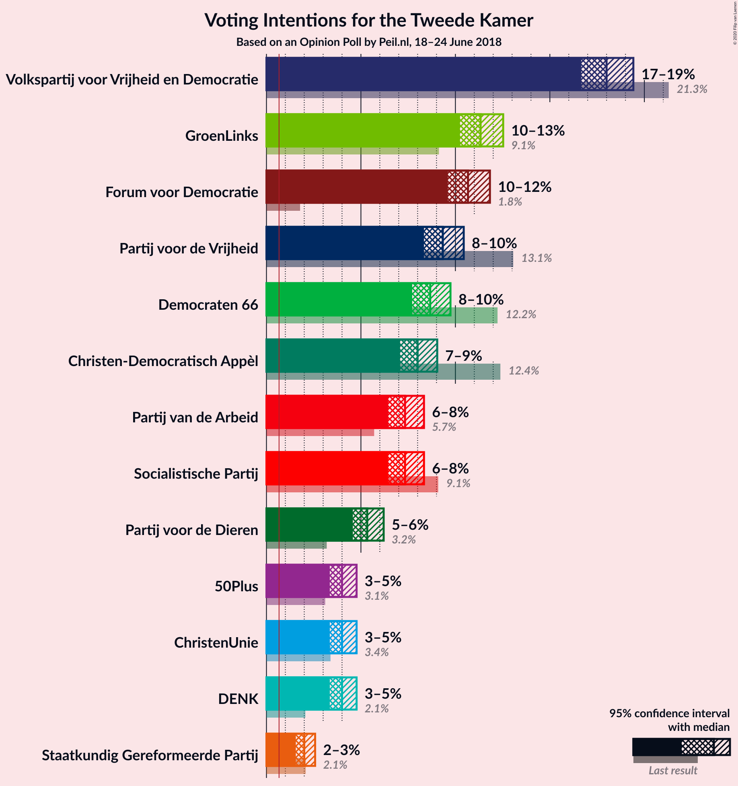

### Confidence Intervals

| Party | Last Result | Poll Result | 80% Confidence Interval | 90% Confidence Interval | 95% Confidence Interval | 99% Confidence Interval |
|:-----:|:-----------:|:-----------:|:-----------------------:|:-----------------------:|:-----------------------:|:-----------------------:|
| Volkspartij voor Vrijheid en Democratie | 21.3% | 18.0% | 17.1–18.9% |16.9–19.2% |16.7–19.4% |16.2–19.9% |
| GroenLinks | 9.1% | 11.3% | 10.6–12.1% |10.4–12.3% |10.2–12.5% |9.9–12.9% |
| Forum voor Democratie | 1.8% | 10.7% | 10.0–11.4% |9.8–11.6% |9.6–11.8% |9.3–12.2% |
| Partij voor de Vrijheid | 13.1% | 9.3% | 8.7–10.1% |8.5–10.3% |8.3–10.4% |8.0–10.8% |
| Democraten 66 | 12.2% | 8.7% | 8.0–9.4% |7.8–9.6% |7.7–9.7% |7.4–10.1% |
| Christen-Democratisch Appèl | 12.4% | 8.0% | 7.4–8.7% |7.2–8.9% |7.1–9.0% |6.8–9.4% |
| Socialistische Partij | 9.1% | 7.3% | 6.8–8.0% |6.6–8.2% |6.4–8.3% |6.2–8.6% |
| Partij van de Arbeid | 5.7% | 7.3% | 6.8–8.0% |6.6–8.2% |6.4–8.3% |6.2–8.6% |
| Partij voor de Dieren | 3.2% | 5.3% | 4.8–5.9% |4.7–6.1% |4.6–6.2% |4.4–6.5% |
| ChristenUnie | 3.4% | 4.0% | 3.6–4.5% |3.4–4.6% |3.4–4.8% |3.2–5.0% |
| 50Plus | 3.1% | 4.0% | 3.6–4.5% |3.4–4.6% |3.4–4.8% |3.2–5.0% |
| DENK | 2.1% | 4.0% | 3.6–4.5% |3.4–4.6% |3.4–4.8% |3.2–5.0% |
| Staatkundig Gereformeerde Partij | 2.1% | 2.0% | 1.7–2.4% |1.6–2.5% |1.6–2.6% |1.4–2.8% |

*Note:* The poll result column reflects the actual value used in the calculations. Published results may vary slightly, and in addition be rounded to fewer digits.

## Seats

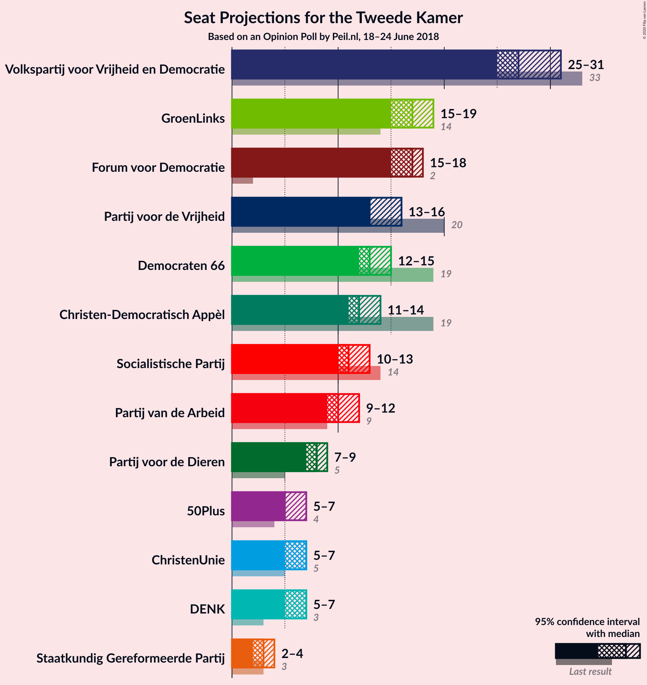

### Confidence Intervals

| Party | Last Result | Median | 80% Confidence Interval | 90% Confidence Interval | 95% Confidence Interval | 99% Confidence Interval |
|:-----:|:-----------:|:------:|:-----------------------:|:-----------------------:|:-----------------------:|:-----------------------:|
| <a href="#volkspartij-voor-vrijheid-en-democratie">Volkspartij voor Vrijheid en Democratie</a> | 33 | 27 | 27–31 |26–31 |25–31 |24–31 |
| <a href="#groenlinks">GroenLinks</a> | 14 | 17 | 15–18 |15–19 |15–19 |15–20 |
| <a href="#forum-voor-democratie">Forum voor Democratie</a> | 2 | 17 | 15–18 |15–18 |15–18 |14–18 |
| <a href="#partij-voor-de-vrijheid">Partij voor de Vrijheid</a> | 20 | 13 | 13–15 |13–15 |13–16 |12–16 |
| <a href="#democraten-66">Democraten 66</a> | 19 | 13 | 13 |12–15 |12–15 |11–15 |
| <a href="#christen-democratisch-appèl">Christen-Democratisch Appèl</a> | 19 | 12 | 12–13 |11–13 |11–14 |10–14 |
| <a href="#socialistische-partij">Socialistische Partij</a> | 14 | 11 | 10–13 |10–13 |10–13 |9–13 |
| <a href="#partij-van-de-arbeid">Partij van de Arbeid</a> | 9 | 10 | 9–11 |9–12 |9–12 |9–12 |
| <a href="#partij-voor-de-dieren">Partij voor de Dieren</a> | 5 | 8 | 7–8 |7–8 |7–9 |6–9 |
| <a href="#christenunie">ChristenUnie</a> | 5 | 7 | 5–7 |5–7 |5–7 |4–7 |
| <a href="#50plus">50Plus</a> | 4 | 5 | 5–6 |5–6 |5–7 |4–7 |
| <a href="#denk">DENK</a> | 3 | 7 | 5–7 |5–7 |5–7 |5–7 |
| <a href="#staatkundig-gereformeerde-partij">Staatkundig Gereformeerde Partij</a> | 3 | 3 | 3 |2–3 |2–4 |2–4 |

### Volkspartij voor Vrijheid en Democratie

*For a full overview of the results for this party, see the [Volkspartij voor Vrijheid en Democratie](party-volkspartijvoorvrijheidendemocratie.html) page.*

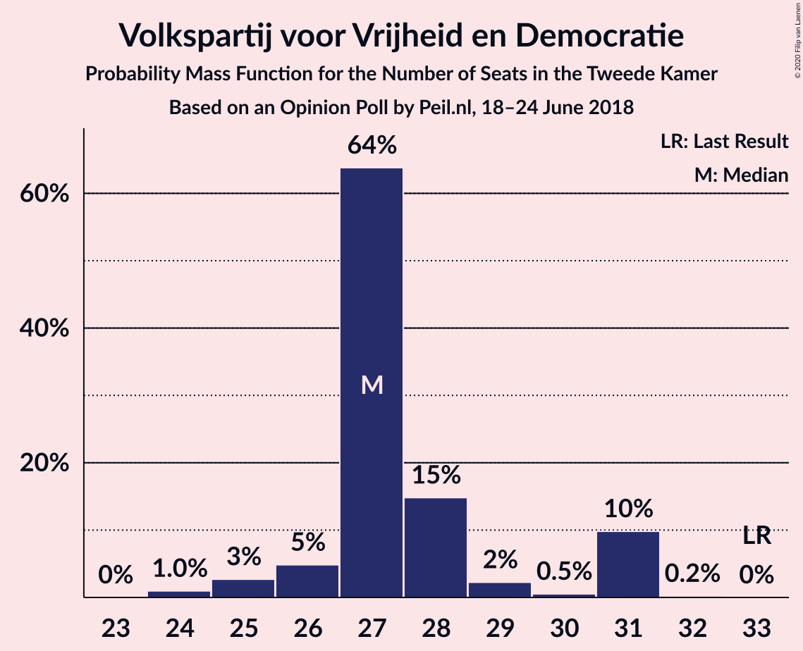

| Number of Seats | Probability | Accumulated | Special Marks |
|:---------------:|:-----------:|:-----------:|:-------------:|
| 24 | 1.0% | 100% |  |
| 25 | 3% | 99.0% |  |
| 26 | 5% | 96% |  |
| 27 | 64% | 91% | Median |
| 28 | 15% | 28% |  |
| 29 | 2% | 13% |  |
| 30 | 0.5% | 11% |  |
| 31 | 10% | 10% |  |
| 32 | 0.2% | 0.2% |  |
| 33 | 0% | 0% | Last Result |

### GroenLinks

*For a full overview of the results for this party, see the [GroenLinks](party-groenlinks.html) page.*

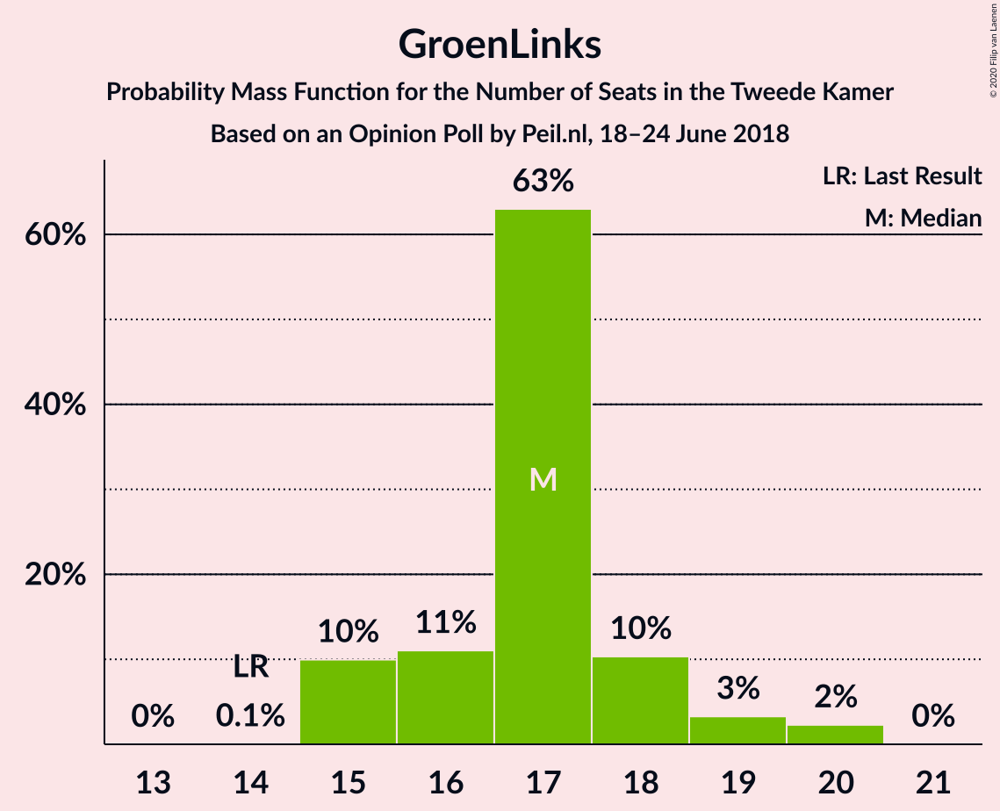

| Number of Seats | Probability | Accumulated | Special Marks |
|:---------------:|:-----------:|:-----------:|:-------------:|
| 14 | 0.1% | 100% | Last Result |
| 15 | 10% | 99.9% |  |
| 16 | 11% | 90% |  |
| 17 | 63% | 79% | Median |
| 18 | 10% | 16% |  |
| 19 | 3% | 6% |  |
| 20 | 2% | 2% |  |
| 21 | 0% | 0% |  |

### Forum voor Democratie

*For a full overview of the results for this party, see the [Forum voor Democratie](party-forumvoordemocratie.html) page.*

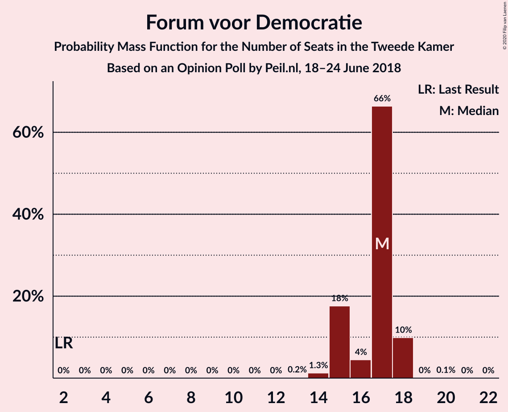

| Number of Seats | Probability | Accumulated | Special Marks |
|:---------------:|:-----------:|:-----------:|:-------------:|
| 2 | 0% | 100% | Last Result |
| 3 | 0% | 100% |  |
| 4 | 0% | 100% |  |
| 5 | 0% | 100% |  |
| 6 | 0% | 100% |  |
| 7 | 0% | 100% |  |
| 8 | 0% | 100% |  |
| 9 | 0% | 100% |  |
| 10 | 0% | 100% |  |
| 11 | 0% | 100% |  |
| 12 | 0% | 100% |  |
| 13 | 0.2% | 100% |  |
| 14 | 1.3% | 99.8% |  |
| 15 | 18% | 98.5% |  |
| 16 | 4% | 81% |  |
| 17 | 66% | 76% | Median |
| 18 | 10% | 10% |  |
| 19 | 0% | 0.1% |  |
| 20 | 0.1% | 0.1% |  |
| 21 | 0% | 0% |  |

### Partij voor de Vrijheid

*For a full overview of the results for this party, see the [Partij voor de Vrijheid](party-partijvoordevrijheid.html) page.*

| Number of Seats | Probability | Accumulated | Special Marks |
|:---------------:|:-----------:|:-----------:|:-------------:|
| 12 | 0.7% | 100% |  |
| 13 | 71% | 99.3% | Median |
| 14 | 8% | 29% |  |
| 15 | 16% | 21% |  |
| 16 | 4% | 4% |  |
| 17 | 0.4% | 0.4% |  |
| 18 | 0% | 0% |  |
| 19 | 0% | 0% |  |
| 20 | 0% | 0% | Last Result |

### Democraten 66

*For a full overview of the results for this party, see the [Democraten 66](party-democraten66.html) page.*

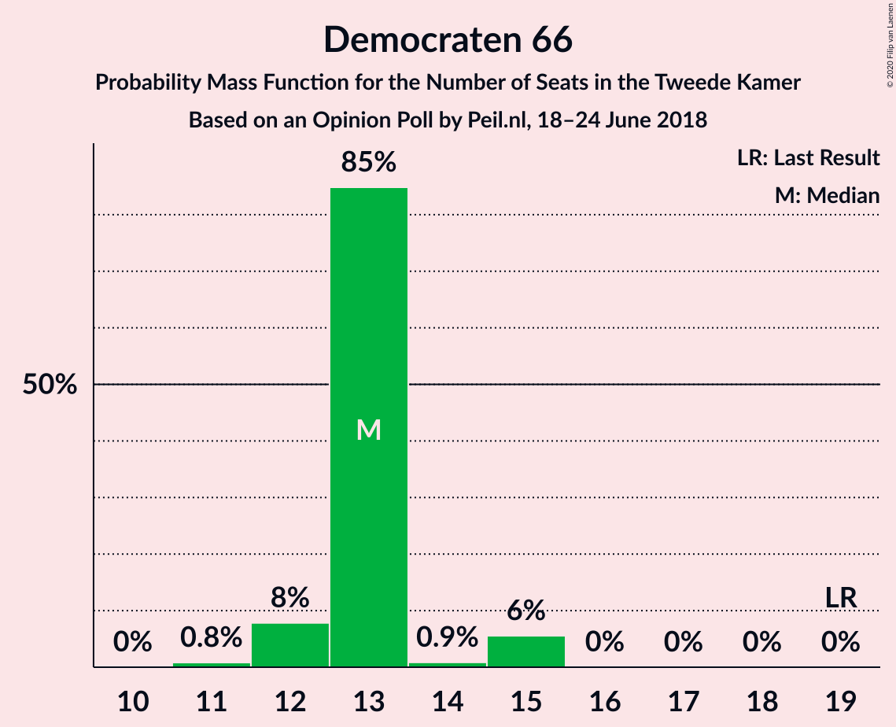

| Number of Seats | Probability | Accumulated | Special Marks |
|:---------------:|:-----------:|:-----------:|:-------------:|
| 11 | 0.8% | 100% |  |
| 12 | 8% | 99.1% |  |
| 13 | 85% | 91% | Median |
| 14 | 0.9% | 6% |  |
| 15 | 6% | 6% |  |
| 16 | 0% | 0% |  |
| 17 | 0% | 0% |  |
| 18 | 0% | 0% |  |
| 19 | 0% | 0% | Last Result |

### Christen-Democratisch Appèl

*For a full overview of the results for this party, see the [Christen-Democratisch Appèl](party-christen-democratischappèl.html) page.*

| Number of Seats | Probability | Accumulated | Special Marks |
|:---------------:|:-----------:|:-----------:|:-------------:|
| 10 | 0.7% | 100% |  |
| 11 | 6% | 99.3% |  |
| 12 | 75% | 94% | Median |
| 13 | 16% | 19% |  |
| 14 | 2% | 3% |  |
| 15 | 0.2% | 0.2% |  |
| 16 | 0% | 0% |  |
| 17 | 0% | 0% |  |
| 18 | 0% | 0% |  |
| 19 | 0% | 0% | Last Result |

### Socialistische Partij

*For a full overview of the results for this party, see the [Socialistische Partij](party-socialistischepartij.html) page.*

| Number of Seats | Probability | Accumulated | Special Marks |
|:---------------:|:-----------:|:-----------:|:-------------:|
| 9 | 0.6% | 100% |  |
| 10 | 11% | 99.4% |  |
| 11 | 72% | 89% | Median |
| 12 | 6% | 16% |  |
| 13 | 10% | 10% |  |
| 14 | 0.1% | 0.1% | Last Result |
| 15 | 0% | 0% |  |

### Partij van de Arbeid

*For a full overview of the results for this party, see the [Partij van de Arbeid](party-partijvandearbeid.html) page.*

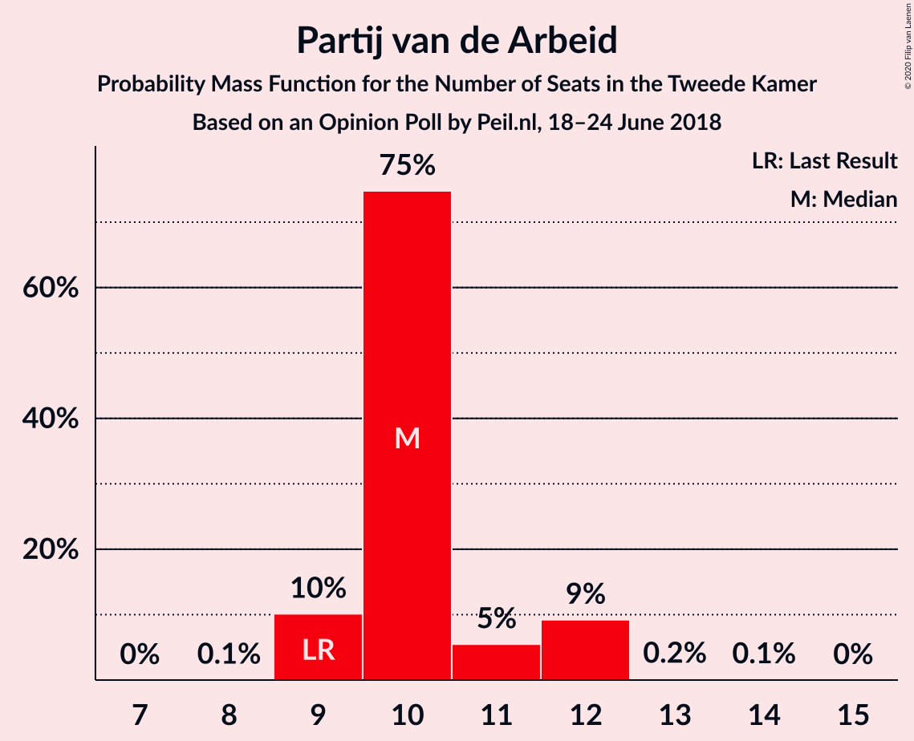

| Number of Seats | Probability | Accumulated | Special Marks |
|:---------------:|:-----------:|:-----------:|:-------------:|
| 8 | 0.1% | 100% |  |
| 9 | 10% | 99.9% | Last Result |
| 10 | 75% | 90% | Median |
| 11 | 5% | 15% |  |
| 12 | 9% | 10% |  |
| 13 | 0.2% | 0.3% |  |
| 14 | 0.1% | 0.1% |  |
| 15 | 0% | 0% |  |

### Partij voor de Dieren

*For a full overview of the results for this party, see the [Partij voor de Dieren](party-partijvoordedieren.html) page.*

| Number of Seats | Probability | Accumulated | Special Marks |
|:---------------:|:-----------:|:-----------:|:-------------:|
| 5 | 0% | 100% | Last Result |
| 6 | 0.7% | 100% |  |
| 7 | 20% | 99.3% |  |
| 8 | 76% | 80% | Median |
| 9 | 4% | 4% |  |
| 10 | 0.3% | 0.3% |  |
| 11 | 0% | 0% |  |

### ChristenUnie

*For a full overview of the results for this party, see the [ChristenUnie](party-christenunie.html) page.*

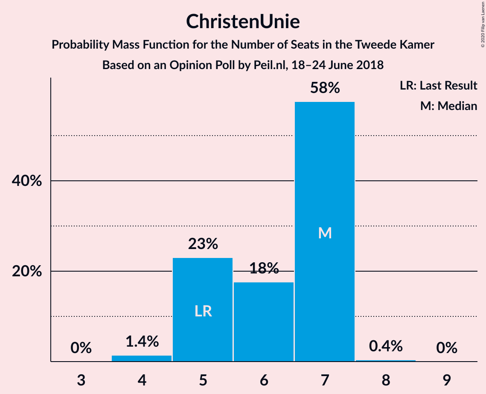

| Number of Seats | Probability | Accumulated | Special Marks |
|:---------------:|:-----------:|:-----------:|:-------------:|
| 4 | 1.4% | 100% |  |
| 5 | 23% | 98.6% | Last Result |
| 6 | 18% | 76% |  |
| 7 | 58% | 58% | Median |
| 8 | 0.4% | 0.4% |  |
| 9 | 0% | 0% |  |

### 50Plus

*For a full overview of the results for this party, see the [50Plus](party-50plus.html) page.*

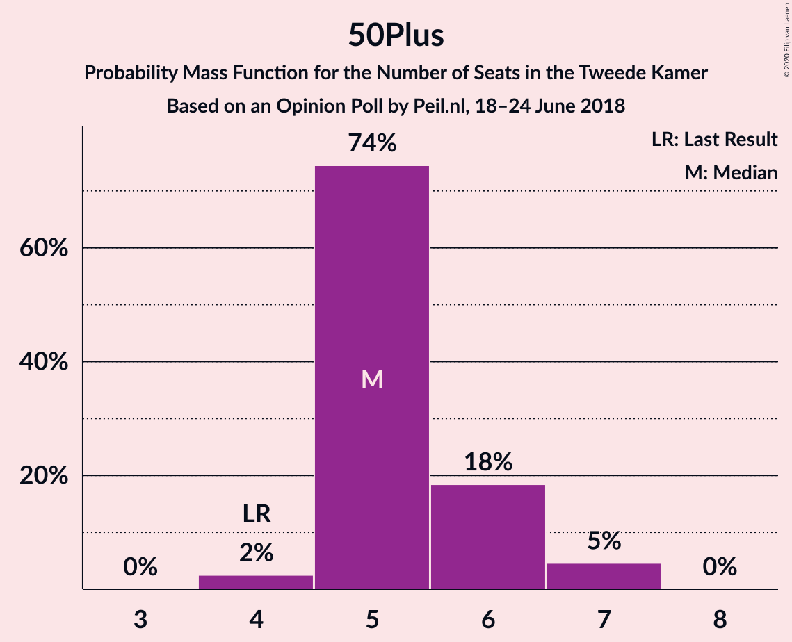

| Number of Seats | Probability | Accumulated | Special Marks |
|:---------------:|:-----------:|:-----------:|:-------------:|
| 4 | 2% | 100% | Last Result |
| 5 | 74% | 98% | Median |
| 6 | 18% | 23% |  |
| 7 | 5% | 5% |  |
| 8 | 0% | 0% |  |

### DENK

*For a full overview of the results for this party, see the [DENK](party-denk.html) page.*

| Number of Seats | Probability | Accumulated | Special Marks |
|:---------------:|:-----------:|:-----------:|:-------------:|
| 3 | 0% | 100% | Last Result |
| 4 | 0.3% | 100% |  |
| 5 | 16% | 99.7% |  |
| 6 | 10% | 84% |  |
| 7 | 74% | 74% | Median |
| 8 | 0.3% | 0.3% |  |
| 9 | 0% | 0% |  |

### Staatkundig Gereformeerde Partij

*For a full overview of the results for this party, see the [Staatkundig Gereformeerde Partij](party-staatkundiggereformeerdepartij.html) page.*

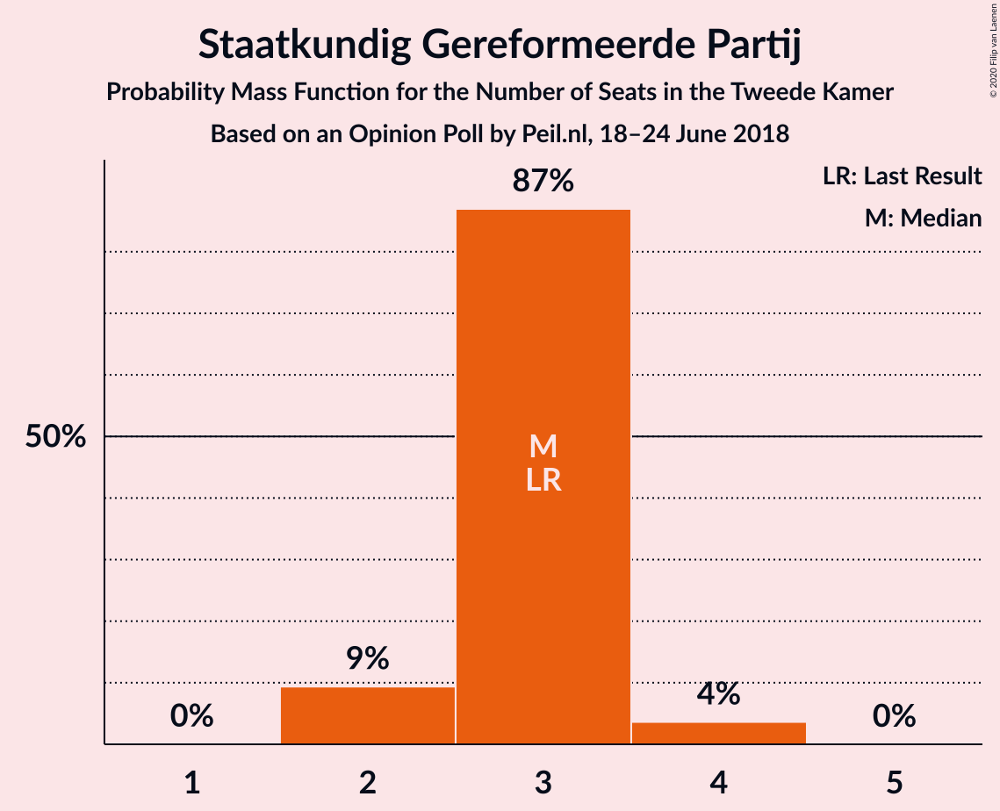

| Number of Seats | Probability | Accumulated | Special Marks |
|:---------------:|:-----------:|:-----------:|:-------------:|
| 2 | 9% | 100% |  |
| 3 | 87% | 91% | Last Result, Median |
| 4 | 4% | 4% |  |
| 5 | 0% | 0% |  |

## Coalitions

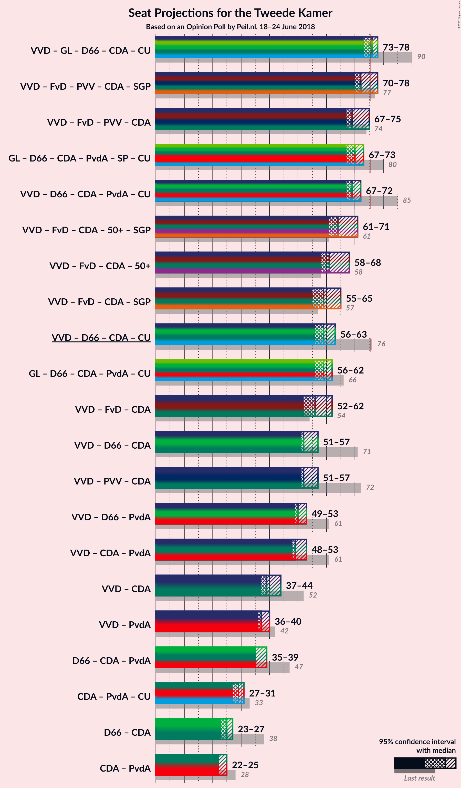

### Confidence Intervals

| Coalition | Last Result | Median | Majority? | 80% Confidence Interval | 90% Confidence Interval | 95% Confidence Interval | 99% Confidence Interval |
|:---------:|:-----------:|:------:|:---------:|:-----------------------:|:-----------------------:|:-----------------------:|:-----------------------:|
| Volkspartij voor Vrijheid en Democratie – GroenLinks – Democraten 66 – Christen-Democratisch Appèl – ChristenUnie | 90 | 76 | 80% | 74–78 | 74–78 | 73–78 | 73–80 |
| Volkspartij voor Vrijheid en Democratie – Forum voor Democratie – Partij voor de Vrijheid – Christen-Democratisch Appèl – Staatkundig Gereformeerde Partij | 77 | 72 | 11% | 72–76 | 71–78 | 70–78 | 68–78 |
| Volkspartij voor Vrijheid en Democratie – Forum voor Democratie – Partij voor de Vrijheid – Christen-Democratisch Appèl | 74 | 69 | 0% | 68–73 | 68–75 | 67–75 | 65–75 |
| GroenLinks – Democraten 66 – Christen-Democratisch Appèl – Partij van de Arbeid – Socialistische Partij – ChristenUnie | 80 | 70 | 0% | 68–72 | 67–72 | 67–73 | 67–75 |
| Volkspartij voor Vrijheid en Democratie – Democraten 66 – Christen-Democratisch Appèl – Partij van de Arbeid – ChristenUnie | 85 | 69 | 0% | 68–72 | 68–72 | 67–72 | 66–73 |
| Volkspartij voor Vrijheid en Democratie – Forum voor Democratie – Christen-Democratisch Appèl – 50Plus – Staatkundig Gereformeerde Partij | 61 | 64 | 0% | 63–67 | 62–71 | 61–71 | 61–71 |
| Volkspartij voor Vrijheid en Democratie – Forum voor Democratie – Christen-Democratisch Appèl – 50Plus | 58 | 61 | 0% | 60–64 | 59–68 | 58–68 | 58–68 |
| Volkspartij voor Vrijheid en Democratie – Forum voor Democratie – Christen-Democratisch Appèl – Staatkundig Gereformeerde Partij | 57 | 59 | 0% | 58–62 | 56–65 | 55–65 | 55–65 |
| Volkspartij voor Vrijheid en Democratie – Democraten 66 – Christen-Democratisch Appèl – ChristenUnie | 76 | 59 | 0% | 57–61 | 57–63 | 56–63 | 55–63 |
| GroenLinks – Democraten 66 – Christen-Democratisch Appèl – Partij van de Arbeid – ChristenUnie | 66 | 59 | 0% | 56–60 | 56–62 | 56–62 | 56–63 |
| Volkspartij voor Vrijheid en Democratie – Forum voor Democratie – Christen-Democratisch Appèl | 54 | 56 | 0% | 54–59 | 53–62 | 52–62 | 52–62 |
| Volkspartij voor Vrijheid en Democratie – Democraten 66 – Christen-Democratisch Appèl | 71 | 52 | 0% | 52–56 | 51–57 | 51–57 | 49–57 |
| Volkspartij voor Vrijheid en Democratie – Partij voor de Vrijheid – Christen-Democratisch Appèl | 72 | 52 | 0% | 52–57 | 51–57 | 51–57 | 49–57 |
| Volkspartij voor Vrijheid en Democratie – Democraten 66 – Partij van de Arbeid | 61 | 50 | 0% | 50–53 | 50–53 | 49–53 | 49–55 |
| Volkspartij voor Vrijheid en Democratie – Christen-Democratisch Appèl – Partij van de Arbeid | 61 | 49 | 0% | 49–53 | 49–53 | 48–53 | 47–55 |
| Volkspartij voor Vrijheid en Democratie – Christen-Democratisch Appèl | 52 | 39 | 0% | 39–43 | 37–44 | 37–44 | 36–44 |
| Volkspartij voor Vrijheid en Democratie – Partij van de Arbeid | 42 | 37 | 0% | 37–40 | 37–40 | 36–40 | 36–42 |
| Democraten 66 – Christen-Democratisch Appèl – Partij van de Arbeid | 47 | 35 | 0% | 35–36 | 35–38 | 35–39 | 33–39 |
| Christen-Democratisch Appèl – Partij van de Arbeid – ChristenUnie | 33 | 29 | 0% | 27–29 | 27–30 | 27–31 | 26–32 |
| Democraten 66 – Christen-Democratisch Appèl | 38 | 25 | 0% | 25–26 | 24–26 | 23–27 | 22–27 |
| Christen-Democratisch Appèl – Partij van de Arbeid | 28 | 22 | 0% | 22–23 | 22–24 | 22–25 | 20–26 |

### Volkspartij voor Vrijheid en Democratie – GroenLinks – Democraten 66 – Christen-Democratisch Appèl – ChristenUnie

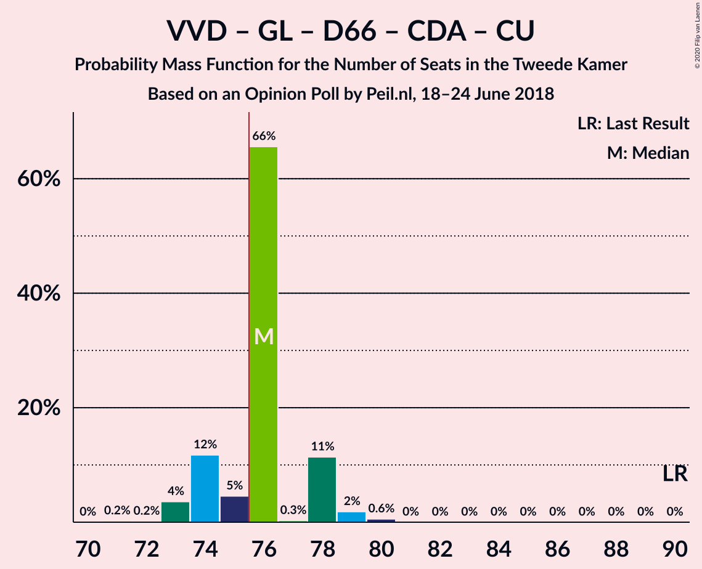

| Number of Seats | Probability | Accumulated | Special Marks |
|:---------------:|:-----------:|:-----------:|:-------------:|
| 71 | 0.2% | 100% |  |
| 72 | 0.2% | 99.8% |  |
| 73 | 4% | 99.6% |  |
| 74 | 12% | 96% |  |
| 75 | 5% | 84% |  |
| 76 | 66% | 80% | Median, Majority |
| 77 | 0.3% | 14% |  |
| 78 | 11% | 14% |  |
| 79 | 2% | 2% |  |
| 80 | 0.6% | 0.6% |  |
| 81 | 0% | 0% |  |
| 82 | 0% | 0% |  |
| 83 | 0% | 0% |  |
| 84 | 0% | 0% |  |
| 85 | 0% | 0% |  |
| 86 | 0% | 0% |  |
| 87 | 0% | 0% |  |
| 88 | 0% | 0% |  |
| 89 | 0% | 0% |  |
| 90 | 0% | 0% | Last Result |

### Volkspartij voor Vrijheid en Democratie – Forum voor Democratie – Partij voor de Vrijheid – Christen-Democratisch Appèl – Staatkundig Gereformeerde Partij

| Number of Seats | Probability | Accumulated | Special Marks |
|:---------------:|:-----------:|:-----------:|:-------------:|
| 68 | 1.3% | 100% |  |
| 69 | 0.6% | 98.6% |  |
| 70 | 2% | 98% |  |
| 71 | 6% | 96% |  |
| 72 | 60% | 91% | Median |
| 73 | 10% | 30% |  |
| 74 | 8% | 20% |  |
| 75 | 2% | 12% |  |
| 76 | 0.7% | 11% | Majority |
| 77 | 0.4% | 10% | Last Result |
| 78 | 9% | 9% |  |
| 79 | 0% | 0% |  |

### Volkspartij voor Vrijheid en Democratie – Forum voor Democratie – Partij voor de Vrijheid – Christen-Democratisch Appèl

| Number of Seats | Probability | Accumulated | Special Marks |
|:---------------:|:-----------:|:-----------:|:-------------:|
| 65 | 1.3% | 100% |  |
| 66 | 0.2% | 98.7% |  |
| 67 | 2% | 98% |  |
| 68 | 8% | 96% |  |
| 69 | 56% | 89% | Median |
| 70 | 14% | 33% |  |
| 71 | 1.1% | 19% |  |
| 72 | 7% | 18% |  |
| 73 | 1.0% | 11% |  |
| 74 | 0.4% | 10% | Last Result |
| 75 | 9% | 9% |  |
| 76 | 0% | 0% | Majority |

### GroenLinks – Democraten 66 – Christen-Democratisch Appèl – Partij van de Arbeid – Socialistische Partij – ChristenUnie

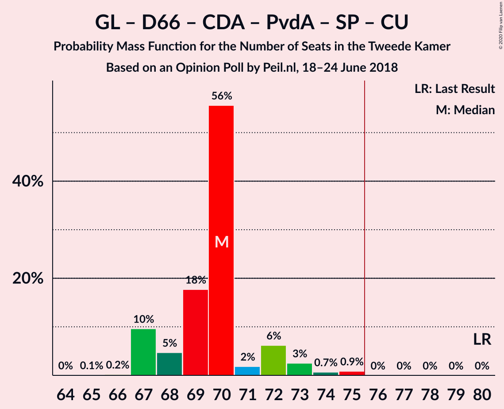

| Number of Seats | Probability | Accumulated | Special Marks |
|:---------------:|:-----------:|:-----------:|:-------------:|
| 65 | 0.1% | 100% |  |
| 66 | 0.2% | 99.9% |  |
| 67 | 10% | 99.7% |  |
| 68 | 5% | 90% |  |
| 69 | 18% | 85% |  |
| 70 | 56% | 68% | Median |
| 71 | 2% | 12% |  |
| 72 | 6% | 10% |  |
| 73 | 3% | 4% |  |
| 74 | 0.7% | 2% |  |
| 75 | 0.9% | 0.9% |  |
| 76 | 0% | 0% | Majority |
| 77 | 0% | 0% |  |
| 78 | 0% | 0% |  |
| 79 | 0% | 0% |  |
| 80 | 0% | 0% | Last Result |

### Volkspartij voor Vrijheid en Democratie – Democraten 66 – Christen-Democratisch Appèl – Partij van de Arbeid – ChristenUnie

| Number of Seats | Probability | Accumulated | Special Marks |
|:---------------:|:-----------:|:-----------:|:-------------:|
| 65 | 0.5% | 100% |  |
| 66 | 0.4% | 99.5% |  |
| 67 | 4% | 99.1% |  |
| 68 | 20% | 95% |  |
| 69 | 59% | 75% | Median |
| 70 | 3% | 16% |  |
| 71 | 0.7% | 13% |  |
| 72 | 11% | 13% |  |
| 73 | 1.4% | 1.5% |  |
| 74 | 0% | 0% |  |
| 75 | 0% | 0% |  |
| 76 | 0% | 0% | Majority |
| 77 | 0% | 0% |  |
| 78 | 0% | 0% |  |
| 79 | 0% | 0% |  |
| 80 | 0% | 0% |  |
| 81 | 0% | 0% |  |
| 82 | 0% | 0% |  |
| 83 | 0% | 0% |  |
| 84 | 0% | 0% |  |
| 85 | 0% | 0% | Last Result |

### Volkspartij voor Vrijheid en Democratie – Forum voor Democratie – Christen-Democratisch Appèl – 50Plus – Staatkundig Gereformeerde Partij

| Number of Seats | Probability | Accumulated | Special Marks |
|:---------------:|:-----------:|:-----------:|:-------------:|
| 60 | 0.4% | 100% |  |
| 61 | 4% | 99.6% | Last Result |
| 62 | 3% | 95% |  |
| 63 | 11% | 92% |  |
| 64 | 65% | 82% | Median |
| 65 | 4% | 16% |  |
| 66 | 1.1% | 13% |  |
| 67 | 2% | 12% |  |
| 68 | 0.1% | 10% |  |
| 69 | 0.1% | 10% |  |
| 70 | 0% | 9% |  |
| 71 | 9% | 9% |  |
| 72 | 0% | 0% |  |

### Volkspartij voor Vrijheid en Democratie – Forum voor Democratie – Christen-Democratisch Appèl – 50Plus

| Number of Seats | Probability | Accumulated | Special Marks |
|:---------------:|:-----------:|:-----------:|:-------------:|
| 58 | 5% | 100% | Last Result |
| 59 | 3% | 95% |  |
| 60 | 10% | 93% |  |
| 61 | 62% | 83% | Median |
| 62 | 8% | 21% |  |
| 63 | 3% | 13% |  |
| 64 | 0.7% | 10% |  |
| 65 | 0.1% | 10% |  |
| 66 | 0.1% | 10% |  |
| 67 | 0% | 9% |  |
| 68 | 9% | 9% |  |
| 69 | 0% | 0% |  |

### Volkspartij voor Vrijheid en Democratie – Forum voor Democratie – Christen-Democratisch Appèl – Staatkundig Gereformeerde Partij

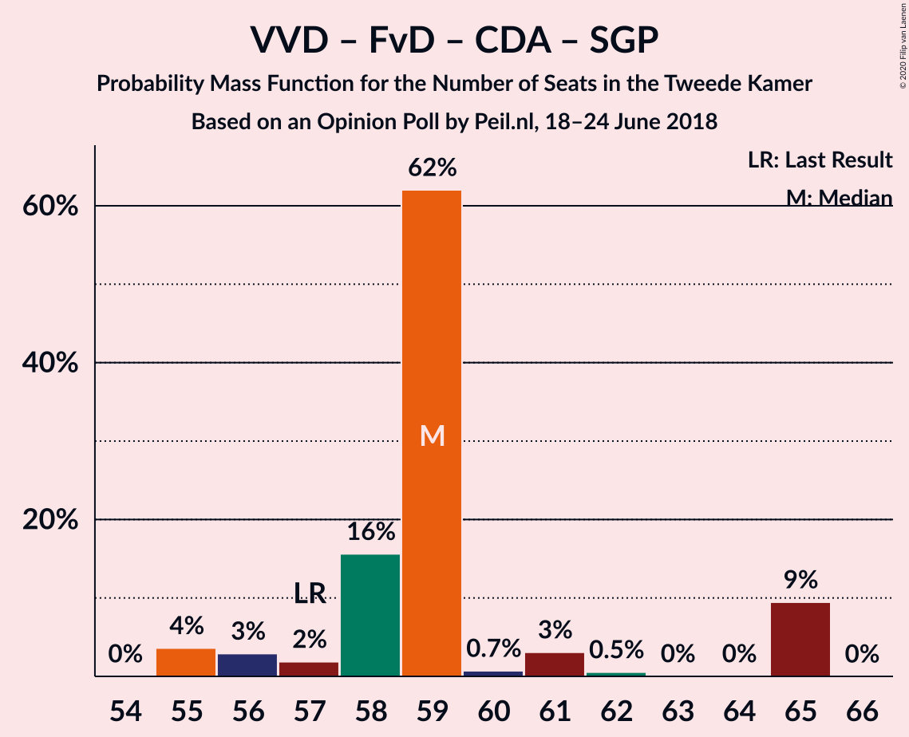

| Number of Seats | Probability | Accumulated | Special Marks |
|:---------------:|:-----------:|:-----------:|:-------------:|
| 54 | 0% | 100% |  |
| 55 | 4% | 99.9% |  |
| 56 | 3% | 96% |  |
| 57 | 2% | 93% | Last Result |
| 58 | 16% | 92% |  |
| 59 | 62% | 76% | Median |
| 60 | 0.7% | 14% |  |
| 61 | 3% | 13% |  |
| 62 | 0.5% | 10% |  |
| 63 | 0% | 10% |  |
| 64 | 0% | 10% |  |
| 65 | 9% | 9% |  |
| 66 | 0% | 0% |  |

### Volkspartij voor Vrijheid en Democratie – Democraten 66 – Christen-Democratisch Appèl – ChristenUnie

| Number of Seats | Probability | Accumulated | Special Marks |
|:---------------:|:-----------:|:-----------:|:-------------:|
| 54 | 0.2% | 100% |  |
| 55 | 0.5% | 99.8% |  |
| 56 | 4% | 99.4% |  |
| 57 | 9% | 95% |  |
| 58 | 17% | 87% |  |
| 59 | 55% | 70% | Median |
| 60 | 2% | 14% |  |
| 61 | 3% | 13% |  |
| 62 | 0.4% | 10% |  |
| 63 | 9% | 10% |  |
| 64 | 0% | 0% |  |
| 65 | 0% | 0% |  |
| 66 | 0% | 0% |  |
| 67 | 0% | 0% |  |
| 68 | 0% | 0% |  |
| 69 | 0% | 0% |  |
| 70 | 0% | 0% |  |
| 71 | 0% | 0% |  |
| 72 | 0% | 0% |  |
| 73 | 0% | 0% |  |
| 74 | 0% | 0% |  |
| 75 | 0% | 0% |  |
| 76 | 0% | 0% | Last Result, Majority |

### GroenLinks – Democraten 66 – Christen-Democratisch Appèl – Partij van de Arbeid – ChristenUnie

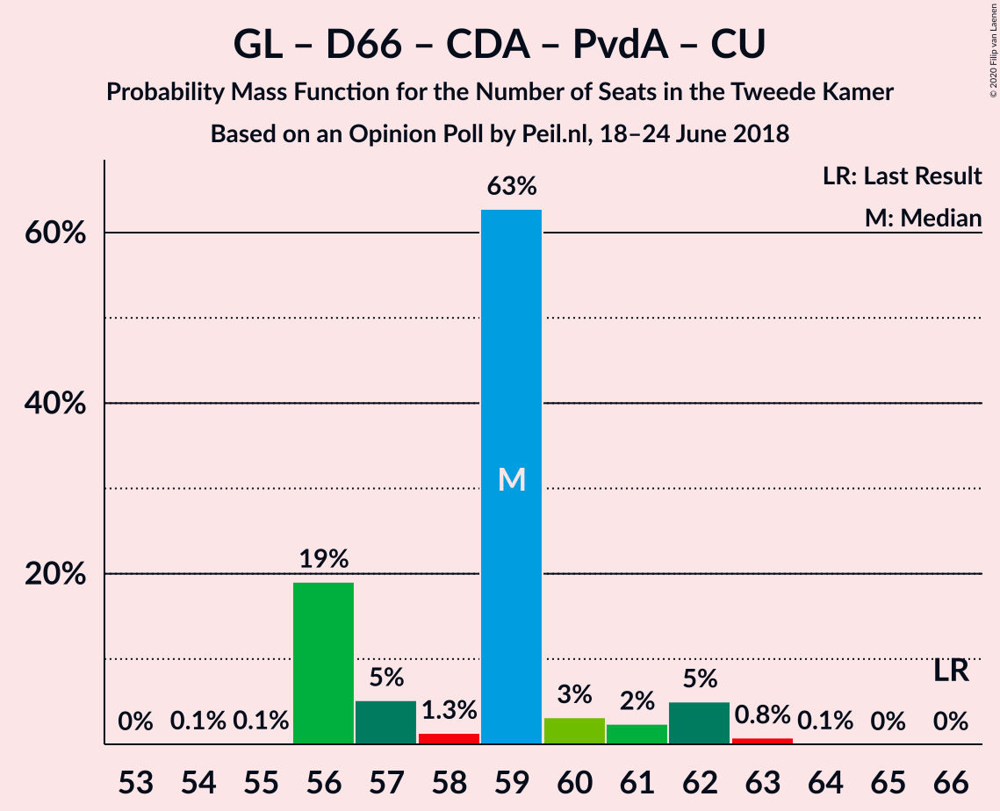

| Number of Seats | Probability | Accumulated | Special Marks |
|:---------------:|:-----------:|:-----------:|:-------------:|
| 54 | 0.1% | 100% |  |
| 55 | 0.1% | 99.9% |  |
| 56 | 19% | 99.8% |  |
| 57 | 5% | 81% |  |
| 58 | 1.3% | 76% |  |
| 59 | 63% | 74% | Median |
| 60 | 3% | 11% |  |
| 61 | 2% | 8% |  |
| 62 | 5% | 6% |  |
| 63 | 0.8% | 0.9% |  |
| 64 | 0.1% | 0.1% |  |
| 65 | 0% | 0% |  |
| 66 | 0% | 0% | Last Result |

### Volkspartij voor Vrijheid en Democratie – Forum voor Democratie – Christen-Democratisch Appèl

| Number of Seats | Probability | Accumulated | Special Marks |
|:---------------:|:-----------:|:-----------:|:-------------:|
| 51 | 0% | 100% |  |
| 52 | 3% | 99.9% |  |
| 53 | 3% | 97% |  |
| 54 | 4% | 94% | Last Result |
| 55 | 13% | 90% |  |
| 56 | 56% | 77% | Median |
| 57 | 9% | 21% |  |
| 58 | 2% | 12% |  |
| 59 | 0.6% | 10% |  |
| 60 | 0% | 10% |  |
| 61 | 0% | 10% |  |
| 62 | 9% | 9% |  |
| 63 | 0% | 0% |  |

### Volkspartij voor Vrijheid en Democratie – Democraten 66 – Christen-Democratisch Appèl

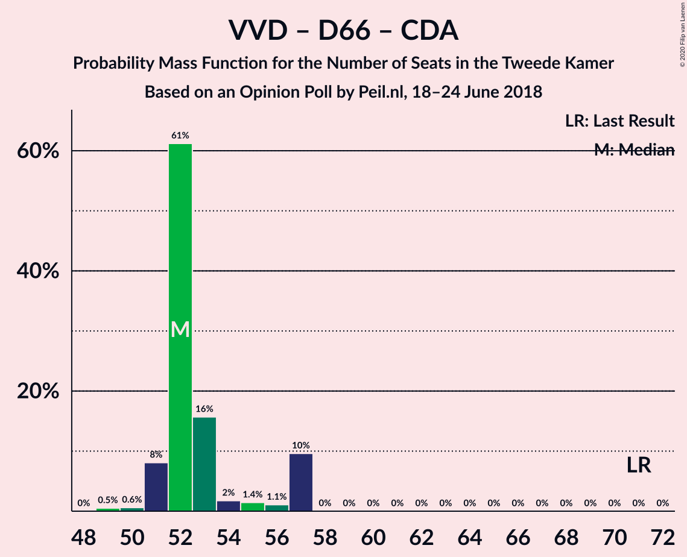

| Number of Seats | Probability | Accumulated | Special Marks |
|:---------------:|:-----------:|:-----------:|:-------------:|
| 49 | 0.5% | 100% |  |
| 50 | 0.6% | 99.5% |  |
| 51 | 8% | 98.9% |  |
| 52 | 61% | 91% | Median |
| 53 | 16% | 30% |  |
| 54 | 2% | 14% |  |
| 55 | 1.4% | 12% |  |
| 56 | 1.1% | 11% |  |
| 57 | 10% | 10% |  |
| 58 | 0% | 0% |  |
| 59 | 0% | 0% |  |
| 60 | 0% | 0% |  |
| 61 | 0% | 0% |  |
| 62 | 0% | 0% |  |
| 63 | 0% | 0% |  |
| 64 | 0% | 0% |  |
| 65 | 0% | 0% |  |
| 66 | 0% | 0% |  |
| 67 | 0% | 0% |  |
| 68 | 0% | 0% |  |
| 69 | 0% | 0% |  |
| 70 | 0% | 0% |  |
| 71 | 0% | 0% | Last Result |

### Volkspartij voor Vrijheid en Democratie – Partij voor de Vrijheid – Christen-Democratisch Appèl

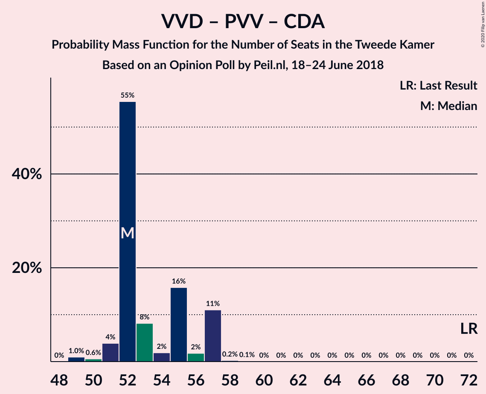

| Number of Seats | Probability | Accumulated | Special Marks |
|:---------------:|:-----------:|:-----------:|:-------------:|
| 49 | 1.0% | 100% |  |
| 50 | 0.6% | 99.0% |  |
| 51 | 4% | 98% |  |
| 52 | 55% | 95% | Median |
| 53 | 8% | 39% |  |
| 54 | 2% | 31% |  |
| 55 | 16% | 29% |  |
| 56 | 2% | 13% |  |
| 57 | 11% | 11% |  |
| 58 | 0.2% | 0.4% |  |
| 59 | 0.1% | 0.1% |  |
| 60 | 0% | 0% |  |
| 61 | 0% | 0% |  |
| 62 | 0% | 0% |  |
| 63 | 0% | 0% |  |
| 64 | 0% | 0% |  |
| 65 | 0% | 0% |  |
| 66 | 0% | 0% |  |
| 67 | 0% | 0% |  |
| 68 | 0% | 0% |  |
| 69 | 0% | 0% |  |
| 70 | 0% | 0% |  |
| 71 | 0% | 0% |  |
| 72 | 0% | 0% | Last Result |

### Volkspartij voor Vrijheid en Democratie – Democraten 66 – Partij van de Arbeid

| Number of Seats | Probability | Accumulated | Special Marks |
|:---------------:|:-----------:|:-----------:|:-------------:|
| 47 | 0.1% | 100% |  |
| 48 | 0.1% | 99.9% |  |
| 49 | 5% | 99.9% |  |
| 50 | 61% | 95% | Median |
| 51 | 14% | 34% |  |
| 52 | 6% | 20% |  |
| 53 | 13% | 14% |  |
| 54 | 0.4% | 1.2% |  |
| 55 | 0.7% | 0.9% |  |
| 56 | 0.1% | 0.1% |  |
| 57 | 0% | 0% |  |
| 58 | 0% | 0% |  |
| 59 | 0% | 0% |  |
| 60 | 0% | 0% |  |
| 61 | 0% | 0% | Last Result |

### Volkspartij voor Vrijheid en Democratie – Christen-Democratisch Appèl – Partij van de Arbeid

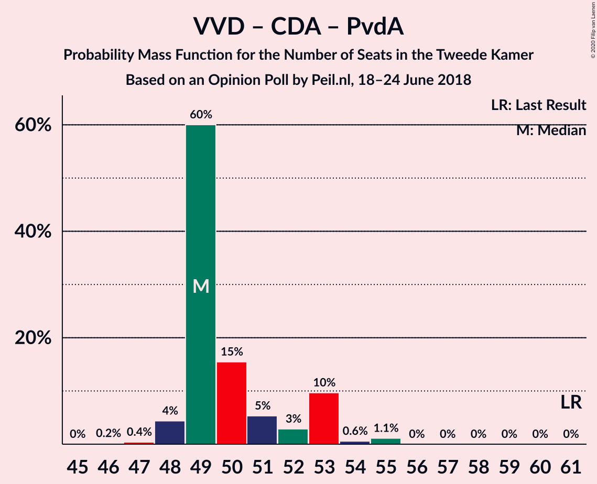

| Number of Seats | Probability | Accumulated | Special Marks |
|:---------------:|:-----------:|:-----------:|:-------------:|
| 46 | 0.2% | 100% |  |
| 47 | 0.4% | 99.8% |  |
| 48 | 4% | 99.4% |  |
| 49 | 60% | 95% | Median |
| 50 | 15% | 35% |  |
| 51 | 5% | 20% |  |
| 52 | 3% | 14% |  |
| 53 | 10% | 11% |  |
| 54 | 0.6% | 2% |  |
| 55 | 1.1% | 1.1% |  |
| 56 | 0% | 0% |  |
| 57 | 0% | 0% |  |
| 58 | 0% | 0% |  |
| 59 | 0% | 0% |  |
| 60 | 0% | 0% |  |
| 61 | 0% | 0% | Last Result |

### Volkspartij voor Vrijheid en Democratie – Christen-Democratisch Appèl

| Number of Seats | Probability | Accumulated | Special Marks |
|:---------------:|:-----------:|:-----------:|:-------------:|
| 35 | 0.2% | 100% |  |
| 36 | 0.8% | 99.8% |  |
| 37 | 4% | 99.0% |  |
| 38 | 4% | 95% |  |
| 39 | 59% | 90% | Median |
| 40 | 17% | 31% |  |
| 41 | 2% | 14% |  |
| 42 | 1.0% | 12% |  |
| 43 | 2% | 11% |  |
| 44 | 10% | 10% |  |
| 45 | 0% | 0% |  |
| 46 | 0% | 0% |  |
| 47 | 0% | 0% |  |
| 48 | 0% | 0% |  |
| 49 | 0% | 0% |  |
| 50 | 0% | 0% |  |
| 51 | 0% | 0% |  |
| 52 | 0% | 0% | Last Result |

### Volkspartij voor Vrijheid en Democratie – Partij van de Arbeid

| Number of Seats | Probability | Accumulated | Special Marks |
|:---------------:|:-----------:|:-----------:|:-------------:|
| 34 | 0% | 100% |  |
| 35 | 0.2% | 99.9% |  |
| 36 | 4% | 99.8% |  |
| 37 | 64% | 95% | Median |
| 38 | 13% | 32% |  |
| 39 | 3% | 19% |  |
| 40 | 13% | 15% |  |
| 41 | 1.2% | 2% |  |
| 42 | 0.4% | 0.5% | Last Result |
| 43 | 0.1% | 0.1% |  |
| 44 | 0% | 0% |  |

### Democraten 66 – Christen-Democratisch Appèl – Partij van de Arbeid

| Number of Seats | Probability | Accumulated | Special Marks |
|:---------------:|:-----------:|:-----------:|:-------------:|
| 32 | 0.4% | 100% |  |
| 33 | 0.3% | 99.5% |  |
| 34 | 1.1% | 99.2% |  |
| 35 | 83% | 98% | Median |
| 36 | 7% | 15% |  |
| 37 | 0.9% | 8% |  |
| 38 | 4% | 7% |  |
| 39 | 3% | 4% |  |
| 40 | 0.1% | 0.2% |  |
| 41 | 0% | 0.1% |  |
| 42 | 0.1% | 0.1% |  |
| 43 | 0% | 0% |  |
| 44 | 0% | 0% |  |
| 45 | 0% | 0% |  |
| 46 | 0% | 0% |  |
| 47 | 0% | 0% | Last Result |

### Christen-Democratisch Appèl – Partij van de Arbeid – ChristenUnie

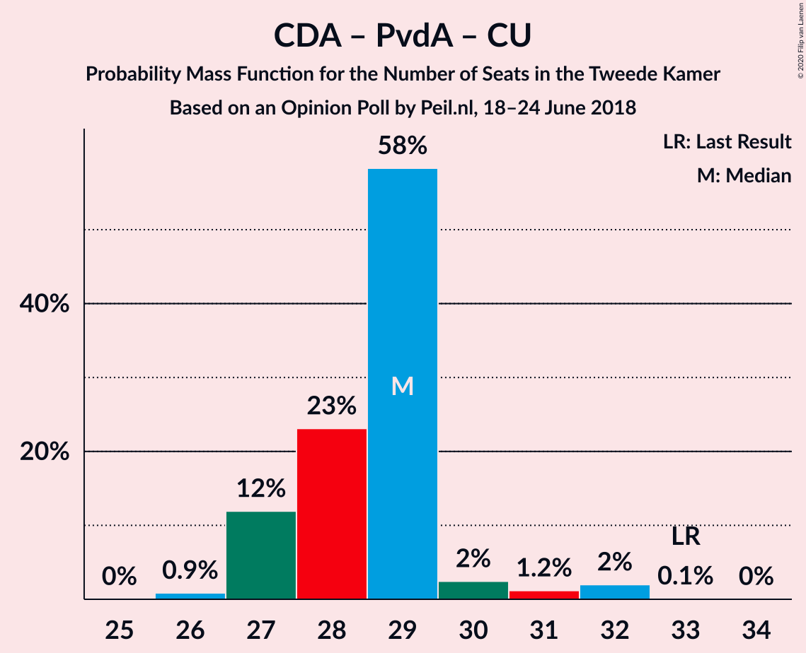

| Number of Seats | Probability | Accumulated | Special Marks |
|:---------------:|:-----------:|:-----------:|:-------------:|
| 26 | 0.9% | 100% |  |
| 27 | 12% | 99.1% |  |
| 28 | 23% | 87% |  |
| 29 | 58% | 64% | Median |
| 30 | 2% | 6% |  |
| 31 | 1.2% | 3% |  |
| 32 | 2% | 2% |  |
| 33 | 0.1% | 0.1% | Last Result |
| 34 | 0% | 0% |  |

### Democraten 66 – Christen-Democratisch Appèl

| Number of Seats | Probability | Accumulated | Special Marks |
|:---------------:|:-----------:|:-----------:|:-------------:|
| 21 | 0.1% | 100% |  |
| 22 | 0.5% | 99.9% |  |
| 23 | 4% | 99.5% |  |
| 24 | 3% | 96% |  |
| 25 | 69% | 93% | Median |
| 26 | 19% | 24% |  |
| 27 | 5% | 5% |  |
| 28 | 0.2% | 0.3% |  |
| 29 | 0.1% | 0.1% |  |
| 30 | 0% | 0% |  |
| 31 | 0% | 0% |  |
| 32 | 0% | 0% |  |
| 33 | 0% | 0% |  |
| 34 | 0% | 0% |  |
| 35 | 0% | 0% |  |
| 36 | 0% | 0% |  |
| 37 | 0% | 0% |  |
| 38 | 0% | 0% | Last Result |

### Christen-Democratisch Appèl – Partij van de Arbeid

| Number of Seats | Probability | Accumulated | Special Marks |
|:---------------:|:-----------:|:-----------:|:-------------:|
| 20 | 0.5% | 100% |  |
| 21 | 0.8% | 99.5% |  |
| 22 | 79% | 98.6% | Median |
| 23 | 13% | 20% |  |
| 24 | 4% | 7% |  |
| 25 | 1.2% | 3% |  |
| 26 | 1.3% | 1.4% |  |
| 27 | 0.1% | 0.2% |  |
| 28 | 0% | 0% | Last Result |

## Technical Information

### Opinion Poll

+ **Polling firm:** Peil.nl
+ **Commissioner(s):** —
+ **Fieldwork period:** 18–24 June 2018

### Calculations

+ **Sample size:** 3000
+ **Simulations done:** 1,048,576
+ **Error estimate:** 1.63%

