# Opinion Poll by I&O Research, 13–29 June 2018

<a href="#voting-intentions">Voting Intentions</a> | <a href="#seats">Seats</a> | <a href="#coalitions">Coalitions</a> | <a href="#technical-information">Technical Information</a>

## Voting Intentions

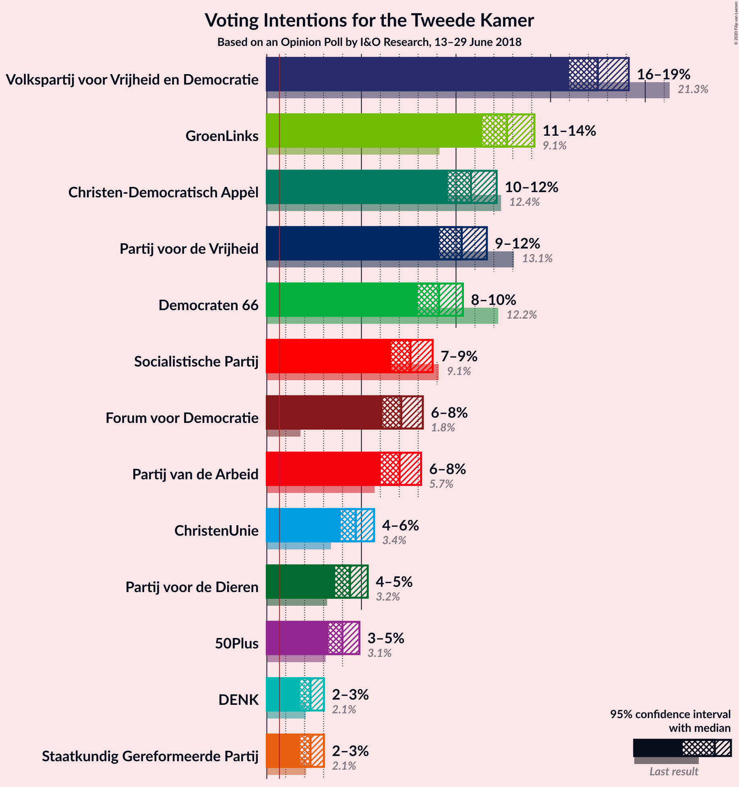

### Confidence Intervals

| Party | Last Result | Poll Result | 80% Confidence Interval | 90% Confidence Interval | 95% Confidence Interval | 99% Confidence Interval |
|:-----:|:-----------:|:-----------:|:-----------------------:|:-----------------------:|:-----------------------:|:-----------------------:|
| Volkspartij voor Vrijheid en Democratie | 21.3% | 17.5% | 16.5–18.6% |16.2–18.9% |16.0–19.1% |15.5–19.6% |
| GroenLinks | 9.1% | 12.7% | 11.8–13.6% |11.6–13.9% |11.4–14.1% |11.0–14.6% |
| Christen-Democratisch Appèl | 12.4% | 10.8% | 10.0–11.7% |9.8–11.9% |9.6–12.1% |9.2–12.6% |
| Partij voor de Vrijheid | 13.1% | 10.3% | 9.5–11.2% |9.3–11.4% |9.1–11.6% |8.7–12.1% |
| Democraten 66 | 12.2% | 9.1% | 8.4–9.9% |8.2–10.2% |8.0–10.4% |7.6–10.8% |
| Socialistische Partij | 9.1% | 7.6% | 6.9–8.4% |6.7–8.6% |6.6–8.8% |6.2–9.1% |
| Forum voor Democratie | 1.8% | 7.1% | 6.4–7.8% |6.3–8.1% |6.1–8.2% |5.8–8.6% |
| Partij van de Arbeid | 5.7% | 7.0% | 6.4–7.8% |6.2–8.0% |6.0–8.2% |5.7–8.5% |
| ChristenUnie | 3.4% | 4.7% | 4.2–5.3% |4.0–5.5% |3.9–5.7% |3.7–6.0% |
| Partij voor de Dieren | 3.2% | 4.4% | 3.9–5.0% |3.7–5.2% |3.6–5.3% |3.4–5.6% |
| 50Plus | 3.1% | 4.0% | 3.5–4.6% |3.4–4.8% |3.3–4.9% |3.0–5.2% |
| Staatkundig Gereformeerde Partij | 2.1% | 2.3% | 2.0–2.8% |1.8–2.9% |1.8–3.0% |1.6–3.3% |
| DENK | 2.1% | 2.3% | 2.0–2.8% |1.8–2.9% |1.8–3.0% |1.6–3.3% |

*Note:* The poll result column reflects the actual value used in the calculations. Published results may vary slightly, and in addition be rounded to fewer digits.

## Seats

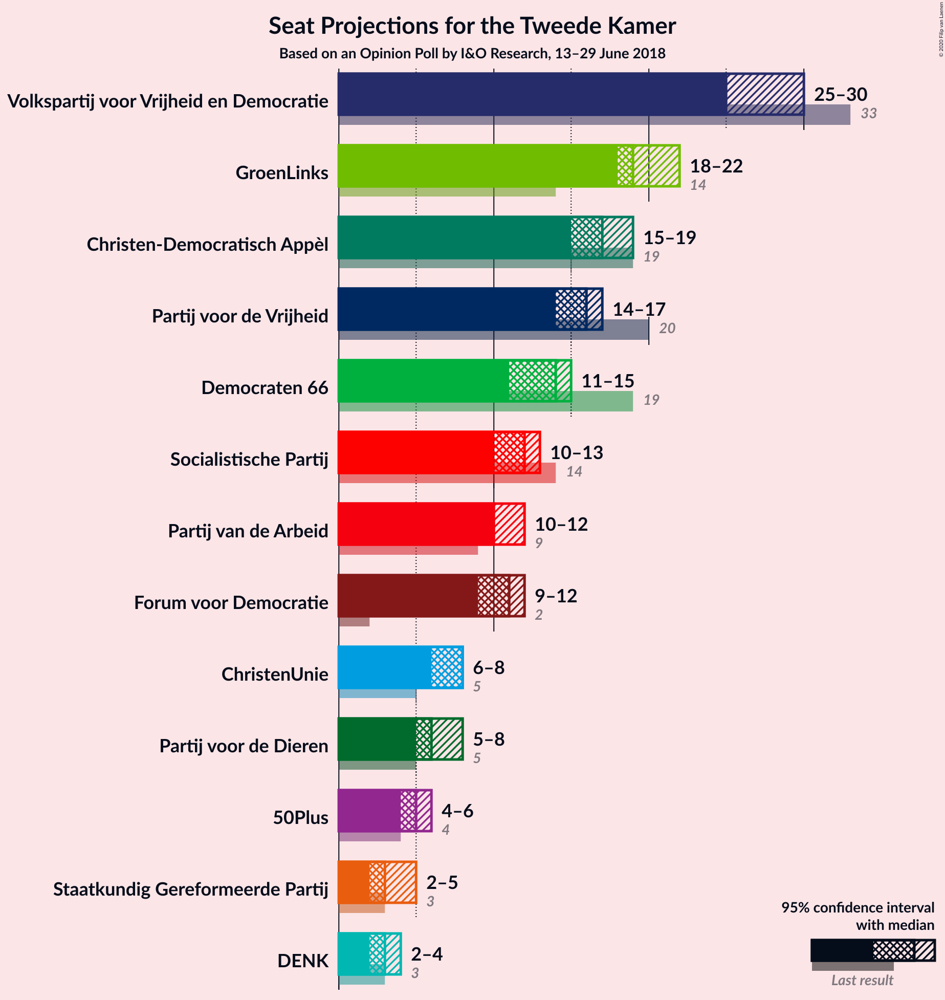

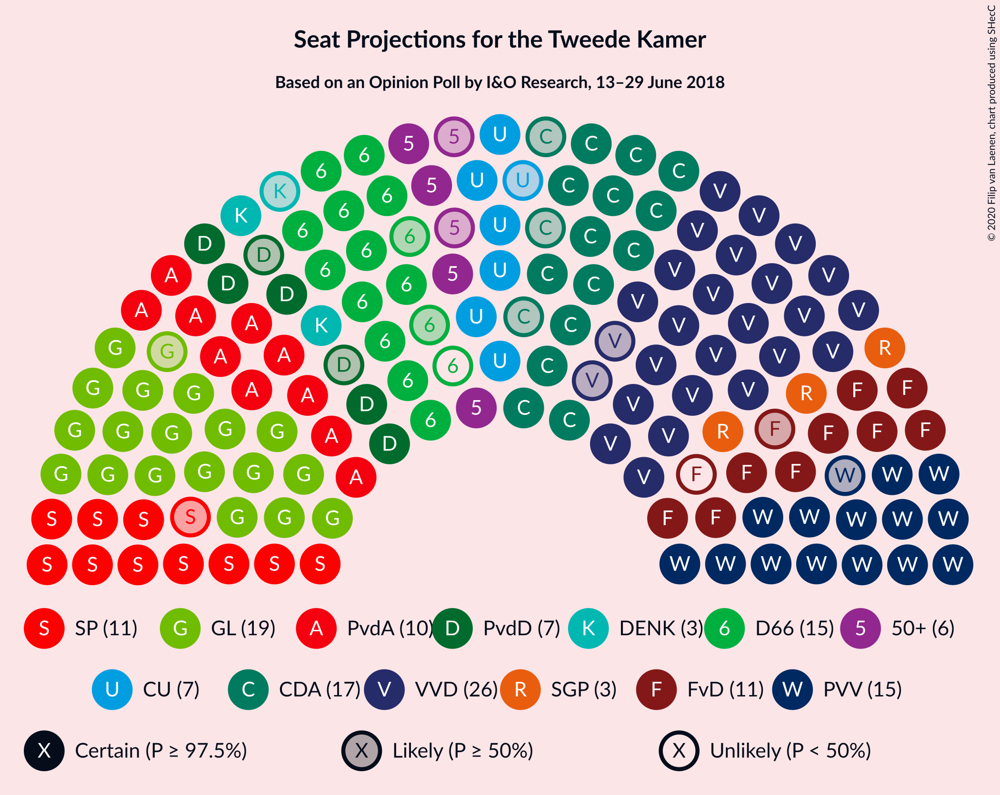

### Confidence Intervals

| Party | Last Result | Median | 80% Confidence Interval | 90% Confidence Interval | 95% Confidence Interval | 99% Confidence Interval |
|:-----:|:-----------:|:------:|:-----------------------:|:-----------------------:|:-----------------------:|:-----------------------:|
| <a href="#volkspartij-voor-vrijheid-en-democratie">Volkspartij voor Vrijheid en Democratie</a> | 33 | 26 | 26–28 |25–28 |25–28 |24–28 |
| <a href="#groenlinks">GroenLinks</a> | 14 | 19 | 19–20 |18–22 |18–22 |17–22 |
| <a href="#christen-democratisch-appèl">Christen-Democratisch Appèl</a> | 19 | 17 | 16–19 |15–19 |14–19 |14–19 |
| <a href="#partij-voor-de-vrijheid">Partij voor de Vrijheid</a> | 20 | 15 | 15–17 |15–18 |15–18 |14–18 |
| <a href="#democraten-66">Democraten 66</a> | 19 | 13 | 12–15 |12–15 |12–15 |12–16 |
| <a href="#socialistische-partij">Socialistische Partij</a> | 14 | 11 | 10–12 |10–12 |10–12 |9–12 |
| <a href="#forum-voor-democratie">Forum voor Democratie</a> | 2 | 10 | 9–11 |9–12 |9–12 |9–13 |
| <a href="#partij-van-de-arbeid">Partij van de Arbeid</a> | 9 | 10 | 10–11 |10–11 |10–11 |9–12 |
| <a href="#christenunie">ChristenUnie</a> | 5 | 7 | 6–8 |6–8 |6–8 |6–8 |
| <a href="#partij-voor-de-dieren">Partij voor de Dieren</a> | 5 | 7 | 7–8 |5–8 |5–8 |5–8 |
| <a href="#50plus">50Plus</a> | 4 | 6 | 5–6 |5–6 |5–6 |4–7 |
| <a href="#staatkundig-gereformeerde-partij">Staatkundig Gereformeerde Partij</a> | 3 | 3 | 3–5 |3–5 |3–5 |2–5 |
| <a href="#denk">DENK</a> | 3 | 3 | 2–3 |2–3 |2–4 |2–4 |

### Volkspartij voor Vrijheid en Democratie

*For a full overview of the results for this party, see the [Volkspartij voor Vrijheid en Democratie](party-volkspartijvoorvrijheidendemocratie.html) page.*

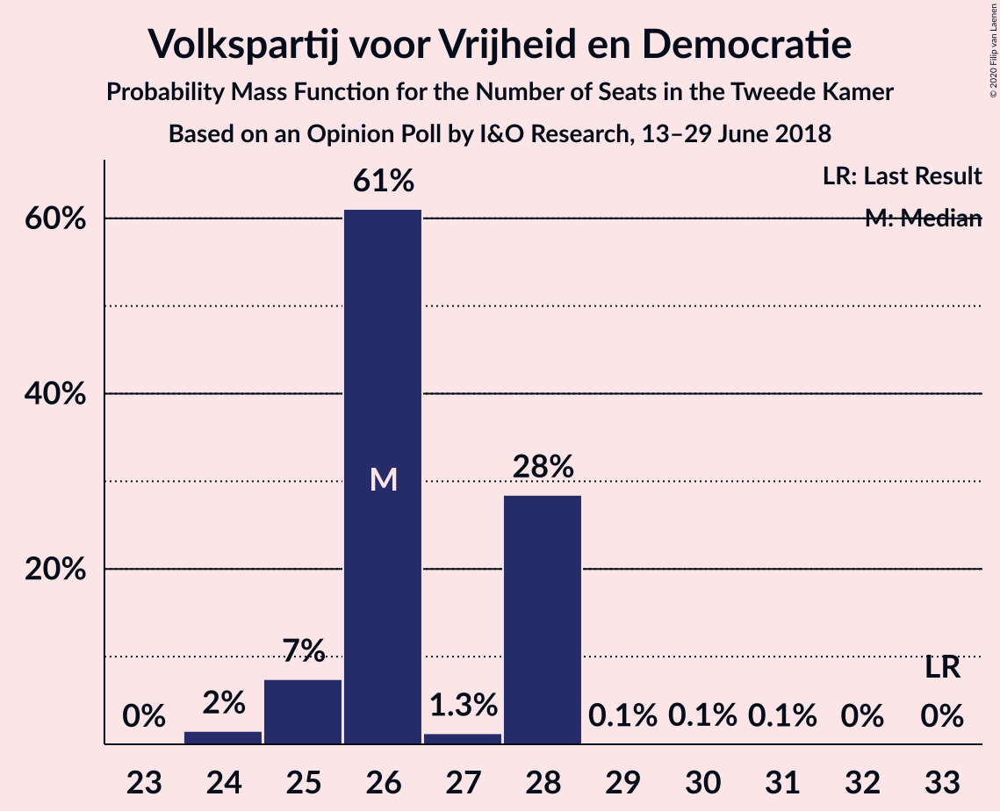

| Number of Seats | Probability | Accumulated | Special Marks |
|:---------------:|:-----------:|:-----------:|:-------------:|
| 24 | 2% | 100% |  |
| 25 | 7% | 98% |  |
| 26 | 61% | 91% | Median |
| 27 | 1.3% | 30% |  |
| 28 | 28% | 29% |  |
| 29 | 0.1% | 0.2% |  |
| 30 | 0.1% | 0.2% |  |
| 31 | 0.1% | 0.1% |  |
| 32 | 0% | 0% |  |
| 33 | 0% | 0% | Last Result |

### GroenLinks

*For a full overview of the results for this party, see the [GroenLinks](party-groenlinks.html) page.*

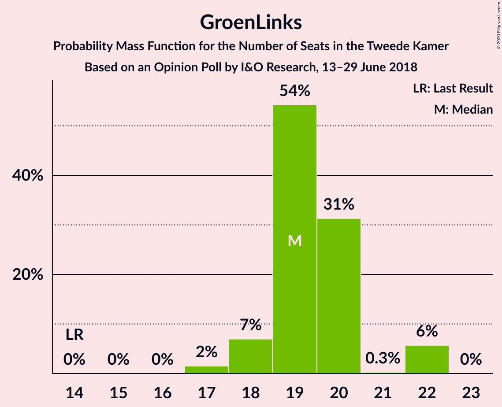

| Number of Seats | Probability | Accumulated | Special Marks |
|:---------------:|:-----------:|:-----------:|:-------------:|
| 14 | 0% | 100% | Last Result |
| 15 | 0% | 100% |  |
| 16 | 0% | 100% |  |
| 17 | 2% | 100% |  |
| 18 | 7% | 98% |  |
| 19 | 54% | 92% | Median |
| 20 | 31% | 37% |  |
| 21 | 0.3% | 6% |  |
| 22 | 6% | 6% |  |
| 23 | 0% | 0% |  |

### Christen-Democratisch Appèl

*For a full overview of the results for this party, see the [Christen-Democratisch Appèl](party-christen-democratischappèl.html) page.*

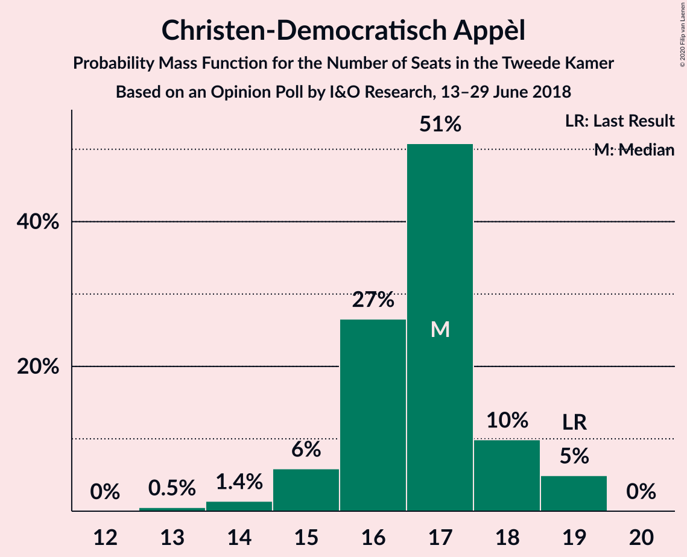

| Number of Seats | Probability | Accumulated | Special Marks |
|:---------------:|:-----------:|:-----------:|:-------------:|
| 14 | 4% | 100% |  |
| 15 | 1.3% | 96% |  |
| 16 | 39% | 95% |  |
| 17 | 25% | 56% | Median |
| 18 | 0.7% | 31% |  |
| 19 | 30% | 30% | Last Result |
| 20 | 0% | 0% |  |

### Partij voor de Vrijheid

*For a full overview of the results for this party, see the [Partij voor de Vrijheid](party-partijvoordevrijheid.html) page.*

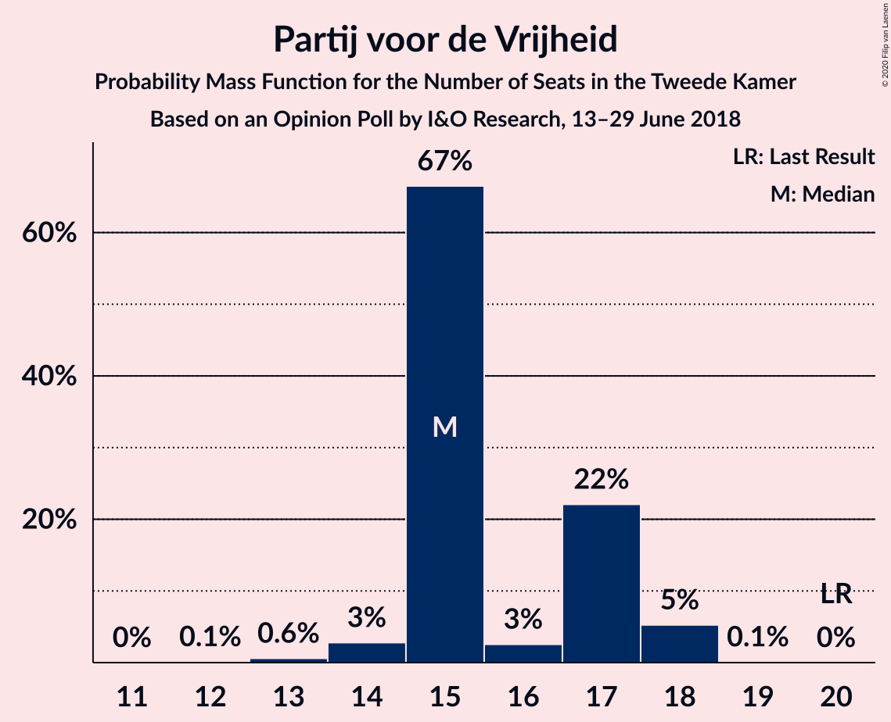

| Number of Seats | Probability | Accumulated | Special Marks |
|:---------------:|:-----------:|:-----------:|:-------------:|
| 13 | 0.3% | 100% |  |
| 14 | 2% | 99.7% |  |
| 15 | 67% | 98% | Median |
| 16 | 2% | 32% |  |
| 17 | 24% | 30% |  |
| 18 | 6% | 6% |  |
| 19 | 0.1% | 0.1% |  |
| 20 | 0% | 0% | Last Result |

### Democraten 66

*For a full overview of the results for this party, see the [Democraten 66](party-democraten66.html) page.*

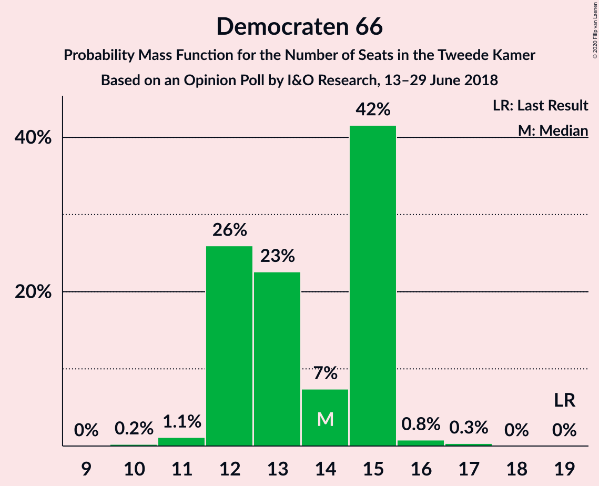

| Number of Seats | Probability | Accumulated | Special Marks |
|:---------------:|:-----------:|:-----------:|:-------------:|
| 10 | 0.3% | 100% |  |
| 11 | 0% | 99.7% |  |
| 12 | 31% | 99.7% |  |
| 13 | 24% | 69% | Median |
| 14 | 6% | 45% |  |
| 15 | 39% | 39% |  |
| 16 | 0.3% | 0.6% |  |
| 17 | 0.3% | 0.3% |  |
| 18 | 0% | 0% |  |
| 19 | 0% | 0% | Last Result |

### Socialistische Partij

*For a full overview of the results for this party, see the [Socialistische Partij](party-socialistischepartij.html) page.*

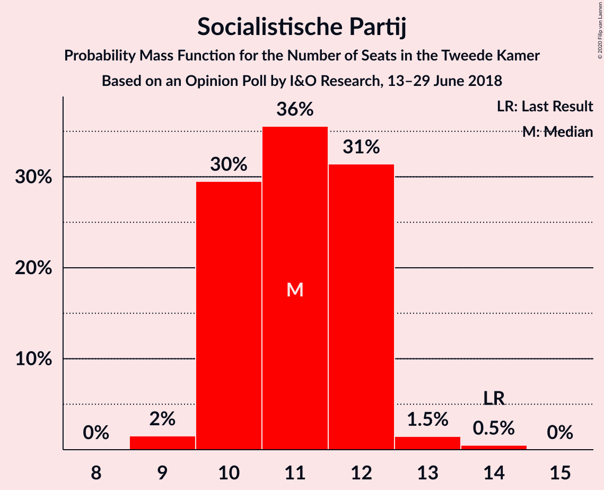

| Number of Seats | Probability | Accumulated | Special Marks |
|:---------------:|:-----------:|:-----------:|:-------------:|
| 9 | 0.6% | 100% |  |
| 10 | 35% | 99.4% |  |
| 11 | 39% | 64% | Median |
| 12 | 25% | 25% |  |
| 13 | 0.2% | 0.2% |  |
| 14 | 0.1% | 0.1% | Last Result |
| 15 | 0% | 0% |  |

### Forum voor Democratie

*For a full overview of the results for this party, see the [Forum voor Democratie](party-forumvoordemocratie.html) page.*

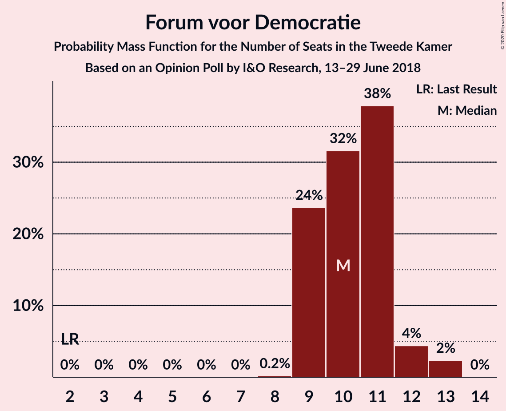

| Number of Seats | Probability | Accumulated | Special Marks |
|:---------------:|:-----------:|:-----------:|:-------------:|
| 2 | 0% | 100% | Last Result |
| 3 | 0% | 100% |  |
| 4 | 0% | 100% |  |
| 5 | 0% | 100% |  |
| 6 | 0% | 100% |  |
| 7 | 0% | 100% |  |
| 8 | 0.2% | 100% |  |
| 9 | 24% | 99.8% |  |
| 10 | 32% | 76% | Median |
| 11 | 38% | 45% |  |
| 12 | 4% | 7% |  |
| 13 | 2% | 2% |  |
| 14 | 0% | 0% |  |

### Partij van de Arbeid

*For a full overview of the results for this party, see the [Partij van de Arbeid](party-partijvandearbeid.html) page.*

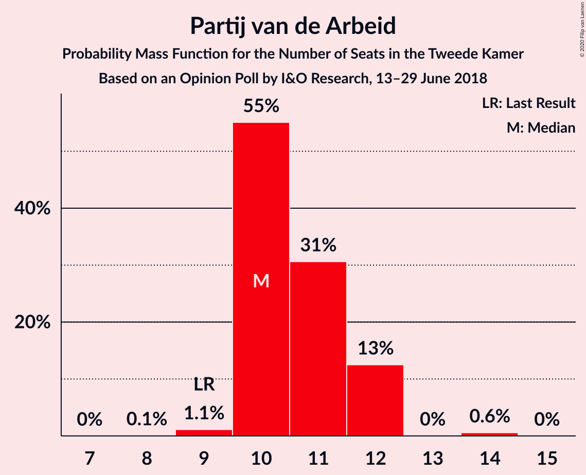

| Number of Seats | Probability | Accumulated | Special Marks |
|:---------------:|:-----------:|:-----------:|:-------------:|
| 9 | 1.1% | 100% | Last Result |
| 10 | 63% | 98.8% | Median |
| 11 | 34% | 36% |  |
| 12 | 2% | 2% |  |
| 13 | 0% | 0% |  |

### ChristenUnie

*For a full overview of the results for this party, see the [ChristenUnie](party-christenunie.html) page.*

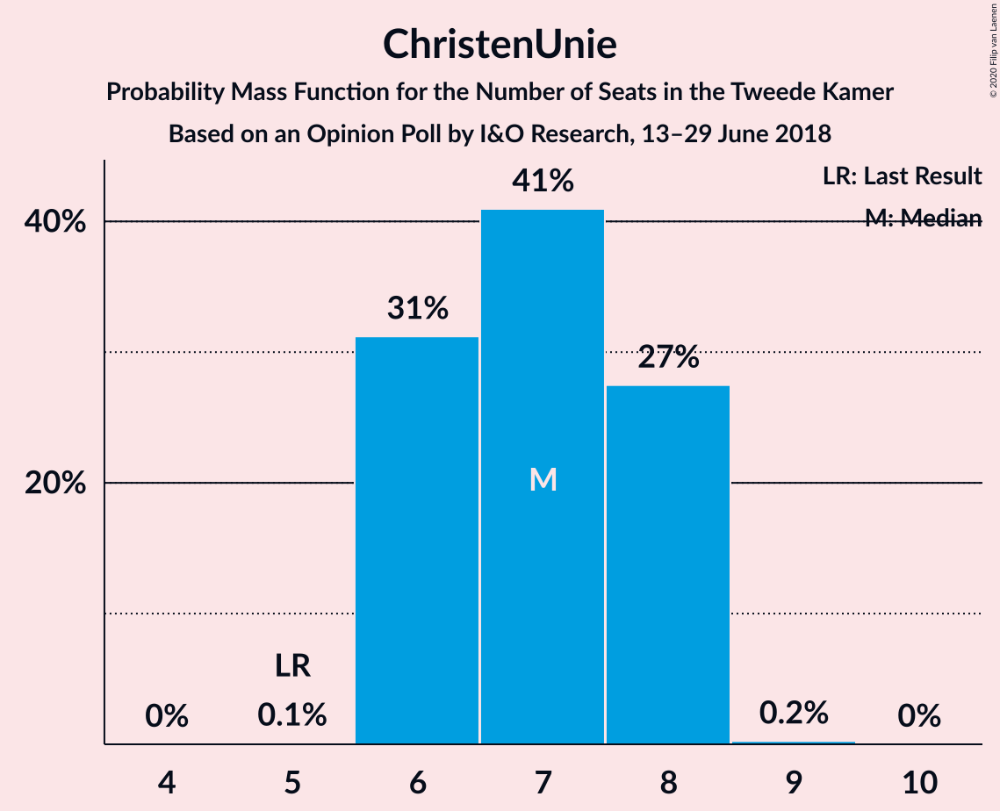

| Number of Seats | Probability | Accumulated | Special Marks |
|:---------------:|:-----------:|:-----------:|:-------------:|
| 5 | 0% | 100% | Last Result |
| 6 | 25% | 100% |  |
| 7 | 43% | 75% | Median |
| 8 | 32% | 32% |  |
| 9 | 0.1% | 0.1% |  |
| 10 | 0% | 0% |  |

### Partij voor de Dieren

*For a full overview of the results for this party, see the [Partij voor de Dieren](party-partijvoordedieren.html) page.*

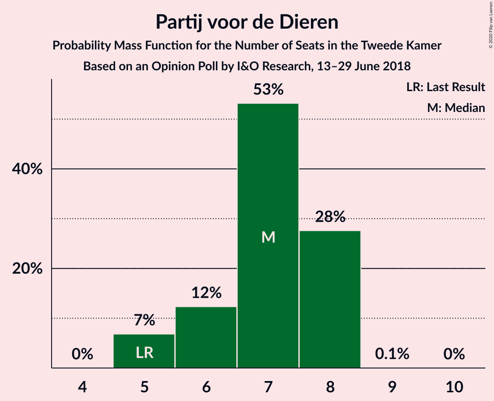

| Number of Seats | Probability | Accumulated | Special Marks |
|:---------------:|:-----------:|:-----------:|:-------------:|
| 5 | 5% | 100% | Last Result |
| 6 | 1.2% | 95% |  |
| 7 | 62% | 93% | Median |
| 8 | 31% | 31% |  |
| 9 | 0% | 0% |  |

### 50Plus

*For a full overview of the results for this party, see the [50Plus](party-50plus.html) page.*

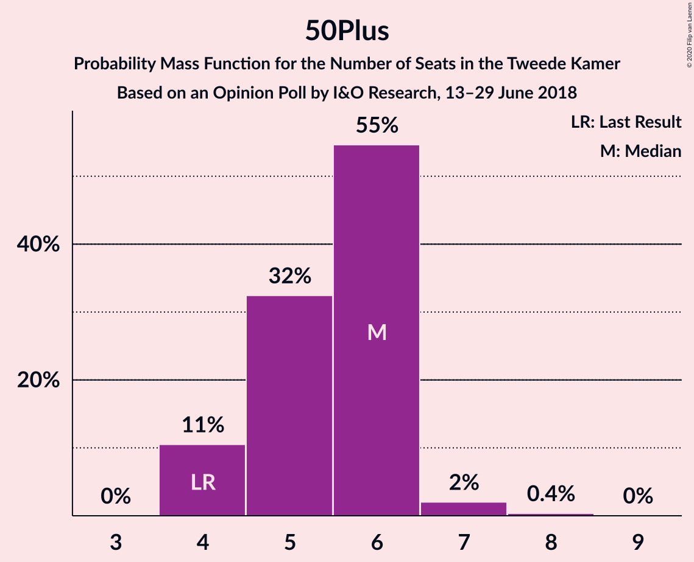

| Number of Seats | Probability | Accumulated | Special Marks |
|:---------------:|:-----------:|:-----------:|:-------------:|
| 4 | 1.0% | 100% | Last Result |
| 5 | 37% | 99.0% |  |
| 6 | 61% | 62% | Median |
| 7 | 1.1% | 2% |  |
| 8 | 0.4% | 0.5% |  |
| 9 | 0% | 0% |  |

### Staatkundig Gereformeerde Partij

*For a full overview of the results for this party, see the [Staatkundig Gereformeerde Partij](party-staatkundiggereformeerdepartij.html) page.*

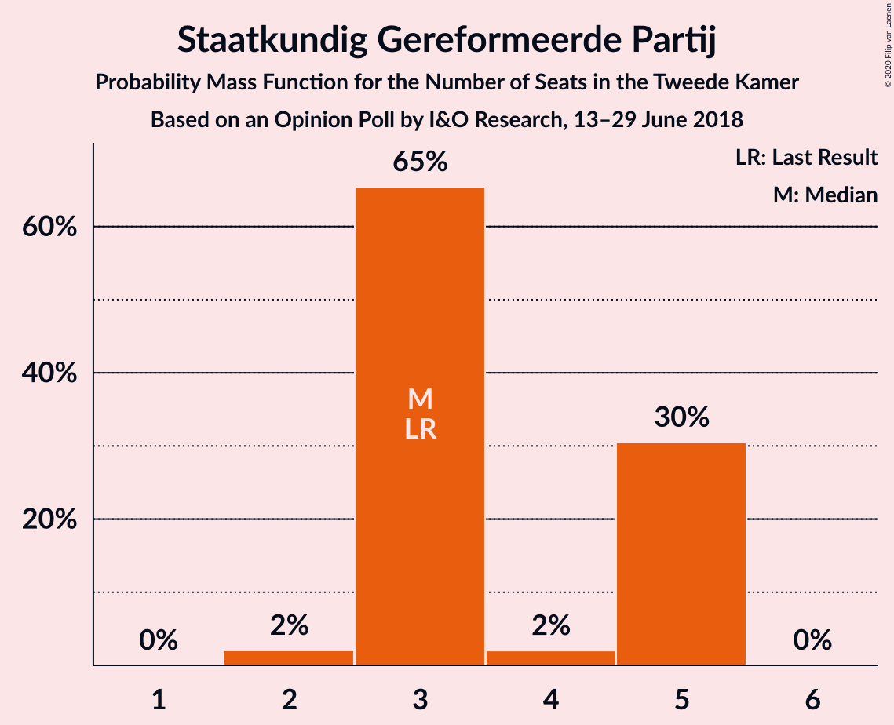

| Number of Seats | Probability | Accumulated | Special Marks |
|:---------------:|:-----------:|:-----------:|:-------------:|
| 2 | 2% | 100% |  |
| 3 | 65% | 98% | Last Result, Median |
| 4 | 2% | 33% |  |
| 5 | 30% | 30% |  |
| 6 | 0% | 0% |  |

### DENK

*For a full overview of the results for this party, see the [DENK](party-denk.html) page.*

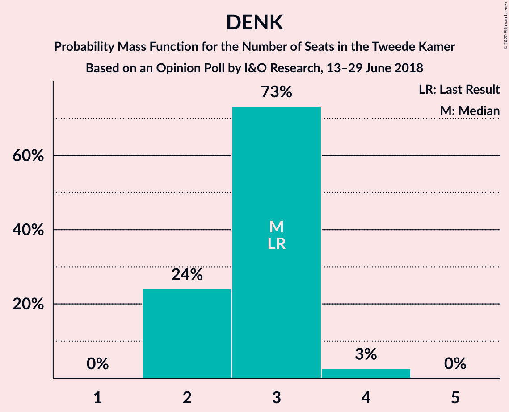

| Number of Seats | Probability | Accumulated | Special Marks |
|:---------------:|:-----------:|:-----------:|:-------------:|
| 2 | 24% | 100% |  |
| 3 | 73% | 76% | Last Result, Median |
| 4 | 3% | 3% |  |
| 5 | 0% | 0% |  |

## Coalitions

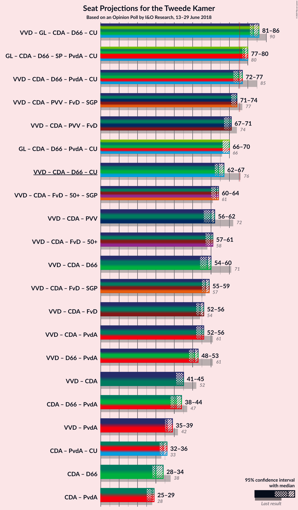

### Confidence Intervals

| Coalition | Last Result | Median | Majority? | 80% Confidence Interval | 90% Confidence Interval | 95% Confidence Interval | 99% Confidence Interval |
|:---------:|:-----------:|:------:|:---------:|:-----------------------:|:-----------------------:|:-----------------------:|:-----------------------:|
| Volkspartij voor Vrijheid en Democratie – GroenLinks – Christen-Democratisch Appèl – Democraten 66 – ChristenUnie | 90 | 83 | 100% | 82–86 | 81–86 | 81–86 | 80–86 |
| GroenLinks – Christen-Democratisch Appèl – Democraten 66 – Socialistische Partij – Partij van de Arbeid – ChristenUnie | 80 | 78 | 99.8% | 77–80 | 77–80 | 77–80 | 76–81 |
| Volkspartij voor Vrijheid en Democratie – Christen-Democratisch Appèl – Democraten 66 – Partij van de Arbeid – ChristenUnie | 85 | 75 | 32% | 72–77 | 72–77 | 72–77 | 71–77 |
| Volkspartij voor Vrijheid en Democratie – Christen-Democratisch Appèl – Partij voor de Vrijheid – Forum voor Democratie – Staatkundig Gereformeerde Partij | 77 | 74 | 0.6% | 72–74 | 72–74 | 71–74 | 70–76 |
| Volkspartij voor Vrijheid en Democratie – Christen-Democratisch Appèl – Partij voor de Vrijheid – Forum voor Democratie | 74 | 71 | 0% | 67–71 | 67–71 | 67–71 | 66–74 |
| GroenLinks – Christen-Democratisch Appèl – Democraten 66 – Partij van de Arbeid – ChristenUnie | 66 | 66 | 0% | 66–70 | 66–70 | 66–70 | 64–70 |
| Volkspartij voor Vrijheid en Democratie – Christen-Democratisch Appèl – Democraten 66 – ChristenUnie | 76 | 64 | 0% | 62–67 | 62–67 | 62–67 | 60–67 |
| Volkspartij voor Vrijheid en Democratie – Christen-Democratisch Appèl – Forum voor Democratie – 50Plus – Staatkundig Gereformeerde Partij | 61 | 63 | 0% | 63–64 | 60–64 | 60–64 | 60–65 |
| Volkspartij voor Vrijheid en Democratie – Christen-Democratisch Appèl – Partij voor de Vrijheid | 72 | 60 | 0% | 57–62 | 57–62 | 56–62 | 55–63 |
| Volkspartij voor Vrijheid en Democratie – Christen-Democratisch Appèl – Forum voor Democratie – 50Plus | 58 | 60 | 0% | 58–61 | 57–61 | 57–61 | 57–62 |
| Volkspartij voor Vrijheid en Democratie – Christen-Democratisch Appèl – Democraten 66 | 71 | 58 | 0% | 54–60 | 54–60 | 54–60 | 54–60 |
| Volkspartij voor Vrijheid en Democratie – Christen-Democratisch Appèl – Forum voor Democratie – Staatkundig Gereformeerde Partij | 57 | 57 | 0% | 57–59 | 55–59 | 55–59 | 55–59 |
| Volkspartij voor Vrijheid en Democratie – Christen-Democratisch Appèl – Forum voor Democratie | 54 | 54 | 0% | 52–56 | 52–56 | 52–56 | 51–56 |
| Volkspartij voor Vrijheid en Democratie – Christen-Democratisch Appèl – Partij van de Arbeid | 61 | 55 | 0% | 52–56 | 52–56 | 52–56 | 51–56 |
| Volkspartij voor Vrijheid en Democratie – Democraten 66 – Partij van de Arbeid | 61 | 51 | 0% | 48–52 | 48–53 | 48–53 | 48–55 |
| Volkspartij voor Vrijheid en Democratie – Christen-Democratisch Appèl | 52 | 45 | 0% | 42–45 | 41–45 | 41–45 | 40–45 |
| Christen-Democratisch Appèl – Democraten 66 – Partij van de Arbeid | 47 | 41 | 0% | 38–44 | 38–44 | 38–44 | 38–44 |
| Volkspartij voor Vrijheid en Democratie – Partij van de Arbeid | 42 | 36 | 0% | 36–39 | 36–39 | 35–39 | 35–40 |
| Christen-Democratisch Appèl – Partij van de Arbeid – ChristenUnie | 33 | 34 | 0% | 34–36 | 32–36 | 32–36 | 32–36 |
| Christen-Democratisch Appèl – Democraten 66 | 38 | 30 | 0% | 28–34 | 28–34 | 28–34 | 27–34 |
| Christen-Democratisch Appèl – Partij van de Arbeid | 28 | 28 | 0% | 26–29 | 26–29 | 25–29 | 25–29 |

### Volkspartij voor Vrijheid en Democratie – GroenLinks – Christen-Democratisch Appèl – Democraten 66 – ChristenUnie

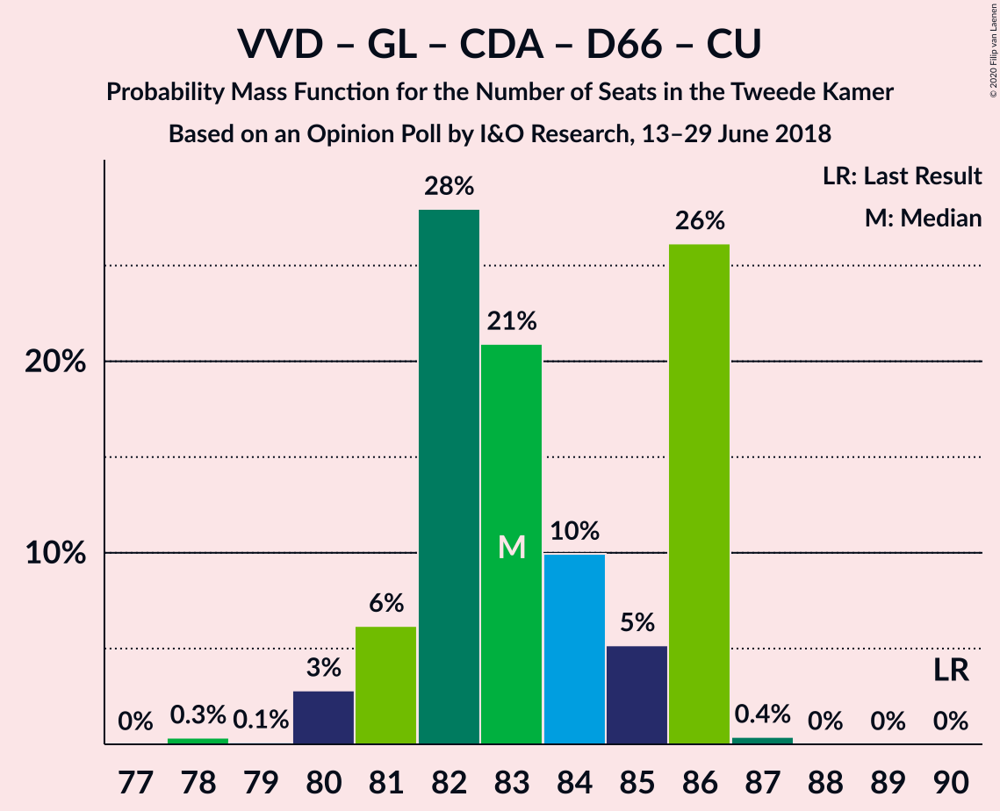

| Number of Seats | Probability | Accumulated | Special Marks |
|:---------------:|:-----------:|:-----------:|:-------------:|
| 78 | 0.2% | 100% |  |
| 79 | 0.1% | 99.8% |  |
| 80 | 0.6% | 99.7% |  |
| 81 | 7% | 99.1% |  |
| 82 | 32% | 92% | Median |
| 83 | 24% | 60% |  |
| 84 | 0.2% | 37% |  |
| 85 | 6% | 37% |  |
| 86 | 31% | 31% |  |
| 87 | 0.1% | 0.1% |  |
| 88 | 0% | 0.1% |  |
| 89 | 0% | 0% |  |
| 90 | 0% | 0% | Last Result |

### GroenLinks – Christen-Democratisch Appèl – Democraten 66 – Socialistische Partij – Partij van de Arbeid – ChristenUnie

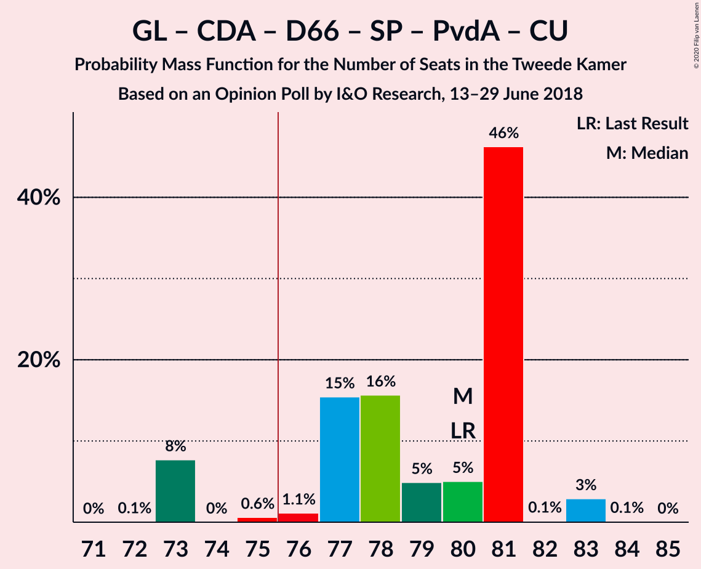

| Number of Seats | Probability | Accumulated | Special Marks |
|:---------------:|:-----------:|:-----------:|:-------------:|
| 74 | 0.1% | 100% |  |
| 75 | 0.1% | 99.9% |  |
| 76 | 0.7% | 99.8% | Majority |
| 77 | 32% | 99.1% | Median |
| 78 | 34% | 68% |  |
| 79 | 1.4% | 33% |  |
| 80 | 30% | 32% | Last Result |
| 81 | 2% | 2% |  |
| 82 | 0% | 0.1% |  |
| 83 | 0% | 0% |  |

### Volkspartij voor Vrijheid en Democratie – Christen-Democratisch Appèl – Democraten 66 – Partij van de Arbeid – ChristenUnie

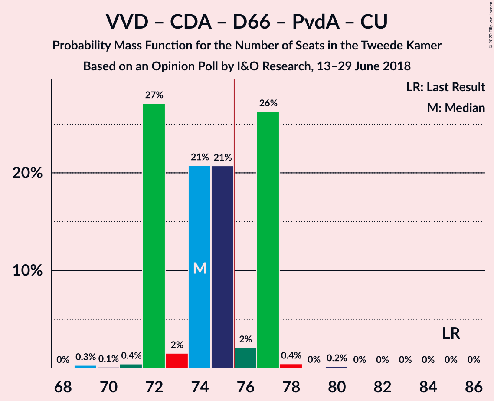

| Number of Seats | Probability | Accumulated | Special Marks |
|:---------------:|:-----------:|:-----------:|:-------------:|
| 69 | 0.3% | 100% |  |
| 70 | 0.1% | 99.7% |  |
| 71 | 0.2% | 99.6% |  |
| 72 | 31% | 99.4% |  |
| 73 | 2% | 69% | Median |
| 74 | 11% | 67% |  |
| 75 | 24% | 56% |  |
| 76 | 0.6% | 32% | Majority |
| 77 | 31% | 31% |  |
| 78 | 0.3% | 0.3% |  |
| 79 | 0% | 0% |  |
| 80 | 0% | 0% |  |
| 81 | 0% | 0% |  |
| 82 | 0% | 0% |  |
| 83 | 0% | 0% |  |
| 84 | 0% | 0% |  |
| 85 | 0% | 0% | Last Result |

### Volkspartij voor Vrijheid en Democratie – Christen-Democratisch Appèl – Partij voor de Vrijheid – Forum voor Democratie – Staatkundig Gereformeerde Partij

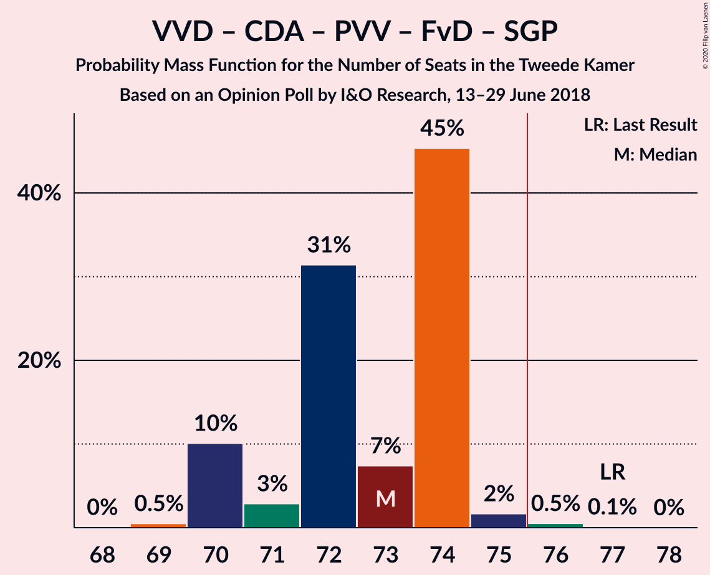

| Number of Seats | Probability | Accumulated | Special Marks |
|:---------------:|:-----------:|:-----------:|:-------------:|
| 70 | 1.0% | 100% |  |
| 71 | 3% | 98.9% | Median |
| 72 | 35% | 96% |  |
| 73 | 7% | 61% |  |
| 74 | 54% | 55% |  |
| 75 | 0.2% | 0.7% |  |
| 76 | 0.6% | 0.6% | Majority |
| 77 | 0% | 0% | Last Result |

### Volkspartij voor Vrijheid en Democratie – Christen-Democratisch Appèl – Partij voor de Vrijheid – Forum voor Democratie

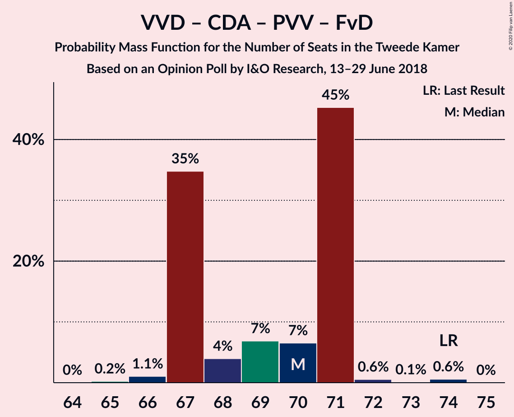

| Number of Seats | Probability | Accumulated | Special Marks |
|:---------------:|:-----------:|:-----------:|:-------------:|
| 66 | 0.9% | 100% |  |
| 67 | 31% | 99.1% |  |
| 68 | 2% | 68% | Median |
| 69 | 6% | 67% |  |
| 70 | 6% | 61% |  |
| 71 | 54% | 55% |  |
| 72 | 0.1% | 0.8% |  |
| 73 | 0.1% | 0.7% |  |
| 74 | 0.6% | 0.6% | Last Result |
| 75 | 0% | 0% |  |

### GroenLinks – Christen-Democratisch Appèl – Democraten 66 – Partij van de Arbeid – ChristenUnie

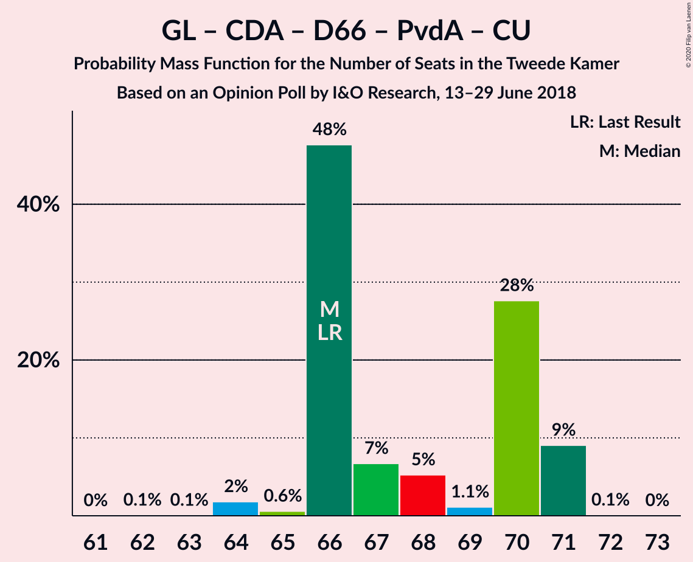

| Number of Seats | Probability | Accumulated | Special Marks |
|:---------------:|:-----------:|:-----------:|:-------------:|
| 62 | 0.1% | 100% |  |
| 63 | 0% | 99.9% |  |
| 64 | 0.7% | 99.9% |  |
| 65 | 0.4% | 99.1% |  |
| 66 | 55% | 98.7% | Last Result, Median |
| 67 | 6% | 44% |  |
| 68 | 6% | 38% |  |
| 69 | 1.2% | 33% |  |
| 70 | 32% | 32% |  |
| 71 | 0% | 0.1% |  |
| 72 | 0% | 0% |  |

### Volkspartij voor Vrijheid en Democratie – Christen-Democratisch Appèl – Democraten 66 – ChristenUnie

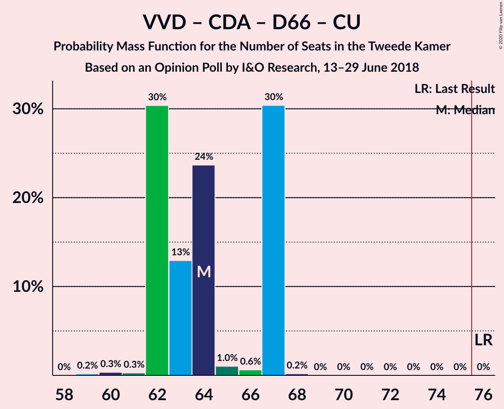

| Number of Seats | Probability | Accumulated | Special Marks |
|:---------------:|:-----------:|:-----------:|:-------------:|
| 59 | 0.2% | 100% |  |
| 60 | 0.3% | 99.8% |  |
| 61 | 0.3% | 99.5% |  |
| 62 | 30% | 99.2% |  |
| 63 | 13% | 69% | Median |
| 64 | 24% | 56% |  |
| 65 | 1.0% | 32% |  |
| 66 | 0.6% | 31% |  |
| 67 | 30% | 31% |  |
| 68 | 0.2% | 0.2% |  |
| 69 | 0% | 0% |  |
| 70 | 0% | 0% |  |
| 71 | 0% | 0% |  |
| 72 | 0% | 0% |  |
| 73 | 0% | 0% |  |
| 74 | 0% | 0% |  |
| 75 | 0% | 0% |  |
| 76 | 0% | 0% | Last Result, Majority |

### Volkspartij voor Vrijheid en Democratie – Christen-Democratisch Appèl – Forum voor Democratie – 50Plus – Staatkundig Gereformeerde Partij

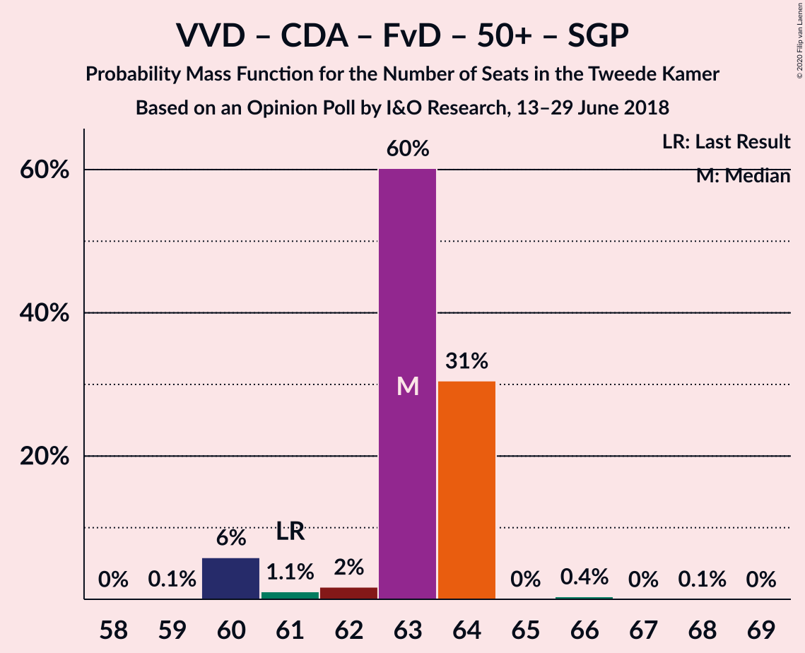

| Number of Seats | Probability | Accumulated | Special Marks |
|:---------------:|:-----------:|:-----------:|:-------------:|
| 59 | 0.1% | 100% |  |
| 60 | 6% | 99.9% |  |
| 61 | 1.1% | 94% | Last Result |
| 62 | 2% | 93% | Median |
| 63 | 60% | 91% |  |
| 64 | 31% | 31% |  |
| 65 | 0% | 0.5% |  |
| 66 | 0.4% | 0.5% |  |
| 67 | 0% | 0.1% |  |
| 68 | 0.1% | 0.1% |  |
| 69 | 0% | 0% |  |

### Volkspartij voor Vrijheid en Democratie – Christen-Democratisch Appèl – Partij voor de Vrijheid

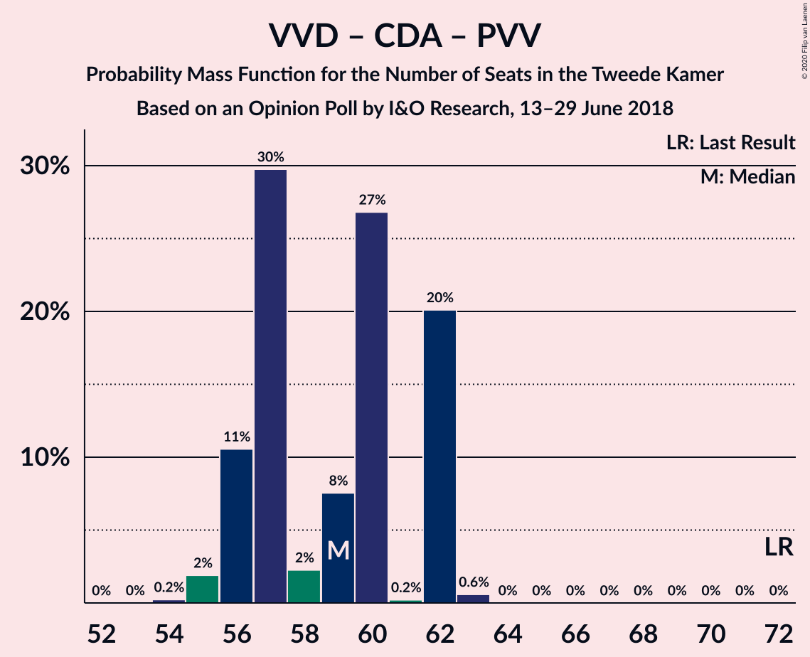

| Number of Seats | Probability | Accumulated | Special Marks |
|:---------------:|:-----------:|:-----------:|:-------------:|
| 55 | 2% | 100% |  |
| 56 | 1.3% | 98% |  |
| 57 | 35% | 97% |  |
| 58 | 0.6% | 62% | Median |
| 59 | 7% | 62% |  |
| 60 | 31% | 55% |  |
| 61 | 0.1% | 24% |  |
| 62 | 23% | 24% |  |
| 63 | 0.7% | 0.7% |  |
| 64 | 0% | 0% |  |
| 65 | 0% | 0% |  |
| 66 | 0% | 0% |  |
| 67 | 0% | 0% |  |
| 68 | 0% | 0% |  |
| 69 | 0% | 0% |  |
| 70 | 0% | 0% |  |
| 71 | 0% | 0% |  |
| 72 | 0% | 0% | Last Result |

### Volkspartij voor Vrijheid en Democratie – Christen-Democratisch Appèl – Forum voor Democratie – 50Plus

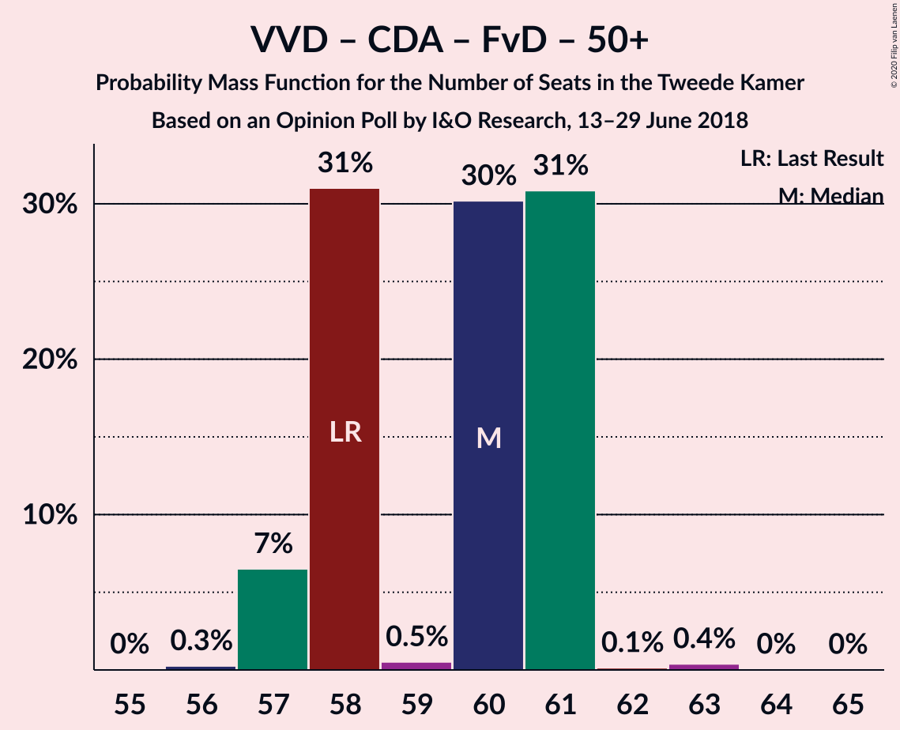

| Number of Seats | Probability | Accumulated | Special Marks |
|:---------------:|:-----------:|:-----------:|:-------------:|
| 55 | 0% | 100% |  |
| 56 | 0.3% | 99.9% |  |
| 57 | 7% | 99.7% |  |
| 58 | 31% | 93% | Last Result |
| 59 | 0.5% | 62% | Median |
| 60 | 30% | 62% |  |
| 61 | 31% | 31% |  |
| 62 | 0.1% | 0.6% |  |
| 63 | 0.4% | 0.5% |  |
| 64 | 0% | 0.1% |  |
| 65 | 0% | 0% |  |

### Volkspartij voor Vrijheid en Democratie – Christen-Democratisch Appèl – Democraten 66

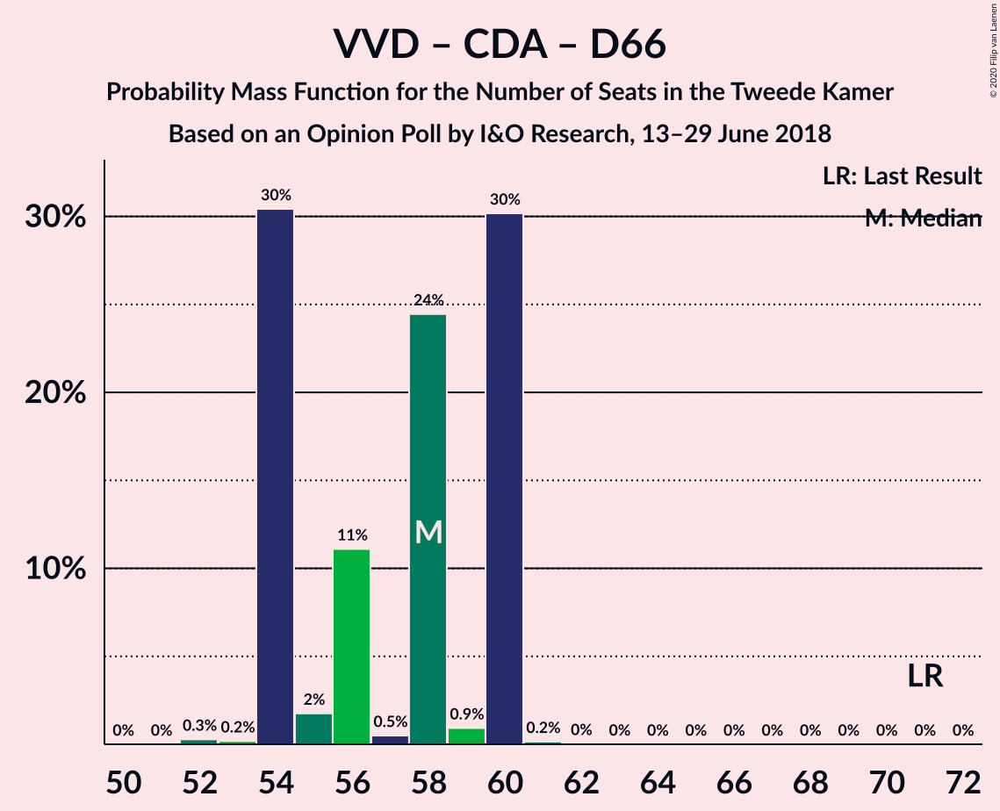

| Number of Seats | Probability | Accumulated | Special Marks |
|:---------------:|:-----------:|:-----------:|:-------------:|
| 52 | 0.3% | 100% |  |
| 53 | 0.2% | 99.7% |  |
| 54 | 30% | 99.5% |  |
| 55 | 2% | 69% |  |
| 56 | 11% | 67% | Median |
| 57 | 0.5% | 56% |  |
| 58 | 24% | 56% |  |
| 59 | 0.9% | 31% |  |
| 60 | 30% | 30% |  |
| 61 | 0.2% | 0.2% |  |
| 62 | 0% | 0% |  |
| 63 | 0% | 0% |  |
| 64 | 0% | 0% |  |
| 65 | 0% | 0% |  |
| 66 | 0% | 0% |  |
| 67 | 0% | 0% |  |
| 68 | 0% | 0% |  |
| 69 | 0% | 0% |  |
| 70 | 0% | 0% |  |
| 71 | 0% | 0% | Last Result |

### Volkspartij voor Vrijheid en Democratie – Christen-Democratisch Appèl – Forum voor Democratie – Staatkundig Gereformeerde Partij

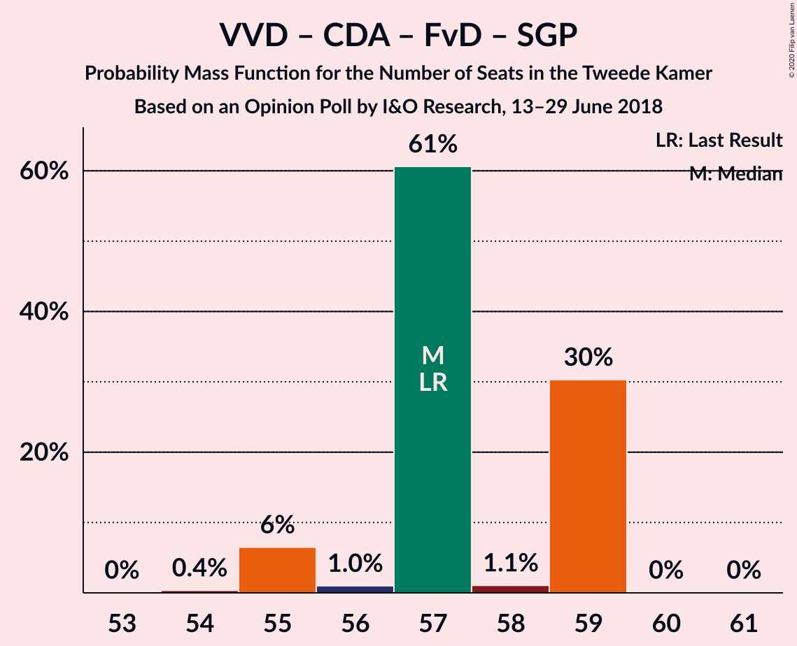

| Number of Seats | Probability | Accumulated | Special Marks |
|:---------------:|:-----------:|:-----------:|:-------------:|
| 53 | 0% | 100% |  |
| 54 | 0.4% | 99.9% |  |
| 55 | 6% | 99.6% |  |
| 56 | 1.0% | 93% | Median |
| 57 | 61% | 92% | Last Result |
| 58 | 1.1% | 31% |  |
| 59 | 30% | 30% |  |
| 60 | 0% | 0.1% |  |
| 61 | 0% | 0% |  |

### Volkspartij voor Vrijheid en Democratie – Christen-Democratisch Appèl – Forum voor Democratie

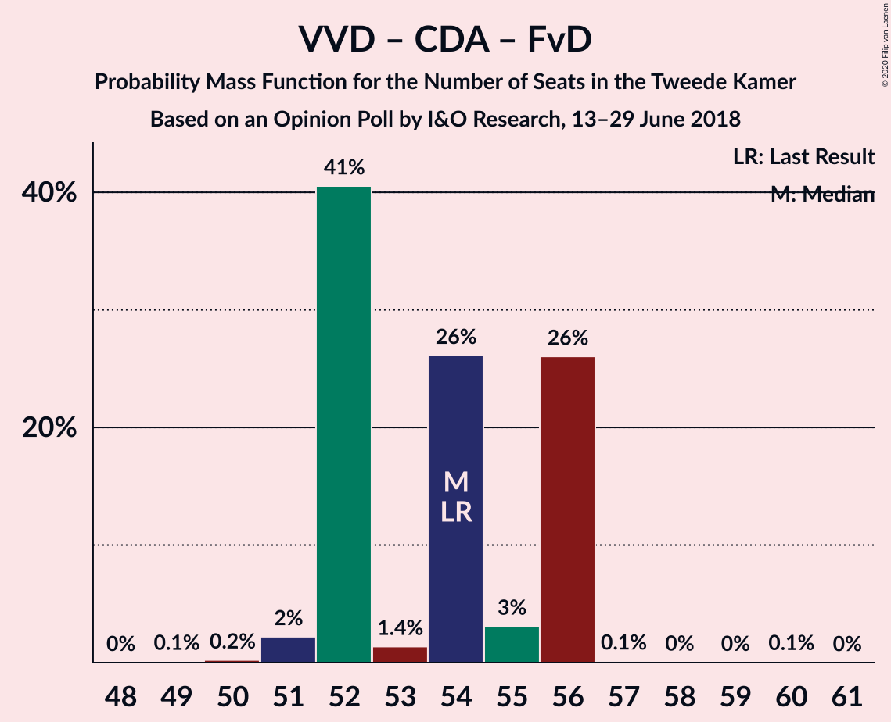

| Number of Seats | Probability | Accumulated | Special Marks |
|:---------------:|:-----------:|:-----------:|:-------------:|
| 49 | 0% | 100% |  |
| 50 | 0.2% | 99.9% |  |
| 51 | 0.6% | 99.8% |  |
| 52 | 36% | 99.2% |  |
| 53 | 1.2% | 63% | Median |
| 54 | 30% | 61% | Last Result |
| 55 | 0.5% | 31% |  |
| 56 | 31% | 31% |  |
| 57 | 0.1% | 0.2% |  |
| 58 | 0% | 0% |  |

### Volkspartij voor Vrijheid en Democratie – Christen-Democratisch Appèl – Partij van de Arbeid

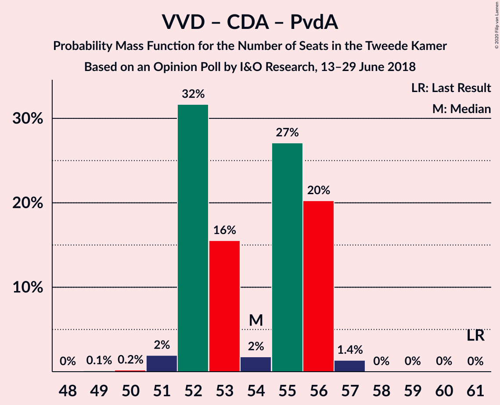

| Number of Seats | Probability | Accumulated | Special Marks |
|:---------------:|:-----------:|:-----------:|:-------------:|
| 49 | 0% | 100% |  |
| 50 | 0.1% | 99.9% |  |
| 51 | 2% | 99.8% |  |
| 52 | 38% | 98% |  |
| 53 | 5% | 60% | Median |
| 54 | 0.5% | 56% |  |
| 55 | 32% | 55% |  |
| 56 | 24% | 24% |  |
| 57 | 0.1% | 0.1% |  |
| 58 | 0% | 0% |  |
| 59 | 0% | 0% |  |
| 60 | 0% | 0% |  |
| 61 | 0% | 0% | Last Result |

### Volkspartij voor Vrijheid en Democratie – Democraten 66 – Partij van de Arbeid

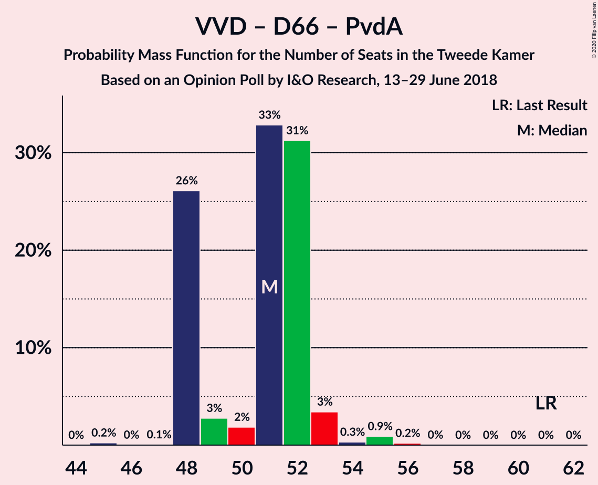

| Number of Seats | Probability | Accumulated | Special Marks |
|:---------------:|:-----------:|:-----------:|:-------------:|
| 45 | 0.3% | 100% |  |
| 46 | 0% | 99.7% |  |
| 47 | 0% | 99.7% |  |
| 48 | 30% | 99.7% |  |
| 49 | 1.5% | 69% | Median |
| 50 | 2% | 68% |  |
| 51 | 37% | 66% |  |
| 52 | 24% | 29% |  |
| 53 | 4% | 5% |  |
| 54 | 0.3% | 1.3% |  |
| 55 | 0.9% | 1.0% |  |
| 56 | 0.1% | 0.1% |  |
| 57 | 0% | 0% |  |
| 58 | 0% | 0% |  |
| 59 | 0% | 0% |  |
| 60 | 0% | 0% |  |
| 61 | 0% | 0% | Last Result |

### Volkspartij voor Vrijheid en Democratie – Christen-Democratisch Appèl

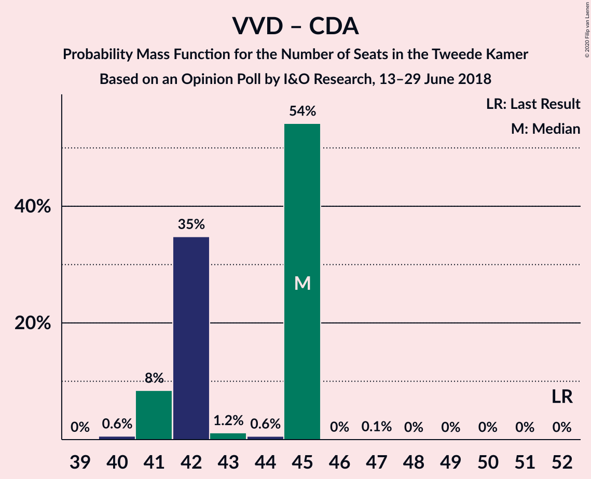

| Number of Seats | Probability | Accumulated | Special Marks |
|:---------------:|:-----------:|:-----------:|:-------------:|
| 40 | 0.6% | 100% |  |
| 41 | 8% | 99.4% |  |
| 42 | 35% | 91% |  |
| 43 | 1.2% | 56% | Median |
| 44 | 0.6% | 55% |  |
| 45 | 54% | 54% |  |
| 46 | 0% | 0.2% |  |
| 47 | 0.1% | 0.1% |  |
| 48 | 0% | 0% |  |
| 49 | 0% | 0% |  |
| 50 | 0% | 0% |  |
| 51 | 0% | 0% |  |
| 52 | 0% | 0% | Last Result |

### Christen-Democratisch Appèl – Democraten 66 – Partij van de Arbeid

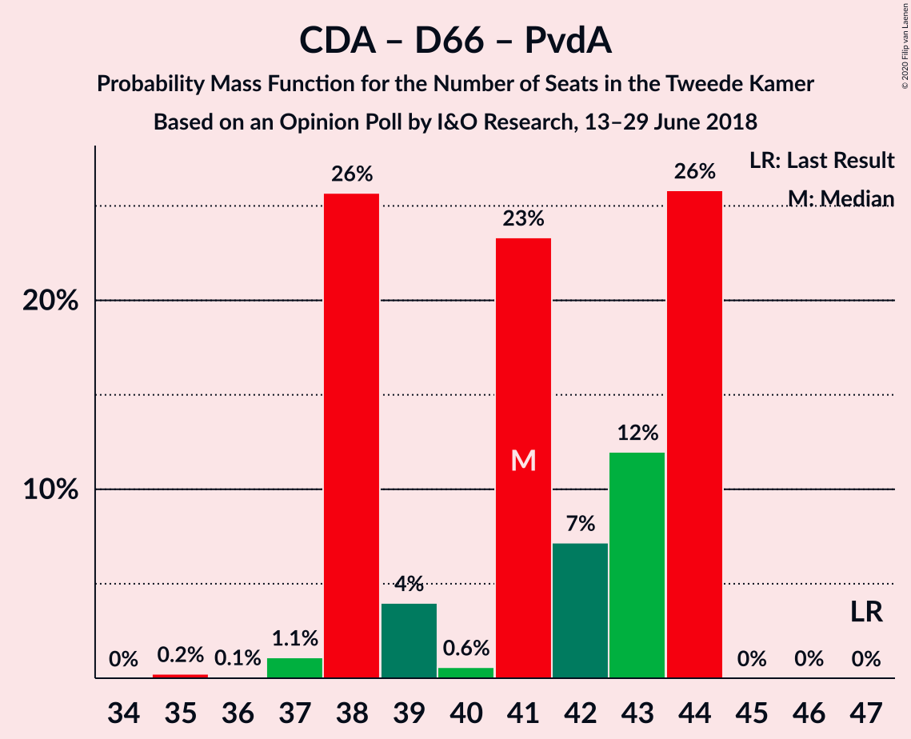

| Number of Seats | Probability | Accumulated | Special Marks |
|:---------------:|:-----------:|:-----------:|:-------------:|
| 35 | 0.3% | 100% |  |
| 36 | 0.1% | 99.7% |  |
| 37 | 0% | 99.7% |  |
| 38 | 31% | 99.7% |  |
| 39 | 5% | 69% |  |
| 40 | 0.1% | 64% | Median |
| 41 | 25% | 64% |  |
| 42 | 8% | 39% |  |
| 43 | 0.9% | 31% |  |
| 44 | 30% | 30% |  |
| 45 | 0% | 0% |  |
| 46 | 0% | 0% |  |
| 47 | 0% | 0% | Last Result |

### Volkspartij voor Vrijheid en Democratie – Partij van de Arbeid

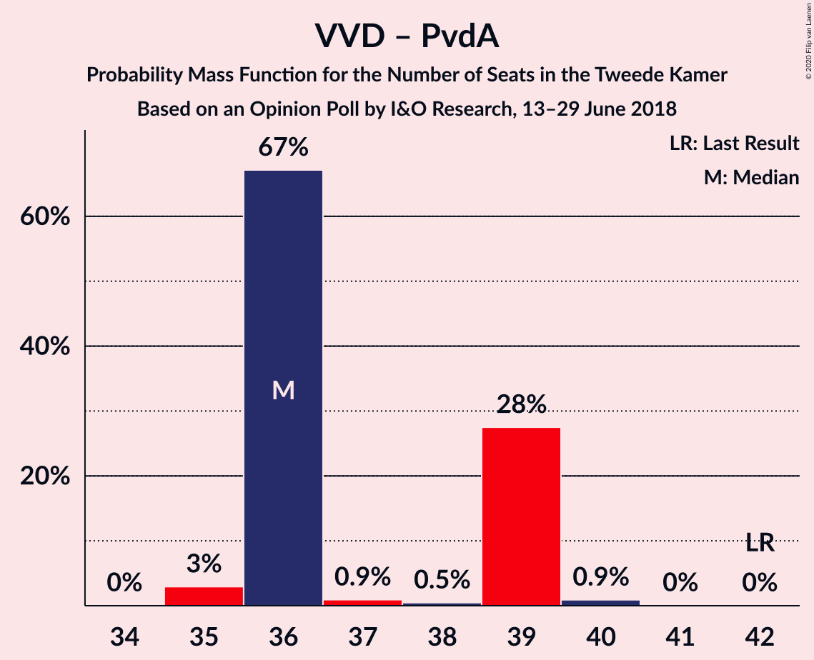

| Number of Seats | Probability | Accumulated | Special Marks |
|:---------------:|:-----------:|:-----------:|:-------------:|
| 35 | 3% | 100% |  |
| 36 | 67% | 97% | Median |
| 37 | 0.9% | 30% |  |
| 38 | 0.5% | 29% |  |
| 39 | 28% | 28% |  |
| 40 | 0.9% | 1.0% |  |
| 41 | 0% | 0.1% |  |
| 42 | 0% | 0% | Last Result |

### Christen-Democratisch Appèl – Partij van de Arbeid – ChristenUnie

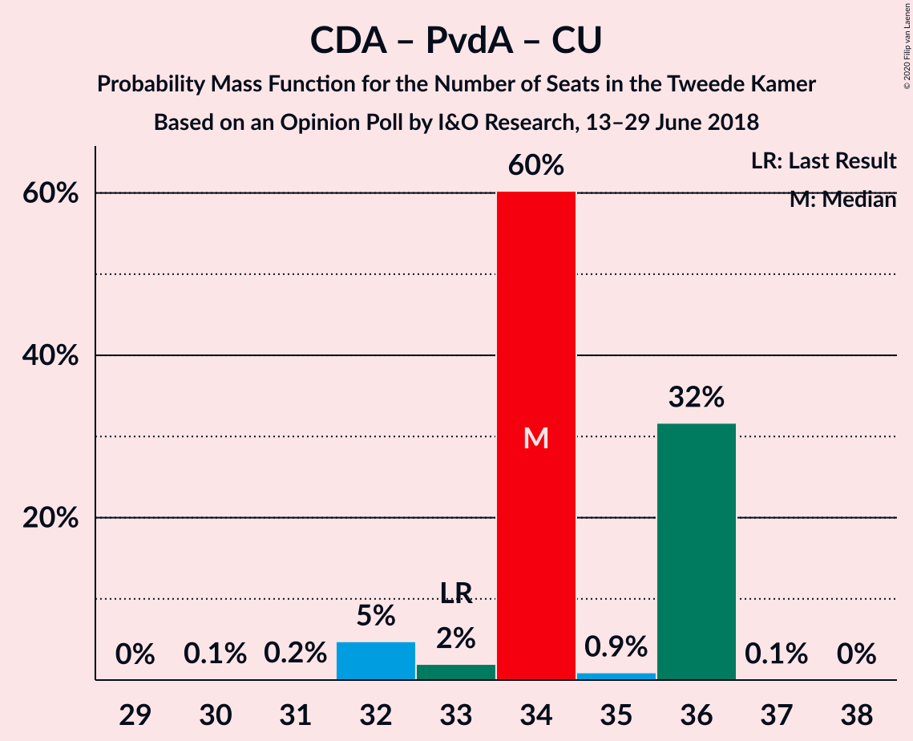

| Number of Seats | Probability | Accumulated | Special Marks |
|:---------------:|:-----------:|:-----------:|:-------------:|
| 30 | 0.1% | 100% |  |
| 31 | 0.2% | 99.9% |  |
| 32 | 5% | 99.7% |  |
| 33 | 2% | 95% | Last Result |
| 34 | 60% | 93% | Median |
| 35 | 0.9% | 33% |  |
| 36 | 32% | 32% |  |
| 37 | 0.1% | 0.1% |  |
| 38 | 0% | 0% |  |

### Christen-Democratisch Appèl – Democraten 66

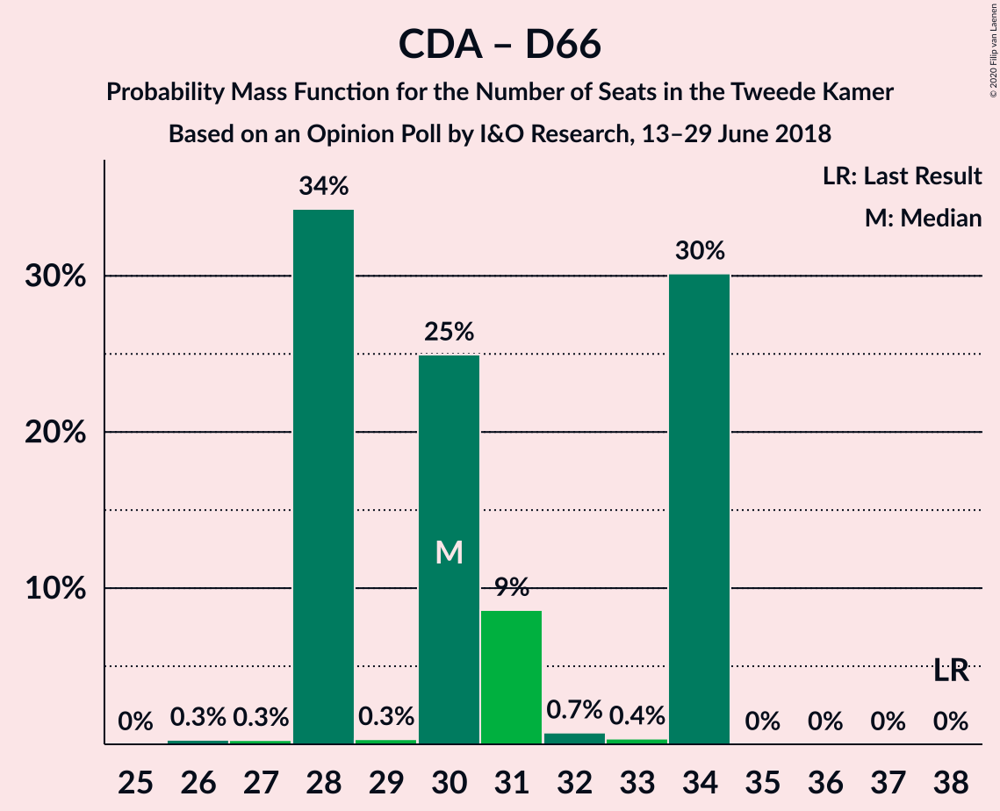

| Number of Seats | Probability | Accumulated | Special Marks |
|:---------------:|:-----------:|:-----------:|:-------------:|
| 26 | 0.3% | 100% |  |
| 27 | 0.3% | 99.7% |  |
| 28 | 34% | 99.4% |  |
| 29 | 0.3% | 65% |  |
| 30 | 25% | 65% | Median |
| 31 | 9% | 40% |  |
| 32 | 0.7% | 31% |  |
| 33 | 0.4% | 31% |  |
| 34 | 30% | 30% |  |
| 35 | 0% | 0% |  |
| 36 | 0% | 0% |  |
| 37 | 0% | 0% |  |
| 38 | 0% | 0% | Last Result |

### Christen-Democratisch Appèl – Partij van de Arbeid

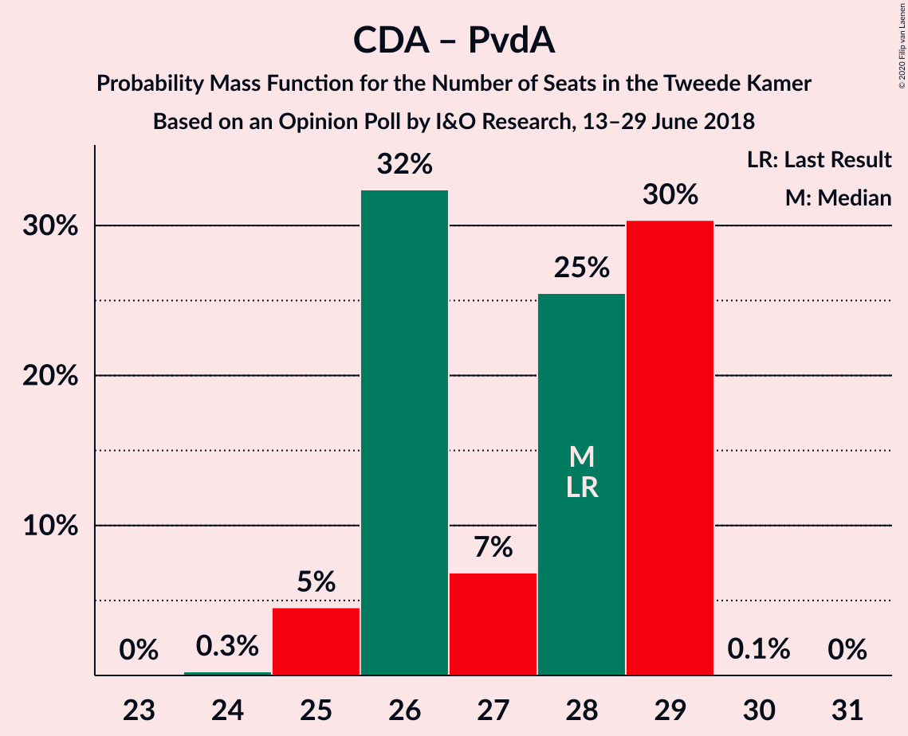

| Number of Seats | Probability | Accumulated | Special Marks |
|:---------------:|:-----------:|:-----------:|:-------------:|
| 24 | 0.3% | 100% |  |
| 25 | 5% | 99.7% |  |
| 26 | 32% | 95% |  |
| 27 | 7% | 63% | Median |
| 28 | 25% | 56% | Last Result |
| 29 | 30% | 30% |  |
| 30 | 0.1% | 0.1% |  |
| 31 | 0% | 0% |  |

## Technical Information

### Opinion Poll

+ **Polling firm:** I&O Research
+ **Commissioner(s):** —
+ **Fieldwork period:** 13–29 June 2018

### Calculations

+ **Sample size:** 2252
+ **Simulations done:** 131,072
+ **Error estimate:** 2.19%

