# Opinion Poll by Peil.nl, 2–8 July 2018

<a href="#voting-intentions">Voting Intentions</a> | <a href="#seats">Seats</a> | <a href="#coalitions">Coalitions</a> | <a href="#technical-information">Technical Information</a>

## Voting Intentions

### Confidence Intervals

| Party | Last Result | Poll Result | 80% Confidence Interval | 90% Confidence Interval | 95% Confidence Interval | 99% Confidence Interval |
|:-----:|:-----------:|:-----------:|:-----------------------:|:-----------------------:|:-----------------------:|:-----------------------:|
| Volkspartij voor Vrijheid en Democratie | 21.3% | 20.0% | 19.1–21.0% |18.8–21.2% |18.6–21.5% |18.2–21.9% |
| GroenLinks | 9.1% | 11.3% | 10.6–12.1% |10.4–12.3% |10.2–12.5% |9.9–12.9% |
| Partij voor de Vrijheid | 13.1% | 10.0% | 9.3–10.7% |9.1–10.9% |9.0–11.1% |8.7–11.5% |
| Forum voor Democratie | 1.8% | 10.0% | 9.3–10.7% |9.1–10.9% |9.0–11.1% |8.7–11.5% |
| Democraten 66 | 12.2% | 8.7% | 8.0–9.4% |7.8–9.6% |7.7–9.7% |7.4–10.1% |
| Christen-Democratisch Appèl | 12.4% | 8.0% | 7.4–8.7% |7.2–8.9% |7.1–9.0% |6.8–9.4% |
| Socialistische Partij | 9.1% | 7.3% | 6.8–8.0% |6.6–8.2% |6.4–8.3% |6.2–8.6% |
| Partij van de Arbeid | 5.7% | 6.7% | 6.1–7.3% |6.0–7.5% |5.8–7.6% |5.6–7.9% |
| Partij voor de Dieren | 3.2% | 4.7% | 4.2–5.2% |4.1–5.3% |4.0–5.5% |3.7–5.8% |
| ChristenUnie | 3.4% | 4.0% | 3.6–4.5% |3.4–4.6% |3.4–4.8% |3.2–5.0% |
| DENK | 2.1% | 4.0% | 3.6–4.5% |3.4–4.6% |3.4–4.8% |3.2–5.0% |
| 50Plus | 3.1% | 3.3% | 2.9–3.8% |2.8–3.9% |2.7–4.0% |2.6–4.3% |
| Staatkundig Gereformeerde Partij | 2.1% | 2.0% | 1.7–2.4% |1.6–2.5% |1.6–2.6% |1.4–2.8% |

*Note:* The poll result column reflects the actual value used in the calculations. Published results may vary slightly, and in addition be rounded to fewer digits.

## Seats

### Confidence Intervals

| Party | Last Result | Median | 80% Confidence Interval | 90% Confidence Interval | 95% Confidence Interval | 99% Confidence Interval |
|:-----:|:-----------:|:------:|:-----------------------:|:-----------------------:|:-----------------------:|:-----------------------:|
| <a href="#volkspartij-voor-vrijheid-en-democratie">Volkspartij voor Vrijheid en Democratie</a> | 33 | 29 | 29–32 |29–32 |29–32 |28–33 |
| <a href="#groenlinks">GroenLinks</a> | 14 | 18 | 16–18 |16–18 |16–18 |16–19 |
| <a href="#partij-voor-de-vrijheid">Partij voor de Vrijheid</a> | 20 | 13 | 13–16 |13–16 |13–16 |13–16 |
| <a href="#forum-voor-democratie">Forum voor Democratie</a> | 2 | 16 | 13–16 |13–16 |13–16 |13–18 |
| <a href="#democraten-66">Democraten 66</a> | 19 | 13 | 12–13 |12–13 |12–13 |12–15 |
| <a href="#christen-democratisch-appèl">Christen-Democratisch Appèl</a> | 19 | 11 | 11–13 |11–13 |11–13 |9–14 |
| <a href="#socialistische-partij">Socialistische Partij</a> | 14 | 12 | 9–12 |9–12 |9–12 |9–13 |
| <a href="#partij-van-de-arbeid">Partij van de Arbeid</a> | 9 | 10 | 10–11 |10–11 |10–11 |9–13 |
| <a href="#partij-voor-de-dieren">Partij voor de Dieren</a> | 5 | 7 | 7–8 |6–8 |6–8 |6–9 |
| <a href="#christenunie">ChristenUnie</a> | 5 | 6 | 6 |6 |5–6 |4–7 |
| <a href="#denk">DENK</a> | 3 | 6 | 5–7 |5–7 |5–7 |5–7 |
| <a href="#50plus">50Plus</a> | 4 | 5 | 4–5 |4–5 |4–5 |4–5 |
| <a href="#staatkundig-gereformeerde-partij">Staatkundig Gereformeerde Partij</a> | 3 | 4 | 3–4 |3–4 |2–4 |2–4 |

### Volkspartij voor Vrijheid en Democratie

*For a full overview of the results for this party, see the [Volkspartij voor Vrijheid en Democratie](party-volkspartijvoorvrijheidendemocratie.html) page.*

| Number of Seats | Probability | Accumulated | Special Marks |
|:---------------:|:-----------:|:-----------:|:-------------:|
| 27 | 0.1% | 100% |  |
| 28 | 0.7% | 99.9% |  |
| 29 | 81% | 99.3% | Median |
| 30 | 1.2% | 18% |  |
| 31 | 0.1% | 17% |  |
| 32 | 16% | 17% |  |
| 33 | 1.0% | 1.1% | Last Result |
| 34 | 0.2% | 0.2% |  |
| 35 | 0% | 0% |  |

### GroenLinks

*For a full overview of the results for this party, see the [GroenLinks](party-groenlinks.html) page.*

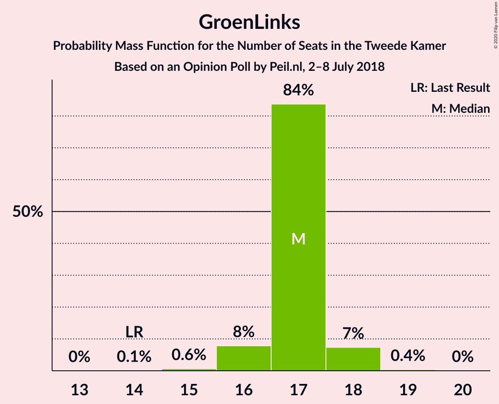

| Number of Seats | Probability | Accumulated | Special Marks |
|:---------------:|:-----------:|:-----------:|:-------------:|
| 14 | 0% | 100% | Last Result |
| 15 | 0% | 100% |  |
| 16 | 16% | 99.9% |  |
| 17 | 2% | 84% |  |
| 18 | 80% | 81% | Median |
| 19 | 1.1% | 1.4% |  |
| 20 | 0.2% | 0.2% |  |
| 21 | 0% | 0% |  |

### Partij voor de Vrijheid

*For a full overview of the results for this party, see the [Partij voor de Vrijheid](party-partijvoordevrijheid.html) page.*

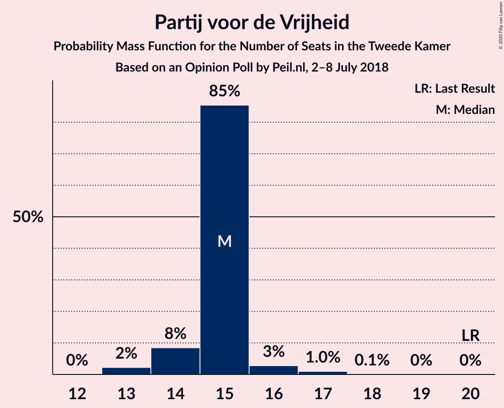

| Number of Seats | Probability | Accumulated | Special Marks |
|:---------------:|:-----------:|:-----------:|:-------------:|
| 13 | 56% | 100% | Median |
| 14 | 0.6% | 44% |  |
| 15 | 27% | 43% |  |
| 16 | 15% | 16% |  |
| 17 | 0.1% | 0.2% |  |
| 18 | 0% | 0% |  |
| 19 | 0% | 0% |  |
| 20 | 0% | 0% | Last Result |

### Forum voor Democratie

*For a full overview of the results for this party, see the [Forum voor Democratie](party-forumvoordemocratie.html) page.*

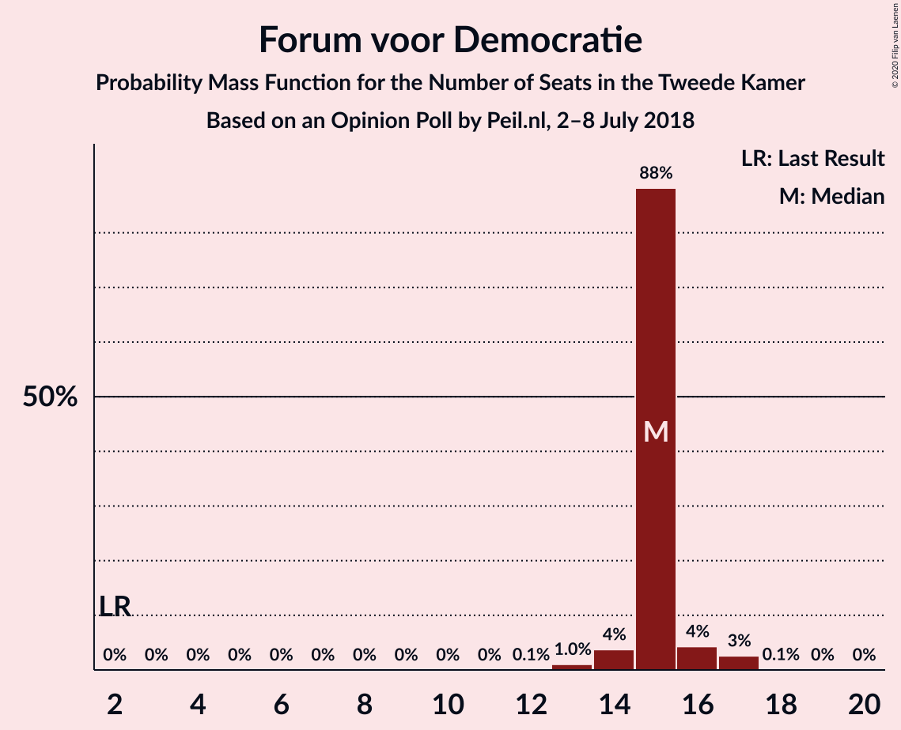

| Number of Seats | Probability | Accumulated | Special Marks |
|:---------------:|:-----------:|:-----------:|:-------------:|
| 2 | 0% | 100% | Last Result |
| 3 | 0% | 100% |  |
| 4 | 0% | 100% |  |
| 5 | 0% | 100% |  |
| 6 | 0% | 100% |  |
| 7 | 0% | 100% |  |
| 8 | 0% | 100% |  |
| 9 | 0% | 100% |  |
| 10 | 0% | 100% |  |
| 11 | 0% | 100% |  |
| 12 | 0.1% | 100% |  |
| 13 | 15% | 99.9% |  |
| 14 | 1.4% | 85% |  |
| 15 | 26% | 84% |  |
| 16 | 56% | 58% | Median |
| 17 | 1.2% | 2% |  |
| 18 | 0.8% | 0.8% |  |
| 19 | 0% | 0% |  |

### Democraten 66

*For a full overview of the results for this party, see the [Democraten 66](party-democraten66.html) page.*

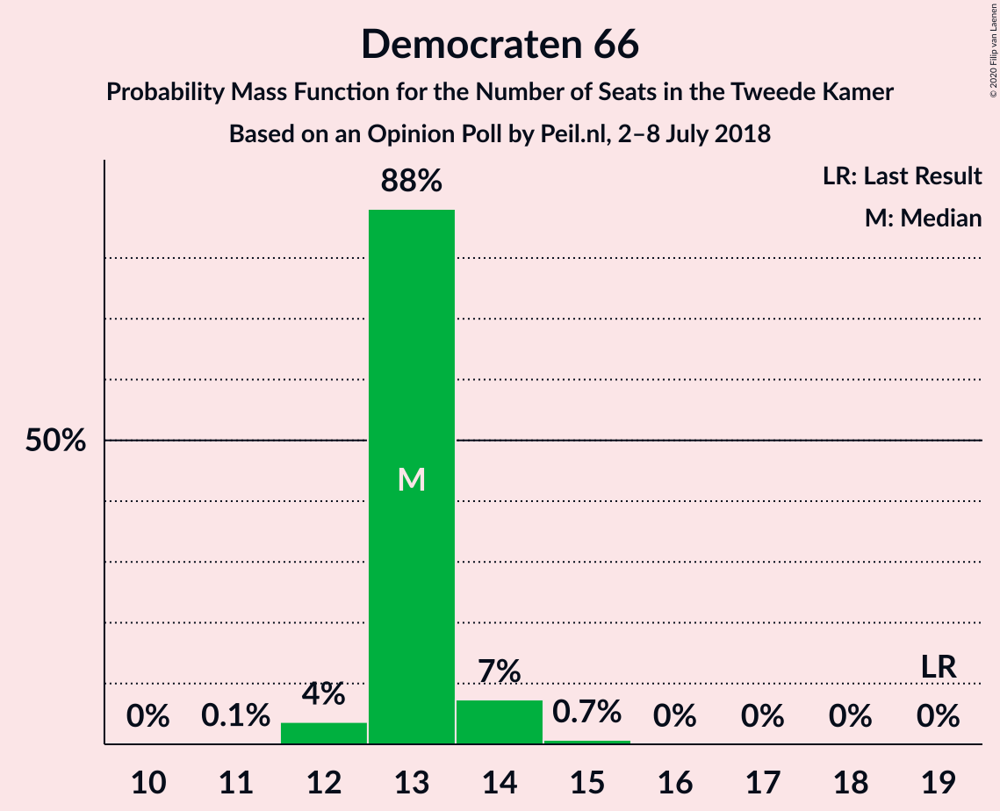

| Number of Seats | Probability | Accumulated | Special Marks |
|:---------------:|:-----------:|:-----------:|:-------------:|
| 11 | 0.3% | 100% |  |
| 12 | 25% | 99.7% |  |
| 13 | 72% | 75% | Median |
| 14 | 2% | 2% |  |
| 15 | 0.5% | 0.5% |  |
| 16 | 0% | 0% |  |
| 17 | 0% | 0% |  |
| 18 | 0% | 0% |  |
| 19 | 0% | 0% | Last Result |

### Christen-Democratisch Appèl

*For a full overview of the results for this party, see the [Christen-Democratisch Appèl](party-christen-democratischappèl.html) page.*

| Number of Seats | Probability | Accumulated | Special Marks |
|:---------------:|:-----------:|:-----------:|:-------------:|
| 9 | 0.9% | 100% |  |
| 10 | 1.0% | 99.1% |  |
| 11 | 56% | 98% | Median |
| 12 | 26% | 42% |  |
| 13 | 16% | 16% |  |
| 14 | 0.5% | 0.5% |  |
| 15 | 0% | 0% |  |
| 16 | 0% | 0% |  |
| 17 | 0% | 0% |  |
| 18 | 0% | 0% |  |
| 19 | 0% | 0% | Last Result |

### Socialistische Partij

*For a full overview of the results for this party, see the [Socialistische Partij](party-socialistischepartij.html) page.*

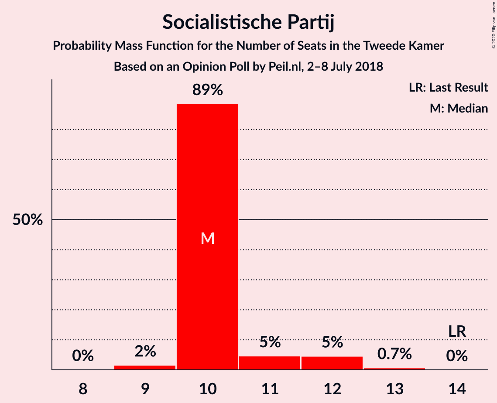

| Number of Seats | Probability | Accumulated | Special Marks |
|:---------------:|:-----------:|:-----------:|:-------------:|
| 9 | 15% | 100% |  |
| 10 | 1.1% | 85% |  |
| 11 | 1.5% | 84% |  |
| 12 | 81% | 83% | Median |
| 13 | 2% | 2% |  |
| 14 | 0% | 0% | Last Result |

### Partij van de Arbeid

*For a full overview of the results for this party, see the [Partij van de Arbeid](party-partijvandearbeid.html) page.*

| Number of Seats | Probability | Accumulated | Special Marks |
|:---------------:|:-----------:|:-----------:|:-------------:|
| 8 | 0.2% | 100% |  |
| 9 | 2% | 99.8% | Last Result |
| 10 | 58% | 98% | Median |
| 11 | 39% | 40% |  |
| 12 | 0% | 0.5% |  |
| 13 | 0.5% | 0.5% |  |
| 14 | 0% | 0% |  |

### Partij voor de Dieren

*For a full overview of the results for this party, see the [Partij voor de Dieren](party-partijvoordedieren.html) page.*

| Number of Seats | Probability | Accumulated | Special Marks |
|:---------------:|:-----------:|:-----------:|:-------------:|
| 5 | 0.1% | 100% | Last Result |
| 6 | 5% | 99.9% |  |
| 7 | 70% | 95% | Median |
| 8 | 25% | 25% |  |
| 9 | 0.6% | 0.6% |  |
| 10 | 0% | 0% |  |

### ChristenUnie

*For a full overview of the results for this party, see the [ChristenUnie](party-christenunie.html) page.*

| Number of Seats | Probability | Accumulated | Special Marks |
|:---------------:|:-----------:|:-----------:|:-------------:|
| 4 | 0.7% | 100% |  |
| 5 | 4% | 99.3% | Last Result |
| 6 | 95% | 96% | Median |
| 7 | 0.6% | 0.7% |  |
| 8 | 0.1% | 0.1% |  |
| 9 | 0% | 0% |  |

### DENK

*For a full overview of the results for this party, see the [DENK](party-denk.html) page.*

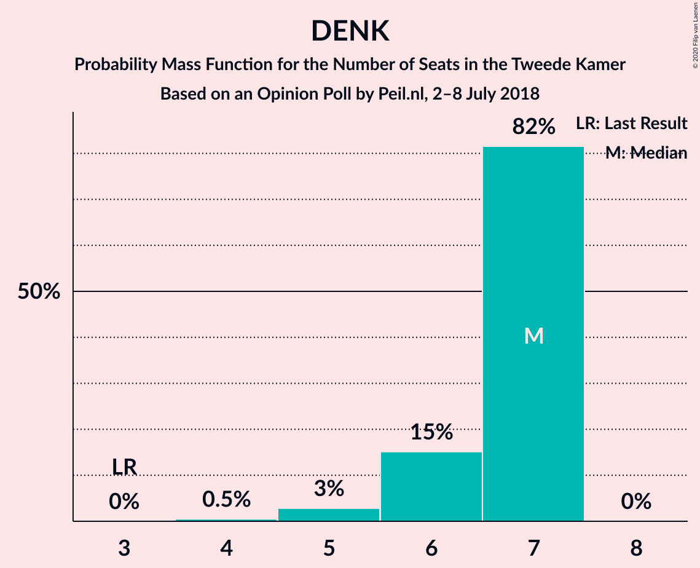

| Number of Seats | Probability | Accumulated | Special Marks |
|:---------------:|:-----------:|:-----------:|:-------------:|
| 3 | 0% | 100% | Last Result |
| 4 | 0.1% | 100% |  |
| 5 | 26% | 99.9% |  |
| 6 | 58% | 74% | Median |
| 7 | 16% | 17% |  |
| 8 | 0.1% | 0.1% |  |
| 9 | 0% | 0% |  |

### 50Plus

*For a full overview of the results for this party, see the [50Plus](party-50plus.html) page.*

| Number of Seats | Probability | Accumulated | Special Marks |
|:---------------:|:-----------:|:-----------:|:-------------:|
| 4 | 39% | 100% | Last Result |
| 5 | 60% | 61% | Median |
| 6 | 0.2% | 0.4% |  |
| 7 | 0.2% | 0.2% |  |
| 8 | 0% | 0% |  |

### Staatkundig Gereformeerde Partij

*For a full overview of the results for this party, see the [Staatkundig Gereformeerde Partij](party-staatkundiggereformeerdepartij.html) page.*

| Number of Seats | Probability | Accumulated | Special Marks |
|:---------------:|:-----------:|:-----------:|:-------------:|
| 2 | 3% | 100% |  |
| 3 | 42% | 97% | Last Result |
| 4 | 55% | 55% | Median |
| 5 | 0% | 0% |  |

## Coalitions

### Confidence Intervals

| Coalition | Last Result | Median | Majority? | 80% Confidence Interval | 90% Confidence Interval | 95% Confidence Interval | 99% Confidence Interval |
|:---------:|:-----------:|:------:|:---------:|:-----------------------:|:-----------------------:|:-----------------------:|:-----------------------:|
| Volkspartij voor Vrijheid en Democratie – GroenLinks – Democraten 66 – Christen-Democratisch Appèl – ChristenUnie | 90 | 77 | 99.9% | 77–80 | 77–80 | 76–80 | 76–81 |
| Volkspartij voor Vrijheid en Democratie – Forum voor Democratie – Partij voor de Vrijheid – Christen-Democratisch Appèl – Staatkundig Gereformeerde Partij | 77 | 73 | 18% | 73–77 | 73–77 | 73–77 | 71–78 |
| Volkspartij voor Vrijheid en Democratie – Democraten 66 – Christen-Democratisch Appèl – Partij van de Arbeid – ChristenUnie | 85 | 69 | 0.9% | 69–75 | 69–75 | 69–75 | 68–77 |
| Volkspartij voor Vrijheid en Democratie – Forum voor Democratie – Partij voor de Vrijheid – Christen-Democratisch Appèl | 74 | 69 | 0.6% | 69–74 | 69–74 | 69–74 | 68–76 |
| GroenLinks – Democraten 66 – Christen-Democratisch Appèl – Socialistische Partij – Partij van de Arbeid – ChristenUnie | 80 | 70 | 0% | 68–71 | 68–71 | 68–71 | 66–71 |
| Volkspartij voor Vrijheid en Democratie – Forum voor Democratie – Christen-Democratisch Appèl – 50Plus – Staatkundig Gereformeerde Partij | 61 | 65 | 0% | 63–65 | 63–65 | 63–66 | 61–68 |
| Volkspartij voor Vrijheid en Democratie – Forum voor Democratie – Christen-Democratisch Appèl – 50Plus | 58 | 61 | 0% | 60–62 | 60–62 | 60–64 | 58–65 |
| Volkspartij voor Vrijheid en Democratie – Democraten 66 – Christen-Democratisch Appèl – ChristenUnie | 76 | 59 | 0% | 59–64 | 59–64 | 59–64 | 57–64 |
| Volkspartij voor Vrijheid en Democratie – Forum voor Democratie – Christen-Democratisch Appèl – Staatkundig Gereformeerde Partij | 57 | 60 | 0% | 59–61 | 59–61 | 59–62 | 56–63 |
| Volkspartij voor Vrijheid en Democratie – Partij voor de Vrijheid – Christen-Democratisch Appèl | 72 | 53 | 0% | 53–61 | 53–61 | 53–61 | 53–61 |
| GroenLinks – Democraten 66 – Christen-Democratisch Appèl – Partij van de Arbeid – ChristenUnie | 66 | 58 | 0% | 58–59 | 58–59 | 57–59 | 54–61 |
| Volkspartij voor Vrijheid en Democratie – Forum voor Democratie – Christen-Democratisch Appèl | 54 | 56 | 0% | 56–58 | 56–58 | 56–59 | 53–60 |
| Volkspartij voor Vrijheid en Democratie – Democraten 66 – Christen-Democratisch Appèl | 71 | 53 | 0% | 53–58 | 53–58 | 53–58 | 52–58 |
| Volkspartij voor Vrijheid en Democratie – Democraten 66 – Partij van de Arbeid | 61 | 52 | 0% | 52–56 | 52–56 | 52–56 | 51–58 |
| Volkspartij voor Vrijheid en Democratie – Christen-Democratisch Appèl – Partij van de Arbeid | 61 | 50 | 0% | 50–56 | 50–56 | 50–56 | 49–58 |
| Volkspartij voor Vrijheid en Democratie – Christen-Democratisch Appèl | 52 | 40 | 0% | 40–45 | 40–45 | 40–45 | 39–45 |
| Volkspartij voor Vrijheid en Democratie – Partij van de Arbeid | 42 | 39 | 0% | 39–43 | 39–43 | 39–43 | 38–45 |
| Democraten 66 – Christen-Democratisch Appèl – Partij van de Arbeid | 47 | 34 | 0% | 34–37 | 34–37 | 34–37 | 32–39 |
| Christen-Democratisch Appèl – Partij van de Arbeid – ChristenUnie | 33 | 27 | 0% | 27–30 | 27–30 | 26–30 | 24–32 |
| Democraten 66 – Christen-Democratisch Appèl | 38 | 24 | 0% | 24–26 | 24–26 | 24–26 | 22–27 |
| Christen-Democratisch Appèl – Partij van de Arbeid | 28 | 21 | 0% | 21–24 | 21–24 | 21–24 | 19–26 |

### Volkspartij voor Vrijheid en Democratie – GroenLinks – Democraten 66 – Christen-Democratisch Appèl – ChristenUnie

| Number of Seats | Probability | Accumulated | Special Marks |
|:---------------:|:-----------:|:-----------:|:-------------:|
| 75 | 0% | 100% |  |
| 76 | 3% | 99.9% | Majority |
| 77 | 80% | 97% | Median |
| 78 | 0.6% | 17% |  |
| 79 | 0.9% | 17% |  |
| 80 | 15% | 16% |  |
| 81 | 0.4% | 0.8% |  |
| 82 | 0.1% | 0.5% |  |
| 83 | 0.2% | 0.4% |  |
| 84 | 0.2% | 0.2% |  |
| 85 | 0% | 0% |  |
| 86 | 0% | 0% |  |
| 87 | 0% | 0% |  |
| 88 | 0% | 0% |  |
| 89 | 0% | 0% |  |
| 90 | 0% | 0% | Last Result |

### Volkspartij voor Vrijheid en Democratie – Forum voor Democratie – Partij voor de Vrijheid – Christen-Democratisch Appèl – Staatkundig Gereformeerde Partij

| Number of Seats | Probability | Accumulated | Special Marks |
|:---------------:|:-----------:|:-----------:|:-------------:|
| 71 | 1.0% | 100% |  |
| 72 | 0% | 99.0% |  |
| 73 | 55% | 99.0% | Median |
| 74 | 25% | 44% |  |
| 75 | 0.9% | 19% |  |
| 76 | 2% | 18% | Majority |
| 77 | 14% | 16% | Last Result |
| 78 | 1.2% | 1.2% |  |
| 79 | 0% | 0% |  |

### Volkspartij voor Vrijheid en Democratie – Democraten 66 – Christen-Democratisch Appèl – Partij van de Arbeid – ChristenUnie

| Number of Seats | Probability | Accumulated | Special Marks |
|:---------------:|:-----------:|:-----------:|:-------------:|
| 67 | 0.2% | 100% |  |
| 68 | 2% | 99.8% |  |
| 69 | 55% | 98% | Median |
| 70 | 26% | 43% |  |
| 71 | 0.5% | 17% |  |
| 72 | 0.6% | 16% |  |
| 73 | 0.1% | 16% |  |
| 74 | 0.3% | 16% |  |
| 75 | 14% | 15% |  |
| 76 | 0.2% | 0.9% | Majority |
| 77 | 0.7% | 0.7% |  |
| 78 | 0% | 0% |  |
| 79 | 0% | 0% |  |
| 80 | 0% | 0% |  |
| 81 | 0% | 0% |  |
| 82 | 0% | 0% |  |
| 83 | 0% | 0% |  |
| 84 | 0% | 0% |  |
| 85 | 0% | 0% | Last Result |

### Volkspartij voor Vrijheid en Democratie – Forum voor Democratie – Partij voor de Vrijheid – Christen-Democratisch Appèl

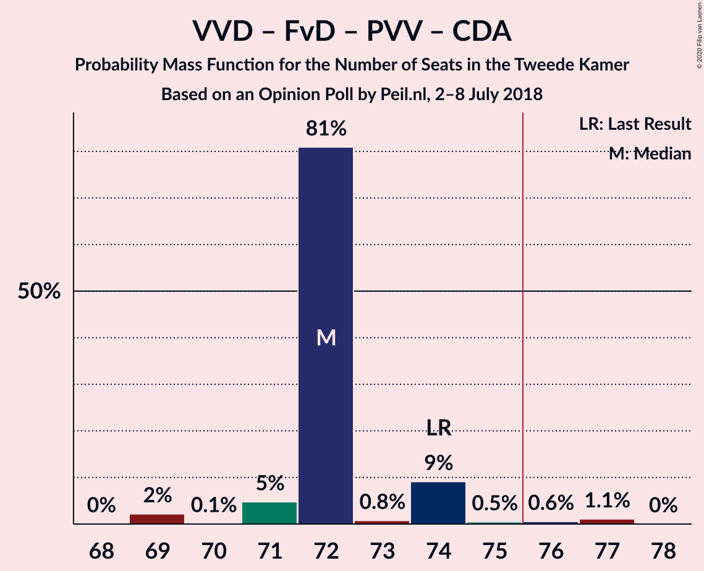

| Number of Seats | Probability | Accumulated | Special Marks |
|:---------------:|:-----------:|:-----------:|:-------------:|
| 68 | 1.0% | 100% |  |
| 69 | 55% | 99.0% | Median |
| 70 | 0.2% | 44% |  |
| 71 | 25% | 44% |  |
| 72 | 0.3% | 19% |  |
| 73 | 2% | 18% |  |
| 74 | 15% | 17% | Last Result |
| 75 | 0.6% | 1.2% |  |
| 76 | 0.6% | 0.6% | Majority |
| 77 | 0% | 0% |  |

### GroenLinks – Democraten 66 – Christen-Democratisch Appèl – Socialistische Partij – Partij van de Arbeid – ChristenUnie

| Number of Seats | Probability | Accumulated | Special Marks |
|:---------------:|:-----------:|:-----------:|:-------------:|
| 66 | 1.0% | 100% |  |
| 67 | 0.9% | 99.0% |  |
| 68 | 14% | 98% |  |
| 69 | 0.5% | 84% |  |
| 70 | 58% | 83% | Median |
| 71 | 25% | 25% |  |
| 72 | 0.3% | 0.3% |  |
| 73 | 0% | 0% |  |
| 74 | 0% | 0% |  |
| 75 | 0% | 0% |  |
| 76 | 0% | 0% | Majority |
| 77 | 0% | 0% |  |
| 78 | 0% | 0% |  |
| 79 | 0% | 0% |  |
| 80 | 0% | 0% | Last Result |

### Volkspartij voor Vrijheid en Democratie – Forum voor Democratie – Christen-Democratisch Appèl – 50Plus – Staatkundig Gereformeerde Partij

| Number of Seats | Probability | Accumulated | Special Marks |
|:---------------:|:-----------:|:-----------:|:-------------:|
| 61 | 0.9% | 100% | Last Result |
| 62 | 0.6% | 99.1% |  |
| 63 | 23% | 98% |  |
| 64 | 1.4% | 75% |  |
| 65 | 69% | 74% | Median |
| 66 | 2% | 4% |  |
| 67 | 0.9% | 2% |  |
| 68 | 1.1% | 1.1% |  |
| 69 | 0% | 0% |  |

### Volkspartij voor Vrijheid en Democratie – Forum voor Democratie – Christen-Democratisch Appèl – 50Plus

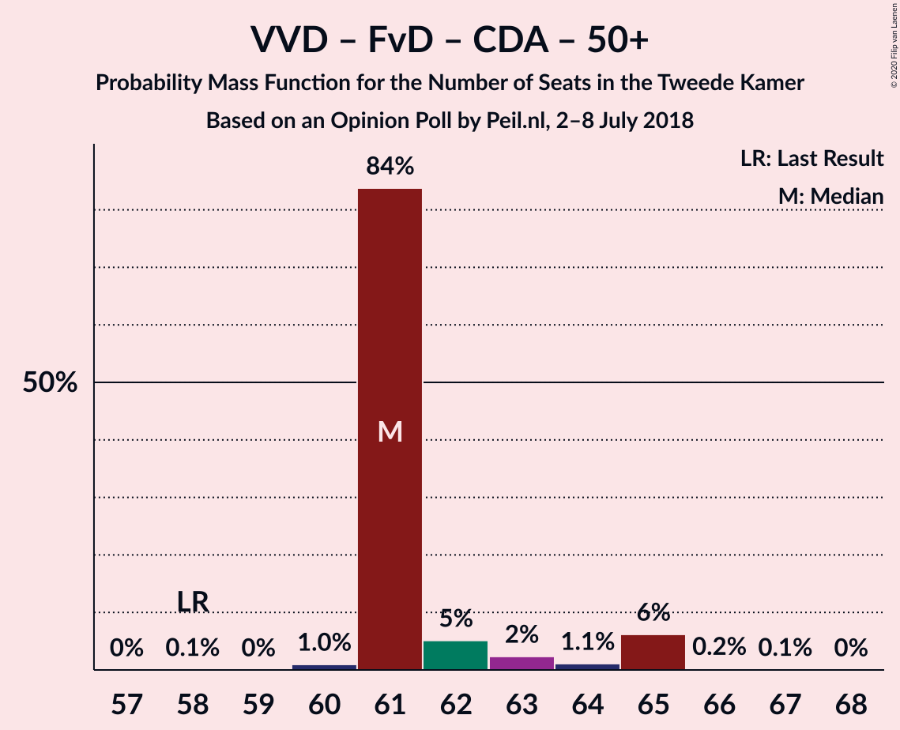

| Number of Seats | Probability | Accumulated | Special Marks |
|:---------------:|:-----------:|:-----------:|:-------------:|
| 58 | 1.4% | 100% | Last Result |
| 59 | 0.1% | 98.6% |  |
| 60 | 23% | 98% |  |
| 61 | 56% | 75% | Median |
| 62 | 15% | 19% |  |
| 63 | 0.4% | 4% |  |
| 64 | 2% | 4% |  |
| 65 | 2% | 2% |  |
| 66 | 0.2% | 0.2% |  |
| 67 | 0% | 0% |  |

### Volkspartij voor Vrijheid en Democratie – Democraten 66 – Christen-Democratisch Appèl – ChristenUnie

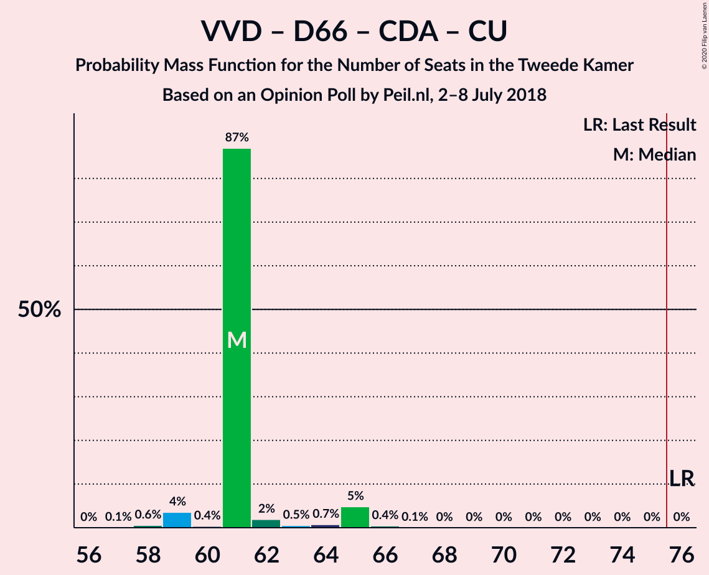

| Number of Seats | Probability | Accumulated | Special Marks |
|:---------------:|:-----------:|:-----------:|:-------------:|
| 57 | 0.9% | 100% |  |
| 58 | 1.5% | 99.1% |  |
| 59 | 78% | 98% | Median |
| 60 | 1.3% | 19% |  |
| 61 | 1.1% | 18% |  |
| 62 | 1.1% | 17% |  |
| 63 | 0.2% | 16% |  |
| 64 | 15% | 16% |  |
| 65 | 0.3% | 0.4% |  |
| 66 | 0% | 0.2% |  |
| 67 | 0.2% | 0.2% |  |
| 68 | 0% | 0% |  |
| 69 | 0% | 0% |  |
| 70 | 0% | 0% |  |
| 71 | 0% | 0% |  |
| 72 | 0% | 0% |  |
| 73 | 0% | 0% |  |
| 74 | 0% | 0% |  |
| 75 | 0% | 0% |  |
| 76 | 0% | 0% | Last Result, Majority |

### Volkspartij voor Vrijheid en Democratie – Forum voor Democratie – Christen-Democratisch Appèl – Staatkundig Gereformeerde Partij

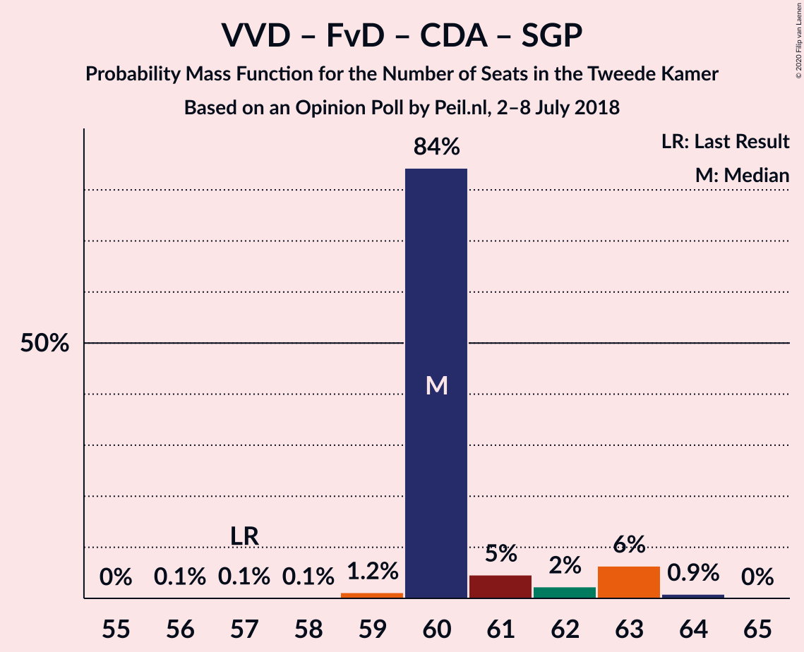

| Number of Seats | Probability | Accumulated | Special Marks |
|:---------------:|:-----------:|:-----------:|:-------------:|
| 56 | 1.0% | 100% |  |
| 57 | 0% | 99.0% | Last Result |
| 58 | 0.6% | 99.0% |  |
| 59 | 25% | 98% |  |
| 60 | 55% | 73% | Median |
| 61 | 16% | 18% |  |
| 62 | 2% | 3% |  |
| 63 | 1.1% | 1.1% |  |
| 64 | 0% | 0% |  |

### Volkspartij voor Vrijheid en Democratie – Partij voor de Vrijheid – Christen-Democratisch Appèl

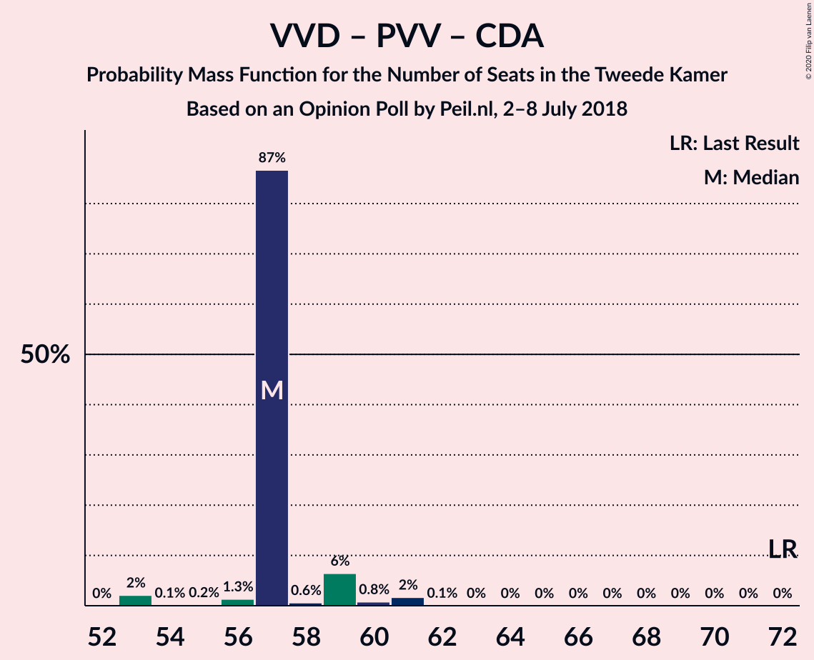

| Number of Seats | Probability | Accumulated | Special Marks |
|:---------------:|:-----------:|:-----------:|:-------------:|
| 53 | 55% | 100% | Median |
| 54 | 1.4% | 45% |  |
| 55 | 0.3% | 44% |  |
| 56 | 25% | 44% |  |
| 57 | 2% | 19% |  |
| 58 | 1.5% | 17% |  |
| 59 | 0.4% | 15% |  |
| 60 | 0% | 15% |  |
| 61 | 15% | 15% |  |
| 62 | 0% | 0% |  |
| 63 | 0% | 0% |  |
| 64 | 0% | 0% |  |
| 65 | 0% | 0% |  |
| 66 | 0% | 0% |  |
| 67 | 0% | 0% |  |
| 68 | 0% | 0% |  |
| 69 | 0% | 0% |  |
| 70 | 0% | 0% |  |
| 71 | 0% | 0% |  |
| 72 | 0% | 0% | Last Result |

### GroenLinks – Democraten 66 – Christen-Democratisch Appèl – Partij van de Arbeid – ChristenUnie

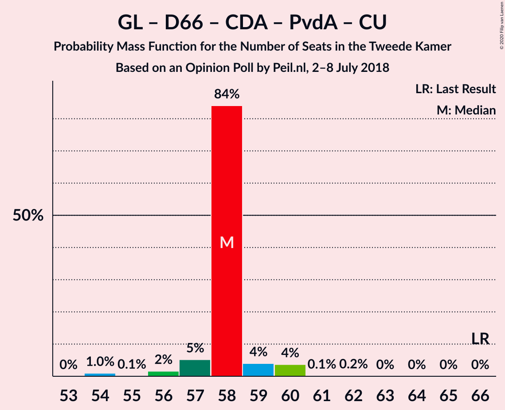

| Number of Seats | Probability | Accumulated | Special Marks |
|:---------------:|:-----------:|:-----------:|:-------------:|
| 54 | 0.8% | 100% |  |
| 55 | 0% | 99.1% |  |
| 56 | 0.8% | 99.1% |  |
| 57 | 2% | 98% |  |
| 58 | 57% | 96% | Median |
| 59 | 38% | 39% |  |
| 60 | 0.2% | 1.3% |  |
| 61 | 0.8% | 1.1% |  |
| 62 | 0.2% | 0.3% |  |
| 63 | 0% | 0% |  |
| 64 | 0% | 0% |  |
| 65 | 0% | 0% |  |
| 66 | 0% | 0% | Last Result |

### Volkspartij voor Vrijheid en Democratie – Forum voor Democratie – Christen-Democratisch Appèl

| Number of Seats | Probability | Accumulated | Special Marks |
|:---------------:|:-----------:|:-----------:|:-------------:|
| 53 | 1.0% | 100% |  |
| 54 | 0.6% | 99.0% | Last Result |
| 55 | 0.1% | 98% |  |
| 56 | 80% | 98% | Median |
| 57 | 0.4% | 19% |  |
| 58 | 15% | 18% |  |
| 59 | 2% | 4% |  |
| 60 | 2% | 2% |  |
| 61 | 0.2% | 0.2% |  |
| 62 | 0% | 0% |  |

### Volkspartij voor Vrijheid en Democratie – Democraten 66 – Christen-Democratisch Appèl

| Number of Seats | Probability | Accumulated | Special Marks |
|:---------------:|:-----------:|:-----------:|:-------------:|
| 52 | 1.1% | 100% |  |
| 53 | 80% | 98.8% | Median |
| 54 | 0.1% | 19% |  |
| 55 | 2% | 19% |  |
| 56 | 0.1% | 17% |  |
| 57 | 0.6% | 17% |  |
| 58 | 16% | 16% |  |
| 59 | 0.3% | 0.5% |  |
| 60 | 0% | 0.2% |  |
| 61 | 0.2% | 0.2% |  |
| 62 | 0% | 0% |  |
| 63 | 0% | 0% |  |
| 64 | 0% | 0% |  |
| 65 | 0% | 0% |  |
| 66 | 0% | 0% |  |
| 67 | 0% | 0% |  |
| 68 | 0% | 0% |  |
| 69 | 0% | 0% |  |
| 70 | 0% | 0% |  |
| 71 | 0% | 0% | Last Result |

### Volkspartij voor Vrijheid en Democratie – Democraten 66 – Partij van de Arbeid

| Number of Seats | Probability | Accumulated | Special Marks |
|:---------------:|:-----------:|:-----------:|:-------------:|
| 50 | 0.3% | 100% |  |
| 51 | 2% | 99.7% |  |
| 52 | 80% | 98% | Median |
| 53 | 1.1% | 18% |  |
| 54 | 0.1% | 17% |  |
| 55 | 0.3% | 17% |  |
| 56 | 16% | 17% |  |
| 57 | 0.2% | 0.9% |  |
| 58 | 0.8% | 0.8% |  |
| 59 | 0% | 0% |  |
| 60 | 0% | 0% |  |
| 61 | 0% | 0% | Last Result |

### Volkspartij voor Vrijheid en Democratie – Christen-Democratisch Appèl – Partij van de Arbeid

| Number of Seats | Probability | Accumulated | Special Marks |
|:---------------:|:-----------:|:-----------:|:-------------:|
| 48 | 0.1% | 100% |  |
| 49 | 0.5% | 99.9% |  |
| 50 | 56% | 99.4% | Median |
| 51 | 2% | 43% |  |
| 52 | 25% | 41% |  |
| 53 | 0.1% | 16% |  |
| 54 | 0.6% | 16% |  |
| 55 | 0.6% | 16% |  |
| 56 | 14% | 15% |  |
| 57 | 0% | 0.7% |  |
| 58 | 0.7% | 0.7% |  |
| 59 | 0% | 0% |  |
| 60 | 0% | 0% |  |
| 61 | 0% | 0% | Last Result |

### Volkspartij voor Vrijheid en Democratie – Christen-Democratisch Appèl

| Number of Seats | Probability | Accumulated | Special Marks |
|:---------------:|:-----------:|:-----------:|:-------------:|
| 38 | 0.1% | 100% |  |
| 39 | 1.4% | 99.9% |  |
| 40 | 55% | 98.5% | Median |
| 41 | 25% | 44% |  |
| 42 | 2% | 19% |  |
| 43 | 0.6% | 17% |  |
| 44 | 0.9% | 16% |  |
| 45 | 15% | 15% |  |
| 46 | 0% | 0.2% |  |
| 47 | 0% | 0.2% |  |
| 48 | 0.2% | 0.2% |  |
| 49 | 0% | 0% |  |
| 50 | 0% | 0% |  |
| 51 | 0% | 0% |  |
| 52 | 0% | 0% | Last Result |

### Volkspartij voor Vrijheid en Democratie – Partij van de Arbeid

| Number of Seats | Probability | Accumulated | Special Marks |
|:---------------:|:-----------:|:-----------:|:-------------:|
| 37 | 0.4% | 100% |  |
| 38 | 0.8% | 99.6% |  |
| 39 | 57% | 98.8% | Median |
| 40 | 24% | 42% |  |
| 41 | 0.2% | 17% |  |
| 42 | 0.9% | 17% | Last Result |
| 43 | 16% | 16% |  |
| 44 | 0.2% | 0.7% |  |
| 45 | 0.5% | 0.5% |  |
| 46 | 0% | 0% |  |

### Democraten 66 – Christen-Democratisch Appèl – Partij van de Arbeid

| Number of Seats | Probability | Accumulated | Special Marks |
|:---------------:|:-----------:|:-----------:|:-------------:|
| 31 | 0.2% | 100% |  |
| 32 | 0.9% | 99.8% |  |
| 33 | 0% | 98.9% |  |
| 34 | 58% | 98.9% | Median |
| 35 | 24% | 41% |  |
| 36 | 1.3% | 17% |  |
| 37 | 15% | 16% |  |
| 38 | 0.3% | 0.8% |  |
| 39 | 0.5% | 0.5% |  |
| 40 | 0% | 0% |  |
| 41 | 0% | 0% |  |
| 42 | 0% | 0% |  |
| 43 | 0% | 0% |  |
| 44 | 0% | 0% |  |
| 45 | 0% | 0% |  |
| 46 | 0% | 0% |  |
| 47 | 0% | 0% | Last Result |

### Christen-Democratisch Appèl – Partij van de Arbeid – ChristenUnie

| Number of Seats | Probability | Accumulated | Special Marks |
|:---------------:|:-----------:|:-----------:|:-------------:|
| 24 | 0.9% | 100% |  |
| 25 | 0.1% | 99.1% |  |
| 26 | 2% | 99.0% |  |
| 27 | 57% | 97% | Median |
| 28 | 1.1% | 40% |  |
| 29 | 24% | 39% |  |
| 30 | 15% | 15% |  |
| 31 | 0% | 0.6% |  |
| 32 | 0.5% | 0.5% |  |
| 33 | 0% | 0% | Last Result |

### Democraten 66 – Christen-Democratisch Appèl

| Number of Seats | Probability | Accumulated | Special Marks |
|:---------------:|:-----------:|:-----------:|:-------------:|
| 22 | 1.1% | 100% |  |
| 23 | 0.9% | 98.9% |  |
| 24 | 80% | 98% | Median |
| 25 | 1.5% | 18% |  |
| 26 | 16% | 17% |  |
| 27 | 0.6% | 1.0% |  |
| 28 | 0.4% | 0.4% |  |
| 29 | 0% | 0% |  |
| 30 | 0% | 0% |  |
| 31 | 0% | 0% |  |
| 32 | 0% | 0% |  |
| 33 | 0% | 0% |  |
| 34 | 0% | 0% |  |
| 35 | 0% | 0% |  |
| 36 | 0% | 0% |  |
| 37 | 0% | 0% |  |
| 38 | 0% | 0% | Last Result |

### Christen-Democratisch Appèl – Partij van de Arbeid

| Number of Seats | Probability | Accumulated | Special Marks |
|:---------------:|:-----------:|:-----------:|:-------------:|
| 19 | 0.9% | 100% |  |
| 20 | 0.4% | 99.1% |  |
| 21 | 57% | 98.8% | Median |
| 22 | 2% | 42% |  |
| 23 | 24% | 39% |  |
| 24 | 15% | 15% |  |
| 25 | 0% | 0.5% |  |
| 26 | 0.5% | 0.5% |  |
| 27 | 0% | 0% |  |
| 28 | 0% | 0% | Last Result |

## Technical Information

### Opinion Poll

+ **Polling firm:** Peil.nl
+ **Commissioner(s):** —
+ **Fieldwork period:** 2–8 July 2018

### Calculations

+ **Sample size:** 3000
+ **Simulations done:** 131,072
+ **Error estimate:** 2.15%

