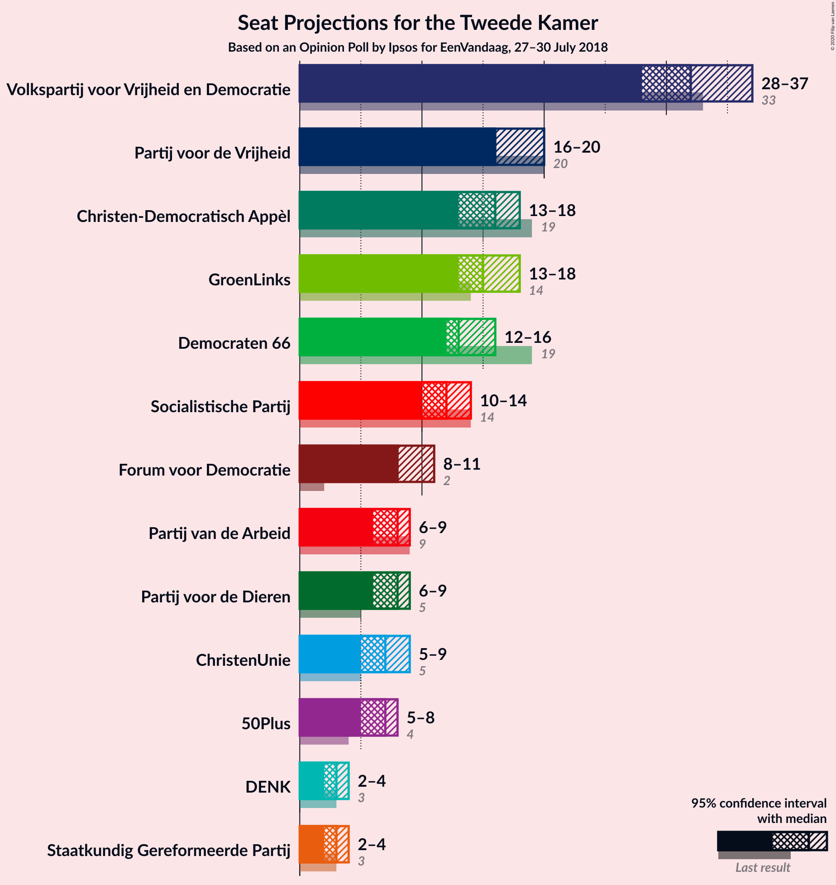
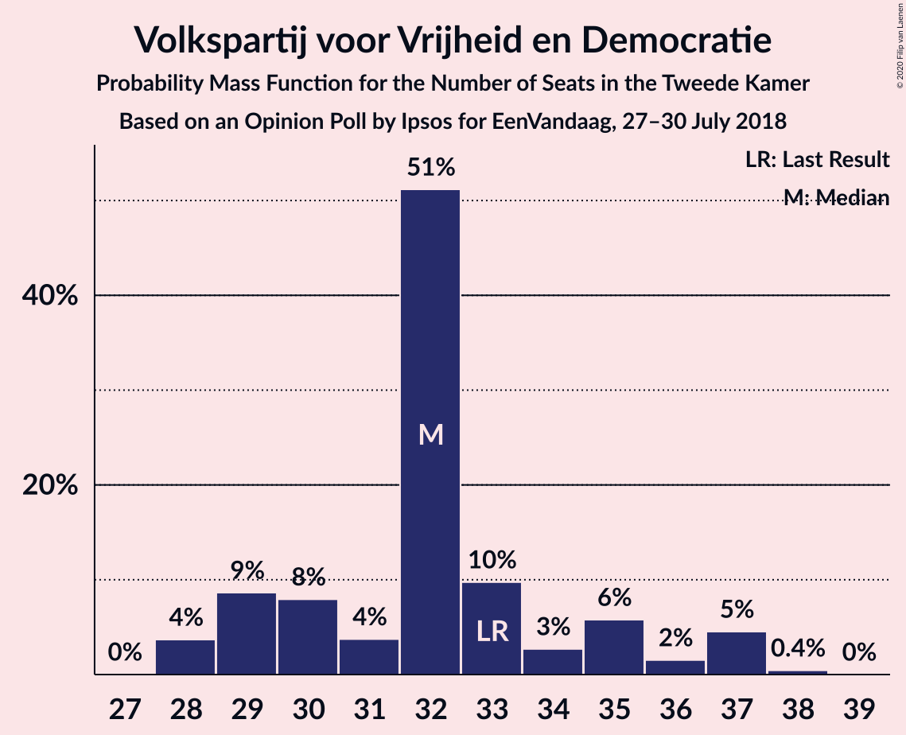
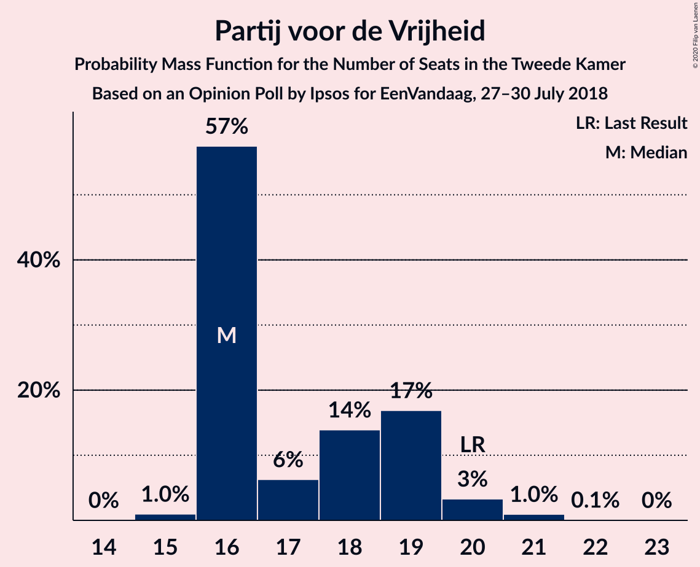
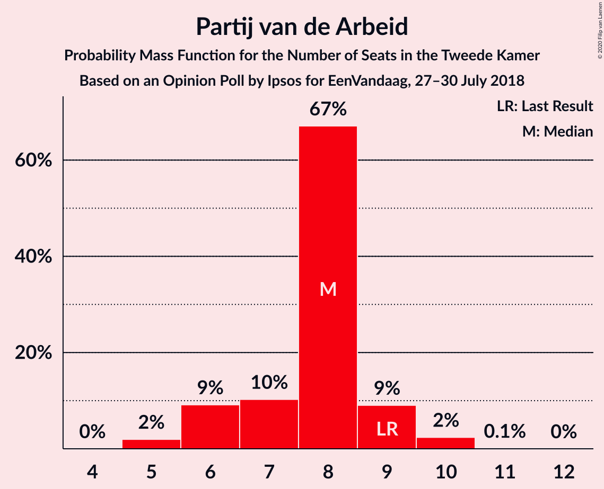
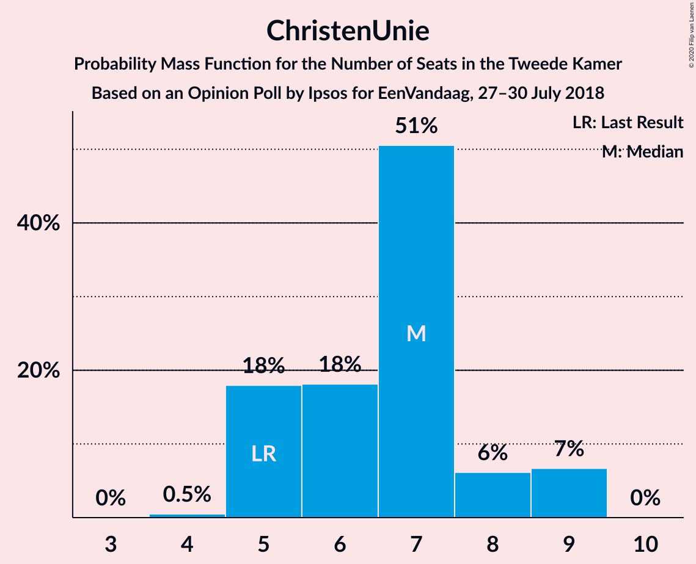
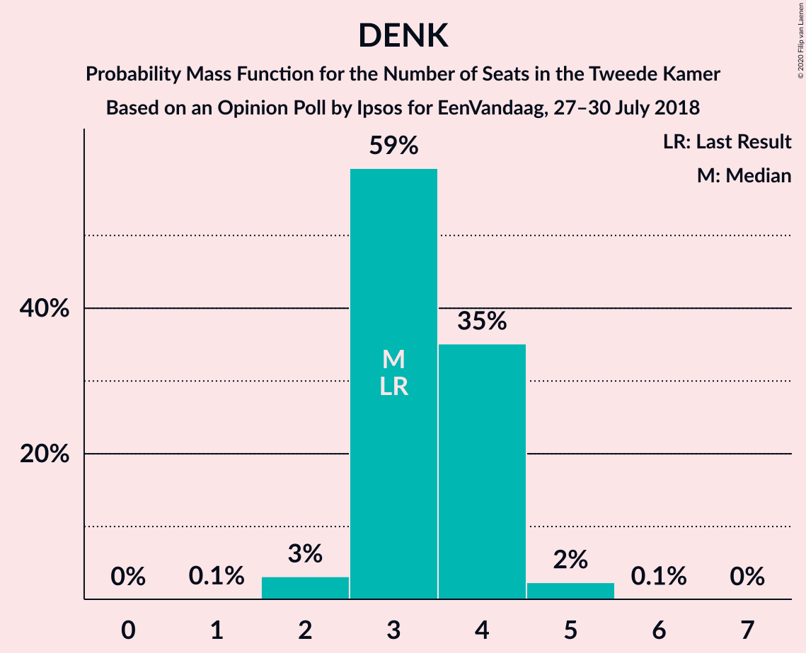
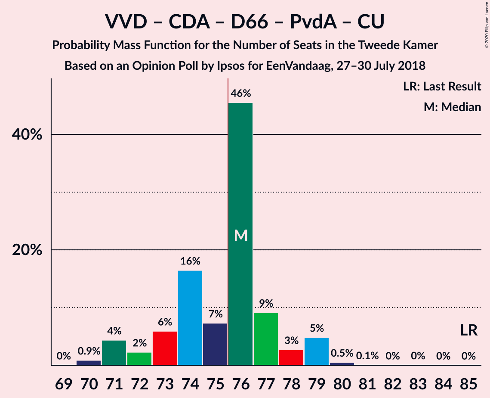
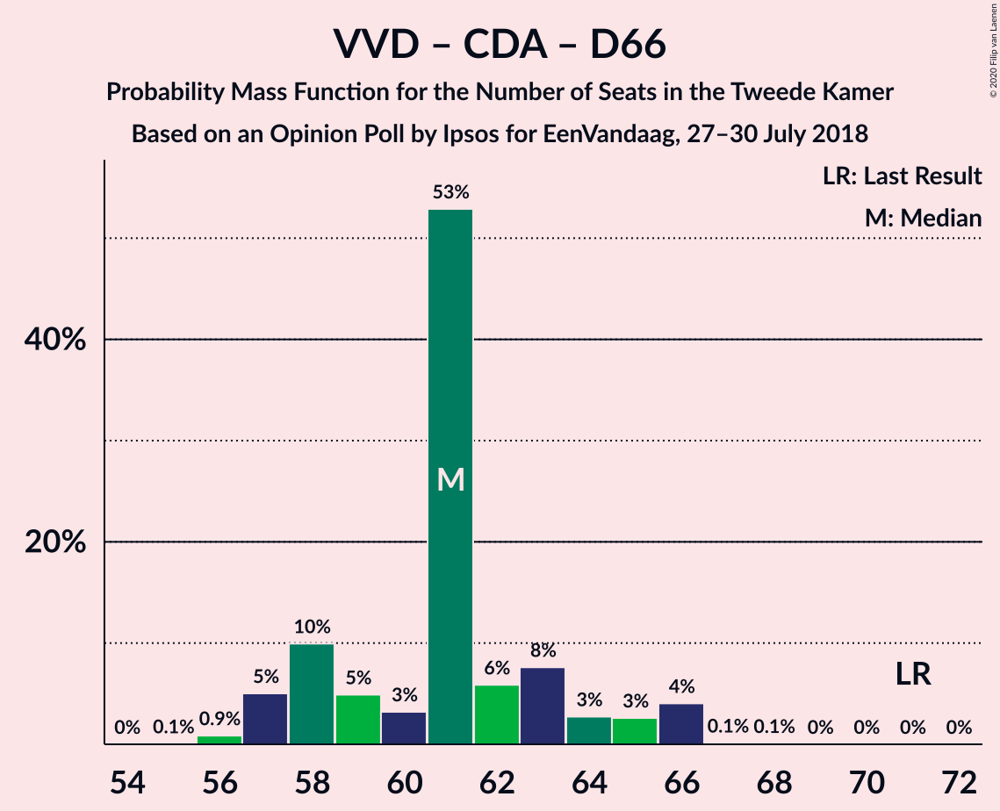
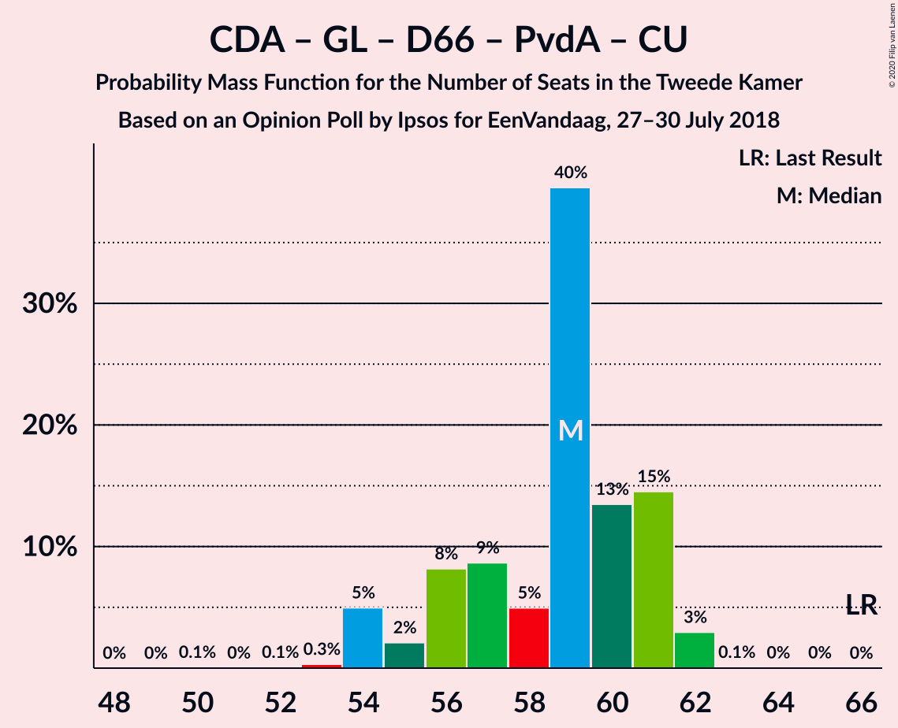
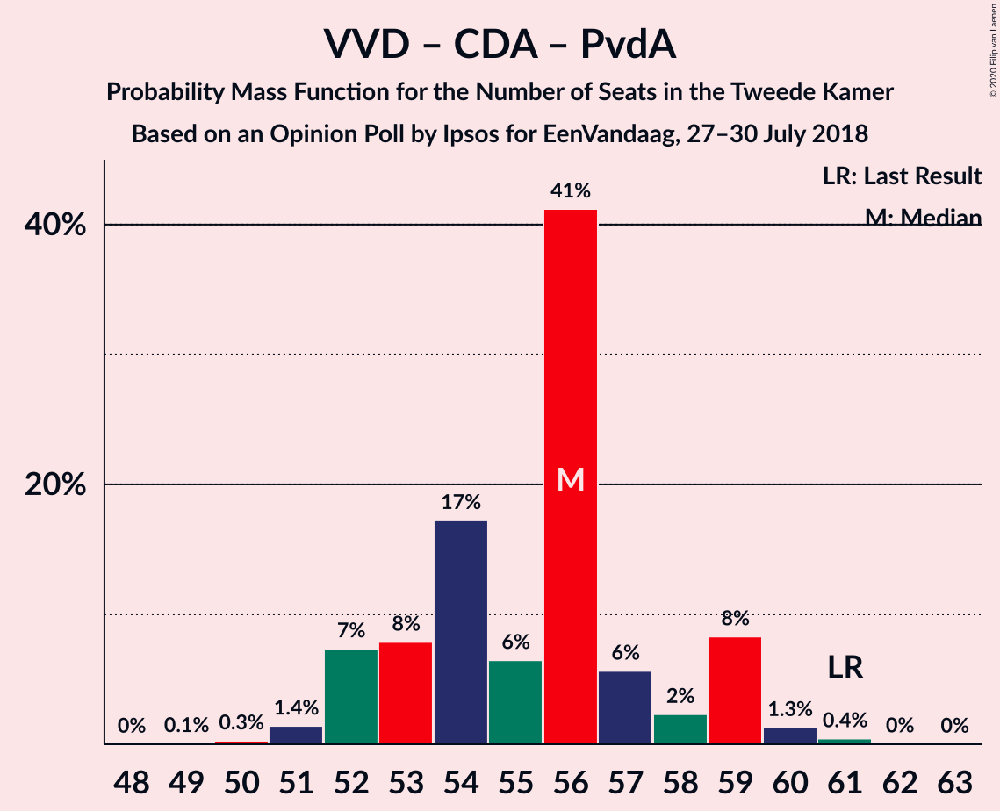

# Opinion Poll by Ipsos for EenVandaag, 27–30 July 2018

<a href="#voting-intentions">Voting Intentions</a> | <a href="#seats">Seats</a> | <a href="#coalitions">Coalitions</a> | <a href="#technical-information">Technical Information</a>

## Voting Intentions

### Confidence Intervals

| Party | Last Result | Poll Result | 80% Confidence Interval | 90% Confidence Interval | 95% Confidence Interval | 99% Confidence Interval |
|:-----:|:-----------:|:-----------:|:-----------------------:|:-----------------------:|:-----------------------:|:-----------------------:|
| Volkspartij voor Vrijheid en Democratie | 21.3% | 21.5% | 20.2–23.0% |19.8–23.4% |19.5–23.7% |18.9–24.4% |
| Partij voor de Vrijheid | 13.1% | 12.0% | 11.0–13.2% |10.7–13.5% |10.4–13.8% |10.0–14.4% |
| Christen-Democratisch Appèl | 12.4% | 10.2% | 9.3–11.3% |9.0–11.6% |8.7–11.9% |8.3–12.4% |
| GroenLinks | 9.1% | 10.0% | 9.0–11.1% |8.8–11.4% |8.6–11.7% |8.1–12.2% |
| Democraten 66 | 12.2% | 8.9% | 8.0–9.9% |7.7–10.2% |7.5–10.5% |7.1–11.0% |
| Socialistische Partij | 9.1% | 7.6% | 6.7–8.6% |6.5–8.8% |6.3–9.1% |5.9–9.5% |
| Forum voor Democratie | 1.8% | 6.2% | 5.4–7.1% |5.2–7.3% |5.0–7.6% |4.7–8.0% |
| Partij voor de Dieren | 3.2% | 5.1% | 4.4–5.9% |4.2–6.1% |4.0–6.3% |3.7–6.8% |
| Partij van de Arbeid | 5.7% | 4.9% | 4.3–5.7% |4.1–6.0% |3.9–6.2% |3.6–6.6% |
| ChristenUnie | 3.4% | 4.3% | 3.7–5.1% |3.5–5.3% |3.4–5.5% |3.1–5.9% |
| 50Plus | 3.1% | 4.1% | 3.5–4.9% |3.3–5.1% |3.2–5.3% |2.9–5.6% |
| Staatkundig Gereformeerde Partij | 2.1% | 2.3% | 1.9–2.9% |1.7–3.1% |1.6–3.2% |1.4–3.5% |
| DENK | 2.1% | 2.3% | 1.9–2.9% |1.7–3.1% |1.6–3.2% |1.4–3.5% |

*Note:* The poll result column reflects the actual value used in the calculations. Published results may vary slightly, and in addition be rounded to fewer digits.

## Seats

### Confidence Intervals

| Party | Last Result | Median | 80% Confidence Interval | 90% Confidence Interval | 95% Confidence Interval | 99% Confidence Interval |
|:-----:|:-----------:|:------:|:-----------------------:|:-----------------------:|:-----------------------:|:-----------------------:|
| <a href="#volkspartij-voor-vrijheid-en-democratie">Volkspartij voor Vrijheid en Democratie</a> | 33 | 29 | 29–32 |29–35 |29–35 |29–37 |
| <a href="#partij-voor-de-vrijheid">Partij voor de Vrijheid</a> | 20 | 16 | 16–19 |16–19 |16–21 |16–21 |
| <a href="#christen-democratisch-appèl">Christen-Democratisch Appèl</a> | 19 | 17 | 14–17 |14–17 |13–17 |12–19 |
| <a href="#groenlinks">GroenLinks</a> | 14 | 15 | 15–18 |15–18 |14–18 |13–18 |
| <a href="#democraten-66">Democraten 66</a> | 19 | 15 | 14–16 |13–16 |13–16 |11–16 |
| <a href="#socialistische-partij">Socialistische Partij</a> | 14 | 12 | 11–12 |10–13 |9–13 |9–14 |
| <a href="#forum-voor-democratie">Forum voor Democratie</a> | 2 | 10 | 8–10 |8–10 |8–10 |8–10 |
| <a href="#partij-voor-de-dieren">Partij voor de Dieren</a> | 5 | 8 | 6–8 |6–8 |6–8 |6–10 |
| <a href="#partij-van-de-arbeid">Partij van de Arbeid</a> | 9 | 8 | 6–9 |6–9 |5–9 |5–10 |
| <a href="#christenunie">ChristenUnie</a> | 5 | 5 | 5–7 |5–8 |5–8 |4–8 |
| <a href="#50plus">50Plus</a> | 4 | 6 | 6–7 |5–7 |5–9 |4–9 |
| <a href="#staatkundig-gereformeerde-partij">Staatkundig Gereformeerde Partij</a> | 3 | 4 | 3–4 |3–4 |3–4 |2–5 |
| <a href="#denk">DENK</a> | 3 | 4 | 3–4 |2–4 |2–4 |2–4 |

### Volkspartij voor Vrijheid en Democratie

*For a full overview of the results for this party, see the [Volkspartij voor Vrijheid en Democratie](party-volkspartijvoorvrijheidendemocratie.html) page.*

| Number of Seats | Probability | Accumulated | Special Marks |
|:---------------:|:-----------:|:-----------:|:-------------:|
| 29 | 61% | 100% | Median |
| 30 | 7% | 39% |  |
| 31 | 0.3% | 32% |  |
| 32 | 22% | 32% |  |
| 33 | 4% | 10% | Last Result |
| 34 | 0.8% | 6% |  |
| 35 | 4% | 5% |  |
| 36 | 0.3% | 0.9% |  |
| 37 | 0.6% | 0.6% |  |
| 38 | 0% | 0.1% |  |
| 39 | 0% | 0% |  |

### Partij voor de Vrijheid

*For a full overview of the results for this party, see the [Partij voor de Vrijheid](party-partijvoordevrijheid.html) page.*

| Number of Seats | Probability | Accumulated | Special Marks |
|:---------------:|:-----------:|:-----------:|:-------------:|
| 15 | 0.3% | 100% |  |
| 16 | 81% | 99.7% | Median |
| 17 | 1.2% | 18% |  |
| 18 | 7% | 17% |  |
| 19 | 6% | 10% |  |
| 20 | 1.3% | 4% | Last Result |
| 21 | 3% | 3% |  |
| 22 | 0% | 0% |  |

### Christen-Democratisch Appèl

*For a full overview of the results for this party, see the [Christen-Democratisch Appèl](party-christen-democratischappèl.html) page.*

| Number of Seats | Probability | Accumulated | Special Marks |
|:---------------:|:-----------:|:-----------:|:-------------:|
| 12 | 2% | 100% |  |
| 13 | 0.3% | 98% |  |
| 14 | 18% | 97% |  |
| 15 | 12% | 79% |  |
| 16 | 0.1% | 68% |  |
| 17 | 66% | 67% | Median |
| 18 | 0.1% | 2% |  |
| 19 | 2% | 2% | Last Result |
| 20 | 0.1% | 0.1% |  |
| 21 | 0% | 0% |  |

### GroenLinks

*For a full overview of the results for this party, see the [GroenLinks](party-groenlinks.html) page.*

| Number of Seats | Probability | Accumulated | Special Marks |
|:---------------:|:-----------:|:-----------:|:-------------:|
| 12 | 0.1% | 100% |  |
| 13 | 1.2% | 99.9% |  |
| 14 | 3% | 98.7% | Last Result |
| 15 | 65% | 96% | Median |
| 16 | 12% | 31% |  |
| 17 | 0.6% | 18% |  |
| 18 | 17% | 18% |  |
| 19 | 0.2% | 0.2% |  |
| 20 | 0% | 0% |  |

### Democraten 66

*For a full overview of the results for this party, see the [Democraten 66](party-democraten66.html) page.*

| Number of Seats | Probability | Accumulated | Special Marks |
|:---------------:|:-----------:|:-----------:|:-------------:|
| 10 | 0.2% | 100% |  |
| 11 | 2% | 99.8% |  |
| 12 | 0.3% | 98% |  |
| 13 | 4% | 98% |  |
| 14 | 10% | 94% |  |
| 15 | 63% | 84% | Median |
| 16 | 20% | 20% |  |
| 17 | 0.3% | 0.3% |  |
| 18 | 0% | 0% |  |
| 19 | 0% | 0% | Last Result |

### Socialistische Partij

*For a full overview of the results for this party, see the [Socialistische Partij](party-socialistischepartij.html) page.*

| Number of Seats | Probability | Accumulated | Special Marks |
|:---------------:|:-----------:|:-----------:|:-------------:|
| 9 | 5% | 100% |  |
| 10 | 3% | 95% |  |
| 11 | 23% | 92% |  |
| 12 | 62% | 69% | Median |
| 13 | 6% | 7% |  |
| 14 | 0.6% | 0.7% | Last Result |
| 15 | 0.1% | 0.1% |  |
| 16 | 0% | 0% |  |

### Forum voor Democratie

*For a full overview of the results for this party, see the [Forum voor Democratie](party-forumvoordemocratie.html) page.*

| Number of Seats | Probability | Accumulated | Special Marks |
|:---------------:|:-----------:|:-----------:|:-------------:|
| 2 | 0% | 100% | Last Result |
| 3 | 0% | 100% |  |
| 4 | 0% | 100% |  |
| 5 | 0% | 100% |  |
| 6 | 0% | 100% |  |
| 7 | 0.1% | 100% |  |
| 8 | 10% | 99.9% |  |
| 9 | 3% | 90% |  |
| 10 | 87% | 87% | Median |
| 11 | 0.1% | 0.3% |  |
| 12 | 0.2% | 0.2% |  |
| 13 | 0% | 0% |  |

### Partij voor de Dieren

*For a full overview of the results for this party, see the [Partij voor de Dieren](party-partijvoordedieren.html) page.*

| Number of Seats | Probability | Accumulated | Special Marks |
|:---------------:|:-----------:|:-----------:|:-------------:|
| 5 | 0.1% | 100% | Last Result |
| 6 | 10% | 99.9% |  |
| 7 | 10% | 90% |  |
| 8 | 79% | 80% | Median |
| 9 | 0.5% | 1.0% |  |
| 10 | 0.4% | 0.5% |  |
| 11 | 0.1% | 0.1% |  |
| 12 | 0% | 0% |  |

### Partij van de Arbeid

*For a full overview of the results for this party, see the [Partij van de Arbeid](party-partijvandearbeid.html) page.*

| Number of Seats | Probability | Accumulated | Special Marks |
|:---------------:|:-----------:|:-----------:|:-------------:|
| 5 | 4% | 100% |  |
| 6 | 19% | 96% |  |
| 7 | 3% | 77% |  |
| 8 | 63% | 74% | Median |
| 9 | 10% | 11% | Last Result |
| 10 | 0.9% | 0.9% |  |
| 11 | 0% | 0% |  |

### ChristenUnie

*For a full overview of the results for this party, see the [ChristenUnie](party-christenunie.html) page.*

| Number of Seats | Probability | Accumulated | Special Marks |
|:---------------:|:-----------:|:-----------:|:-------------:|
| 4 | 0.8% | 100% |  |
| 5 | 63% | 99.2% | Last Result, Median |
| 6 | 22% | 36% |  |
| 7 | 6% | 14% |  |
| 8 | 8% | 8% |  |
| 9 | 0% | 0% |  |

### 50Plus

*For a full overview of the results for this party, see the [50Plus](party-50plus.html) page.*

| Number of Seats | Probability | Accumulated | Special Marks |
|:---------------:|:-----------:|:-----------:|:-------------:|
| 4 | 1.2% | 100% | Last Result |
| 5 | 7% | 98.8% |  |
| 6 | 81% | 92% | Median |
| 7 | 8% | 11% |  |
| 8 | 0.4% | 3% |  |
| 9 | 3% | 3% |  |
| 10 | 0% | 0% |  |

### Staatkundig Gereformeerde Partij

*For a full overview of the results for this party, see the [Staatkundig Gereformeerde Partij](party-staatkundiggereformeerdepartij.html) page.*

| Number of Seats | Probability | Accumulated | Special Marks |
|:---------------:|:-----------:|:-----------:|:-------------:|
| 1 | 0.2% | 100% |  |
| 2 | 1.3% | 99.8% |  |
| 3 | 35% | 98.6% | Last Result |
| 4 | 63% | 64% | Median |
| 5 | 0.7% | 0.8% |  |
| 6 | 0% | 0% |  |

### DENK

*For a full overview of the results for this party, see the [DENK](party-denk.html) page.*

| Number of Seats | Probability | Accumulated | Special Marks |
|:---------------:|:-----------:|:-----------:|:-------------:|
| 2 | 7% | 100% |  |
| 3 | 26% | 93% | Last Result |
| 4 | 66% | 66% | Median |
| 5 | 0.1% | 0.1% |  |
| 6 | 0% | 0% |  |

## Coalitions

### Confidence Intervals

| Coalition | Last Result | Median | Majority? | 80% Confidence Interval | 90% Confidence Interval | 95% Confidence Interval | 99% Confidence Interval |
|:---------:|:-----------:|:------:|:---------:|:-----------------------:|:-----------------------:|:-----------------------:|:-----------------------:|
| Volkspartij voor Vrijheid en Democratie – Christen-Democratisch Appèl – GroenLinks – Democraten 66 – ChristenUnie | 90 | 81 | 100% | 81–86 | 81–86 | 81–87 | 80–87 |
| Volkspartij voor Vrijheid en Democratie – Partij voor de Vrijheid – Christen-Democratisch Appèl – Forum voor Democratie – Staatkundig Gereformeerde Partij | 77 | 76 | 76% | 75–77 | 74–84 | 74–84 | 74–84 |
| Volkspartij voor Vrijheid en Democratie – Partij voor de Vrijheid – Christen-Democratisch Appèl – Forum voor Democratie | 74 | 72 | 8% | 72–74 | 71–81 | 71–81 | 71–81 |
| Volkspartij voor Vrijheid en Democratie – Christen-Democratisch Appèl – Democraten 66 – Partij van de Arbeid – ChristenUnie | 85 | 74 | 20% | 74–76 | 74–77 | 74–77 | 72–80 |
| Christen-Democratisch Appèl – GroenLinks – Democraten 66 – Socialistische Partij – Partij van de Arbeid – ChristenUnie | 80 | 72 | 0% | 70–72 | 67–75 | 66–75 | 66–75 |
| Volkspartij voor Vrijheid en Democratie – Christen-Democratisch Appèl – Democraten 66 – ChristenUnie | 76 | 66 | 0% | 66–68 | 66–70 | 66–71 | 65–71 |
| Volkspartij voor Vrijheid en Democratie – Partij voor de Vrijheid – Christen-Democratisch Appèl | 72 | 62 | 0% | 62–65 | 62–71 | 62–71 | 62–73 |
| Volkspartij voor Vrijheid en Democratie – Christen-Democratisch Appèl – Forum voor Democratie – 50Plus – Staatkundig Gereformeerde Partij | 61 | 66 | 0% | 65–67 | 63–69 | 63–70 | 62–70 |
| Volkspartij voor Vrijheid en Democratie – Christen-Democratisch Appèl – Forum voor Democratie – 50Plus | 58 | 62 | 0% | 62–64 | 60–66 | 60–67 | 58–67 |
| Volkspartij voor Vrijheid en Democratie – Christen-Democratisch Appèl – Democraten 66 | 71 | 61 | 0% | 61–62 | 59–65 | 59–65 | 59–65 |
| Volkspartij voor Vrijheid en Democratie – Christen-Democratisch Appèl – Forum voor Democratie – Staatkundig Gereformeerde Partij | 57 | 60 | 0% | 59–60 | 56–63 | 56–65 | 56–65 |
| Christen-Democratisch Appèl – GroenLinks – Democraten 66 – Partij van de Arbeid – ChristenUnie | 66 | 60 | 0% | 60 | 57–62 | 57–62 | 55–62 |
| Volkspartij voor Vrijheid en Democratie – Christen-Democratisch Appèl – Forum voor Democratie | 54 | 56 | 0% | 56–57 | 53–60 | 53–62 | 53–62 |
| Volkspartij voor Vrijheid en Democratie – Christen-Democratisch Appèl – Partij van de Arbeid | 61 | 54 | 0% | 52–56 | 52–57 | 52–58 | 52–59 |
| Volkspartij voor Vrijheid en Democratie – Democraten 66 – Partij van de Arbeid | 61 | 52 | 0% | 52–54 | 52–55 | 52–57 | 51–60 |
| Volkspartij voor Vrijheid en Democratie – Christen-Democratisch Appèl | 52 | 46 | 0% | 46–47 | 45–52 | 45–52 | 44–52 |
| Volkspartij voor Vrijheid en Democratie – Partij van de Arbeid | 42 | 37 | 0% | 37–40 | 37–41 | 37–42 | 37–44 |
| Christen-Democratisch Appèl – Democraten 66 – Partij van de Arbeid | 47 | 40 | 0% | 36–40 | 35–40 | 35–40 | 33–41 |
| Christen-Democratisch Appèl – Democraten 66 | 38 | 32 | 0% | 29–32 | 29–32 | 28–32 | 27–32 |
| Christen-Democratisch Appèl – Partij van de Arbeid – ChristenUnie | 33 | 30 | 0% | 26–31 | 26–32 | 26–32 | 24–33 |
| Christen-Democratisch Appèl – Partij van de Arbeid | 28 | 25 | 0% | 20–25 | 20–25 | 20–25 | 19–26 |

### Volkspartij voor Vrijheid en Democratie – Christen-Democratisch Appèl – GroenLinks – Democraten 66 – ChristenUnie

| Number of Seats | Probability | Accumulated | Special Marks |
|:---------------:|:-----------:|:-----------:|:-------------:|
| 79 | 0.1% | 100% |  |
| 80 | 0.8% | 99.8% |  |
| 81 | 61% | 99.0% | Median |
| 82 | 0.2% | 38% |  |
| 83 | 10% | 37% |  |
| 84 | 4% | 28% |  |
| 85 | 0.9% | 23% |  |
| 86 | 18% | 22% |  |
| 87 | 4% | 4% |  |
| 88 | 0.2% | 0.3% |  |
| 89 | 0% | 0.1% |  |
| 90 | 0% | 0.1% | Last Result |
| 91 | 0% | 0% |  |

### Volkspartij voor Vrijheid en Democratie – Partij voor de Vrijheid – Christen-Democratisch Appèl – Forum voor Democratie – Staatkundig Gereformeerde Partij

| Number of Seats | Probability | Accumulated | Special Marks |
|:---------------:|:-----------:|:-----------:|:-------------:|
| 74 | 6% | 100% |  |
| 75 | 18% | 94% |  |
| 76 | 65% | 76% | Median, Majority |
| 77 | 1.2% | 11% | Last Result |
| 78 | 0.5% | 9% |  |
| 79 | 0.9% | 9% |  |
| 80 | 1.2% | 8% |  |
| 81 | 0.6% | 7% |  |
| 82 | 0% | 6% |  |
| 83 | 0.2% | 6% |  |
| 84 | 6% | 6% |  |
| 85 | 0% | 0.1% |  |
| 86 | 0.1% | 0.1% |  |
| 87 | 0% | 0% |  |

### Volkspartij voor Vrijheid en Democratie – Partij voor de Vrijheid – Christen-Democratisch Appèl – Forum voor Democratie

| Number of Seats | Probability | Accumulated | Special Marks |
|:---------------:|:-----------:|:-----------:|:-------------:|
| 71 | 6% | 100% |  |
| 72 | 80% | 94% | Median |
| 73 | 3% | 14% |  |
| 74 | 1.1% | 11% | Last Result |
| 75 | 2% | 10% |  |
| 76 | 0.2% | 8% | Majority |
| 77 | 0.7% | 8% |  |
| 78 | 0.7% | 7% |  |
| 79 | 0.1% | 6% |  |
| 80 | 0.1% | 6% |  |
| 81 | 6% | 6% |  |
| 82 | 0.1% | 0.1% |  |
| 83 | 0% | 0% |  |

### Volkspartij voor Vrijheid en Democratie – Christen-Democratisch Appèl – Democraten 66 – Partij van de Arbeid – ChristenUnie

| Number of Seats | Probability | Accumulated | Special Marks |
|:---------------:|:-----------:|:-----------:|:-------------:|
| 70 | 0.2% | 100% |  |
| 71 | 0.2% | 99.8% |  |
| 72 | 0.1% | 99.6% |  |
| 73 | 0.1% | 99.4% |  |
| 74 | 79% | 99.4% | Median |
| 75 | 0.3% | 20% |  |
| 76 | 13% | 20% | Majority |
| 77 | 6% | 7% |  |
| 78 | 0.1% | 1.2% |  |
| 79 | 0.2% | 1.1% |  |
| 80 | 0.8% | 0.9% |  |
| 81 | 0% | 0.1% |  |
| 82 | 0.1% | 0.1% |  |
| 83 | 0% | 0% |  |
| 84 | 0% | 0% |  |
| 85 | 0% | 0% | Last Result |

### Christen-Democratisch Appèl – GroenLinks – Democraten 66 – Socialistische Partij – Partij van de Arbeid – ChristenUnie

| Number of Seats | Probability | Accumulated | Special Marks |
|:---------------:|:-----------:|:-----------:|:-------------:|
| 64 | 0% | 100% |  |
| 65 | 0.3% | 99.9% |  |
| 66 | 5% | 99.7% |  |
| 67 | 1.5% | 95% |  |
| 68 | 0.5% | 94% |  |
| 69 | 2% | 93% |  |
| 70 | 3% | 91% |  |
| 71 | 19% | 88% |  |
| 72 | 61% | 68% | Median |
| 73 | 1.0% | 8% |  |
| 74 | 0.3% | 7% |  |
| 75 | 6% | 6% |  |
| 76 | 0% | 0% | Majority |
| 77 | 0% | 0% |  |
| 78 | 0% | 0% |  |
| 79 | 0% | 0% |  |
| 80 | 0% | 0% | Last Result |

### Volkspartij voor Vrijheid en Democratie – Christen-Democratisch Appèl – Democraten 66 – ChristenUnie

| Number of Seats | Probability | Accumulated | Special Marks |
|:---------------:|:-----------:|:-----------:|:-------------:|
| 64 | 0.1% | 100% |  |
| 65 | 0.6% | 99.9% |  |
| 66 | 61% | 99.3% | Median |
| 67 | 7% | 38% |  |
| 68 | 22% | 31% |  |
| 69 | 0.6% | 9% |  |
| 70 | 4% | 8% |  |
| 71 | 4% | 4% |  |
| 72 | 0.3% | 0.4% |  |
| 73 | 0.1% | 0.1% |  |
| 74 | 0% | 0.1% |  |
| 75 | 0% | 0.1% |  |
| 76 | 0% | 0% | Last Result, Majority |

### Volkspartij voor Vrijheid en Democratie – Partij voor de Vrijheid – Christen-Democratisch Appèl

| Number of Seats | Probability | Accumulated | Special Marks |
|:---------------:|:-----------:|:-----------:|:-------------:|
| 62 | 78% | 100% | Median |
| 63 | 11% | 22% |  |
| 64 | 0.4% | 11% |  |
| 65 | 2% | 11% |  |
| 66 | 0.7% | 9% |  |
| 67 | 0.4% | 8% |  |
| 68 | 0.2% | 8% |  |
| 69 | 0.9% | 8% |  |
| 70 | 0.6% | 7% |  |
| 71 | 5% | 6% |  |
| 72 | 0.1% | 2% | Last Result |
| 73 | 1.5% | 2% |  |
| 74 | 0% | 0.1% |  |
| 75 | 0% | 0% |  |

### Volkspartij voor Vrijheid en Democratie – Christen-Democratisch Appèl – Forum voor Democratie – 50Plus – Staatkundig Gereformeerde Partij

| Number of Seats | Probability | Accumulated | Special Marks |
|:---------------:|:-----------:|:-----------:|:-------------:|
| 61 | 0% | 100% | Last Result |
| 62 | 1.4% | 100% |  |
| 63 | 7% | 98.6% |  |
| 64 | 1.1% | 92% |  |
| 65 | 19% | 90% |  |
| 66 | 61% | 72% | Median |
| 67 | 1.0% | 11% |  |
| 68 | 0.4% | 10% |  |
| 69 | 5% | 9% |  |
| 70 | 5% | 5% |  |
| 71 | 0.1% | 0.3% |  |
| 72 | 0.1% | 0.1% |  |
| 73 | 0% | 0% |  |

### Volkspartij voor Vrijheid en Democratie – Christen-Democratisch Appèl – Forum voor Democratie – 50Plus

| Number of Seats | Probability | Accumulated | Special Marks |
|:---------------:|:-----------:|:-----------:|:-------------:|
| 58 | 2% | 100% | Last Result |
| 59 | 0.3% | 98% |  |
| 60 | 6% | 98% |  |
| 61 | 0.4% | 92% |  |
| 62 | 80% | 91% | Median |
| 63 | 0.8% | 11% |  |
| 64 | 0.4% | 10% |  |
| 65 | 0.4% | 10% |  |
| 66 | 5% | 9% |  |
| 67 | 5% | 5% |  |
| 68 | 0.1% | 0.3% |  |
| 69 | 0.1% | 0.2% |  |
| 70 | 0% | 0% |  |

### Volkspartij voor Vrijheid en Democratie – Christen-Democratisch Appèl – Democraten 66

| Number of Seats | Probability | Accumulated | Special Marks |
|:---------------:|:-----------:|:-----------:|:-------------:|
| 57 | 0% | 100% |  |
| 58 | 0.3% | 99.9% |  |
| 59 | 7% | 99.6% |  |
| 60 | 2% | 93% |  |
| 61 | 64% | 91% | Median |
| 62 | 18% | 27% |  |
| 63 | 2% | 9% |  |
| 64 | 2% | 7% |  |
| 65 | 5% | 5% |  |
| 66 | 0% | 0.1% |  |
| 67 | 0% | 0.1% |  |
| 68 | 0% | 0.1% |  |
| 69 | 0% | 0.1% |  |
| 70 | 0% | 0% |  |
| 71 | 0% | 0% | Last Result |

### Volkspartij voor Vrijheid en Democratie – Christen-Democratisch Appèl – Forum voor Democratie – Staatkundig Gereformeerde Partij

| Number of Seats | Probability | Accumulated | Special Marks |
|:---------------:|:-----------:|:-----------:|:-------------:|
| 56 | 6% | 100% |  |
| 57 | 1.3% | 94% | Last Result |
| 58 | 0.7% | 92% |  |
| 59 | 18% | 92% |  |
| 60 | 66% | 73% | Median |
| 61 | 0.4% | 7% |  |
| 62 | 0.5% | 7% |  |
| 63 | 2% | 6% |  |
| 64 | 0.3% | 4% |  |
| 65 | 4% | 4% |  |
| 66 | 0.1% | 0.1% |  |
| 67 | 0% | 0% |  |

### Christen-Democratisch Appèl – GroenLinks – Democraten 66 – Partij van de Arbeid – ChristenUnie

| Number of Seats | Probability | Accumulated | Special Marks |
|:---------------:|:-----------:|:-----------:|:-------------:|
| 52 | 0.1% | 100% |  |
| 53 | 0% | 99.9% |  |
| 54 | 0.2% | 99.9% |  |
| 55 | 0.4% | 99.6% |  |
| 56 | 2% | 99.2% |  |
| 57 | 5% | 98% |  |
| 58 | 2% | 93% |  |
| 59 | 0.7% | 91% |  |
| 60 | 83% | 90% | Median |
| 61 | 0.3% | 7% |  |
| 62 | 7% | 7% |  |
| 63 | 0% | 0.1% |  |
| 64 | 0% | 0% |  |
| 65 | 0% | 0% |  |
| 66 | 0% | 0% | Last Result |

### Volkspartij voor Vrijheid en Democratie – Christen-Democratisch Appèl – Forum voor Democratie

| Number of Seats | Probability | Accumulated | Special Marks |
|:---------------:|:-----------:|:-----------:|:-------------:|
| 53 | 8% | 100% |  |
| 54 | 0.7% | 92% | Last Result |
| 55 | 0.6% | 92% |  |
| 56 | 79% | 91% | Median |
| 57 | 4% | 12% |  |
| 58 | 0.8% | 8% |  |
| 59 | 0.3% | 7% |  |
| 60 | 3% | 7% |  |
| 61 | 0.2% | 4% |  |
| 62 | 4% | 4% |  |
| 63 | 0% | 0% |  |

### Volkspartij voor Vrijheid en Democratie – Christen-Democratisch Appèl – Partij van de Arbeid

| Number of Seats | Probability | Accumulated | Special Marks |
|:---------------:|:-----------:|:-----------:|:-------------:|
| 49 | 0.2% | 100% |  |
| 50 | 0% | 99.8% |  |
| 51 | 0% | 99.8% |  |
| 52 | 19% | 99.8% |  |
| 53 | 0.4% | 81% |  |
| 54 | 68% | 80% | Median |
| 55 | 0.5% | 13% |  |
| 56 | 5% | 12% |  |
| 57 | 4% | 7% |  |
| 58 | 1.3% | 3% |  |
| 59 | 2% | 2% |  |
| 60 | 0.1% | 0.1% |  |
| 61 | 0% | 0% | Last Result |

### Volkspartij voor Vrijheid en Democratie – Democraten 66 – Partij van de Arbeid

| Number of Seats | Probability | Accumulated | Special Marks |
|:---------------:|:-----------:|:-----------:|:-------------:|
| 49 | 0.2% | 100% |  |
| 50 | 0.3% | 99.8% |  |
| 51 | 2% | 99.5% |  |
| 52 | 61% | 98% | Median |
| 53 | 10% | 36% |  |
| 54 | 19% | 26% |  |
| 55 | 3% | 8% |  |
| 56 | 1.5% | 4% |  |
| 57 | 1.0% | 3% |  |
| 58 | 0.5% | 2% |  |
| 59 | 0.8% | 1.3% |  |
| 60 | 0.6% | 0.6% |  |
| 61 | 0% | 0% | Last Result |

### Volkspartij voor Vrijheid en Democratie – Christen-Democratisch Appèl

| Number of Seats | Probability | Accumulated | Special Marks |
|:---------------:|:-----------:|:-----------:|:-------------:|
| 44 | 1.5% | 100% |  |
| 45 | 7% | 98.5% |  |
| 46 | 79% | 92% | Median |
| 47 | 4% | 13% |  |
| 48 | 1.1% | 9% |  |
| 49 | 1.2% | 8% |  |
| 50 | 1.1% | 7% |  |
| 51 | 0.4% | 6% |  |
| 52 | 5% | 5% | Last Result |
| 53 | 0% | 0.1% |  |
| 54 | 0% | 0.1% |  |
| 55 | 0.1% | 0.1% |  |
| 56 | 0% | 0% |  |

### Volkspartij voor Vrijheid en Democratie – Partij van de Arbeid

| Number of Seats | Probability | Accumulated | Special Marks |
|:---------------:|:-----------:|:-----------:|:-------------:|
| 35 | 0.2% | 100% |  |
| 36 | 0% | 99.8% |  |
| 37 | 61% | 99.7% | Median |
| 38 | 18% | 39% |  |
| 39 | 7% | 21% |  |
| 40 | 7% | 13% |  |
| 41 | 4% | 7% |  |
| 42 | 0.9% | 3% | Last Result |
| 43 | 1.4% | 2% |  |
| 44 | 0.6% | 0.6% |  |
| 45 | 0% | 0% |  |

### Christen-Democratisch Appèl – Democraten 66 – Partij van de Arbeid

| Number of Seats | Probability | Accumulated | Special Marks |
|:---------------:|:-----------:|:-----------:|:-------------:|
| 31 | 0.2% | 100% |  |
| 32 | 0.1% | 99.8% |  |
| 33 | 0.3% | 99.7% |  |
| 34 | 0.7% | 99.4% |  |
| 35 | 4% | 98.7% |  |
| 36 | 20% | 94% |  |
| 37 | 2% | 75% |  |
| 38 | 10% | 73% |  |
| 39 | 1.2% | 63% |  |
| 40 | 61% | 62% | Median |
| 41 | 0.8% | 0.8% |  |
| 42 | 0% | 0% |  |
| 43 | 0% | 0% |  |
| 44 | 0% | 0% |  |
| 45 | 0% | 0% |  |
| 46 | 0% | 0% |  |
| 47 | 0% | 0% | Last Result |

### Christen-Democratisch Appèl – Democraten 66

| Number of Seats | Probability | Accumulated | Special Marks |
|:---------------:|:-----------:|:-----------:|:-------------:|
| 24 | 0% | 100% |  |
| 25 | 0.2% | 99.9% |  |
| 26 | 0.1% | 99.7% |  |
| 27 | 0.7% | 99.6% |  |
| 28 | 2% | 99.0% |  |
| 29 | 10% | 97% |  |
| 30 | 24% | 87% |  |
| 31 | 1.0% | 63% |  |
| 32 | 62% | 62% | Median |
| 33 | 0.1% | 0.2% |  |
| 34 | 0.1% | 0.1% |  |
| 35 | 0% | 0% |  |
| 36 | 0% | 0% |  |
| 37 | 0% | 0% |  |
| 38 | 0% | 0% | Last Result |

### Christen-Democratisch Appèl – Partij van de Arbeid – ChristenUnie

| Number of Seats | Probability | Accumulated | Special Marks |
|:---------------:|:-----------:|:-----------:|:-------------:|
| 24 | 1.0% | 100% |  |
| 25 | 0.1% | 99.0% |  |
| 26 | 18% | 98.9% |  |
| 27 | 0.7% | 81% |  |
| 28 | 6% | 80% |  |
| 29 | 0.2% | 74% |  |
| 30 | 61% | 74% | Median |
| 31 | 5% | 13% |  |
| 32 | 6% | 8% |  |
| 33 | 2% | 2% | Last Result |
| 34 | 0% | 0.1% |  |
| 35 | 0% | 0% |  |

### Christen-Democratisch Appèl – Partij van de Arbeid

| Number of Seats | Probability | Accumulated | Special Marks |
|:---------------:|:-----------:|:-----------:|:-------------:|
| 19 | 1.5% | 100% |  |
| 20 | 19% | 98.5% |  |
| 21 | 0.4% | 80% |  |
| 22 | 4% | 79% |  |
| 23 | 1.3% | 75% |  |
| 24 | 10% | 74% |  |
| 25 | 62% | 63% | Median |
| 26 | 2% | 2% |  |
| 27 | 0% | 0.1% |  |
| 28 | 0% | 0% | Last Result |

## Technical Information

### Opinion Poll

+ **Polling firm:** Ipsos
+ **Commissioner(s):** EenVandaag
+ **Fieldwork period:** 27–30 July 2018

### Calculations

+ **Sample size:** 1440
+ **Simulations done:** 131,072
+ **Error estimate:** 1.65%

