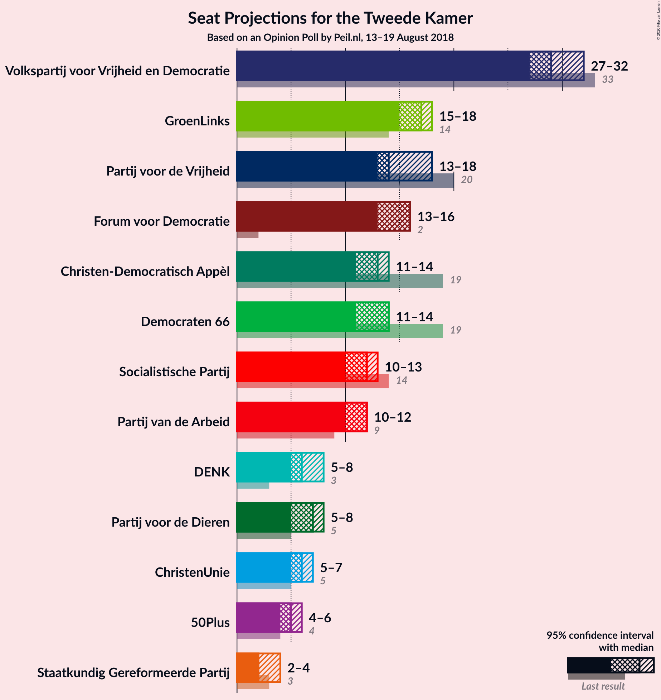
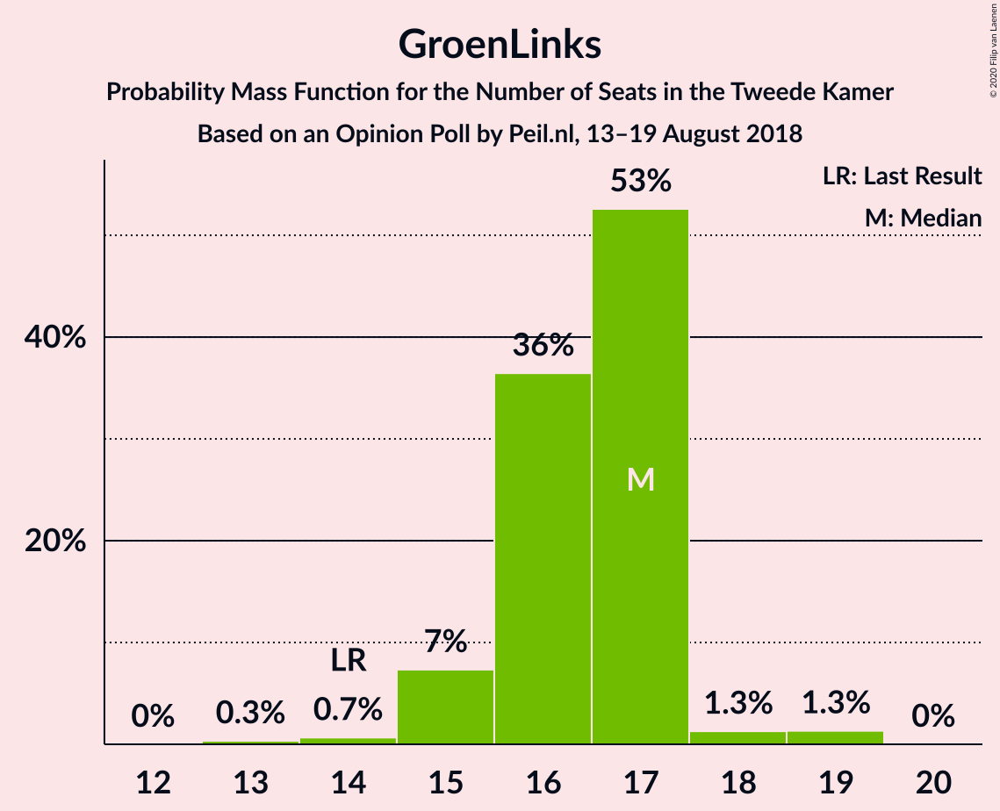
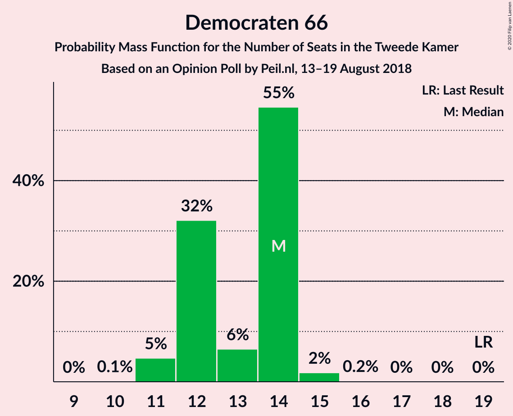
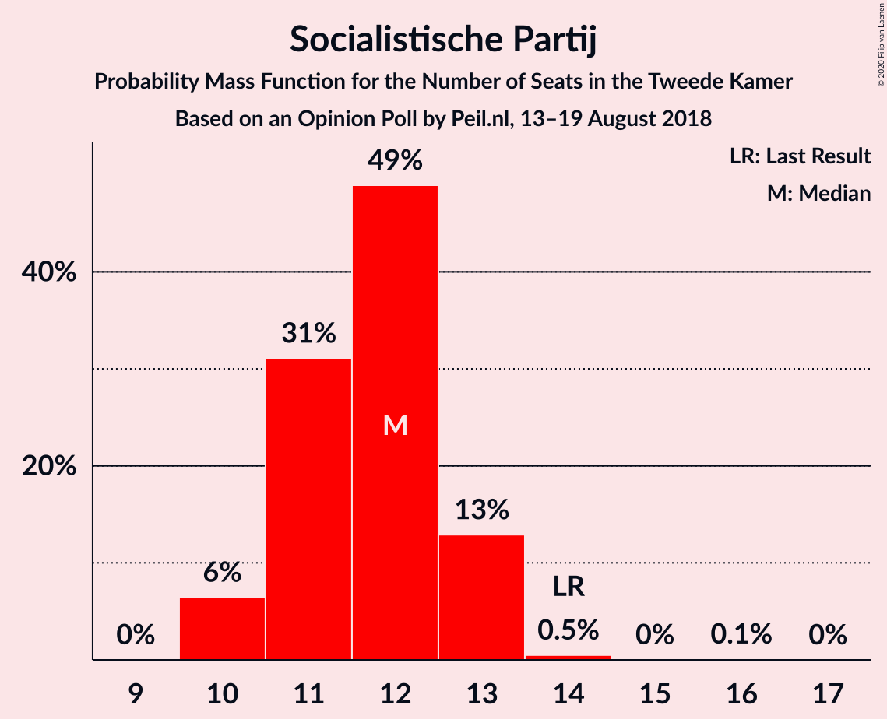
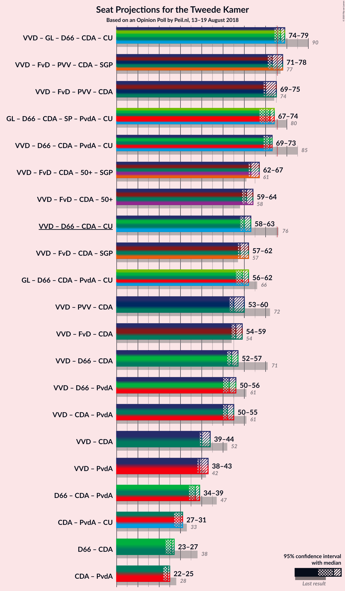
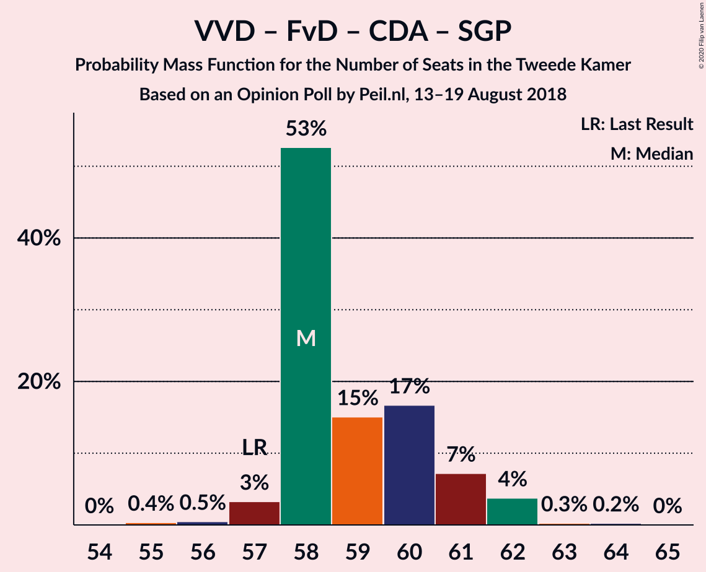
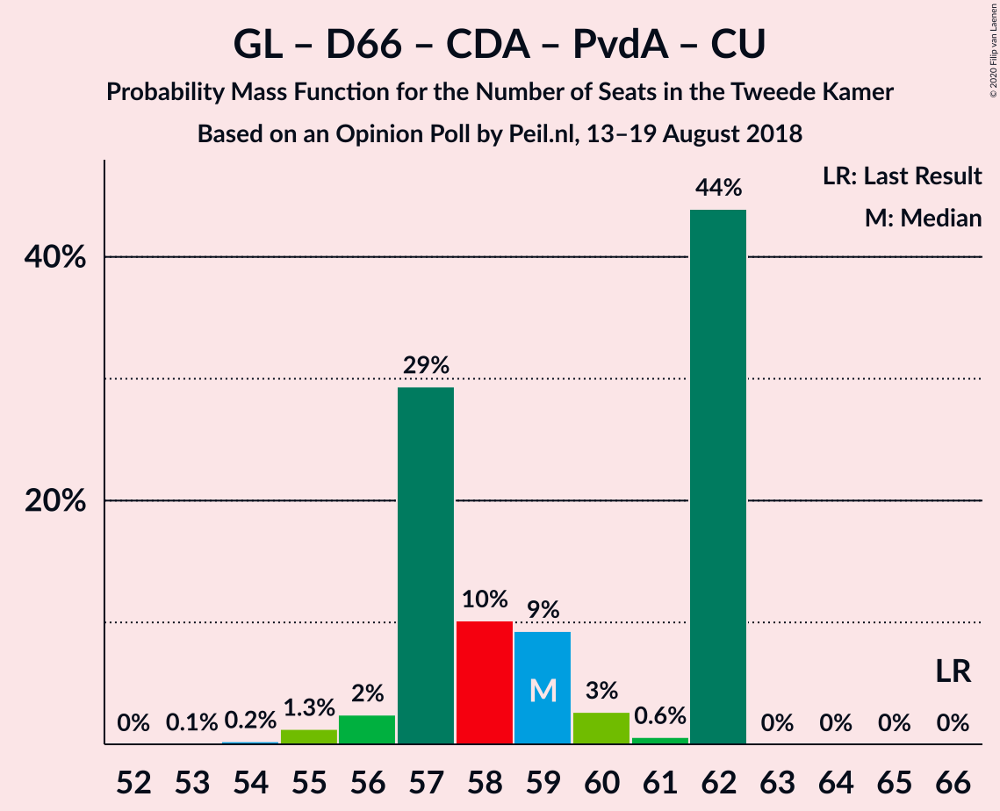
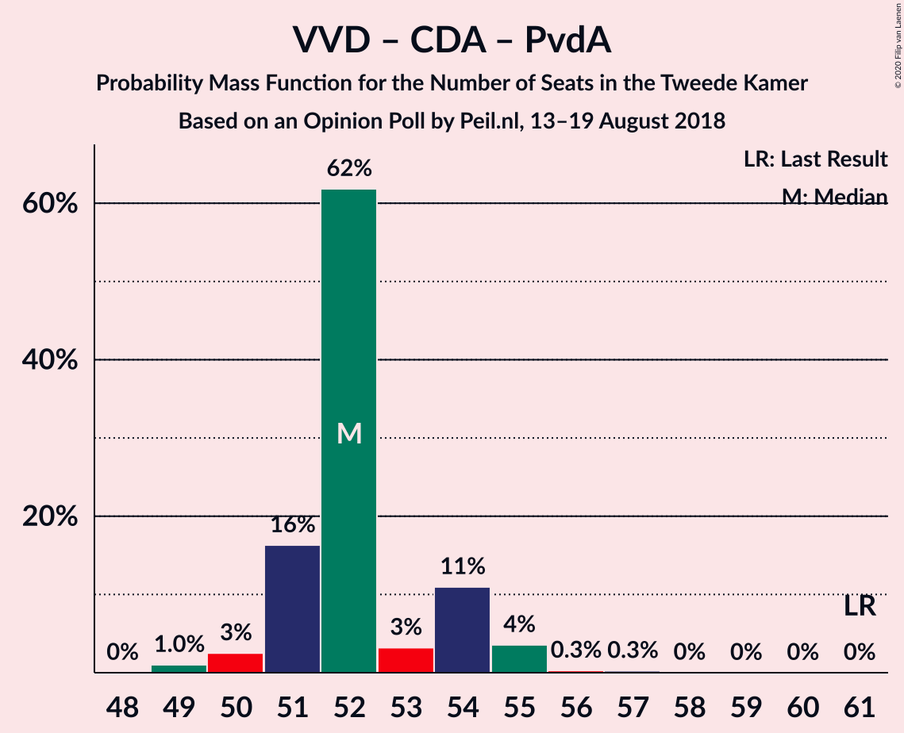

# Opinion Poll by Peil.nl, 13–19 August 2018

<a href="#voting-intentions">Voting Intentions</a> | <a href="#seats">Seats</a> | <a href="#coalitions">Coalitions</a> | <a href="#technical-information">Technical Information</a>

## Voting Intentions

### Confidence Intervals

| Party | Last Result | Poll Result | 80% Confidence Interval | 90% Confidence Interval | 95% Confidence Interval | 99% Confidence Interval |
|:-----:|:-----------:|:-----------:|:-----------------------:|:-----------------------:|:-----------------------:|:-----------------------:|
| Volkspartij voor Vrijheid en Democratie | 21.3% | 19.3% | 18.4–20.3% |18.2–20.6% |18.0–20.8% |17.5–21.3% |
| GroenLinks | 9.1% | 10.7% | 10.0–11.4% |9.8–11.6% |9.6–11.8% |9.3–12.2% |
| Partij voor de Vrijheid | 13.1% | 10.0% | 9.3–10.7% |9.1–10.9% |9.0–11.1% |8.7–11.5% |
| Forum voor Democratie | 1.8% | 10.0% | 9.3–10.7% |9.1–10.9% |9.0–11.1% |8.7–11.5% |
| Democraten 66 | 12.2% | 8.7% | 8.0–9.4% |7.8–9.6% |7.7–9.7% |7.4–10.1% |
| Christen-Democratisch Appèl | 12.4% | 8.0% | 7.4–8.7% |7.2–8.9% |7.1–9.0% |6.8–9.4% |
| Socialistische Partij | 9.1% | 8.0% | 7.4–8.7% |7.2–8.9% |7.1–9.0% |6.8–9.4% |
| Partij van de Arbeid | 5.7% | 7.3% | 6.8–8.0% |6.6–8.2% |6.4–8.3% |6.2–8.6% |
| Partij voor de Dieren | 3.2% | 4.7% | 4.2–5.2% |4.1–5.3% |4.0–5.5% |3.7–5.8% |
| ChristenUnie | 3.4% | 4.0% | 3.6–4.5% |3.4–4.6% |3.4–4.8% |3.2–5.0% |
| DENK | 2.1% | 4.0% | 3.6–4.5% |3.4–4.6% |3.4–4.8% |3.2–5.0% |
| 50Plus | 3.1% | 3.3% | 2.9–3.8% |2.8–3.9% |2.7–4.0% |2.6–4.3% |
| Staatkundig Gereformeerde Partij | 2.1% | 2.0% | 1.7–2.4% |1.6–2.5% |1.6–2.6% |1.4–2.8% |

*Note:* The poll result column reflects the actual value used in the calculations. Published results may vary slightly, and in addition be rounded to fewer digits.

## Seats

### Confidence Intervals

| Party | Last Result | Median | 80% Confidence Interval | 90% Confidence Interval | 95% Confidence Interval | 99% Confidence Interval |
|:-----:|:-----------:|:------:|:-----------------------:|:-----------------------:|:-----------------------:|:-----------------------:|
| <a href="#volkspartij-voor-vrijheid-en-democratie">Volkspartij voor Vrijheid en Democratie</a> | 33 | 29 | 27–30 |27–31 |27–32 |27–33 |
| <a href="#groenlinks">GroenLinks</a> | 14 | 17 | 16–17 |15–17 |15–18 |14–19 |
| <a href="#partij-voor-de-vrijheid">Partij voor de Vrijheid</a> | 20 | 14 | 13–16 |13–17 |13–18 |13–18 |
| <a href="#forum-voor-democratie">Forum voor Democratie</a> | 2 | 16 | 14–16 |14–16 |13–16 |13–18 |
| <a href="#democraten-66">Democraten 66</a> | 19 | 14 | 12–14 |12–14 |11–14 |11–15 |
| <a href="#christen-democratisch-appèl">Christen-Democratisch Appèl</a> | 19 | 13 | 11–13 |11–13 |11–14 |10–14 |
| <a href="#socialistische-partij">Socialistische Partij</a> | 14 | 12 | 11–13 |10–13 |10–13 |10–14 |
| <a href="#partij-van-de-arbeid">Partij van de Arbeid</a> | 9 | 12 | 11–12 |10–12 |10–12 |9–13 |
| <a href="#partij-voor-de-dieren">Partij voor de Dieren</a> | 5 | 7 | 5–8 |5–8 |5–8 |5–8 |
| <a href="#christenunie">ChristenUnie</a> | 5 | 6 | 5–7 |5–7 |5–7 |5–7 |
| <a href="#denk">DENK</a> | 3 | 6 | 5–7 |5–8 |5–8 |4–8 |
| <a href="#50plus">50Plus</a> | 4 | 5 | 4–5 |4–6 |4–6 |3–7 |
| <a href="#staatkundig-gereformeerde-partij">Staatkundig Gereformeerde Partij</a> | 3 | 2 | 2–4 |2–4 |2–4 |2–4 |

### Volkspartij voor Vrijheid en Democratie

*For a full overview of the results for this party, see the [Volkspartij voor Vrijheid en Democratie](party-volkspartijvoorvrijheidendemocratie.html) page.*

| Number of Seats | Probability | Accumulated | Special Marks |
|:---------------:|:-----------:|:-----------:|:-------------:|
| 25 | 0.1% | 100% |  |
| 26 | 0.2% | 99.9% |  |
| 27 | 49% | 99.7% |  |
| 28 | 0.1% | 51% |  |
| 29 | 26% | 51% | Median |
| 30 | 18% | 24% |  |
| 31 | 2% | 6% |  |
| 32 | 4% | 4% |  |
| 33 | 0.5% | 0.6% | Last Result |
| 34 | 0.1% | 0.1% |  |
| 35 | 0% | 0% |  |

### GroenLinks

*For a full overview of the results for this party, see the [GroenLinks](party-groenlinks.html) page.*

| Number of Seats | Probability | Accumulated | Special Marks |
|:---------------:|:-----------:|:-----------:|:-------------:|
| 13 | 0.3% | 100% |  |
| 14 | 0.7% | 99.7% | Last Result |
| 15 | 7% | 99.0% |  |
| 16 | 36% | 92% |  |
| 17 | 53% | 55% | Median |
| 18 | 1.3% | 3% |  |
| 19 | 1.3% | 1.3% |  |
| 20 | 0% | 0% |  |

### Partij voor de Vrijheid

*For a full overview of the results for this party, see the [Partij voor de Vrijheid](party-partijvoordevrijheid.html) page.*

| Number of Seats | Probability | Accumulated | Special Marks |
|:---------------:|:-----------:|:-----------:|:-------------:|
| 13 | 45% | 100% |  |
| 14 | 7% | 55% | Median |
| 15 | 14% | 48% |  |
| 16 | 27% | 34% |  |
| 17 | 3% | 7% |  |
| 18 | 4% | 4% |  |
| 19 | 0.1% | 0.1% |  |
| 20 | 0% | 0% | Last Result |

### Forum voor Democratie

*For a full overview of the results for this party, see the [Forum voor Democratie](party-forumvoordemocratie.html) page.*

| Number of Seats | Probability | Accumulated | Special Marks |
|:---------------:|:-----------:|:-----------:|:-------------:|
| 2 | 0% | 100% | Last Result |
| 3 | 0% | 100% |  |
| 4 | 0% | 100% |  |
| 5 | 0% | 100% |  |
| 6 | 0% | 100% |  |
| 7 | 0% | 100% |  |
| 8 | 0% | 100% |  |
| 9 | 0% | 100% |  |
| 10 | 0% | 100% |  |
| 11 | 0% | 100% |  |
| 12 | 0.1% | 100% |  |
| 13 | 5% | 99.9% |  |
| 14 | 9% | 95% |  |
| 15 | 13% | 86% |  |
| 16 | 70% | 73% | Median |
| 17 | 0.5% | 2% |  |
| 18 | 2% | 2% |  |
| 19 | 0% | 0% |  |

### Democraten 66

*For a full overview of the results for this party, see the [Democraten 66](party-democraten66.html) page.*

| Number of Seats | Probability | Accumulated | Special Marks |
|:---------------:|:-----------:|:-----------:|:-------------:|
| 10 | 0.1% | 100% |  |
| 11 | 5% | 99.9% |  |
| 12 | 32% | 95% |  |
| 13 | 6% | 63% |  |
| 14 | 55% | 57% | Median |
| 15 | 2% | 2% |  |
| 16 | 0.2% | 0.2% |  |
| 17 | 0% | 0% |  |
| 18 | 0% | 0% |  |
| 19 | 0% | 0% | Last Result |

### Christen-Democratisch Appèl

*For a full overview of the results for this party, see the [Christen-Democratisch Appèl](party-christen-democratischappèl.html) page.*

| Number of Seats | Probability | Accumulated | Special Marks |
|:---------------:|:-----------:|:-----------:|:-------------:|
| 10 | 1.1% | 100% |  |
| 11 | 24% | 98.9% |  |
| 12 | 17% | 75% |  |
| 13 | 54% | 57% | Median |
| 14 | 3% | 3% |  |
| 15 | 0.1% | 0.1% |  |
| 16 | 0% | 0% |  |
| 17 | 0% | 0% |  |
| 18 | 0% | 0% |  |
| 19 | 0% | 0% | Last Result |

### Socialistische Partij

*For a full overview of the results for this party, see the [Socialistische Partij](party-socialistischepartij.html) page.*

| Number of Seats | Probability | Accumulated | Special Marks |
|:---------------:|:-----------:|:-----------:|:-------------:|
| 10 | 6% | 100% |  |
| 11 | 31% | 94% |  |
| 12 | 49% | 62% | Median |
| 13 | 13% | 13% |  |
| 14 | 0.5% | 0.6% | Last Result |
| 15 | 0% | 0.1% |  |
| 16 | 0.1% | 0.1% |  |
| 17 | 0% | 0% |  |

### Partij van de Arbeid

*For a full overview of the results for this party, see the [Partij van de Arbeid](party-partijvandearbeid.html) page.*

| Number of Seats | Probability | Accumulated | Special Marks |
|:---------------:|:-----------:|:-----------:|:-------------:|
| 9 | 1.0% | 100% | Last Result |
| 10 | 8% | 99.0% |  |
| 11 | 38% | 91% |  |
| 12 | 51% | 53% | Median |
| 13 | 1.2% | 1.2% |  |
| 14 | 0% | 0% |  |

### Partij voor de Dieren

*For a full overview of the results for this party, see the [Partij voor de Dieren](party-partijvoordedieren.html) page.*

| Number of Seats | Probability | Accumulated | Special Marks |
|:---------------:|:-----------:|:-----------:|:-------------:|
| 5 | 12% | 100% | Last Result |
| 6 | 21% | 88% |  |
| 7 | 54% | 66% | Median |
| 8 | 12% | 12% |  |
| 9 | 0.1% | 0.1% |  |
| 10 | 0% | 0% |  |

### ChristenUnie

*For a full overview of the results for this party, see the [ChristenUnie](party-christenunie.html) page.*

| Number of Seats | Probability | Accumulated | Special Marks |
|:---------------:|:-----------:|:-----------:|:-------------:|
| 4 | 0.4% | 100% |  |
| 5 | 15% | 99.6% | Last Result |
| 6 | 60% | 84% | Median |
| 7 | 24% | 24% |  |
| 8 | 0.4% | 0.4% |  |
| 9 | 0% | 0% |  |

### DENK

*For a full overview of the results for this party, see the [DENK](party-denk.html) page.*

| Number of Seats | Probability | Accumulated | Special Marks |
|:---------------:|:-----------:|:-----------:|:-------------:|
| 3 | 0% | 100% | Last Result |
| 4 | 2% | 100% |  |
| 5 | 13% | 98% |  |
| 6 | 57% | 86% | Median |
| 7 | 23% | 29% |  |
| 8 | 6% | 6% |  |
| 9 | 0% | 0% |  |

### 50Plus

*For a full overview of the results for this party, see the [50Plus](party-50plus.html) page.*

| Number of Seats | Probability | Accumulated | Special Marks |
|:---------------:|:-----------:|:-----------:|:-------------:|
| 3 | 1.0% | 100% |  |
| 4 | 13% | 99.0% | Last Result |
| 5 | 81% | 86% | Median |
| 6 | 4% | 6% |  |
| 7 | 2% | 2% |  |
| 8 | 0% | 0% |  |

### Staatkundig Gereformeerde Partij

*For a full overview of the results for this party, see the [Staatkundig Gereformeerde Partij](party-staatkundiggereformeerdepartij.html) page.*

| Number of Seats | Probability | Accumulated | Special Marks |
|:---------------:|:-----------:|:-----------:|:-------------:|
| 1 | 0.1% | 100% |  |
| 2 | 60% | 99.9% | Median |
| 3 | 26% | 40% | Last Result |
| 4 | 14% | 14% |  |
| 5 | 0% | 0% |  |

## Coalitions

### Confidence Intervals

| Coalition | Last Result | Median | Majority? | 80% Confidence Interval | 90% Confidence Interval | 95% Confidence Interval | 99% Confidence Interval |
|:---------:|:-----------:|:------:|:---------:|:-----------------------:|:-----------------------:|:-----------------------:|:-----------------------:|
| Volkspartij voor Vrijheid en Democratie – GroenLinks – Democraten 66 – Christen-Democratisch Appèl – ChristenUnie | 90 | 77 | 72% | 75–77 | 75–79 | 74–79 | 72–81 |
| Volkspartij voor Vrijheid en Democratie – Forum voor Democratie – Partij voor de Vrijheid – Christen-Democratisch Appèl – Staatkundig Gereformeerde Partij | 77 | 73 | 28% | 71–77 | 71–78 | 71–78 | 71–78 |
| Volkspartij voor Vrijheid en Democratie – Forum voor Democratie – Partij voor de Vrijheid – Christen-Democratisch Appèl | 74 | 70 | 0.8% | 69–74 | 69–75 | 69–75 | 68–76 |
| GroenLinks – Democraten 66 – Christen-Democratisch Appèl – Socialistische Partij – Partij van de Arbeid – ChristenUnie | 80 | 72 | 0% | 68–74 | 67–74 | 67–74 | 66–74 |
| Volkspartij voor Vrijheid en Democratie – Democraten 66 – Christen-Democratisch Appèl – Partij van de Arbeid – ChristenUnie | 85 | 72 | 0.3% | 70–72 | 69–73 | 69–73 | 68–75 |
| Volkspartij voor Vrijheid en Democratie – Forum voor Democratie – Christen-Democratisch Appèl – 50Plus – Staatkundig Gereformeerde Partij | 61 | 63 | 0% | 63–65 | 62–66 | 62–67 | 60–67 |
| Volkspartij voor Vrijheid en Democratie – Forum voor Democratie – Christen-Democratisch Appèl – 50Plus | 58 | 61 | 0% | 61–62 | 59–63 | 59–64 | 58–65 |
| Volkspartij voor Vrijheid en Democratie – Democraten 66 – Christen-Democratisch Appèl – ChristenUnie | 76 | 60 | 0% | 59–61 | 58–62 | 58–63 | 57–64 |
| Volkspartij voor Vrijheid en Democratie – Forum voor Democratie – Christen-Democratisch Appèl – Staatkundig Gereformeerde Partij | 57 | 58 | 0% | 58–61 | 58–61 | 57–62 | 56–63 |
| GroenLinks – Democraten 66 – Christen-Democratisch Appèl – Partij van de Arbeid – ChristenUnie | 66 | 59 | 0% | 57–62 | 57–62 | 56–62 | 55–62 |
| Volkspartij voor Vrijheid en Democratie – Partij voor de Vrijheid – Christen-Democratisch Appèl | 72 | 55 | 0% | 53–58 | 53–59 | 53–60 | 53–61 |
| Volkspartij voor Vrijheid en Democratie – Forum voor Democratie – Christen-Democratisch Appèl | 54 | 56 | 0% | 55–58 | 55–58 | 54–59 | 54–60 |
| Volkspartij voor Vrijheid en Democratie – Democraten 66 – Christen-Democratisch Appèl | 71 | 54 | 0% | 52–56 | 52–56 | 52–57 | 51–58 |
| Volkspartij voor Vrijheid en Democratie – Democraten 66 – Partij van de Arbeid | 61 | 53 | 0% | 52–55 | 51–56 | 50–56 | 50–57 |
| Volkspartij voor Vrijheid en Democratie – Christen-Democratisch Appèl – Partij van de Arbeid | 61 | 52 | 0% | 51–54 | 51–54 | 50–55 | 49–56 |
| Volkspartij voor Vrijheid en Democratie – Christen-Democratisch Appèl | 52 | 40 | 0% | 40–42 | 40–43 | 39–44 | 39–45 |
| Volkspartij voor Vrijheid en Democratie – Partij van de Arbeid | 42 | 39 | 0% | 39–42 | 38–42 | 38–43 | 38–44 |
| Democraten 66 – Christen-Democratisch Appèl – Partij van de Arbeid | 47 | 37 | 0% | 34–39 | 34–39 | 34–39 | 33–39 |
| Christen-Democratisch Appèl – Partij van de Arbeid – ChristenUnie | 33 | 31 | 0% | 28–31 | 28–31 | 27–31 | 25–31 |
| Democraten 66 – Christen-Democratisch Appèl | 38 | 26 | 0% | 23–27 | 23–27 | 23–27 | 22–28 |
| Christen-Democratisch Appèl – Partij van de Arbeid | 28 | 24 | 0% | 22–25 | 22–25 | 22–25 | 20–26 |

### Volkspartij voor Vrijheid en Democratie – GroenLinks – Democraten 66 – Christen-Democratisch Appèl – ChristenUnie

| Number of Seats | Probability | Accumulated | Special Marks |
|:---------------:|:-----------:|:-----------:|:-------------:|
| 71 | 0.2% | 100% |  |
| 72 | 0.5% | 99.8% |  |
| 73 | 0.2% | 99.3% |  |
| 74 | 2% | 99.1% |  |
| 75 | 25% | 97% |  |
| 76 | 13% | 72% | Majority |
| 77 | 49% | 59% |  |
| 78 | 4% | 10% |  |
| 79 | 3% | 6% | Median |
| 80 | 2% | 2% |  |
| 81 | 0.3% | 0.6% |  |
| 82 | 0.3% | 0.3% |  |
| 83 | 0% | 0% |  |
| 84 | 0% | 0% |  |
| 85 | 0% | 0% |  |
| 86 | 0% | 0% |  |
| 87 | 0% | 0% |  |
| 88 | 0% | 0% |  |
| 89 | 0% | 0% |  |
| 90 | 0% | 0% | Last Result |

### Volkspartij voor Vrijheid en Democratie – Forum voor Democratie – Partij voor de Vrijheid – Christen-Democratisch Appèl – Staatkundig Gereformeerde Partij

| Number of Seats | Probability | Accumulated | Special Marks |
|:---------------:|:-----------:|:-----------:|:-------------:|
| 70 | 0.3% | 100% |  |
| 71 | 44% | 99.7% |  |
| 72 | 3% | 56% |  |
| 73 | 9% | 52% |  |
| 74 | 8% | 44% | Median |
| 75 | 8% | 36% |  |
| 76 | 17% | 28% | Majority |
| 77 | 6% | 11% | Last Result |
| 78 | 5% | 5% |  |
| 79 | 0.2% | 0.5% |  |
| 80 | 0.2% | 0.2% |  |
| 81 | 0% | 0% |  |

### Volkspartij voor Vrijheid en Democratie – Forum voor Democratie – Partij voor de Vrijheid – Christen-Democratisch Appèl

| Number of Seats | Probability | Accumulated | Special Marks |
|:---------------:|:-----------:|:-----------:|:-------------:|
| 68 | 0.7% | 100% |  |
| 69 | 46% | 99.3% |  |
| 70 | 8% | 53% |  |
| 71 | 8% | 45% |  |
| 72 | 12% | 37% | Median |
| 73 | 14% | 24% |  |
| 74 | 2% | 10% | Last Result |
| 75 | 8% | 8% |  |
| 76 | 0.6% | 0.8% | Majority |
| 77 | 0.2% | 0.2% |  |
| 78 | 0% | 0% |  |

### GroenLinks – Democraten 66 – Christen-Democratisch Appèl – Socialistische Partij – Partij van de Arbeid – ChristenUnie

| Number of Seats | Probability | Accumulated | Special Marks |
|:---------------:|:-----------:|:-----------:|:-------------:|
| 65 | 0.1% | 100% |  |
| 66 | 2% | 99.9% |  |
| 67 | 4% | 98% |  |
| 68 | 21% | 93% |  |
| 69 | 9% | 72% |  |
| 70 | 7% | 63% |  |
| 71 | 5% | 56% |  |
| 72 | 6% | 51% |  |
| 73 | 1.5% | 45% |  |
| 74 | 44% | 44% | Median |
| 75 | 0.1% | 0.1% |  |
| 76 | 0% | 0% | Majority |
| 77 | 0% | 0% |  |
| 78 | 0% | 0% |  |
| 79 | 0% | 0% |  |
| 80 | 0% | 0% | Last Result |

### Volkspartij voor Vrijheid en Democratie – Democraten 66 – Christen-Democratisch Appèl – Partij van de Arbeid – ChristenUnie

| Number of Seats | Probability | Accumulated | Special Marks |
|:---------------:|:-----------:|:-----------:|:-------------:|
| 66 | 0.1% | 100% |  |
| 67 | 0% | 99.9% |  |
| 68 | 0.6% | 99.9% |  |
| 69 | 7% | 99.3% |  |
| 70 | 19% | 92% |  |
| 71 | 10% | 73% |  |
| 72 | 53% | 63% |  |
| 73 | 7% | 10% |  |
| 74 | 2% | 2% | Median |
| 75 | 0.4% | 0.6% |  |
| 76 | 0.3% | 0.3% | Majority |
| 77 | 0% | 0% |  |
| 78 | 0% | 0% |  |
| 79 | 0% | 0% |  |
| 80 | 0% | 0% |  |
| 81 | 0% | 0% |  |
| 82 | 0% | 0% |  |
| 83 | 0% | 0% |  |
| 84 | 0% | 0% |  |
| 85 | 0% | 0% | Last Result |

### Volkspartij voor Vrijheid en Democratie – Forum voor Democratie – Christen-Democratisch Appèl – 50Plus – Staatkundig Gereformeerde Partij

| Number of Seats | Probability | Accumulated | Special Marks |
|:---------------:|:-----------:|:-----------:|:-------------:|
| 60 | 0.6% | 100% |  |
| 61 | 0.4% | 99.4% | Last Result |
| 62 | 5% | 98.9% |  |
| 63 | 47% | 94% |  |
| 64 | 20% | 47% |  |
| 65 | 22% | 27% | Median |
| 66 | 1.4% | 5% |  |
| 67 | 4% | 4% |  |
| 68 | 0.2% | 0.4% |  |
| 69 | 0.1% | 0.1% |  |
| 70 | 0% | 0% |  |

### Volkspartij voor Vrijheid en Democratie – Forum voor Democratie – Christen-Democratisch Appèl – 50Plus

| Number of Seats | Probability | Accumulated | Special Marks |
|:---------------:|:-----------:|:-----------:|:-------------:|
| 57 | 0.4% | 100% |  |
| 58 | 0.2% | 99.6% | Last Result |
| 59 | 4% | 99.3% |  |
| 60 | 4% | 95% |  |
| 61 | 67% | 91% |  |
| 62 | 16% | 24% |  |
| 63 | 4% | 8% | Median |
| 64 | 3% | 4% |  |
| 65 | 0.6% | 0.7% |  |
| 66 | 0.1% | 0.1% |  |
| 67 | 0% | 0% |  |

### Volkspartij voor Vrijheid en Democratie – Democraten 66 – Christen-Democratisch Appèl – ChristenUnie

| Number of Seats | Probability | Accumulated | Special Marks |
|:---------------:|:-----------:|:-----------:|:-------------:|
| 56 | 0.3% | 100% |  |
| 57 | 0.9% | 99.6% |  |
| 58 | 6% | 98.7% |  |
| 59 | 20% | 93% |  |
| 60 | 54% | 73% |  |
| 61 | 10% | 18% |  |
| 62 | 4% | 9% | Median |
| 63 | 4% | 4% |  |
| 64 | 0.4% | 0.6% |  |
| 65 | 0.2% | 0.2% |  |
| 66 | 0% | 0.1% |  |
| 67 | 0% | 0% |  |
| 68 | 0% | 0% |  |
| 69 | 0% | 0% |  |
| 70 | 0% | 0% |  |
| 71 | 0% | 0% |  |
| 72 | 0% | 0% |  |
| 73 | 0% | 0% |  |
| 74 | 0% | 0% |  |
| 75 | 0% | 0% |  |
| 76 | 0% | 0% | Last Result, Majority |

### Volkspartij voor Vrijheid en Democratie – Forum voor Democratie – Christen-Democratisch Appèl – Staatkundig Gereformeerde Partij

| Number of Seats | Probability | Accumulated | Special Marks |
|:---------------:|:-----------:|:-----------:|:-------------:|
| 55 | 0.4% | 100% |  |
| 56 | 0.5% | 99.6% |  |
| 57 | 3% | 99.2% | Last Result |
| 58 | 53% | 96% |  |
| 59 | 15% | 43% |  |
| 60 | 17% | 28% | Median |
| 61 | 7% | 11% |  |
| 62 | 4% | 4% |  |
| 63 | 0.3% | 0.5% |  |
| 64 | 0.2% | 0.3% |  |
| 65 | 0% | 0% |  |

### GroenLinks – Democraten 66 – Christen-Democratisch Appèl – Partij van de Arbeid – ChristenUnie

| Number of Seats | Probability | Accumulated | Special Marks |
|:---------------:|:-----------:|:-----------:|:-------------:|
| 53 | 0.1% | 100% |  |
| 54 | 0.2% | 99.9% |  |
| 55 | 1.3% | 99.7% |  |
| 56 | 2% | 98% |  |
| 57 | 29% | 96% |  |
| 58 | 10% | 67% |  |
| 59 | 9% | 56% |  |
| 60 | 3% | 47% |  |
| 61 | 0.6% | 45% |  |
| 62 | 44% | 44% | Median |
| 63 | 0% | 0% |  |
| 64 | 0% | 0% |  |
| 65 | 0% | 0% |  |
| 66 | 0% | 0% | Last Result |

### Volkspartij voor Vrijheid en Democratie – Partij voor de Vrijheid – Christen-Democratisch Appèl

| Number of Seats | Probability | Accumulated | Special Marks |
|:---------------:|:-----------:|:-----------:|:-------------:|
| 52 | 0.2% | 100% |  |
| 53 | 44% | 99.8% |  |
| 54 | 2% | 56% |  |
| 55 | 4% | 54% |  |
| 56 | 21% | 50% | Median |
| 57 | 11% | 29% |  |
| 58 | 10% | 18% |  |
| 59 | 5% | 8% |  |
| 60 | 0.3% | 3% |  |
| 61 | 2% | 2% |  |
| 62 | 0.3% | 0.3% |  |
| 63 | 0% | 0% |  |
| 64 | 0% | 0% |  |
| 65 | 0% | 0% |  |
| 66 | 0% | 0% |  |
| 67 | 0% | 0% |  |
| 68 | 0% | 0% |  |
| 69 | 0% | 0% |  |
| 70 | 0% | 0% |  |
| 71 | 0% | 0% |  |
| 72 | 0% | 0% | Last Result |

### Volkspartij voor Vrijheid en Democratie – Forum voor Democratie – Christen-Democratisch Appèl

| Number of Seats | Probability | Accumulated | Special Marks |
|:---------------:|:-----------:|:-----------:|:-------------:|
| 52 | 0.4% | 100% |  |
| 53 | 0% | 99.6% |  |
| 54 | 2% | 99.6% | Last Result |
| 55 | 10% | 97% |  |
| 56 | 62% | 88% |  |
| 57 | 11% | 25% |  |
| 58 | 10% | 14% | Median |
| 59 | 3% | 4% |  |
| 60 | 0.4% | 0.7% |  |
| 61 | 0.3% | 0.3% |  |
| 62 | 0% | 0% |  |

### Volkspartij voor Vrijheid en Democratie – Democraten 66 – Christen-Democratisch Appèl

| Number of Seats | Probability | Accumulated | Special Marks |
|:---------------:|:-----------:|:-----------:|:-------------:|
| 50 | 0.1% | 100% |  |
| 51 | 0.5% | 99.9% |  |
| 52 | 14% | 99.3% |  |
| 53 | 18% | 85% |  |
| 54 | 51% | 68% |  |
| 55 | 4% | 16% |  |
| 56 | 10% | 13% | Median |
| 57 | 0.8% | 3% |  |
| 58 | 2% | 2% |  |
| 59 | 0.2% | 0.3% |  |
| 60 | 0% | 0.1% |  |
| 61 | 0% | 0% |  |
| 62 | 0% | 0% |  |
| 63 | 0% | 0% |  |
| 64 | 0% | 0% |  |
| 65 | 0% | 0% |  |
| 66 | 0% | 0% |  |
| 67 | 0% | 0% |  |
| 68 | 0% | 0% |  |
| 69 | 0% | 0% |  |
| 70 | 0% | 0% |  |
| 71 | 0% | 0% | Last Result |

### Volkspartij voor Vrijheid en Democratie – Democraten 66 – Partij van de Arbeid

| Number of Seats | Probability | Accumulated | Special Marks |
|:---------------:|:-----------:|:-----------:|:-------------:|
| 48 | 0% | 100% |  |
| 49 | 0.1% | 99.9% |  |
| 50 | 2% | 99.9% |  |
| 51 | 4% | 97% |  |
| 52 | 20% | 93% |  |
| 53 | 57% | 73% |  |
| 54 | 4% | 15% |  |
| 55 | 5% | 11% | Median |
| 56 | 6% | 6% |  |
| 57 | 0.3% | 0.8% |  |
| 58 | 0.4% | 0.5% |  |
| 59 | 0% | 0.1% |  |
| 60 | 0% | 0% |  |
| 61 | 0% | 0% | Last Result |

### Volkspartij voor Vrijheid en Democratie – Christen-Democratisch Appèl – Partij van de Arbeid

| Number of Seats | Probability | Accumulated | Special Marks |
|:---------------:|:-----------:|:-----------:|:-------------:|
| 49 | 1.0% | 100% |  |
| 50 | 3% | 99.0% |  |
| 51 | 16% | 96% |  |
| 52 | 62% | 80% |  |
| 53 | 3% | 18% |  |
| 54 | 11% | 15% | Median |
| 55 | 4% | 4% |  |
| 56 | 0.3% | 0.6% |  |
| 57 | 0.3% | 0.3% |  |
| 58 | 0% | 0% |  |
| 59 | 0% | 0% |  |
| 60 | 0% | 0% |  |
| 61 | 0% | 0% | Last Result |

### Volkspartij voor Vrijheid en Democratie – Christen-Democratisch Appèl

| Number of Seats | Probability | Accumulated | Special Marks |
|:---------------:|:-----------:|:-----------:|:-------------:|
| 37 | 0.1% | 100% |  |
| 38 | 0.2% | 99.9% |  |
| 39 | 3% | 99.7% |  |
| 40 | 59% | 97% |  |
| 41 | 17% | 37% |  |
| 42 | 11% | 21% | Median |
| 43 | 5% | 9% |  |
| 44 | 2% | 4% |  |
| 45 | 2% | 2% |  |
| 46 | 0.2% | 0.2% |  |
| 47 | 0% | 0% |  |
| 48 | 0% | 0% |  |
| 49 | 0% | 0% |  |
| 50 | 0% | 0% |  |
| 51 | 0% | 0% |  |
| 52 | 0% | 0% | Last Result |

### Volkspartij voor Vrijheid en Democratie – Partij van de Arbeid

| Number of Seats | Probability | Accumulated | Special Marks |
|:---------------:|:-----------:|:-----------:|:-------------:|
| 37 | 0.3% | 100% |  |
| 38 | 5% | 99.6% |  |
| 39 | 50% | 95% |  |
| 40 | 20% | 44% |  |
| 41 | 13% | 25% | Median |
| 42 | 8% | 12% | Last Result |
| 43 | 3% | 4% |  |
| 44 | 0.4% | 0.6% |  |
| 45 | 0.1% | 0.1% |  |
| 46 | 0.1% | 0.1% |  |
| 47 | 0% | 0% |  |

### Democraten 66 – Christen-Democratisch Appèl – Partij van de Arbeid

| Number of Seats | Probability | Accumulated | Special Marks |
|:---------------:|:-----------:|:-----------:|:-------------:|
| 32 | 0.1% | 100% |  |
| 33 | 0.9% | 99.9% |  |
| 34 | 21% | 99.0% |  |
| 35 | 12% | 78% |  |
| 36 | 9% | 66% |  |
| 37 | 8% | 57% |  |
| 38 | 5% | 49% |  |
| 39 | 44% | 44% | Median |
| 40 | 0.1% | 0.1% |  |
| 41 | 0% | 0% |  |
| 42 | 0% | 0% |  |
| 43 | 0% | 0% |  |
| 44 | 0% | 0% |  |
| 45 | 0% | 0% |  |
| 46 | 0% | 0% |  |
| 47 | 0% | 0% | Last Result |

### Christen-Democratisch Appèl – Partij van de Arbeid – ChristenUnie

| Number of Seats | Probability | Accumulated | Special Marks |
|:---------------:|:-----------:|:-----------:|:-------------:|
| 25 | 0.8% | 100% |  |
| 26 | 0.7% | 99.2% |  |
| 27 | 3% | 98% |  |
| 28 | 7% | 96% |  |
| 29 | 34% | 88% |  |
| 30 | 4% | 54% |  |
| 31 | 50% | 50% | Median |
| 32 | 0.2% | 0.2% |  |
| 33 | 0.1% | 0.1% | Last Result |
| 34 | 0% | 0% |  |

### Democraten 66 – Christen-Democratisch Appèl

| Number of Seats | Probability | Accumulated | Special Marks |
|:---------------:|:-----------:|:-----------:|:-------------:|
| 21 | 0.1% | 100% |  |
| 22 | 0.8% | 99.9% |  |
| 23 | 19% | 99.1% |  |
| 24 | 16% | 80% |  |
| 25 | 6% | 64% |  |
| 26 | 10% | 58% |  |
| 27 | 47% | 48% | Median |
| 28 | 0.8% | 0.9% |  |
| 29 | 0% | 0% |  |
| 30 | 0% | 0% |  |
| 31 | 0% | 0% |  |
| 32 | 0% | 0% |  |
| 33 | 0% | 0% |  |
| 34 | 0% | 0% |  |
| 35 | 0% | 0% |  |
| 36 | 0% | 0% |  |
| 37 | 0% | 0% |  |
| 38 | 0% | 0% | Last Result |

### Christen-Democratisch Appèl – Partij van de Arbeid

| Number of Seats | Probability | Accumulated | Special Marks |
|:---------------:|:-----------:|:-----------:|:-------------:|
| 20 | 0.9% | 100% |  |
| 21 | 1.3% | 99.1% |  |
| 22 | 23% | 98% |  |
| 23 | 16% | 75% |  |
| 24 | 11% | 58% |  |
| 25 | 47% | 47% | Median |
| 26 | 0.5% | 0.5% |  |
| 27 | 0% | 0.1% |  |
| 28 | 0% | 0% | Last Result |

## Technical Information

### Opinion Poll

+ **Polling firm:** Peil.nl
+ **Commissioner(s):** —
+ **Fieldwork period:** 13–19 August 2018

### Calculations

+ **Sample size:** 3000
+ **Simulations done:** 1,048,576
+ **Error estimate:** 1.68%

