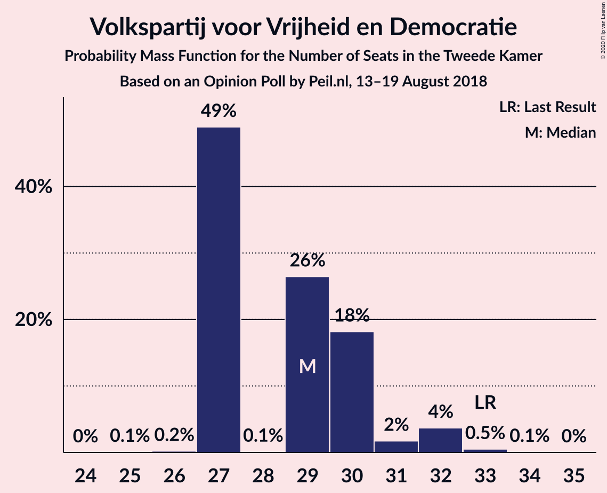
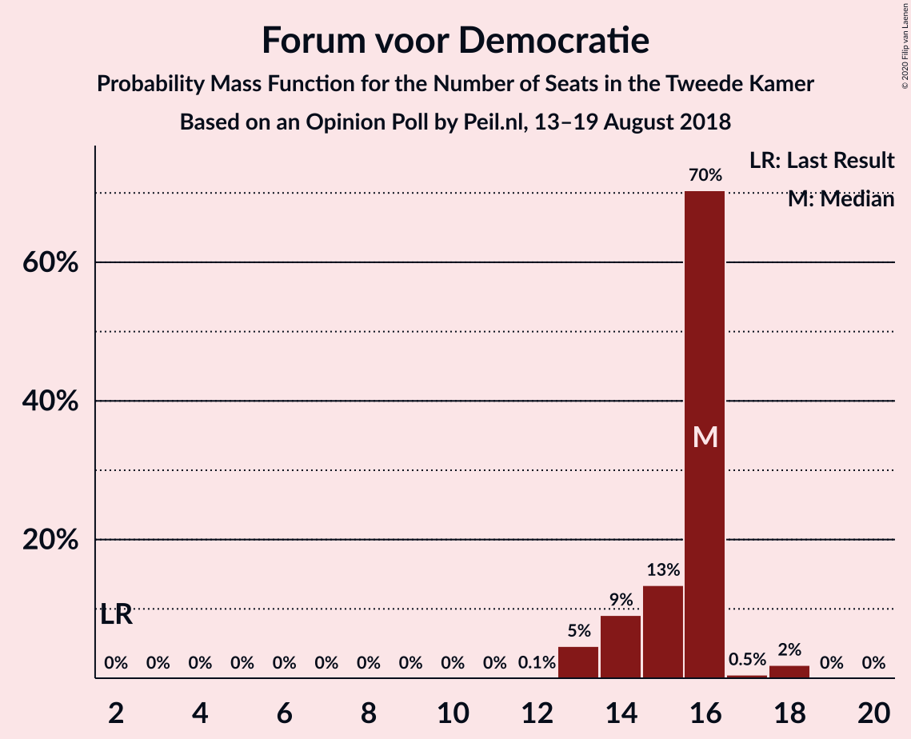
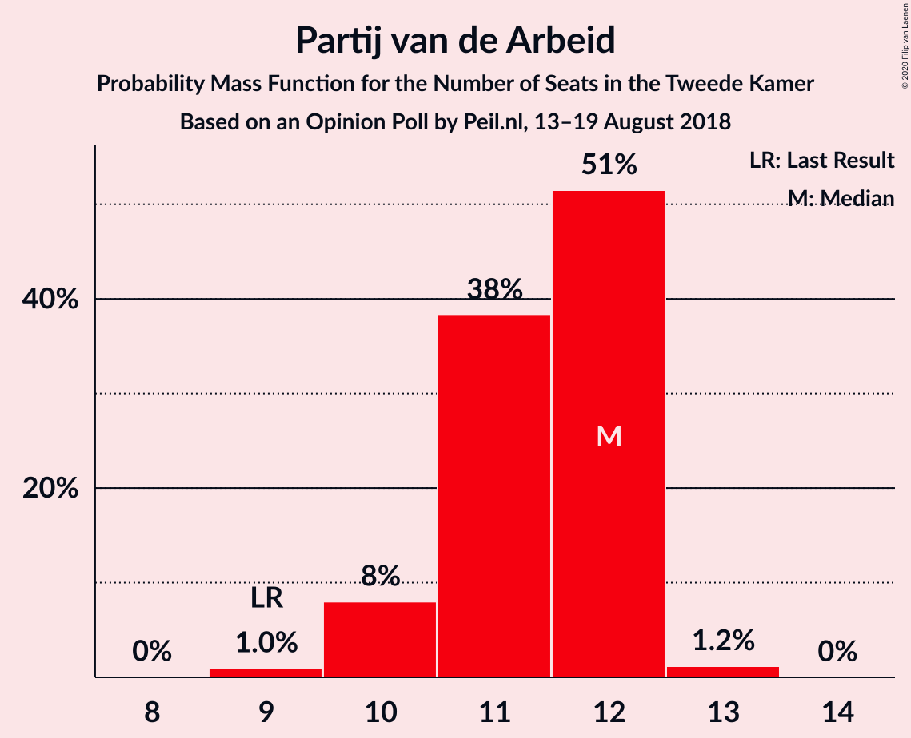
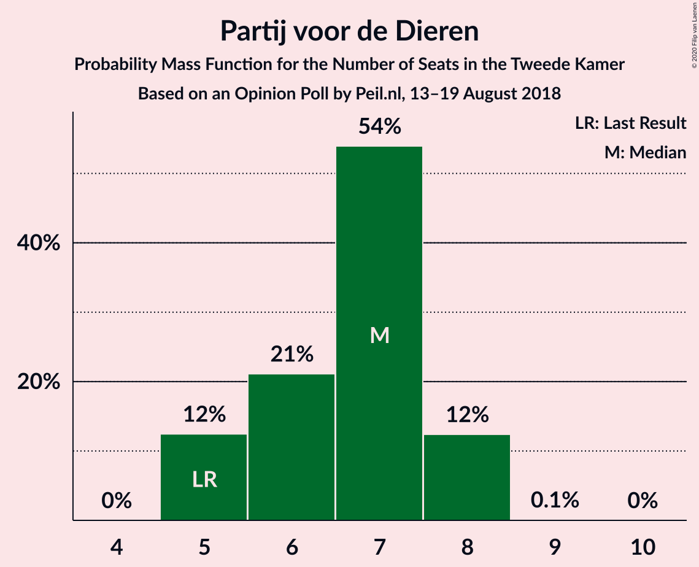
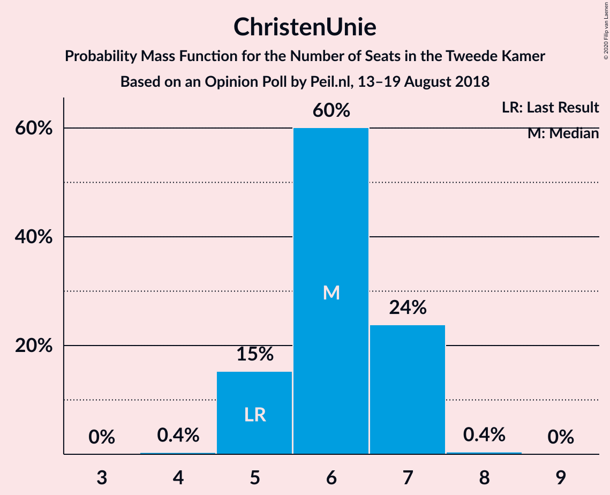
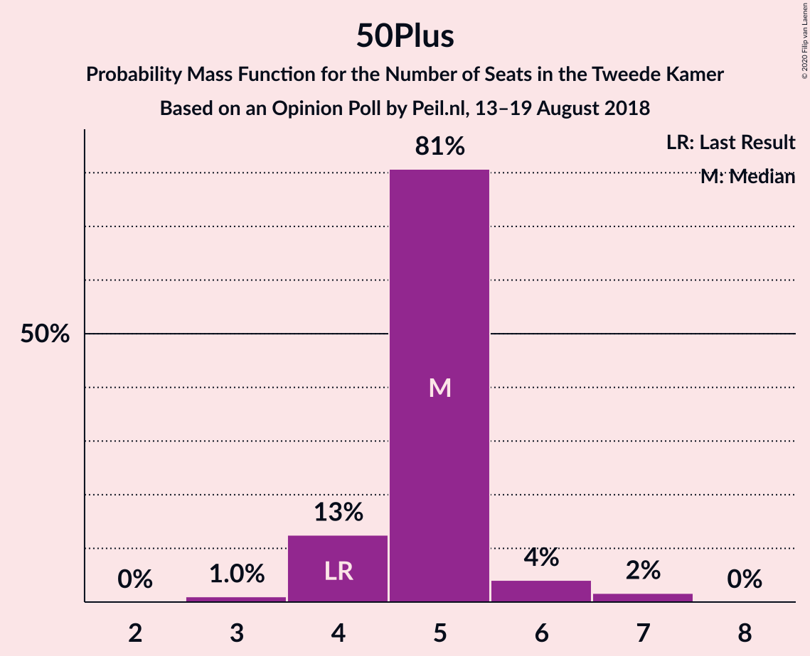
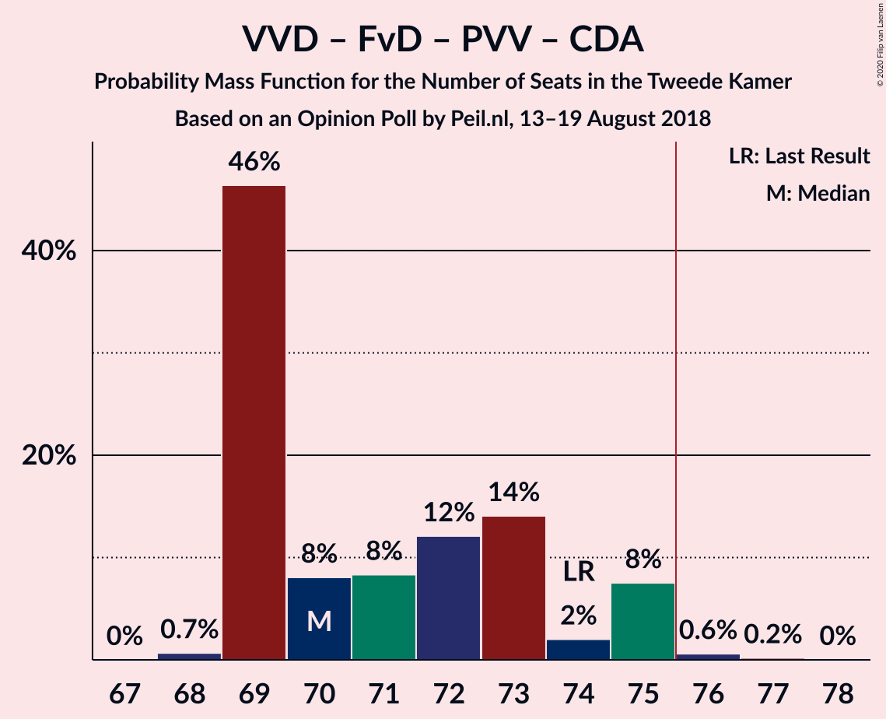
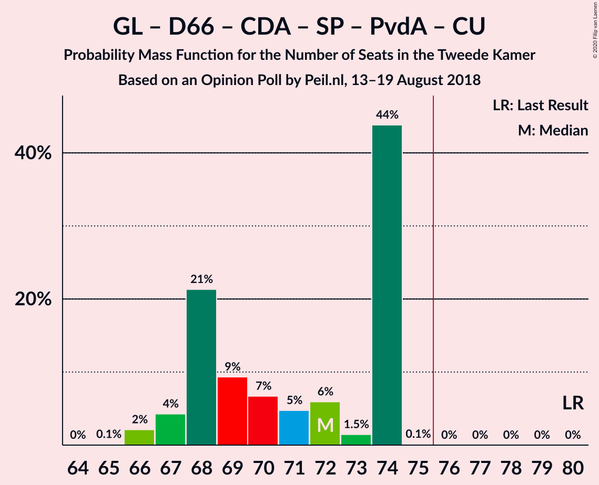
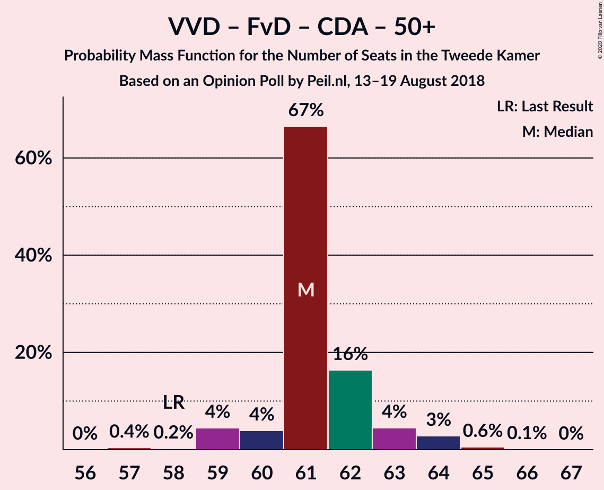
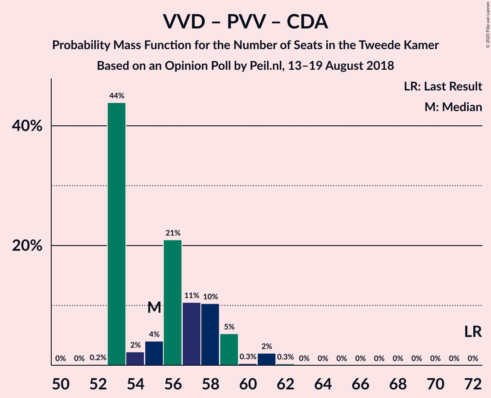

# Opinion Poll by Peil.nl, 13–19 August 2018

<a href="#voting-intentions">Voting Intentions</a> | <a href="#seats">Seats</a> | <a href="#coalitions">Coalitions</a> | <a href="#technical-information">Technical Information</a>

## Voting Intentions

### Confidence Intervals

| Party | Last Result | Poll Result | 80% Confidence Interval | 90% Confidence Interval | 95% Confidence Interval | 99% Confidence Interval |
|:-----:|:-----------:|:-----------:|:-----------------------:|:-----------------------:|:-----------------------:|:-----------------------:|
| Volkspartij voor Vrijheid en Democratie | 21.3% | 19.3% | 18.4–20.3% |18.2–20.6% |18.0–20.8% |17.5–21.3% |
| GroenLinks | 9.1% | 10.7% | 10.0–11.4% |9.8–11.6% |9.6–11.8% |9.3–12.2% |
| Partij voor de Vrijheid | 13.1% | 10.0% | 9.3–10.7% |9.1–10.9% |9.0–11.1% |8.7–11.5% |
| Forum voor Democratie | 1.8% | 10.0% | 9.3–10.7% |9.1–10.9% |9.0–11.1% |8.7–11.5% |
| Democraten 66 | 12.2% | 8.7% | 8.0–9.4% |7.8–9.6% |7.7–9.7% |7.4–10.1% |
| Christen-Democratisch Appèl | 12.4% | 8.0% | 7.4–8.7% |7.2–8.9% |7.1–9.0% |6.8–9.4% |
| Socialistische Partij | 9.1% | 8.0% | 7.4–8.7% |7.2–8.9% |7.1–9.0% |6.8–9.4% |
| Partij van de Arbeid | 5.7% | 7.3% | 6.8–8.0% |6.6–8.2% |6.4–8.3% |6.2–8.6% |
| Partij voor de Dieren | 3.2% | 4.7% | 4.2–5.2% |4.1–5.3% |4.0–5.5% |3.7–5.8% |
| ChristenUnie | 3.4% | 4.0% | 3.6–4.5% |3.4–4.6% |3.4–4.8% |3.2–5.0% |
| DENK | 2.1% | 4.0% | 3.6–4.5% |3.4–4.6% |3.4–4.8% |3.2–5.0% |
| 50Plus | 3.1% | 3.3% | 2.9–3.8% |2.8–3.9% |2.7–4.0% |2.6–4.3% |
| Staatkundig Gereformeerde Partij | 2.1% | 2.0% | 1.7–2.4% |1.6–2.5% |1.6–2.6% |1.4–2.8% |

*Note:* The poll result column reflects the actual value used in the calculations. Published results may vary slightly, and in addition be rounded to fewer digits.

## Seats

### Confidence Intervals

| Party | Last Result | Median | 80% Confidence Interval | 90% Confidence Interval | 95% Confidence Interval | 99% Confidence Interval |
|:-----:|:-----------:|:------:|:-----------------------:|:-----------------------:|:-----------------------:|:-----------------------:|
| <a href="#volkspartij-voor-vrijheid-en-democratie">Volkspartij voor Vrijheid en Democratie</a> | 33 | 30 | 29–33 |29–33 |27–33 |27–34 |
| <a href="#groenlinks">GroenLinks</a> | 14 | 15 | 15–17 |14–17 |14–19 |14–19 |
| <a href="#partij-voor-de-vrijheid">Partij voor de Vrijheid</a> | 20 | 16 | 15–16 |14–16 |13–16 |13–18 |
| <a href="#forum-voor-democratie">Forum voor Democratie</a> | 2 | 16 | 15–16 |15–16 |14–16 |12–18 |
| <a href="#democraten-66">Democraten 66</a> | 19 | 12 | 12–14 |12–14 |11–14 |11–16 |
| <a href="#christen-democratisch-appèl">Christen-Democratisch Appèl</a> | 19 | 12 | 12–14 |11–14 |10–14 |10–14 |
| <a href="#socialistische-partij">Socialistische Partij</a> | 14 | 13 | 10–13 |10–13 |10–13 |10–14 |
| <a href="#partij-van-de-arbeid">Partij van de Arbeid</a> | 9 | 12 | 10–12 |10–12 |9–12 |9–13 |
| <a href="#partij-voor-de-dieren">Partij voor de Dieren</a> | 5 | 6 | 6–8 |6–8 |5–9 |5–9 |
| <a href="#christenunie">ChristenUnie</a> | 5 | 6 | 5–6 |5–6 |5–6 |5–7 |
| <a href="#denk">DENK</a> | 3 | 5 | 5–7 |5–7 |5–7 |5–8 |
| <a href="#50plus">50Plus</a> | 4 | 4 | 4–5 |3–5 |3–6 |3–6 |
| <a href="#staatkundig-gereformeerde-partij">Staatkundig Gereformeerde Partij</a> | 3 | 3 | 3 |3–4 |2–4 |2–4 |

### Volkspartij voor Vrijheid en Democratie

*For a full overview of the results for this party, see the [Volkspartij voor Vrijheid en Democratie](party-volkspartijvoorvrijheidendemocratie.html) page.*

| Number of Seats | Probability | Accumulated | Special Marks |
|:---------------:|:-----------:|:-----------:|:-------------:|
| 26 | 0.1% | 100% |  |
| 27 | 3% | 99.9% |  |
| 28 | 2% | 97% |  |
| 29 | 16% | 95% |  |
| 30 | 61% | 79% | Median |
| 31 | 0.6% | 18% |  |
| 32 | 4% | 17% |  |
| 33 | 11% | 13% | Last Result |
| 34 | 2% | 2% |  |
| 35 | 0% | 0% |  |

### GroenLinks

*For a full overview of the results for this party, see the [GroenLinks](party-groenlinks.html) page.*

| Number of Seats | Probability | Accumulated | Special Marks |
|:---------------:|:-----------:|:-----------:|:-------------:|
| 13 | 0.1% | 100% |  |
| 14 | 8% | 99.9% | Last Result |
| 15 | 54% | 92% | Median |
| 16 | 16% | 38% |  |
| 17 | 19% | 22% |  |
| 18 | 0.7% | 3% |  |
| 19 | 3% | 3% |  |
| 20 | 0% | 0% |  |

### Partij voor de Vrijheid

*For a full overview of the results for this party, see the [Partij voor de Vrijheid](party-partijvoordevrijheid.html) page.*

| Number of Seats | Probability | Accumulated | Special Marks |
|:---------------:|:-----------:|:-----------:|:-------------:|
| 12 | 0.3% | 100% |  |
| 13 | 3% | 99.7% |  |
| 14 | 6% | 96% |  |
| 15 | 19% | 91% |  |
| 16 | 70% | 71% | Median |
| 17 | 0.7% | 2% |  |
| 18 | 0.7% | 0.9% |  |
| 19 | 0.2% | 0.2% |  |
| 20 | 0% | 0% | Last Result |

### Forum voor Democratie

*For a full overview of the results for this party, see the [Forum voor Democratie](party-forumvoordemocratie.html) page.*

| Number of Seats | Probability | Accumulated | Special Marks |
|:---------------:|:-----------:|:-----------:|:-------------:|
| 2 | 0% | 100% | Last Result |
| 3 | 0% | 100% |  |
| 4 | 0% | 100% |  |
| 5 | 0% | 100% |  |
| 6 | 0% | 100% |  |
| 7 | 0% | 100% |  |
| 8 | 0% | 100% |  |
| 9 | 0% | 100% |  |
| 10 | 0% | 100% |  |
| 11 | 0% | 100% |  |
| 12 | 1.0% | 100% |  |
| 13 | 1.2% | 99.0% |  |
| 14 | 1.4% | 98% |  |
| 15 | 42% | 96% |  |
| 16 | 53% | 54% | Median |
| 17 | 0.9% | 1.5% |  |
| 18 | 0.6% | 0.6% |  |
| 19 | 0% | 0% |  |

### Democraten 66

*For a full overview of the results for this party, see the [Democraten 66](party-democraten66.html) page.*

| Number of Seats | Probability | Accumulated | Special Marks |
|:---------------:|:-----------:|:-----------:|:-------------:|
| 11 | 5% | 100% |  |
| 12 | 63% | 95% | Median |
| 13 | 15% | 32% |  |
| 14 | 15% | 17% |  |
| 15 | 0.6% | 2% |  |
| 16 | 1.1% | 1.2% |  |
| 17 | 0% | 0% |  |
| 18 | 0% | 0% |  |
| 19 | 0% | 0% | Last Result |

### Christen-Democratisch Appèl

*For a full overview of the results for this party, see the [Christen-Democratisch Appèl](party-christen-democratischappèl.html) page.*

| Number of Seats | Probability | Accumulated | Special Marks |
|:---------------:|:-----------:|:-----------:|:-------------:|
| 9 | 0.1% | 100% |  |
| 10 | 3% | 99.9% |  |
| 11 | 5% | 97% |  |
| 12 | 59% | 92% | Median |
| 13 | 19% | 33% |  |
| 14 | 13% | 13% |  |
| 15 | 0% | 0% |  |
| 16 | 0% | 0% |  |
| 17 | 0% | 0% |  |
| 18 | 0% | 0% |  |
| 19 | 0% | 0% | Last Result |

### Socialistische Partij

*For a full overview of the results for this party, see the [Socialistische Partij](party-socialistischepartij.html) page.*

| Number of Seats | Probability | Accumulated | Special Marks |
|:---------------:|:-----------:|:-----------:|:-------------:|
| 9 | 0.2% | 100% |  |
| 10 | 16% | 99.8% |  |
| 11 | 11% | 84% |  |
| 12 | 15% | 73% |  |
| 13 | 57% | 58% | Median |
| 14 | 0.2% | 0.5% | Last Result |
| 15 | 0.4% | 0.4% |  |
| 16 | 0% | 0% |  |

### Partij van de Arbeid

*For a full overview of the results for this party, see the [Partij van de Arbeid](party-partijvandearbeid.html) page.*

| Number of Seats | Probability | Accumulated | Special Marks |
|:---------------:|:-----------:|:-----------:|:-------------:|
| 9 | 5% | 100% | Last Result |
| 10 | 28% | 95% |  |
| 11 | 12% | 67% |  |
| 12 | 54% | 55% | Median |
| 13 | 1.1% | 1.1% |  |
| 14 | 0.1% | 0.1% |  |
| 15 | 0% | 0% |  |

### Partij voor de Dieren

*For a full overview of the results for this party, see the [Partij voor de Dieren](party-partijvoordedieren.html) page.*

| Number of Seats | Probability | Accumulated | Special Marks |
|:---------------:|:-----------:|:-----------:|:-------------:|
| 5 | 3% | 100% | Last Result |
| 6 | 62% | 97% | Median |
| 7 | 14% | 36% |  |
| 8 | 19% | 22% |  |
| 9 | 3% | 3% |  |
| 10 | 0% | 0% |  |

### ChristenUnie

*For a full overview of the results for this party, see the [ChristenUnie](party-christenunie.html) page.*

| Number of Seats | Probability | Accumulated | Special Marks |
|:---------------:|:-----------:|:-----------:|:-------------:|
| 4 | 0.1% | 100% |  |
| 5 | 11% | 99.9% | Last Result |
| 6 | 88% | 89% | Median |
| 7 | 1.0% | 1.1% |  |
| 8 | 0% | 0% |  |

### DENK

*For a full overview of the results for this party, see the [DENK](party-denk.html) page.*

| Number of Seats | Probability | Accumulated | Special Marks |
|:---------------:|:-----------:|:-----------:|:-------------:|
| 3 | 0% | 100% | Last Result |
| 4 | 0.2% | 100% |  |
| 5 | 77% | 99.8% | Median |
| 6 | 9% | 23% |  |
| 7 | 12% | 13% |  |
| 8 | 1.0% | 1.0% |  |
| 9 | 0% | 0% |  |

### 50Plus

*For a full overview of the results for this party, see the [50Plus](party-50plus.html) page.*

| Number of Seats | Probability | Accumulated | Special Marks |
|:---------------:|:-----------:|:-----------:|:-------------:|
| 3 | 9% | 100% |  |
| 4 | 75% | 91% | Last Result, Median |
| 5 | 13% | 16% |  |
| 6 | 2% | 3% |  |
| 7 | 0% | 0.2% |  |
| 8 | 0.2% | 0.2% |  |
| 9 | 0% | 0% |  |

### Staatkundig Gereformeerde Partij

*For a full overview of the results for this party, see the [Staatkundig Gereformeerde Partij](party-staatkundiggereformeerdepartij.html) page.*

| Number of Seats | Probability | Accumulated | Special Marks |
|:---------------:|:-----------:|:-----------:|:-------------:|
| 2 | 4% | 100% |  |
| 3 | 89% | 96% | Last Result, Median |
| 4 | 6% | 6% |  |
| 5 | 0% | 0% |  |

## Coalitions

### Confidence Intervals

| Coalition | Last Result | Median | Majority? | 80% Confidence Interval | 90% Confidence Interval | 95% Confidence Interval | 99% Confidence Interval |
|:---------:|:-----------:|:------:|:---------:|:-----------------------:|:-----------------------:|:-----------------------:|:-----------------------:|
| Volkspartij voor Vrijheid en Democratie – GroenLinks – Democraten 66 – Christen-Democratisch Appèl – ChristenUnie | 90 | 75 | 44% | 75–80 | 75–80 | 75–80 | 71–82 |
| Volkspartij voor Vrijheid en Democratie – Forum voor Democratie – Partij voor de Vrijheid – Christen-Democratisch Appèl – Staatkundig Gereformeerde Partij | 77 | 77 | 90% | 76–77 | 73–80 | 73–80 | 71–80 |
| Volkspartij voor Vrijheid en Democratie – Forum voor Democratie – Partij voor de Vrijheid – Christen-Democratisch Appèl | 74 | 74 | 8% | 73–75 | 70–77 | 69–77 | 69–77 |
| Volkspartij voor Vrijheid en Democratie – Democraten 66 – Christen-Democratisch Appèl – Partij van de Arbeid – ChristenUnie | 85 | 72 | 9% | 71–74 | 70–76 | 67–76 | 66–76 |
| GroenLinks – Democraten 66 – Christen-Democratisch Appèl – Socialistische Partij – Partij van de Arbeid – ChristenUnie | 80 | 70 | 0% | 68–71 | 67–71 | 66–71 | 65–73 |
| Volkspartij voor Vrijheid en Democratie – Forum voor Democratie – Christen-Democratisch Appèl – 50Plus – Staatkundig Gereformeerde Partij | 61 | 65 | 0% | 64–67 | 63–68 | 63–68 | 60–69 |
| Volkspartij voor Vrijheid en Democratie – Forum voor Democratie – Christen-Democratisch Appèl – 50Plus | 58 | 62 | 0% | 61–64 | 60–65 | 59–65 | 58–66 |
| Volkspartij voor Vrijheid en Democratie – Democraten 66 – Christen-Democratisch Appèl – ChristenUnie | 76 | 60 | 0% | 60–63 | 58–65 | 56–65 | 56–66 |
| Volkspartij voor Vrijheid en Democratie – Forum voor Democratie – Christen-Democratisch Appèl – Staatkundig Gereformeerde Partij | 57 | 61 | 0% | 60–63 | 58–64 | 58–64 | 55–64 |
| Volkspartij voor Vrijheid en Democratie – Partij voor de Vrijheid – Christen-Democratisch Appèl | 72 | 58 | 0% | 57–59 | 55–62 | 54–62 | 54–62 |
| GroenLinks – Democraten 66 – Christen-Democratisch Appèl – Partij van de Arbeid – ChristenUnie | 66 | 57 | 0% | 57–61 | 55–61 | 54–61 | 54–61 |
| Volkspartij voor Vrijheid en Democratie – Forum voor Democratie – Christen-Democratisch Appèl | 54 | 58 | 0% | 58–59 | 55–61 | 54–61 | 53–61 |
| Volkspartij voor Vrijheid en Democratie – Democraten 66 – Christen-Democratisch Appèl | 71 | 54 | 0% | 54–57 | 53–59 | 50–59 | 50–60 |
| Volkspartij voor Vrijheid en Democratie – Democraten 66 – Partij van de Arbeid | 61 | 54 | 0% | 52–57 | 52–57 | 49–58 | 48–59 |
| Volkspartij voor Vrijheid en Democratie – Christen-Democratisch Appèl – Partij van de Arbeid | 61 | 54 | 0% | 53–55 | 51–57 | 49–57 | 49–57 |
| Volkspartij voor Vrijheid en Democratie – Christen-Democratisch Appèl | 52 | 42 | 0% | 42–44 | 40–46 | 39–46 | 38–46 |
| Volkspartij voor Vrijheid en Democratie – Partij van de Arbeid | 42 | 42 | 0% | 39–42 | 39–44 | 38–44 | 37–46 |
| Democraten 66 – Christen-Democratisch Appèl – Partij van de Arbeid | 47 | 36 | 0% | 34–38 | 33–38 | 33–38 | 33–40 |
| Christen-Democratisch Appèl – Partij van de Arbeid – ChristenUnie | 33 | 30 | 0% | 28–30 | 26–30 | 25–30 | 25–32 |
| Democraten 66 – Christen-Democratisch Appèl | 38 | 24 | 0% | 24–28 | 23–28 | 23–28 | 22–28 |
| Christen-Democratisch Appèl – Partij van de Arbeid | 28 | 24 | 0% | 22–24 | 21–24 | 20–24 | 20–26 |

### Volkspartij voor Vrijheid en Democratie – GroenLinks – Democraten 66 – Christen-Democratisch Appèl – ChristenUnie

| Number of Seats | Probability | Accumulated | Special Marks |
|:---------------:|:-----------:|:-----------:|:-------------:|
| 70 | 0.1% | 100% |  |
| 71 | 0.4% | 99.9% |  |
| 72 | 0.1% | 99.5% |  |
| 73 | 0% | 99.4% |  |
| 74 | 1.2% | 99.4% |  |
| 75 | 55% | 98% | Median |
| 76 | 2% | 44% | Majority |
| 77 | 13% | 41% |  |
| 78 | 4% | 28% |  |
| 79 | 10% | 24% |  |
| 80 | 13% | 14% |  |
| 81 | 0% | 1.0% |  |
| 82 | 1.0% | 1.0% |  |
| 83 | 0% | 0% |  |
| 84 | 0% | 0% |  |
| 85 | 0% | 0% |  |
| 86 | 0% | 0% |  |
| 87 | 0% | 0% |  |
| 88 | 0% | 0% |  |
| 89 | 0% | 0% |  |
| 90 | 0% | 0% | Last Result |

### Volkspartij voor Vrijheid en Democratie – Forum voor Democratie – Partij voor de Vrijheid – Christen-Democratisch Appèl – Staatkundig Gereformeerde Partij

| Number of Seats | Probability | Accumulated | Special Marks |
|:---------------:|:-----------:|:-----------:|:-------------:|
| 69 | 0.4% | 100% |  |
| 70 | 0% | 99.6% |  |
| 71 | 0.2% | 99.6% |  |
| 72 | 2% | 99.3% |  |
| 73 | 6% | 98% |  |
| 74 | 1.3% | 91% |  |
| 75 | 0.2% | 90% |  |
| 76 | 16% | 90% | Majority |
| 77 | 64% | 74% | Last Result, Median |
| 78 | 2% | 10% |  |
| 79 | 0% | 8% |  |
| 80 | 8% | 8% |  |
| 81 | 0% | 0% |  |

### Volkspartij voor Vrijheid en Democratie – Forum voor Democratie – Partij voor de Vrijheid – Christen-Democratisch Appèl

| Number of Seats | Probability | Accumulated | Special Marks |
|:---------------:|:-----------:|:-----------:|:-------------:|
| 66 | 0.4% | 100% |  |
| 67 | 0% | 99.6% |  |
| 68 | 0% | 99.6% |  |
| 69 | 3% | 99.5% |  |
| 70 | 5% | 96% |  |
| 71 | 2% | 92% |  |
| 72 | 0.1% | 90% |  |
| 73 | 18% | 90% |  |
| 74 | 62% | 72% | Last Result, Median |
| 75 | 2% | 10% |  |
| 76 | 0% | 8% | Majority |
| 77 | 8% | 8% |  |
| 78 | 0.1% | 0.1% |  |
| 79 | 0% | 0% |  |

### Volkspartij voor Vrijheid en Democratie – Democraten 66 – Christen-Democratisch Appèl – Partij van de Arbeid – ChristenUnie

| Number of Seats | Probability | Accumulated | Special Marks |
|:---------------:|:-----------:|:-----------:|:-------------:|
| 66 | 2% | 100% |  |
| 67 | 0.5% | 98% |  |
| 68 | 0.4% | 97% |  |
| 69 | 2% | 97% |  |
| 70 | 3% | 95% |  |
| 71 | 16% | 92% |  |
| 72 | 52% | 77% | Median |
| 73 | 12% | 24% |  |
| 74 | 2% | 12% |  |
| 75 | 0.8% | 10% |  |
| 76 | 9% | 9% | Majority |
| 77 | 0% | 0% |  |
| 78 | 0% | 0% |  |
| 79 | 0% | 0% |  |
| 80 | 0% | 0% |  |
| 81 | 0% | 0% |  |
| 82 | 0% | 0% |  |
| 83 | 0% | 0% |  |
| 84 | 0% | 0% |  |
| 85 | 0% | 0% | Last Result |

### GroenLinks – Democraten 66 – Christen-Democratisch Appèl – Socialistische Partij – Partij van de Arbeid – ChristenUnie

| Number of Seats | Probability | Accumulated | Special Marks |
|:---------------:|:-----------:|:-----------:|:-------------:|
| 65 | 2% | 100% |  |
| 66 | 1.0% | 98% |  |
| 67 | 4% | 97% |  |
| 68 | 11% | 93% |  |
| 69 | 10% | 82% |  |
| 70 | 56% | 72% | Median |
| 71 | 14% | 17% |  |
| 72 | 2% | 2% |  |
| 73 | 0% | 0.5% |  |
| 74 | 0.4% | 0.5% |  |
| 75 | 0.1% | 0.1% |  |
| 76 | 0% | 0% | Majority |
| 77 | 0% | 0% |  |
| 78 | 0% | 0% |  |
| 79 | 0% | 0% |  |
| 80 | 0% | 0% | Last Result |

### Volkspartij voor Vrijheid en Democratie – Forum voor Democratie – Christen-Democratisch Appèl – 50Plus – Staatkundig Gereformeerde Partij

| Number of Seats | Probability | Accumulated | Special Marks |
|:---------------:|:-----------:|:-----------:|:-------------:|
| 59 | 0.1% | 100% |  |
| 60 | 0.4% | 99.9% |  |
| 61 | 0.1% | 99.5% | Last Result |
| 62 | 0.9% | 99.3% |  |
| 63 | 5% | 98% |  |
| 64 | 13% | 94% |  |
| 65 | 63% | 81% | Median |
| 66 | 4% | 18% |  |
| 67 | 5% | 14% |  |
| 68 | 8% | 9% |  |
| 69 | 2% | 2% |  |
| 70 | 0% | 0% |  |

### Volkspartij voor Vrijheid en Democratie – Forum voor Democratie – Christen-Democratisch Appèl – 50Plus

| Number of Seats | Probability | Accumulated | Special Marks |
|:---------------:|:-----------:|:-----------:|:-------------:|
| 56 | 0.1% | 100% |  |
| 57 | 0.4% | 99.9% |  |
| 58 | 0.2% | 99.5% | Last Result |
| 59 | 3% | 99.4% |  |
| 60 | 3% | 96% |  |
| 61 | 11% | 94% |  |
| 62 | 64% | 82% | Median |
| 63 | 5% | 18% |  |
| 64 | 4% | 13% |  |
| 65 | 8% | 9% |  |
| 66 | 1.2% | 1.2% |  |
| 67 | 0% | 0% |  |

### Volkspartij voor Vrijheid en Democratie – Democraten 66 – Christen-Democratisch Appèl – ChristenUnie

| Number of Seats | Probability | Accumulated | Special Marks |
|:---------------:|:-----------:|:-----------:|:-------------:|
| 55 | 0.1% | 100% |  |
| 56 | 3% | 99.9% |  |
| 57 | 0.3% | 97% |  |
| 58 | 3% | 97% |  |
| 59 | 3% | 94% |  |
| 60 | 50% | 91% | Median |
| 61 | 11% | 41% |  |
| 62 | 7% | 30% |  |
| 63 | 14% | 23% |  |
| 64 | 0.3% | 9% |  |
| 65 | 8% | 9% |  |
| 66 | 1.0% | 1.0% |  |
| 67 | 0% | 0% |  |
| 68 | 0% | 0% |  |
| 69 | 0% | 0% |  |
| 70 | 0% | 0% |  |
| 71 | 0% | 0% |  |
| 72 | 0% | 0% |  |
| 73 | 0% | 0% |  |
| 74 | 0% | 0% |  |
| 75 | 0% | 0% |  |
| 76 | 0% | 0% | Last Result, Majority |

### Volkspartij voor Vrijheid en Democratie – Forum voor Democratie – Christen-Democratisch Appèl – Staatkundig Gereformeerde Partij

| Number of Seats | Probability | Accumulated | Special Marks |
|:---------------:|:-----------:|:-----------:|:-------------:|
| 54 | 0.1% | 100% |  |
| 55 | 0.4% | 99.9% |  |
| 56 | 0.2% | 99.5% |  |
| 57 | 0.4% | 99.2% | Last Result |
| 58 | 6% | 98.8% |  |
| 59 | 3% | 93% |  |
| 60 | 0.8% | 90% |  |
| 61 | 75% | 90% | Median |
| 62 | 2% | 15% |  |
| 63 | 4% | 13% |  |
| 64 | 8% | 8% |  |
| 65 | 0.2% | 0.2% |  |
| 66 | 0% | 0% |  |

### Volkspartij voor Vrijheid en Democratie – Partij voor de Vrijheid – Christen-Democratisch Appèl

| Number of Seats | Probability | Accumulated | Special Marks |
|:---------------:|:-----------:|:-----------:|:-------------:|
| 53 | 0.4% | 100% |  |
| 54 | 3% | 99.6% |  |
| 55 | 4% | 97% |  |
| 56 | 2% | 93% |  |
| 57 | 2% | 91% |  |
| 58 | 67% | 88% | Median |
| 59 | 12% | 22% |  |
| 60 | 2% | 10% |  |
| 61 | 0% | 8% |  |
| 62 | 8% | 8% |  |
| 63 | 0.1% | 0.1% |  |
| 64 | 0% | 0% |  |
| 65 | 0% | 0% |  |
| 66 | 0% | 0% |  |
| 67 | 0% | 0% |  |
| 68 | 0% | 0% |  |
| 69 | 0% | 0% |  |
| 70 | 0% | 0% |  |
| 71 | 0% | 0% |  |
| 72 | 0% | 0% | Last Result |

### GroenLinks – Democraten 66 – Christen-Democratisch Appèl – Partij van de Arbeid – ChristenUnie

| Number of Seats | Probability | Accumulated | Special Marks |
|:---------------:|:-----------:|:-----------:|:-------------:|
| 54 | 4% | 100% |  |
| 55 | 4% | 96% |  |
| 56 | 1.2% | 92% |  |
| 57 | 70% | 91% | Median |
| 58 | 2% | 21% |  |
| 59 | 2% | 19% |  |
| 60 | 3% | 17% |  |
| 61 | 13% | 13% |  |
| 62 | 0.1% | 0.1% |  |
| 63 | 0% | 0% |  |
| 64 | 0% | 0% |  |
| 65 | 0% | 0% |  |
| 66 | 0% | 0% | Last Result |

### Volkspartij voor Vrijheid en Democratie – Forum voor Democratie – Christen-Democratisch Appèl

| Number of Seats | Probability | Accumulated | Special Marks |
|:---------------:|:-----------:|:-----------:|:-------------:|
| 51 | 0.1% | 100% |  |
| 52 | 0.4% | 99.9% |  |
| 53 | 0.1% | 99.5% |  |
| 54 | 3% | 99.4% | Last Result |
| 55 | 3% | 97% |  |
| 56 | 3% | 94% |  |
| 57 | 0.3% | 90% |  |
| 58 | 74% | 90% | Median |
| 59 | 7% | 16% |  |
| 60 | 1.4% | 9% |  |
| 61 | 8% | 8% |  |
| 62 | 0.2% | 0.2% |  |
| 63 | 0% | 0% |  |

### Volkspartij voor Vrijheid en Democratie – Democraten 66 – Christen-Democratisch Appèl

| Number of Seats | Probability | Accumulated | Special Marks |
|:---------------:|:-----------:|:-----------:|:-------------:|
| 49 | 0.4% | 100% |  |
| 50 | 2% | 99.6% |  |
| 51 | 0.3% | 97% |  |
| 52 | 1.0% | 97% |  |
| 53 | 3% | 96% |  |
| 54 | 52% | 93% | Median |
| 55 | 10% | 41% |  |
| 56 | 4% | 31% |  |
| 57 | 19% | 28% |  |
| 58 | 0.1% | 9% |  |
| 59 | 8% | 9% |  |
| 60 | 1.0% | 1.0% |  |
| 61 | 0% | 0% |  |
| 62 | 0% | 0% |  |
| 63 | 0% | 0% |  |
| 64 | 0% | 0% |  |
| 65 | 0% | 0% |  |
| 66 | 0% | 0% |  |
| 67 | 0% | 0% |  |
| 68 | 0% | 0% |  |
| 69 | 0% | 0% |  |
| 70 | 0% | 0% |  |
| 71 | 0% | 0% | Last Result |

### Volkspartij voor Vrijheid en Democratie – Democraten 66 – Partij van de Arbeid

| Number of Seats | Probability | Accumulated | Special Marks |
|:---------------:|:-----------:|:-----------:|:-------------:|
| 48 | 2% | 100% |  |
| 49 | 0.6% | 98% |  |
| 50 | 0% | 97% |  |
| 51 | 0.4% | 97% |  |
| 52 | 11% | 97% |  |
| 53 | 16% | 86% |  |
| 54 | 55% | 70% | Median |
| 55 | 4% | 15% |  |
| 56 | 0.3% | 11% |  |
| 57 | 8% | 11% |  |
| 58 | 1.1% | 3% |  |
| 59 | 2% | 2% |  |
| 60 | 0% | 0% |  |
| 61 | 0% | 0% | Last Result |

### Volkspartij voor Vrijheid en Democratie – Christen-Democratisch Appèl – Partij van de Arbeid

| Number of Seats | Probability | Accumulated | Special Marks |
|:---------------:|:-----------:|:-----------:|:-------------:|
| 48 | 0% | 100% |  |
| 49 | 3% | 99.9% |  |
| 50 | 0.7% | 97% |  |
| 51 | 3% | 96% |  |
| 52 | 2% | 94% |  |
| 53 | 27% | 92% |  |
| 54 | 53% | 65% | Median |
| 55 | 2% | 11% |  |
| 56 | 2% | 10% |  |
| 57 | 8% | 8% |  |
| 58 | 0% | 0% |  |
| 59 | 0% | 0% |  |
| 60 | 0% | 0% |  |
| 61 | 0% | 0% | Last Result |

### Volkspartij voor Vrijheid en Democratie – Christen-Democratisch Appèl

| Number of Seats | Probability | Accumulated | Special Marks |
|:---------------:|:-----------:|:-----------:|:-------------:|
| 38 | 0.5% | 100% |  |
| 39 | 3% | 99.4% |  |
| 40 | 4% | 97% |  |
| 41 | 0.7% | 93% |  |
| 42 | 52% | 92% | Median |
| 43 | 23% | 40% |  |
| 44 | 9% | 17% |  |
| 45 | 0% | 8% |  |
| 46 | 8% | 8% |  |
| 47 | 0% | 0% |  |
| 48 | 0% | 0% |  |
| 49 | 0% | 0% |  |
| 50 | 0% | 0% |  |
| 51 | 0% | 0% |  |
| 52 | 0% | 0% | Last Result |

### Volkspartij voor Vrijheid en Democratie – Partij van de Arbeid

| Number of Seats | Probability | Accumulated | Special Marks |
|:---------------:|:-----------:|:-----------:|:-------------:|
| 37 | 2% | 100% |  |
| 38 | 2% | 98% |  |
| 39 | 13% | 96% |  |
| 40 | 12% | 83% |  |
| 41 | 4% | 72% |  |
| 42 | 57% | 67% | Last Result, Median |
| 43 | 0.4% | 10% |  |
| 44 | 8% | 10% |  |
| 45 | 0% | 2% |  |
| 46 | 2% | 2% |  |
| 47 | 0% | 0% |  |

### Democraten 66 – Christen-Democratisch Appèl – Partij van de Arbeid

| Number of Seats | Probability | Accumulated | Special Marks |
|:---------------:|:-----------:|:-----------:|:-------------:|
| 31 | 0.1% | 100% |  |
| 32 | 0% | 99.9% |  |
| 33 | 7% | 99.9% |  |
| 34 | 5% | 93% |  |
| 35 | 12% | 88% |  |
| 36 | 51% | 76% | Median |
| 37 | 9% | 25% |  |
| 38 | 15% | 16% |  |
| 39 | 0.1% | 0.9% |  |
| 40 | 0.7% | 0.8% |  |
| 41 | 0.1% | 0.1% |  |
| 42 | 0% | 0% |  |
| 43 | 0% | 0% |  |
| 44 | 0% | 0% |  |
| 45 | 0% | 0% |  |
| 46 | 0% | 0% |  |
| 47 | 0% | 0% | Last Result |

### Christen-Democratisch Appèl – Partij van de Arbeid – ChristenUnie

| Number of Seats | Probability | Accumulated | Special Marks |
|:---------------:|:-----------:|:-----------:|:-------------:|
| 25 | 3% | 100% |  |
| 26 | 2% | 97% |  |
| 27 | 4% | 94% |  |
| 28 | 6% | 91% |  |
| 29 | 13% | 85% |  |
| 30 | 70% | 72% | Median |
| 31 | 1.1% | 2% |  |
| 32 | 0.8% | 0.9% |  |
| 33 | 0.1% | 0.1% | Last Result |
| 34 | 0% | 0% |  |

### Democraten 66 – Christen-Democratisch Appèl

| Number of Seats | Probability | Accumulated | Special Marks |
|:---------------:|:-----------:|:-----------:|:-------------:|
| 21 | 0.1% | 100% |  |
| 22 | 0.7% | 99.9% |  |
| 23 | 6% | 99.2% |  |
| 24 | 57% | 93% | Median |
| 25 | 11% | 35% |  |
| 26 | 10% | 25% |  |
| 27 | 0.3% | 15% |  |
| 28 | 15% | 15% |  |
| 29 | 0% | 0% |  |
| 30 | 0% | 0% |  |
| 31 | 0% | 0% |  |
| 32 | 0% | 0% |  |
| 33 | 0% | 0% |  |
| 34 | 0% | 0% |  |
| 35 | 0% | 0% |  |
| 36 | 0% | 0% |  |
| 37 | 0% | 0% |  |
| 38 | 0% | 0% | Last Result |

### Christen-Democratisch Appèl – Partij van de Arbeid

| Number of Seats | Probability | Accumulated | Special Marks |
|:---------------:|:-----------:|:-----------:|:-------------:|
| 20 | 3% | 100% |  |
| 21 | 3% | 97% |  |
| 22 | 9% | 94% |  |
| 23 | 11% | 85% |  |
| 24 | 72% | 73% | Median |
| 25 | 0.2% | 2% |  |
| 26 | 2% | 2% |  |
| 27 | 0.1% | 0.1% |  |
| 28 | 0% | 0% | Last Result |

## Technical Information

### Opinion Poll

+ **Polling firm:** Peil.nl
+ **Commissioner(s):** —
+ **Fieldwork period:** 13–19 August 2018

### Calculations

+ **Sample size:** 3000
+ **Simulations done:** 131,072
+ **Error estimate:** 1.59%

