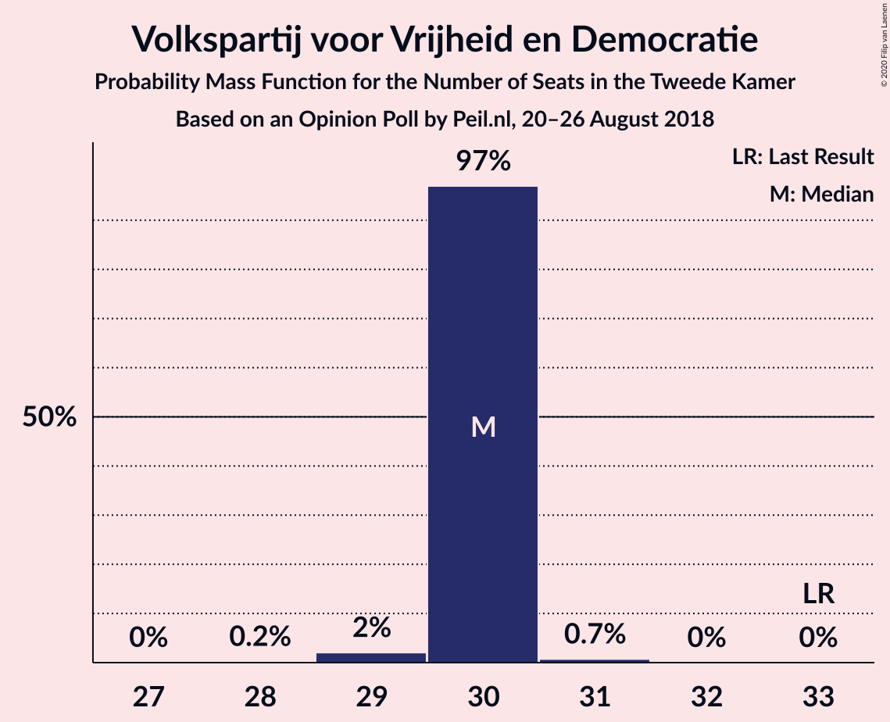
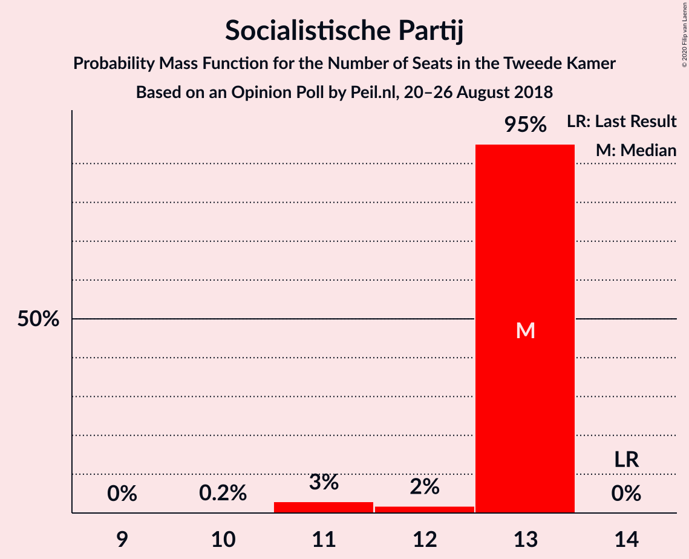
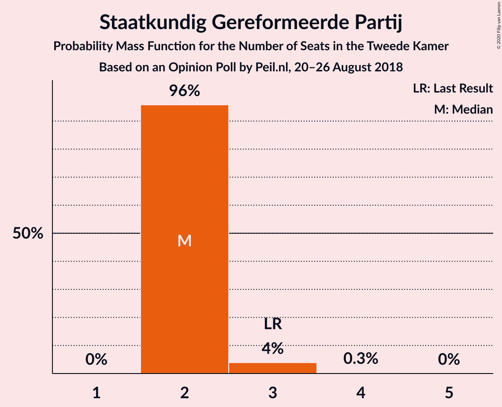
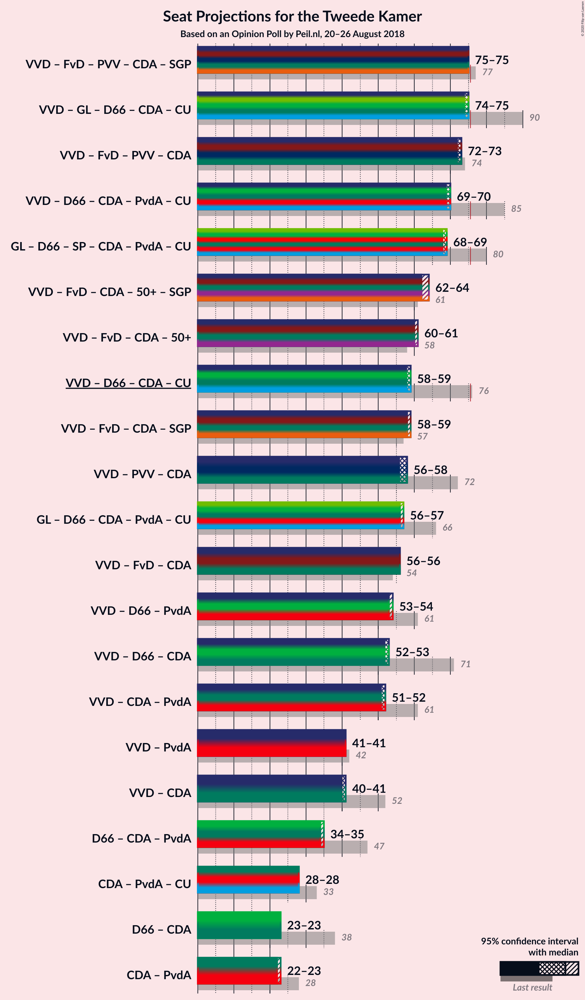
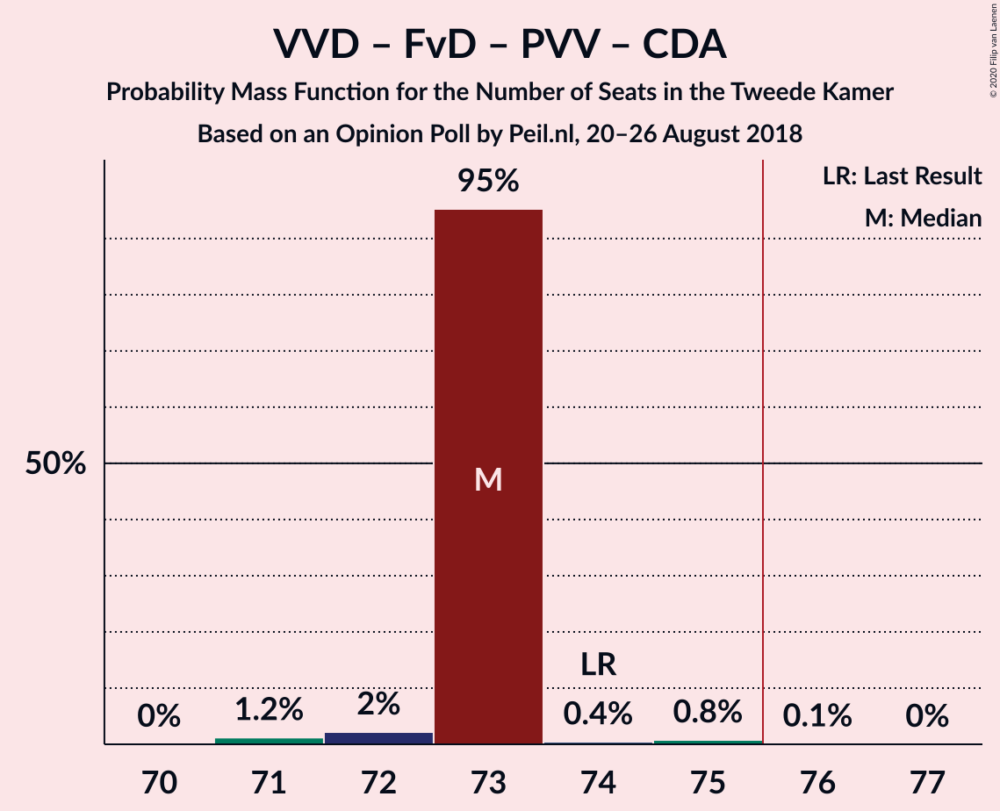
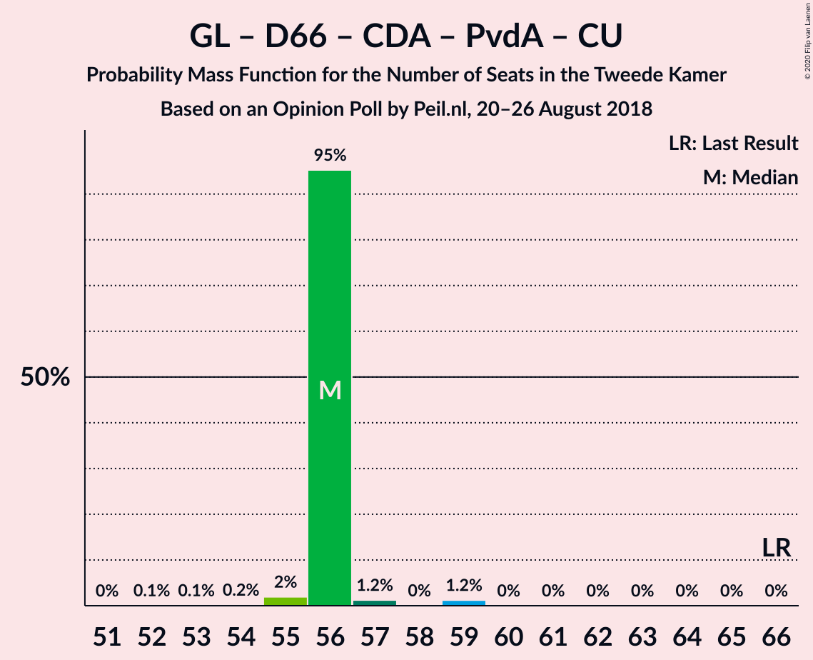
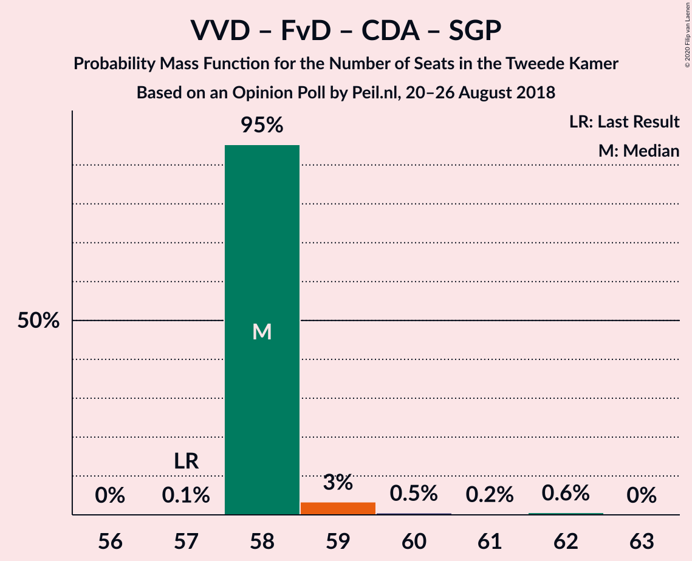
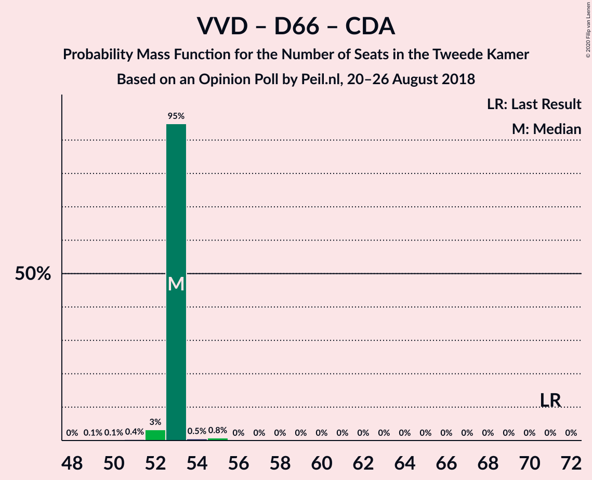
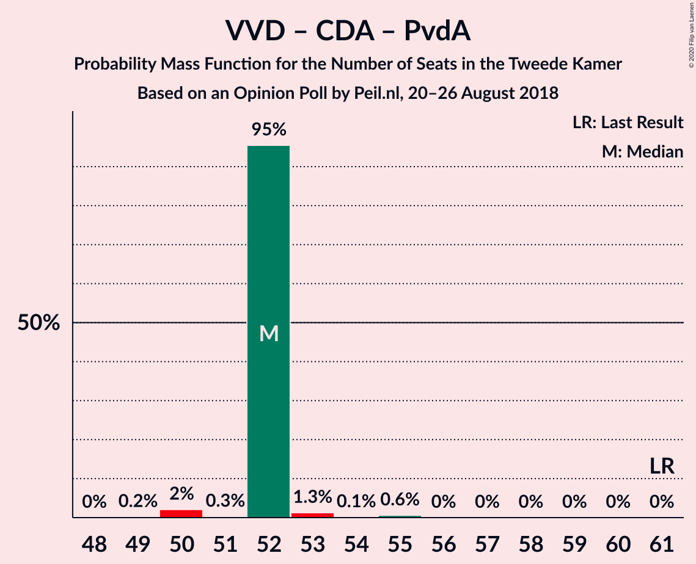

# Opinion Poll by Peil.nl, 20–26 August 2018

<a href="#voting-intentions">Voting Intentions</a> | <a href="#seats">Seats</a> | <a href="#coalitions">Coalitions</a> | <a href="#technical-information">Technical Information</a>

## Voting Intentions

### Confidence Intervals

| Party | Last Result | Poll Result | 80% Confidence Interval | 90% Confidence Interval | 95% Confidence Interval | 99% Confidence Interval |
|:-----:|:-----------:|:-----------:|:-----------------------:|:-----------------------:|:-----------------------:|:-----------------------:|
| Volkspartij voor Vrijheid en Democratie | 21.3% | 19.3% | 18.4–20.3% |18.2–20.6% |18.0–20.8% |17.5–21.3% |
| Partij voor de Vrijheid | 13.1% | 10.7% | 10.0–11.4% |9.8–11.6% |9.6–11.8% |9.3–12.2% |
| GroenLinks | 9.1% | 10.7% | 10.0–11.4% |9.8–11.6% |9.6–11.8% |9.3–12.2% |
| Forum voor Democratie | 1.8% | 10.7% | 10.0–11.4% |9.8–11.6% |9.6–11.8% |9.3–12.2% |
| Democraten 66 | 12.2% | 8.0% | 7.4–8.7% |7.2–8.9% |7.1–9.0% |6.8–9.4% |
| Socialistische Partij | 9.1% | 8.0% | 7.4–8.7% |7.2–8.9% |7.1–9.0% |6.8–9.4% |
| Christen-Democratisch Appèl | 12.4% | 7.3% | 6.8–8.0% |6.6–8.2% |6.4–8.3% |6.2–8.6% |
| Partij van de Arbeid | 5.7% | 7.3% | 6.8–8.0% |6.6–8.2% |6.4–8.3% |6.2–8.6% |
| Partij voor de Dieren | 3.2% | 4.7% | 4.2–5.2% |4.1–5.3% |4.0–5.5% |3.7–5.8% |
| ChristenUnie | 3.4% | 4.0% | 3.6–4.5% |3.4–4.6% |3.4–4.8% |3.2–5.0% |
| DENK | 2.1% | 4.0% | 3.6–4.5% |3.4–4.6% |3.4–4.8% |3.2–5.0% |
| 50Plus | 3.1% | 3.3% | 2.9–3.8% |2.8–3.9% |2.7–4.0% |2.6–4.3% |
| Staatkundig Gereformeerde Partij | 2.1% | 2.0% | 1.7–2.4% |1.6–2.5% |1.6–2.6% |1.4–2.8% |

*Note:* The poll result column reflects the actual value used in the calculations. Published results may vary slightly, and in addition be rounded to fewer digits.

## Seats

### Confidence Intervals

| Party | Last Result | Median | 80% Confidence Interval | 90% Confidence Interval | 95% Confidence Interval | 99% Confidence Interval |
|:-----:|:-----------:|:------:|:-----------------------:|:-----------------------:|:-----------------------:|:-----------------------:|
| <a href="#volkspartij-voor-vrijheid-en-democratie">Volkspartij voor Vrijheid en Democratie</a> | 33 | 30 | 28–30 |27–30 |27–30 |27–31 |
| <a href="#partij-voor-de-vrijheid">Partij voor de Vrijheid</a> | 20 | 17 | 14–17 |14–17 |14–17 |14–17 |
| <a href="#groenlinks">GroenLinks</a> | 14 | 16 | 16–18 |16–18 |15–18 |15–18 |
| <a href="#forum-voor-democratie">Forum voor Democratie</a> | 2 | 16 | 15–18 |15–18 |15–18 |15–18 |
| <a href="#democraten-66">Democraten 66</a> | 19 | 10 | 10–14 |10–14 |10–14 |10–14 |
| <a href="#socialistische-partij">Socialistische Partij</a> | 14 | 12 | 12–14 |12–14 |12–14 |11–14 |
| <a href="#christen-democratisch-appèl">Christen-Democratisch Appèl</a> | 19 | 9 | 9–11 |9–12 |9–12 |9–12 |
| <a href="#partij-van-de-arbeid">Partij van de Arbeid</a> | 9 | 11 | 10–12 |10–12 |10–12 |10–12 |
| <a href="#partij-voor-de-dieren">Partij voor de Dieren</a> | 5 | 8 | 6–8 |6–8 |6–8 |6–8 |
| <a href="#christenunie">ChristenUnie</a> | 5 | 6 | 5–6 |5–6 |5–6 |5–7 |
| <a href="#denk">DENK</a> | 3 | 7 | 5–7 |5–8 |5–8 |5–8 |
| <a href="#50plus">50Plus</a> | 4 | 5 | 4–5 |4–5 |4–7 |4–7 |
| <a href="#staatkundig-gereformeerde-partij">Staatkundig Gereformeerde Partij</a> | 3 | 3 | 2–3 |2–3 |2–3 |2–3 |

### Volkspartij voor Vrijheid en Democratie

*For a full overview of the results for this party, see the [Volkspartij voor Vrijheid en Democratie](party-volkspartijvoorvrijheidendemocratie.html) page.*

| Number of Seats | Probability | Accumulated | Special Marks |
|:---------------:|:-----------:|:-----------:|:-------------:|
| 27 | 10% | 100% |  |
| 28 | 15% | 90% |  |
| 29 | 22% | 75% |  |
| 30 | 52% | 52% | Median |
| 31 | 0.1% | 0.5% |  |
| 32 | 0.2% | 0.4% |  |
| 33 | 0% | 0.3% | Last Result |
| 34 | 0.3% | 0.3% |  |
| 35 | 0% | 0% |  |

### Partij voor de Vrijheid

*For a full overview of the results for this party, see the [Partij voor de Vrijheid](party-partijvoordevrijheid.html) page.*

| Number of Seats | Probability | Accumulated | Special Marks |
|:---------------:|:-----------:|:-----------:|:-------------:|
| 14 | 19% | 100% |  |
| 15 | 0.4% | 81% |  |
| 16 | 19% | 81% |  |
| 17 | 62% | 62% | Median |
| 18 | 0.2% | 0.3% |  |
| 19 | 0% | 0% |  |
| 20 | 0% | 0% | Last Result |

### GroenLinks

*For a full overview of the results for this party, see the [GroenLinks](party-groenlinks.html) page.*

| Number of Seats | Probability | Accumulated | Special Marks |
|:---------------:|:-----------:|:-----------:|:-------------:|
| 14 | 0.1% | 100% | Last Result |
| 15 | 4% | 99.9% |  |
| 16 | 62% | 96% | Median |
| 17 | 15% | 34% |  |
| 18 | 19% | 19% |  |
| 19 | 0% | 0% |  |

### Forum voor Democratie

*For a full overview of the results for this party, see the [Forum voor Democratie](party-forumvoordemocratie.html) page.*

| Number of Seats | Probability | Accumulated | Special Marks |
|:---------------:|:-----------:|:-----------:|:-------------:|
| 2 | 0% | 100% | Last Result |
| 3 | 0% | 100% |  |
| 4 | 0% | 100% |  |
| 5 | 0% | 100% |  |
| 6 | 0% | 100% |  |
| 7 | 0% | 100% |  |
| 8 | 0% | 100% |  |
| 9 | 0% | 100% |  |
| 10 | 0% | 100% |  |
| 11 | 0% | 100% |  |
| 12 | 0% | 100% |  |
| 13 | 0.1% | 100% |  |
| 14 | 0% | 99.9% |  |
| 15 | 32% | 99.8% |  |
| 16 | 52% | 68% | Median |
| 17 | 0.4% | 16% |  |
| 18 | 15% | 15% |  |
| 19 | 0.1% | 0.1% |  |
| 20 | 0% | 0% |  |

### Democraten 66

*For a full overview of the results for this party, see the [Democraten 66](party-democraten66.html) page.*

| Number of Seats | Probability | Accumulated | Special Marks |
|:---------------:|:-----------:|:-----------:|:-------------:|
| 10 | 52% | 100% | Median |
| 11 | 19% | 48% |  |
| 12 | 10% | 29% |  |
| 13 | 0.3% | 19% |  |
| 14 | 19% | 19% |  |
| 15 | 0% | 0% |  |
| 16 | 0% | 0% |  |
| 17 | 0% | 0% |  |
| 18 | 0% | 0% |  |
| 19 | 0% | 0% | Last Result |

### Socialistische Partij

*For a full overview of the results for this party, see the [Socialistische Partij](party-socialistischepartij.html) page.*

| Number of Seats | Probability | Accumulated | Special Marks |
|:---------------:|:-----------:|:-----------:|:-------------:|
| 10 | 0.2% | 100% |  |
| 11 | 0.6% | 99.8% |  |
| 12 | 52% | 99.2% | Median |
| 13 | 28% | 47% |  |
| 14 | 19% | 19% | Last Result |
| 15 | 0% | 0% |  |

### Christen-Democratisch Appèl

*For a full overview of the results for this party, see the [Christen-Democratisch Appèl](party-christen-democratischappèl.html) page.*

| Number of Seats | Probability | Accumulated | Special Marks |
|:---------------:|:-----------:|:-----------:|:-------------:|
| 8 | 0.2% | 100% |  |
| 9 | 52% | 99.8% | Median |
| 10 | 4% | 48% |  |
| 11 | 34% | 44% |  |
| 12 | 10% | 10% |  |
| 13 | 0% | 0% |  |
| 14 | 0% | 0% |  |
| 15 | 0% | 0% |  |
| 16 | 0% | 0% |  |
| 17 | 0% | 0% |  |
| 18 | 0% | 0% |  |
| 19 | 0% | 0% | Last Result |

### Partij van de Arbeid

*For a full overview of the results for this party, see the [Partij van de Arbeid](party-partijvandearbeid.html) page.*

| Number of Seats | Probability | Accumulated | Special Marks |
|:---------------:|:-----------:|:-----------:|:-------------:|
| 9 | 0.1% | 100% | Last Result |
| 10 | 25% | 99.9% |  |
| 11 | 55% | 74% | Median |
| 12 | 19% | 19% |  |
| 13 | 0% | 0% |  |

### Partij voor de Dieren

*For a full overview of the results for this party, see the [Partij voor de Dieren](party-partijvoordedieren.html) page.*

| Number of Seats | Probability | Accumulated | Special Marks |
|:---------------:|:-----------:|:-----------:|:-------------:|
| 5 | 0.1% | 100% | Last Result |
| 6 | 29% | 99.9% |  |
| 7 | 0.8% | 71% |  |
| 8 | 70% | 70% | Median |
| 9 | 0% | 0% |  |

### ChristenUnie

*For a full overview of the results for this party, see the [ChristenUnie](party-christenunie.html) page.*

| Number of Seats | Probability | Accumulated | Special Marks |
|:---------------:|:-----------:|:-----------:|:-------------:|
| 5 | 15% | 100% | Last Result |
| 6 | 84% | 85% | Median |
| 7 | 0.6% | 0.6% |  |
| 8 | 0% | 0% |  |

### DENK

*For a full overview of the results for this party, see the [DENK](party-denk.html) page.*

| Number of Seats | Probability | Accumulated | Special Marks |
|:---------------:|:-----------:|:-----------:|:-------------:|
| 3 | 0% | 100% | Last Result |
| 4 | 0.1% | 100% |  |
| 5 | 34% | 99.9% |  |
| 6 | 4% | 66% |  |
| 7 | 52% | 62% | Median |
| 8 | 10% | 10% |  |
| 9 | 0% | 0% |  |

### 50Plus

*For a full overview of the results for this party, see the [50Plus](party-50plus.html) page.*

| Number of Seats | Probability | Accumulated | Special Marks |
|:---------------:|:-----------:|:-----------:|:-------------:|
| 4 | 19% | 100% | Last Result |
| 5 | 77% | 81% | Median |
| 6 | 0.4% | 4% |  |
| 7 | 3% | 3% |  |
| 8 | 0% | 0% |  |

### Staatkundig Gereformeerde Partij

*For a full overview of the results for this party, see the [Staatkundig Gereformeerde Partij](party-staatkundiggereformeerdepartij.html) page.*

| Number of Seats | Probability | Accumulated | Special Marks |
|:---------------:|:-----------:|:-----------:|:-------------:|
| 2 | 19% | 100% |  |
| 3 | 81% | 81% | Last Result, Median |
| 4 | 0% | 0% |  |

## Coalitions

### Confidence Intervals

| Coalition | Last Result | Median | Majority? | 80% Confidence Interval | 90% Confidence Interval | 95% Confidence Interval | 99% Confidence Interval |
|:---------:|:-----------:|:------:|:---------:|:-----------------------:|:-----------------------:|:-----------------------:|:-----------------------:|
| Volkspartij voor Vrijheid en Democratie – GroenLinks – Democraten 66 – Christen-Democratisch Appèl – ChristenUnie | 90 | 71 | 19% | 71–78 | 71–78 | 71–78 | 71–78 |
| Volkspartij voor Vrijheid en Democratie – Forum voor Democratie – Partij voor de Vrijheid – Christen-Democratisch Appèl – Staatkundig Gereformeerde Partij | 77 | 75 | 16% | 71–76 | 71–76 | 71–76 | 71–77 |
| GroenLinks – Democraten 66 – Socialistische Partij – Christen-Democratisch Appèl – Partij van de Arbeid – ChristenUnie | 80 | 64 | 0% | 64–75 | 64–75 | 64–75 | 64–75 |
| Volkspartij voor Vrijheid en Democratie – Forum voor Democratie – Partij voor de Vrijheid – Christen-Democratisch Appèl | 74 | 72 | 0.1% | 69–73 | 69–73 | 69–73 | 69–74 |
| Volkspartij voor Vrijheid en Democratie – Democraten 66 – Christen-Democratisch Appèl – Partij van de Arbeid – ChristenUnie | 85 | 66 | 0% | 65–72 | 65–72 | 65–72 | 65–72 |
| Volkspartij voor Vrijheid en Democratie – Forum voor Democratie – Christen-Democratisch Appèl – 50Plus – Staatkundig Gereformeerde Partij | 61 | 63 | 0% | 61–65 | 61–65 | 61–65 | 61–65 |
| Volkspartij voor Vrijheid en Democratie – Forum voor Democratie – Christen-Democratisch Appèl – 50Plus | 58 | 60 | 0% | 59–62 | 59–62 | 59–62 | 59–62 |
| GroenLinks – Democraten 66 – Christen-Democratisch Appèl – Partij van de Arbeid – ChristenUnie | 66 | 52 | 0% | 52–61 | 52–61 | 52–61 | 52–61 |
| Volkspartij voor Vrijheid en Democratie – Forum voor Democratie – Christen-Democratisch Appèl – Staatkundig Gereformeerde Partij | 57 | 58 | 0% | 57–60 | 57–60 | 57–60 | 57–61 |
| Volkspartij voor Vrijheid en Democratie – Democraten 66 – Christen-Democratisch Appèl – ChristenUnie | 76 | 55 | 0% | 55–60 | 55–60 | 55–60 | 55–61 |
| Volkspartij voor Vrijheid en Democratie – Forum voor Democratie – Christen-Democratisch Appèl | 54 | 55 | 0% | 54–57 | 54–57 | 54–57 | 54–58 |
| Volkspartij voor Vrijheid en Democratie – Partij voor de Vrijheid – Christen-Democratisch Appèl | 72 | 56 | 0% | 54–56 | 54–56 | 54–56 | 54–58 |
| Volkspartij voor Vrijheid en Democratie – Democraten 66 – Partij van de Arbeid | 61 | 51 | 0% | 49–55 | 49–55 | 49–55 | 49–55 |
| Volkspartij voor Vrijheid en Democratie – Democraten 66 – Christen-Democratisch Appèl | 71 | 49 | 0% | 49–54 | 49–54 | 49–54 | 49–54 |
| Volkspartij voor Vrijheid en Democratie – Christen-Democratisch Appèl – Partij van de Arbeid | 61 | 50 | 0% | 49–52 | 49–52 | 49–52 | 49–52 |
| Volkspartij voor Vrijheid en Democratie – Partij van de Arbeid | 42 | 41 | 0% | 38–41 | 37–41 | 37–41 | 37–42 |
| Volkspartij voor Vrijheid en Democratie – Christen-Democratisch Appèl | 52 | 39 | 0% | 39–40 | 39–40 | 39–40 | 39–41 |
| Democraten 66 – Christen-Democratisch Appèl – Partij van de Arbeid | 47 | 30 | 0% | 30–37 | 30–37 | 30–37 | 30–37 |
| Christen-Democratisch Appèl – Partij van de Arbeid – ChristenUnie | 33 | 26 | 0% | 26–29 | 26–29 | 26–29 | 26–29 |
| Democraten 66 – Christen-Democratisch Appèl | 38 | 19 | 0% | 19–25 | 19–25 | 19–25 | 19–25 |
| Christen-Democratisch Appèl – Partij van de Arbeid | 28 | 20 | 0% | 20–23 | 20–23 | 20–23 | 20–23 |

### Volkspartij voor Vrijheid en Democratie – GroenLinks – Democraten 66 – Christen-Democratisch Appèl – ChristenUnie

| Number of Seats | Probability | Accumulated | Special Marks |
|:---------------:|:-----------:|:-----------:|:-------------:|
| 71 | 55% | 100% | Median |
| 72 | 15% | 45% |  |
| 73 | 10% | 30% |  |
| 74 | 0% | 20% |  |
| 75 | 0.1% | 19% |  |
| 76 | 0% | 19% | Majority |
| 77 | 0.2% | 19% |  |
| 78 | 19% | 19% |  |
| 79 | 0% | 0% |  |
| 80 | 0% | 0% |  |
| 81 | 0% | 0% |  |
| 82 | 0% | 0% |  |
| 83 | 0% | 0% |  |
| 84 | 0% | 0% |  |
| 85 | 0% | 0% |  |
| 86 | 0% | 0% |  |
| 87 | 0% | 0% |  |
| 88 | 0% | 0% |  |
| 89 | 0% | 0% |  |
| 90 | 0% | 0% | Last Result |

### Volkspartij voor Vrijheid en Democratie – Forum voor Democratie – Partij voor de Vrijheid – Christen-Democratisch Appèl – Staatkundig Gereformeerde Partij

| Number of Seats | Probability | Accumulated | Special Marks |
|:---------------:|:-----------:|:-----------:|:-------------:|
| 71 | 19% | 100% |  |
| 72 | 0% | 81% |  |
| 73 | 3% | 81% |  |
| 74 | 10% | 78% |  |
| 75 | 52% | 68% | Median |
| 76 | 15% | 16% | Majority |
| 77 | 0.2% | 0.6% | Last Result |
| 78 | 0.3% | 0.4% |  |
| 79 | 0.1% | 0.1% |  |
| 80 | 0% | 0% |  |

### GroenLinks – Democraten 66 – Socialistische Partij – Christen-Democratisch Appèl – Partij van de Arbeid – ChristenUnie

| Number of Seats | Probability | Accumulated | Special Marks |
|:---------------:|:-----------:|:-----------:|:-------------:|
| 64 | 52% | 100% | Median |
| 65 | 0.5% | 48% |  |
| 66 | 3% | 48% |  |
| 67 | 15% | 44% |  |
| 68 | 0.1% | 29% |  |
| 69 | 10% | 29% |  |
| 70 | 0% | 19% |  |
| 71 | 0.1% | 19% |  |
| 72 | 0% | 19% |  |
| 73 | 0% | 19% |  |
| 74 | 0% | 19% |  |
| 75 | 19% | 19% |  |
| 76 | 0% | 0% | Majority |
| 77 | 0% | 0% |  |
| 78 | 0% | 0% |  |
| 79 | 0% | 0% |  |
| 80 | 0% | 0% | Last Result |

### Volkspartij voor Vrijheid en Democratie – Forum voor Democratie – Partij voor de Vrijheid – Christen-Democratisch Appèl

| Number of Seats | Probability | Accumulated | Special Marks |
|:---------------:|:-----------:|:-----------:|:-------------:|
| 69 | 19% | 100% |  |
| 70 | 3% | 81% |  |
| 71 | 10% | 78% |  |
| 72 | 52% | 68% | Median |
| 73 | 15% | 16% |  |
| 74 | 0.2% | 0.6% | Last Result |
| 75 | 0.3% | 0.4% |  |
| 76 | 0.1% | 0.1% | Majority |
| 77 | 0% | 0% |  |

### Volkspartij voor Vrijheid en Democratie – Democraten 66 – Christen-Democratisch Appèl – Partij van de Arbeid – ChristenUnie

| Number of Seats | Probability | Accumulated | Special Marks |
|:---------------:|:-----------:|:-----------:|:-------------:|
| 65 | 15% | 100% |  |
| 66 | 52% | 85% | Median |
| 67 | 13% | 33% |  |
| 68 | 0.1% | 20% |  |
| 69 | 0.3% | 20% |  |
| 70 | 0% | 19% |  |
| 71 | 0.2% | 19% |  |
| 72 | 19% | 19% |  |
| 73 | 0.3% | 0.4% |  |
| 74 | 0.1% | 0.1% |  |
| 75 | 0% | 0% |  |
| 76 | 0% | 0% | Majority |
| 77 | 0% | 0% |  |
| 78 | 0% | 0% |  |
| 79 | 0% | 0% |  |
| 80 | 0% | 0% |  |
| 81 | 0% | 0% |  |
| 82 | 0% | 0% |  |
| 83 | 0% | 0% |  |
| 84 | 0% | 0% |  |
| 85 | 0% | 0% | Last Result |

### Volkspartij voor Vrijheid en Democratie – Forum voor Democratie – Christen-Democratisch Appèl – 50Plus – Staatkundig Gereformeerde Partij

| Number of Seats | Probability | Accumulated | Special Marks |
|:---------------:|:-----------:|:-----------:|:-------------:|
| 61 | 19% | 100% | Last Result |
| 62 | 10% | 81% |  |
| 63 | 52% | 71% | Median |
| 64 | 3% | 19% |  |
| 65 | 15% | 16% |  |
| 66 | 0.1% | 0.4% |  |
| 67 | 0% | 0.3% |  |
| 68 | 0.3% | 0.3% |  |
| 69 | 0% | 0% |  |

### Volkspartij voor Vrijheid en Democratie – Forum voor Democratie – Christen-Democratisch Appèl – 50Plus

| Number of Seats | Probability | Accumulated | Special Marks |
|:---------------:|:-----------:|:-----------:|:-------------:|
| 58 | 0.1% | 100% | Last Result |
| 59 | 29% | 99.9% |  |
| 60 | 52% | 71% | Median |
| 61 | 4% | 19% |  |
| 62 | 15% | 16% |  |
| 63 | 0.1% | 0.4% |  |
| 64 | 0% | 0.3% |  |
| 65 | 0.3% | 0.3% |  |
| 66 | 0% | 0% |  |

### GroenLinks – Democraten 66 – Christen-Democratisch Appèl – Partij van de Arbeid – ChristenUnie

| Number of Seats | Probability | Accumulated | Special Marks |
|:---------------:|:-----------:|:-----------:|:-------------:|
| 52 | 52% | 100% | Median |
| 53 | 3% | 48% |  |
| 54 | 16% | 45% |  |
| 55 | 0.3% | 29% |  |
| 56 | 10% | 29% |  |
| 57 | 0.2% | 19% |  |
| 58 | 0% | 19% |  |
| 59 | 0.2% | 19% |  |
| 60 | 0% | 19% |  |
| 61 | 19% | 19% |  |
| 62 | 0% | 0% |  |
| 63 | 0% | 0% |  |
| 64 | 0% | 0% |  |
| 65 | 0% | 0% |  |
| 66 | 0% | 0% | Last Result |

### Volkspartij voor Vrijheid en Democratie – Forum voor Democratie – Christen-Democratisch Appèl – Staatkundig Gereformeerde Partij

| Number of Seats | Probability | Accumulated | Special Marks |
|:---------------:|:-----------:|:-----------:|:-------------:|
| 57 | 32% | 100% | Last Result |
| 58 | 52% | 68% | Median |
| 59 | 0.3% | 16% |  |
| 60 | 15% | 16% |  |
| 61 | 0.2% | 0.5% |  |
| 62 | 0.1% | 0.4% |  |
| 63 | 0.3% | 0.3% |  |
| 64 | 0% | 0% |  |

### Volkspartij voor Vrijheid en Democratie – Democraten 66 – Christen-Democratisch Appèl – ChristenUnie

| Number of Seats | Probability | Accumulated | Special Marks |
|:---------------:|:-----------:|:-----------:|:-------------:|
| 55 | 67% | 100% | Median |
| 56 | 3% | 33% |  |
| 57 | 10% | 30% |  |
| 58 | 0.1% | 19% |  |
| 59 | 0% | 19% |  |
| 60 | 19% | 19% |  |
| 61 | 0.2% | 0.6% |  |
| 62 | 0.2% | 0.4% |  |
| 63 | 0.3% | 0.3% |  |
| 64 | 0% | 0% |  |
| 65 | 0% | 0% |  |
| 66 | 0% | 0% |  |
| 67 | 0% | 0% |  |
| 68 | 0% | 0% |  |
| 69 | 0% | 0% |  |
| 70 | 0% | 0% |  |
| 71 | 0% | 0% |  |
| 72 | 0% | 0% |  |
| 73 | 0% | 0% |  |
| 74 | 0% | 0% |  |
| 75 | 0% | 0% |  |
| 76 | 0% | 0% | Last Result, Majority |

### Volkspartij voor Vrijheid en Democratie – Forum voor Democratie – Christen-Democratisch Appèl

| Number of Seats | Probability | Accumulated | Special Marks |
|:---------------:|:-----------:|:-----------:|:-------------:|
| 54 | 13% | 100% | Last Result |
| 55 | 71% | 87% | Median |
| 56 | 0.3% | 16% |  |
| 57 | 15% | 16% |  |
| 58 | 0.2% | 0.5% |  |
| 59 | 0.1% | 0.4% |  |
| 60 | 0.3% | 0.3% |  |
| 61 | 0% | 0% |  |

### Volkspartij voor Vrijheid en Democratie – Partij voor de Vrijheid – Christen-Democratisch Appèl

| Number of Seats | Probability | Accumulated | Special Marks |
|:---------------:|:-----------:|:-----------:|:-------------:|
| 54 | 19% | 100% |  |
| 55 | 18% | 81% |  |
| 56 | 62% | 63% | Median |
| 57 | 0.2% | 0.8% |  |
| 58 | 0.2% | 0.6% |  |
| 59 | 0.1% | 0.4% |  |
| 60 | 0.3% | 0.3% |  |
| 61 | 0% | 0% |  |
| 62 | 0% | 0% |  |
| 63 | 0% | 0% |  |
| 64 | 0% | 0% |  |
| 65 | 0% | 0% |  |
| 66 | 0% | 0% |  |
| 67 | 0% | 0% |  |
| 68 | 0% | 0% |  |
| 69 | 0% | 0% |  |
| 70 | 0% | 0% |  |
| 71 | 0% | 0% |  |
| 72 | 0% | 0% | Last Result |

### Volkspartij voor Vrijheid en Democratie – Democraten 66 – Partij van de Arbeid

| Number of Seats | Probability | Accumulated | Special Marks |
|:---------------:|:-----------:|:-----------:|:-------------:|
| 49 | 25% | 100% |  |
| 50 | 0.2% | 75% |  |
| 51 | 55% | 75% | Median |
| 52 | 0% | 20% |  |
| 53 | 0.2% | 20% |  |
| 54 | 0.2% | 20% |  |
| 55 | 19% | 19% |  |
| 56 | 0.1% | 0.2% |  |
| 57 | 0% | 0.1% |  |
| 58 | 0.1% | 0.1% |  |
| 59 | 0% | 0% |  |
| 60 | 0% | 0% |  |
| 61 | 0% | 0% | Last Result |

### Volkspartij voor Vrijheid en Democratie – Democraten 66 – Christen-Democratisch Appèl

| Number of Seats | Probability | Accumulated | Special Marks |
|:---------------:|:-----------:|:-----------:|:-------------:|
| 49 | 52% | 100% | Median |
| 50 | 18% | 48% |  |
| 51 | 10% | 30% |  |
| 52 | 0.2% | 20% |  |
| 53 | 0% | 19% |  |
| 54 | 19% | 19% |  |
| 55 | 0% | 0.5% |  |
| 56 | 0.4% | 0.4% |  |
| 57 | 0% | 0% |  |
| 58 | 0% | 0% |  |
| 59 | 0% | 0% |  |
| 60 | 0% | 0% |  |
| 61 | 0% | 0% |  |
| 62 | 0% | 0% |  |
| 63 | 0% | 0% |  |
| 64 | 0% | 0% |  |
| 65 | 0% | 0% |  |
| 66 | 0% | 0% |  |
| 67 | 0% | 0% |  |
| 68 | 0% | 0% |  |
| 69 | 0% | 0% |  |
| 70 | 0% | 0% |  |
| 71 | 0% | 0% | Last Result |

### Volkspartij voor Vrijheid en Democratie – Christen-Democratisch Appèl – Partij van de Arbeid

| Number of Seats | Probability | Accumulated | Special Marks |
|:---------------:|:-----------:|:-----------:|:-------------:|
| 47 | 0.1% | 100% |  |
| 48 | 0% | 99.9% |  |
| 49 | 25% | 99.9% |  |
| 50 | 55% | 75% | Median |
| 51 | 0.2% | 19% |  |
| 52 | 19% | 19% |  |
| 53 | 0% | 0.5% |  |
| 54 | 0.1% | 0.5% |  |
| 55 | 0.3% | 0.3% |  |
| 56 | 0% | 0% |  |
| 57 | 0% | 0% |  |
| 58 | 0% | 0% |  |
| 59 | 0% | 0% |  |
| 60 | 0% | 0% |  |
| 61 | 0% | 0% | Last Result |

### Volkspartij voor Vrijheid en Democratie – Partij van de Arbeid

| Number of Seats | Probability | Accumulated | Special Marks |
|:---------------:|:-----------:|:-----------:|:-------------:|
| 37 | 10% | 100% |  |
| 38 | 15% | 90% |  |
| 39 | 0.2% | 75% |  |
| 40 | 3% | 75% |  |
| 41 | 71% | 71% | Median |
| 42 | 0.2% | 0.7% | Last Result |
| 43 | 0% | 0.5% |  |
| 44 | 0.4% | 0.4% |  |
| 45 | 0% | 0% |  |

### Volkspartij voor Vrijheid en Democratie – Christen-Democratisch Appèl

| Number of Seats | Probability | Accumulated | Special Marks |
|:---------------:|:-----------:|:-----------:|:-------------:|
| 38 | 0.3% | 100% |  |
| 39 | 80% | 99.7% | Median |
| 40 | 19% | 20% |  |
| 41 | 0.1% | 0.6% |  |
| 42 | 0.2% | 0.5% |  |
| 43 | 0% | 0.3% |  |
| 44 | 0% | 0.3% |  |
| 45 | 0.3% | 0.3% |  |
| 46 | 0% | 0% |  |
| 47 | 0% | 0% |  |
| 48 | 0% | 0% |  |
| 49 | 0% | 0% |  |
| 50 | 0% | 0% |  |
| 51 | 0% | 0% |  |
| 52 | 0% | 0% | Last Result |

### Democraten 66 – Christen-Democratisch Appèl – Partij van de Arbeid

| Number of Seats | Probability | Accumulated | Special Marks |
|:---------------:|:-----------:|:-----------:|:-------------:|
| 30 | 52% | 100% | Median |
| 31 | 0.1% | 48% |  |
| 32 | 19% | 48% |  |
| 33 | 0.2% | 29% |  |
| 34 | 10% | 29% |  |
| 35 | 0.3% | 19% |  |
| 36 | 0.2% | 19% |  |
| 37 | 19% | 19% |  |
| 38 | 0% | 0% |  |
| 39 | 0% | 0% |  |
| 40 | 0% | 0% |  |
| 41 | 0% | 0% |  |
| 42 | 0% | 0% |  |
| 43 | 0% | 0% |  |
| 44 | 0% | 0% |  |
| 45 | 0% | 0% |  |
| 46 | 0% | 0% |  |
| 47 | 0% | 0% | Last Result |

### Christen-Democratisch Appèl – Partij van de Arbeid – ChristenUnie

| Number of Seats | Probability | Accumulated | Special Marks |
|:---------------:|:-----------:|:-----------:|:-------------:|
| 24 | 0.1% | 100% |  |
| 25 | 0% | 99.9% |  |
| 26 | 67% | 99.8% | Median |
| 27 | 3% | 33% |  |
| 28 | 11% | 29% |  |
| 29 | 19% | 19% |  |
| 30 | 0% | 0% |  |
| 31 | 0% | 0% |  |
| 32 | 0% | 0% |  |
| 33 | 0% | 0% | Last Result |

### Democraten 66 – Christen-Democratisch Appèl

| Number of Seats | Probability | Accumulated | Special Marks |
|:---------------:|:-----------:|:-----------:|:-------------:|
| 19 | 52% | 100% | Median |
| 20 | 0.1% | 48% |  |
| 21 | 4% | 48% |  |
| 22 | 16% | 45% |  |
| 23 | 0.2% | 29% |  |
| 24 | 10% | 29% |  |
| 25 | 19% | 19% |  |
| 26 | 0% | 0.1% |  |
| 27 | 0% | 0% |  |
| 28 | 0% | 0% |  |
| 29 | 0% | 0% |  |
| 30 | 0% | 0% |  |
| 31 | 0% | 0% |  |
| 32 | 0% | 0% |  |
| 33 | 0% | 0% |  |
| 34 | 0% | 0% |  |
| 35 | 0% | 0% |  |
| 36 | 0% | 0% |  |
| 37 | 0% | 0% |  |
| 38 | 0% | 0% | Last Result |

### Christen-Democratisch Appèl – Partij van de Arbeid

| Number of Seats | Probability | Accumulated | Special Marks |
|:---------------:|:-----------:|:-----------:|:-------------:|
| 18 | 0.1% | 100% |  |
| 19 | 0% | 99.9% |  |
| 20 | 52% | 99.9% | Median |
| 21 | 19% | 48% |  |
| 22 | 10% | 29% |  |
| 23 | 19% | 19% |  |
| 24 | 0% | 0.1% |  |
| 25 | 0% | 0% |  |
| 26 | 0% | 0% |  |
| 27 | 0% | 0% |  |
| 28 | 0% | 0% | Last Result |

## Technical Information

### Opinion Poll

+ **Polling firm:** Peil.nl
+ **Commissioner(s):** —
+ **Fieldwork period:** 20–26 August 2018

### Calculations

+ **Sample size:** 3000
+ **Simulations done:** 131,072
+ **Error estimate:** 2.68%

