# Opinion Poll by Ipsos for EenVandaag, 31 August–3 September 2018

<a href="#voting-intentions">Voting Intentions</a> | <a href="#seats">Seats</a> | <a href="#coalitions">Coalitions</a> | <a href="#technical-information">Technical Information</a>

## Voting Intentions

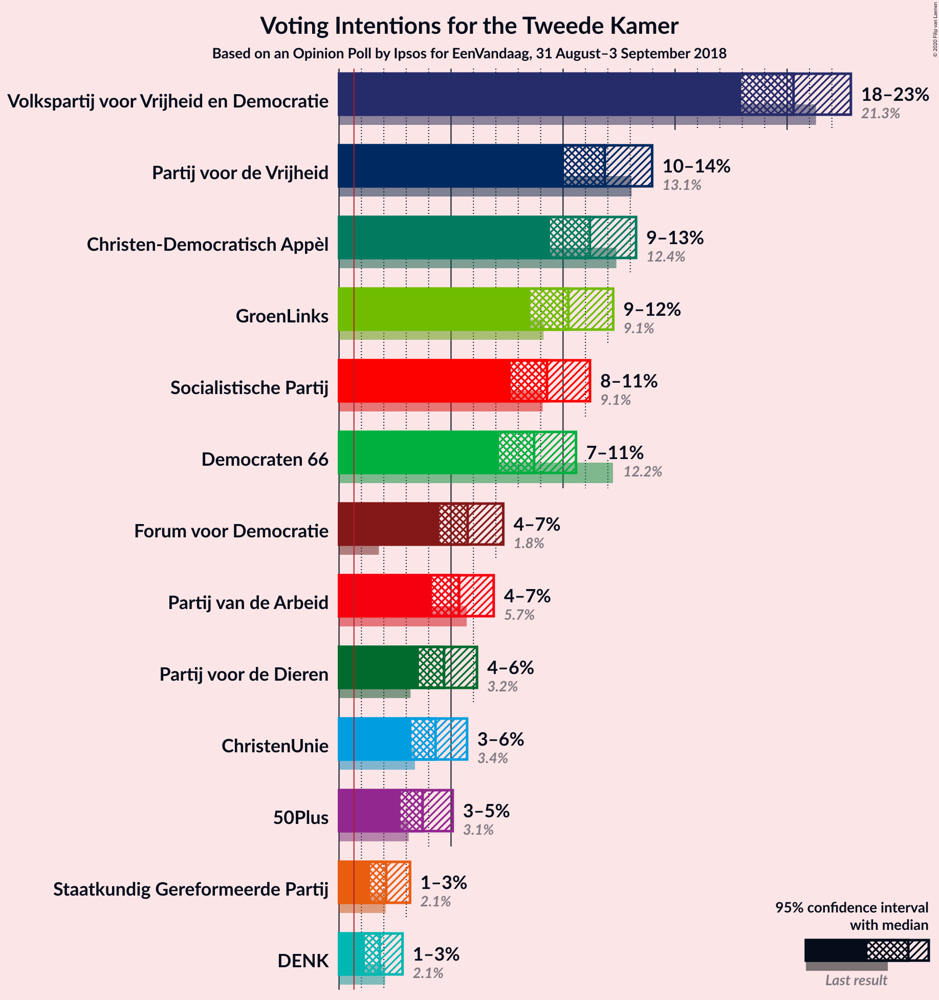

### Confidence Intervals

| Party | Last Result | Poll Result | 80% Confidence Interval | 90% Confidence Interval | 95% Confidence Interval | 99% Confidence Interval |
|:-----:|:-----------:|:-----------:|:-----------------------:|:-----------------------:|:-----------------------:|:-----------------------:|
| Volkspartij voor Vrijheid en Democratie | 21.3% | 20.3% | 18.8–22.0% |18.3–22.4% |18.0–22.8% |17.2–23.7% |
| Partij voor de Vrijheid | 13.1% | 11.9% | 10.7–13.2% |10.3–13.6% |10.0–14.0% |9.5–14.7% |
| Christen-Democratisch Appèl | 12.4% | 11.2% | 10.0–12.5% |9.7–12.9% |9.4–13.3% |8.9–13.9% |
| GroenLinks | 9.1% | 10.2% | 9.1–11.5% |8.8–11.9% |8.5–12.2% |8.0–12.9% |
| Socialistische Partij | 9.1% | 9.3% | 8.2–10.5% |7.9–10.9% |7.7–11.2% |7.2–11.8% |
| Democraten 66 | 12.2% | 8.7% | 7.7–9.9% |7.4–10.3% |7.1–10.6% |6.7–11.2% |
| Forum voor Democratie | 1.8% | 5.7% | 4.9–6.8% |4.7–7.1% |4.5–7.3% |4.1–7.8% |
| Partij van de Arbeid | 5.7% | 5.4% | 4.6–6.4% |4.3–6.6% |4.1–6.9% |3.8–7.4% |
| Partij voor de Dieren | 3.2% | 4.7% | 3.9–5.6% |3.7–5.9% |3.6–6.2% |3.2–6.6% |
| ChristenUnie | 3.4% | 4.3% | 3.6–5.2% |3.4–5.5% |3.2–5.7% |2.9–6.2% |
| 50Plus | 3.1% | 3.7% | 3.1–4.6% |2.9–4.8% |2.7–5.1% |2.5–5.5% |
| Staatkundig Gereformeerde Partij | 2.1% | 2.1% | 1.6–2.8% |1.5–3.0% |1.4–3.2% |1.2–3.5% |
| DENK | 2.1% | 1.8% | 1.4–2.5% |1.3–2.7% |1.2–2.8% |1.0–3.2% |

*Note:* The poll result column reflects the actual value used in the calculations. Published results may vary slightly, and in addition be rounded to fewer digits.

## Seats

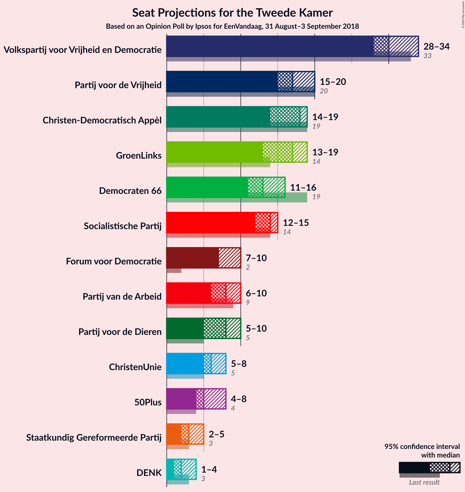

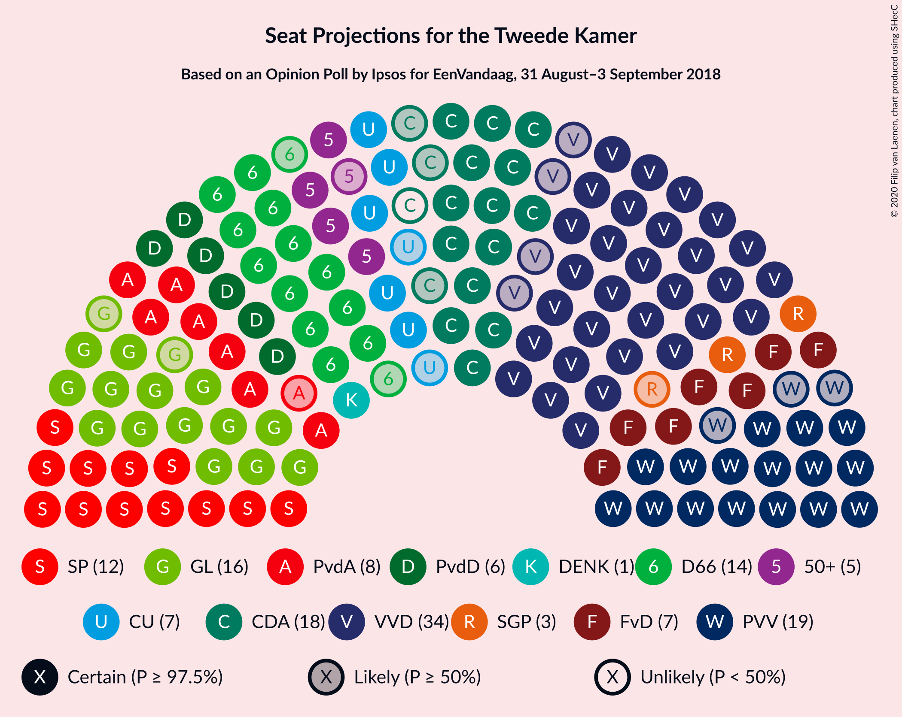

### Confidence Intervals

| Party | Last Result | Median | 80% Confidence Interval | 90% Confidence Interval | 95% Confidence Interval | 99% Confidence Interval |
|:-----:|:-----------:|:------:|:-----------------------:|:-----------------------:|:-----------------------:|:-----------------------:|
| <a href="#volkspartij-voor-vrijheid-en-democratie">Volkspartij voor Vrijheid en Democratie</a> | 33 | 34 | 32–34 |30–34 |30–34 |28–34 |
| <a href="#partij-voor-de-vrijheid">Partij voor de Vrijheid</a> | 20 | 19 | 19–20 |17–20 |16–20 |15–23 |
| <a href="#christen-democratisch-appèl">Christen-Democratisch Appèl</a> | 19 | 17 | 17–18 |15–18 |14–18 |14–20 |
| <a href="#groenlinks">GroenLinks</a> | 14 | 16 | 15–16 |15–18 |14–18 |12–19 |
| <a href="#socialistische-partij">Socialistische Partij</a> | 14 | 12 | 12–15 |12–15 |12–15 |12–16 |
| <a href="#democraten-66">Democraten 66</a> | 19 | 14 | 13–14 |13–14 |12–15 |11–17 |
| <a href="#forum-voor-democratie">Forum voor Democratie</a> | 2 | 7 | 7 |7–10 |7–10 |6–12 |
| <a href="#partij-van-de-arbeid">Partij van de Arbeid</a> | 9 | 8 | 8 |8 |7–9 |6–10 |
| <a href="#partij-voor-de-dieren">Partij voor de Dieren</a> | 5 | 6 | 6–8 |6–8 |6–9 |5–9 |
| <a href="#christenunie">ChristenUnie</a> | 5 | 7 | 5–7 |5–7 |5–7 |4–9 |
| <a href="#50plus">50Plus</a> | 4 | 5 | 4–5 |4–7 |4–7 |4–7 |
| <a href="#staatkundig-gereformeerde-partij">Staatkundig Gereformeerde Partij</a> | 3 | 3 | 2–3 |2–3 |2–4 |1–4 |
| <a href="#denk">DENK</a> | 3 | 1 | 1–3 |1–3 |1–3 |1–5 |

### Volkspartij voor Vrijheid en Democratie

*For a full overview of the results for this party, see the [Volkspartij voor Vrijheid en Democratie](party-volkspartijvoorvrijheidendemocratie.html) page.*

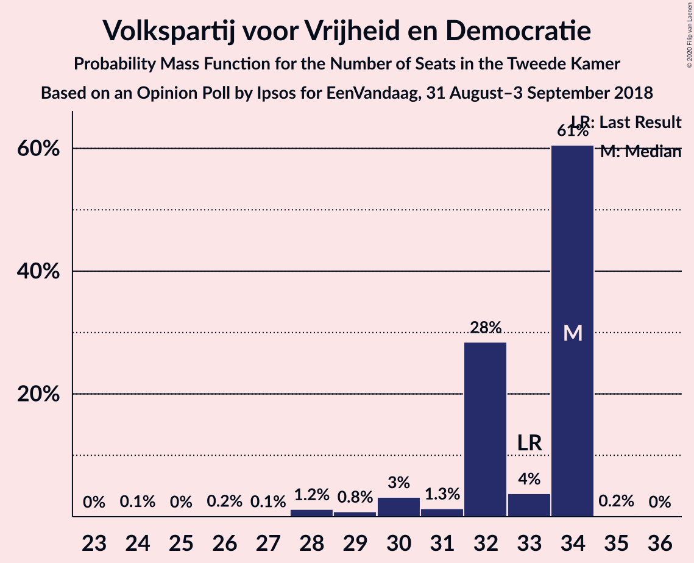

| Number of Seats | Probability | Accumulated | Special Marks |
|:---------------:|:-----------:|:-----------:|:-------------:|
| 24 | 0.1% | 100% |  |
| 25 | 0% | 99.9% |  |
| 26 | 0.2% | 99.9% |  |
| 27 | 0.1% | 99.7% |  |
| 28 | 1.2% | 99.6% |  |
| 29 | 0.8% | 98% |  |
| 30 | 3% | 98% |  |
| 31 | 1.3% | 94% |  |
| 32 | 28% | 93% |  |
| 33 | 4% | 65% | Last Result |
| 34 | 61% | 61% | Median |
| 35 | 0.2% | 0.2% |  |
| 36 | 0% | 0% |  |

### Partij voor de Vrijheid

*For a full overview of the results for this party, see the [Partij voor de Vrijheid](party-partijvoordevrijheid.html) page.*

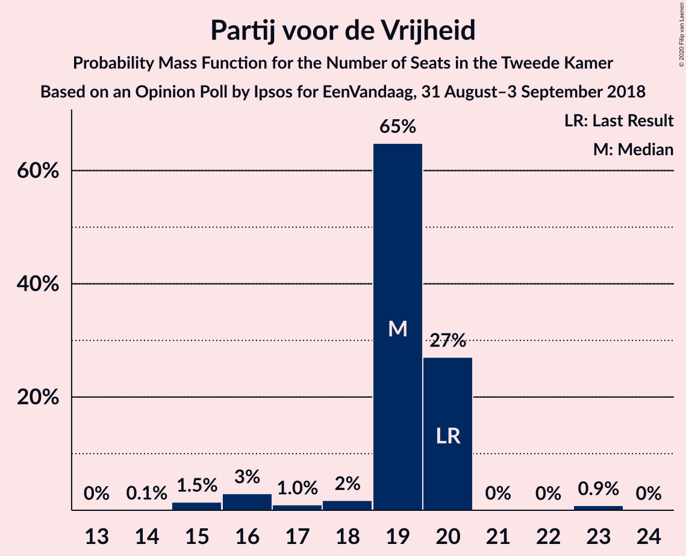

| Number of Seats | Probability | Accumulated | Special Marks |
|:---------------:|:-----------:|:-----------:|:-------------:|
| 14 | 0.1% | 100% |  |
| 15 | 1.5% | 99.9% |  |
| 16 | 3% | 98% |  |
| 17 | 1.0% | 96% |  |
| 18 | 2% | 95% |  |
| 19 | 65% | 93% | Median |
| 20 | 27% | 28% | Last Result |
| 21 | 0% | 0.9% |  |
| 22 | 0% | 0.9% |  |
| 23 | 0.9% | 0.9% |  |
| 24 | 0% | 0% |  |

### Christen-Democratisch Appèl

*For a full overview of the results for this party, see the [Christen-Democratisch Appèl](party-christen-democratischappèl.html) page.*

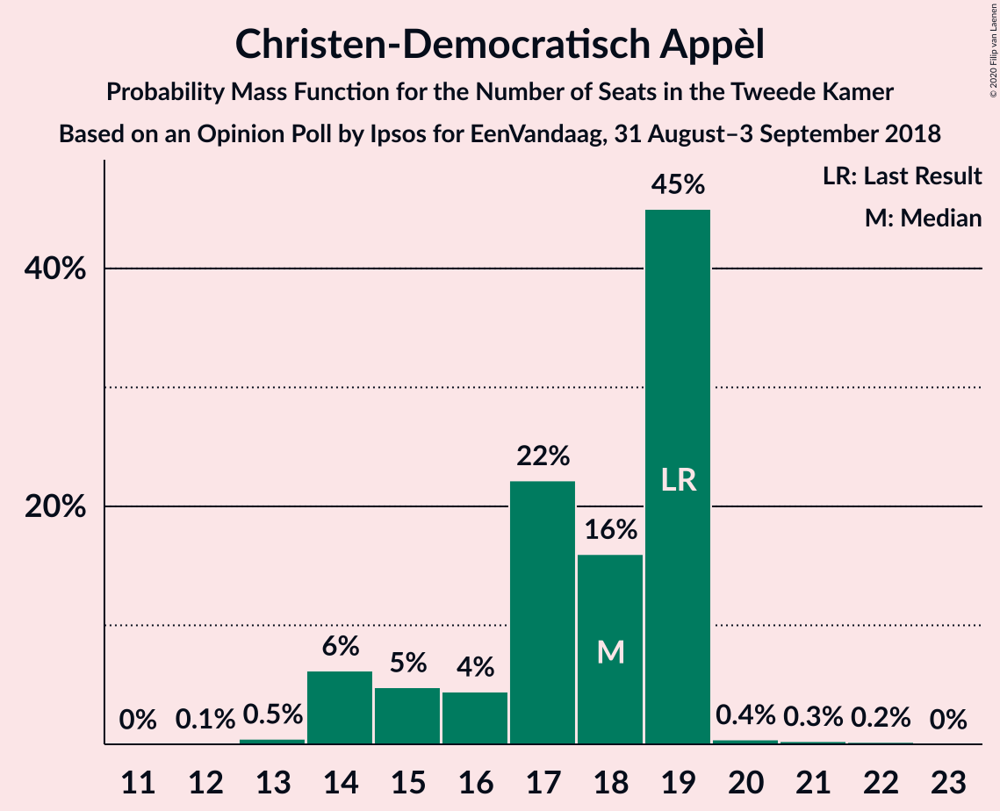

| Number of Seats | Probability | Accumulated | Special Marks |
|:---------------:|:-----------:|:-----------:|:-------------:|
| 12 | 0.1% | 100% |  |
| 13 | 0.1% | 99.9% |  |
| 14 | 5% | 99.7% |  |
| 15 | 1.3% | 95% |  |
| 16 | 1.0% | 94% |  |
| 17 | 62% | 93% | Median |
| 18 | 30% | 31% |  |
| 19 | 0.1% | 0.8% | Last Result |
| 20 | 0.2% | 0.6% |  |
| 21 | 0.4% | 0.5% |  |
| 22 | 0.1% | 0.1% |  |
| 23 | 0% | 0% |  |

### GroenLinks

*For a full overview of the results for this party, see the [GroenLinks](party-groenlinks.html) page.*

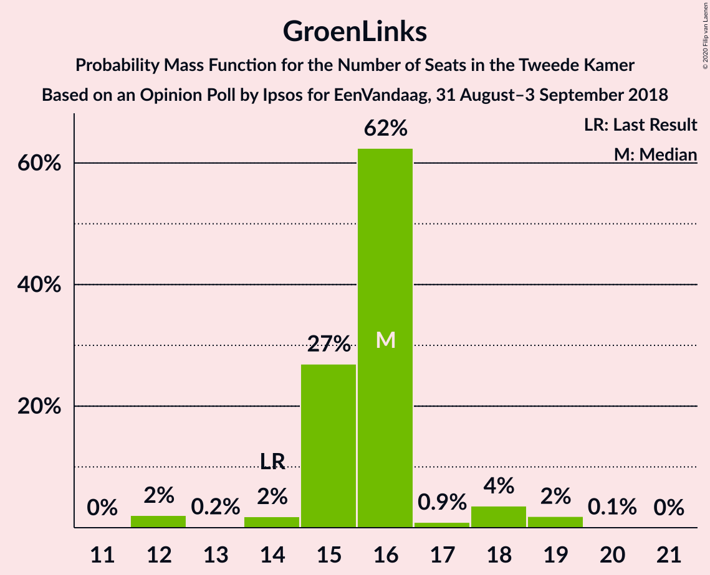

| Number of Seats | Probability | Accumulated | Special Marks |
|:---------------:|:-----------:|:-----------:|:-------------:|
| 12 | 2% | 100% |  |
| 13 | 0.2% | 98% |  |
| 14 | 2% | 98% | Last Result |
| 15 | 27% | 96% |  |
| 16 | 62% | 69% | Median |
| 17 | 0.9% | 7% |  |
| 18 | 4% | 6% |  |
| 19 | 2% | 2% |  |
| 20 | 0.1% | 0.2% |  |
| 21 | 0% | 0% |  |

### Socialistische Partij

*For a full overview of the results for this party, see the [Socialistische Partij](party-socialistischepartij.html) page.*

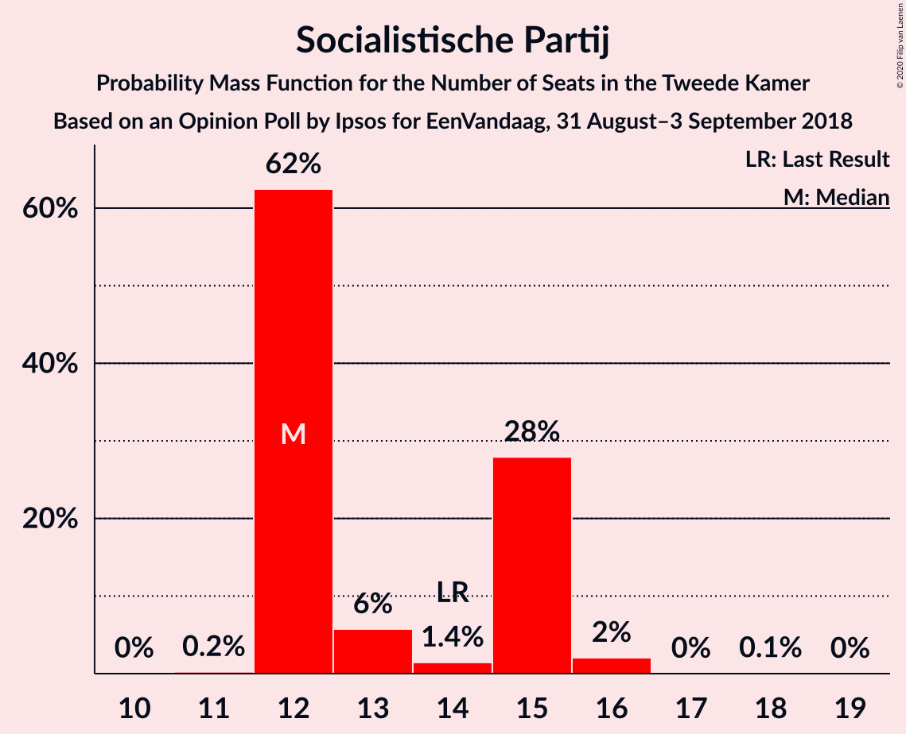

| Number of Seats | Probability | Accumulated | Special Marks |
|:---------------:|:-----------:|:-----------:|:-------------:|
| 11 | 0.2% | 100% |  |
| 12 | 62% | 99.7% | Median |
| 13 | 6% | 37% |  |
| 14 | 1.4% | 32% | Last Result |
| 15 | 28% | 30% |  |
| 16 | 2% | 2% |  |
| 17 | 0% | 0.1% |  |
| 18 | 0.1% | 0.1% |  |
| 19 | 0% | 0% |  |

### Democraten 66

*For a full overview of the results for this party, see the [Democraten 66](party-democraten66.html) page.*

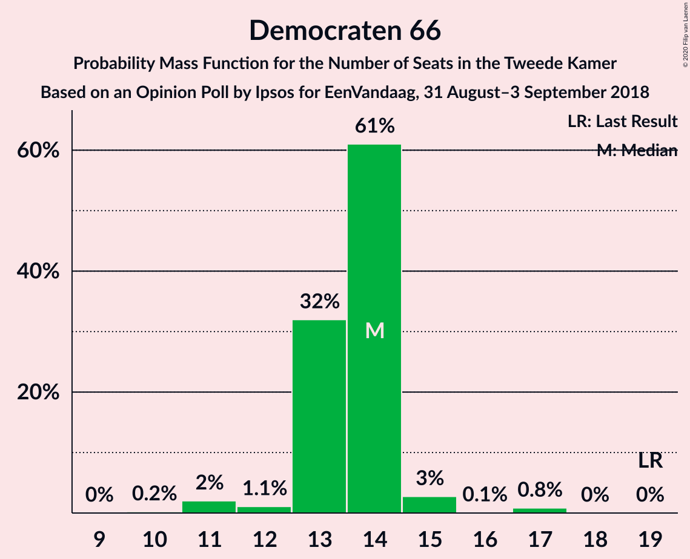

| Number of Seats | Probability | Accumulated | Special Marks |
|:---------------:|:-----------:|:-----------:|:-------------:|
| 10 | 0.2% | 100% |  |
| 11 | 2% | 99.8% |  |
| 12 | 1.1% | 98% |  |
| 13 | 32% | 97% |  |
| 14 | 61% | 65% | Median |
| 15 | 3% | 4% |  |
| 16 | 0.1% | 0.9% |  |
| 17 | 0.8% | 0.9% |  |
| 18 | 0% | 0% |  |
| 19 | 0% | 0% | Last Result |

### Forum voor Democratie

*For a full overview of the results for this party, see the [Forum voor Democratie](party-forumvoordemocratie.html) page.*

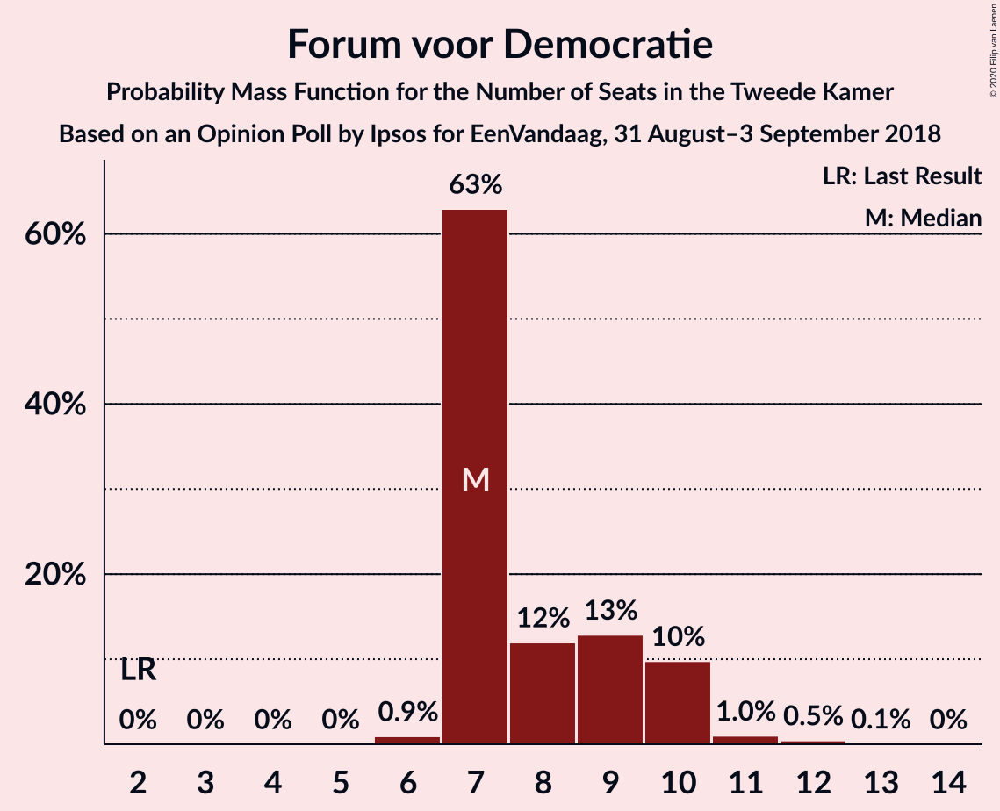

| Number of Seats | Probability | Accumulated | Special Marks |
|:---------------:|:-----------:|:-----------:|:-------------:|
| 2 | 0% | 100% | Last Result |
| 3 | 0% | 100% |  |
| 4 | 0% | 100% |  |
| 5 | 0% | 100% |  |
| 6 | 0.9% | 100% |  |
| 7 | 91% | 99.1% | Median |
| 8 | 1.2% | 8% |  |
| 9 | 0.2% | 7% |  |
| 10 | 5% | 7% |  |
| 11 | 0.9% | 2% |  |
| 12 | 0.8% | 0.8% |  |
| 13 | 0% | 0% |  |

### Partij van de Arbeid

*For a full overview of the results for this party, see the [Partij van de Arbeid](party-partijvandearbeid.html) page.*

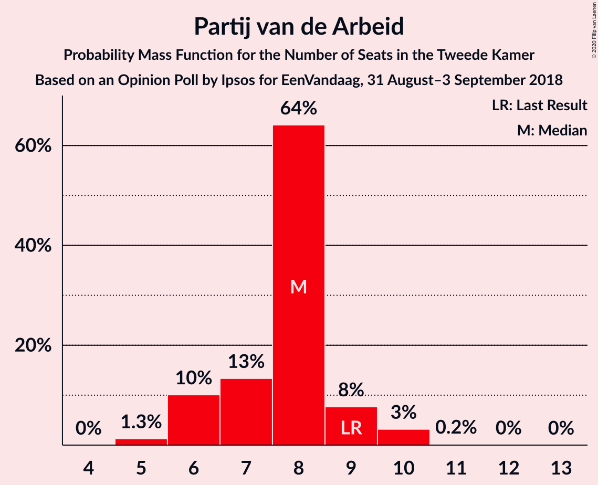

| Number of Seats | Probability | Accumulated | Special Marks |
|:---------------:|:-----------:|:-----------:|:-------------:|
| 6 | 1.5% | 100% |  |
| 7 | 3% | 98.5% |  |
| 8 | 92% | 96% | Median |
| 9 | 1.1% | 3% | Last Result |
| 10 | 2% | 2% |  |
| 11 | 0% | 0.1% |  |
| 12 | 0% | 0% |  |

### Partij voor de Dieren

*For a full overview of the results for this party, see the [Partij voor de Dieren](party-partijvoordedieren.html) page.*

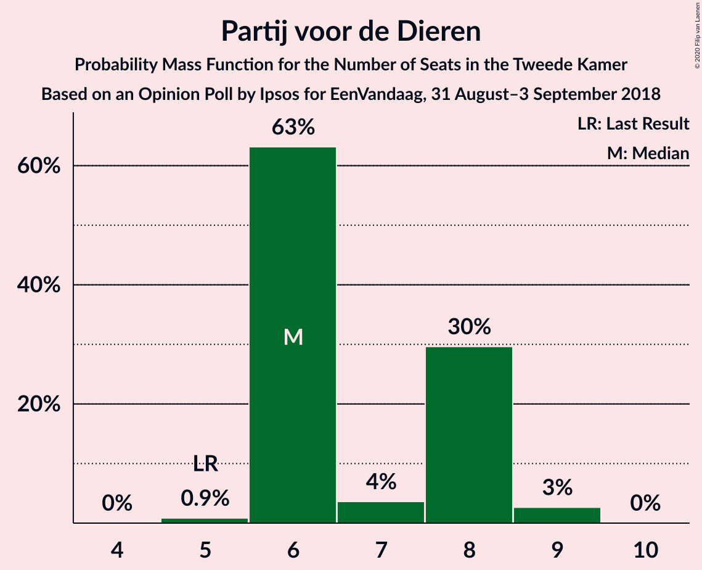

| Number of Seats | Probability | Accumulated | Special Marks |
|:---------------:|:-----------:|:-----------:|:-------------:|
| 5 | 0.9% | 100% | Last Result |
| 6 | 63% | 99.1% | Median |
| 7 | 4% | 36% |  |
| 8 | 30% | 32% |  |
| 9 | 3% | 3% |  |
| 10 | 0% | 0% |  |

### ChristenUnie

*For a full overview of the results for this party, see the [ChristenUnie](party-christenunie.html) page.*

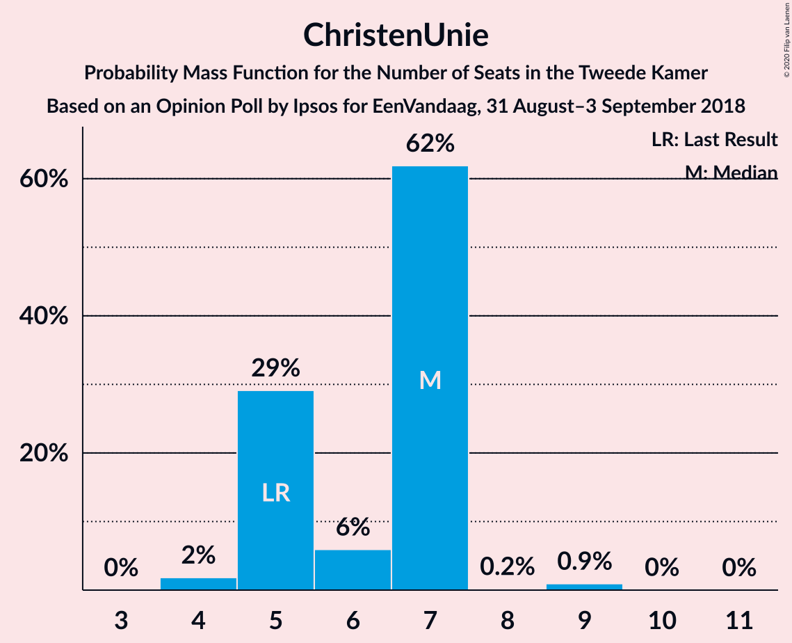

| Number of Seats | Probability | Accumulated | Special Marks |
|:---------------:|:-----------:|:-----------:|:-------------:|
| 4 | 2% | 100% |  |
| 5 | 29% | 98% | Last Result |
| 6 | 6% | 69% |  |
| 7 | 62% | 63% | Median |
| 8 | 0.2% | 1.2% |  |
| 9 | 0.9% | 1.0% |  |
| 10 | 0% | 0.1% |  |
| 11 | 0% | 0% |  |

### 50Plus

*For a full overview of the results for this party, see the [50Plus](party-50plus.html) page.*

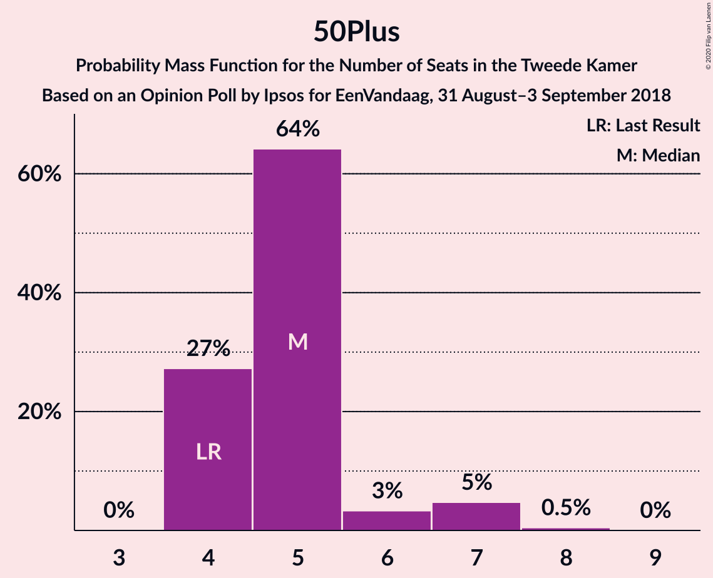

| Number of Seats | Probability | Accumulated | Special Marks |
|:---------------:|:-----------:|:-----------:|:-------------:|
| 4 | 27% | 100% | Last Result |
| 5 | 64% | 73% | Median |
| 6 | 3% | 9% |  |
| 7 | 5% | 5% |  |
| 8 | 0.5% | 0.5% |  |
| 9 | 0% | 0% |  |

### Staatkundig Gereformeerde Partij

*For a full overview of the results for this party, see the [Staatkundig Gereformeerde Partij](party-staatkundiggereformeerdepartij.html) page.*

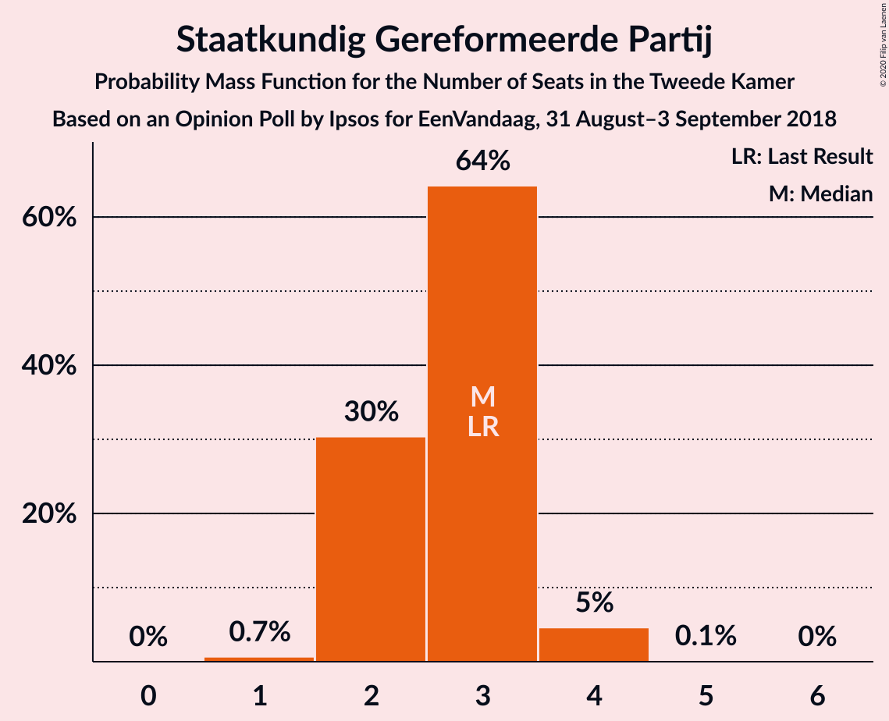

| Number of Seats | Probability | Accumulated | Special Marks |
|:---------------:|:-----------:|:-----------:|:-------------:|
| 1 | 0.7% | 100% |  |
| 2 | 30% | 99.3% |  |
| 3 | 64% | 69% | Last Result, Median |
| 4 | 5% | 5% |  |
| 5 | 0.1% | 0.1% |  |
| 6 | 0% | 0% |  |

### DENK

*For a full overview of the results for this party, see the [DENK](party-denk.html) page.*

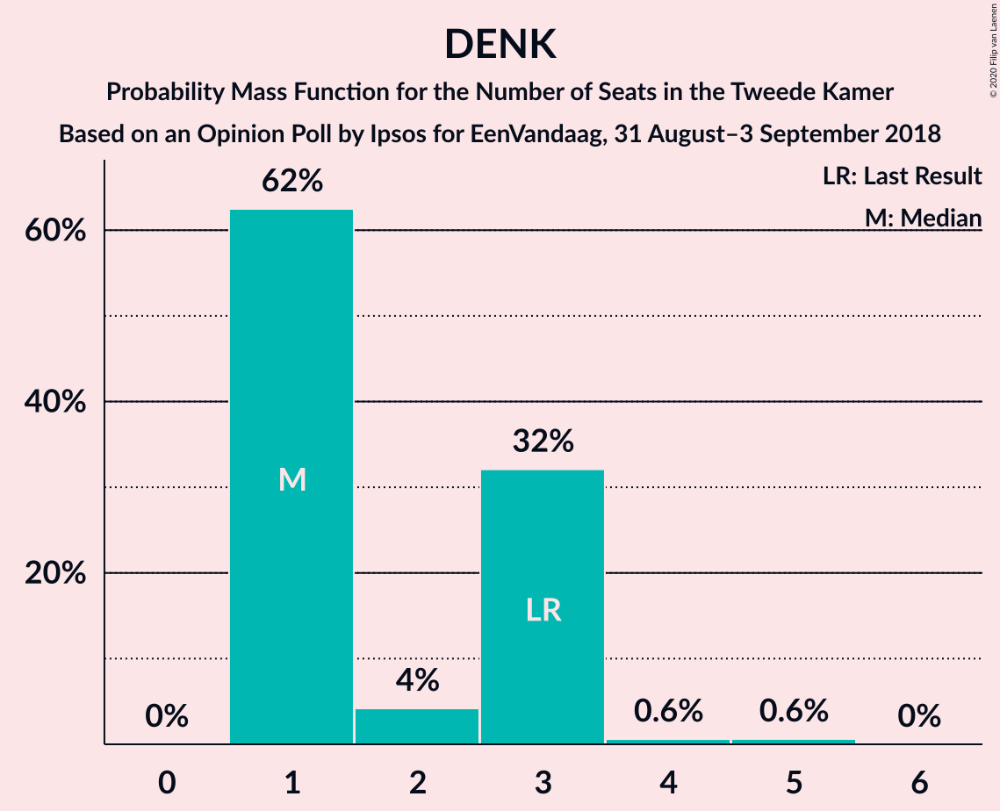

| Number of Seats | Probability | Accumulated | Special Marks |
|:---------------:|:-----------:|:-----------:|:-------------:|
| 1 | 62% | 100% | Median |
| 2 | 4% | 38% |  |
| 3 | 32% | 33% | Last Result |
| 4 | 0.6% | 1.2% |  |
| 5 | 0.6% | 0.6% |  |
| 6 | 0% | 0% |  |

## Coalitions

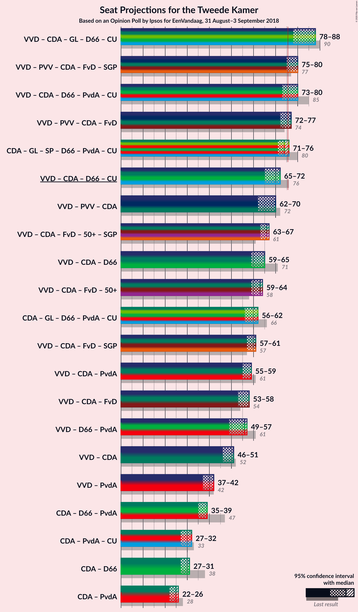

### Confidence Intervals

| Coalition | Last Result | Median | Majority? | 80% Confidence Interval | 90% Confidence Interval | 95% Confidence Interval | 99% Confidence Interval |
|:---------:|:-----------:|:------:|:---------:|:-----------------------:|:-----------------------:|:-----------------------:|:-----------------------:|
| Volkspartij voor Vrijheid en Democratie – Christen-Democratisch Appèl – GroenLinks – Democraten 66 – ChristenUnie | 90 | 88 | 99.1% | 83–88 | 82–88 | 78–88 | 74–89 |
| Volkspartij voor Vrijheid en Democratie – Partij voor de Vrijheid – Christen-Democratisch Appèl – Forum voor Democratie – Staatkundig Gereformeerde Partij | 77 | 80 | 97% | 78–80 | 76–80 | 75–80 | 73–80 |
| Volkspartij voor Vrijheid en Democratie – Christen-Democratisch Appèl – Democraten 66 – Partij van de Arbeid – ChristenUnie | 85 | 80 | 92% | 76–80 | 73–80 | 73–80 | 65–80 |
| Volkspartij voor Vrijheid en Democratie – Partij voor de Vrijheid – Christen-Democratisch Appèl – Forum voor Democratie | 74 | 77 | 93% | 76–77 | 73–77 | 72–77 | 69–78 |
| Christen-Democratisch Appèl – GroenLinks – Socialistische Partij – Democraten 66 – Partij van de Arbeid – ChristenUnie | 80 | 74 | 3% | 74 | 72–74 | 71–76 | 68–79 |
| Volkspartij voor Vrijheid en Democratie – Christen-Democratisch Appèl – Democraten 66 – ChristenUnie | 76 | 72 | 0% | 68–72 | 66–72 | 65–72 | 58–72 |
| Volkspartij voor Vrijheid en Democratie – Partij voor de Vrijheid – Christen-Democratisch Appèl | 72 | 70 | 0% | 66–70 | 65–70 | 62–70 | 62–70 |
| Volkspartij voor Vrijheid en Democratie – Christen-Democratisch Appèl – Forum voor Democratie – 50Plus – Staatkundig Gereformeerde Partij | 61 | 66 | 0% | 63–66 | 63–66 | 63–67 | 62–70 |
| Volkspartij voor Vrijheid en Democratie – Christen-Democratisch Appèl – Democraten 66 | 71 | 65 | 0% | 62–65 | 60–65 | 59–65 | 54–65 |
| Volkspartij voor Vrijheid en Democratie – Christen-Democratisch Appèl – Forum voor Democratie – 50Plus | 58 | 63 | 0% | 61–63 | 61–63 | 59–64 | 58–66 |
| Christen-Democratisch Appèl – GroenLinks – Democraten 66 – Partij van de Arbeid – ChristenUnie | 66 | 62 | 0% | 59–62 | 58–62 | 56–62 | 53–64 |
| Volkspartij voor Vrijheid en Democratie – Christen-Democratisch Appèl – Forum voor Democratie – Staatkundig Gereformeerde Partij | 57 | 61 | 0% | 59–61 | 57–61 | 57–61 | 55–63 |
| Volkspartij voor Vrijheid en Democratie – Christen-Democratisch Appèl – Partij van de Arbeid | 61 | 59 | 0% | 56–59 | 55–59 | 55–59 | 50–59 |
| Volkspartij voor Vrijheid en Democratie – Christen-Democratisch Appèl – Forum voor Democratie | 54 | 58 | 0% | 57–58 | 54–58 | 53–58 | 52–59 |
| Volkspartij voor Vrijheid en Democratie – Democraten 66 – Partij van de Arbeid | 61 | 56 | 0% | 53–56 | 51–56 | 49–57 | 46–58 |
| Volkspartij voor Vrijheid en Democratie – Christen-Democratisch Appèl | 52 | 51 | 0% | 48–51 | 47–51 | 46–51 | 43–51 |
| Volkspartij voor Vrijheid en Democratie – Partij van de Arbeid | 42 | 42 | 0% | 40–42 | 38–42 | 37–42 | 35–42 |
| Christen-Democratisch Appèl – Democraten 66 – Partij van de Arbeid | 47 | 39 | 0% | 39 | 37–39 | 35–39 | 33–41 |
| Christen-Democratisch Appèl – Partij van de Arbeid – ChristenUnie | 33 | 32 | 0% | 31–32 | 29–32 | 27–32 | 26–34 |
| Christen-Democratisch Appèl – Democraten 66 | 38 | 31 | 0% | 31 | 29–31 | 27–31 | 26–33 |
| Christen-Democratisch Appèl – Partij van de Arbeid | 28 | 25 | 0% | 25–26 | 24–26 | 22–26 | 22–28 |

### Volkspartij voor Vrijheid en Democratie – Christen-Democratisch Appèl – GroenLinks – Democraten 66 – ChristenUnie

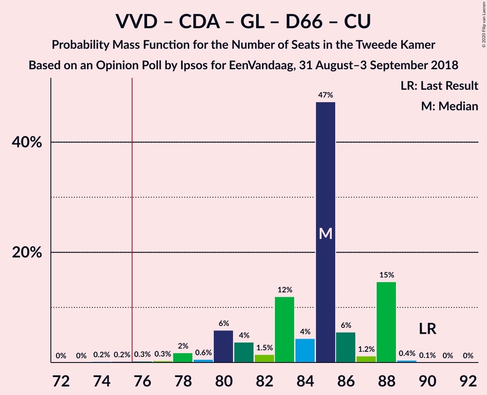

| Number of Seats | Probability | Accumulated | Special Marks |
|:---------------:|:-----------:|:-----------:|:-------------:|
| 74 | 0.8% | 100% |  |
| 75 | 0% | 99.2% |  |
| 76 | 0.1% | 99.1% | Majority |
| 77 | 0% | 99.0% |  |
| 78 | 2% | 99.0% |  |
| 79 | 0.1% | 97% |  |
| 80 | 0.8% | 97% |  |
| 81 | 1.1% | 96% |  |
| 82 | 0.6% | 95% |  |
| 83 | 29% | 95% |  |
| 84 | 0.8% | 66% |  |
| 85 | 0.6% | 65% |  |
| 86 | 3% | 64% |  |
| 87 | 0.1% | 61% |  |
| 88 | 60% | 61% | Median |
| 89 | 0.8% | 0.8% |  |
| 90 | 0% | 0% | Last Result |

### Volkspartij voor Vrijheid en Democratie – Partij voor de Vrijheid – Christen-Democratisch Appèl – Forum voor Democratie – Staatkundig Gereformeerde Partij

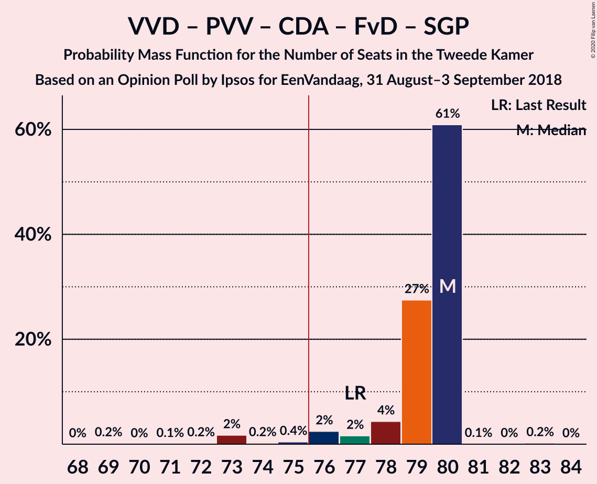

| Number of Seats | Probability | Accumulated | Special Marks |
|:---------------:|:-----------:|:-----------:|:-------------:|
| 69 | 0.2% | 100% |  |
| 70 | 0% | 99.8% |  |
| 71 | 0.1% | 99.8% |  |
| 72 | 0.2% | 99.7% |  |
| 73 | 2% | 99.5% |  |
| 74 | 0.2% | 98% |  |
| 75 | 0.4% | 98% |  |
| 76 | 2% | 97% | Majority |
| 77 | 2% | 95% | Last Result |
| 78 | 4% | 93% |  |
| 79 | 27% | 89% |  |
| 80 | 61% | 61% | Median |
| 81 | 0.1% | 0.4% |  |
| 82 | 0% | 0.3% |  |
| 83 | 0.2% | 0.3% |  |
| 84 | 0% | 0% |  |

### Volkspartij voor Vrijheid en Democratie – Christen-Democratisch Appèl – Democraten 66 – Partij van de Arbeid – ChristenUnie

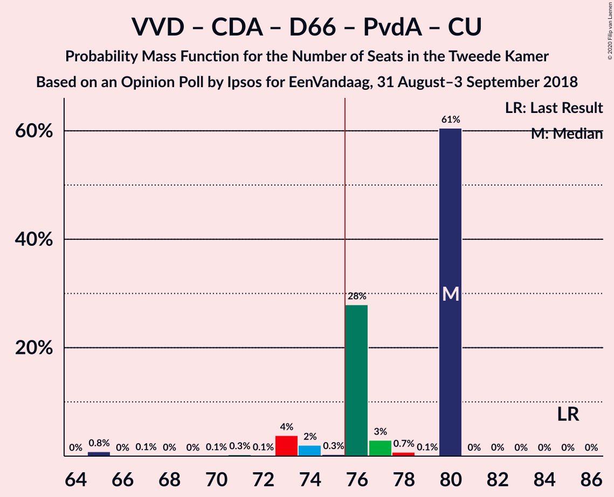

| Number of Seats | Probability | Accumulated | Special Marks |
|:---------------:|:-----------:|:-----------:|:-------------:|
| 65 | 0.8% | 100% |  |
| 66 | 0% | 99.2% |  |
| 67 | 0.1% | 99.2% |  |
| 68 | 0% | 99.0% |  |
| 69 | 0% | 99.0% |  |
| 70 | 0.1% | 99.0% |  |
| 71 | 0.3% | 98.9% |  |
| 72 | 0.1% | 98.6% |  |
| 73 | 4% | 98% |  |
| 74 | 2% | 95% |  |
| 75 | 0.3% | 93% |  |
| 76 | 28% | 92% | Majority |
| 77 | 3% | 64% |  |
| 78 | 0.7% | 61% |  |
| 79 | 0.1% | 61% |  |
| 80 | 61% | 61% | Median |
| 81 | 0% | 0.1% |  |
| 82 | 0% | 0% |  |
| 83 | 0% | 0% |  |
| 84 | 0% | 0% |  |
| 85 | 0% | 0% | Last Result |

### Volkspartij voor Vrijheid en Democratie – Partij voor de Vrijheid – Christen-Democratisch Appèl – Forum voor Democratie

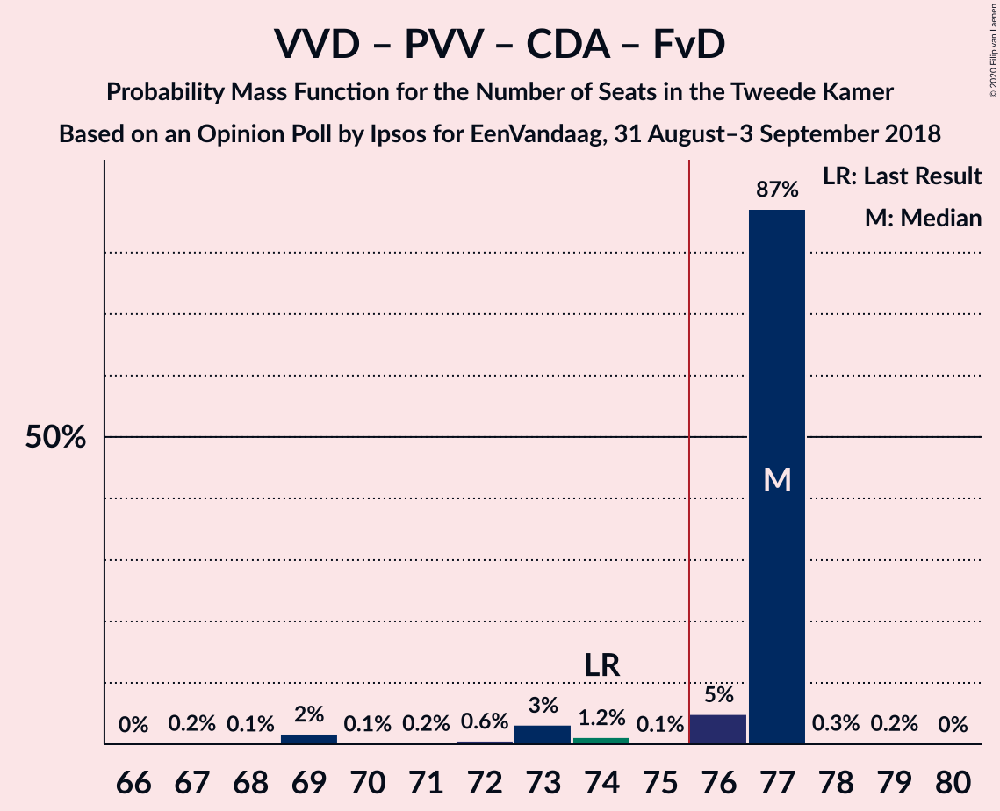

| Number of Seats | Probability | Accumulated | Special Marks |
|:---------------:|:-----------:|:-----------:|:-------------:|
| 67 | 0.2% | 100% |  |
| 68 | 0.1% | 99.8% |  |
| 69 | 2% | 99.6% |  |
| 70 | 0.1% | 98% |  |
| 71 | 0.2% | 98% |  |
| 72 | 0.6% | 98% |  |
| 73 | 3% | 97% |  |
| 74 | 1.2% | 94% | Last Result |
| 75 | 0.1% | 93% |  |
| 76 | 5% | 93% | Majority |
| 77 | 87% | 88% | Median |
| 78 | 0.3% | 0.5% |  |
| 79 | 0.2% | 0.3% |  |
| 80 | 0% | 0% |  |

### Christen-Democratisch Appèl – GroenLinks – Socialistische Partij – Democraten 66 – Partij van de Arbeid – ChristenUnie

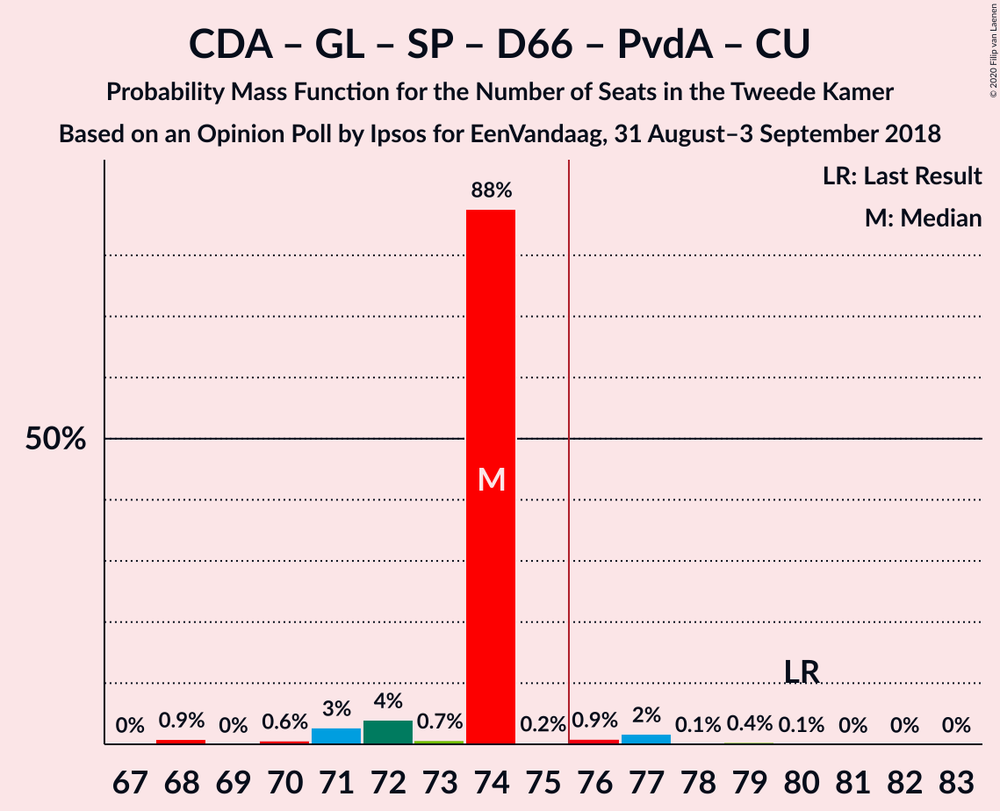

| Number of Seats | Probability | Accumulated | Special Marks |
|:---------------:|:-----------:|:-----------:|:-------------:|
| 68 | 0.9% | 100% |  |
| 69 | 0% | 99.1% |  |
| 70 | 0.6% | 99.1% |  |
| 71 | 3% | 98% |  |
| 72 | 4% | 96% |  |
| 73 | 0.7% | 92% |  |
| 74 | 88% | 91% | Median |
| 75 | 0.2% | 3% |  |
| 76 | 0.9% | 3% | Majority |
| 77 | 2% | 2% |  |
| 78 | 0.1% | 0.6% |  |
| 79 | 0.4% | 0.5% |  |
| 80 | 0.1% | 0.2% | Last Result |
| 81 | 0% | 0.1% |  |
| 82 | 0% | 0.1% |  |
| 83 | 0% | 0% |  |

### Volkspartij voor Vrijheid en Democratie – Christen-Democratisch Appèl – Democraten 66 – ChristenUnie

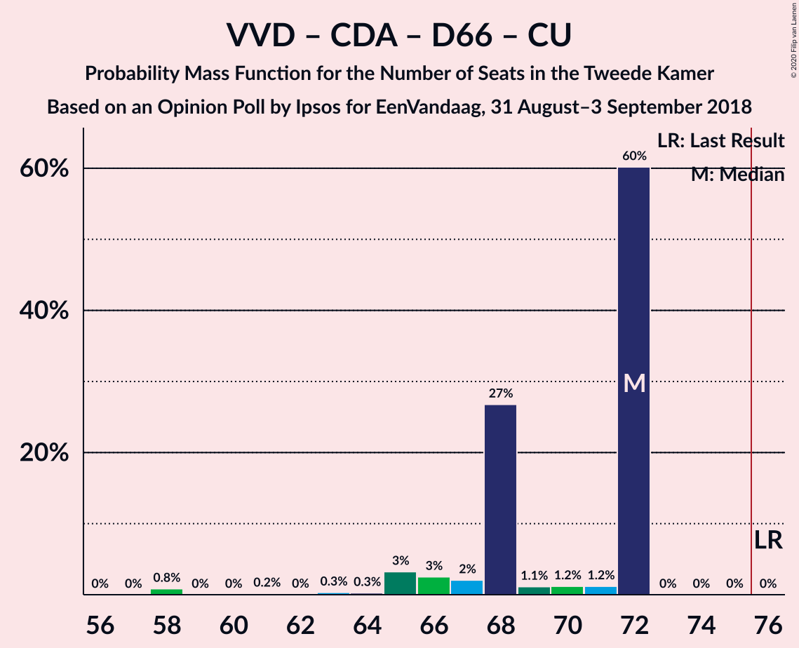

| Number of Seats | Probability | Accumulated | Special Marks |
|:---------------:|:-----------:|:-----------:|:-------------:|
| 58 | 0.8% | 100% |  |
| 59 | 0% | 99.2% |  |
| 60 | 0% | 99.2% |  |
| 61 | 0.2% | 99.1% |  |
| 62 | 0% | 99.0% |  |
| 63 | 0.3% | 98.9% |  |
| 64 | 0.3% | 98.6% |  |
| 65 | 3% | 98% |  |
| 66 | 3% | 95% |  |
| 67 | 2% | 93% |  |
| 68 | 27% | 91% |  |
| 69 | 1.1% | 64% |  |
| 70 | 1.2% | 63% |  |
| 71 | 1.2% | 61% |  |
| 72 | 60% | 60% | Median |
| 73 | 0% | 0% |  |
| 74 | 0% | 0% |  |
| 75 | 0% | 0% |  |
| 76 | 0% | 0% | Last Result, Majority |

### Volkspartij voor Vrijheid en Democratie – Partij voor de Vrijheid – Christen-Democratisch Appèl

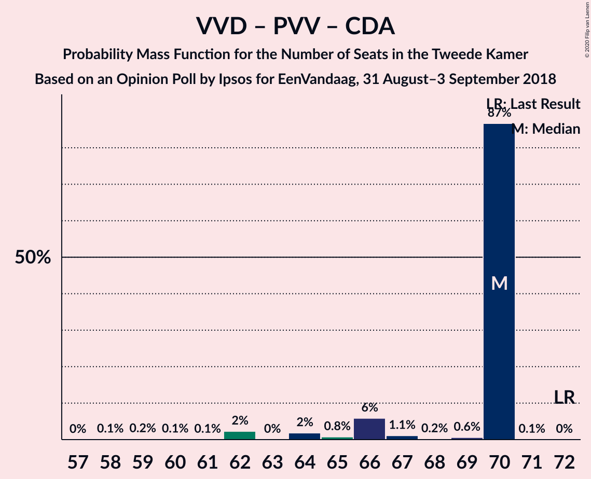

| Number of Seats | Probability | Accumulated | Special Marks |
|:---------------:|:-----------:|:-----------:|:-------------:|
| 58 | 0.1% | 100% |  |
| 59 | 0.2% | 99.9% |  |
| 60 | 0.1% | 99.7% |  |
| 61 | 0.1% | 99.6% |  |
| 62 | 2% | 99.5% |  |
| 63 | 0% | 97% |  |
| 64 | 2% | 97% |  |
| 65 | 0.8% | 95% |  |
| 66 | 6% | 95% |  |
| 67 | 1.1% | 89% |  |
| 68 | 0.2% | 88% |  |
| 69 | 0.6% | 87% |  |
| 70 | 87% | 87% | Median |
| 71 | 0.1% | 0.1% |  |
| 72 | 0% | 0% | Last Result |

### Volkspartij voor Vrijheid en Democratie – Christen-Democratisch Appèl – Forum voor Democratie – 50Plus – Staatkundig Gereformeerde Partij

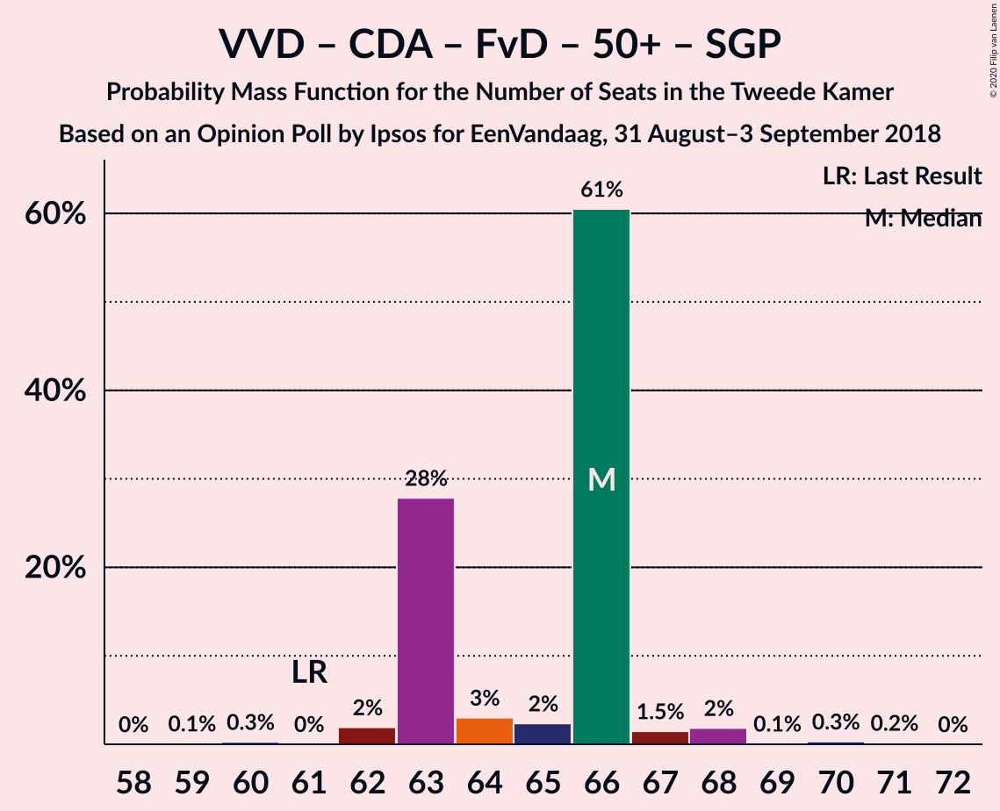

| Number of Seats | Probability | Accumulated | Special Marks |
|:---------------:|:-----------:|:-----------:|:-------------:|
| 59 | 0.1% | 100% |  |
| 60 | 0.3% | 99.9% |  |
| 61 | 0% | 99.6% | Last Result |
| 62 | 2% | 99.6% |  |
| 63 | 28% | 98% |  |
| 64 | 3% | 70% |  |
| 65 | 2% | 67% |  |
| 66 | 61% | 64% | Median |
| 67 | 1.5% | 4% |  |
| 68 | 2% | 2% |  |
| 69 | 0.1% | 0.6% |  |
| 70 | 0.3% | 0.5% |  |
| 71 | 0.2% | 0.2% |  |
| 72 | 0% | 0% |  |

### Volkspartij voor Vrijheid en Democratie – Christen-Democratisch Appèl – Democraten 66

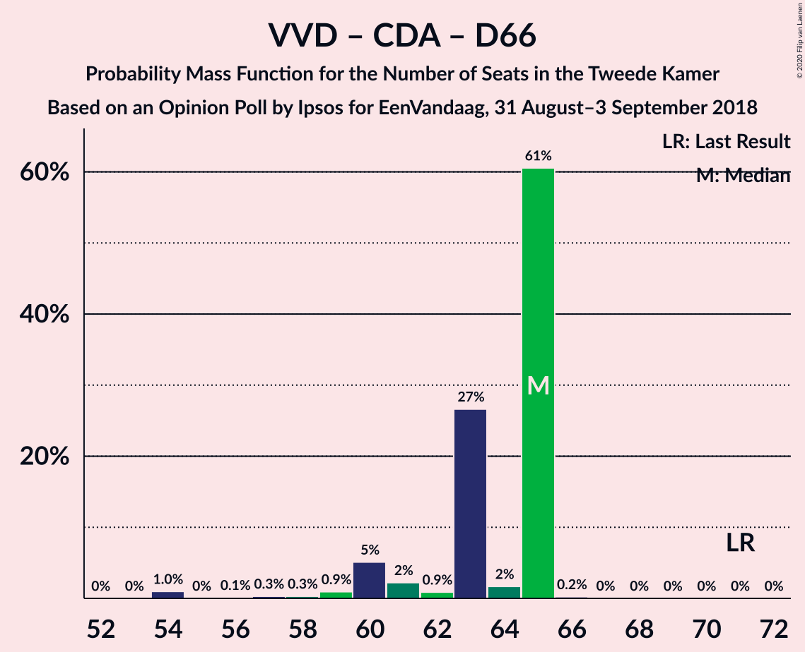

| Number of Seats | Probability | Accumulated | Special Marks |
|:---------------:|:-----------:|:-----------:|:-------------:|
| 54 | 1.0% | 100% |  |
| 55 | 0% | 99.0% |  |
| 56 | 0.1% | 99.0% |  |
| 57 | 0.3% | 98.9% |  |
| 58 | 0.3% | 98.6% |  |
| 59 | 0.9% | 98% |  |
| 60 | 5% | 97% |  |
| 61 | 2% | 92% |  |
| 62 | 0.9% | 90% |  |
| 63 | 27% | 89% |  |
| 64 | 2% | 63% |  |
| 65 | 61% | 61% | Median |
| 66 | 0.2% | 0.3% |  |
| 67 | 0% | 0% |  |
| 68 | 0% | 0% |  |
| 69 | 0% | 0% |  |
| 70 | 0% | 0% |  |
| 71 | 0% | 0% | Last Result |

### Volkspartij voor Vrijheid en Democratie – Christen-Democratisch Appèl – Forum voor Democratie – 50Plus

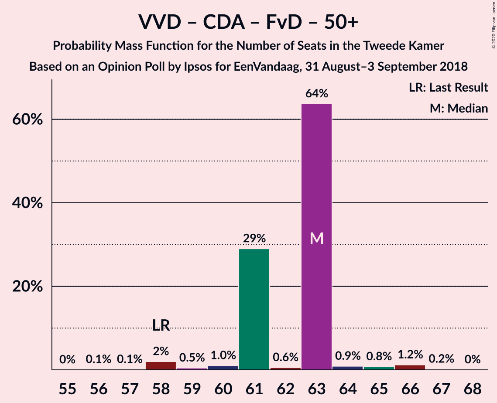

| Number of Seats | Probability | Accumulated | Special Marks |
|:---------------:|:-----------:|:-----------:|:-------------:|
| 56 | 0.1% | 100% |  |
| 57 | 0.1% | 99.9% |  |
| 58 | 2% | 99.8% | Last Result |
| 59 | 0.5% | 98% |  |
| 60 | 1.0% | 97% |  |
| 61 | 29% | 96% |  |
| 62 | 0.6% | 67% |  |
| 63 | 64% | 67% | Median |
| 64 | 0.9% | 3% |  |
| 65 | 0.8% | 2% |  |
| 66 | 1.2% | 1.4% |  |
| 67 | 0.2% | 0.2% |  |
| 68 | 0% | 0% |  |

### Christen-Democratisch Appèl – GroenLinks – Democraten 66 – Partij van de Arbeid – ChristenUnie

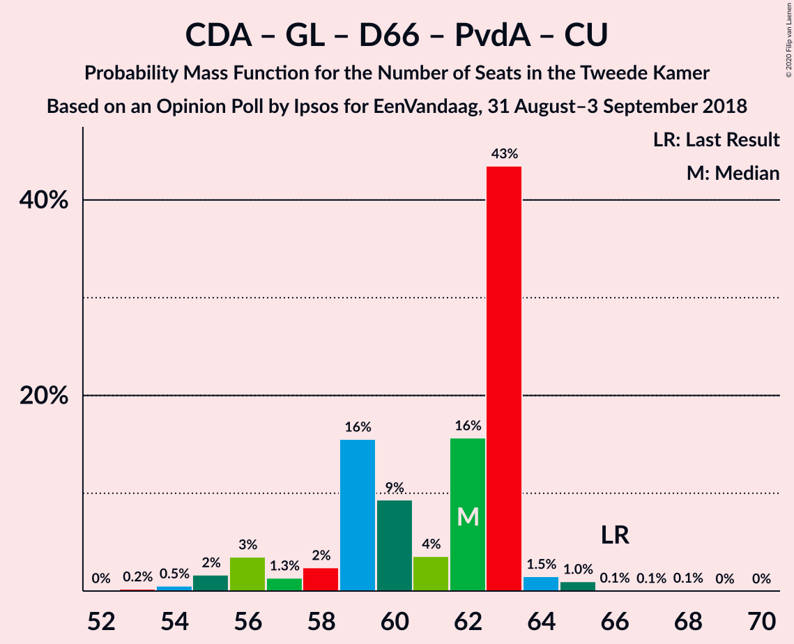

| Number of Seats | Probability | Accumulated | Special Marks |
|:---------------:|:-----------:|:-----------:|:-------------:|
| 53 | 0.9% | 100% |  |
| 54 | 0% | 99.1% |  |
| 55 | 0% | 99.1% |  |
| 56 | 2% | 99.1% |  |
| 57 | 0.8% | 97% |  |
| 58 | 3% | 96% |  |
| 59 | 28% | 94% |  |
| 60 | 1.4% | 66% |  |
| 61 | 0.3% | 65% |  |
| 62 | 62% | 64% | Median |
| 63 | 0.1% | 2% |  |
| 64 | 2% | 2% |  |
| 65 | 0.1% | 0.4% |  |
| 66 | 0% | 0.3% | Last Result |
| 67 | 0.2% | 0.3% |  |
| 68 | 0.1% | 0.1% |  |
| 69 | 0% | 0% |  |

### Volkspartij voor Vrijheid en Democratie – Christen-Democratisch Appèl – Forum voor Democratie – Staatkundig Gereformeerde Partij

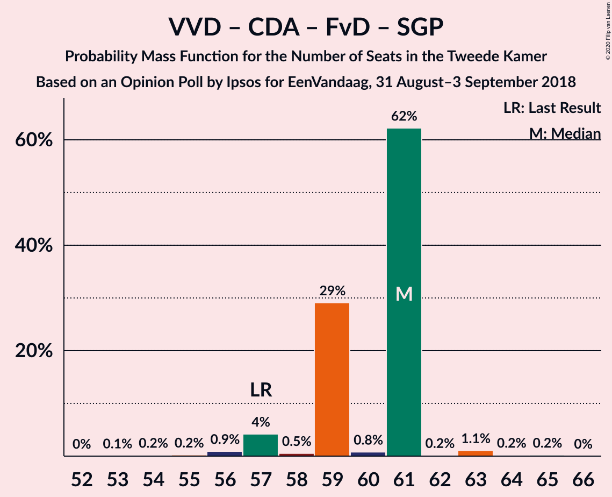

| Number of Seats | Probability | Accumulated | Special Marks |
|:---------------:|:-----------:|:-----------:|:-------------:|
| 53 | 0.1% | 100% |  |
| 54 | 0.2% | 99.9% |  |
| 55 | 0.2% | 99.7% |  |
| 56 | 0.9% | 99.5% |  |
| 57 | 4% | 98.6% | Last Result |
| 58 | 0.5% | 94% |  |
| 59 | 29% | 94% |  |
| 60 | 0.8% | 65% |  |
| 61 | 62% | 64% | Median |
| 62 | 0.2% | 2% |  |
| 63 | 1.1% | 2% |  |
| 64 | 0.2% | 0.5% |  |
| 65 | 0.2% | 0.3% |  |
| 66 | 0% | 0% |  |

### Volkspartij voor Vrijheid en Democratie – Christen-Democratisch Appèl – Partij van de Arbeid

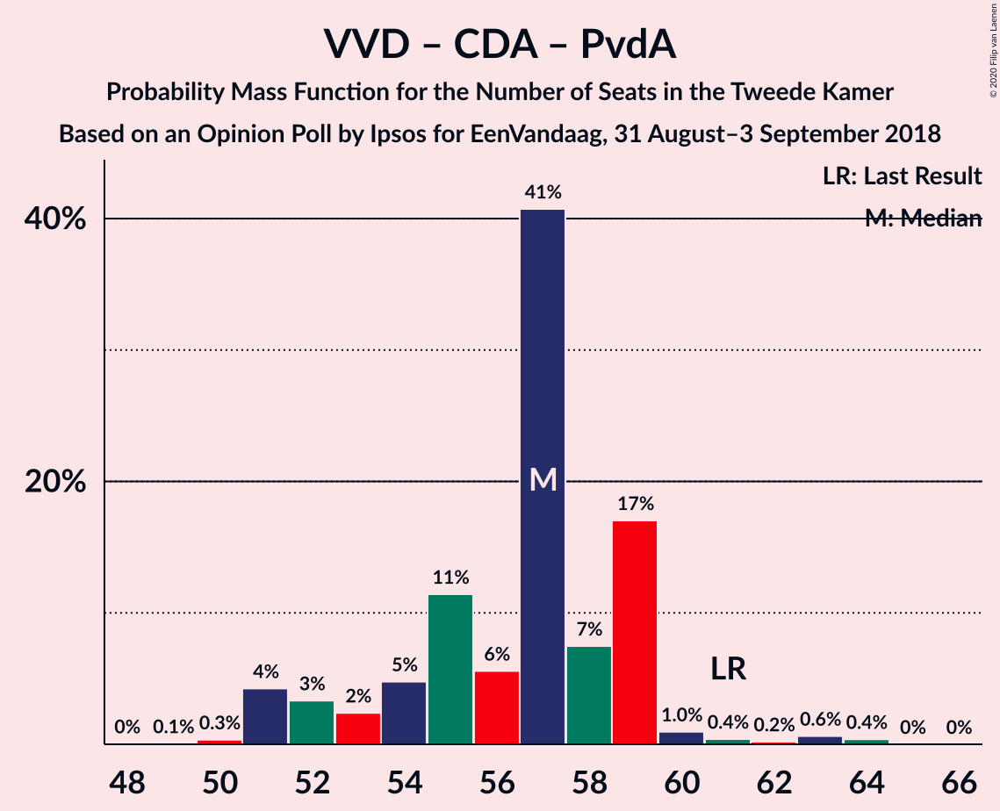

| Number of Seats | Probability | Accumulated | Special Marks |
|:---------------:|:-----------:|:-----------:|:-------------:|
| 48 | 0.1% | 100% |  |
| 49 | 0% | 99.9% |  |
| 50 | 0.9% | 99.9% |  |
| 51 | 0% | 98.9% |  |
| 52 | 0.2% | 98.9% |  |
| 53 | 0.8% | 98.7% |  |
| 54 | 0.2% | 98% |  |
| 55 | 6% | 98% |  |
| 56 | 3% | 91% |  |
| 57 | 1.1% | 89% |  |
| 58 | 27% | 88% |  |
| 59 | 61% | 61% | Median |
| 60 | 0.3% | 0.4% |  |
| 61 | 0.1% | 0.1% | Last Result |
| 62 | 0% | 0% |  |

### Volkspartij voor Vrijheid en Democratie – Christen-Democratisch Appèl – Forum voor Democratie

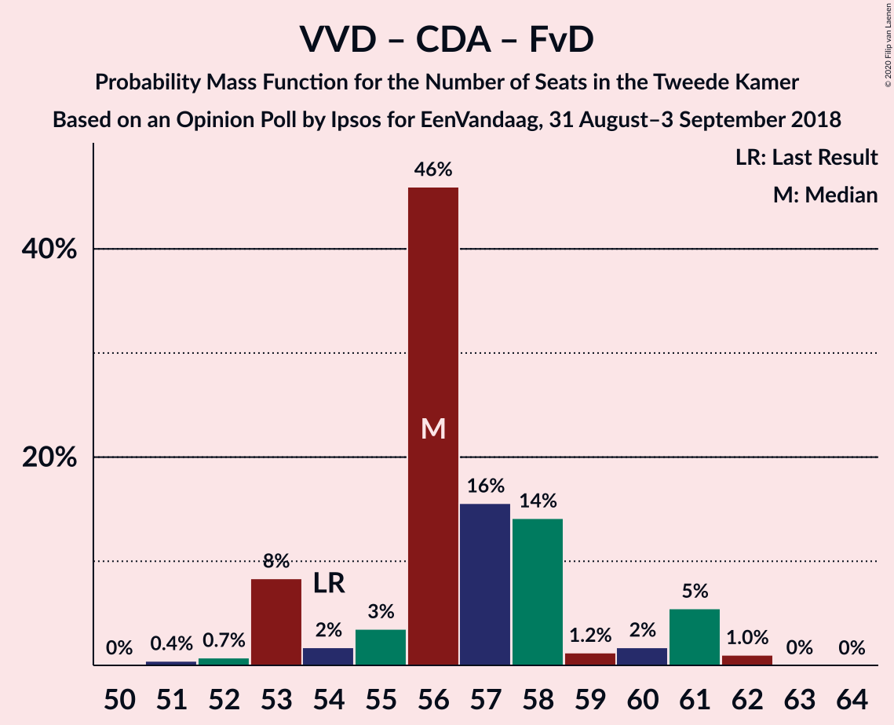

| Number of Seats | Probability | Accumulated | Special Marks |
|:---------------:|:-----------:|:-----------:|:-------------:|
| 51 | 0.1% | 100% |  |
| 52 | 0.4% | 99.9% |  |
| 53 | 3% | 99.4% |  |
| 54 | 3% | 97% | Last Result |
| 55 | 0.1% | 94% |  |
| 56 | 0.1% | 94% |  |
| 57 | 30% | 94% |  |
| 58 | 62% | 64% | Median |
| 59 | 2% | 2% |  |
| 60 | 0% | 0.5% |  |
| 61 | 0.2% | 0.5% |  |
| 62 | 0.2% | 0.2% |  |
| 63 | 0% | 0% |  |

### Volkspartij voor Vrijheid en Democratie – Democraten 66 – Partij van de Arbeid

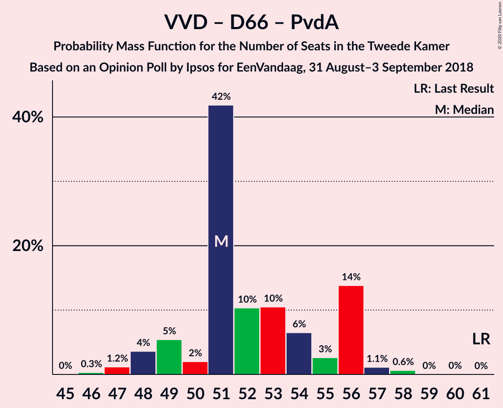

| Number of Seats | Probability | Accumulated | Special Marks |
|:---------------:|:-----------:|:-----------:|:-------------:|
| 46 | 1.0% | 100% |  |
| 47 | 0% | 99.0% |  |
| 48 | 0.3% | 99.0% |  |
| 49 | 2% | 98.7% |  |
| 50 | 0.4% | 97% |  |
| 51 | 3% | 96% |  |
| 52 | 1.0% | 94% |  |
| 53 | 27% | 93% |  |
| 54 | 3% | 66% |  |
| 55 | 0.1% | 63% |  |
| 56 | 60% | 63% | Median |
| 57 | 2% | 3% |  |
| 58 | 1.0% | 1.1% |  |
| 59 | 0% | 0% |  |
| 60 | 0% | 0% |  |
| 61 | 0% | 0% | Last Result |

### Volkspartij voor Vrijheid en Democratie – Christen-Democratisch Appèl

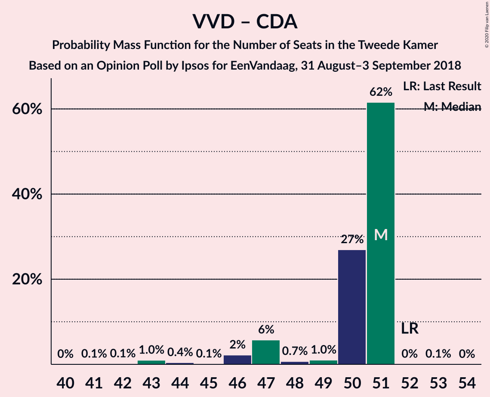

| Number of Seats | Probability | Accumulated | Special Marks |
|:---------------:|:-----------:|:-----------:|:-------------:|
| 41 | 0.1% | 100% |  |
| 42 | 0.1% | 99.9% |  |
| 43 | 1.0% | 99.8% |  |
| 44 | 0.4% | 98.8% |  |
| 45 | 0.1% | 98% |  |
| 46 | 2% | 98% |  |
| 47 | 6% | 96% |  |
| 48 | 0.7% | 90% |  |
| 49 | 1.0% | 90% |  |
| 50 | 27% | 89% |  |
| 51 | 62% | 62% | Median |
| 52 | 0% | 0.1% | Last Result |
| 53 | 0.1% | 0.1% |  |
| 54 | 0% | 0% |  |

### Volkspartij voor Vrijheid en Democratie – Partij van de Arbeid

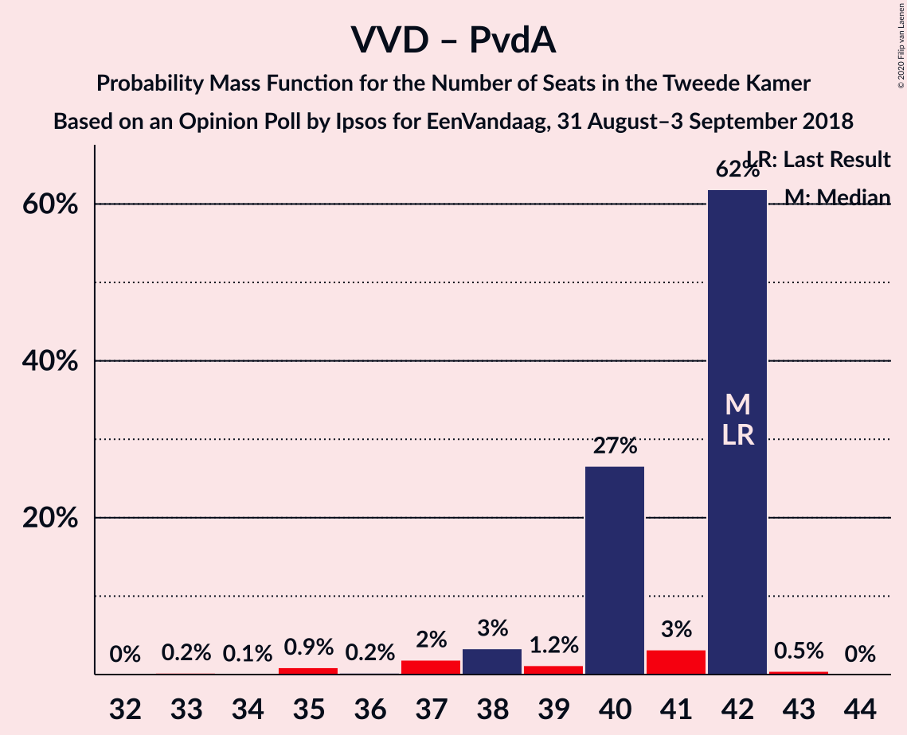

| Number of Seats | Probability | Accumulated | Special Marks |
|:---------------:|:-----------:|:-----------:|:-------------:|
| 33 | 0.2% | 100% |  |
| 34 | 0.1% | 99.8% |  |
| 35 | 0.9% | 99.7% |  |
| 36 | 0.2% | 98.8% |  |
| 37 | 2% | 98.5% |  |
| 38 | 3% | 97% |  |
| 39 | 1.2% | 93% |  |
| 40 | 27% | 92% |  |
| 41 | 3% | 66% |  |
| 42 | 62% | 62% | Last Result, Median |
| 43 | 0.5% | 0.5% |  |
| 44 | 0% | 0% |  |

### Christen-Democratisch Appèl – Democraten 66 – Partij van de Arbeid

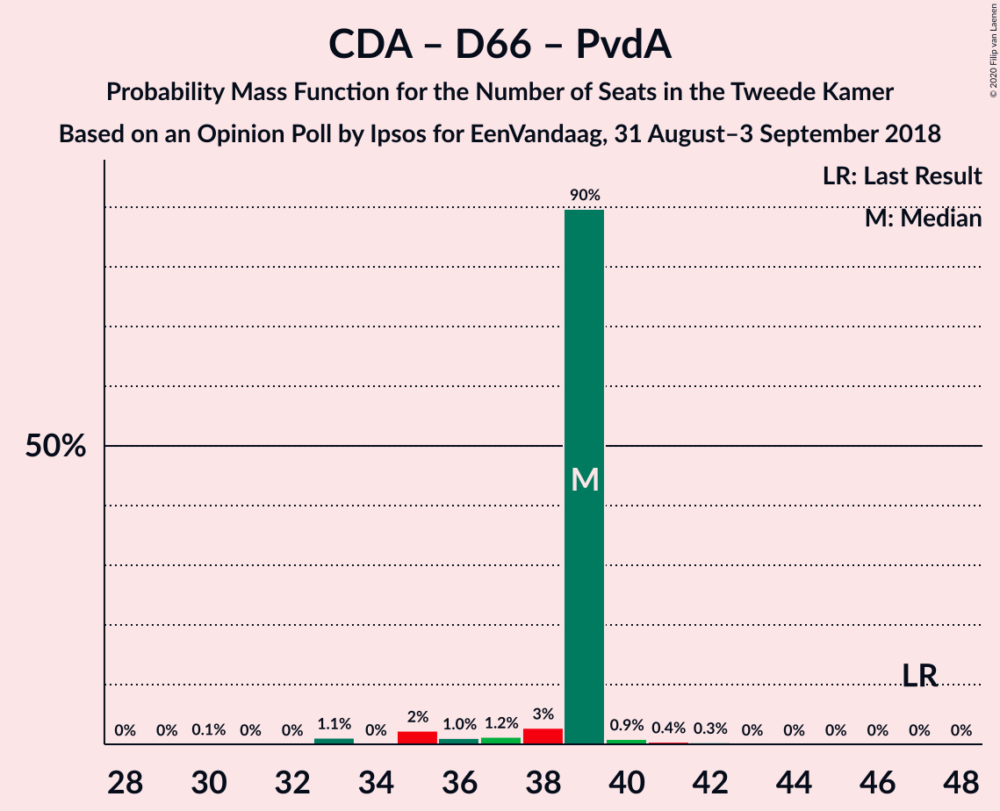

| Number of Seats | Probability | Accumulated | Special Marks |
|:---------------:|:-----------:|:-----------:|:-------------:|
| 30 | 0.1% | 100% |  |
| 31 | 0% | 99.9% |  |
| 32 | 0% | 99.9% |  |
| 33 | 1.1% | 99.9% |  |
| 34 | 0% | 98.8% |  |
| 35 | 2% | 98.7% |  |
| 36 | 1.0% | 96% |  |
| 37 | 1.2% | 95% |  |
| 38 | 3% | 94% |  |
| 39 | 90% | 91% | Median |
| 40 | 0.9% | 2% |  |
| 41 | 0.4% | 0.8% |  |
| 42 | 0.3% | 0.4% |  |
| 43 | 0% | 0% |  |
| 44 | 0% | 0% |  |
| 45 | 0% | 0% |  |
| 46 | 0% | 0% |  |
| 47 | 0% | 0% | Last Result |

### Christen-Democratisch Appèl – Partij van de Arbeid – ChristenUnie

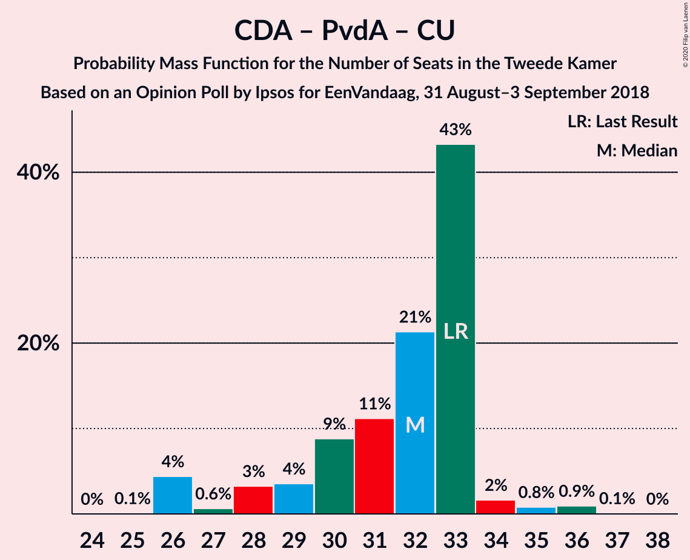

| Number of Seats | Probability | Accumulated | Special Marks |
|:---------------:|:-----------:|:-----------:|:-------------:|
| 25 | 0.2% | 100% |  |
| 26 | 1.1% | 99.8% |  |
| 27 | 2% | 98.8% |  |
| 28 | 0.8% | 96% |  |
| 29 | 1.0% | 96% |  |
| 30 | 2% | 95% |  |
| 31 | 30% | 93% |  |
| 32 | 61% | 63% | Median |
| 33 | 0.2% | 2% | Last Result |
| 34 | 1.2% | 2% |  |
| 35 | 0.1% | 0.4% |  |
| 36 | 0.2% | 0.3% |  |
| 37 | 0.1% | 0.1% |  |
| 38 | 0% | 0% |  |

### Christen-Democratisch Appèl – Democraten 66

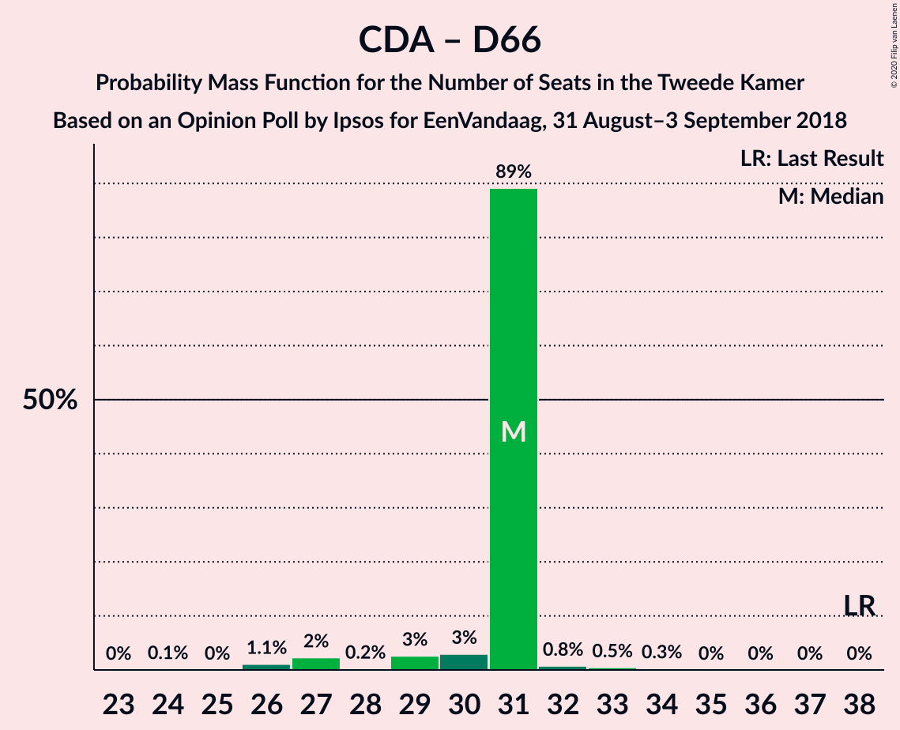

| Number of Seats | Probability | Accumulated | Special Marks |
|:---------------:|:-----------:|:-----------:|:-------------:|
| 24 | 0.1% | 100% |  |
| 25 | 0% | 99.9% |  |
| 26 | 1.1% | 99.8% |  |
| 27 | 2% | 98.7% |  |
| 28 | 0.2% | 96% |  |
| 29 | 3% | 96% |  |
| 30 | 3% | 94% |  |
| 31 | 89% | 91% | Median |
| 32 | 0.8% | 2% |  |
| 33 | 0.5% | 0.8% |  |
| 34 | 0.3% | 0.3% |  |
| 35 | 0% | 0% |  |
| 36 | 0% | 0% |  |
| 37 | 0% | 0% |  |
| 38 | 0% | 0% | Last Result |

### Christen-Democratisch Appèl – Partij van de Arbeid

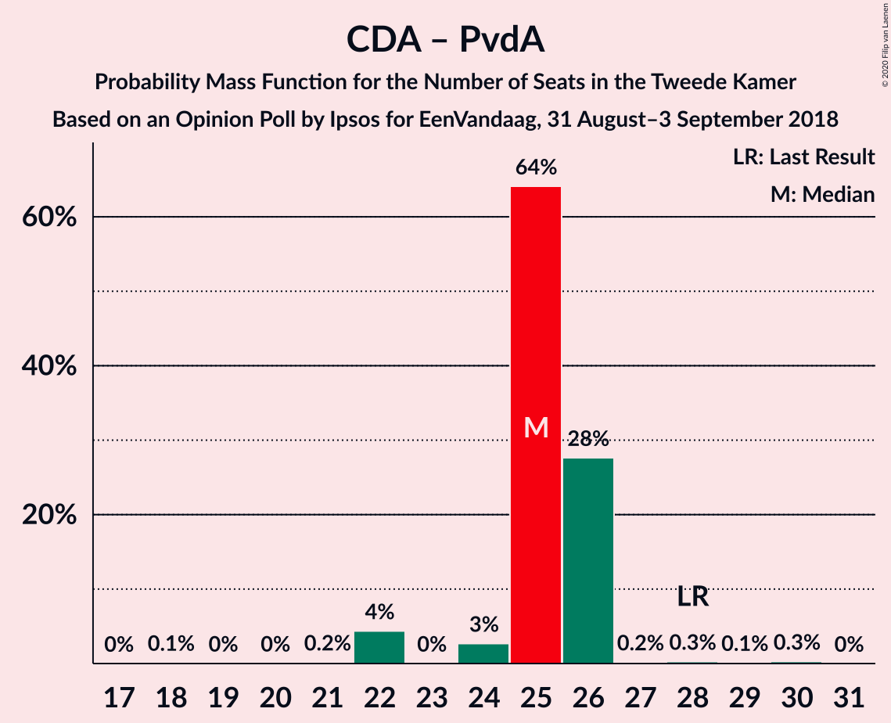

| Number of Seats | Probability | Accumulated | Special Marks |
|:---------------:|:-----------:|:-----------:|:-------------:|
| 18 | 0.1% | 100% |  |
| 19 | 0% | 99.9% |  |
| 20 | 0% | 99.9% |  |
| 21 | 0.2% | 99.8% |  |
| 22 | 4% | 99.7% |  |
| 23 | 0% | 95% |  |
| 24 | 3% | 95% |  |
| 25 | 64% | 93% | Median |
| 26 | 28% | 28% |  |
| 27 | 0.2% | 0.8% |  |
| 28 | 0.3% | 0.7% | Last Result |
| 29 | 0.1% | 0.4% |  |
| 30 | 0.3% | 0.3% |  |
| 31 | 0% | 0% |  |

## Technical Information

### Opinion Poll

+ **Polling firm:** Ipsos
+ **Commissioner(s):** EenVandaag
+ **Fieldwork period:** 31 August–3 September 2018

### Calculations

+ **Sample size:** 1045
+ **Simulations done:** 131,072
+ **Error estimate:** 1.91%

