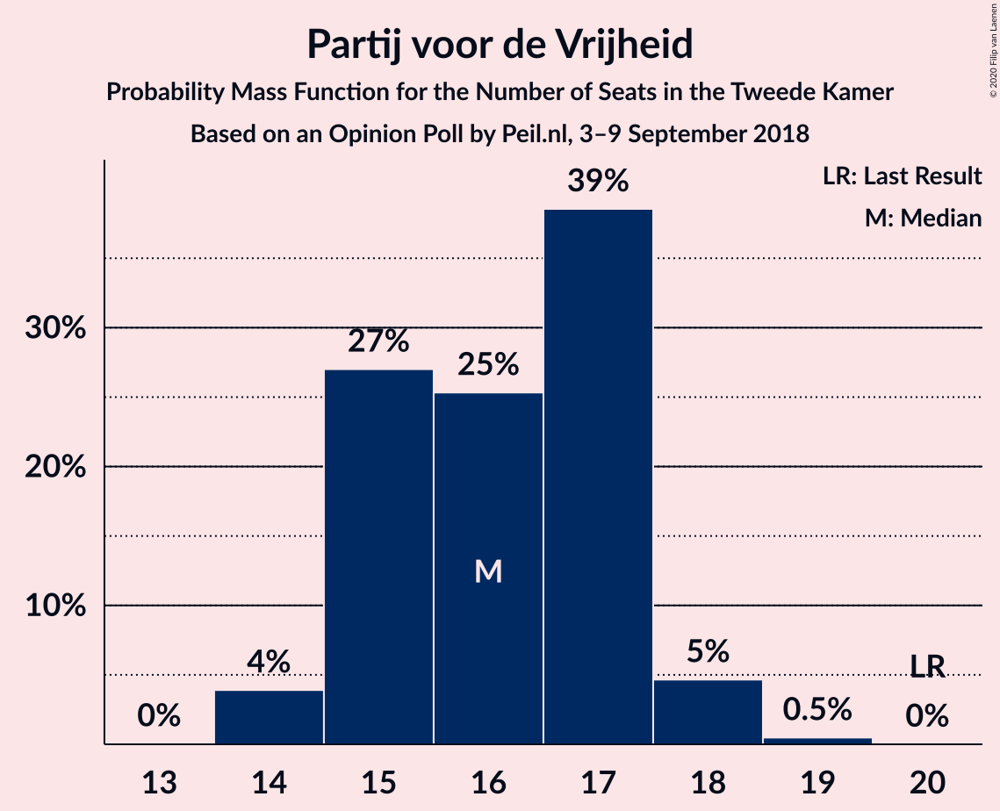
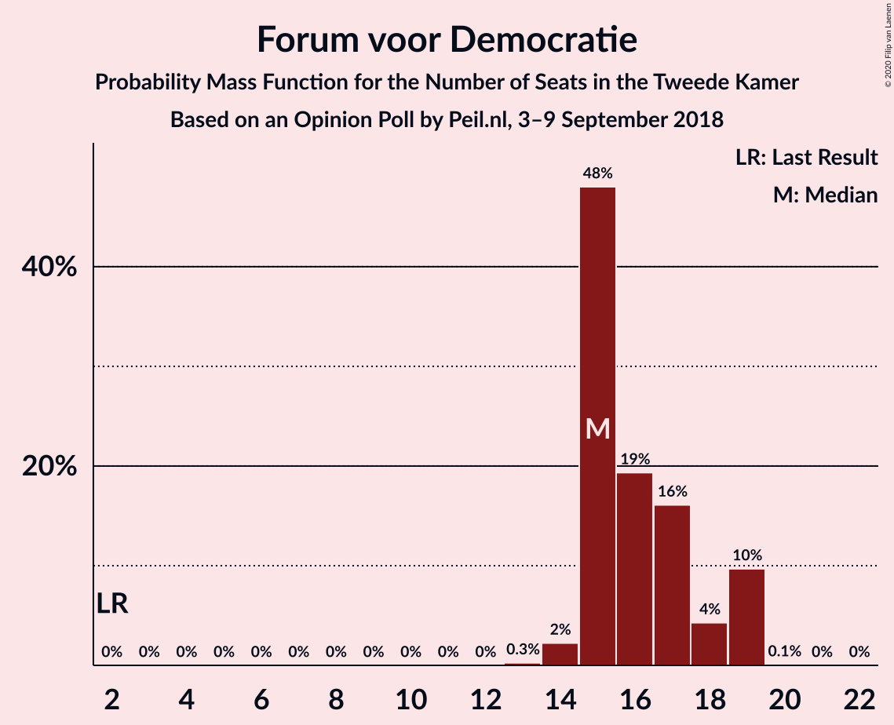
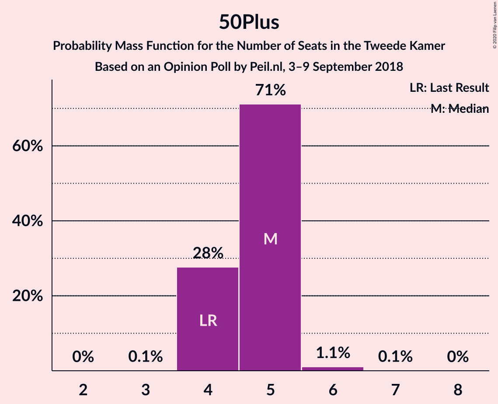
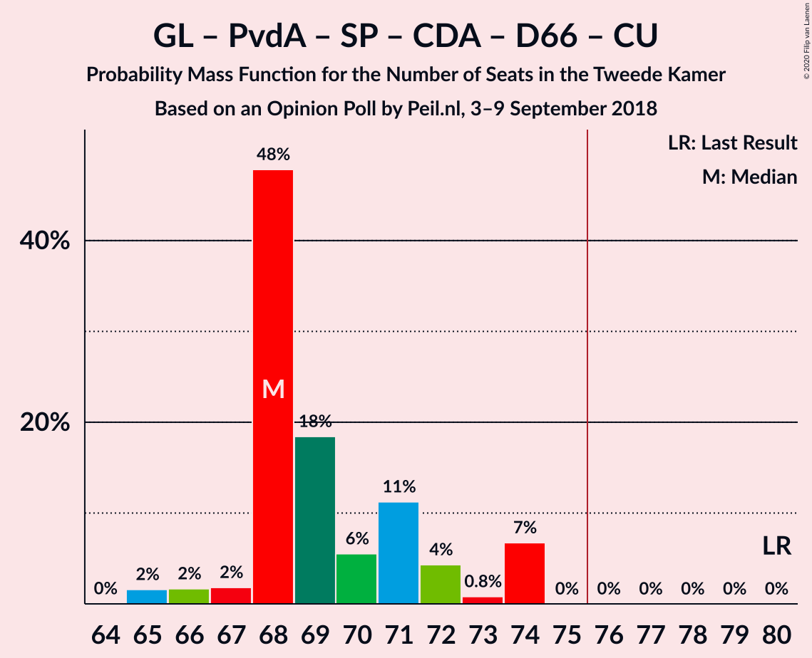
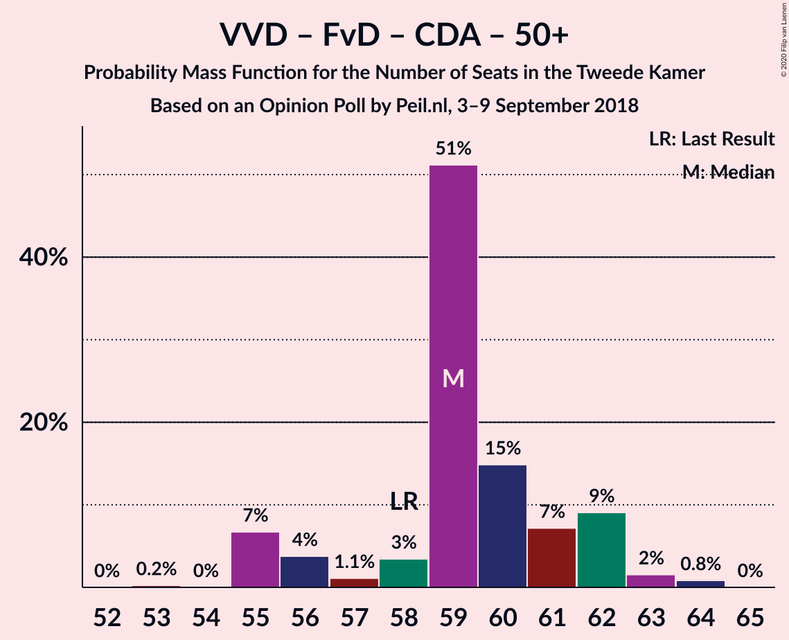
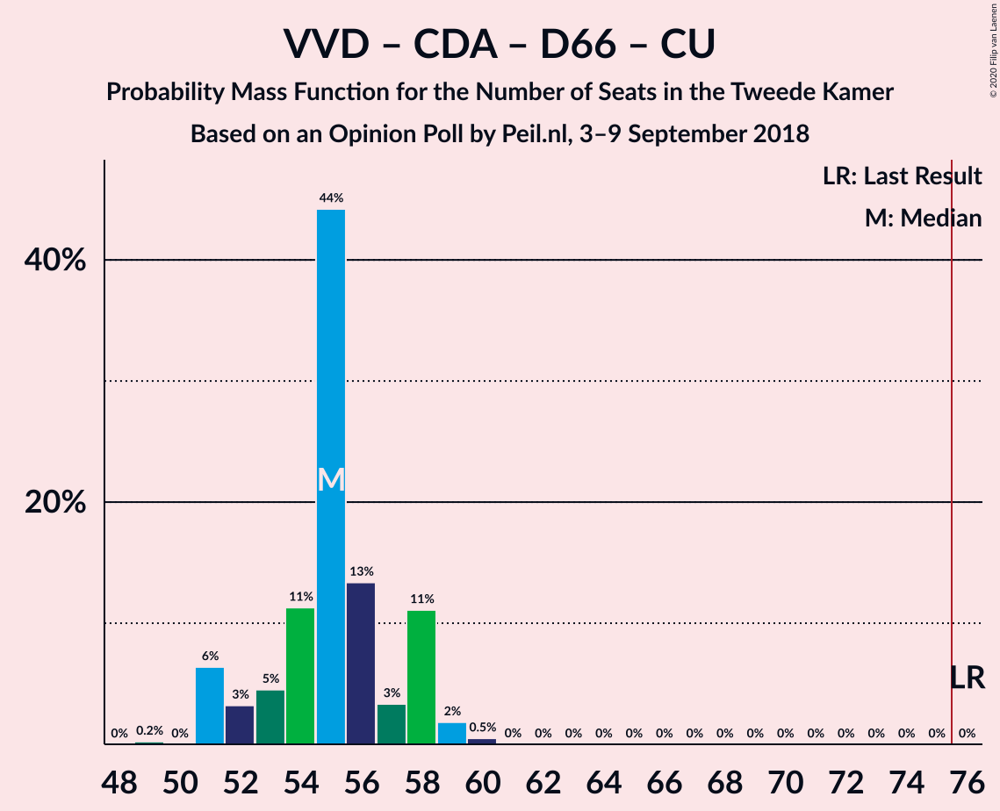
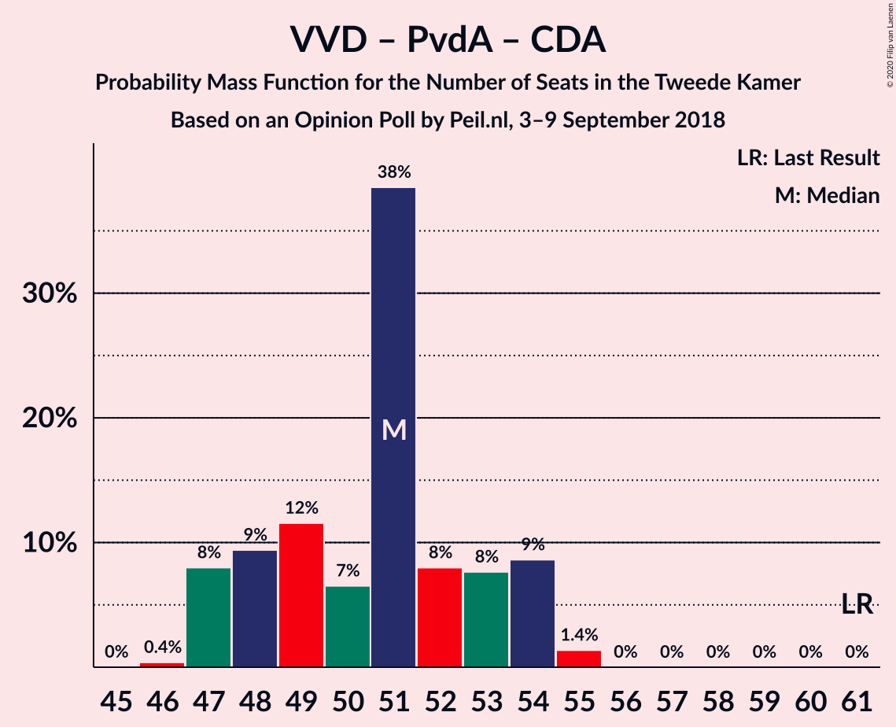
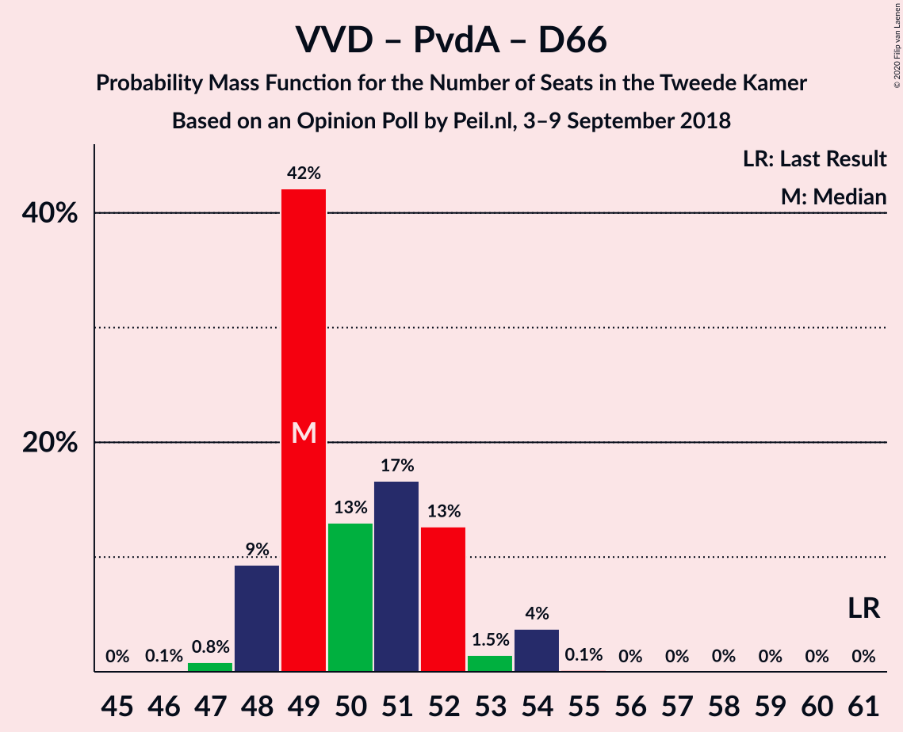

# Opinion Poll by Peil.nl, 3–9 September 2018

<a href="#voting-intentions">Voting Intentions</a> | <a href="#seats">Seats</a> | <a href="#coalitions">Coalitions</a> | <a href="#technical-information">Technical Information</a>

## Voting Intentions

### Confidence Intervals

| Party | Last Result | Poll Result | 80% Confidence Interval | 90% Confidence Interval | 95% Confidence Interval | 99% Confidence Interval |
|:-----:|:-----------:|:-----------:|:-----------------------:|:-----------------------:|:-----------------------:|:-----------------------:|
| Volkspartij voor Vrijheid en Democratie | 21.3% | 18.0% | 17.1–18.9% |16.9–19.2% |16.7–19.4% |16.2–19.9% |
| GroenLinks | 9.1% | 11.3% | 10.6–12.1% |10.4–12.3% |10.2–12.5% |9.9–12.9% |
| Partij voor de Vrijheid | 13.1% | 10.7% | 10.0–11.4% |9.8–11.6% |9.6–11.8% |9.3–12.2% |
| Forum voor Democratie | 1.8% | 10.7% | 10.0–11.4% |9.8–11.6% |9.6–11.8% |9.3–12.2% |
| Socialistische Partij | 9.1% | 8.0% | 7.4–8.7% |7.2–8.9% |7.1–9.0% |6.8–9.4% |
| Partij van de Arbeid | 5.7% | 8.0% | 7.4–8.7% |7.2–8.9% |7.1–9.0% |6.8–9.4% |
| Christen-Democratisch Appèl | 12.4% | 7.3% | 6.8–8.0% |6.6–8.2% |6.4–8.3% |6.2–8.6% |
| Democraten 66 | 12.2% | 7.3% | 6.8–8.0% |6.6–8.2% |6.4–8.3% |6.2–8.6% |
| Partij voor de Dieren | 3.2% | 5.3% | 4.8–5.9% |4.7–6.1% |4.6–6.2% |4.4–6.5% |
| ChristenUnie | 3.4% | 4.0% | 3.6–4.5% |3.4–4.6% |3.4–4.8% |3.2–5.0% |
| DENK | 2.1% | 4.0% | 3.6–4.5% |3.4–4.6% |3.4–4.8% |3.2–5.0% |
| 50Plus | 3.1% | 3.3% | 2.9–3.8% |2.8–3.9% |2.7–4.0% |2.6–4.3% |
| Staatkundig Gereformeerde Partij | 2.1% | 2.0% | 1.7–2.4% |1.6–2.5% |1.6–2.6% |1.4–2.8% |

*Note:* The poll result column reflects the actual value used in the calculations. Published results may vary slightly, and in addition be rounded to fewer digits.

## Seats

### Confidence Intervals

| Party | Last Result | Median | 80% Confidence Interval | 90% Confidence Interval | 95% Confidence Interval | 99% Confidence Interval |
|:-----:|:-----------:|:------:|:-----------------------:|:-----------------------:|:-----------------------:|:-----------------------:|
| <a href="#volkspartij-voor-vrijheid-en-democratie">Volkspartij voor Vrijheid en Democratie</a> | 33 | 30 | 27–30 |25–30 |25–30 |25–30 |
| <a href="#groenlinks">GroenLinks</a> | 14 | 18 | 15–18 |15–18 |15–18 |14–18 |
| <a href="#partij-voor-de-vrijheid">Partij voor de Vrijheid</a> | 20 | 15 | 15–16 |15–16 |15–17 |14–18 |
| <a href="#forum-voor-democratie">Forum voor Democratie</a> | 2 | 15 | 14–17 |14–18 |14–18 |14–20 |
| <a href="#socialistische-partij">Socialistische Partij</a> | 14 | 13 | 12–13 |11–13 |11–13 |10–14 |
| <a href="#partij-van-de-arbeid">Partij van de Arbeid</a> | 9 | 12 | 11–12 |11–13 |11–14 |10–14 |
| <a href="#christen-democratisch-appèl">Christen-Democratisch Appèl</a> | 19 | 11 | 11–14 |10–14 |9–14 |9–14 |
| <a href="#democraten-66">Democraten 66</a> | 19 | 11 | 8–11 |8–11 |8–11 |8–12 |
| <a href="#partij-voor-de-dieren">Partij voor de Dieren</a> | 5 | 9 | 7–9 |7–9 |7–9 |6–9 |
| <a href="#christenunie">ChristenUnie</a> | 5 | 5 | 5–6 |5–6 |5–7 |5–7 |
| <a href="#denk">DENK</a> | 3 | 6 | 5–7 |5–7 |5–7 |5–7 |
| <a href="#50plus">50Plus</a> | 4 | 4 | 4–5 |4–6 |4–6 |4–6 |
| <a href="#staatkundig-gereformeerde-partij">Staatkundig Gereformeerde Partij</a> | 3 | 2 | 2–3 |2–4 |2–4 |2–4 |

### Volkspartij voor Vrijheid en Democratie

*For a full overview of the results for this party, see the [Volkspartij voor Vrijheid en Democratie](party-volkspartijvoorvrijheidendemocratie.html) page.*

| Number of Seats | Probability | Accumulated | Special Marks |
|:---------------:|:-----------:|:-----------:|:-------------:|
| 24 | 0.2% | 100% |  |
| 25 | 6% | 99.8% |  |
| 26 | 1.2% | 93% |  |
| 27 | 31% | 92% |  |
| 28 | 2% | 61% |  |
| 29 | 8% | 59% |  |
| 30 | 50% | 50% | Median |
| 31 | 0% | 0% |  |
| 32 | 0% | 0% |  |
| 33 | 0% | 0% | Last Result |

### GroenLinks

*For a full overview of the results for this party, see the [GroenLinks](party-groenlinks.html) page.*

| Number of Seats | Probability | Accumulated | Special Marks |
|:---------------:|:-----------:|:-----------:|:-------------:|
| 14 | 0.6% | 100% | Last Result |
| 15 | 22% | 99.4% |  |
| 16 | 7% | 78% |  |
| 17 | 4% | 71% |  |
| 18 | 67% | 67% | Median |
| 19 | 0.3% | 0.4% |  |
| 20 | 0.1% | 0.1% |  |
| 21 | 0% | 0% |  |

### Partij voor de Vrijheid

*For a full overview of the results for this party, see the [Partij voor de Vrijheid](party-partijvoordevrijheid.html) page.*

| Number of Seats | Probability | Accumulated | Special Marks |
|:---------------:|:-----------:|:-----------:|:-------------:|
| 13 | 0.1% | 100% |  |
| 14 | 2% | 99.9% |  |
| 15 | 55% | 98% | Median |
| 16 | 39% | 43% |  |
| 17 | 1.4% | 4% |  |
| 18 | 2% | 2% |  |
| 19 | 0.1% | 0.1% |  |
| 20 | 0% | 0% | Last Result |

### Forum voor Democratie

*For a full overview of the results for this party, see the [Forum voor Democratie](party-forumvoordemocratie.html) page.*

| Number of Seats | Probability | Accumulated | Special Marks |
|:---------------:|:-----------:|:-----------:|:-------------:|
| 2 | 0% | 100% | Last Result |
| 3 | 0% | 100% |  |
| 4 | 0% | 100% |  |
| 5 | 0% | 100% |  |
| 6 | 0% | 100% |  |
| 7 | 0% | 100% |  |
| 8 | 0% | 100% |  |
| 9 | 0% | 100% |  |
| 10 | 0% | 100% |  |
| 11 | 0% | 100% |  |
| 12 | 0% | 100% |  |
| 13 | 0% | 100% |  |
| 14 | 49% | 100% |  |
| 15 | 24% | 51% | Median |
| 16 | 3% | 27% |  |
| 17 | 17% | 24% |  |
| 18 | 5% | 7% |  |
| 19 | 0.1% | 2% |  |
| 20 | 1.4% | 1.4% |  |
| 21 | 0% | 0% |  |

### Socialistische Partij

*For a full overview of the results for this party, see the [Socialistische Partij](party-socialistischepartij.html) page.*

| Number of Seats | Probability | Accumulated | Special Marks |
|:---------------:|:-----------:|:-----------:|:-------------:|
| 10 | 1.2% | 100% |  |
| 11 | 8% | 98.8% |  |
| 12 | 17% | 91% |  |
| 13 | 73% | 74% | Median |
| 14 | 0.6% | 0.8% | Last Result |
| 15 | 0.1% | 0.1% |  |
| 16 | 0% | 0% |  |

### Partij van de Arbeid

*For a full overview of the results for this party, see the [Partij van de Arbeid](party-partijvandearbeid.html) page.*

| Number of Seats | Probability | Accumulated | Special Marks |
|:---------------:|:-----------:|:-----------:|:-------------:|
| 9 | 0% | 100% | Last Result |
| 10 | 2% | 100% |  |
| 11 | 23% | 98% |  |
| 12 | 69% | 75% | Median |
| 13 | 2% | 6% |  |
| 14 | 3% | 3% |  |
| 15 | 0% | 0% |  |

### Christen-Democratisch Appèl

*For a full overview of the results for this party, see the [Christen-Democratisch Appèl](party-christen-democratischappèl.html) page.*

| Number of Seats | Probability | Accumulated | Special Marks |
|:---------------:|:-----------:|:-----------:|:-------------:|
| 9 | 5% | 100% |  |
| 10 | 3% | 95% |  |
| 11 | 54% | 93% | Median |
| 12 | 16% | 39% |  |
| 13 | 5% | 23% |  |
| 14 | 18% | 18% |  |
| 15 | 0% | 0% |  |
| 16 | 0% | 0% |  |
| 17 | 0% | 0% |  |
| 18 | 0% | 0% |  |
| 19 | 0% | 0% | Last Result |

### Democraten 66

*For a full overview of the results for this party, see the [Democraten 66](party-democraten66.html) page.*

| Number of Seats | Probability | Accumulated | Special Marks |
|:---------------:|:-----------:|:-----------:|:-------------:|
| 8 | 14% | 100% |  |
| 9 | 0.7% | 86% |  |
| 10 | 5% | 86% |  |
| 11 | 80% | 81% | Median |
| 12 | 0.9% | 1.4% |  |
| 13 | 0.5% | 0.5% |  |
| 14 | 0% | 0% |  |
| 15 | 0% | 0% |  |
| 16 | 0% | 0% |  |
| 17 | 0% | 0% |  |
| 18 | 0% | 0% |  |
| 19 | 0% | 0% | Last Result |

### Partij voor de Dieren

*For a full overview of the results for this party, see the [Partij voor de Dieren](party-partijvoordedieren.html) page.*

| Number of Seats | Probability | Accumulated | Special Marks |
|:---------------:|:-----------:|:-----------:|:-------------:|
| 5 | 0% | 100% | Last Result |
| 6 | 1.1% | 100% |  |
| 7 | 23% | 98.9% |  |
| 8 | 26% | 76% |  |
| 9 | 50% | 50% | Median |
| 10 | 0% | 0% |  |

### ChristenUnie

*For a full overview of the results for this party, see the [ChristenUnie](party-christenunie.html) page.*

| Number of Seats | Probability | Accumulated | Special Marks |
|:---------------:|:-----------:|:-----------:|:-------------:|
| 3 | 0.1% | 100% |  |
| 4 | 0.1% | 99.9% |  |
| 5 | 50% | 99.8% | Last Result, Median |
| 6 | 45% | 49% |  |
| 7 | 4% | 4% |  |
| 8 | 0.1% | 0.1% |  |
| 9 | 0% | 0% |  |

### DENK

*For a full overview of the results for this party, see the [DENK](party-denk.html) page.*

| Number of Seats | Probability | Accumulated | Special Marks |
|:---------------:|:-----------:|:-----------:|:-------------:|
| 3 | 0% | 100% | Last Result |
| 4 | 0.2% | 100% |  |
| 5 | 10% | 99.8% |  |
| 6 | 69% | 90% | Median |
| 7 | 20% | 20% |  |
| 8 | 0% | 0% |  |

### 50Plus

*For a full overview of the results for this party, see the [50Plus](party-50plus.html) page.*

| Number of Seats | Probability | Accumulated | Special Marks |
|:---------------:|:-----------:|:-----------:|:-------------:|
| 3 | 0.1% | 100% |  |
| 4 | 50% | 99.9% | Last Result, Median |
| 5 | 44% | 50% |  |
| 6 | 5% | 5% |  |
| 7 | 0.2% | 0.2% |  |
| 8 | 0% | 0% |  |

### Staatkundig Gereformeerde Partij

*For a full overview of the results for this party, see the [Staatkundig Gereformeerde Partij](party-staatkundiggereformeerdepartij.html) page.*

| Number of Seats | Probability | Accumulated | Special Marks |
|:---------------:|:-----------:|:-----------:|:-------------:|
| 2 | 53% | 100% | Median |
| 3 | 37% | 47% | Last Result |
| 4 | 10% | 10% |  |
| 5 | 0% | 0% |  |

## Coalitions

### Confidence Intervals

| Coalition | Last Result | Median | Majority? | 80% Confidence Interval | 90% Confidence Interval | 95% Confidence Interval | 99% Confidence Interval |
|:---------:|:-----------:|:------:|:---------:|:-----------------------:|:-----------------------:|:-----------------------:|:-----------------------:|
| Volkspartij voor Vrijheid en Democratie – Forum voor Democratie – Partij voor de Vrijheid – Christen-Democratisch Appèl – Staatkundig Gereformeerde Partij | 77 | 72 | 9% | 72–75 | 72–77 | 71–77 | 71–77 |
| Volkspartij voor Vrijheid en Democratie – GroenLinks – Christen-Democratisch Appèl – Democraten 66 – ChristenUnie | 90 | 75 | 0.1% | 71–75 | 70–75 | 69–75 | 69–75 |
| Volkspartij voor Vrijheid en Democratie – Forum voor Democratie – Partij voor de Vrijheid – Christen-Democratisch Appèl | 74 | 70 | 0.1% | 70–72 | 69–73 | 67–73 | 67–74 |
| Volkspartij voor Vrijheid en Democratie – Partij van de Arbeid – Christen-Democratisch Appèl – Democraten 66 – ChristenUnie | 85 | 69 | 0% | 65–69 | 63–70 | 63–71 | 63–72 |
| GroenLinks – Partij van de Arbeid – Socialistische Partij – Christen-Democratisch Appèl – Democraten 66 – ChristenUnie | 80 | 70 | 0% | 68–70 | 68–70 | 66–70 | 65–71 |
| Volkspartij voor Vrijheid en Democratie – Forum voor Democratie – Christen-Democratisch Appèl – 50Plus – Staatkundig Gereformeerde Partij | 61 | 61 | 0% | 61–64 | 61–66 | 61–66 | 61–67 |
| Volkspartij voor Vrijheid en Democratie – Forum voor Democratie – Christen-Democratisch Appèl – 50Plus | 58 | 59 | 0% | 59–61 | 58–62 | 57–63 | 57–64 |
| Volkspartij voor Vrijheid en Democratie – Forum voor Democratie – Christen-Democratisch Appèl – Staatkundig Gereformeerde Partij | 57 | 57 | 0% | 57–59 | 56–61 | 56–61 | 56–62 |
| Volkspartij voor Vrijheid en Democratie – Christen-Democratisch Appèl – Democraten 66 – ChristenUnie | 76 | 57 | 0% | 53–58 | 53–58 | 51–59 | 51–59 |
| Volkspartij voor Vrijheid en Democratie – Partij voor de Vrijheid – Christen-Democratisch Appèl | 72 | 56 | 0% | 55–57 | 52–58 | 49–58 | 49–58 |
| GroenLinks – Partij van de Arbeid – Christen-Democratisch Appèl – Democraten 66 – ChristenUnie | 66 | 57 | 0% | 56–57 | 55–57 | 55–57 | 54–59 |
| Volkspartij voor Vrijheid en Democratie – Forum voor Democratie – Christen-Democratisch Appèl | 54 | 55 | 0% | 55–56 | 53–57 | 52–57 | 52–59 |
| Volkspartij voor Vrijheid en Democratie – Partij van de Arbeid – Christen-Democratisch Appèl | 61 | 53 | 0% | 51–53 | 46–53 | 46–54 | 46–55 |
| Volkspartij voor Vrijheid en Democratie – Partij van de Arbeid – Democraten 66 | 61 | 53 | 0% | 47–53 | 47–53 | 47–53 | 46–55 |
| Volkspartij voor Vrijheid en Democratie – Christen-Democratisch Appèl – Democraten 66 | 71 | 52 | 0% | 47–52 | 47–52 | 45–53 | 45–53 |
| Volkspartij voor Vrijheid en Democratie – Partij van de Arbeid | 42 | 42 | 0% | 38–42 | 37–42 | 37–43 | 35–43 |
| Volkspartij voor Vrijheid en Democratie – Christen-Democratisch Appèl | 52 | 41 | 0% | 39–41 | 36–41 | 34–42 | 34–42 |
| Partij van de Arbeid – Christen-Democratisch Appèl – Democraten 66 | 47 | 34 | 0% | 32–36 | 32–36 | 32–36 | 32–37 |
| Partij van de Arbeid – Christen-Democratisch Appèl – ChristenUnie | 33 | 28 | 0% | 28–31 | 27–31 | 27–32 | 27–33 |
| Partij van de Arbeid – Christen-Democratisch Appèl | 28 | 23 | 0% | 23–25 | 21–25 | 21–25 | 21–26 |
| Christen-Democratisch Appèl – Democraten 66 | 38 | 22 | 0% | 20–25 | 20–25 | 20–25 | 19–25 |

### Volkspartij voor Vrijheid en Democratie – Forum voor Democratie – Partij voor de Vrijheid – Christen-Democratisch Appèl – Staatkundig Gereformeerde Partij

| Number of Seats | Probability | Accumulated | Special Marks |
|:---------------:|:-----------:|:-----------:|:-------------:|
| 69 | 0.3% | 100% |  |
| 70 | 0.1% | 99.7% |  |
| 71 | 4% | 99.6% |  |
| 72 | 51% | 96% |  |
| 73 | 2% | 45% | Median |
| 74 | 3% | 43% |  |
| 75 | 31% | 40% |  |
| 76 | 2% | 9% | Majority |
| 77 | 6% | 6% | Last Result |
| 78 | 0% | 0.1% |  |
| 79 | 0% | 0.1% |  |
| 80 | 0.1% | 0.1% |  |
| 81 | 0% | 0% |  |

### Volkspartij voor Vrijheid en Democratie – GroenLinks – Christen-Democratisch Appèl – Democraten 66 – ChristenUnie

| Number of Seats | Probability | Accumulated | Special Marks |
|:---------------:|:-----------:|:-----------:|:-------------:|
| 68 | 0.1% | 100% |  |
| 69 | 5% | 99.9% |  |
| 70 | 3% | 95% |  |
| 71 | 16% | 92% |  |
| 72 | 2% | 76% |  |
| 73 | 18% | 74% |  |
| 74 | 2% | 56% |  |
| 75 | 54% | 54% | Median |
| 76 | 0.1% | 0.1% | Majority |
| 77 | 0% | 0% |  |
| 78 | 0% | 0% |  |
| 79 | 0% | 0% |  |
| 80 | 0% | 0% |  |
| 81 | 0% | 0% |  |
| 82 | 0% | 0% |  |
| 83 | 0% | 0% |  |
| 84 | 0% | 0% |  |
| 85 | 0% | 0% |  |
| 86 | 0% | 0% |  |
| 87 | 0% | 0% |  |
| 88 | 0% | 0% |  |
| 89 | 0% | 0% |  |
| 90 | 0% | 0% | Last Result |

### Volkspartij voor Vrijheid en Democratie – Forum voor Democratie – Partij voor de Vrijheid – Christen-Democratisch Appèl

| Number of Seats | Probability | Accumulated | Special Marks |
|:---------------:|:-----------:|:-----------:|:-------------:|
| 67 | 4% | 100% |  |
| 68 | 0.1% | 96% |  |
| 69 | 2% | 96% |  |
| 70 | 50% | 94% |  |
| 71 | 4% | 45% | Median |
| 72 | 33% | 41% |  |
| 73 | 6% | 8% |  |
| 74 | 2% | 2% | Last Result |
| 75 | 0% | 0.1% |  |
| 76 | 0% | 0.1% | Majority |
| 77 | 0% | 0.1% |  |
| 78 | 0.1% | 0.1% |  |
| 79 | 0% | 0% |  |

### Volkspartij voor Vrijheid en Democratie – Partij van de Arbeid – Christen-Democratisch Appèl – Democraten 66 – ChristenUnie

| Number of Seats | Probability | Accumulated | Special Marks |
|:---------------:|:-----------:|:-----------:|:-------------:|
| 62 | 0.1% | 100% |  |
| 63 | 5% | 99.9% |  |
| 64 | 2% | 95% |  |
| 65 | 14% | 93% |  |
| 66 | 0.2% | 79% |  |
| 67 | 0.1% | 79% |  |
| 68 | 2% | 79% |  |
| 69 | 68% | 76% | Median |
| 70 | 5% | 8% |  |
| 71 | 1.5% | 3% |  |
| 72 | 2% | 2% |  |
| 73 | 0% | 0% |  |
| 74 | 0% | 0% |  |
| 75 | 0% | 0% |  |
| 76 | 0% | 0% | Majority |
| 77 | 0% | 0% |  |
| 78 | 0% | 0% |  |
| 79 | 0% | 0% |  |
| 80 | 0% | 0% |  |
| 81 | 0% | 0% |  |
| 82 | 0% | 0% |  |
| 83 | 0% | 0% |  |
| 84 | 0% | 0% |  |
| 85 | 0% | 0% | Last Result |

### GroenLinks – Partij van de Arbeid – Socialistische Partij – Christen-Democratisch Appèl – Democraten 66 – ChristenUnie

| Number of Seats | Probability | Accumulated | Special Marks |
|:---------------:|:-----------:|:-----------:|:-------------:|
| 65 | 0.8% | 100% |  |
| 66 | 3% | 99.2% |  |
| 67 | 0.4% | 96% |  |
| 68 | 20% | 96% |  |
| 69 | 6% | 75% |  |
| 70 | 67% | 70% | Median |
| 71 | 2% | 2% |  |
| 72 | 0.2% | 0.3% |  |
| 73 | 0.1% | 0.2% |  |
| 74 | 0.1% | 0.1% |  |
| 75 | 0% | 0% |  |
| 76 | 0% | 0% | Majority |
| 77 | 0% | 0% |  |
| 78 | 0% | 0% |  |
| 79 | 0% | 0% |  |
| 80 | 0% | 0% | Last Result |

### Volkspartij voor Vrijheid en Democratie – Forum voor Democratie – Christen-Democratisch Appèl – 50Plus – Staatkundig Gereformeerde Partij

| Number of Seats | Probability | Accumulated | Special Marks |
|:---------------:|:-----------:|:-----------:|:-------------:|
| 57 | 0.1% | 100% |  |
| 58 | 0% | 99.9% |  |
| 59 | 0.2% | 99.9% |  |
| 60 | 0% | 99.7% |  |
| 61 | 54% | 99.6% | Last Result |
| 62 | 2% | 46% | Median |
| 63 | 2% | 44% |  |
| 64 | 32% | 41% |  |
| 65 | 3% | 9% |  |
| 66 | 5% | 6% |  |
| 67 | 1.4% | 1.5% |  |
| 68 | 0% | 0% |  |

### Volkspartij voor Vrijheid en Democratie – Forum voor Democratie – Christen-Democratisch Appèl – 50Plus

| Number of Seats | Probability | Accumulated | Special Marks |
|:---------------:|:-----------:|:-----------:|:-------------:|
| 54 | 0.1% | 100% |  |
| 55 | 0% | 99.9% |  |
| 56 | 0% | 99.9% |  |
| 57 | 4% | 99.8% |  |
| 58 | 2% | 96% | Last Result |
| 59 | 51% | 95% |  |
| 60 | 0.3% | 44% | Median |
| 61 | 35% | 43% |  |
| 62 | 5% | 8% |  |
| 63 | 2% | 3% |  |
| 64 | 2% | 2% |  |
| 65 | 0% | 0% |  |

### Volkspartij voor Vrijheid en Democratie – Forum voor Democratie – Christen-Democratisch Appèl – Staatkundig Gereformeerde Partij

| Number of Seats | Probability | Accumulated | Special Marks |
|:---------------:|:-----------:|:-----------:|:-------------:|
| 53 | 0% | 100% |  |
| 54 | 0.3% | 99.9% |  |
| 55 | 0.1% | 99.6% |  |
| 56 | 6% | 99.5% |  |
| 57 | 50% | 93% | Last Result |
| 58 | 2% | 43% | Median |
| 59 | 34% | 41% |  |
| 60 | 0.9% | 7% |  |
| 61 | 5% | 6% |  |
| 62 | 2% | 2% |  |
| 63 | 0% | 0% |  |

### Volkspartij voor Vrijheid en Democratie – Christen-Democratisch Appèl – Democraten 66 – ChristenUnie

| Number of Seats | Probability | Accumulated | Special Marks |
|:---------------:|:-----------:|:-----------:|:-------------:|
| 51 | 4% | 100% |  |
| 52 | 1.2% | 96% |  |
| 53 | 16% | 95% |  |
| 54 | 0.3% | 79% |  |
| 55 | 0.9% | 79% |  |
| 56 | 3% | 78% |  |
| 57 | 50% | 75% | Median |
| 58 | 20% | 25% |  |
| 59 | 5% | 5% |  |
| 60 | 0% | 0% |  |
| 61 | 0% | 0% |  |
| 62 | 0% | 0% |  |
| 63 | 0% | 0% |  |
| 64 | 0% | 0% |  |
| 65 | 0% | 0% |  |
| 66 | 0% | 0% |  |
| 67 | 0% | 0% |  |
| 68 | 0% | 0% |  |
| 69 | 0% | 0% |  |
| 70 | 0% | 0% |  |
| 71 | 0% | 0% |  |
| 72 | 0% | 0% |  |
| 73 | 0% | 0% |  |
| 74 | 0% | 0% |  |
| 75 | 0% | 0% |  |
| 76 | 0% | 0% | Last Result, Majority |

### Volkspartij voor Vrijheid en Democratie – Partij voor de Vrijheid – Christen-Democratisch Appèl

| Number of Seats | Probability | Accumulated | Special Marks |
|:---------------:|:-----------:|:-----------:|:-------------:|
| 49 | 4% | 100% |  |
| 50 | 0.1% | 96% |  |
| 51 | 0.1% | 96% |  |
| 52 | 2% | 96% |  |
| 53 | 1.4% | 94% |  |
| 54 | 2% | 93% |  |
| 55 | 17% | 91% |  |
| 56 | 49% | 74% | Median |
| 57 | 19% | 25% |  |
| 58 | 5% | 5% |  |
| 59 | 0.1% | 0.1% |  |
| 60 | 0% | 0% |  |
| 61 | 0% | 0% |  |
| 62 | 0% | 0% |  |
| 63 | 0% | 0% |  |
| 64 | 0% | 0% |  |
| 65 | 0% | 0% |  |
| 66 | 0% | 0% |  |
| 67 | 0% | 0% |  |
| 68 | 0% | 0% |  |
| 69 | 0% | 0% |  |
| 70 | 0% | 0% |  |
| 71 | 0% | 0% |  |
| 72 | 0% | 0% | Last Result |

### GroenLinks – Partij van de Arbeid – Christen-Democratisch Appèl – Democraten 66 – ChristenUnie

| Number of Seats | Probability | Accumulated | Special Marks |
|:---------------:|:-----------:|:-----------:|:-------------:|
| 53 | 0.1% | 100% |  |
| 54 | 1.1% | 99.9% |  |
| 55 | 4% | 98.8% |  |
| 56 | 19% | 95% |  |
| 57 | 74% | 76% | Median |
| 58 | 0.1% | 2% |  |
| 59 | 2% | 2% |  |
| 60 | 0.2% | 0.2% |  |
| 61 | 0% | 0% |  |
| 62 | 0% | 0% |  |
| 63 | 0% | 0% |  |
| 64 | 0% | 0% |  |
| 65 | 0% | 0% |  |
| 66 | 0% | 0% | Last Result |

### Volkspartij voor Vrijheid en Democratie – Forum voor Democratie – Christen-Democratisch Appèl

| Number of Seats | Probability | Accumulated | Special Marks |
|:---------------:|:-----------:|:-----------:|:-------------:|
| 50 | 0% | 100% |  |
| 51 | 0.1% | 99.9% |  |
| 52 | 4% | 99.8% |  |
| 53 | 3% | 96% |  |
| 54 | 0.5% | 93% | Last Result |
| 55 | 51% | 93% |  |
| 56 | 33% | 42% | Median |
| 57 | 7% | 8% |  |
| 58 | 0.1% | 2% |  |
| 59 | 1.5% | 2% |  |
| 60 | 0.1% | 0.1% |  |
| 61 | 0% | 0% |  |

### Volkspartij voor Vrijheid en Democratie – Partij van de Arbeid – Christen-Democratisch Appèl

| Number of Seats | Probability | Accumulated | Special Marks |
|:---------------:|:-----------:|:-----------:|:-------------:|
| 46 | 5% | 100% |  |
| 47 | 2% | 95% |  |
| 48 | 0.3% | 93% |  |
| 49 | 0.2% | 93% |  |
| 50 | 0.1% | 93% |  |
| 51 | 15% | 92% |  |
| 52 | 19% | 77% |  |
| 53 | 55% | 58% | Median |
| 54 | 1.1% | 3% |  |
| 55 | 2% | 2% |  |
| 56 | 0% | 0% |  |
| 57 | 0% | 0% |  |
| 58 | 0% | 0% |  |
| 59 | 0% | 0% |  |
| 60 | 0% | 0% |  |
| 61 | 0% | 0% | Last Result |

### Volkspartij voor Vrijheid en Democratie – Partij van de Arbeid – Democraten 66

| Number of Seats | Probability | Accumulated | Special Marks |
|:---------------:|:-----------:|:-----------:|:-------------:|
| 46 | 2% | 100% |  |
| 47 | 15% | 98% |  |
| 48 | 4% | 83% |  |
| 49 | 18% | 79% |  |
| 50 | 0.8% | 61% |  |
| 51 | 6% | 60% |  |
| 52 | 0.7% | 54% |  |
| 53 | 52% | 53% | Median |
| 54 | 0% | 1.2% |  |
| 55 | 1.2% | 1.2% |  |
| 56 | 0% | 0% |  |
| 57 | 0% | 0% |  |
| 58 | 0% | 0% |  |
| 59 | 0% | 0% |  |
| 60 | 0% | 0% |  |
| 61 | 0% | 0% | Last Result |

### Volkspartij voor Vrijheid en Democratie – Christen-Democratisch Appèl – Democraten 66

| Number of Seats | Probability | Accumulated | Special Marks |
|:---------------:|:-----------:|:-----------:|:-------------:|
| 45 | 5% | 100% |  |
| 46 | 0.2% | 95% |  |
| 47 | 16% | 95% |  |
| 48 | 0.2% | 79% |  |
| 49 | 1.0% | 79% |  |
| 50 | 3% | 78% |  |
| 51 | 3% | 75% |  |
| 52 | 67% | 72% | Median |
| 53 | 5% | 5% |  |
| 54 | 0% | 0% |  |
| 55 | 0% | 0% |  |
| 56 | 0% | 0% |  |
| 57 | 0% | 0% |  |
| 58 | 0% | 0% |  |
| 59 | 0% | 0% |  |
| 60 | 0% | 0% |  |
| 61 | 0% | 0% |  |
| 62 | 0% | 0% |  |
| 63 | 0% | 0% |  |
| 64 | 0% | 0% |  |
| 65 | 0% | 0% |  |
| 66 | 0% | 0% |  |
| 67 | 0% | 0% |  |
| 68 | 0% | 0% |  |
| 69 | 0% | 0% |  |
| 70 | 0% | 0% |  |
| 71 | 0% | 0% | Last Result |

### Volkspartij voor Vrijheid en Democratie – Partij van de Arbeid

| Number of Seats | Probability | Accumulated | Special Marks |
|:---------------:|:-----------:|:-----------:|:-------------:|
| 35 | 2% | 100% |  |
| 36 | 0.3% | 98% |  |
| 37 | 5% | 98% |  |
| 38 | 18% | 93% |  |
| 39 | 14% | 75% |  |
| 40 | 6% | 60% |  |
| 41 | 0.1% | 54% |  |
| 42 | 50% | 54% | Last Result, Median |
| 43 | 4% | 4% |  |
| 44 | 0% | 0% |  |

### Volkspartij voor Vrijheid en Democratie – Christen-Democratisch Appèl

| Number of Seats | Probability | Accumulated | Special Marks |
|:---------------:|:-----------:|:-----------:|:-------------:|
| 34 | 4% | 100% |  |
| 35 | 1.2% | 96% |  |
| 36 | 2% | 95% |  |
| 37 | 0.3% | 93% |  |
| 38 | 0.3% | 93% |  |
| 39 | 17% | 92% |  |
| 40 | 2% | 75% |  |
| 41 | 69% | 73% | Median |
| 42 | 5% | 5% |  |
| 43 | 0% | 0% |  |
| 44 | 0% | 0% |  |
| 45 | 0% | 0% |  |
| 46 | 0% | 0% |  |
| 47 | 0% | 0% |  |
| 48 | 0% | 0% |  |
| 49 | 0% | 0% |  |
| 50 | 0% | 0% |  |
| 51 | 0% | 0% |  |
| 52 | 0% | 0% | Last Result |

### Partij van de Arbeid – Christen-Democratisch Appèl – Democraten 66

| Number of Seats | Probability | Accumulated | Special Marks |
|:---------------:|:-----------:|:-----------:|:-------------:|
| 30 | 0.1% | 100% |  |
| 31 | 0.2% | 99.9% |  |
| 32 | 21% | 99.7% |  |
| 33 | 0.4% | 79% |  |
| 34 | 51% | 78% | Median |
| 35 | 6% | 27% |  |
| 36 | 20% | 21% |  |
| 37 | 0.5% | 0.6% |  |
| 38 | 0% | 0% |  |
| 39 | 0% | 0% |  |
| 40 | 0% | 0% |  |
| 41 | 0% | 0% |  |
| 42 | 0% | 0% |  |
| 43 | 0% | 0% |  |
| 44 | 0% | 0% |  |
| 45 | 0% | 0% |  |
| 46 | 0% | 0% |  |
| 47 | 0% | 0% | Last Result |

### Partij van de Arbeid – Christen-Democratisch Appèl – ChristenUnie

| Number of Seats | Probability | Accumulated | Special Marks |
|:---------------:|:-----------:|:-----------:|:-------------:|
| 24 | 0.1% | 100% |  |
| 25 | 0% | 99.9% |  |
| 26 | 0.2% | 99.9% |  |
| 27 | 7% | 99.7% |  |
| 28 | 49% | 93% | Median |
| 29 | 4% | 44% |  |
| 30 | 19% | 40% |  |
| 31 | 18% | 21% |  |
| 32 | 2% | 4% |  |
| 33 | 2% | 2% | Last Result |
| 34 | 0% | 0% |  |

### Partij van de Arbeid – Christen-Democratisch Appèl

| Number of Seats | Probability | Accumulated | Special Marks |
|:---------------:|:-----------:|:-----------:|:-------------:|
| 20 | 0.2% | 100% |  |
| 21 | 6% | 99.8% |  |
| 22 | 2% | 94% |  |
| 23 | 52% | 92% | Median |
| 24 | 19% | 40% |  |
| 25 | 19% | 22% |  |
| 26 | 2% | 2% |  |
| 27 | 0% | 0% |  |
| 28 | 0% | 0% | Last Result |

### Christen-Democratisch Appèl – Democraten 66

| Number of Seats | Probability | Accumulated | Special Marks |
|:---------------:|:-----------:|:-----------:|:-------------:|
| 19 | 0.8% | 100% |  |
| 20 | 19% | 99.2% |  |
| 21 | 2% | 81% |  |
| 22 | 54% | 78% | Median |
| 23 | 0.8% | 24% |  |
| 24 | 5% | 23% |  |
| 25 | 18% | 18% |  |
| 26 | 0% | 0% |  |
| 27 | 0% | 0% |  |
| 28 | 0% | 0% |  |
| 29 | 0% | 0% |  |
| 30 | 0% | 0% |  |
| 31 | 0% | 0% |  |
| 32 | 0% | 0% |  |
| 33 | 0% | 0% |  |
| 34 | 0% | 0% |  |
| 35 | 0% | 0% |  |
| 36 | 0% | 0% |  |
| 37 | 0% | 0% |  |
| 38 | 0% | 0% | Last Result |

## Technical Information

### Opinion Poll

+ **Polling firm:** Peil.nl
+ **Commissioner(s):** —
+ **Fieldwork period:** 3–9 September 2018

### Calculations

+ **Sample size:** 3000
+ **Simulations done:** 131,072
+ **Error estimate:** 2.29%

