# Opinion Poll by I&O Research, 7–11 September 2018

<a href="#voting-intentions">Voting Intentions</a> | <a href="#seats">Seats</a> | <a href="#coalitions">Coalitions</a> | <a href="#technical-information">Technical Information</a>

## Voting Intentions

### Confidence Intervals

| Party | Last Result | Poll Result | 80% Confidence Interval | 90% Confidence Interval | 95% Confidence Interval | 99% Confidence Interval |
|:-----:|:-----------:|:-----------:|:-----------------------:|:-----------------------:|:-----------------------:|:-----------------------:|
| Volkspartij voor Vrijheid en Democratie | 21.3% | 17.1% | 16.0–18.2% |15.7–18.5% |15.5–18.8% |15.0–19.3% |
| GroenLinks | 9.1% | 12.7% | 11.8–13.7% |11.5–14.0% |11.3–14.2% |10.9–14.7% |
| Partij voor de Vrijheid | 13.1% | 9.7% | 8.9–10.6% |8.6–10.8% |8.4–11.1% |8.1–11.5% |
| Christen-Democratisch Appèl | 12.4% | 9.6% | 8.7–10.5% |8.5–10.7% |8.3–10.9% |8.0–11.4% |
| Democraten 66 | 12.2% | 8.9% | 8.1–9.7% |7.9–10.0% |7.7–10.2% |7.3–10.6% |
| Socialistische Partij | 9.1% | 8.9% | 8.1–9.7% |7.9–10.0% |7.7–10.2% |7.3–10.6% |
| Forum voor Democratie | 1.8% | 8.0% | 7.3–8.8% |7.1–9.1% |6.9–9.3% |6.5–9.7% |
| Partij van de Arbeid | 5.7% | 7.4% | 6.7–8.2% |6.5–8.4% |6.3–8.6% |6.0–9.0% |
| ChristenUnie | 3.4% | 4.9% | 4.3–5.6% |4.1–5.8% |4.0–5.9% |3.7–6.3% |
| Partij voor de Dieren | 3.2% | 4.4% | 3.8–5.0% |3.7–5.2% |3.6–5.4% |3.3–5.7% |
| 50Plus | 3.1% | 3.4% | 2.9–4.0% |2.8–4.1% |2.7–4.3% |2.5–4.6% |
| Staatkundig Gereformeerde Partij | 2.1% | 2.7% | 2.3–3.2% |2.2–3.4% |2.1–3.5% |1.9–3.8% |
| DENK | 2.1% | 2.2% | 1.8–2.7% |1.7–2.9% |1.6–3.0% |1.5–3.2% |

*Note:* The poll result column reflects the actual value used in the calculations. Published results may vary slightly, and in addition be rounded to fewer digits.

## Seats

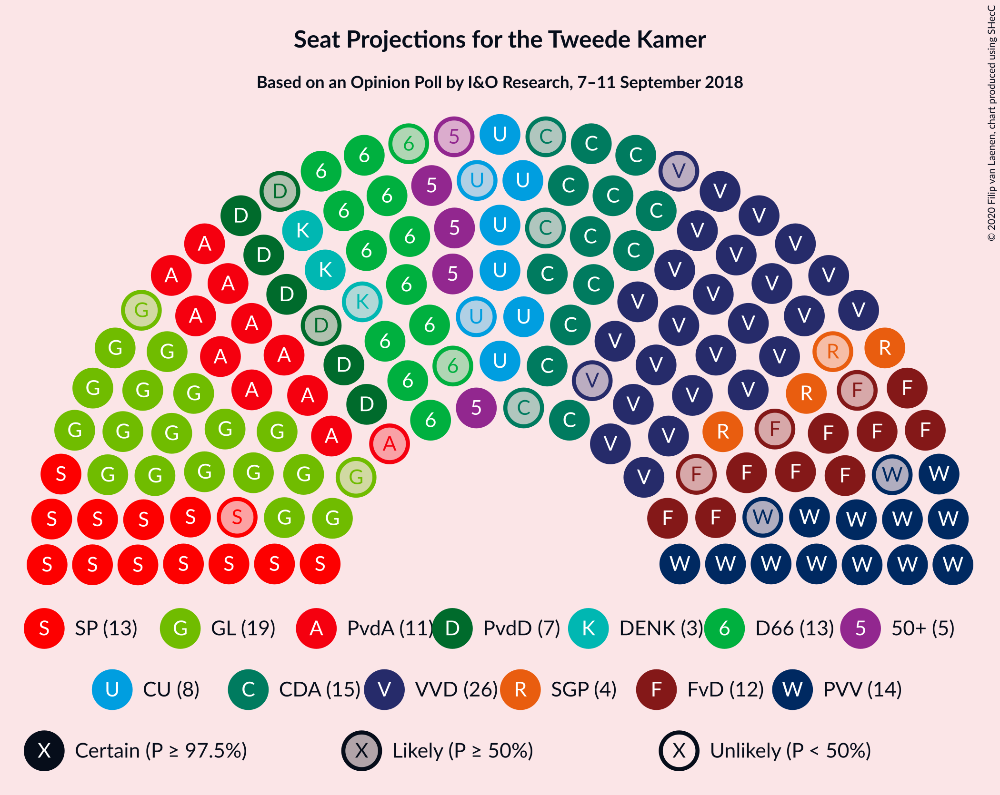

### Confidence Intervals

| Party | Last Result | Median | 80% Confidence Interval | 90% Confidence Interval | 95% Confidence Interval | 99% Confidence Interval |
|:-----:|:-----------:|:------:|:-----------------------:|:-----------------------:|:-----------------------:|:-----------------------:|
| <a href="#volkspartij-voor-vrijheid-en-democratie">Volkspartij voor Vrijheid en Democratie</a> | 33 | 26 | 25–26 |24–26 |24–27 |24–31 |
| <a href="#groenlinks">GroenLinks</a> | 14 | 19 | 19–21 |18–24 |17–24 |17–24 |
| <a href="#partij-voor-de-vrijheid">Partij voor de Vrijheid</a> | 20 | 14 | 13–15 |13–16 |13–16 |12–17 |
| <a href="#christen-democratisch-appèl">Christen-Democratisch Appèl</a> | 19 | 15 | 14–15 |13–15 |13–15 |13–17 |
| <a href="#democraten-66">Democraten 66</a> | 19 | 12 | 12–14 |12–15 |11–15 |11–15 |
| <a href="#socialistische-partij">Socialistische Partij</a> | 14 | 15 | 12–15 |12–16 |12–16 |11–18 |
| <a href="#forum-voor-democratie">Forum voor Democratie</a> | 2 | 14 | 12–14 |11–14 |10–14 |10–15 |
| <a href="#partij-van-de-arbeid">Partij van de Arbeid</a> | 9 | 11 | 10–11 |10–11 |10–13 |9–14 |
| <a href="#christenunie">ChristenUnie</a> | 5 | 6 | 6–7 |6–8 |6–9 |6–10 |
| <a href="#partij-voor-de-dieren">Partij voor de Dieren</a> | 5 | 6 | 6–7 |6–8 |5–8 |5–8 |
| <a href="#50plus">50Plus</a> | 4 | 5 | 5 |4–6 |4–7 |4–7 |
| <a href="#staatkundig-gereformeerde-partij">Staatkundig Gereformeerde Partij</a> | 3 | 4 | 3–4 |2–4 |2–4 |2–5 |
| <a href="#denk">DENK</a> | 3 | 3 | 2–3 |2–4 |2–4 |2–4 |

### Volkspartij voor Vrijheid en Democratie

*For a full overview of the results for this party, see the [Volkspartij voor Vrijheid en Democratie](party-volkspartijvoorvrijheidendemocratie.html) page.*

| Number of Seats | Probability | Accumulated | Special Marks |
|:---------------:|:-----------:|:-----------:|:-------------:|
| 22 | 0.2% | 100% |  |
| 23 | 0.2% | 99.8% |  |
| 24 | 7% | 99.6% |  |
| 25 | 6% | 92% |  |
| 26 | 83% | 86% | Median |
| 27 | 2% | 3% |  |
| 28 | 0.2% | 1.5% |  |
| 29 | 0.4% | 1.2% |  |
| 30 | 0.2% | 0.8% |  |
| 31 | 0.6% | 0.6% |  |
| 32 | 0% | 0% |  |
| 33 | 0% | 0% | Last Result |

### GroenLinks

*For a full overview of the results for this party, see the [GroenLinks](party-groenlinks.html) page.*

| Number of Seats | Probability | Accumulated | Special Marks |
|:---------------:|:-----------:|:-----------:|:-------------:|
| 14 | 0% | 100% | Last Result |
| 15 | 0% | 100% |  |
| 16 | 0.2% | 100% |  |
| 17 | 3% | 99.7% |  |
| 18 | 3% | 97% |  |
| 19 | 72% | 94% | Median |
| 20 | 5% | 23% |  |
| 21 | 8% | 18% |  |
| 22 | 0.6% | 9% |  |
| 23 | 2% | 9% |  |
| 24 | 7% | 7% |  |
| 25 | 0% | 0% |  |

### Partij voor de Vrijheid

*For a full overview of the results for this party, see the [Partij voor de Vrijheid](party-partijvoordevrijheid.html) page.*

| Number of Seats | Probability | Accumulated | Special Marks |
|:---------------:|:-----------:|:-----------:|:-------------:|
| 12 | 2% | 100% |  |
| 13 | 10% | 98% |  |
| 14 | 78% | 88% | Median |
| 15 | 4% | 10% |  |
| 16 | 5% | 6% |  |
| 17 | 0.3% | 0.6% |  |
| 18 | 0.3% | 0.3% |  |
| 19 | 0% | 0% |  |
| 20 | 0% | 0% | Last Result |

### Christen-Democratisch Appèl

*For a full overview of the results for this party, see the [Christen-Democratisch Appèl](party-christen-democratischappèl.html) page.*

| Number of Seats | Probability | Accumulated | Special Marks |
|:---------------:|:-----------:|:-----------:|:-------------:|
| 12 | 0.4% | 100% |  |
| 13 | 5% | 99.5% |  |
| 14 | 21% | 94% |  |
| 15 | 71% | 73% | Median |
| 16 | 1.4% | 2% |  |
| 17 | 0.5% | 0.8% |  |
| 18 | 0.3% | 0.3% |  |
| 19 | 0% | 0% | Last Result |

### Democraten 66

*For a full overview of the results for this party, see the [Democraten 66](party-democraten66.html) page.*

| Number of Seats | Probability | Accumulated | Special Marks |
|:---------------:|:-----------:|:-----------:|:-------------:|
| 11 | 4% | 100% |  |
| 12 | 69% | 96% | Median |
| 13 | 5% | 26% |  |
| 14 | 13% | 22% |  |
| 15 | 8% | 8% |  |
| 16 | 0.4% | 0.4% |  |
| 17 | 0% | 0% |  |
| 18 | 0% | 0% |  |
| 19 | 0% | 0% | Last Result |

### Socialistische Partij

*For a full overview of the results for this party, see the [Socialistische Partij](party-socialistischepartij.html) page.*

| Number of Seats | Probability | Accumulated | Special Marks |
|:---------------:|:-----------:|:-----------:|:-------------:|
| 10 | 0.2% | 100% |  |
| 11 | 0.4% | 99.8% |  |
| 12 | 10% | 99.3% |  |
| 13 | 4% | 89% |  |
| 14 | 8% | 85% | Last Result |
| 15 | 70% | 78% | Median |
| 16 | 6% | 8% |  |
| 17 | 0% | 2% |  |
| 18 | 2% | 2% |  |
| 19 | 0% | 0% |  |

### Forum voor Democratie

*For a full overview of the results for this party, see the [Forum voor Democratie](party-forumvoordemocratie.html) page.*

| Number of Seats | Probability | Accumulated | Special Marks |
|:---------------:|:-----------:|:-----------:|:-------------:|
| 2 | 0% | 100% | Last Result |
| 3 | 0% | 100% |  |
| 4 | 0% | 100% |  |
| 5 | 0% | 100% |  |
| 6 | 0% | 100% |  |
| 7 | 0% | 100% |  |
| 8 | 0% | 100% |  |
| 9 | 0.3% | 100% |  |
| 10 | 2% | 99.7% |  |
| 11 | 4% | 97% |  |
| 12 | 22% | 94% |  |
| 13 | 3% | 72% |  |
| 14 | 67% | 70% | Median |
| 15 | 2% | 2% |  |
| 16 | 0% | 0% |  |

### Partij van de Arbeid

*For a full overview of the results for this party, see the [Partij van de Arbeid](party-partijvandearbeid.html) page.*

| Number of Seats | Probability | Accumulated | Special Marks |
|:---------------:|:-----------:|:-----------:|:-------------:|
| 8 | 0.1% | 100% |  |
| 9 | 0.5% | 99.9% | Last Result |
| 10 | 17% | 99.4% |  |
| 11 | 79% | 83% | Median |
| 12 | 1.2% | 4% |  |
| 13 | 2% | 3% |  |
| 14 | 1.1% | 1.1% |  |
| 15 | 0% | 0% |  |

### ChristenUnie

*For a full overview of the results for this party, see the [ChristenUnie](party-christenunie.html) page.*

| Number of Seats | Probability | Accumulated | Special Marks |
|:---------------:|:-----------:|:-----------:|:-------------:|
| 5 | 0.3% | 100% | Last Result |
| 6 | 85% | 99.7% | Median |
| 7 | 6% | 15% |  |
| 8 | 5% | 9% |  |
| 9 | 2% | 3% |  |
| 10 | 1.4% | 1.4% |  |
| 11 | 0% | 0% |  |

### Partij voor de Dieren

*For a full overview of the results for this party, see the [Partij voor de Dieren](party-partijvoordedieren.html) page.*

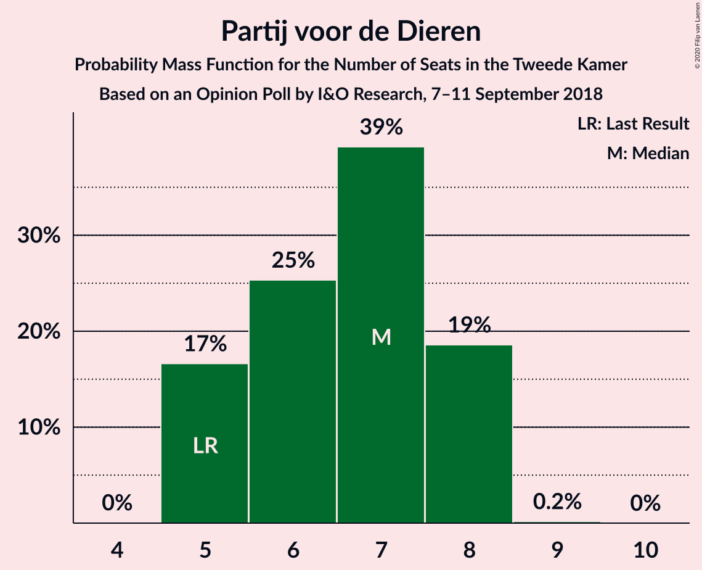

| Number of Seats | Probability | Accumulated | Special Marks |
|:---------------:|:-----------:|:-----------:|:-------------:|
| 4 | 0.1% | 100% |  |
| 5 | 3% | 99.9% | Last Result |
| 6 | 70% | 96% | Median |
| 7 | 17% | 26% |  |
| 8 | 9% | 9% |  |
| 9 | 0% | 0% |  |

### 50Plus

*For a full overview of the results for this party, see the [50Plus](party-50plus.html) page.*

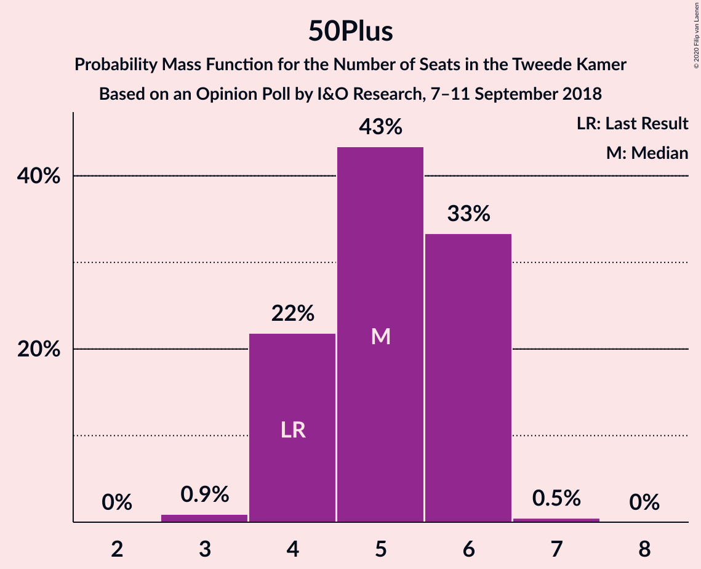

| Number of Seats | Probability | Accumulated | Special Marks |
|:---------------:|:-----------:|:-----------:|:-------------:|
| 3 | 0.1% | 100% |  |
| 4 | 8% | 99.9% | Last Result |
| 5 | 83% | 92% | Median |
| 6 | 6% | 9% |  |
| 7 | 3% | 3% |  |
| 8 | 0.1% | 0.1% |  |
| 9 | 0% | 0% |  |

### Staatkundig Gereformeerde Partij

*For a full overview of the results for this party, see the [Staatkundig Gereformeerde Partij](party-staatkundiggereformeerdepartij.html) page.*

| Number of Seats | Probability | Accumulated | Special Marks |
|:---------------:|:-----------:|:-----------:|:-------------:|
| 2 | 6% | 100% |  |
| 3 | 6% | 94% | Last Result |
| 4 | 86% | 88% | Median |
| 5 | 2% | 2% |  |
| 6 | 0% | 0% |  |

### DENK

*For a full overview of the results for this party, see the [DENK](party-denk.html) page.*

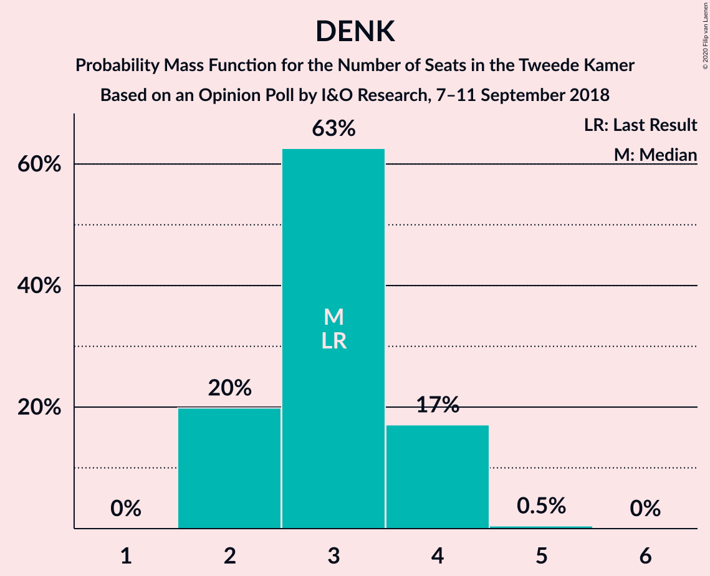

| Number of Seats | Probability | Accumulated | Special Marks |
|:---------------:|:-----------:|:-----------:|:-------------:|
| 1 | 0.1% | 100% |  |
| 2 | 11% | 99.9% |  |
| 3 | 83% | 89% | Last Result, Median |
| 4 | 6% | 6% |  |
| 5 | 0.1% | 0.1% |  |
| 6 | 0% | 0% |  |

## Coalitions

### Confidence Intervals

| Coalition | Last Result | Median | Majority? | 80% Confidence Interval | 90% Confidence Interval | 95% Confidence Interval | 99% Confidence Interval |
|:---------:|:-----------:|:------:|:---------:|:-----------------------:|:-----------------------:|:-----------------------:|:-----------------------:|
| Volkspartij voor Vrijheid en Democratie – GroenLinks – Christen-Democratisch Appèl – Democraten 66 – ChristenUnie | 90 | 78 | 99.9% | 78–84 | 77–84 | 76–84 | 76–85 |
| GroenLinks – Christen-Democratisch Appèl – Democraten 66 – Socialistische Partij – Partij van de Arbeid – ChristenUnie | 80 | 78 | 99.5% | 78–81 | 76–82 | 76–83 | 76–85 |
| Volkspartij voor Vrijheid en Democratie – Christen-Democratisch Appèl – Democraten 66 – Partij van de Arbeid – ChristenUnie | 85 | 70 | 3% | 70–72 | 67–74 | 66–76 | 66–79 |
| Volkspartij voor Vrijheid en Democratie – Partij voor de Vrijheid – Christen-Democratisch Appèl – Forum voor Democratie – Staatkundig Gereformeerde Partij | 77 | 73 | 0.4% | 68–73 | 68–73 | 66–73 | 64–75 |
| GroenLinks – Christen-Democratisch Appèl – Democraten 66 – Partij van de Arbeid – ChristenUnie | 66 | 63 | 0% | 63–68 | 62–69 | 62–69 | 62–70 |
| Volkspartij voor Vrijheid en Democratie – Partij voor de Vrijheid – Christen-Democratisch Appèl – Forum voor Democratie | 74 | 69 | 0% | 65–69 | 65–69 | 62–69 | 61–72 |
| Volkspartij voor Vrijheid en Democratie – Christen-Democratisch Appèl – Democraten 66 – ChristenUnie | 76 | 59 | 0% | 59–61 | 57–63 | 56–65 | 56–67 |
| Volkspartij voor Vrijheid en Democratie – Christen-Democratisch Appèl – Forum voor Democratie – 50Plus – Staatkundig Gereformeerde Partij | 61 | 64 | 0% | 59–64 | 58–64 | 58–64 | 57–66 |
| Volkspartij voor Vrijheid en Democratie – Christen-Democratisch Appèl – Forum voor Democratie – 50Plus | 58 | 60 | 0% | 56–60 | 56–60 | 55–60 | 54–63 |
| Volkspartij voor Vrijheid en Democratie – Christen-Democratisch Appèl – Forum voor Democratie – Staatkundig Gereformeerde Partij | 57 | 59 | 0% | 54–59 | 54–59 | 52–59 | 52–61 |
| Volkspartij voor Vrijheid en Democratie – Partij voor de Vrijheid – Christen-Democratisch Appèl | 72 | 55 | 0% | 53–55 | 53–55 | 51–56 | 51–59 |
| Volkspartij voor Vrijheid en Democratie – Christen-Democratisch Appèl – Democraten 66 | 71 | 53 | 0% | 52–55 | 51–55 | 49–56 | 49–59 |
| Volkspartij voor Vrijheid en Democratie – Christen-Democratisch Appèl – Forum voor Democratie | 54 | 55 | 0% | 51–55 | 50–55 | 49–55 | 48–58 |
| Volkspartij voor Vrijheid en Democratie – Christen-Democratisch Appèl – Partij van de Arbeid | 61 | 52 | 0% | 49–52 | 48–53 | 48–54 | 47–57 |
| Volkspartij voor Vrijheid en Democratie – Democraten 66 – Partij van de Arbeid | 61 | 49 | 0% | 49–51 | 47–51 | 45–52 | 45–57 |
| Volkspartij voor Vrijheid en Democratie – Christen-Democratisch Appèl | 52 | 41 | 0% | 39–41 | 38–41 | 37–42 | 37–45 |
| Christen-Democratisch Appèl – Democraten 66 – Partij van de Arbeid | 47 | 38 | 0% | 38–39 | 37–40 | 35–40 | 35–42 |
| Volkspartij voor Vrijheid en Democratie – Partij van de Arbeid | 42 | 37 | 0% | 35–37 | 34–37 | 34–40 | 34–43 |
| Christen-Democratisch Appèl – Partij van de Arbeid – ChristenUnie | 33 | 32 | 0% | 30–32 | 30–34 | 29–35 | 29–37 |
| Christen-Democratisch Appèl – Democraten 66 | 38 | 27 | 0% | 27–28 | 26–29 | 25–29 | 25–31 |
| Christen-Democratisch Appèl – Partij van de Arbeid | 28 | 26 | 0% | 24–26 | 23–26 | 23–27 | 23–29 |

### Volkspartij voor Vrijheid en Democratie – GroenLinks – Christen-Democratisch Appèl – Democraten 66 – ChristenUnie

| Number of Seats | Probability | Accumulated | Special Marks |
|:---------------:|:-----------:|:-----------:|:-------------:|
| 75 | 0% | 100% |  |
| 76 | 4% | 99.9% | Majority |
| 77 | 3% | 95% |  |
| 78 | 69% | 93% | Median |
| 79 | 3% | 24% |  |
| 80 | 1.1% | 21% |  |
| 81 | 0.8% | 20% |  |
| 82 | 8% | 19% |  |
| 83 | 0.3% | 10% |  |
| 84 | 9% | 10% |  |
| 85 | 0.7% | 0.9% |  |
| 86 | 0.1% | 0.1% |  |
| 87 | 0% | 0% |  |
| 88 | 0% | 0% |  |
| 89 | 0% | 0% |  |
| 90 | 0% | 0% | Last Result |

### GroenLinks – Christen-Democratisch Appèl – Democraten 66 – Socialistische Partij – Partij van de Arbeid – ChristenUnie

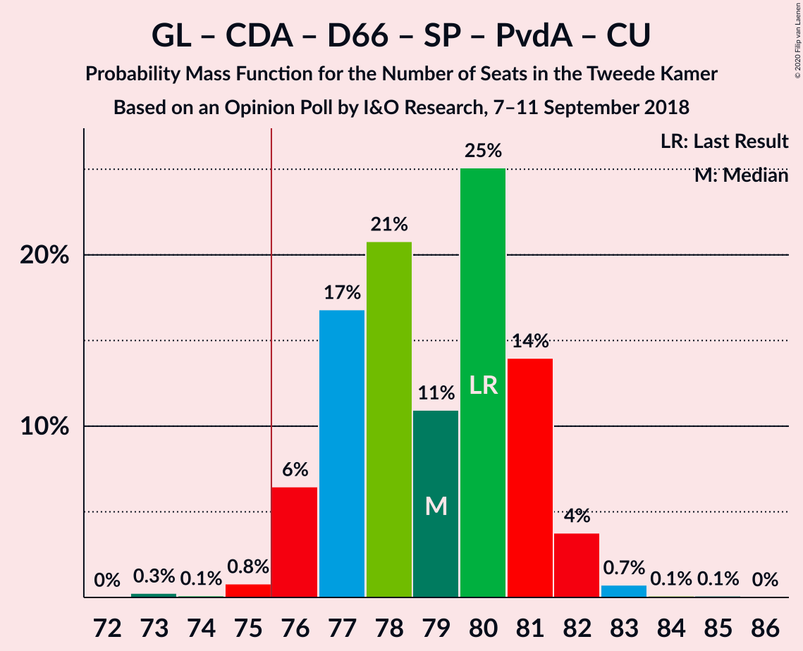

| Number of Seats | Probability | Accumulated | Special Marks |
|:---------------:|:-----------:|:-----------:|:-------------:|
| 73 | 0% | 100% |  |
| 74 | 0.1% | 99.9% |  |
| 75 | 0.3% | 99.8% |  |
| 76 | 7% | 99.5% | Majority |
| 77 | 0.8% | 92% |  |
| 78 | 67% | 92% | Median |
| 79 | 4% | 24% |  |
| 80 | 3% | 21% | Last Result |
| 81 | 8% | 18% |  |
| 82 | 7% | 10% |  |
| 83 | 2% | 3% |  |
| 84 | 0% | 0.7% |  |
| 85 | 0.7% | 0.7% |  |
| 86 | 0% | 0% |  |

### Volkspartij voor Vrijheid en Democratie – Christen-Democratisch Appèl – Democraten 66 – Partij van de Arbeid – ChristenUnie

| Number of Seats | Probability | Accumulated | Special Marks |
|:---------------:|:-----------:|:-----------:|:-------------:|
| 66 | 4% | 100% |  |
| 67 | 2% | 96% |  |
| 68 | 3% | 94% |  |
| 69 | 0.3% | 91% |  |
| 70 | 68% | 91% | Median |
| 71 | 13% | 23% |  |
| 72 | 4% | 10% |  |
| 73 | 0.4% | 6% |  |
| 74 | 0.8% | 6% |  |
| 75 | 2% | 5% |  |
| 76 | 2% | 3% | Majority |
| 77 | 0.4% | 1.2% |  |
| 78 | 0% | 0.8% |  |
| 79 | 0.8% | 0.8% |  |
| 80 | 0% | 0% |  |
| 81 | 0% | 0% |  |
| 82 | 0% | 0% |  |
| 83 | 0% | 0% |  |
| 84 | 0% | 0% |  |
| 85 | 0% | 0% | Last Result |

### Volkspartij voor Vrijheid en Democratie – Partij voor de Vrijheid – Christen-Democratisch Appèl – Forum voor Democratie – Staatkundig Gereformeerde Partij

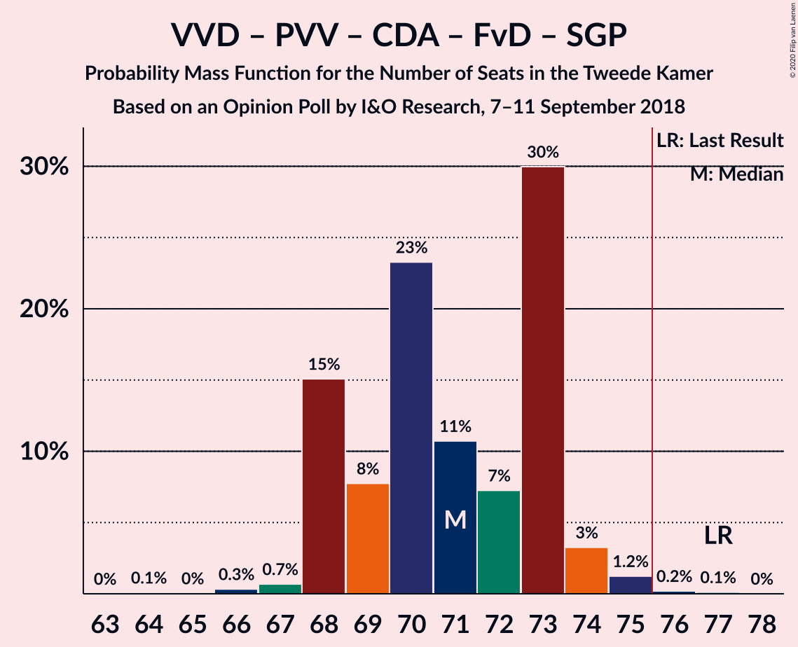

| Number of Seats | Probability | Accumulated | Special Marks |
|:---------------:|:-----------:|:-----------:|:-------------:|
| 64 | 0.7% | 100% |  |
| 65 | 0.1% | 99.3% |  |
| 66 | 2% | 99.3% |  |
| 67 | 1.0% | 97% |  |
| 68 | 8% | 96% |  |
| 69 | 10% | 88% |  |
| 70 | 5% | 79% |  |
| 71 | 0.7% | 73% |  |
| 72 | 4% | 73% |  |
| 73 | 67% | 68% | Median |
| 74 | 0.5% | 2% |  |
| 75 | 0.7% | 1.0% |  |
| 76 | 0.1% | 0.4% | Majority |
| 77 | 0.2% | 0.3% | Last Result |
| 78 | 0% | 0% |  |

### GroenLinks – Christen-Democratisch Appèl – Democraten 66 – Partij van de Arbeid – ChristenUnie

| Number of Seats | Probability | Accumulated | Special Marks |
|:---------------:|:-----------:|:-----------:|:-------------:|
| 60 | 0.1% | 100% |  |
| 61 | 0% | 99.9% |  |
| 62 | 7% | 99.9% |  |
| 63 | 67% | 93% | Median |
| 64 | 2% | 26% |  |
| 65 | 3% | 24% |  |
| 66 | 7% | 20% | Last Result |
| 67 | 2% | 13% |  |
| 68 | 2% | 11% |  |
| 69 | 8% | 9% |  |
| 70 | 0.7% | 0.8% |  |
| 71 | 0.1% | 0.1% |  |
| 72 | 0% | 0% |  |

### Volkspartij voor Vrijheid en Democratie – Partij voor de Vrijheid – Christen-Democratisch Appèl – Forum voor Democratie

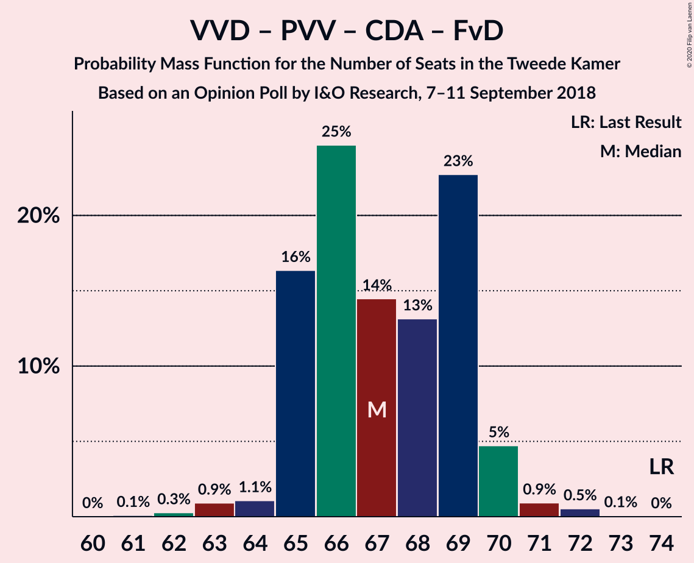

| Number of Seats | Probability | Accumulated | Special Marks |
|:---------------:|:-----------:|:-----------:|:-------------:|
| 61 | 0.7% | 100% |  |
| 62 | 2% | 99.3% |  |
| 63 | 0.9% | 97% |  |
| 64 | 1.1% | 96% |  |
| 65 | 10% | 95% |  |
| 66 | 12% | 86% |  |
| 67 | 0.4% | 74% |  |
| 68 | 5% | 74% |  |
| 69 | 67% | 68% | Median |
| 70 | 0.2% | 1.3% |  |
| 71 | 0.1% | 1.1% |  |
| 72 | 0.9% | 1.0% |  |
| 73 | 0.1% | 0.1% |  |
| 74 | 0% | 0% | Last Result |

### Volkspartij voor Vrijheid en Democratie – Christen-Democratisch Appèl – Democraten 66 – ChristenUnie

| Number of Seats | Probability | Accumulated | Special Marks |
|:---------------:|:-----------:|:-----------:|:-------------:|
| 56 | 5% | 100% |  |
| 57 | 2% | 95% |  |
| 58 | 3% | 93% |  |
| 59 | 68% | 91% | Median |
| 60 | 8% | 23% |  |
| 61 | 9% | 15% |  |
| 62 | 0.9% | 6% |  |
| 63 | 2% | 5% |  |
| 64 | 0.4% | 3% |  |
| 65 | 1.5% | 3% |  |
| 66 | 0.1% | 1.1% |  |
| 67 | 1.0% | 1.0% |  |
| 68 | 0% | 0% |  |
| 69 | 0% | 0% |  |
| 70 | 0% | 0% |  |
| 71 | 0% | 0% |  |
| 72 | 0% | 0% |  |
| 73 | 0% | 0% |  |
| 74 | 0% | 0% |  |
| 75 | 0% | 0% |  |
| 76 | 0% | 0% | Last Result, Majority |

### Volkspartij voor Vrijheid en Democratie – Christen-Democratisch Appèl – Forum voor Democratie – 50Plus – Staatkundig Gereformeerde Partij

| Number of Seats | Probability | Accumulated | Special Marks |
|:---------------:|:-----------:|:-----------:|:-------------:|
| 55 | 0% | 100% |  |
| 56 | 0% | 99.9% |  |
| 57 | 0.9% | 99.9% |  |
| 58 | 6% | 99.0% |  |
| 59 | 4% | 93% |  |
| 60 | 7% | 89% |  |
| 61 | 9% | 83% | Last Result |
| 62 | 6% | 74% |  |
| 63 | 0.3% | 68% |  |
| 64 | 67% | 68% | Median |
| 65 | 0.1% | 1.0% |  |
| 66 | 0.7% | 0.9% |  |
| 67 | 0% | 0.2% |  |
| 68 | 0.2% | 0.2% |  |
| 69 | 0% | 0% |  |

### Volkspartij voor Vrijheid en Democratie – Christen-Democratisch Appèl – Forum voor Democratie – 50Plus

| Number of Seats | Probability | Accumulated | Special Marks |
|:---------------:|:-----------:|:-----------:|:-------------:|
| 52 | 0.1% | 100% |  |
| 53 | 0% | 99.8% |  |
| 54 | 1.3% | 99.8% |  |
| 55 | 3% | 98.5% |  |
| 56 | 11% | 96% |  |
| 57 | 10% | 85% |  |
| 58 | 5% | 75% | Last Result |
| 59 | 1.3% | 69% |  |
| 60 | 67% | 68% | Median |
| 61 | 0.2% | 1.1% |  |
| 62 | 0% | 0.9% |  |
| 63 | 0.8% | 0.8% |  |
| 64 | 0% | 0% |  |

### Volkspartij voor Vrijheid en Democratie – Christen-Democratisch Appèl – Forum voor Democratie – Staatkundig Gereformeerde Partij

| Number of Seats | Probability | Accumulated | Special Marks |
|:---------------:|:-----------:|:-----------:|:-------------:|
| 50 | 0.1% | 100% |  |
| 51 | 0.1% | 99.9% |  |
| 52 | 3% | 99.9% |  |
| 53 | 0.3% | 97% |  |
| 54 | 12% | 97% |  |
| 55 | 3% | 85% |  |
| 56 | 9% | 82% |  |
| 57 | 3% | 73% | Last Result |
| 58 | 2% | 70% |  |
| 59 | 67% | 68% | Median |
| 60 | 0.1% | 1.1% |  |
| 61 | 0.7% | 0.9% |  |
| 62 | 0% | 0.2% |  |
| 63 | 0.2% | 0.2% |  |
| 64 | 0% | 0% |  |

### Volkspartij voor Vrijheid en Democratie – Partij voor de Vrijheid – Christen-Democratisch Appèl

| Number of Seats | Probability | Accumulated | Special Marks |
|:---------------:|:-----------:|:-----------:|:-------------:|
| 49 | 0.3% | 100% |  |
| 50 | 0.1% | 99.7% |  |
| 51 | 3% | 99.7% |  |
| 52 | 2% | 97% |  |
| 53 | 12% | 95% |  |
| 54 | 10% | 84% |  |
| 55 | 69% | 73% | Median |
| 56 | 3% | 5% |  |
| 57 | 0.4% | 2% |  |
| 58 | 0.4% | 2% |  |
| 59 | 0.8% | 1.2% |  |
| 60 | 0.1% | 0.3% |  |
| 61 | 0.3% | 0.3% |  |
| 62 | 0% | 0% |  |
| 63 | 0% | 0% |  |
| 64 | 0% | 0% |  |
| 65 | 0% | 0% |  |
| 66 | 0% | 0% |  |
| 67 | 0% | 0% |  |
| 68 | 0% | 0% |  |
| 69 | 0% | 0% |  |
| 70 | 0% | 0% |  |
| 71 | 0% | 0% |  |
| 72 | 0% | 0% | Last Result |

### Volkspartij voor Vrijheid en Democratie – Christen-Democratisch Appèl – Democraten 66

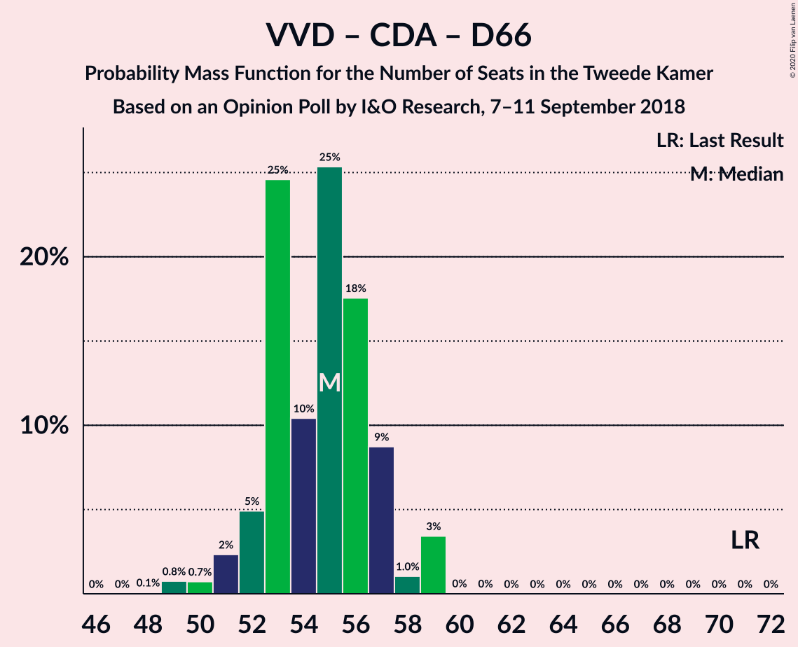

| Number of Seats | Probability | Accumulated | Special Marks |
|:---------------:|:-----------:|:-----------:|:-------------:|
| 49 | 4% | 100% |  |
| 50 | 0.3% | 95% |  |
| 51 | 3% | 95% |  |
| 52 | 3% | 92% |  |
| 53 | 71% | 90% | Median |
| 54 | 8% | 18% |  |
| 55 | 7% | 10% |  |
| 56 | 2% | 3% |  |
| 57 | 0.4% | 2% |  |
| 58 | 0.3% | 1.1% |  |
| 59 | 0.6% | 0.8% |  |
| 60 | 0% | 0.2% |  |
| 61 | 0.2% | 0.2% |  |
| 62 | 0% | 0% |  |
| 63 | 0% | 0% |  |
| 64 | 0% | 0% |  |
| 65 | 0% | 0% |  |
| 66 | 0% | 0% |  |
| 67 | 0% | 0% |  |
| 68 | 0% | 0% |  |
| 69 | 0% | 0% |  |
| 70 | 0% | 0% |  |
| 71 | 0% | 0% | Last Result |

### Volkspartij voor Vrijheid en Democratie – Christen-Democratisch Appèl – Forum voor Democratie

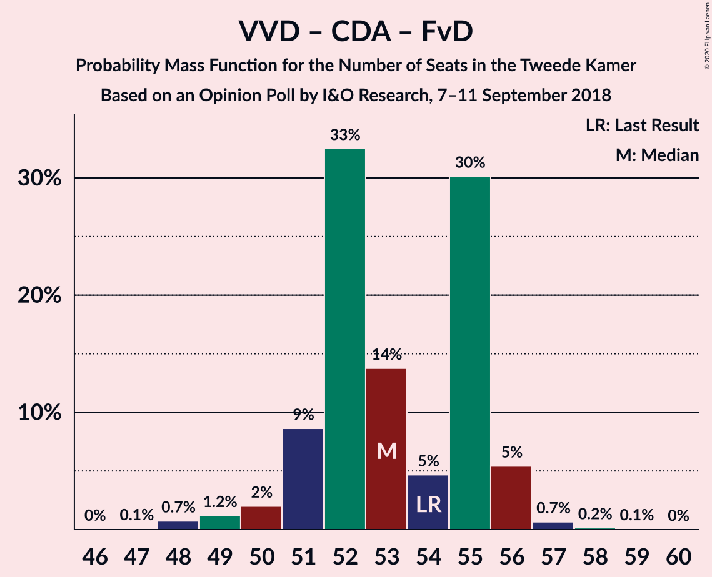

| Number of Seats | Probability | Accumulated | Special Marks |
|:---------------:|:-----------:|:-----------:|:-------------:|
| 47 | 0.1% | 100% |  |
| 48 | 2% | 99.9% |  |
| 49 | 1.1% | 98% |  |
| 50 | 5% | 97% |  |
| 51 | 3% | 92% |  |
| 52 | 15% | 89% |  |
| 53 | 3% | 74% |  |
| 54 | 3% | 71% | Last Result |
| 55 | 67% | 68% | Median |
| 56 | 0.1% | 1.1% |  |
| 57 | 0.1% | 0.9% |  |
| 58 | 0.8% | 0.8% |  |
| 59 | 0% | 0% |  |

### Volkspartij voor Vrijheid en Democratie – Christen-Democratisch Appèl – Partij van de Arbeid

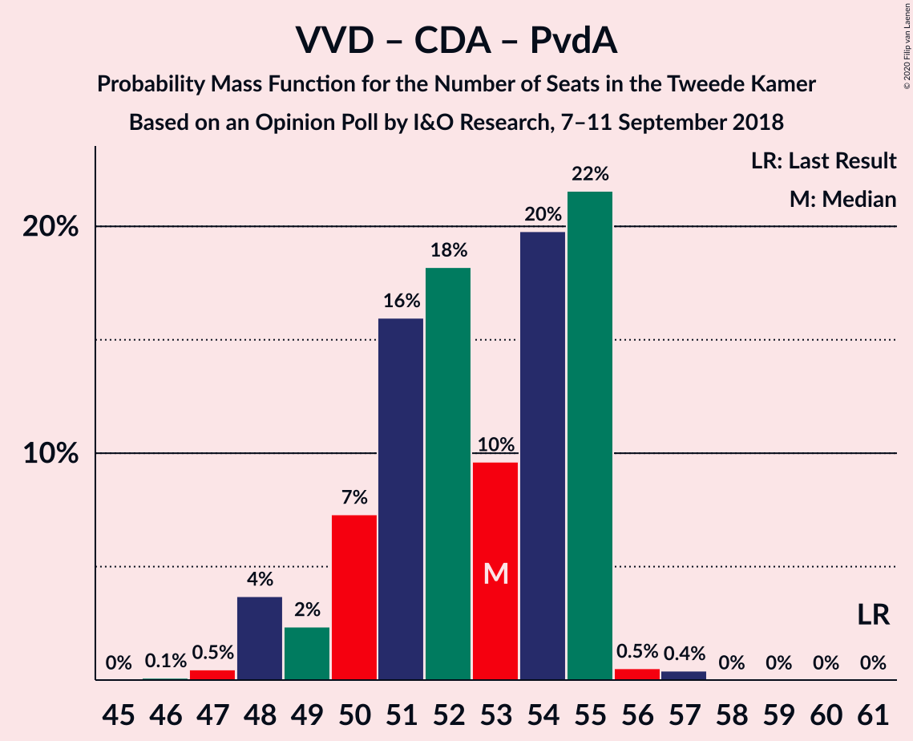

| Number of Seats | Probability | Accumulated | Special Marks |
|:---------------:|:-----------:|:-----------:|:-------------:|
| 46 | 0.2% | 100% |  |
| 47 | 2% | 99.7% |  |
| 48 | 7% | 98% |  |
| 49 | 1.1% | 91% |  |
| 50 | 6% | 90% |  |
| 51 | 11% | 83% |  |
| 52 | 67% | 72% | Median |
| 53 | 1.4% | 5% |  |
| 54 | 2% | 4% |  |
| 55 | 0.1% | 1.4% |  |
| 56 | 0.2% | 1.3% |  |
| 57 | 1.0% | 1.1% |  |
| 58 | 0% | 0% |  |
| 59 | 0% | 0% |  |
| 60 | 0% | 0% |  |
| 61 | 0% | 0% | Last Result |

### Volkspartij voor Vrijheid en Democratie – Democraten 66 – Partij van de Arbeid

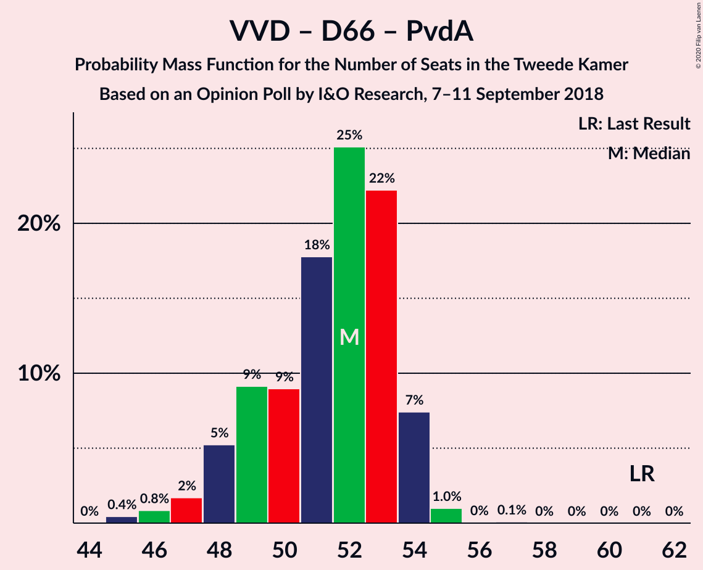

| Number of Seats | Probability | Accumulated | Special Marks |
|:---------------:|:-----------:|:-----------:|:-------------:|
| 45 | 4% | 100% |  |
| 46 | 0% | 96% |  |
| 47 | 1.2% | 96% |  |
| 48 | 2% | 94% |  |
| 49 | 72% | 92% | Median |
| 50 | 2% | 21% |  |
| 51 | 14% | 19% |  |
| 52 | 2% | 4% |  |
| 53 | 1.1% | 2% |  |
| 54 | 0.3% | 1.2% |  |
| 55 | 0% | 0.9% |  |
| 56 | 0% | 0.9% |  |
| 57 | 0.9% | 0.9% |  |
| 58 | 0% | 0% |  |
| 59 | 0% | 0% |  |
| 60 | 0% | 0% |  |
| 61 | 0% | 0% | Last Result |

### Volkspartij voor Vrijheid en Democratie – Christen-Democratisch Appèl

| Number of Seats | Probability | Accumulated | Special Marks |
|:---------------:|:-----------:|:-----------:|:-------------:|
| 35 | 0.2% | 100% |  |
| 36 | 0.2% | 99.8% |  |
| 37 | 2% | 99.7% |  |
| 38 | 7% | 97% |  |
| 39 | 2% | 90% |  |
| 40 | 16% | 89% |  |
| 41 | 70% | 73% | Median |
| 42 | 2% | 3% |  |
| 43 | 0.5% | 2% |  |
| 44 | 0.1% | 1.1% |  |
| 45 | 0.8% | 1.0% |  |
| 46 | 0% | 0.2% |  |
| 47 | 0.2% | 0.2% |  |
| 48 | 0% | 0% |  |
| 49 | 0% | 0% |  |
| 50 | 0% | 0% |  |
| 51 | 0% | 0% |  |
| 52 | 0% | 0% | Last Result |

### Christen-Democratisch Appèl – Democraten 66 – Partij van de Arbeid

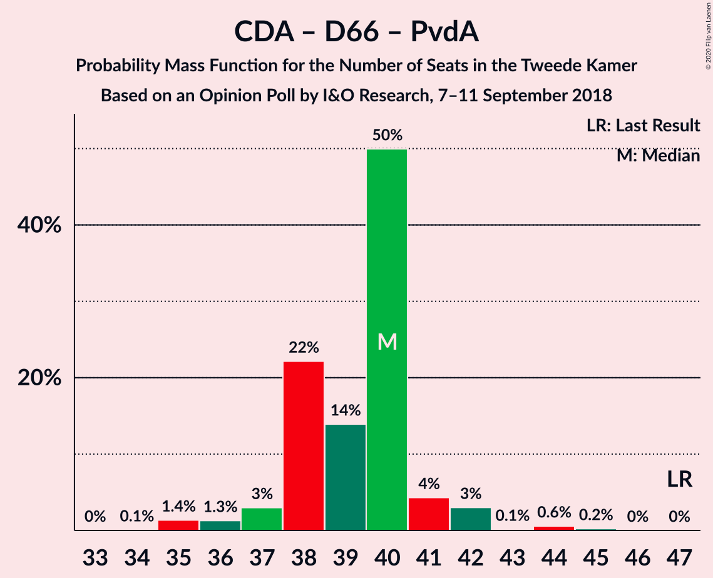

| Number of Seats | Probability | Accumulated | Special Marks |
|:---------------:|:-----------:|:-----------:|:-------------:|
| 34 | 0.1% | 100% |  |
| 35 | 4% | 99.9% |  |
| 36 | 0.3% | 96% |  |
| 37 | 5% | 95% |  |
| 38 | 68% | 91% | Median |
| 39 | 17% | 22% |  |
| 40 | 3% | 5% |  |
| 41 | 1.3% | 2% |  |
| 42 | 0.3% | 0.7% |  |
| 43 | 0.3% | 0.4% |  |
| 44 | 0% | 0.1% |  |
| 45 | 0% | 0.1% |  |
| 46 | 0.1% | 0.1% |  |
| 47 | 0% | 0% | Last Result |

### Volkspartij voor Vrijheid en Democratie – Partij van de Arbeid

| Number of Seats | Probability | Accumulated | Special Marks |
|:---------------:|:-----------:|:-----------:|:-------------:|
| 33 | 0.3% | 100% |  |
| 34 | 7% | 99.7% |  |
| 35 | 4% | 93% |  |
| 36 | 9% | 89% |  |
| 37 | 76% | 80% | Median |
| 38 | 0.5% | 4% |  |
| 39 | 0.4% | 4% |  |
| 40 | 2% | 3% |  |
| 41 | 0% | 0.9% |  |
| 42 | 0% | 0.9% | Last Result |
| 43 | 0.9% | 0.9% |  |
| 44 | 0% | 0% |  |

### Christen-Democratisch Appèl – Partij van de Arbeid – ChristenUnie

| Number of Seats | Probability | Accumulated | Special Marks |
|:---------------:|:-----------:|:-----------:|:-------------:|
| 29 | 4% | 100% |  |
| 30 | 6% | 96% |  |
| 31 | 12% | 90% |  |
| 32 | 68% | 78% | Median |
| 33 | 1.4% | 10% | Last Result |
| 34 | 5% | 8% |  |
| 35 | 1.2% | 3% |  |
| 36 | 0.1% | 2% |  |
| 37 | 1.4% | 2% |  |
| 38 | 0.2% | 0.3% |  |
| 39 | 0.2% | 0.2% |  |
| 40 | 0% | 0% |  |

### Christen-Democratisch Appèl – Democraten 66

| Number of Seats | Probability | Accumulated | Special Marks |
|:---------------:|:-----------:|:-----------:|:-------------:|
| 25 | 5% | 100% |  |
| 26 | 2% | 95% |  |
| 27 | 73% | 94% | Median |
| 28 | 11% | 21% |  |
| 29 | 7% | 10% |  |
| 30 | 2% | 2% |  |
| 31 | 0.6% | 0.8% |  |
| 32 | 0.2% | 0.2% |  |
| 33 | 0% | 0% |  |
| 34 | 0% | 0% |  |
| 35 | 0% | 0% |  |
| 36 | 0% | 0% |  |
| 37 | 0% | 0% |  |
| 38 | 0% | 0% | Last Result |

### Christen-Democratisch Appèl – Partij van de Arbeid

| Number of Seats | Probability | Accumulated | Special Marks |
|:---------------:|:-----------:|:-----------:|:-------------:|
| 22 | 0.1% | 100% |  |
| 23 | 5% | 99.8% |  |
| 24 | 11% | 95% |  |
| 25 | 9% | 84% |  |
| 26 | 71% | 75% | Median |
| 27 | 3% | 4% |  |
| 28 | 1.1% | 2% | Last Result |
| 29 | 0.3% | 0.5% |  |
| 30 | 0.2% | 0.3% |  |
| 31 | 0% | 0% |  |

## Technical Information

### Opinion Poll

+ **Polling firm:** I&O Research
+ **Commissioner(s):** —
+ **Fieldwork period:** 7–11 September 2018

### Calculations

+ **Sample size:** 1988
+ **Simulations done:** 131,072
+ **Error estimate:** 1.63%

