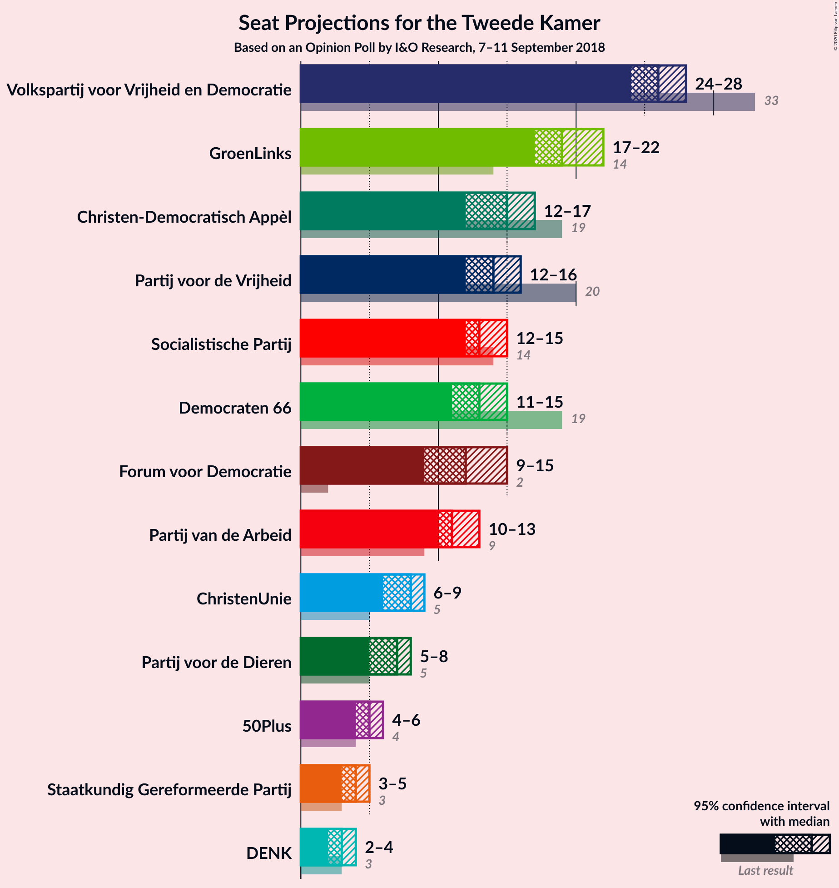
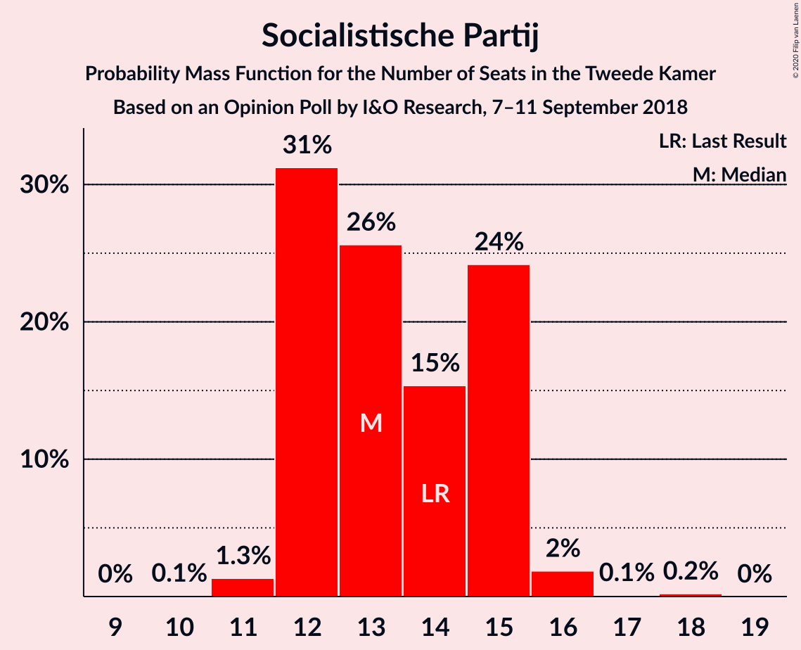
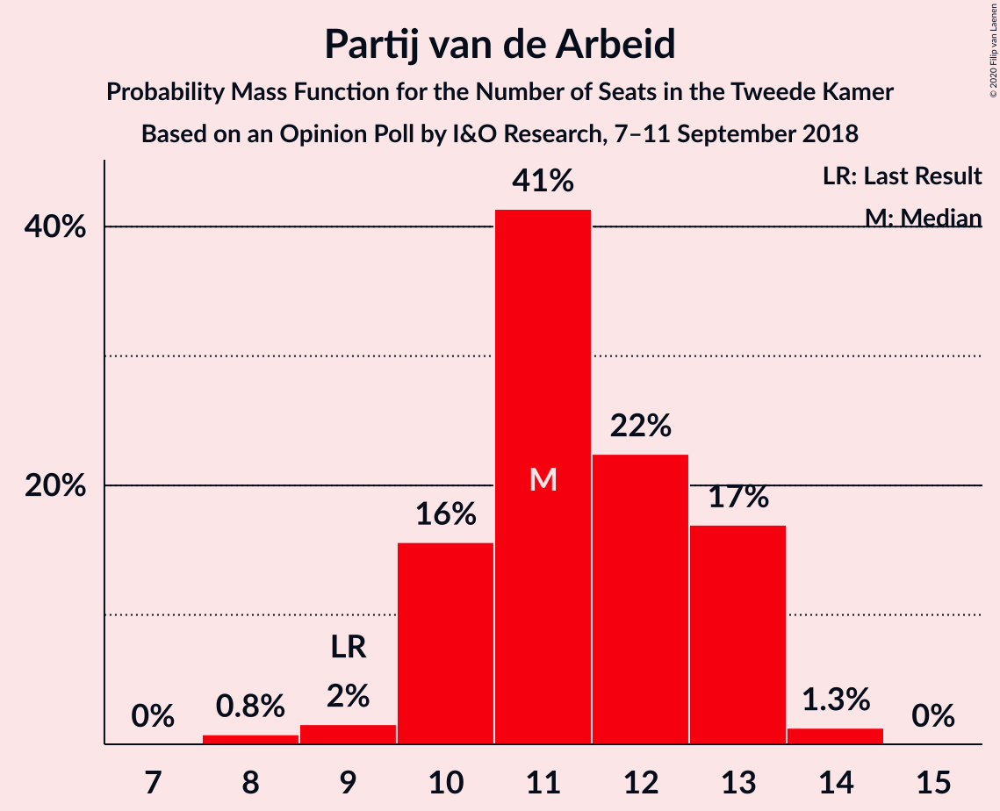
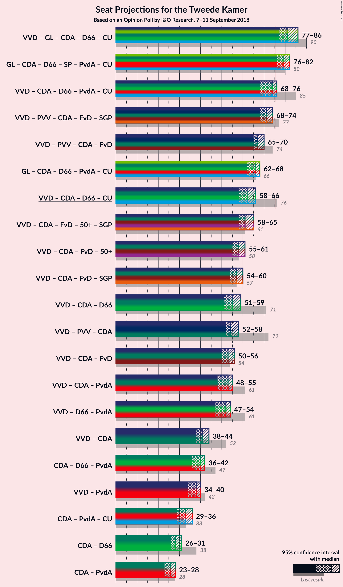
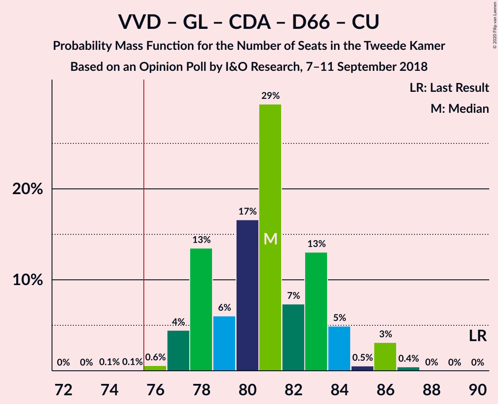
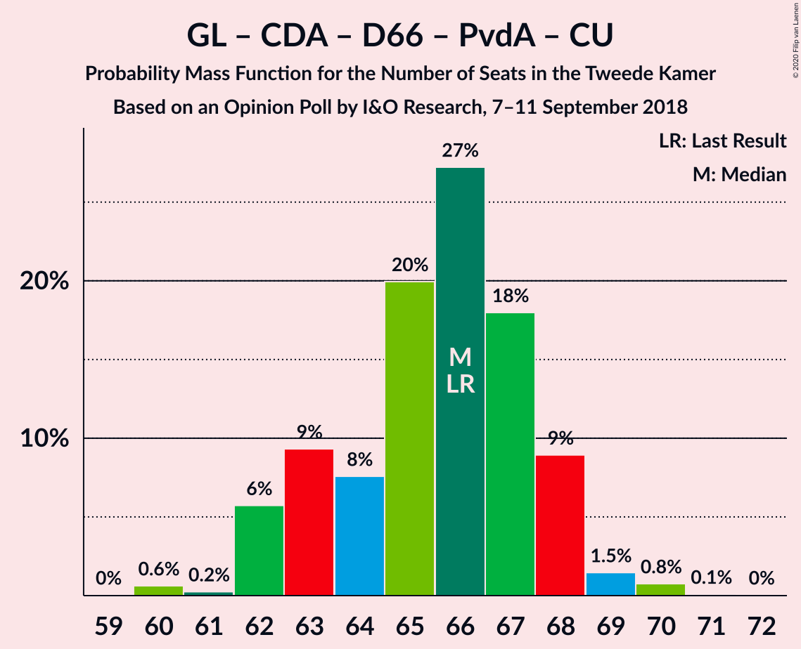
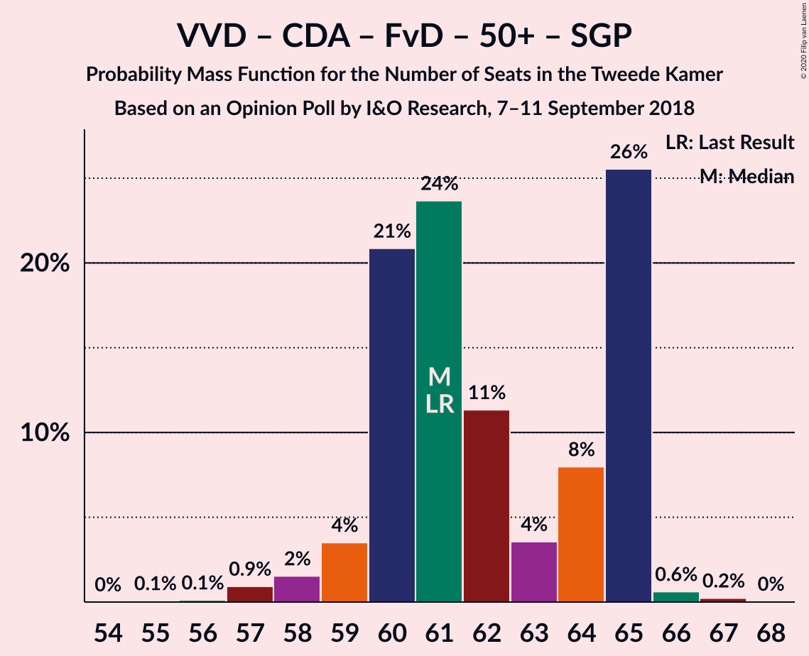
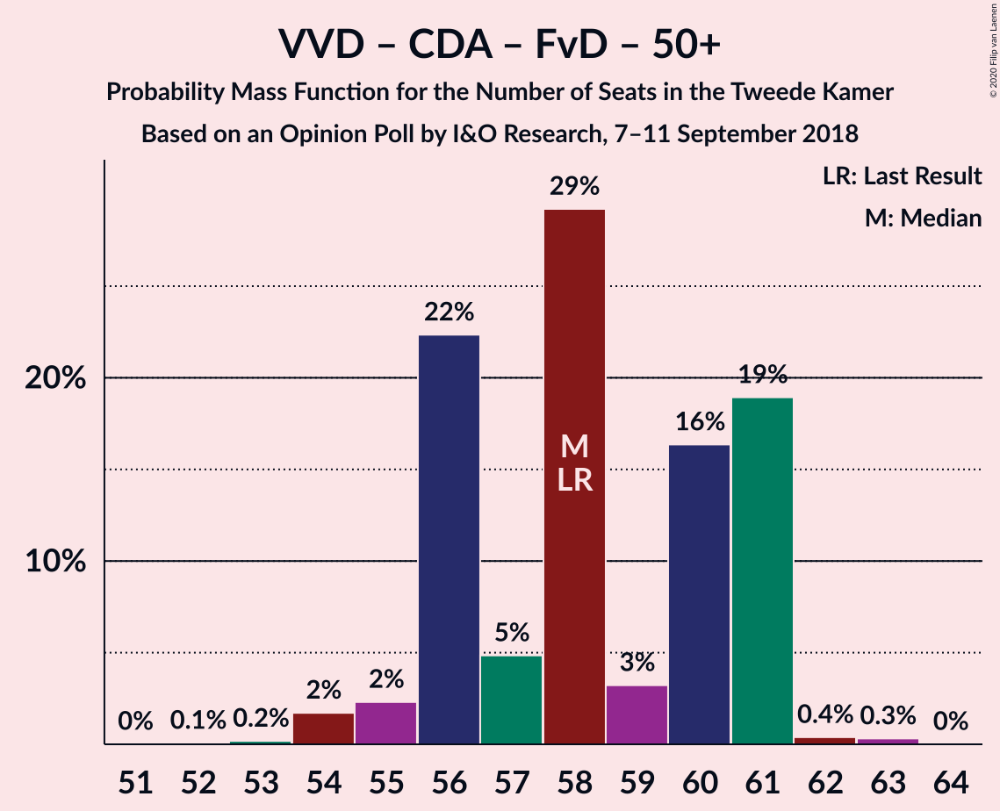
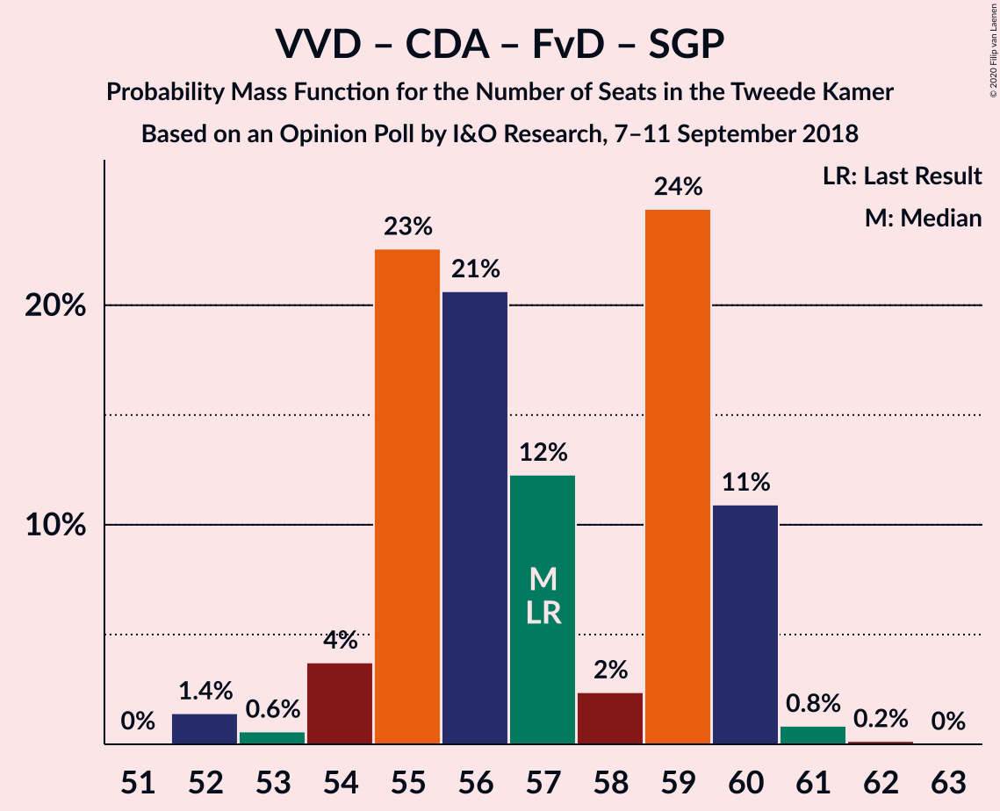

# Opinion Poll by I&O Research, 7–11 September 2018

<a href="#voting-intentions">Voting Intentions</a> | <a href="#seats">Seats</a> | <a href="#coalitions">Coalitions</a> | <a href="#technical-information">Technical Information</a>

## Voting Intentions

### Confidence Intervals

| Party | Last Result | Poll Result | 80% Confidence Interval | 90% Confidence Interval | 95% Confidence Interval | 99% Confidence Interval |
|:-----:|:-----------:|:-----------:|:-----------------------:|:-----------------------:|:-----------------------:|:-----------------------:|
| Volkspartij voor Vrijheid en Democratie | 21.3% | 17.1% | 16.0–18.2% |15.7–18.5% |15.5–18.8% |15.0–19.3% |
| GroenLinks | 9.1% | 12.7% | 11.8–13.7% |11.5–14.0% |11.3–14.2% |10.9–14.7% |
| Partij voor de Vrijheid | 13.1% | 9.7% | 8.9–10.6% |8.6–10.8% |8.4–11.1% |8.1–11.5% |
| Christen-Democratisch Appèl | 12.4% | 9.6% | 8.7–10.5% |8.5–10.7% |8.3–10.9% |8.0–11.4% |
| Democraten 66 | 12.2% | 8.9% | 8.1–9.7% |7.9–10.0% |7.7–10.2% |7.3–10.6% |
| Socialistische Partij | 9.1% | 8.9% | 8.1–9.7% |7.9–10.0% |7.7–10.2% |7.3–10.6% |
| Forum voor Democratie | 1.8% | 8.0% | 7.3–8.8% |7.1–9.1% |6.9–9.3% |6.5–9.7% |
| Partij van de Arbeid | 5.7% | 7.4% | 6.7–8.2% |6.5–8.4% |6.3–8.6% |6.0–9.0% |
| ChristenUnie | 3.4% | 4.9% | 4.3–5.6% |4.1–5.8% |4.0–5.9% |3.7–6.3% |
| Partij voor de Dieren | 3.2% | 4.4% | 3.8–5.0% |3.7–5.2% |3.6–5.4% |3.3–5.7% |
| 50Plus | 3.1% | 3.4% | 2.9–4.0% |2.8–4.1% |2.7–4.3% |2.5–4.6% |
| Staatkundig Gereformeerde Partij | 2.1% | 2.7% | 2.3–3.2% |2.2–3.4% |2.1–3.5% |1.9–3.8% |
| DENK | 2.1% | 2.2% | 1.8–2.7% |1.7–2.9% |1.6–3.0% |1.5–3.2% |

*Note:* The poll result column reflects the actual value used in the calculations. Published results may vary slightly, and in addition be rounded to fewer digits.

## Seats

### Confidence Intervals

| Party | Last Result | Median | 80% Confidence Interval | 90% Confidence Interval | 95% Confidence Interval | 99% Confidence Interval |
|:-----:|:-----------:|:------:|:-----------------------:|:-----------------------:|:-----------------------:|:-----------------------:|
| <a href="#volkspartij-voor-vrijheid-en-democratie">Volkspartij voor Vrijheid en Democratie</a> | 33 | 26 | 25–28 |24–28 |24–28 |23–30 |
| <a href="#groenlinks">GroenLinks</a> | 14 | 19 | 17–20 |17–22 |17–22 |16–24 |
| <a href="#partij-voor-de-vrijheid">Partij voor de Vrijheid</a> | 20 | 14 | 13–16 |13–16 |12–16 |12–18 |
| <a href="#christen-democratisch-appèl">Christen-Democratisch Appèl</a> | 19 | 15 | 13–16 |12–16 |12–17 |12–17 |
| <a href="#democraten-66">Democraten 66</a> | 19 | 13 | 12–15 |12–15 |11–15 |11–16 |
| <a href="#socialistische-partij">Socialistische Partij</a> | 14 | 13 | 12–15 |12–15 |12–15 |11–16 |
| <a href="#forum-voor-democratie">Forum voor Democratie</a> | 2 | 12 | 11–14 |9–14 |9–15 |9–15 |
| <a href="#partij-van-de-arbeid">Partij van de Arbeid</a> | 9 | 11 | 10–13 |10–13 |10–13 |8–14 |
| <a href="#christenunie">ChristenUnie</a> | 5 | 8 | 6–8 |6–9 |6–9 |5–10 |
| <a href="#partij-voor-de-dieren">Partij voor de Dieren</a> | 5 | 7 | 5–8 |5–8 |5–8 |5–8 |
| <a href="#50plus">50Plus</a> | 4 | 5 | 4–6 |4–6 |4–6 |3–6 |
| <a href="#staatkundig-gereformeerde-partij">Staatkundig Gereformeerde Partij</a> | 3 | 4 | 3–5 |3–5 |3–5 |2–6 |
| <a href="#denk">DENK</a> | 3 | 3 | 2–4 |2–4 |2–4 |2–4 |

### Volkspartij voor Vrijheid en Democratie

*For a full overview of the results for this party, see the [Volkspartij voor Vrijheid en Democratie](party-volkspartijvoorvrijheidendemocratie.html) page.*

| Number of Seats | Probability | Accumulated | Special Marks |
|:---------------:|:-----------:|:-----------:|:-------------:|
| 22 | 0.2% | 100% |  |
| 23 | 0.7% | 99.8% |  |
| 24 | 5% | 99.0% |  |
| 25 | 7% | 94% |  |
| 26 | 40% | 87% | Median |
| 27 | 13% | 47% |  |
| 28 | 32% | 34% |  |
| 29 | 1.2% | 2% |  |
| 30 | 0.6% | 0.8% |  |
| 31 | 0.1% | 0.2% |  |
| 32 | 0.1% | 0.1% |  |
| 33 | 0% | 0% | Last Result |

### GroenLinks

*For a full overview of the results for this party, see the [GroenLinks](party-groenlinks.html) page.*

| Number of Seats | Probability | Accumulated | Special Marks |
|:---------------:|:-----------:|:-----------:|:-------------:|
| 14 | 0% | 100% | Last Result |
| 15 | 0% | 100% |  |
| 16 | 2% | 100% |  |
| 17 | 16% | 98% |  |
| 18 | 19% | 81% |  |
| 19 | 36% | 63% | Median |
| 20 | 17% | 27% |  |
| 21 | 4% | 10% |  |
| 22 | 4% | 5% |  |
| 23 | 0.6% | 1.3% |  |
| 24 | 0.7% | 0.7% |  |
| 25 | 0% | 0% |  |

### Partij voor de Vrijheid

*For a full overview of the results for this party, see the [Partij voor de Vrijheid](party-partijvoordevrijheid.html) page.*

| Number of Seats | Probability | Accumulated | Special Marks |
|:---------------:|:-----------:|:-----------:|:-------------:|
| 11 | 0.1% | 100% |  |
| 12 | 4% | 99.9% |  |
| 13 | 32% | 96% |  |
| 14 | 46% | 64% | Median |
| 15 | 6% | 18% |  |
| 16 | 10% | 12% |  |
| 17 | 1.4% | 2% |  |
| 18 | 1.0% | 1.0% |  |
| 19 | 0% | 0% |  |
| 20 | 0% | 0% | Last Result |

### Christen-Democratisch Appèl

*For a full overview of the results for this party, see the [Christen-Democratisch Appèl](party-christen-democratischappèl.html) page.*

| Number of Seats | Probability | Accumulated | Special Marks |
|:---------------:|:-----------:|:-----------:|:-------------:|
| 12 | 6% | 100% |  |
| 13 | 13% | 94% |  |
| 14 | 20% | 82% |  |
| 15 | 44% | 62% | Median |
| 16 | 15% | 18% |  |
| 17 | 3% | 3% |  |
| 18 | 0.1% | 0.1% |  |
| 19 | 0% | 0% | Last Result |

### Democraten 66

*For a full overview of the results for this party, see the [Democraten 66](party-democraten66.html) page.*

| Number of Seats | Probability | Accumulated | Special Marks |
|:---------------:|:-----------:|:-----------:|:-------------:|
| 10 | 0.1% | 100% |  |
| 11 | 2% | 99.9% |  |
| 12 | 24% | 97% |  |
| 13 | 35% | 74% | Median |
| 14 | 13% | 39% |  |
| 15 | 25% | 26% |  |
| 16 | 0.4% | 0.5% |  |
| 17 | 0.1% | 0.1% |  |
| 18 | 0% | 0% |  |
| 19 | 0% | 0% | Last Result |

### Socialistische Partij

*For a full overview of the results for this party, see the [Socialistische Partij](party-socialistischepartij.html) page.*

| Number of Seats | Probability | Accumulated | Special Marks |
|:---------------:|:-----------:|:-----------:|:-------------:|
| 10 | 0.1% | 100% |  |
| 11 | 1.3% | 99.9% |  |
| 12 | 31% | 98.6% |  |
| 13 | 26% | 67% | Median |
| 14 | 15% | 42% | Last Result |
| 15 | 24% | 26% |  |
| 16 | 2% | 2% |  |
| 17 | 0.1% | 0.3% |  |
| 18 | 0.2% | 0.2% |  |
| 19 | 0% | 0% |  |

### Forum voor Democratie

*For a full overview of the results for this party, see the [Forum voor Democratie](party-forumvoordemocratie.html) page.*

| Number of Seats | Probability | Accumulated | Special Marks |
|:---------------:|:-----------:|:-----------:|:-------------:|
| 2 | 0% | 100% | Last Result |
| 3 | 0% | 100% |  |
| 4 | 0% | 100% |  |
| 5 | 0% | 100% |  |
| 6 | 0% | 100% |  |
| 7 | 0% | 100% |  |
| 8 | 0% | 100% |  |
| 9 | 5% | 100% |  |
| 10 | 2% | 95% |  |
| 11 | 28% | 93% |  |
| 12 | 42% | 65% | Median |
| 13 | 5% | 23% |  |
| 14 | 14% | 18% |  |
| 15 | 3% | 3% |  |
| 16 | 0.1% | 0.1% |  |
| 17 | 0% | 0% |  |

### Partij van de Arbeid

*For a full overview of the results for this party, see the [Partij van de Arbeid](party-partijvandearbeid.html) page.*

| Number of Seats | Probability | Accumulated | Special Marks |
|:---------------:|:-----------:|:-----------:|:-------------:|
| 8 | 0.8% | 100% |  |
| 9 | 2% | 99.2% | Last Result |
| 10 | 16% | 98% |  |
| 11 | 41% | 82% | Median |
| 12 | 22% | 41% |  |
| 13 | 17% | 18% |  |
| 14 | 1.3% | 1.3% |  |
| 15 | 0% | 0% |  |

### ChristenUnie

*For a full overview of the results for this party, see the [ChristenUnie](party-christenunie.html) page.*

| Number of Seats | Probability | Accumulated | Special Marks |
|:---------------:|:-----------:|:-----------:|:-------------:|
| 5 | 1.2% | 100% | Last Result |
| 6 | 24% | 98.8% |  |
| 7 | 23% | 74% |  |
| 8 | 44% | 51% | Median |
| 9 | 6% | 7% |  |
| 10 | 1.2% | 1.2% |  |
| 11 | 0% | 0% |  |

### Partij voor de Dieren

*For a full overview of the results for this party, see the [Partij voor de Dieren](party-partijvoordedieren.html) page.*

| Number of Seats | Probability | Accumulated | Special Marks |
|:---------------:|:-----------:|:-----------:|:-------------:|
| 5 | 17% | 100% | Last Result |
| 6 | 25% | 83% |  |
| 7 | 39% | 58% | Median |
| 8 | 19% | 19% |  |
| 9 | 0.2% | 0.2% |  |
| 10 | 0% | 0% |  |

### 50Plus

*For a full overview of the results for this party, see the [50Plus](party-50plus.html) page.*

| Number of Seats | Probability | Accumulated | Special Marks |
|:---------------:|:-----------:|:-----------:|:-------------:|
| 3 | 0.9% | 100% |  |
| 4 | 22% | 99.1% | Last Result |
| 5 | 43% | 77% | Median |
| 6 | 33% | 34% |  |
| 7 | 0.5% | 0.5% |  |
| 8 | 0% | 0% |  |

### Staatkundig Gereformeerde Partij

*For a full overview of the results for this party, see the [Staatkundig Gereformeerde Partij](party-staatkundiggereformeerdepartij.html) page.*

| Number of Seats | Probability | Accumulated | Special Marks |
|:---------------:|:-----------:|:-----------:|:-------------:|
| 2 | 1.3% | 100% |  |
| 3 | 28% | 98.7% | Last Result |
| 4 | 59% | 70% | Median |
| 5 | 11% | 11% |  |
| 6 | 0.8% | 0.8% |  |
| 7 | 0% | 0% |  |

### DENK

*For a full overview of the results for this party, see the [DENK](party-denk.html) page.*

| Number of Seats | Probability | Accumulated | Special Marks |
|:---------------:|:-----------:|:-----------:|:-------------:|
| 2 | 20% | 100% |  |
| 3 | 63% | 80% | Last Result, Median |
| 4 | 17% | 18% |  |
| 5 | 0.5% | 0.5% |  |
| 6 | 0% | 0% |  |

## Coalitions

### Confidence Intervals

| Coalition | Last Result | Median | Majority? | 80% Confidence Interval | 90% Confidence Interval | 95% Confidence Interval | 99% Confidence Interval |
|:---------:|:-----------:|:------:|:---------:|:-----------------------:|:-----------------------:|:-----------------------:|:-----------------------:|
| Volkspartij voor Vrijheid en Democratie – GroenLinks – Christen-Democratisch Appèl – Democraten 66 – ChristenUnie | 90 | 81 | 99.9% | 78–83 | 77–84 | 77–86 | 76–86 |
| GroenLinks – Christen-Democratisch Appèl – Democraten 66 – Socialistische Partij – Partij van de Arbeid – ChristenUnie | 80 | 79 | 98.8% | 77–81 | 76–81 | 76–82 | 75–83 |
| Volkspartij voor Vrijheid en Democratie – Christen-Democratisch Appèl – Democraten 66 – Partij van de Arbeid – ChristenUnie | 85 | 74 | 18% | 70–76 | 69–76 | 68–76 | 67–77 |
| Volkspartij voor Vrijheid en Democratie – Partij voor de Vrijheid – Christen-Democratisch Appèl – Forum voor Democratie – Staatkundig Gereformeerde Partij | 77 | 71 | 0.3% | 68–73 | 68–73 | 68–74 | 67–75 |
| Volkspartij voor Vrijheid en Democratie – Partij voor de Vrijheid – Christen-Democratisch Appèl – Forum voor Democratie | 74 | 67 | 0% | 65–69 | 65–70 | 65–70 | 63–72 |
| GroenLinks – Christen-Democratisch Appèl – Democraten 66 – Partij van de Arbeid – ChristenUnie | 66 | 66 | 0% | 63–68 | 62–68 | 62–68 | 60–70 |
| Volkspartij voor Vrijheid en Democratie – Christen-Democratisch Appèl – Democraten 66 – ChristenUnie | 76 | 62 | 0% | 59–64 | 59–64 | 58–66 | 56–67 |
| Volkspartij voor Vrijheid en Democratie – Christen-Democratisch Appèl – Forum voor Democratie – 50Plus – Staatkundig Gereformeerde Partij | 61 | 61 | 0% | 60–65 | 59–65 | 58–65 | 57–66 |
| Volkspartij voor Vrijheid en Democratie – Christen-Democratisch Appèl – Forum voor Democratie – 50Plus | 58 | 58 | 0% | 56–61 | 56–61 | 55–61 | 54–62 |
| Volkspartij voor Vrijheid en Democratie – Christen-Democratisch Appèl – Forum voor Democratie – Staatkundig Gereformeerde Partij | 57 | 57 | 0% | 55–60 | 54–60 | 54–60 | 52–61 |
| Volkspartij voor Vrijheid en Democratie – Christen-Democratisch Appèl – Democraten 66 | 71 | 55 | 0% | 53–57 | 52–57 | 51–59 | 49–59 |
| Volkspartij voor Vrijheid en Democratie – Partij voor de Vrijheid – Christen-Democratisch Appèl | 72 | 54 | 0% | 53–57 | 53–58 | 52–58 | 51–60 |
| Volkspartij voor Vrijheid en Democratie – Christen-Democratisch Appèl – Forum voor Democratie | 54 | 53 | 0% | 51–55 | 51–56 | 50–56 | 48–57 |
| Volkspartij voor Vrijheid en Democratie – Christen-Democratisch Appèl – Partij van de Arbeid | 61 | 53 | 0% | 50–55 | 49–55 | 48–55 | 47–56 |
| Volkspartij voor Vrijheid en Democratie – Democraten 66 – Partij van de Arbeid | 61 | 52 | 0% | 49–53 | 48–54 | 47–54 | 46–55 |
| Volkspartij voor Vrijheid en Democratie – Christen-Democratisch Appèl | 52 | 41 | 0% | 39–44 | 38–44 | 38–44 | 37–45 |
| Christen-Democratisch Appèl – Democraten 66 – Partij van de Arbeid | 47 | 40 | 0% | 38–40 | 37–41 | 36–42 | 35–44 |
| Volkspartij voor Vrijheid en Democratie – Partij van de Arbeid | 42 | 38 | 0% | 36–40 | 35–40 | 34–40 | 34–42 |
| Christen-Democratisch Appèl – Partij van de Arbeid – ChristenUnie | 33 | 33 | 0% | 31–36 | 29–36 | 29–36 | 29–37 |
| Christen-Democratisch Appèl – Democraten 66 | 38 | 28 | 0% | 27–29 | 26–30 | 26–31 | 25–32 |
| Christen-Democratisch Appèl – Partij van de Arbeid | 28 | 26 | 0% | 24–28 | 23–28 | 23–28 | 23–29 |

### Volkspartij voor Vrijheid en Democratie – GroenLinks – Christen-Democratisch Appèl – Democraten 66 – ChristenUnie

| Number of Seats | Probability | Accumulated | Special Marks |
|:---------------:|:-----------:|:-----------:|:-------------:|
| 74 | 0.1% | 100% |  |
| 75 | 0.1% | 99.9% |  |
| 76 | 0.6% | 99.9% | Majority |
| 77 | 4% | 99.3% |  |
| 78 | 13% | 95% |  |
| 79 | 6% | 81% |  |
| 80 | 17% | 75% |  |
| 81 | 29% | 59% | Median |
| 82 | 7% | 29% |  |
| 83 | 13% | 22% |  |
| 84 | 5% | 9% |  |
| 85 | 0.5% | 4% |  |
| 86 | 3% | 4% |  |
| 87 | 0.4% | 0.5% |  |
| 88 | 0% | 0% |  |
| 89 | 0% | 0% |  |
| 90 | 0% | 0% | Last Result |

### GroenLinks – Christen-Democratisch Appèl – Democraten 66 – Socialistische Partij – Partij van de Arbeid – ChristenUnie

| Number of Seats | Probability | Accumulated | Special Marks |
|:---------------:|:-----------:|:-----------:|:-------------:|
| 73 | 0.3% | 100% |  |
| 74 | 0.1% | 99.7% |  |
| 75 | 0.8% | 99.6% |  |
| 76 | 6% | 98.8% | Majority |
| 77 | 17% | 92% |  |
| 78 | 21% | 76% |  |
| 79 | 11% | 55% | Median |
| 80 | 25% | 44% | Last Result |
| 81 | 14% | 19% |  |
| 82 | 4% | 5% |  |
| 83 | 0.7% | 1.0% |  |
| 84 | 0.1% | 0.2% |  |
| 85 | 0.1% | 0.1% |  |
| 86 | 0% | 0% |  |

### Volkspartij voor Vrijheid en Democratie – Christen-Democratisch Appèl – Democraten 66 – Partij van de Arbeid – ChristenUnie

| Number of Seats | Probability | Accumulated | Special Marks |
|:---------------:|:-----------:|:-----------:|:-------------:|
| 66 | 0.4% | 100% |  |
| 67 | 1.0% | 99.5% |  |
| 68 | 1.2% | 98.5% |  |
| 69 | 3% | 97% |  |
| 70 | 9% | 95% |  |
| 71 | 8% | 86% |  |
| 72 | 7% | 78% |  |
| 73 | 5% | 71% | Median |
| 74 | 44% | 66% |  |
| 75 | 3% | 22% |  |
| 76 | 17% | 18% | Majority |
| 77 | 0.8% | 0.9% |  |
| 78 | 0% | 0.1% |  |
| 79 | 0.1% | 0.1% |  |
| 80 | 0% | 0% |  |
| 81 | 0% | 0% |  |
| 82 | 0% | 0% |  |
| 83 | 0% | 0% |  |
| 84 | 0% | 0% |  |
| 85 | 0% | 0% | Last Result |

### Volkspartij voor Vrijheid en Democratie – Partij voor de Vrijheid – Christen-Democratisch Appèl – Forum voor Democratie – Staatkundig Gereformeerde Partij

| Number of Seats | Probability | Accumulated | Special Marks |
|:---------------:|:-----------:|:-----------:|:-------------:|
| 64 | 0.1% | 100% |  |
| 65 | 0% | 99.9% |  |
| 66 | 0.3% | 99.9% |  |
| 67 | 0.7% | 99.6% |  |
| 68 | 15% | 98.9% |  |
| 69 | 8% | 84% |  |
| 70 | 23% | 76% |  |
| 71 | 11% | 53% | Median |
| 72 | 7% | 42% |  |
| 73 | 30% | 35% |  |
| 74 | 3% | 5% |  |
| 75 | 1.2% | 2% |  |
| 76 | 0.2% | 0.3% | Majority |
| 77 | 0.1% | 0.1% | Last Result |
| 78 | 0% | 0% |  |

### Volkspartij voor Vrijheid en Democratie – Partij voor de Vrijheid – Christen-Democratisch Appèl – Forum voor Democratie

| Number of Seats | Probability | Accumulated | Special Marks |
|:---------------:|:-----------:|:-----------:|:-------------:|
| 61 | 0.1% | 100% |  |
| 62 | 0.3% | 99.9% |  |
| 63 | 0.9% | 99.6% |  |
| 64 | 1.1% | 98.7% |  |
| 65 | 16% | 98% |  |
| 66 | 25% | 81% |  |
| 67 | 14% | 57% | Median |
| 68 | 13% | 42% |  |
| 69 | 23% | 29% |  |
| 70 | 5% | 6% |  |
| 71 | 0.9% | 2% |  |
| 72 | 0.5% | 0.6% |  |
| 73 | 0.1% | 0.1% |  |
| 74 | 0% | 0% | Last Result |

### GroenLinks – Christen-Democratisch Appèl – Democraten 66 – Partij van de Arbeid – ChristenUnie

| Number of Seats | Probability | Accumulated | Special Marks |
|:---------------:|:-----------:|:-----------:|:-------------:|
| 60 | 0.6% | 100% |  |
| 61 | 0.2% | 99.3% |  |
| 62 | 6% | 99.1% |  |
| 63 | 9% | 93% |  |
| 64 | 8% | 84% |  |
| 65 | 20% | 76% |  |
| 66 | 27% | 57% | Last Result, Median |
| 67 | 18% | 29% |  |
| 68 | 9% | 11% |  |
| 69 | 1.5% | 2% |  |
| 70 | 0.8% | 0.9% |  |
| 71 | 0.1% | 0.1% |  |
| 72 | 0% | 0% |  |

### Volkspartij voor Vrijheid en Democratie – Christen-Democratisch Appèl – Democraten 66 – ChristenUnie

| Number of Seats | Probability | Accumulated | Special Marks |
|:---------------:|:-----------:|:-----------:|:-------------:|
| 56 | 0.8% | 100% |  |
| 57 | 0.9% | 99.2% |  |
| 58 | 2% | 98% |  |
| 59 | 10% | 97% |  |
| 60 | 12% | 86% |  |
| 61 | 19% | 75% |  |
| 62 | 8% | 56% | Median |
| 63 | 25% | 48% |  |
| 64 | 19% | 23% |  |
| 65 | 0.8% | 5% |  |
| 66 | 3% | 4% |  |
| 67 | 0.1% | 0.6% |  |
| 68 | 0.4% | 0.4% |  |
| 69 | 0% | 0% |  |
| 70 | 0% | 0% |  |
| 71 | 0% | 0% |  |
| 72 | 0% | 0% |  |
| 73 | 0% | 0% |  |
| 74 | 0% | 0% |  |
| 75 | 0% | 0% |  |
| 76 | 0% | 0% | Last Result, Majority |

### Volkspartij voor Vrijheid en Democratie – Christen-Democratisch Appèl – Forum voor Democratie – 50Plus – Staatkundig Gereformeerde Partij

| Number of Seats | Probability | Accumulated | Special Marks |
|:---------------:|:-----------:|:-----------:|:-------------:|
| 55 | 0.1% | 100% |  |
| 56 | 0.1% | 99.9% |  |
| 57 | 0.9% | 99.8% |  |
| 58 | 2% | 98.9% |  |
| 59 | 4% | 97% |  |
| 60 | 21% | 94% |  |
| 61 | 24% | 73% | Last Result |
| 62 | 11% | 49% | Median |
| 63 | 4% | 38% |  |
| 64 | 8% | 34% |  |
| 65 | 26% | 26% |  |
| 66 | 0.6% | 0.9% |  |
| 67 | 0.2% | 0.3% |  |
| 68 | 0% | 0% |  |

### Volkspartij voor Vrijheid en Democratie – Christen-Democratisch Appèl – Forum voor Democratie – 50Plus

| Number of Seats | Probability | Accumulated | Special Marks |
|:---------------:|:-----------:|:-----------:|:-------------:|
| 51 | 0% | 100% |  |
| 52 | 0.1% | 99.9% |  |
| 53 | 0.2% | 99.9% |  |
| 54 | 2% | 99.7% |  |
| 55 | 2% | 98% |  |
| 56 | 22% | 96% |  |
| 57 | 5% | 73% |  |
| 58 | 29% | 68% | Last Result, Median |
| 59 | 3% | 39% |  |
| 60 | 16% | 36% |  |
| 61 | 19% | 20% |  |
| 62 | 0.4% | 0.7% |  |
| 63 | 0.3% | 0.3% |  |
| 64 | 0% | 0% |  |

### Volkspartij voor Vrijheid en Democratie – Christen-Democratisch Appèl – Forum voor Democratie – Staatkundig Gereformeerde Partij

| Number of Seats | Probability | Accumulated | Special Marks |
|:---------------:|:-----------:|:-----------:|:-------------:|
| 51 | 0% | 100% |  |
| 52 | 1.4% | 99.9% |  |
| 53 | 0.6% | 98.5% |  |
| 54 | 4% | 98% |  |
| 55 | 23% | 94% |  |
| 56 | 21% | 72% |  |
| 57 | 12% | 51% | Last Result, Median |
| 58 | 2% | 39% |  |
| 59 | 24% | 36% |  |
| 60 | 11% | 12% |  |
| 61 | 0.8% | 1.0% |  |
| 62 | 0.2% | 0.2% |  |
| 63 | 0% | 0% |  |

### Volkspartij voor Vrijheid en Democratie – Christen-Democratisch Appèl – Democraten 66

| Number of Seats | Probability | Accumulated | Special Marks |
|:---------------:|:-----------:|:-----------:|:-------------:|
| 48 | 0.1% | 100% |  |
| 49 | 0.8% | 99.9% |  |
| 50 | 0.7% | 99.2% |  |
| 51 | 2% | 98% |  |
| 52 | 5% | 96% |  |
| 53 | 25% | 91% |  |
| 54 | 10% | 67% | Median |
| 55 | 25% | 56% |  |
| 56 | 18% | 31% |  |
| 57 | 9% | 13% |  |
| 58 | 1.0% | 5% |  |
| 59 | 3% | 3% |  |
| 60 | 0% | 0.1% |  |
| 61 | 0% | 0% |  |
| 62 | 0% | 0% |  |
| 63 | 0% | 0% |  |
| 64 | 0% | 0% |  |
| 65 | 0% | 0% |  |
| 66 | 0% | 0% |  |
| 67 | 0% | 0% |  |
| 68 | 0% | 0% |  |
| 69 | 0% | 0% |  |
| 70 | 0% | 0% |  |
| 71 | 0% | 0% | Last Result |

### Volkspartij voor Vrijheid en Democratie – Partij voor de Vrijheid – Christen-Democratisch Appèl

| Number of Seats | Probability | Accumulated | Special Marks |
|:---------------:|:-----------:|:-----------:|:-------------:|
| 50 | 0.2% | 100% |  |
| 51 | 0.6% | 99.7% |  |
| 52 | 3% | 99.2% |  |
| 53 | 7% | 96% |  |
| 54 | 40% | 89% |  |
| 55 | 10% | 50% | Median |
| 56 | 8% | 39% |  |
| 57 | 23% | 31% |  |
| 58 | 6% | 8% |  |
| 59 | 2% | 2% |  |
| 60 | 0.3% | 0.7% |  |
| 61 | 0.1% | 0.4% |  |
| 62 | 0.3% | 0.3% |  |
| 63 | 0% | 0% |  |
| 64 | 0% | 0% |  |
| 65 | 0% | 0% |  |
| 66 | 0% | 0% |  |
| 67 | 0% | 0% |  |
| 68 | 0% | 0% |  |
| 69 | 0% | 0% |  |
| 70 | 0% | 0% |  |
| 71 | 0% | 0% |  |
| 72 | 0% | 0% | Last Result |

### Volkspartij voor Vrijheid en Democratie – Christen-Democratisch Appèl – Forum voor Democratie

| Number of Seats | Probability | Accumulated | Special Marks |
|:---------------:|:-----------:|:-----------:|:-------------:|
| 47 | 0.1% | 100% |  |
| 48 | 0.7% | 99.9% |  |
| 49 | 1.2% | 99.2% |  |
| 50 | 2% | 98% |  |
| 51 | 9% | 96% |  |
| 52 | 33% | 87% |  |
| 53 | 14% | 55% | Median |
| 54 | 5% | 41% | Last Result |
| 55 | 30% | 36% |  |
| 56 | 5% | 6% |  |
| 57 | 0.7% | 0.9% |  |
| 58 | 0.2% | 0.2% |  |
| 59 | 0.1% | 0.1% |  |
| 60 | 0% | 0% |  |

### Volkspartij voor Vrijheid en Democratie – Christen-Democratisch Appèl – Partij van de Arbeid

| Number of Seats | Probability | Accumulated | Special Marks |
|:---------------:|:-----------:|:-----------:|:-------------:|
| 46 | 0.1% | 100% |  |
| 47 | 0.5% | 99.9% |  |
| 48 | 4% | 99.4% |  |
| 49 | 2% | 96% |  |
| 50 | 7% | 93% |  |
| 51 | 16% | 86% |  |
| 52 | 18% | 70% | Median |
| 53 | 10% | 52% |  |
| 54 | 20% | 42% |  |
| 55 | 22% | 23% |  |
| 56 | 0.5% | 0.9% |  |
| 57 | 0.4% | 0.4% |  |
| 58 | 0% | 0% |  |
| 59 | 0% | 0% |  |
| 60 | 0% | 0% |  |
| 61 | 0% | 0% | Last Result |

### Volkspartij voor Vrijheid en Democratie – Democraten 66 – Partij van de Arbeid

| Number of Seats | Probability | Accumulated | Special Marks |
|:---------------:|:-----------:|:-----------:|:-------------:|
| 45 | 0.4% | 100% |  |
| 46 | 0.8% | 99.5% |  |
| 47 | 2% | 98.7% |  |
| 48 | 5% | 97% |  |
| 49 | 9% | 92% |  |
| 50 | 9% | 83% | Median |
| 51 | 18% | 74% |  |
| 52 | 25% | 56% |  |
| 53 | 22% | 31% |  |
| 54 | 7% | 9% |  |
| 55 | 1.0% | 1.1% |  |
| 56 | 0% | 0.1% |  |
| 57 | 0.1% | 0.1% |  |
| 58 | 0% | 0% |  |
| 59 | 0% | 0% |  |
| 60 | 0% | 0% |  |
| 61 | 0% | 0% | Last Result |

### Volkspartij voor Vrijheid en Democratie – Christen-Democratisch Appèl

| Number of Seats | Probability | Accumulated | Special Marks |
|:---------------:|:-----------:|:-----------:|:-------------:|
| 35 | 0.1% | 100% |  |
| 36 | 0.2% | 99.9% |  |
| 37 | 1.1% | 99.7% |  |
| 38 | 4% | 98.6% |  |
| 39 | 8% | 94% |  |
| 40 | 19% | 86% |  |
| 41 | 32% | 67% | Median |
| 42 | 7% | 35% |  |
| 43 | 14% | 28% |  |
| 44 | 13% | 14% |  |
| 45 | 0.5% | 0.8% |  |
| 46 | 0.3% | 0.3% |  |
| 47 | 0.1% | 0.1% |  |
| 48 | 0% | 0% |  |
| 49 | 0% | 0% |  |
| 50 | 0% | 0% |  |
| 51 | 0% | 0% |  |
| 52 | 0% | 0% | Last Result |

### Christen-Democratisch Appèl – Democraten 66 – Partij van de Arbeid

| Number of Seats | Probability | Accumulated | Special Marks |
|:---------------:|:-----------:|:-----------:|:-------------:|
| 34 | 0.1% | 100% |  |
| 35 | 1.4% | 99.9% |  |
| 36 | 1.3% | 98.6% |  |
| 37 | 3% | 97% |  |
| 38 | 22% | 94% |  |
| 39 | 14% | 72% | Median |
| 40 | 50% | 58% |  |
| 41 | 4% | 8% |  |
| 42 | 3% | 4% |  |
| 43 | 0.1% | 0.9% |  |
| 44 | 0.6% | 0.8% |  |
| 45 | 0.2% | 0.2% |  |
| 46 | 0% | 0% |  |
| 47 | 0% | 0% | Last Result |

### Volkspartij voor Vrijheid en Democratie – Partij van de Arbeid

| Number of Seats | Probability | Accumulated | Special Marks |
|:---------------:|:-----------:|:-----------:|:-------------:|
| 33 | 0.2% | 100% |  |
| 34 | 4% | 99.7% |  |
| 35 | 3% | 96% |  |
| 36 | 4% | 93% |  |
| 37 | 31% | 89% | Median |
| 38 | 10% | 57% |  |
| 39 | 28% | 48% |  |
| 40 | 18% | 19% |  |
| 41 | 1.1% | 2% |  |
| 42 | 0.5% | 0.6% | Last Result |
| 43 | 0.1% | 0.1% |  |
| 44 | 0% | 0% |  |

### Christen-Democratisch Appèl – Partij van de Arbeid – ChristenUnie

| Number of Seats | Probability | Accumulated | Special Marks |
|:---------------:|:-----------:|:-----------:|:-------------:|
| 29 | 6% | 100% |  |
| 30 | 3% | 94% |  |
| 31 | 9% | 91% |  |
| 32 | 12% | 82% |  |
| 33 | 26% | 70% | Last Result |
| 34 | 12% | 44% | Median |
| 35 | 15% | 32% |  |
| 36 | 16% | 17% |  |
| 37 | 0.8% | 1.1% |  |
| 38 | 0.2% | 0.3% |  |
| 39 | 0% | 0% |  |

### Christen-Democratisch Appèl – Democraten 66

| Number of Seats | Probability | Accumulated | Special Marks |
|:---------------:|:-----------:|:-----------:|:-------------:|
| 24 | 0.2% | 100% |  |
| 25 | 1.5% | 99.8% |  |
| 26 | 4% | 98% |  |
| 27 | 34% | 94% |  |
| 28 | 30% | 60% | Median |
| 29 | 21% | 30% |  |
| 30 | 4% | 8% |  |
| 31 | 4% | 4% |  |
| 32 | 0.6% | 0.7% |  |
| 33 | 0.1% | 0.1% |  |
| 34 | 0% | 0% |  |
| 35 | 0% | 0% |  |
| 36 | 0% | 0% |  |
| 37 | 0% | 0% |  |
| 38 | 0% | 0% | Last Result |

### Christen-Democratisch Appèl – Partij van de Arbeid

| Number of Seats | Probability | Accumulated | Special Marks |
|:---------------:|:-----------:|:-----------:|:-------------:|
| 21 | 0.1% | 100% |  |
| 22 | 0.3% | 99.9% |  |
| 23 | 8% | 99.6% |  |
| 24 | 9% | 92% |  |
| 25 | 23% | 83% |  |
| 26 | 15% | 60% | Median |
| 27 | 28% | 46% |  |
| 28 | 16% | 17% | Last Result |
| 29 | 0.7% | 1.0% |  |
| 30 | 0.1% | 0.3% |  |
| 31 | 0.2% | 0.2% |  |
| 32 | 0% | 0% |  |

## Technical Information

### Opinion Poll

+ **Polling firm:** I&O Research
+ **Commissioner(s):** —
+ **Fieldwork period:** 7–11 September 2018

### Calculations

+ **Sample size:** 1988
+ **Simulations done:** 1,048,576
+ **Error estimate:** 1.83%

