# Opinion Poll by Ipsos for EenVandaag, 21–23 September 2018

<a href="#voting-intentions">Voting Intentions</a> | <a href="#seats">Seats</a> | <a href="#coalitions">Coalitions</a> | <a href="#technical-information">Technical Information</a>

## Voting Intentions

### Confidence Intervals

| Party | Last Result | Poll Result | 80% Confidence Interval | 90% Confidence Interval | 95% Confidence Interval | 99% Confidence Interval |
|:-----:|:-----------:|:-----------:|:-----------------------:|:-----------------------:|:-----------------------:|:-----------------------:|
| Volkspartij voor Vrijheid en Democratie | 21.3% | 20.1% | 18.6–21.8% |18.2–22.3% |17.8–22.6% |17.1–23.5% |
| Partij voor de Vrijheid | 13.1% | 13.1% | 11.8–14.5% |11.4–14.9% |11.2–15.2% |10.6–15.9% |
| GroenLinks | 9.1% | 10.8% | 9.6–12.1% |9.3–12.5% |9.0–12.8% |8.5–13.5% |
| Christen-Democratisch Appèl | 12.4% | 10.1% | 9.0–11.4% |8.7–11.8% |8.4–12.1% |7.9–12.7% |
| Democraten 66 | 12.2% | 8.4% | 7.4–9.6% |7.1–9.9% |6.9–10.2% |6.4–10.8% |
| Socialistische Partij | 9.1% | 8.1% | 7.1–9.3% |6.8–9.6% |6.6–9.9% |6.1–10.5% |
| Forum voor Democratie | 1.8% | 6.3% | 5.4–7.4% |5.2–7.7% |5.0–7.9% |4.6–8.5% |
| Partij van de Arbeid | 5.7% | 5.4% | 4.6–6.4% |4.4–6.7% |4.2–7.0% |3.9–7.5% |
| Partij voor de Dieren | 3.2% | 5.3% | 4.5–6.3% |4.3–6.6% |4.1–6.9% |3.8–7.4% |
| ChristenUnie | 3.4% | 4.1% | 3.4–5.0% |3.2–5.3% |3.0–5.5% |2.8–5.9% |
| 50Plus | 3.1% | 3.7% | 3.1–4.6% |2.9–4.8% |2.7–5.0% |2.4–5.5% |
| Staatkundig Gereformeerde Partij | 2.1% | 2.4% | 1.9–3.1% |1.7–3.3% |1.6–3.5% |1.4–3.9% |
| DENK | 2.1% | 1.8% | 1.4–2.5% |1.3–2.7% |1.2–2.8% |1.0–3.2% |

*Note:* The poll result column reflects the actual value used in the calculations. Published results may vary slightly, and in addition be rounded to fewer digits.

## Seats

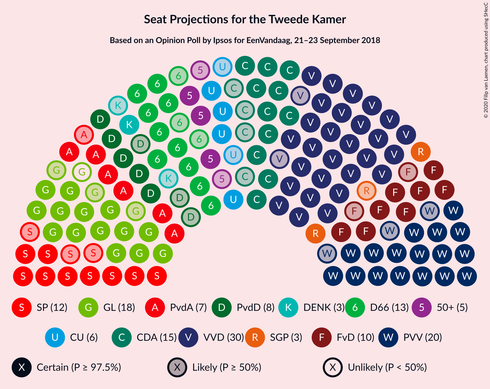

### Confidence Intervals

| Party | Last Result | Median | 80% Confidence Interval | 90% Confidence Interval | 95% Confidence Interval | 99% Confidence Interval |
|:-----:|:-----------:|:------:|:-----------------------:|:-----------------------:|:-----------------------:|:-----------------------:|
| <a href="#volkspartij-voor-vrijheid-en-democratie">Volkspartij voor Vrijheid en Democratie</a> | 33 | 30 | 30–31 |30–35 |29–35 |27–35 |
| <a href="#partij-voor-de-vrijheid">Partij voor de Vrijheid</a> | 20 | 22 | 19–24 |18–24 |18–24 |17–24 |
| <a href="#groenlinks">GroenLinks</a> | 14 | 16 | 16–18 |15–18 |15–18 |14–19 |
| <a href="#christen-democratisch-appèl">Christen-Democratisch Appèl</a> | 19 | 13 | 11–15 |11–15 |11–16 |11–18 |
| <a href="#democraten-66">Democraten 66</a> | 19 | 14 | 12–14 |12–14 |12–14 |10–14 |
| <a href="#socialistische-partij">Socialistische Partij</a> | 14 | 12 | 11–13 |11–13 |10–13 |9–14 |
| <a href="#forum-voor-democratie">Forum voor Democratie</a> | 2 | 10 | 8–10 |8–10 |8–11 |7–11 |
| <a href="#partij-van-de-arbeid">Partij van de Arbeid</a> | 9 | 7 | 7–11 |7–11 |7–11 |7–12 |
| <a href="#partij-voor-de-dieren">Partij voor de Dieren</a> | 5 | 9 | 8–10 |8–10 |7–10 |6–11 |
| <a href="#christenunie">ChristenUnie</a> | 5 | 6 | 5–7 |5–7 |5–7 |4–8 |
| <a href="#50plus">50Plus</a> | 4 | 5 | 3–5 |3–7 |3–7 |3–7 |
| <a href="#staatkundig-gereformeerde-partij">Staatkundig Gereformeerde Partij</a> | 3 | 3 | 3–4 |2–4 |2–4 |2–6 |
| <a href="#denk">DENK</a> | 3 | 2 | 1–3 |1–3 |1–3 |1–4 |

### Volkspartij voor Vrijheid en Democratie

*For a full overview of the results for this party, see the [Volkspartij voor Vrijheid en Democratie](party-volkspartijvoorvrijheidendemocratie.html) page.*

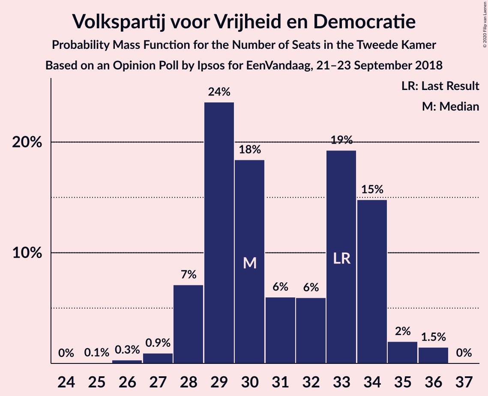

| Number of Seats | Probability | Accumulated | Special Marks |
|:---------------:|:-----------:|:-----------:|:-------------:|
| 25 | 0.2% | 100% |  |
| 26 | 0.1% | 99.8% |  |
| 27 | 2% | 99.8% |  |
| 28 | 0.2% | 98% |  |
| 29 | 0.7% | 98% |  |
| 30 | 86% | 97% | Median |
| 31 | 2% | 11% |  |
| 32 | 0.1% | 9% |  |
| 33 | 0.3% | 9% | Last Result |
| 34 | 0.3% | 8% |  |
| 35 | 8% | 8% |  |
| 36 | 0.1% | 0.1% |  |
| 37 | 0% | 0% |  |

### Partij voor de Vrijheid

*For a full overview of the results for this party, see the [Partij voor de Vrijheid](party-partijvoordevrijheid.html) page.*

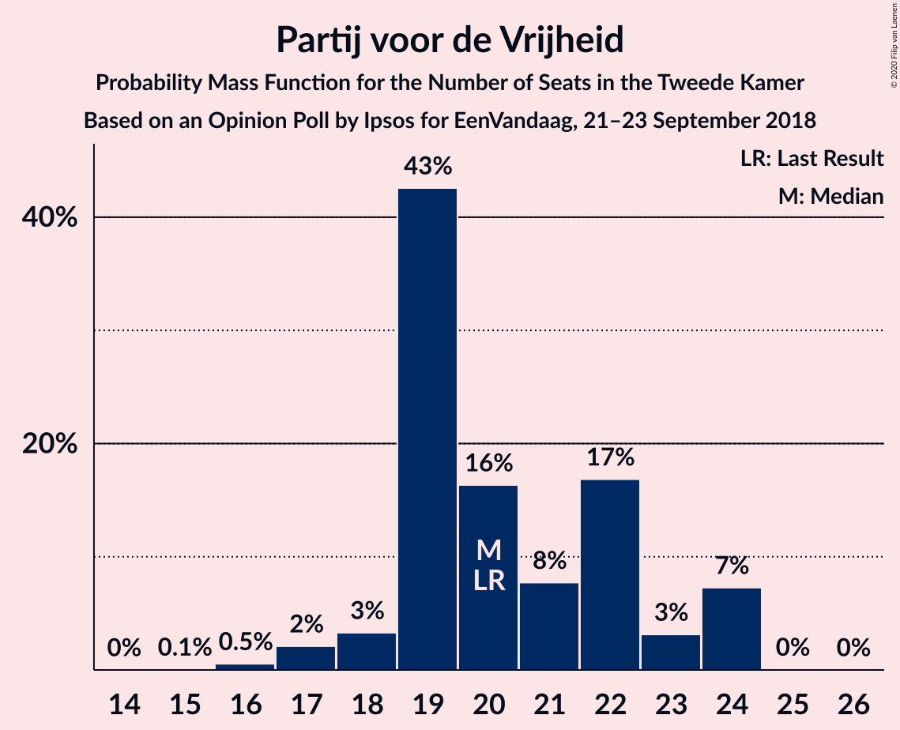

| Number of Seats | Probability | Accumulated | Special Marks |
|:---------------:|:-----------:|:-----------:|:-------------:|
| 16 | 0.1% | 100% |  |
| 17 | 2% | 99.9% |  |
| 18 | 3% | 98% |  |
| 19 | 7% | 95% |  |
| 20 | 3% | 88% | Last Result |
| 21 | 0.3% | 85% |  |
| 22 | 52% | 84% | Median |
| 23 | 0.6% | 32% |  |
| 24 | 32% | 32% |  |
| 25 | 0% | 0% |  |

### GroenLinks

*For a full overview of the results for this party, see the [GroenLinks](party-groenlinks.html) page.*

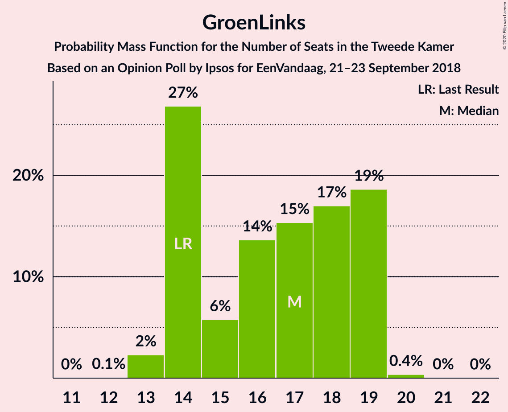

| Number of Seats | Probability | Accumulated | Special Marks |
|:---------------:|:-----------:|:-----------:|:-------------:|
| 12 | 0.1% | 100% |  |
| 13 | 0.2% | 99.9% |  |
| 14 | 0.5% | 99.6% | Last Result |
| 15 | 7% | 99.1% |  |
| 16 | 54% | 92% | Median |
| 17 | 3% | 37% |  |
| 18 | 33% | 35% |  |
| 19 | 2% | 2% |  |
| 20 | 0.2% | 0.2% |  |
| 21 | 0% | 0% |  |

### Christen-Democratisch Appèl

*For a full overview of the results for this party, see the [Christen-Democratisch Appèl](party-christen-democratischappèl.html) page.*

| Number of Seats | Probability | Accumulated | Special Marks |
|:---------------:|:-----------:|:-----------:|:-------------:|
| 11 | 32% | 100% |  |
| 12 | 0.1% | 68% |  |
| 13 | 20% | 68% | Median |
| 14 | 7% | 48% |  |
| 15 | 36% | 41% |  |
| 16 | 3% | 5% |  |
| 17 | 0.5% | 2% |  |
| 18 | 1.2% | 1.3% |  |
| 19 | 0% | 0.1% | Last Result |
| 20 | 0% | 0% |  |

### Democraten 66

*For a full overview of the results for this party, see the [Democraten 66](party-democraten66.html) page.*

| Number of Seats | Probability | Accumulated | Special Marks |
|:---------------:|:-----------:|:-----------:|:-------------:|
| 9 | 0.4% | 100% |  |
| 10 | 0.5% | 99.5% |  |
| 11 | 0.4% | 99.0% |  |
| 12 | 29% | 98.6% |  |
| 13 | 3% | 70% |  |
| 14 | 66% | 67% | Median |
| 15 | 0.2% | 0.3% |  |
| 16 | 0.1% | 0.1% |  |
| 17 | 0% | 0% |  |
| 18 | 0% | 0% |  |
| 19 | 0% | 0% | Last Result |

### Socialistische Partij

*For a full overview of the results for this party, see the [Socialistische Partij](party-socialistischepartij.html) page.*

| Number of Seats | Probability | Accumulated | Special Marks |
|:---------------:|:-----------:|:-----------:|:-------------:|
| 9 | 0.5% | 100% |  |
| 10 | 4% | 99.5% |  |
| 11 | 22% | 95% |  |
| 12 | 35% | 74% | Median |
| 13 | 38% | 39% |  |
| 14 | 0.4% | 0.7% | Last Result |
| 15 | 0.2% | 0.3% |  |
| 16 | 0.1% | 0.1% |  |
| 17 | 0% | 0% |  |

### Forum voor Democratie

*For a full overview of the results for this party, see the [Forum voor Democratie](party-forumvoordemocratie.html) page.*

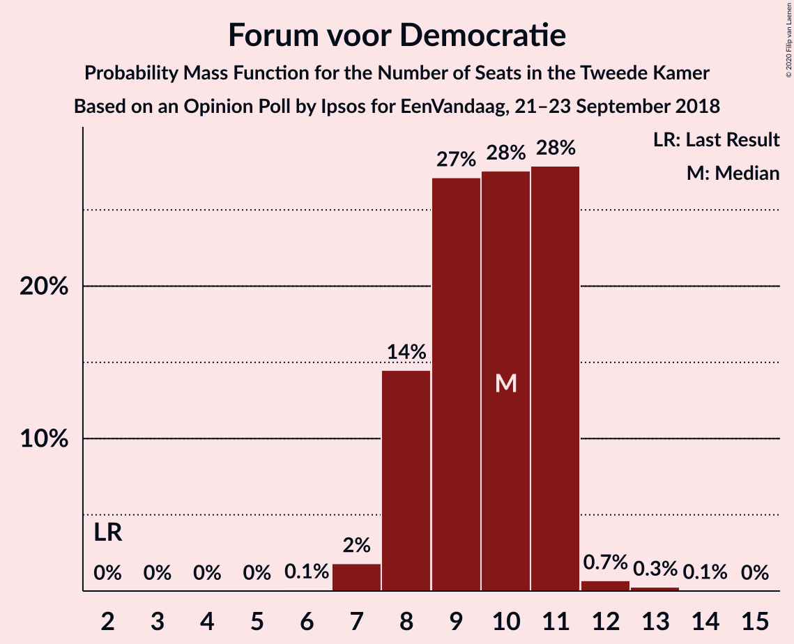

| Number of Seats | Probability | Accumulated | Special Marks |
|:---------------:|:-----------:|:-----------:|:-------------:|
| 2 | 0% | 100% | Last Result |
| 3 | 0% | 100% |  |
| 4 | 0% | 100% |  |
| 5 | 0% | 100% |  |
| 6 | 0% | 100% |  |
| 7 | 2% | 100% |  |
| 8 | 21% | 98% |  |
| 9 | 7% | 77% |  |
| 10 | 67% | 70% | Median |
| 11 | 2% | 3% |  |
| 12 | 0.3% | 0.5% |  |
| 13 | 0.2% | 0.2% |  |
| 14 | 0% | 0% |  |

### Partij van de Arbeid

*For a full overview of the results for this party, see the [Partij van de Arbeid](party-partijvandearbeid.html) page.*

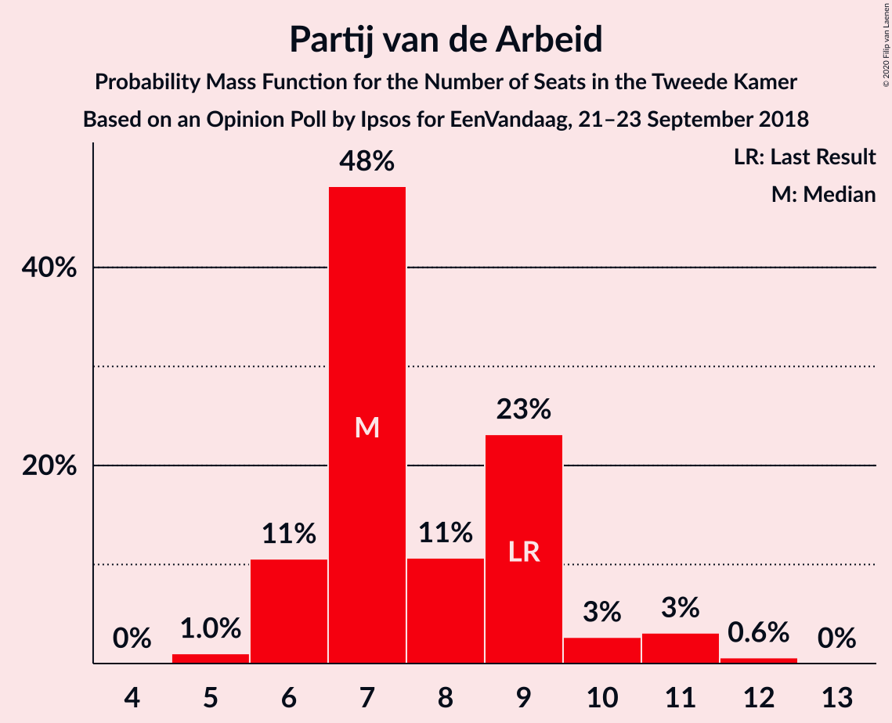

| Number of Seats | Probability | Accumulated | Special Marks |
|:---------------:|:-----------:|:-----------:|:-------------:|
| 5 | 0.2% | 100% |  |
| 6 | 0.2% | 99.8% |  |
| 7 | 68% | 99.6% | Median |
| 8 | 8% | 31% |  |
| 9 | 2% | 24% | Last Result |
| 10 | 0.6% | 21% |  |
| 11 | 20% | 21% |  |
| 12 | 0.7% | 0.7% |  |
| 13 | 0% | 0% |  |

### Partij voor de Dieren

*For a full overview of the results for this party, see the [Partij voor de Dieren](party-partijvoordedieren.html) page.*

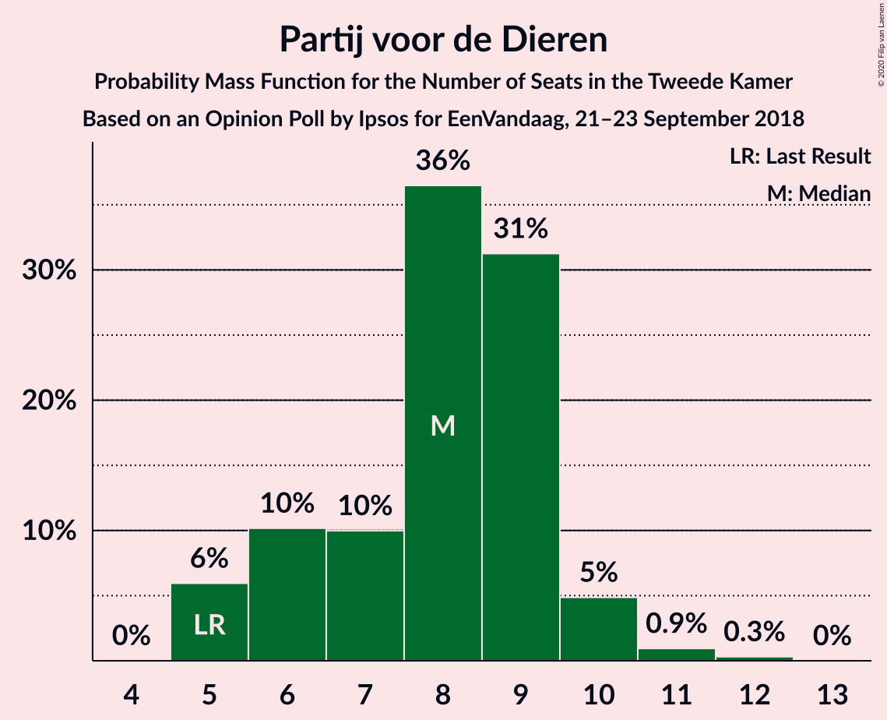

| Number of Seats | Probability | Accumulated | Special Marks |
|:---------------:|:-----------:|:-----------:|:-------------:|
| 5 | 0.2% | 100% | Last Result |
| 6 | 0.9% | 99.8% |  |
| 7 | 3% | 98.9% |  |
| 8 | 34% | 96% |  |
| 9 | 33% | 62% | Median |
| 10 | 27% | 29% |  |
| 11 | 2% | 2% |  |
| 12 | 0% | 0% |  |

### ChristenUnie

*For a full overview of the results for this party, see the [ChristenUnie](party-christenunie.html) page.*

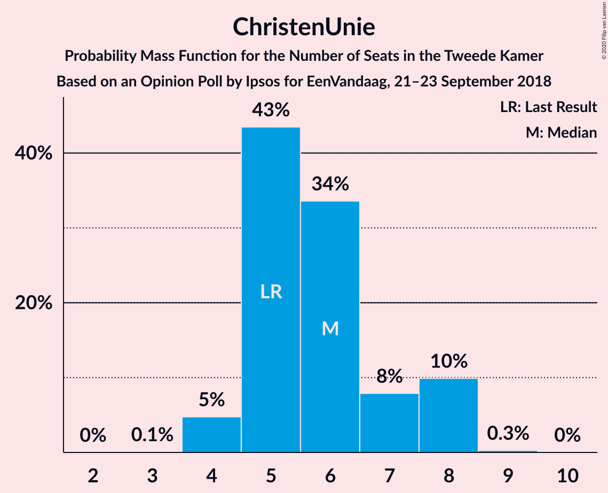

| Number of Seats | Probability | Accumulated | Special Marks |
|:---------------:|:-----------:|:-----------:|:-------------:|
| 3 | 0.1% | 100% |  |
| 4 | 1.5% | 99.9% |  |
| 5 | 34% | 98% | Last Result |
| 6 | 42% | 64% | Median |
| 7 | 21% | 22% |  |
| 8 | 0.5% | 0.9% |  |
| 9 | 0.4% | 0.4% |  |
| 10 | 0% | 0% |  |

### 50Plus

*For a full overview of the results for this party, see the [50Plus](party-50plus.html) page.*

| Number of Seats | Probability | Accumulated | Special Marks |
|:---------------:|:-----------:|:-----------:|:-------------:|
| 3 | 32% | 100% |  |
| 4 | 0.9% | 68% | Last Result |
| 5 | 60% | 67% | Median |
| 6 | 3% | 8% |  |
| 7 | 5% | 5% |  |
| 8 | 0.1% | 0.2% |  |
| 9 | 0% | 0.1% |  |
| 10 | 0% | 0% |  |

### Staatkundig Gereformeerde Partij

*For a full overview of the results for this party, see the [Staatkundig Gereformeerde Partij](party-staatkundiggereformeerdepartij.html) page.*

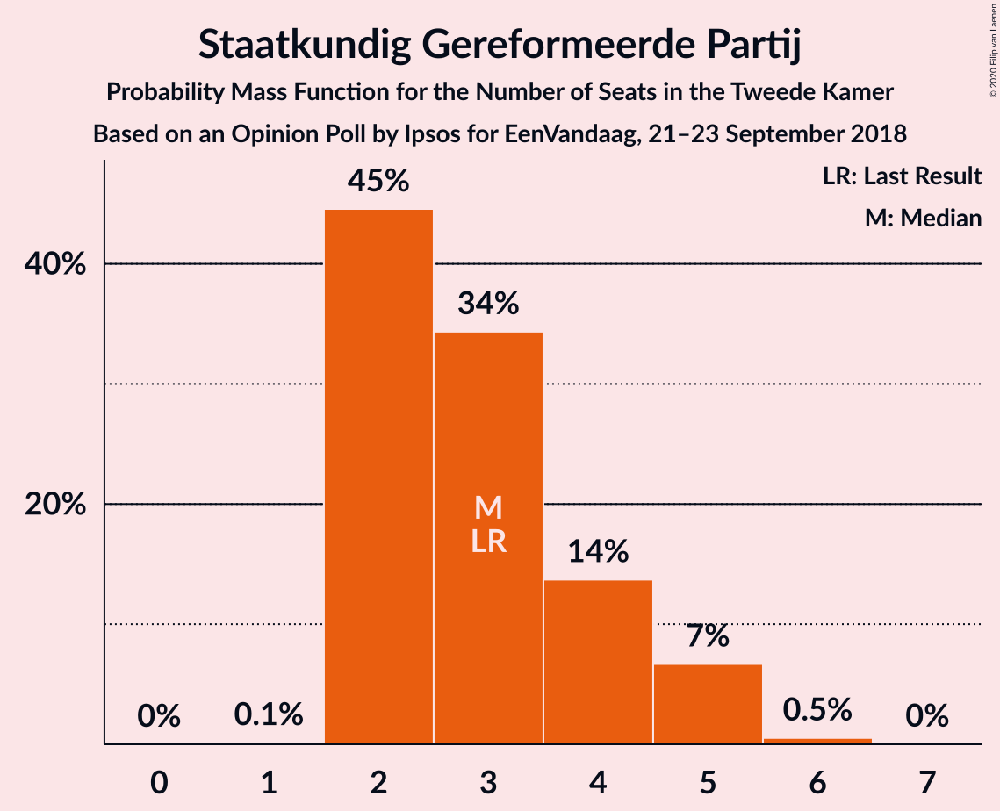

| Number of Seats | Probability | Accumulated | Special Marks |
|:---------------:|:-----------:|:-----------:|:-------------:|
| 1 | 0.1% | 100% |  |
| 2 | 9% | 99.9% |  |
| 3 | 57% | 91% | Last Result, Median |
| 4 | 33% | 34% |  |
| 5 | 0.3% | 2% |  |
| 6 | 1.2% | 1.3% |  |
| 7 | 0% | 0% |  |

### DENK

*For a full overview of the results for this party, see the [DENK](party-denk.html) page.*

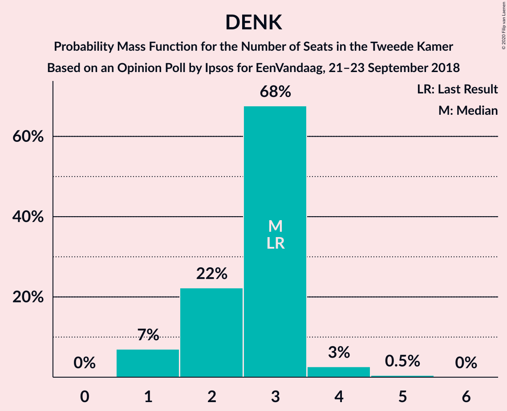

| Number of Seats | Probability | Accumulated | Special Marks |
|:---------------:|:-----------:|:-----------:|:-------------:|
| 1 | 39% | 100% |  |
| 2 | 24% | 61% | Median |
| 3 | 36% | 37% | Last Result |
| 4 | 0.8% | 0.9% |  |
| 5 | 0.1% | 0.1% |  |
| 6 | 0% | 0% |  |

## Coalitions

### Confidence Intervals

| Coalition | Last Result | Median | Majority? | 80% Confidence Interval | 90% Confidence Interval | 95% Confidence Interval | 99% Confidence Interval |
|:---------:|:-----------:|:------:|:---------:|:-----------------------:|:-----------------------:|:-----------------------:|:-----------------------:|
| Volkspartij voor Vrijheid en Democratie – GroenLinks – Christen-Democratisch Appèl – Democraten 66 – ChristenUnie | 90 | 78 | 99.9% | 78–81 | 78–82 | 78–83 | 77–86 |
| Volkspartij voor Vrijheid en Democratie – Partij voor de Vrijheid – Christen-Democratisch Appèl – Forum voor Democratie – Staatkundig Gereformeerde Partij | 77 | 77 | 99.7% | 76–82 | 76–82 | 76–82 | 76–82 |
| Volkspartij voor Vrijheid en Democratie – Partij voor de Vrijheid – Christen-Democratisch Appèl – Forum voor Democratie | 74 | 73 | 41% | 73–79 | 73–79 | 73–79 | 71–79 |
| Volkspartij voor Vrijheid en Democratie – Christen-Democratisch Appèl – Democraten 66 – Partij van de Arbeid – ChristenUnie | 85 | 72 | 0.7% | 67–74 | 67–75 | 67–75 | 67–77 |
| GroenLinks – Christen-Democratisch Appèl – Democraten 66 – Socialistische Partij – Partij van de Arbeid – ChristenUnie | 80 | 70 | 0.1% | 68–70 | 68–70 | 68–71 | 68–74 |
| Volkspartij voor Vrijheid en Democratie – Partij voor de Vrijheid – Christen-Democratisch Appèl | 72 | 65 | 0% | 63–69 | 63–69 | 63–69 | 63–70 |
| Volkspartij voor Vrijheid en Democratie – Christen-Democratisch Appèl – Democraten 66 – ChristenUnie | 76 | 62 | 0% | 60–65 | 60–67 | 60–67 | 60–69 |
| Volkspartij voor Vrijheid en Democratie – Christen-Democratisch Appèl – Forum voor Democratie – 50Plus – Staatkundig Gereformeerde Partij | 61 | 60 | 0% | 59–65 | 59–65 | 59–67 | 59–68 |
| Volkspartij voor Vrijheid en Democratie – Christen-Democratisch Appèl – Forum voor Democratie – 50Plus | 58 | 56 | 0% | 56–63 | 56–63 | 56–64 | 56–64 |
| Volkspartij voor Vrijheid en Democratie – Christen-Democratisch Appèl – Democraten 66 | 71 | 55 | 0% | 55–61 | 55–61 | 55–62 | 54–62 |
| Volkspartij voor Vrijheid en Democratie – Christen-Democratisch Appèl – Forum voor Democratie – Staatkundig Gereformeerde Partij | 57 | 55 | 0% | 54–59 | 54–60 | 54–60 | 54–63 |
| GroenLinks – Christen-Democratisch Appèl – Democraten 66 – Partij van de Arbeid – ChristenUnie | 66 | 58 | 0% | 55–59 | 55–59 | 55–59 | 55–63 |
| Volkspartij voor Vrijheid en Democratie – Christen-Democratisch Appèl – Forum voor Democratie | 54 | 51 | 0% | 51–57 | 51–58 | 51–58 | 51–58 |
| Volkspartij voor Vrijheid en Democratie – Christen-Democratisch Appèl – Partij van de Arbeid | 61 | 52 | 0% | 48–56 | 48–57 | 48–57 | 48–58 |
| Volkspartij voor Vrijheid en Democratie – Democraten 66 – Partij van de Arbeid | 61 | 51 | 0% | 51–54 | 51–55 | 50–55 | 46–55 |
| Volkspartij voor Vrijheid en Democratie – Christen-Democratisch Appèl | 52 | 43 | 0% | 41–47 | 41–49 | 41–49 | 41–50 |
| Volkspartij voor Vrijheid en Democratie – Partij van de Arbeid | 42 | 37 | 0% | 37–41 | 37–43 | 37–43 | 36–43 |
| Christen-Democratisch Appèl – Democraten 66 – Partij van de Arbeid | 47 | 36 | 0% | 32–36 | 32–36 | 32–39 | 32–42 |
| Christen-Democratisch Appèl – Partij van de Arbeid – ChristenUnie | 33 | 28 | 0% | 23–31 | 23–31 | 23–31 | 23–33 |
| Christen-Democratisch Appèl – Democraten 66 | 38 | 25 | 0% | 25–29 | 25–29 | 25–30 | 25–31 |
| Christen-Democratisch Appèl – Partij van de Arbeid | 28 | 22 | 0% | 18–24 | 18–24 | 18–25 | 18–28 |

### Volkspartij voor Vrijheid en Democratie – GroenLinks – Christen-Democratisch Appèl – Democraten 66 – ChristenUnie

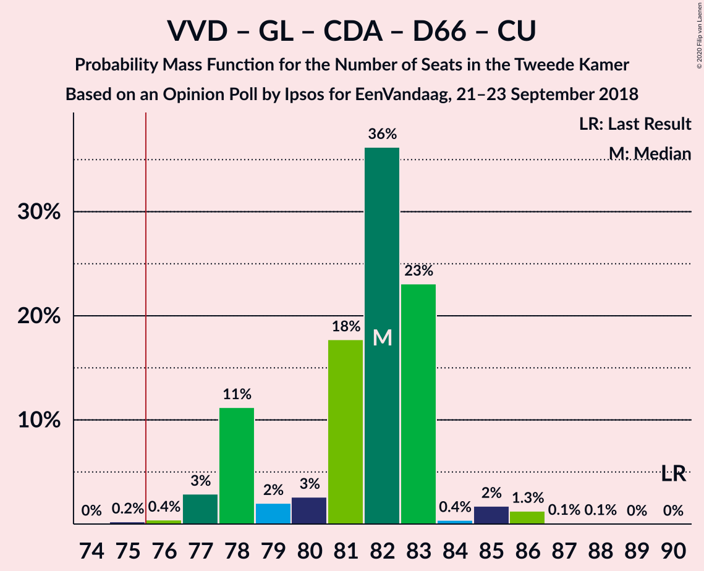

| Number of Seats | Probability | Accumulated | Special Marks |
|:---------------:|:-----------:|:-----------:|:-------------:|
| 74 | 0% | 100% |  |
| 75 | 0.1% | 99.9% |  |
| 76 | 0.4% | 99.9% | Majority |
| 77 | 0.1% | 99.5% |  |
| 78 | 53% | 99.4% |  |
| 79 | 0.1% | 46% | Median |
| 80 | 0.6% | 46% |  |
| 81 | 36% | 46% |  |
| 82 | 6% | 10% |  |
| 83 | 0.9% | 3% |  |
| 84 | 0.5% | 2% |  |
| 85 | 0.2% | 2% |  |
| 86 | 2% | 2% |  |
| 87 | 0.1% | 0.1% |  |
| 88 | 0% | 0% |  |
| 89 | 0% | 0% |  |
| 90 | 0% | 0% | Last Result |

### Volkspartij voor Vrijheid en Democratie – Partij voor de Vrijheid – Christen-Democratisch Appèl – Forum voor Democratie – Staatkundig Gereformeerde Partij

| Number of Seats | Probability | Accumulated | Special Marks |
|:---------------:|:-----------:|:-----------:|:-------------:|
| 71 | 0% | 100% |  |
| 72 | 0% | 99.9% |  |
| 73 | 0% | 99.9% |  |
| 74 | 0.1% | 99.9% |  |
| 75 | 0.1% | 99.8% |  |
| 76 | 23% | 99.7% | Majority |
| 77 | 33% | 77% | Last Result |
| 78 | 2% | 44% | Median |
| 79 | 8% | 42% |  |
| 80 | 0.8% | 33% |  |
| 81 | 0.2% | 33% |  |
| 82 | 32% | 32% |  |
| 83 | 0.1% | 0.2% |  |
| 84 | 0% | 0.1% |  |
| 85 | 0% | 0.1% |  |
| 86 | 0% | 0.1% |  |
| 87 | 0.1% | 0.1% |  |
| 88 | 0% | 0% |  |

### Volkspartij voor Vrijheid en Democratie – Partij voor de Vrijheid – Christen-Democratisch Appèl – Forum voor Democratie

| Number of Seats | Probability | Accumulated | Special Marks |
|:---------------:|:-----------:|:-----------:|:-------------:|
| 68 | 0.1% | 100% |  |
| 69 | 0% | 99.9% |  |
| 70 | 0% | 99.9% |  |
| 71 | 0.5% | 99.9% |  |
| 72 | 0.1% | 99.4% |  |
| 73 | 55% | 99.3% |  |
| 74 | 2% | 44% | Last Result |
| 75 | 2% | 42% | Median |
| 76 | 0.1% | 41% | Majority |
| 77 | 8% | 41% |  |
| 78 | 0.2% | 33% |  |
| 79 | 32% | 32% |  |
| 80 | 0.3% | 0.4% |  |
| 81 | 0% | 0.1% |  |
| 82 | 0% | 0.1% |  |
| 83 | 0% | 0.1% |  |
| 84 | 0.1% | 0.1% |  |
| 85 | 0% | 0% |  |

### Volkspartij voor Vrijheid en Democratie – Christen-Democratisch Appèl – Democraten 66 – Partij van de Arbeid – ChristenUnie

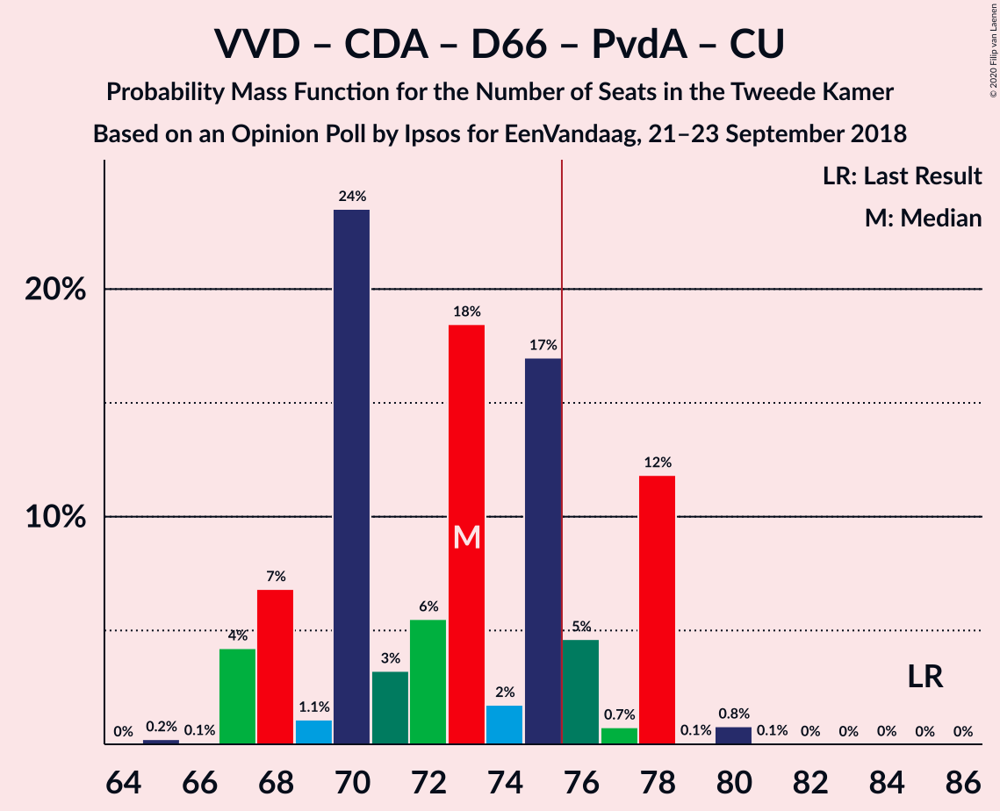

| Number of Seats | Probability | Accumulated | Special Marks |
|:---------------:|:-----------:|:-----------:|:-------------:|
| 65 | 0.1% | 100% |  |
| 66 | 0% | 99.9% |  |
| 67 | 32% | 99.9% |  |
| 68 | 0.1% | 68% |  |
| 69 | 0.5% | 68% |  |
| 70 | 0.9% | 67% | Median |
| 71 | 2% | 67% |  |
| 72 | 32% | 64% |  |
| 73 | 20% | 32% |  |
| 74 | 4% | 12% |  |
| 75 | 7% | 8% |  |
| 76 | 0.1% | 0.7% | Majority |
| 77 | 0.1% | 0.6% |  |
| 78 | 0.1% | 0.5% |  |
| 79 | 0.3% | 0.4% |  |
| 80 | 0.1% | 0.1% |  |
| 81 | 0% | 0.1% |  |
| 82 | 0.1% | 0.1% |  |
| 83 | 0% | 0% |  |
| 84 | 0% | 0% |  |
| 85 | 0% | 0% | Last Result |

### GroenLinks – Christen-Democratisch Appèl – Democraten 66 – Socialistische Partij – Partij van de Arbeid – ChristenUnie

| Number of Seats | Probability | Accumulated | Special Marks |
|:---------------:|:-----------:|:-----------:|:-------------:|
| 64 | 0% | 100% |  |
| 65 | 0% | 99.9% |  |
| 66 | 0.2% | 99.9% |  |
| 67 | 0.2% | 99.7% |  |
| 68 | 42% | 99.6% | Median |
| 69 | 0.5% | 57% |  |
| 70 | 52% | 57% |  |
| 71 | 3% | 5% |  |
| 72 | 0.2% | 2% |  |
| 73 | 0.2% | 2% |  |
| 74 | 1.3% | 2% |  |
| 75 | 0.4% | 0.4% |  |
| 76 | 0% | 0.1% | Majority |
| 77 | 0% | 0.1% |  |
| 78 | 0% | 0.1% |  |
| 79 | 0% | 0% |  |
| 80 | 0% | 0% | Last Result |

### Volkspartij voor Vrijheid en Democratie – Partij voor de Vrijheid – Christen-Democratisch Appèl

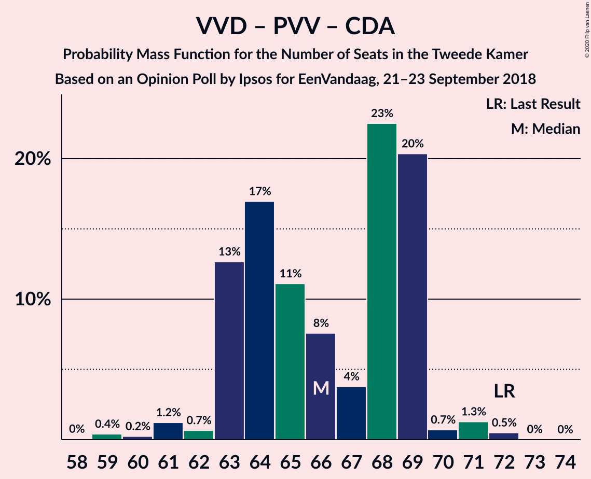

| Number of Seats | Probability | Accumulated | Special Marks |
|:---------------:|:-----------:|:-----------:|:-------------:|
| 59 | 0.1% | 100% |  |
| 60 | 0.1% | 99.9% |  |
| 61 | 0% | 99.9% |  |
| 62 | 0.3% | 99.8% |  |
| 63 | 36% | 99.6% |  |
| 64 | 2% | 64% |  |
| 65 | 20% | 62% | Median |
| 66 | 0.9% | 42% |  |
| 67 | 0.2% | 41% |  |
| 68 | 7% | 40% |  |
| 69 | 32% | 34% |  |
| 70 | 2% | 2% |  |
| 71 | 0% | 0.4% |  |
| 72 | 0.3% | 0.4% | Last Result |
| 73 | 0.1% | 0.1% |  |
| 74 | 0% | 0% |  |

### Volkspartij voor Vrijheid en Democratie – Christen-Democratisch Appèl – Democraten 66 – ChristenUnie

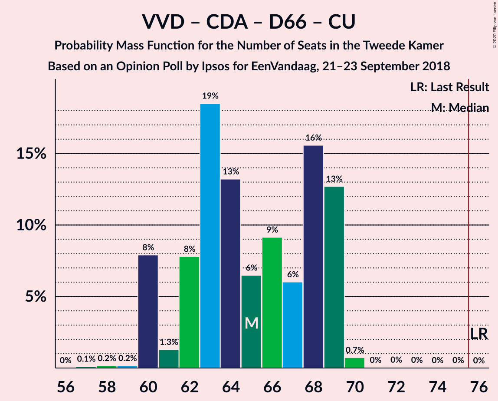

| Number of Seats | Probability | Accumulated | Special Marks |
|:---------------:|:-----------:|:-----------:|:-------------:|
| 58 | 0.1% | 100% |  |
| 59 | 0.1% | 99.9% |  |
| 60 | 32% | 99.8% |  |
| 61 | 0.3% | 68% |  |
| 62 | 21% | 67% |  |
| 63 | 0.2% | 46% | Median |
| 64 | 2% | 46% |  |
| 65 | 34% | 43% |  |
| 66 | 0.2% | 10% |  |
| 67 | 8% | 10% |  |
| 68 | 0.8% | 1.4% |  |
| 69 | 0.1% | 0.6% |  |
| 70 | 0.3% | 0.4% |  |
| 71 | 0% | 0.1% |  |
| 72 | 0% | 0.1% |  |
| 73 | 0% | 0.1% |  |
| 74 | 0.1% | 0.1% |  |
| 75 | 0% | 0% |  |
| 76 | 0% | 0% | Last Result, Majority |

### Volkspartij voor Vrijheid en Democratie – Christen-Democratisch Appèl – Forum voor Democratie – 50Plus – Staatkundig Gereformeerde Partij

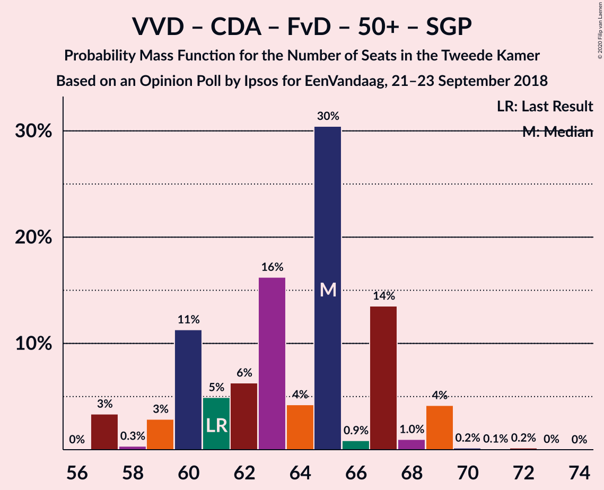

| Number of Seats | Probability | Accumulated | Special Marks |
|:---------------:|:-----------:|:-----------:|:-------------:|
| 56 | 0% | 100% |  |
| 57 | 0% | 99.9% |  |
| 58 | 0.1% | 99.9% |  |
| 59 | 20% | 99.9% |  |
| 60 | 32% | 80% |  |
| 61 | 32% | 48% | Last Result, Median |
| 62 | 2% | 16% |  |
| 63 | 0.3% | 15% |  |
| 64 | 0.2% | 14% |  |
| 65 | 9% | 14% |  |
| 66 | 2% | 5% |  |
| 67 | 2% | 3% |  |
| 68 | 0.7% | 0.9% |  |
| 69 | 0% | 0.1% |  |
| 70 | 0% | 0.1% |  |
| 71 | 0% | 0.1% |  |
| 72 | 0.1% | 0.1% |  |
| 73 | 0% | 0% |  |

### Volkspartij voor Vrijheid en Democratie – Christen-Democratisch Appèl – Forum voor Democratie – 50Plus

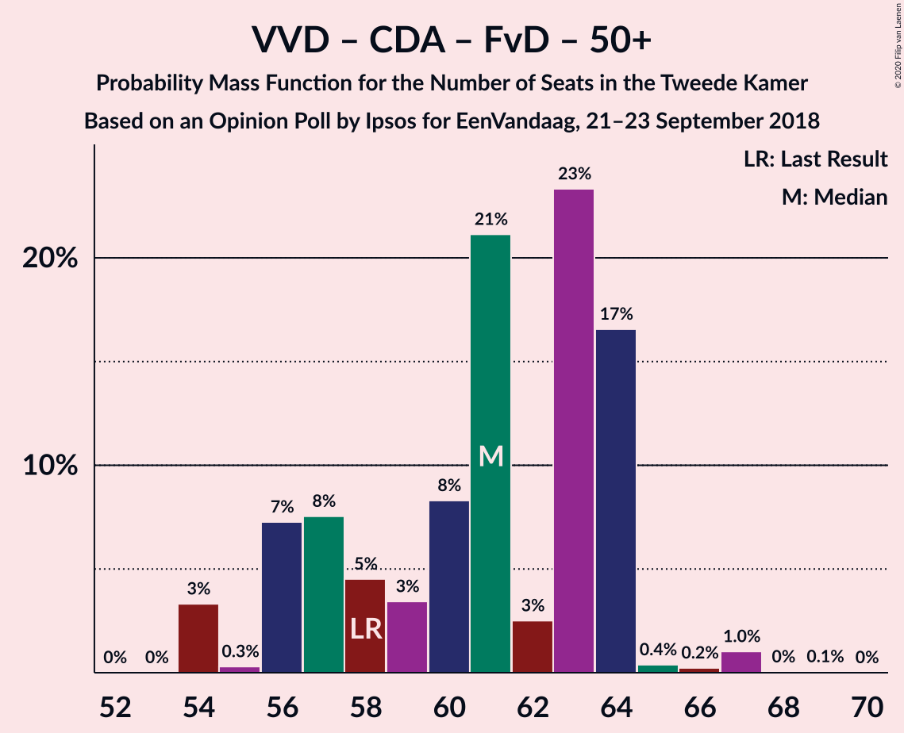

| Number of Seats | Probability | Accumulated | Special Marks |
|:---------------:|:-----------:|:-----------:|:-------------:|
| 53 | 0% | 100% |  |
| 54 | 0% | 99.9% |  |
| 55 | 0% | 99.9% |  |
| 56 | 52% | 99.9% |  |
| 57 | 0.1% | 48% |  |
| 58 | 32% | 48% | Last Result, Median |
| 59 | 1.2% | 16% |  |
| 60 | 0.4% | 15% |  |
| 61 | 0.3% | 14% |  |
| 62 | 4% | 14% |  |
| 63 | 7% | 10% |  |
| 64 | 3% | 3% |  |
| 65 | 0% | 0.2% |  |
| 66 | 0% | 0.1% |  |
| 67 | 0% | 0.1% |  |
| 68 | 0% | 0.1% |  |
| 69 | 0.1% | 0.1% |  |
| 70 | 0% | 0% |  |

### Volkspartij voor Vrijheid en Democratie – Christen-Democratisch Appèl – Democraten 66

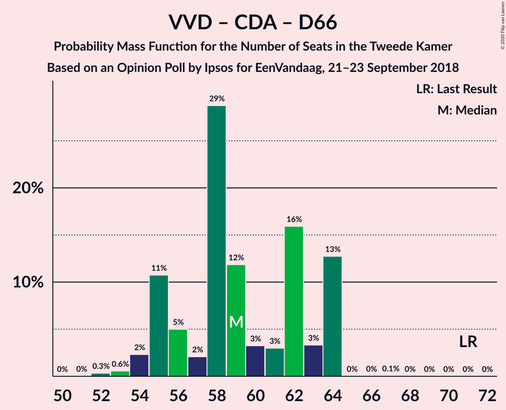

| Number of Seats | Probability | Accumulated | Special Marks |
|:---------------:|:-----------:|:-----------:|:-------------:|
| 52 | 0.1% | 100% |  |
| 53 | 0.3% | 99.9% |  |
| 54 | 0.4% | 99.6% |  |
| 55 | 52% | 99.2% |  |
| 56 | 0.2% | 47% |  |
| 57 | 1.2% | 47% | Median |
| 58 | 3% | 46% |  |
| 59 | 32% | 43% |  |
| 60 | 0.4% | 11% |  |
| 61 | 8% | 11% |  |
| 62 | 2% | 3% |  |
| 63 | 0.1% | 0.2% |  |
| 64 | 0.1% | 0.2% |  |
| 65 | 0% | 0.1% |  |
| 66 | 0% | 0.1% |  |
| 67 | 0% | 0.1% |  |
| 68 | 0.1% | 0.1% |  |
| 69 | 0% | 0% |  |
| 70 | 0% | 0% |  |
| 71 | 0% | 0% | Last Result |

### Volkspartij voor Vrijheid en Democratie – Christen-Democratisch Appèl – Forum voor Democratie – Staatkundig Gereformeerde Partij

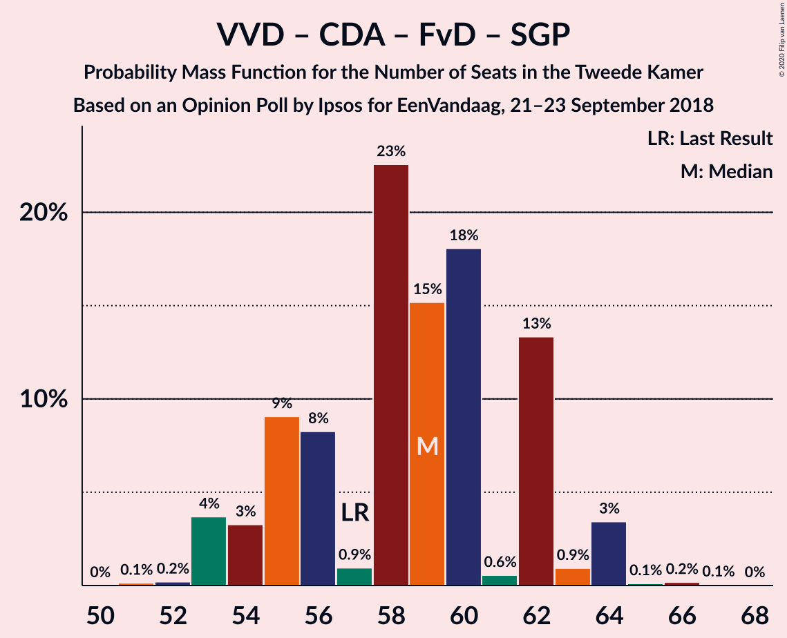

| Number of Seats | Probability | Accumulated | Special Marks |
|:---------------:|:-----------:|:-----------:|:-------------:|
| 51 | 0.1% | 100% |  |
| 52 | 0% | 99.9% |  |
| 53 | 0.1% | 99.9% |  |
| 54 | 20% | 99.8% |  |
| 55 | 32% | 80% |  |
| 56 | 1.0% | 48% | Median |
| 57 | 0.7% | 47% | Last Result |
| 58 | 34% | 46% |  |
| 59 | 2% | 12% |  |
| 60 | 7% | 10% |  |
| 61 | 1.5% | 2% |  |
| 62 | 0.1% | 1.0% |  |
| 63 | 0.8% | 0.9% |  |
| 64 | 0% | 0.1% |  |
| 65 | 0% | 0.1% |  |
| 66 | 0% | 0.1% |  |
| 67 | 0.1% | 0.1% |  |
| 68 | 0% | 0% |  |

### GroenLinks – Christen-Democratisch Appèl – Democraten 66 – Partij van de Arbeid – ChristenUnie

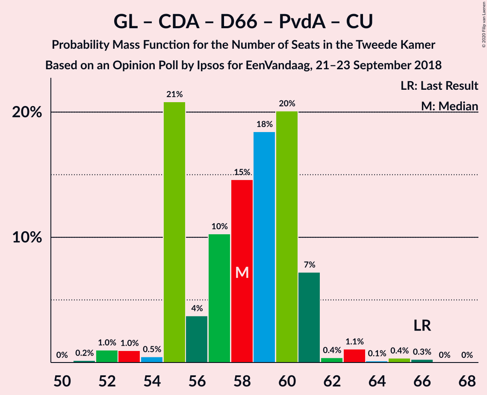

| Number of Seats | Probability | Accumulated | Special Marks |
|:---------------:|:-----------:|:-----------:|:-------------:|
| 53 | 0% | 100% |  |
| 54 | 0.1% | 99.9% |  |
| 55 | 38% | 99.8% |  |
| 56 | 0.4% | 62% | Median |
| 57 | 0.3% | 61% |  |
| 58 | 36% | 61% |  |
| 59 | 23% | 25% |  |
| 60 | 0.1% | 2% |  |
| 61 | 0.6% | 2% |  |
| 62 | 0.2% | 2% |  |
| 63 | 1.3% | 1.3% |  |
| 64 | 0.1% | 0.1% |  |
| 65 | 0% | 0% |  |
| 66 | 0% | 0% | Last Result |

### Volkspartij voor Vrijheid en Democratie – Christen-Democratisch Appèl – Forum voor Democratie

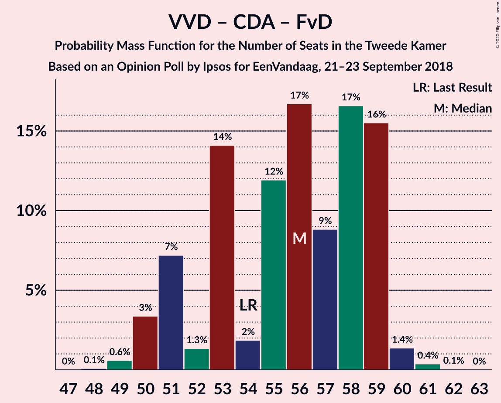

| Number of Seats | Probability | Accumulated | Special Marks |
|:---------------:|:-----------:|:-----------:|:-------------:|
| 48 | 0.1% | 100% |  |
| 49 | 0% | 99.9% |  |
| 50 | 0% | 99.9% |  |
| 51 | 52% | 99.9% |  |
| 52 | 0.1% | 48% |  |
| 53 | 1.1% | 48% | Median |
| 54 | 0.2% | 47% | Last Result |
| 55 | 35% | 46% |  |
| 56 | 1.0% | 12% |  |
| 57 | 3% | 11% |  |
| 58 | 8% | 8% |  |
| 59 | 0.1% | 0.2% |  |
| 60 | 0% | 0.1% |  |
| 61 | 0% | 0.1% |  |
| 62 | 0% | 0.1% |  |
| 63 | 0% | 0.1% |  |
| 64 | 0.1% | 0.1% |  |
| 65 | 0% | 0% |  |

### Volkspartij voor Vrijheid en Democratie – Christen-Democratisch Appèl – Partij van de Arbeid

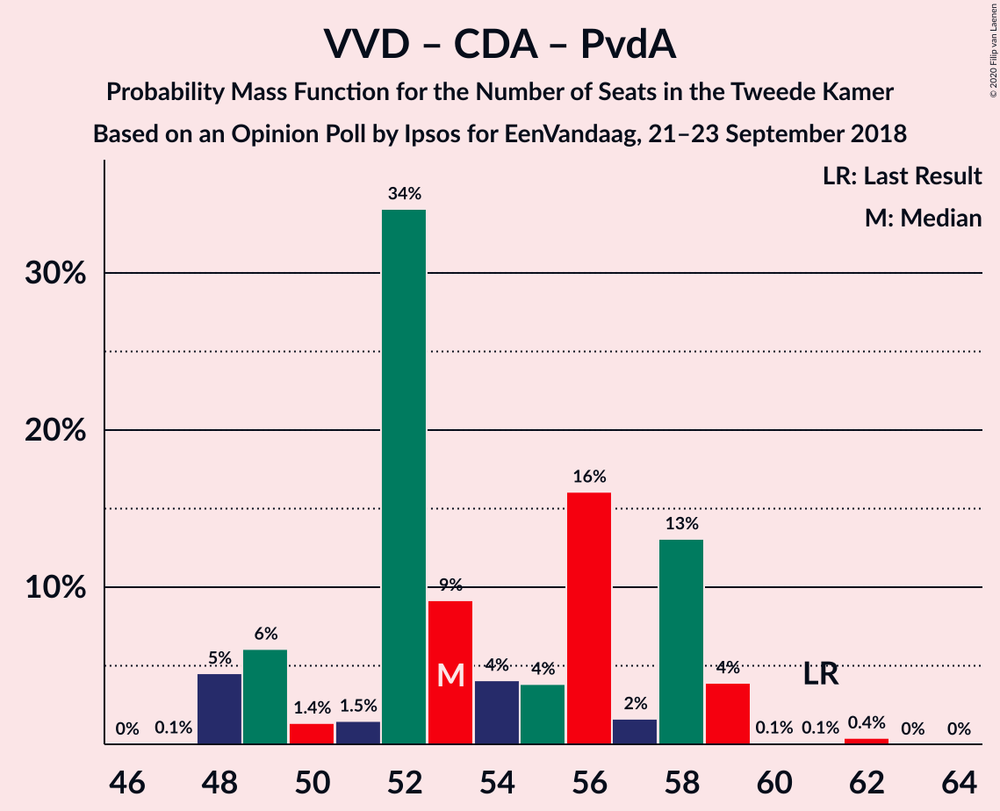

| Number of Seats | Probability | Accumulated | Special Marks |
|:---------------:|:-----------:|:-----------:|:-------------:|
| 47 | 0.1% | 100% |  |
| 48 | 32% | 99.9% |  |
| 49 | 0.2% | 68% |  |
| 50 | 0.1% | 68% | Median |
| 51 | 0.3% | 68% |  |
| 52 | 34% | 68% |  |
| 53 | 1.3% | 33% |  |
| 54 | 20% | 32% |  |
| 55 | 1.1% | 12% |  |
| 56 | 2% | 11% |  |
| 57 | 8% | 8% |  |
| 58 | 0.4% | 0.6% |  |
| 59 | 0.1% | 0.2% |  |
| 60 | 0.1% | 0.2% |  |
| 61 | 0.1% | 0.1% | Last Result |
| 62 | 0% | 0% |  |

### Volkspartij voor Vrijheid en Democratie – Democraten 66 – Partij van de Arbeid

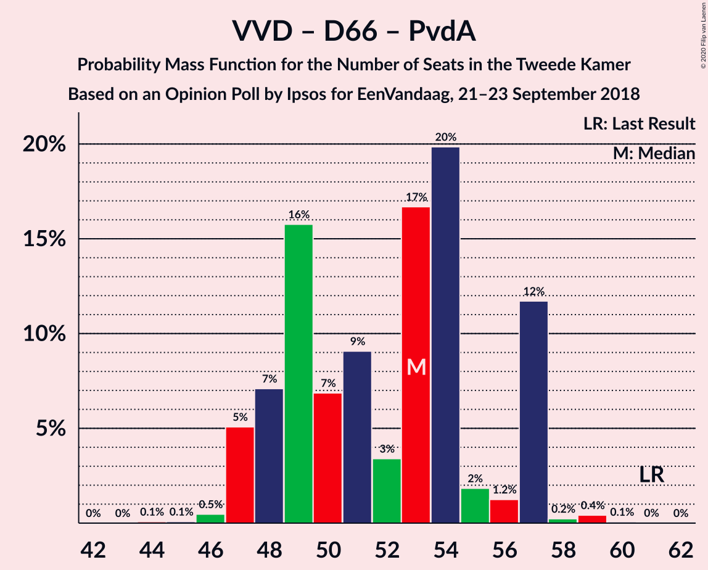

| Number of Seats | Probability | Accumulated | Special Marks |
|:---------------:|:-----------:|:-----------:|:-------------:|
| 46 | 0.5% | 100% |  |
| 47 | 0.6% | 99.5% |  |
| 48 | 0.4% | 98.8% |  |
| 49 | 0.4% | 98% |  |
| 50 | 3% | 98% |  |
| 51 | 64% | 95% | Median |
| 52 | 0.2% | 31% |  |
| 53 | 21% | 31% |  |
| 54 | 3% | 10% |  |
| 55 | 7% | 7% |  |
| 56 | 0.1% | 0.3% |  |
| 57 | 0% | 0.2% |  |
| 58 | 0.1% | 0.2% |  |
| 59 | 0% | 0.1% |  |
| 60 | 0% | 0% |  |
| 61 | 0% | 0% | Last Result |

### Volkspartij voor Vrijheid en Democratie – Christen-Democratisch Appèl

| Number of Seats | Probability | Accumulated | Special Marks |
|:---------------:|:-----------:|:-----------:|:-------------:|
| 39 | 0.1% | 100% |  |
| 40 | 0.1% | 99.9% |  |
| 41 | 32% | 99.9% |  |
| 42 | 0% | 68% |  |
| 43 | 21% | 68% | Median |
| 44 | 0.7% | 47% |  |
| 45 | 35% | 46% |  |
| 46 | 0.6% | 11% |  |
| 47 | 1.4% | 11% |  |
| 48 | 0.2% | 9% |  |
| 49 | 8% | 9% |  |
| 50 | 1.5% | 2% |  |
| 51 | 0.1% | 0.2% |  |
| 52 | 0% | 0.1% | Last Result |
| 53 | 0.1% | 0.1% |  |
| 54 | 0% | 0% |  |

### Volkspartij voor Vrijheid en Democratie – Partij van de Arbeid

| Number of Seats | Probability | Accumulated | Special Marks |
|:---------------:|:-----------:|:-----------:|:-------------:|
| 31 | 0.1% | 100% |  |
| 32 | 0% | 99.9% |  |
| 33 | 0.1% | 99.9% |  |
| 34 | 0.1% | 99.9% |  |
| 35 | 0.1% | 99.8% |  |
| 36 | 0.7% | 99.7% |  |
| 37 | 67% | 99.0% | Median |
| 38 | 1.1% | 32% |  |
| 39 | 1.0% | 31% |  |
| 40 | 1.4% | 30% |  |
| 41 | 20% | 28% |  |
| 42 | 2% | 8% | Last Result |
| 43 | 7% | 7% |  |
| 44 | 0.1% | 0.2% |  |
| 45 | 0% | 0.1% |  |
| 46 | 0% | 0% |  |

### Christen-Democratisch Appèl – Democraten 66 – Partij van de Arbeid

| Number of Seats | Probability | Accumulated | Special Marks |
|:---------------:|:-----------:|:-----------:|:-------------:|
| 31 | 0.1% | 100% |  |
| 32 | 32% | 99.9% |  |
| 33 | 0.4% | 68% |  |
| 34 | 9% | 68% | Median |
| 35 | 2% | 59% |  |
| 36 | 52% | 56% |  |
| 37 | 0.6% | 4% |  |
| 38 | 1.0% | 4% |  |
| 39 | 1.4% | 3% |  |
| 40 | 0.5% | 1.4% |  |
| 41 | 0.1% | 0.9% |  |
| 42 | 0.7% | 0.8% |  |
| 43 | 0% | 0% |  |
| 44 | 0% | 0% |  |
| 45 | 0% | 0% |  |
| 46 | 0% | 0% |  |
| 47 | 0% | 0% | Last Result |

### Christen-Democratisch Appèl – Partij van de Arbeid – ChristenUnie

| Number of Seats | Probability | Accumulated | Special Marks |
|:---------------:|:-----------:|:-----------:|:-------------:|
| 23 | 32% | 100% |  |
| 24 | 0.1% | 68% |  |
| 25 | 0.2% | 68% |  |
| 26 | 0.2% | 68% | Median |
| 27 | 2% | 68% |  |
| 28 | 41% | 66% |  |
| 29 | 2% | 26% |  |
| 30 | 0.5% | 24% |  |
| 31 | 21% | 24% |  |
| 32 | 0.4% | 2% |  |
| 33 | 2% | 2% | Last Result |
| 34 | 0.3% | 0.4% |  |
| 35 | 0% | 0% |  |

### Christen-Democratisch Appèl – Democraten 66

| Number of Seats | Probability | Accumulated | Special Marks |
|:---------------:|:-----------:|:-----------:|:-------------:|
| 24 | 0.2% | 100% |  |
| 25 | 52% | 99.8% |  |
| 26 | 7% | 48% |  |
| 27 | 3% | 41% | Median |
| 28 | 3% | 38% |  |
| 29 | 32% | 36% |  |
| 30 | 2% | 4% |  |
| 31 | 1.3% | 1.5% |  |
| 32 | 0% | 0.2% |  |
| 33 | 0.1% | 0.1% |  |
| 34 | 0% | 0% |  |
| 35 | 0% | 0% |  |
| 36 | 0% | 0% |  |
| 37 | 0% | 0% |  |
| 38 | 0% | 0% | Last Result |

### Christen-Democratisch Appèl – Partij van de Arbeid

| Number of Seats | Probability | Accumulated | Special Marks |
|:---------------:|:-----------:|:-----------:|:-------------:|
| 18 | 32% | 100% |  |
| 19 | 0.1% | 68% |  |
| 20 | 0.1% | 68% | Median |
| 21 | 0.5% | 68% |  |
| 22 | 42% | 68% |  |
| 23 | 0.5% | 25% |  |
| 24 | 21% | 25% |  |
| 25 | 2% | 4% |  |
| 26 | 0.8% | 2% |  |
| 27 | 0% | 1.1% |  |
| 28 | 1.1% | 1.1% | Last Result |
| 29 | 0% | 0% |  |

## Technical Information

### Opinion Poll

+ **Polling firm:** Ipsos
+ **Commissioner(s):** EenVandaag
+ **Fieldwork period:** 21–23 September 2018

### Calculations

+ **Sample size:** 1049
+ **Simulations done:** 131,072
+ **Error estimate:** 2.70%

