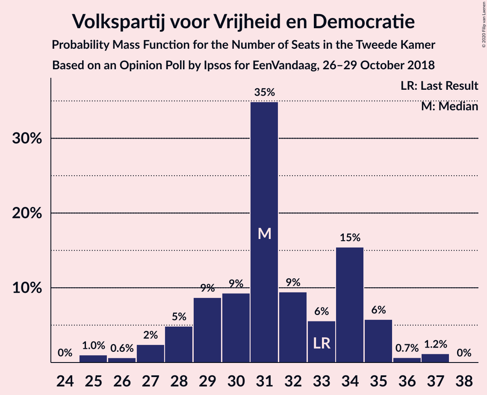
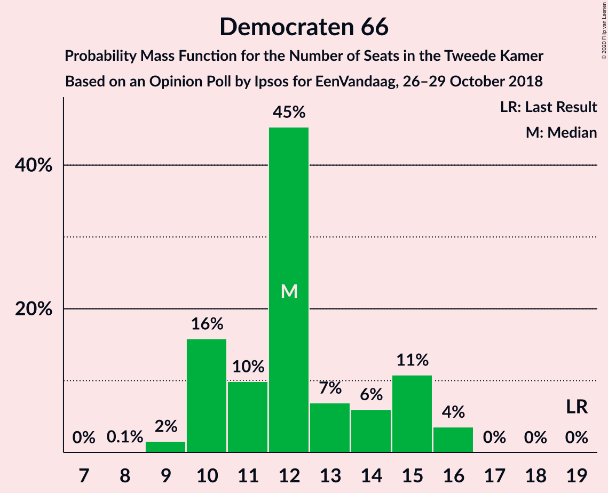
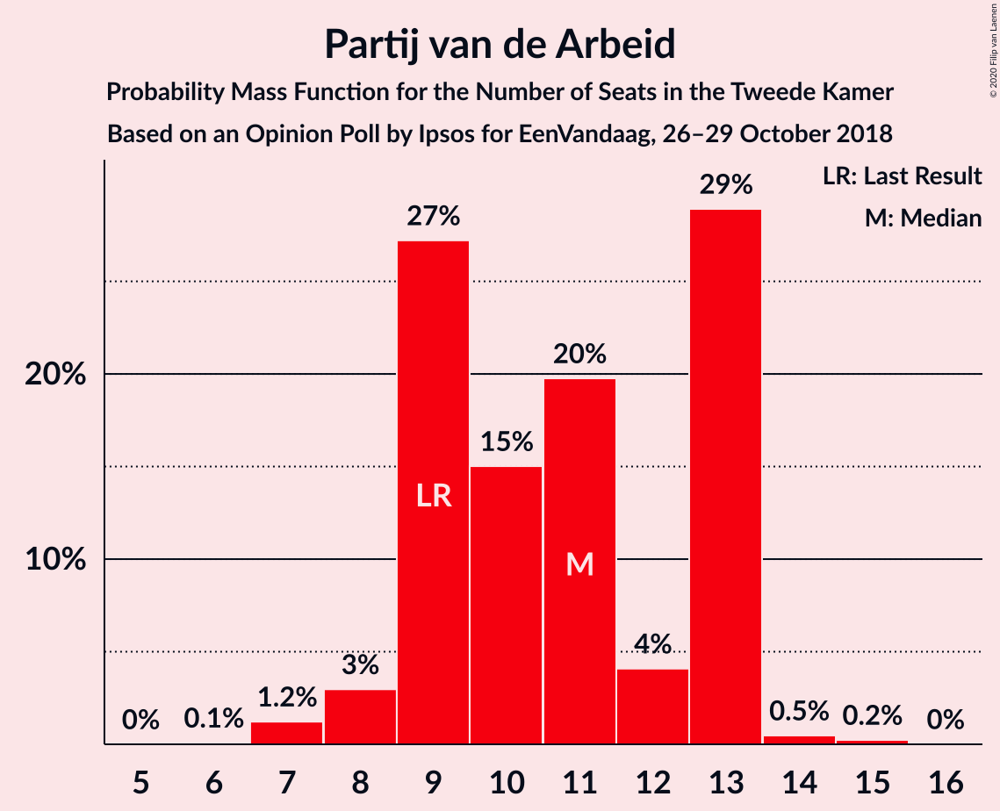
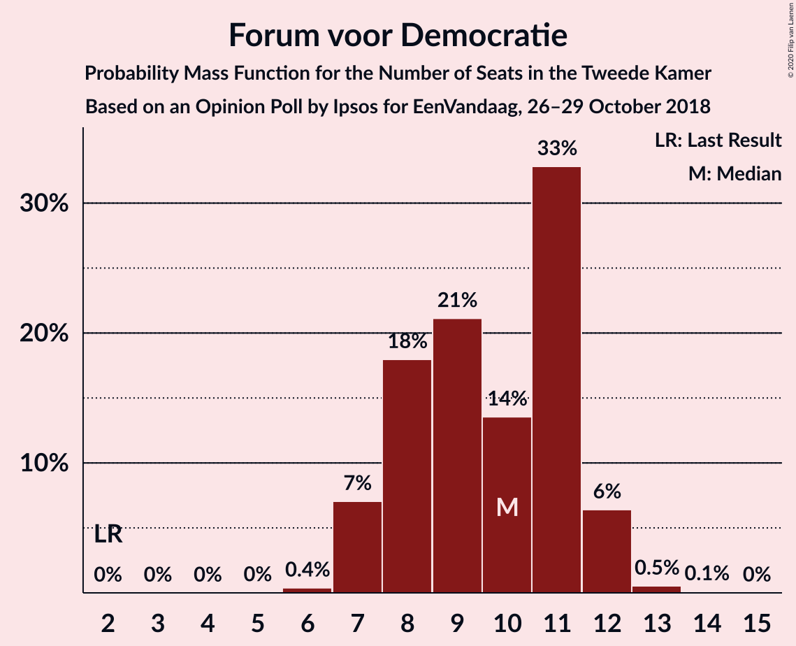
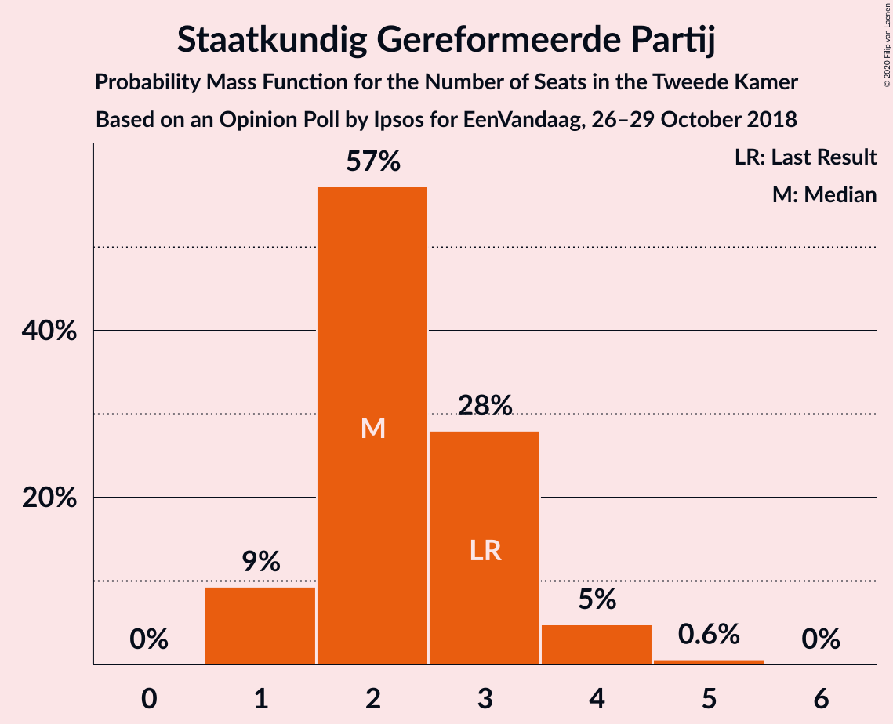
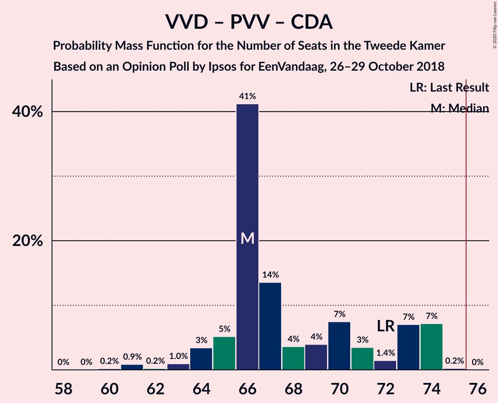
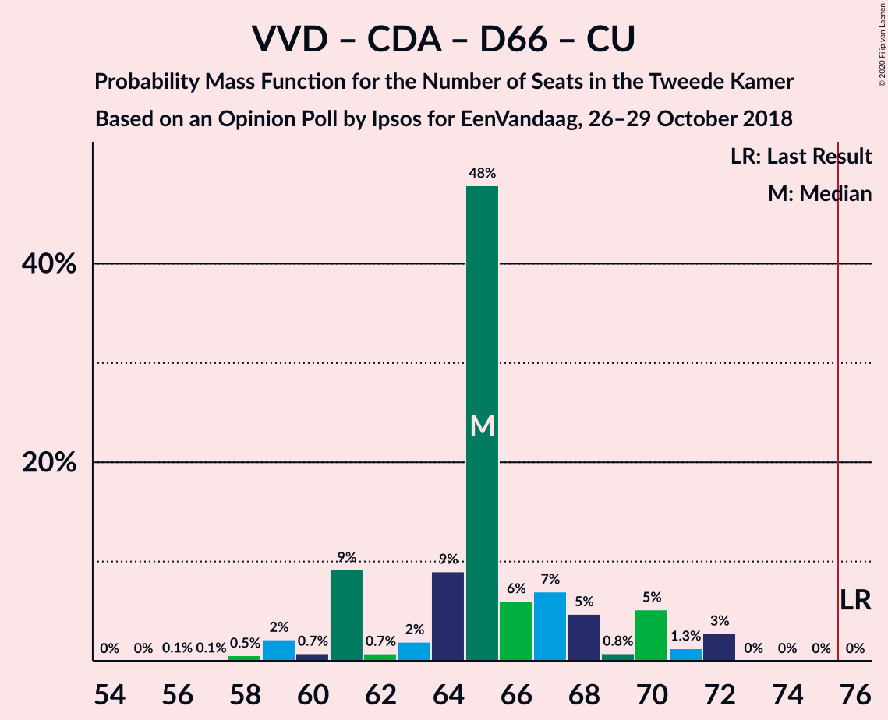

# Opinion Poll by Ipsos for EenVandaag, 26–29 October 2018

<a href="#voting-intentions">Voting Intentions</a> | <a href="#seats">Seats</a> | <a href="#coalitions">Coalitions</a> | <a href="#technical-information">Technical Information</a>

## Voting Intentions

### Confidence Intervals

| Party | Last Result | Poll Result | 80% Confidence Interval | 90% Confidence Interval | 95% Confidence Interval | 99% Confidence Interval |
|:-----:|:-----------:|:-----------:|:-----------------------:|:-----------------------:|:-----------------------:|:-----------------------:|
| Volkspartij voor Vrijheid en Democratie | 21.3% | 20.1% | 18.6–21.8% |18.2–22.3% |17.8–22.7% |17.1–23.6% |
| Partij voor de Vrijheid | 13.1% | 14.2% | 12.9–15.7% |12.5–16.1% |12.2–16.5% |11.6–17.3% |
| GroenLinks | 9.1% | 10.4% | 9.2–11.7% |8.9–12.1% |8.6–12.4% |8.1–13.1% |
| Christen-Democratisch Appèl | 12.4% | 10.0% | 8.9–11.3% |8.5–11.6% |8.3–12.0% |7.8–12.6% |
| Democraten 66 | 12.2% | 8.2% | 7.2–9.4% |6.9–9.8% |6.7–10.1% |6.2–10.7% |
| Socialistische Partij | 9.1% | 7.0% | 6.1–8.2% |5.8–8.5% |5.6–8.8% |5.2–9.3% |
| Partij van de Arbeid | 5.7% | 6.8% | 5.9–7.9% |5.6–8.3% |5.4–8.5% |5.0–9.1% |
| Forum voor Democratie | 1.8% | 6.3% | 5.4–7.4% |5.2–7.7% |5.0–8.0% |4.6–8.6% |
| ChristenUnie | 3.4% | 4.4% | 3.7–5.4% |3.5–5.7% |3.3–5.9% |3.0–6.4% |
| 50Plus | 3.1% | 4.4% | 3.7–5.4% |3.5–5.7% |3.3–5.9% |3.0–6.4% |
| Partij voor de Dieren | 3.2% | 3.9% | 3.3–4.9% |3.1–5.1% |2.9–5.3% |2.6–5.8% |
| Staatkundig Gereformeerde Partij | 2.1% | 1.9% | 1.4–2.6% |1.3–2.7% |1.2–2.9% |1.0–3.3% |
| DENK | 2.1% | 1.7% | 1.3–2.3% |1.1–2.5% |1.1–2.7% |0.9–3.0% |

*Note:* The poll result column reflects the actual value used in the calculations. Published results may vary slightly, and in addition be rounded to fewer digits.

## Seats

### Confidence Intervals

| Party | Last Result | Median | 80% Confidence Interval | 90% Confidence Interval | 95% Confidence Interval | 99% Confidence Interval |
|:-----:|:-----------:|:------:|:-----------------------:|:-----------------------:|:-----------------------:|:-----------------------:|
| <a href="#volkspartij-voor-vrijheid-en-democratie">Volkspartij voor Vrijheid en Democratie</a> | 33 | 31 | 29–34 |28–35 |27–35 |25–37 |
| <a href="#partij-voor-de-vrijheid">Partij voor de Vrijheid</a> | 20 | 20 | 20–24 |19–25 |18–25 |18–26 |
| <a href="#groenlinks">GroenLinks</a> | 14 | 16 | 14–17 |13–18 |13–18 |12–19 |
| <a href="#christen-democratisch-appèl">Christen-Democratisch Appèl</a> | 19 | 15 | 13–17 |12–17 |11–18 |11–19 |
| <a href="#democraten-66">Democraten 66</a> | 19 | 12 | 10–15 |10–15 |10–16 |9–16 |
| <a href="#socialistische-partij">Socialistische Partij</a> | 14 | 10 | 9–12 |8–13 |8–15 |7–15 |
| <a href="#partij-van-de-arbeid">Partij van de Arbeid</a> | 9 | 11 | 9–13 |9–13 |8–13 |7–14 |
| <a href="#forum-voor-democratie">Forum voor Democratie</a> | 2 | 10 | 8–11 |7–12 |7–12 |7–13 |
| <a href="#christenunie">ChristenUnie</a> | 5 | 7 | 5–7 |5–8 |5–9 |4–10 |
| <a href="#50plus">50Plus</a> | 4 | 6 | 4–8 |4–9 |4–9 |4–10 |
| <a href="#partij-voor-de-dieren">Partij voor de Dieren</a> | 5 | 6 | 4–7 |4–7 |4–8 |4–9 |
| <a href="#staatkundig-gereformeerde-partij">Staatkundig Gereformeerde Partij</a> | 3 | 2 | 2–3 |1–4 |1–4 |1–5 |
| <a href="#denk">DENK</a> | 3 | 2 | 2–3 |1–4 |1–5 |1–5 |

### Volkspartij voor Vrijheid en Democratie

*For a full overview of the results for this party, see the [Volkspartij voor Vrijheid en Democratie](party-volkspartijvoorvrijheidendemocratie.html) page.*

| Number of Seats | Probability | Accumulated | Special Marks |
|:---------------:|:-----------:|:-----------:|:-------------:|
| 25 | 1.0% | 100% |  |
| 26 | 0.6% | 98.9% |  |
| 27 | 2% | 98% |  |
| 28 | 5% | 96% |  |
| 29 | 9% | 91% |  |
| 30 | 9% | 82% |  |
| 31 | 35% | 73% | Median |
| 32 | 9% | 38% |  |
| 33 | 6% | 29% | Last Result |
| 34 | 15% | 23% |  |
| 35 | 6% | 8% |  |
| 36 | 0.7% | 2% |  |
| 37 | 1.2% | 1.2% |  |
| 38 | 0% | 0% |  |

### Partij voor de Vrijheid

*For a full overview of the results for this party, see the [Partij voor de Vrijheid](party-partijvoordevrijheid.html) page.*

| Number of Seats | Probability | Accumulated | Special Marks |
|:---------------:|:-----------:|:-----------:|:-------------:|
| 17 | 0.3% | 100% |  |
| 18 | 2% | 99.6% |  |
| 19 | 7% | 97% |  |
| 20 | 43% | 91% | Last Result, Median |
| 21 | 12% | 48% |  |
| 22 | 9% | 36% |  |
| 23 | 10% | 27% |  |
| 24 | 12% | 17% |  |
| 25 | 4% | 5% |  |
| 26 | 1.3% | 2% |  |
| 27 | 0.1% | 0.2% |  |
| 28 | 0% | 0.1% |  |
| 29 | 0% | 0% |  |

### GroenLinks

*For a full overview of the results for this party, see the [GroenLinks](party-groenlinks.html) page.*

| Number of Seats | Probability | Accumulated | Special Marks |
|:---------------:|:-----------:|:-----------:|:-------------:|
| 11 | 0.2% | 100% |  |
| 12 | 1.1% | 99.8% |  |
| 13 | 6% | 98.7% |  |
| 14 | 13% | 93% | Last Result |
| 15 | 18% | 80% |  |
| 16 | 36% | 61% | Median |
| 17 | 19% | 25% |  |
| 18 | 4% | 7% |  |
| 19 | 2% | 2% |  |
| 20 | 0.2% | 0.2% |  |
| 21 | 0% | 0.1% |  |
| 22 | 0% | 0% |  |

### Christen-Democratisch Appèl

*For a full overview of the results for this party, see the [Christen-Democratisch Appèl](party-christen-democratischappèl.html) page.*

| Number of Seats | Probability | Accumulated | Special Marks |
|:---------------:|:-----------:|:-----------:|:-------------:|
| 10 | 0.1% | 100% |  |
| 11 | 3% | 99.9% |  |
| 12 | 2% | 97% |  |
| 13 | 6% | 95% |  |
| 14 | 12% | 89% |  |
| 15 | 37% | 76% | Median |
| 16 | 27% | 39% |  |
| 17 | 8% | 12% |  |
| 18 | 3% | 4% |  |
| 19 | 0.6% | 1.1% | Last Result |
| 20 | 0.4% | 0.5% |  |
| 21 | 0% | 0% |  |

### Democraten 66

*For a full overview of the results for this party, see the [Democraten 66](party-democraten66.html) page.*

| Number of Seats | Probability | Accumulated | Special Marks |
|:---------------:|:-----------:|:-----------:|:-------------:|
| 8 | 0.1% | 100% |  |
| 9 | 2% | 99.9% |  |
| 10 | 16% | 98% |  |
| 11 | 10% | 82% |  |
| 12 | 45% | 73% | Median |
| 13 | 7% | 27% |  |
| 14 | 6% | 20% |  |
| 15 | 11% | 14% |  |
| 16 | 4% | 4% |  |
| 17 | 0% | 0% |  |
| 18 | 0% | 0% |  |
| 19 | 0% | 0% | Last Result |

### Socialistische Partij

*For a full overview of the results for this party, see the [Socialistische Partij](party-socialistischepartij.html) page.*

| Number of Seats | Probability | Accumulated | Special Marks |
|:---------------:|:-----------:|:-----------:|:-------------:|
| 7 | 0.5% | 100% |  |
| 8 | 5% | 99.5% |  |
| 9 | 18% | 94% |  |
| 10 | 42% | 77% | Median |
| 11 | 15% | 34% |  |
| 12 | 12% | 19% |  |
| 13 | 2% | 7% |  |
| 14 | 0.2% | 5% | Last Result |
| 15 | 5% | 5% |  |
| 16 | 0% | 0% |  |

### Partij van de Arbeid

*For a full overview of the results for this party, see the [Partij van de Arbeid](party-partijvandearbeid.html) page.*

| Number of Seats | Probability | Accumulated | Special Marks |
|:---------------:|:-----------:|:-----------:|:-------------:|
| 6 | 0.1% | 100% |  |
| 7 | 1.2% | 99.9% |  |
| 8 | 3% | 98.7% |  |
| 9 | 27% | 96% | Last Result |
| 10 | 15% | 69% |  |
| 11 | 20% | 53% | Median |
| 12 | 4% | 34% |  |
| 13 | 29% | 30% |  |
| 14 | 0.5% | 0.7% |  |
| 15 | 0.2% | 0.2% |  |
| 16 | 0% | 0% |  |

### Forum voor Democratie

*For a full overview of the results for this party, see the [Forum voor Democratie](party-forumvoordemocratie.html) page.*

| Number of Seats | Probability | Accumulated | Special Marks |
|:---------------:|:-----------:|:-----------:|:-------------:|
| 2 | 0% | 100% | Last Result |
| 3 | 0% | 100% |  |
| 4 | 0% | 100% |  |
| 5 | 0% | 100% |  |
| 6 | 0.4% | 100% |  |
| 7 | 7% | 99.6% |  |
| 8 | 18% | 93% |  |
| 9 | 21% | 75% |  |
| 10 | 14% | 53% | Median |
| 11 | 33% | 40% |  |
| 12 | 6% | 7% |  |
| 13 | 0.5% | 0.7% |  |
| 14 | 0.1% | 0.1% |  |
| 15 | 0% | 0% |  |

### ChristenUnie

*For a full overview of the results for this party, see the [ChristenUnie](party-christenunie.html) page.*

| Number of Seats | Probability | Accumulated | Special Marks |
|:---------------:|:-----------:|:-----------:|:-------------:|
| 4 | 2% | 100% |  |
| 5 | 23% | 98% | Last Result |
| 6 | 19% | 75% |  |
| 7 | 46% | 56% | Median |
| 8 | 6% | 10% |  |
| 9 | 3% | 4% |  |
| 10 | 0.9% | 1.1% |  |
| 11 | 0.2% | 0.2% |  |
| 12 | 0% | 0% |  |

### 50Plus

*For a full overview of the results for this party, see the [50Plus](party-50plus.html) page.*

| Number of Seats | Probability | Accumulated | Special Marks |
|:---------------:|:-----------:|:-----------:|:-------------:|
| 4 | 30% | 100% | Last Result |
| 5 | 12% | 70% |  |
| 6 | 27% | 58% | Median |
| 7 | 11% | 31% |  |
| 8 | 13% | 19% |  |
| 9 | 5% | 7% |  |
| 10 | 1.4% | 1.5% |  |
| 11 | 0.1% | 0.1% |  |
| 12 | 0% | 0% |  |

### Partij voor de Dieren

*For a full overview of the results for this party, see the [Partij voor de Dieren](party-partijvoordedieren.html) page.*

| Number of Seats | Probability | Accumulated | Special Marks |
|:---------------:|:-----------:|:-----------:|:-------------:|
| 3 | 0.2% | 100% |  |
| 4 | 18% | 99.8% |  |
| 5 | 17% | 81% | Last Result |
| 6 | 45% | 64% | Median |
| 7 | 16% | 19% |  |
| 8 | 3% | 3% |  |
| 9 | 0.4% | 0.6% |  |
| 10 | 0.1% | 0.1% |  |
| 11 | 0% | 0% |  |

### Staatkundig Gereformeerde Partij

*For a full overview of the results for this party, see the [Staatkundig Gereformeerde Partij](party-staatkundiggereformeerdepartij.html) page.*

| Number of Seats | Probability | Accumulated | Special Marks |
|:---------------:|:-----------:|:-----------:|:-------------:|
| 1 | 9% | 100% |  |
| 2 | 57% | 91% | Median |
| 3 | 28% | 33% | Last Result |
| 4 | 5% | 5% |  |
| 5 | 0.6% | 0.6% |  |
| 6 | 0% | 0% |  |

### DENK

*For a full overview of the results for this party, see the [DENK](party-denk.html) page.*

| Number of Seats | Probability | Accumulated | Special Marks |
|:---------------:|:-----------:|:-----------:|:-------------:|
| 1 | 6% | 100% |  |
| 2 | 55% | 94% | Median |
| 3 | 30% | 38% | Last Result |
| 4 | 4% | 8% |  |
| 5 | 4% | 4% |  |
| 6 | 0% | 0% |  |

## Coalitions

### Confidence Intervals

| Coalition | Last Result | Median | Majority? | 80% Confidence Interval | 90% Confidence Interval | 95% Confidence Interval | 99% Confidence Interval |
|:---------:|:-----------:|:------:|:---------:|:-----------------------:|:-----------------------:|:-----------------------:|:-----------------------:|
| Volkspartij voor Vrijheid en Democratie – GroenLinks – Christen-Democratisch Appèl – Democraten 66 – ChristenUnie | 90 | 81 | 96% | 78–83 | 77–85 | 75–88 | 74–88 |
| Volkspartij voor Vrijheid en Democratie – Partij voor de Vrijheid – Christen-Democratisch Appèl – Forum voor Democratie – Staatkundig Gereformeerde Partij | 77 | 79 | 97% | 77–84 | 76–84 | 75–84 | 73–85 |
| Volkspartij voor Vrijheid en Democratie – Partij voor de Vrijheid – Christen-Democratisch Appèl – Forum voor Democratie | 74 | 77 | 82% | 74–81 | 74–82 | 73–82 | 70–82 |
| Volkspartij voor Vrijheid en Democratie – Christen-Democratisch Appèl – Democraten 66 – Partij van de Arbeid – ChristenUnie | 85 | 76 | 66% | 71–79 | 70–80 | 70–81 | 68–81 |
| GroenLinks – Christen-Democratisch Appèl – Democraten 66 – Socialistische Partij – Partij van de Arbeid – ChristenUnie | 80 | 71 | 4% | 66–73 | 66–75 | 65–76 | 64–77 |
| Volkspartij voor Vrijheid en Democratie – Partij voor de Vrijheid – Christen-Democratisch Appèl | 72 | 66 | 0% | 65–73 | 64–74 | 64–74 | 61–74 |
| Volkspartij voor Vrijheid en Democratie – Christen-Democratisch Appèl – Democraten 66 – ChristenUnie | 76 | 65 | 0% | 61–68 | 61–70 | 59–72 | 58–72 |
| Volkspartij voor Vrijheid en Democratie – Christen-Democratisch Appèl – Forum voor Democratie – 50Plus – Staatkundig Gereformeerde Partij | 61 | 64 | 0% | 62–68 | 61–70 | 60–70 | 58–72 |
| Volkspartij voor Vrijheid en Democratie – Christen-Democratisch Appèl – Forum voor Democratie – 50Plus | 58 | 61 | 0% | 59–66 | 58–67 | 58–67 | 55–69 |
| GroenLinks – Christen-Democratisch Appèl – Democraten 66 – Partij van de Arbeid – ChristenUnie | 66 | 61 | 0% | 57–63 | 56–64 | 55–65 | 54–66 |
| Volkspartij voor Vrijheid en Democratie – Christen-Democratisch Appèl – Democraten 66 | 71 | 58 | 0% | 56–62 | 54–64 | 53–65 | 52–67 |
| Volkspartij voor Vrijheid en Democratie – Christen-Democratisch Appèl – Forum voor Democratie – Staatkundig Gereformeerde Partij | 57 | 59 | 0% | 56–61 | 55–63 | 53–64 | 51–65 |
| Volkspartij voor Vrijheid en Democratie – Christen-Democratisch Appèl – Forum voor Democratie | 54 | 57 | 0% | 53–59 | 51–60 | 51–61 | 48–62 |
| Volkspartij voor Vrijheid en Democratie – Christen-Democratisch Appèl – Partij van de Arbeid | 61 | 59 | 0% | 54–60 | 52–61 | 51–61 | 49–63 |
| Volkspartij voor Vrijheid en Democratie – Democraten 66 – Partij van de Arbeid | 61 | 56 | 0% | 49–57 | 49–58 | 47–59 | 47–61 |
| Volkspartij voor Vrijheid en Democratie – Christen-Democratisch Appèl | 52 | 46 | 0% | 44–50 | 42–51 | 42–52 | 39–53 |
| Volkspartij voor Vrijheid en Democratie – Partij van de Arbeid | 42 | 43 | 0% | 38–44 | 38–45 | 37–46 | 35–47 |
| Christen-Democratisch Appèl – Democraten 66 – Partij van de Arbeid | 47 | 39 | 0% | 35–41 | 34–41 | 34–42 | 33–43 |
| Christen-Democratisch Appèl – Partij van de Arbeid – ChristenUnie | 33 | 33 | 0% | 29–35 | 28–35 | 27–35 | 26–37 |
| Christen-Democratisch Appèl – Democraten 66 | 38 | 27 | 0% | 25–31 | 24–31 | 23–32 | 23–32 |
| Christen-Democratisch Appèl – Partij van de Arbeid | 28 | 26 | 0% | 23–28 | 22–28 | 22–29 | 21–30 |

### Volkspartij voor Vrijheid en Democratie – GroenLinks – Christen-Democratisch Appèl – Democraten 66 – ChristenUnie

| Number of Seats | Probability | Accumulated | Special Marks |
|:---------------:|:-----------:|:-----------:|:-------------:|
| 72 | 0% | 100% |  |
| 73 | 0.1% | 99.9% |  |
| 74 | 1.3% | 99.9% |  |
| 75 | 3% | 98.5% |  |
| 76 | 0.7% | 96% | Majority |
| 77 | 2% | 95% |  |
| 78 | 15% | 93% |  |
| 79 | 7% | 78% |  |
| 80 | 3% | 72% |  |
| 81 | 34% | 69% | Median |
| 82 | 16% | 35% |  |
| 83 | 9% | 19% |  |
| 84 | 2% | 10% |  |
| 85 | 4% | 8% |  |
| 86 | 0.1% | 4% |  |
| 87 | 0.1% | 4% |  |
| 88 | 4% | 4% |  |
| 89 | 0% | 0% |  |
| 90 | 0% | 0% | Last Result |

### Volkspartij voor Vrijheid en Democratie – Partij voor de Vrijheid – Christen-Democratisch Appèl – Forum voor Democratie – Staatkundig Gereformeerde Partij

| Number of Seats | Probability | Accumulated | Special Marks |
|:---------------:|:-----------:|:-----------:|:-------------:|
| 71 | 0.2% | 100% |  |
| 72 | 0% | 99.7% |  |
| 73 | 0.7% | 99.7% |  |
| 74 | 0.6% | 99.0% |  |
| 75 | 0.9% | 98% |  |
| 76 | 4% | 97% | Majority |
| 77 | 13% | 94% | Last Result |
| 78 | 9% | 81% | Median |
| 79 | 31% | 72% |  |
| 80 | 4% | 41% |  |
| 81 | 9% | 37% |  |
| 82 | 11% | 27% |  |
| 83 | 5% | 16% |  |
| 84 | 10% | 11% |  |
| 85 | 0.6% | 1.0% |  |
| 86 | 0.3% | 0.3% |  |
| 87 | 0% | 0.1% |  |
| 88 | 0% | 0% |  |

### Volkspartij voor Vrijheid en Democratie – Partij voor de Vrijheid – Christen-Democratisch Appèl – Forum voor Democratie

| Number of Seats | Probability | Accumulated | Special Marks |
|:---------------:|:-----------:|:-----------:|:-------------:|
| 68 | 0% | 100% |  |
| 69 | 0.2% | 99.9% |  |
| 70 | 0.6% | 99.7% |  |
| 71 | 0.4% | 99.1% |  |
| 72 | 0.9% | 98.7% |  |
| 73 | 2% | 98% |  |
| 74 | 9% | 96% | Last Result |
| 75 | 6% | 88% |  |
| 76 | 13% | 82% | Median, Majority |
| 77 | 33% | 69% |  |
| 78 | 4% | 36% |  |
| 79 | 7% | 32% |  |
| 80 | 13% | 25% |  |
| 81 | 4% | 12% |  |
| 82 | 8% | 8% |  |
| 83 | 0.2% | 0.4% |  |
| 84 | 0.1% | 0.2% |  |
| 85 | 0.1% | 0.1% |  |
| 86 | 0% | 0% |  |

### Volkspartij voor Vrijheid en Democratie – Christen-Democratisch Appèl – Democraten 66 – Partij van de Arbeid – ChristenUnie

| Number of Seats | Probability | Accumulated | Special Marks |
|:---------------:|:-----------:|:-----------:|:-------------:|
| 67 | 0.2% | 100% |  |
| 68 | 0.8% | 99.8% |  |
| 69 | 1.4% | 99.0% |  |
| 70 | 7% | 98% |  |
| 71 | 1.4% | 91% |  |
| 72 | 2% | 89% |  |
| 73 | 3% | 87% |  |
| 74 | 12% | 84% |  |
| 75 | 6% | 72% |  |
| 76 | 17% | 66% | Median, Majority |
| 77 | 7% | 48% |  |
| 78 | 30% | 41% |  |
| 79 | 1.4% | 11% |  |
| 80 | 5% | 9% |  |
| 81 | 3% | 4% |  |
| 82 | 0.4% | 0.4% |  |
| 83 | 0% | 0% |  |
| 84 | 0% | 0% |  |
| 85 | 0% | 0% | Last Result |

### GroenLinks – Christen-Democratisch Appèl – Democraten 66 – Socialistische Partij – Partij van de Arbeid – ChristenUnie

| Number of Seats | Probability | Accumulated | Special Marks |
|:---------------:|:-----------:|:-----------:|:-------------:|
| 63 | 0% | 100% |  |
| 64 | 0.9% | 99.9% |  |
| 65 | 2% | 99.0% |  |
| 66 | 7% | 97% |  |
| 67 | 6% | 89% |  |
| 68 | 12% | 83% |  |
| 69 | 3% | 71% |  |
| 70 | 16% | 68% |  |
| 71 | 5% | 52% | Median |
| 72 | 8% | 47% |  |
| 73 | 33% | 39% |  |
| 74 | 0.2% | 7% |  |
| 75 | 3% | 6% |  |
| 76 | 2% | 4% | Majority |
| 77 | 1.5% | 2% |  |
| 78 | 0.4% | 0.4% |  |
| 79 | 0% | 0% |  |
| 80 | 0% | 0% | Last Result |

### Volkspartij voor Vrijheid en Democratie – Partij voor de Vrijheid – Christen-Democratisch Appèl

| Number of Seats | Probability | Accumulated | Special Marks |
|:---------------:|:-----------:|:-----------:|:-------------:|
| 59 | 0% | 100% |  |
| 60 | 0.2% | 99.9% |  |
| 61 | 0.9% | 99.8% |  |
| 62 | 0.2% | 98.9% |  |
| 63 | 1.0% | 98.7% |  |
| 64 | 3% | 98% |  |
| 65 | 5% | 94% |  |
| 66 | 41% | 89% | Median |
| 67 | 14% | 48% |  |
| 68 | 4% | 34% |  |
| 69 | 4% | 31% |  |
| 70 | 7% | 27% |  |
| 71 | 3% | 19% |  |
| 72 | 1.4% | 16% | Last Result |
| 73 | 7% | 14% |  |
| 74 | 7% | 7% |  |
| 75 | 0.2% | 0.3% |  |
| 76 | 0% | 0% | Majority |

### Volkspartij voor Vrijheid en Democratie – Christen-Democratisch Appèl – Democraten 66 – ChristenUnie

| Number of Seats | Probability | Accumulated | Special Marks |
|:---------------:|:-----------:|:-----------:|:-------------:|
| 56 | 0.1% | 100% |  |
| 57 | 0.1% | 99.9% |  |
| 58 | 0.5% | 99.9% |  |
| 59 | 2% | 99.3% |  |
| 60 | 0.7% | 97% |  |
| 61 | 9% | 96% |  |
| 62 | 0.7% | 87% |  |
| 63 | 2% | 87% |  |
| 64 | 9% | 85% |  |
| 65 | 48% | 76% | Median |
| 66 | 6% | 28% |  |
| 67 | 7% | 22% |  |
| 68 | 5% | 15% |  |
| 69 | 0.8% | 10% |  |
| 70 | 5% | 9% |  |
| 71 | 1.3% | 4% |  |
| 72 | 3% | 3% |  |
| 73 | 0% | 0% |  |
| 74 | 0% | 0% |  |
| 75 | 0% | 0% |  |
| 76 | 0% | 0% | Last Result, Majority |

### Volkspartij voor Vrijheid en Democratie – Christen-Democratisch Appèl – Forum voor Democratie – 50Plus – Staatkundig Gereformeerde Partij

| Number of Seats | Probability | Accumulated | Special Marks |
|:---------------:|:-----------:|:-----------:|:-------------:|
| 57 | 0.1% | 100% |  |
| 58 | 0.6% | 99.9% |  |
| 59 | 1.2% | 99.3% |  |
| 60 | 2% | 98% |  |
| 61 | 5% | 96% | Last Result |
| 62 | 9% | 91% |  |
| 63 | 30% | 82% |  |
| 64 | 14% | 52% | Median |
| 65 | 9% | 38% |  |
| 66 | 7% | 29% |  |
| 67 | 7% | 22% |  |
| 68 | 7% | 15% |  |
| 69 | 2% | 8% |  |
| 70 | 4% | 5% |  |
| 71 | 0.8% | 1.4% |  |
| 72 | 0.6% | 0.6% |  |
| 73 | 0.1% | 0.1% |  |
| 74 | 0% | 0% |  |

### Volkspartij voor Vrijheid en Democratie – Christen-Democratisch Appèl – Forum voor Democratie – 50Plus

| Number of Seats | Probability | Accumulated | Special Marks |
|:---------------:|:-----------:|:-----------:|:-------------:|
| 54 | 0.1% | 100% |  |
| 55 | 0.6% | 99.9% |  |
| 56 | 0.1% | 99.3% |  |
| 57 | 1.2% | 99.2% |  |
| 58 | 3% | 98% | Last Result |
| 59 | 6% | 95% |  |
| 60 | 5% | 89% |  |
| 61 | 47% | 84% |  |
| 62 | 3% | 38% | Median |
| 63 | 11% | 34% |  |
| 64 | 2% | 23% |  |
| 65 | 4% | 21% |  |
| 66 | 11% | 17% |  |
| 67 | 5% | 6% |  |
| 68 | 0.2% | 1.5% |  |
| 69 | 1.2% | 1.2% |  |
| 70 | 0% | 0.1% |  |
| 71 | 0% | 0.1% |  |
| 72 | 0% | 0% |  |

### GroenLinks – Christen-Democratisch Appèl – Democraten 66 – Partij van de Arbeid – ChristenUnie

| Number of Seats | Probability | Accumulated | Special Marks |
|:---------------:|:-----------:|:-----------:|:-------------:|
| 53 | 0.3% | 100% |  |
| 54 | 0.2% | 99.6% |  |
| 55 | 4% | 99.4% |  |
| 56 | 0.9% | 95% |  |
| 57 | 23% | 94% |  |
| 58 | 10% | 71% |  |
| 59 | 2% | 62% |  |
| 60 | 8% | 59% |  |
| 61 | 7% | 51% | Median |
| 62 | 7% | 44% |  |
| 63 | 30% | 37% |  |
| 64 | 4% | 6% |  |
| 65 | 0.9% | 3% |  |
| 66 | 1.4% | 2% | Last Result |
| 67 | 0.3% | 0.5% |  |
| 68 | 0% | 0.2% |  |
| 69 | 0.2% | 0.2% |  |
| 70 | 0% | 0% |  |

### Volkspartij voor Vrijheid en Democratie – Christen-Democratisch Appèl – Democraten 66

| Number of Seats | Probability | Accumulated | Special Marks |
|:---------------:|:-----------:|:-----------:|:-------------:|
| 50 | 0% | 100% |  |
| 51 | 0.2% | 99.9% |  |
| 52 | 2% | 99.8% |  |
| 53 | 2% | 98% |  |
| 54 | 2% | 96% |  |
| 55 | 2% | 94% |  |
| 56 | 8% | 92% |  |
| 57 | 4% | 84% |  |
| 58 | 43% | 80% | Median |
| 59 | 2% | 37% |  |
| 60 | 17% | 35% |  |
| 61 | 6% | 18% |  |
| 62 | 3% | 12% |  |
| 63 | 1.3% | 9% |  |
| 64 | 4% | 8% |  |
| 65 | 2% | 4% |  |
| 66 | 0% | 2% |  |
| 67 | 2% | 2% |  |
| 68 | 0% | 0% |  |
| 69 | 0% | 0% |  |
| 70 | 0% | 0% |  |
| 71 | 0% | 0% | Last Result |

### Volkspartij voor Vrijheid en Democratie – Christen-Democratisch Appèl – Forum voor Democratie – Staatkundig Gereformeerde Partij

| Number of Seats | Probability | Accumulated | Special Marks |
|:---------------:|:-----------:|:-----------:|:-------------:|
| 50 | 0% | 100% |  |
| 51 | 0.7% | 99.9% |  |
| 52 | 0.9% | 99.3% |  |
| 53 | 2% | 98% |  |
| 54 | 1.4% | 96% |  |
| 55 | 4% | 95% |  |
| 56 | 7% | 91% |  |
| 57 | 13% | 84% | Last Result |
| 58 | 7% | 71% | Median |
| 59 | 40% | 64% |  |
| 60 | 13% | 24% |  |
| 61 | 4% | 11% |  |
| 62 | 1.3% | 7% |  |
| 63 | 2% | 6% |  |
| 64 | 3% | 4% |  |
| 65 | 0.3% | 0.7% |  |
| 66 | 0.4% | 0.4% |  |
| 67 | 0% | 0% |  |

### Volkspartij voor Vrijheid en Democratie – Christen-Democratisch Appèl – Forum voor Democratie

| Number of Seats | Probability | Accumulated | Special Marks |
|:---------------:|:-----------:|:-----------:|:-------------:|
| 47 | 0% | 100% |  |
| 48 | 0.5% | 99.9% |  |
| 49 | 0.2% | 99.4% |  |
| 50 | 1.1% | 99.2% |  |
| 51 | 3% | 98% |  |
| 52 | 2% | 95% |  |
| 53 | 5% | 93% |  |
| 54 | 7% | 88% | Last Result |
| 55 | 14% | 81% |  |
| 56 | 9% | 67% | Median |
| 57 | 39% | 57% |  |
| 58 | 7% | 18% |  |
| 59 | 2% | 11% |  |
| 60 | 5% | 9% |  |
| 61 | 3% | 4% |  |
| 62 | 0.6% | 1.0% |  |
| 63 | 0.4% | 0.5% |  |
| 64 | 0% | 0% |  |

### Volkspartij voor Vrijheid en Democratie – Christen-Democratisch Appèl – Partij van de Arbeid

| Number of Seats | Probability | Accumulated | Special Marks |
|:---------------:|:-----------:|:-----------:|:-------------:|
| 48 | 0.1% | 100% |  |
| 49 | 0.7% | 99.9% |  |
| 50 | 1.0% | 99.2% |  |
| 51 | 1.1% | 98% |  |
| 52 | 3% | 97% |  |
| 53 | 4% | 95% |  |
| 54 | 9% | 91% |  |
| 55 | 8% | 82% |  |
| 56 | 3% | 74% |  |
| 57 | 14% | 70% | Median |
| 58 | 4% | 56% |  |
| 59 | 41% | 52% |  |
| 60 | 5% | 11% |  |
| 61 | 5% | 7% | Last Result |
| 62 | 0.7% | 1.4% |  |
| 63 | 0.6% | 0.7% |  |
| 64 | 0% | 0.2% |  |
| 65 | 0.1% | 0.1% |  |
| 66 | 0% | 0% |  |

### Volkspartij voor Vrijheid en Democratie – Democraten 66 – Partij van de Arbeid

| Number of Seats | Probability | Accumulated | Special Marks |
|:---------------:|:-----------:|:-----------:|:-------------:|
| 46 | 0.1% | 100% |  |
| 47 | 3% | 99.9% |  |
| 48 | 0.5% | 97% |  |
| 49 | 7% | 97% |  |
| 50 | 3% | 90% |  |
| 51 | 2% | 87% |  |
| 52 | 3% | 85% |  |
| 53 | 19% | 82% |  |
| 54 | 7% | 64% | Median |
| 55 | 6% | 57% |  |
| 56 | 35% | 51% |  |
| 57 | 7% | 15% |  |
| 58 | 4% | 8% |  |
| 59 | 3% | 4% |  |
| 60 | 0.8% | 1.3% |  |
| 61 | 0.5% | 0.5% | Last Result |
| 62 | 0% | 0% |  |

### Volkspartij voor Vrijheid en Democratie – Christen-Democratisch Appèl

| Number of Seats | Probability | Accumulated | Special Marks |
|:---------------:|:-----------:|:-----------:|:-------------:|
| 39 | 0.7% | 100% |  |
| 40 | 0.3% | 99.2% |  |
| 41 | 1.1% | 99.0% |  |
| 42 | 4% | 98% |  |
| 43 | 3% | 93% |  |
| 44 | 5% | 90% |  |
| 45 | 10% | 85% |  |
| 46 | 46% | 75% | Median |
| 47 | 2% | 29% |  |
| 48 | 4% | 27% |  |
| 49 | 2% | 24% |  |
| 50 | 17% | 22% |  |
| 51 | 2% | 6% |  |
| 52 | 3% | 4% | Last Result |
| 53 | 1.2% | 1.3% |  |
| 54 | 0.1% | 0.1% |  |
| 55 | 0% | 0% |  |

### Volkspartij voor Vrijheid en Democratie – Partij van de Arbeid

| Number of Seats | Probability | Accumulated | Special Marks |
|:---------------:|:-----------:|:-----------:|:-------------:|
| 34 | 0.5% | 100% |  |
| 35 | 1.0% | 99.5% |  |
| 36 | 0.7% | 98.6% |  |
| 37 | 2% | 98% |  |
| 38 | 8% | 96% |  |
| 39 | 6% | 88% |  |
| 40 | 4% | 82% |  |
| 41 | 10% | 78% |  |
| 42 | 5% | 67% | Last Result, Median |
| 43 | 23% | 62% |  |
| 44 | 34% | 40% |  |
| 45 | 2% | 6% |  |
| 46 | 3% | 4% |  |
| 47 | 1.1% | 1.4% |  |
| 48 | 0.3% | 0.3% |  |
| 49 | 0% | 0% |  |

### Christen-Democratisch Appèl – Democraten 66 – Partij van de Arbeid

| Number of Seats | Probability | Accumulated | Special Marks |
|:---------------:|:-----------:|:-----------:|:-------------:|
| 31 | 0.3% | 100% |  |
| 32 | 0.2% | 99.7% |  |
| 33 | 1.3% | 99.5% |  |
| 34 | 5% | 98% |  |
| 35 | 15% | 93% |  |
| 36 | 9% | 78% |  |
| 37 | 11% | 70% |  |
| 38 | 4% | 59% | Median |
| 39 | 10% | 54% |  |
| 40 | 33% | 44% |  |
| 41 | 7% | 12% |  |
| 42 | 3% | 4% |  |
| 43 | 0.6% | 1.0% |  |
| 44 | 0.2% | 0.4% |  |
| 45 | 0.1% | 0.2% |  |
| 46 | 0% | 0% |  |
| 47 | 0% | 0% | Last Result |

### Christen-Democratisch Appèl – Partij van de Arbeid – ChristenUnie

| Number of Seats | Probability | Accumulated | Special Marks |
|:---------------:|:-----------:|:-----------:|:-------------:|
| 25 | 0.2% | 100% |  |
| 26 | 1.5% | 99.8% |  |
| 27 | 2% | 98% |  |
| 28 | 1.4% | 96% |  |
| 29 | 6% | 95% |  |
| 30 | 19% | 89% |  |
| 31 | 9% | 69% |  |
| 32 | 10% | 60% |  |
| 33 | 10% | 50% | Last Result, Median |
| 34 | 5% | 41% |  |
| 35 | 33% | 35% |  |
| 36 | 1.0% | 2% |  |
| 37 | 0.8% | 1.2% |  |
| 38 | 0.1% | 0.4% |  |
| 39 | 0.1% | 0.3% |  |
| 40 | 0.2% | 0.2% |  |
| 41 | 0% | 0% |  |

### Christen-Democratisch Appèl – Democraten 66

| Number of Seats | Probability | Accumulated | Special Marks |
|:---------------:|:-----------:|:-----------:|:-------------:|
| 22 | 0.1% | 100% |  |
| 23 | 3% | 99.9% |  |
| 24 | 3% | 97% |  |
| 25 | 4% | 94% |  |
| 26 | 22% | 90% |  |
| 27 | 38% | 67% | Median |
| 28 | 9% | 29% |  |
| 29 | 3% | 20% |  |
| 30 | 4% | 17% |  |
| 31 | 10% | 14% |  |
| 32 | 3% | 3% |  |
| 33 | 0.1% | 0.2% |  |
| 34 | 0% | 0% |  |
| 35 | 0% | 0% |  |
| 36 | 0% | 0% |  |
| 37 | 0% | 0% |  |
| 38 | 0% | 0% | Last Result |

### Christen-Democratisch Appèl – Partij van de Arbeid

| Number of Seats | Probability | Accumulated | Special Marks |
|:---------------:|:-----------:|:-----------:|:-------------:|
| 19 | 0% | 100% |  |
| 20 | 0.3% | 99.9% |  |
| 21 | 1.5% | 99.7% |  |
| 22 | 6% | 98% |  |
| 23 | 2% | 92% |  |
| 24 | 12% | 89% |  |
| 25 | 24% | 77% |  |
| 26 | 7% | 54% | Median |
| 27 | 14% | 47% |  |
| 28 | 29% | 32% | Last Result |
| 29 | 2% | 3% |  |
| 30 | 1.2% | 2% |  |
| 31 | 0.2% | 0.4% |  |
| 32 | 0.2% | 0.2% |  |
| 33 | 0% | 0% |  |

## Technical Information

### Opinion Poll

+ **Polling firm:** Ipsos
+ **Commissioner(s):** EenVandaag
+ **Fieldwork period:** 26–29 October 2018

### Calculations

+ **Sample size:** 1013
+ **Simulations done:** 1,048,576
+ **Error estimate:** 2.41%

