# Opinion Poll by Peil.nl, 19–25 November 2018

<a href="#voting-intentions">Voting Intentions</a> | <a href="#seats">Seats</a> | <a href="#coalitions">Coalitions</a> | <a href="#technical-information">Technical Information</a>

## Voting Intentions

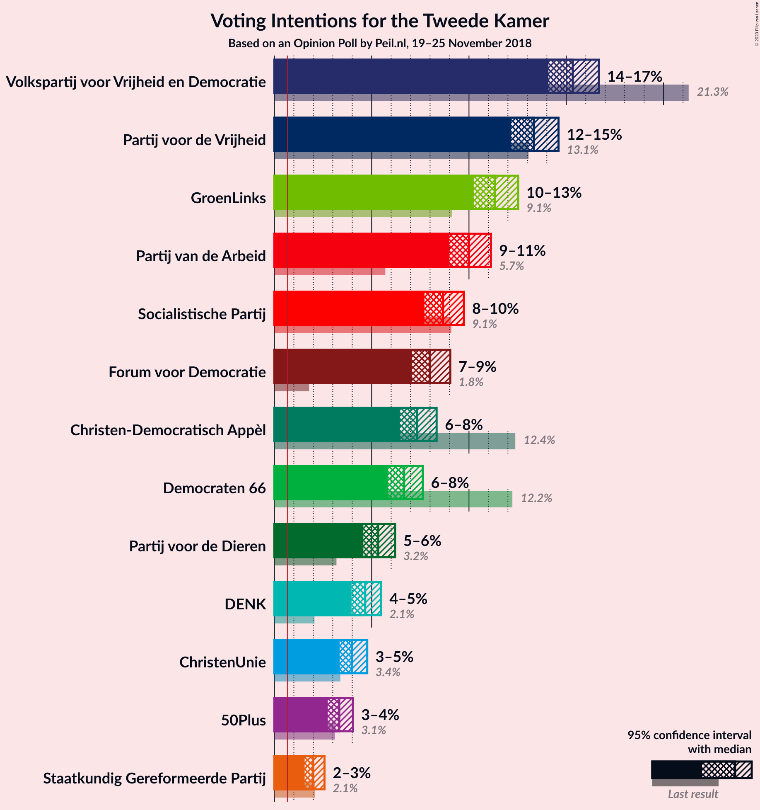

### Confidence Intervals

| Party | Last Result | Poll Result | 80% Confidence Interval | 90% Confidence Interval | 95% Confidence Interval | 99% Confidence Interval |
|:-----:|:-----------:|:-----------:|:-----------------------:|:-----------------------:|:-----------------------:|:-----------------------:|
| Volkspartij voor Vrijheid en Democratie | 21.3% | 15.3% | 14.5–16.2% |14.3–16.5% |14.1–16.7% |13.7–17.1% |
| Partij voor de Vrijheid | 13.1% | 13.3% | 12.6–14.2% |12.3–14.4% |12.2–14.6% |11.8–15.0% |
| GroenLinks | 9.1% | 11.3% | 10.6–12.1% |10.4–12.3% |10.2–12.5% |9.9–12.9% |
| Partij van de Arbeid | 5.7% | 10.0% | 9.3–10.7% |9.1–10.9% |9.0–11.1% |8.7–11.5% |
| Socialistische Partij | 9.1% | 8.7% | 8.0–9.4% |7.8–9.6% |7.7–9.7% |7.4–10.1% |
| Forum voor Democratie | 1.8% | 8.0% | 7.4–8.7% |7.2–8.9% |7.1–9.0% |6.8–9.4% |
| Christen-Democratisch Appèl | 12.4% | 7.3% | 6.8–8.0% |6.6–8.2% |6.4–8.3% |6.2–8.6% |
| Democraten 66 | 12.2% | 6.7% | 6.1–7.3% |6.0–7.5% |5.8–7.6% |5.6–7.9% |
| Partij voor de Dieren | 3.2% | 5.3% | 4.8–5.9% |4.7–6.1% |4.6–6.2% |4.4–6.5% |
| DENK | 2.1% | 4.7% | 4.2–5.2% |4.1–5.3% |4.0–5.5% |3.7–5.8% |
| ChristenUnie | 3.4% | 4.0% | 3.6–4.5% |3.4–4.6% |3.4–4.8% |3.2–5.0% |
| 50Plus | 3.1% | 3.3% | 2.9–3.8% |2.8–3.9% |2.7–4.0% |2.6–4.3% |
| Staatkundig Gereformeerde Partij | 2.1% | 2.0% | 1.7–2.4% |1.6–2.5% |1.6–2.6% |1.4–2.8% |

*Note:* The poll result column reflects the actual value used in the calculations. Published results may vary slightly, and in addition be rounded to fewer digits.

## Seats

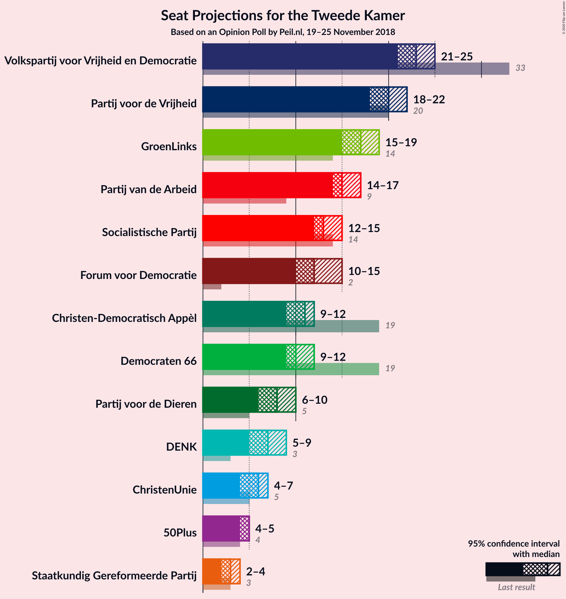

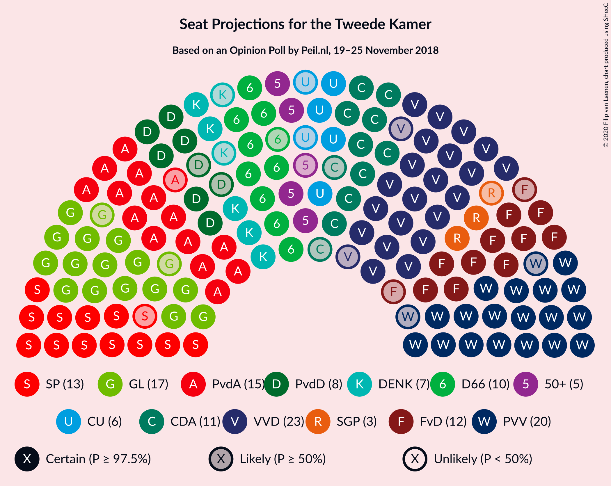

### Confidence Intervals

| Party | Last Result | Median | 80% Confidence Interval | 90% Confidence Interval | 95% Confidence Interval | 99% Confidence Interval |
|:-----:|:-----------:|:------:|:-----------------------:|:-----------------------:|:-----------------------:|:-----------------------:|
| <a href="#volkspartij-voor-vrijheid-en-democratie">Volkspartij voor Vrijheid en Democratie</a> | 33 | 23 | 21–25 |21–25 |21–25 |20–26 |
| <a href="#partij-voor-de-vrijheid">Partij voor de Vrijheid</a> | 20 | 20 | 18–22 |18–22 |18–22 |18–22 |
| <a href="#groenlinks">GroenLinks</a> | 14 | 17 | 16–19 |15–19 |15–19 |14–20 |
| <a href="#partij-van-de-arbeid">Partij van de Arbeid</a> | 9 | 15 | 14–17 |14–17 |14–17 |13–18 |
| <a href="#socialistische-partij">Socialistische Partij</a> | 14 | 13 | 12–14 |12–14 |12–15 |11–16 |
| <a href="#forum-voor-democratie">Forum voor Democratie</a> | 2 | 12 | 10–14 |10–15 |10–15 |9–15 |
| <a href="#christen-democratisch-appèl">Christen-Democratisch Appèl</a> | 19 | 11 | 10–12 |10–12 |9–12 |9–12 |
| <a href="#democraten-66">Democraten 66</a> | 19 | 10 | 9–11 |9–11 |9–12 |8–13 |
| <a href="#partij-voor-de-dieren">Partij voor de Dieren</a> | 5 | 8 | 7–10 |7–10 |6–10 |6–10 |
| <a href="#denk">DENK</a> | 3 | 7 | 5–9 |5–9 |5–9 |5–9 |
| <a href="#christenunie">ChristenUnie</a> | 5 | 6 | 4–7 |4–7 |4–7 |4–7 |
| <a href="#50plus">50Plus</a> | 4 | 5 | 4–5 |4–5 |4–5 |3–6 |
| <a href="#staatkundig-gereformeerde-partij">Staatkundig Gereformeerde Partij</a> | 3 | 3 | 2–3 |2–3 |2–4 |1–4 |

### Volkspartij voor Vrijheid en Democratie

*For a full overview of the results for this party, see the [Volkspartij voor Vrijheid en Democratie](party-volkspartijvoorvrijheidendemocratie.html) page.*

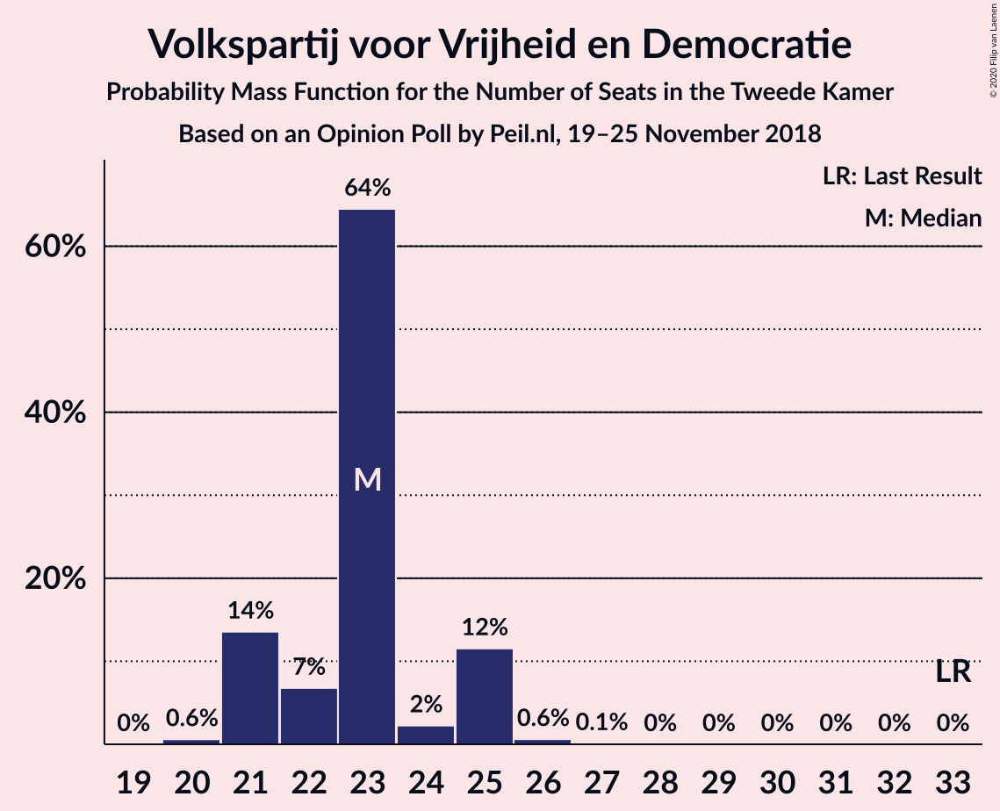

| Number of Seats | Probability | Accumulated | Special Marks |
|:---------------:|:-----------:|:-----------:|:-------------:|
| 20 | 0.6% | 100% |  |
| 21 | 14% | 99.4% |  |
| 22 | 7% | 86% |  |
| 23 | 64% | 79% | Median |
| 24 | 2% | 15% |  |
| 25 | 12% | 12% |  |
| 26 | 0.6% | 0.7% |  |
| 27 | 0.1% | 0.1% |  |
| 28 | 0% | 0% |  |
| 29 | 0% | 0% |  |
| 30 | 0% | 0% |  |
| 31 | 0% | 0% |  |
| 32 | 0% | 0% |  |
| 33 | 0% | 0% | Last Result |

### Partij voor de Vrijheid

*For a full overview of the results for this party, see the [Partij voor de Vrijheid](party-partijvoordevrijheid.html) page.*

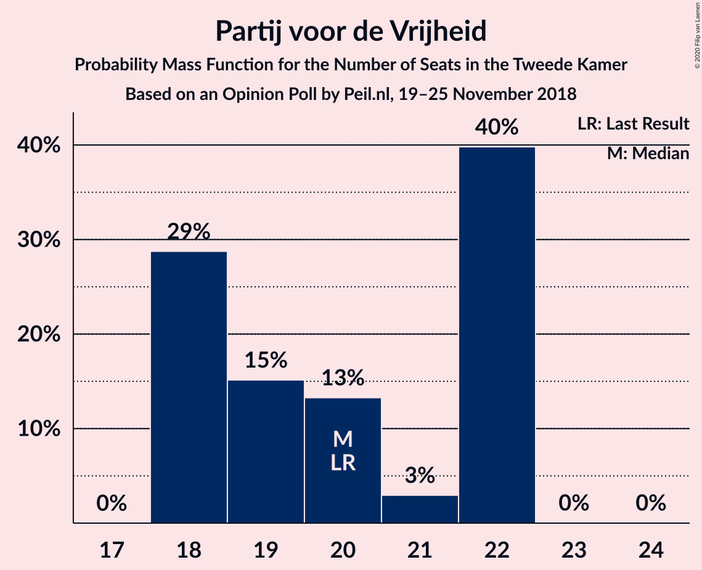

| Number of Seats | Probability | Accumulated | Special Marks |
|:---------------:|:-----------:|:-----------:|:-------------:|
| 18 | 29% | 100% |  |
| 19 | 15% | 71% |  |
| 20 | 13% | 56% | Last Result, Median |
| 21 | 3% | 43% |  |
| 22 | 40% | 40% |  |
| 23 | 0% | 0.1% |  |
| 24 | 0% | 0% |  |

### GroenLinks

*For a full overview of the results for this party, see the [GroenLinks](party-groenlinks.html) page.*

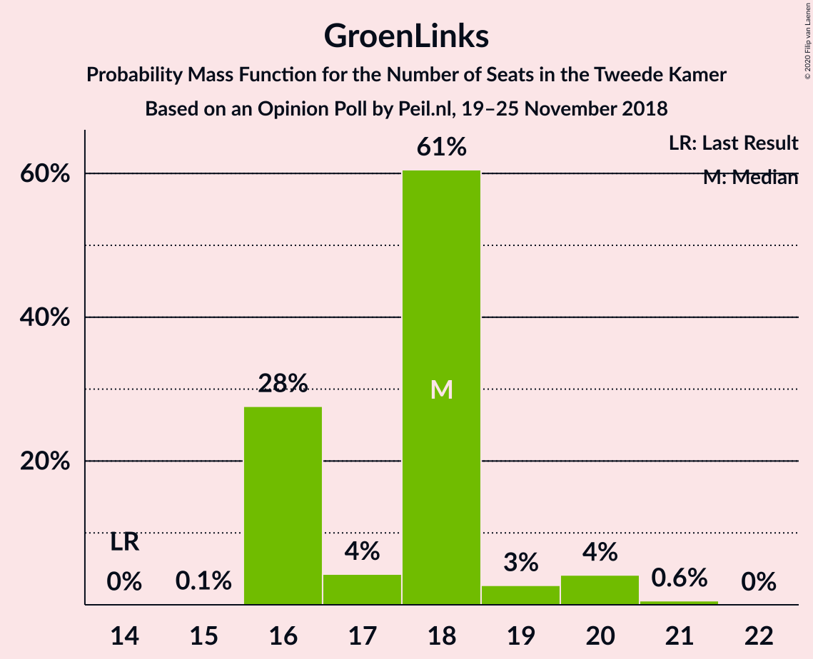

| Number of Seats | Probability | Accumulated | Special Marks |
|:---------------:|:-----------:|:-----------:|:-------------:|
| 13 | 0.2% | 100% |  |
| 14 | 0.9% | 99.8% | Last Result |
| 15 | 8% | 98.9% |  |
| 16 | 25% | 91% |  |
| 17 | 27% | 65% | Median |
| 18 | 28% | 39% |  |
| 19 | 10% | 10% |  |
| 20 | 0.1% | 0.5% |  |
| 21 | 0% | 0.4% |  |
| 22 | 0.4% | 0.4% |  |
| 23 | 0% | 0% |  |

### Partij van de Arbeid

*For a full overview of the results for this party, see the [Partij van de Arbeid](party-partijvandearbeid.html) page.*

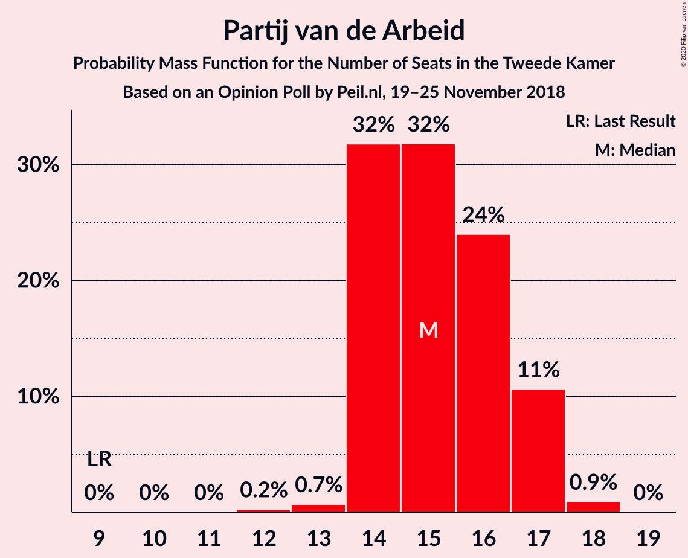

| Number of Seats | Probability | Accumulated | Special Marks |
|:---------------:|:-----------:|:-----------:|:-------------:|
| 9 | 0% | 100% | Last Result |
| 10 | 0% | 100% |  |
| 11 | 0% | 100% |  |
| 12 | 0.2% | 100% |  |
| 13 | 0.7% | 99.8% |  |
| 14 | 32% | 99.1% |  |
| 15 | 32% | 67% | Median |
| 16 | 24% | 36% |  |
| 17 | 11% | 12% |  |
| 18 | 0.9% | 0.9% |  |
| 19 | 0% | 0% |  |

### Socialistische Partij

*For a full overview of the results for this party, see the [Socialistische Partij](party-socialistischepartij.html) page.*

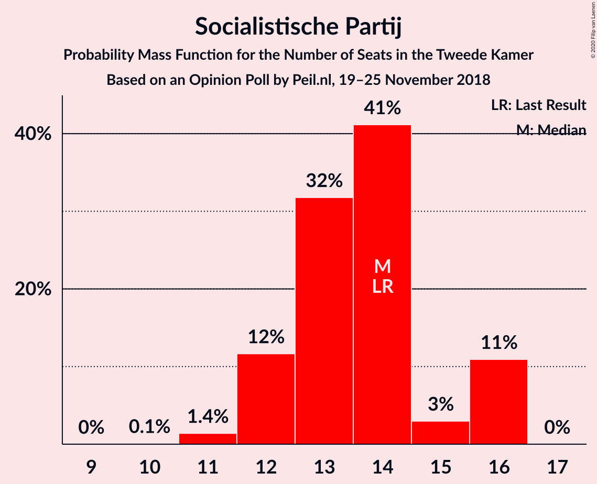

| Number of Seats | Probability | Accumulated | Special Marks |
|:---------------:|:-----------:|:-----------:|:-------------:|
| 9 | 0.1% | 100% |  |
| 10 | 0.1% | 99.9% |  |
| 11 | 0.9% | 99.9% |  |
| 12 | 32% | 98.9% |  |
| 13 | 42% | 67% | Median |
| 14 | 21% | 25% | Last Result |
| 15 | 2% | 5% |  |
| 16 | 2% | 2% |  |
| 17 | 0% | 0% |  |

### Forum voor Democratie

*For a full overview of the results for this party, see the [Forum voor Democratie](party-forumvoordemocratie.html) page.*

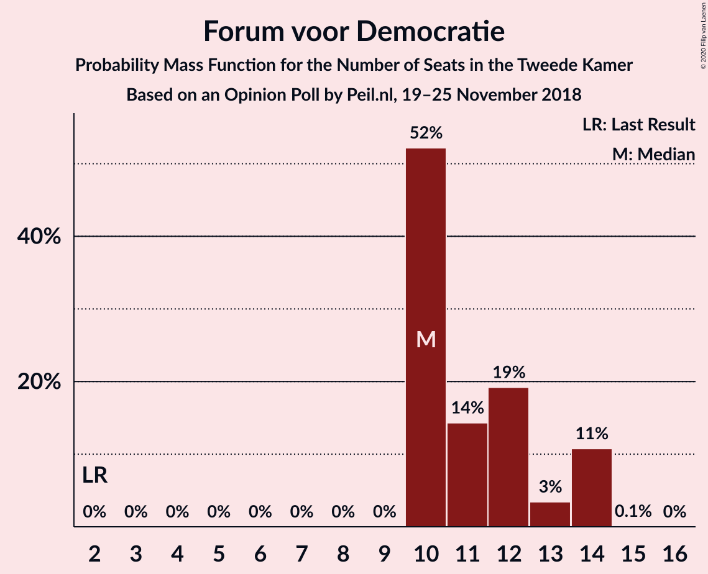

| Number of Seats | Probability | Accumulated | Special Marks |
|:---------------:|:-----------:|:-----------:|:-------------:|
| 2 | 0% | 100% | Last Result |
| 3 | 0% | 100% |  |
| 4 | 0% | 100% |  |
| 5 | 0% | 100% |  |
| 6 | 0% | 100% |  |
| 7 | 0% | 100% |  |
| 8 | 0% | 100% |  |
| 9 | 2% | 100% |  |
| 10 | 10% | 98% |  |
| 11 | 4% | 88% |  |
| 12 | 35% | 84% | Median |
| 13 | 38% | 48% |  |
| 14 | 3% | 11% |  |
| 15 | 8% | 8% |  |
| 16 | 0% | 0% |  |

### Christen-Democratisch Appèl

*For a full overview of the results for this party, see the [Christen-Democratisch Appèl](party-christen-democratischappèl.html) page.*

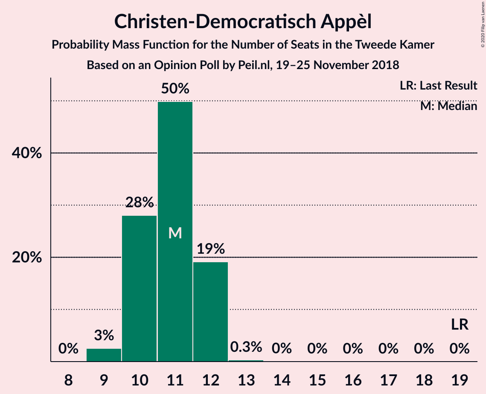

| Number of Seats | Probability | Accumulated | Special Marks |
|:---------------:|:-----------:|:-----------:|:-------------:|
| 9 | 3% | 100% |  |
| 10 | 28% | 97% |  |
| 11 | 50% | 69% | Median |
| 12 | 19% | 20% |  |
| 13 | 0.3% | 0.4% |  |
| 14 | 0% | 0.1% |  |
| 15 | 0% | 0% |  |
| 16 | 0% | 0% |  |
| 17 | 0% | 0% |  |
| 18 | 0% | 0% |  |
| 19 | 0% | 0% | Last Result |

### Democraten 66

*For a full overview of the results for this party, see the [Democraten 66](party-democraten66.html) page.*

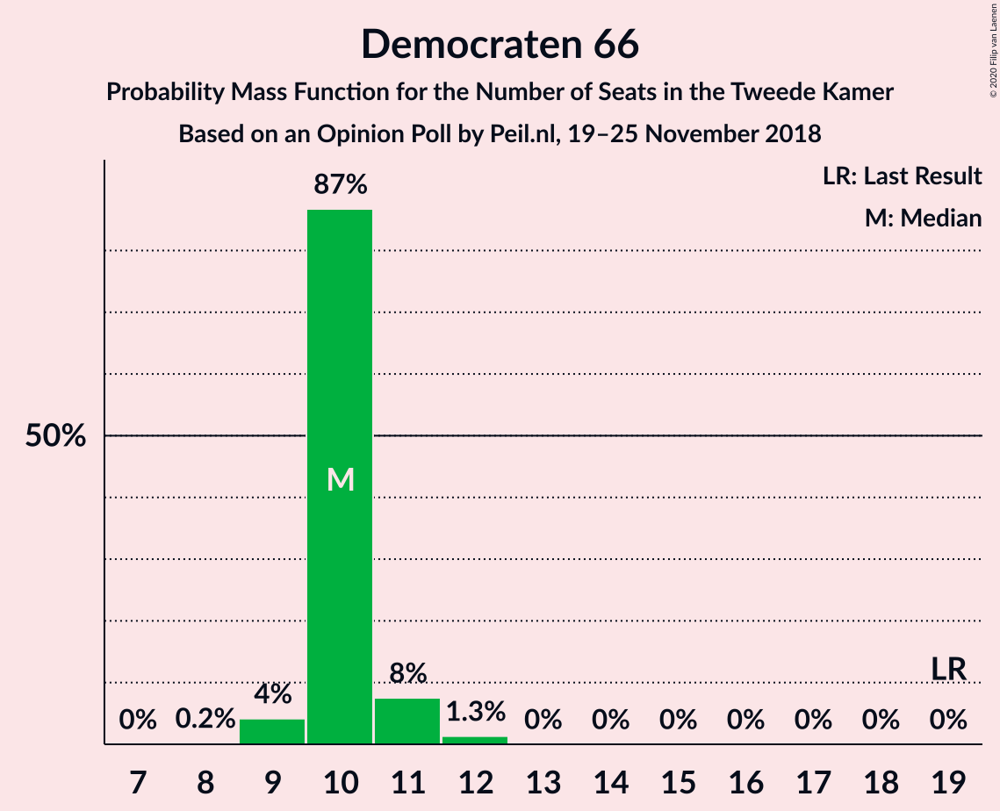

| Number of Seats | Probability | Accumulated | Special Marks |
|:---------------:|:-----------:|:-----------:|:-------------:|
| 8 | 1.1% | 100% |  |
| 9 | 21% | 98.9% |  |
| 10 | 53% | 78% | Median |
| 11 | 22% | 25% |  |
| 12 | 3% | 4% |  |
| 13 | 1.0% | 1.0% |  |
| 14 | 0% | 0% |  |
| 15 | 0% | 0% |  |
| 16 | 0% | 0% |  |
| 17 | 0% | 0% |  |
| 18 | 0% | 0% |  |
| 19 | 0% | 0% | Last Result |

### Partij voor de Dieren

*For a full overview of the results for this party, see the [Partij voor de Dieren](party-partijvoordedieren.html) page.*

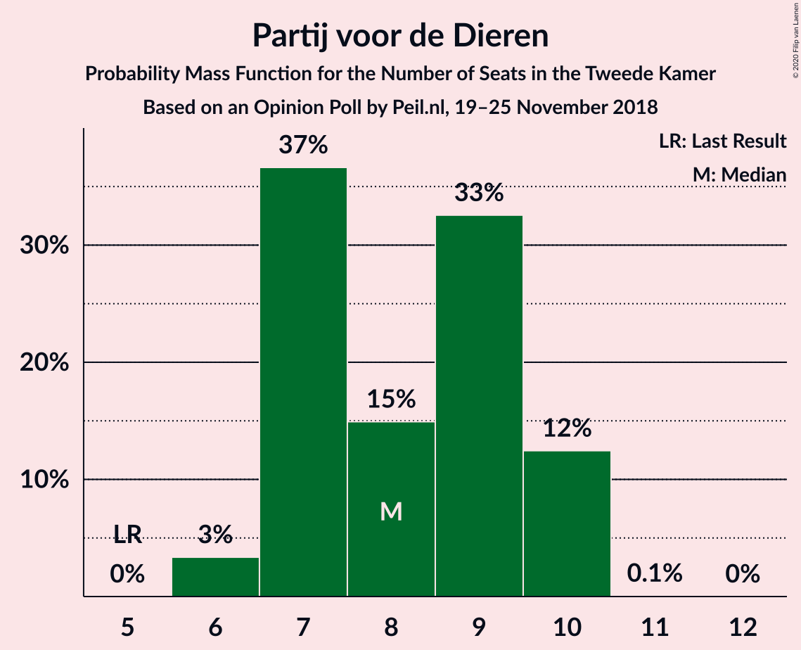

| Number of Seats | Probability | Accumulated | Special Marks |
|:---------------:|:-----------:|:-----------:|:-------------:|
| 5 | 0% | 100% | Last Result |
| 6 | 3% | 100% |  |
| 7 | 37% | 97% |  |
| 8 | 15% | 60% | Median |
| 9 | 33% | 45% |  |
| 10 | 12% | 13% |  |
| 11 | 0.1% | 0.1% |  |
| 12 | 0% | 0% |  |

### DENK

*For a full overview of the results for this party, see the [DENK](party-denk.html) page.*

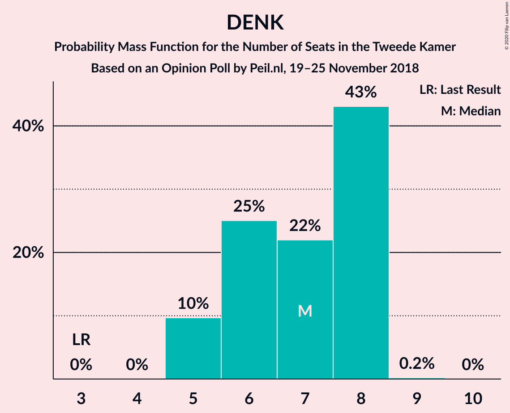

| Number of Seats | Probability | Accumulated | Special Marks |
|:---------------:|:-----------:|:-----------:|:-------------:|
| 3 | 0% | 100% | Last Result |
| 4 | 0% | 100% |  |
| 5 | 12% | 100% |  |
| 6 | 24% | 88% |  |
| 7 | 20% | 65% | Median |
| 8 | 15% | 44% |  |
| 9 | 29% | 29% |  |
| 10 | 0% | 0% |  |

### ChristenUnie

*For a full overview of the results for this party, see the [ChristenUnie](party-christenunie.html) page.*

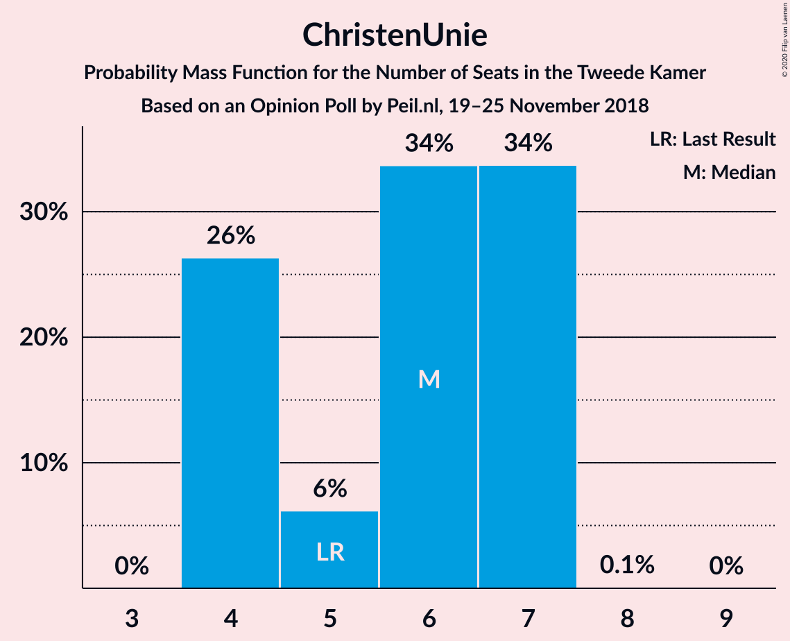

| Number of Seats | Probability | Accumulated | Special Marks |
|:---------------:|:-----------:|:-----------:|:-------------:|
| 4 | 26% | 100% |  |
| 5 | 6% | 74% | Last Result |
| 6 | 34% | 67% | Median |
| 7 | 34% | 34% |  |
| 8 | 0.1% | 0.1% |  |
| 9 | 0% | 0% |  |

### 50Plus

*For a full overview of the results for this party, see the [50Plus](party-50plus.html) page.*

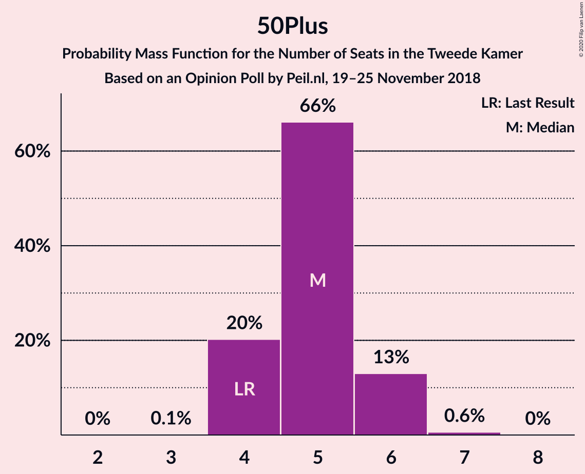

| Number of Seats | Probability | Accumulated | Special Marks |
|:---------------:|:-----------:|:-----------:|:-------------:|
| 3 | 2% | 100% |  |
| 4 | 19% | 98% | Last Result |
| 5 | 78% | 80% | Median |
| 6 | 1.3% | 1.4% |  |
| 7 | 0.1% | 0.1% |  |
| 8 | 0% | 0% |  |

### Staatkundig Gereformeerde Partij

*For a full overview of the results for this party, see the [Staatkundig Gereformeerde Partij](party-staatkundiggereformeerdepartij.html) page.*

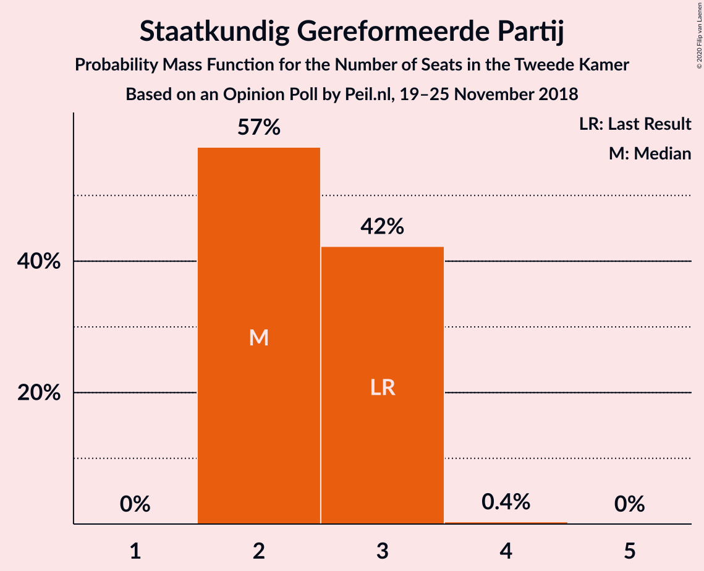

| Number of Seats | Probability | Accumulated | Special Marks |
|:---------------:|:-----------:|:-----------:|:-------------:|
| 1 | 0.7% | 100% |  |
| 2 | 49% | 99.3% |  |
| 3 | 47% | 50% | Last Result, Median |
| 4 | 3% | 3% |  |
| 5 | 0% | 0% |  |

## Coalitions

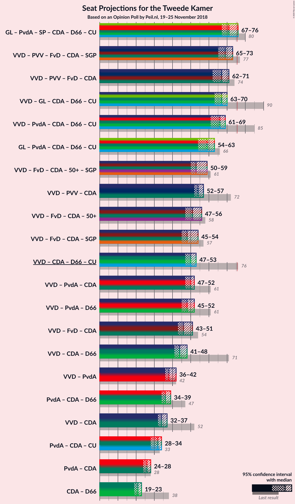

### Confidence Intervals

| Coalition | Last Result | Median | Majority? | 80% Confidence Interval | 90% Confidence Interval | 95% Confidence Interval | 99% Confidence Interval |
|:---------:|:-----------:|:------:|:---------:|:-----------------------:|:-----------------------:|:-----------------------:|:-----------------------:|
| GroenLinks – Partij van de Arbeid – Socialistische Partij – Christen-Democratisch Appèl – Democraten 66 – ChristenUnie | 80 | 71 | 29% | 67–76 | 67–76 | 67–76 | 67–77 |
| Volkspartij voor Vrijheid en Democratie – Partij voor de Vrijheid – Forum voor Democratie – Christen-Democratisch Appèl – Staatkundig Gereformeerde Partij | 77 | 69 | 0% | 67–72 | 65–72 | 65–73 | 65–73 |
| Volkspartij voor Vrijheid en Democratie – Partij voor de Vrijheid – Forum voor Democratie – Christen-Democratisch Appèl | 74 | 67 | 0% | 64–69 | 62–70 | 62–71 | 62–71 |
| Volkspartij voor Vrijheid en Democratie – GroenLinks – Christen-Democratisch Appèl – Democraten 66 – ChristenUnie | 90 | 67 | 0% | 63–70 | 63–70 | 63–70 | 62–71 |
| Volkspartij voor Vrijheid en Democratie – Partij van de Arbeid – Christen-Democratisch Appèl – Democraten 66 – ChristenUnie | 85 | 66 | 0% | 61–68 | 61–68 | 61–69 | 61–71 |
| GroenLinks – Partij van de Arbeid – Christen-Democratisch Appèl – Democraten 66 – ChristenUnie | 66 | 59 | 0% | 54–62 | 54–63 | 54–63 | 54–63 |
| Volkspartij voor Vrijheid en Democratie – Forum voor Democratie – Christen-Democratisch Appèl – 50Plus – Staatkundig Gereformeerde Partij | 61 | 53 | 0% | 51–55 | 51–57 | 50–59 | 50–59 |
| Volkspartij voor Vrijheid en Democratie – Partij voor de Vrijheid – Christen-Democratisch Appèl | 72 | 54 | 0% | 52–56 | 52–56 | 52–57 | 52–58 |
| Volkspartij voor Vrijheid en Democratie – Forum voor Democratie – Christen-Democratisch Appèl – 50Plus | 58 | 51 | 0% | 48–53 | 48–55 | 47–56 | 47–56 |
| Volkspartij voor Vrijheid en Democratie – Forum voor Democratie – Christen-Democratisch Appèl – Staatkundig Gereformeerde Partij | 57 | 48 | 0% | 47–51 | 47–53 | 45–54 | 45–54 |
| Volkspartij voor Vrijheid en Democratie – Christen-Democratisch Appèl – Democraten 66 – ChristenUnie | 76 | 50 | 0% | 47–52 | 47–52 | 47–53 | 45–54 |
| Volkspartij voor Vrijheid en Democratie – Partij van de Arbeid – Christen-Democratisch Appèl | 61 | 50 | 0% | 47–51 | 47–51 | 47–52 | 46–54 |
| Volkspartij voor Vrijheid en Democratie – Partij van de Arbeid – Democraten 66 | 61 | 48 | 0% | 45–50 | 45–51 | 45–52 | 45–54 |
| Volkspartij voor Vrijheid en Democratie – Forum voor Democratie – Christen-Democratisch Appèl | 54 | 46 | 0% | 44–48 | 44–51 | 43–51 | 42–51 |
| Volkspartij voor Vrijheid en Democratie – Christen-Democratisch Appèl – Democraten 66 | 71 | 44 | 0% | 41–45 | 41–46 | 41–48 | 40–48 |
| Volkspartij voor Vrijheid en Democratie – Partij van de Arbeid | 42 | 38 | 0% | 36–40 | 36–40 | 36–42 | 35–43 |
| Partij van de Arbeid – Christen-Democratisch Appèl – Democraten 66 | 47 | 36 | 0% | 34–38 | 34–38 | 34–39 | 32–40 |
| Volkspartij voor Vrijheid en Democratie – Christen-Democratisch Appèl | 52 | 34 | 0% | 32–36 | 32–36 | 32–37 | 31–37 |
| Partij van de Arbeid – Christen-Democratisch Appèl – ChristenUnie | 33 | 32 | 0% | 28–34 | 28–34 | 28–34 | 28–35 |
| Partij van de Arbeid – Christen-Democratisch Appèl | 28 | 26 | 0% | 24–28 | 24–28 | 24–28 | 23–29 |
| Christen-Democratisch Appèl – Democraten 66 | 38 | 21 | 0% | 20–22 | 20–23 | 19–23 | 18–24 |

### GroenLinks – Partij van de Arbeid – Socialistische Partij – Christen-Democratisch Appèl – Democraten 66 – ChristenUnie

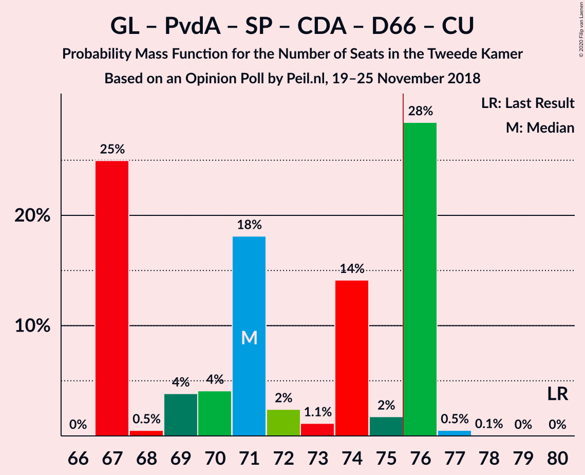

| Number of Seats | Probability | Accumulated | Special Marks |
|:---------------:|:-----------:|:-----------:|:-------------:|
| 67 | 25% | 100% |  |
| 68 | 0.5% | 75% |  |
| 69 | 4% | 75% |  |
| 70 | 4% | 71% |  |
| 71 | 18% | 67% |  |
| 72 | 2% | 48% | Median |
| 73 | 1.1% | 46% |  |
| 74 | 14% | 45% |  |
| 75 | 2% | 31% |  |
| 76 | 28% | 29% | Majority |
| 77 | 0.5% | 0.6% |  |
| 78 | 0.1% | 0.1% |  |
| 79 | 0% | 0% |  |
| 80 | 0% | 0% | Last Result |

### Volkspartij voor Vrijheid en Democratie – Partij voor de Vrijheid – Forum voor Democratie – Christen-Democratisch Appèl – Staatkundig Gereformeerde Partij

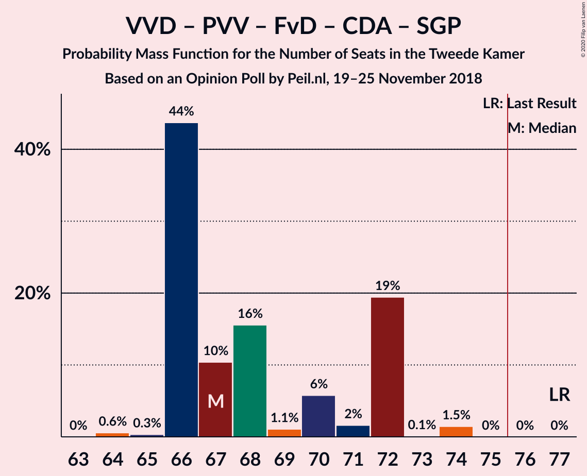

| Number of Seats | Probability | Accumulated | Special Marks |
|:---------------:|:-----------:|:-----------:|:-------------:|
| 65 | 9% | 100% |  |
| 66 | 1.1% | 91% |  |
| 67 | 20% | 90% |  |
| 68 | 18% | 70% |  |
| 69 | 3% | 52% | Median |
| 70 | 37% | 49% |  |
| 71 | 0.7% | 12% |  |
| 72 | 7% | 11% |  |
| 73 | 4% | 4% |  |
| 74 | 0.2% | 0.2% |  |
| 75 | 0% | 0% |  |
| 76 | 0% | 0% | Majority |
| 77 | 0% | 0% | Last Result |

### Volkspartij voor Vrijheid en Democratie – Partij voor de Vrijheid – Forum voor Democratie – Christen-Democratisch Appèl

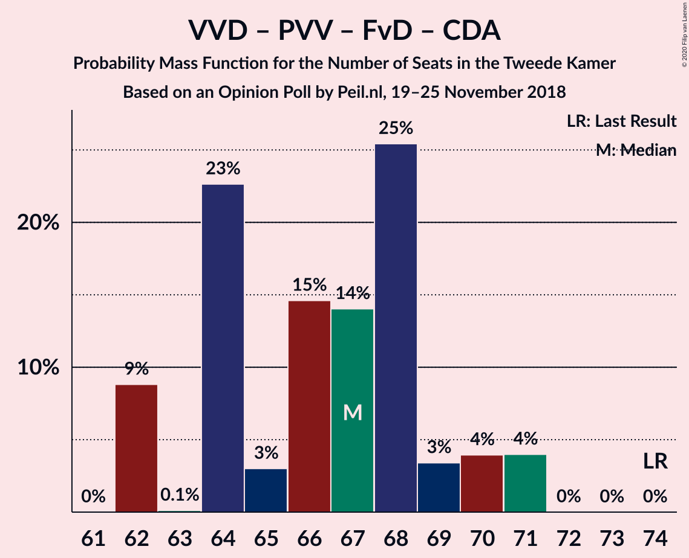

| Number of Seats | Probability | Accumulated | Special Marks |
|:---------------:|:-----------:|:-----------:|:-------------:|
| 62 | 9% | 100% |  |
| 63 | 0.1% | 91% |  |
| 64 | 23% | 91% |  |
| 65 | 3% | 68% |  |
| 66 | 15% | 65% | Median |
| 67 | 14% | 51% |  |
| 68 | 25% | 37% |  |
| 69 | 3% | 11% |  |
| 70 | 4% | 8% |  |
| 71 | 4% | 4% |  |
| 72 | 0% | 0% |  |
| 73 | 0% | 0% |  |
| 74 | 0% | 0% | Last Result |

### Volkspartij voor Vrijheid en Democratie – GroenLinks – Christen-Democratisch Appèl – Democraten 66 – ChristenUnie

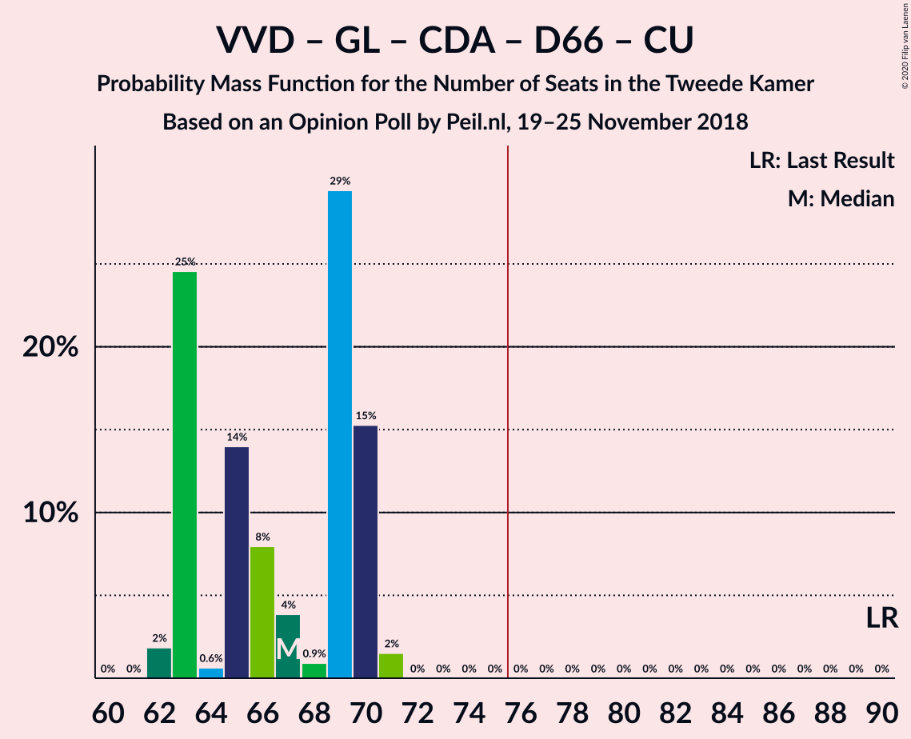

| Number of Seats | Probability | Accumulated | Special Marks |
|:---------------:|:-----------:|:-----------:|:-------------:|
| 62 | 2% | 100% |  |
| 63 | 25% | 98% |  |
| 64 | 0.6% | 74% |  |
| 65 | 14% | 73% |  |
| 66 | 8% | 59% |  |
| 67 | 4% | 51% | Median |
| 68 | 0.9% | 47% |  |
| 69 | 29% | 46% |  |
| 70 | 15% | 17% |  |
| 71 | 2% | 2% |  |
| 72 | 0% | 0% |  |
| 73 | 0% | 0% |  |
| 74 | 0% | 0% |  |
| 75 | 0% | 0% |  |
| 76 | 0% | 0% | Majority |
| 77 | 0% | 0% |  |
| 78 | 0% | 0% |  |
| 79 | 0% | 0% |  |
| 80 | 0% | 0% |  |
| 81 | 0% | 0% |  |
| 82 | 0% | 0% |  |
| 83 | 0% | 0% |  |
| 84 | 0% | 0% |  |
| 85 | 0% | 0% |  |
| 86 | 0% | 0% |  |
| 87 | 0% | 0% |  |
| 88 | 0% | 0% |  |
| 89 | 0% | 0% |  |
| 90 | 0% | 0% | Last Result |

### Volkspartij voor Vrijheid en Democratie – Partij van de Arbeid – Christen-Democratisch Appèl – Democraten 66 – ChristenUnie

| Number of Seats | Probability | Accumulated | Special Marks |
|:---------------:|:-----------:|:-----------:|:-------------:|
| 59 | 0.1% | 100% |  |
| 60 | 0.1% | 99.9% |  |
| 61 | 25% | 99.9% |  |
| 62 | 16% | 75% |  |
| 63 | 0.7% | 59% |  |
| 64 | 0.6% | 58% |  |
| 65 | 6% | 57% | Median |
| 66 | 6% | 51% |  |
| 67 | 20% | 45% |  |
| 68 | 22% | 25% |  |
| 69 | 1.0% | 3% |  |
| 70 | 1.0% | 2% |  |
| 71 | 0.7% | 0.7% |  |
| 72 | 0% | 0% |  |
| 73 | 0% | 0% |  |
| 74 | 0% | 0% |  |
| 75 | 0% | 0% |  |
| 76 | 0% | 0% | Majority |
| 77 | 0% | 0% |  |
| 78 | 0% | 0% |  |
| 79 | 0% | 0% |  |
| 80 | 0% | 0% |  |
| 81 | 0% | 0% |  |
| 82 | 0% | 0% |  |
| 83 | 0% | 0% |  |
| 84 | 0% | 0% |  |
| 85 | 0% | 0% | Last Result |

### GroenLinks – Partij van de Arbeid – Christen-Democratisch Appèl – Democraten 66 – ChristenUnie

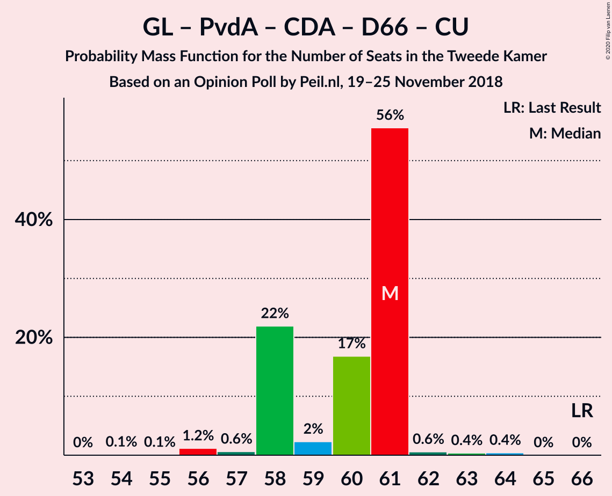

| Number of Seats | Probability | Accumulated | Special Marks |
|:---------------:|:-----------:|:-----------:|:-------------:|
| 54 | 25% | 100% |  |
| 55 | 0.4% | 75% |  |
| 56 | 4% | 75% |  |
| 57 | 3% | 71% |  |
| 58 | 6% | 68% |  |
| 59 | 14% | 62% | Median |
| 60 | 7% | 48% |  |
| 61 | 0.7% | 41% |  |
| 62 | 32% | 40% |  |
| 63 | 8% | 8% |  |
| 64 | 0.4% | 0.5% |  |
| 65 | 0% | 0% |  |
| 66 | 0% | 0% | Last Result |

### Volkspartij voor Vrijheid en Democratie – Forum voor Democratie – Christen-Democratisch Appèl – 50Plus – Staatkundig Gereformeerde Partij

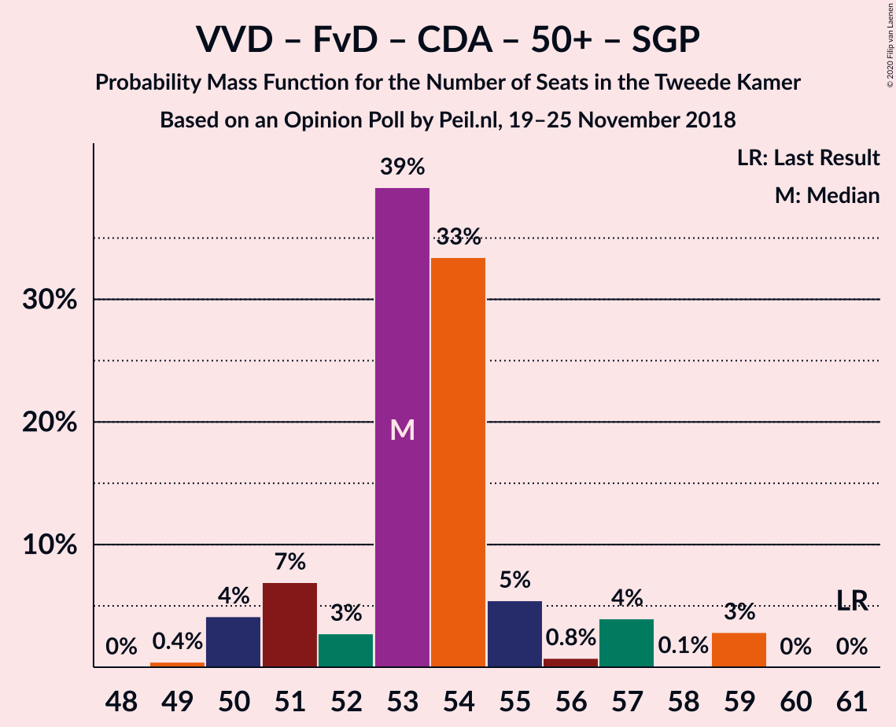

| Number of Seats | Probability | Accumulated | Special Marks |
|:---------------:|:-----------:|:-----------:|:-------------:|
| 49 | 0.4% | 100% |  |
| 50 | 4% | 99.5% |  |
| 51 | 7% | 95% |  |
| 52 | 3% | 88% |  |
| 53 | 39% | 86% |  |
| 54 | 33% | 47% | Median |
| 55 | 5% | 13% |  |
| 56 | 0.8% | 8% |  |
| 57 | 4% | 7% |  |
| 58 | 0.1% | 3% |  |
| 59 | 3% | 3% |  |
| 60 | 0% | 0% |  |
| 61 | 0% | 0% | Last Result |

### Volkspartij voor Vrijheid en Democratie – Partij voor de Vrijheid – Christen-Democratisch Appèl

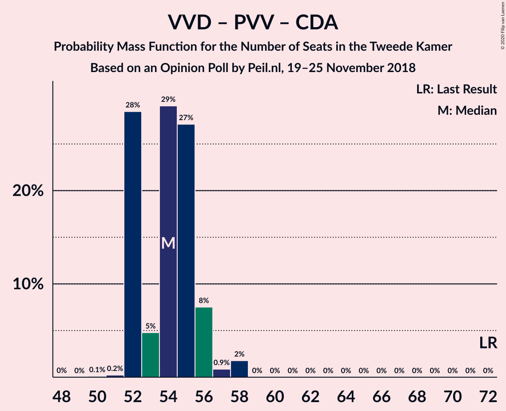

| Number of Seats | Probability | Accumulated | Special Marks |
|:---------------:|:-----------:|:-----------:|:-------------:|
| 50 | 0.1% | 100% |  |
| 51 | 0.2% | 99.9% |  |
| 52 | 28% | 99.6% |  |
| 53 | 5% | 71% |  |
| 54 | 29% | 66% | Median |
| 55 | 27% | 37% |  |
| 56 | 8% | 10% |  |
| 57 | 0.9% | 3% |  |
| 58 | 2% | 2% |  |
| 59 | 0% | 0% |  |
| 60 | 0% | 0% |  |
| 61 | 0% | 0% |  |
| 62 | 0% | 0% |  |
| 63 | 0% | 0% |  |
| 64 | 0% | 0% |  |
| 65 | 0% | 0% |  |
| 66 | 0% | 0% |  |
| 67 | 0% | 0% |  |
| 68 | 0% | 0% |  |
| 69 | 0% | 0% |  |
| 70 | 0% | 0% |  |
| 71 | 0% | 0% |  |
| 72 | 0% | 0% | Last Result |

### Volkspartij voor Vrijheid en Democratie – Forum voor Democratie – Christen-Democratisch Appèl – 50Plus

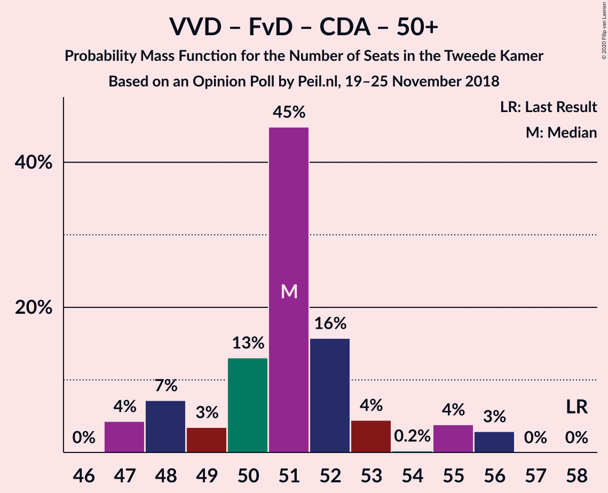

| Number of Seats | Probability | Accumulated | Special Marks |
|:---------------:|:-----------:|:-----------:|:-------------:|
| 47 | 4% | 100% |  |
| 48 | 7% | 96% |  |
| 49 | 3% | 89% |  |
| 50 | 13% | 85% |  |
| 51 | 45% | 72% | Median |
| 52 | 16% | 27% |  |
| 53 | 4% | 11% |  |
| 54 | 0.2% | 7% |  |
| 55 | 4% | 7% |  |
| 56 | 3% | 3% |  |
| 57 | 0% | 0% |  |
| 58 | 0% | 0% | Last Result |

### Volkspartij voor Vrijheid en Democratie – Forum voor Democratie – Christen-Democratisch Appèl – Staatkundig Gereformeerde Partij

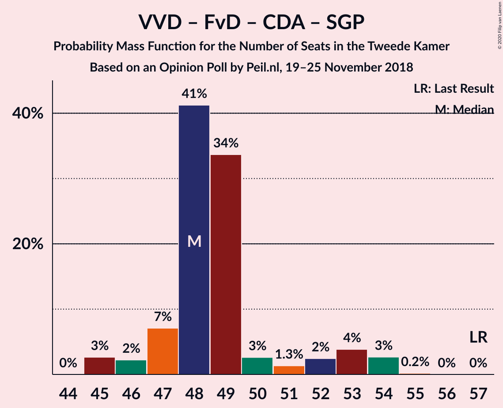

| Number of Seats | Probability | Accumulated | Special Marks |
|:---------------:|:-----------:|:-----------:|:-------------:|
| 45 | 3% | 100% |  |
| 46 | 2% | 97% |  |
| 47 | 7% | 95% |  |
| 48 | 41% | 88% |  |
| 49 | 34% | 47% | Median |
| 50 | 3% | 13% |  |
| 51 | 1.3% | 10% |  |
| 52 | 2% | 9% |  |
| 53 | 4% | 7% |  |
| 54 | 3% | 3% |  |
| 55 | 0.2% | 0.2% |  |
| 56 | 0% | 0% |  |
| 57 | 0% | 0% | Last Result |

### Volkspartij voor Vrijheid en Democratie – Christen-Democratisch Appèl – Democraten 66 – ChristenUnie

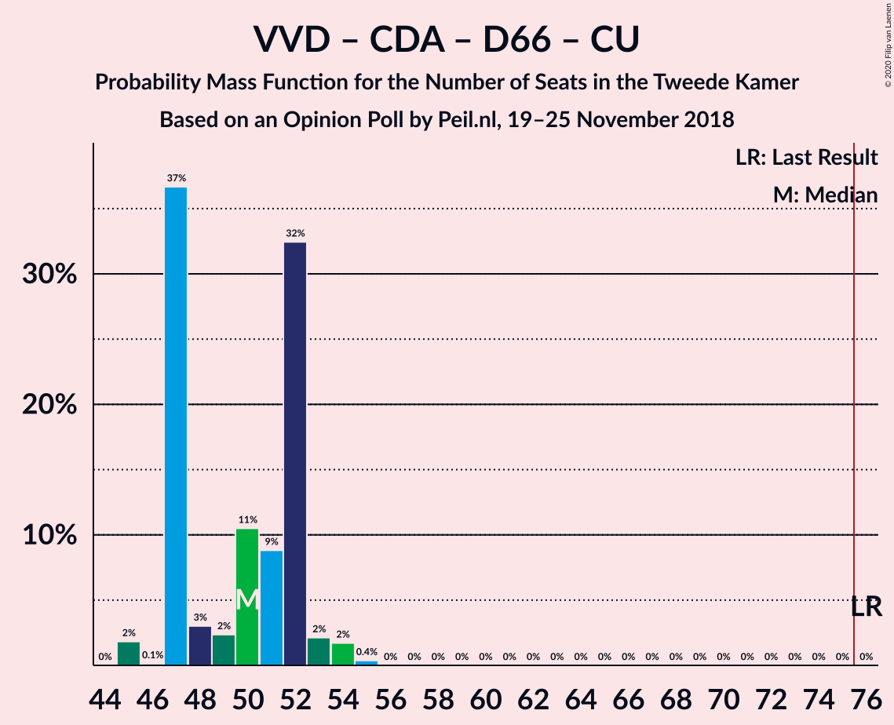

| Number of Seats | Probability | Accumulated | Special Marks |
|:---------------:|:-----------:|:-----------:|:-------------:|
| 45 | 2% | 100% |  |
| 46 | 0.1% | 98% |  |
| 47 | 37% | 98% |  |
| 48 | 3% | 61% |  |
| 49 | 2% | 58% |  |
| 50 | 11% | 56% | Median |
| 51 | 9% | 45% |  |
| 52 | 32% | 37% |  |
| 53 | 2% | 4% |  |
| 54 | 2% | 2% |  |
| 55 | 0.4% | 0.4% |  |
| 56 | 0% | 0% |  |
| 57 | 0% | 0% |  |
| 58 | 0% | 0% |  |
| 59 | 0% | 0% |  |
| 60 | 0% | 0% |  |
| 61 | 0% | 0% |  |
| 62 | 0% | 0% |  |
| 63 | 0% | 0% |  |
| 64 | 0% | 0% |  |
| 65 | 0% | 0% |  |
| 66 | 0% | 0% |  |
| 67 | 0% | 0% |  |
| 68 | 0% | 0% |  |
| 69 | 0% | 0% |  |
| 70 | 0% | 0% |  |
| 71 | 0% | 0% |  |
| 72 | 0% | 0% |  |
| 73 | 0% | 0% |  |
| 74 | 0% | 0% |  |
| 75 | 0% | 0% |  |
| 76 | 0% | 0% | Last Result, Majority |

### Volkspartij voor Vrijheid en Democratie – Partij van de Arbeid – Christen-Democratisch Appèl

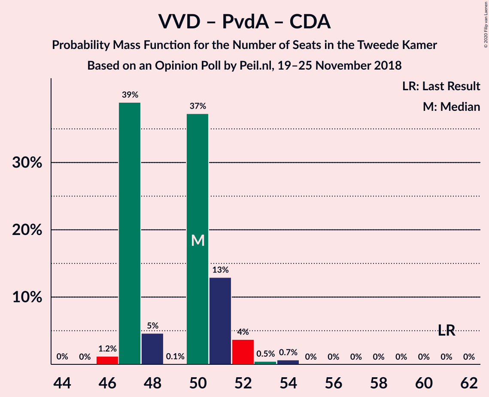

| Number of Seats | Probability | Accumulated | Special Marks |
|:---------------:|:-----------:|:-----------:|:-------------:|
| 44 | 0% | 100% |  |
| 45 | 0% | 99.9% |  |
| 46 | 1.2% | 99.9% |  |
| 47 | 39% | 98.7% |  |
| 48 | 5% | 60% |  |
| 49 | 0.1% | 55% | Median |
| 50 | 37% | 55% |  |
| 51 | 13% | 18% |  |
| 52 | 4% | 5% |  |
| 53 | 0.5% | 1.1% |  |
| 54 | 0.7% | 0.7% |  |
| 55 | 0% | 0% |  |
| 56 | 0% | 0% |  |
| 57 | 0% | 0% |  |
| 58 | 0% | 0% |  |
| 59 | 0% | 0% |  |
| 60 | 0% | 0% |  |
| 61 | 0% | 0% | Last Result |

### Volkspartij voor Vrijheid en Democratie – Partij van de Arbeid – Democraten 66

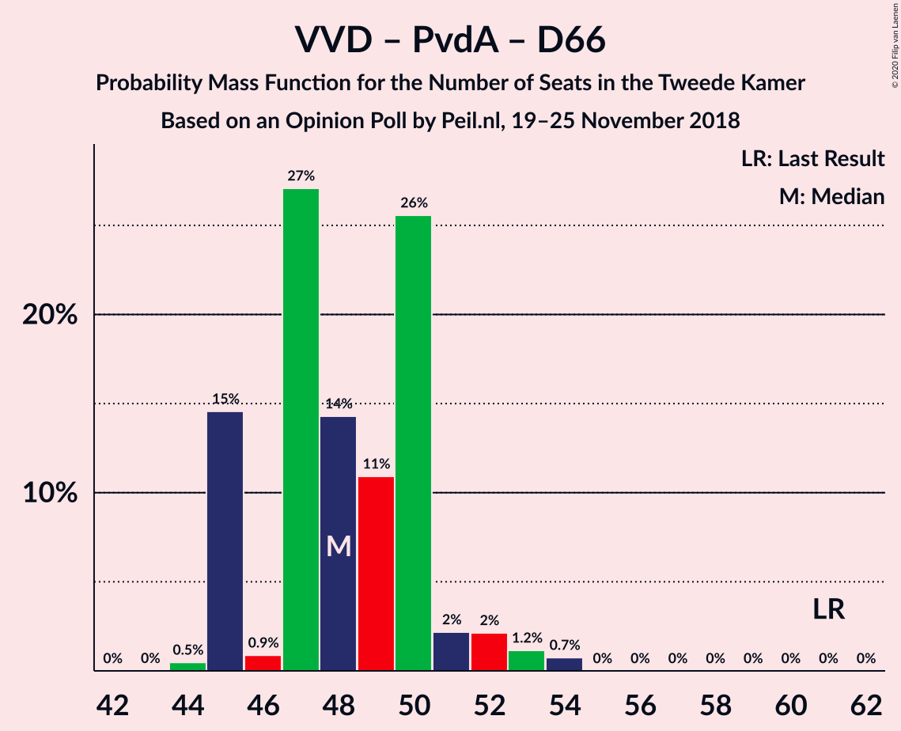

| Number of Seats | Probability | Accumulated | Special Marks |
|:---------------:|:-----------:|:-----------:|:-------------:|
| 44 | 0.5% | 100% |  |
| 45 | 15% | 99.5% |  |
| 46 | 0.9% | 85% |  |
| 47 | 27% | 84% |  |
| 48 | 14% | 57% | Median |
| 49 | 11% | 43% |  |
| 50 | 26% | 32% |  |
| 51 | 2% | 6% |  |
| 52 | 2% | 4% |  |
| 53 | 1.2% | 2% |  |
| 54 | 0.7% | 0.7% |  |
| 55 | 0% | 0% |  |
| 56 | 0% | 0% |  |
| 57 | 0% | 0% |  |
| 58 | 0% | 0% |  |
| 59 | 0% | 0% |  |
| 60 | 0% | 0% |  |
| 61 | 0% | 0% | Last Result |

### Volkspartij voor Vrijheid en Democratie – Forum voor Democratie – Christen-Democratisch Appèl

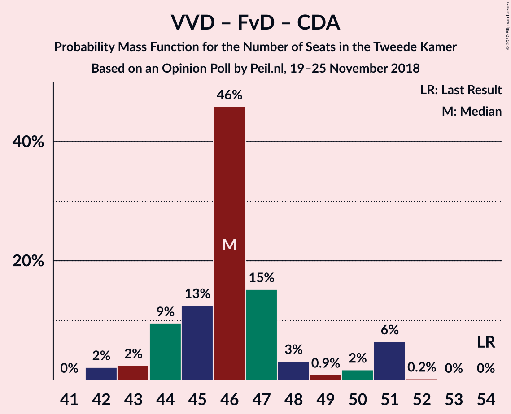

| Number of Seats | Probability | Accumulated | Special Marks |
|:---------------:|:-----------:|:-----------:|:-------------:|
| 42 | 2% | 100% |  |
| 43 | 2% | 98% |  |
| 44 | 9% | 95% |  |
| 45 | 13% | 86% |  |
| 46 | 46% | 73% | Median |
| 47 | 15% | 28% |  |
| 48 | 3% | 12% |  |
| 49 | 0.9% | 9% |  |
| 50 | 2% | 8% |  |
| 51 | 6% | 7% |  |
| 52 | 0.2% | 0.2% |  |
| 53 | 0% | 0% |  |
| 54 | 0% | 0% | Last Result |

### Volkspartij voor Vrijheid en Democratie – Christen-Democratisch Appèl – Democraten 66

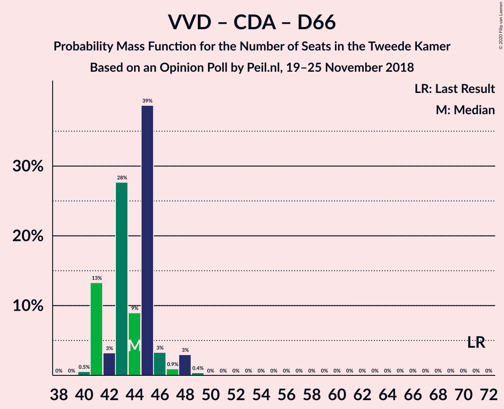

| Number of Seats | Probability | Accumulated | Special Marks |
|:---------------:|:-----------:|:-----------:|:-------------:|
| 40 | 0.5% | 100% |  |
| 41 | 13% | 99.5% |  |
| 42 | 3% | 86% |  |
| 43 | 28% | 83% |  |
| 44 | 9% | 55% | Median |
| 45 | 39% | 46% |  |
| 46 | 3% | 8% |  |
| 47 | 0.9% | 4% |  |
| 48 | 3% | 3% |  |
| 49 | 0.4% | 0.4% |  |
| 50 | 0% | 0% |  |
| 51 | 0% | 0% |  |
| 52 | 0% | 0% |  |
| 53 | 0% | 0% |  |
| 54 | 0% | 0% |  |
| 55 | 0% | 0% |  |
| 56 | 0% | 0% |  |
| 57 | 0% | 0% |  |
| 58 | 0% | 0% |  |
| 59 | 0% | 0% |  |
| 60 | 0% | 0% |  |
| 61 | 0% | 0% |  |
| 62 | 0% | 0% |  |
| 63 | 0% | 0% |  |
| 64 | 0% | 0% |  |
| 65 | 0% | 0% |  |
| 66 | 0% | 0% |  |
| 67 | 0% | 0% |  |
| 68 | 0% | 0% |  |
| 69 | 0% | 0% |  |
| 70 | 0% | 0% |  |
| 71 | 0% | 0% | Last Result |

### Volkspartij voor Vrijheid en Democratie – Partij van de Arbeid

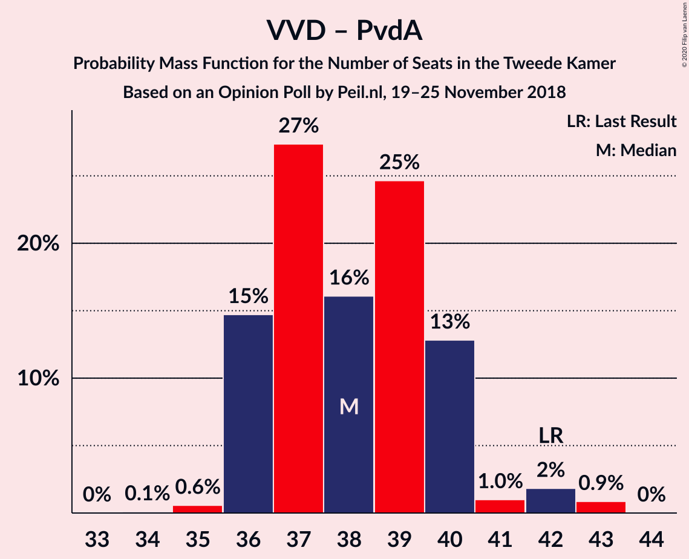

| Number of Seats | Probability | Accumulated | Special Marks |
|:---------------:|:-----------:|:-----------:|:-------------:|
| 34 | 0.1% | 100% |  |
| 35 | 0.6% | 99.9% |  |
| 36 | 15% | 99.3% |  |
| 37 | 27% | 85% |  |
| 38 | 16% | 57% | Median |
| 39 | 25% | 41% |  |
| 40 | 13% | 17% |  |
| 41 | 1.0% | 4% |  |
| 42 | 2% | 3% | Last Result |
| 43 | 0.9% | 0.9% |  |
| 44 | 0% | 0% |  |

### Partij van de Arbeid – Christen-Democratisch Appèl – Democraten 66

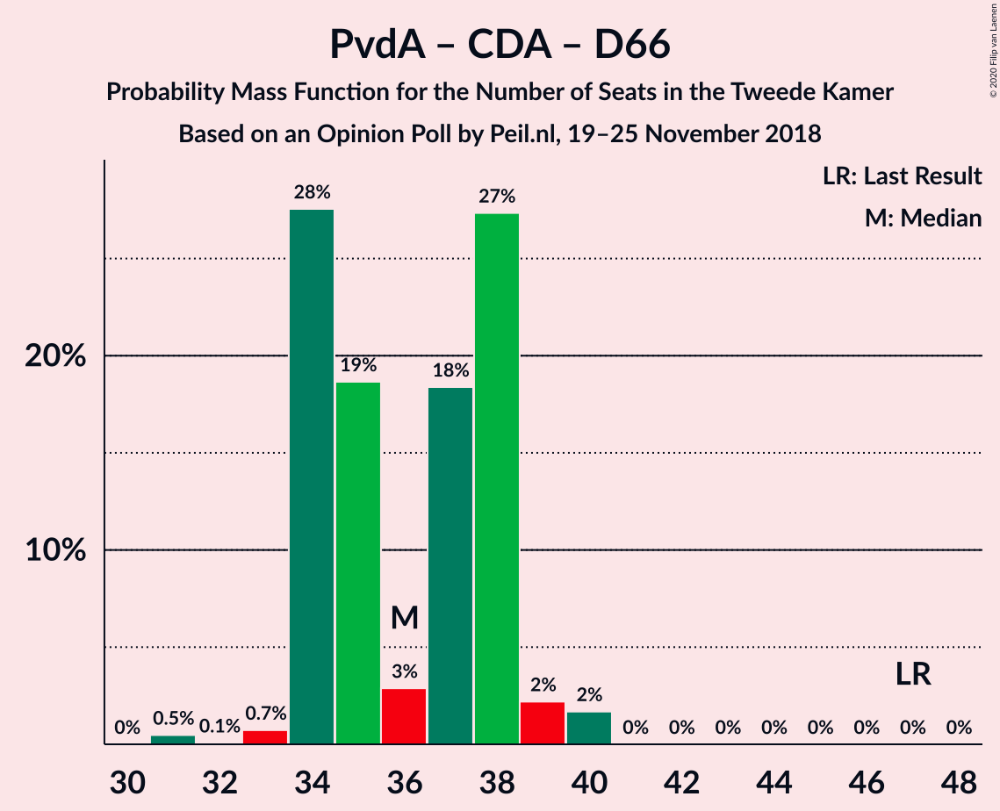

| Number of Seats | Probability | Accumulated | Special Marks |
|:---------------:|:-----------:|:-----------:|:-------------:|
| 31 | 0.5% | 100% |  |
| 32 | 0.1% | 99.5% |  |
| 33 | 0.7% | 99.4% |  |
| 34 | 28% | 98.7% |  |
| 35 | 19% | 71% |  |
| 36 | 3% | 53% | Median |
| 37 | 18% | 50% |  |
| 38 | 27% | 31% |  |
| 39 | 2% | 4% |  |
| 40 | 2% | 2% |  |
| 41 | 0% | 0% |  |
| 42 | 0% | 0% |  |
| 43 | 0% | 0% |  |
| 44 | 0% | 0% |  |
| 45 | 0% | 0% |  |
| 46 | 0% | 0% |  |
| 47 | 0% | 0% | Last Result |

### Volkspartij voor Vrijheid en Democratie – Christen-Democratisch Appèl

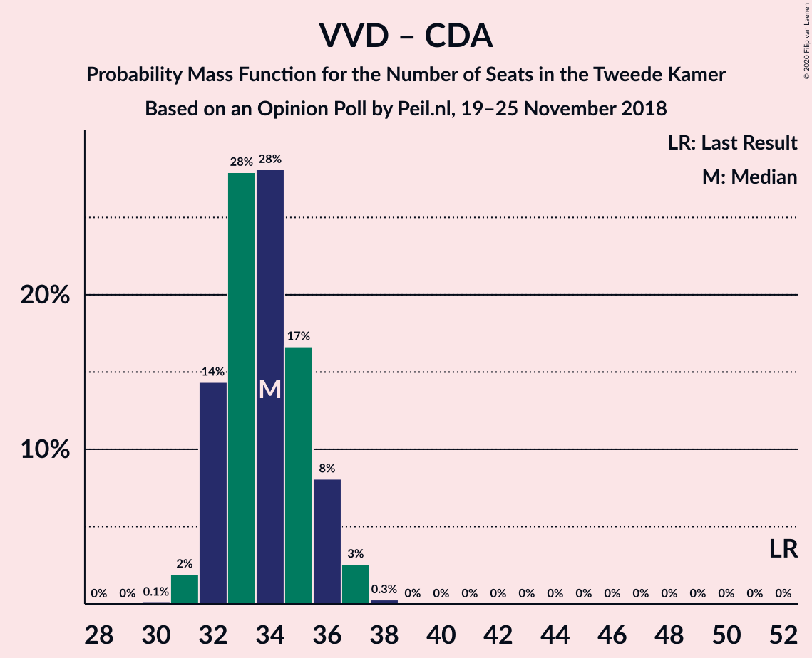

| Number of Seats | Probability | Accumulated | Special Marks |
|:---------------:|:-----------:|:-----------:|:-------------:|
| 30 | 0.1% | 100% |  |
| 31 | 2% | 99.9% |  |
| 32 | 14% | 98% |  |
| 33 | 28% | 84% |  |
| 34 | 28% | 56% | Median |
| 35 | 17% | 28% |  |
| 36 | 8% | 11% |  |
| 37 | 3% | 3% |  |
| 38 | 0.3% | 0.3% |  |
| 39 | 0% | 0% |  |
| 40 | 0% | 0% |  |
| 41 | 0% | 0% |  |
| 42 | 0% | 0% |  |
| 43 | 0% | 0% |  |
| 44 | 0% | 0% |  |
| 45 | 0% | 0% |  |
| 46 | 0% | 0% |  |
| 47 | 0% | 0% |  |
| 48 | 0% | 0% |  |
| 49 | 0% | 0% |  |
| 50 | 0% | 0% |  |
| 51 | 0% | 0% |  |
| 52 | 0% | 0% | Last Result |

### Partij van de Arbeid – Christen-Democratisch Appèl – ChristenUnie

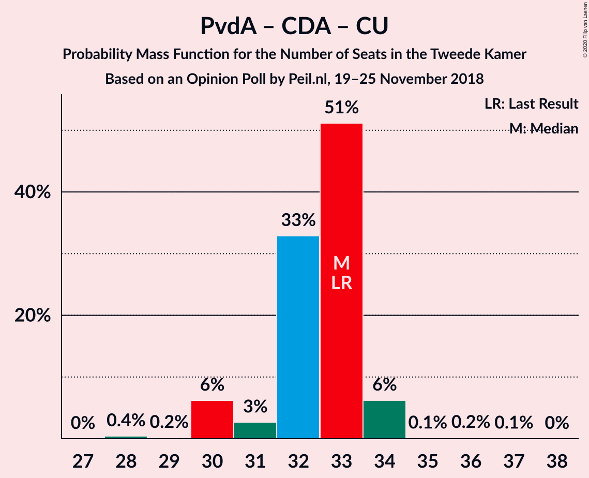

| Number of Seats | Probability | Accumulated | Special Marks |
|:---------------:|:-----------:|:-----------:|:-------------:|
| 28 | 25% | 100% |  |
| 29 | 0.5% | 75% |  |
| 30 | 6% | 75% |  |
| 31 | 3% | 69% |  |
| 32 | 19% | 66% | Median |
| 33 | 5% | 47% | Last Result |
| 34 | 42% | 42% |  |
| 35 | 0.7% | 0.9% |  |
| 36 | 0.1% | 0.2% |  |
| 37 | 0% | 0% |  |

### Partij van de Arbeid – Christen-Democratisch Appèl

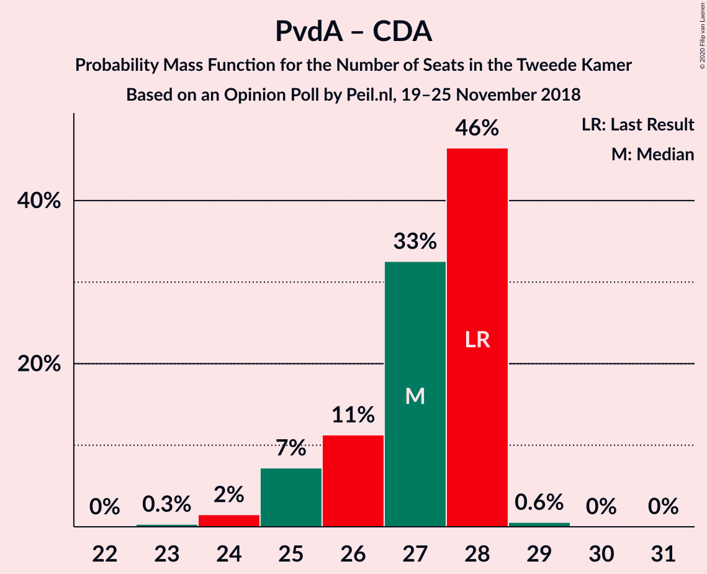

| Number of Seats | Probability | Accumulated | Special Marks |
|:---------------:|:-----------:|:-----------:|:-------------:|
| 22 | 0.1% | 100% |  |
| 23 | 1.1% | 99.9% |  |
| 24 | 25% | 98.8% |  |
| 25 | 6% | 74% |  |
| 26 | 18% | 68% | Median |
| 27 | 39% | 50% |  |
| 28 | 10% | 10% | Last Result |
| 29 | 0.7% | 0.8% |  |
| 30 | 0% | 0.1% |  |
| 31 | 0% | 0% |  |

### Christen-Democratisch Appèl – Democraten 66

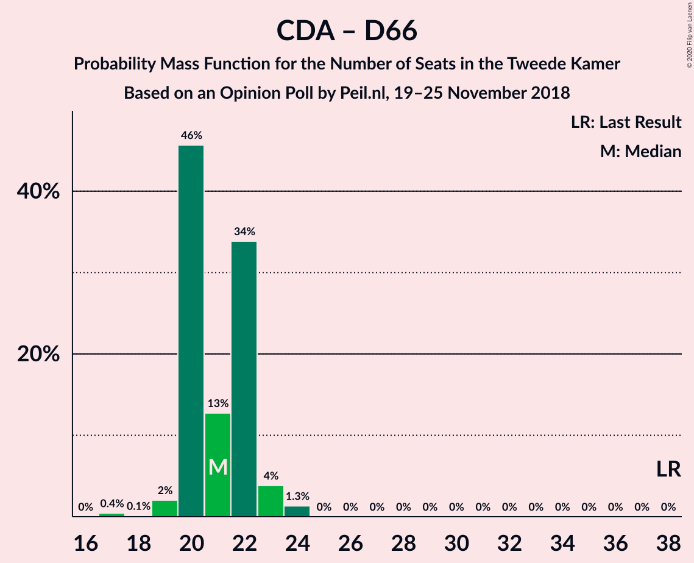

| Number of Seats | Probability | Accumulated | Special Marks |
|:---------------:|:-----------:|:-----------:|:-------------:|
| 17 | 0.4% | 100% |  |
| 18 | 0.1% | 99.6% |  |
| 19 | 2% | 99.5% |  |
| 20 | 46% | 97% |  |
| 21 | 13% | 52% | Median |
| 22 | 34% | 39% |  |
| 23 | 4% | 5% |  |
| 24 | 1.3% | 1.3% |  |
| 25 | 0% | 0% |  |
| 26 | 0% | 0% |  |
| 27 | 0% | 0% |  |
| 28 | 0% | 0% |  |
| 29 | 0% | 0% |  |
| 30 | 0% | 0% |  |
| 31 | 0% | 0% |  |
| 32 | 0% | 0% |  |
| 33 | 0% | 0% |  |
| 34 | 0% | 0% |  |
| 35 | 0% | 0% |  |
| 36 | 0% | 0% |  |
| 37 | 0% | 0% |  |
| 38 | 0% | 0% | Last Result |

## Technical Information

### Opinion Poll

+ **Polling firm:** Peil.nl
+ **Commissioner(s):** —
+ **Fieldwork period:** 19–25 November 2018

### Calculations

+ **Sample size:** 3000
+ **Simulations done:** 131,072
+ **Error estimate:** 2.00%

