# Opinion Poll by Ipsos for EenVandaag, 23–26 November 2018

<a href="#voting-intentions">Voting Intentions</a> | <a href="#seats">Seats</a> | <a href="#coalitions">Coalitions</a> | <a href="#technical-information">Technical Information</a>

## Voting Intentions

### Confidence Intervals

| Party | Last Result | Poll Result | 80% Confidence Interval | 90% Confidence Interval | 95% Confidence Interval | 99% Confidence Interval |
|:-----:|:-----------:|:-----------:|:-----------------------:|:-----------------------:|:-----------------------:|:-----------------------:|
| Volkspartij voor Vrijheid en Democratie | 21.3% | 18.7% | 17.2–20.3% |16.8–20.8% |16.4–21.2% |15.7–22.0% |
| Partij voor de Vrijheid | 13.1% | 13.5% | 12.2–15.0% |11.9–15.4% |11.6–15.8% |11.0–16.5% |
| GroenLinks | 9.1% | 10.8% | 9.6–12.1% |9.3–12.5% |9.0–12.8% |8.5–13.5% |
| Christen-Democratisch Appèl | 12.4% | 9.6% | 8.5–10.9% |8.2–11.3% |8.0–11.6% |7.5–12.2% |
| Democraten 66 | 12.2% | 8.2% | 7.2–9.4% |6.9–9.7% |6.6–10.0% |6.2–10.6% |
| Socialistische Partij | 9.1% | 8.2% | 7.2–9.4% |6.9–9.7% |6.6–10.0% |6.2–10.6% |
| Forum voor Democratie | 1.8% | 6.6% | 5.7–7.7% |5.5–8.0% |5.2–8.3% |4.8–8.9% |
| Partij van de Arbeid | 5.7% | 6.4% | 5.5–7.5% |5.3–7.8% |5.1–8.1% |4.7–8.6% |
| Partij voor de Dieren | 3.2% | 4.7% | 3.9–5.6% |3.7–5.9% |3.5–6.1% |3.2–6.6% |
| ChristenUnie | 3.4% | 4.3% | 3.6–5.2% |3.4–5.5% |3.2–5.7% |2.9–6.2% |
| 50Plus | 3.1% | 3.6% | 3.0–4.5% |2.8–4.7% |2.6–4.9% |2.3–5.4% |
| Staatkundig Gereformeerde Partij | 2.1% | 2.5% | 2.0–3.3% |1.8–3.5% |1.7–3.7% |1.5–4.1% |
| DENK | 2.1% | 2.1% | 1.7–2.9% |1.5–3.0% |1.4–3.2% |1.2–3.6% |

*Note:* The poll result column reflects the actual value used in the calculations. Published results may vary slightly, and in addition be rounded to fewer digits.

## Seats

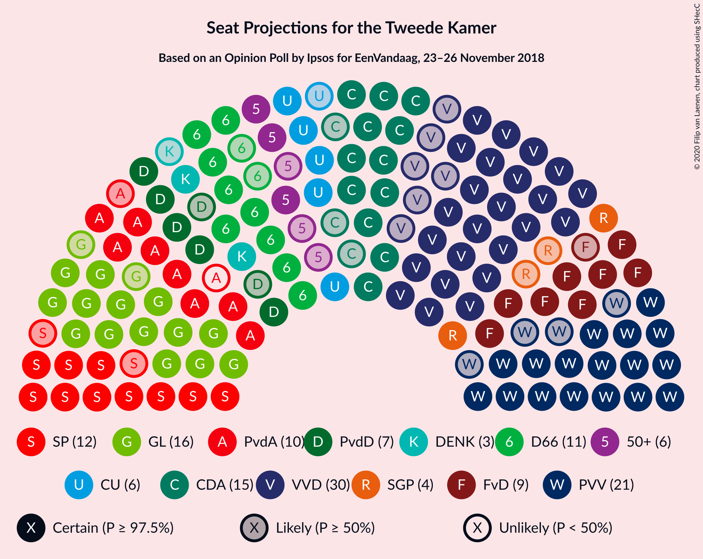

### Confidence Intervals

| Party | Last Result | Median | 80% Confidence Interval | 90% Confidence Interval | 95% Confidence Interval | 99% Confidence Interval |
|:-----:|:-----------:|:------:|:-----------------------:|:-----------------------:|:-----------------------:|:-----------------------:|
| <a href="#volkspartij-voor-vrijheid-en-democratie">Volkspartij voor Vrijheid en Democratie</a> | 33 | 24 | 24–29 |24–31 |24–32 |24–34 |
| <a href="#partij-voor-de-vrijheid">Partij voor de Vrijheid</a> | 20 | 22 | 19–22 |18–23 |16–23 |16–24 |
| <a href="#groenlinks">GroenLinks</a> | 14 | 17 | 16–18 |15–19 |14–19 |13–20 |
| <a href="#christen-democratisch-appèl">Christen-Democratisch Appèl</a> | 19 | 15 | 13–16 |13–17 |12–17 |12–19 |
| <a href="#democraten-66">Democraten 66</a> | 19 | 12 | 12–14 |10–14 |10–14 |9–16 |
| <a href="#socialistische-partij">Socialistische Partij</a> | 14 | 14 | 11–14 |10–15 |10–15 |9–15 |
| <a href="#forum-voor-democratie">Forum voor Democratie</a> | 2 | 10 | 10–11 |9–12 |6–14 |6–15 |
| <a href="#partij-van-de-arbeid">Partij van de Arbeid</a> | 9 | 12 | 9–12 |9–12 |8–13 |7–13 |
| <a href="#partij-voor-de-dieren">Partij voor de Dieren</a> | 5 | 6 | 6–8 |5–9 |5–9 |5–9 |
| <a href="#christenunie">ChristenUnie</a> | 5 | 5 | 5–6 |5–7 |5–8 |5–9 |
| <a href="#50plus">50Plus</a> | 4 | 6 | 5–6 |5–7 |4–7 |3–8 |
| <a href="#staatkundig-gereformeerde-partij">Staatkundig Gereformeerde Partij</a> | 3 | 4 | 3–4 |2–4 |2–5 |2–5 |
| <a href="#denk">DENK</a> | 3 | 3 | 3–4 |2–4 |2–5 |1–5 |

### Volkspartij voor Vrijheid en Democratie

*For a full overview of the results for this party, see the [Volkspartij voor Vrijheid en Democratie](party-volkspartijvoorvrijheidendemocratie.html) page.*

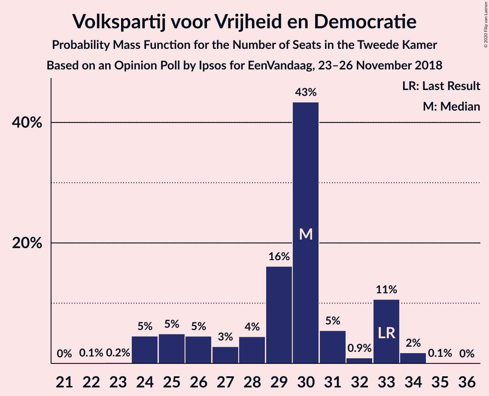

| Number of Seats | Probability | Accumulated | Special Marks |
|:---------------:|:-----------:|:-----------:|:-------------:|
| 22 | 0% | 100% |  |
| 23 | 0.4% | 99.9% |  |
| 24 | 68% | 99.5% | Median |
| 25 | 4% | 32% |  |
| 26 | 7% | 28% |  |
| 27 | 5% | 21% |  |
| 28 | 3% | 16% |  |
| 29 | 4% | 12% |  |
| 30 | 2% | 9% |  |
| 31 | 3% | 6% |  |
| 32 | 3% | 3% |  |
| 33 | 0% | 0.8% | Last Result |
| 34 | 0.8% | 0.8% |  |
| 35 | 0% | 0% |  |

### Partij voor de Vrijheid

*For a full overview of the results for this party, see the [Partij voor de Vrijheid](party-partijvoordevrijheid.html) page.*

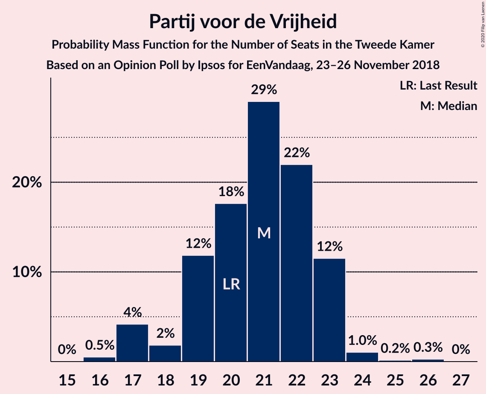

| Number of Seats | Probability | Accumulated | Special Marks |
|:---------------:|:-----------:|:-----------:|:-------------:|
| 16 | 3% | 100% |  |
| 17 | 1.3% | 96% |  |
| 18 | 4% | 95% |  |
| 19 | 6% | 91% |  |
| 20 | 6% | 85% | Last Result |
| 21 | 5% | 79% |  |
| 22 | 66% | 74% | Median |
| 23 | 7% | 7% |  |
| 24 | 0.3% | 0.7% |  |
| 25 | 0.3% | 0.3% |  |
| 26 | 0.1% | 0.1% |  |
| 27 | 0% | 0% |  |

### GroenLinks

*For a full overview of the results for this party, see the [GroenLinks](party-groenlinks.html) page.*

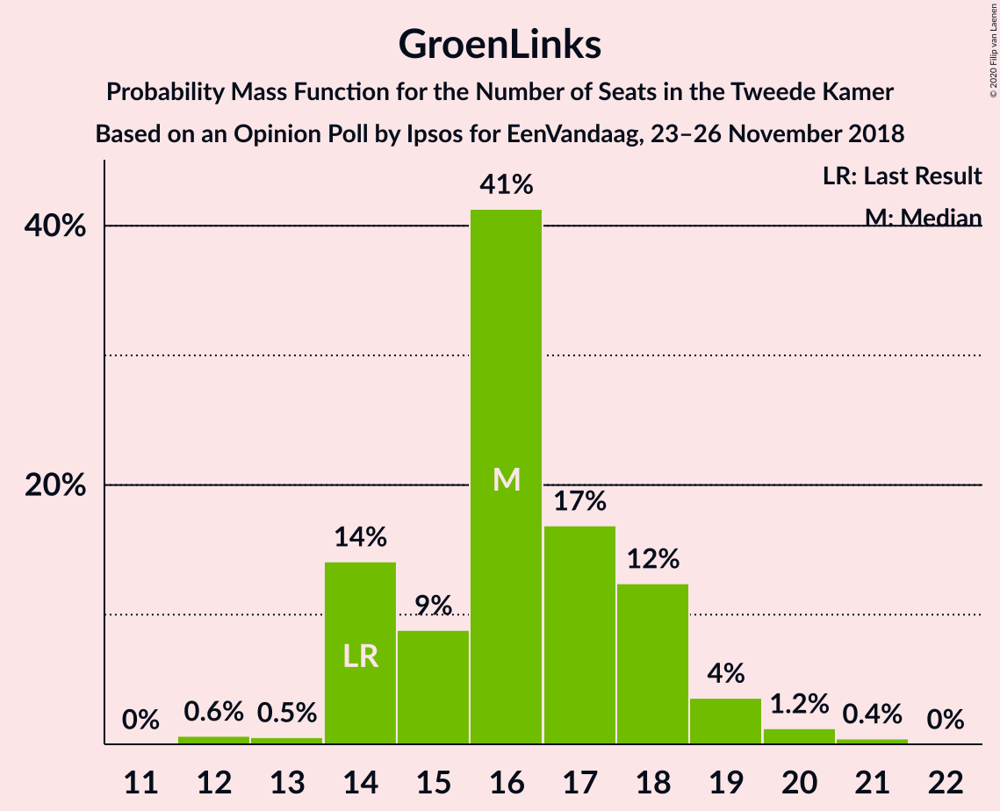

| Number of Seats | Probability | Accumulated | Special Marks |
|:---------------:|:-----------:|:-----------:|:-------------:|
| 12 | 0.4% | 100% |  |
| 13 | 0.2% | 99.6% |  |
| 14 | 4% | 99.4% | Last Result |
| 15 | 2% | 95% |  |
| 16 | 12% | 94% |  |
| 17 | 69% | 82% | Median |
| 18 | 7% | 13% |  |
| 19 | 4% | 6% |  |
| 20 | 2% | 2% |  |
| 21 | 0.1% | 0.1% |  |
| 22 | 0% | 0% |  |

### Christen-Democratisch Appèl

*For a full overview of the results for this party, see the [Christen-Democratisch Appèl](party-christen-democratischappèl.html) page.*

| Number of Seats | Probability | Accumulated | Special Marks |
|:---------------:|:-----------:|:-----------:|:-------------:|
| 11 | 0.2% | 100% |  |
| 12 | 4% | 99.8% |  |
| 13 | 14% | 96% |  |
| 14 | 5% | 82% |  |
| 15 | 67% | 77% | Median |
| 16 | 4% | 10% |  |
| 17 | 6% | 7% |  |
| 18 | 0.1% | 1.0% |  |
| 19 | 0.8% | 0.8% | Last Result |
| 20 | 0% | 0% |  |

### Democraten 66

*For a full overview of the results for this party, see the [Democraten 66](party-democraten66.html) page.*

| Number of Seats | Probability | Accumulated | Special Marks |
|:---------------:|:-----------:|:-----------:|:-------------:|
| 9 | 0.7% | 100% |  |
| 10 | 5% | 99.3% |  |
| 11 | 4% | 94% |  |
| 12 | 67% | 90% | Median |
| 13 | 12% | 23% |  |
| 14 | 9% | 11% |  |
| 15 | 1.0% | 2% |  |
| 16 | 1.0% | 1.0% |  |
| 17 | 0% | 0% |  |
| 18 | 0% | 0% |  |
| 19 | 0% | 0% | Last Result |

### Socialistische Partij

*For a full overview of the results for this party, see the [Socialistische Partij](party-socialistischepartij.html) page.*

| Number of Seats | Probability | Accumulated | Special Marks |
|:---------------:|:-----------:|:-----------:|:-------------:|
| 8 | 0.3% | 100% |  |
| 9 | 1.4% | 99.7% |  |
| 10 | 6% | 98% |  |
| 11 | 4% | 93% |  |
| 12 | 8% | 88% |  |
| 13 | 0.4% | 80% |  |
| 14 | 72% | 80% | Last Result, Median |
| 15 | 8% | 8% |  |
| 16 | 0.3% | 0.3% |  |
| 17 | 0% | 0.1% |  |
| 18 | 0% | 0% |  |

### Forum voor Democratie

*For a full overview of the results for this party, see the [Forum voor Democratie](party-forumvoordemocratie.html) page.*

| Number of Seats | Probability | Accumulated | Special Marks |
|:---------------:|:-----------:|:-----------:|:-------------:|
| 2 | 0% | 100% | Last Result |
| 3 | 0% | 100% |  |
| 4 | 0% | 100% |  |
| 5 | 0% | 100% |  |
| 6 | 3% | 100% |  |
| 7 | 0.3% | 97% |  |
| 8 | 1.3% | 97% |  |
| 9 | 5% | 96% |  |
| 10 | 78% | 90% | Median |
| 11 | 3% | 12% |  |
| 12 | 7% | 10% |  |
| 13 | 0.2% | 3% |  |
| 14 | 0.1% | 3% |  |
| 15 | 2% | 2% |  |
| 16 | 0% | 0% |  |

### Partij van de Arbeid

*For a full overview of the results for this party, see the [Partij van de Arbeid](party-partijvandearbeid.html) page.*

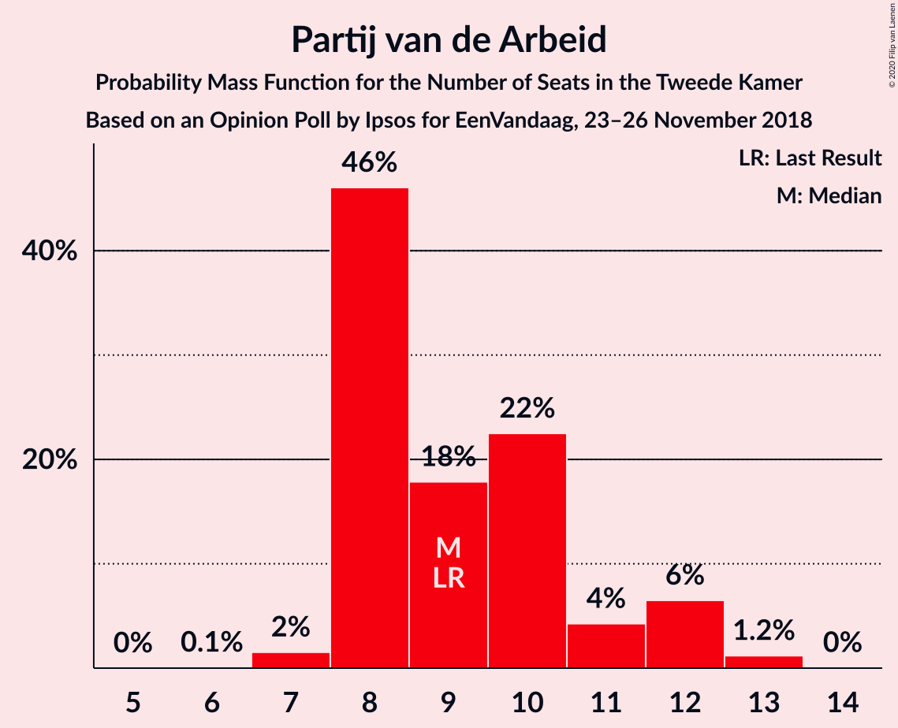

| Number of Seats | Probability | Accumulated | Special Marks |
|:---------------:|:-----------:|:-----------:|:-------------:|
| 6 | 0.1% | 100% |  |
| 7 | 1.3% | 99.9% |  |
| 8 | 3% | 98.6% |  |
| 9 | 10% | 96% | Last Result |
| 10 | 15% | 86% |  |
| 11 | 1.0% | 71% |  |
| 12 | 65% | 70% | Median |
| 13 | 5% | 5% |  |
| 14 | 0.1% | 0.1% |  |
| 15 | 0.1% | 0.1% |  |
| 16 | 0% | 0% |  |

### Partij voor de Dieren

*For a full overview of the results for this party, see the [Partij voor de Dieren](party-partijvoordedieren.html) page.*

| Number of Seats | Probability | Accumulated | Special Marks |
|:---------------:|:-----------:|:-----------:|:-------------:|
| 4 | 0.2% | 100% |  |
| 5 | 6% | 99.8% | Last Result |
| 6 | 71% | 94% | Median |
| 7 | 7% | 23% |  |
| 8 | 7% | 16% |  |
| 9 | 9% | 9% |  |
| 10 | 0% | 0.1% |  |
| 11 | 0% | 0% |  |

### ChristenUnie

*For a full overview of the results for this party, see the [ChristenUnie](party-christenunie.html) page.*

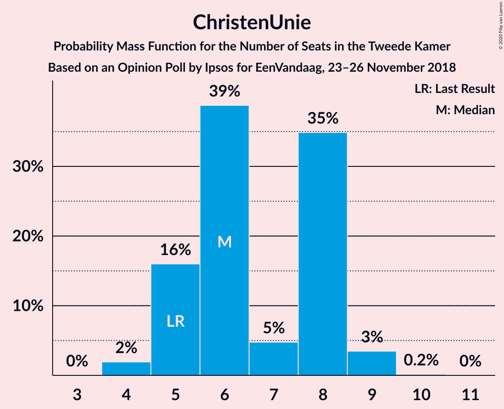

| Number of Seats | Probability | Accumulated | Special Marks |
|:---------------:|:-----------:|:-----------:|:-------------:|
| 4 | 0.5% | 100% |  |
| 5 | 75% | 99.5% | Last Result, Median |
| 6 | 17% | 25% |  |
| 7 | 4% | 8% |  |
| 8 | 3% | 4% |  |
| 9 | 0.4% | 0.6% |  |
| 10 | 0% | 0.2% |  |
| 11 | 0.2% | 0.2% |  |
| 12 | 0% | 0% |  |

### 50Plus

*For a full overview of the results for this party, see the [50Plus](party-50plus.html) page.*

| Number of Seats | Probability | Accumulated | Special Marks |
|:---------------:|:-----------:|:-----------:|:-------------:|
| 2 | 0.2% | 100% |  |
| 3 | 0.5% | 99.8% |  |
| 4 | 2% | 99.2% | Last Result |
| 5 | 22% | 97% |  |
| 6 | 69% | 76% | Median |
| 7 | 6% | 7% |  |
| 8 | 0.9% | 1.1% |  |
| 9 | 0.3% | 0.3% |  |
| 10 | 0% | 0% |  |

### Staatkundig Gereformeerde Partij

*For a full overview of the results for this party, see the [Staatkundig Gereformeerde Partij](party-staatkundiggereformeerdepartij.html) page.*

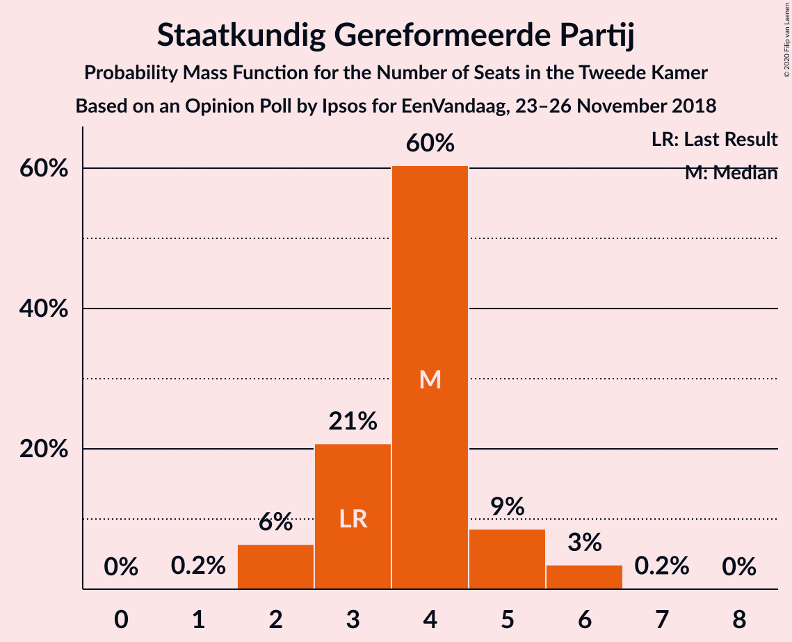

| Number of Seats | Probability | Accumulated | Special Marks |
|:---------------:|:-----------:|:-----------:|:-------------:|
| 1 | 0.1% | 100% |  |
| 2 | 8% | 99.9% |  |
| 3 | 11% | 92% | Last Result |
| 4 | 76% | 80% | Median |
| 5 | 4% | 5% |  |
| 6 | 0.5% | 0.5% |  |
| 7 | 0% | 0% |  |

### DENK

*For a full overview of the results for this party, see the [DENK](party-denk.html) page.*

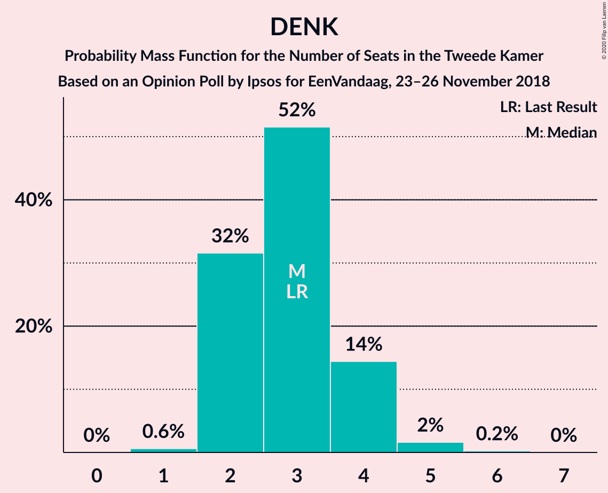

| Number of Seats | Probability | Accumulated | Special Marks |
|:---------------:|:-----------:|:-----------:|:-------------:|
| 1 | 2% | 100% |  |
| 2 | 7% | 98% |  |
| 3 | 80% | 91% | Last Result, Median |
| 4 | 9% | 12% |  |
| 5 | 3% | 3% |  |
| 6 | 0.1% | 0.1% |  |
| 7 | 0% | 0% |  |

## Coalitions

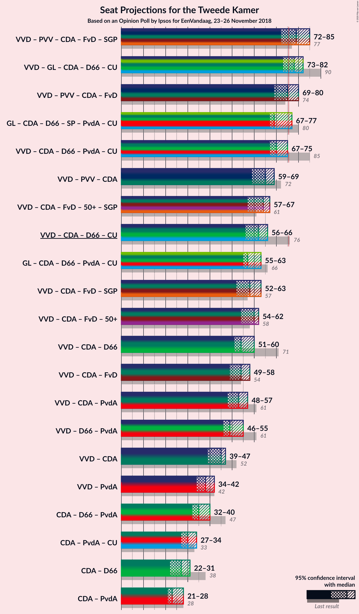

### Confidence Intervals

| Coalition | Last Result | Median | Majority? | 80% Confidence Interval | 90% Confidence Interval | 95% Confidence Interval | 99% Confidence Interval |
|:---------:|:-----------:|:------:|:---------:|:-----------------------:|:-----------------------:|:-----------------------:|:-----------------------:|
| Volkspartij voor Vrijheid en Democratie – GroenLinks – Christen-Democratisch Appèl – Democraten 66 – ChristenUnie | 90 | 73 | 28% | 73–79 | 72–81 | 72–84 | 72–84 |
| Volkspartij voor Vrijheid en Democratie – Partij voor de Vrijheid – Christen-Democratisch Appèl – Forum voor Democratie – Staatkundig Gereformeerde Partij | 77 | 75 | 17% | 73–78 | 72–78 | 71–81 | 71–82 |
| Volkspartij voor Vrijheid en Democratie – Partij voor de Vrijheid – Christen-Democratisch Appèl – Forum voor Democratie | 74 | 71 | 6% | 69–74 | 69–76 | 68–76 | 68–79 |
| GroenLinks – Christen-Democratisch Appèl – Democraten 66 – Socialistische Partij – Partij van de Arbeid – ChristenUnie | 80 | 75 | 6% | 70–75 | 70–76 | 67–76 | 65–79 |
| Volkspartij voor Vrijheid en Democratie – Christen-Democratisch Appèl – Democraten 66 – Partij van de Arbeid – ChristenUnie | 85 | 68 | 3% | 68–72 | 67–74 | 66–76 | 66–78 |
| Volkspartij voor Vrijheid en Democratie – Christen-Democratisch Appèl – Forum voor Democratie – 50Plus – Staatkundig Gereformeerde Partij | 61 | 59 | 0% | 57–63 | 55–64 | 55–67 | 55–70 |
| Volkspartij voor Vrijheid en Democratie – Partij voor de Vrijheid – Christen-Democratisch Appèl | 72 | 61 | 0% | 59–64 | 59–65 | 58–66 | 58–69 |
| Volkspartij voor Vrijheid en Democratie – Christen-Democratisch Appèl – Democraten 66 – ChristenUnie | 76 | 56 | 0% | 56–62 | 56–64 | 56–66 | 56–69 |
| GroenLinks – Christen-Democratisch Appèl – Democraten 66 – Partij van de Arbeid – ChristenUnie | 66 | 61 | 0% | 58–61 | 57–63 | 55–64 | 54–67 |
| Volkspartij voor Vrijheid en Democratie – Christen-Democratisch Appèl – Forum voor Democratie – 50Plus | 58 | 55 | 0% | 54–60 | 53–62 | 51–63 | 51–65 |
| Volkspartij voor Vrijheid en Democratie – Christen-Democratisch Appèl – Forum voor Democratie – Staatkundig Gereformeerde Partij | 57 | 53 | 0% | 52–58 | 50–59 | 50–61 | 50–63 |
| Volkspartij voor Vrijheid en Democratie – Christen-Democratisch Appèl – Democraten 66 | 71 | 51 | 0% | 51–56 | 50–58 | 50–59 | 50–61 |
| Volkspartij voor Vrijheid en Democratie – Christen-Democratisch Appèl – Forum voor Democratie | 54 | 49 | 0% | 49–54 | 48–57 | 46–57 | 46–59 |
| Volkspartij voor Vrijheid en Democratie – Christen-Democratisch Appèl – Partij van de Arbeid | 61 | 51 | 0% | 50–54 | 47–55 | 46–57 | 46–58 |
| Volkspartij voor Vrijheid en Democratie – Democraten 66 – Partij van de Arbeid | 61 | 48 | 0% | 48–51 | 48–53 | 47–54 | 46–56 |
| Volkspartij voor Vrijheid en Democratie – Christen-Democratisch Appèl | 52 | 39 | 0% | 39–44 | 38–45 | 36–47 | 36–49 |
| Volkspartij voor Vrijheid en Democratie – Partij van de Arbeid | 42 | 36 | 0% | 36–40 | 34–41 | 34–42 | 33–43 |
| Christen-Democratisch Appèl – Democraten 66 – Partij van de Arbeid | 47 | 39 | 0% | 36–39 | 35–39 | 34–40 | 32–42 |
| Christen-Democratisch Appèl – Partij van de Arbeid – ChristenUnie | 33 | 32 | 0% | 28–32 | 28–33 | 27–34 | 27–35 |
| Christen-Democratisch Appèl – Democraten 66 | 38 | 27 | 0% | 26–28 | 24–30 | 23–30 | 23–32 |
| Christen-Democratisch Appèl – Partij van de Arbeid | 28 | 27 | 0% | 22–27 | 22–27 | 22–27 | 22–28 |

### Volkspartij voor Vrijheid en Democratie – GroenLinks – Christen-Democratisch Appèl – Democraten 66 – ChristenUnie

| Number of Seats | Probability | Accumulated | Special Marks |
|:---------------:|:-----------:|:-----------:|:-------------:|
| 71 | 0.2% | 100% |  |
| 72 | 6% | 99.8% |  |
| 73 | 65% | 94% | Median |
| 74 | 0.2% | 28% |  |
| 75 | 0.4% | 28% |  |
| 76 | 2% | 28% | Majority |
| 77 | 11% | 26% |  |
| 78 | 3% | 15% |  |
| 79 | 5% | 11% |  |
| 80 | 0.5% | 6% |  |
| 81 | 0.8% | 6% |  |
| 82 | 1.4% | 5% |  |
| 83 | 0.1% | 3% |  |
| 84 | 3% | 3% |  |
| 85 | 0% | 0.1% |  |
| 86 | 0% | 0% |  |
| 87 | 0% | 0% |  |
| 88 | 0% | 0% |  |
| 89 | 0% | 0% |  |
| 90 | 0% | 0% | Last Result |

### Volkspartij voor Vrijheid en Democratie – Partij voor de Vrijheid – Christen-Democratisch Appèl – Forum voor Democratie – Staatkundig Gereformeerde Partij

| Number of Seats | Probability | Accumulated | Special Marks |
|:---------------:|:-----------:|:-----------:|:-------------:|
| 68 | 0% | 100% |  |
| 69 | 0% | 99.9% |  |
| 70 | 0% | 99.9% |  |
| 71 | 4% | 99.9% |  |
| 72 | 3% | 96% |  |
| 73 | 3% | 93% |  |
| 74 | 0.6% | 90% |  |
| 75 | 72% | 89% | Median |
| 76 | 3% | 17% | Majority |
| 77 | 3% | 13% | Last Result |
| 78 | 6% | 10% |  |
| 79 | 0.4% | 4% |  |
| 80 | 0.9% | 3% |  |
| 81 | 1.3% | 3% |  |
| 82 | 0.9% | 1.2% |  |
| 83 | 0.2% | 0.3% |  |
| 84 | 0% | 0.1% |  |
| 85 | 0% | 0% |  |

### Volkspartij voor Vrijheid en Democratie – Partij voor de Vrijheid – Christen-Democratisch Appèl – Forum voor Democratie

| Number of Seats | Probability | Accumulated | Special Marks |
|:---------------:|:-----------:|:-----------:|:-------------:|
| 65 | 0% | 100% |  |
| 66 | 0% | 99.9% |  |
| 67 | 0.1% | 99.9% |  |
| 68 | 3% | 99.9% |  |
| 69 | 7% | 97% |  |
| 70 | 0.6% | 90% |  |
| 71 | 69% | 89% | Median |
| 72 | 4% | 20% |  |
| 73 | 5% | 16% |  |
| 74 | 2% | 11% | Last Result |
| 75 | 3% | 9% |  |
| 76 | 3% | 6% | Majority |
| 77 | 1.4% | 2% |  |
| 78 | 0.1% | 1.0% |  |
| 79 | 0.8% | 0.9% |  |
| 80 | 0.1% | 0.1% |  |
| 81 | 0% | 0% |  |

### GroenLinks – Christen-Democratisch Appèl – Democraten 66 – Socialistische Partij – Partij van de Arbeid – ChristenUnie

| Number of Seats | Probability | Accumulated | Special Marks |
|:---------------:|:-----------:|:-----------:|:-------------:|
| 64 | 0.5% | 100% |  |
| 65 | 0.3% | 99.5% |  |
| 66 | 0.9% | 99.3% |  |
| 67 | 2% | 98% |  |
| 68 | 1.0% | 97% |  |
| 69 | 0.4% | 96% |  |
| 70 | 6% | 95% |  |
| 71 | 2% | 89% |  |
| 72 | 9% | 87% |  |
| 73 | 1.2% | 78% |  |
| 74 | 2% | 77% |  |
| 75 | 68% | 74% | Median |
| 76 | 5% | 6% | Majority |
| 77 | 0.2% | 1.1% |  |
| 78 | 0.1% | 0.9% |  |
| 79 | 0.8% | 0.8% |  |
| 80 | 0% | 0% | Last Result |

### Volkspartij voor Vrijheid en Democratie – Christen-Democratisch Appèl – Democraten 66 – Partij van de Arbeid – ChristenUnie

| Number of Seats | Probability | Accumulated | Special Marks |
|:---------------:|:-----------:|:-----------:|:-------------:|
| 64 | 0.1% | 100% |  |
| 65 | 0.1% | 99.9% |  |
| 66 | 3% | 99.8% |  |
| 67 | 4% | 97% |  |
| 68 | 66% | 93% | Median |
| 69 | 7% | 28% |  |
| 70 | 3% | 21% |  |
| 71 | 7% | 18% |  |
| 72 | 3% | 11% |  |
| 73 | 2% | 8% |  |
| 74 | 3% | 5% |  |
| 75 | 0.2% | 3% |  |
| 76 | 0.7% | 3% | Majority |
| 77 | 1.2% | 2% |  |
| 78 | 0.6% | 0.7% |  |
| 79 | 0% | 0% |  |
| 80 | 0% | 0% |  |
| 81 | 0% | 0% |  |
| 82 | 0% | 0% |  |
| 83 | 0% | 0% |  |
| 84 | 0% | 0% |  |
| 85 | 0% | 0% | Last Result |

### Volkspartij voor Vrijheid en Democratie – Christen-Democratisch Appèl – Forum voor Democratie – 50Plus – Staatkundig Gereformeerde Partij

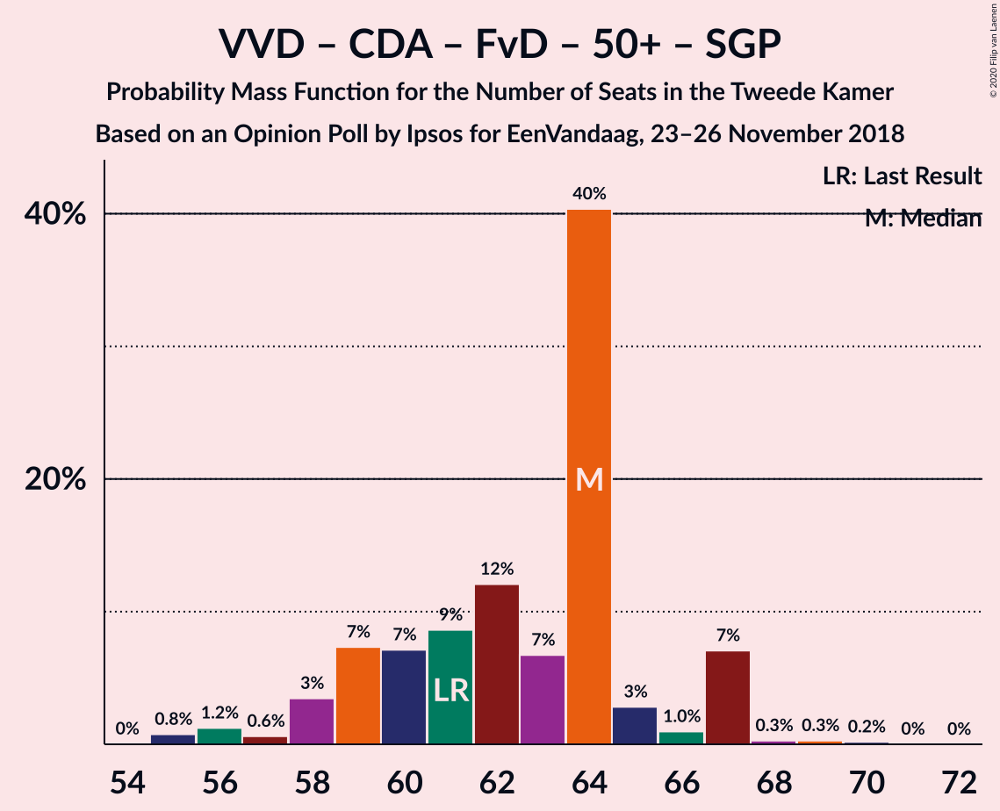

| Number of Seats | Probability | Accumulated | Special Marks |
|:---------------:|:-----------:|:-----------:|:-------------:|
| 55 | 7% | 100% |  |
| 56 | 0.3% | 93% |  |
| 57 | 3% | 93% |  |
| 58 | 0% | 90% |  |
| 59 | 66% | 90% | Median |
| 60 | 5% | 24% |  |
| 61 | 1.4% | 20% | Last Result |
| 62 | 0.9% | 18% |  |
| 63 | 8% | 17% |  |
| 64 | 5% | 9% |  |
| 65 | 1.3% | 4% |  |
| 66 | 0.1% | 3% |  |
| 67 | 0.9% | 3% |  |
| 68 | 0.1% | 2% |  |
| 69 | 0.1% | 2% |  |
| 70 | 2% | 2% |  |
| 71 | 0% | 0% |  |

### Volkspartij voor Vrijheid en Democratie – Partij voor de Vrijheid – Christen-Democratisch Appèl

| Number of Seats | Probability | Accumulated | Special Marks |
|:---------------:|:-----------:|:-----------:|:-------------:|
| 54 | 0% | 100% |  |
| 55 | 0% | 99.9% |  |
| 56 | 0% | 99.9% |  |
| 57 | 0.2% | 99.9% |  |
| 58 | 3% | 99.8% |  |
| 59 | 10% | 97% |  |
| 60 | 4% | 87% |  |
| 61 | 65% | 83% | Median |
| 62 | 0.8% | 19% |  |
| 63 | 4% | 18% |  |
| 64 | 7% | 14% |  |
| 65 | 4% | 7% |  |
| 66 | 2% | 3% |  |
| 67 | 0.3% | 1.3% |  |
| 68 | 0.1% | 1.0% |  |
| 69 | 0.8% | 0.9% |  |
| 70 | 0% | 0% |  |
| 71 | 0% | 0% |  |
| 72 | 0% | 0% | Last Result |

### Volkspartij voor Vrijheid en Democratie – Christen-Democratisch Appèl – Democraten 66 – ChristenUnie

| Number of Seats | Probability | Accumulated | Special Marks |
|:---------------:|:-----------:|:-----------:|:-------------:|
| 55 | 0% | 100% |  |
| 56 | 71% | 99.9% | Median |
| 57 | 0.1% | 29% |  |
| 58 | 4% | 29% |  |
| 59 | 1.1% | 25% |  |
| 60 | 5% | 24% |  |
| 61 | 8% | 18% |  |
| 62 | 0.9% | 11% |  |
| 63 | 4% | 10% |  |
| 64 | 2% | 6% |  |
| 65 | 1.2% | 4% |  |
| 66 | 1.5% | 3% |  |
| 67 | 0.9% | 2% |  |
| 68 | 0.1% | 0.6% |  |
| 69 | 0.5% | 0.5% |  |
| 70 | 0% | 0% |  |
| 71 | 0% | 0% |  |
| 72 | 0% | 0% |  |
| 73 | 0% | 0% |  |
| 74 | 0% | 0% |  |
| 75 | 0% | 0% |  |
| 76 | 0% | 0% | Last Result, Majority |

### GroenLinks – Christen-Democratisch Appèl – Democraten 66 – Partij van de Arbeid – ChristenUnie

| Number of Seats | Probability | Accumulated | Special Marks |
|:---------------:|:-----------:|:-----------:|:-------------:|
| 53 | 0.1% | 100% |  |
| 54 | 0.6% | 99.8% |  |
| 55 | 4% | 99.2% |  |
| 56 | 0.1% | 95% |  |
| 57 | 3% | 95% |  |
| 58 | 9% | 93% |  |
| 59 | 1.2% | 83% |  |
| 60 | 0.8% | 82% |  |
| 61 | 74% | 81% | Median |
| 62 | 0.5% | 7% |  |
| 63 | 3% | 7% |  |
| 64 | 3% | 4% |  |
| 65 | 0% | 1.0% |  |
| 66 | 0.1% | 1.0% | Last Result |
| 67 | 0.9% | 0.9% |  |
| 68 | 0% | 0% |  |

### Volkspartij voor Vrijheid en Democratie – Christen-Democratisch Appèl – Forum voor Democratie – 50Plus

| Number of Seats | Probability | Accumulated | Special Marks |
|:---------------:|:-----------:|:-----------:|:-------------:|
| 51 | 3% | 100% |  |
| 52 | 0% | 97% |  |
| 53 | 7% | 97% |  |
| 54 | 0.3% | 90% |  |
| 55 | 65% | 90% | Median |
| 56 | 1.3% | 25% |  |
| 57 | 4% | 24% |  |
| 58 | 2% | 20% | Last Result |
| 59 | 6% | 17% |  |
| 60 | 4% | 11% |  |
| 61 | 0.4% | 7% |  |
| 62 | 4% | 7% |  |
| 63 | 0.5% | 3% |  |
| 64 | 0% | 2% |  |
| 65 | 2% | 2% |  |
| 66 | 0.3% | 0.4% |  |
| 67 | 0% | 0% |  |

### Volkspartij voor Vrijheid en Democratie – Christen-Democratisch Appèl – Forum voor Democratie – Staatkundig Gereformeerde Partij

| Number of Seats | Probability | Accumulated | Special Marks |
|:---------------:|:-----------:|:-----------:|:-------------:|
| 49 | 0.1% | 100% |  |
| 50 | 7% | 99.9% |  |
| 51 | 0.3% | 93% |  |
| 52 | 3% | 93% |  |
| 53 | 65% | 90% | Median |
| 54 | 0.8% | 25% |  |
| 55 | 5% | 24% |  |
| 56 | 5% | 19% |  |
| 57 | 2% | 14% | Last Result |
| 58 | 3% | 11% |  |
| 59 | 4% | 8% |  |
| 60 | 0.1% | 4% |  |
| 61 | 2% | 4% |  |
| 62 | 0.8% | 2% |  |
| 63 | 0.7% | 1.1% |  |
| 64 | 0.1% | 0.5% |  |
| 65 | 0.3% | 0.3% |  |
| 66 | 0% | 0% |  |

### Volkspartij voor Vrijheid en Democratie – Christen-Democratisch Appèl – Democraten 66

| Number of Seats | Probability | Accumulated | Special Marks |
|:---------------:|:-----------:|:-----------:|:-------------:|
| 49 | 0.1% | 100% |  |
| 50 | 6% | 99.9% |  |
| 51 | 65% | 94% | Median |
| 52 | 4% | 28% |  |
| 53 | 4% | 24% |  |
| 54 | 1.0% | 20% |  |
| 55 | 3% | 19% |  |
| 56 | 7% | 16% |  |
| 57 | 3% | 9% |  |
| 58 | 3% | 6% |  |
| 59 | 1.1% | 3% |  |
| 60 | 1.1% | 2% |  |
| 61 | 0.3% | 0.7% |  |
| 62 | 0% | 0.4% |  |
| 63 | 0.1% | 0.4% |  |
| 64 | 0.3% | 0.3% |  |
| 65 | 0% | 0% |  |
| 66 | 0% | 0% |  |
| 67 | 0% | 0% |  |
| 68 | 0% | 0% |  |
| 69 | 0% | 0% |  |
| 70 | 0% | 0% |  |
| 71 | 0% | 0% | Last Result |

### Volkspartij voor Vrijheid en Democratie – Christen-Democratisch Appèl – Forum voor Democratie

| Number of Seats | Probability | Accumulated | Special Marks |
|:---------------:|:-----------:|:-----------:|:-------------:|
| 46 | 3% | 100% |  |
| 47 | 0.3% | 97% |  |
| 48 | 7% | 97% |  |
| 49 | 65% | 90% | Median |
| 50 | 0.6% | 25% |  |
| 51 | 2% | 25% |  |
| 52 | 8% | 23% |  |
| 53 | 0.4% | 14% |  |
| 54 | 5% | 14% | Last Result |
| 55 | 3% | 9% |  |
| 56 | 0% | 6% |  |
| 57 | 4% | 6% |  |
| 58 | 1.4% | 2% |  |
| 59 | 0.6% | 1.0% |  |
| 60 | 0% | 0.4% |  |
| 61 | 0.3% | 0.4% |  |
| 62 | 0% | 0.1% |  |
| 63 | 0% | 0% |  |

### Volkspartij voor Vrijheid en Democratie – Christen-Democratisch Appèl – Partij van de Arbeid

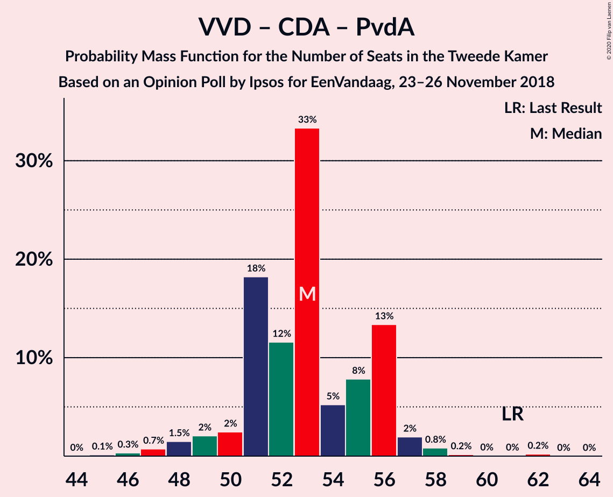

| Number of Seats | Probability | Accumulated | Special Marks |
|:---------------:|:-----------:|:-----------:|:-------------:|
| 46 | 3% | 100% |  |
| 47 | 4% | 97% |  |
| 48 | 0.3% | 93% |  |
| 49 | 1.1% | 93% |  |
| 50 | 3% | 92% |  |
| 51 | 68% | 89% | Median |
| 52 | 3% | 21% |  |
| 53 | 7% | 18% |  |
| 54 | 5% | 11% |  |
| 55 | 3% | 6% |  |
| 56 | 0.7% | 3% |  |
| 57 | 2% | 3% |  |
| 58 | 0.5% | 1.0% |  |
| 59 | 0.1% | 0.5% |  |
| 60 | 0.4% | 0.4% |  |
| 61 | 0% | 0% | Last Result |

### Volkspartij voor Vrijheid en Democratie – Democraten 66 – Partij van de Arbeid

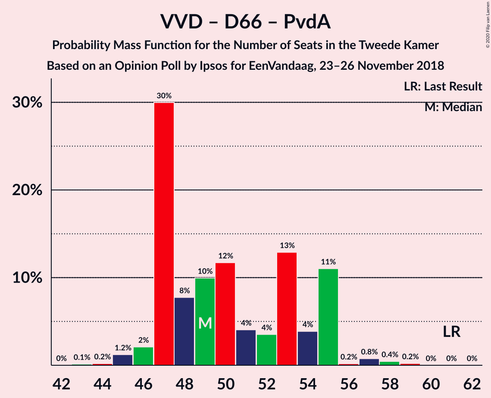

| Number of Seats | Probability | Accumulated | Special Marks |
|:---------------:|:-----------:|:-----------:|:-------------:|
| 44 | 0.1% | 100% |  |
| 45 | 0.2% | 99.9% |  |
| 46 | 2% | 99.7% |  |
| 47 | 1.1% | 98% |  |
| 48 | 72% | 97% | Median |
| 49 | 6% | 25% |  |
| 50 | 6% | 20% |  |
| 51 | 3% | 13% |  |
| 52 | 2% | 10% |  |
| 53 | 5% | 8% |  |
| 54 | 1.4% | 3% |  |
| 55 | 0.1% | 1.3% |  |
| 56 | 1.1% | 1.3% |  |
| 57 | 0.1% | 0.2% |  |
| 58 | 0% | 0% |  |
| 59 | 0% | 0% |  |
| 60 | 0% | 0% |  |
| 61 | 0% | 0% | Last Result |

### Volkspartij voor Vrijheid en Democratie – Christen-Democratisch Appèl

| Number of Seats | Probability | Accumulated | Special Marks |
|:---------------:|:-----------:|:-----------:|:-------------:|
| 36 | 3% | 100% |  |
| 37 | 0% | 97% |  |
| 38 | 4% | 97% |  |
| 39 | 65% | 93% | Median |
| 40 | 7% | 28% |  |
| 41 | 2% | 21% |  |
| 42 | 3% | 19% |  |
| 43 | 4% | 16% |  |
| 44 | 5% | 12% |  |
| 45 | 4% | 8% |  |
| 46 | 0.1% | 3% |  |
| 47 | 1.3% | 3% |  |
| 48 | 1.0% | 2% |  |
| 49 | 0.5% | 0.9% |  |
| 50 | 0.1% | 0.4% |  |
| 51 | 0.3% | 0.3% |  |
| 52 | 0% | 0% | Last Result |

### Volkspartij voor Vrijheid en Democratie – Partij van de Arbeid

| Number of Seats | Probability | Accumulated | Special Marks |
|:---------------:|:-----------:|:-----------:|:-------------:|
| 32 | 0.4% | 100% |  |
| 33 | 0.3% | 99.5% |  |
| 34 | 7% | 99.3% |  |
| 35 | 1.2% | 92% |  |
| 36 | 73% | 91% | Median |
| 37 | 0.9% | 18% |  |
| 38 | 4% | 17% |  |
| 39 | 0.4% | 13% |  |
| 40 | 7% | 13% |  |
| 41 | 2% | 6% |  |
| 42 | 3% | 4% | Last Result |
| 43 | 0.4% | 0.9% |  |
| 44 | 0.4% | 0.5% |  |
| 45 | 0% | 0.1% |  |
| 46 | 0.1% | 0.1% |  |
| 47 | 0% | 0% |  |

### Christen-Democratisch Appèl – Democraten 66 – Partij van de Arbeid

| Number of Seats | Probability | Accumulated | Special Marks |
|:---------------:|:-----------:|:-----------:|:-------------:|
| 31 | 0% | 100% |  |
| 32 | 0.6% | 99.9% |  |
| 33 | 0.9% | 99.3% |  |
| 34 | 3% | 98% |  |
| 35 | 4% | 96% |  |
| 36 | 11% | 92% |  |
| 37 | 6% | 81% |  |
| 38 | 3% | 76% |  |
| 39 | 68% | 72% | Median |
| 40 | 4% | 5% |  |
| 41 | 0.1% | 1.1% |  |
| 42 | 0.9% | 1.0% |  |
| 43 | 0% | 0.1% |  |
| 44 | 0.1% | 0.1% |  |
| 45 | 0% | 0% |  |
| 46 | 0% | 0% |  |
| 47 | 0% | 0% | Last Result |

### Christen-Democratisch Appèl – Partij van de Arbeid – ChristenUnie

| Number of Seats | Probability | Accumulated | Special Marks |
|:---------------:|:-----------:|:-----------:|:-------------:|
| 25 | 0.1% | 100% |  |
| 26 | 0.1% | 99.9% |  |
| 27 | 3% | 99.8% |  |
| 28 | 10% | 97% |  |
| 29 | 1.2% | 87% |  |
| 30 | 5% | 85% |  |
| 31 | 3% | 81% |  |
| 32 | 72% | 78% | Median |
| 33 | 2% | 5% | Last Result |
| 34 | 2% | 4% |  |
| 35 | 2% | 2% |  |
| 36 | 0.4% | 0.5% |  |
| 37 | 0.1% | 0.1% |  |
| 38 | 0% | 0% |  |

### Christen-Democratisch Appèl – Democraten 66

| Number of Seats | Probability | Accumulated | Special Marks |
|:---------------:|:-----------:|:-----------:|:-------------:|
| 22 | 0% | 100% |  |
| 23 | 4% | 99.9% |  |
| 24 | 3% | 96% |  |
| 25 | 2% | 93% |  |
| 26 | 6% | 91% |  |
| 27 | 74% | 85% | Median |
| 28 | 2% | 11% |  |
| 29 | 1.2% | 9% |  |
| 30 | 6% | 8% |  |
| 31 | 0.4% | 1.5% |  |
| 32 | 1.0% | 1.0% |  |
| 33 | 0% | 0% |  |
| 34 | 0% | 0% |  |
| 35 | 0% | 0% |  |
| 36 | 0% | 0% |  |
| 37 | 0% | 0% |  |
| 38 | 0% | 0% | Last Result |

### Christen-Democratisch Appèl – Partij van de Arbeid

| Number of Seats | Probability | Accumulated | Special Marks |
|:---------------:|:-----------:|:-----------:|:-------------:|
| 19 | 0.1% | 100% |  |
| 20 | 0.1% | 99.9% |  |
| 21 | 0.3% | 99.8% |  |
| 22 | 10% | 99.6% |  |
| 23 | 5% | 90% |  |
| 24 | 7% | 85% |  |
| 25 | 1.0% | 78% |  |
| 26 | 6% | 77% |  |
| 27 | 70% | 71% | Median |
| 28 | 0.8% | 1.1% | Last Result |
| 29 | 0.2% | 0.2% |  |
| 30 | 0% | 0.1% |  |
| 31 | 0% | 0% |  |

## Technical Information

### Opinion Poll

+ **Polling firm:** Ipsos
+ **Commissioner(s):** EenVandaag
+ **Fieldwork period:** 23–26 November 2018

### Calculations

+ **Sample size:** 1028
+ **Simulations done:** 131,072
+ **Error estimate:** 1.94%

