# Opinion Poll by I&O Research, 22–27 November 2018

<a href="#voting-intentions">Voting Intentions</a> | <a href="#seats">Seats</a> | <a href="#coalitions">Coalitions</a> | <a href="#technical-information">Technical Information</a>

## Voting Intentions

### Confidence Intervals

| Party | Last Result | Poll Result | 80% Confidence Interval | 90% Confidence Interval | 95% Confidence Interval | 99% Confidence Interval |
|:-----:|:-----------:|:-----------:|:-----------------------:|:-----------------------:|:-----------------------:|:-----------------------:|
| Volkspartij voor Vrijheid en Democratie | 21.3% | 17.1% | 16.3–18.0% |16.1–18.3% |15.9–18.5% |15.5–18.9% |
| GroenLinks | 9.1% | 12.5% | 11.8–13.3% |11.6–13.5% |11.4–13.7% |11.1–14.1% |
| Partij voor de Vrijheid | 13.1% | 11.8% | 11.1–12.6% |10.9–12.8% |10.7–13.0% |10.4–13.4% |
| Socialistische Partij | 9.1% | 9.6% | 9.0–10.3% |8.8–10.5% |8.6–10.7% |8.4–11.1% |
| Christen-Democratisch Appèl | 12.4% | 9.5% | 8.9–10.2% |8.7–10.4% |8.5–10.6% |8.2–10.9% |
| Democraten 66 | 12.2% | 8.2% | 7.6–8.9% |7.4–9.1% |7.3–9.2% |7.0–9.5% |
| Forum voor Democratie | 1.8% | 8.0% | 7.4–8.7% |7.3–8.9% |7.1–9.0% |6.8–9.3% |
| Partij van de Arbeid | 5.7% | 6.4% | 5.9–7.0% |5.7–7.2% |5.6–7.3% |5.4–7.6% |
| ChristenUnie | 3.4% | 4.3% | 3.9–4.8% |3.8–5.0% |3.7–5.1% |3.5–5.3% |
| Partij voor de Dieren | 3.2% | 3.8% | 3.4–4.3% |3.3–4.4% |3.2–4.6% |3.0–4.8% |
| 50Plus | 3.1% | 3.0% | 2.7–3.5% |2.6–3.6% |2.5–3.7% |2.3–3.9% |
| Staatkundig Gereformeerde Partij | 2.1% | 2.7% | 2.4–3.1% |2.3–3.2% |2.2–3.3% |2.0–3.6% |
| DENK | 2.1% | 2.4% | 2.1–2.8% |2.0–2.9% |1.9–3.0% |1.8–3.2% |

*Note:* The poll result column reflects the actual value used in the calculations. Published results may vary slightly, and in addition be rounded to fewer digits.

## Seats

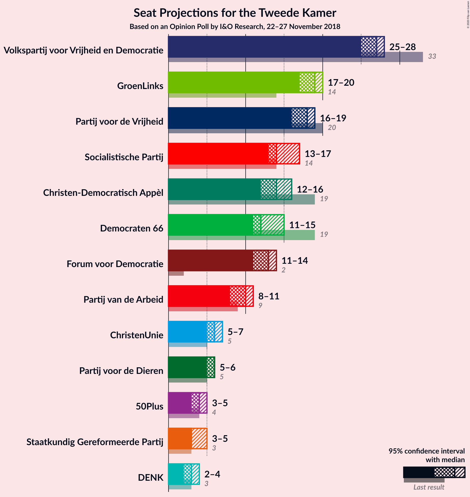

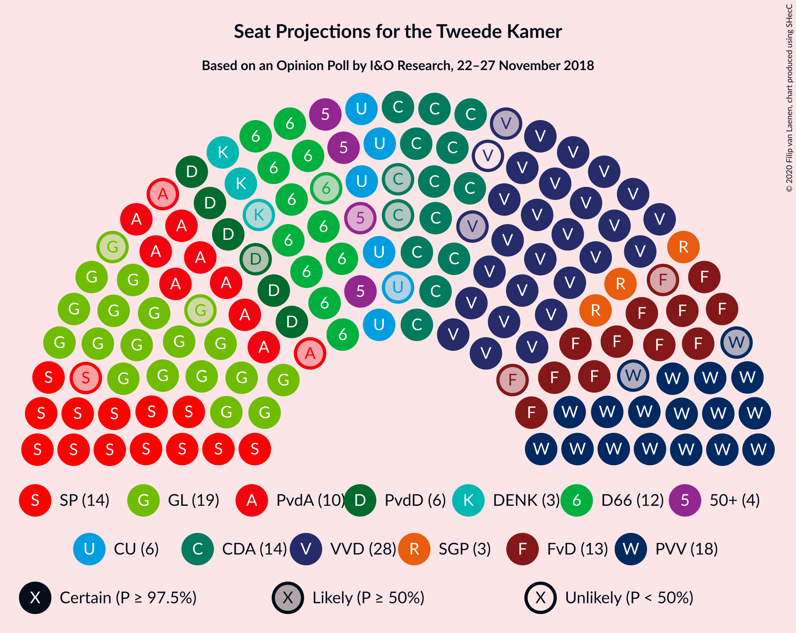

### Confidence Intervals

| Party | Last Result | Median | 80% Confidence Interval | 90% Confidence Interval | 95% Confidence Interval | 99% Confidence Interval |
|:-----:|:-----------:|:------:|:-----------------------:|:-----------------------:|:-----------------------:|:-----------------------:|
| <a href="#volkspartij-voor-vrijheid-en-democratie">Volkspartij voor Vrijheid en Democratie</a> | 33 | 27 | 26–28 |25–28 |25–28 |24–29 |
| <a href="#groenlinks">GroenLinks</a> | 14 | 19 | 17–20 |17–20 |17–20 |16–22 |
| <a href="#partij-voor-de-vrijheid">Partij voor de Vrijheid</a> | 20 | 18 | 18–19 |17–19 |16–19 |15–20 |
| <a href="#socialistische-partij">Socialistische Partij</a> | 14 | 14 | 13–17 |13–17 |13–17 |13–17 |
| <a href="#christen-democratisch-appèl">Christen-Democratisch Appèl</a> | 19 | 14 | 12–14 |12–15 |12–16 |12–16 |
| <a href="#democraten-66">Democraten 66</a> | 19 | 12 | 11–14 |11–15 |11–15 |11–15 |
| <a href="#forum-voor-democratie">Forum voor Democratie</a> | 2 | 13 | 12–14 |11–14 |11–14 |10–14 |
| <a href="#partij-van-de-arbeid">Partij van de Arbeid</a> | 9 | 10 | 10–11 |9–11 |8–11 |8–11 |
| <a href="#christenunie">ChristenUnie</a> | 5 | 6 | 6 |5–7 |5–7 |5–8 |
| <a href="#partij-voor-de-dieren">Partij voor de Dieren</a> | 5 | 6 | 5–6 |5–6 |5–6 |4–6 |
| <a href="#50plus">50Plus</a> | 4 | 4 | 4–5 |4–5 |3–5 |3–6 |
| <a href="#staatkundig-gereformeerde-partij">Staatkundig Gereformeerde Partij</a> | 3 | 3 | 3–4 |3–4 |3–5 |3–5 |
| <a href="#denk">DENK</a> | 3 | 3 | 3 |2–4 |2–4 |2–5 |

### Volkspartij voor Vrijheid en Democratie

*For a full overview of the results for this party, see the [Volkspartij voor Vrijheid en Democratie](party-volkspartijvoorvrijheidendemocratie.html) page.*

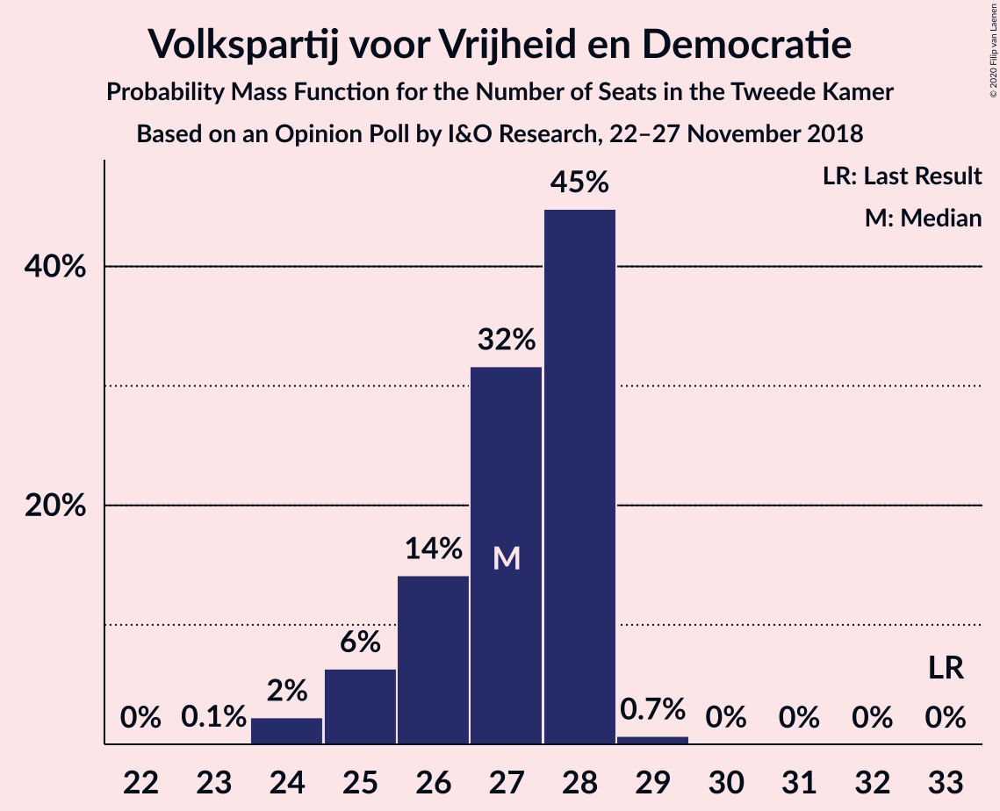

| Number of Seats | Probability | Accumulated | Special Marks |
|:---------------:|:-----------:|:-----------:|:-------------:|
| 23 | 0.1% | 100% |  |
| 24 | 2% | 99.9% |  |
| 25 | 6% | 98% |  |
| 26 | 14% | 91% |  |
| 27 | 32% | 77% | Median |
| 28 | 45% | 46% |  |
| 29 | 0.7% | 0.7% |  |
| 30 | 0% | 0% |  |
| 31 | 0% | 0% |  |
| 32 | 0% | 0% |  |
| 33 | 0% | 0% | Last Result |

### GroenLinks

*For a full overview of the results for this party, see the [GroenLinks](party-groenlinks.html) page.*

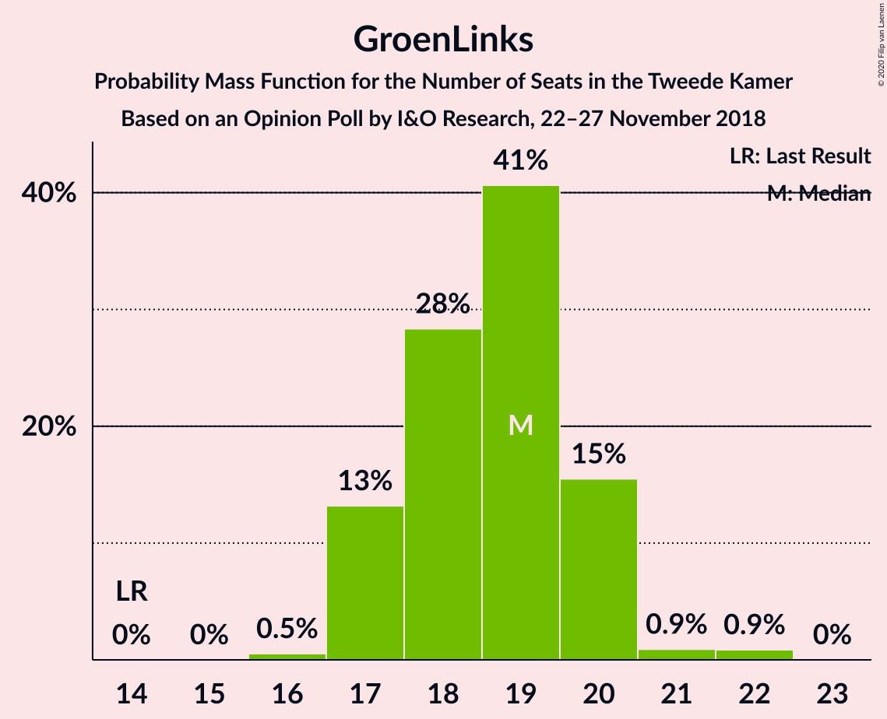

| Number of Seats | Probability | Accumulated | Special Marks |
|:---------------:|:-----------:|:-----------:|:-------------:|
| 14 | 0% | 100% | Last Result |
| 15 | 0% | 100% |  |
| 16 | 0.5% | 100% |  |
| 17 | 13% | 99.5% |  |
| 18 | 28% | 86% |  |
| 19 | 41% | 58% | Median |
| 20 | 15% | 17% |  |
| 21 | 0.9% | 2% |  |
| 22 | 0.9% | 0.9% |  |
| 23 | 0% | 0% |  |

### Partij voor de Vrijheid

*For a full overview of the results for this party, see the [Partij voor de Vrijheid](party-partijvoordevrijheid.html) page.*

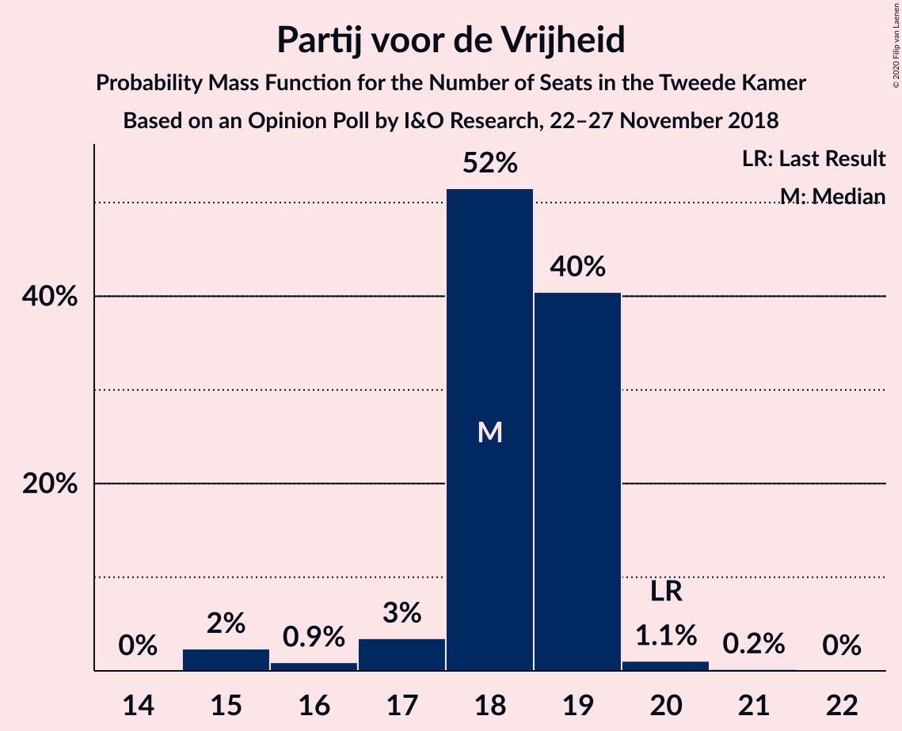

| Number of Seats | Probability | Accumulated | Special Marks |
|:---------------:|:-----------:|:-----------:|:-------------:|
| 15 | 2% | 100% |  |
| 16 | 0.9% | 98% |  |
| 17 | 3% | 97% |  |
| 18 | 52% | 93% | Median |
| 19 | 40% | 42% |  |
| 20 | 1.1% | 1.3% | Last Result |
| 21 | 0.2% | 0.2% |  |
| 22 | 0% | 0% |  |

### Socialistische Partij

*For a full overview of the results for this party, see the [Socialistische Partij](party-socialistischepartij.html) page.*

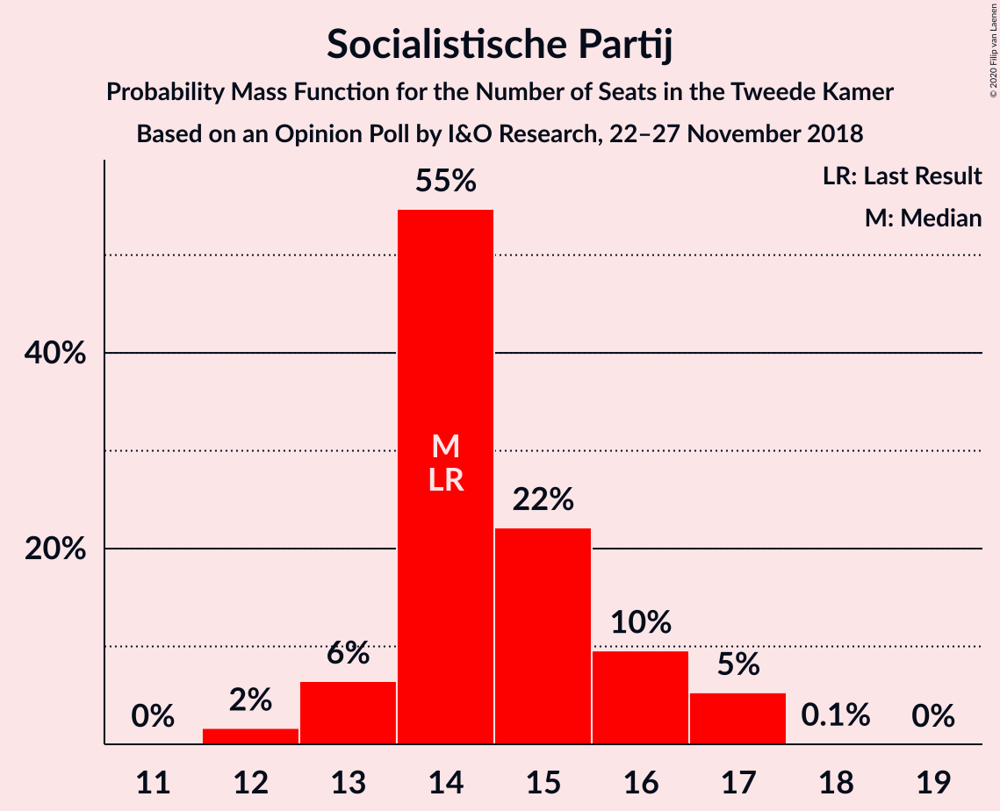

| Number of Seats | Probability | Accumulated | Special Marks |
|:---------------:|:-----------:|:-----------:|:-------------:|
| 12 | 0.2% | 100% |  |
| 13 | 11% | 99.8% |  |
| 14 | 40% | 89% | Last Result, Median |
| 15 | 15% | 49% |  |
| 16 | 0.9% | 34% |  |
| 17 | 34% | 34% |  |
| 18 | 0% | 0% |  |

### Christen-Democratisch Appèl

*For a full overview of the results for this party, see the [Christen-Democratisch Appèl](party-christen-democratischappèl.html) page.*

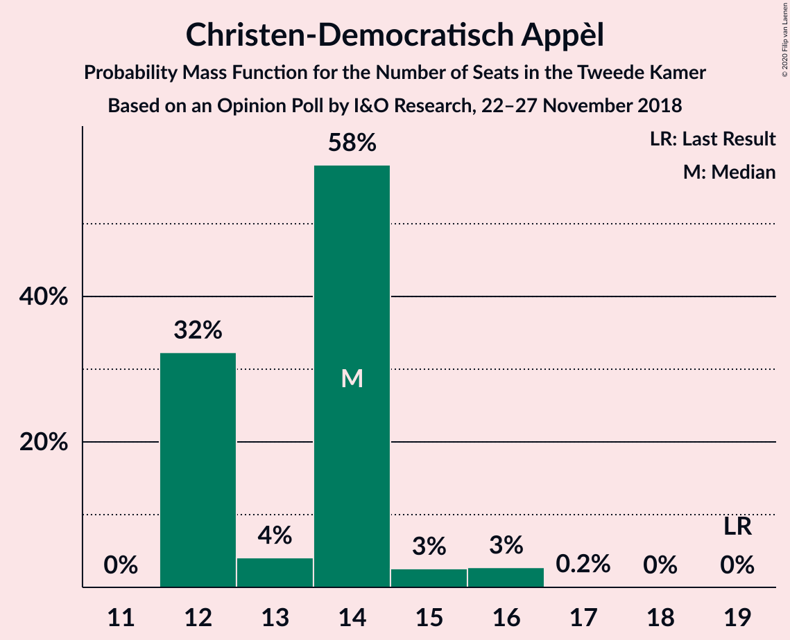

| Number of Seats | Probability | Accumulated | Special Marks |
|:---------------:|:-----------:|:-----------:|:-------------:|
| 12 | 32% | 100% |  |
| 13 | 4% | 68% |  |
| 14 | 58% | 64% | Median |
| 15 | 3% | 5% |  |
| 16 | 3% | 3% |  |
| 17 | 0.2% | 0.2% |  |
| 18 | 0% | 0% |  |
| 19 | 0% | 0% | Last Result |

### Democraten 66

*For a full overview of the results for this party, see the [Democraten 66](party-democraten66.html) page.*

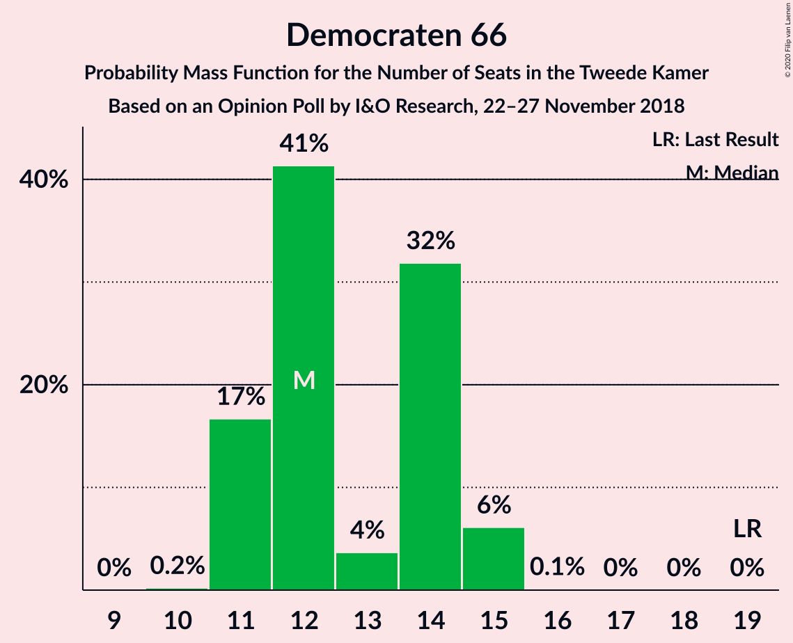

| Number of Seats | Probability | Accumulated | Special Marks |
|:---------------:|:-----------:|:-----------:|:-------------:|
| 10 | 0.2% | 100% |  |
| 11 | 17% | 99.8% |  |
| 12 | 41% | 83% | Median |
| 13 | 4% | 42% |  |
| 14 | 32% | 38% |  |
| 15 | 6% | 6% |  |
| 16 | 0.1% | 0.1% |  |
| 17 | 0% | 0% |  |
| 18 | 0% | 0% |  |
| 19 | 0% | 0% | Last Result |

### Forum voor Democratie

*For a full overview of the results for this party, see the [Forum voor Democratie](party-forumvoordemocratie.html) page.*

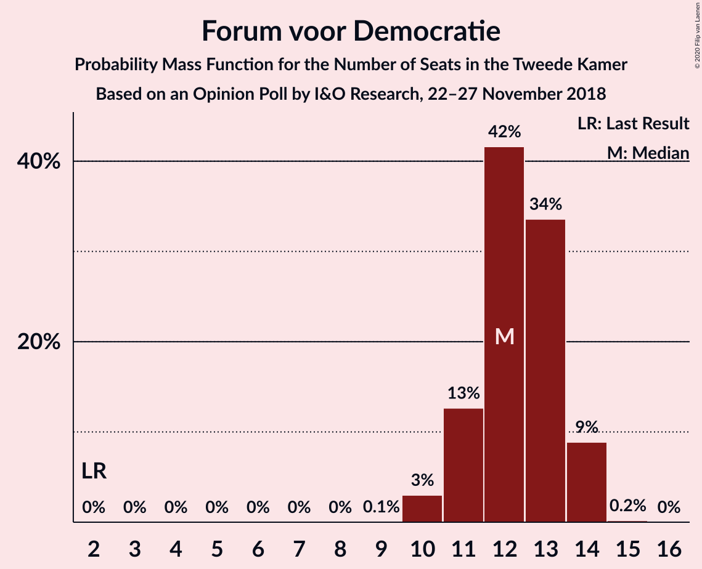

| Number of Seats | Probability | Accumulated | Special Marks |
|:---------------:|:-----------:|:-----------:|:-------------:|
| 2 | 0% | 100% | Last Result |
| 3 | 0% | 100% |  |
| 4 | 0% | 100% |  |
| 5 | 0% | 100% |  |
| 6 | 0% | 100% |  |
| 7 | 0% | 100% |  |
| 8 | 0% | 100% |  |
| 9 | 0.1% | 100% |  |
| 10 | 1.0% | 99.9% |  |
| 11 | 9% | 98.9% |  |
| 12 | 31% | 90% |  |
| 13 | 37% | 59% | Median |
| 14 | 22% | 22% |  |
| 15 | 0.1% | 0.2% |  |
| 16 | 0% | 0% |  |

### Partij van de Arbeid

*For a full overview of the results for this party, see the [Partij van de Arbeid](party-partijvandearbeid.html) page.*

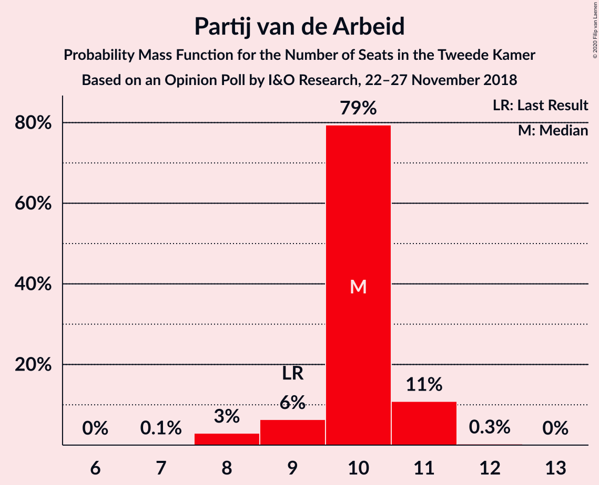

| Number of Seats | Probability | Accumulated | Special Marks |
|:---------------:|:-----------:|:-----------:|:-------------:|
| 7 | 0.1% | 100% |  |
| 8 | 3% | 99.9% |  |
| 9 | 6% | 97% | Last Result |
| 10 | 79% | 91% | Median |
| 11 | 11% | 11% |  |
| 12 | 0.3% | 0.3% |  |
| 13 | 0% | 0% |  |

### ChristenUnie

*For a full overview of the results for this party, see the [ChristenUnie](party-christenunie.html) page.*

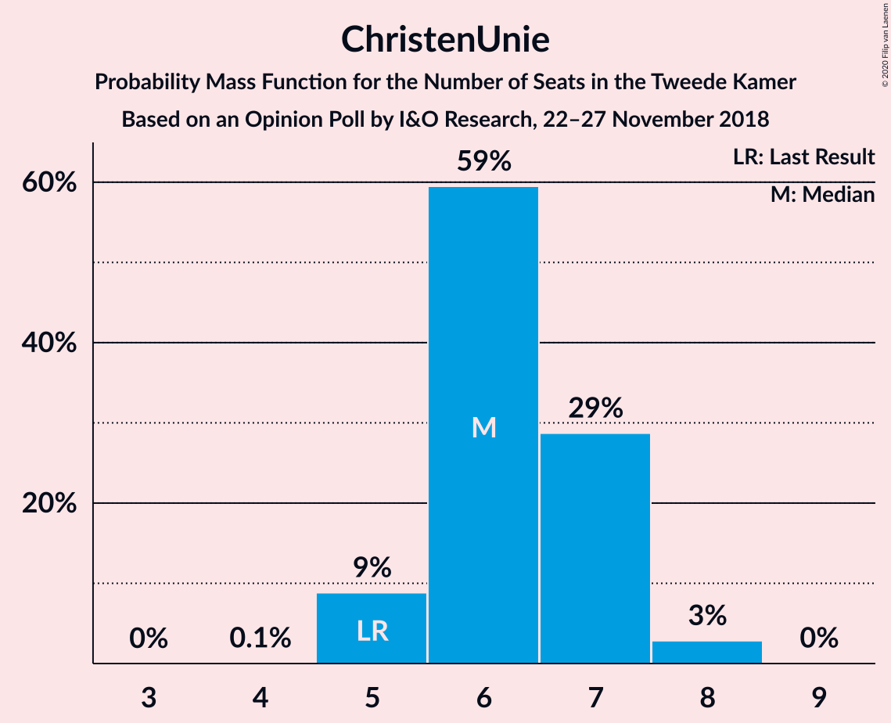

| Number of Seats | Probability | Accumulated | Special Marks |
|:---------------:|:-----------:|:-----------:|:-------------:|
| 4 | 0.1% | 100% |  |
| 5 | 8% | 99.9% | Last Result |
| 6 | 86% | 92% | Median |
| 7 | 6% | 6% |  |
| 8 | 0.9% | 1.0% |  |
| 9 | 0.1% | 0.1% |  |
| 10 | 0% | 0% |  |

### Partij voor de Dieren

*For a full overview of the results for this party, see the [Partij voor de Dieren](party-partijvoordedieren.html) page.*

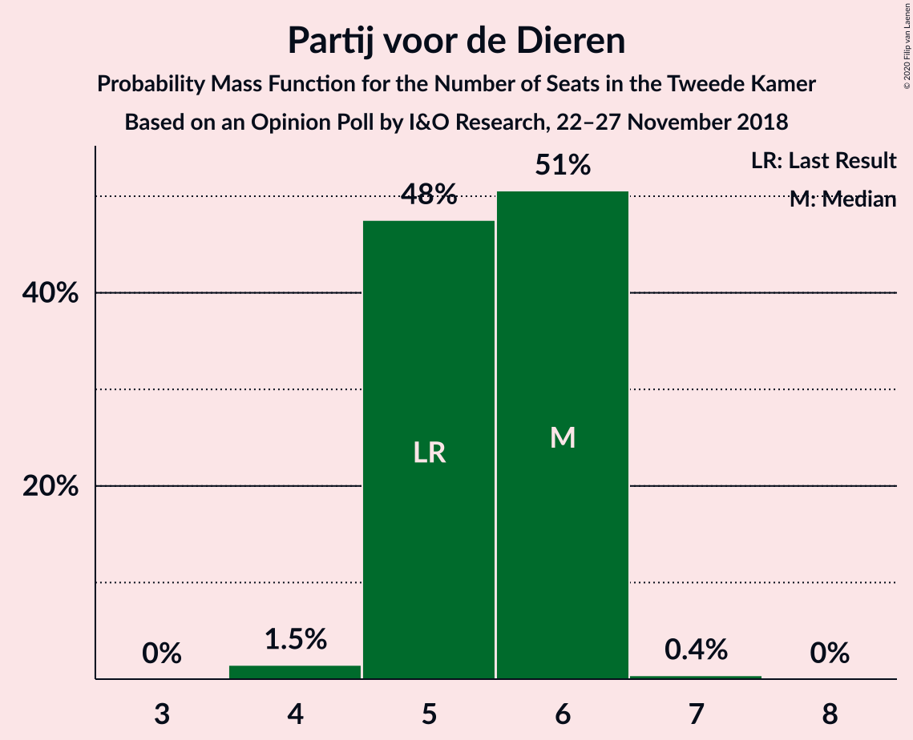

| Number of Seats | Probability | Accumulated | Special Marks |
|:---------------:|:-----------:|:-----------:|:-------------:|
| 4 | 1.5% | 100% |  |
| 5 | 48% | 98.5% | Last Result |
| 6 | 51% | 51% | Median |
| 7 | 0.4% | 0.4% |  |
| 8 | 0% | 0% |  |

### 50Plus

*For a full overview of the results for this party, see the [50Plus](party-50plus.html) page.*

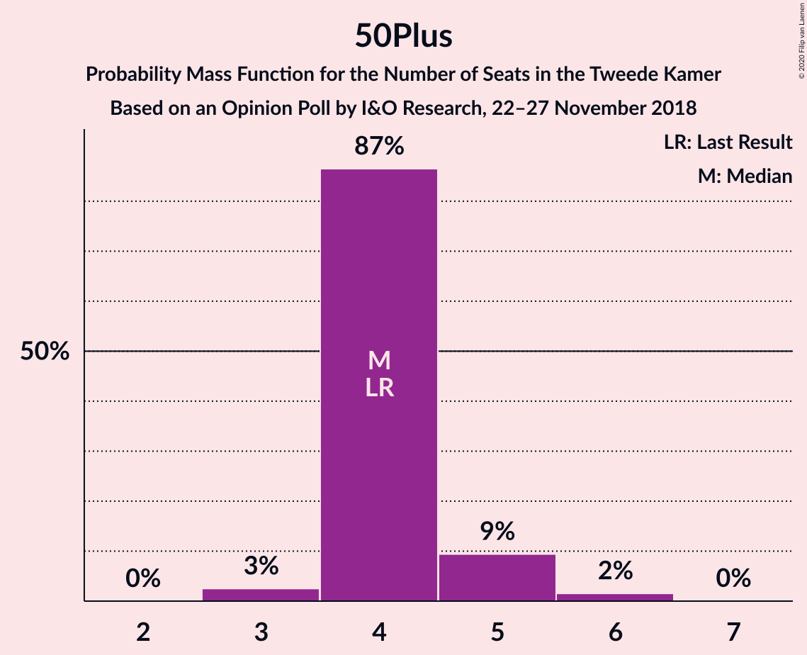

| Number of Seats | Probability | Accumulated | Special Marks |
|:---------------:|:-----------:|:-----------:|:-------------:|
| 3 | 3% | 100% |  |
| 4 | 87% | 97% | Last Result, Median |
| 5 | 9% | 11% |  |
| 6 | 2% | 2% |  |
| 7 | 0% | 0% |  |

### Staatkundig Gereformeerde Partij

*For a full overview of the results for this party, see the [Staatkundig Gereformeerde Partij](party-staatkundiggereformeerdepartij.html) page.*

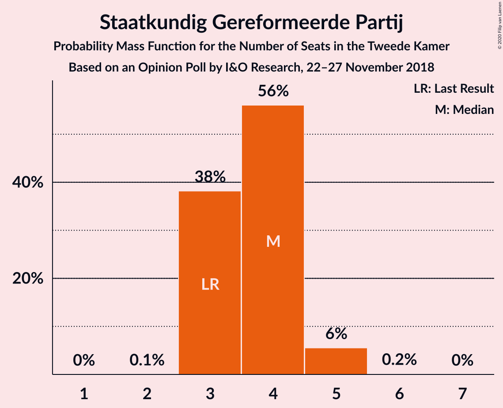

| Number of Seats | Probability | Accumulated | Special Marks |
|:---------------:|:-----------:|:-----------:|:-------------:|
| 3 | 65% | 100% | Last Result, Median |
| 4 | 30% | 35% |  |
| 5 | 4% | 4% |  |
| 6 | 0% | 0% |  |

### DENK

*For a full overview of the results for this party, see the [DENK](party-denk.html) page.*

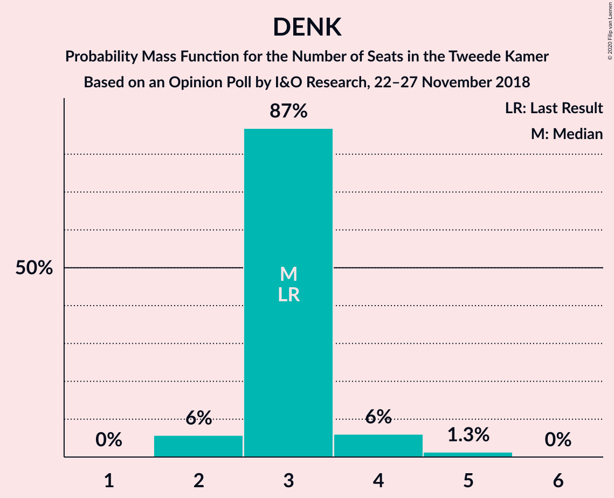

| Number of Seats | Probability | Accumulated | Special Marks |
|:---------------:|:-----------:|:-----------:|:-------------:|
| 2 | 6% | 100% |  |
| 3 | 87% | 94% | Last Result, Median |
| 4 | 6% | 7% |  |
| 5 | 1.3% | 1.3% |  |
| 6 | 0% | 0% |  |

## Coalitions

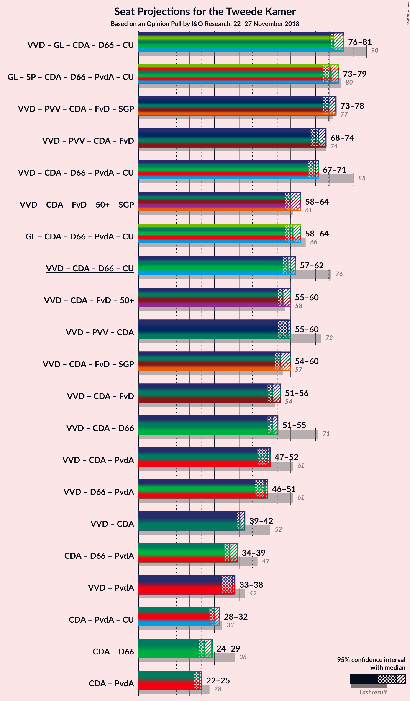

### Confidence Intervals

| Coalition | Last Result | Median | Majority? | 80% Confidence Interval | 90% Confidence Interval | 95% Confidence Interval | 99% Confidence Interval |
|:---------:|:-----------:|:------:|:---------:|:-----------------------:|:-----------------------:|:-----------------------:|:-----------------------:|
| Volkspartij voor Vrijheid en Democratie – GroenLinks – Christen-Democratisch Appèl – Democraten 66 – ChristenUnie | 90 | 77 | 99.6% | 76–79 | 76–80 | 76–81 | 76–82 |
| GroenLinks – Socialistische Partij – Christen-Democratisch Appèl – Democraten 66 – Partij van de Arbeid – ChristenUnie | 80 | 76 | 79% | 73–77 | 73–77 | 73–79 | 73–79 |
| Volkspartij voor Vrijheid en Democratie – Partij voor de Vrijheid – Christen-Democratisch Appèl – Forum voor Democratie – Staatkundig Gereformeerde Partij | 77 | 75 | 17% | 74–78 | 73–78 | 73–78 | 72–79 |
| Volkspartij voor Vrijheid en Democratie – Partij voor de Vrijheid – Christen-Democratisch Appèl – Forum voor Democratie | 74 | 71 | 0.5% | 70–74 | 70–74 | 68–74 | 68–76 |
| Volkspartij voor Vrijheid en Democratie – Christen-Democratisch Appèl – Democraten 66 – Partij van de Arbeid – ChristenUnie | 85 | 69 | 0% | 68–71 | 68–71 | 67–71 | 66–73 |
| Volkspartij voor Vrijheid en Democratie – Christen-Democratisch Appèl – Forum voor Democratie – 50Plus – Staatkundig Gereformeerde Partij | 61 | 60 | 0% | 60–64 | 60–64 | 58–64 | 57–66 |
| GroenLinks – Christen-Democratisch Appèl – Democraten 66 – Partij van de Arbeid – ChristenUnie | 66 | 61 | 0% | 58–63 | 58–64 | 58–64 | 58–66 |
| Volkspartij voor Vrijheid en Democratie – Christen-Democratisch Appèl – Democraten 66 – ChristenUnie | 76 | 59 | 0% | 58–61 | 57–61 | 57–62 | 57–63 |
| Volkspartij voor Vrijheid en Democratie – Christen-Democratisch Appèl – Forum voor Democratie – 50Plus | 58 | 57 | 0% | 56–60 | 56–60 | 55–60 | 54–63 |
| Volkspartij voor Vrijheid en Democratie – Partij voor de Vrijheid – Christen-Democratisch Appèl | 72 | 59 | 0% | 57–60 | 57–60 | 55–60 | 55–62 |
| Volkspartij voor Vrijheid en Democratie – Christen-Democratisch Appèl – Forum voor Democratie – Staatkundig Gereformeerde Partij | 57 | 56 | 0% | 56–60 | 55–60 | 54–60 | 54–62 |
| Volkspartij voor Vrijheid en Democratie – Christen-Democratisch Appèl – Forum voor Democratie | 54 | 53 | 0% | 51–56 | 51–56 | 51–56 | 50–59 |
| Volkspartij voor Vrijheid en Democratie – Christen-Democratisch Appèl – Democraten 66 | 71 | 53 | 0% | 52–55 | 51–55 | 51–55 | 50–57 |
| Volkspartij voor Vrijheid en Democratie – Christen-Democratisch Appèl – Partij van de Arbeid | 61 | 51 | 0% | 49–52 | 49–52 | 47–52 | 47–54 |
| Volkspartij voor Vrijheid en Democratie – Democraten 66 – Partij van de Arbeid | 61 | 50 | 0% | 48–51 | 47–51 | 46–51 | 45–51 |
| Volkspartij voor Vrijheid en Democratie – Christen-Democratisch Appèl | 52 | 40 | 0% | 40–42 | 39–42 | 39–42 | 38–45 |
| Christen-Democratisch Appèl – Democraten 66 – Partij van de Arbeid | 47 | 36 | 0% | 34–38 | 34–38 | 34–39 | 34–39 |
| Volkspartij voor Vrijheid en Democratie – Partij van de Arbeid | 42 | 37 | 0% | 35–38 | 35–38 | 33–38 | 32–39 |
| Christen-Democratisch Appèl – Partij van de Arbeid – ChristenUnie | 33 | 30 | 0% | 28–31 | 28–31 | 28–32 | 28–33 |
| Christen-Democratisch Appèl – Democraten 66 | 38 | 26 | 0% | 24–28 | 24–29 | 24–29 | 24–29 |
| Christen-Democratisch Appèl – Partij van de Arbeid | 28 | 24 | 0% | 22–25 | 22–25 | 22–25 | 22–26 |

### Volkspartij voor Vrijheid en Democratie – GroenLinks – Christen-Democratisch Appèl – Democraten 66 – ChristenUnie

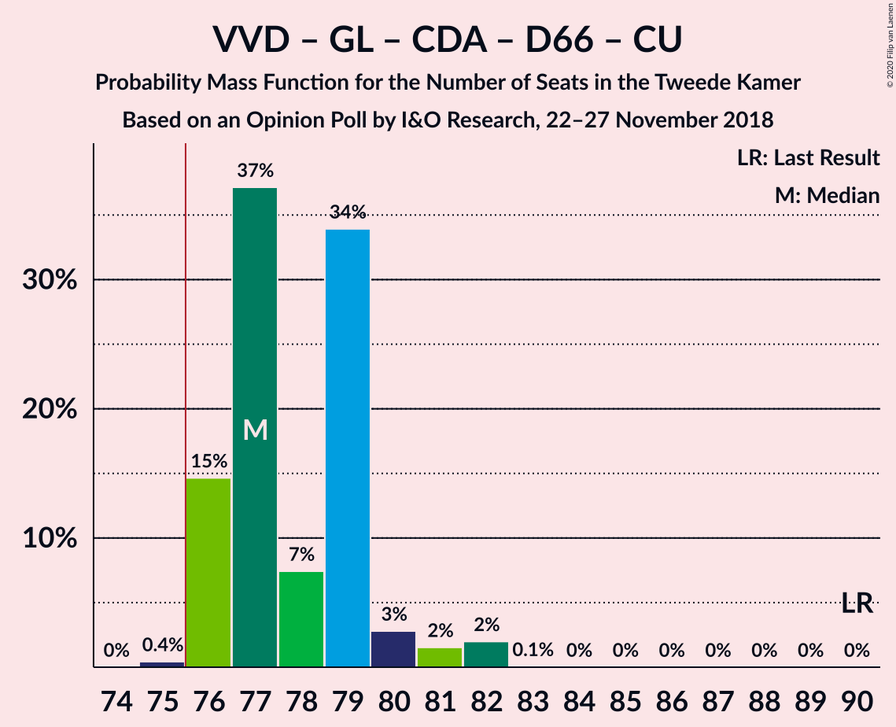

| Number of Seats | Probability | Accumulated | Special Marks |
|:---------------:|:-----------:|:-----------:|:-------------:|
| 75 | 0.4% | 100% |  |
| 76 | 15% | 99.6% | Majority |
| 77 | 37% | 85% |  |
| 78 | 7% | 48% | Median |
| 79 | 34% | 40% |  |
| 80 | 3% | 6% |  |
| 81 | 2% | 4% |  |
| 82 | 2% | 2% |  |
| 83 | 0.1% | 0.1% |  |
| 84 | 0% | 0% |  |
| 85 | 0% | 0% |  |
| 86 | 0% | 0% |  |
| 87 | 0% | 0% |  |
| 88 | 0% | 0% |  |
| 89 | 0% | 0% |  |
| 90 | 0% | 0% | Last Result |

### GroenLinks – Socialistische Partij – Christen-Democratisch Appèl – Democraten 66 – Partij van de Arbeid – ChristenUnie

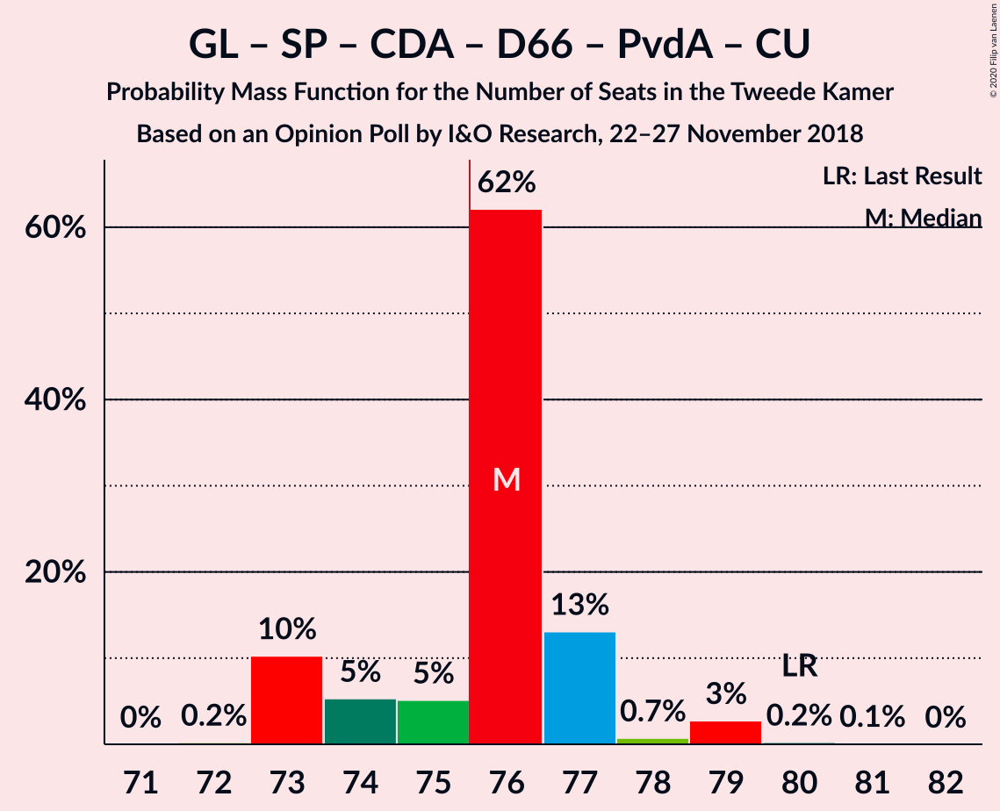

| Number of Seats | Probability | Accumulated | Special Marks |
|:---------------:|:-----------:|:-----------:|:-------------:|
| 72 | 0.2% | 100% |  |
| 73 | 10% | 99.8% |  |
| 74 | 5% | 89% |  |
| 75 | 5% | 84% | Median |
| 76 | 62% | 79% | Majority |
| 77 | 13% | 17% |  |
| 78 | 0.7% | 4% |  |
| 79 | 3% | 3% |  |
| 80 | 0.2% | 0.3% | Last Result |
| 81 | 0.1% | 0.1% |  |
| 82 | 0% | 0% |  |

### Volkspartij voor Vrijheid en Democratie – Partij voor de Vrijheid – Christen-Democratisch Appèl – Forum voor Democratie – Staatkundig Gereformeerde Partij

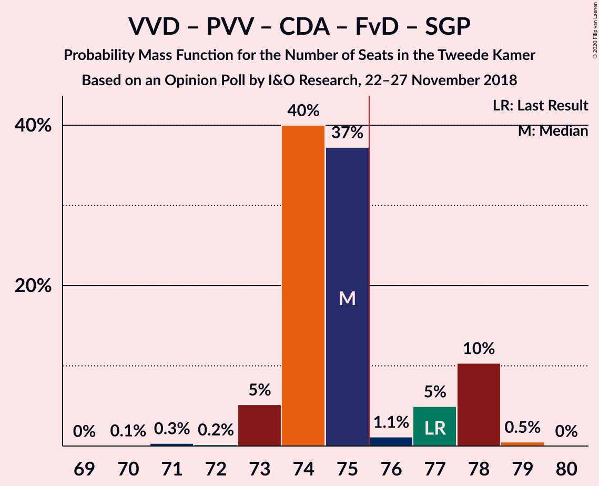

| Number of Seats | Probability | Accumulated | Special Marks |
|:---------------:|:-----------:|:-----------:|:-------------:|
| 70 | 0.1% | 100% |  |
| 71 | 0.3% | 99.9% |  |
| 72 | 0.2% | 99.6% |  |
| 73 | 5% | 99.4% |  |
| 74 | 40% | 94% |  |
| 75 | 37% | 54% | Median |
| 76 | 1.1% | 17% | Majority |
| 77 | 5% | 16% | Last Result |
| 78 | 10% | 11% |  |
| 79 | 0.5% | 0.5% |  |
| 80 | 0% | 0% |  |

### Volkspartij voor Vrijheid en Democratie – Partij voor de Vrijheid – Christen-Democratisch Appèl – Forum voor Democratie

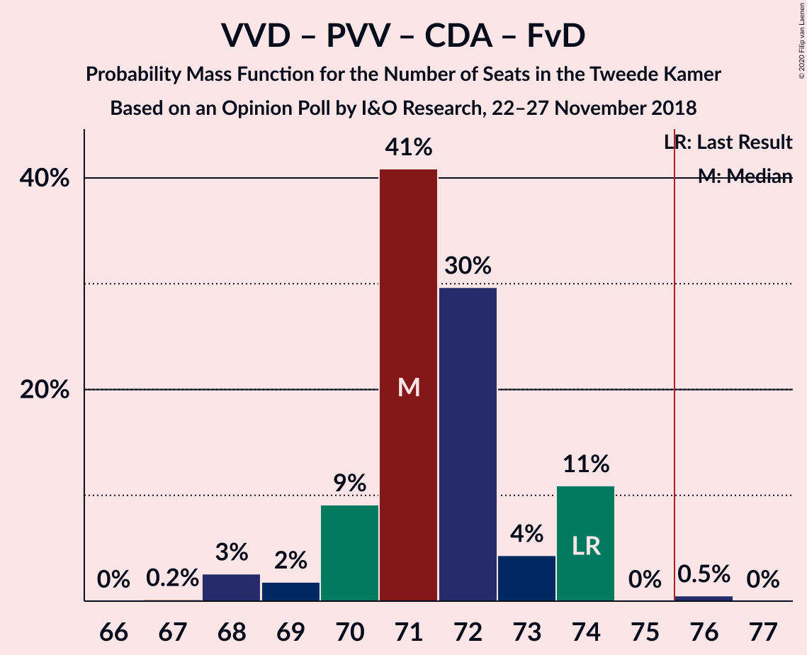

| Number of Seats | Probability | Accumulated | Special Marks |
|:---------------:|:-----------:|:-----------:|:-------------:|
| 67 | 0.2% | 100% |  |
| 68 | 3% | 99.8% |  |
| 69 | 2% | 97% |  |
| 70 | 9% | 95% |  |
| 71 | 41% | 86% |  |
| 72 | 30% | 45% | Median |
| 73 | 4% | 16% |  |
| 74 | 11% | 11% | Last Result |
| 75 | 0% | 0.5% |  |
| 76 | 0.5% | 0.5% | Majority |
| 77 | 0% | 0% |  |

### Volkspartij voor Vrijheid en Democratie – Christen-Democratisch Appèl – Democraten 66 – Partij van de Arbeid – ChristenUnie

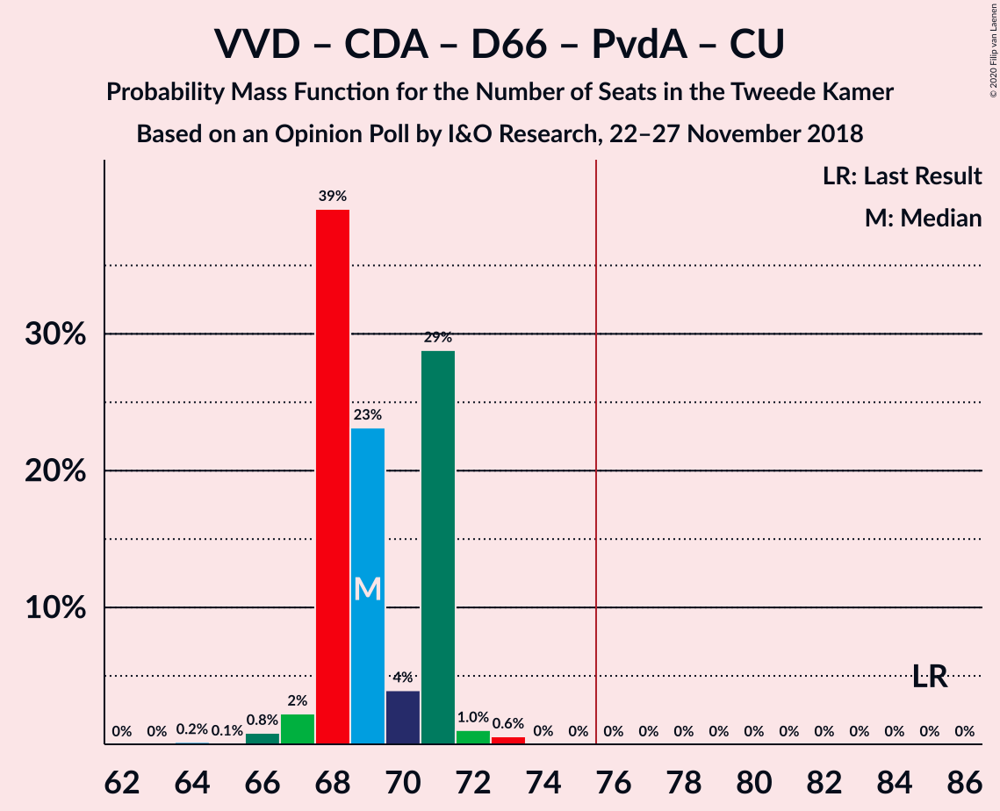

| Number of Seats | Probability | Accumulated | Special Marks |
|:---------------:|:-----------:|:-----------:|:-------------:|
| 64 | 0.2% | 100% |  |
| 65 | 0.1% | 99.8% |  |
| 66 | 0.8% | 99.8% |  |
| 67 | 2% | 98.9% |  |
| 68 | 39% | 97% |  |
| 69 | 23% | 58% | Median |
| 70 | 4% | 34% |  |
| 71 | 29% | 30% |  |
| 72 | 1.0% | 2% |  |
| 73 | 0.6% | 0.6% |  |
| 74 | 0% | 0% |  |
| 75 | 0% | 0% |  |
| 76 | 0% | 0% | Majority |
| 77 | 0% | 0% |  |
| 78 | 0% | 0% |  |
| 79 | 0% | 0% |  |
| 80 | 0% | 0% |  |
| 81 | 0% | 0% |  |
| 82 | 0% | 0% |  |
| 83 | 0% | 0% |  |
| 84 | 0% | 0% |  |
| 85 | 0% | 0% | Last Result |

### Volkspartij voor Vrijheid en Democratie – Christen-Democratisch Appèl – Forum voor Democratie – 50Plus – Staatkundig Gereformeerde Partij

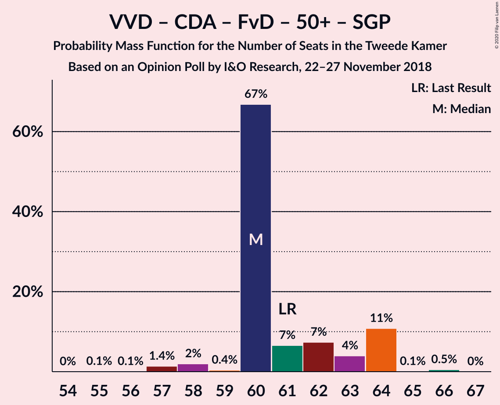

| Number of Seats | Probability | Accumulated | Special Marks |
|:---------------:|:-----------:|:-----------:|:-------------:|
| 55 | 0.1% | 100% |  |
| 56 | 0.1% | 99.9% |  |
| 57 | 1.4% | 99.9% |  |
| 58 | 2% | 98% |  |
| 59 | 0.4% | 97% |  |
| 60 | 67% | 96% |  |
| 61 | 7% | 29% | Last Result, Median |
| 62 | 7% | 23% |  |
| 63 | 4% | 15% |  |
| 64 | 11% | 11% |  |
| 65 | 0.1% | 0.6% |  |
| 66 | 0.5% | 0.5% |  |
| 67 | 0% | 0% |  |

### GroenLinks – Christen-Democratisch Appèl – Democraten 66 – Partij van de Arbeid – ChristenUnie

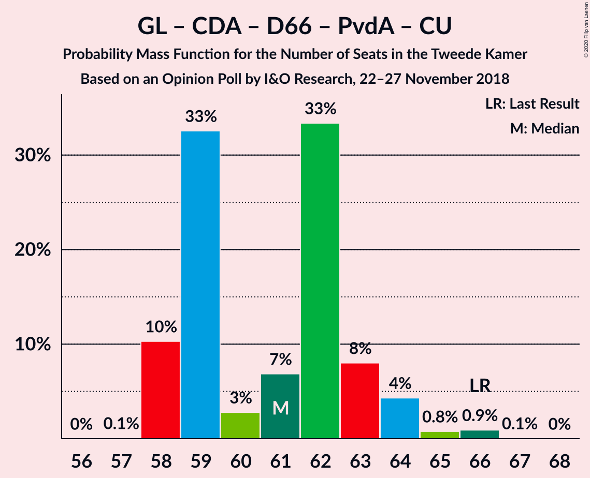

| Number of Seats | Probability | Accumulated | Special Marks |
|:---------------:|:-----------:|:-----------:|:-------------:|
| 57 | 0.1% | 100% |  |
| 58 | 10% | 99.9% |  |
| 59 | 33% | 90% |  |
| 60 | 3% | 57% |  |
| 61 | 7% | 54% | Median |
| 62 | 33% | 47% |  |
| 63 | 8% | 14% |  |
| 64 | 4% | 6% |  |
| 65 | 0.8% | 2% |  |
| 66 | 0.9% | 1.0% | Last Result |
| 67 | 0.1% | 0.1% |  |
| 68 | 0% | 0% |  |

### Volkspartij voor Vrijheid en Democratie – Christen-Democratisch Appèl – Democraten 66 – ChristenUnie

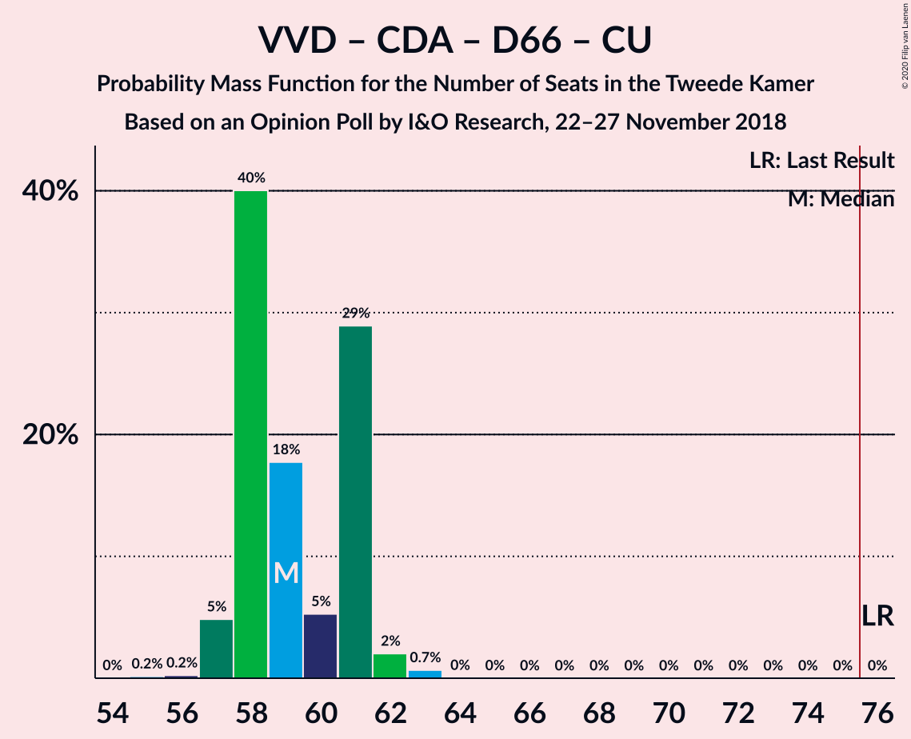

| Number of Seats | Probability | Accumulated | Special Marks |
|:---------------:|:-----------:|:-----------:|:-------------:|
| 55 | 0.2% | 100% |  |
| 56 | 0.2% | 99.8% |  |
| 57 | 5% | 99.6% |  |
| 58 | 40% | 95% |  |
| 59 | 18% | 55% | Median |
| 60 | 5% | 37% |  |
| 61 | 29% | 32% |  |
| 62 | 2% | 3% |  |
| 63 | 0.7% | 0.7% |  |
| 64 | 0% | 0.1% |  |
| 65 | 0% | 0% |  |
| 66 | 0% | 0% |  |
| 67 | 0% | 0% |  |
| 68 | 0% | 0% |  |
| 69 | 0% | 0% |  |
| 70 | 0% | 0% |  |
| 71 | 0% | 0% |  |
| 72 | 0% | 0% |  |
| 73 | 0% | 0% |  |
| 74 | 0% | 0% |  |
| 75 | 0% | 0% |  |
| 76 | 0% | 0% | Last Result, Majority |

### Volkspartij voor Vrijheid en Democratie – Christen-Democratisch Appèl – Forum voor Democratie – 50Plus

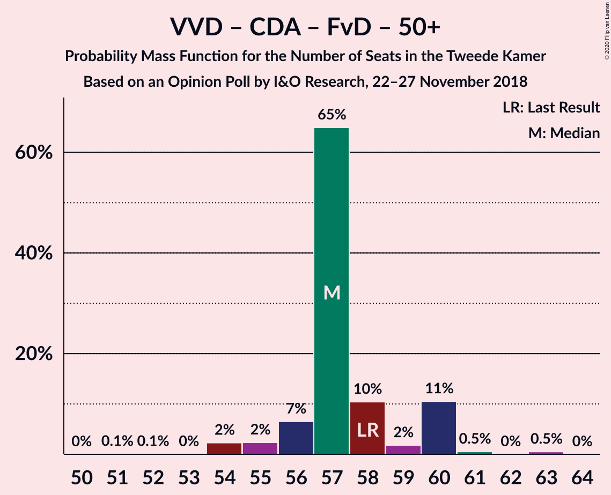

| Number of Seats | Probability | Accumulated | Special Marks |
|:---------------:|:-----------:|:-----------:|:-------------:|
| 51 | 0.1% | 100% |  |
| 52 | 0.1% | 99.9% |  |
| 53 | 0% | 99.9% |  |
| 54 | 2% | 99.8% |  |
| 55 | 2% | 98% |  |
| 56 | 7% | 95% |  |
| 57 | 65% | 89% |  |
| 58 | 10% | 24% | Last Result, Median |
| 59 | 2% | 13% |  |
| 60 | 11% | 12% |  |
| 61 | 0.5% | 1.0% |  |
| 62 | 0% | 0.5% |  |
| 63 | 0.5% | 0.5% |  |
| 64 | 0% | 0% |  |

### Volkspartij voor Vrijheid en Democratie – Partij voor de Vrijheid – Christen-Democratisch Appèl

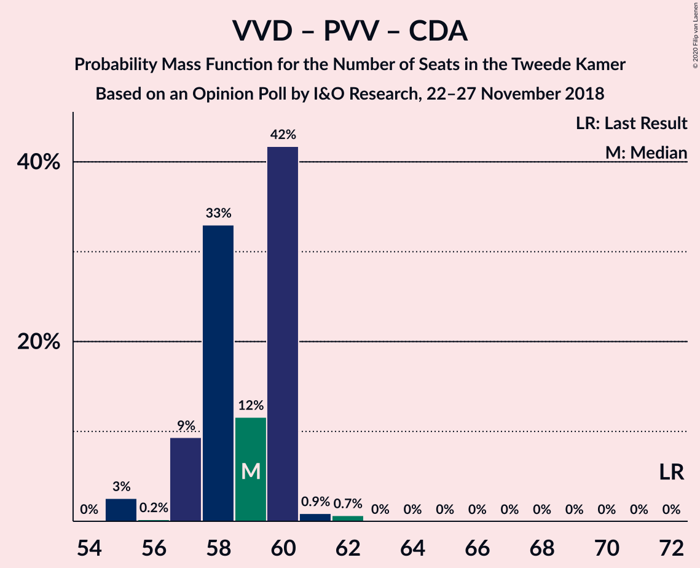

| Number of Seats | Probability | Accumulated | Special Marks |
|:---------------:|:-----------:|:-----------:|:-------------:|
| 55 | 3% | 100% |  |
| 56 | 0.2% | 97% |  |
| 57 | 9% | 97% |  |
| 58 | 33% | 88% |  |
| 59 | 12% | 55% | Median |
| 60 | 42% | 43% |  |
| 61 | 0.9% | 2% |  |
| 62 | 0.7% | 0.7% |  |
| 63 | 0% | 0% |  |
| 64 | 0% | 0% |  |
| 65 | 0% | 0% |  |
| 66 | 0% | 0% |  |
| 67 | 0% | 0% |  |
| 68 | 0% | 0% |  |
| 69 | 0% | 0% |  |
| 70 | 0% | 0% |  |
| 71 | 0% | 0% |  |
| 72 | 0% | 0% | Last Result |

### Volkspartij voor Vrijheid en Democratie – Christen-Democratisch Appèl – Forum voor Democratie – Staatkundig Gereformeerde Partij

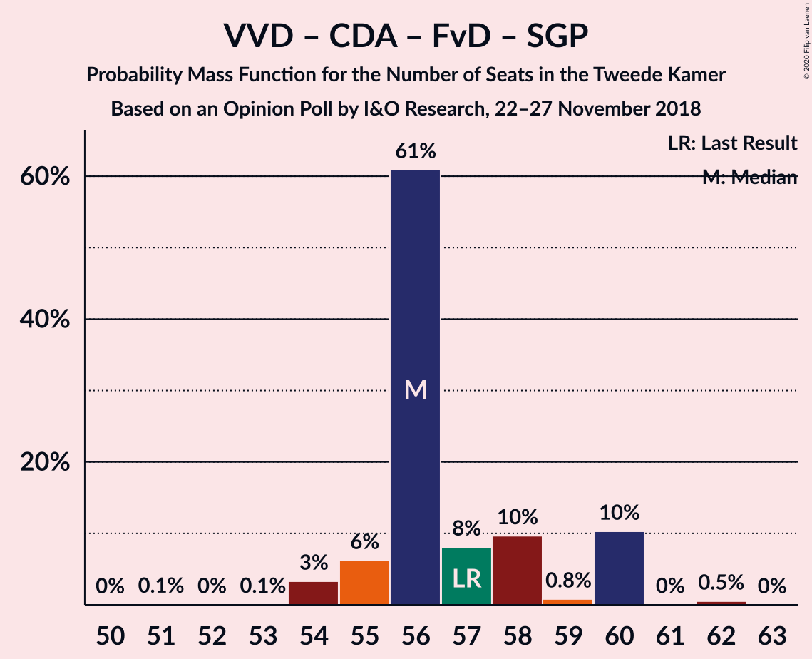

| Number of Seats | Probability | Accumulated | Special Marks |
|:---------------:|:-----------:|:-----------:|:-------------:|
| 51 | 0.1% | 100% |  |
| 52 | 0% | 99.9% |  |
| 53 | 0.1% | 99.9% |  |
| 54 | 3% | 99.8% |  |
| 55 | 6% | 97% |  |
| 56 | 61% | 90% |  |
| 57 | 8% | 29% | Last Result, Median |
| 58 | 10% | 21% |  |
| 59 | 0.8% | 12% |  |
| 60 | 10% | 11% |  |
| 61 | 0% | 0.6% |  |
| 62 | 0.5% | 0.5% |  |
| 63 | 0% | 0% |  |

### Volkspartij voor Vrijheid en Democratie – Christen-Democratisch Appèl – Forum voor Democratie

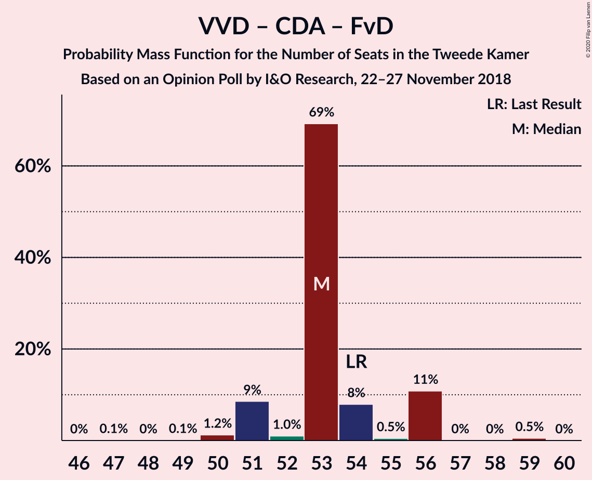

| Number of Seats | Probability | Accumulated | Special Marks |
|:---------------:|:-----------:|:-----------:|:-------------:|
| 47 | 0.1% | 100% |  |
| 48 | 0% | 99.9% |  |
| 49 | 0.1% | 99.9% |  |
| 50 | 1.2% | 99.8% |  |
| 51 | 9% | 98.6% |  |
| 52 | 1.0% | 90% |  |
| 53 | 69% | 89% |  |
| 54 | 8% | 20% | Last Result, Median |
| 55 | 0.5% | 12% |  |
| 56 | 11% | 11% |  |
| 57 | 0% | 0.5% |  |
| 58 | 0% | 0.5% |  |
| 59 | 0.5% | 0.5% |  |
| 60 | 0% | 0% |  |

### Volkspartij voor Vrijheid en Democratie – Christen-Democratisch Appèl – Democraten 66

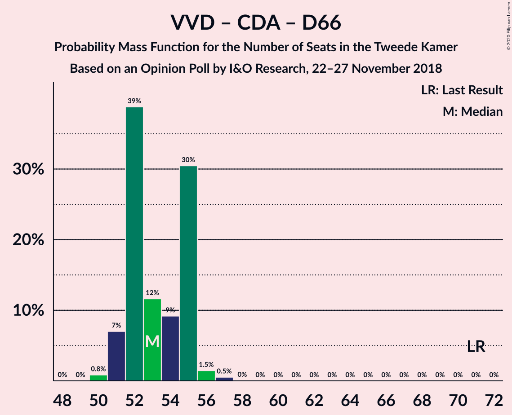

| Number of Seats | Probability | Accumulated | Special Marks |
|:---------------:|:-----------:|:-----------:|:-------------:|
| 50 | 0.8% | 100% |  |
| 51 | 7% | 99.1% |  |
| 52 | 39% | 92% |  |
| 53 | 12% | 53% | Median |
| 54 | 9% | 42% |  |
| 55 | 30% | 32% |  |
| 56 | 1.5% | 2% |  |
| 57 | 0.5% | 0.6% |  |
| 58 | 0% | 0.1% |  |
| 59 | 0% | 0% |  |
| 60 | 0% | 0% |  |
| 61 | 0% | 0% |  |
| 62 | 0% | 0% |  |
| 63 | 0% | 0% |  |
| 64 | 0% | 0% |  |
| 65 | 0% | 0% |  |
| 66 | 0% | 0% |  |
| 67 | 0% | 0% |  |
| 68 | 0% | 0% |  |
| 69 | 0% | 0% |  |
| 70 | 0% | 0% |  |
| 71 | 0% | 0% | Last Result |

### Volkspartij voor Vrijheid en Democratie – Christen-Democratisch Appèl – Partij van de Arbeid

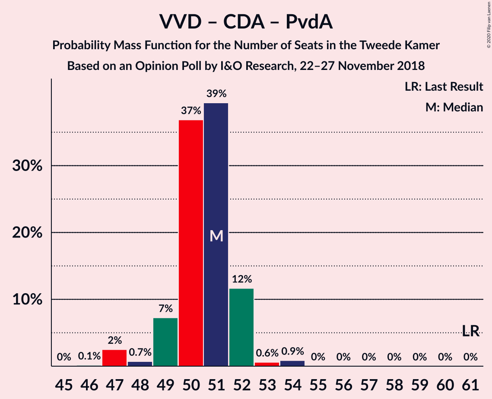

| Number of Seats | Probability | Accumulated | Special Marks |
|:---------------:|:-----------:|:-----------:|:-------------:|
| 46 | 0.1% | 100% |  |
| 47 | 2% | 99.8% |  |
| 48 | 0.7% | 97% |  |
| 49 | 7% | 97% |  |
| 50 | 37% | 89% |  |
| 51 | 39% | 53% | Median |
| 52 | 12% | 13% |  |
| 53 | 0.6% | 1.5% |  |
| 54 | 0.9% | 0.9% |  |
| 55 | 0% | 0% |  |
| 56 | 0% | 0% |  |
| 57 | 0% | 0% |  |
| 58 | 0% | 0% |  |
| 59 | 0% | 0% |  |
| 60 | 0% | 0% |  |
| 61 | 0% | 0% | Last Result |

### Volkspartij voor Vrijheid en Democratie – Democraten 66 – Partij van de Arbeid

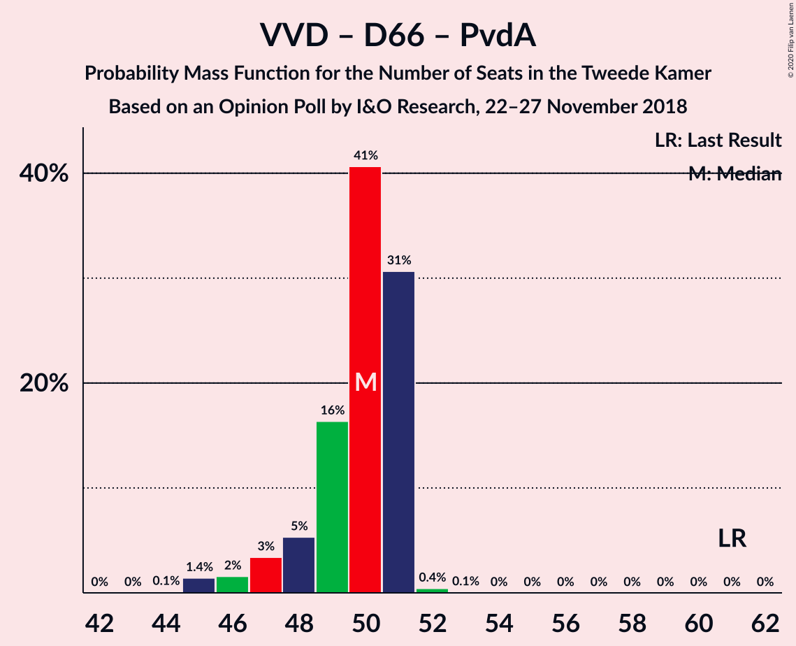

| Number of Seats | Probability | Accumulated | Special Marks |
|:---------------:|:-----------:|:-----------:|:-------------:|
| 44 | 0.1% | 100% |  |
| 45 | 1.4% | 99.9% |  |
| 46 | 2% | 98% |  |
| 47 | 3% | 97% |  |
| 48 | 5% | 93% |  |
| 49 | 16% | 88% | Median |
| 50 | 41% | 72% |  |
| 51 | 31% | 31% |  |
| 52 | 0.4% | 0.5% |  |
| 53 | 0.1% | 0.1% |  |
| 54 | 0% | 0% |  |
| 55 | 0% | 0% |  |
| 56 | 0% | 0% |  |
| 57 | 0% | 0% |  |
| 58 | 0% | 0% |  |
| 59 | 0% | 0% |  |
| 60 | 0% | 0% |  |
| 61 | 0% | 0% | Last Result |

### Volkspartij voor Vrijheid en Democratie – Christen-Democratisch Appèl

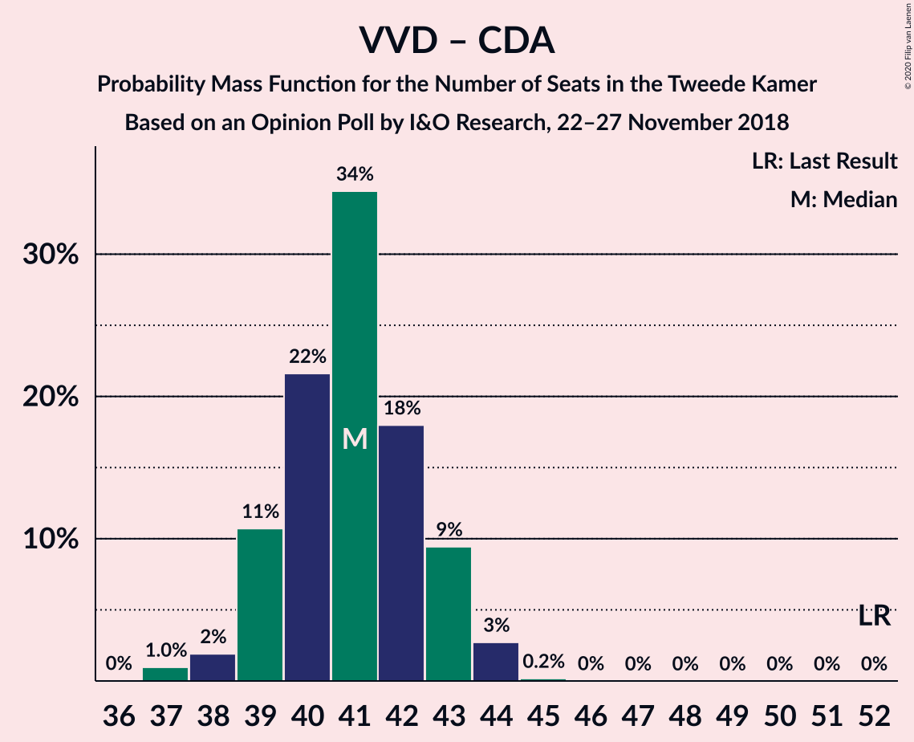

| Number of Seats | Probability | Accumulated | Special Marks |
|:---------------:|:-----------:|:-----------:|:-------------:|
| 37 | 0.1% | 100% |  |
| 38 | 2% | 99.8% |  |
| 39 | 5% | 98% |  |
| 40 | 48% | 92% |  |
| 41 | 29% | 44% | Median |
| 42 | 14% | 16% |  |
| 43 | 0.8% | 1.4% |  |
| 44 | 0.1% | 0.6% |  |
| 45 | 0.5% | 0.5% |  |
| 46 | 0% | 0% |  |
| 47 | 0% | 0% |  |
| 48 | 0% | 0% |  |
| 49 | 0% | 0% |  |
| 50 | 0% | 0% |  |
| 51 | 0% | 0% |  |
| 52 | 0% | 0% | Last Result |

### Christen-Democratisch Appèl – Democraten 66 – Partij van de Arbeid

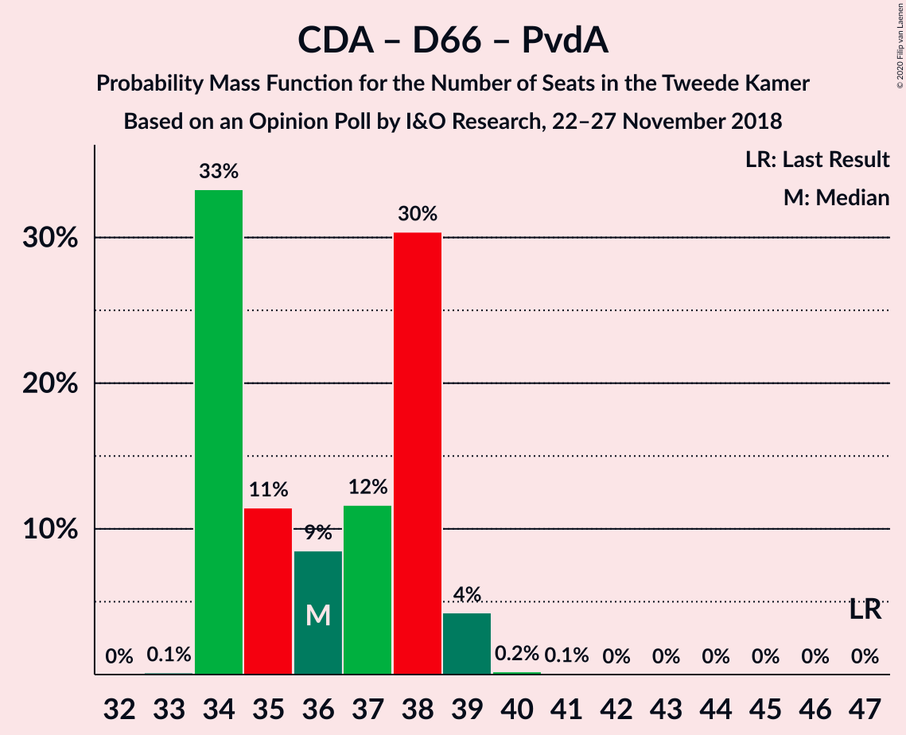

| Number of Seats | Probability | Accumulated | Special Marks |
|:---------------:|:-----------:|:-----------:|:-------------:|
| 33 | 0.1% | 100% |  |
| 34 | 33% | 99.9% |  |
| 35 | 11% | 67% |  |
| 36 | 9% | 55% | Median |
| 37 | 12% | 47% |  |
| 38 | 30% | 35% |  |
| 39 | 4% | 5% |  |
| 40 | 0.2% | 0.3% |  |
| 41 | 0.1% | 0.1% |  |
| 42 | 0% | 0% |  |
| 43 | 0% | 0% |  |
| 44 | 0% | 0% |  |
| 45 | 0% | 0% |  |
| 46 | 0% | 0% |  |
| 47 | 0% | 0% | Last Result |

### Volkspartij voor Vrijheid en Democratie – Partij van de Arbeid

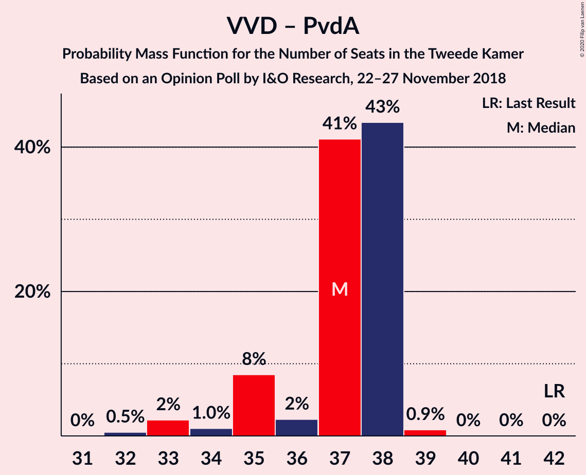

| Number of Seats | Probability | Accumulated | Special Marks |
|:---------------:|:-----------:|:-----------:|:-------------:|
| 32 | 0.5% | 100% |  |
| 33 | 2% | 99.5% |  |
| 34 | 1.0% | 97% |  |
| 35 | 8% | 96% |  |
| 36 | 2% | 88% |  |
| 37 | 41% | 85% | Median |
| 38 | 43% | 44% |  |
| 39 | 0.9% | 0.9% |  |
| 40 | 0% | 0% |  |
| 41 | 0% | 0% |  |
| 42 | 0% | 0% | Last Result |

### Christen-Democratisch Appèl – Partij van de Arbeid – ChristenUnie

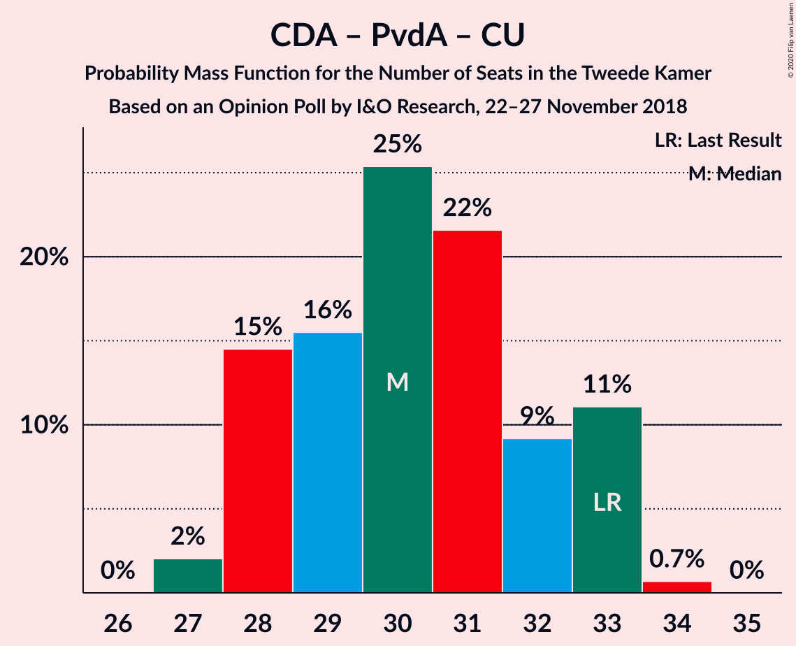

| Number of Seats | Probability | Accumulated | Special Marks |
|:---------------:|:-----------:|:-----------:|:-------------:|
| 27 | 0.3% | 100% |  |
| 28 | 36% | 99.7% |  |
| 29 | 7% | 64% |  |
| 30 | 43% | 57% | Median |
| 31 | 11% | 14% |  |
| 32 | 1.2% | 3% |  |
| 33 | 1.0% | 1.4% | Last Result |
| 34 | 0.4% | 0.4% |  |
| 35 | 0% | 0% |  |

### Christen-Democratisch Appèl – Democraten 66

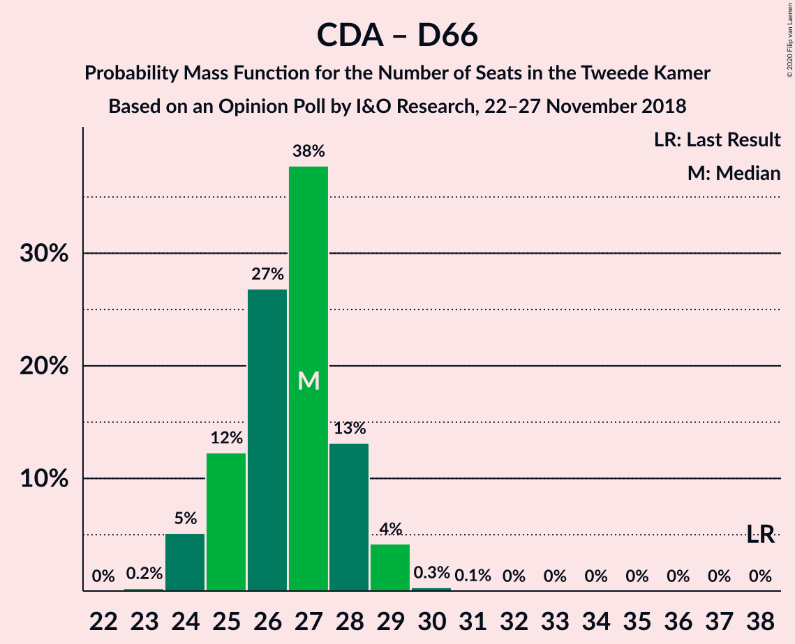

| Number of Seats | Probability | Accumulated | Special Marks |
|:---------------:|:-----------:|:-----------:|:-------------:|
| 24 | 33% | 100% |  |
| 25 | 15% | 67% |  |
| 26 | 8% | 52% | Median |
| 27 | 6% | 44% |  |
| 28 | 31% | 38% |  |
| 29 | 7% | 7% |  |
| 30 | 0.3% | 0.3% |  |
| 31 | 0% | 0% |  |
| 32 | 0% | 0% |  |
| 33 | 0% | 0% |  |
| 34 | 0% | 0% |  |
| 35 | 0% | 0% |  |
| 36 | 0% | 0% |  |
| 37 | 0% | 0% |  |
| 38 | 0% | 0% | Last Result |

### Christen-Democratisch Appèl – Partij van de Arbeid

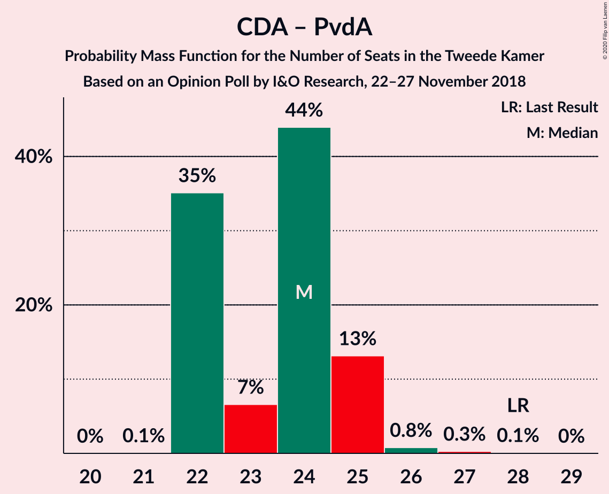

| Number of Seats | Probability | Accumulated | Special Marks |
|:---------------:|:-----------:|:-----------:|:-------------:|
| 21 | 0.1% | 100% |  |
| 22 | 35% | 99.9% |  |
| 23 | 7% | 65% |  |
| 24 | 44% | 58% | Median |
| 25 | 13% | 14% |  |
| 26 | 0.8% | 1.2% |  |
| 27 | 0.3% | 0.4% |  |
| 28 | 0.1% | 0.1% | Last Result |
| 29 | 0% | 0% |  |

## Technical Information

### Opinion Poll

+ **Polling firm:** I&O Research
+ **Commissioner(s):** —
+ **Fieldwork period:** 22–27 November 2018

### Calculations

+ **Sample size:** 3145
+ **Simulations done:** 131,072
+ **Error estimate:** 1.71%

