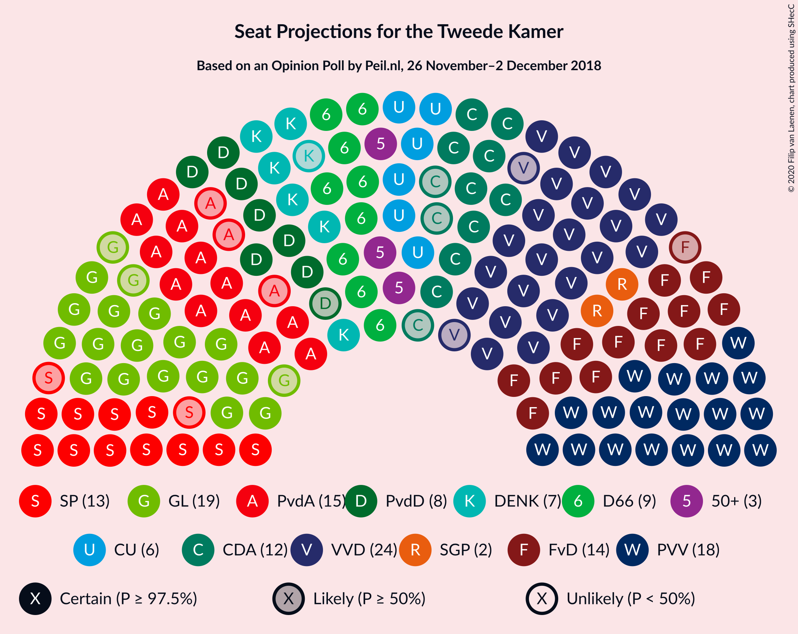
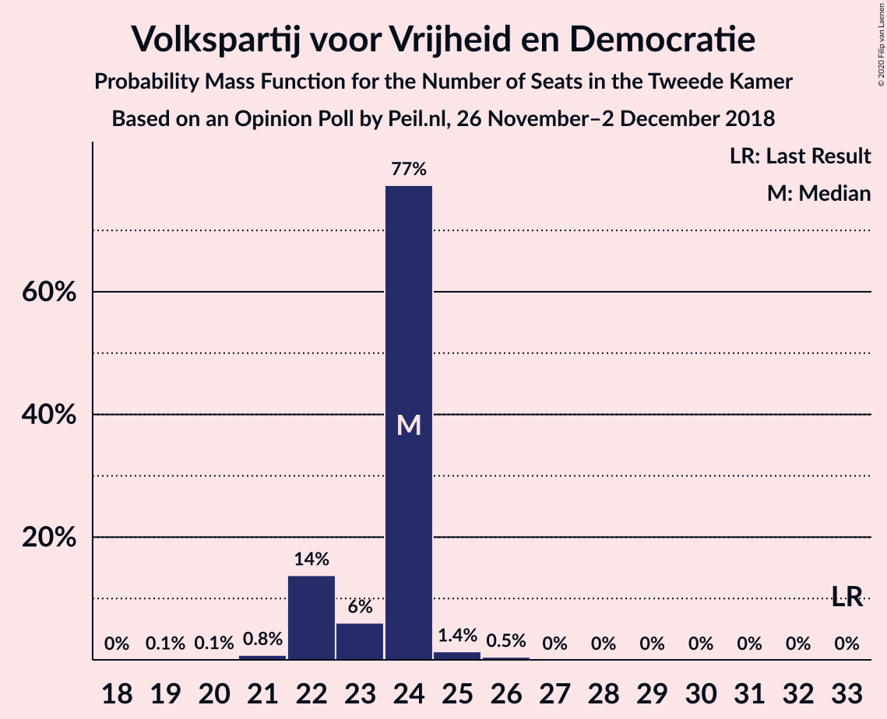
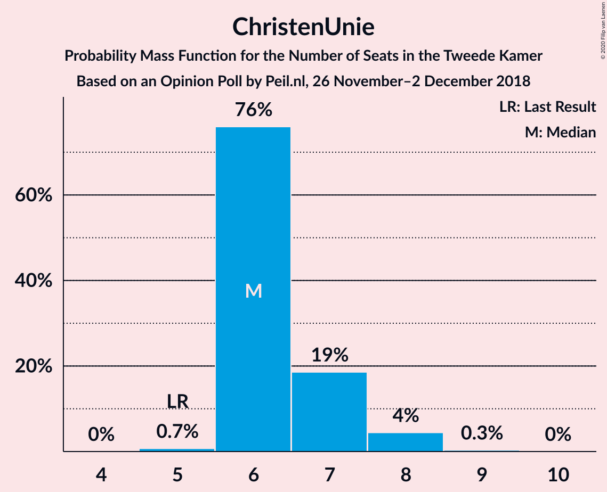
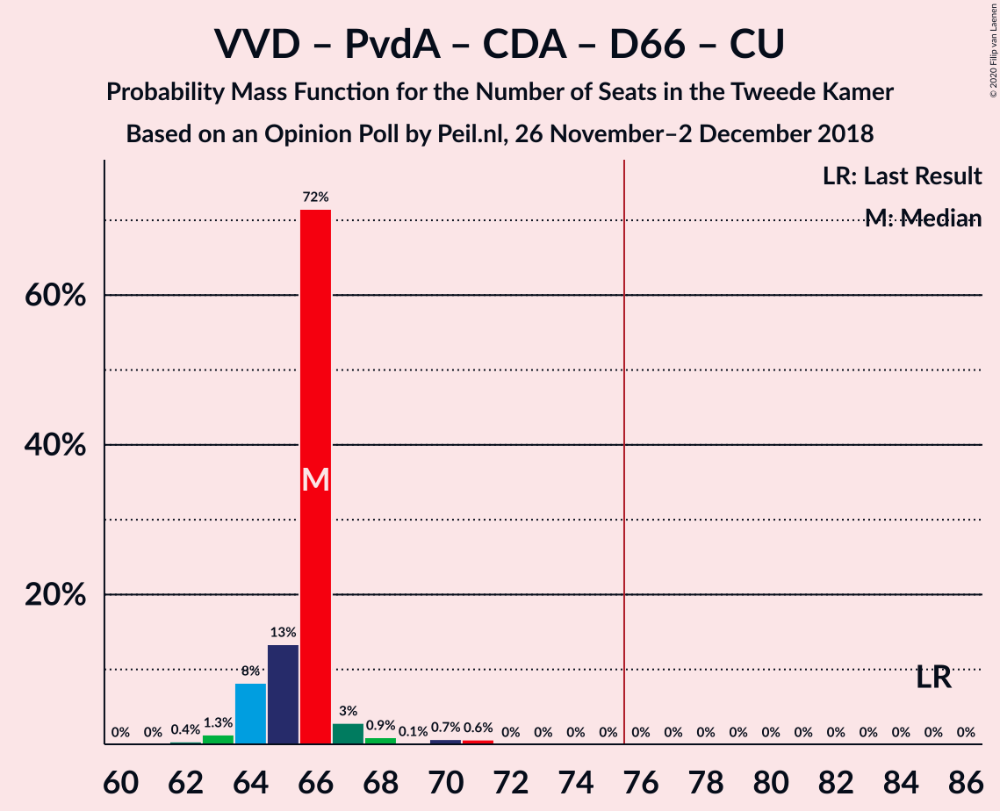
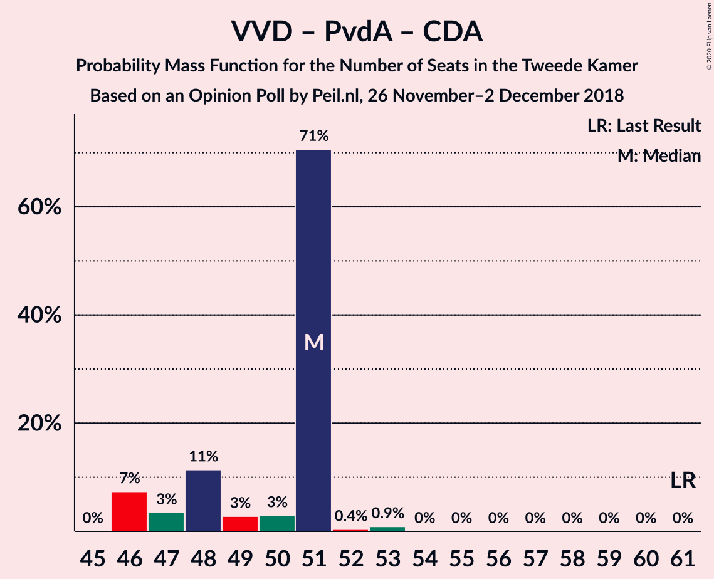
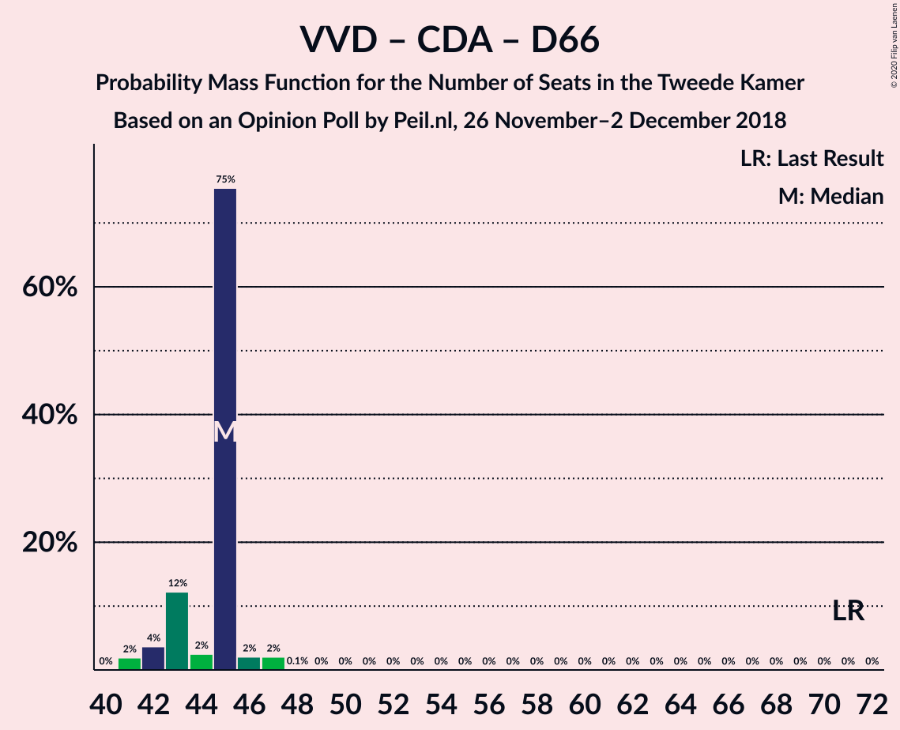
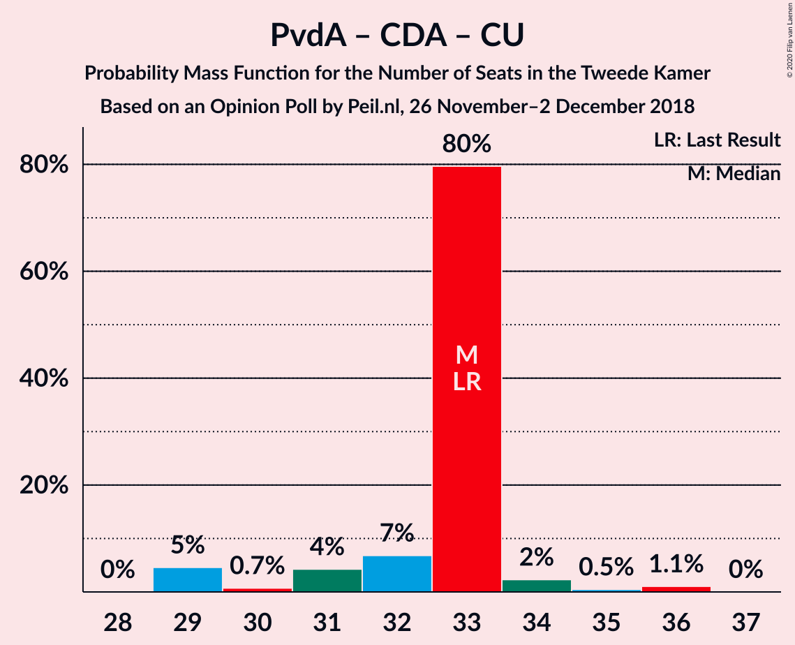

# Opinion Poll by Peil.nl, 26 November–2 December 2018

<a href="#voting-intentions">Voting Intentions</a> | <a href="#seats">Seats</a> | <a href="#coalitions">Coalitions</a> | <a href="#technical-information">Technical Information</a>

## Voting Intentions

### Confidence Intervals

| Party | Last Result | Poll Result | 80% Confidence Interval | 90% Confidence Interval | 95% Confidence Interval | 99% Confidence Interval |
|:-----:|:-----------:|:-----------:|:-----------------------:|:-----------------------:|:-----------------------:|:-----------------------:|
| Volkspartij voor Vrijheid en Democratie | 21.3% | 15.3% | 14.5–16.2% |14.3–16.5% |14.1–16.7% |13.7–17.1% |
| Partij voor de Vrijheid | 13.1% | 12.7% | 11.9–13.5% |11.7–13.7% |11.5–13.9% |11.2–14.3% |
| GroenLinks | 9.1% | 11.3% | 10.6–12.1% |10.4–12.3% |10.2–12.5% |9.9–12.9% |
| Partij van de Arbeid | 5.7% | 10.0% | 9.3–10.7% |9.1–10.9% |9.0–11.1% |8.7–11.5% |
| Forum voor Democratie | 1.8% | 9.3% | 8.7–10.1% |8.5–10.3% |8.3–10.4% |8.0–10.8% |
| Socialistische Partij | 9.1% | 8.0% | 7.4–8.7% |7.2–8.9% |7.1–9.0% |6.8–9.4% |
| Christen-Democratisch Appèl | 12.4% | 7.3% | 6.8–8.0% |6.6–8.2% |6.4–8.3% |6.2–8.6% |
| Democraten 66 | 12.2% | 6.7% | 6.1–7.3% |6.0–7.5% |5.8–7.6% |5.6–7.9% |
| Partij voor de Dieren | 3.2% | 5.3% | 4.8–5.9% |4.7–6.1% |4.6–6.2% |4.4–6.5% |
| ChristenUnie | 3.4% | 4.7% | 4.2–5.2% |4.1–5.3% |4.0–5.5% |3.7–5.8% |
| DENK | 2.1% | 4.7% | 4.2–5.2% |4.1–5.3% |4.0–5.5% |3.7–5.8% |
| 50Plus | 3.1% | 2.7% | 2.3–3.1% |2.2–3.2% |2.1–3.3% |2.0–3.5% |
| Staatkundig Gereformeerde Partij | 2.1% | 2.0% | 1.7–2.4% |1.6–2.5% |1.6–2.6% |1.4–2.8% |

*Note:* The poll result column reflects the actual value used in the calculations. Published results may vary slightly, and in addition be rounded to fewer digits.

## Seats

### Confidence Intervals

| Party | Last Result | Median | 80% Confidence Interval | 90% Confidence Interval | 95% Confidence Interval | 99% Confidence Interval |
|:-----:|:-----------:|:------:|:-----------------------:|:-----------------------:|:-----------------------:|:-----------------------:|
| <a href="#volkspartij-voor-vrijheid-en-democratie">Volkspartij voor Vrijheid en Democratie</a> | 33 | 22 | 22–25 |21–25 |21–25 |19–25 |
| <a href="#partij-voor-de-vrijheid">Partij voor de Vrijheid</a> | 20 | 17 | 17–19 |17–21 |17–22 |17–22 |
| <a href="#groenlinks">GroenLinks</a> | 14 | 19 | 15–19 |15–19 |15–19 |15–20 |
| <a href="#partij-van-de-arbeid">Partij van de Arbeid</a> | 9 | 17 | 15–17 |15–17 |15–17 |14–17 |
| <a href="#forum-voor-democratie">Forum voor Democratie</a> | 2 | 14 | 13–14 |13–15 |13–16 |13–16 |
| <a href="#socialistische-partij">Socialistische Partij</a> | 14 | 13 | 13 |11–13 |11–13 |10–14 |
| <a href="#christen-democratisch-appèl">Christen-Democratisch Appèl</a> | 19 | 10 | 10–11 |10–12 |10–12 |9–14 |
| <a href="#democraten-66">Democraten 66</a> | 19 | 9 | 9–11 |9–11 |9–11 |9–11 |
| <a href="#partij-voor-de-dieren">Partij voor de Dieren</a> | 5 | 9 | 7–9 |7–9 |7–9 |7–9 |
| <a href="#christenunie">ChristenUnie</a> | 5 | 7 | 7–8 |6–8 |6–8 |6–9 |
| <a href="#denk">DENK</a> | 3 | 7 | 7–10 |7–10 |6–10 |6–10 |
| <a href="#50plus">50Plus</a> | 4 | 4 | 3–4 |3–4 |3–4 |3–4 |
| <a href="#staatkundig-gereformeerde-partij">Staatkundig Gereformeerde Partij</a> | 3 | 2 | 2–3 |2–3 |2–3 |2–4 |

### Volkspartij voor Vrijheid en Democratie

*For a full overview of the results for this party, see the [Volkspartij voor Vrijheid en Democratie](party-volkspartijvoorvrijheidendemocratie.html) page.*

| Number of Seats | Probability | Accumulated | Special Marks |
|:---------------:|:-----------:|:-----------:|:-------------:|
| 19 | 2% | 100% |  |
| 20 | 0.3% | 98% |  |
| 21 | 3% | 98% |  |
| 22 | 72% | 95% | Median |
| 23 | 5% | 23% |  |
| 24 | 0.1% | 17% |  |
| 25 | 17% | 17% |  |
| 26 | 0% | 0% |  |
| 27 | 0% | 0% |  |
| 28 | 0% | 0% |  |
| 29 | 0% | 0% |  |
| 30 | 0% | 0% |  |
| 31 | 0% | 0% |  |
| 32 | 0% | 0% |  |
| 33 | 0% | 0% | Last Result |

### Partij voor de Vrijheid

*For a full overview of the results for this party, see the [Partij voor de Vrijheid](party-partijvoordevrijheid.html) page.*

| Number of Seats | Probability | Accumulated | Special Marks |
|:---------------:|:-----------:|:-----------:|:-------------:|
| 16 | 0.1% | 100% |  |
| 17 | 51% | 99.9% | Median |
| 18 | 38% | 49% |  |
| 19 | 5% | 11% |  |
| 20 | 0.4% | 6% | Last Result |
| 21 | 2% | 6% |  |
| 22 | 4% | 4% |  |
| 23 | 0% | 0% |  |

### GroenLinks

*For a full overview of the results for this party, see the [GroenLinks](party-groenlinks.html) page.*

| Number of Seats | Probability | Accumulated | Special Marks |
|:---------------:|:-----------:|:-----------:|:-------------:|
| 14 | 0% | 100% | Last Result |
| 15 | 21% | 100% |  |
| 16 | 2% | 79% |  |
| 17 | 22% | 77% |  |
| 18 | 3% | 55% |  |
| 19 | 52% | 52% | Median |
| 20 | 0.6% | 0.7% |  |
| 21 | 0.1% | 0.1% |  |
| 22 | 0% | 0% |  |

### Partij van de Arbeid

*For a full overview of the results for this party, see the [Partij van de Arbeid](party-partijvandearbeid.html) page.*

| Number of Seats | Probability | Accumulated | Special Marks |
|:---------------:|:-----------:|:-----------:|:-------------:|
| 9 | 0% | 100% | Last Result |
| 10 | 0% | 100% |  |
| 11 | 0% | 100% |  |
| 12 | 0% | 100% |  |
| 13 | 0.4% | 100% |  |
| 14 | 2% | 99.6% |  |
| 15 | 40% | 98% |  |
| 16 | 7% | 58% |  |
| 17 | 51% | 51% | Median |
| 18 | 0% | 0% |  |

### Forum voor Democratie

*For a full overview of the results for this party, see the [Forum voor Democratie](party-forumvoordemocratie.html) page.*

| Number of Seats | Probability | Accumulated | Special Marks |
|:---------------:|:-----------:|:-----------:|:-------------:|
| 2 | 0% | 100% | Last Result |
| 3 | 0% | 100% |  |
| 4 | 0% | 100% |  |
| 5 | 0% | 100% |  |
| 6 | 0% | 100% |  |
| 7 | 0% | 100% |  |
| 8 | 0% | 100% |  |
| 9 | 0% | 100% |  |
| 10 | 0% | 100% |  |
| 11 | 0% | 100% |  |
| 12 | 0.5% | 100% |  |
| 13 | 18% | 99.5% |  |
| 14 | 73% | 82% | Median |
| 15 | 6% | 9% |  |
| 16 | 2% | 3% |  |
| 17 | 0.4% | 0.4% |  |
| 18 | 0% | 0% |  |

### Socialistische Partij

*For a full overview of the results for this party, see the [Socialistische Partij](party-socialistischepartij.html) page.*

| Number of Seats | Probability | Accumulated | Special Marks |
|:---------------:|:-----------:|:-----------:|:-------------:|
| 10 | 2% | 100% |  |
| 11 | 5% | 98% |  |
| 12 | 3% | 93% |  |
| 13 | 89% | 90% | Median |
| 14 | 1.3% | 1.3% | Last Result |
| 15 | 0% | 0% |  |

### Christen-Democratisch Appèl

*For a full overview of the results for this party, see the [Christen-Democratisch Appèl](party-christen-democratischappèl.html) page.*

| Number of Seats | Probability | Accumulated | Special Marks |
|:---------------:|:-----------:|:-----------:|:-------------:|
| 9 | 0.8% | 100% |  |
| 10 | 71% | 99.2% | Median |
| 11 | 19% | 28% |  |
| 12 | 8% | 10% |  |
| 13 | 0% | 1.3% |  |
| 14 | 1.3% | 1.3% |  |
| 15 | 0% | 0% |  |
| 16 | 0% | 0% |  |
| 17 | 0% | 0% |  |
| 18 | 0% | 0% |  |
| 19 | 0% | 0% | Last Result |

### Democraten 66

*For a full overview of the results for this party, see the [Democraten 66](party-democraten66.html) page.*

| Number of Seats | Probability | Accumulated | Special Marks |
|:---------------:|:-----------:|:-----------:|:-------------:|
| 8 | 0.4% | 100% |  |
| 9 | 76% | 99.6% | Median |
| 10 | 5% | 23% |  |
| 11 | 19% | 19% |  |
| 12 | 0.1% | 0.1% |  |
| 13 | 0% | 0% |  |
| 14 | 0% | 0% |  |
| 15 | 0% | 0% |  |
| 16 | 0% | 0% |  |
| 17 | 0% | 0% |  |
| 18 | 0% | 0% |  |
| 19 | 0% | 0% | Last Result |

### Partij voor de Dieren

*For a full overview of the results for this party, see the [Partij voor de Dieren](party-partijvoordedieren.html) page.*

| Number of Seats | Probability | Accumulated | Special Marks |
|:---------------:|:-----------:|:-----------:|:-------------:|
| 5 | 0% | 100% | Last Result |
| 6 | 0% | 100% |  |
| 7 | 22% | 100% |  |
| 8 | 26% | 78% |  |
| 9 | 51% | 51% | Median |
| 10 | 0% | 0% |  |

### ChristenUnie

*For a full overview of the results for this party, see the [ChristenUnie](party-christenunie.html) page.*

| Number of Seats | Probability | Accumulated | Special Marks |
|:---------------:|:-----------:|:-----------:|:-------------:|
| 5 | 0% | 100% | Last Result |
| 6 | 6% | 100% |  |
| 7 | 54% | 94% | Median |
| 8 | 39% | 40% |  |
| 9 | 1.5% | 1.5% |  |
| 10 | 0% | 0% |  |

### DENK

*For a full overview of the results for this party, see the [DENK](party-denk.html) page.*

| Number of Seats | Probability | Accumulated | Special Marks |
|:---------------:|:-----------:|:-----------:|:-------------:|
| 3 | 0% | 100% | Last Result |
| 4 | 0% | 100% |  |
| 5 | 0.1% | 100% |  |
| 6 | 3% | 99.9% |  |
| 7 | 68% | 97% | Median |
| 8 | 8% | 28% |  |
| 9 | 0.3% | 20% |  |
| 10 | 20% | 20% |  |
| 11 | 0% | 0% |  |

### 50Plus

*For a full overview of the results for this party, see the [50Plus](party-50plus.html) page.*

| Number of Seats | Probability | Accumulated | Special Marks |
|:---------------:|:-----------:|:-----------:|:-------------:|
| 2 | 0.3% | 100% |  |
| 3 | 25% | 99.7% |  |
| 4 | 75% | 75% | Last Result, Median |
| 5 | 0.1% | 0.1% |  |
| 6 | 0% | 0% |  |

### Staatkundig Gereformeerde Partij

*For a full overview of the results for this party, see the [Staatkundig Gereformeerde Partij](party-staatkundiggereformeerdepartij.html) page.*

| Number of Seats | Probability | Accumulated | Special Marks |
|:---------------:|:-----------:|:-----------:|:-------------:|
| 1 | 0.1% | 100% |  |
| 2 | 56% | 99.9% | Median |
| 3 | 43% | 44% | Last Result |
| 4 | 0.8% | 0.8% |  |
| 5 | 0% | 0% |  |

## Coalitions

### Confidence Intervals

| Coalition | Last Result | Median | Majority? | 80% Confidence Interval | 90% Confidence Interval | 95% Confidence Interval | 99% Confidence Interval |
|:---------:|:-----------:|:------:|:---------:|:-----------------------:|:-----------------------:|:-----------------------:|:-----------------------:|
| GroenLinks – Partij van de Arbeid – Socialistische Partij – Christen-Democratisch Appèl – Democraten 66 – ChristenUnie | 80 | 75 | 0.1% | 72–75 | 70–75 | 69–75 | 69–75 |
| Volkspartij voor Vrijheid en Democratie – Partij voor de Vrijheid – Forum voor Democratie – Christen-Democratisch Appèl – Staatkundig Gereformeerde Partij | 77 | 65 | 0% | 65–70 | 65–74 | 65–74 | 65–75 |
| Volkspartij voor Vrijheid en Democratie – Partij voor de Vrijheid – Forum voor Democratie – Christen-Democratisch Appèl | 74 | 63 | 0% | 63–67 | 63–72 | 63–72 | 63–73 |
| Volkspartij voor Vrijheid en Democratie – GroenLinks – Christen-Democratisch Appèl – Democraten 66 – ChristenUnie | 90 | 67 | 0% | 66–70 | 65–70 | 65–70 | 65–70 |
| Volkspartij voor Vrijheid en Democratie – Partij van de Arbeid – Christen-Democratisch Appèl – Democraten 66 – ChristenUnie | 85 | 65 | 0% | 64–70 | 64–70 | 64–70 | 63–70 |
| GroenLinks – Partij van de Arbeid – Christen-Democratisch Appèl – Democraten 66 – ChristenUnie | 66 | 62 | 0% | 59–62 | 59–62 | 58–63 | 58–64 |
| Volkspartij voor Vrijheid en Democratie – Partij voor de Vrijheid – Christen-Democratisch Appèl | 72 | 49 | 0% | 49–54 | 49–57 | 49–57 | 49–58 |
| Volkspartij voor Vrijheid en Democratie – Forum voor Democratie – Christen-Democratisch Appèl – 50Plus – Staatkundig Gereformeerde Partij | 61 | 52 | 0% | 52–55 | 52–55 | 52–55 | 51–57 |
| Volkspartij voor Vrijheid en Democratie – Christen-Democratisch Appèl – Democraten 66 – ChristenUnie | 76 | 48 | 0% | 48–55 | 48–55 | 48–55 | 48–55 |
| Volkspartij voor Vrijheid en Democratie – Forum voor Democratie – Christen-Democratisch Appèl – 50Plus | 58 | 50 | 0% | 50–52 | 50–53 | 50–53 | 48–55 |
| Volkspartij voor Vrijheid en Democratie – Forum voor Democratie – Christen-Democratisch Appèl – Staatkundig Gereformeerde Partij | 57 | 48 | 0% | 48–52 | 48–52 | 48–52 | 47–54 |
| Volkspartij voor Vrijheid en Democratie – Partij van de Arbeid – Christen-Democratisch Appèl | 61 | 49 | 0% | 47–51 | 47–51 | 47–51 | 45–51 |
| Volkspartij voor Vrijheid en Democratie – Partij van de Arbeid – Democraten 66 | 61 | 48 | 0% | 46–51 | 46–51 | 45–51 | 45–51 |
| Volkspartij voor Vrijheid en Democratie – Forum voor Democratie – Christen-Democratisch Appèl | 54 | 46 | 0% | 46–49 | 46–50 | 46–50 | 44–52 |
| Volkspartij voor Vrijheid en Democratie – Christen-Democratisch Appèl – Democraten 66 | 71 | 41 | 0% | 41–47 | 41–47 | 41–47 | 41–47 |
| Volkspartij voor Vrijheid en Democratie – Partij van de Arbeid | 42 | 39 | 0% | 37–40 | 36–40 | 35–40 | 35–40 |
| Partij van de Arbeid – Christen-Democratisch Appèl – Democraten 66 | 47 | 36 | 0% | 34–37 | 34–37 | 34–38 | 34–38 |
| Volkspartij voor Vrijheid en Democratie – Christen-Democratisch Appèl | 52 | 32 | 0% | 32–36 | 32–36 | 31–36 | 30–37 |
| Partij van de Arbeid – Christen-Democratisch Appèl – ChristenUnie | 33 | 34 | 0% | 33–34 | 33–34 | 33–35 | 31–36 |
| Partij van de Arbeid – Christen-Democratisch Appèl | 28 | 27 | 0% | 25–27 | 25–28 | 25–28 | 24–28 |
| Christen-Democratisch Appèl – Democraten 66 | 38 | 19 | 0% | 19–22 | 19–22 | 19–22 | 19–24 |

### GroenLinks – Partij van de Arbeid – Socialistische Partij – Christen-Democratisch Appèl – Democraten 66 – ChristenUnie

| Number of Seats | Probability | Accumulated | Special Marks |
|:---------------:|:-----------:|:-----------:|:-------------:|
| 69 | 4% | 100% |  |
| 70 | 1.3% | 96% |  |
| 71 | 0.5% | 95% |  |
| 72 | 20% | 94% |  |
| 73 | 19% | 74% |  |
| 74 | 1.3% | 56% |  |
| 75 | 54% | 54% | Median |
| 76 | 0% | 0.1% | Majority |
| 77 | 0.1% | 0.1% |  |
| 78 | 0% | 0% |  |
| 79 | 0% | 0% |  |
| 80 | 0% | 0% | Last Result |

### Volkspartij voor Vrijheid en Democratie – Partij voor de Vrijheid – Forum voor Democratie – Christen-Democratisch Appèl – Staatkundig Gereformeerde Partij

| Number of Seats | Probability | Accumulated | Special Marks |
|:---------------:|:-----------:|:-----------:|:-------------:|
| 65 | 50% | 100% | Median |
| 66 | 0.8% | 50% |  |
| 67 | 20% | 49% |  |
| 68 | 0% | 28% |  |
| 69 | 5% | 28% |  |
| 70 | 18% | 24% |  |
| 71 | 0.4% | 6% |  |
| 72 | 0% | 5% |  |
| 73 | 0% | 5% |  |
| 74 | 4% | 5% |  |
| 75 | 1.3% | 1.3% |  |
| 76 | 0% | 0% | Majority |
| 77 | 0% | 0% | Last Result |

### Volkspartij voor Vrijheid en Democratie – Partij voor de Vrijheid – Forum voor Democratie – Christen-Democratisch Appèl

| Number of Seats | Probability | Accumulated | Special Marks |
|:---------------:|:-----------:|:-----------:|:-------------:|
| 61 | 0.1% | 100% |  |
| 62 | 0% | 99.9% |  |
| 63 | 51% | 99.9% | Median |
| 64 | 20% | 49% |  |
| 65 | 0.9% | 29% |  |
| 66 | 4% | 28% |  |
| 67 | 18% | 24% |  |
| 68 | 0.8% | 6% |  |
| 69 | 0.1% | 5% |  |
| 70 | 0% | 5% |  |
| 71 | 0% | 5% |  |
| 72 | 4% | 5% |  |
| 73 | 1.3% | 1.3% |  |
| 74 | 0% | 0% | Last Result |

### Volkspartij voor Vrijheid en Democratie – GroenLinks – Christen-Democratisch Appèl – Democraten 66 – ChristenUnie

| Number of Seats | Probability | Accumulated | Special Marks |
|:---------------:|:-----------:|:-----------:|:-------------:|
| 64 | 0.1% | 100% |  |
| 65 | 5% | 99.9% |  |
| 66 | 23% | 95% |  |
| 67 | 51% | 72% | Median |
| 68 | 0.1% | 21% |  |
| 69 | 2% | 21% |  |
| 70 | 19% | 19% |  |
| 71 | 0.1% | 0.1% |  |
| 72 | 0% | 0% |  |
| 73 | 0% | 0% |  |
| 74 | 0% | 0% |  |
| 75 | 0% | 0% |  |
| 76 | 0% | 0% | Majority |
| 77 | 0% | 0% |  |
| 78 | 0% | 0% |  |
| 79 | 0% | 0% |  |
| 80 | 0% | 0% |  |
| 81 | 0% | 0% |  |
| 82 | 0% | 0% |  |
| 83 | 0% | 0% |  |
| 84 | 0% | 0% |  |
| 85 | 0% | 0% |  |
| 86 | 0% | 0% |  |
| 87 | 0% | 0% |  |
| 88 | 0% | 0% |  |
| 89 | 0% | 0% |  |
| 90 | 0% | 0% | Last Result |

### Volkspartij voor Vrijheid en Democratie – Partij van de Arbeid – Christen-Democratisch Appèl – Democraten 66 – ChristenUnie

| Number of Seats | Probability | Accumulated | Special Marks |
|:---------------:|:-----------:|:-----------:|:-------------:|
| 61 | 0.3% | 100% |  |
| 62 | 0% | 99.7% |  |
| 63 | 1.1% | 99.6% |  |
| 64 | 22% | 98.5% |  |
| 65 | 50% | 76% | Median |
| 66 | 7% | 26% |  |
| 67 | 2% | 19% |  |
| 68 | 0.1% | 17% |  |
| 69 | 0% | 17% |  |
| 70 | 17% | 17% |  |
| 71 | 0% | 0% |  |
| 72 | 0% | 0% |  |
| 73 | 0% | 0% |  |
| 74 | 0% | 0% |  |
| 75 | 0% | 0% |  |
| 76 | 0% | 0% | Majority |
| 77 | 0% | 0% |  |
| 78 | 0% | 0% |  |
| 79 | 0% | 0% |  |
| 80 | 0% | 0% |  |
| 81 | 0% | 0% |  |
| 82 | 0% | 0% |  |
| 83 | 0% | 0% |  |
| 84 | 0% | 0% |  |
| 85 | 0% | 0% | Last Result |

### GroenLinks – Partij van de Arbeid – Christen-Democratisch Appèl – Democraten 66 – ChristenUnie

| Number of Seats | Probability | Accumulated | Special Marks |
|:---------------:|:-----------:|:-----------:|:-------------:|
| 57 | 0.1% | 100% |  |
| 58 | 4% | 99.9% |  |
| 59 | 21% | 96% |  |
| 60 | 19% | 75% |  |
| 61 | 1.4% | 56% |  |
| 62 | 51% | 55% | Median |
| 63 | 2% | 4% |  |
| 64 | 2% | 2% |  |
| 65 | 0.1% | 0.1% |  |
| 66 | 0% | 0% | Last Result |

### Volkspartij voor Vrijheid en Democratie – Partij voor de Vrijheid – Christen-Democratisch Appèl

| Number of Seats | Probability | Accumulated | Special Marks |
|:---------------:|:-----------:|:-----------:|:-------------:|
| 48 | 0.1% | 100% |  |
| 49 | 51% | 99.9% | Median |
| 50 | 23% | 49% |  |
| 51 | 0.2% | 26% |  |
| 52 | 2% | 25% |  |
| 53 | 0.8% | 24% |  |
| 54 | 18% | 23% |  |
| 55 | 0% | 5% |  |
| 56 | 0.1% | 5% |  |
| 57 | 4% | 5% |  |
| 58 | 1.3% | 1.3% |  |
| 59 | 0% | 0% |  |
| 60 | 0% | 0% |  |
| 61 | 0% | 0% |  |
| 62 | 0% | 0% |  |
| 63 | 0% | 0% |  |
| 64 | 0% | 0% |  |
| 65 | 0% | 0% |  |
| 66 | 0% | 0% |  |
| 67 | 0% | 0% |  |
| 68 | 0% | 0% |  |
| 69 | 0% | 0% |  |
| 70 | 0% | 0% |  |
| 71 | 0% | 0% |  |
| 72 | 0% | 0% | Last Result |

### Volkspartij voor Vrijheid en Democratie – Forum voor Democratie – Christen-Democratisch Appèl – 50Plus – Staatkundig Gereformeerde Partij

| Number of Seats | Probability | Accumulated | Special Marks |
|:---------------:|:-----------:|:-----------:|:-------------:|
| 51 | 0.9% | 100% |  |
| 52 | 51% | 99.1% | Median |
| 53 | 22% | 48% |  |
| 54 | 3% | 26% |  |
| 55 | 22% | 23% |  |
| 56 | 0.2% | 1.5% |  |
| 57 | 1.3% | 1.3% |  |
| 58 | 0% | 0% |  |
| 59 | 0% | 0% |  |
| 60 | 0% | 0% |  |
| 61 | 0% | 0% | Last Result |

### Volkspartij voor Vrijheid en Democratie – Christen-Democratisch Appèl – Democraten 66 – ChristenUnie

| Number of Seats | Probability | Accumulated | Special Marks |
|:---------------:|:-----------:|:-----------:|:-------------:|
| 47 | 0% | 100% |  |
| 48 | 54% | 99.9% | Median |
| 49 | 20% | 46% |  |
| 50 | 5% | 26% |  |
| 51 | 2% | 21% |  |
| 52 | 0.5% | 19% |  |
| 53 | 1.4% | 19% |  |
| 54 | 0% | 17% |  |
| 55 | 17% | 17% |  |
| 56 | 0% | 0% |  |
| 57 | 0% | 0% |  |
| 58 | 0% | 0% |  |
| 59 | 0% | 0% |  |
| 60 | 0% | 0% |  |
| 61 | 0% | 0% |  |
| 62 | 0% | 0% |  |
| 63 | 0% | 0% |  |
| 64 | 0% | 0% |  |
| 65 | 0% | 0% |  |
| 66 | 0% | 0% |  |
| 67 | 0% | 0% |  |
| 68 | 0% | 0% |  |
| 69 | 0% | 0% |  |
| 70 | 0% | 0% |  |
| 71 | 0% | 0% |  |
| 72 | 0% | 0% |  |
| 73 | 0% | 0% |  |
| 74 | 0% | 0% |  |
| 75 | 0% | 0% |  |
| 76 | 0% | 0% | Last Result, Majority |

### Volkspartij voor Vrijheid en Democratie – Forum voor Democratie – Christen-Democratisch Appèl – 50Plus

| Number of Seats | Probability | Accumulated | Special Marks |
|:---------------:|:-----------:|:-----------:|:-------------:|
| 48 | 1.1% | 100% |  |
| 49 | 0.5% | 98.9% |  |
| 50 | 72% | 98% | Median |
| 51 | 3% | 26% |  |
| 52 | 18% | 23% |  |
| 53 | 4% | 5% |  |
| 54 | 0.1% | 1.4% |  |
| 55 | 1.3% | 1.3% |  |
| 56 | 0% | 0% |  |
| 57 | 0% | 0% |  |
| 58 | 0% | 0% | Last Result |

### Volkspartij voor Vrijheid en Democratie – Forum voor Democratie – Christen-Democratisch Appèl – Staatkundig Gereformeerde Partij

| Number of Seats | Probability | Accumulated | Special Marks |
|:---------------:|:-----------:|:-----------:|:-------------:|
| 47 | 0.8% | 100% |  |
| 48 | 51% | 99.2% | Median |
| 49 | 20% | 48% |  |
| 50 | 4% | 28% |  |
| 51 | 1.0% | 24% |  |
| 52 | 22% | 23% |  |
| 53 | 0% | 1.3% |  |
| 54 | 1.3% | 1.3% |  |
| 55 | 0% | 0% |  |
| 56 | 0% | 0% |  |
| 57 | 0% | 0% | Last Result |

### Volkspartij voor Vrijheid en Democratie – Partij van de Arbeid – Christen-Democratisch Appèl

| Number of Seats | Probability | Accumulated | Special Marks |
|:---------------:|:-----------:|:-----------:|:-------------:|
| 44 | 0.3% | 100% |  |
| 45 | 0.8% | 99.7% |  |
| 46 | 0% | 98.8% |  |
| 47 | 23% | 98.8% |  |
| 48 | 2% | 76% |  |
| 49 | 51% | 74% | Median |
| 50 | 0.9% | 23% |  |
| 51 | 22% | 22% |  |
| 52 | 0% | 0% |  |
| 53 | 0% | 0% |  |
| 54 | 0% | 0% |  |
| 55 | 0% | 0% |  |
| 56 | 0% | 0% |  |
| 57 | 0% | 0% |  |
| 58 | 0% | 0% |  |
| 59 | 0% | 0% |  |
| 60 | 0% | 0% |  |
| 61 | 0% | 0% | Last Result |

### Volkspartij voor Vrijheid en Democratie – Partij van de Arbeid – Democraten 66

| Number of Seats | Probability | Accumulated | Special Marks |
|:---------------:|:-----------:|:-----------:|:-------------:|
| 43 | 0.4% | 100% |  |
| 44 | 0% | 99.6% |  |
| 45 | 4% | 99.6% |  |
| 46 | 20% | 96% |  |
| 47 | 4% | 76% |  |
| 48 | 55% | 72% | Median |
| 49 | 0.1% | 17% |  |
| 50 | 0.1% | 17% |  |
| 51 | 17% | 17% |  |
| 52 | 0% | 0% |  |
| 53 | 0% | 0% |  |
| 54 | 0% | 0% |  |
| 55 | 0% | 0% |  |
| 56 | 0% | 0% |  |
| 57 | 0% | 0% |  |
| 58 | 0% | 0% |  |
| 59 | 0% | 0% |  |
| 60 | 0% | 0% |  |
| 61 | 0% | 0% | Last Result |

### Volkspartij voor Vrijheid en Democratie – Forum voor Democratie – Christen-Democratisch Appèl

| Number of Seats | Probability | Accumulated | Special Marks |
|:---------------:|:-----------:|:-----------:|:-------------:|
| 44 | 0.8% | 100% |  |
| 45 | 0.5% | 99.2% |  |
| 46 | 71% | 98.7% | Median |
| 47 | 4% | 28% |  |
| 48 | 1.1% | 24% |  |
| 49 | 18% | 23% |  |
| 50 | 4% | 5% |  |
| 51 | 0% | 1.3% |  |
| 52 | 1.3% | 1.3% |  |
| 53 | 0% | 0% |  |
| 54 | 0% | 0% | Last Result |

### Volkspartij voor Vrijheid en Democratie – Christen-Democratisch Appèl – Democraten 66

| Number of Seats | Probability | Accumulated | Special Marks |
|:---------------:|:-----------:|:-----------:|:-------------:|
| 40 | 0.4% | 100% |  |
| 41 | 73% | 99.6% | Median |
| 42 | 2% | 26% |  |
| 43 | 1.2% | 24% |  |
| 44 | 4% | 23% |  |
| 45 | 0.1% | 19% |  |
| 46 | 0% | 19% |  |
| 47 | 19% | 19% |  |
| 48 | 0% | 0% |  |
| 49 | 0% | 0% |  |
| 50 | 0% | 0% |  |
| 51 | 0% | 0% |  |
| 52 | 0% | 0% |  |
| 53 | 0% | 0% |  |
| 54 | 0% | 0% |  |
| 55 | 0% | 0% |  |
| 56 | 0% | 0% |  |
| 57 | 0% | 0% |  |
| 58 | 0% | 0% |  |
| 59 | 0% | 0% |  |
| 60 | 0% | 0% |  |
| 61 | 0% | 0% |  |
| 62 | 0% | 0% |  |
| 63 | 0% | 0% |  |
| 64 | 0% | 0% |  |
| 65 | 0% | 0% |  |
| 66 | 0% | 0% |  |
| 67 | 0% | 0% |  |
| 68 | 0% | 0% |  |
| 69 | 0% | 0% |  |
| 70 | 0% | 0% |  |
| 71 | 0% | 0% | Last Result |

### Volkspartij voor Vrijheid en Democratie – Partij van de Arbeid

| Number of Seats | Probability | Accumulated | Special Marks |
|:---------------:|:-----------:|:-----------:|:-------------:|
| 34 | 0.4% | 100% |  |
| 35 | 2% | 99.6% |  |
| 36 | 3% | 97% |  |
| 37 | 22% | 95% |  |
| 38 | 1.0% | 73% |  |
| 39 | 55% | 72% | Median |
| 40 | 17% | 17% |  |
| 41 | 0% | 0% |  |
| 42 | 0% | 0% | Last Result |

### Partij van de Arbeid – Christen-Democratisch Appèl – Democraten 66

| Number of Seats | Probability | Accumulated | Special Marks |
|:---------------:|:-----------:|:-----------:|:-------------:|
| 32 | 0.3% | 100% |  |
| 33 | 0.1% | 99.6% |  |
| 34 | 20% | 99.5% |  |
| 35 | 0.9% | 80% |  |
| 36 | 52% | 79% | Median |
| 37 | 22% | 26% |  |
| 38 | 4% | 4% |  |
| 39 | 0% | 0% |  |
| 40 | 0% | 0% |  |
| 41 | 0% | 0% |  |
| 42 | 0% | 0% |  |
| 43 | 0% | 0% |  |
| 44 | 0% | 0% |  |
| 45 | 0% | 0% |  |
| 46 | 0% | 0% |  |
| 47 | 0% | 0% | Last Result |

### Volkspartij voor Vrijheid en Democratie – Christen-Democratisch Appèl

| Number of Seats | Probability | Accumulated | Special Marks |
|:---------------:|:-----------:|:-----------:|:-------------:|
| 30 | 0.8% | 100% |  |
| 31 | 3% | 99.2% |  |
| 32 | 71% | 97% | Median |
| 33 | 3% | 26% |  |
| 34 | 0.6% | 23% |  |
| 35 | 4% | 23% |  |
| 36 | 17% | 19% |  |
| 37 | 1.3% | 1.3% |  |
| 38 | 0% | 0% |  |
| 39 | 0% | 0% |  |
| 40 | 0% | 0% |  |
| 41 | 0% | 0% |  |
| 42 | 0% | 0% |  |
| 43 | 0% | 0% |  |
| 44 | 0% | 0% |  |
| 45 | 0% | 0% |  |
| 46 | 0% | 0% |  |
| 47 | 0% | 0% |  |
| 48 | 0% | 0% |  |
| 49 | 0% | 0% |  |
| 50 | 0% | 0% |  |
| 51 | 0% | 0% |  |
| 52 | 0% | 0% | Last Result |

### Partij van de Arbeid – Christen-Democratisch Appèl – ChristenUnie

| Number of Seats | Probability | Accumulated | Special Marks |
|:---------------:|:-----------:|:-----------:|:-------------:|
| 31 | 1.2% | 100% |  |
| 32 | 0.2% | 98.8% |  |
| 33 | 21% | 98.7% | Last Result |
| 34 | 73% | 78% | Median |
| 35 | 3% | 5% |  |
| 36 | 2% | 2% |  |
| 37 | 0% | 0% |  |

### Partij van de Arbeid – Christen-Democratisch Appèl

| Number of Seats | Probability | Accumulated | Special Marks |
|:---------------:|:-----------:|:-----------:|:-------------:|
| 23 | 0.3% | 100% |  |
| 24 | 0.9% | 99.6% |  |
| 25 | 20% | 98.7% |  |
| 26 | 18% | 78% |  |
| 27 | 53% | 61% | Median |
| 28 | 8% | 8% | Last Result |
| 29 | 0% | 0% |  |

### Christen-Democratisch Appèl – Democraten 66

| Number of Seats | Probability | Accumulated | Special Marks |
|:---------------:|:-----------:|:-----------:|:-------------:|
| 18 | 0.1% | 100% |  |
| 19 | 71% | 99.9% | Median |
| 20 | 0.8% | 29% |  |
| 21 | 6% | 28% |  |
| 22 | 21% | 22% |  |
| 23 | 0% | 1.3% |  |
| 24 | 1.3% | 1.3% |  |
| 25 | 0% | 0% |  |
| 26 | 0% | 0% |  |
| 27 | 0% | 0% |  |
| 28 | 0% | 0% |  |
| 29 | 0% | 0% |  |
| 30 | 0% | 0% |  |
| 31 | 0% | 0% |  |
| 32 | 0% | 0% |  |
| 33 | 0% | 0% |  |
| 34 | 0% | 0% |  |
| 35 | 0% | 0% |  |
| 36 | 0% | 0% |  |
| 37 | 0% | 0% |  |
| 38 | 0% | 0% | Last Result |

## Technical Information

### Opinion Poll

+ **Polling firm:** Peil.nl
+ **Commissioner(s):** —
+ **Fieldwork period:** 26 November–2 December 2018

### Calculations

+ **Sample size:** 3000
+ **Simulations done:** 131,072
+ **Error estimate:** 1.52%

