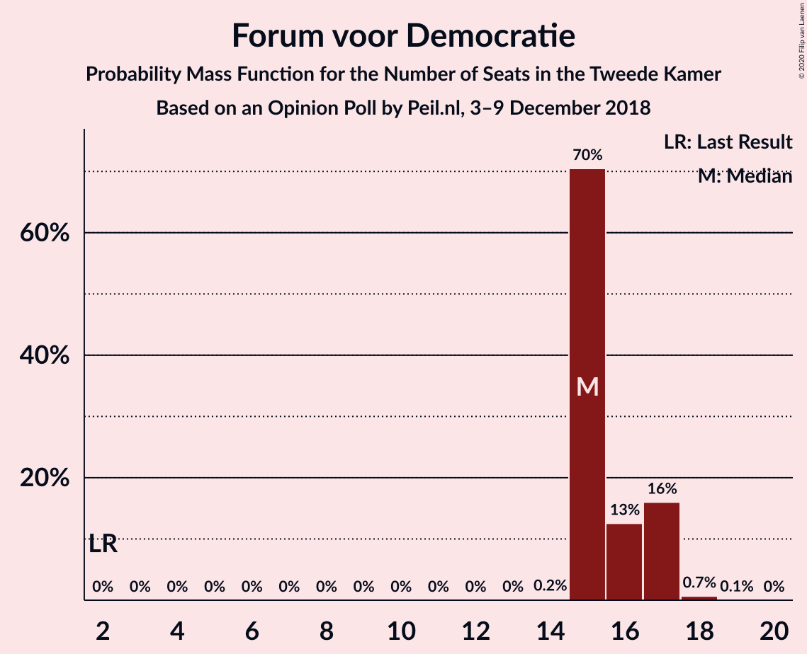
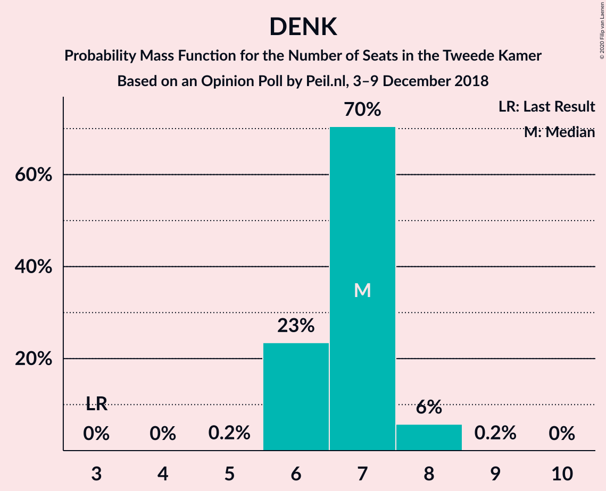
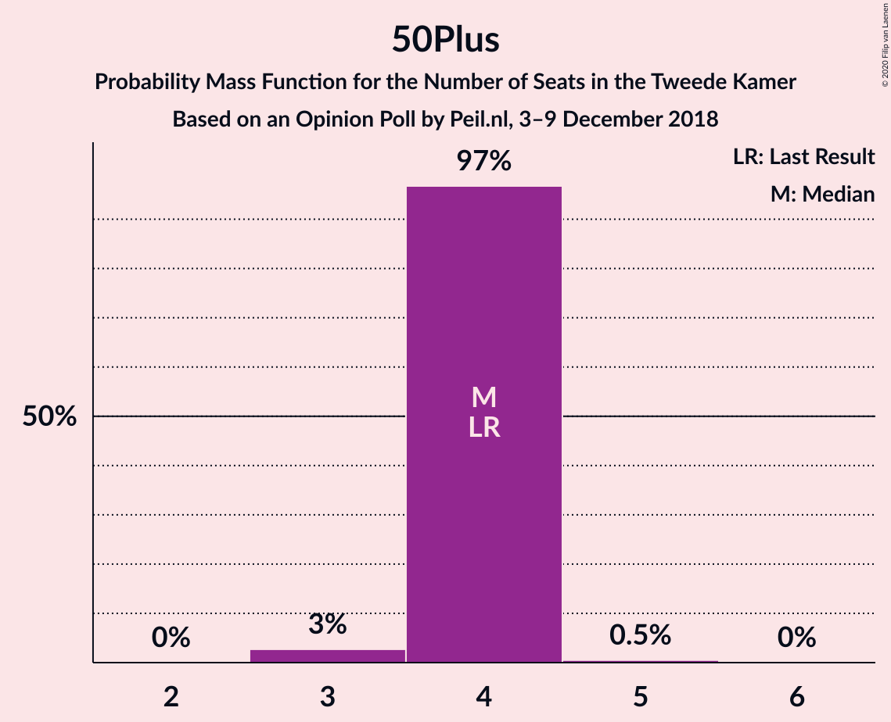
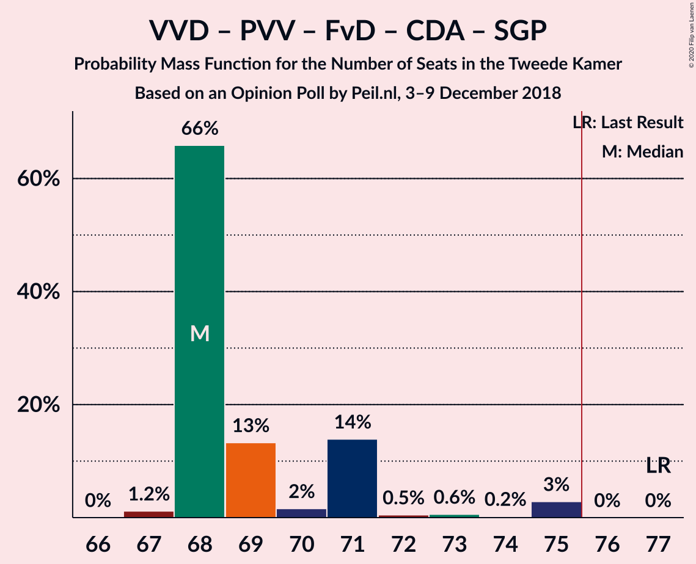
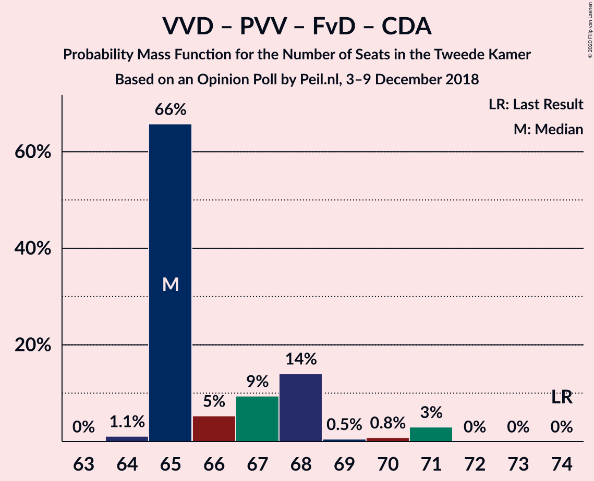
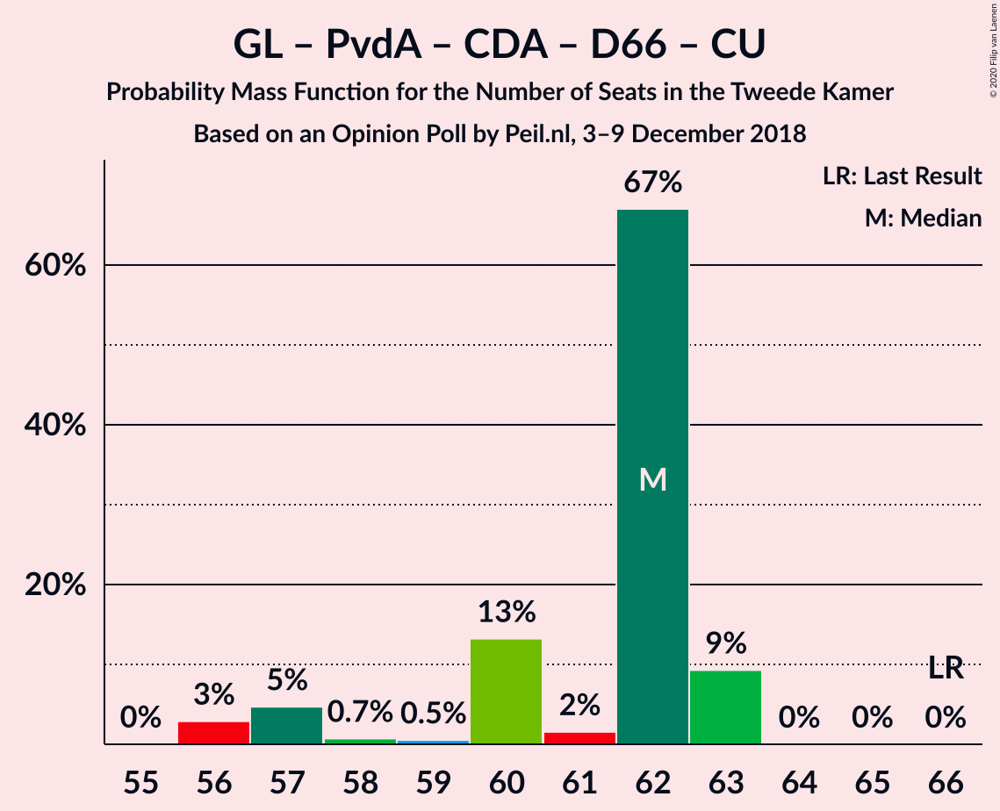
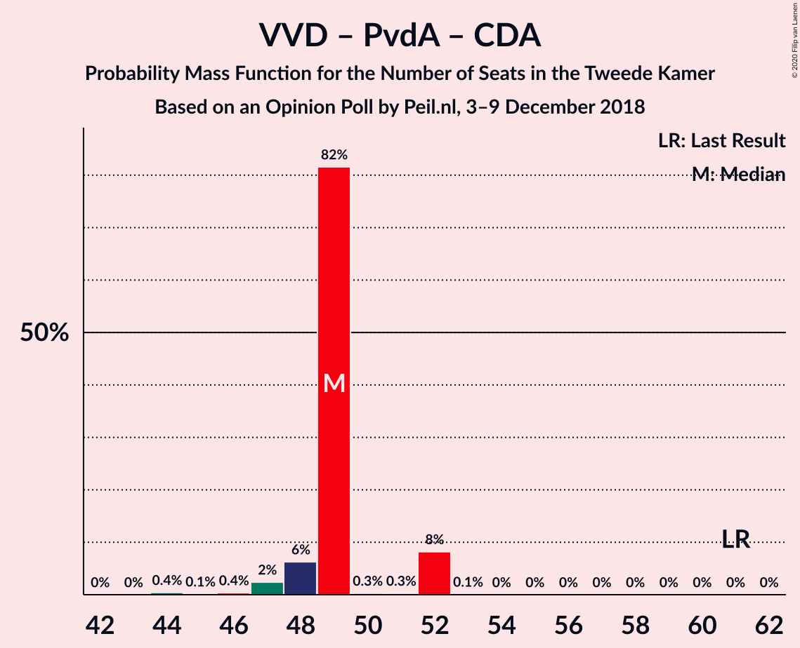
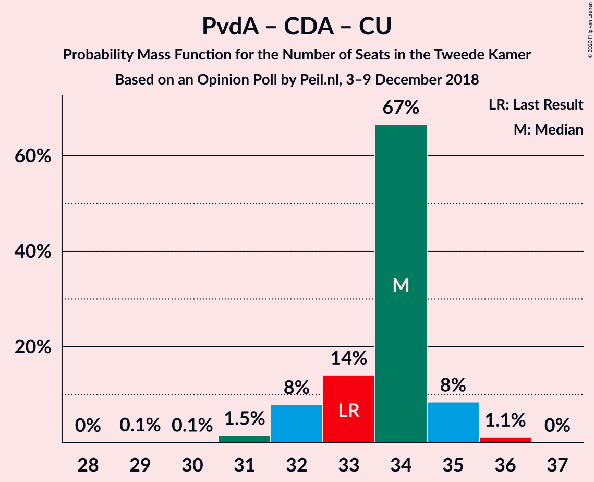

# Opinion Poll by Peil.nl, 3–9 December 2018

<a href="#voting-intentions">Voting Intentions</a> | <a href="#seats">Seats</a> | <a href="#coalitions">Coalitions</a> | <a href="#technical-information">Technical Information</a>

## Voting Intentions

### Confidence Intervals

| Party | Last Result | Poll Result | 80% Confidence Interval | 90% Confidence Interval | 95% Confidence Interval | 99% Confidence Interval |
|:-----:|:-----------:|:-----------:|:-----------------------:|:-----------------------:|:-----------------------:|:-----------------------:|
| Volkspartij voor Vrijheid en Democratie | 21.3% | 14.7% | 13.9–15.5% |13.6–15.8% |13.4–16.0% |13.1–16.4% |
| Partij voor de Vrijheid | 13.1% | 12.0% | 11.3–12.8% |11.1–13.0% |10.9–13.2% |10.5–13.6% |
| GroenLinks | 9.1% | 11.3% | 10.6–12.1% |10.4–12.3% |10.2–12.5% |9.9–12.9% |
| Forum voor Democratie | 1.8% | 10.7% | 10.0–11.4% |9.8–11.6% |9.6–11.8% |9.3–12.2% |
| Partij van de Arbeid | 5.7% | 10.0% | 9.3–10.7% |9.1–10.9% |9.0–11.1% |8.7–11.5% |
| Socialistische Partij | 9.1% | 8.0% | 7.4–8.7% |7.2–8.9% |7.1–9.0% |6.8–9.4% |
| Christen-Democratisch Appèl | 12.4% | 7.3% | 6.8–8.0% |6.6–8.2% |6.4–8.3% |6.2–8.6% |
| Democraten 66 | 12.2% | 6.7% | 6.1–7.3% |6.0–7.5% |5.8–7.6% |5.6–7.9% |
| Partij voor de Dieren | 3.2% | 5.3% | 4.8–5.9% |4.7–6.1% |4.6–6.2% |4.4–6.5% |
| ChristenUnie | 3.4% | 4.7% | 4.2–5.2% |4.1–5.3% |4.0–5.5% |3.7–5.8% |
| DENK | 2.1% | 4.7% | 4.2–5.2% |4.1–5.3% |4.0–5.5% |3.7–5.8% |
| 50Plus | 3.1% | 2.7% | 2.3–3.1% |2.2–3.2% |2.1–3.3% |2.0–3.5% |
| Staatkundig Gereformeerde Partij | 2.1% | 2.0% | 1.7–2.4% |1.6–2.5% |1.6–2.6% |1.4–2.8% |

*Note:* The poll result column reflects the actual value used in the calculations. Published results may vary slightly, and in addition be rounded to fewer digits.

## Seats

### Confidence Intervals

| Party | Last Result | Median | 80% Confidence Interval | 90% Confidence Interval | 95% Confidence Interval | 99% Confidence Interval |
|:-----:|:-----------:|:------:|:-----------------------:|:-----------------------:|:-----------------------:|:-----------------------:|
| <a href="#volkspartij-voor-vrijheid-en-democratie">Volkspartij voor Vrijheid en Democratie</a> | 33 | 22 | 20–23 |20–23 |20–23 |20–25 |
| <a href="#partij-voor-de-vrijheid">Partij voor de Vrijheid</a> | 20 | 18 | 18–20 |17–20 |16–20 |16–21 |
| <a href="#groenlinks">GroenLinks</a> | 14 | 16 | 16–18 |16–18 |15–18 |15–19 |
| <a href="#forum-voor-democratie">Forum voor Democratie</a> | 2 | 16 | 14–18 |14–18 |14–18 |14–18 |
| <a href="#partij-van-de-arbeid">Partij van de Arbeid</a> | 9 | 16 | 14–17 |12–17 |12–17 |12–17 |
| <a href="#socialistische-partij">Socialistische Partij</a> | 14 | 12 | 11–13 |11–13 |11–14 |10–14 |
| <a href="#christen-democratisch-appèl">Christen-Democratisch Appèl</a> | 19 | 10 | 10–11 |10–11 |10–12 |10–12 |
| <a href="#democraten-66">Democraten 66</a> | 19 | 9 | 9–11 |8–13 |8–13 |8–13 |
| <a href="#partij-voor-de-dieren">Partij voor de Dieren</a> | 5 | 8 | 7–9 |7–9 |7–9 |6–9 |
| <a href="#christenunie">ChristenUnie</a> | 5 | 6 | 6–8 |6–8 |6–9 |6–9 |
| <a href="#denk">DENK</a> | 3 | 7 | 6–9 |6–9 |6–9 |5–9 |
| <a href="#50plus">50Plus</a> | 4 | 4 | 3–5 |3–5 |3–5 |3–5 |
| <a href="#staatkundig-gereformeerde-partij">Staatkundig Gereformeerde Partij</a> | 3 | 3 | 2–4 |2–4 |2–4 |1–4 |

### Volkspartij voor Vrijheid en Democratie

*For a full overview of the results for this party, see the [Volkspartij voor Vrijheid en Democratie](party-volkspartijvoorvrijheidendemocratie.html) page.*

| Number of Seats | Probability | Accumulated | Special Marks |
|:---------------:|:-----------:|:-----------:|:-------------:|
| 19 | 0.2% | 100% |  |
| 20 | 17% | 99.8% |  |
| 21 | 2% | 83% |  |
| 22 | 70% | 81% | Median |
| 23 | 10% | 11% |  |
| 24 | 0.5% | 1.0% |  |
| 25 | 0.4% | 0.5% |  |
| 26 | 0.1% | 0.1% |  |
| 27 | 0% | 0% |  |
| 28 | 0% | 0% |  |
| 29 | 0% | 0% |  |
| 30 | 0% | 0% |  |
| 31 | 0% | 0% |  |
| 32 | 0% | 0% |  |
| 33 | 0% | 0% | Last Result |

### Partij voor de Vrijheid

*For a full overview of the results for this party, see the [Partij voor de Vrijheid](party-partijvoordevrijheid.html) page.*

| Number of Seats | Probability | Accumulated | Special Marks |
|:---------------:|:-----------:|:-----------:|:-------------:|
| 16 | 4% | 100% |  |
| 17 | 2% | 96% |  |
| 18 | 44% | 94% | Median |
| 19 | 21% | 50% |  |
| 20 | 29% | 29% | Last Result |
| 21 | 0.6% | 0.6% |  |
| 22 | 0% | 0% |  |

### GroenLinks

*For a full overview of the results for this party, see the [GroenLinks](party-groenlinks.html) page.*

| Number of Seats | Probability | Accumulated | Special Marks |
|:---------------:|:-----------:|:-----------:|:-------------:|
| 14 | 0.3% | 100% | Last Result |
| 15 | 3% | 99.7% |  |
| 16 | 62% | 96% | Median |
| 17 | 21% | 34% |  |
| 18 | 10% | 13% |  |
| 19 | 2% | 2% |  |
| 20 | 0.1% | 0.1% |  |
| 21 | 0% | 0% |  |

### Forum voor Democratie

*For a full overview of the results for this party, see the [Forum voor Democratie](party-forumvoordemocratie.html) page.*

| Number of Seats | Probability | Accumulated | Special Marks |
|:---------------:|:-----------:|:-----------:|:-------------:|
| 2 | 0% | 100% | Last Result |
| 3 | 0% | 100% |  |
| 4 | 0% | 100% |  |
| 5 | 0% | 100% |  |
| 6 | 0% | 100% |  |
| 7 | 0% | 100% |  |
| 8 | 0% | 100% |  |
| 9 | 0% | 100% |  |
| 10 | 0% | 100% |  |
| 11 | 0% | 100% |  |
| 12 | 0% | 100% |  |
| 13 | 0.1% | 100% |  |
| 14 | 48% | 99.9% |  |
| 15 | 0.6% | 52% |  |
| 16 | 2% | 52% | Median |
| 17 | 24% | 50% |  |
| 18 | 25% | 25% |  |
| 19 | 0.3% | 0.3% |  |
| 20 | 0% | 0% |  |

### Partij van de Arbeid

*For a full overview of the results for this party, see the [Partij van de Arbeid](party-partijvandearbeid.html) page.*

| Number of Seats | Probability | Accumulated | Special Marks |
|:---------------:|:-----------:|:-----------:|:-------------:|
| 9 | 0% | 100% | Last Result |
| 10 | 0% | 100% |  |
| 11 | 0% | 100% |  |
| 12 | 6% | 100% |  |
| 13 | 3% | 94% |  |
| 14 | 13% | 91% |  |
| 15 | 9% | 79% |  |
| 16 | 40% | 70% | Median |
| 17 | 30% | 30% |  |
| 18 | 0% | 0% |  |

### Socialistische Partij

*For a full overview of the results for this party, see the [Socialistische Partij](party-socialistischepartij.html) page.*

| Number of Seats | Probability | Accumulated | Special Marks |
|:---------------:|:-----------:|:-----------:|:-------------:|
| 9 | 0.1% | 100% |  |
| 10 | 1.3% | 99.9% |  |
| 11 | 10% | 98.5% |  |
| 12 | 40% | 88% | Median |
| 13 | 45% | 49% |  |
| 14 | 4% | 4% | Last Result |
| 15 | 0% | 0% |  |

### Christen-Democratisch Appèl

*For a full overview of the results for this party, see the [Christen-Democratisch Appèl](party-christen-democratischappèl.html) page.*

| Number of Seats | Probability | Accumulated | Special Marks |
|:---------------:|:-----------:|:-----------:|:-------------:|
| 9 | 0.4% | 100% |  |
| 10 | 68% | 99.6% | Median |
| 11 | 29% | 32% |  |
| 12 | 3% | 3% |  |
| 13 | 0.2% | 0.3% |  |
| 14 | 0.1% | 0.1% |  |
| 15 | 0% | 0% |  |
| 16 | 0% | 0% |  |
| 17 | 0% | 0% |  |
| 18 | 0% | 0% |  |
| 19 | 0% | 0% | Last Result |

### Democraten 66

*For a full overview of the results for this party, see the [Democraten 66](party-democraten66.html) page.*

| Number of Seats | Probability | Accumulated | Special Marks |
|:---------------:|:-----------:|:-----------:|:-------------:|
| 8 | 9% | 100% |  |
| 9 | 42% | 91% | Median |
| 10 | 9% | 48% |  |
| 11 | 32% | 39% |  |
| 12 | 0.5% | 7% |  |
| 13 | 6% | 6% |  |
| 14 | 0% | 0% |  |
| 15 | 0% | 0% |  |
| 16 | 0% | 0% |  |
| 17 | 0% | 0% |  |
| 18 | 0% | 0% |  |
| 19 | 0% | 0% | Last Result |

### Partij voor de Dieren

*For a full overview of the results for this party, see the [Partij voor de Dieren](party-partijvoordedieren.html) page.*

| Number of Seats | Probability | Accumulated | Special Marks |
|:---------------:|:-----------:|:-----------:|:-------------:|
| 5 | 0% | 100% | Last Result |
| 6 | 1.3% | 100% |  |
| 7 | 13% | 98.7% |  |
| 8 | 59% | 86% | Median |
| 9 | 27% | 27% |  |
| 10 | 0.2% | 0.2% |  |
| 11 | 0% | 0% |  |

### ChristenUnie

*For a full overview of the results for this party, see the [ChristenUnie](party-christenunie.html) page.*

| Number of Seats | Probability | Accumulated | Special Marks |
|:---------------:|:-----------:|:-----------:|:-------------:|
| 5 | 0.2% | 100% | Last Result |
| 6 | 60% | 99.8% | Median |
| 7 | 29% | 40% |  |
| 8 | 7% | 11% |  |
| 9 | 4% | 4% |  |
| 10 | 0% | 0% |  |

### DENK

*For a full overview of the results for this party, see the [DENK](party-denk.html) page.*

| Number of Seats | Probability | Accumulated | Special Marks |
|:---------------:|:-----------:|:-----------:|:-------------:|
| 3 | 0% | 100% | Last Result |
| 4 | 0% | 100% |  |
| 5 | 0.5% | 100% |  |
| 6 | 14% | 99.5% |  |
| 7 | 46% | 85% | Median |
| 8 | 14% | 39% |  |
| 9 | 25% | 25% |  |
| 10 | 0% | 0% |  |

### 50Plus

*For a full overview of the results for this party, see the [50Plus](party-50plus.html) page.*

| Number of Seats | Probability | Accumulated | Special Marks |
|:---------------:|:-----------:|:-----------:|:-------------:|
| 2 | 0.1% | 100% |  |
| 3 | 17% | 99.9% |  |
| 4 | 59% | 83% | Last Result, Median |
| 5 | 24% | 24% |  |
| 6 | 0% | 0% |  |

### Staatkundig Gereformeerde Partij

*For a full overview of the results for this party, see the [Staatkundig Gereformeerde Partij](party-staatkundiggereformeerdepartij.html) page.*

| Number of Seats | Probability | Accumulated | Special Marks |
|:---------------:|:-----------:|:-----------:|:-------------:|
| 1 | 0.8% | 100% |  |
| 2 | 35% | 99.2% |  |
| 3 | 52% | 65% | Last Result, Median |
| 4 | 12% | 12% |  |
| 5 | 0% | 0% |  |

## Coalitions

### Confidence Intervals

| Coalition | Last Result | Median | Majority? | 80% Confidence Interval | 90% Confidence Interval | 95% Confidence Interval | 99% Confidence Interval |
|:---------:|:-----------:|:------:|:---------:|:-----------------------:|:-----------------------:|:-----------------------:|:-----------------------:|
| GroenLinks – Partij van de Arbeid – Socialistische Partij – Christen-Democratisch Appèl – Democraten 66 – ChristenUnie | 80 | 71 | 4% | 70–72 | 68–74 | 68–76 | 68–76 |
| Volkspartij voor Vrijheid en Democratie – Partij voor de Vrijheid – Forum voor Democratie – Christen-Democratisch Appèl – Staatkundig Gereformeerde Partij | 77 | 68 | 0% | 68–72 | 68–72 | 68–72 | 67–74 |
| Volkspartij voor Vrijheid en Democratie – GroenLinks – Christen-Democratisch Appèl – Democraten 66 – ChristenUnie | 90 | 64 | 0% | 62–68 | 62–68 | 62–70 | 62–71 |
| Volkspartij voor Vrijheid en Democratie – Partij van de Arbeid – Christen-Democratisch Appèl – Democraten 66 – ChristenUnie | 85 | 65 | 0% | 61–67 | 61–67 | 61–70 | 61–70 |
| Volkspartij voor Vrijheid en Democratie – Partij voor de Vrijheid – Forum voor Democratie – Christen-Democratisch Appèl | 74 | 66 | 0% | 65–69 | 65–69 | 65–69 | 64–72 |
| GroenLinks – Partij van de Arbeid – Christen-Democratisch Appèl – Democraten 66 – ChristenUnie | 66 | 59 | 0% | 58–60 | 56–61 | 56–65 | 56–65 |
| Volkspartij voor Vrijheid en Democratie – Forum voor Democratie – Christen-Democratisch Appèl – 50Plus – Staatkundig Gereformeerde Partij | 61 | 55 | 0% | 52–57 | 52–57 | 52–58 | 52–59 |
| Volkspartij voor Vrijheid en Democratie – Forum voor Democratie – Christen-Democratisch Appèl – 50Plus | 58 | 52 | 0% | 50–54 | 50–54 | 50–54 | 50–56 |
| Volkspartij voor Vrijheid en Democratie – Forum voor Democratie – Christen-Democratisch Appèl – Staatkundig Gereformeerde Partij | 57 | 50 | 0% | 48–53 | 48–53 | 48–53 | 48–55 |
| Volkspartij voor Vrijheid en Democratie – Partij voor de Vrijheid – Christen-Democratisch Appèl | 72 | 51 | 0% | 48–52 | 48–53 | 48–53 | 48–55 |
| Volkspartij voor Vrijheid en Democratie – Christen-Democratisch Appèl – Democraten 66 – ChristenUnie | 76 | 48 | 0% | 45–52 | 45–52 | 45–53 | 45–53 |
| Volkspartij voor Vrijheid en Democratie – Partij van de Arbeid – Democraten 66 | 61 | 48 | 0% | 45–49 | 44–51 | 44–51 | 44–51 |
| Volkspartij voor Vrijheid en Democratie – Forum voor Democratie – Christen-Democratisch Appèl | 54 | 48 | 0% | 46–50 | 46–50 | 46–50 | 46–52 |
| Volkspartij voor Vrijheid en Democratie – Partij van de Arbeid – Christen-Democratisch Appèl | 61 | 48 | 0% | 46–50 | 44–50 | 44–50 | 44–50 |
| Volkspartij voor Vrijheid en Democratie – Christen-Democratisch Appèl – Democraten 66 | 71 | 42 | 0% | 39–44 | 39–46 | 39–46 | 39–46 |
| Volkspartij voor Vrijheid en Democratie – Partij van de Arbeid | 42 | 38 | 0% | 36–39 | 34–39 | 34–39 | 34–39 |
| Partij van de Arbeid – Christen-Democratisch Appèl – Democraten 66 | 47 | 37 | 0% | 34–38 | 32–38 | 32–39 | 32–39 |
| Partij van de Arbeid – Christen-Democratisch Appèl – ChristenUnie | 33 | 32 | 0% | 31–34 | 30–35 | 29–37 | 29–37 |
| Volkspartij voor Vrijheid en Democratie – Christen-Democratisch Appèl | 52 | 32 | 0% | 30–33 | 30–33 | 30–33 | 30–36 |
| Partij van de Arbeid – Christen-Democratisch Appèl | 28 | 26 | 0% | 24–28 | 22–28 | 22–28 | 22–28 |
| Christen-Democratisch Appèl – Democraten 66 | 38 | 20 | 0% | 19–22 | 18–23 | 18–23 | 18–23 |

### GroenLinks – Partij van de Arbeid – Socialistische Partij – Christen-Democratisch Appèl – Democraten 66 – ChristenUnie

| Number of Seats | Probability | Accumulated | Special Marks |
|:---------------:|:-----------:|:-----------:|:-------------:|
| 66 | 0.2% | 100% |  |
| 67 | 0.1% | 99.8% |  |
| 68 | 6% | 99.7% |  |
| 69 | 0.2% | 94% | Median |
| 70 | 21% | 94% |  |
| 71 | 23% | 73% |  |
| 72 | 43% | 50% |  |
| 73 | 1.2% | 7% |  |
| 74 | 1.3% | 6% |  |
| 75 | 0.6% | 5% |  |
| 76 | 4% | 4% | Majority |
| 77 | 0% | 0% |  |
| 78 | 0% | 0% |  |
| 79 | 0% | 0% |  |
| 80 | 0% | 0% | Last Result |

### Volkspartij voor Vrijheid en Democratie – Partij voor de Vrijheid – Forum voor Democratie – Christen-Democratisch Appèl – Staatkundig Gereformeerde Partij

| Number of Seats | Probability | Accumulated | Special Marks |
|:---------------:|:-----------:|:-----------:|:-------------:|
| 66 | 0.1% | 100% |  |
| 67 | 1.1% | 99.9% |  |
| 68 | 59% | 98.9% |  |
| 69 | 3% | 40% | Median |
| 70 | 9% | 37% |  |
| 71 | 0.4% | 28% |  |
| 72 | 26% | 28% |  |
| 73 | 1.2% | 2% |  |
| 74 | 0.5% | 0.8% |  |
| 75 | 0.3% | 0.3% |  |
| 76 | 0% | 0% | Majority |
| 77 | 0% | 0% | Last Result |

### Volkspartij voor Vrijheid en Democratie – GroenLinks – Christen-Democratisch Appèl – Democraten 66 – ChristenUnie

| Number of Seats | Probability | Accumulated | Special Marks |
|:---------------:|:-----------:|:-----------:|:-------------:|
| 62 | 18% | 100% |  |
| 63 | 0.2% | 82% | Median |
| 64 | 32% | 81% |  |
| 65 | 0.7% | 49% |  |
| 66 | 31% | 49% |  |
| 67 | 3% | 17% |  |
| 68 | 10% | 14% |  |
| 69 | 0.3% | 4% |  |
| 70 | 3% | 4% |  |
| 71 | 0.9% | 1.2% |  |
| 72 | 0.2% | 0.2% |  |
| 73 | 0% | 0% |  |
| 74 | 0% | 0% |  |
| 75 | 0% | 0% |  |
| 76 | 0% | 0% | Majority |
| 77 | 0% | 0% |  |
| 78 | 0% | 0% |  |
| 79 | 0% | 0% |  |
| 80 | 0% | 0% |  |
| 81 | 0% | 0% |  |
| 82 | 0% | 0% |  |
| 83 | 0% | 0% |  |
| 84 | 0% | 0% |  |
| 85 | 0% | 0% |  |
| 86 | 0% | 0% |  |
| 87 | 0% | 0% |  |
| 88 | 0% | 0% |  |
| 89 | 0% | 0% |  |
| 90 | 0% | 0% | Last Result |

### Volkspartij voor Vrijheid en Democratie – Partij van de Arbeid – Christen-Democratisch Appèl – Democraten 66 – ChristenUnie

| Number of Seats | Probability | Accumulated | Special Marks |
|:---------------:|:-----------:|:-----------:|:-------------:|
| 61 | 17% | 100% |  |
| 62 | 13% | 83% |  |
| 63 | 3% | 70% | Median |
| 64 | 14% | 68% |  |
| 65 | 27% | 54% |  |
| 66 | 15% | 27% |  |
| 67 | 9% | 12% |  |
| 68 | 0.7% | 3% |  |
| 69 | 0% | 3% |  |
| 70 | 3% | 3% |  |
| 71 | 0% | 0% |  |
| 72 | 0% | 0% |  |
| 73 | 0% | 0% |  |
| 74 | 0% | 0% |  |
| 75 | 0% | 0% |  |
| 76 | 0% | 0% | Majority |
| 77 | 0% | 0% |  |
| 78 | 0% | 0% |  |
| 79 | 0% | 0% |  |
| 80 | 0% | 0% |  |
| 81 | 0% | 0% |  |
| 82 | 0% | 0% |  |
| 83 | 0% | 0% |  |
| 84 | 0% | 0% |  |
| 85 | 0% | 0% | Last Result |

### Volkspartij voor Vrijheid en Democratie – Partij voor de Vrijheid – Forum voor Democratie – Christen-Democratisch Appèl

| Number of Seats | Probability | Accumulated | Special Marks |
|:---------------:|:-----------:|:-----------:|:-------------:|
| 64 | 0.6% | 100% |  |
| 65 | 25% | 99.4% |  |
| 66 | 38% | 74% | Median |
| 67 | 8% | 37% |  |
| 68 | 11% | 29% |  |
| 69 | 15% | 17% |  |
| 70 | 1.0% | 2% |  |
| 71 | 0.4% | 1.0% |  |
| 72 | 0.6% | 0.6% |  |
| 73 | 0% | 0% |  |
| 74 | 0% | 0% | Last Result |

### GroenLinks – Partij van de Arbeid – Christen-Democratisch Appèl – Democraten 66 – ChristenUnie

| Number of Seats | Probability | Accumulated | Special Marks |
|:---------------:|:-----------:|:-----------:|:-------------:|
| 55 | 0.1% | 100% |  |
| 56 | 6% | 99.9% |  |
| 57 | 2% | 94% | Median |
| 58 | 37% | 92% |  |
| 59 | 25% | 55% |  |
| 60 | 24% | 30% |  |
| 61 | 1.4% | 6% |  |
| 62 | 1.4% | 5% |  |
| 63 | 0.9% | 4% |  |
| 64 | 0.1% | 3% |  |
| 65 | 3% | 3% |  |
| 66 | 0% | 0% | Last Result |

### Volkspartij voor Vrijheid en Democratie – Forum voor Democratie – Christen-Democratisch Appèl – 50Plus – Staatkundig Gereformeerde Partij

| Number of Seats | Probability | Accumulated | Special Marks |
|:---------------:|:-----------:|:-----------:|:-------------:|
| 52 | 14% | 100% |  |
| 53 | 3% | 86% |  |
| 54 | 32% | 83% |  |
| 55 | 18% | 51% | Median |
| 56 | 16% | 33% |  |
| 57 | 13% | 17% |  |
| 58 | 3% | 4% |  |
| 59 | 0.4% | 0.6% |  |
| 60 | 0.1% | 0.1% |  |
| 61 | 0% | 0% | Last Result |

### Volkspartij voor Vrijheid en Democratie – Forum voor Democratie – Christen-Democratisch Appèl – 50Plus

| Number of Seats | Probability | Accumulated | Special Marks |
|:---------------:|:-----------:|:-----------:|:-------------:|
| 49 | 0.2% | 100% |  |
| 50 | 16% | 99.8% |  |
| 51 | 32% | 84% |  |
| 52 | 13% | 52% | Median |
| 53 | 20% | 39% |  |
| 54 | 17% | 19% |  |
| 55 | 2% | 2% |  |
| 56 | 0.6% | 0.8% |  |
| 57 | 0.1% | 0.1% |  |
| 58 | 0% | 0% | Last Result |

### Volkspartij voor Vrijheid en Democratie – Forum voor Democratie – Christen-Democratisch Appèl – Staatkundig Gereformeerde Partij

| Number of Seats | Probability | Accumulated | Special Marks |
|:---------------:|:-----------:|:-----------:|:-------------:|
| 48 | 14% | 100% |  |
| 49 | 0.2% | 86% |  |
| 50 | 51% | 86% |  |
| 51 | 0.7% | 35% | Median |
| 52 | 11% | 34% |  |
| 53 | 21% | 22% |  |
| 54 | 0.6% | 2% |  |
| 55 | 1.0% | 1.2% |  |
| 56 | 0.2% | 0.2% |  |
| 57 | 0% | 0% | Last Result |

### Volkspartij voor Vrijheid en Democratie – Partij voor de Vrijheid – Christen-Democratisch Appèl

| Number of Seats | Probability | Accumulated | Special Marks |
|:---------------:|:-----------:|:-----------:|:-------------:|
| 47 | 0.3% | 100% |  |
| 48 | 17% | 99.7% |  |
| 49 | 4% | 82% |  |
| 50 | 1.5% | 78% | Median |
| 51 | 44% | 77% |  |
| 52 | 24% | 33% |  |
| 53 | 8% | 9% |  |
| 54 | 0.1% | 1.0% |  |
| 55 | 0.6% | 0.9% |  |
| 56 | 0.3% | 0.3% |  |
| 57 | 0% | 0% |  |
| 58 | 0% | 0% |  |
| 59 | 0% | 0% |  |
| 60 | 0% | 0% |  |
| 61 | 0% | 0% |  |
| 62 | 0% | 0% |  |
| 63 | 0% | 0% |  |
| 64 | 0% | 0% |  |
| 65 | 0% | 0% |  |
| 66 | 0% | 0% |  |
| 67 | 0% | 0% |  |
| 68 | 0% | 0% |  |
| 69 | 0% | 0% |  |
| 70 | 0% | 0% |  |
| 71 | 0% | 0% |  |
| 72 | 0% | 0% | Last Result |

### Volkspartij voor Vrijheid en Democratie – Christen-Democratisch Appèl – Democraten 66 – ChristenUnie

| Number of Seats | Probability | Accumulated | Special Marks |
|:---------------:|:-----------:|:-----------:|:-------------:|
| 45 | 16% | 100% |  |
| 46 | 7% | 84% |  |
| 47 | 2% | 76% | Median |
| 48 | 26% | 74% |  |
| 49 | 0.7% | 48% |  |
| 50 | 35% | 48% |  |
| 51 | 0.8% | 13% |  |
| 52 | 9% | 12% |  |
| 53 | 3% | 3% |  |
| 54 | 0.2% | 0.3% |  |
| 55 | 0% | 0% |  |
| 56 | 0% | 0% |  |
| 57 | 0% | 0% |  |
| 58 | 0% | 0% |  |
| 59 | 0% | 0% |  |
| 60 | 0% | 0% |  |
| 61 | 0% | 0% |  |
| 62 | 0% | 0% |  |
| 63 | 0% | 0% |  |
| 64 | 0% | 0% |  |
| 65 | 0% | 0% |  |
| 66 | 0% | 0% |  |
| 67 | 0% | 0% |  |
| 68 | 0% | 0% |  |
| 69 | 0% | 0% |  |
| 70 | 0% | 0% |  |
| 71 | 0% | 0% |  |
| 72 | 0% | 0% |  |
| 73 | 0% | 0% |  |
| 74 | 0% | 0% |  |
| 75 | 0% | 0% |  |
| 76 | 0% | 0% | Last Result, Majority |

### Volkspartij voor Vrijheid en Democratie – Partij van de Arbeid – Democraten 66

| Number of Seats | Probability | Accumulated | Special Marks |
|:---------------:|:-----------:|:-----------:|:-------------:|
| 44 | 6% | 100% |  |
| 45 | 17% | 94% |  |
| 46 | 8% | 77% |  |
| 47 | 17% | 69% | Median |
| 48 | 27% | 52% |  |
| 49 | 16% | 25% |  |
| 50 | 3% | 9% |  |
| 51 | 6% | 6% |  |
| 52 | 0% | 0% |  |
| 53 | 0% | 0% |  |
| 54 | 0% | 0% |  |
| 55 | 0% | 0% |  |
| 56 | 0% | 0% |  |
| 57 | 0% | 0% |  |
| 58 | 0% | 0% |  |
| 59 | 0% | 0% |  |
| 60 | 0% | 0% |  |
| 61 | 0% | 0% | Last Result |

### Volkspartij voor Vrijheid en Democratie – Forum voor Democratie – Christen-Democratisch Appèl

| Number of Seats | Probability | Accumulated | Special Marks |
|:---------------:|:-----------:|:-----------:|:-------------:|
| 45 | 0% | 100% |  |
| 46 | 14% | 99.9% |  |
| 47 | 34% | 86% |  |
| 48 | 17% | 52% | Median |
| 49 | 22% | 35% |  |
| 50 | 11% | 13% |  |
| 51 | 0.5% | 2% |  |
| 52 | 1.2% | 1.4% |  |
| 53 | 0.2% | 0.2% |  |
| 54 | 0% | 0% | Last Result |

### Volkspartij voor Vrijheid en Democratie – Partij van de Arbeid – Christen-Democratisch Appèl

| Number of Seats | Probability | Accumulated | Special Marks |
|:---------------:|:-----------:|:-----------:|:-------------:|
| 44 | 6% | 100% |  |
| 45 | 0.4% | 94% |  |
| 46 | 30% | 94% |  |
| 47 | 3% | 64% |  |
| 48 | 29% | 61% | Median |
| 49 | 4% | 33% |  |
| 50 | 29% | 29% |  |
| 51 | 0.1% | 0.2% |  |
| 52 | 0% | 0.1% |  |
| 53 | 0% | 0% |  |
| 54 | 0% | 0% |  |
| 55 | 0% | 0% |  |
| 56 | 0% | 0% |  |
| 57 | 0% | 0% |  |
| 58 | 0% | 0% |  |
| 59 | 0% | 0% |  |
| 60 | 0% | 0% |  |
| 61 | 0% | 0% | Last Result |

### Volkspartij voor Vrijheid en Democratie – Christen-Democratisch Appèl – Democraten 66

| Number of Seats | Probability | Accumulated | Special Marks |
|:---------------:|:-----------:|:-----------:|:-------------:|
| 38 | 0.2% | 100% |  |
| 39 | 17% | 99.8% |  |
| 40 | 9% | 83% |  |
| 41 | 0.1% | 74% | Median |
| 42 | 32% | 74% |  |
| 43 | 28% | 42% |  |
| 44 | 6% | 14% |  |
| 45 | 0.6% | 8% |  |
| 46 | 7% | 8% |  |
| 47 | 0.3% | 0.3% |  |
| 48 | 0% | 0% |  |
| 49 | 0% | 0% |  |
| 50 | 0% | 0% |  |
| 51 | 0% | 0% |  |
| 52 | 0% | 0% |  |
| 53 | 0% | 0% |  |
| 54 | 0% | 0% |  |
| 55 | 0% | 0% |  |
| 56 | 0% | 0% |  |
| 57 | 0% | 0% |  |
| 58 | 0% | 0% |  |
| 59 | 0% | 0% |  |
| 60 | 0% | 0% |  |
| 61 | 0% | 0% |  |
| 62 | 0% | 0% |  |
| 63 | 0% | 0% |  |
| 64 | 0% | 0% |  |
| 65 | 0% | 0% |  |
| 66 | 0% | 0% |  |
| 67 | 0% | 0% |  |
| 68 | 0% | 0% |  |
| 69 | 0% | 0% |  |
| 70 | 0% | 0% |  |
| 71 | 0% | 0% | Last Result |

### Volkspartij voor Vrijheid en Democratie – Partij van de Arbeid

| Number of Seats | Probability | Accumulated | Special Marks |
|:---------------:|:-----------:|:-----------:|:-------------:|
| 33 | 0.2% | 100% |  |
| 34 | 6% | 99.8% |  |
| 35 | 1.2% | 94% |  |
| 36 | 30% | 93% |  |
| 37 | 3% | 63% |  |
| 38 | 29% | 60% | Median |
| 39 | 30% | 31% |  |
| 40 | 0.3% | 0.4% |  |
| 41 | 0% | 0% |  |
| 42 | 0% | 0% | Last Result |

### Partij van de Arbeid – Christen-Democratisch Appèl – Democraten 66

| Number of Seats | Probability | Accumulated | Special Marks |
|:---------------:|:-----------:|:-----------:|:-------------:|
| 31 | 0.1% | 100% |  |
| 32 | 6% | 99.9% |  |
| 33 | 0.5% | 94% |  |
| 34 | 10% | 94% |  |
| 35 | 30% | 84% | Median |
| 36 | 3% | 54% |  |
| 37 | 41% | 52% |  |
| 38 | 7% | 10% |  |
| 39 | 3% | 3% |  |
| 40 | 0% | 0.1% |  |
| 41 | 0% | 0% |  |
| 42 | 0% | 0% |  |
| 43 | 0% | 0% |  |
| 44 | 0% | 0% |  |
| 45 | 0% | 0% |  |
| 46 | 0% | 0% |  |
| 47 | 0% | 0% | Last Result |

### Partij van de Arbeid – Christen-Democratisch Appèl – ChristenUnie

| Number of Seats | Probability | Accumulated | Special Marks |
|:---------------:|:-----------:|:-----------:|:-------------:|
| 28 | 0.1% | 100% |  |
| 29 | 2% | 99.9% |  |
| 30 | 6% | 97% |  |
| 31 | 18% | 91% |  |
| 32 | 25% | 74% | Median |
| 33 | 16% | 48% | Last Result |
| 34 | 27% | 32% |  |
| 35 | 2% | 5% |  |
| 36 | 1.1% | 4% |  |
| 37 | 3% | 3% |  |
| 38 | 0% | 0% |  |

### Volkspartij voor Vrijheid en Democratie – Christen-Democratisch Appèl

| Number of Seats | Probability | Accumulated | Special Marks |
|:---------------:|:-----------:|:-----------:|:-------------:|
| 29 | 0.2% | 100% |  |
| 30 | 16% | 99.8% |  |
| 31 | 0.4% | 83% |  |
| 32 | 43% | 83% | Median |
| 33 | 38% | 40% |  |
| 34 | 0.6% | 2% |  |
| 35 | 1.0% | 2% |  |
| 36 | 0.4% | 0.5% |  |
| 37 | 0.1% | 0.1% |  |
| 38 | 0% | 0% |  |
| 39 | 0% | 0% |  |
| 40 | 0% | 0% |  |
| 41 | 0% | 0% |  |
| 42 | 0% | 0% |  |
| 43 | 0% | 0% |  |
| 44 | 0% | 0% |  |
| 45 | 0% | 0% |  |
| 46 | 0% | 0% |  |
| 47 | 0% | 0% |  |
| 48 | 0% | 0% |  |
| 49 | 0% | 0% |  |
| 50 | 0% | 0% |  |
| 51 | 0% | 0% |  |
| 52 | 0% | 0% | Last Result |

### Partij van de Arbeid – Christen-Democratisch Appèl

| Number of Seats | Probability | Accumulated | Special Marks |
|:---------------:|:-----------:|:-----------:|:-------------:|
| 22 | 6% | 100% |  |
| 23 | 2% | 94% |  |
| 24 | 12% | 92% |  |
| 25 | 8% | 80% |  |
| 26 | 39% | 72% | Median |
| 27 | 5% | 33% |  |
| 28 | 28% | 28% | Last Result |
| 29 | 0.1% | 0.1% |  |
| 30 | 0% | 0.1% |  |
| 31 | 0% | 0% |  |

### Christen-Democratisch Appèl – Democraten 66

| Number of Seats | Probability | Accumulated | Special Marks |
|:---------------:|:-----------:|:-----------:|:-------------:|
| 17 | 0.1% | 100% |  |
| 18 | 9% | 99.9% |  |
| 19 | 17% | 91% | Median |
| 20 | 32% | 74% |  |
| 21 | 30% | 42% |  |
| 22 | 4% | 12% |  |
| 23 | 8% | 8% |  |
| 24 | 0.2% | 0.3% |  |
| 25 | 0% | 0.1% |  |
| 26 | 0% | 0% |  |
| 27 | 0% | 0% |  |
| 28 | 0% | 0% |  |
| 29 | 0% | 0% |  |
| 30 | 0% | 0% |  |
| 31 | 0% | 0% |  |
| 32 | 0% | 0% |  |
| 33 | 0% | 0% |  |
| 34 | 0% | 0% |  |
| 35 | 0% | 0% |  |
| 36 | 0% | 0% |  |
| 37 | 0% | 0% |  |
| 38 | 0% | 0% | Last Result |

## Technical Information

### Opinion Poll

+ **Polling firm:** Peil.nl
+ **Commissioner(s):** —
+ **Fieldwork period:** 3–9 December 2018

### Calculations

+ **Sample size:** 3000
+ **Simulations done:** 131,072
+ **Error estimate:** 2.68%

