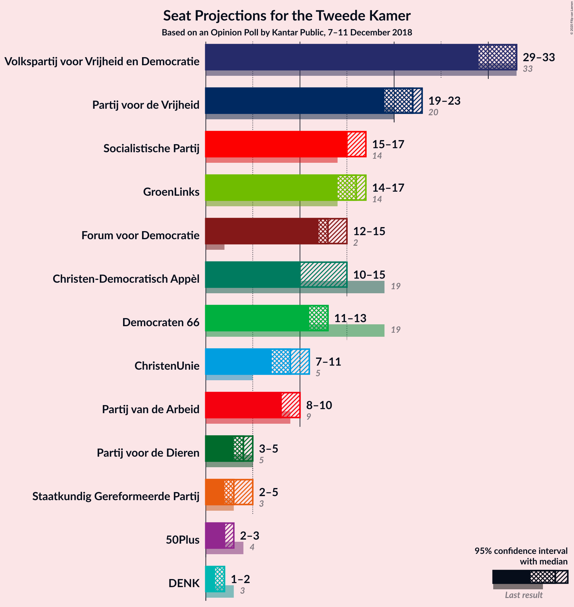
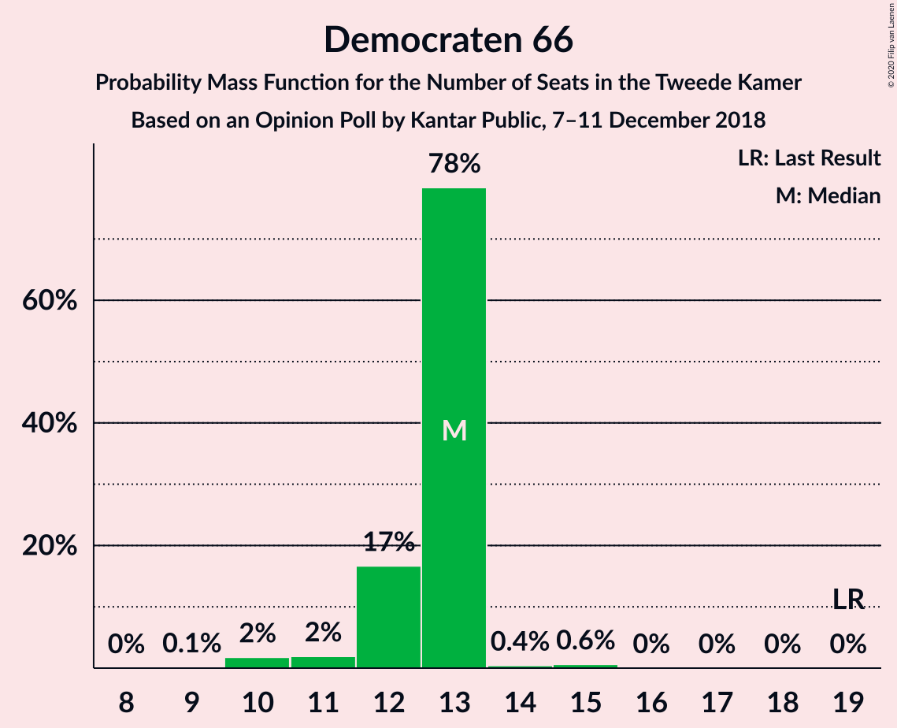
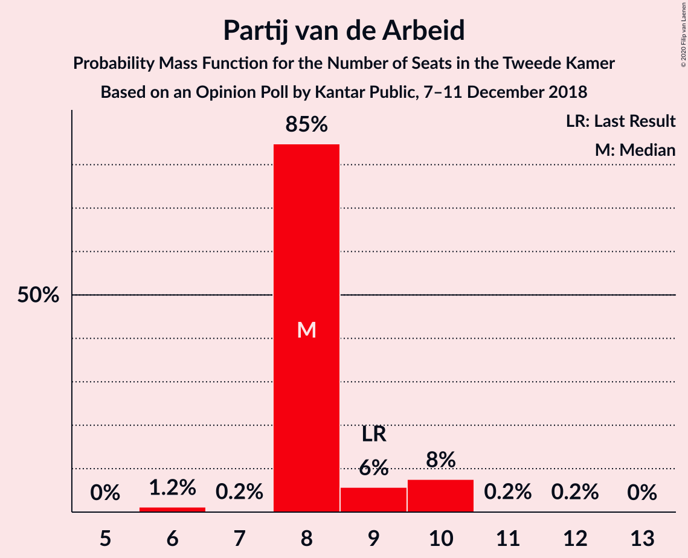
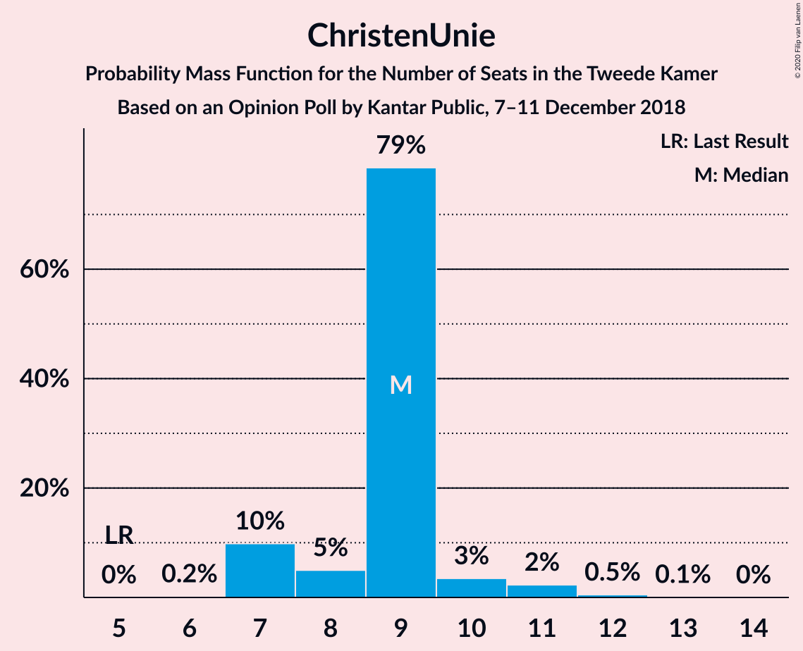
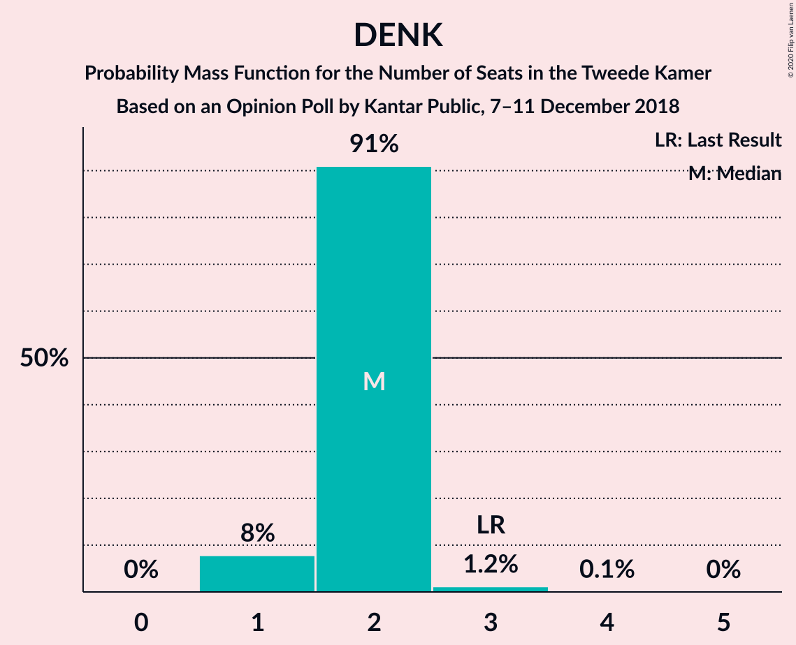
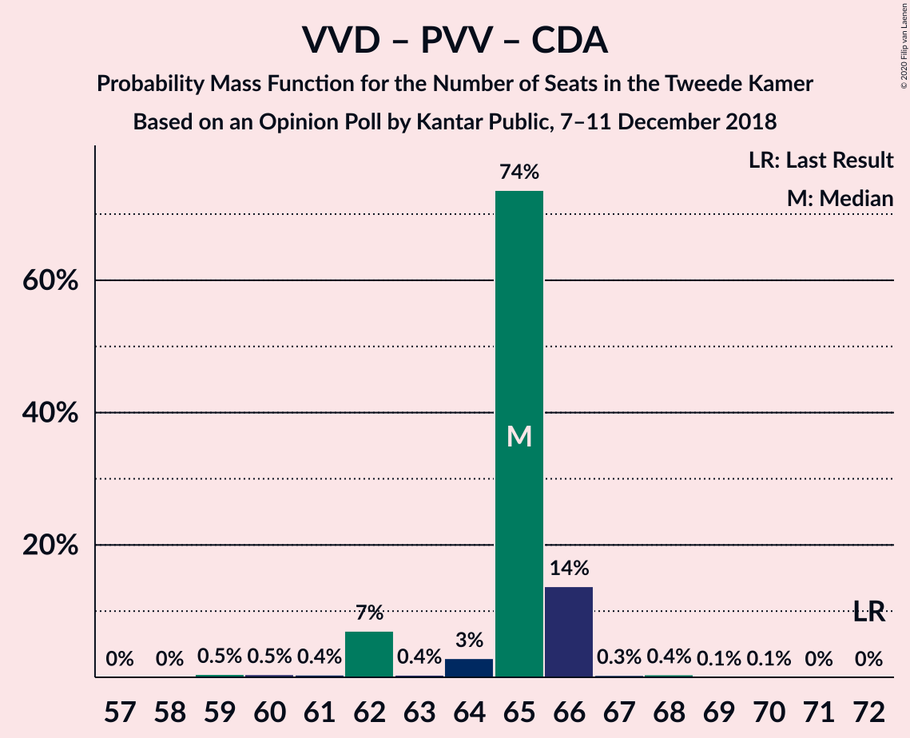
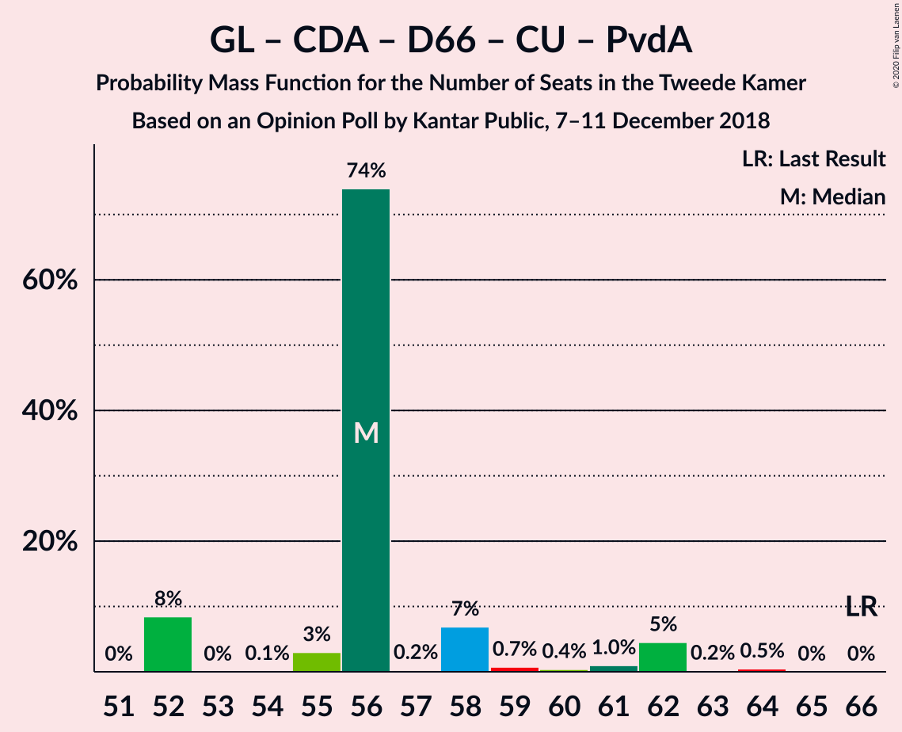
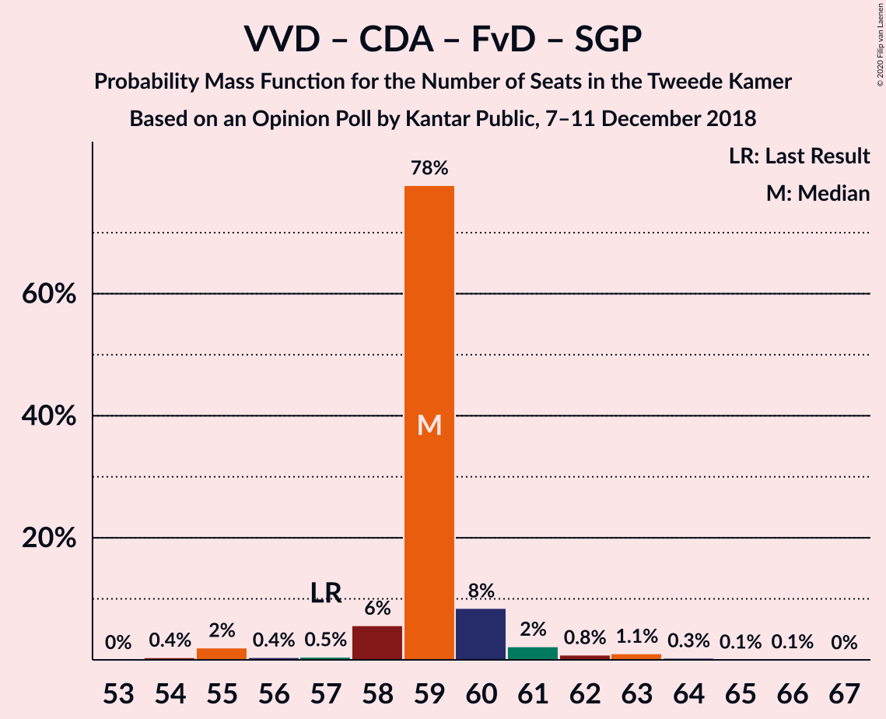
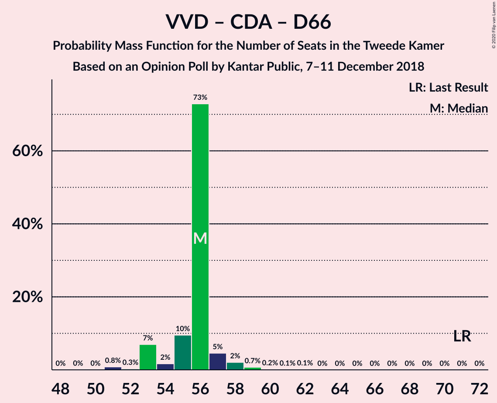

# Opinion Poll by Kantar Public, 7–11 December 2018

<a href="#voting-intentions">Voting Intentions</a> | <a href="#seats">Seats</a> | <a href="#coalitions">Coalitions</a> | <a href="#technical-information">Technical Information</a>

## Voting Intentions

### Confidence Intervals

| Party | Last Result | Poll Result | 80% Confidence Interval | 90% Confidence Interval | 95% Confidence Interval | 99% Confidence Interval |
|:-----:|:-----------:|:-----------:|:-----------------------:|:-----------------------:|:-----------------------:|:-----------------------:|
| Volkspartij voor Vrijheid en Democratie | 21.3% | 19.9% | 18.4–21.6% |18.0–22.1% |17.6–22.5% |16.9–23.3% |
| Partij voor de Vrijheid | 13.1% | 13.3% | 12.0–14.8% |11.7–15.2% |11.4–15.5% |10.8–16.3% |
| GroenLinks | 9.1% | 10.6% | 9.4–11.9% |9.1–12.3% |8.9–12.7% |8.3–13.3% |
| Socialistische Partij | 9.1% | 10.0% | 8.9–11.3% |8.6–11.7% |8.3–12.0% |7.8–12.7% |
| Christen-Democratisch Appèl | 12.4% | 8.7% | 7.6–9.9% |7.3–10.2% |7.1–10.5% |6.6–11.2% |
| Forum voor Democratie | 1.8% | 8.7% | 7.6–9.9% |7.3–10.2% |7.1–10.5% |6.6–11.2% |
| Democraten 66 | 12.2% | 8.0% | 7.0–9.2% |6.7–9.5% |6.5–9.8% |6.0–10.4% |
| Partij van de Arbeid | 5.7% | 6.0% | 5.2–7.1% |4.9–7.4% |4.7–7.7% |4.3–8.2% |
| ChristenUnie | 3.4% | 6.0% | 5.2–7.1% |4.9–7.4% |4.7–7.7% |4.3–8.2% |
| Partij voor de Dieren | 3.2% | 3.3% | 2.7–4.1% |2.5–4.4% |2.4–4.6% |2.1–5.0% |
| 50Plus | 3.1% | 2.0% | 1.6–2.7% |1.4–2.9% |1.3–3.1% |1.1–3.5% |
| Staatkundig Gereformeerde Partij | 2.1% | 2.0% | 1.6–2.7% |1.4–2.9% |1.3–3.1% |1.1–3.5% |
| DENK | 2.1% | 1.4% | 1.0–2.0% |0.9–2.1% |0.8–2.3% |0.7–2.6% |

*Note:* The poll result column reflects the actual value used in the calculations. Published results may vary slightly, and in addition be rounded to fewer digits.

## Seats

### Confidence Intervals

| Party | Last Result | Median | 80% Confidence Interval | 90% Confidence Interval | 95% Confidence Interval | 99% Confidence Interval |
|:-----:|:-----------:|:------:|:-----------------------:|:-----------------------:|:-----------------------:|:-----------------------:|
| <a href="#volkspartij-voor-vrijheid-en-democratie">Volkspartij voor Vrijheid en Democratie</a> | 33 | 33 | 29–33 |29–33 |29–33 |27–34 |
| <a href="#partij-voor-de-vrijheid">Partij voor de Vrijheid</a> | 20 | 22 | 21–22 |20–23 |19–23 |18–23 |
| <a href="#groenlinks">GroenLinks</a> | 14 | 16 | 14–16 |14–16 |14–17 |13–20 |
| <a href="#socialistische-partij">Socialistische Partij</a> | 14 | 15 | 15–16 |15–17 |15–17 |13–19 |
| <a href="#christen-democratisch-appèl">Christen-Democratisch Appèl</a> | 19 | 10 | 10–12 |10–15 |10–15 |10–16 |
| <a href="#forum-voor-democratie">Forum voor Democratie</a> | 2 | 13 | 12–13 |12–15 |12–15 |11–15 |
| <a href="#democraten-66">Democraten 66</a> | 19 | 13 | 12–13 |12–13 |11–13 |10–15 |
| <a href="#partij-van-de-arbeid">Partij van de Arbeid</a> | 9 | 8 | 8–9 |8–10 |8–10 |6–10 |
| <a href="#christenunie">ChristenUnie</a> | 5 | 9 | 7–9 |7–10 |7–11 |7–12 |
| <a href="#partij-voor-de-dieren">Partij voor de Dieren</a> | 5 | 4 | 4–5 |3–5 |3–5 |3–6 |
| <a href="#50plus">50Plus</a> | 4 | 2 | 2–3 |2–3 |2–3 |2–5 |
| <a href="#staatkundig-gereformeerde-partij">Staatkundig Gereformeerde Partij</a> | 3 | 3 | 2–4 |2–5 |2–5 |2–5 |
| <a href="#denk">DENK</a> | 3 | 2 | 2 |1–2 |1–2 |1–3 |

### Volkspartij voor Vrijheid en Democratie

*For a full overview of the results for this party, see the [Volkspartij voor Vrijheid en Democratie](party-volkspartijvoorvrijheidendemocratie.html) page.*

| Number of Seats | Probability | Accumulated | Special Marks |
|:---------------:|:-----------:|:-----------:|:-------------:|
| 25 | 0% | 100% |  |
| 26 | 0.1% | 99.9% |  |
| 27 | 0.5% | 99.8% |  |
| 28 | 1.3% | 99.3% |  |
| 29 | 10% | 98% |  |
| 30 | 0.9% | 88% |  |
| 31 | 3% | 88% |  |
| 32 | 9% | 85% |  |
| 33 | 74% | 76% | Last Result, Median |
| 34 | 2% | 2% |  |
| 35 | 0.2% | 0.3% |  |
| 36 | 0.1% | 0.1% |  |
| 37 | 0% | 0% |  |

### Partij voor de Vrijheid

*For a full overview of the results for this party, see the [Partij voor de Vrijheid](party-partijvoordevrijheid.html) page.*

| Number of Seats | Probability | Accumulated | Special Marks |
|:---------------:|:-----------:|:-----------:|:-------------:|
| 15 | 0.1% | 100% |  |
| 16 | 0.1% | 99.9% |  |
| 17 | 0.3% | 99.8% |  |
| 18 | 0.6% | 99.6% |  |
| 19 | 3% | 99.0% |  |
| 20 | 2% | 96% | Last Result |
| 21 | 8% | 95% |  |
| 22 | 78% | 87% | Median |
| 23 | 8% | 9% |  |
| 24 | 0.1% | 0.5% |  |
| 25 | 0.4% | 0.4% |  |
| 26 | 0% | 0% |  |

### GroenLinks

*For a full overview of the results for this party, see the [GroenLinks](party-groenlinks.html) page.*

| Number of Seats | Probability | Accumulated | Special Marks |
|:---------------:|:-----------:|:-----------:|:-------------:|
| 12 | 0.2% | 100% |  |
| 13 | 0.5% | 99.8% |  |
| 14 | 13% | 99.3% | Last Result |
| 15 | 1.3% | 87% |  |
| 16 | 82% | 85% | Median |
| 17 | 2% | 3% |  |
| 18 | 0.6% | 1.4% |  |
| 19 | 0.3% | 0.8% |  |
| 20 | 0.1% | 0.5% |  |
| 21 | 0.4% | 0.4% |  |
| 22 | 0% | 0% |  |

### Socialistische Partij

*For a full overview of the results for this party, see the [Socialistische Partij](party-socialistischepartij.html) page.*

| Number of Seats | Probability | Accumulated | Special Marks |
|:---------------:|:-----------:|:-----------:|:-------------:|
| 11 | 0.1% | 100% |  |
| 12 | 0.3% | 99.9% |  |
| 13 | 0.6% | 99.5% |  |
| 14 | 1.1% | 98.9% | Last Result |
| 15 | 75% | 98% | Median |
| 16 | 14% | 23% |  |
| 17 | 7% | 9% |  |
| 18 | 0% | 2% |  |
| 19 | 2% | 2% |  |
| 20 | 0% | 0% |  |

### Christen-Democratisch Appèl

*For a full overview of the results for this party, see the [Christen-Democratisch Appèl](party-christen-democratischappèl.html) page.*

| Number of Seats | Probability | Accumulated | Special Marks |
|:---------------:|:-----------:|:-----------:|:-------------:|
| 10 | 75% | 100% | Median |
| 11 | 10% | 25% |  |
| 12 | 6% | 14% |  |
| 13 | 1.3% | 9% |  |
| 14 | 2% | 7% |  |
| 15 | 4% | 5% |  |
| 16 | 0.7% | 0.8% |  |
| 17 | 0.1% | 0.1% |  |
| 18 | 0% | 0% |  |
| 19 | 0% | 0% | Last Result |

### Forum voor Democratie

*For a full overview of the results for this party, see the [Forum voor Democratie](party-forumvoordemocratie.html) page.*

| Number of Seats | Probability | Accumulated | Special Marks |
|:---------------:|:-----------:|:-----------:|:-------------:|
| 2 | 0% | 100% | Last Result |
| 3 | 0% | 100% |  |
| 4 | 0% | 100% |  |
| 5 | 0% | 100% |  |
| 6 | 0% | 100% |  |
| 7 | 0% | 100% |  |
| 8 | 0% | 100% |  |
| 9 | 0% | 100% |  |
| 10 | 0.3% | 100% |  |
| 11 | 1.4% | 99.7% |  |
| 12 | 11% | 98% |  |
| 13 | 78% | 87% | Median |
| 14 | 4% | 9% |  |
| 15 | 5% | 5% |  |
| 16 | 0.1% | 0.2% |  |
| 17 | 0.1% | 0.1% |  |
| 18 | 0% | 0% |  |

### Democraten 66

*For a full overview of the results for this party, see the [Democraten 66](party-democraten66.html) page.*

| Number of Seats | Probability | Accumulated | Special Marks |
|:---------------:|:-----------:|:-----------:|:-------------:|
| 9 | 0.1% | 100% |  |
| 10 | 2% | 99.8% |  |
| 11 | 2% | 98% |  |
| 12 | 17% | 96% |  |
| 13 | 78% | 79% | Median |
| 14 | 0.4% | 1.1% |  |
| 15 | 0.6% | 0.6% |  |
| 16 | 0% | 0% |  |
| 17 | 0% | 0% |  |
| 18 | 0% | 0% |  |
| 19 | 0% | 0% | Last Result |

### Partij van de Arbeid

*For a full overview of the results for this party, see the [Partij van de Arbeid](party-partijvandearbeid.html) page.*

| Number of Seats | Probability | Accumulated | Special Marks |
|:---------------:|:-----------:|:-----------:|:-------------:|
| 6 | 1.2% | 100% |  |
| 7 | 0.2% | 98.8% |  |
| 8 | 85% | 98.6% | Median |
| 9 | 6% | 14% | Last Result |
| 10 | 8% | 8% |  |
| 11 | 0.2% | 0.4% |  |
| 12 | 0.2% | 0.2% |  |
| 13 | 0% | 0% |  |

### ChristenUnie

*For a full overview of the results for this party, see the [ChristenUnie](party-christenunie.html) page.*

| Number of Seats | Probability | Accumulated | Special Marks |
|:---------------:|:-----------:|:-----------:|:-------------:|
| 5 | 0% | 100% | Last Result |
| 6 | 0.2% | 100% |  |
| 7 | 10% | 99.8% |  |
| 8 | 5% | 90% |  |
| 9 | 79% | 85% | Median |
| 10 | 3% | 6% |  |
| 11 | 2% | 3% |  |
| 12 | 0.5% | 0.6% |  |
| 13 | 0.1% | 0.1% |  |
| 14 | 0% | 0% |  |

### Partij voor de Dieren

*For a full overview of the results for this party, see the [Partij voor de Dieren](party-partijvoordedieren.html) page.*

| Number of Seats | Probability | Accumulated | Special Marks |
|:---------------:|:-----------:|:-----------:|:-------------:|
| 2 | 0.4% | 100% |  |
| 3 | 6% | 99.6% |  |
| 4 | 79% | 94% | Median |
| 5 | 12% | 14% | Last Result |
| 6 | 2% | 2% |  |
| 7 | 0.3% | 0.3% |  |
| 8 | 0% | 0% |  |

### 50Plus

*For a full overview of the results for this party, see the [50Plus](party-50plus.html) page.*

| Number of Seats | Probability | Accumulated | Special Marks |
|:---------------:|:-----------:|:-----------:|:-------------:|
| 1 | 0.2% | 100% |  |
| 2 | 85% | 99.8% | Median |
| 3 | 14% | 14% |  |
| 4 | 0.4% | 0.9% | Last Result |
| 5 | 0.5% | 0.6% |  |
| 6 | 0% | 0% |  |

### Staatkundig Gereformeerde Partij

*For a full overview of the results for this party, see the [Staatkundig Gereformeerde Partij](party-staatkundiggereformeerdepartij.html) page.*

| Number of Seats | Probability | Accumulated | Special Marks |
|:---------------:|:-----------:|:-----------:|:-------------:|
| 1 | 0.3% | 100% |  |
| 2 | 14% | 99.7% |  |
| 3 | 75% | 86% | Last Result, Median |
| 4 | 2% | 11% |  |
| 5 | 9% | 9% |  |
| 6 | 0% | 0% |  |

### DENK

*For a full overview of the results for this party, see the [DENK](party-denk.html) page.*

| Number of Seats | Probability | Accumulated | Special Marks |
|:---------------:|:-----------:|:-----------:|:-------------:|
| 1 | 8% | 100% |  |
| 2 | 91% | 92% | Median |
| 3 | 1.2% | 1.2% | Last Result |
| 4 | 0.1% | 0.1% |  |
| 5 | 0% | 0% |  |

## Coalitions

### Confidence Intervals

| Coalition | Last Result | Median | Majority? | 80% Confidence Interval | 90% Confidence Interval | 95% Confidence Interval | 99% Confidence Interval |
|:---------:|:-----------:|:------:|:---------:|:-----------------------:|:-----------------------:|:-----------------------:|:-----------------------:|
| Volkspartij voor Vrijheid en Democratie – Partij voor de Vrijheid – Christen-Democratisch Appèl – Forum voor Democratie – Staatkundig Gereformeerde Partij | 77 | 81 | 99.4% | 80–82 | 79–83 | 76–83 | 75–84 |
| Volkspartij voor Vrijheid en Democratie – GroenLinks – Christen-Democratisch Appèl – Democraten 66 – ChristenUnie | 90 | 81 | 99.8% | 78–81 | 76–81 | 76–82 | 76–84 |
| Volkspartij voor Vrijheid en Democratie – Partij voor de Vrijheid – Christen-Democratisch Appèl – Forum voor Democratie | 74 | 78 | 96% | 78 | 77–79 | 74–79 | 71–80 |
| Volkspartij voor Vrijheid en Democratie – Christen-Democratisch Appèl – Democraten 66 – ChristenUnie – Partij van de Arbeid | 85 | 73 | 3% | 70–73 | 70–75 | 70–78 | 67–79 |
| GroenLinks – Socialistische Partij – Christen-Democratisch Appèl – Democraten 66 – ChristenUnie – Partij van de Arbeid | 80 | 71 | 6% | 71–75 | 68–76 | 68–78 | 68–79 |
| Volkspartij voor Vrijheid en Democratie – Christen-Democratisch Appèl – Democraten 66 – ChristenUnie | 76 | 65 | 0% | 62–65 | 62–65 | 62–68 | 59–69 |
| Volkspartij voor Vrijheid en Democratie – Partij voor de Vrijheid – Christen-Democratisch Appèl | 72 | 65 | 0% | 64–66 | 62–66 | 62–66 | 59–68 |
| Volkspartij voor Vrijheid en Democratie – Christen-Democratisch Appèl – Forum voor Democratie – 50Plus – Staatkundig Gereformeerde Partij | 61 | 61 | 0% | 61–63 | 60–63 | 59–64 | 57–67 |
| Volkspartij voor Vrijheid en Democratie – Christen-Democratisch Appèl – Forum voor Democratie – 50Plus | 58 | 58 | 0% | 58 | 58–59 | 56–62 | 55–63 |
| GroenLinks – Christen-Democratisch Appèl – Democraten 66 – ChristenUnie – Partij van de Arbeid | 66 | 56 | 0% | 55–58 | 52–62 | 52–62 | 52–64 |
| Volkspartij voor Vrijheid en Democratie – Christen-Democratisch Appèl – Forum voor Democratie – Staatkundig Gereformeerde Partij | 57 | 59 | 0% | 59–60 | 58–60 | 56–61 | 55–64 |
| Volkspartij voor Vrijheid en Democratie – Christen-Democratisch Appèl – Forum voor Democratie | 54 | 56 | 0% | 55–56 | 55–57 | 53–59 | 52–60 |
| Volkspartij voor Vrijheid en Democratie – Christen-Democratisch Appèl – Democraten 66 | 71 | 56 | 0% | 55–56 | 53–57 | 53–58 | 51–59 |
| Volkspartij voor Vrijheid en Democratie – Christen-Democratisch Appèl – Partij van de Arbeid | 61 | 51 | 0% | 51 | 50–54 | 49–55 | 48–57 |
| Volkspartij voor Vrijheid en Democratie – Democraten 66 – Partij van de Arbeid | 61 | 54 | 0% | 51–54 | 50–54 | 49–55 | 46–57 |
| Volkspartij voor Vrijheid en Democratie – Christen-Democratisch Appèl | 52 | 43 | 0% | 43 | 41–44 | 41–45 | 40–48 |
| Volkspartij voor Vrijheid en Democratie – Partij van de Arbeid | 42 | 41 | 0% | 39–41 | 38–41 | 38–42 | 34–44 |
| Christen-Democratisch Appèl – Democraten 66 – Partij van de Arbeid | 47 | 31 | 0% | 31–33 | 31–37 | 30–38 | 30–38 |
| Christen-Democratisch Appèl – ChristenUnie – Partij van de Arbeid | 33 | 27 | 0% | 27–30 | 26–33 | 26–33 | 26–36 |
| Christen-Democratisch Appèl – Democraten 66 | 38 | 23 | 0% | 23–24 | 23–27 | 22–28 | 21–28 |
| Christen-Democratisch Appèl – Partij van de Arbeid | 28 | 18 | 0% | 18–21 | 18–24 | 18–25 | 18–26 |

### Volkspartij voor Vrijheid en Democratie – Partij voor de Vrijheid – Christen-Democratisch Appèl – Forum voor Democratie – Staatkundig Gereformeerde Partij

| Number of Seats | Probability | Accumulated | Special Marks |
|:---------------:|:-----------:|:-----------:|:-------------:|
| 73 | 0.4% | 100% |  |
| 74 | 0% | 99.6% |  |
| 75 | 0.1% | 99.5% |  |
| 76 | 2% | 99.4% | Majority |
| 77 | 0.4% | 97% | Last Result |
| 78 | 0.4% | 97% |  |
| 79 | 5% | 97% |  |
| 80 | 3% | 91% |  |
| 81 | 78% | 89% | Median |
| 82 | 0.4% | 10% |  |
| 83 | 9% | 10% |  |
| 84 | 0.6% | 0.8% |  |
| 85 | 0.2% | 0.3% |  |
| 86 | 0.1% | 0.1% |  |
| 87 | 0% | 0% |  |

### Volkspartij voor Vrijheid en Democratie – GroenLinks – Christen-Democratisch Appèl – Democraten 66 – ChristenUnie

| Number of Seats | Probability | Accumulated | Special Marks |
|:---------------:|:-----------:|:-----------:|:-------------:|
| 74 | 0.1% | 100% |  |
| 75 | 0.1% | 99.8% |  |
| 76 | 8% | 99.8% | Majority |
| 77 | 0.5% | 91% |  |
| 78 | 8% | 91% |  |
| 79 | 0.3% | 83% |  |
| 80 | 2% | 82% |  |
| 81 | 77% | 81% | Median |
| 82 | 2% | 4% |  |
| 83 | 0.9% | 2% |  |
| 84 | 0.5% | 0.9% |  |
| 85 | 0.2% | 0.4% |  |
| 86 | 0% | 0.2% |  |
| 87 | 0.1% | 0.2% |  |
| 88 | 0.1% | 0.1% |  |
| 89 | 0% | 0% |  |
| 90 | 0% | 0% | Last Result |

### Volkspartij voor Vrijheid en Democratie – Partij voor de Vrijheid – Christen-Democratisch Appèl – Forum voor Democratie

| Number of Seats | Probability | Accumulated | Special Marks |
|:---------------:|:-----------:|:-----------:|:-------------:|
| 70 | 0% | 100% |  |
| 71 | 0.5% | 99.9% |  |
| 72 | 0% | 99.5% |  |
| 73 | 0.5% | 99.4% |  |
| 74 | 2% | 99.0% | Last Result |
| 75 | 0.7% | 97% |  |
| 76 | 0.4% | 96% | Majority |
| 77 | 6% | 96% |  |
| 78 | 84% | 90% | Median |
| 79 | 5% | 6% |  |
| 80 | 0.6% | 0.9% |  |
| 81 | 0.2% | 0.3% |  |
| 82 | 0.1% | 0.2% |  |
| 83 | 0% | 0.1% |  |
| 84 | 0% | 0.1% |  |
| 85 | 0.1% | 0.1% |  |
| 86 | 0% | 0% |  |

### Volkspartij voor Vrijheid en Democratie – Christen-Democratisch Appèl – Democraten 66 – ChristenUnie – Partij van de Arbeid

| Number of Seats | Probability | Accumulated | Special Marks |
|:---------------:|:-----------:|:-----------:|:-------------:|
| 67 | 1.4% | 100% |  |
| 68 | 0% | 98.5% |  |
| 69 | 0.2% | 98.5% |  |
| 70 | 8% | 98% |  |
| 71 | 5% | 90% |  |
| 72 | 3% | 85% |  |
| 73 | 74% | 82% | Median |
| 74 | 0.5% | 8% |  |
| 75 | 4% | 8% |  |
| 76 | 0.2% | 3% | Majority |
| 77 | 0.4% | 3% |  |
| 78 | 2% | 3% |  |
| 79 | 0.7% | 0.7% |  |
| 80 | 0% | 0% |  |
| 81 | 0% | 0% |  |
| 82 | 0% | 0% |  |
| 83 | 0% | 0% |  |
| 84 | 0% | 0% |  |
| 85 | 0% | 0% | Last Result |

### GroenLinks – Socialistische Partij – Christen-Democratisch Appèl – Democraten 66 – ChristenUnie – Partij van de Arbeid

| Number of Seats | Probability | Accumulated | Special Marks |
|:---------------:|:-----------:|:-----------:|:-------------:|
| 66 | 0.1% | 100% |  |
| 67 | 0% | 99.9% |  |
| 68 | 9% | 99.9% |  |
| 69 | 0.2% | 91% |  |
| 70 | 1.1% | 91% |  |
| 71 | 73% | 90% | Median |
| 72 | 0.3% | 17% |  |
| 73 | 2% | 17% |  |
| 74 | 4% | 15% |  |
| 75 | 5% | 12% |  |
| 76 | 1.5% | 6% | Majority |
| 77 | 0.1% | 5% |  |
| 78 | 4% | 5% |  |
| 79 | 0.5% | 0.5% |  |
| 80 | 0% | 0% | Last Result |

### Volkspartij voor Vrijheid en Democratie – Christen-Democratisch Appèl – Democraten 66 – ChristenUnie

| Number of Seats | Probability | Accumulated | Special Marks |
|:---------------:|:-----------:|:-----------:|:-------------:|
| 59 | 0.5% | 100% |  |
| 60 | 0.1% | 99.5% |  |
| 61 | 1.3% | 99.4% |  |
| 62 | 14% | 98% |  |
| 63 | 0.6% | 85% |  |
| 64 | 3% | 84% |  |
| 65 | 77% | 81% | Median |
| 66 | 0.1% | 4% |  |
| 67 | 0.5% | 4% |  |
| 68 | 2% | 3% |  |
| 69 | 0.7% | 1.0% |  |
| 70 | 0.1% | 0.2% |  |
| 71 | 0.1% | 0.1% |  |
| 72 | 0% | 0% |  |
| 73 | 0% | 0% |  |
| 74 | 0% | 0% |  |
| 75 | 0% | 0% |  |
| 76 | 0% | 0% | Last Result, Majority |

### Volkspartij voor Vrijheid en Democratie – Partij voor de Vrijheid – Christen-Democratisch Appèl

| Number of Seats | Probability | Accumulated | Special Marks |
|:---------------:|:-----------:|:-----------:|:-------------:|
| 57 | 0% | 100% |  |
| 58 | 0% | 99.9% |  |
| 59 | 0.5% | 99.9% |  |
| 60 | 0.5% | 99.4% |  |
| 61 | 0.4% | 99.0% |  |
| 62 | 7% | 98.6% |  |
| 63 | 0.4% | 92% |  |
| 64 | 3% | 91% |  |
| 65 | 74% | 88% | Median |
| 66 | 14% | 15% |  |
| 67 | 0.3% | 0.9% |  |
| 68 | 0.4% | 0.6% |  |
| 69 | 0.1% | 0.2% |  |
| 70 | 0.1% | 0.1% |  |
| 71 | 0% | 0% |  |
| 72 | 0% | 0% | Last Result |

### Volkspartij voor Vrijheid en Democratie – Christen-Democratisch Appèl – Forum voor Democratie – 50Plus – Staatkundig Gereformeerde Partij

| Number of Seats | Probability | Accumulated | Special Marks |
|:---------------:|:-----------:|:-----------:|:-------------:|
| 56 | 0% | 100% |  |
| 57 | 0.5% | 99.9% |  |
| 58 | 2% | 99.5% |  |
| 59 | 0.9% | 98% |  |
| 60 | 6% | 97% |  |
| 61 | 78% | 91% | Last Result, Median |
| 62 | 0.4% | 13% |  |
| 63 | 9% | 13% |  |
| 64 | 2% | 4% |  |
| 65 | 1.1% | 2% |  |
| 66 | 0.7% | 1.2% |  |
| 67 | 0.3% | 0.5% |  |
| 68 | 0.1% | 0.2% |  |
| 69 | 0% | 0.1% |  |
| 70 | 0.1% | 0.1% |  |
| 71 | 0% | 0% |  |

### Volkspartij voor Vrijheid en Democratie – Christen-Democratisch Appèl – Forum voor Democratie – 50Plus

| Number of Seats | Probability | Accumulated | Special Marks |
|:---------------:|:-----------:|:-----------:|:-------------:|
| 54 | 0.1% | 100% |  |
| 55 | 0.9% | 99.9% |  |
| 56 | 2% | 99.0% |  |
| 57 | 1.4% | 97% |  |
| 58 | 87% | 96% | Last Result, Median |
| 59 | 4% | 9% |  |
| 60 | 1.0% | 5% |  |
| 61 | 0.4% | 4% |  |
| 62 | 2% | 3% |  |
| 63 | 0.5% | 0.9% |  |
| 64 | 0.2% | 0.4% |  |
| 65 | 0.2% | 0.2% |  |
| 66 | 0% | 0% |  |

### GroenLinks – Christen-Democratisch Appèl – Democraten 66 – ChristenUnie – Partij van de Arbeid

| Number of Seats | Probability | Accumulated | Special Marks |
|:---------------:|:-----------:|:-----------:|:-------------:|
| 52 | 8% | 100% |  |
| 53 | 0% | 92% |  |
| 54 | 0.1% | 92% |  |
| 55 | 3% | 91% |  |
| 56 | 74% | 88% | Median |
| 57 | 0.2% | 14% |  |
| 58 | 7% | 14% |  |
| 59 | 0.7% | 7% |  |
| 60 | 0.4% | 7% |  |
| 61 | 1.0% | 6% |  |
| 62 | 5% | 5% |  |
| 63 | 0.2% | 0.7% |  |
| 64 | 0.5% | 0.5% |  |
| 65 | 0% | 0% |  |
| 66 | 0% | 0% | Last Result |

### Volkspartij voor Vrijheid en Democratie – Christen-Democratisch Appèl – Forum voor Democratie – Staatkundig Gereformeerde Partij

| Number of Seats | Probability | Accumulated | Special Marks |
|:---------------:|:-----------:|:-----------:|:-------------:|
| 53 | 0% | 100% |  |
| 54 | 0.4% | 99.9% |  |
| 55 | 2% | 99.5% |  |
| 56 | 0.4% | 98% |  |
| 57 | 0.5% | 97% | Last Result |
| 58 | 6% | 97% |  |
| 59 | 78% | 91% | Median |
| 60 | 8% | 13% |  |
| 61 | 2% | 5% |  |
| 62 | 0.8% | 2% |  |
| 63 | 1.1% | 2% |  |
| 64 | 0.3% | 0.6% |  |
| 65 | 0.1% | 0.2% |  |
| 66 | 0.1% | 0.1% |  |
| 67 | 0% | 0% |  |

### Volkspartij voor Vrijheid en Democratie – Christen-Democratisch Appèl – Forum voor Democratie

| Number of Seats | Probability | Accumulated | Special Marks |
|:---------------:|:-----------:|:-----------:|:-------------:|
| 51 | 0.1% | 100% |  |
| 52 | 0.4% | 99.8% |  |
| 53 | 2% | 99.4% |  |
| 54 | 0.8% | 97% | Last Result |
| 55 | 9% | 96% |  |
| 56 | 79% | 87% | Median |
| 57 | 4% | 9% |  |
| 58 | 1.3% | 4% |  |
| 59 | 2% | 3% |  |
| 60 | 0.6% | 1.1% |  |
| 61 | 0.4% | 0.5% |  |
| 62 | 0% | 0.1% |  |
| 63 | 0.1% | 0.1% |  |
| 64 | 0% | 0% |  |

### Volkspartij voor Vrijheid en Democratie – Christen-Democratisch Appèl – Democraten 66

| Number of Seats | Probability | Accumulated | Special Marks |
|:---------------:|:-----------:|:-----------:|:-------------:|
| 49 | 0% | 100% |  |
| 50 | 0% | 99.9% |  |
| 51 | 0.8% | 99.9% |  |
| 52 | 0.3% | 99.1% |  |
| 53 | 7% | 98.8% |  |
| 54 | 2% | 92% |  |
| 55 | 10% | 90% |  |
| 56 | 73% | 81% | Median |
| 57 | 5% | 8% |  |
| 58 | 2% | 3% |  |
| 59 | 0.7% | 1.1% |  |
| 60 | 0.2% | 0.4% |  |
| 61 | 0.1% | 0.2% |  |
| 62 | 0.1% | 0.1% |  |
| 63 | 0% | 0% |  |
| 64 | 0% | 0% |  |
| 65 | 0% | 0% |  |
| 66 | 0% | 0% |  |
| 67 | 0% | 0% |  |
| 68 | 0% | 0% |  |
| 69 | 0% | 0% |  |
| 70 | 0% | 0% |  |
| 71 | 0% | 0% | Last Result |

### Volkspartij voor Vrijheid en Democratie – Christen-Democratisch Appèl – Partij van de Arbeid

| Number of Seats | Probability | Accumulated | Special Marks |
|:---------------:|:-----------:|:-----------:|:-------------:|
| 47 | 0% | 100% |  |
| 48 | 2% | 99.9% |  |
| 49 | 2% | 98% |  |
| 50 | 5% | 96% |  |
| 51 | 82% | 91% | Median |
| 52 | 0.5% | 9% |  |
| 53 | 0.9% | 9% |  |
| 54 | 5% | 8% |  |
| 55 | 2% | 3% |  |
| 56 | 0.5% | 1.2% |  |
| 57 | 0.3% | 0.6% |  |
| 58 | 0.4% | 0.4% |  |
| 59 | 0% | 0% |  |
| 60 | 0% | 0% |  |
| 61 | 0% | 0% | Last Result |

### Volkspartij voor Vrijheid en Democratie – Democraten 66 – Partij van de Arbeid

| Number of Seats | Probability | Accumulated | Special Marks |
|:---------------:|:-----------:|:-----------:|:-------------:|
| 46 | 2% | 100% |  |
| 47 | 0.1% | 98% |  |
| 48 | 0.5% | 98% |  |
| 49 | 0.5% | 98% |  |
| 50 | 5% | 97% |  |
| 51 | 4% | 92% |  |
| 52 | 13% | 89% |  |
| 53 | 0.4% | 76% |  |
| 54 | 73% | 76% | Median |
| 55 | 0.6% | 3% |  |
| 56 | 0.6% | 2% |  |
| 57 | 2% | 2% |  |
| 58 | 0% | 0.1% |  |
| 59 | 0% | 0% |  |
| 60 | 0% | 0% |  |
| 61 | 0% | 0% | Last Result |

### Volkspartij voor Vrijheid en Democratie – Christen-Democratisch Appèl

| Number of Seats | Probability | Accumulated | Special Marks |
|:---------------:|:-----------:|:-----------:|:-------------:|
| 38 | 0% | 100% |  |
| 39 | 0.1% | 99.9% |  |
| 40 | 0.8% | 99.9% |  |
| 41 | 7% | 99.0% |  |
| 42 | 2% | 92% |  |
| 43 | 82% | 91% | Median |
| 44 | 4% | 9% |  |
| 45 | 3% | 4% |  |
| 46 | 0.7% | 2% |  |
| 47 | 0.4% | 1.0% |  |
| 48 | 0.3% | 0.5% |  |
| 49 | 0.3% | 0.3% |  |
| 50 | 0% | 0% |  |
| 51 | 0% | 0% |  |
| 52 | 0% | 0% | Last Result |

### Volkspartij voor Vrijheid en Democratie – Partij van de Arbeid

| Number of Seats | Probability | Accumulated | Special Marks |
|:---------------:|:-----------:|:-----------:|:-------------:|
| 34 | 1.1% | 100% |  |
| 35 | 0.6% | 98.9% |  |
| 36 | 0.1% | 98% |  |
| 37 | 0.5% | 98% |  |
| 38 | 5% | 98% |  |
| 39 | 6% | 93% |  |
| 40 | 9% | 86% |  |
| 41 | 74% | 77% | Median |
| 42 | 0.5% | 3% | Last Result |
| 43 | 0.4% | 2% |  |
| 44 | 2% | 2% |  |
| 45 | 0.2% | 0.2% |  |
| 46 | 0% | 0% |  |

### Christen-Democratisch Appèl – Democraten 66 – Partij van de Arbeid

| Number of Seats | Probability | Accumulated | Special Marks |
|:---------------:|:-----------:|:-----------:|:-------------:|
| 29 | 0.1% | 100% |  |
| 30 | 3% | 99.8% |  |
| 31 | 82% | 97% | Median |
| 32 | 2% | 16% |  |
| 33 | 6% | 14% |  |
| 34 | 2% | 8% |  |
| 35 | 0.5% | 6% |  |
| 36 | 0.5% | 6% |  |
| 37 | 0.5% | 5% |  |
| 38 | 5% | 5% |  |
| 39 | 0.1% | 0.1% |  |
| 40 | 0% | 0% |  |
| 41 | 0% | 0% |  |
| 42 | 0% | 0% |  |
| 43 | 0% | 0% |  |
| 44 | 0% | 0% |  |
| 45 | 0% | 0% |  |
| 46 | 0% | 0% |  |
| 47 | 0% | 0% | Last Result |

### Christen-Democratisch Appèl – ChristenUnie – Partij van de Arbeid

| Number of Seats | Probability | Accumulated | Special Marks |
|:---------------:|:-----------:|:-----------:|:-------------:|
| 24 | 0.1% | 100% |  |
| 25 | 0.3% | 99.9% |  |
| 26 | 8% | 99.6% |  |
| 27 | 74% | 91% | Median |
| 28 | 0.2% | 18% |  |
| 29 | 2% | 17% |  |
| 30 | 6% | 15% |  |
| 31 | 2% | 9% |  |
| 32 | 1.0% | 7% |  |
| 33 | 5% | 6% | Last Result |
| 34 | 0.5% | 1.3% |  |
| 35 | 0.3% | 0.8% |  |
| 36 | 0.1% | 0.5% |  |
| 37 | 0.4% | 0.4% |  |
| 38 | 0% | 0% |  |

### Christen-Democratisch Appèl – Democraten 66

| Number of Seats | Probability | Accumulated | Special Marks |
|:---------------:|:-----------:|:-----------:|:-------------:|
| 20 | 0.1% | 100% |  |
| 21 | 0.8% | 99.8% |  |
| 22 | 3% | 99.0% |  |
| 23 | 81% | 96% | Median |
| 24 | 7% | 16% |  |
| 25 | 0.8% | 8% |  |
| 26 | 2% | 7% |  |
| 27 | 0.7% | 5% |  |
| 28 | 4% | 5% |  |
| 29 | 0.1% | 0.2% |  |
| 30 | 0.1% | 0.1% |  |
| 31 | 0% | 0% |  |
| 32 | 0% | 0% |  |
| 33 | 0% | 0% |  |
| 34 | 0% | 0% |  |
| 35 | 0% | 0% |  |
| 36 | 0% | 0% |  |
| 37 | 0% | 0% |  |
| 38 | 0% | 0% | Last Result |

### Christen-Democratisch Appèl – Partij van de Arbeid

| Number of Seats | Probability | Accumulated | Special Marks |
|:---------------:|:-----------:|:-----------:|:-------------:|
| 17 | 0.1% | 100% |  |
| 18 | 75% | 99.9% | Median |
| 19 | 9% | 25% |  |
| 20 | 2% | 17% |  |
| 21 | 7% | 14% |  |
| 22 | 0.8% | 7% |  |
| 23 | 1.1% | 6% |  |
| 24 | 0.2% | 5% |  |
| 25 | 4% | 5% |  |
| 26 | 0.9% | 0.9% |  |
| 27 | 0% | 0% |  |
| 28 | 0% | 0% | Last Result |

## Technical Information

### Opinion Poll

+ **Polling firm:** Kantar Public
+ **Commissioner(s):** —
+ **Fieldwork period:** 7–11 December 2018

### Calculations

+ **Sample size:** 1028
+ **Simulations done:** 1,048,576
+ **Error estimate:** 1.49%

