# Opinion Poll by Ipsos for EenVandaag, 14–17 December 2018

<a href="#voting-intentions">Voting Intentions</a> | <a href="#seats">Seats</a> | <a href="#coalitions">Coalitions</a> | <a href="#technical-information">Technical Information</a>

## Voting Intentions

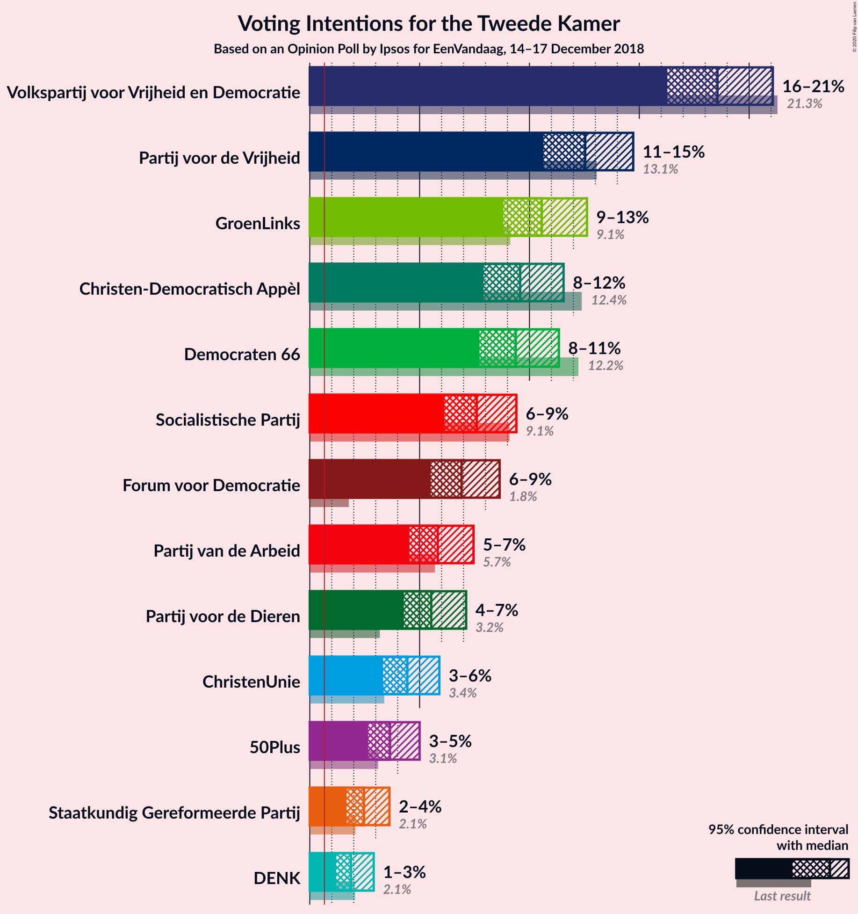

### Confidence Intervals

| Party | Last Result | Poll Result | 80% Confidence Interval | 90% Confidence Interval | 95% Confidence Interval | 99% Confidence Interval |
|:-----:|:-----------:|:-----------:|:-----------------------:|:-----------------------:|:-----------------------:|:-----------------------:|
| Volkspartij voor Vrijheid en Democratie | 21.3% | 18.6% | 17.1–20.2% |16.6–20.7% |16.3–21.1% |15.6–21.9% |
| Partij voor de Vrijheid | 13.1% | 12.5% | 11.3–14.0% |10.9–14.4% |10.6–14.7% |10.1–15.4% |
| GroenLinks | 9.1% | 10.6% | 9.4–11.9% |9.1–12.3% |8.8–12.6% |8.3–13.3% |
| Christen-Democratisch Appèl | 12.4% | 9.6% | 8.5–10.9% |8.2–11.2% |7.9–11.6% |7.4–12.2% |
| Democraten 66 | 12.2% | 9.4% | 8.3–10.7% |8.0–11.0% |7.7–11.3% |7.2–12.0% |
| Socialistische Partij | 9.1% | 7.6% | 6.6–8.8% |6.4–9.1% |6.1–9.4% |5.7–10.0% |
| Forum voor Democratie | 1.8% | 6.9% | 6.0–8.0% |5.7–8.4% |5.5–8.6% |5.1–9.2% |
| Partij van de Arbeid | 5.7% | 5.8% | 5.0–6.9% |4.7–7.2% |4.5–7.5% |4.2–8.0% |
| Partij voor de Dieren | 3.2% | 5.5% | 4.7–6.6% |4.5–6.9% |4.3–7.1% |3.9–7.7% |
| ChristenUnie | 3.4% | 4.4% | 3.7–5.4% |3.5–5.7% |3.3–5.9% |3.0–6.4% |
| 50Plus | 3.1% | 3.7% | 3.0–4.5% |2.8–4.8% |2.7–5.0% |2.4–5.5% |
| Staatkundig Gereformeerde Partij | 2.1% | 2.5% | 1.9–3.2% |1.8–3.4% |1.7–3.6% |1.4–4.0% |
| DENK | 2.1% | 1.9% | 1.4–2.6% |1.3–2.7% |1.2–2.9% |1.0–3.3% |

*Note:* The poll result column reflects the actual value used in the calculations. Published results may vary slightly, and in addition be rounded to fewer digits.

## Seats

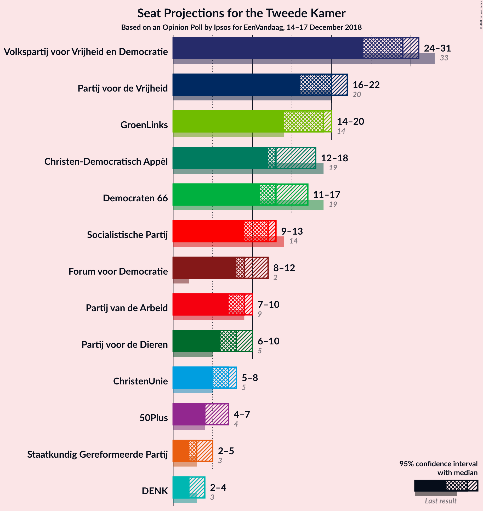

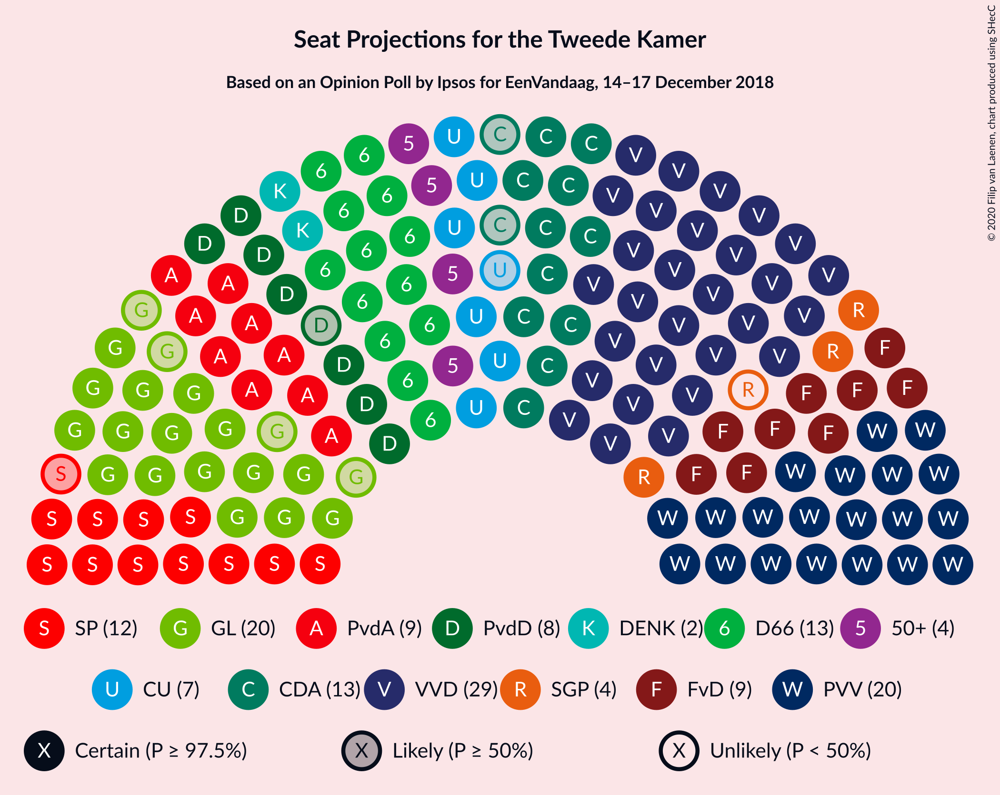

### Confidence Intervals

| Party | Last Result | Median | 80% Confidence Interval | 90% Confidence Interval | 95% Confidence Interval | 99% Confidence Interval |
|:-----:|:-----------:|:------:|:-----------------------:|:-----------------------:|:-----------------------:|:-----------------------:|
| <a href="#volkspartij-voor-vrijheid-en-democratie">Volkspartij voor Vrijheid en Democratie</a> | 33 | 29 | 29 |29–31 |29–31 |26–32 |
| <a href="#partij-voor-de-vrijheid">Partij voor de Vrijheid</a> | 20 | 20 | 20 |20 |20 |17–20 |
| <a href="#groenlinks">GroenLinks</a> | 14 | 20 | 20 |16–20 |16–20 |14–20 |
| <a href="#christen-democratisch-appèl">Christen-Democratisch Appèl</a> | 19 | 13 | 13 |13 |11–13 |11–17 |
| <a href="#democraten-66">Democraten 66</a> | 19 | 13 | 13 |13–14 |13–16 |12–16 |
| <a href="#socialistische-partij">Socialistische Partij</a> | 14 | 12 | 12 |11–12 |11–12 |10–12 |
| <a href="#forum-voor-democratie">Forum voor Democratie</a> | 2 | 9 | 9 |9 |9 |9–13 |
| <a href="#partij-van-de-arbeid">Partij van de Arbeid</a> | 9 | 9 | 9 |9 |9 |8–10 |
| <a href="#partij-voor-de-dieren">Partij voor de Dieren</a> | 5 | 8 | 8 |8 |7–8 |7–9 |
| <a href="#christenunie">ChristenUnie</a> | 5 | 7 | 7 |6–7 |6–7 |5–7 |
| <a href="#50plus">50Plus</a> | 4 | 4 | 4 |4–6 |4–7 |4–7 |
| <a href="#staatkundig-gereformeerde-partij">Staatkundig Gereformeerde Partij</a> | 3 | 3 | 3 |3–4 |3–4 |2–4 |
| <a href="#denk">DENK</a> | 3 | 2 | 2 |2 |2 |2–3 |

### Volkspartij voor Vrijheid en Democratie

*For a full overview of the results for this party, see the [Volkspartij voor Vrijheid en Democratie](party-volkspartijvoorvrijheidendemocratie.html) page.*

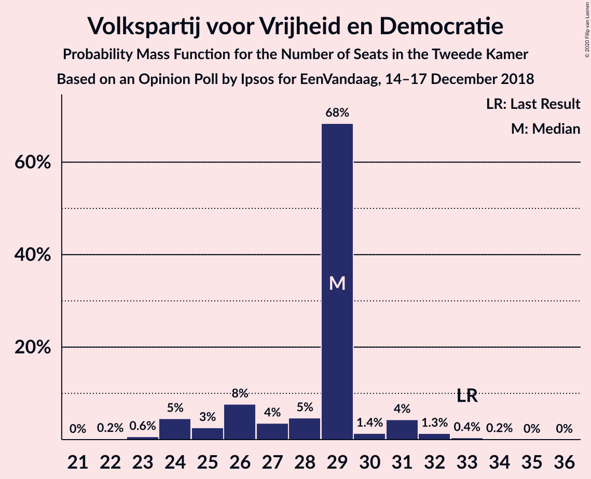

| Number of Seats | Probability | Accumulated | Special Marks |
|:---------------:|:-----------:|:-----------:|:-------------:|
| 23 | 0.1% | 100% |  |
| 24 | 0% | 99.9% |  |
| 25 | 0.1% | 99.9% |  |
| 26 | 0.4% | 99.8% |  |
| 27 | 0.4% | 99.5% |  |
| 28 | 0.1% | 99.0% |  |
| 29 | 93% | 98.9% | Median |
| 30 | 0.2% | 5% |  |
| 31 | 4% | 5% |  |
| 32 | 0.6% | 1.0% |  |
| 33 | 0% | 0.4% | Last Result |
| 34 | 0.4% | 0.4% |  |
| 35 | 0% | 0% |  |

### Partij voor de Vrijheid

*For a full overview of the results for this party, see the [Partij voor de Vrijheid](party-partijvoordevrijheid.html) page.*

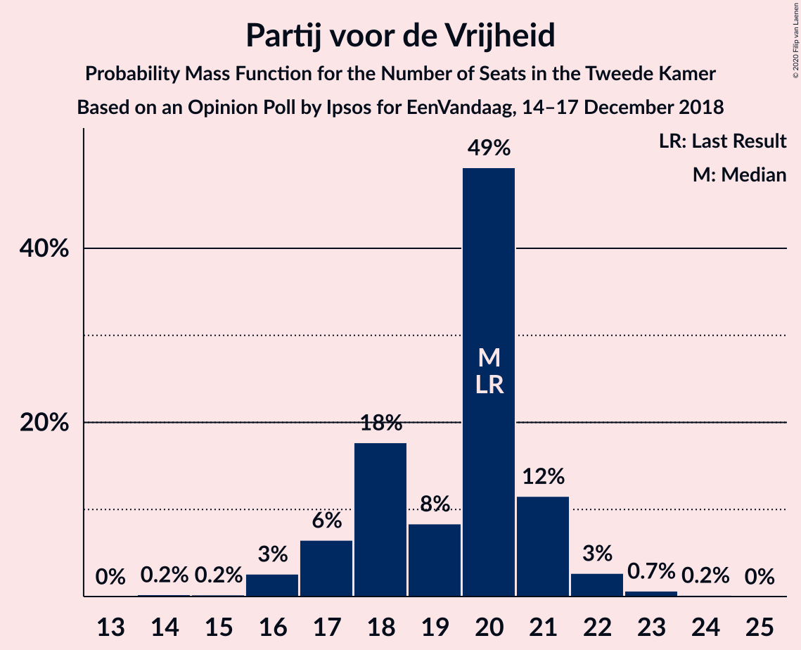

| Number of Seats | Probability | Accumulated | Special Marks |
|:---------------:|:-----------:|:-----------:|:-------------:|
| 16 | 0.2% | 100% |  |
| 17 | 0.5% | 99.7% |  |
| 18 | 0.5% | 99.2% |  |
| 19 | 0.2% | 98.8% |  |
| 20 | 98% | 98.5% | Last Result, Median |
| 21 | 0.2% | 0.4% |  |
| 22 | 0.1% | 0.2% |  |
| 23 | 0% | 0.1% |  |
| 24 | 0% | 0% |  |

### GroenLinks

*For a full overview of the results for this party, see the [GroenLinks](party-groenlinks.html) page.*

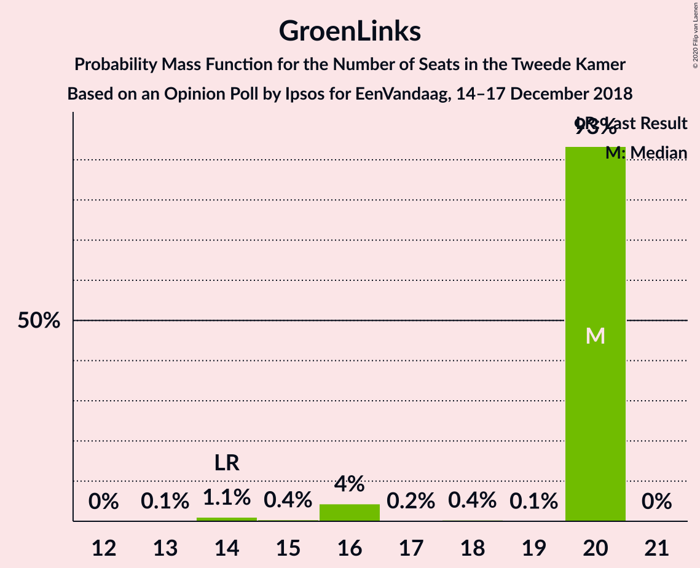

| Number of Seats | Probability | Accumulated | Special Marks |
|:---------------:|:-----------:|:-----------:|:-------------:|
| 13 | 0.1% | 100% |  |
| 14 | 1.1% | 99.8% | Last Result |
| 15 | 0.4% | 98.8% |  |
| 16 | 4% | 98% |  |
| 17 | 0.2% | 94% |  |
| 18 | 0.4% | 94% |  |
| 19 | 0.1% | 93% |  |
| 20 | 93% | 93% | Median |
| 21 | 0% | 0% |  |

### Christen-Democratisch Appèl

*For a full overview of the results for this party, see the [Christen-Democratisch Appèl](party-christen-democratischappèl.html) page.*

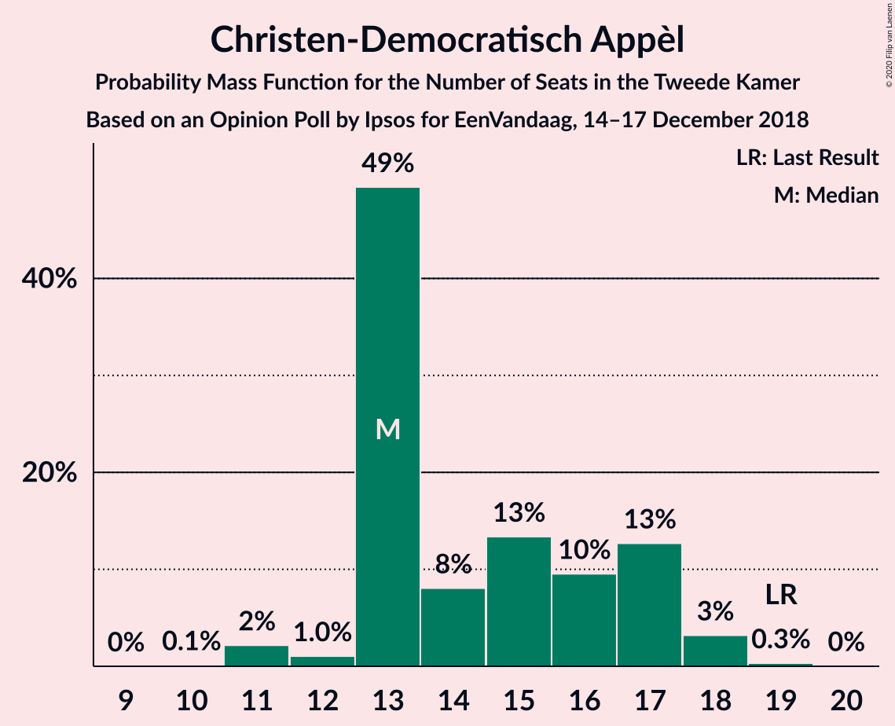

| Number of Seats | Probability | Accumulated | Special Marks |
|:---------------:|:-----------:|:-----------:|:-------------:|
| 10 | 0.1% | 100% |  |
| 11 | 4% | 99.9% |  |
| 12 | 0% | 96% |  |
| 13 | 94% | 96% | Median |
| 14 | 0.6% | 1.5% |  |
| 15 | 0.2% | 0.9% |  |
| 16 | 0.2% | 0.7% |  |
| 17 | 0.1% | 0.5% |  |
| 18 | 0.4% | 0.4% |  |
| 19 | 0% | 0.1% | Last Result |
| 20 | 0% | 0% |  |

### Democraten 66

*For a full overview of the results for this party, see the [Democraten 66](party-democraten66.html) page.*

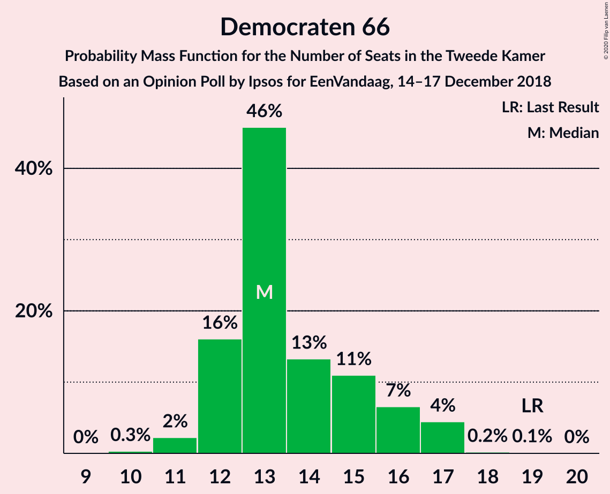

| Number of Seats | Probability | Accumulated | Special Marks |
|:---------------:|:-----------:|:-----------:|:-------------:|
| 11 | 0.3% | 100% |  |
| 12 | 0.8% | 99.7% |  |
| 13 | 93% | 99.0% | Median |
| 14 | 0.5% | 5% |  |
| 15 | 0.5% | 5% |  |
| 16 | 4% | 4% |  |
| 17 | 0.1% | 0.2% |  |
| 18 | 0.1% | 0.2% |  |
| 19 | 0% | 0.1% | Last Result |
| 20 | 0% | 0% |  |

### Socialistische Partij

*For a full overview of the results for this party, see the [Socialistische Partij](party-socialistischepartij.html) page.*

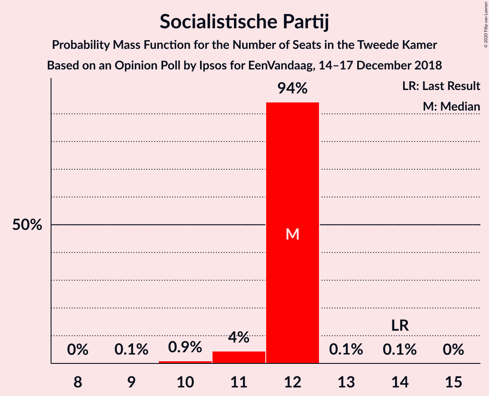

| Number of Seats | Probability | Accumulated | Special Marks |
|:---------------:|:-----------:|:-----------:|:-------------:|
| 9 | 0.1% | 100% |  |
| 10 | 0.9% | 99.9% |  |
| 11 | 4% | 98.9% |  |
| 12 | 94% | 94% | Median |
| 13 | 0.1% | 0.2% |  |
| 14 | 0.1% | 0.1% | Last Result |
| 15 | 0% | 0% |  |

### Forum voor Democratie

*For a full overview of the results for this party, see the [Forum voor Democratie](party-forumvoordemocratie.html) page.*

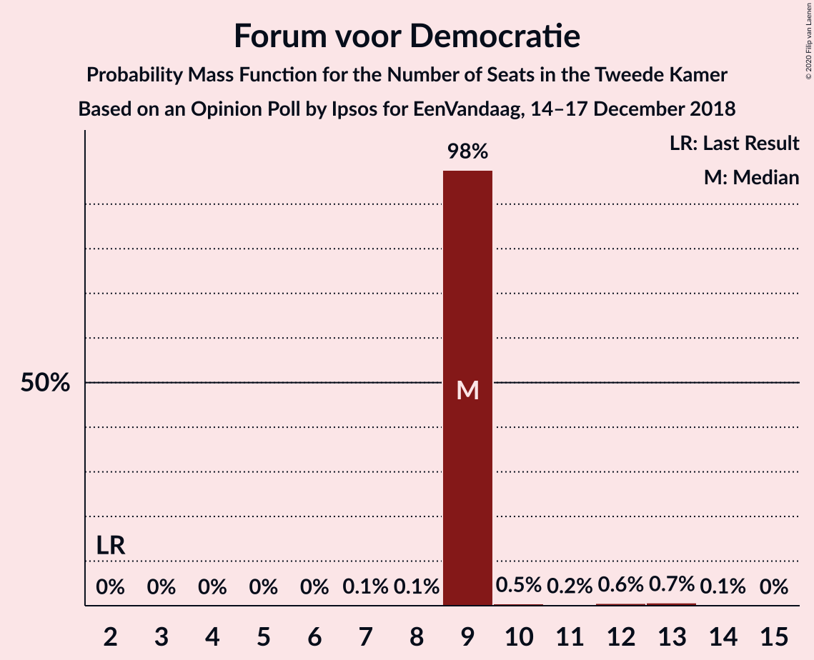

| Number of Seats | Probability | Accumulated | Special Marks |
|:---------------:|:-----------:|:-----------:|:-------------:|
| 2 | 0% | 100% | Last Result |
| 3 | 0% | 100% |  |
| 4 | 0% | 100% |  |
| 5 | 0% | 100% |  |
| 6 | 0% | 100% |  |
| 7 | 0.1% | 100% |  |
| 8 | 0.1% | 99.9% |  |
| 9 | 98% | 99.8% | Median |
| 10 | 0.5% | 2% |  |
| 11 | 0.2% | 2% |  |
| 12 | 0.6% | 1.4% |  |
| 13 | 0.7% | 0.9% |  |
| 14 | 0.1% | 0.2% |  |
| 15 | 0% | 0% |  |

### Partij van de Arbeid

*For a full overview of the results for this party, see the [Partij van de Arbeid](party-partijvandearbeid.html) page.*

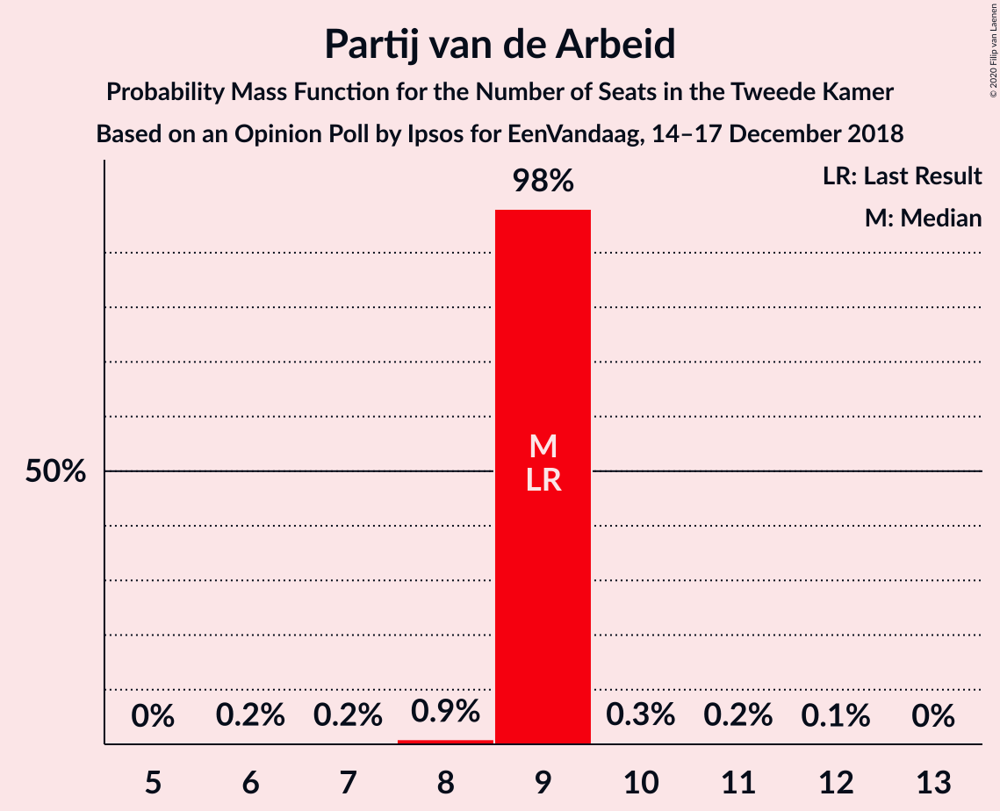

| Number of Seats | Probability | Accumulated | Special Marks |
|:---------------:|:-----------:|:-----------:|:-------------:|
| 6 | 0.2% | 100% |  |
| 7 | 0.2% | 99.8% |  |
| 8 | 0.9% | 99.6% |  |
| 9 | 98% | 98.7% | Last Result, Median |
| 10 | 0.3% | 0.6% |  |
| 11 | 0.2% | 0.3% |  |
| 12 | 0.1% | 0.1% |  |
| 13 | 0% | 0% |  |

### Partij voor de Dieren

*For a full overview of the results for this party, see the [Partij voor de Dieren](party-partijvoordedieren.html) page.*

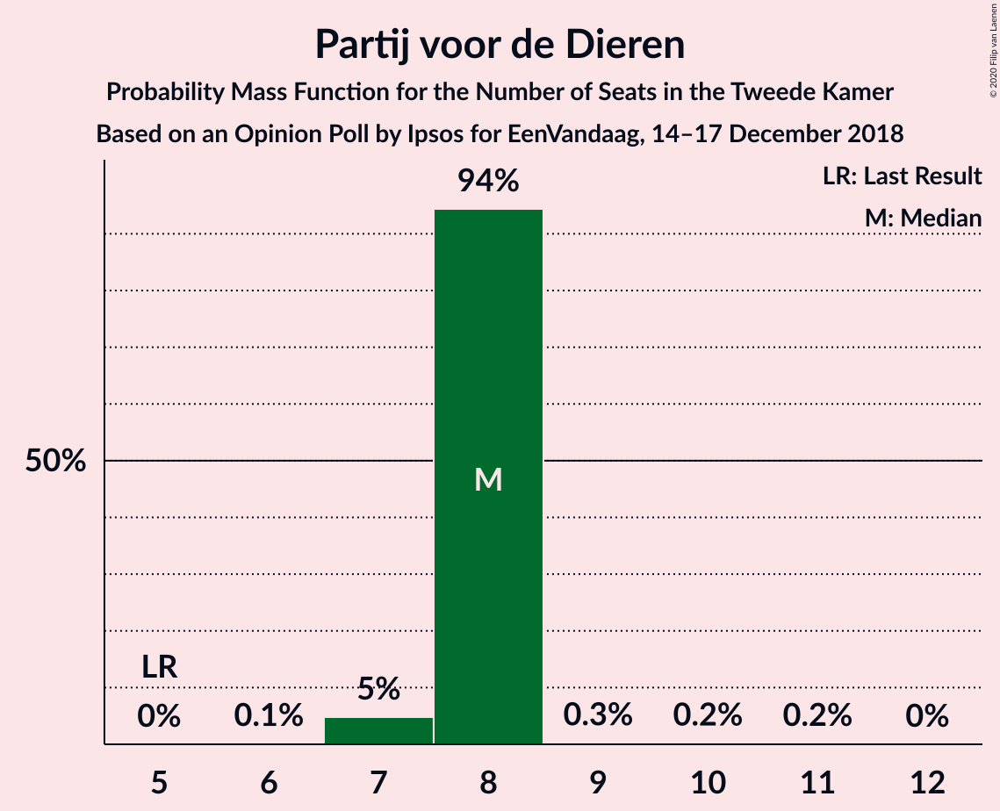

| Number of Seats | Probability | Accumulated | Special Marks |
|:---------------:|:-----------:|:-----------:|:-------------:|
| 5 | 0% | 100% | Last Result |
| 6 | 0.1% | 100% |  |
| 7 | 5% | 99.9% |  |
| 8 | 94% | 95% | Median |
| 9 | 0.3% | 0.7% |  |
| 10 | 0.2% | 0.4% |  |
| 11 | 0.2% | 0.2% |  |
| 12 | 0% | 0% |  |

### ChristenUnie

*For a full overview of the results for this party, see the [ChristenUnie](party-christenunie.html) page.*

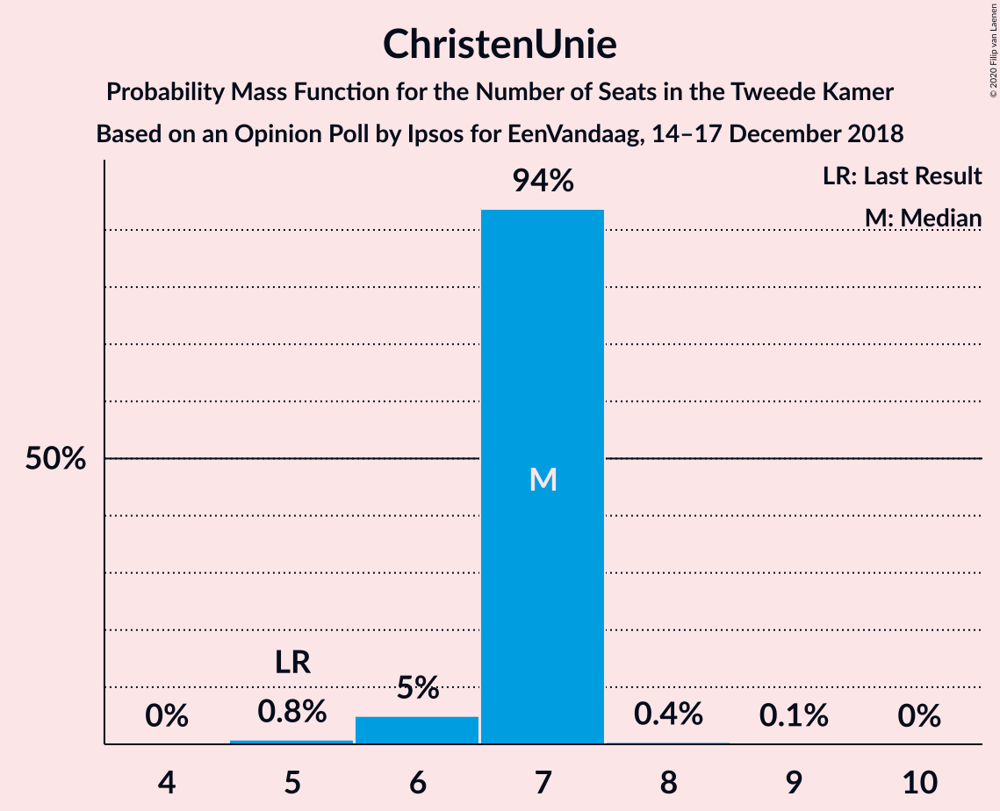

| Number of Seats | Probability | Accumulated | Special Marks |
|:---------------:|:-----------:|:-----------:|:-------------:|
| 5 | 0.8% | 100% | Last Result |
| 6 | 5% | 99.1% |  |
| 7 | 94% | 94% | Median |
| 8 | 0.4% | 0.5% |  |
| 9 | 0.1% | 0.1% |  |
| 10 | 0% | 0% |  |

### 50Plus

*For a full overview of the results for this party, see the [50Plus](party-50plus.html) page.*

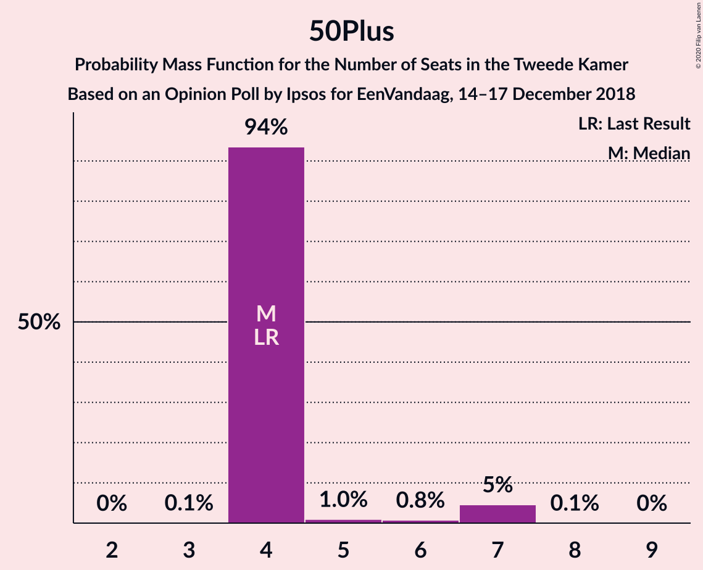

| Number of Seats | Probability | Accumulated | Special Marks |
|:---------------:|:-----------:|:-----------:|:-------------:|
| 3 | 0.1% | 100% |  |
| 4 | 94% | 99.9% | Last Result, Median |
| 5 | 1.0% | 6% |  |
| 6 | 0.8% | 5% |  |
| 7 | 5% | 5% |  |
| 8 | 0.1% | 0.1% |  |
| 9 | 0% | 0% |  |

### Staatkundig Gereformeerde Partij

*For a full overview of the results for this party, see the [Staatkundig Gereformeerde Partij](party-staatkundiggereformeerdepartij.html) page.*

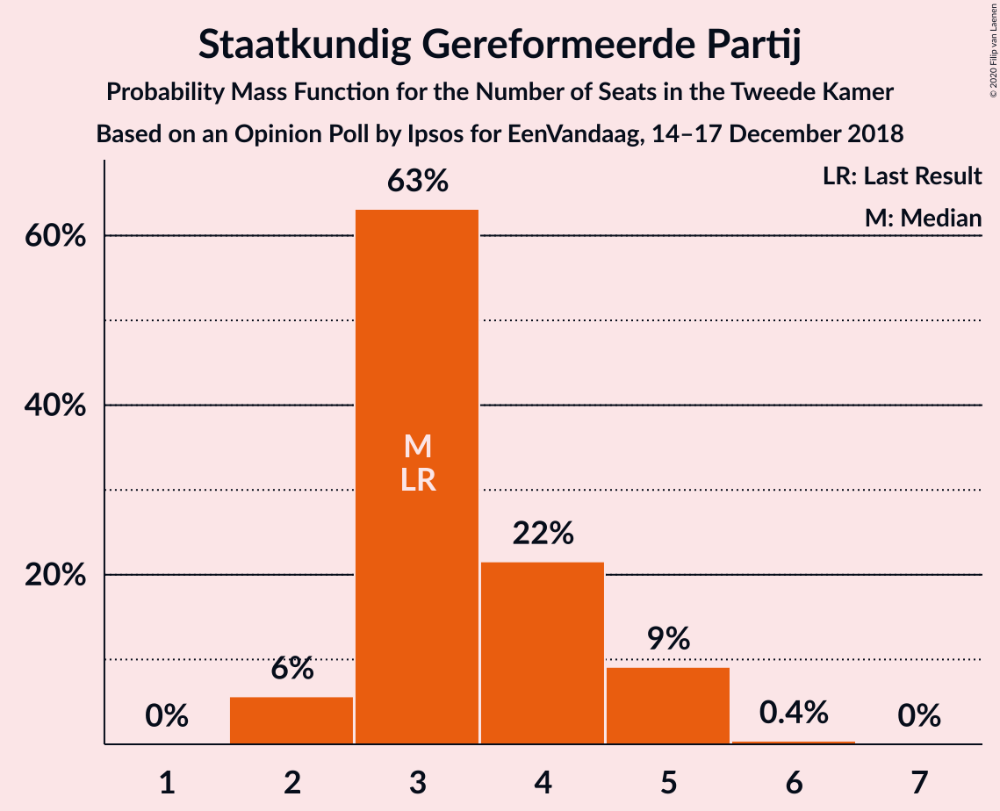

| Number of Seats | Probability | Accumulated | Special Marks |
|:---------------:|:-----------:|:-----------:|:-------------:|
| 1 | 0.1% | 100% |  |
| 2 | 0.8% | 99.9% |  |
| 3 | 94% | 99.1% | Last Result, Median |
| 4 | 5% | 5% |  |
| 5 | 0.1% | 0.2% |  |
| 6 | 0% | 0% |  |

### DENK

*For a full overview of the results for this party, see the [DENK](party-denk.html) page.*

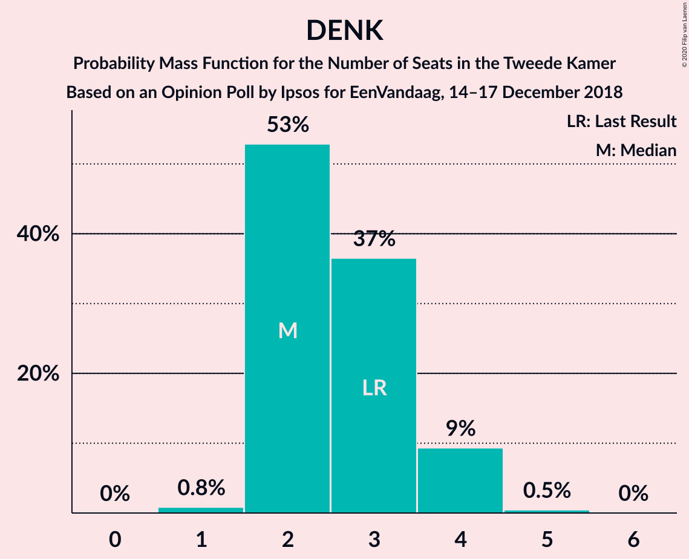

| Number of Seats | Probability | Accumulated | Special Marks |
|:---------------:|:-----------:|:-----------:|:-------------:|
| 1 | 0.1% | 100% |  |
| 2 | 98.9% | 99.9% | Median |
| 3 | 0.8% | 1.0% | Last Result |
| 4 | 0.2% | 0.3% |  |
| 5 | 0% | 0% |  |

## Coalitions

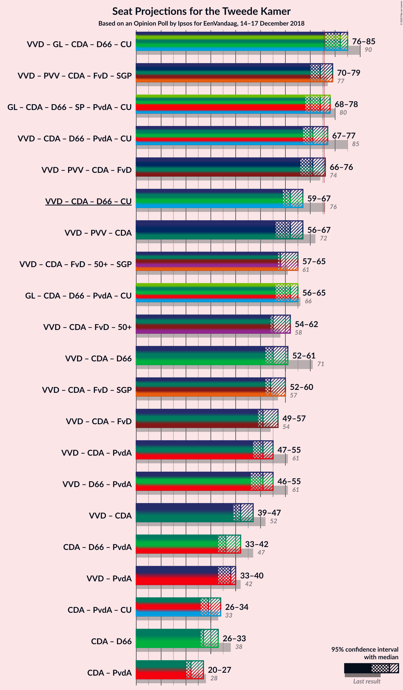

### Confidence Intervals

| Coalition | Last Result | Median | Majority? | 80% Confidence Interval | 90% Confidence Interval | 95% Confidence Interval | 99% Confidence Interval |
|:---------:|:-----------:|:------:|:---------:|:-----------------------:|:-----------------------:|:-----------------------:|:-----------------------:|
| Volkspartij voor Vrijheid en Democratie – GroenLinks – Christen-Democratisch Appèl – Democraten 66 – ChristenUnie | 90 | 82 | 99.8% | 82 | 80–82 | 80–82 | 76–83 |
| Volkspartij voor Vrijheid en Democratie – Partij voor de Vrijheid – Christen-Democratisch Appèl – Forum voor Democratie – Staatkundig Gereformeerde Partij | 77 | 74 | 1.5% | 74 | 74–75 | 74–75 | 74–82 |
| GroenLinks – Christen-Democratisch Appèl – Democraten 66 – Socialistische Partij – Partij van de Arbeid – ChristenUnie | 80 | 74 | 0.2% | 74 | 69–74 | 69–74 | 64–74 |
| Volkspartij voor Vrijheid en Democratie – Christen-Democratisch Appèl – Democraten 66 – Partij van de Arbeid – ChristenUnie | 85 | 71 | 0.6% | 71 | 71–73 | 71–73 | 70–77 |
| Volkspartij voor Vrijheid en Democratie – Partij voor de Vrijheid – Christen-Democratisch Appèl – Forum voor Democratie | 74 | 71 | 1.1% | 71 | 71 | 71 | 71–78 |
| Volkspartij voor Vrijheid en Democratie – Christen-Democratisch Appèl – Democraten 66 – ChristenUnie | 76 | 62 | 0% | 62 | 62–64 | 62–64 | 62–69 |
| Volkspartij voor Vrijheid en Democratie – Partij voor de Vrijheid – Christen-Democratisch Appèl | 72 | 62 | 0% | 62 | 62 | 62 | 60–65 |
| Volkspartij voor Vrijheid en Democratie – Christen-Democratisch Appèl – Forum voor Democratie – 50Plus – Staatkundig Gereformeerde Partij | 61 | 58 | 0% | 58 | 58–62 | 58–62 | 58–67 |
| GroenLinks – Christen-Democratisch Appèl – Democraten 66 – Partij van de Arbeid – ChristenUnie | 66 | 62 | 0% | 62 | 58–62 | 58–62 | 52–64 |
| Volkspartij voor Vrijheid en Democratie – Christen-Democratisch Appèl – Forum voor Democratie – 50Plus | 58 | 55 | 0% | 55 | 55–58 | 55–58 | 55–63 |
| Volkspartij voor Vrijheid en Democratie – Christen-Democratisch Appèl – Democraten 66 | 71 | 55 | 0% | 55 | 55–58 | 55–58 | 55–62 |
| Volkspartij voor Vrijheid en Democratie – Democraten 66 – Partij van de Arbeid | 61 | 51 | 0% | 51 | 51–52 | 51–56 | 48–56 |
| Volkspartij voor Vrijheid en Democratie – Christen-Democratisch Appèl – Forum voor Democratie – Staatkundig Gereformeerde Partij | 57 | 54 | 0% | 54 | 54–55 | 54–55 | 54–62 |
| Volkspartij voor Vrijheid en Democratie – Christen-Democratisch Appèl – Forum voor Democratie | 54 | 51 | 0% | 51 | 51 | 51 | 51–58 |
| Volkspartij voor Vrijheid en Democratie – Christen-Democratisch Appèl – Partij van de Arbeid | 61 | 51 | 0% | 51 | 51 | 51 | 49–55 |
| Volkspartij voor Vrijheid en Democratie – Christen-Democratisch Appèl | 52 | 42 | 0% | 42 | 42 | 42 | 41–47 |
| Volkspartij voor Vrijheid en Democratie – Partij van de Arbeid | 42 | 38 | 0% | 38 | 38–40 | 38–40 | 35–41 |
| Christen-Democratisch Appèl – Democraten 66 – Partij van de Arbeid | 47 | 35 | 0% | 35 | 35–36 | 35–36 | 33–39 |
| Christen-Democratisch Appèl – Partij van de Arbeid – ChristenUnie | 33 | 29 | 0% | 29 | 27–29 | 26–29 | 26–33 |
| Christen-Democratisch Appèl – Democraten 66 | 38 | 26 | 0% | 26 | 26–27 | 26–27 | 25–30 |
| Christen-Democratisch Appèl – Partij van de Arbeid | 28 | 22 | 0% | 22 | 21–22 | 20–22 | 20–26 |

### Volkspartij voor Vrijheid en Democratie – GroenLinks – Christen-Democratisch Appèl – Democraten 66 – ChristenUnie

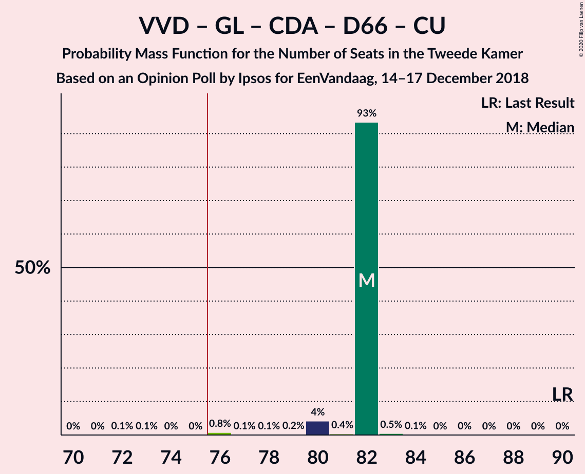

| Number of Seats | Probability | Accumulated | Special Marks |
|:---------------:|:-----------:|:-----------:|:-------------:|
| 72 | 0.1% | 100% |  |
| 73 | 0.1% | 99.9% |  |
| 74 | 0% | 99.9% |  |
| 75 | 0% | 99.8% |  |
| 76 | 0.8% | 99.8% | Majority |
| 77 | 0.1% | 99.0% |  |
| 78 | 0.1% | 98.9% |  |
| 79 | 0.2% | 98.9% |  |
| 80 | 4% | 98.7% |  |
| 81 | 0.4% | 95% |  |
| 82 | 93% | 94% | Median |
| 83 | 0.5% | 0.7% |  |
| 84 | 0.1% | 0.2% |  |
| 85 | 0% | 0.1% |  |
| 86 | 0% | 0.1% |  |
| 87 | 0% | 0% |  |
| 88 | 0% | 0% |  |
| 89 | 0% | 0% |  |
| 90 | 0% | 0% | Last Result |

### Volkspartij voor Vrijheid en Democratie – Partij voor de Vrijheid – Christen-Democratisch Appèl – Forum voor Democratie – Staatkundig Gereformeerde Partij

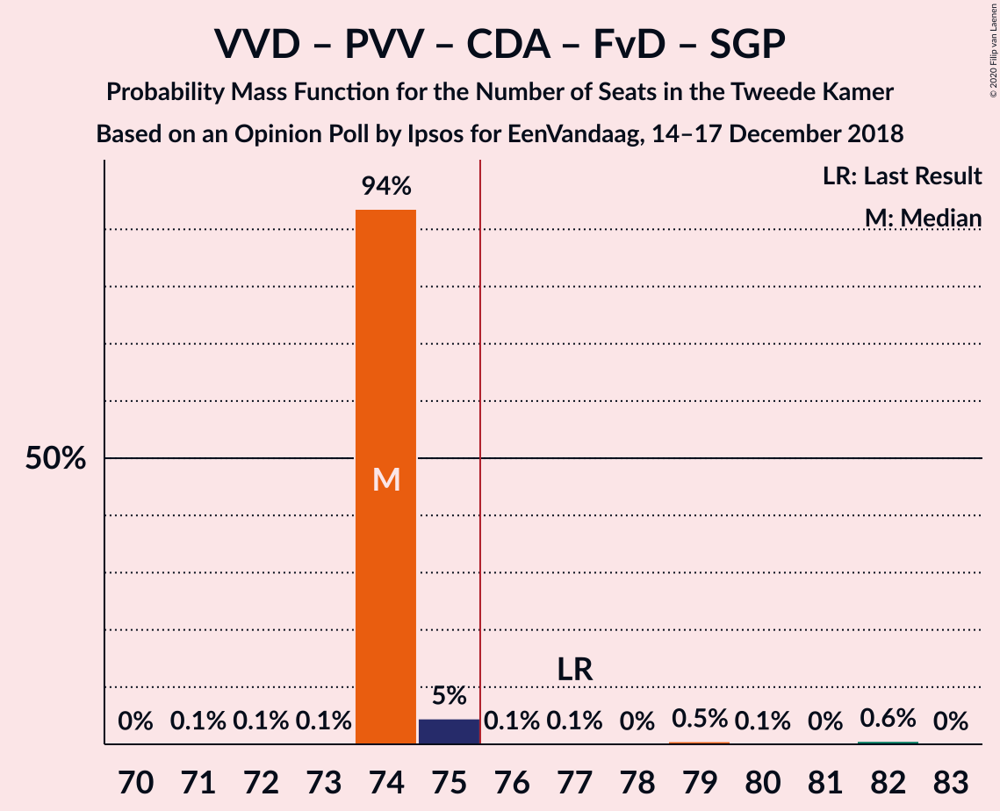

| Number of Seats | Probability | Accumulated | Special Marks |
|:---------------:|:-----------:|:-----------:|:-------------:|
| 70 | 0% | 100% |  |
| 71 | 0.1% | 99.9% |  |
| 72 | 0.1% | 99.8% |  |
| 73 | 0.1% | 99.7% |  |
| 74 | 94% | 99.6% | Median |
| 75 | 5% | 6% |  |
| 76 | 0.1% | 1.5% | Majority |
| 77 | 0.1% | 1.4% | Last Result |
| 78 | 0% | 1.2% |  |
| 79 | 0.5% | 1.2% |  |
| 80 | 0.1% | 0.7% |  |
| 81 | 0% | 0.6% |  |
| 82 | 0.6% | 0.6% |  |
| 83 | 0% | 0% |  |

### GroenLinks – Christen-Democratisch Appèl – Democraten 66 – Socialistische Partij – Partij van de Arbeid – ChristenUnie

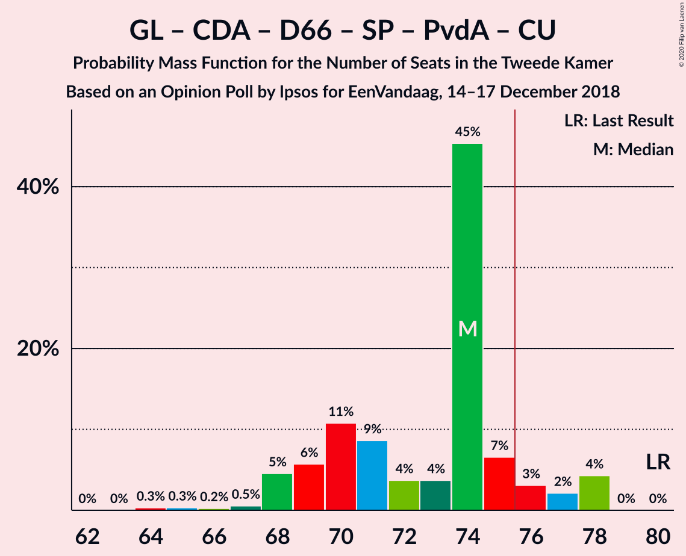

| Number of Seats | Probability | Accumulated | Special Marks |
|:---------------:|:-----------:|:-----------:|:-------------:|
| 64 | 0.6% | 100% |  |
| 65 | 0% | 99.4% |  |
| 66 | 0% | 99.4% |  |
| 67 | 0% | 99.3% |  |
| 68 | 0.5% | 99.3% |  |
| 69 | 4% | 98.8% |  |
| 70 | 0.1% | 94% |  |
| 71 | 0.1% | 94% |  |
| 72 | 0% | 94% |  |
| 73 | 0.1% | 94% |  |
| 74 | 94% | 94% | Median |
| 75 | 0.1% | 0.3% |  |
| 76 | 0.1% | 0.2% | Majority |
| 77 | 0% | 0.1% |  |
| 78 | 0.1% | 0.1% |  |
| 79 | 0% | 0% |  |
| 80 | 0% | 0% | Last Result |

### Volkspartij voor Vrijheid en Democratie – Christen-Democratisch Appèl – Democraten 66 – Partij van de Arbeid – ChristenUnie

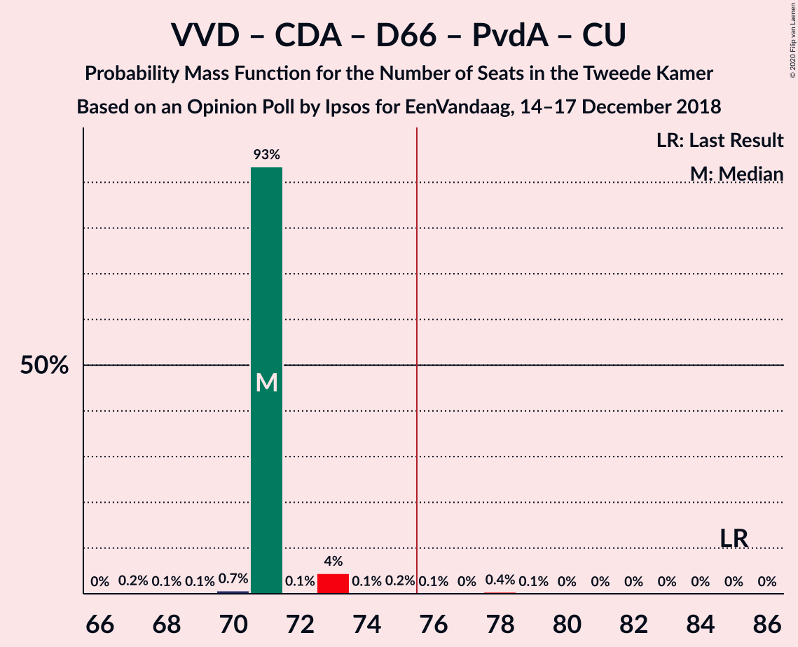

| Number of Seats | Probability | Accumulated | Special Marks |
|:---------------:|:-----------:|:-----------:|:-------------:|
| 67 | 0.2% | 100% |  |
| 68 | 0.1% | 99.7% |  |
| 69 | 0.1% | 99.7% |  |
| 70 | 0.7% | 99.6% |  |
| 71 | 93% | 98.9% | Median |
| 72 | 0.1% | 5% |  |
| 73 | 4% | 5% |  |
| 74 | 0.1% | 0.9% |  |
| 75 | 0.2% | 0.8% |  |
| 76 | 0.1% | 0.6% | Majority |
| 77 | 0% | 0.5% |  |
| 78 | 0.4% | 0.5% |  |
| 79 | 0.1% | 0.1% |  |
| 80 | 0% | 0% |  |
| 81 | 0% | 0% |  |
| 82 | 0% | 0% |  |
| 83 | 0% | 0% |  |
| 84 | 0% | 0% |  |
| 85 | 0% | 0% | Last Result |

### Volkspartij voor Vrijheid en Democratie – Partij voor de Vrijheid – Christen-Democratisch Appèl – Forum voor Democratie

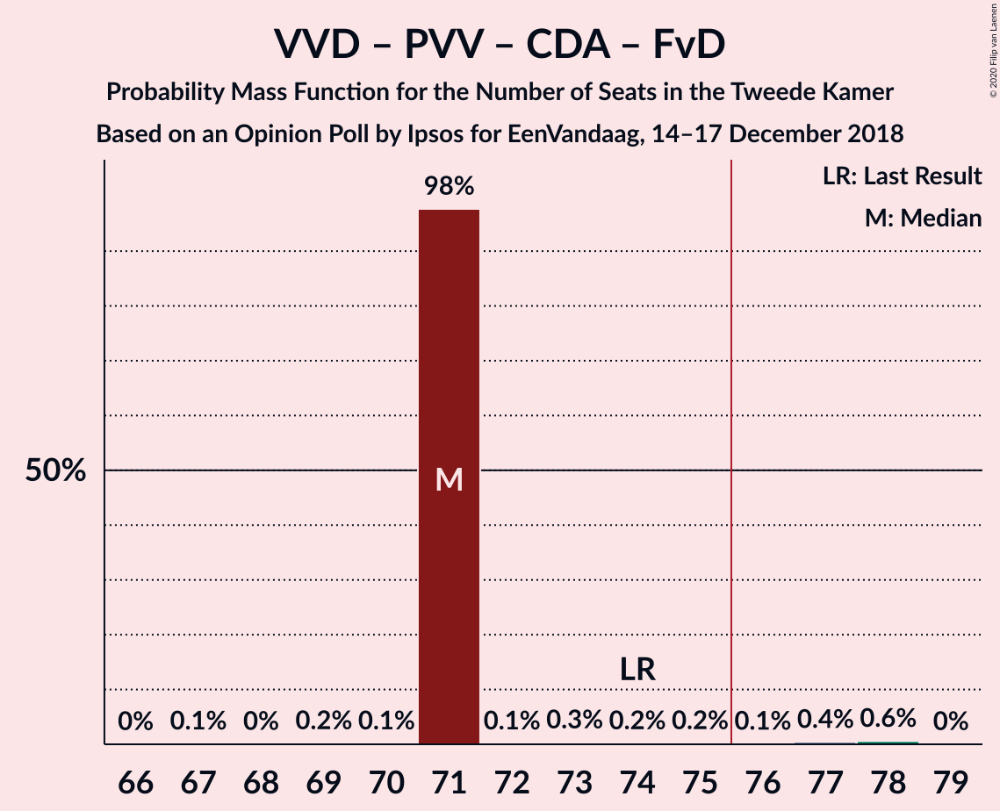

| Number of Seats | Probability | Accumulated | Special Marks |
|:---------------:|:-----------:|:-----------:|:-------------:|
| 67 | 0.1% | 100% |  |
| 68 | 0% | 99.9% |  |
| 69 | 0.2% | 99.8% |  |
| 70 | 0.1% | 99.7% |  |
| 71 | 98% | 99.5% | Median |
| 72 | 0.1% | 2% |  |
| 73 | 0.3% | 2% |  |
| 74 | 0.2% | 1.4% | Last Result |
| 75 | 0.2% | 1.2% |  |
| 76 | 0.1% | 1.1% | Majority |
| 77 | 0.4% | 1.0% |  |
| 78 | 0.6% | 0.6% |  |
| 79 | 0% | 0% |  |

### Volkspartij voor Vrijheid en Democratie – Christen-Democratisch Appèl – Democraten 66 – ChristenUnie

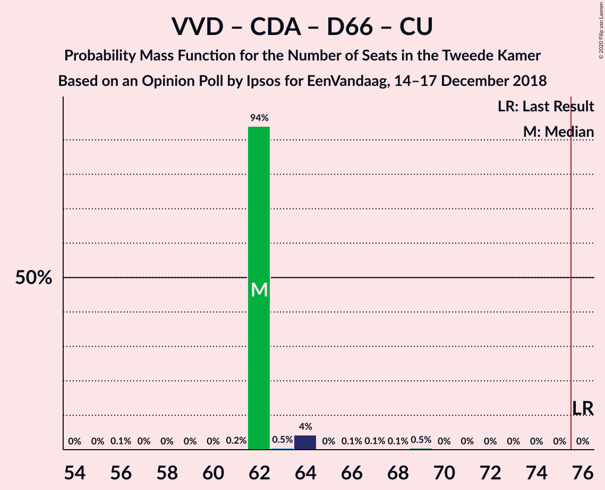

| Number of Seats | Probability | Accumulated | Special Marks |
|:---------------:|:-----------:|:-----------:|:-------------:|
| 56 | 0.1% | 100% |  |
| 57 | 0% | 99.9% |  |
| 58 | 0% | 99.9% |  |
| 59 | 0% | 99.8% |  |
| 60 | 0% | 99.8% |  |
| 61 | 0.2% | 99.8% |  |
| 62 | 94% | 99.6% | Median |
| 63 | 0.5% | 6% |  |
| 64 | 4% | 5% |  |
| 65 | 0% | 0.8% |  |
| 66 | 0.1% | 0.8% |  |
| 67 | 0.1% | 0.7% |  |
| 68 | 0.1% | 0.6% |  |
| 69 | 0.5% | 0.5% |  |
| 70 | 0% | 0.1% |  |
| 71 | 0% | 0% |  |
| 72 | 0% | 0% |  |
| 73 | 0% | 0% |  |
| 74 | 0% | 0% |  |
| 75 | 0% | 0% |  |
| 76 | 0% | 0% | Last Result, Majority |

### Volkspartij voor Vrijheid en Democratie – Partij voor de Vrijheid – Christen-Democratisch Appèl

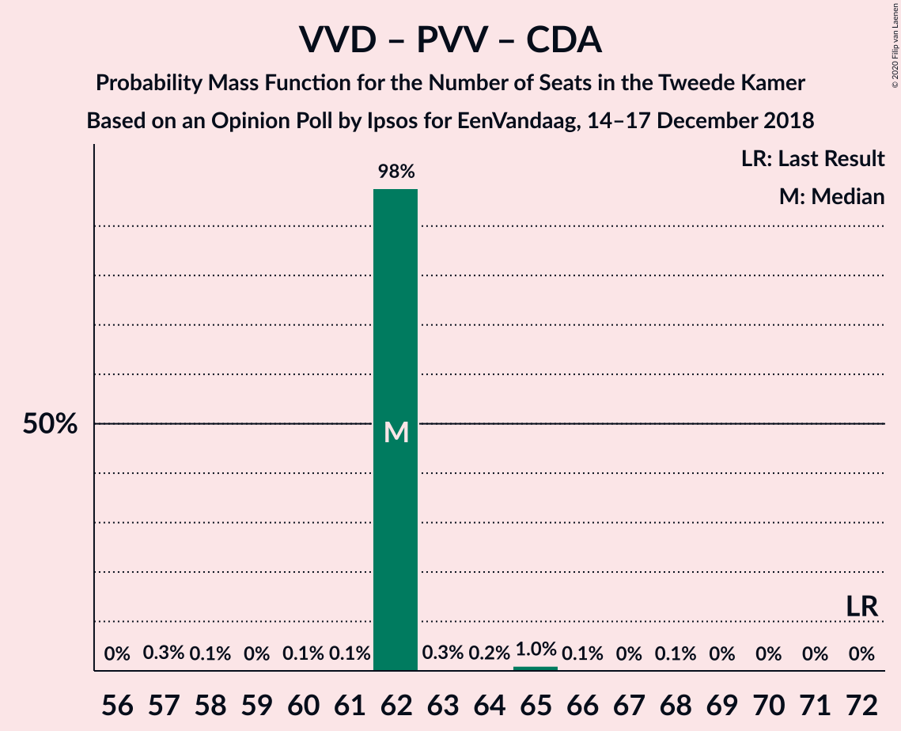

| Number of Seats | Probability | Accumulated | Special Marks |
|:---------------:|:-----------:|:-----------:|:-------------:|
| 56 | 0% | 100% |  |
| 57 | 0.3% | 99.9% |  |
| 58 | 0.1% | 99.6% |  |
| 59 | 0% | 99.6% |  |
| 60 | 0.1% | 99.5% |  |
| 61 | 0.1% | 99.4% |  |
| 62 | 98% | 99.3% | Median |
| 63 | 0.3% | 2% |  |
| 64 | 0.2% | 1.4% |  |
| 65 | 1.0% | 1.2% |  |
| 66 | 0.1% | 0.2% |  |
| 67 | 0% | 0.1% |  |
| 68 | 0.1% | 0.1% |  |
| 69 | 0% | 0% |  |
| 70 | 0% | 0% |  |
| 71 | 0% | 0% |  |
| 72 | 0% | 0% | Last Result |

### Volkspartij voor Vrijheid en Democratie – Christen-Democratisch Appèl – Forum voor Democratie – 50Plus – Staatkundig Gereformeerde Partij

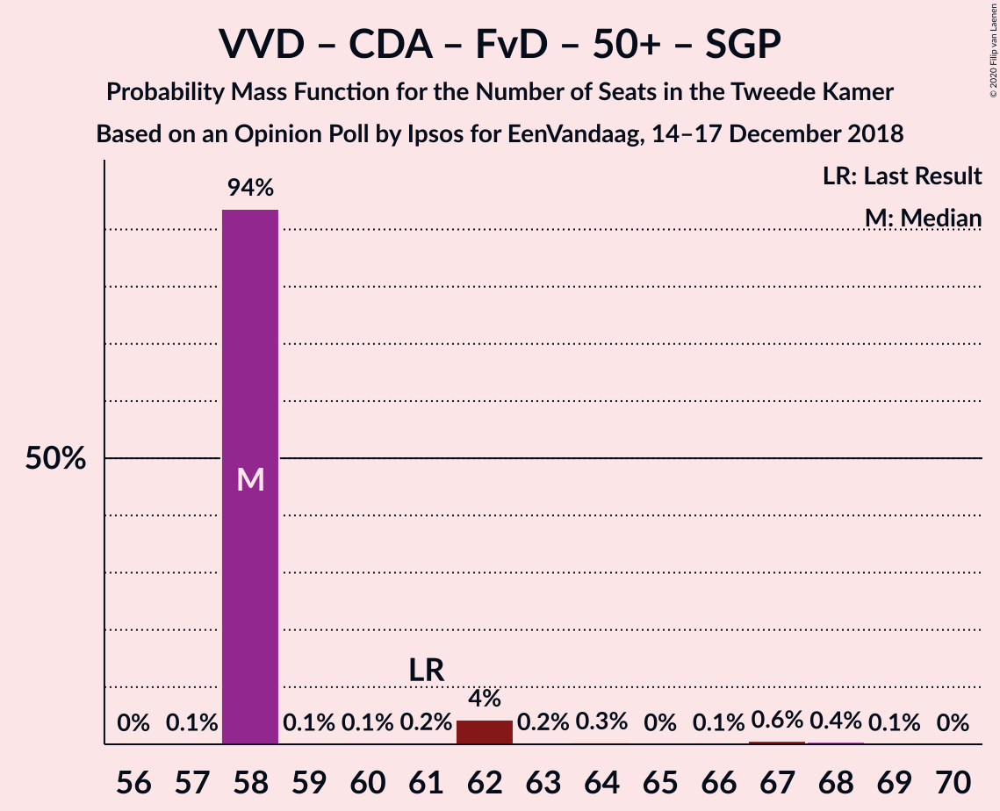

| Number of Seats | Probability | Accumulated | Special Marks |
|:---------------:|:-----------:|:-----------:|:-------------:|
| 57 | 0.1% | 100% |  |
| 58 | 94% | 99.9% | Median |
| 59 | 0.1% | 6% |  |
| 60 | 0.1% | 6% |  |
| 61 | 0.2% | 6% | Last Result |
| 62 | 4% | 6% |  |
| 63 | 0.2% | 2% |  |
| 64 | 0.3% | 2% |  |
| 65 | 0% | 1.2% |  |
| 66 | 0.1% | 1.2% |  |
| 67 | 0.6% | 1.1% |  |
| 68 | 0.4% | 0.5% |  |
| 69 | 0.1% | 0.1% |  |
| 70 | 0% | 0% |  |

### GroenLinks – Christen-Democratisch Appèl – Democraten 66 – Partij van de Arbeid – ChristenUnie

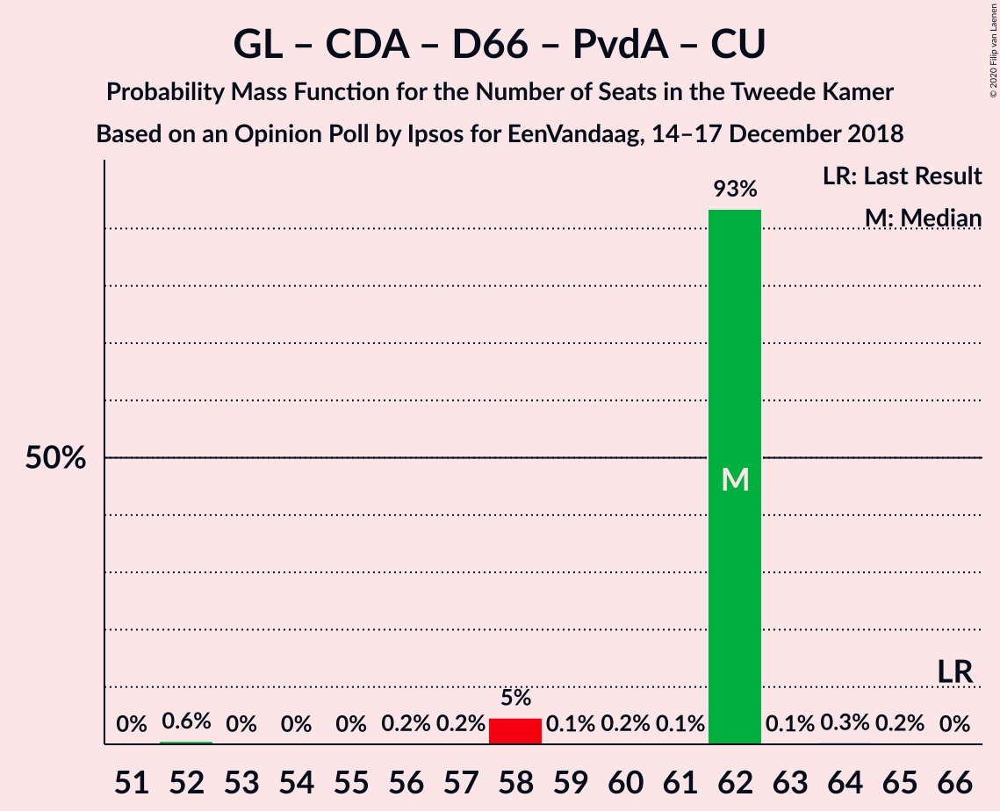

| Number of Seats | Probability | Accumulated | Special Marks |
|:---------------:|:-----------:|:-----------:|:-------------:|
| 52 | 0.6% | 100% |  |
| 53 | 0% | 99.4% |  |
| 54 | 0% | 99.4% |  |
| 55 | 0% | 99.4% |  |
| 56 | 0.2% | 99.3% |  |
| 57 | 0.2% | 99.2% |  |
| 58 | 5% | 99.0% |  |
| 59 | 0.1% | 94% |  |
| 60 | 0.2% | 94% |  |
| 61 | 0.1% | 94% |  |
| 62 | 93% | 94% | Median |
| 63 | 0.1% | 0.7% |  |
| 64 | 0.3% | 0.6% |  |
| 65 | 0.2% | 0.2% |  |
| 66 | 0% | 0% | Last Result |

### Volkspartij voor Vrijheid en Democratie – Christen-Democratisch Appèl – Forum voor Democratie – 50Plus

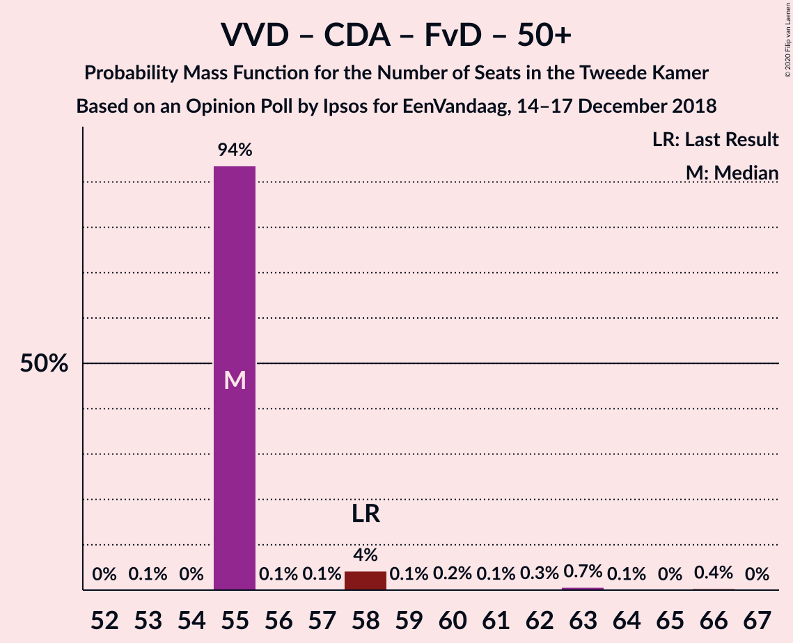

| Number of Seats | Probability | Accumulated | Special Marks |
|:---------------:|:-----------:|:-----------:|:-------------:|
| 53 | 0.1% | 100% |  |
| 54 | 0% | 99.9% |  |
| 55 | 94% | 99.9% | Median |
| 56 | 0.1% | 6% |  |
| 57 | 0.1% | 6% |  |
| 58 | 4% | 6% | Last Result |
| 59 | 0.1% | 2% |  |
| 60 | 0.2% | 2% |  |
| 61 | 0.1% | 2% |  |
| 62 | 0.3% | 1.4% |  |
| 63 | 0.7% | 1.1% |  |
| 64 | 0.1% | 0.5% |  |
| 65 | 0% | 0.4% |  |
| 66 | 0.4% | 0.4% |  |
| 67 | 0% | 0% |  |

### Volkspartij voor Vrijheid en Democratie – Christen-Democratisch Appèl – Democraten 66

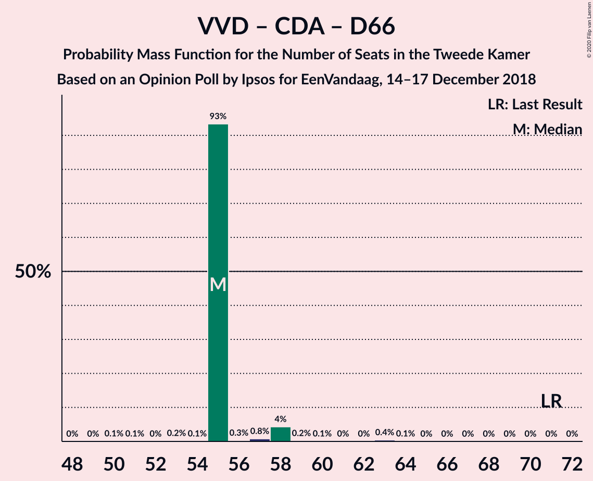

| Number of Seats | Probability | Accumulated | Special Marks |
|:---------------:|:-----------:|:-----------:|:-------------:|
| 50 | 0.1% | 100% |  |
| 51 | 0.1% | 99.9% |  |
| 52 | 0% | 99.9% |  |
| 53 | 0.2% | 99.8% |  |
| 54 | 0.1% | 99.6% |  |
| 55 | 93% | 99.6% | Median |
| 56 | 0.3% | 6% |  |
| 57 | 0.8% | 6% |  |
| 58 | 4% | 5% |  |
| 59 | 0.2% | 0.8% |  |
| 60 | 0.1% | 0.6% |  |
| 61 | 0% | 0.6% |  |
| 62 | 0% | 0.5% |  |
| 63 | 0.4% | 0.5% |  |
| 64 | 0.1% | 0.1% |  |
| 65 | 0% | 0% |  |
| 66 | 0% | 0% |  |
| 67 | 0% | 0% |  |
| 68 | 0% | 0% |  |
| 69 | 0% | 0% |  |
| 70 | 0% | 0% |  |
| 71 | 0% | 0% | Last Result |

### Volkspartij voor Vrijheid en Democratie – Democraten 66 – Partij van de Arbeid

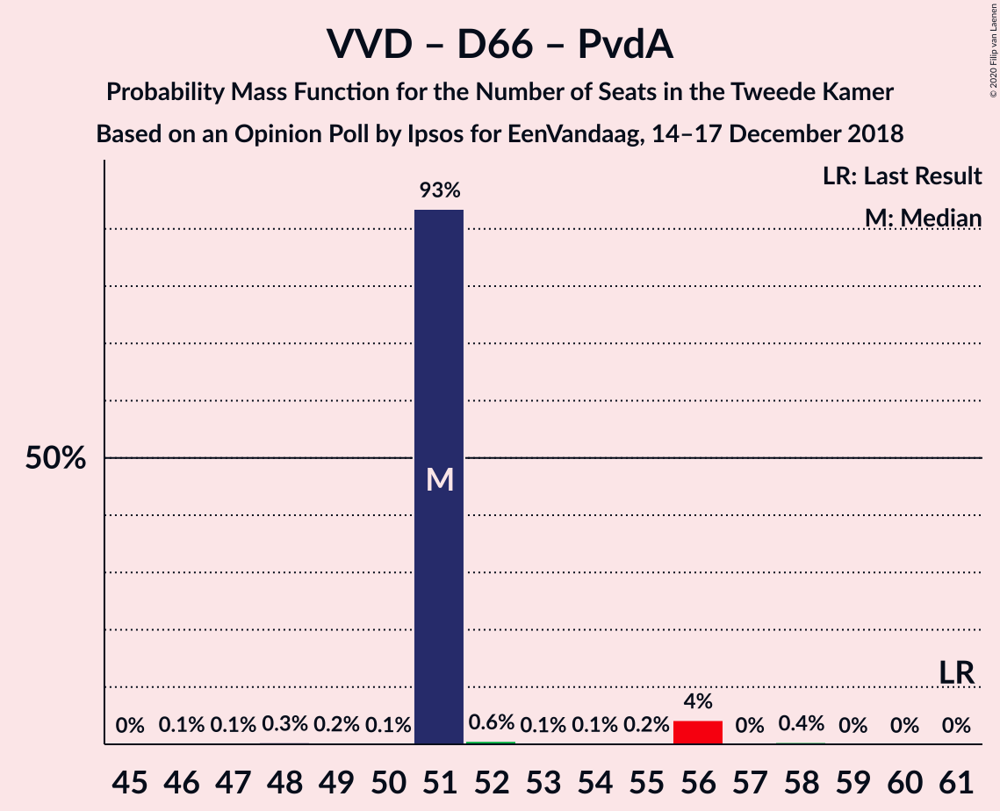

| Number of Seats | Probability | Accumulated | Special Marks |
|:---------------:|:-----------:|:-----------:|:-------------:|
| 46 | 0.1% | 100% |  |
| 47 | 0.1% | 99.8% |  |
| 48 | 0.3% | 99.7% |  |
| 49 | 0.2% | 99.4% |  |
| 50 | 0.1% | 99.1% |  |
| 51 | 93% | 99.1% | Median |
| 52 | 0.6% | 6% |  |
| 53 | 0.1% | 5% |  |
| 54 | 0.1% | 5% |  |
| 55 | 0.2% | 5% |  |
| 56 | 4% | 5% |  |
| 57 | 0% | 0.4% |  |
| 58 | 0.4% | 0.4% |  |
| 59 | 0% | 0% |  |
| 60 | 0% | 0% |  |
| 61 | 0% | 0% | Last Result |

### Volkspartij voor Vrijheid en Democratie – Christen-Democratisch Appèl – Forum voor Democratie – Staatkundig Gereformeerde Partij

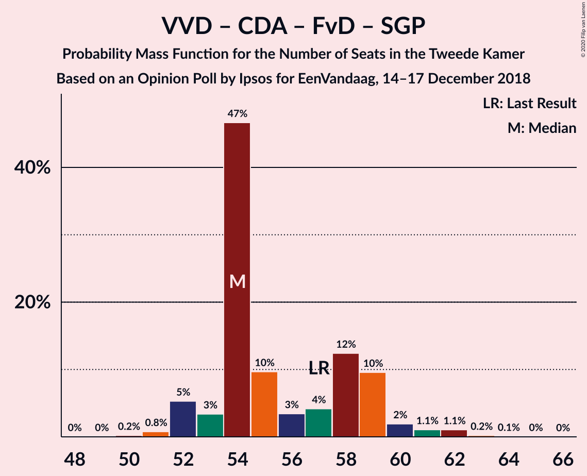

| Number of Seats | Probability | Accumulated | Special Marks |
|:---------------:|:-----------:|:-----------:|:-------------:|
| 52 | 0.1% | 100% |  |
| 53 | 0.2% | 99.9% |  |
| 54 | 93% | 99.7% | Median |
| 55 | 4% | 6% |  |
| 56 | 0.2% | 2% |  |
| 57 | 0.4% | 2% | Last Result |
| 58 | 0.1% | 1.3% |  |
| 59 | 0% | 1.2% |  |
| 60 | 0% | 1.1% |  |
| 61 | 0% | 1.1% |  |
| 62 | 1.0% | 1.1% |  |
| 63 | 0.1% | 0.1% |  |
| 64 | 0.1% | 0.1% |  |
| 65 | 0% | 0% |  |

### Volkspartij voor Vrijheid en Democratie – Christen-Democratisch Appèl – Forum voor Democratie

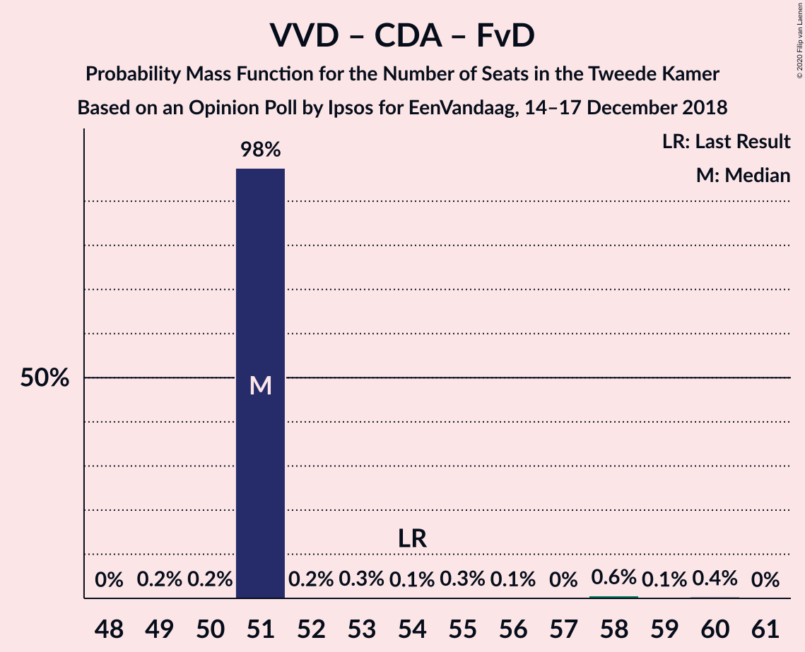

| Number of Seats | Probability | Accumulated | Special Marks |
|:---------------:|:-----------:|:-----------:|:-------------:|
| 49 | 0.2% | 100% |  |
| 50 | 0.2% | 99.8% |  |
| 51 | 98% | 99.6% | Median |
| 52 | 0.2% | 2% |  |
| 53 | 0.3% | 2% |  |
| 54 | 0.1% | 2% | Last Result |
| 55 | 0.3% | 2% |  |
| 56 | 0.1% | 1.3% |  |
| 57 | 0% | 1.1% |  |
| 58 | 0.6% | 1.1% |  |
| 59 | 0.1% | 0.5% |  |
| 60 | 0.4% | 0.4% |  |
| 61 | 0% | 0% |  |

### Volkspartij voor Vrijheid en Democratie – Christen-Democratisch Appèl – Partij van de Arbeid

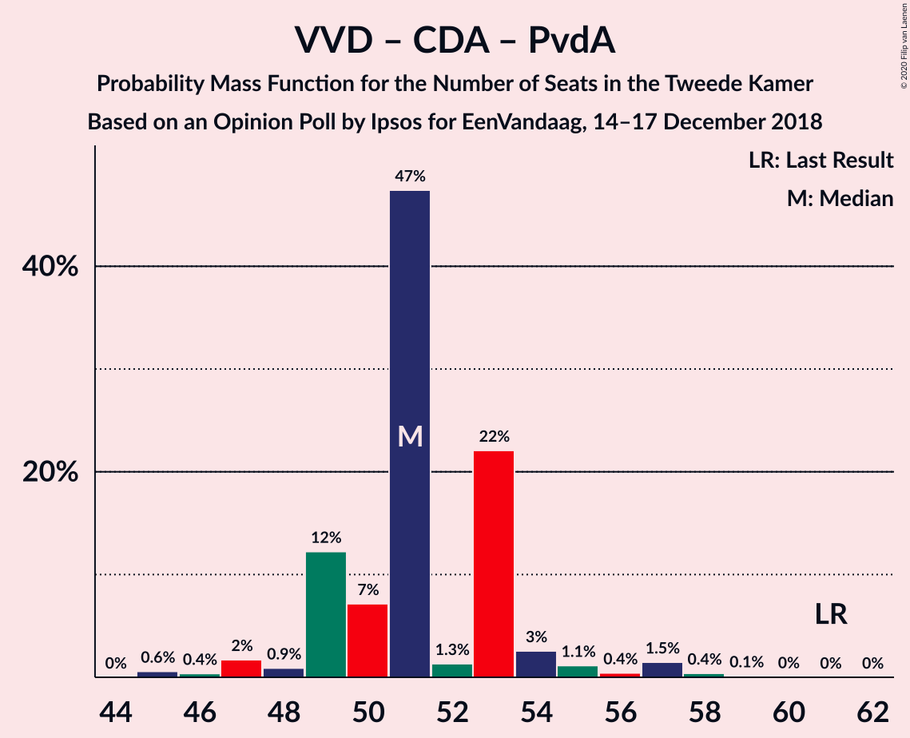

| Number of Seats | Probability | Accumulated | Special Marks |
|:---------------:|:-----------:|:-----------:|:-------------:|
| 45 | 0.1% | 100% |  |
| 46 | 0% | 99.8% |  |
| 47 | 0.2% | 99.8% |  |
| 48 | 0% | 99.7% |  |
| 49 | 0.2% | 99.6% |  |
| 50 | 0% | 99.4% |  |
| 51 | 98% | 99.3% | Median |
| 52 | 0.1% | 2% |  |
| 53 | 0.8% | 2% |  |
| 54 | 0.1% | 0.9% |  |
| 55 | 0.3% | 0.8% |  |
| 56 | 0% | 0.5% |  |
| 57 | 0.4% | 0.5% |  |
| 58 | 0% | 0.1% |  |
| 59 | 0% | 0% |  |
| 60 | 0% | 0% |  |
| 61 | 0% | 0% | Last Result |

### Volkspartij voor Vrijheid en Democratie – Christen-Democratisch Appèl

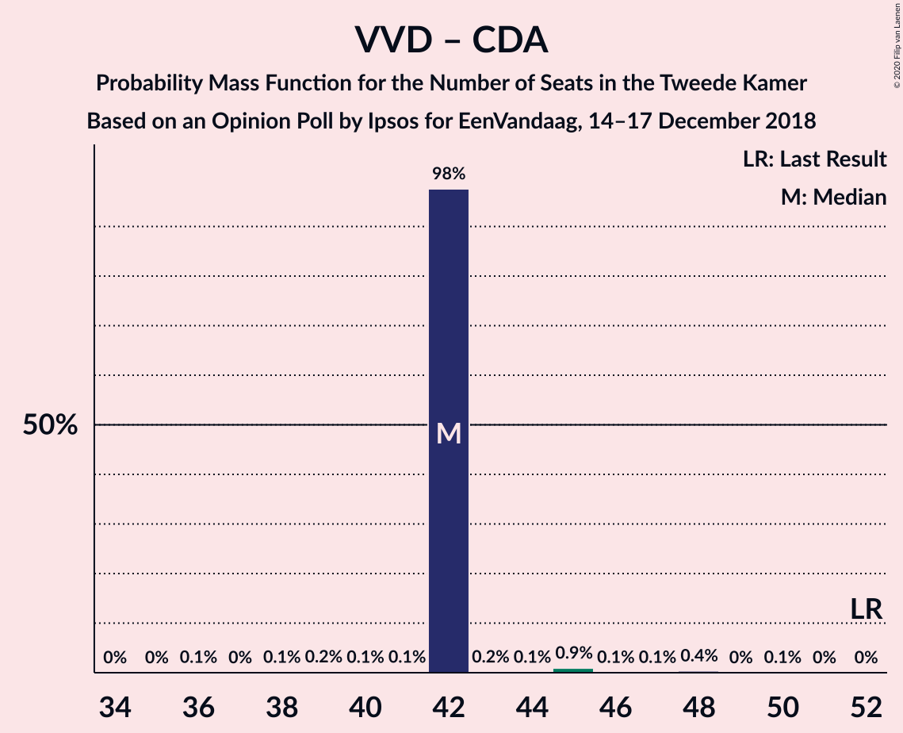

| Number of Seats | Probability | Accumulated | Special Marks |
|:---------------:|:-----------:|:-----------:|:-------------:|
| 36 | 0.1% | 100% |  |
| 37 | 0% | 99.9% |  |
| 38 | 0.1% | 99.9% |  |
| 39 | 0.2% | 99.8% |  |
| 40 | 0.1% | 99.6% |  |
| 41 | 0.1% | 99.5% |  |
| 42 | 98% | 99.4% | Median |
| 43 | 0.2% | 2% |  |
| 44 | 0.1% | 2% |  |
| 45 | 0.9% | 2% |  |
| 46 | 0.1% | 0.6% |  |
| 47 | 0.1% | 0.5% |  |
| 48 | 0.4% | 0.5% |  |
| 49 | 0% | 0.1% |  |
| 50 | 0.1% | 0.1% |  |
| 51 | 0% | 0% |  |
| 52 | 0% | 0% | Last Result |

### Volkspartij voor Vrijheid en Democratie – Partij van de Arbeid

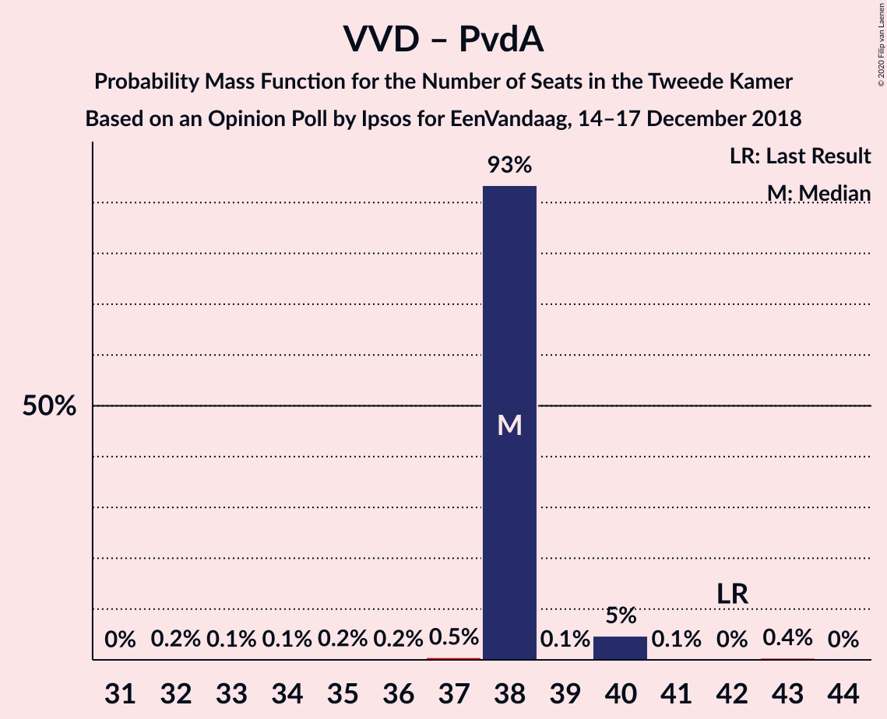

| Number of Seats | Probability | Accumulated | Special Marks |
|:---------------:|:-----------:|:-----------:|:-------------:|
| 32 | 0.2% | 100% |  |
| 33 | 0.1% | 99.8% |  |
| 34 | 0.1% | 99.7% |  |
| 35 | 0.2% | 99.6% |  |
| 36 | 0.2% | 99.4% |  |
| 37 | 0.5% | 99.3% |  |
| 38 | 93% | 98.8% | Median |
| 39 | 0.1% | 5% |  |
| 40 | 5% | 5% |  |
| 41 | 0.1% | 0.5% |  |
| 42 | 0% | 0.4% | Last Result |
| 43 | 0.4% | 0.4% |  |
| 44 | 0% | 0% |  |

### Christen-Democratisch Appèl – Democraten 66 – Partij van de Arbeid

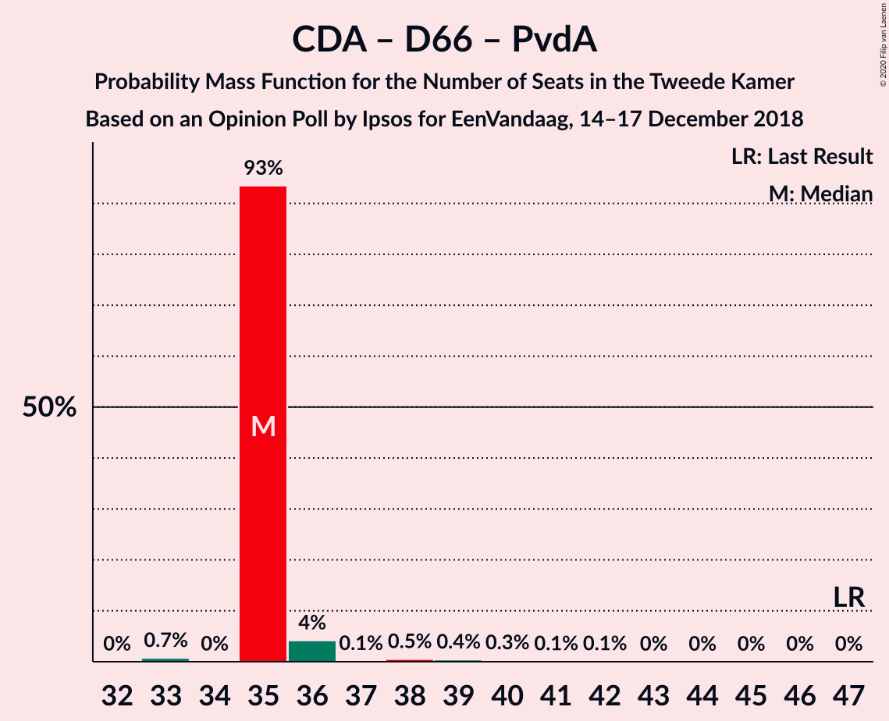

| Number of Seats | Probability | Accumulated | Special Marks |
|:---------------:|:-----------:|:-----------:|:-------------:|
| 32 | 0% | 100% |  |
| 33 | 0.7% | 99.9% |  |
| 34 | 0% | 99.2% |  |
| 35 | 93% | 99.2% | Median |
| 36 | 4% | 6% |  |
| 37 | 0.1% | 2% |  |
| 38 | 0.5% | 1.4% |  |
| 39 | 0.4% | 0.9% |  |
| 40 | 0.3% | 0.5% |  |
| 41 | 0.1% | 0.2% |  |
| 42 | 0.1% | 0.1% |  |
| 43 | 0% | 0% |  |
| 44 | 0% | 0% |  |
| 45 | 0% | 0% |  |
| 46 | 0% | 0% |  |
| 47 | 0% | 0% | Last Result |

### Christen-Democratisch Appèl – Partij van de Arbeid – ChristenUnie

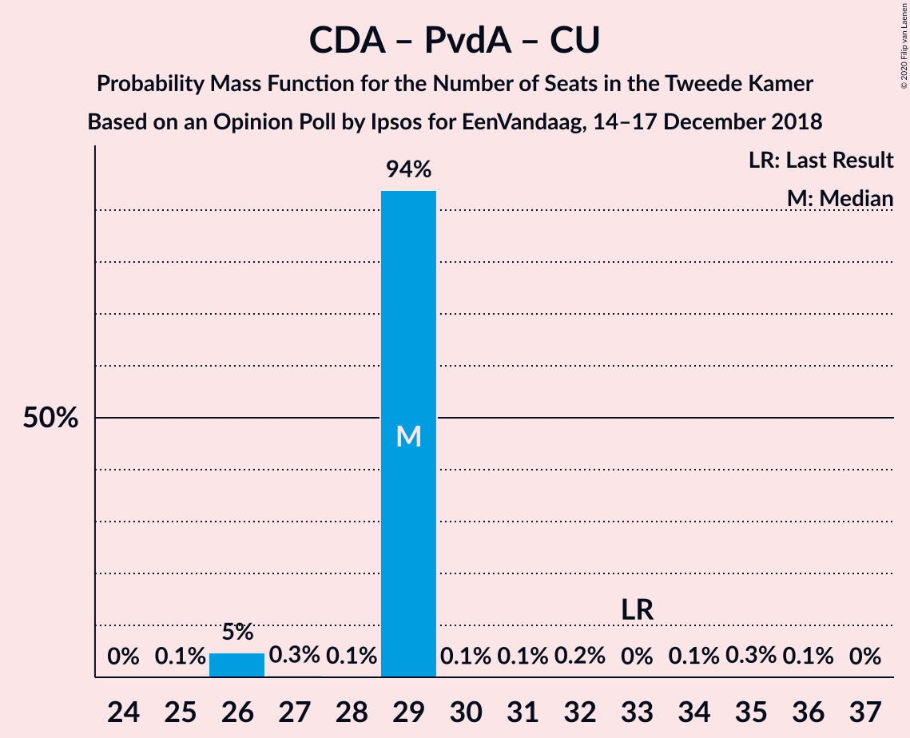

| Number of Seats | Probability | Accumulated | Special Marks |
|:---------------:|:-----------:|:-----------:|:-------------:|
| 25 | 0.1% | 100% |  |
| 26 | 5% | 99.9% |  |
| 27 | 0.3% | 95% |  |
| 28 | 0.1% | 95% |  |
| 29 | 94% | 95% | Median |
| 30 | 0.1% | 0.8% |  |
| 31 | 0.1% | 0.8% |  |
| 32 | 0.2% | 0.7% |  |
| 33 | 0% | 0.5% | Last Result |
| 34 | 0.1% | 0.5% |  |
| 35 | 0.3% | 0.4% |  |
| 36 | 0.1% | 0.1% |  |
| 37 | 0% | 0% |  |

### Christen-Democratisch Appèl – Democraten 66

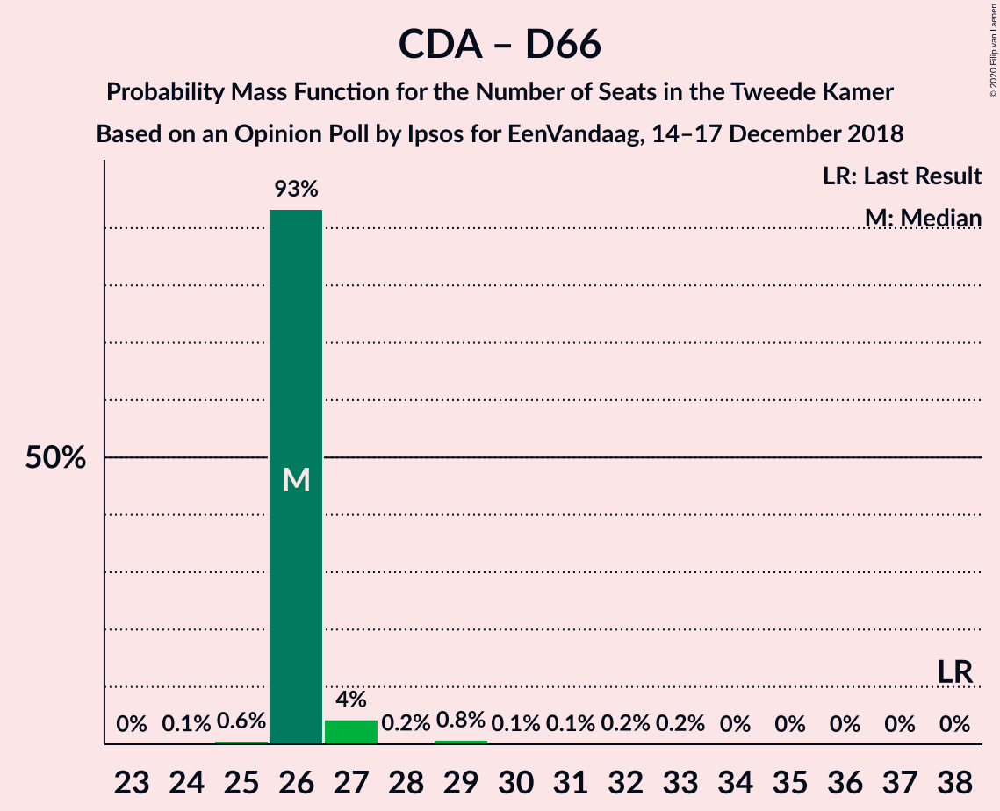

| Number of Seats | Probability | Accumulated | Special Marks |
|:---------------:|:-----------:|:-----------:|:-------------:|
| 24 | 0.1% | 100% |  |
| 25 | 0.6% | 99.9% |  |
| 26 | 93% | 99.3% | Median |
| 27 | 4% | 6% |  |
| 28 | 0.2% | 2% |  |
| 29 | 0.8% | 1.4% |  |
| 30 | 0.1% | 0.6% |  |
| 31 | 0.1% | 0.5% |  |
| 32 | 0.2% | 0.4% |  |
| 33 | 0.2% | 0.2% |  |
| 34 | 0% | 0% |  |
| 35 | 0% | 0% |  |
| 36 | 0% | 0% |  |
| 37 | 0% | 0% |  |
| 38 | 0% | 0% | Last Result |

### Christen-Democratisch Appèl – Partij van de Arbeid

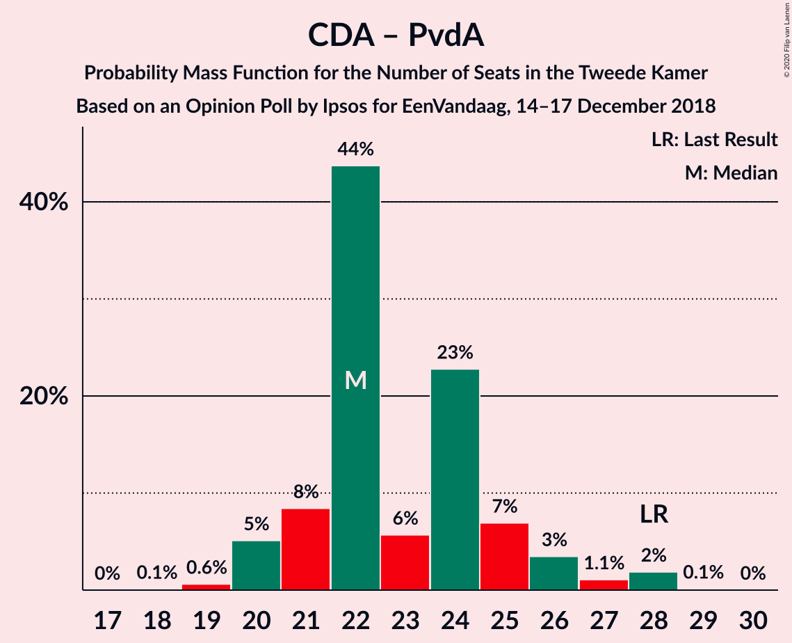

| Number of Seats | Probability | Accumulated | Special Marks |
|:---------------:|:-----------:|:-----------:|:-------------:|
| 18 | 0% | 100% |  |
| 19 | 0.2% | 99.9% |  |
| 20 | 4% | 99.8% |  |
| 21 | 0.7% | 96% |  |
| 22 | 93% | 95% | Median |
| 23 | 0.6% | 1.4% |  |
| 24 | 0.1% | 0.8% |  |
| 25 | 0% | 0.7% |  |
| 26 | 0.2% | 0.6% |  |
| 27 | 0% | 0.4% |  |
| 28 | 0.3% | 0.4% | Last Result |
| 29 | 0% | 0.1% |  |
| 30 | 0% | 0% |  |

## Technical Information

### Opinion Poll

+ **Polling firm:** Ipsos
+ **Commissioner(s):** EenVandaag
+ **Fieldwork period:** 14–17 December 2018

### Calculations

+ **Sample size:** 1013
+ **Simulations done:** 131,072
+ **Error estimate:** 2.79%

