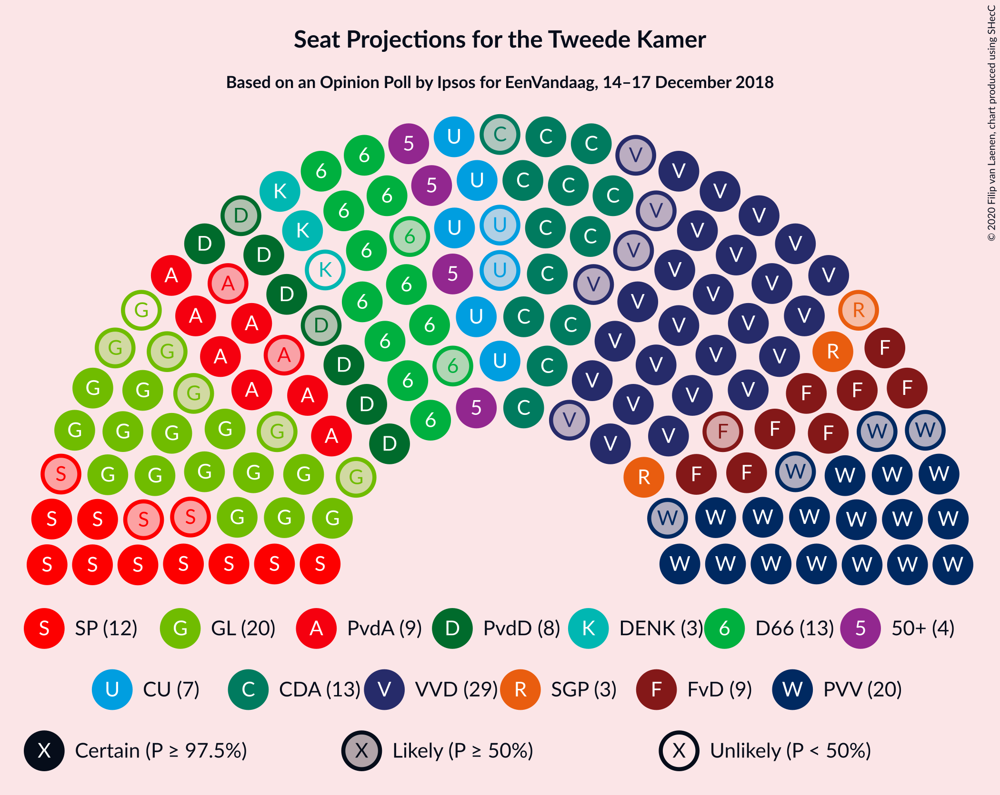
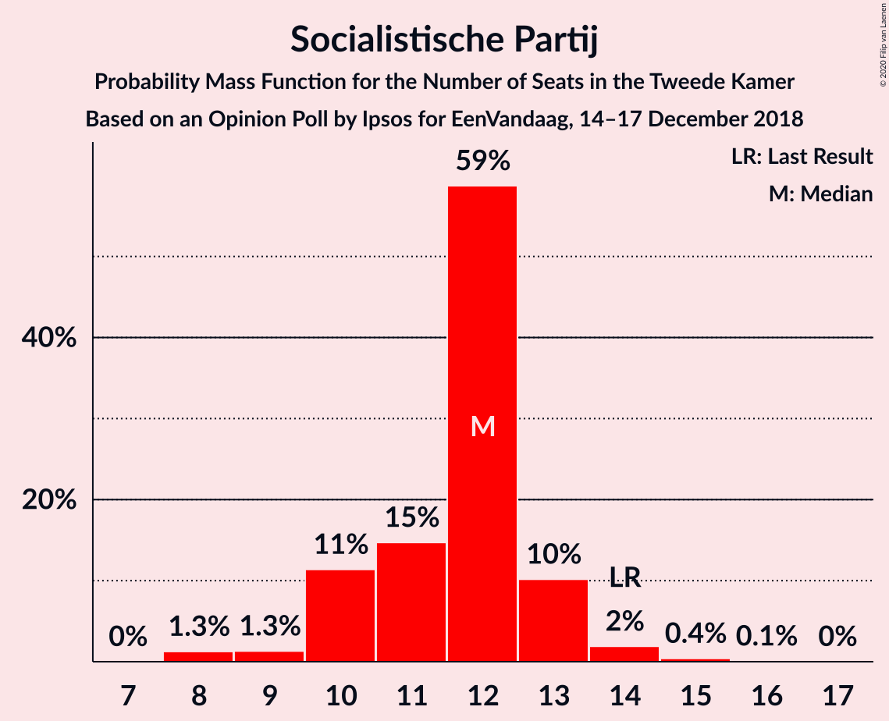
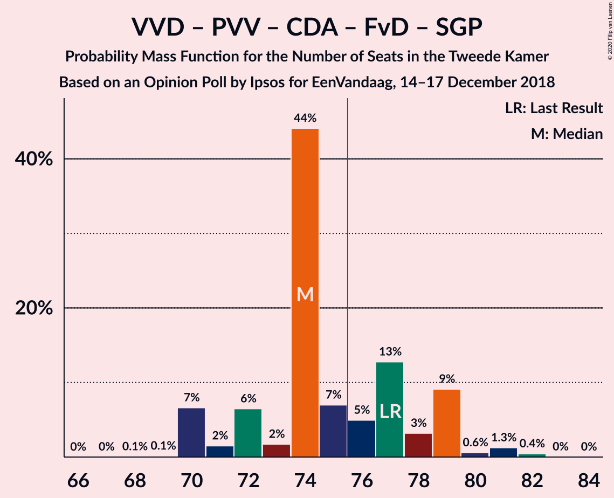
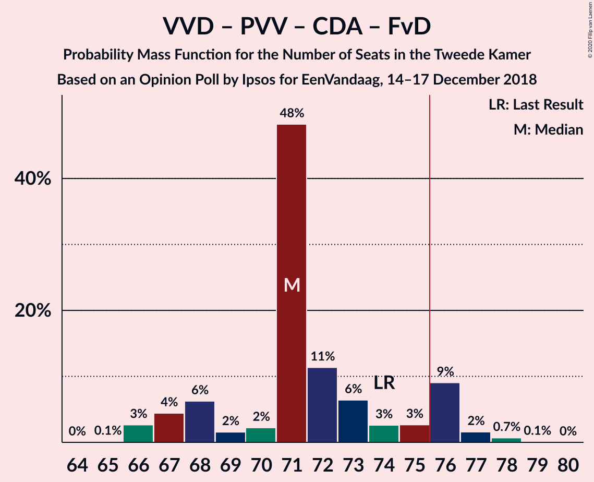
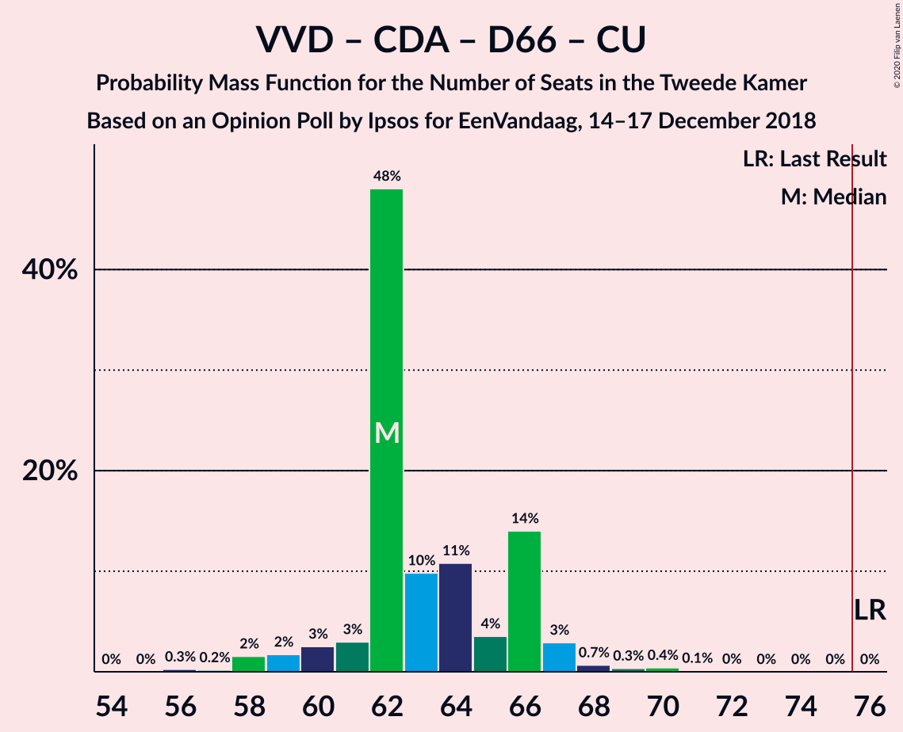
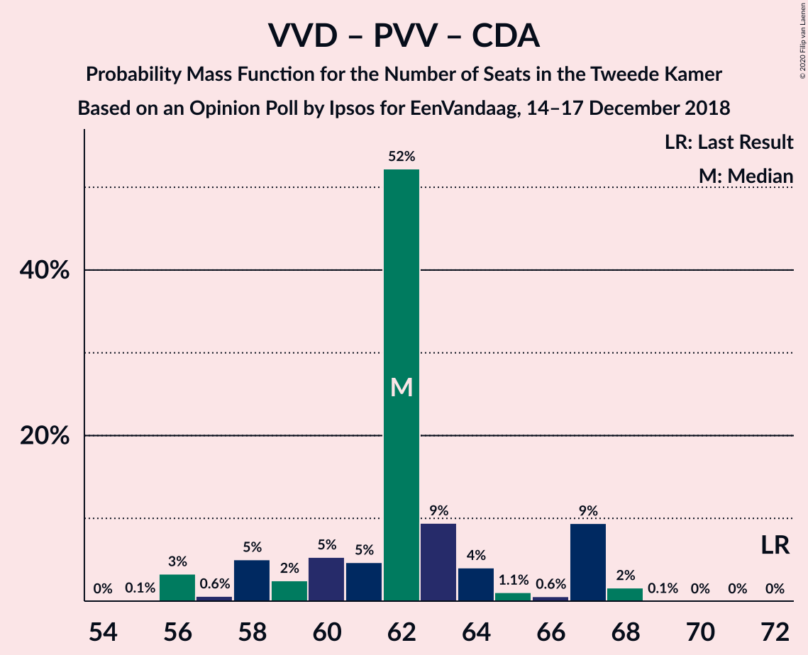
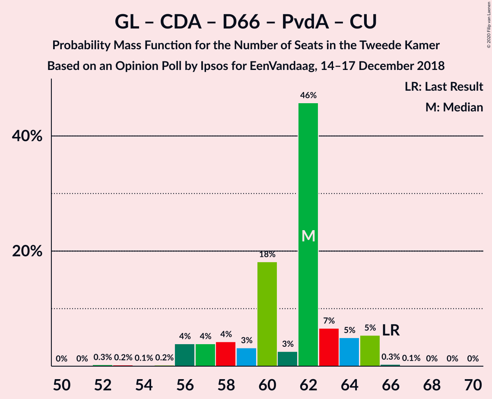
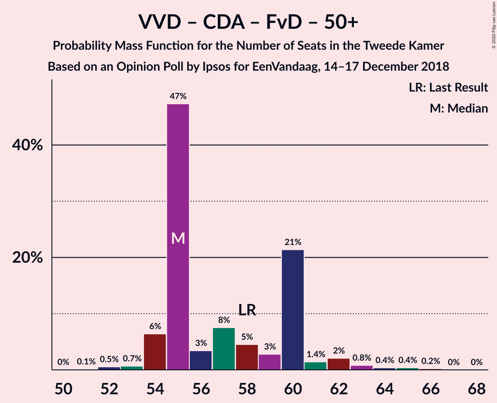
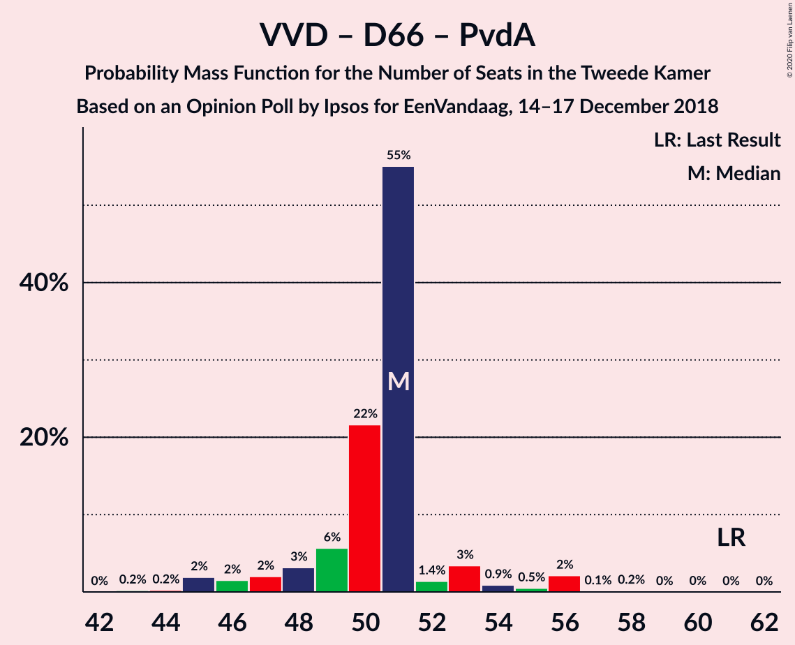
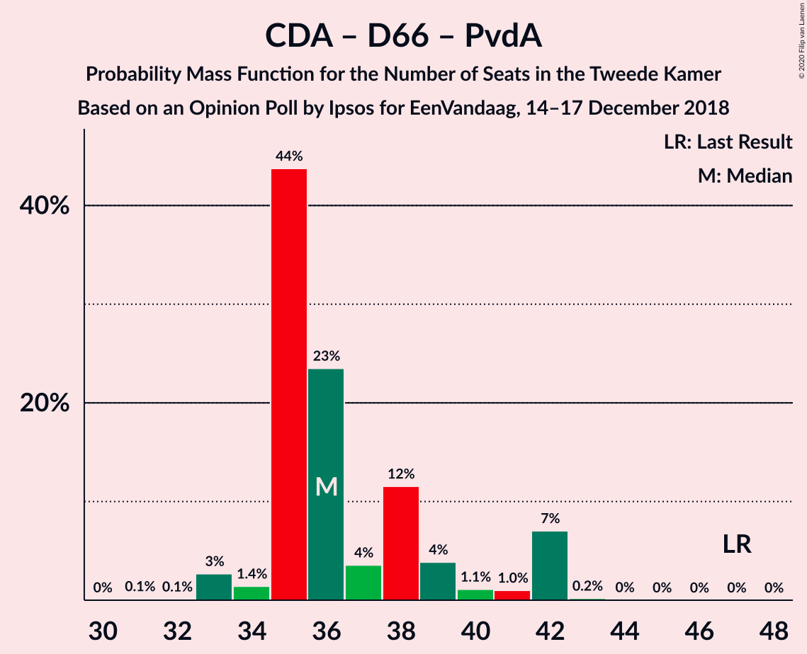

# Opinion Poll by Ipsos for EenVandaag, 14–17 December 2018

<a href="#voting-intentions">Voting Intentions</a> | <a href="#seats">Seats</a> | <a href="#coalitions">Coalitions</a> | <a href="#technical-information">Technical Information</a>

## Voting Intentions

### Confidence Intervals

| Party | Last Result | Poll Result | 80% Confidence Interval | 90% Confidence Interval | 95% Confidence Interval | 99% Confidence Interval |
|:-----:|:-----------:|:-----------:|:-----------------------:|:-----------------------:|:-----------------------:|:-----------------------:|
| Volkspartij voor Vrijheid en Democratie | 21.3% | 18.6% | 17.1–20.2% |16.6–20.7% |16.3–21.1% |15.6–21.9% |
| Partij voor de Vrijheid | 13.1% | 12.5% | 11.3–14.0% |10.9–14.4% |10.6–14.7% |10.1–15.4% |
| GroenLinks | 9.1% | 10.6% | 9.4–11.9% |9.1–12.3% |8.8–12.6% |8.3–13.3% |
| Christen-Democratisch Appèl | 12.4% | 9.6% | 8.5–10.9% |8.2–11.2% |7.9–11.6% |7.4–12.2% |
| Democraten 66 | 12.2% | 9.4% | 8.3–10.7% |8.0–11.0% |7.7–11.3% |7.2–12.0% |
| Socialistische Partij | 9.1% | 7.6% | 6.6–8.8% |6.4–9.1% |6.1–9.4% |5.7–10.0% |
| Forum voor Democratie | 1.8% | 6.9% | 6.0–8.0% |5.7–8.4% |5.5–8.6% |5.1–9.2% |
| Partij van de Arbeid | 5.7% | 5.8% | 5.0–6.9% |4.7–7.2% |4.5–7.5% |4.2–8.0% |
| Partij voor de Dieren | 3.2% | 5.5% | 4.7–6.6% |4.5–6.9% |4.3–7.1% |3.9–7.7% |
| ChristenUnie | 3.4% | 4.4% | 3.7–5.4% |3.5–5.7% |3.3–5.9% |3.0–6.4% |
| 50Plus | 3.1% | 3.7% | 3.0–4.5% |2.8–4.8% |2.7–5.0% |2.4–5.5% |
| Staatkundig Gereformeerde Partij | 2.1% | 2.5% | 1.9–3.2% |1.8–3.4% |1.7–3.6% |1.4–4.0% |
| DENK | 2.1% | 1.9% | 1.4–2.6% |1.3–2.7% |1.2–2.9% |1.0–3.3% |

*Note:* The poll result column reflects the actual value used in the calculations. Published results may vary slightly, and in addition be rounded to fewer digits.

## Seats

### Confidence Intervals

| Party | Last Result | Median | 80% Confidence Interval | 90% Confidence Interval | 95% Confidence Interval | 99% Confidence Interval |
|:-----:|:-----------:|:------:|:-----------------------:|:-----------------------:|:-----------------------:|:-----------------------:|
| <a href="#volkspartij-voor-vrijheid-en-democratie">Volkspartij voor Vrijheid en Democratie</a> | 33 | 29 | 26–29 |24–31 |24–31 |23–33 |
| <a href="#partij-voor-de-vrijheid">Partij voor de Vrijheid</a> | 20 | 20 | 18–21 |17–21 |16–22 |16–23 |
| <a href="#groenlinks">GroenLinks</a> | 14 | 19 | 16–20 |15–20 |14–20 |13–20 |
| <a href="#christen-democratisch-appèl">Christen-Democratisch Appèl</a> | 19 | 13 | 13–17 |13–17 |12–18 |11–18 |
| <a href="#democraten-66">Democraten 66</a> | 19 | 13 | 12–16 |12–16 |11–17 |11–17 |
| <a href="#socialistische-partij">Socialistische Partij</a> | 14 | 12 | 10–13 |10–13 |9–13 |8–15 |
| <a href="#forum-voor-democratie">Forum voor Democratie</a> | 2 | 9 | 9–10 |8–12 |8–12 |7–13 |
| <a href="#partij-van-de-arbeid">Partij van de Arbeid</a> | 9 | 9 | 7–9 |7–10 |7–10 |6–11 |
| <a href="#partij-voor-de-dieren">Partij voor de Dieren</a> | 5 | 8 | 7–10 |6–10 |6–10 |6–11 |
| <a href="#christenunie">ChristenUnie</a> | 5 | 7 | 6–8 |5–8 |5–8 |5–9 |
| <a href="#50plus">50Plus</a> | 4 | 4 | 4–6 |4–6 |4–7 |3–7 |
| <a href="#staatkundig-gereformeerde-partij">Staatkundig Gereformeerde Partij</a> | 3 | 3 | 3–4 |2–5 |2–5 |2–5 |
| <a href="#denk">DENK</a> | 3 | 2 | 2–3 |2–4 |2–4 |1–4 |

### Volkspartij voor Vrijheid en Democratie

*For a full overview of the results for this party, see the [Volkspartij voor Vrijheid en Democratie](party-volkspartijvoorvrijheidendemocratie.html) page.*

| Number of Seats | Probability | Accumulated | Special Marks |
|:---------------:|:-----------:|:-----------:|:-------------:|
| 22 | 0.2% | 100% |  |
| 23 | 0.6% | 99.8% |  |
| 24 | 5% | 99.1% |  |
| 25 | 3% | 95% |  |
| 26 | 8% | 92% |  |
| 27 | 4% | 84% |  |
| 28 | 5% | 81% |  |
| 29 | 68% | 76% | Median |
| 30 | 1.4% | 8% |  |
| 31 | 4% | 6% |  |
| 32 | 1.3% | 2% |  |
| 33 | 0.4% | 0.7% | Last Result |
| 34 | 0.2% | 0.2% |  |
| 35 | 0% | 0.1% |  |
| 36 | 0% | 0% |  |

### Partij voor de Vrijheid

*For a full overview of the results for this party, see the [Partij voor de Vrijheid](party-partijvoordevrijheid.html) page.*

| Number of Seats | Probability | Accumulated | Special Marks |
|:---------------:|:-----------:|:-----------:|:-------------:|
| 14 | 0.2% | 100% |  |
| 15 | 0.2% | 99.8% |  |
| 16 | 3% | 99.5% |  |
| 17 | 6% | 97% |  |
| 18 | 18% | 90% |  |
| 19 | 8% | 73% |  |
| 20 | 49% | 64% | Last Result, Median |
| 21 | 12% | 15% |  |
| 22 | 3% | 4% |  |
| 23 | 0.7% | 0.8% |  |
| 24 | 0.2% | 0.2% |  |
| 25 | 0% | 0% |  |

### GroenLinks

*For a full overview of the results for this party, see the [GroenLinks](party-groenlinks.html) page.*

| Number of Seats | Probability | Accumulated | Special Marks |
|:---------------:|:-----------:|:-----------:|:-------------:|
| 12 | 0.2% | 100% |  |
| 13 | 0.8% | 99.8% |  |
| 14 | 2% | 99.0% | Last Result |
| 15 | 5% | 97% |  |
| 16 | 24% | 92% |  |
| 17 | 12% | 67% |  |
| 18 | 4% | 55% |  |
| 19 | 9% | 52% | Median |
| 20 | 42% | 43% |  |
| 21 | 0.4% | 0.5% |  |
| 22 | 0% | 0% |  |

### Christen-Democratisch Appèl

*For a full overview of the results for this party, see the [Christen-Democratisch Appèl](party-christen-democratischappèl.html) page.*

| Number of Seats | Probability | Accumulated | Special Marks |
|:---------------:|:-----------:|:-----------:|:-------------:|
| 10 | 0.1% | 100% |  |
| 11 | 2% | 99.9% |  |
| 12 | 1.0% | 98% |  |
| 13 | 49% | 97% | Median |
| 14 | 8% | 47% |  |
| 15 | 13% | 39% |  |
| 16 | 10% | 26% |  |
| 17 | 13% | 16% |  |
| 18 | 3% | 4% |  |
| 19 | 0.3% | 0.4% | Last Result |
| 20 | 0% | 0% |  |

### Democraten 66

*For a full overview of the results for this party, see the [Democraten 66](party-democraten66.html) page.*

| Number of Seats | Probability | Accumulated | Special Marks |
|:---------------:|:-----------:|:-----------:|:-------------:|
| 10 | 0.3% | 100% |  |
| 11 | 2% | 99.7% |  |
| 12 | 16% | 97% |  |
| 13 | 46% | 81% | Median |
| 14 | 13% | 36% |  |
| 15 | 11% | 22% |  |
| 16 | 7% | 11% |  |
| 17 | 4% | 5% |  |
| 18 | 0.2% | 0.4% |  |
| 19 | 0.1% | 0.2% | Last Result |
| 20 | 0% | 0% |  |

### Socialistische Partij

*For a full overview of the results for this party, see the [Socialistische Partij](party-socialistischepartij.html) page.*

| Number of Seats | Probability | Accumulated | Special Marks |
|:---------------:|:-----------:|:-----------:|:-------------:|
| 8 | 1.3% | 100% |  |
| 9 | 1.3% | 98.7% |  |
| 10 | 11% | 97% |  |
| 11 | 15% | 86% |  |
| 12 | 59% | 71% | Median |
| 13 | 10% | 13% |  |
| 14 | 2% | 2% | Last Result |
| 15 | 0.4% | 0.5% |  |
| 16 | 0.1% | 0.1% |  |
| 17 | 0% | 0% |  |

### Forum voor Democratie

*For a full overview of the results for this party, see the [Forum voor Democratie](party-forumvoordemocratie.html) page.*

| Number of Seats | Probability | Accumulated | Special Marks |
|:---------------:|:-----------:|:-----------:|:-------------:|
| 2 | 0% | 100% | Last Result |
| 3 | 0% | 100% |  |
| 4 | 0% | 100% |  |
| 5 | 0% | 100% |  |
| 6 | 0% | 100% |  |
| 7 | 2% | 100% |  |
| 8 | 6% | 98% |  |
| 9 | 65% | 92% | Median |
| 10 | 18% | 27% |  |
| 11 | 5% | 10% |  |
| 12 | 4% | 5% |  |
| 13 | 1.0% | 1.2% |  |
| 14 | 0.1% | 0.2% |  |
| 15 | 0.1% | 0.1% |  |
| 16 | 0% | 0% |  |

### Partij van de Arbeid

*For a full overview of the results for this party, see the [Partij van de Arbeid](party-partijvandearbeid.html) page.*

| Number of Seats | Probability | Accumulated | Special Marks |
|:---------------:|:-----------:|:-----------:|:-------------:|
| 5 | 0.1% | 100% |  |
| 6 | 1.0% | 99.9% |  |
| 7 | 19% | 98.9% |  |
| 8 | 12% | 80% |  |
| 9 | 61% | 68% | Last Result, Median |
| 10 | 4% | 7% |  |
| 11 | 2% | 2% |  |
| 12 | 0.2% | 0.2% |  |
| 13 | 0% | 0.1% |  |
| 14 | 0% | 0% |  |

### Partij voor de Dieren

*For a full overview of the results for this party, see the [Partij voor de Dieren](party-partijvoordedieren.html) page.*

| Number of Seats | Probability | Accumulated | Special Marks |
|:---------------:|:-----------:|:-----------:|:-------------:|
| 5 | 0.2% | 100% | Last Result |
| 6 | 6% | 99.8% |  |
| 7 | 18% | 94% |  |
| 8 | 47% | 76% | Median |
| 9 | 19% | 29% |  |
| 10 | 8% | 10% |  |
| 11 | 2% | 2% |  |
| 12 | 0.4% | 0.4% |  |
| 13 | 0% | 0% |  |

### ChristenUnie

*For a full overview of the results for this party, see the [ChristenUnie](party-christenunie.html) page.*

| Number of Seats | Probability | Accumulated | Special Marks |
|:---------------:|:-----------:|:-----------:|:-------------:|
| 4 | 0.4% | 100% |  |
| 5 | 8% | 99.6% | Last Result |
| 6 | 20% | 91% |  |
| 7 | 57% | 71% | Median |
| 8 | 12% | 14% |  |
| 9 | 2% | 2% |  |
| 10 | 0.1% | 0.3% |  |
| 11 | 0.2% | 0.2% |  |
| 12 | 0% | 0% |  |

### 50Plus

*For a full overview of the results for this party, see the [50Plus](party-50plus.html) page.*

| Number of Seats | Probability | Accumulated | Special Marks |
|:---------------:|:-----------:|:-----------:|:-------------:|
| 3 | 0.7% | 100% |  |
| 4 | 53% | 99.3% | Last Result, Median |
| 5 | 21% | 46% |  |
| 6 | 22% | 25% |  |
| 7 | 3% | 4% |  |
| 8 | 0.3% | 0.4% |  |
| 9 | 0.1% | 0.1% |  |
| 10 | 0% | 0% |  |

### Staatkundig Gereformeerde Partij

*For a full overview of the results for this party, see the [Staatkundig Gereformeerde Partij](party-staatkundiggereformeerdepartij.html) page.*

| Number of Seats | Probability | Accumulated | Special Marks |
|:---------------:|:-----------:|:-----------:|:-------------:|
| 2 | 6% | 100% |  |
| 3 | 63% | 94% | Last Result, Median |
| 4 | 22% | 31% |  |
| 5 | 9% | 10% |  |
| 6 | 0.4% | 0.5% |  |
| 7 | 0% | 0% |  |

### DENK

*For a full overview of the results for this party, see the [DENK](party-denk.html) page.*

| Number of Seats | Probability | Accumulated | Special Marks |
|:---------------:|:-----------:|:-----------:|:-------------:|
| 1 | 0.8% | 100% |  |
| 2 | 53% | 99.2% | Median |
| 3 | 37% | 46% | Last Result |
| 4 | 9% | 10% |  |
| 5 | 0.5% | 0.5% |  |
| 6 | 0% | 0% |  |

## Coalitions

### Confidence Intervals

| Coalition | Last Result | Median | Majority? | 80% Confidence Interval | 90% Confidence Interval | 95% Confidence Interval | 99% Confidence Interval |
|:---------:|:-----------:|:------:|:---------:|:-----------------------:|:-----------------------:|:-----------------------:|:-----------------------:|
| Volkspartij voor Vrijheid en Democratie – GroenLinks – Christen-Democratisch Appèl – Democraten 66 – ChristenUnie | 90 | 82 | 98% | 77–83 | 77–85 | 76–85 | 74–85 |
| Volkspartij voor Vrijheid en Democratie – Partij voor de Vrijheid – Christen-Democratisch Appèl – Forum voor Democratie – Staatkundig Gereformeerde Partij | 77 | 74 | 32% | 72–79 | 70–79 | 70–79 | 70–81 |
| GroenLinks – Christen-Democratisch Appèl – Democraten 66 – Socialistische Partij – Partij van de Arbeid – ChristenUnie | 80 | 74 | 10% | 69–75 | 68–77 | 68–78 | 65–78 |
| Volkspartij voor Vrijheid en Democratie – Christen-Democratisch Appèl – Democraten 66 – Partij van de Arbeid – ChristenUnie | 85 | 71 | 3% | 70–73 | 69–74 | 67–77 | 67–78 |
| Volkspartij voor Vrijheid en Democratie – Partij voor de Vrijheid – Christen-Democratisch Appèl – Forum voor Democratie | 74 | 71 | 11% | 68–76 | 67–76 | 66–76 | 66–78 |
| Volkspartij voor Vrijheid en Democratie – Christen-Democratisch Appèl – Democraten 66 – ChristenUnie | 76 | 62 | 0% | 62–66 | 60–66 | 59–67 | 58–70 |
| Volkspartij voor Vrijheid en Democratie – Partij voor de Vrijheid – Christen-Democratisch Appèl | 72 | 62 | 0% | 59–67 | 58–67 | 56–67 | 56–68 |
| Volkspartij voor Vrijheid en Democratie – Christen-Democratisch Appèl – Forum voor Democratie – 50Plus – Staatkundig Gereformeerde Partij | 61 | 58 | 0% | 58–65 | 57–65 | 57–65 | 56–68 |
| GroenLinks – Christen-Democratisch Appèl – Democraten 66 – Partij van de Arbeid – ChristenUnie | 66 | 62 | 0% | 58–64 | 57–65 | 56–65 | 53–66 |
| Volkspartij voor Vrijheid en Democratie – Christen-Democratisch Appèl – Forum voor Democratie – 50Plus | 58 | 55 | 0% | 55–60 | 54–61 | 54–62 | 52–65 |
| Volkspartij voor Vrijheid en Democratie – Christen-Democratisch Appèl – Democraten 66 | 71 | 55 | 0% | 55–60 | 54–60 | 52–61 | 50–63 |
| Volkspartij voor Vrijheid en Democratie – Christen-Democratisch Appèl – Forum voor Democratie – Staatkundig Gereformeerde Partij | 57 | 54 | 0% | 54–59 | 52–59 | 52–60 | 51–62 |
| Volkspartij voor Vrijheid en Democratie – Christen-Democratisch Appèl – Forum voor Democratie | 54 | 51 | 0% | 50–55 | 49–56 | 49–57 | 48–60 |
| Volkspartij voor Vrijheid en Democratie – Christen-Democratisch Appèl – Partij van de Arbeid | 61 | 51 | 0% | 49–53 | 49–54 | 47–55 | 45–58 |
| Volkspartij voor Vrijheid en Democratie – Democraten 66 – Partij van de Arbeid | 61 | 51 | 0% | 49–51 | 47–53 | 46–55 | 45–56 |
| Volkspartij voor Vrijheid en Democratie – Christen-Democratisch Appèl | 52 | 42 | 0% | 40–46 | 40–46 | 39–47 | 38–49 |
| Christen-Democratisch Appèl – Democraten 66 – Partij van de Arbeid | 47 | 36 | 0% | 35–39 | 35–42 | 33–42 | 33–42 |
| Volkspartij voor Vrijheid en Democratie – Partij van de Arbeid | 42 | 38 | 0% | 34–38 | 33–39 | 33–40 | 31–42 |
| Christen-Democratisch Appèl – Partij van de Arbeid – ChristenUnie | 33 | 29 | 0% | 29–32 | 27–32 | 26–34 | 26–35 |
| Christen-Democratisch Appèl – Democraten 66 | 38 | 27 | 0% | 26–31 | 26–33 | 26–33 | 24–34 |
| Christen-Democratisch Appèl – Partij van de Arbeid | 28 | 22 | 0% | 21–25 | 20–26 | 20–27 | 19–28 |

### Volkspartij voor Vrijheid en Democratie – GroenLinks – Christen-Democratisch Appèl – Democraten 66 – ChristenUnie

| Number of Seats | Probability | Accumulated | Special Marks |
|:---------------:|:-----------:|:-----------:|:-------------:|
| 71 | 0.3% | 100% |  |
| 72 | 0.1% | 99.7% |  |
| 73 | 0.1% | 99.6% |  |
| 74 | 0.2% | 99.5% |  |
| 75 | 2% | 99.4% |  |
| 76 | 1.4% | 98% | Majority |
| 77 | 7% | 96% |  |
| 78 | 4% | 90% |  |
| 79 | 3% | 86% |  |
| 80 | 14% | 83% |  |
| 81 | 6% | 69% | Median |
| 82 | 53% | 63% |  |
| 83 | 4% | 10% |  |
| 84 | 0.7% | 7% |  |
| 85 | 6% | 6% |  |
| 86 | 0.1% | 0.3% |  |
| 87 | 0.2% | 0.2% |  |
| 88 | 0% | 0% |  |
| 89 | 0% | 0% |  |
| 90 | 0% | 0% | Last Result |

### Volkspartij voor Vrijheid en Democratie – Partij voor de Vrijheid – Christen-Democratisch Appèl – Forum voor Democratie – Staatkundig Gereformeerde Partij

| Number of Seats | Probability | Accumulated | Special Marks |
|:---------------:|:-----------:|:-----------:|:-------------:|
| 68 | 0.1% | 100% |  |
| 69 | 0.1% | 99.9% |  |
| 70 | 7% | 99.8% |  |
| 71 | 2% | 93% |  |
| 72 | 6% | 92% |  |
| 73 | 2% | 85% |  |
| 74 | 44% | 83% | Median |
| 75 | 7% | 39% |  |
| 76 | 5% | 32% | Majority |
| 77 | 13% | 27% | Last Result |
| 78 | 3% | 15% |  |
| 79 | 9% | 11% |  |
| 80 | 0.6% | 2% |  |
| 81 | 1.3% | 2% |  |
| 82 | 0.4% | 0.5% |  |
| 83 | 0% | 0.1% |  |
| 84 | 0% | 0% |  |

### GroenLinks – Christen-Democratisch Appèl – Democraten 66 – Socialistische Partij – Partij van de Arbeid – ChristenUnie

| Number of Seats | Probability | Accumulated | Special Marks |
|:---------------:|:-----------:|:-----------:|:-------------:|
| 64 | 0.3% | 100% |  |
| 65 | 0.3% | 99.7% |  |
| 66 | 0.2% | 99.3% |  |
| 67 | 0.5% | 99.1% |  |
| 68 | 5% | 98.5% |  |
| 69 | 6% | 94% |  |
| 70 | 11% | 88% |  |
| 71 | 9% | 78% |  |
| 72 | 4% | 69% |  |
| 73 | 4% | 65% | Median |
| 74 | 45% | 61% |  |
| 75 | 7% | 16% |  |
| 76 | 3% | 10% | Majority |
| 77 | 2% | 6% |  |
| 78 | 4% | 4% |  |
| 79 | 0% | 0% |  |
| 80 | 0% | 0% | Last Result |

### Volkspartij voor Vrijheid en Democratie – Christen-Democratisch Appèl – Democraten 66 – Partij van de Arbeid – ChristenUnie

| Number of Seats | Probability | Accumulated | Special Marks |
|:---------------:|:-----------:|:-----------:|:-------------:|
| 64 | 0% | 100% |  |
| 65 | 0% | 99.9% |  |
| 66 | 0.3% | 99.9% |  |
| 67 | 3% | 99.7% |  |
| 68 | 1.1% | 97% |  |
| 69 | 2% | 96% |  |
| 70 | 8% | 93% |  |
| 71 | 45% | 85% | Median |
| 72 | 12% | 40% |  |
| 73 | 21% | 28% |  |
| 74 | 2% | 7% |  |
| 75 | 2% | 5% |  |
| 76 | 0.7% | 3% | Majority |
| 77 | 1.4% | 3% |  |
| 78 | 0.9% | 1.1% |  |
| 79 | 0.2% | 0.3% |  |
| 80 | 0.1% | 0.1% |  |
| 81 | 0% | 0% |  |
| 82 | 0% | 0% |  |
| 83 | 0% | 0% |  |
| 84 | 0% | 0% |  |
| 85 | 0% | 0% | Last Result |

### Volkspartij voor Vrijheid en Democratie – Partij voor de Vrijheid – Christen-Democratisch Appèl – Forum voor Democratie

| Number of Seats | Probability | Accumulated | Special Marks |
|:---------------:|:-----------:|:-----------:|:-------------:|
| 65 | 0.1% | 100% |  |
| 66 | 3% | 99.9% |  |
| 67 | 4% | 97% |  |
| 68 | 6% | 93% |  |
| 69 | 2% | 87% |  |
| 70 | 2% | 85% |  |
| 71 | 48% | 83% | Median |
| 72 | 11% | 35% |  |
| 73 | 6% | 23% |  |
| 74 | 3% | 17% | Last Result |
| 75 | 3% | 14% |  |
| 76 | 9% | 11% | Majority |
| 77 | 2% | 2% |  |
| 78 | 0.7% | 0.8% |  |
| 79 | 0.1% | 0.1% |  |
| 80 | 0% | 0% |  |

### Volkspartij voor Vrijheid en Democratie – Christen-Democratisch Appèl – Democraten 66 – ChristenUnie

| Number of Seats | Probability | Accumulated | Special Marks |
|:---------------:|:-----------:|:-----------:|:-------------:|
| 56 | 0.3% | 100% |  |
| 57 | 0.2% | 99.7% |  |
| 58 | 2% | 99.5% |  |
| 59 | 2% | 98% |  |
| 60 | 3% | 96% |  |
| 61 | 3% | 94% |  |
| 62 | 48% | 91% | Median |
| 63 | 10% | 43% |  |
| 64 | 11% | 33% |  |
| 65 | 4% | 22% |  |
| 66 | 14% | 19% |  |
| 67 | 3% | 5% |  |
| 68 | 0.7% | 2% |  |
| 69 | 0.3% | 0.9% |  |
| 70 | 0.4% | 0.6% |  |
| 71 | 0.1% | 0.2% |  |
| 72 | 0% | 0% |  |
| 73 | 0% | 0% |  |
| 74 | 0% | 0% |  |
| 75 | 0% | 0% |  |
| 76 | 0% | 0% | Last Result, Majority |

### Volkspartij voor Vrijheid en Democratie – Partij voor de Vrijheid – Christen-Democratisch Appèl

| Number of Seats | Probability | Accumulated | Special Marks |
|:---------------:|:-----------:|:-----------:|:-------------:|
| 55 | 0.1% | 100% |  |
| 56 | 3% | 99.9% |  |
| 57 | 0.6% | 97% |  |
| 58 | 5% | 96% |  |
| 59 | 2% | 91% |  |
| 60 | 5% | 88% |  |
| 61 | 5% | 83% |  |
| 62 | 52% | 78% | Median |
| 63 | 9% | 26% |  |
| 64 | 4% | 17% |  |
| 65 | 1.1% | 13% |  |
| 66 | 0.6% | 12% |  |
| 67 | 9% | 11% |  |
| 68 | 2% | 2% |  |
| 69 | 0.1% | 0.1% |  |
| 70 | 0% | 0% |  |
| 71 | 0% | 0% |  |
| 72 | 0% | 0% | Last Result |

### Volkspartij voor Vrijheid en Democratie – Christen-Democratisch Appèl – Forum voor Democratie – 50Plus – Staatkundig Gereformeerde Partij

| Number of Seats | Probability | Accumulated | Special Marks |
|:---------------:|:-----------:|:-----------:|:-------------:|
| 55 | 0.2% | 100% |  |
| 56 | 0.8% | 99.8% |  |
| 57 | 5% | 98.9% |  |
| 58 | 47% | 94% | Median |
| 59 | 4% | 47% |  |
| 60 | 3% | 43% |  |
| 61 | 8% | 40% | Last Result |
| 62 | 5% | 32% |  |
| 63 | 10% | 27% |  |
| 64 | 4% | 16% |  |
| 65 | 10% | 12% |  |
| 66 | 0.8% | 2% |  |
| 67 | 0.7% | 1.2% |  |
| 68 | 0.3% | 0.6% |  |
| 69 | 0.1% | 0.2% |  |
| 70 | 0.1% | 0.1% |  |
| 71 | 0% | 0% |  |

### GroenLinks – Christen-Democratisch Appèl – Democraten 66 – Partij van de Arbeid – ChristenUnie

| Number of Seats | Probability | Accumulated | Special Marks |
|:---------------:|:-----------:|:-----------:|:-------------:|
| 52 | 0.3% | 100% |  |
| 53 | 0.2% | 99.7% |  |
| 54 | 0.1% | 99.5% |  |
| 55 | 0.2% | 99.4% |  |
| 56 | 4% | 99.2% |  |
| 57 | 4% | 95% |  |
| 58 | 4% | 91% |  |
| 59 | 3% | 87% |  |
| 60 | 18% | 84% |  |
| 61 | 3% | 66% | Median |
| 62 | 46% | 63% |  |
| 63 | 7% | 17% |  |
| 64 | 5% | 11% |  |
| 65 | 5% | 6% |  |
| 66 | 0.3% | 0.5% | Last Result |
| 67 | 0.1% | 0.2% |  |
| 68 | 0% | 0.1% |  |
| 69 | 0% | 0% |  |

### Volkspartij voor Vrijheid en Democratie – Christen-Democratisch Appèl – Forum voor Democratie – 50Plus

| Number of Seats | Probability | Accumulated | Special Marks |
|:---------------:|:-----------:|:-----------:|:-------------:|
| 51 | 0.1% | 100% |  |
| 52 | 0.5% | 99.8% |  |
| 53 | 0.7% | 99.3% |  |
| 54 | 6% | 98.6% |  |
| 55 | 47% | 92% | Median |
| 56 | 3% | 45% |  |
| 57 | 8% | 41% |  |
| 58 | 5% | 34% | Last Result |
| 59 | 3% | 29% |  |
| 60 | 21% | 27% |  |
| 61 | 1.4% | 5% |  |
| 62 | 2% | 4% |  |
| 63 | 0.8% | 2% |  |
| 64 | 0.4% | 1.0% |  |
| 65 | 0.4% | 0.6% |  |
| 66 | 0.2% | 0.2% |  |
| 67 | 0% | 0% |  |

### Volkspartij voor Vrijheid en Democratie – Christen-Democratisch Appèl – Democraten 66

| Number of Seats | Probability | Accumulated | Special Marks |
|:---------------:|:-----------:|:-----------:|:-------------:|
| 49 | 0.2% | 100% |  |
| 50 | 1.3% | 99.8% |  |
| 51 | 0.9% | 98.6% |  |
| 52 | 0.2% | 98% |  |
| 53 | 1.4% | 97% |  |
| 54 | 2% | 96% |  |
| 55 | 44% | 94% | Median |
| 56 | 16% | 50% |  |
| 57 | 12% | 34% |  |
| 58 | 8% | 22% |  |
| 59 | 0.3% | 14% |  |
| 60 | 9% | 13% |  |
| 61 | 4% | 5% |  |
| 62 | 0.5% | 1.0% |  |
| 63 | 0.5% | 0.5% |  |
| 64 | 0% | 0.1% |  |
| 65 | 0% | 0% |  |
| 66 | 0% | 0% |  |
| 67 | 0% | 0% |  |
| 68 | 0% | 0% |  |
| 69 | 0% | 0% |  |
| 70 | 0% | 0% |  |
| 71 | 0% | 0% | Last Result |

### Volkspartij voor Vrijheid en Democratie – Christen-Democratisch Appèl – Forum voor Democratie – Staatkundig Gereformeerde Partij

| Number of Seats | Probability | Accumulated | Special Marks |
|:---------------:|:-----------:|:-----------:|:-------------:|
| 49 | 0% | 100% |  |
| 50 | 0.2% | 99.9% |  |
| 51 | 0.8% | 99.7% |  |
| 52 | 5% | 99.0% |  |
| 53 | 3% | 94% |  |
| 54 | 47% | 90% | Median |
| 55 | 10% | 44% |  |
| 56 | 3% | 34% |  |
| 57 | 4% | 31% | Last Result |
| 58 | 12% | 26% |  |
| 59 | 10% | 14% |  |
| 60 | 2% | 4% |  |
| 61 | 1.1% | 2% |  |
| 62 | 1.1% | 1.4% |  |
| 63 | 0.2% | 0.3% |  |
| 64 | 0.1% | 0.1% |  |
| 65 | 0% | 0.1% |  |
| 66 | 0% | 0% |  |

### Volkspartij voor Vrijheid en Democratie – Christen-Democratisch Appèl – Forum voor Democratie

| Number of Seats | Probability | Accumulated | Special Marks |
|:---------------:|:-----------:|:-----------:|:-------------:|
| 46 | 0.1% | 100% |  |
| 47 | 0.2% | 99.9% |  |
| 48 | 1.1% | 99.7% |  |
| 49 | 6% | 98.6% |  |
| 50 | 4% | 92% |  |
| 51 | 52% | 88% | Median |
| 52 | 4% | 36% |  |
| 53 | 3% | 32% |  |
| 54 | 14% | 29% | Last Result |
| 55 | 11% | 16% |  |
| 56 | 1.0% | 5% |  |
| 57 | 2% | 4% |  |
| 58 | 1.0% | 2% |  |
| 59 | 0.2% | 0.7% |  |
| 60 | 0.5% | 0.5% |  |
| 61 | 0% | 0% |  |

### Volkspartij voor Vrijheid en Democratie – Christen-Democratisch Appèl – Partij van de Arbeid

| Number of Seats | Probability | Accumulated | Special Marks |
|:---------------:|:-----------:|:-----------:|:-------------:|
| 45 | 0.6% | 100% |  |
| 46 | 0.4% | 99.4% |  |
| 47 | 2% | 99.0% |  |
| 48 | 0.9% | 97% |  |
| 49 | 12% | 96% |  |
| 50 | 7% | 84% |  |
| 51 | 47% | 77% | Median |
| 52 | 1.3% | 30% |  |
| 53 | 22% | 28% |  |
| 54 | 3% | 6% |  |
| 55 | 1.1% | 4% |  |
| 56 | 0.4% | 2% |  |
| 57 | 1.5% | 2% |  |
| 58 | 0.4% | 0.6% |  |
| 59 | 0.1% | 0.2% |  |
| 60 | 0% | 0% |  |
| 61 | 0% | 0% | Last Result |

### Volkspartij voor Vrijheid en Democratie – Democraten 66 – Partij van de Arbeid

| Number of Seats | Probability | Accumulated | Special Marks |
|:---------------:|:-----------:|:-----------:|:-------------:|
| 43 | 0.2% | 100% |  |
| 44 | 0.2% | 99.8% |  |
| 45 | 2% | 99.6% |  |
| 46 | 2% | 98% |  |
| 47 | 2% | 96% |  |
| 48 | 3% | 94% |  |
| 49 | 6% | 91% |  |
| 50 | 22% | 85% |  |
| 51 | 55% | 64% | Median |
| 52 | 1.4% | 9% |  |
| 53 | 3% | 7% |  |
| 54 | 0.9% | 4% |  |
| 55 | 0.5% | 3% |  |
| 56 | 2% | 2% |  |
| 57 | 0.1% | 0.3% |  |
| 58 | 0.2% | 0.2% |  |
| 59 | 0% | 0% |  |
| 60 | 0% | 0% |  |
| 61 | 0% | 0% | Last Result |

### Volkspartij voor Vrijheid en Democratie – Christen-Democratisch Appèl

| Number of Seats | Probability | Accumulated | Special Marks |
|:---------------:|:-----------:|:-----------:|:-------------:|
| 36 | 0.1% | 100% |  |
| 37 | 0.4% | 99.9% |  |
| 38 | 2% | 99.5% |  |
| 39 | 1.2% | 98% |  |
| 40 | 7% | 97% |  |
| 41 | 7% | 90% |  |
| 42 | 46% | 83% | Median |
| 43 | 7% | 37% |  |
| 44 | 10% | 30% |  |
| 45 | 7% | 19% |  |
| 46 | 9% | 13% |  |
| 47 | 2% | 3% |  |
| 48 | 0.5% | 1.1% |  |
| 49 | 0.5% | 0.6% |  |
| 50 | 0.1% | 0.1% |  |
| 51 | 0% | 0% |  |
| 52 | 0% | 0% | Last Result |

### Christen-Democratisch Appèl – Democraten 66 – Partij van de Arbeid

| Number of Seats | Probability | Accumulated | Special Marks |
|:---------------:|:-----------:|:-----------:|:-------------:|
| 31 | 0.1% | 100% |  |
| 32 | 0.1% | 99.8% |  |
| 33 | 3% | 99.7% |  |
| 34 | 1.4% | 97% |  |
| 35 | 44% | 96% | Median |
| 36 | 23% | 52% |  |
| 37 | 4% | 28% |  |
| 38 | 12% | 25% |  |
| 39 | 4% | 13% |  |
| 40 | 1.1% | 9% |  |
| 41 | 1.0% | 8% |  |
| 42 | 7% | 7% |  |
| 43 | 0.2% | 0.3% |  |
| 44 | 0% | 0.1% |  |
| 45 | 0% | 0% |  |
| 46 | 0% | 0% |  |
| 47 | 0% | 0% | Last Result |

### Volkspartij voor Vrijheid en Democratie – Partij van de Arbeid

| Number of Seats | Probability | Accumulated | Special Marks |
|:---------------:|:-----------:|:-----------:|:-------------:|
| 30 | 0.2% | 100% |  |
| 31 | 0.3% | 99.8% |  |
| 32 | 1.3% | 99.5% |  |
| 33 | 6% | 98% |  |
| 34 | 3% | 92% |  |
| 35 | 4% | 89% |  |
| 36 | 19% | 84% |  |
| 37 | 7% | 65% |  |
| 38 | 52% | 59% | Median |
| 39 | 3% | 6% |  |
| 40 | 2% | 4% |  |
| 41 | 0.7% | 1.4% |  |
| 42 | 0.3% | 0.7% | Last Result |
| 43 | 0.4% | 0.4% |  |
| 44 | 0% | 0% |  |

### Christen-Democratisch Appèl – Partij van de Arbeid – ChristenUnie

| Number of Seats | Probability | Accumulated | Special Marks |
|:---------------:|:-----------:|:-----------:|:-------------:|
| 24 | 0.1% | 100% |  |
| 25 | 0.2% | 99.9% |  |
| 26 | 3% | 99.7% |  |
| 27 | 2% | 96% |  |
| 28 | 3% | 94% |  |
| 29 | 56% | 91% | Median |
| 30 | 12% | 35% |  |
| 31 | 11% | 23% |  |
| 32 | 8% | 12% |  |
| 33 | 0.6% | 4% | Last Result |
| 34 | 2% | 4% |  |
| 35 | 1.4% | 2% |  |
| 36 | 0.3% | 0.3% |  |
| 37 | 0% | 0% |  |

### Christen-Democratisch Appèl – Democraten 66

| Number of Seats | Probability | Accumulated | Special Marks |
|:---------------:|:-----------:|:-----------:|:-------------:|
| 23 | 0.2% | 100% |  |
| 24 | 0.5% | 99.8% |  |
| 25 | 2% | 99.3% |  |
| 26 | 44% | 98% | Median |
| 27 | 11% | 53% |  |
| 28 | 11% | 42% |  |
| 29 | 9% | 32% |  |
| 30 | 5% | 23% |  |
| 31 | 10% | 18% |  |
| 32 | 2% | 7% |  |
| 33 | 4% | 6% |  |
| 34 | 1.4% | 2% |  |
| 35 | 0% | 0.1% |  |
| 36 | 0.1% | 0.1% |  |
| 37 | 0% | 0% |  |
| 38 | 0% | 0% | Last Result |

### Christen-Democratisch Appèl – Partij van de Arbeid

| Number of Seats | Probability | Accumulated | Special Marks |
|:---------------:|:-----------:|:-----------:|:-------------:|
| 18 | 0.1% | 100% |  |
| 19 | 0.6% | 99.9% |  |
| 20 | 5% | 99.3% |  |
| 21 | 8% | 94% |  |
| 22 | 44% | 86% | Median |
| 23 | 6% | 42% |  |
| 24 | 23% | 36% |  |
| 25 | 7% | 14% |  |
| 26 | 3% | 7% |  |
| 27 | 1.1% | 3% |  |
| 28 | 2% | 2% | Last Result |
| 29 | 0.1% | 0.2% |  |
| 30 | 0% | 0% |  |

## Technical Information

### Opinion Poll

+ **Polling firm:** Ipsos
+ **Commissioner(s):** EenVandaag
+ **Fieldwork period:** 14–17 December 2018

### Calculations

+ **Sample size:** 1013
+ **Simulations done:** 1,048,576
+ **Error estimate:** 2.41%

